# KINSHASA MOSOLO {.unnumbered}

{width=170mm}

**Sovereign Revenue Maximisation Operating System for the City Province of Kinshasa**

*Plateforme unique de recensement, de géolocalisation, de gestion, de paiement, de contrôle et de maximisation des recettes de la Ville Province de Kinshasa*

> « Une ville, un contribuable, une donnée, une quittance. »

**RECENSER → IDENTIFIER → GÉOLOCALISER → QUALIFIER → CALCULER → NOTIFIER → PAYER → RAPPROCHER → QUITTANCER → CONTRÔLER → RECOUVRER → AUDITER → PLANIFIER**

| Rubrique | Contenu |
|---|---|
| Document | Document maître unique — conception, exigences produit, architecture, gouvernance, financement et mise en œuvre (47 chapitres, conclusion stratégique et annexes) |
| Version | 3.0 — 26 septembre 2026 |
| Statut | Document de travail soumis à validation juridique provinciale. **Aucune règle, aucun taux, aucune pénalité et aucune projection financière contenus dans ce document ne peuvent entrer en production avant certification par les services juridiques compétents et approbation par l'autorité compétente.** |
| Bénéficiaires institutionnels | Gouvernement provincial de Kinshasa ; Direction générale des impôts provinciaux de Kinshasa (DGIPK) ; Direction générale des recettes de Kinshasa (DGRK) ; ministères et services provinciaux légalement responsables de recettes spécifiques ; communes et autres entités publiques autorisées, lorsque la loi le prévoit |
| Destinataires | Gouverneur et Gouvernement provincial ; régies financières ; services juridiques ; Trésor et finances ; audit et inspection ; partenaires de mise en œuvre ; architectes, développeurs, testeurs |
| Documents compagnons | Cahier des exigences consolidé v2.9 (24 septembre 2026) ; Spécification fonctionnelle des 81 modules et 16 verticales v1.2 ; Dossier Gouverneur v1.0 ; Note exécutive au Gouverneur (24 septembre 2026). **En cas de divergence, le présent document prévaut** (Annexe D). |
| Identité visuelle | Visuel de couverture officiel de la Ville de Kinshasa (logo, liseré tricolore, silhouette de la ville), reproduit sans modification ; couleurs de la charte de la Ville |
| Préparé par | Groupe Nseya Digital / JNN Global Ltd, pour le compte du programme KINSHASA MOSOLO |

## Conventions de lecture {.unnumbered}

**Marqueurs de statut juridique.** Toute affirmation de droit ou de chiffre porte l'un des marqueurs suivants :

| Marqueur | Signification | Effet dans la plateforme |
|---|---|---|
| **[CONFIRMÉ]** | Vérifié sur une source publique identifiée (texte publié, site officiel, rapport institutionnel), référencée à l'Annexe A | Peut alimenter une fiche de règle, qui reste soumise à la certification juridique formelle avant activation |
| **[À VÉRIFIER]** | Information plausible, issue d'une source secondaire ou des documents de travail, non confirmée sur le texte officiel | Reste en statut `A_VERIFIER` dans le registre juridique : **aucun effet financier possible** |
| **[ACTE REQUIS]** | Mesure qui n'a pas de base légale suffisante aujourd'hui et exige un édit, un arrêté, une convention ou une loi | Modélisée et simulable, **non activable** |
| **[EXEMPLE]** | Valeur illustrative destinée à montrer une mécanique de calcul | Interdite en production ; bloquée par les tests d'acceptation |

**Règle de prudence appliquée partout.** Lorsque l'information manque, le document (1) dit ce qui est inconnu, (2) précise ce qui doit être vérifié, (3) désigne l'autorité responsable, (4) définit les données requises, (5) propose une hypothèse de conception sûre pour l'intérim, et (6) décrit le verrou technique qui empêche cette hypothèse d'entrer en production.

**Vocabulaire.** « Régie » désigne la DGIPK, la DGRK ou toute administration légalement chargée d'une recette ; l'administration compétente est une **donnée de configuration** de chaque règle, jamais une constante du code, parce que la répartition des compétences entre régies provinciales est en cours de réforme. « Settlement » est traduit par **règlement en compte public**. Le français est la langue de référence ; les termes techniques anglais sont conservés entre parenthèses et définis au glossaire (Annexe C).

**Conventions des diagrammes et graphiques.** Les diagrammes sont écrits en Mermaid dans la source Markdown (rendus automatiquement sur la forge Git et convertis en images dans la version Word). Les graphiques sont générés par `tools/gen_graphiques.py` dans la charte de la Ville de Kinshasa (marine de l'écu `#232C6B`, liseré tricolore bleu `#1E9BD7`, jaune `#F7D618`, rouge `#D7141A`, or `#E0A526`, vert `#1E8C3A`) avec une palette catégorielle contrôlée pour les daltonismes ; ceux qui reposent sur des valeurs illustratives portent la mention « EXEMPLE — non opposable ».

**Monnaies et langues.** Le franc congolais (🇨🇩 CDF) est la devise principale ; chaque devise est affichée avec le drapeau de son pays émetteur (§ 11.6). La plateforme est multilingue : français (référence), lingala, kiswahili, kikongo, tshiluba, anglais (§ 11.5).

## Sommaire {.unnumbered}

| Partie | Chapitres |
|---|---|
| I — Décider | 1 Résumé exécutif · 2 Argumentaire politique et économique · 3 Vision · 4 Énoncé du problème · 5 Objectifs stratégiques |
| II — Le droit et l'argent | 6 Analyse juridique et réglementaire · 7 Paysage des recettes · 8 Nouvelles opportunités de recettes |
| III — Le produit | 9 Un utilisateur, un compte · 10 Architecture fonctionnelle · 11 Catalogue des modules · 12 Rôles et matrice d'habilitations · 13 Parcours contribuables · 14 Parcours gouvernementaux · 15 Parcours de l'agent de terrain · 16 Foncier et intelligence locative · 17 Cadastre fiscal géospatial |
| IV — La chaîne financière | 18 Paiement et règlement · 19 Quittance électronique · 20 Rapprochement · 21 Recouvrement et exécution · 22 Recours et droits du contribuable |
| V — Intelligence et intégrité | 23 Agents d'IA · 24 Apprentissage et environnement de travail · 25 Fraude et déperdition · 26 Tableaux de bord · 27 Affectation des fonds publics |
| VI — La technique | 28 Architecture technique · 29 Modèle de données · 30 Catalogue des API · 31 Sécurité · 32 Gouvernance des données · 33 Hébergement et souveraineté |
| VII — Mettre en œuvre | 34 Feuille de route · 35 Modèle opérationnel · 36 Gouvernance · 37 Passation et modèle commercial · 38 Modèle financier · 39 Indicateurs · 40 Registre des risques · 41 Critères d'acceptation · 42 Carnet de développement · 43 Plan de livraison · 44 Stratégie de tests · 45 Plan pilote · 46 Plan des 100 premiers jours · 47 Décisions immédiates |
| VIII — Conclusion stratégique | Dix décisions · pilote de 180 jours · gouvernance · budget initial · gisements prioritaires · contrôles anti-fraude · validations juridiques critiques · prochaine action |
| Annexes | A Registre de vérification juridique et sources · B Fiches de règles modèles · C Glossaire · D Arbitrages avec les documents antérieurs et traçabilité · E Socle logiciel livré (backend, frontend, shared) · H Intégration exhaustive des exigences des documents sources (1 792 exigences, verticales, modules 1–81, arbitrages, traçabilité) · G Catalogue des événements de communication · I Modules construits et couverture des exigences (3 793 exigences auditées, 14 modules, 555 routes, 70 écrans) |

# 1. Résumé exécutif

**Le problème.** Kinshasa, avec entre 17 et 20 millions d'habitants selon les estimations, finance ses services publics avec un budget provincial de l'ordre de 1,1 milliard de dollars pour 2026 [À VÉRIFIER sur l'édit promulgué], soit environ 60 dollars par habitant et par an. Le principal frein n'est pas le niveau des taux : **la Ville ne voit pas son assiette**. Une large part des parcelles, logements loués, commerces, véhicules, panneaux et occupations du domaine public n'existe dans aucune base numérique géolocalisée. Ce qui n'est pas vu n'est pas liquidé ; ce qui est encaissé en espèces n'est pas toujours rapproché. L'évaluation TADAT de la régie provinciale, restituée en septembre 2025, a confirmé les faiblesses du registre, du télépaiement, du contrôle interne et de l'audit.

**La proposition.** KINSHASA MOSOLO est le **système d'exploitation souverain des recettes** de la Ville Province. Il relie, dans une chaîne unique et auditable, l'identité du contribuable, l'objet imposable et sa localisation, la règle juridique certifiée, l'obligation, le paiement vers un compte public, le rapprochement, la quittance vérifiable, le contrôle, le recouvrement, l'audit et la planification de l'emploi des fonds :

**RECENSER → IDENTIFIER → GÉOLOCALISER → QUALIFIER → CALCULER → NOTIFIER → PAYER → RAPPROCHER → QUITTANCER → CONTRÔLER → RECOUVRER → AUDITER → PLANIFIER**

| Ce que MOSOLO fait | Ce que MOSOLO ne fait jamais |
|---|---|
| Un compte unique par personne ou organisation, relié à tous ses biens, activités et rôles | Créer un impôt, un taux ou une pénalité |
| Un identifiant géofiscal et une plaque à QR pour chaque objet imposable | Encaisser sur un compte privé |
| Des obligations calculées uniquement à partir de règles certifiées, versionnées et expliquées | Transformer un signal statistique en dette |
| Le paiement mobile, bancaire ou assisté vers les comptes publics désignés | Permettre à une seule personne — Gouverneur, ministre, directeur, administrateur, prestataire — de modifier seule une dette, un paiement, un compte bénéficiaire ou une trace |
| Une quittance signée vérifiable par simple scan | Sanctionner automatiquement |
| Un rapprochement quotidien automatisé et un grand livre en partie double | Exposer publiquement la situation fiscale d'une personne |
| Un centre de commandement exécutif distinguant potentiel, liquidé, payé, réglé et rapproché | Supprimer une écriture ou un événement d'audit |
| Des agents d'IA qui détectent, expliquent, prévoient et recommandent | Laisser l'IA décider d'un acte juridique ou financier |

**Quatre alertes à traiter avant toute ligne de production.**

1. **Référentiel juridique.** Le projet d'origine s'appuyait sur l'Ordonnance-loi n° 13/001 de 2013, **abrogée** par l'Ordonnance-loi n° 18/004 du 13 mars 2018. La « Loi n° 18/014 du 9 juillet 2018 » citée comme référence **n'a pas pu être identifiée** ; son objet doit être vérifié au Journal officiel. La procédure provinciale repose sur l'Édit n° 005/2021, dont le contenu doit être certifié.
2. **Taux de l'IRL.** Le chiffre de 20 % n'est **pas** le taux de l'impôt : c'est la retenue du locataire au 1er rang. Les taux rapportés pour Kinshasa sont de **22 % au 1er rang et 17 % aux autres rangs** (retenues de 20 % et 15 %) ; l'arrêté de référence doit être certifié.
3. **Réforme des régies en cours.** La DGRK est remplacée par la DGIPK (impôts) et une direction des droits, taxes et redevances ; une plateforme de déclaration en ligne existe déjà depuis mars 2026. **MOSOLO doit l'intégrer, pas la dupliquer.**
4. **Modèle de rémunération.** Le prélèvement automatique de 10 % de toutes les recettes pendant 30 ans au profit du prestataire, proposé dans le Cahier v2.9, est **déconseillé** : assiette non additionnelle, durée, absence de plafond, conflit avec l'unité de caisse. Le document recommande un **modèle hybride** : forfaits, plus une prime plafonnée sur la seule recette additionnelle nette vérifiée, payée sur crédit budgétaire (§ 37).

**Les gisements prioritaires**, tous activables à droit constant : recensement locatif et foncier ; quitus fiscal numérique ; retenue IRL par les employeurs ; cellule des grands redevables ; rapprochement automatisé contre les fausses quittances ; contrôle des exonérations et annulations ; véhicules ; publicité ; antennes ; marchés sans espèces. Les prélèvements nouveaux (contribution plastique, captation de plus-value, péages urbains) exigent des actes et des études d'impact. Aucun chiffre de recettes n'est promis avant la mesure d'une base de référence indépendante.

**Le pilote.** 180 jours dans quatre communes représentatives — **Gombe, Limete, Kalamu, Ngaliema** — avec des quartiers de comparaison. Le recensement démarre dès décembre 2026 (version R0), la campagne foncière et locative de février 2027 sert de test partiel, et la chaîne financière complète (R1) entre en service en avril 2027. La généralisation est décidée sur rapport d'un évaluateur indépendant.

**Ce qui est livré avec ce document.** Au-delà du document maître : un catalogue de 255 événements de communication couvrant tous les canaux ; un référentiel multidevise dont le franc congolais est la devise principale, chaque devise étant affichée avec le drapeau de son pays ; un prompt système de la couche d'intelligence ; et un **socle logiciel** organisé en trois parties — `shared` (types, règles et référentiels communs), `backend` (API) et `frontend` (portails) — qui met en œuvre les garde-fous essentiels (Annexe E).

**Décision demandée.** Approuver KINSHASA MOSOLO comme architecture faîtière, installer le comité de pilotage sous quinze jours, ordonner le relevé juridique certifié et la mesure de la base de référence, approuver les communes pilotes, adopter la Constitution financière et retenir le modèle commercial hybride (les dix décisions du chapitre 47).

> **KINSHASA MOSOLO — chaque contribuable identifié, chaque activité localisée, chaque obligation légalement calculée, chaque paiement vérifiable et chaque franc public traçable.**

# 2. Argumentaire politique et économique

## 2.1 La question posée au Gouvernement provincial

La question n'est pas de savoir s'il faut « numériser la fiscalité ». Elle est de savoir comment une agglomération d'environ vingt millions d'habitants [À VÉRIFIER — estimations démographiques non issues d'un recensement] finance sa voirie, son drainage, son assainissement, son éclairage, ses marchés, ses écoles, ses centres de santé et sa sécurité, alors que ses ressources propres croissent moins vite que ses besoins. Le budget provincial 2026 est rapporté par la presse à environ 3 000 à 3 200 milliards de francs congolais, soit de l'ordre de 1,1 milliard de dollars américains, en baisse par rapport à 2025 [À VÉRIFIER : deux montants circulent, 3 023 et 3 223 milliards CDF ; seul l'édit budgétaire promulgué fait foi]. Rapporté à une population estimée entre 17 et 20 millions d'habitants, cela représente de l'ordre de 55 à 65 dollars par habitant et par an, toutes dépenses confondues.


L'écart entre ce que la Ville pourrait légalement mobiliser et ce qu'elle encaisse effectivement ne s'explique pas principalement par les taux. Il s'explique par cinq ruptures cumulatives, qui sont toutes des ruptures d'information :

| Rupture | Manifestation à Kinshasa | Conséquence financière |
|---|---|---|
| **Recensement partiel** | Une large part des parcelles, unités louées, commerces, véhicules, panneaux et occupations du domaine public n'existe dans aucune base numérique géolocalisée et à jour | Ce qui n'est pas vu n'est pas liquidé |
| **Identification faible** | L'administration connaît parfois un bien sans pouvoir relier de façon fiable personne → bien → lieu → obligation → paiement | Avis non délivrables, contestations, prescriptions |
| **Dispersion** | Bases parallèles entre régies, ministères, communes et supports papier | Double sollicitation de certains contribuables, angles morts pour d'autres |
| **Friction** | Le contribuable ne sait pas toujours ce qu'il doit, à qui, combien, quand et comment payer | Non-paiement par friction plutôt que par refus |
| **Déperdition en bout de chaîne** | Encaissements physiques, quittances non standardisées, rapprochement tardif, annulations peu tracées | Fuites difficiles à mesurer et plus difficiles encore à prouver |

## 2.2 Des faits déjà établis

Les documents de travail du programme rapportent trois constats qui orientent la conception. Ils sont repris ici avec leur statut de vérification ; ils devront être confirmés sur pièces par la cellule de base de référence (chapitre 38) avant toute communication publique.

1. **Évaluation TADAT de la régie provinciale de Kinshasa, restituée le 5 septembre 2025** [CONFIRMÉ pour le fait de l'évaluation] — selon les documents de travail : registre des contribuables incomplet et peu fiable, télépaiement non opérationnel, contrôle interne insuffisant, audit interne non fonctionnel, faible capacité de prévision ; recommandations publiques : système intégré de gestion et de suivi des recettes, renforcement des capacités, reporting public [À VÉRIFIER : scores par indicateur ; rapport à obtenir auprès du ministère provincial des Finances]. Au niveau national, la réévaluation TADAT de 2023 plaçait la RDC en note D sur 26 des 32 indicateurs [À VÉRIFIER sur le rapport FMI].
2. **Contrat de performance 2026 de la DGRK** — assignations de l'ordre de 500 millions de dollars pour l'exercice, alors que l'impôt foncier et l'impôt sur les revenus locatifs cumulés à fin janvier 2026 étaient rapportés à environ 40 milliards de francs congolais (≈ 14 millions de dollars) [À VÉRIFIER : pièces DGRK]. Il faut lire ce chiffre avec prudence : janvier précède l'échéance déclarative principale de l'impôt foncier et de l'IRL, de sorte qu'un cumul à fin janvier ne mesure pas le rendement annuel. Il mesure en revanche un fait utile : l'essentiel du rendement foncier et locatif se joue sur une fenêtre de quelques semaines, que la plateforme doit préparer des mois à l'avance.
3. **Quitus fiscal provincial** — la régie délivre un quitus fiscal attestant le paiement de l'impôt foncier, de l'IRL et, le cas échéant, de l'impôt sur les véhicules, présenté comme exigible pour certaines démarches administratives [À VÉRIFIER : acte instituant et liste exacte des démarches conditionnées]. C'est le levier de conformité le plus puissant dont dispose la Ville ; il ne vaut que s'il est numérique, instantané et infalsifiable.
4. **La numérisation a commencé.** La régie a lancé en mars 2026 la plateforme de déclaration et de paiement en ligne de l'impôt foncier, de l'IRL et de la vignette, avec avis à QR code et paiement dans des banques partenaires, en remplacement du portail précédent [CONFIRMÉ par la presse ; périmètre exact à inventorier]. **KINSHASA MOSOLO ne doit pas construire un système parallèle** : il doit reprendre, intégrer ou faire migrer cet acquis (chapitre 34, phase 1).
5. **La réforme des régies est en cours.** La Direction générale des recettes de Kinshasa (DGRK) est en voie de remplacement par deux régies créées par arrêtés provinciaux : la Direction générale des impôts provinciaux de Kinshasa (DGIPK) pour les impôts, et une direction générale des droits, taxes et redevances (DGTK) ; les nouveaux dirigeants ont reçu leur feuille de route le 8 septembre 2026 [CONFIRMÉ par la presse ; numéros et dates des arrêtés À VÉRIFIER].

## 2.3 Pourquoi maintenant

- **La réforme des régies est en cours d'exécution.** La séparation entre impôts (DGIPK) et droits, taxes et redevances (successeur de la DGRK) produira deux silos au lieu d'un si elle ne s'appuie pas sur un socle d'information commun. Le moment de la réorganisation est le seul où l'on peut imposer un registre commun sans casser des habitudes.
- **Le quitus fiscal existe.** Le rendre numérique et vérifiable transforme la conformité en condition d'accès aux services, sans créer aucun prélèvement nouveau.
- **La monnaie mobile est devenue un canal de masse.** Le paiement vers un compte public identifié, par téléphone, supprime la manipulation d'espèces par les agents dans les circuits couverts.
- **Les partenaires techniques et financiers suivent la trajectoire TADAT.** Un programme structuré, auditable et non prédateur est finançable ; un programme perçu comme un fermage fiscal ne l'est pas.
- **Le calendrier fiscal commande.** Pour que la campagne foncière et locative de début 2027 serve de premier test réel, le recensement des communes pilotes doit être avancé avant la fin de l'année 2026. Chaque trimestre perdu décale d'un an la première mesure de résultats.

## 2.4 Le risque de ne rien faire

Sans registre unique, chaque campagne recommence à zéro, la pression se concentre sur les contribuables déjà connus — entreprises formelles, propriétaires identifiés, fonctionnaires — et l'inégalité devant l'impôt devient visible. Le civisme fiscal se dégrade. Une numérisation partielle produit alors l'effet inverse de celui recherché : davantage de pression sur la même assiette étroite, au lieu d'un élargissement équitable.

## 2.5 L'équation de la recette

La plateforme agit séparément sur chacun des facteurs de l'équation suivante, et les mesure séparément :

> **Recette nette rapprochée** = objets détectés × objets correctement rattachés × règles légalement applicables × taux de déclaration × taux de paiement × taux de règlement en compte public × taux de rapprochement − (erreurs + exonérations indues + annulations irrégulières + détournements + remboursements + coût de collecte)

| Modèle actuel à réduire | Modèle cible |
|---|---|
| Chercher le contribuable | Détecter et suivre l'objet générateur de recettes |
| Identifiants multiples | Identité fiscale unique, liens vérifiés |
| Paiement difficile à rapprocher | Référence unique, rapprochement automatisé |
| Contrôle uniforme | Contrôle orienté par le risque et le potentiel |
| Rapport périodique tardif | Pilotage quotidien, alertes explicables |
| Correction sans preuve | Contre-écriture motivée, pièces, double approbation |

# 3. Vision du projet

## 3.1 Énoncé de vision

**KINSHASA MOSOLO est l'infrastructure de vérité des recettes de Kinshasa.** C'est le système par lequel la Ville Province connaît, gère, protège et accroît ses recettes, et rend compte de leur emploi. Ce n'est ni un portail fiscal de plus, ni une application de paiement : c'est un système d'exploitation, au sens où tous les services de recettes — impôts, taxes, droits, redevances, recettes domaniales — s'exécutent sur le même socle d'identité, de territoire, de droit, de paiement, de grand livre et d'audit.

Pour chaque objet et chaque obligation, la plateforme répond en permanence à douze questions :

| # | Question | Brique qui répond |
|---|---|---|
| 1 | Qui génère la recette ? | Compte unique et graphe fiscal (ch. 9) |
| 2 | Quel bien, quelle activité ou quelle transaction crée l'obligation ? | Registre des objets fiscaux (ch. 16–17) |
| 3 | Où se trouve-t-il ? | Cadastre fiscal géospatial (ch. 17) |
| 4 | Quelle loi s'applique ? | Registre juridique versionné (ch. 6) |
| 5 | Comment le montant est-il calculé ? | Moteur de liquidation explicable (ch. 11) |
| 6 | A-t-il été payé ? | Orchestration des paiements (ch. 18) |
| 7 | Les fonds ont-ils atteint le compte public autorisé ? | Règlement en compte public (ch. 18) |
| 8 | Comment la transaction a-t-elle été rapprochée ? | Moteur de rapprochement et grand livre (ch. 20) |
| 9 | Qui a fait quoi, quand, avec quelle approbation ? | Journal d'audit inaltérable (ch. 25) |
| 10 | Où la recette se perd-elle ? | Renseignement anti-fraude et déperdition (ch. 25) |
| 11 | Quelle intervention licite peut accroître la collecte ? | Moteur de découverte des recettes (ch. 8, 23) |
| 12 | Quelles priorités publiques les fonds disponibles peuvent-ils soutenir ? | Recommandation d'affectation (ch. 27) |

## 3.2 La chaîne opératoire

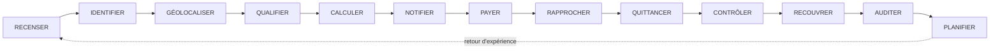
```mermaid
flowchart LR
  R[RECENSER] --> I[IDENTIFIER] --> G[GÉOLOCALISER] --> Q[QUALIFIER] --> C[CALCULER] --> N[NOTIFIER] --> P[PAYER]
  P --> RA[RAPPROCHER] --> QU[QUITTANCER] --> CO[CONTRÔLER] --> RE[RECOUVRER] --> AU[AUDITER] --> PL[PLANIFIER]
  PL -. retour d'expérience .-> R
```

Chaque maillon produit un événement horodaté, signé et inaltérable. **Aucun maillon ne peut être sauté** : pas de quittance définitive sans paiement réglé et rapproché ; pas de paiement sans obligation ; pas d'obligation sans règle active ; pas de règle active sans texte en vigueur vérifié.

| Maillon | Ce qui se passe | Garde-fou |
|---|---|---|
| Recenser | Objet détecté par auto-déclaration, terrain, données partenaires | Objet provisoire tant qu'il n'est pas vérifié |
| Identifier | Rattachement à un compte unique et à un rôle | Pas de fusion automatique d'identités |
| Géolocaliser | Identifiant géofiscal, coordonnées, précision | Contrôle de plausibilité GPS |
| Qualifier | Détermination des règles applicables | Seules les règles actives du registre |
| Calculer | Liquidation déterministe et explicable | Version de règle figée dans l'obligation |
| Notifier | Avis numérique et imprimable, preuve de délivrance | Mentions obligatoires et voie de recours |
| Payer | Référence unique, canal autorisé | Compte bénéficiaire issu du coffre verrouillé |
| Rapprocher | Obligation ↔ paiement ↔ règlement ↔ écriture | Exceptions en file, jamais d'ajustement silencieux |
| Quittancer | Quittance signée, QR vérifiable | Statut « provisoire » tant que non réglé |
| Contrôler | Missions terrain ciblées, constats | L'agent constate, il n'encaisse pas |
| Recouvrer | Relances graduées, mesures légales | Décision humaine habilitée, recours garanti |
| Auditer | Reconstitution intégrale de toute opération | Journal chaîné, stockage WORM indépendant |
| Planifier | Capacité de financement et scénarios | L'IA recommande, l'autorité décide |

## 3.3 Positionnement

- **Une identité • un territoire • une règle légale • une recette traçable.**
- **Principe fondateur :** chaque franc public doit être identifiable, rapprochable et auditable.
- **Priorité d'action :** mobiliser d'abord les recettes légalement dues mais non identifiées ou non recouvrées, avant de proposer tout prélèvement nouveau.

## 3.4 Principes constitutionnels du produit (non négociables)

Ces principes sont opposables à toute équipe de réalisation. Aucune dérogation n'est possible sans décision écrite du Comité de pilotage, publiée au journal des décisions du programme.

| # | Principe | Traduction obligatoire dans le produit |
|---|---|---|
| P1 | **Légalité avant automatisation** | Aucune obligation sans règle active portant sa référence légale ; aucun taux codé en dur ; toute règle non confirmée reste désactivée |
| P2 | **Le système applique le droit, il ne le crée pas** | Ni l'IA, ni l'administrateur, ni un agent ne peut créer une taxe, un taux ou une pénalité |
| P3 | **Une identité, plusieurs rôles, plusieurs objets** | Compte principal unique ; pas de fusion silencieuse ; rôles distincts (propriétaire, bailleur, locataire, exploitant…) |
| P4 | **Minimisation des données** | Collecte limitée à une finalité administrative, fiscale ou de service légitime et documentée |
| P5 | **Fonds publics sur comptes publics** | Aucun paiement de recette publique vers un compte privé de plateforme ou de prestataire |
| P6 | **Séparation des pouvoirs** | Aucune personne, quel que soit son rang, ne peut seule modifier une dette, un paiement, un compte bénéficiaire, une règle ou une trace |
| P7 | **Aucune disparition** | Toute correction est une contre-écriture liée à l'original ; aucune suppression d'écriture financière ou d'événement d'audit |
| P8 | **Preuve avant sanction** | Un signal analytique ouvre une vérification humaine ; jamais une taxation ou une sanction automatique |
| P9 | **Zéro espèce entre les mains des agents** | L'agent constate et notifie ; l'encaissement se fait par des canaux agréés vers le compte public |
| P10 | **IA assistive et redevable** | L'IA détecte, explique, priorise et recommande ; chaque recommandation est journalisée et attribuée |
| P11 | **Hors ligne d'abord pour le terrain, temps réel pour le pilotage** | Application terrain pleinement opérationnelle sans réseau |
| P12 | **Inclusion** | Chaque parcours citoyen existe sans smartphone ni Internet (USSD, SVI, SMS, guichet assisté) et en langues nationales |
| P13 | **Souveraineté et réversibilité** | La Ville possède les données, les clés et le droit d'usage du code ; sortie documentée et testée |
| P14 | **Transparence sans exposition** | Le public voit des agrégats ; jamais la situation fiscale d'une personne identifiable |

# 4. Énoncé du problème

| # | Problème constaté | Effet sur les recettes | Réponse de KINSHASA MOSOLO | Chapitre |
|---|---|---|---|---|
| 1 | Registre des contribuables incomplet et peu fiable | Assiette étroite, pression concentrée, inéquité | Registre par objet, identifiant unique, enrôlement continu | 9, 17 |
| 2 | Absence d'adresse fiscale géolocalisée généralisée | Impossible de notifier, contrôler, prouver | Identifiant géofiscal, plaque et QR par objet | 17 |
| 3 | Télépaiement non opérationnel ou fragmenté | Espèces, quittances non standardisées | Orchestration multicanale vers comptes publics | 18 |
| 4 | Bases dispersées entre services | Doubles sollicitations, statistiques non fiables | Socle commun, API contractualisées | 10, 30 |
| 5 | Le contribuable ignore quoi, combien, où payer | Non-paiement par friction | Espace unique, déclaration pré-remplie, explication du calcul | 13 |
| 6 | Références juridiques obsolètes dans certains documents de projet (texte de 2013 abrogé) et taux mal qualifiés | Liquidations contestables, contentieux de masse | Registre juridique certifié et versionné | 6 |
| 7 | Contrôle terrain sans données fiables | Contrôles inefficaces, arbitraire, corruption | Missions préparées, preuves géolocalisées, hors ligne | 15 |
| 8 | Contrôle interne faible, audit interne peu opérant | Déperdition impossible à prouver | Journal inaltérable, séparation des fonctions, accès auditeur indépendant | 25 |
| 9 | Exonérations et annulations peu tracées | Érosion silencieuse de la base | Registre des exonérations, quatre yeux, alertes de concentration | 25 |
| 10 | Rapprochement bancaire tardif | Fonds « perdus » en suspens, fraudes aux quittances | Rapprochement quotidien automatisé, files d'exception | 20 |
| 11 | Faible capacité de prévision | Assignations irréalistes, pilotage à l'aveugle | Base de référence, modèles de potentiel, scénarios | 38 |
| 12 | Opacité de l'emploi des recettes | Faible consentement à l'impôt | Tableau de transparence publique et recommandations d'affectation | 27 |

**Ce qui n'est pas le problème.** Le programme ne part pas de l'hypothèse que les contribuables kinois refusent l'impôt ni que les agents sont malhonnêtes. Il part de l'hypothèse, étayée par les constats d'évaluation, que l'architecture actuelle de l'information rend la conformité coûteuse, la fraude facile et la preuve difficile. Il corrige l'architecture.

# 5. Objectifs stratégiques

Les cibles chiffrées ci-dessous sont des **cibles de conception** ; les cibles de performance opposables seront fixées après mesure de la base de référence (chapitre 38) et approuvées par le Comité de pilotage.

| # | Objectif | Indicateur principal | Cible de conception |
|---|---|---|---|
| O1 | Constituer un registre géolocalisé des objets générateurs de recettes, commune par commune | Couverture du recensement dans les zones pilotes | ≥ 90 % des parcelles des quartiers pilotes à J+180 |
| O2 | Attribuer une identité fiscale unique à chaque contribuable, reliée à tous ses objets et rôles | Taux d'objets rattachés à un compte vérifié (N2+) | ≥ 70 % des objets recensés à J+180 |
| O3 | Fonder chaque obligation sur une règle certifiée, datée et versionnée | Obligations émises sans règle active | 0 (contrôle bloquant) |
| O4 | Rendre dominant l'encaissement électronique vers les comptes publics | Part des encaissements électroniques dans les flux couverts | > 80 % dans les flux couverts 18 mois après le pilote |
| O5 | Raccourcir la chaîne paiement → quittance → rapprochement | Délai confirmation → quittance ; délai règlement → rapprochement | < 1 minute ; < 24 heures ouvrées |
| O6 | Supprimer la manipulation d'espèces par les agents dans les circuits couverts | Encaissements hors canal agréé détectés | 0 toléré ; chaque cas instruit |
| O7 | Réduire la déperdition mesurable | Paiements non rapprochés à J+3 ; annulations non justifiées | < 1 % ; 0 |
| O8 | Donner à l'exécutif une vision exacte, en temps réel, de l'échelle de la recette | Fraîcheur des données du tableau de bord | < 15 minutes pour les flux électroniques |
| O9 | Relier recettes encaissées et réalisations publiques | Publication du tableau de transparence | Trimestrielle dès la fin du pilote |
| O10 | Améliorer l'environnement de travail des agents publics | Taux de certification ; satisfaction ; temps de traitement | Tous les agents actifs certifiés ; baisse mesurée du temps de traitement |
| O11 | Protéger les droits des contribuables | Délai moyen de traitement des recours ; taux de recours fondés | Dans le délai légal ; suivi public agrégé |
| O12 | Garantir la souveraineté et la réversibilité | Exercice de réversibilité réussi | Un exercice complet avant la généralisation |

# 6. Analyse juridique et réglementaire

Ce chapitre fixe le cadre dans lequel le référentiel juridique de KINSHASA MOSOLO peut être paramétré. Il distingue ce qui est établi, ce qui doit être vérifié sur le texte officiel avant toute mise en production, et ce qui exige un acte nouveau. **Il ne constitue pas un avis juridique** : il prépare le relevé juridique certifié que les services juridiques provinciaux doivent produire (décision n° 3, chapitre 47).

## 6.1 Méthode, sources et limites

La revue a été conduite en septembre 2026 sur des sources publiques : Journal officiel et bases de législation congolaises, sites institutionnels (Banque Centrale du Congo, Cour des comptes, DGI, ARMP), bases internationales (FAOLEX/ECOLEX, PNUE), rapports du FMI et de la Banque mondiale, presse économique congolaise. **Limite importante** : plusieurs bases de textes congolaises n'ont pas pu être consultées en texte intégral pendant la revue ; les éléments marqués [CONFIRMÉ] l'ont été par recoupement de sources publiques identifiées, mais **aucun numéro d'article ni aucun taux ne doit être paramétré sans lecture du texte officiel publié** par le juriste certificateur. L'Annexe A liste chaque affirmation, sa source et son niveau de confiance.

**Conséquence de conception.** Le registre juridique de la plateforme (module 26) ne peut contenir qu'une copie numérisée et hachée du texte officiel comme pièce justificative de chaque règle. Une règle dont la pièce justificative est une coupure de presse ou un document de travail reste au statut `A_VERIFIER` et ne peut produire aucune obligation.

## 6.2 Hiérarchie des normes applicables

| Niveau | Texte | Objet utile à MOSOLO | Statut | Conséquence pour la plateforme |
|---|---|---|---|---|
| Constitution | Constitution du 18 février 2006, révisée par la loi du 20 janvier 2011 — **art. 171** | « Les finances du pouvoir central et celles des provinces sont distinctes » | [CONFIRMÉ] | Comptes, grands livres et tableaux de bord séparés entre recettes provinciales et centrales |
| Constitution | **Art. 174** | Principe de légalité de l'impôt (« il ne peut être établi d'impôts que par la loi ») | [CONFIRMÉ pour le principe ; texte intégral À VÉRIFIER] | Une province ne peut pas créer librement un impôt hors du cadre légal ; toute nouvelle recette doit s'inscrire dans une nomenclature légale ou dans une loi |
| Constitution | **Art. 175** | 40 % des recettes à caractère national allouées aux provinces, retenus à la source | [CONFIRMÉ] | Hors périmètre de liquidation de MOSOLO ; peut être suivi comme ressource dans le module d'affectation (ch. 27) |
| Constitution | **Art. 204, point 16** | Compétence exclusive des provinces pour « les impôts, les taxes et les droits provinciaux et locaux, notamment l'impôt foncier, l'impôt sur les revenus locatifs et l'impôt sur les véhicules automoteurs » | [CONFIRMÉ pour la formulation] | Fondement constitutionnel des trois impôts cœur du pilote |
| Loi | **Loi n° 08/012 du 31 juillet 2008** portant principes fondamentaux relatifs à la libre administration des provinces, modifiée par la **Loi n° 13/008 du 22 janvier 2013** | Compétences et ressources des provinces ; édits de l'Assemblée provinciale | [CONFIRMÉ] | L'édit est l'instrument normal des règles provinciales de perception |
| Loi organique | **Loi organique n° 08/016 du 7 octobre 2008** (ETD) | Organisation des communes et autres ETD | [CONFIRMÉ pour l'existence ; dispositions financières À VÉRIFIER] | Espace communal distinct (module 95) ; pas de liquidation de recettes communales par la province |
| Ordonnance-loi | **Ordonnance-loi n° 18/004 du 13 mars 2018** fixant la nomenclature des impôts, droits, taxes et redevances de la province et de l'entité territoriale décentralisée ainsi que les modalités de leur répartition (JO, n° spécial, 23 avril 2018) | Nomenclature provinciale et locale ; clés de répartition | [CONFIRMÉ pour l'existence, l'objet et l'abrogation de l'OL 13/001] ; [À VÉRIFIER : liste intégrale et clés de répartition] | **Base normative du référentiel.** Toute ligne du catalogue (ch. 7) doit citer son rang dans la nomenclature |
| Ordonnance-loi | **Ordonnance-loi n° 13/001 du 23 février 2013** | Ancienne nomenclature provinciale | **ABROGÉE** par l'OL 18/004 [CONFIRMÉ] | **Interdite comme base de règle.** Toute référence héritée est bloquée par le moteur |
| Ordonnance-loi | **Ordonnance-loi n° 18/003 du 13 mars 2018** | Nomenclature des droits, taxes et redevances du pouvoir central | [CONFIRMÉ] | Liste d'exclusion : empêcher toute double imposition d'un fait générateur central |
| Loi (réf. commande) | **Loi n° 18/014 du 9 juillet 2018** | Présentée dans la commande comme texte de référence et, par un document de travail antérieur, comme loi de ratification de l'OL 18/004 | **[À VÉRIFIER — NON RETROUVÉE]** : aucune trace publique n'a été trouvée de ce numéro comme loi de ratification de l'OL 18/004 ; d'autres lois du 9 juillet 2018 portent les numéros 18/016 (PPP), 18/019 (systèmes de paiement), 18/020 | Ne pas citer dans une fiche de règle avant confirmation au Journal officiel ; vérifier en outre si l'OL 18/004 a été ratifiée et par quel texte |
| Ordonnance-loi | **OL n° 69/006 du 10 février 1969** relative à l'impôt réel, modifiée | Impôt foncier, impôt sur les véhicules, superficie des concessions | [CONFIRMÉ pour l'existence ; version consolidée À VÉRIFIER] | Base matérielle historique de l'IF et de l'impôt sur les véhicules |
| Ordonnance-loi | **OL n° 69/009 du 10 février 1969** relative aux impôts cédulaires sur les revenus, modifiée (notamment OL n° 009/2012 du 21 septembre 2012) | Impôt sur les revenus locatifs | [CONFIRMÉ pour l'existence ; version consolidée À VÉRIFIER] | Base matérielle historique de l'IRL |
| Loi | **Loi n° 004/2003 du 13 mars 2003** portant réforme des procédures fiscales, modifiée (notamment Loi n° 23/052 du 30 novembre 2023) | Déclaration, liquidation, avis de mise en recouvrement, contrôle, recouvrement, prescription, recours | [CONFIRMÉ] | Modèle procédural ; applicabilité aux impôts provinciaux à confirmer au regard de l'édit provincial de procédure |
| Édit provincial | **Édit n° 005/2021 du 31 décembre 2021** portant réforme des procédures de perception des impôts, droits, taxes et redevances dus à la Ville de Kinshasa (JO n° spécial, 14 février 2022) | **Procédure fiscale provinciale de Kinshasa** | [CONFIRMÉ pour l'existence ; contenu À VÉRIFIER] | **Texte clé** pour les états de l'obligation, les délais, les pénalités, les actes de poursuite et les recours. Son éventuelle modification après la réforme des régies de 2026 doit être vérifiée |
| Loi / OL | **Loi n° 04/015 du 16 juillet 2004** (nomenclature des actes générateurs de recettes administratives, judiciaires, domaniales et de participations), modifiée ; **OL n° 13/003 du 23 février 2013** (procédures relatives aux recettes non fiscales) | Recettes non fiscales, surtout centrales | [PROBABLE] | Référence méthodologique pour les droits, taxes et redevances ; applicabilité provinciale À VÉRIFIER |
| Loi | **Loi n° 11/011 du 13 juillet 2011** relative aux finances publiques (LOFIP), modifiée par la **Loi n° 18/010 du 9 juillet 2018** | Budget, unité de caisse et de trésorerie, séparation ordonnateur–comptable, comptes publics | [CONFIRMÉ] | Voir § 6.8 : la plateforme ne détient aucun fonds et ne répartit aucune recette hors procédure budgétaire |
| Décret | **Décret n° 13/050 du 6 novembre 2013** portant règlement général sur la comptabilité publique (RGCP) | Chaîne constatation–liquidation–recouvrement, rôle du comptable public | [PROBABLE — en vigueur, aucune abrogation trouvée] | Modèle des états de la recette ; habilitation du comptable dans les workflows |
| Édits annuels | **Édit budgétaire de la Ville de Kinshasa pour 2026** et arrêtés du ministre provincial des Finances | Taux, tarifs, innovations d'assiette | [À VÉRIFIER : numéro, date, montant définitif] | Source directe des taux ; chaque exercice crée une nouvelle version de règle |
| Arrêtés provinciaux 2026 | Arrêtés créant la **DGIPK** et la direction des droits, taxes et redevances (**DGTK**), en remplacement de la **DGRK** (créée par l'Édit n° 0001/08 du 22 janvier 2008) | Répartition des compétences d'assiette et de recouvrement | [CONFIRMÉ par la presse ; numéros et dates À VÉRIFIER] | L'administration compétente est une donnée de configuration de chaque règle |
| OL | **Ordonnance-loi n° 23/010 du 13 mars 2023** portant Code du numérique (JO 11 avril 2023) | Écrit et signature électroniques, services de confiance, protection des données, cybersécurité | [CONFIRMÉ] ; ratification parlementaire [À VÉRIFIER] | Valeur probante de la quittance et de l'avis électroniques ; obligations de protection des données (§ 6.9) |
| Arrêtés ministériels | **Arrêtés n° 004 et n° 005 du 11 mars 2026** du ministre de l'Économie numérique (régimes de déclaration et d'autorisation des activités et services numériques) | Pleine application depuis le 1er juillet 2026 | [PROBABLE] | **Vérifier si l'exploitation de MOSOLO, ou de ses prestataires, est soumise à déclaration ou à autorisation** |
| Loi | **Loi n° 20/017 du 25 novembre 2020** relative aux télécommunications et aux TIC | Régulation (ARPTIC) | [CONFIRMÉ] | Conventions USSD, SMS, codes courts |
| Loi | **Loi n° 18/019 du 9 juillet 2018** relative aux systèmes de paiement et de règlement-titres | Instruments de paiement, caractère définitif du règlement, surveillance BCC | [CONFIRMÉ] | Cadre des paiements électroniques et mobiles (§ 6.10) |
| Loi organique | **Loi organique n° 18/027 du 13 décembre 2018** portant organisation et fonctionnement de la Banque Centrale du Congo | BCC caissier de l'État, surveillance des paiements | [CONFIRMÉ] | Comptes publics provinciaux et habilitation des prestataires |
| Instructions BCC | **Instruction n° 24** (monnaie électronique), **Instruction n° 42** (agrégateurs, fintechs), **Instruction n° 58/2024** (interopérabilité) | Habilitation des émetteurs de monnaie électronique et des agrégateurs | [PROBABLE / À VÉRIFIER pour les versions en vigueur] | **Si MOSOLO ou un prestataire agrège des paiements, un agrément BCC est probablement requis** |
| Loi | **Loi n° 22/068 du 27 décembre 2022** (lutte contre le blanchiment et le financement du terrorisme) | Vigilance, identification, déclarations de soupçon à la CENAREF | [CONFIRMÉ] | Obligations portées par les banques et émetteurs partenaires ; clauses contractuelles |
| Loi | **Loi n° 10/010 du 27 avril 2010** relative aux marchés publics (projet de révision validé en commission en janvier 2026) | Sélection des prestataires | [CONFIRMÉ ; révision À VÉRIFIER] | Chapitre 37 |
| Loi | **Loi n° 18/016 du 9 juillet 2018** relative au partenariat public-privé ; décrets d'application (dont décret n° 23/38 du 26 octobre 2023) | PPP, appel à la concurrence, rémunération | [CONFIRMÉ] | Chapitre 37 ; clauses de rémunération à lire dans le texte |
| Loi organique | **Loi organique n° 18/024 du 13 novembre 2018** relative à la Cour des comptes | Contrôle des finances des provinces et de toute personne gérant des fonds publics ; chambres provinciales | [CONFIRMÉ] | Accès auditeur, risque de **gestion de fait** si un tiers manie des fonds publics |
| Loi | **Loi n° 11/009 du 9 juillet 2011** relative à la protection de l'environnement, modifiée par l'**OL n° 23/007 du 3 mars 2023** | Principe pollueur-payeur | [CONFIRMÉ pour l'existence] | Fondement possible d'une contribution environnementale, sous réserve de la nomenclature |
| Décret | **Décret n° 17/018 du 30 décembre 2017** portant interdiction de production, d'importation, de commercialisation et d'utilisation des sacs, sachets, films et autres emballages en plastique (emballages alimentaires, eau, boissons, non biodégradables), avec exemptions ; arrêté d'exécution de 2018 fixant des amendes | Interdiction nationale | [CONFIRMÉ] | Toute contribution plastique doit s'articuler avec l'interdiction (§ 8.5) |
| Décrets | Décret n° 011/48 du 3 décembre 2011 (ONIP) ; décrets n° 22/07 et 22/08 du 2 mars 2022 (fichier général de la population, carte d'identité nationale) | Identification de la population | [PROBABLE] ; identification de masse annoncée pour fin 2026 | Pas d'identifiant national universel fiable avant 2027 : conception tolérante (ch. 9) |
| Pratique | Numéro d'identification fiscale (NIF) délivré par la DGI, y compris pour les redevables des ETD | Identifiant fiscal national | [PROBABLE] | Clé de rapprochement privilégiée ; l'IUC MOSOLO n'est qu'un identifiant technique, pas un identifiant fiscal concurrent |

## 6.3 Statut de l'Ordonnance-loi n° 13/001 et des références héritées

Le document de projet d'origine (note KIN-RECETTES) s'appuyait sur l'Ordonnance-loi n° 13/001 du 23 février 2013. **Ce texte est abrogé** par l'Ordonnance-loi n° 18/004 du 13 mars 2018 [CONFIRMÉ]. Conséquences :

1. aucune fiche de règle ne peut citer l'OL 13/001 comme fondement d'une obligation née après l'abrogation ;
2. les arriérés nés sous l'empire de l'OL 13/001 (exercices antérieurs à 2018) ne peuvent être repris qu'avec leur base légale d'origine et sous réserve des règles de prescription, après avis juridique ;
3. le moteur de règles tient une **liste noire des instruments abrogés** : toute tentative de publier une règle référençant un instrument au statut `ABROGE` avec une date d'effet postérieure à l'abrogation est bloquée (test d'acceptation AC-LEG-03, ch. 41) ;
4. les clés de répartition province–ETD souvent citées (par exemple « 40 % aux ETD ») proviennent de l'ancien régime ou de la rétrocession des recettes nationales ; **aucun pourcentage de répartition issu de l'OL 18/004 ne doit être paramétré avant lecture du texte** [À VÉRIFIER].

## 6.4 Impôt sur les revenus locatifs : taux, retenue et assiette

La commande initiale mentionnait un taux de 20 %. **Ce chiffre ne doit pas être utilisé comme taux de l'impôt.** Selon le communiqué du Gouvernement provincial relayé par la presse en février 2026, qui reprend les taux applicables depuis le 1er janvier 2024 [CONFIRMÉ par recoupement de presse ; **arrêté de référence À VÉRIFIER**] :

| Rang de localité | Taux de l'impôt (sur le loyer effectivement perçu) | Retenue à la source opérée par le locataire | Complément à la charge du bailleur |
|---|---|---|---|
| 1er rang | **22 %** | **20 %** | 2 points |
| 2e, 3e et 4e rangs | **17 %** | **15 %** | 2 points |


| Point | État de la connaissance | Hypothèse de conception sûre |
|---|---|---|
| Qui opère la retenue (tous locataires, ou seulement personnes morales et entités assimilées) | [À VÉRIFIER] | Paramètre `withholding_agent_categories` de la règle ; à défaut de confirmation, **la retenue n'est proposée que pour les locataires personnes morales et administrations**, les autres cas relevant de la déclaration du bailleur |
| Délai de reversement de la retenue (dans les 10 jours de chaque paiement, ou avant le 10 du mois suivant) | [À VÉRIFIER — deux formulations circulent] | Paramètre `remittance_due_rule` ; aucune pénalité de retard calculée tant que la règle n'est pas certifiée |
| Échéance de la déclaration annuelle du bailleur | 1er février, prorogée au 28 février en 2026 [CONFIRMÉ par la presse pour 2026] | Échéance annuelle paramétrable + mécanisme de prorogation par acte, versionné |
| Innovations de l'édit budgétaire 2026 : baux emphytéotiques entre entreprises et confessions ou ONG pour des constructions destinées à la location ; loyers perçus par les sociétés immobilières ; indemnités de logement de travailleurs occupant leur propre logement, celui du conjoint ou logés gratuitement | [PROBABLE — édit À VÉRIFIER] | Trois sous-règles distinctes, désactivées jusqu'à certification ; chacune avec formulaire, contrôle de cohérence et voie de recours ; attention au contentieux prévisible sur les indemnités de logement |
| Pénalités (retard de déclaration, de paiement, de reversement de retenue) | [À VÉRIFIER — Édit 005/2021 et textes d'application] | Aucune pénalité automatique ; calcul affiché comme « estimation non opposable » dans le simulateur interne uniquement |
| Déductions, abattements, exonérations | [À VÉRIFIER] | Champs prévus dans la fiche ; valeur nulle par défaut, bloquée tant que non certifiée |

**Règle de modélisation.** La fiche IRL porte deux paramètres distincts — `tax_rate` et `withholding_rate` — et un paramètre `locality_rank` rattaché à la parcelle via le référentiel des rangs de localité (module 86). Le crédit de retenue est imputé sur l'obligation du bailleur ; le moteur empêche que la même période soit liquidée deux fois (retenue et déclaration) sans imputation.

## 6.5 Impôt foncier : barèmes 2026 rapportés

Selon la presse économique de février 2026 [CONFIRMÉ par une source de presse unique ; **arrêté de référence À VÉRIFIER**] :

| Redevable | Assiette | 1er rang | 2e rang | 3e rang | 4e rang |
|---|---|---|---|---|---|
| Personnes physiques — bâti (forfait annuel) | Par propriété | 450 USD (villas) | 150 USD | 50 USD | 10 USD |
| Personnes morales | Par m² | 3,5 USD | 2,5 USD | 2 USD | 1,5 USD |
| Sociétés immobilières | Par m² | 8 USD | 5 USD | 4 USD | 3 USD |
| Personnes physiques — non bâti | Forfait par rang | [À VÉRIFIER] | [À VÉRIFIER] | [À VÉRIFIER] | [À VÉRIFIER] |


Ces montants sont libellés en dollars ; la règle de conversion en francs congolais (taux applicable, date de référence) doit être certifiée (module 89). L'échéance déclarative 2026 a été le 1er février, prorogée au 28 février [CONFIRMÉ par la presse].

**Point d'attention d'équité.** Les travaux expérimentaux menés à Kananga (RDC) sur l'impôt foncier montrent que la conformité réagit fortement au niveau du forfait : une baisse du montant exigé augmente la conformité au point que la recette totale peut augmenter (élasticité de la conformité proche de −1,25) [CONFIRMÉ — publication académique, Econometrica 2024]. MOSOLO ne fixe pas les taux, mais son laboratoire de simulation (module 92) doit permettre au Gouvernement de tester ces effets sur données réelles avant tout arrêté.


## 6.6 Véhicules : impôt et taxe spéciale de circulation routière

La régie provinciale perçoit l'impôt sur les véhicules automoteurs et la taxe spéciale de circulation routière (vignette), avec déclaration en ligne obligatoire depuis janvier 2026, vignette dématérialisée à QR code et paiement dans des banques partenaires [CONFIRMÉ par la presse]. **Les barèmes par catégorie de véhicule n'ont pas été retrouvés** [À VÉRIFIER]. La répartition de la TSCR (taxe d'intérêt commun) entre niveaux de gouvernement doit être confirmée dans l'OL 18/004. Le rapprochement avec le fichier des immatriculations (pouvoir central) exige un protocole.

## 6.7 Procédure fiscale, recouvrement et recours

La procédure applicable aux recettes de la Ville repose sur l'**Édit n° 005/2021** [contenu À VÉRIFIER], articulé avec les principes de la Loi n° 004/2003 modifiée. Le relevé juridique certifié doit fournir, pour chaque recette, les éléments suivants, qui paramètrent directement les modules 27, 32, 33, 36 et 37 :

| Élément de procédure | Paramètre de la plateforme | Statut |
|---|---|---|
| Mode d'établissement (déclaration, auto-liquidation, liquidation d'office, rôle) | `assessment_mode` | À VÉRIFIER par recette |
| Titre de perception (avis de mise en recouvrement, note de perception, etc.) et mentions obligatoires | Modèle d'avis versionné | À VÉRIFIER |
| Délai de paiement après notification | `payment_term_days` | À VÉRIFIER |
| Pénalités d'assiette et de recouvrement, plafonds | `penalty_rules[]` | À VÉRIFIER |
| Actes de poursuite (commandement, saisie, fermeture) et autorité compétente | Workflow du module 36 | À VÉRIFIER |
| Délai et forme de la réclamation ; effet suspensif éventuel | `appeal_path`, `suspensive_effect` | À VÉRIFIER |
| Voies de recours juridictionnel | Texte d'information du contribuable | À VÉRIFIER |
| Prescription de l'action en recouvrement et du droit de reprise | `limitation_period` | À VÉRIFIER (le régime national prévoit un droit de rappel de cinq ans : applicabilité provinciale à confirmer) |
| Remises gracieuses, transactions, échéanciers | Modules 83 et 90 | À VÉRIFIER |
| Valeur de la notification électronique | Module 39 | À VÉRIFIER au regard du Code du numérique et de l'édit |

## 6.8 Finances publiques : ce que la LOFIP impose à l'architecture

La LOFIP pose le principe d'**unité de caisse et de trésorerie** et prévoit la tenue des disponibilités de la province dans un compte ouvert auprès de la Banque Centrale du Congo, avec séparation des fonctions d'ordonnateur et de comptable [CONFIRMÉ pour le principe ; articles À VÉRIFIER]. Quatre conséquences de conception sont non négociables :

1. **MOSOLO ne détient jamais de fonds.** Tous les paiements sont dirigés vers les comptes publics désignés (compte de recettes auprès des banques partenaires, puis compte de la province). La plateforme orchestre, trace, rapproche et prouve.
2. **Aucune répartition à la source hors texte.** Un prélèvement automatique d'une partie des recettes au profit d'un tiers (prestataire, agents, ministères) avant leur entrée dans la caisse publique est **juridiquement très exposé** au regard de l'unité de caisse, de l'universalité budgétaire et du risque de gestion de fait contrôlé par la Cour des comptes. Voir chapitre 37 pour l'analyse du modèle de rémunération proposé dans le Cahier v2.9.
3. **Le comptable public reste l'autorité de prise en charge.** Les workflows de règlement et de rapprochement (modules 29, 30, 59) prévoient la validation par le comptable habilité ; MOSOLO fournit les pièces.
4. **L'affectation relève du budget.** Le module 48 recommande ; il n'affecte pas (chapitre 27).

## 6.9 Numérique, protection des données et signature électronique

| Sujet | État | Conséquence de conception |
|---|---|---|
| Valeur de l'écrit et de la signature électroniques | Reconnue par le Code du numérique [CONFIRMÉ] | Quittance et avis électroniques signés ; la valeur probante exacte (signature simple, avancée, qualifiée) dépend des textes d'application |
| Autorité nationale de certification électronique (ANCE) | Non opérationnelle ; missions exercées à titre intérimaire par l'ARPTIC [PROBABLE] | **Pas de PKI qualifiée nationale disponible** : MOSOLO opère une PKI provinciale (HSM) à titre de signature avancée, avec chaîne de certification documentée, transitoire jusqu'à la reconnaissance d'un prestataire qualifié |
| Autorité de protection des données (APD) | Non créée ; missions intérimaires confiées à l'ARPTIC par arrêté de 2024, dont la légalité est discutée [PROBABLE] | Formalités préalables auprès de l'autorité intérimaire à vérifier ; registre des traitements tenu dès le premier jour ; analyse d'impact sur la protection des données avant le pilote |
| Transferts de données hors du territoire | Régime à vérifier dans le Code du numérique | Hébergement primaire en RDC (ch. 33) ; aucun transfert de données personnelles fiscales hors du territoire sans base légale |
| Régime de déclaration ou d'autorisation des services numériques (arrêtés du 11 mars 2026) | [PROBABLE] | Vérifier l'assujettissement de l'opérateur de la plateforme et des prestataires avant le pilote |

## 6.10 Paiements électroniques

Le cadre repose sur la Loi n° 18/019 (systèmes de paiement), la loi organique de la BCC et les instructions de la BCC relatives à la monnaie électronique, aux agrégateurs et à l'interopérabilité. **Règle de conception : MOSOLO n'est ni un établissement de paiement, ni un émetteur de monnaie électronique, ni un agrégateur, sauf agrément formel.** Les paiements sont initiés vers des comptes publics par des prestataires eux-mêmes habilités (banques, émetteurs de monnaie électronique) ; MOSOLO émet la référence de paiement, reçoit les confirmations signées et rapproche. Si l'architecture retenue exige une fonction d'agrégation (un seul point d'intégration pour plusieurs opérateurs), cette fonction est confiée à un **agrégateur agréé par la BCC**, sous contrat avec la Province, et non à l'opérateur de la plateforme [ACTE REQUIS : vérification de l'agrément].

## 6.11 Typologie des recettes et séparation des compétences

Chaque ligne du catalogue porte obligatoirement l'une des catégories suivantes. Le moteur de règles refuse toute obligation qui reproduirait, pour un même fait générateur, un même redevable et une même période, une obligation déjà portée par une autre administration.

| Catégorie | Définition | Exemples | Traitement MOSOLO |
|---|---|---|---|
| **IMPOT_PROVINCIAL** | Impôt attribué à la province par la Constitution et la nomenclature | Impôt foncier, IRL, impôt sur les véhicules, superficie des concessions | Liquidation par la régie des impôts provinciaux |
| **INTERET_COMMUN** | Impôt ou taxe d'intérêt commun, avec clé de répartition légale | Selon OL 18/004 [liste À VÉRIFIER] : TSCR, patente, consommation bière et tabac, superficie des concessions forestières et minières, ventes de matières précieuses artisanales | Liquidation + calcul des parts légales (module 73) |
| **PROVINCIAL_SPECIFIQUE** | Droits, taxes et redevances propres à la province | Transport, embarquement, publicité, antennes, voirie et drainage, assainissement, débits de boissons, spectacles, carrières, péages, accostage, produits forestiers non ligneux | Liquidation par la régie des taxes |
| **RECETTE_ETD** | Recette des communes ou autres ETD | Impôt personnel minimum selon les informations disponibles [rattachement exact À VÉRIFIER], droits communaux | **Non liquidée par la province** ; espace communal séparé ultérieur |
| **RECETTE_CENTRALE** | Recette du pouvoir central | Nomenclature OL 18/003, impôts DGI | Exclue ; sert uniquement à prévenir la double imposition |
| **PARTAGEE** | Recette dont le produit est légalement partagé | Selon texte | Parts calculées sur recettes rapprochées ; aucune clé modifiable par un utilisateur |
| **DROIT_ADMINISTRATIF** | Contrepartie d'un acte administratif | Autorisations, permis, duplicatas, attestations | Liquidation à la demande de l'acte |
| **REDEVANCE_SERVICE** | Contrepartie d'un service rendu | Stationnement, marchés, enlèvement de déchets | Titres à durée (module 70) |
| **PENALITE** | Sanction pécuniaire prévue par un texte | Pénalités de retard, amendes réglementaires | Jamais automatique ; décision habilitée ; recours |
| **CONCESSION_DOMANIALE** | Produit du domaine et des concessions | Occupation du domaine public, location d'actifs | Contrat + règle tarifaire |
| **RECETTE_COMMERCIALE** | Recette d'une activité commerciale publique | Droits de dénomination, données agrégées | Contrat mis en concurrence |
| **ACTE_REQUIS** | Recette envisagée sans base suffisante | Contribution plastique, captation de plus-value | Simulable, **non activable** |

**Impôt personnel minimum.** Les informations disponibles indiquent que l'IPM est perçu au niveau des communes, secteurs et chefferies ; son rattachement exact dans l'OL 18/004 n'a pas pu être confirmé [À VÉRIFIER]. Il est classé `RECETTE_ETD` et **n'est pas activé** dans le périmètre provincial.

## 6.12 Règle d'or : la fiche de règle de recette

Aucune recette n'est activable sans une fiche complète, certifiée par le service juridique provincial et approuvée par l'autorité compétente. La fiche et le modèle technique sont identiques : ce que le juriste signe est ce que le moteur exécute.

| # | Champ de la fiche | Attribut technique | Contrôle |
|---|---|---|---|
| 1 | Référence légale | `legal_instrument_id` (instrument au statut `EN_VIGUEUR`, pièce officielle hachée) | Bloquant |
| 2 | Article(s) | `articles[]` | Bloquant |
| 3 | Autorité compétente | `competent_authority_id` | Bloquant |
| 4 | Fait générateur | `taxable_event` (typé : possession, location, activité, transaction, occupation, acte) | Bloquant |
| 5 | Catégorie de redevable | `liable_party_rule`, `withholding_agent_rule` | Bloquant |
| 6 | Assiette | `base_definition` (champs d'objet utilisés, unité) | Bloquant |
| 7 | Formule officielle | `formula` (expression dans le langage de règles, testée) | Bloquant |
| 8 | Taux ou tarif | `rate_table` (par rang, catégorie, tranche) | Bloquant |
| 9 | Devise et arrondi | `currency`, `fx_rule_id`, `rounding` | Bloquant |
| 10 | Exonérations | `exemption_rules[]` (fondement, preuve exigée, durée) | Obligatoire si applicable |
| 11 | Pénalités | `penalty_rules[]` (base légale, taux, plafond) | Obligatoire si applicable |
| 12 | Date d'effet | `effective_from` | Bloquant |
| 13 | Date de fin | `effective_to` (ou instrument d'abrogation) | Bloquant si connue |
| 14 | Administration responsable | `administering_entity_id` | Bloquant |
| 15 | Compte public bénéficiaire | `beneficiary_account_ref` (référence au coffre, jamais saisie libre) | Bloquant |
| 16 | Voie de recours | `appeal_path` (délai, service, effet suspensif) | Bloquant |
| 17 | Approbations | `approvals[]` : rédacteur juridique ≠ vérificateur juridique ≠ validateur financier ≠ autorité de publication | Quatre personnes distinctes |
| 18 | Historique des versions | `version`, `supersedes_rule_version_id`, `change_reason` | Automatique, immuable |
| 19 | Catégorie de recette | `revenue_category` (§ 6.11) | Bloquant |
| 20 | Statut de vérification des sources | `source_verification` : `OFFICIEL_CERTIFIE` requis pour l'activation | Bloquant |

**Cycle de vie d'une règle.**

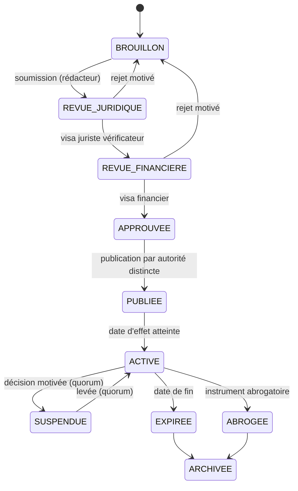
```mermaid
stateDiagram-v2
  [*] --> BROUILLON
  BROUILLON --> REVUE_JURIDIQUE: soumission (rédacteur)
  REVUE_JURIDIQUE --> BROUILLON: rejet motivé
  REVUE_JURIDIQUE --> REVUE_FINANCIERE: visa juriste vérificateur
  REVUE_FINANCIERE --> BROUILLON: rejet motivé
  REVUE_FINANCIERE --> APPROUVEE: visa financier
  APPROUVEE --> PUBLIEE: publication par autorité distincte
  PUBLIEE --> ACTIVE: date d'effet atteinte
  ACTIVE --> SUSPENDUE: décision motivée (quorum)
  SUSPENDUE --> ACTIVE: levée (quorum)
  ACTIVE --> EXPIREE: date de fin
  ACTIVE --> ABROGEE: instrument abrogatoire
  EXPIREE --> ARCHIVEE
  ABROGEE --> ARCHIVEE
```

Règles complémentaires : une règle en brouillon ou approuvée mais non encore active n'affecte aucune obligation ; toute rétroactivité exige une référence légale expresse et une approbation renforcée ; la version appliquée est figée dans chaque obligation ; un changement de texte produit une nouvelle version et, si le texte l'exige, un recalcul contrôlé qui crée des obligations rectificatives sans écraser les anciennes.

## 6.13 Points juridiques à trancher avant la production

| # | Question | Autorité responsable | Données requises | Hypothèse intérimaire sûre | Verrou technique |
|---|---|---|---|---|---|
| J1 | Texte intégral et consolidé de l'OL 18/004 ; liste et clés de répartition ; ratification | Service juridique provincial + ministère provincial des Finances | JO du 23 avril 2018, lois de ratification, modifications | Seules les trois recettes nommées par l'art. 204 pt 16 sont modélisées en priorité | Aucune règle `INTERET_COMMUN` ou `PARTAGEE` activable sans clé certifiée |
| J2 | Objet réel de la « Loi n° 18/014 du 9 juillet 2018 » | Service juridique provincial | Journal officiel | Référence non citée | Instrument au statut `A_VERIFIER` |
| J3 | Arrêtés et édit fixant les taux 2026 (IRL, IF, véhicules) | Ministère provincial des Finances | Textes signés et publiés | Taux de presse enregistrés en `A_VERIFIER` | Pas d'obligation émise |
| J4 | Contenu et mise à jour de l'Édit n° 005/2021 (procédure) | Service juridique provincial | Texte, amendements | Aucune pénalité automatique ; notification papier doublée | Règles de pénalités désactivées |
| J5 | Arrêtés de création de la DGIPK et de la DGTK ; transfert des compétences et des comptes | Cabinet du Gouverneur, Finances | Arrêtés, décisions de transfert | Administration paramétrable par règle | Pas de règle sans `administering_entity_id` valide |
| J6 | Acte instituant le quitus fiscal et liste des démarches conditionnées | Finances, services concernés | Acte | Quitus informatif uniquement | Aucun blocage de service sans règle de conditionnalité certifiée |
| J7 | Valeur probante de la quittance et de la notification électroniques | Services juridiques ; autorité intérimaire du numérique | Code du numérique et textes d'application | Double preuve (électronique + imprimable signée) | — |
| J8 | Formalités de protection des données et analyse d'impact | Délégué à la protection des données du programme | Registre des traitements | Minimisation maximale ; pas de partage de données partenaires sans protocole | Connecteurs partenaires désactivés sans protocole signé |
| J9 | Habilitation BCC des prestataires de paiement et besoin d'agrément d'agrégation | Finances + BCC | Agréments | Seuls des prestataires déjà agréés, sous contrat avec la Province | Connecteur de canal non activable sans preuve d'agrément |
| J10 | Régime des incitations des agents (primes, quotes-parts) | Finances, Fonction publique provinciale | LOFIP, édit, arrêté | Aucune prime calculée par la plateforme | Module de performance en mode « indicateurs » seulement |
| J11 | Régime juridique de la rémunération du prestataire (marché, PPP, pourcentage) | Finances, ARMP/DGCMP, UC-PPP | Loi 10/010, Loi 18/016, LOFIP | Rémunération contractuelle payée sur crédit budgétaire (ch. 37) | Aucun flux de décaissement automatique vers un compte privé |
| J12 | Assujettissement de la plateforme aux régimes de déclaration ou d'autorisation des services numériques (2026) | Ministère de l'Économie numérique | Arrêtés du 11 mars 2026 | Déclaration préventive | — |
| J13 | Conditions de partage de données avec les distributeurs d'énergie, d'eau, les opérateurs télécoms, les brasseries, les employeurs | Juridique + autorité de protection des données | Protocoles | Aucun échange de données personnelles sans protocole | Connecteurs désactivés |
| J14 | Base légale des échéanciers et de la régularisation volontaire (abandon de pénalités) | Finances / Assemblée provinciale | Texte | Modules 83 et 90 désactivés | — |
| J15 | Compétence provinciale pour une contribution plastique ou une REP (art. 174 Constitution, nomenclature, Décret 17/018) | Juridique + Environnement + pouvoir central | Analyse | Aucune activation | Catégorie `ACTE_REQUIS` |
| J16 | Portée d'une décision de la Cour constitutionnelle de 2024 sur la création d'impôts provinciaux hors nomenclature, rapportée par la presse | Service juridique | Arrêt | Aucune recette nouvelle hors nomenclature | Catégorie `ACTE_REQUIS` |

# 7. Paysage des recettes

Les catégories ci-dessous structurent le paramétrage, **sous réserve de la certification prévue au chapitre 6**. La colonne « Rendement à Kinshasa » est une appréciation qualitative fondée sur la structure économique de la ville ; elle n'est pas une prévision. La colonne « Régie » indique l'hypothèse de rattachement après la réforme de 2026 (DGIPK pour les impôts, direction des droits, taxes et redevances — DGTK, successeur de la DGRK — pour les autres recettes) ; elle est configurable.

## 7.1 Impôts provinciaux

| Recette | Objet fiscal dans MOSOLO | Fait générateur | Régie | Où se trouvent déjà les redevables | Statut juridique | Rendement à Kinshasa |
|---|---|---|---|---|---|---|
| **Impôt foncier** (bâti et non bâti) | Parcelle, bâtiment ; rang de localité ; superficie ; catégorie de redevable | Propriété ou possession d'un immeuble au 1er janvier [À VÉRIFIER] | DGIPK | Titres fonciers, permis de bâtir, raccordements électricité et eau, déclarations antérieures | Art. 204 pt 16 [CONFIRMÉ] ; barèmes 2026 [À VÉRIFIER] | Élevé ; très grand nombre de petits montants |
| **Impôt sur les revenus locatifs** | Unité louée, bail, bailleur, locataire, loyer | Perception de loyers | DGIPK | Indemnités de logement en paie, agences, baux d'entreprises, compteurs multiples, annonces | Art. 204 pt 16 [CONFIRMÉ] ; taux 22/17 % et retenue 20/15 % [CONFIRMÉ presse, arrêté À VÉRIFIER] | **Le plus élevé** ; fortement sous-déclaré |
| **Impôt sur les véhicules automoteurs** | Véhicule, plaque, catégorie, puissance, usage | Détention d'un véhicule immatriculé [À VÉRIFIER] | DGIPK | Fichier des immatriculations, assurances, mutations, contrôles routiers | Art. 204 pt 16 [CONFIRMÉ] ; barèmes [À VÉRIFIER] | Élevé |
| **Impôt sur la superficie des concessions minières** (et d'hydrocarbures [À VÉRIFIER]) | Concession, superficie, titulaire | Détention d'un titre | DGIPK | Cadastre minier | OL 18/004 [CONFIRMÉ pour les concessions minières] | Faible à Kinshasa |

## 7.2 Taxes d'intérêt commun (liste à confirmer sur l'OL 18/004)

| Recette | Objet | Mécanisme de capture | Point de vigilance | Rendement |
|---|---|---|---|---|
| Taxe spéciale de circulation routière | Véhicule | Même objet et même scan que l'impôt sur les véhicules | Clé de répartition [À VÉRIFIER] | Moyen à élevé |
| Taxe annuelle pour la délivrance de la patente | Activité, établissement, étal | Recensement par marché et par rue ; code marchand de monnaie mobile ; vignette QR sur devanture | Ne pas confondre existence d'une activité et assujettissement (seuils, régimes) | Volume élevé, ticket faible |
| Taxes de consommation sur bière, alcools, spiritueux et tabac | Producteur, importateur, volumes | Cellule grands redevables : déclaration mensuelle de volumes rapprochée des données d'accises et de facturation | Articulation avec les droits d'accises centraux ; peu de redevables, enjeux élevés | Très élevé, très peu de redevables |
| Taxe de superficie sur les concessions forestières | Concession | Liquidation sur la superficie du titre | Données du ministère de l'Environnement | Faible à Kinshasa |
| Taxe de superficie sur les concessions minières | Concession | Idem | Cadastre minier | Faible |
| Taxe sur les ventes de matières précieuses de production artisanale (or, diamant) | Comptoir, négociant, transaction | Déclaration par transaction des comptoirs agréés | Coordination avec les services des mines | Faible à Kinshasa, sauf comptoirs |

## 7.3 Taxes, droits et redevances propres à la province

| Recette | Objet | Mécanisme de capture | Titre délivré | Rendement |
|---|---|---|---|---|
| Autorisation de transport (personnes, marchandises) | Véhicule de transport, opérateur | Autorisation rattachée à l'objet véhicule, contrôle par plaque | Titre annuel ou périodique (module 70) | Moyen |
| Embarquement et débarquement (routier, fluvial) | Point d'embarquement, embarcation, véhicule | Paiement mobile au point de départ ; comptage croisé | Titre par voyage ou périodique | Moyen |
| Publicité extérieure | Support, face, surface, emplacement | Identifiant géofiscal et plaque QR par support ; tout support sans plaque est présumé non enregistré | Autorisation annuelle | Élevé |
| Antennes de télécommunications | Site, pylône, opérateur | Listes de sites des opérateurs ; liquidation annuelle | Avis annuel | Élevé ; risque de contentieux |
| Entretien de la voirie et drainage | Parcelle, activité, véhicule selon texte | Adossé aux objets existants | Selon texte | Moyen |
| Assainissement | Parcelle, activité | Idem | Selon texte | Moyen |
| Autorisation d'exploitation de débit de boissons | Établissement, catégorie | Recoupement avec les points de livraison des brasseries | Autorisation annuelle | Élevé |
| Spectacles et divertissements | Événement, salle, organisateur | Autorisation conditionnée à l'enregistrement ; assiette sur billetterie déclarée | Autorisation par événement | Moyen |
| Carrières à ciel ouvert | Site, exploitant | Sites géoréférencés ; comptage des sorties de camions rapproché des déclarations | Autorisation + déclaration | Moyen |
| Péage provincial | Axe, passage | Reçu électronique lié à la plaque | Titre par passage ou abonnement | Moyen |
| Accostage dans les ports privés | Quai, embarcation | Déclaration de mouvements, contrôle | Titre par escale | Moyen |
| Produits forestiers non ligneux | Point de vente, quantité | Déclaration aux points de contrôle | Titre de transport | Faible |
| Occupation du domaine public | Emprise | Plan géoréférencé des emprises | Autorisation d'occupation | Moyen à élevé |
| Stationnement | Place, zone | Sessions payées par plaque | Titre horaire à mensuel | Moyen à élevé (après acte de zonage) |
| Marchés | Étal, emplacement | Plan des marchés, titres périodiques | Titre journalier à mensuel | Élevé en volume ; historiquement en espèces |
| Permis et documents administratifs | Acte demandé | Liquidation à la demande | Acte + quittance | Moyen |

## 7.4 Recettes administratives et domaniales

Actes, permis, duplicatas, attestations, autorisations et autres droits légalement prévus, rattachés à une demande, un acte ou une prestation ; loyers et redevances d'actifs provinciaux ; concessions. Chaque ligne suit la règle d'or (§ 6.12).

## 7.5 Inventaire de référence à constituer (phase 0)

Le programme construit, avant tout paramétrage, l'inventaire exhaustif des recettes effectivement perçues aujourd'hui. Il alimente la base de référence (chapitre 38).

| Attribut | Contenu attendu | Source |
|---|---|---|
| Recette et code | Libellé officiel, code budgétaire | Nomenclature budgétaire |
| Administration | Régie ou service responsable | Arrêtés 2026 |
| Base légale | Texte, article, statut de certification | Relevé juridique |
| Mode de perception actuel | Déclaratif, rôle, perception au point de service | Régie |
| Canaux | Guichet, banque, monnaie mobile, agent, portail existant | Régie, banques |
| Comptes | Comptes publics de destination actuels | Trésor provincial |
| Systèmes | Portail de déclaration existant, logiciels, bases | DSI provinciale |
| Volumétrie | Nombre de redevables et d'opérations par période | Régie |
| Réalisations | Montants liquidés, encaissés, rapprochés, par mois, trois derniers exercices | Régie, Trésor |
| Coût de collecte | Coût observé | Finances |
| Déperdition estimée | Écart entre dû, encaissé et rapproché | Audit |
| Données disponibles | Sources, qualité, fraîcheur | Programme |

# 8. Nouvelles opportunités de recettes

## 8.1 Doctrine

KINSHASA MOSOLO cherche **d'abord l'argent déjà légalement dû** : assiettes non recensées, sous-déclarations, arriérés, défauts de rapprochement, exonérations et annulations irrégulières, fuites dans la collecte. Les prélèvements nouveaux ne viennent qu'ensuite, par la voie légale, après analyse d'impact et consultation. **Aucune opportunité ne devient une recette par décision algorithmique.**

Chaque piste est instruite selon la même grille de quinze attributs : faisabilité juridique ; objectif de politique publique ; autorité responsable ; fait générateur ; population concernée ; méthode de calcul ; coût de mise en œuvre ; impact social ; impact économique ; potentiel de recettes ; risque de corruption ; exigences de contrôle ; texte requis ; priorité ; recommandation de pilote.

## 8.2 Matrice de synthèse des gisements

Légende. **Faisabilité juridique** : A = droit existant (sous certification) ; B = arrêté ou décision d'exécution ; C = édit ou acte provincial nouveau dans le cadre de la nomenclature ; D = loi nationale ou compétence incertaine. **Potentiel** : qualitatif, à chiffrer par la base de référence. **Risque de corruption** : F faible, M moyen, É élevé. **Priorité** : 1 (immédiate) à 4 (étude).

| ID | Gisement | Nature | Faisab. | Potentiel | Risque corr. | Priorité | Pilote |
|---|---|---|---|---|---|---|---|
| G01 | Recensement locatif systématique (unités, baux) | Assiette existante | A | Très élevé | É (négociation terrain) | 1 | Oui, 4 communes |
| G02 | Recensement foncier et requalification bâti/non bâti | Assiette existante | A | Élevé | M | 1 | Oui |
| G03 | Quitus fiscal numérique et conditionnalité des services | Conformité | B | Élevé (effet levier) | F | 1 | Oui |
| G04 | Retenue IRL par les employeurs et locataires personnes morales | Assiette existante | A | Élevé | F | 1 | Oui (grands employeurs) |
| G05 | Cellule grands redevables (bière, tabac, antennes, carrières) | Fiabilisation | A | Très élevé par redevable | M | 1 | Oui |
| G06 | Rapprochement automatisé et fin des fausses quittances | Déperdition évitée | A | Élevé | Réduit le risque | 1 | Oui |
| G07 | Registre des exonérations et contrôle des annulations | Récupération de base | A | Moyen à élevé | Réduit le risque | 1 | Oui |
| G08 | Véhicules : rapprochement immatriculations–vignette–contrôles | Assiette existante | A | Élevé | M | 2 | Oui, contrôles ciblés |
| G09 | Publicité extérieure non déclarée | Assiette existante | A | Élevé | M | 2 | Oui, axes de Gombe |
| G10 | Occupation du domaine public (terrasses, étals, chantiers) | Assiette existante | A/B | Moyen | É | 2 | Oui |
| G11 | Marchés : titres numériques, fin de la collecte en espèces | Déperdition évitée | A/B | Élevé en volume | É | 2 | Oui, 2 marchés |
| G12 | Recouvrement des arriérés et régularisation volontaire | Recettes historiques | A/B | Élevé ponctuel | M | 2 | Oui |
| G13 | Débits de boissons (recoupement livraisons brasseries) | Assiette existante | A | Élevé | M | 2 | Oui |
| G14 | Antennes : inventaire contradictoire des sites | Assiette existante | A | Élevé | F | 2 | Oui |
| G15 | Stationnement réglementé (zones, rotation) | Redevance de service | B/C (zonage, tarif) | Moyen à élevé | M (réduit si sans espèces) | 2 | Oui, Gombe après acte |
| G16 | Embarquement et transport (y compris moto-taxis) | Assiette existante | A/B | Moyen à élevé | É (prélèvements informels) | 3 | Après concertation |
| G17 | Droits liés aux chantiers et permis de bâtir | Droit administratif | B/C | Moyen | M | 3 | Oui |
| G18 | Carrières : comptage des sorties rapproché des déclarations | Assiette existante | A | Moyen | M | 3 | Étude |
| G19 | Ports privés et accostage | Assiette existante | A | Moyen | M | 3 | Cadrage sectoriel |
| G20 | Événements et spectacles (billetterie déclarée) | Assiette existante | A | Faible à moyen | M | 3 | Oui |
| G21 | Location et valorisation d'actifs provinciaux sous-utilisés | Recette domaniale | B/C | Moyen | É (bradage) | 3 | Inventaire d'abord |
| G22 | Droits de dénomination et de publicité sur actifs publics | Recette commerciale | C | Faible à moyen | É | 4 | Étude |
| G23 | Services administratifs numériques premium (délai garanti) | Droit administratif | C | Faible | M (service à deux vitesses) | 4 | Étude |
| G24 | Produits de données urbaines anonymisées | Recette commerciale | C + protection des données | Faible | M (ré-identification) | 4 | Non avant 2028 |
| G25 | Contribution environnementale plastique / REP | Prélèvement nouveau | **D** | Moyen, décroissant | M | 4 | Étude d'impact |
| G26 | Accès logistique des poids lourds et zones de livraison | Redevance nouvelle | C/D | Moyen | M | 4 | Étude |
| G27 | Captation de plus-value foncière liée aux infrastructures | Prélèvement nouveau | **D** | Élevé à long terme | É (évaluation) | 4 | Étude |
| G28 | Péages urbains, congestion, basses émissions | Prélèvement nouveau | **D** | Incertain | M | 4 | Non recommandé à court terme |
| G29 | Gestion des déchets : redevance d'enlèvement liée au service | Redevance de service | B/C | Moyen | M | 3 | Avec un opérateur de service |
| G30 | Tourisme (hébergement) | Selon nomenclature | C/D | Faible à moyen | F | 4 | Étude |
| G31 | Réduction du coût de collecte (moins d'intermédiaires, moins d'espèces) | Efficience | A | Moyen (net) | Réduit le risque | 1 | Mesuré dans le pilote |
| G32 | Partenariats public-privé d'infrastructures payantes (marchés modernisés, gares routières, parkings en ouvrage) | Concession | B/C + Loi PPP | Moyen | É | 3 | Un projet test |
| G33 | Sanctions pour non-conformité vérifiée | Pénalités légales | A (selon édit) | Faible à moyen | É si discrétionnaire | 2 | Encadré, jamais automatique |


## 8.3 Fiches détaillées des gisements prioritaires

Chaque fiche suit la grille des quinze attributs. Les ordres de grandeur de potentiel sont exprimés **en formule** ; les valeurs chiffrées appartiennent au chapitre 38 et restent des exemples tant que la base de référence n'est pas mesurée.

### G01 — Recensement locatif systématique

| Attribut | Contenu |
|---|---|
| Faisabilité juridique | A — IRL prévu par la Constitution et la nomenclature ; taux et procédure à certifier (J3, J4) |
| Objectif de politique publique | Équité entre bailleurs ; élargissement de l'assiette sans hausse de taux |
| Autorité | DGIPK ; ministère provincial des Finances |
| Fait générateur | Perception d'un loyer sur une unité située à Kinshasa |
| Population concernée | Bailleurs personnes physiques et morales ; locataires retenant à la source |
| Méthode de calcul | Loyer effectivement perçu × taux du rang ; imputation des retenues |
| Coût de mise en œuvre | Recensement terrain (agents, terminaux), plaques, communication, protocoles de données ; coût par unité à établir par devis |
| Impact social | Risque de répercussion sur les loyers ; risque de pression sur les petits bailleurs ; atténuation par campagne de régularisation, simplicité et paiement fractionné si la loi le permet |
| Impact économique | Formalisation du marché locatif ; données utiles à la politique du logement |
| Potentiel | `Unités louées estimées × loyer moyen × taux × (conformité cible − conformité actuelle)` |
| Risque de corruption | Élevé : négociation de la déclaration sur le terrain. Contre-mesures : l'agent n'encaisse rien, ne voit pas le montant final, constats photographiés et géolocalisés, double visite aléatoire |
| Exigences de contrôle | Visites ciblées après revue humaine ; recoupements (compteurs, indemnités de logement, annonces) sous protocole |
| Texte requis | Aucun pour l'impôt ; protocoles de données (J13) ; éventuel arrêté sur la plaque d'immatriculation fiscale des immeubles |
| Priorité | 1 |
| Pilote | Recensement complet de quartiers échantillons dans les quatre communes pilotes avant la campagne de février 2027 |

### G03 — Quitus fiscal numérique

| Attribut | Contenu |
|---|---|
| Faisabilité juridique | B — quitus existant ; conditionnalité à fonder sur l'acte qui l'institue et, pour de nouveaux services, sur arrêté |
| Objectif | Faire de la conformité une condition d'accès, sans prélèvement nouveau |
| Autorité | DGIPK ; services délivrant les autorisations |
| Fait générateur | Demande d'un service conditionné (marché public provincial, permis de bâtir, mutation, autorisation) |
| Population | Entreprises soumissionnaires, propriétaires, demandeurs d'autorisations |
| Méthode | Vérification en temps réel de l'absence d'obligation exigible non contestée ; QR vérifiable ; durée de validité |
| Coût | Faible (logiciel, intégration aux services) |
| Impact social | Risque d'exclusion si le contribuable conteste de bonne foi : le recours en cours suspend l'effet bloquant |
| Impact économique | Incitation forte à la régularisation des entreprises |
| Potentiel | Indirect : `régularisations déclenchées par des demandes de service × montant moyen` |
| Risque de corruption | Faible si délivrance automatique ; élevé si délivrance manuelle — la délivrance manuelle est supprimée |
| Contrôle | API de vérification pour les services ; journal des vérifications |
| Texte requis | Acte de conditionnalité par service (J6) |
| Priorité | 1 |
| Pilote | Marchés publics provinciaux et permis de bâtir dans les communes pilotes |

### G05 — Cellule grands redevables

| Attribut | Contenu |
|---|---|
| Faisabilité | A |
| Objectif | Fiabiliser les recettes concentrées (bière, tabac, antennes, carrières, grands bailleurs, grands employeurs) |
| Autorité | DGIPK et DGTK selon recette |
| Fait générateur | Selon la recette (volumes mis à la consommation, sites, superficies) |
| Population | Quelques centaines d'entités |
| Méthode | Déclaration mensuelle structurée par API ou portail ; rapprochement avec données tierces (accises, facturation, listes de sites) |
| Coût | Faible |
| Impact social | Neutre |
| Impact économique | Sécurité juridique pour les entreprises (interlocuteur unique, règles lisibles) |
| Potentiel | `Écart déclaré vs rapproché × nombre de redevables` |
| Risque de corruption | Moyen (négociations de haut niveau) : décisions collégiales, piste d'audit, rotation |
| Contrôle | Contrôles sur pièces, contrôle contradictoire |
| Texte requis | Conventions de déclaration |
| Priorité | 1 |
| Pilote | Brasseries et opérateurs télécoms dès R2 |

### G06 — Rapprochement automatisé et fin des fausses quittances

| Attribut | Contenu |
|---|---|
| Faisabilité | A |
| Objectif | Garantir que chaque paiement déclaré atteint le compte public ; rendre inopérantes les fausses preuves de paiement (des poursuites pour faux et usage de faux sur des preuves de paiement ont été rapportées à Kinshasa en 2025–2026) |
| Autorité | Trésor provincial ; régies |
| Fait générateur | Tout paiement |
| Population | Tous les contribuables |
| Méthode | Référence unique, confirmation serveur à serveur signée, relevés bancaires quotidiens, grand livre en partie double |
| Coût | Intégrations bancaires et opérateurs |
| Impact social | Positif : preuve vérifiable par le contribuable |
| Impact économique | Baisse du coût de la conformité |
| Potentiel | `Montants en suspens ou détournés récupérés + fraudes évitées` |
| Risque de corruption | Réduit structurellement |
| Contrôle | Files d'exception, suspens daté, alertes |
| Texte requis | Conventions avec banques et opérateurs |
| Priorité | 1 |
| Pilote | Toutes les recettes du pilote |

### G11 — Marchés sans espèces

| Attribut | Contenu |
|---|---|
| Faisabilité | A/B — droits de place existants ; modalités de perception numérique par arrêté ou décision |
| Objectif | Supprimer la collecte en espèces, première source de fuite ; sécuriser les vendeurs contre les prélèvements multiples |
| Autorité | Régie compétente ; gestionnaires de marchés ; communes selon compétence |
| Fait générateur | Occupation d'un étal ou d'un emplacement |
| Population | Commerçants de marché, dont beaucoup sans compte bancaire |
| Méthode | Tarif par étal et par période ; titre numérique (QR, SMS) ; paiement par monnaie mobile ou point de paiement agréé |
| Coût | Plans des marchés, plaques d'étal, points de paiement |
| Impact social | Fort, positif si les prélèvements informels disparaissent ; risque d'exclusion des vendeurs sans téléphone : carte MOSOLO et points agréés |
| Impact économique | Prévisibilité pour les vendeurs |
| Potentiel | `Étals × tarif × jours × (taux de paiement cible − actuel)` |
| Risque de corruption | Élevé : les expériences régionales montrent qu'une « numérisation cosmétique » avec saisie a posteriori par le collecteur laisse les fuites intactes ; **le paiement direct au compte public est la condition de l'effet** |
| Contrôle | Contrôle par scan d'étal ; contrôles mystère |
| Texte requis | Décision fixant la perception numérique exclusive |
| Priorité | 2 |
| Pilote | Deux marchés de taille moyenne |

### G15 — Stationnement réglementé

| Attribut | Contenu |
|---|---|
| Faisabilité | B/C — redevance existante dans la nomenclature provinciale ; acte de zonage et barème nécessaires |
| Objectif | Rotation, fluidité, recettes d'usage de la voirie |
| Autorité | Ministère provincial des Transports ; régie des taxes |
| Fait générateur | Stationnement en zone réglementée |
| Population | Automobilistes, entreprises |
| Méthode | Tarif horaire par zone ; titre lié à la plaque ; contrôle par terminal ou caméra |
| Coût | Signalisation, marquage, terminaux ; caméras en phase ultérieure |
| Impact social | Faible pour les ménages sans véhicule ; attention aux riverains (abonnements) |
| Impact économique | Rotation favorable au commerce |
| Potentiel | `Places × taux d'occupation payante × heures × tarif` |
| Risque de corruption | Moyen ; réduit par l'absence d'espèces et la verbalisation tracée |
| Contrôle | Constat numérique ; amende selon barème réglementaire ; recours |
| Texte requis | Arrêté de zonage et de tarifs ; barème des amendes |
| Priorité | 2 |
| Pilote | Axes de la Gombe après l'acte ; les enlèvements et immobilisations restent des décisions humaines |

### G12 — Arriérés et régularisation volontaire

| Attribut | Contenu |
|---|---|
| Faisabilité | A pour le recouvrement ; B/C pour une remise de pénalités (J14) |
| Objectif | Récupérer des recettes dues ; remettre les contribuables dans le système |
| Autorité | Régies ; Finances |
| Fait générateur | Obligations antérieures non payées et non prescrites |
| Population | Contribuables en retard |
| Méthode | Segmentation par âge, montant, solvabilité ; relances graduées ; échéanciers si la loi le permet |
| Coût | Faible |
| Impact social | Modéré ; proportionnalité exigée |
| Impact économique | Neutre à positif |
| Potentiel | `Stock d'arriérés recouvrables × taux de recouvrement par segment` |
| Risque de corruption | Moyen (remises négociées) : remises uniquement par règle, jamais au cas par cas sans double approbation |
| Contrôle | Journal des remises ; alertes de concentration |
| Texte requis | Acte de régularisation si remise de pénalités |
| Priorité | 2 |
| Pilote | Campagne ciblée après la campagne de février 2027 |

## 8.4 Leviers de maximisation et moteur de découverte

| # | Levier | Action | Mesure |
|---|---|---|---|
| 1 | Couverture | Recenser objets et activités invisibles | Objets vérifiés nouveaux |
| 2 | Rattachement | Associer chaque objet au bon compte | Taux d'identification |
| 3 | Qualité | Corriger adresses, catégories, dimensions | Baisse des rejets et recours fondés |
| 4 | Règles | Appliquer exactement la règle en vigueur | Écart de liquidation |
| 5 | Déclaration | Pré-remplissage, rappels | Taux de dépôt à temps |
| 6 | Paiement | Canaux simples, références uniques | Conversion avis → paiement |
| 7 | Rapprochement | Dénouement automatisé | Montants en exception |
| 8 | Recouvrement | Prioriser le rendement net | Recouvré par unité de coût |
| 9 | Intégrité | Détecter exonérations, annulations, collusions | Déperdition évitée |
| 10 | Service | Réduire erreurs et déplacements | Satisfaction, délais |
| 11 | Données | Partager légalement les signaux utiles | Nouvelles correspondances |
| 12 | Pilotage | Responsabiliser par zone et catégorie | Écart cible/réalisé |

**Pipeline de découverte.** Signal (IA, terrain, partenaire) → qualification juridique (juriste) → estimation en trois scénarios (analyste) → impact socio-économique → risque de corruption (contrôle interne) → coût → proposition de pilote → décision motivée de l'autorité compétente. Le moteur classe les pistes par **revenu net ajusté du risque** : potentiel légal × probabilité de conformité × vitesse d'encaissement − coûts de recensement et de contrôle − risque de contestation − risque social. Les tableaux de bord séparent toujours recettes nouvelles, arriérés, gains de rapprochement et simple reclassement.

**Signaux de recoupement** (chaque source exige un protocole signé, J13) :

| Signal | Règle | Sortie (jamais une dette) |
|---|---|---|
| Point de livraison d'une brasserie | Pas d'autorisation de débit de boissons à moins de 50 m | Objet provisoire « débit de boissons » et visite |
| Code marchand de monnaie mobile actif | Pas d'objet patente à l'emplacement | Commerce probablement non enregistré |
| Plaque lue lors d'un contrôle | Vignette non valide | Statut pour le contrôleur |
| Candidature à un marché provincial | Pas de quitus valide | Service suspendu jusqu'à régularisation, si l'acte le prévoit |
| Parcelle à compteurs multiples | Pas de déclaration locative | Probable bien loué : visite de vérification |
| Indemnités de logement en paie | Pas de retenue IRL correspondante | Notification à l'employeur |
| Parcelle déclarée non bâtie | Imagerie ou permis montrant une construction | Requalification contrôlée |

## 8.5 Contribution sur les plastiques : analyse de faisabilité

**Constat juridique.** Le Décret n° 17/018 du 30 décembre 2017 **interdit** la production, l'importation, la commercialisation et l'utilisation de sacs, sachets, films et autres emballages plastiques visés (emballages alimentaires, eau et boissons, plastiques non biodégradables), avec des exemptions (usage médical, agricole, sacs poubelle, BTP, bouteilles d'eau, etc.) [CONFIRMÉ]. La Ville a par ailleurs pris en 2021 une mesure d'interdiction des emballages plastiques et de l'eau en sachet, faiblement appliquée [PROBABLE]. La Loi n° 11/009 modifiée consacre le principe pollueur-payeur [CONFIRMÉ]. **Aucune taxe ni contribution plastique nationale ou provinciale n'a été identifiée.**

**Conséquences.**

1. Une taxe sur des produits **interdits** serait incohérente : elle légitimerait une activité illicite. Le seul flux financier lié aux produits interdits est l'amende prévue par l'arrêté d'exécution, qui relève de l'autorité compétente en matière d'environnement.
2. Un prélèvement ne peut viser que les plastiques **licites** (produits exemptés, emballages non couverts, bouteilles PET, emballages industriels).
3. En vertu de l'article 174 de la Constitution et de la nomenclature, **une province ne peut pas créer par simple édit un impôt absent de la nomenclature** [à confirmer par J15–J16]. Trois voies sont envisageables :

| Voie | Nature | Base juridique à établir | Avantages | Risques |
|---|---|---|---|---|
| V1 — Rattachement à une ligne existante de la nomenclature (assainissement, environnement) | Taxe ou redevance provinciale | Lecture certifiée de l'OL 18/004 | Pas de loi nouvelle | Risque de requalification et de contentieux si le rattachement est forcé |
| V2 — Responsabilité élargie du producteur (REP) conventionnelle | Contribution versée par les metteurs en marché à un dispositif de collecte et de recyclage, contre un service | Loi environnementale (pollueur-payeur) + convention + éventuel décret national | Finance un service mesurable ; accepté internationalement | Ce n'est pas une recette fiscale ; exige un éco-organisme gouverné et audité |
| V3 — Loi nationale ou modification de la nomenclature | Impôt ou taxe nouvelle | Parlement | Sécurité juridique maximale | Délai long |

**Politique recommandée.** (1) Faire appliquer l'interdiction existante par l'autorité compétente, avec des amendes tracées dans MOSOLO si la Province est compétente pour les constater ; (2) lancer une étude d'impact et une consultation sur une **REP** couvrant les emballages licites (voie V2) ; (3) ne mettre en place une contribution fiscale (V1 ou V3) qu'après avis juridique certifié. **Aucune activation dans la plateforme avant ces étapes** (module 18 en catégorie `ACTE_REQUIS`).

**Évaluation d'impact économique à produire.** Volumes mis en marché par catégorie (importations, production locale) ; élasticité de la demande ; effet sur les prix des biens de première nécessité ; risque de contrebande interprovinciale et transfrontalière ; effet sur l'emploi informel (récupérateurs) ; coût de collecte et de recyclage ; scénario de **recettes décroissantes** si la politique réussit (les recettes d'une taxe à l'unité baissent quand la consommation baisse).

**Consultation.** Fabricants, importateurs, distributeurs, grandes surfaces, brasseries et producteurs d'eau, associations de récupérateurs, organisations environnementales, communes, ministère national de l'Environnement.

**Conditions de mise en œuvre.** Base juridique certifiée ; registre des metteurs en marché ; déclarations périodiques de volumes ; rapprochement avec données douanières ; affectation transparente (collecte, assainissement) dans le respect des règles budgétaires ; indicateurs environnementaux publiés.

**Références comparatives** : taxe à l'unité sur les sacs en Afrique du Sud (depuis 2004, relevée progressivement) ; interdictions au Rwanda (2008), au Kenya (2017), en Tanzanie (2019) ; interdiction du plastique à usage unique et cadre REP au Nigeria [voir Annexe A]. Leçon : les interdictions ne produisent pas de recettes, hors amendes ; seule une contribution par unité ou une REP produit un flux régulier.

## 8.6 Scénarios de potentiel : méthode

Aucune projection n'est présentée comme acquise. Trois scénarios sont calculés pour chaque gisement, à partir de la base de référence :

| Scénario | Hypothèses types | Référence empirique utilisable |
|---|---|---|
| **Conservateur** | Conformité faible et lente à progresser ; résistance ; protocoles de données retardés | Expériences de collecte de l'impôt foncier à Kananga (RDC) : conformité de l'ordre de 5 à 13 % selon les modalités [CONFIRMÉ — publications académiques] |
| **Attendu** | Pilote réussi ; extension régulière ; protocoles obtenus ; rapprochement automatisé | Hausse des recettes propres de Kampala (KCCA) d'environ ×3,7 en cinq ans après réforme administrative et numérique [CONFIRMÉ] |
| **Transformationnel (ambitieux)** | Quitus généralisé ; grands redevables fiabilisés ; arriérés recouvrés ; registre quasi exhaustif | Freetown : registre foncier doublé et recettes foncières multipliées par plus de trois en trois ans, avec une réforme suspendue six mois pour raisons politiques [PROBABLE] |

Deux enseignements empiriques orientent la conception : (1) **la simplicité et la modération des montants forfaitaires augmentent la conformité**, parfois au point d'augmenter la recette totale ; (2) **l'appui d'acteurs locaux de confiance** (chefs de quartier, associations) améliore la conformité et le rendement par unité de coût. Ces effets doivent être testés, pas supposés, dans le pilote (chapitre 45).


# 9. Modèle « un utilisateur, un compte »

## 9.1 Principe

Chaque personne physique ou morale dispose d'**un compte principal unique**, utilisable dans tous les modules. Ce compte porte l'identité, les coordonnées vérifiées, les rôles, les objets rattachés, les obligations, les paiements, les quittances, les preuves, les mandats, les consentements et les recours. Une même personne peut détenir, sous une seule connexion, un espace personnel et un ou plusieurs espaces d'organisation (entreprise, association, institution) dont elle est mandataire.

Trois règles gouvernent le modèle :

1. **Saisir une fois, réutiliser partout.** Une donnée vérifiée n'est jamais redemandée par un autre module ; elle est réutilisée avec son niveau de vérification et sa date.
2. **Minimiser.** Chaque champ du profil a une finalité documentée dans le registre des traitements (chapitre 32). Un champ sans finalité n'est pas collecté. La date et le lieu de naissance, par exemple, ne sont collectés que lorsqu'un texte ou une procédure d'identification l'exige.
3. **Déclarer n'est pas prouver.** La déclaration d'un rôle (propriétaire, bailleur, locataire) ouvre une instruction ; elle n'établit à elle seule ni la propriété, ni l'assujettissement, ni la dette.

## 9.2 Identifiants

| Identifiant | Émetteur | Usage dans MOSOLO | Statut |
|---|---|---|---|
| **IUC — Identifiant unique de contribuable MOSOLO** | MOSOLO (aléatoire, non signifiant, avec clé de contrôle) | Clé technique interne et référence du compte ; ne remplace aucun identifiant légal | Créé à l'enrôlement |
| **NIF** | Administration fiscale nationale (DGI) | Clé de rapprochement privilégiée lorsqu'il existe ; demande de NIF facilitée lorsque la procédure le permet | [À VÉRIFIER] conditions d'accès provincial au répertoire NIF et protocole DGI |
| Pièce d'identité légalement acceptée | État (carte d'électeur, passeport, carte nationale d'identité lorsque disponible, etc.) | Preuve d'identité des personnes physiques | [À VÉRIFIER] liste officielle des pièces acceptées par les régies provinciales |
| RCCM, identification nationale | Guichet unique / greffe | Personnes morales | Protocole à conclure |
| Téléphone vérifié (OTP) | Opérateur | Canal d'authentification et de notification ; **n'est pas une preuve d'identité** | — |
| Identifiant géofiscal (IGF) | MOSOLO | Identifie un **objet**, pas une personne (ch. 17) | — |

**Hypothèse de conception sûre.** Tant que le protocole d'accès au répertoire NIF n'est pas signé, l'IUC est la clé de rattachement et le NIF est un attribut facultatif vérifié manuellement. Aucune fonctionnalité ne dépend de la disponibilité d'une base nationale.

## 9.3 Niveaux de vérification et droits ouverts

| Niveau | Preuve exigée | Droits ouverts | Durée de validité |
|---|---|---|---|
| **N0 — déclaratif** | Téléphone vérifié par OTP | Consulter, simuler, signaler, payer une référence reçue | Illimitée |
| **N0-A — assisté** | Enrôlement assisté (guichet, agent habilité), consentement oral enregistré, carte MOSOLO | Droits N0 + paiement assisté | Illimitée |
| **N1 — identifié** | Pièce d'identité contrôlée (photo + OCR + contrôle visuel), adresse déclarée | Déclarer des objets, recevoir des obligations, obtenir des quittances | Revue tous les 3 ans |
| **N2 — vérifié** | Vérification documentaire approfondie ou visite terrain | Rattachement d'objets de forte valeur, contestation formelle, mandat simple | Revue tous les 3 ans |
| **N3 — certifié** | NIF vérifié, RCCM pour les personnes morales, mandat écrit ou notarié pour les représentants | Opérations d'entreprise, mandat de tiers, quitus fiscal, grands redevables | Revue annuelle |

## 9.4 Profils et parcours d'enrôlement

Chaque profil suit un parcours court qui ne demande que les informations utiles à ses obligations potentielles. Le tronc commun (identité, contact, adresse) est saisi une fois ; les blocs spécifiques s'ajoutent lorsque le rôle est activé.

| Profil | Bloc spécifique | Pièces typiques | Vérification | Objets créés ou rattachés |
|---|---|---|---|---|
| Citoyen | Tronc commun | Pièce d'identité | N1 | — |
| Propriétaire | Parcelle(s), titre ou preuve d'occupation | Certificat d'enregistrement, contrat de location du sol, fiche parcellaire, livret de logeur [À VÉRIFIER liste] | N2 pour rattachement définitif | Parcelle, bâtiment |
| Bailleur | Unités louées, baux, loyers | Contrats de bail, reçus de loyer | N2 | Unité locative, bail |
| Locataire | Unité occupée, bailleur, loyer | Contrat ou reçu de loyer | N1 | Bail (côté locataire) |
| Sous-locataire | Locataire principal, unité | Accord de sous-location | N1 | Bail secondaire |
| Occupant autorisé | Titre d'occupation | Attestation | N1 | Occupation |
| Gestionnaire immobilier | Mandats de gestion | Mandat écrit | N3 | Portefeuille d'objets sous mandat |
| Entreprise, société | RCCM, NIF, dirigeants, établissements | Statuts, RCCM, NIF | N3 | Établissements, activités |
| Opérateur informel | Activité, emplacement, pièce d'identité | Pièce d'identité, photo de l'activité | N1 (N0-A possible) | Activité, emplacement |
| Commerçant de marché | Marché, étal, catégorie | Carte de marché existante le cas échéant | N1 | Étal |
| Transporteur, propriétaire de véhicule | Véhicules, autorisations | Carte grise, permis, autorisation | N1/N3 | Véhicule, autorisation |
| Fabricant, importateur | Sites, produits, volumes | RCCM, NIF, licences | N3 | Site, déclarations de volumes |
| Boissons alcoolisées et tabac | Sites, entrepôts, points de distribution | Licences | N3 | Site, déclarations |
| Organisateur d'événements | Événements, lieux, billetterie | Autorisation | N1/N3 | Événement |
| Annonceur, régie publicitaire | Supports, emplacements, autorisations | Autorisations d'affichage | N3 | Support publicitaire |
| Carrières et mines | Sites, titres, superficies | Titre minier ou autorisation | N3 | Site, concession |
| Opérateur forestier | Concessions, produits | Titres forestiers | N3 | Concession |
| Batelier, opérateur portuaire | Embarcations, quais | Documents de navigation | N1/N3 | Embarcation, quai |
| Occupant du domaine public | Emprise, durée, usage | Autorisation d'occupation | N1 | Emprise |
| Association, confession, ONG | Statuts, représentants | Statuts, personnalité juridique | N3 | Établissements, baux |
| Institution publique | Service, représentant | Acte de nomination | N3 | Selon compétence |
| Mandataire, représentant | Mandant(s), périmètre, durée | Mandat | N3 | Aucun objet propre |
| Diaspora | Tronc commun, mandataire local | Passeport | N1 → N2 à distance (vidéo-vérification si acte l'autorise) | Selon objets |

## 9.5 Contenu du profil unifié et classification

| Bloc | Données | Finalité | Classification (ch. 32) |
|---|---|---|---|
| Identité | IUC, NIF, nom légal, pièce, date et lieu de naissance si requis | Identifier sans ambiguïté | C4 — sensible |
| Contact | Téléphones, courriel, langue, préférences de canal | Notifier, authentifier | C3 — personnel |
| Adresse | Commune, quartier, avenue, rue, référence de parcelle, GPS, précision, statut de vérification | Localiser, notifier | C3 |
| Situation résidentielle | Propriétaire occupant, bailleur, locataire, sous-locataire, occupant, gestionnaire, locataire commercial | Qualifier les règles potentielles | C4 |
| Rôles | Rôles actifs, dates, preuves | Déterminer la responsabilité selon la règle | C3 |
| Objets | Parcelles, bâtiments, unités, baux, activités, établissements, véhicules, autorisations de transport, supports publicitaires, antennes, embarcations, concessions, licences, permis | Liquider | C3/C4 |
| Situation fiscale | Obligations en cours, exigibles, en retard, payées, quittances, arriérés, échéanciers | Servir et recouvrer | C4 |
| Contentieux | Réclamations, recours, décisions | Garantir les droits | C4 |
| Contrôles | Inspections, constats, missions | Contrôler | C4 |
| Preuves | Documents, photos, procès-verbaux | Prouver | C4 |
| Mandats | Représentants, périmètre, durée | Représenter | C3 |
| Consentements et notifications | Historique des consentements, notifications et preuves de délivrance | Conformité | C3 |

## 9.6 Anti-doublon et rapprochement d'identités

La prévention des doublons repose sur un **rapprochement contrôlé**, jamais sur une fusion automatique fondée sur la ressemblance de noms.

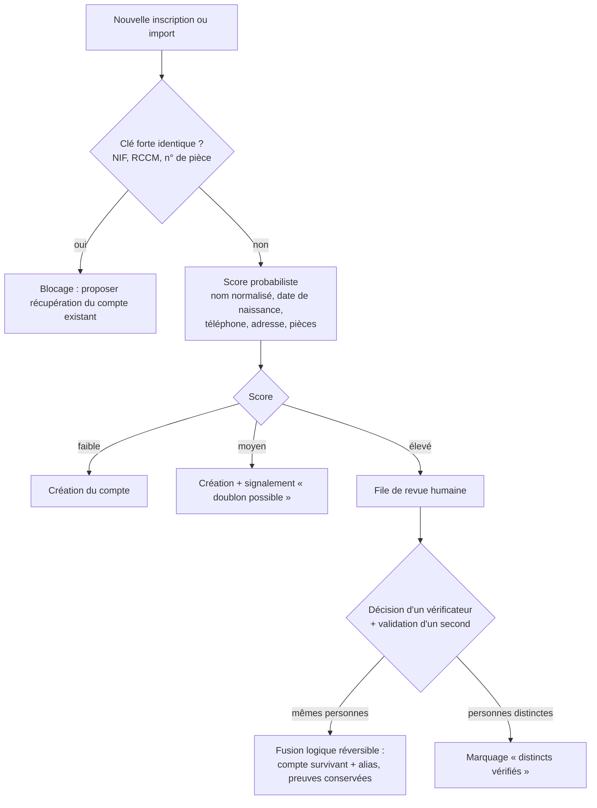
```mermaid
flowchart TD
  A[Nouvelle inscription ou import] --> B{Clé forte identique ?<br/>NIF, RCCM, n° de pièce}
  B -- oui --> C[Blocage : proposer récupération du compte existant]
  B -- non --> D[Score probabiliste<br/>nom normalisé, date de naissance,<br/>téléphone, adresse, pièces]
  D --> E{Score}
  E -- faible --> F[Création du compte]
  E -- moyen --> G[Création + signalement « doublon possible »]
  E -- élevé --> H[File de revue humaine]
  H --> I{Décision d'un vérificateur<br/>+ validation d'un second}
  I -- mêmes personnes --> J[Fusion logique réversible :<br/>compte survivant + alias, preuves conservées]
  I -- personnes distinctes --> K[Marquage « distincts vérifiés »]
```

Règles :

- **Clés fortes bloquantes** : deux comptes actifs ne peuvent porter le même NIF, le même RCCM ou le même numéro de pièce d'identité.
- **Normalisation des noms** adaptée aux usages congolais (ordre nom–post-nom–prénom variable, translittérations, homonymies fréquentes) ; la similarité de noms seule n'est **jamais** suffisante.
- **Fusion réversible** : le compte absorbé devient un alias ; aucune donnée ni preuve n'est écrasée ; la « défusion » est possible avec la même double validation.
- **Conflits sensibles** (propriété d'un bien de forte valeur, grand redevable, compte de fonctionnaire) : revue par un vérificateur de niveau supérieur.
- **Téléphone partagé** : un même numéro peut servir à plusieurs personnes d'un foyer ; il est un canal, pas un identifiant.

## 9.7 Cycle de vie du compte

`PROVISOIRE → ACTIF (N0…N3) → SUSPENDU (décision motivée) → CLÔTURÉ (décès, dissolution) → ARCHIVÉ`. Un compte n'est jamais supprimé ; la clôture conserve les obligations et l'historique selon les durées de conservation (chapitre 32). La récupération de compte (perte de téléphone, changement de numéro) exige une preuve d'identité au niveau du compte et une vérification hors bande pour les niveaux N2 et N3.

## 9.8 Ce que le compte unique change pour le contribuable

- Une seule saisie, une seule vue de tous ses objets, obligations, échéances et quittances.
- L'explication de chaque montant : règle, version, assiette, formule, échéance, voie de recours.
- Un paiement depuis le téléphone, avec référence unique et quittance immédiate vérifiable.
- Une contestation possible depuis chaque objet et chaque obligation, avec suivi du délai.
- Un mode diaspora : paiement par carte, mandataire local aux droits limités, quittances à distance.
- Un quitus fiscal numérique téléchargeable et vérifiable par tout service habilité.

# 10. Architecture fonctionnelle

## 10.1 Sept domaines, une responsabilité chacun

La plateforme est organisée en sept domaines fonctionnels. Chacun est propriétaire de ses données, expose des services aux autres et **s'interdit explicitement** certaines actions. Cette séparation est à la fois une règle d'architecture et un contrôle interne.

| Domaine | Responsabilité | Ne fait jamais |
|---|---|---|
| **D1 Identité et contribuable** | Comptes, rôles, vérification, mandats, consentements | Liquider une obligation |
| **D2 Objets et cadastre fiscal** | Recensement, géolocalisation, cycle de vie des objets | Trancher la propriété juridique |
| **D3 Droit et référentiel** | Instruments juridiques, fiches de règles, tarifs, exonérations, versions | Appliquer une règle non approuvée |
| **D4 Liquidation et obligations** | Déclarations, calculs, avis, échéanciers, pénalités légales, arriérés | Modifier une règle ou un paiement |
| **D5 Paiement, trésorerie et grand livre** | Ordres, événements de paiement, règlement, rapprochement, quittances, écritures | Créer une obligation |
| **D6 Contrôle et contentieux** | Missions, constats, notifications, recouvrement, recours | Encaisser |
| **D7 Pilotage, IA et audit** | Tableaux de bord, prévisions, détection, journal d'audit, recommandations | Décider ou exécuter un acte financier |

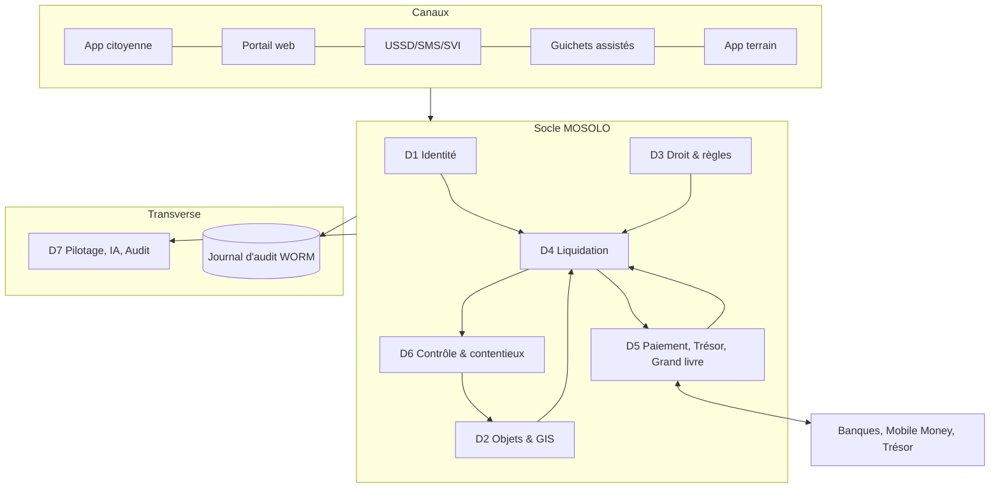
```mermaid
flowchart TB
  subgraph Canaux
    APP[App citoyenne] --- WEB[Portail web] --- USSD[USSD/SMS/SVI] --- GUI[Guichets assistés] --- FIELD[App terrain]
  end
  subgraph Socle["Socle MOSOLO"]
    D1[D1 Identité] --> D4
    D2[D2 Objets & GIS] --> D4
    D3[D3 Droit & règles] --> D4[D4 Liquidation]
    D4 --> D5[D5 Paiement, Trésor, Grand livre]
    D5 --> D4
    D4 --> D6[D6 Contrôle & contentieux]
    D6 --> D2
  end
  subgraph Transverse
    D7[D7 Pilotage, IA, Audit]
    AUD[(Journal d'audit WORM)]
  end
  Canaux --> Socle
  Socle --> D7
  Socle --> AUD
  D5 <--> BANK[Banques, Mobile Money, Trésor]
```

## 10.2 Principe de l'immutabilité des faits

**Les faits sont immuables ; les corrections sont des faits nouveaux.** Un constat erroné n'est pas effacé : il est annulé par un acte contraire, motivé, signé et relié à l'original. Une liquidation erronée est corrigée par une liquidation rectificative qui référence la précédente. Un paiement contesté est traité par un événement de litige, puis éventuellement par un contrepassement. Ce principe s'applique aux sept domaines.

## 10.3 Architecture multi-entités

MOSOLO fait coexister des entités dont les compétences, les calendriers et parfois les intérêts diffèrent : régies provinciales, ministères, communes, services techniques, opérateurs délégués, pouvoir central (pour l'exclusion des doublons), banques, sous-traitants, partenaires de données, audit et société civile.

| Partagé par toutes les entités (socle) | Propre à chaque entité (espace) |
|---|---|
| Identité et compte unique | Recettes, règles et tarifs relevant de sa compétence |
| Cadastre fiscal et identifiants géofiscaux | Circuits d'approbation, délais de service |
| Registre juridique et moteur de liquidation | Agents, équipes, missions |
| Paiements, grand livre, rapprochement | Comptes publics bénéficiaires propres, verrouillés |
| Moteur de titres et de quittances | Modèles de titres, de QR, de notifications |
| Audit, sécurité, journal | Tableaux de bord et rapports |

Règles de coexistence :

- **Une seule revendication par fait générateur.** Si deux entités revendiquent le même objet, pour le même fait générateur et la même période, le moteur bloque la seconde obligation et ouvre un dossier d'arbitrage au Comité juridique et tarifaire. Le contribuable ne voit jamais de double obligation.
- **Partage légal transparent.** Pour une recette partagée selon une clé légale, chaque entité voit sa part calculée et rapprochée ; aucune ne peut modifier la clé.
- **Aucune action hors périmètre.** Le cloisonnement est appliqué par le système (filtre par entité et par attributs), jamais par simple consigne.
- **Dépendances explicites.** Lorsqu'un service d'une entité dépend de la situation fiscale gérée par une autre (permis de bâtir conditionné au quitus), la condition est une règle versionnée, visible du citoyen, fondée sur un texte.
- **Ajout d'une entité ou d'un service sans redéveloppement**, par une fiche de configuration de module validée en maker-checker (entité responsable, types d'objets, règles, titres, canaux, workflows, tableaux de bord, dépendances).

# 11. Catalogue complet des modules

## 11.1 Les 55 modules de base

La numérotation 1 à 55 est commune au présent document, au Cahier des exigences v2.9 et à la Spécification fonctionnelle v1.2, qui détaille chaque module (finalité, fonctionnalités, fonctions système, contrôles, données, intégrations, indicateurs). Colonne « Base légale » : **E** = existe en principe, sous réserve de certification (ch. 6) ; **A** = acte requis pour tout ou partie ; **T** = module technique ou transverse.

| N° | Module | Domaine | Base légale | Release |
|---|---|---|---|---|
| 1 | Identité et compte contribuable | D1 | T | R1 |
| 2 | Enrôlement et vérification | D1 | T | R1 |
| 3 | Portail contribuable (self-service) | D1 | T | R1 |
| 4 | Application citoyenne Android | D1 | T | R1 |
| 5 | Portail web public | D1 | T | R1 |
| 6 | USSD et SMS | D1 | T | R1 |
| 7 | Gestionnaire des relations contribuable–objet | D2 | T | R1 |
| 8 | Cadastre fiscal géospatial | D2 | T | R1 |
| 9 | Intelligence foncière et locative | D2/D4 | E | R1 |
| 10 | Registre des activités et patentes | D2/D4 | E | R2 |
| 11 | Véhicules et circulation | D2/D4 | E | R2 |
| 12 | Autorisations de transport | D4 | E | R2 |
| 13 | Embarquement et débarquement | D4 | E | R3 |
| 14 | Stationnement public | D4 | E/A (zonage, tarifs) | R2 |
| 15 | Publicité extérieure | D4 | E | R2 |
| 16 | Antennes et infrastructures télécoms | D4 | E | R2 |
| 17 | Boissons, alcools et tabac | D4 | E | R2 |
| 18 | Plastiques et contributions environnementales | D4 | **A** | R4 (après acte) |
| 19 | Assainissement, déchets, voirie et drainage | D4 | E | R3 |
| 20 | Marchés et occupation du domaine public | D4 | E | R2 |
| 21 | Spectacles, événements et divertissement | D4 | E | R3 |
| 22 | Carrières et recettes minières | D4 | E | R3 |
| 23 | Recettes forestières | D4 | E | R4 |
| 24 | Ports, embarcations et accostage | D4 | E | R3 |
| 25 | Péage provincial | D4 | E/A | R4 |
| 26 | Moteur de règles juridiques et tarifaires | D3 | T | R1 |
| 27 | Déclaration et liquidation | D4 | T | R1 |
| 28 | Orchestration des paiements | D5 | T | R1 |
| 29 | Règlement en trésorerie | D5 | T | R1 |
| 30 | Rapprochement | D5 | T | R1 |
| 31 | Quittances électroniques | D5 | T | R1 |
| 32 | Arriérés et créances | D4 | T | R2 |
| 33 | Campagnes de recouvrement | D6 | T | R2 |
| 34 | Recensement terrain | D6/D2 | T | R1 |
| 35 | Inspection et constat | D6 | T | R1 |
| 36 | Dossiers d'exécution (enforcement) | D6 | E (procédure) | R3 |
| 37 | Réclamations et recours | D6 | E (procédure) | R1 |
| 38 | Gestion documentaire | T | T | R1 |
| 39 | Notifications et communication | T | T | R1 |
| 40 | Renseignement anti-fraude | D7 | T | R2 |
| 41 | Centre de commandement exécutif | D7 | T | R1 |
| 42 | Tableau de bord DGIPK | D7 | T | R1 |
| 43 | Tableau de bord DGRK | D7 | T | R1 |
| 44 | Tableaux de bord ministériels | D7 | T | R2 |
| 45 | Salle de contrôle finances et trésorerie | D7 | T | R1 |
| 46 | Audit et investigation | D7 | T | R1 |
| 47 | Prévision des recettes | D7 | T | R2 |
| 48 | Recommandation d'investissement public | D7 | T | R3 |
| 49 | Gestion des agents d'IA | D7 | T | R2 |
| 50 | Apprentissage et connaissance | T | T | R1 |
| 51 | Accès, rôles et délégations | T | T | R1 |
| 52 | Intégration et API | T | T | R1 |
| 53 | Administration de la plateforme | T | T | R1 |
| 54 | Transparence publique | D7 | T | R2 |
| 55 | Supervision et santé du système | T | T | R1 |

## 11.2 Modules complémentaires issus de l'analyse approfondie

L'analyse des processus, des risques et des documents de travail fait apparaître des modules indispensables qui ne figuraient pas dans la liste initiale. Les numéros 56 à 81 reprennent ceux de la Spécification fonctionnelle ; les numéros 82 à 95 sont **nouveaux dans la version 3.0**.

| N° | Module | Pourquoi il est nécessaire | Release |
|---|---|---|---|
| 56 | Grands redevables | 20 % des redevables portent souvent l'essentiel de certaines recettes (brasseries, télécoms, carrières) : suivi dédié, déclarations mensuelles, rapprochement de volumes | R2 |
| 57 | Registre des exonérations | Les exonérations et annulations sont un canal majeur d'érosion ; chaque exonération doit avoir un fondement, une preuve, une durée et deux approbateurs | R1 |
| 58 | Gestion des équipements terrain (MDM) | Enrôlement, révocation, effacement à distance, expiration des données hors ligne | R1 |
| 59 | Grand livre public en partie double | Aucune correction sans contre-écriture ; clôtures ; compte d'attente | R1 |
| 60 | Coffre des comptes bénéficiaires | Les comptes publics de destination sont des références verrouillées, modifiables uniquement sous quorum | R1 |
| 61 | Moteur de découverte des recettes | Pipeline signal → qualification juridique → estimation → décision | R2 |
| 62 | Rapprochement aérien (volet AVIA) | Rapprochement billetterie/embarquement/reversements, sous réserve de validation juridique | R4 |
| 63 | Enrôlement assisté et guichets MOSOLO | Inclusion des personnes sans téléphone ou peu alphabétisées | R1 |
| 64 | Serveur vocal interactif multilingue | Consultation et paiement à la voix en français, lingala, swahili, kikongo, tshiluba | R2 |
| 65 | Carte MOSOLO | Identifiant physique pour les personnes sans téléphone | R2 |
| 66 | Réseau des points de paiement agréés | Seul canal légitime d'encaissement en espèces, avec règlement quotidien vers le compte public | R1 |
| 67 | Portail des partenaires et des équipes terrain | Accréditation des sous-traitants, lots, missions, qualité | R2 |
| 68 | Vérification publique par code court | Vérifier une quittance, une carte ou un badge par SMS/USSD | R1 |
| 69 | Ligne de signalement et contrôles mystère | Signalements protégés d'abus, faux agents, demandes d'espèces | R2 |
| 70 | Moteur de titres et de validité | Titres à durée (stationnement, marchés, transport) : vert/ambre/rouge | R2 |
| 71 | Contrôle des titres | Vérification par plaque, QR ou code, en ligne et hors ligne | R2 |
| 72 | Espaces d'entité et configuration des modules | Cloisonnement multi-entités et ajout de services sans redéveloppement | R1 |
| 73 | Répartition légale des recettes | Calcul des parts légalement dues aux entités (province, ETD, etc.) sur recettes rapprochées ; aucun partage non fondé sur un texte | R3 |
| 74 | Invitations et gestion des accès | Accès des agents publics uniquement sur invitation en cascade ; inscription publique réservée aux contribuables | R1 |
| 75 | Stationnement intelligent | Zones, sessions, tarification réglementée, contrôle par plaque | R2 |
| 76 | Billetterie urbaine multi-opérateurs (RakaPay) | Droits d'accès à durée pour usages payants ; inclut le pass des moto-taxis (module 81) | R3 |
| 77 | Publicité extérieure augmentée | Registre et carte des supports, lecture optique, dossiers de constat | R2 |
| 78 | Hub de réconciliation aérienne | Connecteurs de données aériennes, sous validation juridique | R4 |
| 79 | Plaque fiscale immobilière | Plaque et QR par bâtiment, statut minimal au scan public | R2 |
| 80 | Contrôle de la dépense publique | Registre des comptes publics, justificatifs, correspondance ; pour l'organe de contrôle compétent | R4 |
| 81 | Pass professionnel des moto-taxis (wewa) — **extension de la billetterie RakaPay** (module 76) | Registre des motos, conducteurs, stations et coopératives ; pass wewa vendu, payé et contrôlé comme un ticket RakaPay ; fin des prélèvements informels | R3 |
| **82** | **Quitus fiscal numérique** | Délivrance instantanée, vérification par QR et API, révocation ; conditionnalité des services selon les textes | R1 |
| **83** | **Échéanciers et plans de paiement** | Paiement fractionné lorsque la loi le permet ; suivi des défauts | R2 |
| **84** | **Remboursements et restitutions** | Circuit distinct, quatre yeux, plafonds, rapprochement ; seule voie de sortie de fonds autorisée | R1 |
| **85** | **Référentiel territorial et adresses** | Communes, quartiers, avenues, rues, numérotation ; gestion des changements de limites | R1 |
| **86** | **Gestion des données de référence (MDM)** | Nomenclatures, catégories d'objets, rangs de localité, devises, taux de change officiels | R1 |
| **87** | **Consentements, droits des personnes et registre des traitements** | Conformité à la protection des données, accès, rectification, opposition lorsque applicable | R1 |
| **88** | **Gestion des contrats et conventions partenaires** | SLA des banques, opérateurs, sous-traitants ; pénalités ; échéances ; conditions tarifaires | R2 |
| **89** | **Gestion des taux de change officiels** | Conversion CDF/USD selon le taux légalement applicable à la date du fait générateur ou du paiement [À VÉRIFIER règle applicable] | R1 |
| **90** | **Régularisation volontaire** | Campagnes de régularisation avec conditions légales, délais et suivi | R2 |
| **91** | **Gestion des conflits d'intérêts et déclarations des agents** | Déclarations d'intérêts, liens avec des contribuables, récusation automatique d'affectation | R2 |
| **92** | **Laboratoire de simulation des politiques** | Simuler l'effet d'un tarif, d'une exonération ou d'un zonage avant tout acte | R3 |
| **93** | **Gestion des incidents et de la continuité** | Déclaration, qualification, communication, post-mortem ; mode dégradé des guichets | R1 |
| **94** | **Suivi législatif et réglementaire** | Veille des textes, alertes d'expiration, liens texte → règles impactées | R2 |
| **95** | **Relations avec les communes (espace ETD)** | Accueil ultérieur des recettes communales dans un espace distinct du compte unique | R4 |

## 11.3 Verticales

Les modules sectoriels sont regroupés en verticales qui partagent toutes le même socle. **Aucune verticale ne possède son propre compte contribuable, ses propres règles hors registre ni son propre circuit de paiement.**

| Verticale | Modules | Point de vigilance spécifique |
|---|---|---|
| MOSOLO Property | 7, 8, 9, 79 | Distinguer propriété déclarée, observée, vérifiée, contestée |
| MOSOLO Rental | 9 | Distinguer taux de l'impôt et taux de retenue ; preuve avant liquidation |
| MOSOLO Business | 10, 17, 56 | L'existence d'une activité ne vaut pas assujettissement |
| MOSOLO Mobility | 11, 12, 13, 25 | Coordination avec le pouvoir central (immatriculation) |
| MOSOLO Billetterie RakaPay | 76, 70, 71, **81 (pass wewa)** | Le pass des moto-taxis fait partie de RakaPay : même moteur de tickets, mêmes paiements, mêmes contrôles ; tarif fixé par acte |
| MOSOLO Parking | 14, 75 | Acte de zonage et barème requis |
| MOSOLO Advertising | 15, 77 | Constat humain, pas de sanction automatique |
| MOSOLO Telecom | 16 | Contentieux possible sur l'assiette ; dialogue avec les opérateurs |
| MOSOLO Markets & Public Domain | 20 | Collecte historiquement en espèces : priorité anti-fraude |
| MOSOLO Environment | 18, 19 | Contribution plastique non activable sans acte |
| MOSOLO Ports | 13, 24 | Cadrage sectoriel préalable |
| MOSOLO Events | 21 | Assiette déclarative sur billetterie |
| MOSOLO Construction | 22, 82 | Quitus et droits liés aux chantiers |
| MOSOLO Assets | 61, 92 | Valorisation d'actifs provinciaux par mise en concurrence |
| MOSOLO Recovery | 32, 33, 36, 83, 90 | Proportionnalité et recours |
| MOSOLO AVIA | 62, 78 | Validation juridique et coordination multi-acteurs préalables |

## 11.4 Architecture des communications événementielles

### 11.4.1 Principe : un seul moteur d'événements, tous les canaux

Toute communication de KINSHASA MOSOLO, qu'elle s'adresse à un contribuable, un agent public ou un partenaire, part d'**un événement métier** publié sur le bus d'événements par le domaine qui en est propriétaire (chapitre 10). Un seul moteur de communication (module 39) reçoit l'événement et le diffuse (*fan-out*) sur les canaux prévus : courriel, notification dans l'application, SMS, notification push, WhatsApp sur consentement, boîte de messages USSD, serveur vocal (SVI) et courrier imprimé. Aucun module n'envoie de message directement : c'est la garantie que chaque message est traçable, conforme à son modèle approuvé, traduit, et rattaché à la preuve de délivrance.

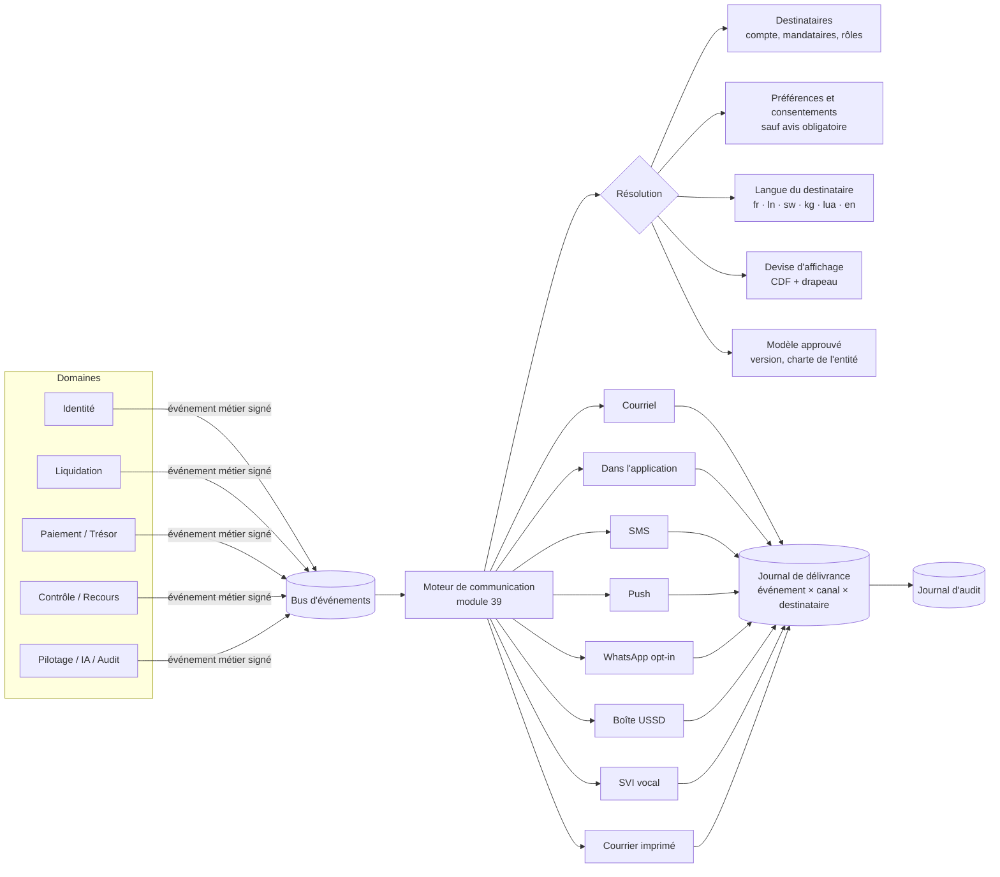
```mermaid
flowchart LR
  subgraph Domaines
    D1[Identité] & D4[Liquidation] & D5[Paiement / Trésor] & D6[Contrôle / Recours] & D7[Pilotage / IA / Audit]
  end
  D1 & D4 & D5 & D6 & D7 -->|événement métier signé| BUS[(Bus d'événements)]
  BUS --> CE[Moteur de communication<br/>module 39]
  CE --> R{Résolution}
  R --> P1[Destinataires<br/>compte, mandataires, rôles]
  R --> P2[Préférences et consentements<br/>sauf avis obligatoire]
  R --> P3[Langue du destinataire<br/>fr · ln · sw · kg · lua · en]
  R --> P4[Devise d'affichage<br/>CDF + drapeau]
  R --> P5[Modèle approuvé<br/>version, charte de l'entité]
  CE --> CH1[Courriel] & CH2[Dans l'application] & CH3[SMS] & CH4[Push] & CH5[WhatsApp opt-in] & CH6[Boîte USSD] & CH7[SVI vocal] & CH8[Courrier imprimé]
  CH1 & CH2 & CH3 & CH4 & CH5 & CH6 & CH7 & CH8 --> DL[(Journal de délivrance<br/>événement × canal × destinataire)]
  DL --> AUD[(Journal d'audit)]
```

### 11.4.2 Le catalogue d'événements

Le catalogue est une **donnée de référence versionnée** (`specs/evenements-communication.yaml`), et non du code : l'ajout ou la modification d'un événement suit un maker-checker (programme + entité concernée + juriste lorsque l'événement porte un avis légal). Il est reproduit intégralement à l'Annexe G.

| Indicateur du catalogue (version 1) | Valeur |
|---|---|
| Événements | **255** |
| Catégories | **23** |
| Avis obligatoires (non désinscriptibles) | **135** |
| Événements diffusés par défaut en courriel | 206 |
| … dans l'application | 248 |
| … par SMS | 117 |
| … par notification push | 43 |
| … dans la boîte USSD | 31 |
| … par SVI vocal | 11 |
| … par courrier imprimé | 26 |
| … éligibles à WhatsApp sur consentement | 64 |


| # | Catégorie | Exemples d'événements |
|---|---|---|
| 1 | Identité et compte | `account.registration.requested`, `account.verification.level_upgraded`, `account.merge.proposed`, `account.mosolo_card.issued` |
| 2 | Connexion et sécurité | `auth.login.suspicious`, `auth.device.new`, `auth.otp_code`, `auth.break_glass.used` |
| 3 | Mandats et représentants | `mandate.requested`, `mandate.action_performed` |
| 4 | Objets fiscaux et recensement | `object.provisional.created`, `object.link.approved`, `object.ownership.conflict`, `object.field_visit.scheduled` |
| 5 | Foncier et locatif | `lease.declared_by_tenant`, `rental.withholding.due`, `property.reclassification.proposed` |
| 6 | Déclarations et liquidation | `declaration.prefilled_ready`, `assessment.issued`, `assessment.explained`, `exemption.granted`, `installment_plan.defaulted` |
| 7 | Paiements | `payment.reference.issued`, `payment.confirmed`, `payment.duplicate_detected`, `payment.currency_converted`, `refund.paid` |
| 8 | Quittances et quitus | `receipt.issued_provisional`, `receipt.finalized`, `receipt.verification.fraud_suspected`, `clearance.issued` |
| 9 | Titres et autorisations | `permit.issued`, `permit.expiring`, `ticket.expiring`, `parking.violation.recorded` |
| 10 | Recouvrement et arriérés | `recovery.reminder.1`, `recovery.formal_notice`, `recovery.enforcement.proposed` |
| 11 | Missions et contrôle terrain | `mission.assigned`, `mission.expiring_offline_data`, `mission.geofence.breach`, `device.lost_reported` |
| 12 | Réclamations et recours | `appeal.submitted`, `appeal.decided`, `appeal.sla_breach` |
| 13 | Approbations et workflows | `approval.requested`, `approval.self_approval_blocked`, `beneficiary.change.proposed`, `beneficiary.change.cooling_off` |
| 14 | Registre juridique et règles | `rule.published`, `rule.conflict.detected`, `legal.instrument.abrogated` |
| 15 | Trésor et rapprochement | `settlement.delayed`, `reconciliation.exception.aged`, `ledger.imbalance`, `fx.rate.missing` |
| 16 | Anti-fraude et audit | `fraud.alert.raised`, `fraud.cash_request_reported`, `audit.log.integrity_failure` |
| 17 | Agents d'IA | `ai.recommendation_available`, `ai.human_intervention_required`, `ai.model.drift_detected` |
| 18 | Pilotage et tableaux de bord | `executive.daily_brief`, `kpi.threshold_breached`, `executive.alert` |
| 19 | Invitations et accès | `invitation.sent`, `delegation.granted`, `conflict_of_interest.detected` |
| 20 | Apprentissage et certification | `training.assigned`, `certification.expiring`, `procedure.changed` |
| 21 | Plateforme et continuité | `system.outage`, `system.channel_degraded`, `system.deadline_protection` |
| 22 | Données personnelles et consentement | `privacy.consent_request`, `privacy.data_shared_with_partner`, `privacy.breach_notification` |
| 23 | Partenaires et points de paiement | `partner.callback.signature_invalid`, `payment_point.settlement_overdue` |

Chaque événement porte : code stable, catégorie, libellé, objet du message par langue, gravité (`info`, `success`, `warning`, `critical`), canaux par défaut, éligibilité WhatsApp, caractère obligatoire, public (contribuable, agent public, partenaire), variables autorisées (`{{montant}}`, `{{reference}}`, `{{date}}`…) et, pour les avis légaux, la **référence au modèle d'acte approuvé** et aux mentions obligatoires (base légale, délai, voie de recours).

### 11.4.3 Avis obligatoires

Un avis est **obligatoire** lorsqu'il produit un effet de droit ou protège le destinataire : avis d'imposition, rectification, mise en demeure, mesure d'exécution, décision sur réclamation, refus ou retrait d'autorisation, contrepassement de paiement, annulation de quittance, conflit de propriété, alerte de sécurité, changement de coordonnées, partage de données, violation de données, changement de compte bénéficiaire public. Règles :

1. un avis obligatoire **ignore la désinscription** des communications facultatives, mais respecte le canal légalement valable (lorsque la notification électronique n'a pas de valeur juridique certaine, l'avis est **doublé** d'un exemplaire imprimable ou postal — J7, chapitre 6) ;
2. il est délivré au contribuable **et** à ses mandataires habilités ;
3. il n'est jamais envoyé sur WhatsApp ni sur un canal tiers non souverain ;
4. sa preuve de délivrance (accusé fournisseur, lecture dans l'application, remise en main propre avec signature) est versée au dossier et conditionne le décompte des délais légaux ;
5. en cas d'échec sur tous les canaux électroniques, une tâche de remise physique est créée automatiquement pour l'équipe terrain.

### 11.4.4 Canaux : règles d'usage

| Canal | Usage | Règles |
|---|---|---|
| Courriel | Avis détaillés, pièces jointes signées | Charte graphique de l'entité émettrice ; SPF, DKIM, DMARC ; aucune donnée sensible en clair dans l'objet |
| Dans l'application | Canal de référence, historique complet | Chaque message est consultable à vie dans le compte |
| SMS | Rappels, OTP, confirmations, alertes | 160 caractères, langue du destinataire ; **jamais de lien de paiement** (lutte contre l'hameçonnage) — le contribuable est invité à composer le code USSD officiel |
| Push | Agents terrain, contribuables avec application | Contenu minimal, détail dans l'application |
| WhatsApp | Rappels et informations non sensibles | **Consentement préalable explicite**, pas d'avis obligatoire, pas de montant nominatif, via un fournisseur contractualisé ; désactivable par l'autorité de protection des données |
| Boîte USSD | Contribuables sans smartphone | Messages en attente consultables via le code court |
| SVI vocal | Personnes peu alphabétisées | Messages enregistrés dans les cinq langues nationales et en français |
| Courrier imprimé | Avis légaux, échec des canaux électroniques | Généré avec QR de vérification ; remise tracée |

**Anti-usurpation.** Les expéditeurs (nom SMS, domaine de courriel, compte WhatsApp certifié, numéro SVI) sont **uniques et publiés**. Tout message peut être vérifié par le destinataire (code court de vérification, module 68). Les campagnes de sensibilisation rappellent qu'un agent MOSOLO ne demande jamais d'espèces ni de code OTP.

### 11.4.5 Préférences, fréquence et heures de silence

Le contribuable choisit ses canaux et sa langue pour les communications facultatives. Le moteur applique un **plafond de fréquence** (par exemple : pas plus de deux rappels facultatifs par semaine et par obligation) et des **heures de silence** (pas de SMS ni de push facultatif entre 21 h et 7 h), sauf alertes de sécurité. Les agents publics ne peuvent pas désactiver les notifications de mission, d'approbation ou de sécurité pendant leur service.

### 11.4.6 Modèles et assurance qualité

| Fonction | Description |
|---|---|
| Modèles versionnés | Un modèle par événement × canal × langue ; maker-checker (rédacteur, relecteur linguistique, juriste pour les avis légaux) |
| Charte par entité | Logo, couleurs, coordonnées et mentions de l'entité émettrice (DGIPK, DGTK, ministère, commune) appliqués automatiquement, pour que le citoyen sache toujours qui lui écrit |
| Aperçu | Rendu exact de ce que reçoit le destinataire, par canal et par langue, avec données fictives |
| Envoi de test à soi-même | Déclenche l'événement réel vers l'utilisateur qui teste, sur tous ses canaux |
| Mode bac à sable | Si la clé d'un fournisseur n'est pas configurée (environnement de recette), l'envoi est **enregistré** comme « journalisé » sans être transmis : le parcours est toujours testable |
| Contrôles automatiques | Variables manquantes, longueur SMS, présence des mentions légales obligatoires, cohérence des montants et devises, traduction complète dans les langues actives |

### 11.4.7 Journal de délivrance

Chaque combinaison **événement × canal × destinataire** crée une ligne de délivrance : identifiant d'événement, canal, fournisseur, statut (`en_file`, `envoyé`, `délivré`, `lu`, `échoué`, `journalisé` en bac à sable, `supprimé_par_préférence`), horodatages, nombre de tentatives, coût unitaire, empreinte du contenu. Le journal alimente : la preuve de notification des avis légaux ; le tableau de bord des communications (taux de délivrance par canal et par opérateur, coût, échecs) ; la détection d'anomalies (numéro recevant les avis de nombreux contribuables sans lien de mandat).

| Écran « Communications » (administration du module 39) | Contenu |
|---|---|
| Cartes de synthèse | Événements au catalogue ; catégories ; avis obligatoires ; messages délivrés / tentés ; canaux raccordés |
| Couverture par canal | Nombre d'événements diffusés par défaut sur chaque canal et nombre de messages envoyés sur la période |
| Assurance qualité des modèles | Sélecteur d'événement et d'entité, aperçu, envoi de test |
| Dernières délivrances | Flux temps réel événement × canal × destinataire (masqué selon les droits) et statut |
| Catalogue | Événements par catégorie, gravité, canaux, caractère obligatoire |

## 11.5 Plateforme multilingue

| Langue | Code | Rôle |
|---|---|---|
| Français | `fr` | **Langue de référence** : seule version juridiquement opposable des avis et décisions |
| Lingala | `ln` | Langue nationale ; langue d'usage majoritaire à Kinshasa |
| Kiswahili | `sw` | Langue nationale |
| Kikongo | `kg` | Langue nationale |
| Tshiluba | `lua` | Langue nationale |
| Anglais | `en` | Diaspora, investisseurs, partenaires |

Règles : toutes les chaînes d'interface, tous les modèles de messages, tous les contenus d'apprentissage et tous les messages SVI sont externalisés dans des fichiers de ressources (format ICU MessageFormat, gestion des pluriels et du genre) ; la langue est un attribut du compte, modifiable à tout moment ; les avis légaux en langue nationale portent la mention « traduction d'information — la version française fait foi » et un lien vers la version française ; les traductions sont validées par des relecteurs natifs rémunérés, avec glossaire fiscal commun ; un indicateur « complétude de traduction » bloque l'activation d'une langue incomplète pour un parcours donné. **Les langues sont désignées par leur nom natif, jamais par un drapeau** (une langue n'est pas un pays).

## 11.6 Plateforme multidevise : le franc congolais comme devise principale

### 11.6.1 Principes

1. **Le franc congolais (🇨🇩 CDF) est la devise principale** de la plateforme : devise de consolidation de tous les tableaux de bord, du grand livre de synthèse, des prévisions et du tableau de transparence.
2. **La devise de l'obligation est celle fixée par la règle légale.** Lorsqu'un arrêté fixe un tarif en dollars américains (cas rapporté de l'impôt foncier 2026), l'obligation est libellée en 🇺🇸 USD et affichée avec sa contre-valeur indicative en 🇨🇩 CDF ; la plateforme ne convertit jamais d'elle-même une obligation légalement libellée dans une devise en une autre.
3. **Chaque devise est représentée par le drapeau de son pays émetteur**, placé devant le code ISO 4217 et le montant : 🇨🇩 CDF 1 250 000,00 · 🇺🇸 USD 450,00 · 🇪🇺 EUR 410,00. Pour une devise commune à plusieurs pays, le drapeau de l'union monétaire (🇪🇺 pour l'euro) ou un drapeau de référence configurable est utilisé.
4. **Les taux de change sont ceux de la source officielle** désignée par le texte (en principe le cours indicatif de la Banque Centrale du Congo), importés quotidiennement, signés, horodatés et jamais saisis à la main. La règle précisant **quel taux s'applique à quelle date** (fait générateur, émission de l'avis, paiement) est une règle juridique certifiée [À VÉRIFIER J3].
5. **Le montant payé dans une devise étrangère** (carte de la diaspora, par exemple) est converti par le prestataire selon le contrat, puis rapproché dans la devise de l'obligation ; l'écart de change éventuel est traité par règle (tolérance, reliquat, trop-perçu) et visible du contribuable (`payment.currency_converted`).
6. **Aucune écriture comptable n'est convertie rétroactivement** : chaque écriture conserve sa devise d'origine, le taux appliqué et sa contre-valeur en CDF.

### 11.6.2 Référentiel des devises

Le référentiel (`specs/devises.yaml`, module 89) distingue le rôle de chaque devise :

| Drapeau | Code | Devise | Rôle | Liquidation | Paiement |
|---|---|---|---|---|---|
| 🇨🇩 | CDF | Franc congolais | **Principale** | Oui | Oui |
| 🇺🇸 | USD | Dollar américain | Légale secondaire (si la règle l'exige) | Si la règle l'exige | Oui |
| 🇪🇺 | EUR | Euro | Paiement diaspora | Non | Carte ou virement, converti |
| 🇬🇧 | GBP | Livre sterling | Paiement diaspora | Non | Carte, converti |
| 🇨🇦 | CAD | Dollar canadien | Paiement diaspora | Non | Carte, converti |
| 🇨🇭 | CHF | Franc suisse | Paiement diaspora | Non | Carte, converti |
| 🇿🇦 | ZAR | Rand sud-africain | Paiement diaspora | Non | Carte, converti |
| 🇨🇬 | XAF | Franc CFA (CEMAC) | Affichage | Non | Non |
| 🇦🇴 | AOA | Kwanza | Affichage | Non | Non |
| 🇿🇲 | ZMW | Kwacha zambien | Affichage | Non | Non |
| 🇷🇼 | RWF | Franc rwandais | Affichage | Non | Non |
| 🇺🇬 | UGX | Shilling ougandais | Affichage | Non | Non |
| 🇰🇪 | KES | Shilling kényan | Affichage | Non | Non |
| 🇹🇿 | TZS | Shilling tanzanien | Affichage | Non | Non |
| 🇧🇮 | BIF | Franc burundais | Affichage | Non | Non |
| 🇨🇳 | CNY | Yuan renminbi | Affichage | Non | Non |
| 🇦🇪 | AED | Dirham des Émirats | Affichage | Non | Non |

L'activation d'une devise pour le **paiement** exige un contrat avec un prestataire habilité et la conformité à la réglementation des changes [À VÉRIFIER : règles de la BCC sur l'encaissement de recettes publiques en devises].

### 11.6.3 Règles d'affichage et de calcul

| Règle | Détail |
|---|---|
| Format | Drapeau + code ISO + montant selon la langue : `🇨🇩 CDF 1 250 000,00` (fr), séparateurs selon la locale ; le code ISO est toujours présent, car les drapeaux ne s'affichent pas sur tous les terminaux ni dans les SMS |
| SMS et USSD | Code ISO seul (`CDF 1250000`), sans drapeau (jeu de caractères limité) |
| SVI | Montant énoncé dans la langue avec le nom de la devise (« un million deux cent cinquante mille francs congolais ») |
| Précision | Calcul en décimal exact (jamais en virgule flottante) ; arrondi défini par la règle (`rounding`) ; décimales selon la devise |
| Double affichage | Obligation en USD : montant légal en USD + contre-valeur CDF « à titre indicatif au taux officiel du JJ/MM/AAAA » |
| Tableaux de bord | Consolidation en CDF ; bascule d'affichage en USD pour comparaison, avec le taux et la date utilisés |
| Données | `Money { amount: decimal, currency: ISO4217 }` ; toute opération entre devises différentes sans conversion explicite est rejetée par le type |

Critère d'acceptation : **Étant donné** une obligation légalement libellée en USD et un paiement en EUR par carte, **lorsque** le paiement est confirmé, **alors** la quittance mentionne le montant de l'obligation en 🇺🇸 USD, le montant payé en 🇪🇺 EUR, le taux et sa source, la contre-valeur en 🇨🇩 CDF, et tout écart est traité par la règle de tolérance sans intervention manuelle.

# 12. Rôles et matrice d'habilitations

## 12.1 Modèle d'autorisation : RBAC + ABAC

L'autorisation combine des **rôles** (ce qu'une fonction peut faire) et des **attributs** (dans quel périmètre, à quel moment, sur quel appareil, pour quelle finalité). Une décision d'accès est évaluée par un moteur de politiques centralisé (policy decision point) à chaque requête, jamais dans l'interface.

| Attribut | Exemples | Effet |
|---|---|---|
| Entité | DGIPK, DGTK, ministère X, commune Y | Cloisonnement par entité |
| Territoire | Commune, quartier, polygone de mission | Agent limité à sa zone |
| Dossier assigné | Mission, dossier de contrôle, recours | Accès limité aux objets du dossier |
| Plage horaire | Horaires de service, durée de mission | Refus hors plage, sauf astreinte déclarée |
| Appareil | Terminal enrôlé et conforme (MDM) | Refus depuis un appareil non enrôlé |
| Niveau d'authentification | Mot de passe + OTP, clé d'accès (passkey), clé matérielle | Actions sensibles réservées aux facteurs résistants à l'hameçonnage |
| Sensibilité de la donnée | C1 à C5 (ch. 32) | Masquage, champ par champ |
| Finalité déclarée | Contrôle, recours, audit, enquête | Finalité journalisée ; accès « bris de glace » motivé et revu |
| Conflit d'intérêts | Lien déclaré ou détecté avec le contribuable | Récusation automatique |
| Durée | Délégation temporaire, accès privilégié juste-à-temps | Expiration automatique |

## 12.2 Principes de contrôle interne

| Principe | Mise en œuvre |
|---|---|
| Moindre privilège | Rôles fins ; aucun droit par défaut ; revue trimestrielle des accès |
| Séparation des tâches | Incompatibilités codées (tableau § 12.5) ; un utilisateur ne peut cumuler deux rôles incompatibles |
| Maker-checker / quatre yeux | Initiateur ≠ vérificateur pour toute opération critique ; auto-validation impossible |
| Contrôle double (dual control) | Opérations les plus sensibles : deux approbateurs + délai de refroidissement |
| Délégation temporaire | Datée, bornée, motivée, visible, révocable ; non re-déléguable |
| Accès privilégié juste-à-temps | Élévation sur demande motivée, approuvée, limitée dans le temps, session enregistrée |
| MFA | Obligatoire pour tout compte de travail ; résistante à l'hameçonnage pour les rôles sensibles |
| Authentification de l'appareil | Certificat d'appareil pour les terminaux terrain et les postes sensibles |
| Expiration des accès | Tout accès de travail a une date de fin ; renouvellement sur revue |
| Détection des conflits d'intérêts | Déclarations (module 91) + détection de liens (adresse, téléphone, compte bancaire communs) |
| Revues d'accès | Trimestrielles par les responsables d'entité ; semestrielles par l'audit interne |
| Journalisation complète | Toute consultation de donnée C4–C5 et toute action sont journalisées |

## 12.3 Rôles

| Code | Rôle | Mission | Périmètre |
|---|---|---|---|
| R01 | **Gouverneur** | Vision exécutive consolidée, priorités stratégiques, demandes d'enquête | Toute la province, **agrégats** ; détail nominatif uniquement via une demande d'enquête motivée instruite par l'audit |
| R02 | **Directeur de cabinet du Gouverneur** | Coordination et suivi, sur délégation formelle | Comme R01, dans les limites de la délégation écrite |
| R03 | **Secrétaire général du Gouvernement provincial** | Coordination gouvernementale, décisions, suivi de mise en œuvre | Décisions, actes, tableaux de suivi ; pas de données fiscales individuelles |
| R04 | **Ministre provincial** | Pilotage du périmètre légal de son ministère | Modules et recettes relevant de son ministère ; agrégats |
| R05 | **Ministre provincial des Finances** | Tutelle des régies, politique fiscale, approbation des règles relevant de sa compétence | Agrégats de toutes les recettes ; approbation des règles et tarifs selon texte |
| R06 | **Directeur général DGIPK / DGTK** | Direction opérationnelle de la régie | Recettes de sa régie ; nominatif dans son périmètre |
| R07 | **Directeur / chef de service de régie** | Gestion d'un service (assiette, contrôle, recouvrement, contentieux) | Service et territoire |
| R08 | **Administrateur d'entité** | Gestion des agents, affectations et workflows approuvés de son entité | Personnes et configurations de son entité ; **aucun accès aux montants** |
| R09 | **Superviseur terrain** | Planification et contrôle qualité des missions | Équipes et zones assignées |
| R10 | **Agent de terrain / recenseur** | Recensement, constat, notification | Missions assignées ; données minimales |
| R11 | **Contrôleur / vérificateur** | Contrôle sur pièces et sur place, proposition de rectification | Dossiers assignés |
| R12 | **Agent de guichet / enrôlement assisté** | Enrôlement, assistance, remise de cartes | Guichet ; pas d'encaissement sauf point agréé |
| R13 | **Juriste rédacteur de règles** | Rédaction des fiches de règles | Registre juridique, brouillons |
| R14 | **Juriste vérificateur** | Visa juridique | Registre juridique |
| R15 | **Validateur financier des règles** | Visa financier et budgétaire | Registre juridique |
| R16 | **Autorité de publication** | Publication d'une règle approuvée | Registre juridique |
| R17 | **Comptable public / Trésor** | Prise en charge, règlement, rapprochement, écritures | Paiements, relevés, grand livre ; **ne crée aucune obligation** |
| R18 | **Analyste de rapprochement** | Traitement des exceptions de rapprochement | Files d'exception |
| R19 | **Gestionnaire du coffre des bénéficiaires** (×3 minimum) | Proposition et approbation des changements de comptes publics | Coffre ; quorum obligatoire |
| R20 | **Agent de contentieux** | Instruction des réclamations et recours | Dossiers assignés |
| R21 | **Autorité de décision contentieuse** | Décision sur réclamation | Dossiers instruits |
| R22 | **Auditeur interne** | Audit, lecture intégrale des preuves | Lecture seule, tout périmètre, journal des consultations |
| R23 | **Auditeur externe / Cour des comptes / inspection** | Contrôle externe | Accès contrôlé, lecture seule, par mission |
| R24 | **Enquêteur anti-fraude** | Instruction des alertes | Dossiers d'enquête ; accès nominatif motivé |
| R25 | **Délégué à la protection des données** | Conformité, droits des personnes | Registre des traitements, journaux d'accès |
| R26 | **Super-administrateur de la plateforme** | Configuration technique, disponibilité, sécurité, versions, identité | Technique ; **aucun pouvoir financier** |
| R27 | **Ingénieur d'exploitation / support** | Exploitation, incidents | Technique ; données masquées ; accès JIT |
| R28 | **Responsable sécurité (RSSI)** | Politique de sécurité, SIEM, incidents | Journaux de sécurité |
| R29 | **Gestionnaire des modèles d'IA** | Versions, validation, surveillance | Registre des modèles ; données d'entraînement approuvées |
| R30 | **Contribuable** | Ses données, ses objets, ses obligations | Son compte |
| R31 | **Mandataire** | Agir pour un mandant | Mandat (périmètre, durée) |
| R32 | **Point de paiement agréé** | Encaissement sur référence | API de paiement ; aucune donnée fiscale au-delà du montant de la référence |
| R33 | **Partenaire bancaire / monnaie mobile** | Confirmation, règlement | API du canal |
| R34 | **Partenaire de données** | Fourniture de données sous protocole | API d'import restreinte |
| R35 | **Sous-traitant terrain (responsable)** | Gestion de ses équipes accréditées | Ses agents, ses lots ; aucune donnée fiscale |
| R36 | **Observateur de la société civile** | Suivi des agrégats et de la transparence | Tableau public enrichi, sans nominatif |
| R37 | **Service utilisateur du quitus** (urbanisme, marchés publics…) | Vérifier un quitus | API de vérification : oui/non + validité |

## 12.4 Matrice synthétique : Voir / Initier / Approuver / Interdit

Légende : **V** voir (agrégats) ; **Vn** voir nominatif dans le périmètre ; **I** initier ; **A** approuver ; **—** aucun accès ; **✖** interdit par construction (aucun rôle ne peut le faire seul).

| Action | R01 Gouv. | R04 Min. | R06 DG régie | R10 Agent | R11 Contrôleur | R13–16 Juridique | R17 Trésor | R19 Coffre | R22 Audit | R26 Super-admin | R30 Contrib. |
|---|---|---|---|---|---|---|---|---|---|---|---|
| Tableau exécutif consolidé | V | V (périmètre) | V (régie) | — | — | — | V (financier) | — | V | — | — |
| Données fiscales d'un contribuable | Sur enquête motivée | — | Vn | Vn minimal (mission) | Vn (dossier) | — | Vn (paiements) | — | Vn | — (masqué) | Vn (soi) |
| Créer un objet provisoire | — | — | I | I | I | — | — | — | — | — | I (déclaration) |
| Valider un objet / rattachement | — | — | A | — | I | — | — | — | — | — | — |
| Rédiger / viser / publier une règle | — | A (selon texte) | — | — | — | I / A / A (4 personnes distinctes) | — | — | V | ✖ | — |
| Émettre une obligation | — | — | Automate (règle active) | — | Propose rectification | — | ✖ | — | V | ✖ | — |
| Rectifier / annuler une obligation | — | — | A (2e niveau) | — | I | — | ✖ | — | V | ✖ | Réclame |
| Accorder une exonération | — | A (si texte) | I / A (quatre yeux) | — | — | Vérifie fondement | — | — | V | ✖ | Demande |
| Enregistrer un paiement | — | — | — | ✖ | ✖ | — | Événement prestataire uniquement | — | V | ✖ | Initie |
| Rapprocher / traiter une exception | — | — | V | — | — | — | I / A (quatre yeux) | — | V | ✖ | — |
| Remboursement | — | — | I (motivé) | — | — | — | A (2 approbateurs) | — | V | ✖ | Demande |
| Modifier un compte bénéficiaire | ✖ | ✖ | ✖ | ✖ | ✖ | ✖ | Propose | A (quorum 2 sur 3 + hors bande + 72 h) | V | ✖ | — |
| Émettre / annuler une quittance | — | — | — | — | — | — | Automate ; annulation par contrepassement A | — | V | ✖ | Vérifie |
| Lancer une mission terrain | — | — | A | Exécute | I | — | — | — | V | — | — |
| Engager un acte de poursuite | — | — | A (autorité légale) | — | I | — | — | — | V | ✖ | Recours |
| Décider d'une réclamation | — | — | A (selon texte) | — | — | Avis | — | — | V | ✖ | Initie |
| Consulter le journal d'audit | Agrégats d'alertes | — | Son entité | — | — | — | Son périmètre | — | **Intégral** | Technique uniquement | Son historique |
| Supprimer une écriture ou un événement d'audit | ✖ | ✖ | ✖ | ✖ | ✖ | ✖ | ✖ | ✖ | ✖ | ✖ | ✖ |
| Déployer une version logicielle | — | — | — | — | — | — | — | — | V | I (A par comité des changements) | — |
| Attribuer un rôle | — | — | A (son entité) | — | — | — | — | — | V | Technique uniquement, sur demande approuvée | — |

**Le Gouverneur** dispose de la vision la plus large sur les agrégats, les performances par ministère, régie, commune et catégorie, les alertes critiques, les prévisions et les recommandations. Il peut demander une enquête, approuver des priorités stratégiques et recevoir les rapports exécutifs. **Il ne peut pas** supprimer une transaction, réécrire une quittance, modifier un compte bénéficiaire ou altérer une preuve d'audit ; aucune interface ne le permet, et toute tentative indirecte (demande à un technicien) laisserait une trace et exigerait des approbations qu'il ne peut pas donner seul.

**Le super-administrateur de la plateforme** gère la configuration technique, la disponibilité, les espaces d'entité, les politiques de sécurité, la santé des intégrations, les versions, les systèmes d'identité et le support. **Il n'a aucun pouvoir** sur les obligations, les paiements, les comptes bénéficiaires ni les journaux d'audit : les données financières sont signées par des clés qu'il ne détient pas, le journal d'audit est répliqué dans un stockage WORM hors de son contrôle, et ses propres actions sont journalisées vers un SIEM surveillé par le RSSI et l'audit.

## 12.5 Incompatibilités (séparation des tâches)

| Rôle A | Incompatible avec | Raison |
|---|---|---|
| Rédacteur de règle | Vérificateur, validateur financier, publicateur de la même règle | Quatre yeux juridiques |
| Agent de terrain | Contrôleur qualité de ses propres constats ; toute fonction de paiement | Constat ≠ contrôle ≠ encaissement |
| Initiateur d'exonération | Approbateur de la même exonération | Quatre yeux |
| Analyste de rapprochement | Approbateur de la même exception | Quatre yeux |
| Initiateur de remboursement | Approbateur ; bénéficiaire lié | Anti-détournement |
| Gestionnaire du coffre | Comptable qui exécute les virements | Séparation proposition/exécution |
| Super-administrateur | Tout rôle métier ou financier | Séparation technique/financier |
| Gestionnaire de modèles d'IA | Utilisateur métier décidant sur la base du modèle | Indépendance de la validation |
| Auditeur | Tout rôle opérationnel | Indépendance |

## 12.6 La Constitution financière MOSOLO

> **« Aucun individu ne possède les clés du système financier. »**

| Opération critique | Initiateur | Vérificateur | Approbateur | Contrôles additionnels |
|---|---|---|---|---|
| Publication d'une règle | Juriste rédacteur | Juriste vérificateur | Validateur financier + autorité de publication | Pièce officielle hachée ; tests de cas juridiques verts |
| Changement de compte bénéficiaire | Trésor | Gestionnaire du coffre n° 1 | Gestionnaires n° 2 et n° 3 (quorum 2 sur 3) | Confirmation hors bande auprès de la banque ; délai de refroidissement de 72 heures ; notification au Gouverneur, au ministre des Finances et à l'audit ; journal immuable |
| Exonération | Agent de régie | Juriste | Chef de service + (au-delà d'un seuil) directeur | Fondement légal, pièce, durée ; alerte de concentration |
| Annulation / rectification d'obligation | Contrôleur | Chef de service | Directeur au-delà d'un seuil | Motif codifié ; contre-écriture |
| Remboursement | Régie | Trésor | Deux approbateurs | Plafond ; vers le compte d'origine uniquement ; délai |
| Contrepassement de paiement | Trésor | Analyste | Chef comptable | Preuve prestataire |
| Attribution d'un rôle sensible | Responsable d'entité | Sécurité | Comité des accès | Durée limitée |
| Mise en production logicielle | Équipe | Revue de code et sécurité | Comité de contrôle des changements | Signature des artefacts ; déploiement reproductible |
| Accès privilégié à la production | Ingénieur | RSSI | Responsable d'exploitation | Juste-à-temps, session enregistrée |

## 12.7 Accès des agents publics : invitation en cascade

L'inscription publique est réservée aux contribuables. Les comptes de travail ne sont créés **que sur invitation** : le Comité de pilotage invite les responsables d'entité, qui invitent leurs directeurs, qui invitent leurs agents, chacun dans son périmètre et sans pouvoir accorder plus de droits qu'il n'en détient. Une invitation est nominative, limitée dans le temps, liée à une adresse ou un numéro vérifié, et finalisée par la personne invitée elle-même (ou par l'opérateur d'accès de son entité, en sa présence). Tout compte de travail inactif 60 jours est suspendu.

# 13. Parcours des contribuables

## 13.1 Inscription et rattachement d'un bien (propriétaire)

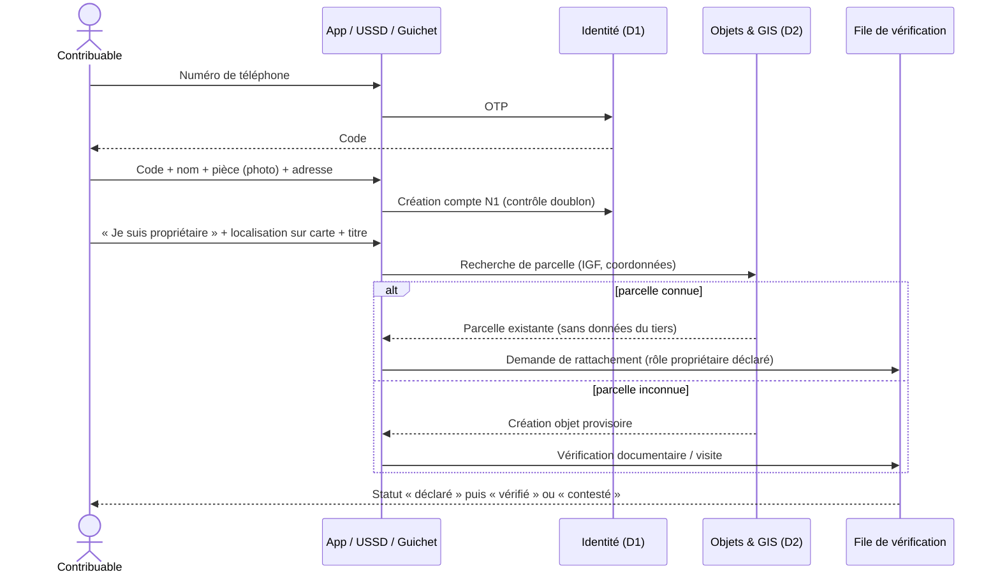
```mermaid
sequenceDiagram
  actor C as Contribuable
  participant A as App / USSD / Guichet
  participant ID as Identité (D1)
  participant OBJ as Objets & GIS (D2)
  participant Q as File de vérification
  C->>A: Numéro de téléphone
  A->>ID: OTP
  ID-->>C: Code
  C->>A: Code + nom + pièce (photo) + adresse
  A->>ID: Création compte N1 (contrôle doublon)
  C->>A: « Je suis propriétaire » + localisation sur carte + titre
  A->>OBJ: Recherche de parcelle (IGF, coordonnées)
  alt parcelle connue
    OBJ-->>A: Parcelle existante (sans données du tiers)
    A->>Q: Demande de rattachement (rôle propriétaire déclaré)
  else parcelle inconnue
    OBJ-->>A: Création objet provisoire
    A->>Q: Vérification documentaire / visite
  end
  Q-->>C: Statut « déclaré » puis « vérifié » ou « contesté »
```

Critère d'acceptation : **Étant donné** un contribuable N1 déclarant être propriétaire d'une parcelle déjà rattachée à un autre compte, **lorsqu'il** soumet sa demande, **alors** aucune donnée de l'autre compte ne lui est montrée, un dossier de conflit est ouvert, et aucune obligation n'est déplacée tant que le dossier n'est pas tranché.

## 13.2 Déclaration et paiement annuels

1. **J−45** avant l'échéance : notification « votre déclaration est prête » (SMS, application, USSD).
2. Le contribuable ouvre sa déclaration **pré-remplie** (objets vérifiés, baux déclarés, rang de localité).
3. Il confirme ou corrige (toute correction à la baisse d'un élément vérifié ouvre une vérification, sans bloquer le paiement de la partie non contestée).
4. Le moteur liquide et affiche l'**explication** : règle, version, base légale, assiette, formule, montant, échéance, voie de recours.
5. Le contribuable choisit un canal ; une référence unique est émise.
6. Paiement ; confirmation du prestataire ; **quittance électronique** émise avec statut « en attente de règlement », puis « définitive » après rapprochement.
7. Quitus fiscal mis à jour automatiquement.

## 13.3 Parcours locataire

Le locataire déclare son bail (bailleur, unité, loyer, preuve). Si le locataire est une personne morale ou une administration soumise à la retenue [À VÉRIFIER J3], la plateforme calcule la retenue par échéance de loyer, émet la référence de reversement, puis délivre au locataire une attestation de retenue et crédite l'obligation du bailleur. Le locataire personne physique **n'est jamais rendu débiteur de l'impôt du bailleur** sans texte ; sa déclaration sert de signal et de preuve, protégée contre les représailles (le bailleur ne voit pas qui a déclaré).

## 13.4 Contestation

Depuis chaque objet ou obligation : bouton « Contester ». Le contribuable choisit le motif codifié (je ne suis pas propriétaire, surface erronée, bien non loué, montant erroné, déjà payé, exonéré), joint ses pièces et reçoit un accusé de réception horodaté avec le délai légal de réponse [À VÉRIFIER J4]. Le statut « contesté » est visible ; l'effet suspensif éventuel s'applique selon le texte ; la partie non contestée reste payable.

## 13.5 Parcours diaspora

Inscription à distance (passeport, vidéo-vérification si l'acte le permet), paiement par carte internationale ou virement vers le compte public, désignation d'un mandataire local aux droits limités (consulter, déclarer, recevoir les notifications — pas modifier les coordonnées bancaires ni fermer le compte), téléchargement des quittances et du quitus.

## 13.6 Parcours sans smartphone ni lecture

1. Au guichet communal ou auprès d'un agent habilité : identification par pièce ; photo ; consentement oral enregistré ; empreinte comme marque de consentement si l'acte le permet.
2. Remise d'une **carte MOSOLO** (QR + code court) ; le numéro de téléphone d'un proche peut être associé comme canal, pas comme identité.
3. Consultation et paiement par **SVI** (serveur vocal) en lingala, swahili, kikongo, tshiluba ou français, ou chez un point de paiement agréé qui scanne la carte.
4. Quittance imprimée avec QR, vérifiable par quiconque.

## 13.7 Parcours entreprise

Inscription par le représentant légal (N3 : RCCM, NIF, mandat), création de l'espace entreprise, déclaration des établissements, désignation de mandataires internes (comptable, juriste) avec droits séparés (préparer / valider / payer), déclarations mensuelles structurées (retenues IRL, volumes pour les grands redevables), API pour les grands redevables, quitus fiscal téléchargeable pour les soumissions.

## 13.8 Parcours des opérateurs spécialisés (synthèse)

| Profil | Objet principal | Titre ou obligation | Canal privilégié |
|---|---|---|---|
| Transporteur | Véhicule, ligne | Autorisation de transport ; embarquement | Application, USSD |
| Moto-taxi (wewa) | Moto, conducteur | Pass wewa RakaPay — jour, semaine, mois (après acte) | USSD, coopérative |
| Commerçant de marché | Étal | Titre journalier à mensuel | USSD, carte MOSOLO |
| Annonceur | Support | Autorisation annuelle | Portail |
| Organisateur d'événements | Événement | Autorisation + déclaration de billetterie | Portail |
| Carrière | Site | Autorisation + déclarations | Portail |
| Batelier | Embarcation | Titre d'accostage / embarquement | USSD |
| Occupant du domaine public | Emprise | Autorisation d'occupation | Portail |

# 14. Parcours des utilisateurs gouvernementaux

| Utilisateur | Parcours type | Ce que MOSOLO lui apporte |
|---|---|---|
| **Gouverneur** | Ouvre le centre de commandement le matin ; voit l'échelle de la recette du jour, les alertes critiques, les communes en retard ; demande une note d'analyse à l'agent de décision ; ordonne une enquête sur une alerte | Une vérité unique, sans rapport papier ; des recommandations argumentées |
| **Directeur de cabinet** | Suit les décisions du Gouverneur, les délais de mise en œuvre, prépare les réunions de performance | Tableau de suivi des décisions et des engagements |
| **Secrétaire général** | Suit les actes (édits, arrêtés) nécessaires, leur état d'adoption et leur effet dans la plateforme | Lien acte → règles → effet |
| **Ministre provincial** | Consulte les recettes et les indicateurs de son périmètre ; valide les tarifs de sa compétence ; reçoit les recommandations | Pilotage sectoriel sans accès nominatif hors finalité |
| **DG de régie** | Pilote les campagnes, les assignations, la performance des services et des équipes ; approuve les actes de 2e niveau | Tableau opérationnel, files d'approbation |
| **Chef de service d'assiette** | Traite les demandes de rattachement, valide les objets, prépare les campagnes | Files de travail priorisées par l'IA |
| **Contrôleur** | Ouvre un dossier préparé (historique, preuves, anomalies), planifie la visite, rédige le procès-verbal assisté par le copilote | Dossiers complets, rédaction assistée |
| **Juriste** | Rédige une fiche de règle, l'accompagne de cas de test, la soumet ; suit l'état des textes | Atelier de règles avec simulateur |
| **Comptable du Trésor** | Rapproche les relevés du jour, traite les exceptions, clôture la journée | Rapprochement automatique à plus de 95 % visé, exceptions expliquées |
| **Auditeur** | Reconstitue la vie d'une obligation ou d'un paiement ; extrait un dossier de preuve signé | Chaîne de preuve complète |
| **Enquêteur anti-fraude** | Reçoit une alerte expliquée, ouvre un dossier, rassemble les preuves, propose des mesures | Graphe des liens, historique, preuves scellées |

Critère d'acceptation (auditeur) : **Étant donné** une obligation ou un paiement, **lorsque** l'auditeur consulte la piste d'audit, **alors** il voit chaque événement, son auteur, ses approbations, son horodatage et ses contre-écritures, sans trou dans la chaîne de hachage.

# 15. Parcours de l'agent de terrain

## 15.1 Avant la mission

Le superviseur (ou l'agent de mission IA, sous validation du superviseur) crée une mission : polygone, liste d'objets prioritaires, objectifs, durée. L'agent synchronise son terminal au bureau : la mission, les objets de la zone avec les **données minimales** (identifiant, catégorie, statut de couleur, adresse, dernier constat — **jamais** le montant dû détaillé ni les données personnelles non nécessaires), les fonds de carte hors ligne et les formulaires. Les données de mission expirent automatiquement (72 heures par défaut).

## 15.2 Sur le terrain

| Étape | Action | Contrôle automatique |
|---|---|---|
| 1 | Ouverture de session (biométrie locale du terminal + PIN) | Terminal enrôlé ; mission active ; plage horaire |
| 2 | Navigation vers l'objet ; carte avec couleurs de statut | Géorepérage : alerte si hors zone |
| 3 | Scan du QR de plaque ou création d'un objet provisoire | QR signé vérifié hors ligne |
| 4 | Capture GPS (avec précision), photos contrôlées (appareil photo de l'application uniquement, horodatées, empreinte hachée) | Plausibilité GPS (précision, vitesse de déplacement, cohérence avec le polygone) |
| 5 | Relevé des caractéristiques (usage, niveaux, unités, occupation, activité) | Formulaires dynamiques par type d'objet |
| 6 | Vérification de l'occupation déclarée | Comparaison avec la déclaration, écart signalé |
| 7 | Remise d'une notification lorsque la loi l'autorise (avis de passage, invitation à régulariser) | Modèle approuvé ; accusé de réception (signature sur écran, photo, ou mention de refus) |
| 8 | Enregistrement d'une absence ou d'un refus | Motif codifié ; photo de façade |
| 9 | Signalement d'incohérence (compteurs multiples, activité non déclarée) | Crée un signal, jamais une dette |
| 10 | Vérification du statut d'une quittance présentée | Par QR : vérification de signature hors ligne + statut en ligne si réseau (§ 19.4) |

**Interdits codés dans l'application :** l'agent ne peut ni déterminer la propriété, ni créer une obligation définitive, ni voir ou modifier un montant, ni enregistrer un paiement, ni encaisser d'espèces. Toute proposition d'argent par un contribuable doit être refusée ; l'application affiche à l'écran le moyen de paiement officiel et le numéro de signalement.

## 15.3 Après la mission

Synchronisation automatique dès que le réseau revient ; contrôle qualité par un vérificateur distinct sur un échantillon (au moins 5 % aléatoire + 100 % des cas à risque) ; validation des objets par le chef de service ; indicateurs de qualité par agent (précision, taux de rejet, doublons, plaintes) — pas d'indicateur de « montant généré » par agent.

## 15.4 Identification des agents par le public

Chaque agent porte un badge avec QR et code court ; tout citoyen peut vérifier par SMS ou USSD que l'agent est habilité, pour quelle mission, dans quelle zone et à quelle date. Un faux agent est signalable en un geste.

# 16. Modèle foncier et intelligence locative

Le module de l'intelligence foncière et locative (module 9, verticales Property et Rental) porte le gisement le plus important et le plus sensible. Il combine carte, enrôlement vérifié, recensement terrain, auto-déclaration, données administratives autorisées et détection d'anomalies assistée par l'IA.

## 16.1 Structure des données

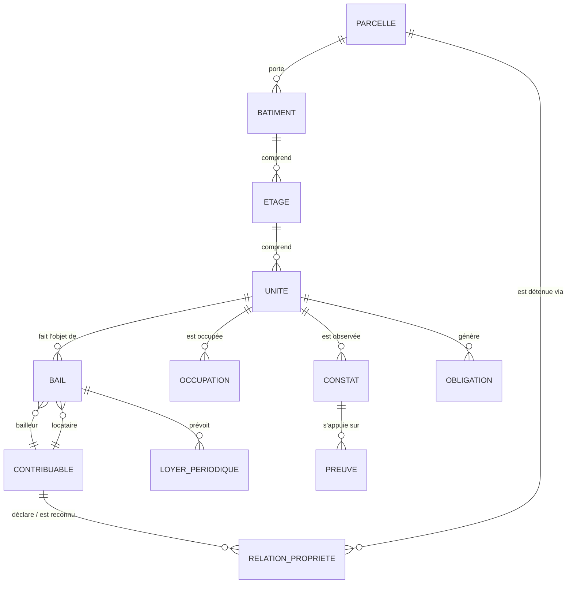
```mermaid
erDiagram
  PARCELLE ||--o{ BATIMENT : porte
  BATIMENT ||--o{ ETAGE : comprend
  ETAGE ||--o{ UNITE : comprend
  PARCELLE ||--o{ RELATION_PROPRIETE : "est détenue via"
  CONTRIBUABLE ||--o{ RELATION_PROPRIETE : "déclare / est reconnu"
  UNITE ||--o{ BAIL : "fait l'objet de"
  BAIL }o--|| CONTRIBUABLE : bailleur
  BAIL }o--|| CONTRIBUABLE : locataire
  BAIL ||--o{ LOYER_PERIODIQUE : prévoit
  UNITE ||--o{ OCCUPATION : "est occupée"
  UNITE ||--o{ CONSTAT : "est observée"
  CONSTAT ||--o{ PREUVE : "s'appuie sur"
  UNITE ||--o{ OBLIGATION : génère
```

| Niveau | Champs principaux | Usage fiscal |
|---|---|---|
| **Parcelle** | IGF, référence cadastrale ou coutumière, polygone ou point, superficie (déclarée / mesurée), rang de localité, bâtie ou non bâtie, statut foncier déclaré | Impôt foncier |
| **Bâtiment** | IGF, parcelle, nombre de niveaux, usage dominant, année approximative, emprise, matériaux (facultatif), photos | Impôt foncier, requalification |
| **Étage** | Numéro, usage | Structuration des unités |
| **Unité** | IGF, type (appartement, chambre, local commercial, annexe, dépendance), surface, usage (habitation, commerce, bureau, mixte), statut d'occupation | IRL, patente éventuelle |
| **Relation de propriété** | Contribuable, rôle (propriétaire, copropriétaire, usufruitier, héritier présumé, gestionnaire), quote-part, preuve, statut probant, dates | Détermination du redevable |
| **Bail** | Unité, bailleur, locataire, sous-locataire éventuel, loyer, périodicité, devise, date de début, date de fin, garantie, preuve, source (déclaré par bailleur / par locataire / observé) | Base de l'IRL et de la retenue |
| **Occupation** | Occupant, qualité (propriétaire occupant, locataire, sous-locataire, occupant autorisé, locataire commercial, logé gratuitement, vacant), date de constat | Contrôle et qualification |
| **Constat** | Agent, date, GPS, photos, observations, écarts avec déclaration | Preuve terrain |
| **Contestation** | Objet, motif, statut, décision | Protection des droits |

## 16.2 Valeur probante et chaîne de responsabilité

Chaque information porte l'un des quatre statuts probants : **DÉCLARÉ** (par le contribuable ou un tiers), **OBSERVÉ** (constaté sur le terrain), **VÉRIFIÉ** (validé par un agent habilité à partir de preuves concordantes), **CONTESTÉ** (en litige). La même échelle s'applique à la propriété.

| Qui | Fait | Ne fait jamais |
|---|---|---|
| Contribuable | Déclare son rôle, ses unités, ses baux | — |
| IA | Détecte incohérences et signaux de location | Créer une obligation ou désigner un redevable |
| Agent de terrain | Observe et documente | Trancher la propriété ou la dette |
| Contrôleur | Vérifie et propose la qualification | Publier seul une rectification au-delà du seuil |
| Chef de service | Valide la qualification | Modifier la règle |
| Moteur de liquidation | Calcule selon la règle active sur les faits vérifiés (ou déclarés si la procédure est déclarative) | Calculer sur un simple signal |

**La réponse de l'utilisateur à la question « êtes-vous propriétaire, bailleur, locataire… ? » n'est jamais une preuve suffisante de propriété ni d'assujettissement.** Elle ouvre une instruction.

## 16.3 Question posée à l'inscription et à chaque changement d'adresse

« Quelle est votre situation à cette adresse ? » — propriétaire occupant ; bailleur (je loue tout ou partie) ; locataire ; sous-locataire ; occupant autorisé (logé par un tiers) ; gestionnaire immobilier ; locataire commercial ; autre occupant légalement reconnu. Chaque réponse déclenche un bloc court et des pièces facultatives ou requises selon le rôle (chapitre 9).

## 16.4 Taux, retenue et élargissement d'assiette

Voir § 6.4 : taux de 22 % (1er rang) et 17 % (autres rangs), retenue de 20 % et 15 % [taux CONFIRMÉS par la presse, arrêté À VÉRIFIER] ; innovations 2026 sur les baux emphytéotiques, les sociétés immobilières et les indemnités de logement [À VÉRIFIER]. Ces valeurs sont paramétrées dans le registre juridique, jamais dans le code, et revalidées à chaque édit budgétaire.

## 16.5 Moteur de détection d'anomalies locatives

| Signal | Source (sous protocole) | Règle | Sortie |
|---|---|---|---|
| Plusieurs compteurs d'électricité ou d'eau sur une parcelle | Distributeurs | Aucune déclaration locative | Probable bien loué → file de vérification |
| Indemnités de logement en paie | Employeurs (grands redevables) | Pas de retenue IRL correspondante | Notification à l'employeur |
| Annonce ou mandat d'agence | Agences, annonces publiques | Bien non rattaché | Enquête documentaire |
| Bail d'entreprise déclaré au fisc national | Protocole DGI | Bailleur inconnu du registre provincial | Rapprochement inter-administrations |
| Parcelle déclarée non bâtie | Imagerie, permis | Construction visible | Requalification contrôlée |
| Immeuble neuf réceptionné | Permis de bâtir | Pas d'unité déclarée après 12 mois | Visite de recensement |
| Immeuble multi-unités déclaré vacant | Déclarations | Vacance longue et répétée | Vérification |
| Loyer atypique | Déclarations | Écart fort par rapport aux loyers du même quartier et type | Vérification (jamais rehaussement automatique) |
| Bail déclaré par le locataire, non déclaré par le bailleur | Déclarations croisées | Discordance | Invitation du bailleur à déclarer |

Chaque signal a un **score explicable** (facteurs contributifs affichés) ; un superviseur décide de l'ouverture d'une mission ; les biais sont surveillés (sur-ciblage d'une commune ou d'une catégorie de population, chapitre 23).

## 16.6 Carte et niveaux de visibilité

**Couche de situation fiscale** (interne) :

| Couleur | Signification |
|---|---|
| 🟢 Vert | Obligation régularisée |
| 🟠 Ambre | Paiement partiel, échéance proche ou revue nécessaire |
| 🔴 Rouge | En retard ou non régularisé **après vérification** |
| ⚪ Gris | Non enregistré ou données insuffisantes |
| 🔵 Bleu | En litige ou en revue formelle |

**Couche opérationnelle de vérification** (superviseurs, terrain) : vert vérifié ; ambre à vérifier ; rouge anomalie détectée ; gris inconnu ; bleu dossier en instruction.

| Public | Ce qu'il voit |
|---|---|
| Grand public | Aucune situation fiscale individuelle ; cartes agrégées par quartier (couverture, recettes) avec seuil minimal d'agrégation (pas de maille de moins de 20 objets) |
| Contribuable | Ses propres objets et statuts |
| Agent de terrain | Objets de sa mission : couleur, adresse, identifiant, dernier constat ; pas de montant ni d'historique de paiement détaillé |
| Contrôleur | Dossier complet des objets assignés |
| Direction | Couches agrégées et nominatives dans son périmètre |
| Exécutif | Agrégats et cartes de chaleur |

## 16.7 Indicateurs de couverture locative

Par avenue, quartier et commune : nombre estimé de parcelles, bâtiments et unités ; nombre enregistré ; unités occupées par le propriétaire ; unités louées ; bailleurs et locataires identifiés ; loyer déclaré ; base légalement imposable ; obligations émises, payées, impayées ; concentration géographique ; taux de couverture du recensement ; âge moyen de la dernière vérification.

## 16.8 Plaque fiscale immobilière

Chaque bâtiment reçoit une plaque normalisée portant l'identifiant géofiscal, un QR signé et un code court. Scan par un agent habilité : identifiant, statut d'occupation déclaré, couleur de situation. Scan public : « plaque authentique, bâtiment enregistré, commune, quartier » **et couleur de situation fiscale** (vert régularisé, orange partiel ou échéance proche, rouge en retard après vérification, gris non enregistré), avec sa légende générique — jamais le nom du propriétaire, l'adresse précise, un montant ou le détail des obligations. Une couleur rouge n'entraîne aucune mesure automatique : elle signale un dossier à traiter par une personne habilitée. *Décision de la Ville (26 septembre 2026) : le Cahier des exigences prévaut sur l'arbitrage ARB-76 de la version précédente, qui masquait la couleur au public.* Rendre la plaque obligatoire et interdire la mise en location d'un bien non immatriculé exige un acte [ACTE REQUIS].

## 16.9 Campagne locative prioritaire

1. Recensement des quartiers échantillons des communes pilotes (septembre 2026 → janvier 2027).
2. Invitation à la régularisation volontaire avec délai clair.
3. Déclaration simplifiée du bail et du loyer, pré-remplie à partir du recensement.
4. Détection des incohérences ; visites ciblées après revue humaine et autorisation de mission.
5. Liquidation selon la règle certifiée, avec explication.
6. Mesure des résultats par rapport au groupe de comparaison (chapitre 45).

# 17. Cadastre fiscal géospatial

## 17.1 Principes

Le cadastre fiscal de MOSOLO est un **cadastre d'usage fiscal**, pas un cadastre juridique : il localise et décrit les objets générateurs de recettes, il ne confère aucun droit de propriété. Il s'articule avec les services fonciers et cadastraux compétents, auxquels il ne se substitue pas.

## 17.2 Couches

| Groupe | Couches |
|---|---|
| Territoire | Province, communes (24), quartiers, avenues, rues, îlots, rangs de localité |
| Foncier | Parcelles, bâtiments, unités |
| Économie | Commerces et établissements, marchés et étals, débits de boissons, carrières |
| Mobilité | Axes, zones de stationnement, gares routières, points d'embarquement, routes de transport, péages |
| Domaine public | Emprises, occupations temporaires |
| Réseaux | Supports publicitaires, antennes et pylônes |
| Fluvial | Ports, quais, embarcations (position au port d'attache) |
| Concessions | Concessions minières, forestières, carrières |
| Infrastructures publiques | Bâtiments publics, écoles, centres de santé, ouvrages de drainage |
| Opérations | Zones d'inspection, polygones de mission, traces de recensement, couverture |
| Analyse | Cartes de chaleur des recettes, de la conformité, du potentiel estimé, des anomalies |

## 17.3 Identifiant géographique fiscal (IGF)

Chaque objet imposable reçoit un **identifiant interne aléatoire, non signifiant et permanent** (UUID) et un **code territorial lisible** pour l'usage humain, par exemple `KIN-GOM-Q012-P004517-B01-U03` (commune, quartier, parcelle, bâtiment, unité). Le code lisible peut changer (redécoupage) ; l'identifiant interne jamais. L'IGF est relié à : localisation et géométrie, catégorie d'objet, relations avec les contribuables et leurs statuts probants, photographies, documents, historique d'inspection, règles applicables, obligations, paiements, quittances, litiges et journal d'audit.

## 17.4 Cas difficiles

| Cas | Procédure |
|---|---|
| Objet sans adresse formelle | Adresse descriptive + point GPS + photo de repère + code territorial ; plaque |
| Quartiers d'habitat informel | Recensement par îlot avec chefs de quartier ; identification de l'occupation sans préjuger du droit foncier ; mention explicite « situation foncière non établie » |
| GPS imprécis (< 15 m de précision non atteinte) | Mode « pointage assisté » sur fond de carte, relevé multiple moyenné ; statut `LOCALISATION_APPROXIMATIVE` ; revue ultérieure |
| Conflit de limites entre parcelles | Statut `CONTESTÉ` sur la géométrie ; aucune modification sans décision du service foncier compétent ; les obligations restent calculées sur la base non contestée |
| Plusieurs activités en un lieu | Un objet par activité, rattaché au même bâtiment ou à la même unité |
| Une entreprise, plusieurs établissements | Un compte, plusieurs établissements, chacun avec son IGF |
| Un bien, plusieurs unités louées ou commerciales | Modèle parcelle → bâtiment → étage → unité ; une obligation par unité et par période |
| Doublon d'objet (deux recensements) | Fusion d'objets par maker-checker ; aucun historique perdu |
| Changement de limites administratives | Historisation des codes territoriaux ; recalcul des agrégats |

## 17.5 Méthode de recensement massif

1. **Fond de carte** : imagerie récente, empreintes de bâtiments (sources ouvertes et acquisitions), numérotation existante.
2. **Pré-pointage** des bâtiments sur imagerie (assisté par apprentissage automatique, validé humainement).
3. **Recensement terrain** par îlot avec l'application hors ligne, en présence d'un relais de quartier.
4. **Pose de plaques** et remise d'une invitation à l'enrôlement.
5. **Contrôle qualité** par échantillonnage indépendant (5 % minimum).
6. **Recoupement** avec les données partenaires.
7. **Mise à jour continue** : permis de bâtir, mutations, signalements, constats.

## 17.6 Architecture géospatiale

Base spatiale PostgreSQL/PostGIS ; services cartographiques aux normes OGC (WMS, WFS, tuiles vectorielles) ; fonds de carte hors ligne sur les terminaux (MBTiles / PMTiles) ; système de référence WGS 84 pour la capture, projection métrique locale pour les calculs de surface ; index spatiaux ; historique des géométries (tables temporelles) ; séparation stricte entre couches publiques agrégées et couches nominatives.

# 18. Modèle de paiement et de règlement

## 18.1 Principe : MOSOLO orchestre, il ne détient pas

KINSHASA MOSOLO **n'est pas un compte de recettes**. Il émet des références de paiement, reçoit les confirmations signées des prestataires habilités, suit le règlement sur les comptes publics désignés, rapproche et prouve. Les fonds vont du payeur au prestataire habilité, puis au compte public de recettes désigné, puis au compte de la province selon les règles du Trésor (§ 6.8). Aucune recette publique ne transite par un compte de l'opérateur de la plateforme.

## 18.2 Canaux

| Canal | Fonctionnement | Conditions |
|---|---|---|
| Monnaie mobile | Paiement marchand (push de demande de paiement ou saisie de la référence) vers le compte marchand de recettes publiques | Émetteur agréé BCC ; compte marchand au nom de l'entité publique ; confirmation serveur à serveur signée |
| Banques | Paiement au guichet ou en ligne sur référence | Convention de banque de recettes ; relevés quotidiens |
| Cartes de paiement | Passerelle d'acquisition (diaspora, entreprises) | Acquéreur habilité ; 3-D Secure |
| Points de paiement agréés | Seul canal d'espèces ; encaissement sur référence, reçu provisoire, règlement quotidien | Agrément, garantie, plafonds, contrôles mystère |
| USSD | Consultation de la référence et paiement par monnaie mobile | Code court officiel unique |
| QR | QR de paiement sur l'avis (norme d'interopérabilité si disponible) | Référence et montant non modifiables |
| Virement | Grandes entreprises, administrations | Référence obligatoire dans le libellé |
| Autres canaux légalement autorisés | Selon agrément | Connecteur activé seulement sur preuve d'agrément (J9) |


## 18.3 Cycle de vie complet

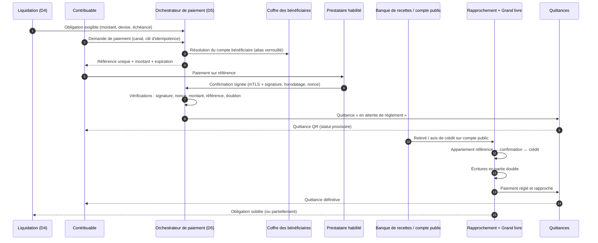
```mermaid
sequenceDiagram
  autonumber
  participant L as Liquidation (D4)
  participant C as Contribuable
  participant PO as Orchestrateur de paiement (D5)
  participant V as Coffre des bénéficiaires
  participant PSP as Prestataire habilité
  participant BK as Banque de recettes / compte public
  participant R as Rapprochement + Grand livre
  participant Q as Quittances
  L->>PO: Obligation exigible (montant, devise, échéance)
  C->>PO: Demande de paiement (canal, clé d'idempotence)
  PO->>V: Résolution du compte bénéficiaire (alias verrouillé)
  PO-->>C: Référence unique + montant + expiration
  C->>PSP: Paiement sur référence
  PSP->>PO: Confirmation signée (mTLS + signature, horodatage, nonce)
  PO->>PO: Vérifications : signature, nonce, montant, référence, doublon
  PO->>Q: Quittance « en attente de règlement »
  Q-->>C: Quittance QR (statut provisoire)
  BK->>R: Relevé / avis de crédit sur compte public
  R->>R: Appariement référence ↔ confirmation ↔ crédit
  R->>R: Écritures en partie double
  R->>Q: Paiement réglé et rapproché
  Q-->>C: Quittance définitive
  R-->>L: Obligation soldée (ou partiellement)
```

| # | Étape | Données produites | Contrôle |
|---|---|---|---|
| 1 | Création de l'obligation | Obligation, version de règle | Règle active |
| 2 | Avis de paiement | Avis signé | Mentions légales |
| 3 | Référence unique | `payment_reference` (clé de contrôle, expiration) | Montant figé ; une référence = une obligation (ou un panier explicite) |
| 4 | Choix du canal | Canal | Canal activé |
| 5 | Initiation | Ordre de paiement | Idempotence |
| 6 | Confirmation du prestataire | Événement signé | Signature, anti-rejeu, montant |
| 7 | Règlement en compte public | Ligne de relevé | Compte = alias du coffre |
| 8 | Rapprochement | Correspondance | Tolérances définies |
| 9 | Comptabilisation définitive | Écritures | Équilibre débit/crédit |
| 10 | Quittance électronique | Quittance signée | État autorisé |
| 11 | Traitement des exceptions | Dossier d'exception | Quatre yeux |
| 12 | Remboursement ou contrepassement | Écritures inverses | Double approbation, vers la source |

## 18.4 États distincts du paiement

| État | Définition | Quittance |
|---|---|---|
| `INITIE` | Ordre créé, référence émise | Aucune |
| `CONFIRME` | Confirmation signée et vérifiée du prestataire | Provisoire (« en attente de règlement ») |
| `REGLE` | Crédit constaté sur le compte public | Provisoire |
| `RAPPROCHE` | Correspondance complète obligation–confirmation–crédit, écritures passées | **Définitive** |
| `ECHOUE` | Refus ou expiration | Aucune |
| `DOUBLON` | Deuxième paiement pour la même référence | Crédit ou remboursement selon règle |
| `CONTREPASSE` | Annulation par le prestataire (fraude, erreur) | Quittance annulée, contre-écriture |
| `REMBOURSE` | Restitution approuvée | Mention de remboursement |
| `CONTESTE` | Litige ouvert (contribuable ou prestataire) | Statut « contesté » |

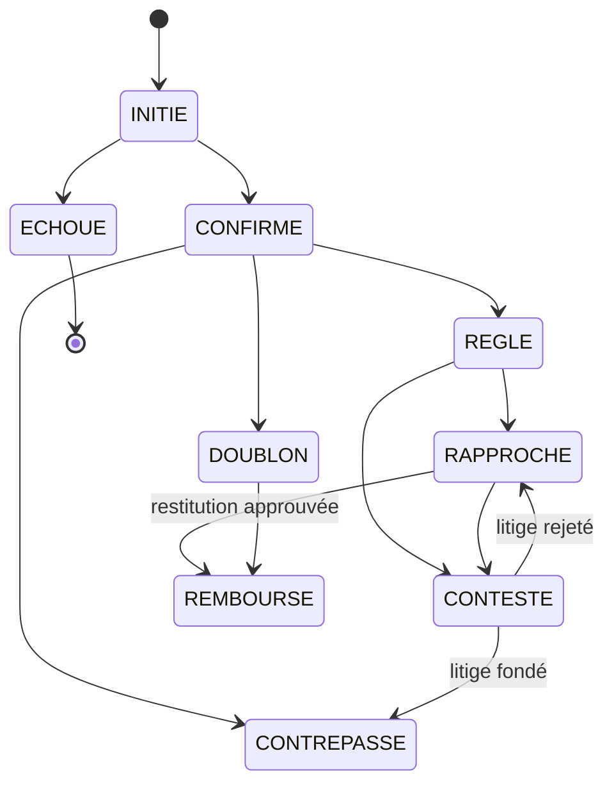
```mermaid
stateDiagram-v2
  [*] --> INITIE
  INITIE --> CONFIRME
  INITIE --> ECHOUE
  CONFIRME --> REGLE
  CONFIRME --> CONTREPASSE
  CONFIRME --> DOUBLON
  REGLE --> RAPPROCHE
  REGLE --> CONTESTE
  RAPPROCHE --> CONTESTE
  CONTESTE --> RAPPROCHE: litige rejeté
  CONTESTE --> CONTREPASSE: litige fondé
  RAPPROCHE --> REMBOURSE: restitution approuvée
  DOUBLON --> REMBOURSE
  ECHOUE --> [*]
```

## 18.5 Protections du circuit

| Menace | Contre-mesure |
|---|---|
| Paiement en double | Clé d'idempotence par demande ; une référence ne peut être soldée qu'une fois ; tout excédent devient `DOUBLON` traité par règle |
| Rejeu de confirmation | Nonce unique, horodatage à fenêtre courte, stockage des identifiants de transaction prestataire (unicité) |
| Faux rappel (callback) | mTLS + signature asymétrique du message ; liste d'adresses autorisées ; vérification de l'état auprès du prestataire (appel de contrôle) avant toute quittance |
| Capture d'écran falsifiée ou SMS forgé | **Aucune quittance sur présentation d'une preuve visuelle** ; seule compte la confirmation serveur à serveur ; le contrôleur vérifie par QR |
| Référence manipulée | Clé de contrôle, montant et bénéficiaire liés à la référence côté serveur ; l'API refuse toute modification |
| Compte bénéficiaire altéré | Les canaux reçoivent un **alias** résolu dans le coffre verrouillé ; changement sous quorum, hors bande, 72 h de refroidissement (§ 12.6) |
| Fraude interne | Aucun rôle ne peut créer un paiement ; séparation des tâches ; journal d'audit |
| Remboursement indu | Double approbation, plafond, vers l'instrument d'origine uniquement, délai de carence, contrôle a posteriori à 100 % |
| Encaissement en espèces non enregistré | Espèces uniquement via points agréés ; reçu provisoire horodaté par le système ; règlement quotidien ; contrôles mystère ; signalement public |

## 18.6 Politique de quittance

Deux niveaux : **quittance provisoire** dès la confirmation serveur à serveur vérifiée (en moins d'une minute), portant la mention « en attente de règlement » ; **quittance définitive** à l'état `RAPPROCHE`. Si le règlement n'est pas constaté dans le délai contractuel, une exception est ouverte, sans remise en cause automatique des droits du contribuable, qui a payé de bonne foi par un canal officiel : le litige est avec le prestataire.

# 19. Quittance électronique

## 19.1 Contenu

| Champ | Exemple |
|---|---|
| Numéro de quittance | `Q-2027-KIN-000123456-7` |
| Référence du contribuable | IUC (et NIF si disponible) |
| Référence de paiement | `PR-7F3K-9Q2M` |
| Obligation(s) et objet(s) | Avis `AV-2027-IF-…`, IGF de la parcelle |
| Catégorie de recette | Impôt foncier 2027 |
| Montant et devise | 🇺🇸 USD 150,00 (contre-valeur indicative 🇨🇩 CDF …) |
| Date et heure du paiement | Heure serveur |
| Canal et identifiant de transaction | Monnaie mobile, identifiant prestataire |
| État de règlement | Provisoire / définitive |
| Administration bénéficiaire | DGIPK (compte public désigné par alias) |
| QR sécurisé | Lien de vérification + signature compacte |
| Signature numérique | Signature avancée (PKI provinciale, HSM) |
| Statut | Valide, en attente, annulée, contrepassée, remplacée, fraude suspectée |
| Mode de vérification | Scan QR, code court par SMS/USSD, portail |

## 19.2 Vérification publique

Le scan du QR (ou la saisie du code court) renvoie un résultat **minimal** :

| Résultat | Affichage public |
|---|---|
| ✅ Valide | « Quittance authentique — montant, date, catégorie de recette, administration bénéficiaire, quatre derniers caractères de la référence du contribuable » |
| ⏳ En attente | « Paiement confirmé, règlement en cours » |
| ❌ Annulée / contrepassée | « Quittance non valable » + motif générique |
| 🔁 Remplacée | « Remplacée par la quittance n° … » |
| ⚠️ Fraude suspectée | « Vérification impossible — contactez la régie » ; signalement automatique à l'équipe anti-fraude |
| ❓ Inconnue | « Aucune quittance ne correspond » |

Aucun nom complet, adresse ou historique n'est exposé. Les vérifications sont limitées en fréquence et journalisées. Les services habilités (API quitus, contrôleurs) obtiennent des informations supplémentaires selon leurs droits.

## 19.3 Vérification hors ligne

Le QR contient une signature compacte vérifiable hors ligne par l'application terrain (clé publique embarquée) : l'agent sait que la quittance a été émise par MOSOLO et n'a pas été altérée. Le **statut** (annulation éventuelle) exige une vérification en ligne ; hors ligne, l'application utilise une liste de révocation signée téléchargée au départ de mission et affiche « authentique — statut vérifié au JJ/MM HH:MM ».

## 19.4 Titres et quittances

Une quittance prouve un paiement ; un **titre** (autorisation, vignette, ticket, pass) prouve un droit, avec une période de validité et des statuts (vert valide, ambre bientôt expiré, rouge expiré ou suspendu). Les titres sont gérés par le moteur de titres (module 70) et contrôlés par plaque, QR ou code (module 71).

# 20. Rapprochement

## 20.1 Appariement à trois voies

Chaque paiement est rapproché sur trois sources indépendantes : **l'obligation** (ce qui est dû), **la confirmation du prestataire** (ce qui a été payé), **le relevé du compte public** (ce qui est arrivé). Un quatrième niveau, **l'écriture comptable**, clôt la chaîne.

| Règle d'appariement | Traitement |
|---|---|
| Référence, montant et devise identiques, crédit constaté | Rapprochement automatique |
| Montant différent dans la tolérance de change définie | Rapprochement + écart de change enregistré |
| Crédit sans confirmation | Exception « crédit orphelin » → recherche prestataire |
| Confirmation sans crédit à J+1 ouvré | Exception « règlement manquant » → relance prestataire, pénalités contractuelles |
| Crédit groupé (règlement net d'un prestataire) | Décomposition par le fichier de détail du prestataire ; contrôle de totaux |
| Commissions prélevées à la source par le prestataire | **Interdit par défaut** : le prestataire règle le brut, les commissions sont facturées séparément et payées sur crédit budgétaire (sauf convention contraire approuvée, visible au grand livre) |

Cible : plus de 95 % de rapprochement automatique à J+1, exceptions résolues sous 5 jours ouvrés, aucune exception de plus de 30 jours sans décision.

## 20.2 Grand livre public en partie double

Le grand livre (module 59) enregistre chaque événement financier par des écritures équilibrées, **en ajout seul**. Exemple simplifié :

| Événement | Débit | Crédit |
|---|---|---|
| Émission d'une obligation de 100 | Créance sur contribuable 100 | Recette constatée 100 |
| Confirmation de paiement | Fonds à recevoir du prestataire 100 | Créance sur contribuable 100 |
| Crédit sur compte public | Compte public de recettes 100 | Fonds à recevoir du prestataire 100 |
| Contrepassement | Créance sur contribuable 100 | Fonds à recevoir du prestataire 100 (inverse) |
| Remboursement | Recette constatée (restitution) 100 | Compte public de recettes 100 |

Clôture quotidienne signée (hachage de la journée chaîné à la précédente), comptes d'attente (suspens) datés et justifiés, interface d'export vers la comptabilité publique du Trésor provincial. **Aucune correction sans contre-écriture liée à l'original.**

## 20.3 Attribution territoriale des recettes

**Règle.** Une recette est comptée pour la **commune du fait générateur** : la commune où se trouve l'objet taxé ou celle où le service payant est consommé. Elle n'est **jamais** comptée d'après l'adresse du contribuable, ni d'après le lieu où il paie (guichet, agence, téléphone).

| Recette | Lieu qui détermine la commune | Base d'attribution |
|---|---|---|
| Impôt foncier | Parcelle ou immeuble | `LIEU_OBJET` |
| Impôt sur les revenus locatifs | Unité locative louée | `LIEU_OBJET` |
| Droit d'étal, occupation du domaine public | Emplacement au marché ou sur la voie publique | `LIEU_OBJET` |
| Taxe sur la publicité | Dispositif publicitaire | `LIEU_OBJET` |
| Obligations d'une entreprise | Établissement concerné (une ligne par établissement) | `LIEU_OBJET` |
| Chantier, quitus | Terrain du chantier | `LIEU_OBJET` |
| Événement | Lieu de l'événement | `LIEU_OBJET` |
| Site de télécommunications | Site | `LIEU_OBJET` |
| Stationnement | Zone de stationnement utilisée | `ZONE_SERVICE` |
| Ticket de transport RakaPay | Station de départ | `STATION_DEPART` |
| Pass wewa | Station d'attache enregistrée du conducteur | `STATION_DEPART` |
| Recouvrement d'un arriéré | Commune de l'obligation d'origine | Reprise de l'obligation |
| Recette sans lieu établi | Aucune : « non attribuée » | `NON_LOCALISE` |

**Exemple.** Un contribuable domicilié à Bandalungwa qui stationne à Masina et paie un étal au marché de Kalamu produit une recette comptée pour Masina, une recette comptée pour Kalamu, et, s'il est propriétaire à Bandalungwa, un impôt foncier compté pour Bandalungwa. Il conserve un seul compte et voit tous ses paiements, quelle que soit la commune.

**Garanties.**

- **Figée à la liquidation.** La commune est enregistrée sur l'obligation au moment où elle est émise, puis recopiée sur chaque ordre de paiement. Une correction ultérieure de la localisation d'un objet ne réécrit pas les obligations déjà émises ; une rectification reprend la commune d'origine. Toute modification passe par une rectification tracée (§ 22.2).
- **Jamais devinée.** Un objet sans commune établie produit une recette « non attribuée » (`NON_LOCALISE`), affichée comme telle. Elle n'est jamais rattachée par défaut à l'adresse du contribuable ou de l'agent. La réduction de cette part est un indicateur de qualité du recensement.
- **Agrégats seulement.** Le tableau de bord présente, par commune, le nombre de paiements confirmés, le montant payé et, **dont**, le montant rapproché avec le relevé du compte public. Ces deux niveaux ne s'additionnent pas (§ 26.2), et aucun nom de contribuable n'y figure.

**« Compté pour » n'est pas « versé à ».** L'argent est toujours versé au compte public de l'entité bénéficiaire désignée par la règle (§ 18.1), en général un compte de la Province. L'attribution territoriale sert à la mesure (tableau de bord, carte, publication trimestrielle), au pilotage des campagnes et à la comparaison entre communes. Une éventuelle part reversée aux communes (entités territoriales décentralisées) ne peut être calculée qu'à partir d'un texte en vigueur. Aucune clé de répartition n'est paramétrée avant lecture de l'Ordonnance-loi n° 18/004 et des actes provinciaux applicables (§ 6.3) [À VÉRIFIER] [ACTE REQUIS].

# 21. Recouvrement et exécution

## 21.1 Principes

Le recouvrement est **gradué, proportionné, tracé et contestable**. Le système calcule, segmente, prépare et notifie ; **toute mesure coercitive est décidée par l'autorité légalement compétente**, après vérification humaine, conformément à l'édit de procédure (J4).

## 21.2 Segmentation

| Segment | Critère | Approche |
|---|---|---|
| Oubli | Premier retard, bon historique | Rappel simple, facilité de paiement |
| Friction | Difficultés d'accès au paiement | Assistance, point de paiement proche |
| Capacité limitée | Montant élevé relatif au revenu présumé | Échéancier si la loi le permet |
| Contestation | Désaccord sur la base | Orientation vers la réclamation |
| Refus délibéré | Relances ignorées, capacité établie | Procédure légale graduée |
| Grands redevables | Enjeux élevés | Suivi dédié, contrôle contradictoire |

## 21.3 Parcours gradué

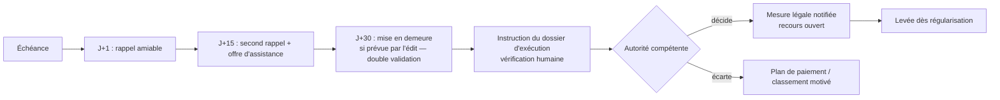
```mermaid
flowchart LR
  A[Échéance] --> B[J+1 : rappel amiable]
  B --> C[J+15 : second rappel + offre d'assistance]
  C --> D[J+30 : mise en demeure<br/>si prévue par l'édit — double validation]
  D --> E[Instruction du dossier d'exécution<br/>vérification humaine]
  E --> F{Autorité compétente}
  F -- décide --> G[Mesure légale notifiée<br/>recours ouvert]
  F -- écarte --> H[Plan de paiement / classement motivé]
  G --> I[Levée dès régularisation]
```

Les délais ci-dessus sont des **valeurs de conception** à remplacer par ceux de l'édit. Garde-fous : aucune mesure sur un dossier contesté avec effet suspensif ; aucune mesure si l'adresse de notification n'est pas vérifiée ; vérification que le paiement n'est pas en cours de règlement ; levée automatique proposée dès régularisation ; indicateurs de proportionnalité (mesures par segment de revenu, par commune) suivis par l'audit.

## 21.4 Arriérés

Tableau d'âge des créances, prescription calculée par règle, priorisation par rendement net (montant recouvrable × probabilité − coût), campagnes de régularisation (module 90) si un acte le prévoit, admission en non-valeur par décision motivée et contrôlée.

# 22. Recours et droits du contribuable

## 22.1 Charte des droits intégrée au produit

| Droit | Traduction dans MOSOLO |
|---|---|
| Savoir ce qu'il doit et pourquoi | Explication de chaque montant : règle, version, base légale, assiette, formule |
| Accéder à ses données | Consultation et export de ses données |
| Faire rectifier une erreur | Demande de rectification depuis chaque donnée |
| Contester | Réclamation depuis chaque objet et chaque obligation |
| Être entendu avant une mesure | Notification préalable et délai d'observations (selon texte) |
| Recevoir une décision motivée | Modèle de décision avec motifs obligatoires |
| Connaître les délais | Compte à rebours légal visible |
| Ne pas payer deux fois | Blocage des doubles revendications (§ 10.3) et des doubles paiements |
| Être protégé contre l'arbitraire | Aucune sanction automatique ; journal d'audit consultable par le contribuable pour son dossier |
| Signaler un abus | Ligne de signalement protégée (module 69) |
| Confidentialité fiscale | Accès limité et journalisé ; aucune exposition publique |

## 22.2 Workflow des réclamations

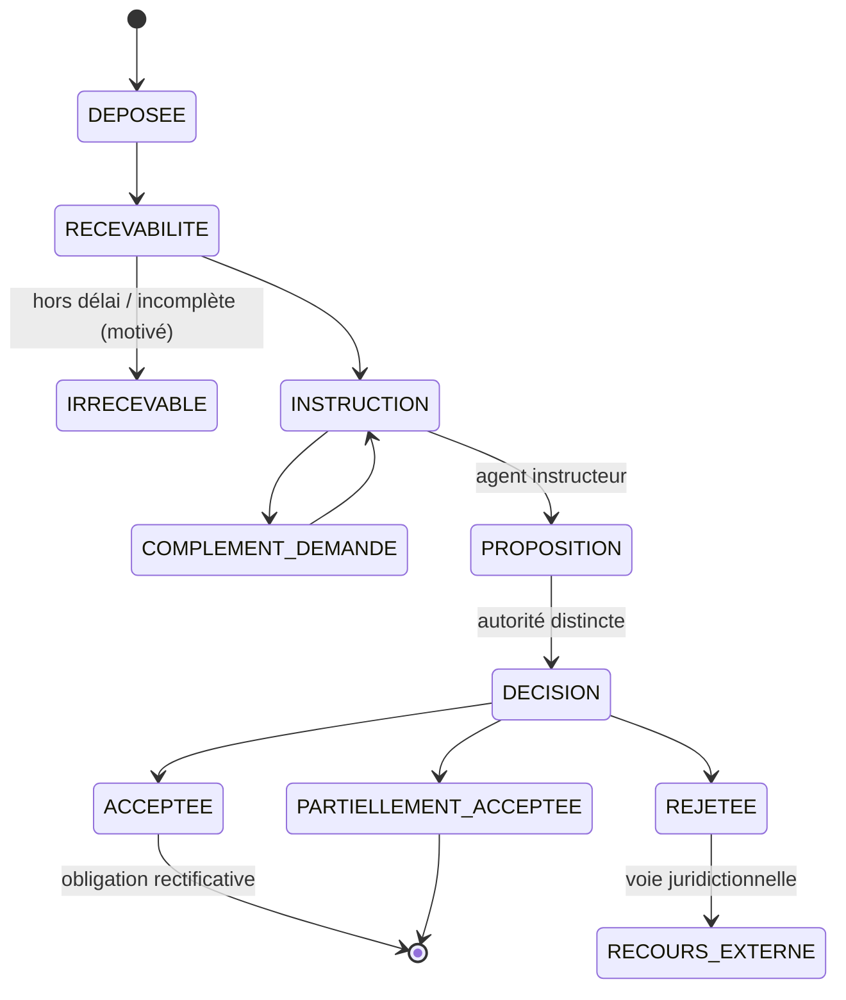
```mermaid
stateDiagram-v2
  [*] --> DEPOSEE
  DEPOSEE --> RECEVABILITE
  RECEVABILITE --> IRRECEVABLE: hors délai / incomplète (motivé)
  RECEVABILITE --> INSTRUCTION
  INSTRUCTION --> COMPLEMENT_DEMANDE
  COMPLEMENT_DEMANDE --> INSTRUCTION
  INSTRUCTION --> PROPOSITION: agent instructeur
  PROPOSITION --> DECISION: autorité distincte
  DECISION --> ACCEPTEE
  DECISION --> PARTIELLEMENT_ACCEPTEE
  DECISION --> REJETEE
  ACCEPTEE --> [*]: obligation rectificative
  PARTIELLEMENT_ACCEPTEE --> [*]
  REJETEE --> RECOURS_EXTERNE: voie juridictionnelle
```

L'instructeur et le décideur sont des personnes distinctes ; l'IA peut résumer le dossier et proposer des éléments, **jamais clore un recours**. Les exonérations, annulations et corrections suivent le même principe de séparation et de contre-écriture. Les statistiques de recours (volume, délai, taux de décisions favorables par motif et par commune) sont publiées de façon agrégée ; un taux élevé de recours fondés sur un motif déclenche une revue de la qualité des données ou de la règle.

## 18.7 Connecteurs de prestataires : rôle et périmètre

Les connecteurs **BitriPay** et **KODA** raccordent KINSHASA MOSOLO à deux prestataires de paiement par monnaie mobile et QR. Ils appliquent sans exception le principe du § 18.1 : **MOSOLO orchestre, il ne détient pas**. Concrètement, un connecteur :

- crée chez le prestataire une *intention de paiement* portant la référence MOSOLO, le montant figé de l'obligation et le seul minimum de métadonnées nécessaire (référence de paiement, identifiant d'ordre, identifiant d'obligation) — aucune donnée personnelle du contribuable n'est transmise ;
- reçoit, vérifie et normalise les **webhooks signés serveur à serveur** du prestataire ;
- transmet l'événement normalisé à la même fonction de confirmation que tous les autres canaux (`confirmFromProvider`) : unicité de la transaction, référence connue, liaison ordre ↔ intention, montant **exactement** égal au montant dû, doublon, écritures en partie double, quittance provisoire, communications et audit.

Le connecteur ne décide de rien : il ne peut ni émettre une quittance, ni solder une obligation, ni marquer un paiement comme réglé. Les fonds vont du payeur au prestataire, puis au **compte public désigné dans le coffre des bénéficiaires**, jamais à un compte de l'opérateur de la plateforme. La configuration de chaque connecteur porte un `settlementAccountAlias` qui **doit** exister dans le coffre : dans le cas contraire, la plateforme refuse de démarrer. À la création d'une intention, ce compte de règlement doit en outre être celui de l'obligation (sinon refus `SETTLEMENT_ACCOUNT_MISMATCH`), afin que le rapprochement à trois voies (§ 20.1) puisse s'appliquer sans exception « mauvais compte ».

Si le prestataire est injoignable lors de la création de l'intention, MOSOLO répond `502 PROVIDER_UNAVAILABLE` et **n'enregistre aucun ordre** : le contribuable peut réessayer immédiatement. Une intention qui aurait malgré tout été créée côté prestataire porte une référence inconnue de MOSOLO ; elle ne pourra jamais produire de quittance et toute confirmation la concernant déclenche une alerte.

## 18.8 Prérequis à toute activation en production

BitriPay et KODA sont des **prestataires candidats**. Leur intégration technique dans le socle ne vaut ni désignation, ni engagement de la Province. L'activation en production est subordonnée à l'ensemble des conditions suivantes :

| Prérequis | Contenu | Référence |
|---|---|---|
| Agrément BCC | Preuve de l'habilitation du prestataire par la Banque centrale du Congo pour l'activité exercée (émission de monnaie électronique, agrégation, acquisition) | J9 (§ 6) ; § 18.2 |
| Compte de règlement public | Compte de recettes au nom de l'entité publique, inscrit au coffre sous un alias, vers lequel le prestataire règle le **montant brut** | § 18.1 ; § 12.6 ; § 20.1 |
| Convention | Délais de règlement, fichiers de détail, pénalités pour règlement manquant, commissions facturées séparément, sécurité des webhooks, réversibilité | § 20.1 |
| Passation | Sélection par une procédure conforme aux règles de la commande publique provinciale ; aucun prestataire n'est désigné par le code | § 34 |
| Recette technique | Épreuves en environnement de test du prestataire, levée des points [À VÉRIFIER] du § 18.14 | § 18.14 |

Sans clé API, chaque connecteur fonctionne en **bac à sable local** : aucune connexion réseau, intention simulée (`sbx_…`), secret de webhook de démonstration. Ce mode sert exclusivement à la démonstration et aux tests.

## 18.9 Correspondance des événements

| Prestataire | Événement | Effet dans MOSOLO | Méthode de confirmation |
|---|---|---|---|
| KODA | `payment.verified` | Confirmation commune → `CONFIRME` + quittance provisoire | `KODA_OPERATOR_LEDGER` |
| KODA | `payment.verified.late` | Idem (un même reçu KODA déjà traité est un rejeu sans effet ; un reçu différent sur une référence déjà payée devient `DOUBLON`) | `KODA_OPERATOR_LEDGER` |
| BitriPay | `payment_intent.succeeded` | Confirmation commune → `CONFIRME` + quittance provisoire | `BITRIPAY_RAIL` |
| BitriPay | `payment_intent.canceled` | `ECHOUE` si l'ordre est encore `INITIE` | `BITRIPAY_RAIL` |
| BitriPay | `payment_intent.payment_failed` | Journalisé (`payment.attempt_failed`), **sans changement d'état** : une tentative échouée n'est pas terminale, le payeur peut réessayer sur la même intention | — |
| BitriPay | `payment_intent.ambiguous_hold` | **Attente prestataire** (résultat opérateur inconnu, paiement en revue manuelle chez BitriPay) : **aucun changement d'état, aucune quittance**, alerte et exception de rapprochement `PROVIDER_AMBIGUOUS` jusqu'à la confirmation signée ou l'échec | — |
| BitriPay | `payment_intent.settled` | **Annonce de règlement** : conservée comme indice de rapprochement, audit `payment.settlement_announced`. L'ordre **reste `CONFIRME`** | — |
| Tous | Autre type | 200, ignoré, audit `payment.webhook.ignored` | — |

La référence MOSOLO d'un événement est résolue à partir des métadonnées (`payment_reference`, `order_id`) et de l'intention enregistrée sur l'ordre ; si ces sources divergent, l'événement est refusé (`REFERENCE_CONFLICT`) et une alerte est levée. Un ordre lié à une intention ne peut être confirmé que par **ce** prestataire et pour **cette** intention (`PROVIDER_ORDER_MISMATCH`).

Les états `REGLE` puis `RAPPROCHE`, et donc la quittance **définitive**, ne résultent **que** du rapprochement à trois voies avec le relevé du compte public (§ 20.1). L'annonce de règlement d'un prestataire est une information utile, non une preuve d'arrivée des fonds.

## 18.10 Conversion des unités mineures

Les prestataires échangent des montants entiers en *unités mineures*, mais leurs conventions diffèrent de celles de MOSOLO, où le franc congolais compte deux décimales.

| Devise | MOSOLO | KODA | BitriPay |
|---|---|---|---|
| CDF | 2 décimales | **0 décimale** : `25000` = 25 000 FC | 2 décimales par défaut (ISO 4217), paramétrable `BITRIPAY_CDF_EXPONENT` [À VÉRIFIER] |
| USD | 2 décimales | 2 décimales : `589` = 5,89 $ | 2 décimales |

La conversion est **exacte** (chaînes décimales et entiers `BigInt`, jamais de virgule flottante) et s'appuie sur une table d'exposants propre à chaque connecteur. Un montant non représentable chez le prestataire — par exemple 1 250,50 CDF chez KODA — est **refusé** (`422 AMOUNT_NOT_REPRESENTABLE`) et jamais arrondi : tout arrondi créerait un écart entre le dû et le payé. En sens inverse, `25000` CDF reçu de KODA devient `"25000.00"` CDF ; `589` USD devient `"5.89"` USD. Un montant hors de la plage entière sûre d'un document JSON est également refusé.

## 18.11 Sécurité : signatures, anti-rejeu, secrets

| Mesure | KODA | BitriPay |
|---|---|---|
| Signature | `x-koda-signature` = HMAC-SHA256 hexadécimal du corps brut | `BitriPay-Signature: t=<unix>,v1=<hex>` avec HMAC-SHA256 de `"<t>.<corps brut>"` [À VÉRIFIER] ; en complément, `BitriPay-Signature-Ed25519` vérifiée avec la clé publique de la plateforme épinglée par configuration (exigible) |
| Comparaison | À temps constant | À temps constant |
| Fenêtre temporelle | Aucun horodatage signé connu : anti-rejeu par identifiant d'événement | ±5 minutes sur l'horodatage signé |
| Anti-rejeu | Identifiant d'événement unique ; unicité du reçu KODA | Identifiant d'événement unique ; unicité de l'intention |
| Échec | 401 + alerte de sécurité (critique pour une signature invalide) | Idem |
| Rejeu | 200, réponse mémorisée, aucun double effet | Idem |

Un événement refusé (montant différent, référence inconnue) n'est pas mémorisé : s'il est présenté de nouveau, il est de nouveau contrôlé, et de nouveau refusé avec alerte. La preuve interne attachée à chaque quittance provisoire indique la garde anti-rejeu utilisée (nonce ou identifiant d'événement) et si un horodatage signé a été vérifié.

Les clés API sont des clés **secrètes** `sk_…`, lues uniquement depuis les variables d'environnement du serveur ; une clé publiable `pk_…` est refusée au démarrage. Aucune clé n'est journalisée : le client HTTP n'écrit que des valeurs masquées (`sk_live_…a1b2`). Le `client_secret` renvoyé par les prestataires n'est ni conservé ni transmis au navigateur. Hors bac à sable local, le secret de webhook est obligatoire ; les secrets de démonstration ne peuvent donc pas être utilisés en production. Chaque POST qui engage de l'argent porte un en-tête `Idempotency-Key` égal à la référence de paiement MOSOLO ; les nouvelles tentatives automatiques ne concernent que les appels idempotents (lectures, et POST BitriPay dont l'idempotence est documentée).

## 18.12 Ce qui est interdit

**Aucune quittance n'est émise sur présentation d'une capture d'écran ou d'un code SMS** (§ 18.5). Les deux prestataires proposent pourtant des points d'entrée qui acceptent de telles preuves (KODA : `POST /intents/{id}/verify`, `POST /checkout/{id}/verify` ; BitriPay : `POST /verifications`). MOSOLO **ne les expose pas au contribuable** et ne s'en sert jamais pour confirmer un paiement.

Un relais serveur, réservé au comptable public (R17), à l'analyste de rapprochement (R18) et à l'agent de contentieux (R20), permet seulement de joindre le résultat de cette vérification à un **dossier de litige ou d'exception**. Ce résultat est une pièce de dossier (`legalEffect: AUCUN`) : il ne modifie jamais l'état du paiement et ne produit jamais de quittance. Aucune image n'est reçue par MOSOLO — seule son empreinte SHA-256 — et le code SMS présenté n'est conservé que sous forme hachée. Chaque demande est journalisée.

Sont également interdits : tout **frais d'application** (`application_fee_minor`) prélevé sur une intention de paiement d'une recette publique (§ 18.15) ; la confirmation d'un paiement à partir de l'URL de retour (`success_url`) ou de la page de paiement du prestataire ; le règlement vers un compte absent du coffre ; la compensation de commissions sur le montant réglé sans convention approuvée (§ 20.1).

## 18.13 Diagrammes de séquence

### KODA

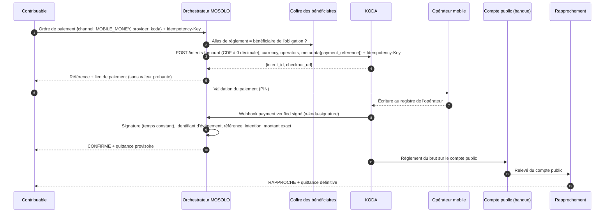
```mermaid
sequenceDiagram
  autonumber
  participant C as Contribuable
  participant PO as Orchestrateur MOSOLO
  participant V as Coffre des bénéficiaires
  participant K as KODA
  participant OP as Opérateur mobile
  participant BK as Compte public (banque)
  participant R as Rapprochement
  C->>PO: Ordre de paiement {channel: MOBILE_MONEY, provider: koda} + Idempotency-Key
  PO->>V: Alias de règlement = bénéficiaire de l'obligation ?
  PO->>K: POST /intents {amount (CDF à 0 décimale), currency, operators, metadata{payment_reference}} + Idempotency-Key
  K-->>PO: {intent_id, checkout_url}
  PO-->>C: Référence + lien de paiement (sans valeur probante)
  C->>OP: Validation du paiement (PIN)
  OP-->>K: Écriture au registre de l'opérateur
  K->>PO: Webhook payment.verified signé (x-koda-signature)
  PO->>PO: Signature (temps constant), identifiant d'événement, référence, intention, montant exact
  PO-->>C: CONFIRME + quittance provisoire
  K->>BK: Règlement du brut sur le compte public
  BK->>R: Relevé du compte public
  R-->>C: RAPPROCHE + quittance définitive
```

### BitriPay

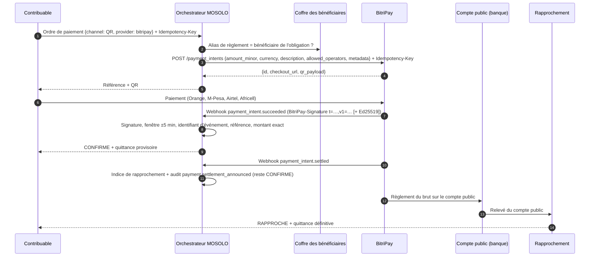
```mermaid
sequenceDiagram
  autonumber
  participant C as Contribuable
  participant PO as Orchestrateur MOSOLO
  participant V as Coffre des bénéficiaires
  participant B as BitriPay
  participant BK as Compte public (banque)
  participant R as Rapprochement
  C->>PO: Ordre de paiement {channel: QR, provider: bitripay} + Idempotency-Key
  PO->>V: Alias de règlement = bénéficiaire de l'obligation ?
  PO->>B: POST /payment_intents {amount_minor, currency, description, allowed_operators, metadata} + Idempotency-Key
  B-->>PO: {id, checkout_url, qr_payload}
  PO-->>C: Référence + QR
  C->>B: Paiement (Orange, M-Pesa, Airtel, Africell)
  B->>PO: Webhook payment_intent.succeeded (BitriPay-Signature t=…,v1=… [+ Ed25519])
  PO->>PO: Signature, fenêtre ±5 min, identifiant d'événement, référence, montant exact
  PO-->>C: CONFIRME + quittance provisoire
  B->>PO: Webhook payment_intent.settled
  PO->>PO: Indice de rapprochement + audit payment.settlement_announced (reste CONFIRME)
  B->>BK: Règlement du brut sur le compte public
  BK->>R: Relevé du compte public
  R-->>C: RAPPROCHE + quittance définitive
```

## 18.14 Points à vérifier avant mise en production

Les éléments ci-dessous ne sont pas documentés publiquement ou l'ont été de façon incomplète. Le socle adopte une hypothèse prudente, isolée dans le connecteur et paramétrable ; chacune doit être confirmée sur la spécification OpenAPI du prestataire lors de la recette.

| # | Prestataire | Point | Hypothèse retenue dans le socle |
|---|---|---|---|
| 1 | KODA | Forme exacte du corps des webhooks | Parseur tolérant : intention `intent_id` \| `intent.id` \| `data.intent_id` ; montant `amount` \| `data.amount` (unités mineures) ; `currency` ; `receipt_id` ; `metadata.order_id` ou `metadata.payment_reference` ; identifiant d'événement `id` \| `event_id` (à défaut, empreinte du corps) [À VÉRIFIER sur /v1/openapi.json] |
| 2 | KODA | Horodatage signé des webhooks | Aucun : anti-rejeu par identifiant d'événement et unicité du reçu [À VÉRIFIER sur /v1/openapi.json] |
| 3 | KODA | Préfixe `sha256=` éventuel de la signature | Toléré [À VÉRIFIER sur /v1/openapi.json] |
| 4 | KODA | Prise en charge de l'en-tête Idempotency-Key | Envoyé, mais aucune nouvelle tentative automatique de POST [À VÉRIFIER sur /v1/openapi.json] |
| 5 | KODA | Champ de description d'une intention | Porté dans `metadata.description` [À VÉRIFIER sur /v1/openapi.json] |
| 6 | KODA | Préfixe des clés de test (`sk_test_`) et références magiques du bac à sable (`TEST-OK-25000`, `TEST-REPLAY`…) | Clé `sk_live_` = réel, autre `sk_` = test [À VÉRIFIER sur /v1/openapi.json] |
| 7 | KODA | Événement d'échec de paiement | Aucun traité ; seuls `payment.verified` et `payment.verified.late` [À VÉRIFIER sur /v1/openapi.json] |
| 8 | KODA | Corps de `POST /intents/{id}/verify` | `{sms_code?, screenshot_sha256?}` (pièce de dossier uniquement) [À VÉRIFIER sur /v1/openapi.json] |
| 9 | BitriPay | Format de l'en-tête `BitriPay-Signature` | `t=<unix>,v1=<hex HMAC-SHA256 de "<t>.<corps>">`, tolérance ±5 min [À VÉRIFIER sur l'OpenAPI BitriPay] |
| 10 | BitriPay | Signature Ed25519 | En-tête `BitriPay-Signature-Ed25519`, base64 sur le corps brut ; clé publique épinglée depuis `GET /v1/keys` [À VÉRIFIER sur l'OpenAPI BitriPay] |
| 11 | BitriPay | Exposant du CDF | 2 (ISO 4217), paramétrable 0 ou 2 [À VÉRIFIER sur l'OpenAPI BitriPay] |
| 12 | BitriPay | Forme des événements | `data.object` avec `id`, `amount_minor`, `currency`, `metadata` [À VÉRIFIER sur l'OpenAPI BitriPay] |
| 13 | BitriPay | Noms `payment_intent.payment_failed` et `payment_intent.canceled` | Traités respectivement comme tentative non terminale et comme échec [À VÉRIFIER sur l'OpenAPI BitriPay] |
| 14 | BitriPay | Corps de `POST /verifications` | `{payment_intent, sms_code?, screenshot_sha256?}` (pièce de dossier uniquement) [À VÉRIFIER sur l'OpenAPI BitriPay] |
| 15 | BitriPay | Exploitation des relevés (`settlements:read`) et rapports (`reconciliation:read`) | Non raccordés : seul le relevé du compte public fait foi ; ces sources pourront alimenter la décomposition des règlements groupés (§ 20.1) |
| 17 | BitriPay | Paramètres de `GET /payment_resolution` | `payment_intent` et `reference` ; réponse CONFIRMED, PENDING, AMBIGUOUS ou NOT_FOUND versée au dossier [À VÉRIFIER sur l'OpenAPI BitriPay] |
| 18 | BitriPay | Présence du champ `account` dans les webhooks des comptes connectés, et son absence pour un compte propre | Exigé et comparé au compte configuré ; refusé s'il est présent sans compte configuré [À VÉRIFIER sur l'OpenAPI BitriPay] |
| 19 | BitriPay | Nom du champ de frais sur l'intention reçue | `application_fee_minor` ou `application_fee_amount` [À VÉRIFIER sur l'OpenAPI BitriPay] |
| 16 | Les deux | Un compte marchand, donc un alias de règlement, par entité bénéficiaire | Un alias par connecteur ; toute obligation d'une autre entité est refusée (`SETTLEMENT_ACCOUNT_MISMATCH`) [À VÉRIFIER dans la convention] |

## 18.15 BitriPay : comptes connectés, attente prestataire et résolution

BitriPay propose aux plateformes et intégrateurs d'ouvrir, par API, le compte marchand de chacun de leurs clients (`POST /accounts`), puis d'agir pour ce compte avec leur propre clé en ajoutant l'en-tête `BitriPay-Account: acct_…` à chaque requête. BitriPay conserve la licence d'agrégateur et reste la partie régulée ; chaque client est le **marchand en titre** (*merchant of record*), avec ses portefeuilles, son profil de règlement, ses relevés et sa vérification. Le client peut revendiquer son compte par un lien à usage unique, voir l'intégrateur dans son équipe, et le retirer à tout moment : clés, portefeuilles et historique restent les siens.

Ce modèle est compatible avec la doctrine de MOSOLO **à quatre conditions**, que le connecteur applique :

| Condition | Application dans le socle |
|---|---|
| La Ville est le marchand en titre | Le compte connecté est celui de l'entité publique (régie) ; son profil de règlement verse au **compte public inscrit au coffre** (`settlementAccountAlias`). Paramètre `BITRIPAY_ACCOUNT_ID` (format `acct_…` contrôlé au démarrage) ; l'en-tête `BitriPay-Account` accompagne **chaque** requête, y compris les lectures |
| Aucun prélèvement sur la recette | Le connecteur **n'envoie jamais** `application_fee_minor`. La rémunération d'un intégrateur relève d'un contrat plafonné et facturé séparément (modèle hybride plafonné, § 20.1), jamais d'une retenue sur la recette. Si un événement de paiement révèle un frais retenu, la quittance reste due au payeur (il a payé l'intégralité), mais une **alerte critique** `APPLICATION_FEE_ON_PUBLIC_REVENUE` est levée et le rapprochement fera apparaître l'écart au compte public |
| Chaque événement concerne la Ville | Le champ `account` de chaque webhook doit être celui de la Ville : sinon `422 CONNECTED_ACCOUNT_MISMATCH` et alerte, sans effet. Sans compte connecté configuré, un événement portant un `account` est refusé (`UNEXPECTED_CONNECTED_ACCOUNT`) |
| La Ville garde la maîtrise | Le compte est revendiqué par la Ville (lien de revendication), l'intégrateur n'y a que le rôle *développeur* (clés, webhooks, création de paiements — rien sur le règlement, les virements ou les exports) et la Ville peut le détacher à tout moment. Ces dispositions figurent dans la convention [ACTE REQUIS] |

**Attente prestataire.** Lorsque le résultat chez l'opérateur est inconnu, BitriPay place le paiement en revue manuelle et émet `payment_intent.ambiguous_hold`. MOSOLO n'en tire **aucune** conséquence financière : l'ordre reste `INITIE`, aucune quittance n'est émise, une alerte est levée et une exception calculée `PROVIDER_AMBIGUOUS` apparaît dans la file du Trésor tant que ni confirmation signée ni échec ne sont arrivés.

**Résolution.** Pour instruire une exception, le comptable public, l'analyste de rapprochement ou l'agent de contentieux peut interroger `GET /payment_resolution` (« ce paiement a-t-il eu lieu ? ») par la route `POST /v1/payment-orders/{référence}/provider-resolution`. La réponse du prestataire est une **pièce de dossier** (`legalEffect: AUCUN`) : même « CONFIRMED », elle ne vaut ni confirmation signée ni quittance. Seuls la confirmation signée serveur à serveur et le relevé du compte public font foi.

**Bac à sable.** Avec une clé de test, les numéros suivants pilotent le moteur de tentatives de BitriPay et permettent la recette de chaque issue sans opérateur : `+243000000501` réussite ; `+243000000404` portefeuille introuvable ; `+243000000408` résultat ambigu (`payment_intent.ambiguous_hold`) ; `+243000000500` délai puis réussite ; `+243000000503` opérateur indisponible ; tout numéro finissant par `0000` refus du payeur. Les autres services de BitriPay (transferts, virements groupés, change, abonnements, crédit, diaspora, paiements hors ligne, agents d'IA) **ne sont pas raccordés** : ils sortent du périmètre d'une recette publique et exigeraient chacun une base légale et une convention propres.

# 23. Architecture des agents d'intelligence artificielle

## 23.1 Doctrine

L'IA de KINSHASA MOSOLO **détecte, explique, priorise, rédige et recommande**. Elle ne décide ni n'exécute aucun acte ayant un effet juridique ou financier. Chaque agent fonctionne derrière une **passerelle d'IA** (AI Gateway) qui contrôle ses accès aux données, ses outils, ses journaux et ses limites.

**Aucun agent ne peut, de lui-même :** créer une taxe ; imposer une pénalité ; déterminer la propriété définitive ; saisir un bien ; suspendre un droit d'un citoyen ; approuver une exonération ; clore un recours ; transférer de l'argent ; modifier un compte bénéficiaire ; détruire un enregistrement d'audit. Ces interdits sont **techniques** : les agents n'ont pas de droits d'écriture sur les domaines concernés ; leurs sorties sont des objets `AIRecommendation` qu'un humain habilité accepte, modifie ou rejette.

## 23.2 Catalogue des agents

| Agent | Mission | Données accessibles | Sorties | Validation humaine |
|---|---|---|---|---|
| **Découverte des recettes** | Identifier sous-enregistrement, activités non déclarées, actifs publics non valorisés | Agrégats, objets, signaux partenaires pseudonymisés | Fiches d'opportunité (§ 8.1) | Analyste + juriste + comité |
| **Enrôlement** | Guider l'inscription, détecter les pièces manquantes, réutiliser les données vérifiées | Données du compte en cours | Suggestions, pré-remplissage | Le contribuable confirme |
| **Apprentissage de l'usager** | Expliquer obligations, échéances, pièces, moyens de paiement, droits de recours, usage de la plateforme — en français simple, lingala et autres langues | Base de connaissances publique + données du compte de l'usager authentifié | Réponses sourcées (citation du texte ou de la page d'aide) | Réponses sans effet juridique ; renvoi vers un humain |
| **Copilote des agents publics** | Résumés de dossiers, guidage procédural, projets de documents, prochaines étapes, priorisation, formation | Dossiers dans le périmètre de l'utilisateur | Brouillons, résumés | L'agent public signe |
| **Veille juridique** | Suivre les textes, repérer règles expirées et conflits | Registre juridique, textes officiels | Alertes, propositions de fiches | Juristes ; **aucune publication** |
| **Intelligence locative** | Repérer biens probablement loués, incohérences d'occupation, zones à vérifier | Objets, déclarations, signaux sous protocole | Listes de vérification avec scores expliqués | Superviseur |
| **Missions terrain** | Planifier des tournées efficaces, prioriser les objets, préparer les dossiers | Objets de la zone, contraintes d'équipe | Plans de mission | Superviseur |
| **Rapprochement** | Proposer des appariements complexes, expliquer les écarts | Paiements, relevés, obligations | Propositions d'appariement | Analyste (quatre yeux au-delà des tolérances) |
| **Détection de fraude** | Identités dupliquées, exonérations suspectes, annulations anormales, collusions, activité géographique inhabituelle, réutilisation d'appareils, manipulation de quittances, changements de bénéficiaires irréguliers, baisses de recettes inexpliquées | Journaux, transactions, métadonnées | Alertes expliquées | Enquêteur |
| **Prévision** | Scénarios conservateur, attendu, ambitieux, avec hypothèses explicites | Séries historiques, base de référence | Prévisions + intervalles | Direction financière |
| **Aide à la décision exécutive** | Transformer les données en recommandations prêtes à décider | Agrégats | Notes de décision (options, effets, risques) | Gouverneur et autorités |
| **Allocation des investissements** | Proposer des scénarios d'emploi des fonds disponibles | Recettes réglées, budget, projets, indicateurs territoriaux | Scénarios (ch. 27) | Autorités budgétaires |
| **Apprentissage continu** | Améliorer les modèles à partir de corrections validées | Jeux de données **approuvés** | Nouvelles versions candidates | Comité des modèles |

## 23.3 Flux de travail d'un agent

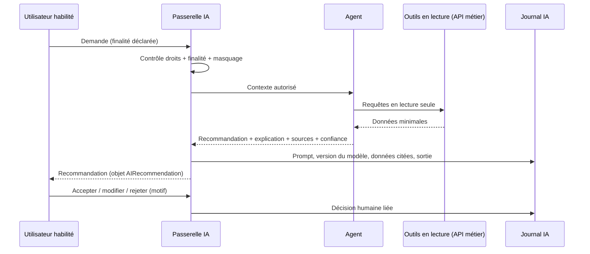
```mermaid
sequenceDiagram
  participant U as Utilisateur habilité
  participant GW as Passerelle IA
  participant AG as Agent
  participant T as Outils en lecture (API métier)
  participant LOG as Journal IA
  U->>GW: Demande (finalité déclarée)
  GW->>GW: Contrôle droits + finalité + masquage
  GW->>AG: Contexte autorisé
  AG->>T: Requêtes en lecture seule
  T-->>AG: Données minimales
  AG-->>GW: Recommandation + explication + sources + confiance
  GW->>LOG: Prompt, version du modèle, données citées, sortie
  GW-->>U: Recommandation (objet AIRecommendation)
  U->>GW: Accepter / modifier / rejeter (motif)
  GW->>LOG: Décision humaine liée
```

## 23.4 Gouvernance des modèles

| Exigence | Mise en œuvre |
|---|---|
| Jeux d'entraînement approuvés | Registre des jeux de données (source, base légale, période, pseudonymisation, validation) ; aucune donnée sensible non approuvée |
| Pas de réentraînement silencieux | L'apprentissage continu produit des **candidats** ; mise en production uniquement après validation |
| Versionnage | Modèles, prompts, paramètres et jeux de données versionnés ensemble |
| Validation humaine | Comité des modèles (métier, audit, protection des données, sécurité) |
| Suivi de performance | Précision, rappel, taux d'acceptation des recommandations, faux positifs par commune |
| Tests de biais | Écarts de ciblage entre communes, catégories de contribuables, genre lorsque la donnée existe |
| Détection de dérive | Surveillance statistique des entrées et sorties |
| Explicabilité | Facteurs contributifs affichés pour chaque score |
| Retour arrière | Version précédente restaurable immédiatement |
| Journal des décisions IA | Conservation au même niveau que le journal d'audit |
| Hébergement | Modèles hébergés sous contrôle de la Province ou fournisseur contractualisé sans conservation ni réutilisation des données ; aucune donnée fiscale nominative vers un service d'IA public |

## 23.5 Couche d'intelligence : MOSOLO, système d'exploitation piloté par l'IA

### 23.5.1 Identité de la couche d'intelligence

La couche d'intelligence n'est pas un assistant conversationnel ajouté à la plateforme : c'est **le cerveau opérationnel de MOSOLO**. Elle soutient chaque fonction, parcours, action, document, tableau de bord, notification et décision. MOSOLO fonctionne ainsi comme :

| Ce que MOSOLO est | Et non |
|---|---|
| Un système d'exploitation des recettes piloté par l'IA | Un simple logiciel de saisie |
| Une infrastructure d'intelligence vivante | Un tableau de bord statique |
| Un moteur d'aide à la décision | Un affichage de données |
| Une couche d'automatisation des processus | Un registre passif |
| Un assistant prédictif | Un assistant qui attend qu'on l'interroge |
| Une plateforme d'exécution multi-agents | Une interface de conversation |
| Un système qui s'améliore à partir des résultats validés | Un système figé |

**Limite constitutionnelle.** Cette ambition s'exerce **à l'intérieur** des principes P1 à P14 (§ 3.4) et des interdits du § 23.1 : l'IA prépare, accélère, prédit et recommande ; seuls des agents publics habilités produisent un effet juridique ou financier.

### 23.5.2 Les douze questions posées à chaque action

Pour chaque action d'un utilisateur, la couche d'intelligence se pose silencieusement les questions suivantes, et l'interface en affiche les réponses utiles :

| # | Question | Exemple (agent de régie ouvrant un dossier locatif) |
|---|---|---|
| 1 | Que cherche à accomplir l'utilisateur ? | Qualifier une unité déclarée vacante |
| 2 | Quelles données sont disponibles ? | Déclarations, constat terrain, compteurs (sous protocole) |
| 3 | Que manque-t-il ? | Bail ou preuve de vacance |
| 4 | Quel risque existe ? | Sous-déclaration ; contestation si la preuve est faible |
| 5 | Que peut-on automatiser ? | Demande de pièces au bailleur |
| 6 | Que peut-on prédire ? | Probabilité de location : 0,78 (facteurs affichés) |
| 7 | Que peut-on améliorer ? | Qualité de l'adresse (précision GPS faible) |
| 8 | Que doit-il se passer ensuite ? | Invitation à déclarer, puis visite si pas de réponse sous 15 jours |
| 9 | Qui doit être notifié ? | Bailleur (`rental.occupancy.inconsistency`), superviseur |
| 10 | Que faut-il enregistrer ? | Brouillon de qualification, justification, sources |
| 11 | Que faut-il apprendre ? | Résultat de la vérification, pour recalibrer le modèle (après validation) |
| 12 | Que doit recommander la plateforme ? | « Demander le bail — confiance moyenne » |

### 23.5.3 Principe d'enregistrement automatique (autosave)

**Aucune action importante ne doit être perdue.** L'enregistrement automatique est obligatoire dans tous les modules et couvre : saisies, contenus générés, brouillons, fichiers déposés, modifications, commentaires, sélections, recommandations et décisions de l'IA, sorties modifiées, changements d'état, notifications, approbations, rejets, tâches terminées, processus abandonnés, recherches (sous forme minimisée), analyses produites, préférences, usage de l'IA, versions historiques et journaux d'audit.

| Capacité (chaque module) | Mise en œuvre |
|---|---|
| Enregistrement automatique | Brouillon persistant côté serveur toutes les 5 secondes d'inactivité et à chaque changement de champ ; stockage local chiffré en hors ligne |
| Historique des versions | Chaque enregistrement crée une version ; différences consultables |
| Horodatage | Heure serveur de référence |
| Attribution | Utilisateur, rôle, appareil |
| Suivi des modifications | Avant/après champ par champ |
| Retour arrière | Restauration d'une version de **brouillon** ; pour les actes validés, uniquement par acte contraire (P7) |
| Piste d'audit | Événement chaîné (§ 25.2) |
| Résumé IA des changements | « 3 champs modifiés depuis hier : surface (120 → 135 m²), usage, photo ajoutée » |
| Indicateur visible | « Enregistré à 09:15 » / « Enregistrement… » / « Hors ligne — enregistré sur l'appareil » |

Distinction essentielle : **un brouillon n'est pas un acte**. L'enregistrement automatique ne vaut ni déclaration déposée, ni décision, ni approbation ; ces effets exigent une action explicite de validation, signée et horodatée.

### 23.5.4 Mémoire structurée à quatre niveaux

| Niveau | Contenu | Limites (protection des données, ch. 32) |
|---|---|---|
| **Mémoire utilisateur** | Rôle, préférences, langue, tâches fréquentes, priorités, sorties enregistrées, objectifs récurrents | Pour les **agents publics** : aide au travail, jamais utilisée pour l'évaluation disciplinaire sans procédure. Pour les **contribuables** : préférences de service uniquement ; **aucun profilage comportemental** ni « tolérance au risque » inférée |
| **Mémoire d'espace (entité)** | Données de l'entité, règles, modèles, circuits, décisions historiques, hypothèses | Cloisonnée par entité (§ 10.3) |
| **Mémoire de processus** | Étape atteinte, fait, en attente, bloqué, changé récemment, prochaine décision | Liée au dossier, conservée avec lui |
| **Mémoire d'intelligence** | Tendances, risques, problèmes répétés, signaux de performance, de coût, de productivité, de prévision, améliorations recommandées | Agrégée et pseudonymisée ; alimente les modèles uniquement via des jeux approuvés (§ 23.4) |

### 23.5.5 Agents transverses et correspondance avec les agents métier

| Agent transverse | Responsabilité | Agents métier MOSOLO concernés (§ 23.2) |
|---|---|---|
| Stratégie | Comprendre l'objectif, recommander la meilleure voie, identifier les leviers | Aide à la décision exécutive ; découverte des recettes |
| Processus (workflow) | Faire avancer les tâches, détecter les goulets, proposer l'étape suivante, automatiser le répétitif | Copilote ; missions terrain |
| Intelligence des données | Lire les données structurées et non structurées, extraire le sens, détecter les manques | Intelligence locative ; rapprochement |
| Prédiction | Prévoir issues, retards, risques, points de défaillance, occasions manquées | Prévision ; détection de fraude |
| Documents | Créer, relire, résumer, comparer, versionner ; extraire obligations, actions, risques | Copilote ; veille juridique |
| Communication | Rédiger avis, messages, rapports, réponses — ton professionnel et adapté | Apprentissage de l'usager ; moteur de communication (§ 11.4) |
| Conformité | Vérifier règles, délais, approbations, permissions, pièces obligatoires | Veille juridique ; contrôle des séparations de tâches |
| Finances (commercial) | Analyser coûts, recettes, rendement, déperdition, pression budgétaire | Découverte des recettes ; allocation |
| Automatisation | Repérer les actions répétées, proposer des automatisations, déclencher rappels, alertes, tâches | Tous |
| Personnalisation | Adapter l'expérience au rôle, à la langue, à l'historique | Tous (dans les limites du § 23.5.4) |

Tous passent par la **couche d'orchestration** (passerelle IA, § 23.3), qui applique les droits, journalise et impose le format de sortie.

### 23.5.6 Fonctions IA disponibles dans toute la plateforme

| Fonction | Exemple MOSOLO |
|---|---|
| Recherche IA | « Parcelles de Limete avec plus de 3 compteurs et sans bail » (dans le périmètre de l'utilisateur) |
| Résumés | Résumé d'un dossier de réclamation de 40 pièces |
| Recommandations | Prochaine meilleure action sur un arriéré |
| Détection de risques | Pic d'annulations |
| Guidage de l'étape suivante | Liste de contrôle contextuelle |
| Rédaction | Projet de décision motivée (à signer par l'autorité) |
| Classification et étiquetage | Type de pièce déposée, motif de réclamation |
| Notation | Score de probabilité de location, expliqué |
| Prévision | Encaissements de la semaine par commune |
| Alertes | Seuils d'indicateurs |
| Automatisation des processus | Relances, affectations, création de tâches |
| Compréhension de documents | Lecture d'un bail scanné (OCR + extraction) |
| Extraction de données | Loyer, dates, parties d'un bail |
| Personnalisation | Tableau de bord par rôle |
| Comparaison | Deux versions d'une règle |
| Explication | Pourquoi ce montant, pourquoi cette alerte |
| Aide à la décision | Options, effets, risques |
| Suivi de performance | Indicateurs d'équipe, écarts |
| Détection d'anomalies | Transactions, accès, constats |
| Génération de piste d'audit | Chronologie lisible d'un dossier |

### 23.5.7 Format de sortie standard

Toute analyse de la couche d'intelligence est structurée ainsi (objet `AIRecommendation`) :

| Rubrique | Contenu |
|---|---|
| **1. Situation** | Ce qui se passe |
| **2. Analyse** | Ce que signifient les données |
| **3. Risque** | Ce qui pourrait mal tourner |
| **4. Recommandation** | Ce qu'il faudrait faire |
| **5. Prochaine action** | L'étape la plus pratique maintenant |
| **6. Responsable** | Qui doit agir (rôle, jamais « l'IA ») |
| **7. Échéance** | Quand |
| **8. Niveau de confiance** | Élevé, moyen ou faible, selon la qualité des données, avec les sources citées |

Pour toute décision importante, la couche fournit en outre : **meilleure option ; option alternative ; risque de l'inaction ; impact financier ; impact opérationnel ; étape recommandée**.

### 23.5.8 Règles de prédiction, d'automatisation et de données

**Prédiction proactive.** La plateforme n'attend pas que l'utilisateur découvre un problème : elle signale retards, informations manquantes, performances faibles, pression sur les coûts, faible engagement, processus incomplets, doublons de travail, données contradictoires, comportements inhabituels, lacunes de conformité, gisements de recettes et inefficacités.

**Automatisation, selon trois niveaux d'autonomie :**

| Niveau | Actions | Exemples | Contrôle |
|---|---|---|---|
| A — Exécution automatique | Actions sans effet juridique ni financier, réversibles | Rappels facultatifs, création de tâches, affectation selon des règles approuvées, préparation de brouillons, résumés, classement de pièces | Journalisé ; désactivable par le responsable d'entité |
| B — Exécution après validation | Actions à effet sur un tiers | Envoi d'une demande de pièces, ouverture d'une mission, relance obligatoire | Un clic de validation par un agent habilité |
| C — Recommandation seulement | Actions à effet juridique ou financier | Liquidation rectificative, exonération, pénalité, mesure d'exécution, remboursement, changement de bénéficiaire, clôture d'un recours | Circuits maker-checker complets ; **jamais automatisé** |

**Données.** Toute donnée est structurée, étiquetée, recherchable (selon les droits), reliée aux processus, aux utilisateurs, aux décisions, aux horodatages et aux résultats, et réutilisable pour l'intelligence future dans le respect de sa finalité.

### 23.5.9 Sécurité, transparence et contrôle

- L'interface n'expose ni les fournisseurs techniques d'IA, ni la logique interne, ni les clés, ni les données confidentielles, ni la complexité technique inutile.
- **Mais l'usager sait toujours qu'une IA est intervenue** : tout contenu généré ou recommandé porte la mention « préparé avec l'assistance de l'IA — validé par [rôle] » ; l'explication de toute décision automatisée ou assistée est disponible. C'est une exigence de loyauté de l'administration et de protection des données, non négociable dans un service public.
- La couche respecte permissions, rôles, cloisonnements, auditabilité, confidentialité fiscale et obligations de conformité.

### 23.5.10 Expérience utilisateur : une plateforme vivante

Chaque tableau de bord répond à sept questions : que se passe-t-il ? qu'est-ce qui a changé ? qu'est-ce qui est à risque ? que faut-il faire aujourd'hui ? qu'est-ce qui coûte du temps ou de l'argent ? que va-t-il probablement se passer ? qui détient la décision ?

Chaque écran comporte, lorsque c'est pertinent, un **panneau d'intelligence** : analyse IA, recommandation, alerte de risque, prochaine action, résumé, niveau de confiance et **statut d'enregistrement automatique** (voir la maquette du tableau de bord du Gouverneur, § 26.2).

### 23.5.11 Apprentissage

La plateforme apprend des corrections des utilisateurs, des décisions répétées, des réussites et des échecs de processus, des recommandations acceptées et rejetées, du temps passé, des questions fréquentes, des sorties souvent modifiées et des résultats. **Cet apprentissage alimente des candidats** (modèles, modèles de documents, règles d'automatisation), mis en service après validation par le comité des modèles (§ 23.4) : aucune auto-modification silencieuse.

### 23.5.12 Positionnement

MOSOLO remplace les outils fragmentés, l'administration manuelle, les tableurs déconnectés, la communication lente, la faible visibilité et la gestion réactive. Sa valeur : rapidité, contrôle, automatisation, prédiction, redevabilité, intelligence, réduction des coûts, productivité, meilleures décisions, risques réduits, meilleurs résultats. L'objectif est que la plateforme devienne **indispensable par la valeur qu'elle apporte**, et non par un verrouillage : la Province doit rester capable de l'exploiter, de la faire évoluer et d'en sortir (§ 33).

Le prompt système de la couche d'intelligence, adapté à ces règles, figure dans `specs/ia/prompt-systeme-mosolo.md`.

# 24. Apprentissage des utilisateurs et environnement de travail

## 24.1 Environnement d'apprentissage intégré

| Public | Contenus | Modalités |
|---|---|---|
| Contribuables | Obligations, échéances, calcul, paiement, recours | Guides contextuels, vidéos courtes, SVI, questions-réponses en langues nationales |
| Agents de terrain | Procédures, déontologie, sécurité, application hors ligne | Parcours d'intégration, cas simulés, certification obligatoire avant la première mission |
| Contrôleurs | Qualification, preuves, procès-verbaux | Cas simulés, certification |
| Personnel des ministères | Tableaux de bord, circuits d'approbation | Parcours par rôle |
| Superviseurs | Planification, contrôle qualité, gestion d'équipe | Parcours par rôle |
| Finances et Trésor | Rapprochement, exceptions, clôtures | Simulations |
| Administrateurs | Sécurité, configuration, séparation des tâches | Certification |
| Exécutifs | Lecture de l'échelle de la recette, arbitrages | Sessions courtes |

Fonctions : intégration par rôle ; tâches guidées ; explications contextuelles ; listes de contrôle interactives ; aide multilingue ; vidéos ; quiz ; procédures consultables ; questions-réponses assistées par l'IA (avec sources) ; cas simulés dans un environnement d'entraînement ; certification et recyclage ; retour de performance ; notifications de changement de procédure ; analyse des lacunes de connaissance.

## 24.2 Surveillance légitime, pas surveillance oppressive

| Surveillance légitime (maintenue) | Surveillance excessive (proscrite) |
|---|---|
| Journal des actions sur les données et les montants | Enregistrement continu de l'écran ou du micro |
| Géolocalisation **pendant les missions** et pour les constats | Géolocalisation hors mission ou hors service |
| Contrôle qualité des constats par échantillon | Classement public des agents |
| Indicateurs de qualité (exactitude, délais, plaintes) | Indicateurs fondés sur les montants imposés par agent |
| Alertes de sécurité et d'intégrité | Lecture des communications privées |

Les agents ont accès à leurs propres indicateurs et à leur journal ; les règles de surveillance sont publiées, expliquées pendant la formation et soumises au délégué à la protection des données.

# 25. Prévention de la fraude et de la déperdition

## 25.1 Objectif réaliste

La fraude ne peut pas être éliminée. L'objectif est de la rendre **difficile à commettre, rapide à détecter et impossible à effacer sans trace**.

| Fonction | Comment MOSOLO agit |
|---|---|
| **Prévenir** | Aucune espèce entre les mains des agents ; montants calculés par le moteur et non modifiables sur le terrain ; comptes bénéficiaires verrouillés ; quatre yeux ; séparation des tâches ; MFA ; accès juste-à-temps |
| **Détecter** | Règles et modèles d'anomalies ; rapprochement quotidien ; contrôles mystère ; signalements du public ; vérification des quittances par QR |
| **Contenir** | Suspension conservatoire d'un accès sur décision motivée ; gel d'un point de paiement ; révocation d'appareil ; blocage d'une quittance suspecte |
| **Enquêter** | Dossier d'enquête ; graphe des liens ; chronologie reconstituée depuis le journal |
| **Prouver** | Journal chaîné et signé ; horodatage fiable ; preuves scellées ; extraction probante signée pour les autorités |
| **Corriger** | Contre-écritures ; rectifications motivées ; récupération des sommes |
| **Rendre compte** | Rapport trimestriel au Comité d'audit ; indicateurs agrégés publics |

## 25.2 Socle technique d'intégrité

| Contrôle | Description |
|---|---|
| Historique d'événements immuable | Toute action produit un événement en ajout seul |
| Hachage cryptographique chaîné | Chaque événement contient l'empreinte du précédent ; toute suppression rompt la chaîne |
| Signatures numériques | Événements financiers signés par des clés en HSM |
| Horodatage de confiance | Ancrage périodique de l'empreinte de la chaîne auprès d'une autorité d'horodatage et chez un tiers indépendant |
| Grand livre en ajout seul, partie double | § 20.2 |
| Stockage WORM | Copie du journal sur stockage à écriture unique, sous le contrôle de l'audit |
| Sauvegarde indépendante des preuves | Réplication vers un site contrôlé par l'autorité d'audit |
| Maker-checker, contrôle double | § 12.6 |
| Limites de transaction | Plafonds de remboursement, d'annulation, d'exonération par rôle |
| Verrouillage des bénéficiaires | Coffre, quorum, hors bande, refroidissement |
| Détection d'anomalies | Règles + modèles |
| Empreinte d'appareil | Terminaux enrôlés ; détection de réutilisation d'appareil entre comptes |
| Géorepérage et plausibilité GPS | Vitesse de déplacement, précision, sortie de zone |
| Intégrité des photos et documents | Capture dans l'application uniquement, hachage à la capture, métadonnées scellées |
| Anti-rejeu | Nonces, fenêtres temporelles, idempotence |
| Rapprochement | Trois voies + écritures |
| Surveillance des accès privilégiés | Sessions enregistrées, alertes en temps réel |
| Prévention des fuites de données | Masquage, filigranes sur exports, limites de volume, alertes |
| Accès d'audit indépendant | Rôle auditeur non modifiable par les administrateurs |

## 25.3 Scénarios de fraude et contrôles

| Scénario | Signal | Contrôle |
|---|---|---|
| Agent qui encaisse des espèces « pour arranger » | Plaintes, régularisations sans paiement, écarts constat/paiement | Zéro espèce, badge vérifiable, signalement, contrôle mystère |
| Exonérations de complaisance | Concentration par agent, zone ou période | Quatre yeux, fondement légal obligatoire, alerte de concentration |
| Annulations d'avis après paiement hors circuit | Pic d'annulations | Motif codifié, double validation, revue audit |
| Fausse quittance | Scan QR invalide | Vérification publique, signalement |
| Détournement par changement de compte bénéficiaire | Tentative de modification | Quorum, hors bande, refroidissement, notification multiple |
| Collusion recenseur–contribuable (sous-déclaration d'unités) | Écart avec imagerie, compteurs | Contrôle qualité indépendant, double visite aléatoire |
| Objets fictifs pour gonfler la production | Objets sans suite, photos réutilisées | Hachage des photos, rémunération sur objets vérifiés uniquement |
| Rappel de paiement falsifié | Signature invalide | mTLS + signature + appel de contrôle |
| Remboursement vers un compte tiers | Instrument différent de l'origine | Remboursement vers l'origine uniquement |
| Initié technique modifiant la base | Rupture de chaîne de hachage, écart avec copie WORM | Contrôle d'intégrité horaire, alerte critique |
| Baisse inexpliquée de recettes d'une zone | Série temporelle | Alerte de l'agent de fraude, enquête |

**Aucun paiement, liquidation, exonération, annulation ni correction ne peut disparaître.** Les corrections se font par contrepassement ou contre-écriture autorisés, liés à l'original.

# 26. Tableaux de bord exécutifs

## 26.1 L'échelle unifiée de la recette

Tous les tableaux de bord emploient la même échelle, sans jamais additionner des niveaux différents :


| # | Niveau | Définition |
|---|---|---|
| 1 | **Potentiel estimé** | Estimation statistique, non opposable |
| 2 | **Assiette vérifiée** | Objets et redevables vérifiés × règles actives |
| 3 | **Liquidé (assessed)** | Obligations émises |
| 4 | **Exigible** | Obligations échues non contestées avec effet suspensif |
| 5 | **En retard (overdue)** | Exigible non payé après échéance |
| 6 | **Paiement initié** | Références en cours |
| 7 | **Paiement confirmé** | Confirmé par le prestataire |
| 8 | **Réglé sur le compte public** | Crédit constaté |
| 9 | **Rapproché** | Appariement obligation–paiement–règlement réalisé |
| 10 | **Comptabilisé** | Écriture imputée selon la nomenclature publique |
| 11 | **Disponible pour appropriation budgétaire** | Selon les règles du Trésor et du budget |

Les onze états sont ceux du Cahier des exigences v2 (échelle unifiée). Le montant **contesté** (sous réclamation avec ou sans effet suspensif) est suivi comme un **indicateur séparé**, hors échelle, car il ne constitue pas une étape du parcours d'un franc public.

## 26.2 Tableau de bord du Gouverneur

| Zone | Contenu | Visualisation |
|---|---|---|
| Bandeau du jour | Collecté aujourd'hui (confirmé), réglé, rapproché ; comparaison J−1 et même jour de l'année précédente | Chiffres clés avec tendance |
| Échelle de la recette | Niveaux 1 à 11 sur l'exercice | Entonnoir |
| Cible | Réalisé vs cible annuelle et mensuelle | Jauge et courbe cumulée |
| Répartition | Par ministère, régie, commune, catégorie | Barres triées, drill-down |
| Carte | Recettes, conformité, couverture du recensement, couverture locative par commune et quartier | Carte choroplèthe et carte de chaleur |
| Historique | Comparaison pluriannuelle | Courbes |
| Potentiel | Potentiel estimé vs assiette vérifiée (écart de couverture) | Barres empilées |
| Obligations | En retard, contestées | Tableau |
| Exceptions | Paiements en exception, règlements en retard | File avec âge |
| Intégrité | Déperdition suspectée, alertes critiques | Liste priorisée |
| Performance | Zones les plus et les moins performantes | Classement |
| Prévisions | Trois scénarios | Éventail |
| Capacité d'investissement | Fonds disponibles et scénarios d'emploi (ch. 27) | Cartes de scénario |
| Actions recommandées | Trois à cinq décisions proposées avec justification | Cartes d'action |


**Écran de référence (description).** En haut, cinq tuiles : « Confirmé aujourd'hui 🇨🇩 CDF … », « Réglé », « Rapproché », « Taux de rapprochement J−1 », « Alertes critiques ». Au centre, la carte de Kinshasa colorée par taux de conformité, avec bascule couverture/recettes/potentiel. À droite, l'entonnoir de l'échelle de la recette. En bas, les actions recommandées (« Autoriser la campagne de régularisation à Kalamu — effet estimé, risques, décision requise ») et la file des alertes critiques.

## 26.3 Autres tableaux de bord

| Tableau | Contenu principal |
|---|---|
| Directeur de cabinet | Suivi des décisions et engagements, alertes, agenda de performance |
| Secrétaire général | Actes en préparation, état d'adoption, effets dans la plateforme |
| Ministre provincial | Recettes et indicateurs de son périmètre, tarifs de sa compétence, recommandations |
| DG DGIPK | Assiette, campagnes, liquidation, recouvrement, contentieux, performance des services |
| DG DGTK | Droits, taxes, redevances, titres, marchés, publicité, stationnement |
| Trésor | Confirmé, réglé, rapproché, suspens, exceptions par âge, prestataires en retard, clôtures |
| Juridique et tarifs | Règles par statut, expirations, conflits, tests en échec |
| Chefs de service | Files de travail, délais, qualité |
| Superviseurs | Missions, couverture, qualité des constats, conflits de synchronisation |
| Auditeurs | Intégrité de la chaîne, opérations sensibles, écarts, accès privilégiés |
| Enquêteurs | Alertes, dossiers, graphe des liens |
| Agents de terrain | Mission du jour, objets restants, synchronisation, formation |
| Contribuables | Objets, obligations, échéances, quittances, quitus, recours |
| Administrateurs de la plateforme | Disponibilité, performance, intégrations, sécurité, communications (§ 11.4.7) |
| Transparence publique | Recettes agrégées par catégorie et commune, emploi des fonds, délais de recours |

Tous les montants sont consolidés en 🇨🇩 CDF avec bascule d'affichage en 🇺🇸 USD (taux et date indiqués).

# 27. Affectation des recettes et planification de l'investissement public

## 27.1 Distinguer pour ne pas confondre

| Étape | Autorité | Rôle de MOSOLO |
|---|---|---|
| Collecte | Prestataires habilités vers comptes publics | Orchestrer et prouver |
| Comptabilisation | Comptable public | Fournir les écritures |
| Partage légal | Texte (nomenclature, clés) | Calculer les parts sur recettes rapprochées |
| Gestion de trésorerie | Trésor provincial | Informer (prévisions de trésorerie) |
| Appropriation budgétaire | Assemblée provinciale (édit budgétaire) | Informer |
| Autorisation de dépense | Ordonnateur | Aucun |
| Planification des investissements | Gouvernement provincial | Recommander des scénarios |
| Dépense effective | Ordonnateur et comptable | Suivre (lien avec le module de contrôle de la dépense) |

**Aucune répartition arbitraire** entre le Gouvernement, les ministères, les régies, les agents, les administrateurs de la plateforme ou des partenaires privés n'est possible. Toute répartition suit la loi, le budget approuvé, les règles du Trésor, les clés légales, les contrats et les approbations formelles de dépense. **L'administrateur de la plateforme ne reçoit jamais de part automatique des recettes publiques du seul fait qu'il administre le système.**

## 27.2 Incitations de performance (si la loi le permet)

Si un texte autorise des incitations (agents, services, partenaires de collecte), le calcul est transparent et auditable :

| Élément | Exigence |
|---|---|
| Autorité légale | Texte citant la base (J10) |
| Formule approuvée | Pourcentage ou barème fixé par acte |
| Conditions | Résultats **vérifiés** (quittances définitives, objets validés en contrôle qualité), jamais montants liquidés |
| Plafonds | Par agent, par service, par période |
| Anti-manipulation | Exclusion des objets contestés ou annulés ; récupération en cas de fraude ; indicateurs de qualité pondérateurs |
| Traitement fiscal | Selon la réglementation |
| Approbation | Ordonnateur, sur proposition calculée par la plateforme |
| Traitement comptable | Dépense budgétaire, **pas prélèvement à la source** |

## 27.3 Recommandation d'emploi des fonds

L'agent d'allocation propose des scénarios fondés sur : recettes réglées et rapprochées ; obligations récurrentes ; budget approuvé ; maturité des projets ; besoins géographiques ; population ; pauvreté ; déficits d'infrastructure ; rendement économique et social ; coût d'entretien ; résilience climatique ; restrictions légales de dépense.

| Pour chaque recommandation | Contenu |
|---|---|
| Montant disponible | Selon l'échelle (niveau 11) |
| Source légale des fonds | Ligne budgétaire, recettes affectées le cas échéant |
| Allocation proposée | Montant par projet |
| Bénéficiaires | Population et zones |
| Impact géographique | Carte |
| Résultat attendu | Indicateurs mesurables |
| Maturité du projet | Études, foncier, marchés |
| Coût récurrent | Entretien et exploitation |
| Passation de marché requise | Procédure applicable |
| Risques | Techniques, financiers, sociaux |
| Autorité d'approbation | Ordonnateur, Assemblée si modification budgétaire |

Domaines typiques : réfection des routes, drainage et protection contre les inondations, assainissement et déchets, éclairage public, transport public, modernisation des marchés, écoles, centres de santé, services numériques, programmes d'emploi, infrastructures de sécurité publique. **L'IA recommande des scénarios ; elle n'approuve aucune dépense et ne déplace aucun fonds.**

## 27.4 Transparence

Tableau public trimestriel : recettes par catégorie et par commune, emploi des fonds par programme, projets financés et état d'avancement, délais de traitement des recours — sans aucune donnée personnelle.

# 28. Architecture technique

## 28.1 Recommandation : un hybride contrôlé

| Option | Avantages | Inconvénients dans le contexte de Kinshasa | Verdict |
|---|---|---|---|
| Monolithe modulaire | Simple à exploiter, cohérence transactionnelle, peu d'équipes nécessaires | Montée en charge par blocs ; risque de couplage si mal discipliné | **Socle retenu** |
| Services orientés domaines | Autonomie des domaines, isolation des risques | Plus d'exploitation | **Retenu pour 4 composants** |
| Microservices généralisés | Évolutivité fine | Complexité d'exploitation élevée, compétences rares, surface d'attaque plus large, coûts | Rejeté |
| Architecture événementielle | Découplage, audit, intégrations, hors ligne | Cohérence à terme à gérer | **Retenue** (bus interne) |
| CQRS | Lecture analytique performante sans charger les transactions | Duplication de modèles | **Retenu** pour tableaux de bord et SIG |
| Event sourcing intégral | Historique parfait | Complexité élevée, migrations difficiles | **Limité** au grand livre et au journal d'audit |

**Recommandation : un monolithe modulaire orienté domaines** (les sept domaines du chapitre 10 sont des modules avec frontières strictes, bases de schémas séparées et contrats internes), **plus quatre services isolés** pour des raisons de sécurité ou de charge : (1) passerelle de paiement et coffre des bénéficiaires ; (2) journal d'audit et horodatage ; (3) passerelle d'IA ; (4) moteur de communication et canaux (USSD, SMS, SVI). Le grand livre et le journal d'audit sont en **event sourcing** ; les lectures analytiques passent par **CQRS** vers l'entrepôt.

| Critère | Justification |
|---|---|
| Connectivité | Terrain hors ligne d'abord ; serveur central simple et robuste ; synchronisation par lots |
| Capacité technique | Une équipe provinciale peut reprendre un monolithe modulaire documenté ; pas un maillage de 60 microservices |
| Risque de mise en œuvre | Moins de pièces mobiles, déploiements plus sûrs |
| Budget | Infrastructure et exploitation réduites |
| Exposition cybersécurité | Surface réduite ; les composants les plus sensibles sont isolés |
| Évolutivité | Extraction ultérieure d'un module en service si la charge le justifie |
| Souveraineté | Logiciels libres standards, compétences disponibles, pas de dépendance à un nuage propriétaire |

## 28.2 Pile technologique recommandée (ouverte et réversible)

| Couche | Choix recommandé | Alternative |
|---|---|---|
| Langage serveur | **TypeScript sur Node.js 22 LTS** (Fastify), partageant ses types et règles avec les interfaces via le paquet `shared` — choix retenu pour le socle livré (Annexe E) | Java 21 / Kotlin ou .NET 8 pour une réécriture ultérieure de services isolés ; Go pour les services réseau |
| Base transactionnelle | PostgreSQL 16 + PostGIS | — |
| Bus d'événements | Apache Kafka (ou Redpanda) | RabbitMQ pour le socle initial |
| Entrepôt analytique | ClickHouse ou PostgreSQL analytique | DuckDB pour les exports |
| Stockage documentaire | Stockage objet compatible S3 (MinIO) avec verrouillage d'objet (WORM) | Ceph |
| Identité | Keycloak (OIDC, WebAuthn/passkeys) | — |
| Autorisation | Open Policy Agent (politiques RBAC + ABAC) | Cedar |
| Passerelle API | Kong ou APISIX | Envoy |
| Secrets et clés | HashiCorp Vault / OpenBao + HSM | — |
| Application terrain et citoyenne | Kotlin natif Android (Jetpack Compose), base locale chiffrée SQLCipher | Flutter |
| Web | TypeScript, React + Vite, conception accessible (WCAG 2.1 AA), charte de la Ville de Kinshasa (marine, liseré tricolore) | — |
| Cartographie | MapLibre, tuiles vectorielles, GeoServer | — |
| IA | Modèles ouverts hébergés sous contrôle (inférence locale) + passerelle | Fournisseur contractualisé sans conservation |
| Observabilité | OpenTelemetry, Prometheus, Grafana, Loki | — |
| SIEM | Wazuh / Elastic Security | — |
| Orchestration | Kubernetes (distribution standard) | Machines virtuelles au démarrage |
| CI/CD | GitLab CI ou équivalent auto-hébergé, artefacts signés (Sigstore), SBOM | — |

**Organisation du code : trois parties séparées.**

| Partie | Rôle | Dépend de |
|---|---|---|
| `shared/` | Types du domaine, montants et devises (CDF principale, drapeaux), catalogue d'événements, langues et traductions, fiches de règles, états, validations, format de sortie IA | — |
| `backend/` | API REST : identité, objets, registre juridique, liquidation, paiements, coffre, rapprochement, grand livre, quittances, audit chaîné, communications, autosauvegarde, IA | `shared` |
| `frontend/` | Portail contribuable, vérification publique de quittance, centre de commandement, console des communications, multilingue, graphiques en couleur | `shared` (types, i18n), `backend` (par API uniquement) |

Le `frontend` n'importe jamais le code du `backend` : il ne le connaît que par l'API. Le `backend` n'importe jamais le `frontend`. Toute logique partagée (calcul monétaire, formats, catalogues) vit dans `shared`.

## 28.3 Diagramme de contexte du système

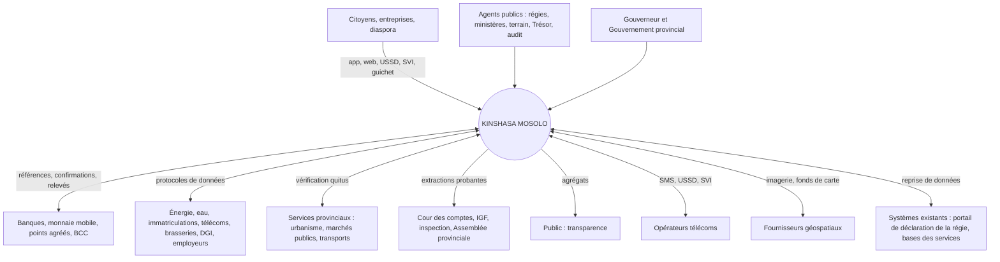
```mermaid
flowchart TB
  CIT[Citoyens, entreprises, diaspora] -->|app, web, USSD, SVI, guichet| M((KINSHASA MOSOLO))
  AG[Agents publics : régies, ministères, terrain, Trésor, audit] --> M
  EXE[Gouverneur et Gouvernement provincial] --> M
  M <-->|références, confirmations, relevés| PAY[Banques, monnaie mobile, points agréés, BCC]
  M <-->|protocoles de données| DATA[Énergie, eau, immatriculations, télécoms, brasseries, DGI, employeurs]
  M <-->|vérification quitus| SERV[Services provinciaux : urbanisme, marchés publics, transports]
  M -->|extractions probantes| CTRL[Cour des comptes, IGF, inspection, Assemblée provinciale]
  M -->|agrégats| PUB[Public : transparence]
  M <-->|SMS, USSD, SVI| TEL[Opérateurs télécoms]
  M <-->|imagerie, fonds de carte| GEO[Fournisseurs géospatiaux]
  M <-->|reprise de données| LEG[Systèmes existants : portail de déclaration de la régie, bases des services]
```

## 28.4 Architecture des conteneurs

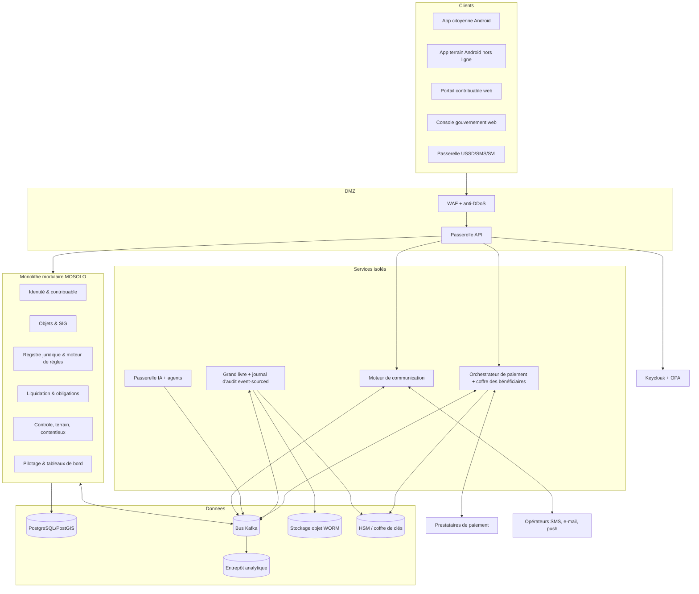
```mermaid
flowchart TB
  subgraph Clients
    A1[App citoyenne Android]
    A2[App terrain Android hors ligne]
    W1[Portail contribuable web]
    W2[Console gouvernement web]
    U1[Passerelle USSD/SMS/SVI]
  end
  subgraph DMZ
    WAF[WAF + anti-DDoS]
    GW[Passerelle API]
  end
  subgraph Coeur["Monolithe modulaire MOSOLO"]
    ID[Identité & contribuable]
    OB[Objets & SIG]
    LR[Registre juridique & moteur de règles]
    AS[Liquidation & obligations]
    CO[Contrôle, terrain, contentieux]
    PI[Pilotage & tableaux de bord]
  end
  subgraph Isoles["Services isolés"]
    PAY[Orchestrateur de paiement + coffre des bénéficiaires]
    LED[Grand livre + journal d'audit event-sourced]
    AIG[Passerelle IA + agents]
    COM[Moteur de communication]
  end
  subgraph Donnees
    PG[(PostgreSQL/PostGIS)]
    K[(Bus Kafka)]
    S3[(Stockage objet WORM)]
    DW[(Entrepôt analytique)]
    HSM[(HSM / coffre de clés)]
  end
  IAM[Keycloak + OPA]
  Clients --> WAF --> GW
  GW --> Coeur & PAY & COM
  GW --> IAM
  Coeur --> PG
  Coeur <--> K
  PAY <--> K
  LED <--> K
  AIG --> K
  COM <--> K
  LED --> S3
  K --> DW
  PAY --> HSM
  LED --> HSM
  PAY <--> EXT[Prestataires de paiement]
  COM <--> OPS[Opérateurs SMS, e-mail, push]
```

## 28.5 Architecture des domaines et flux de données

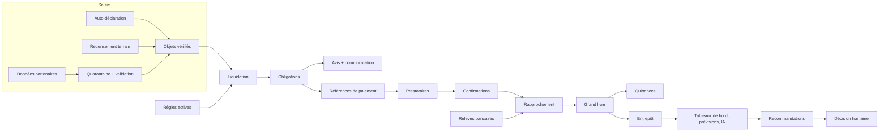
```mermaid
flowchart LR
  subgraph Saisie
    S1[Auto-déclaration] --> O
    S2[Recensement terrain] --> O
    S3[Données partenaires] --> Q[Quarantaine + validation] --> O
  end
  O[Objets vérifiés] --> L[Liquidation]
  R[Règles actives] --> L
  L --> OB[Obligations] --> N[Avis + communication]
  OB --> P[Références de paiement] --> PSP[Prestataires]
  PSP --> C[Confirmations] --> RC[Rapprochement]
  BK[Relevés bancaires] --> RC
  RC --> GL[Grand livre] --> QT[Quittances]
  GL --> DW[Entrepôt] --> D[Tableaux de bord, prévisions, IA]
  D --> REC[Recommandations] --> H[Décision humaine]
```

## 28.6 Séquence de synchronisation terrain

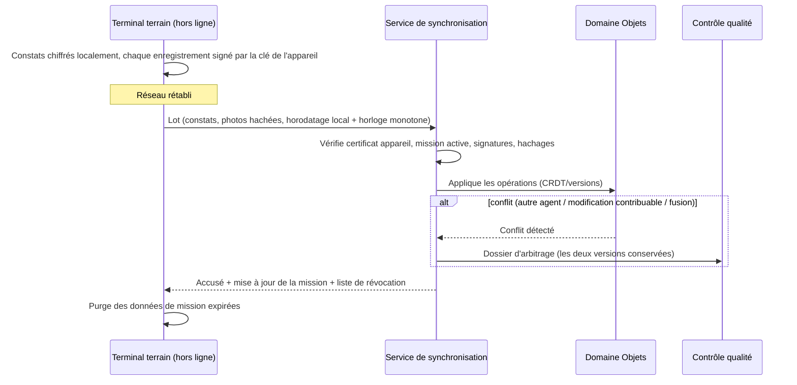
```mermaid
sequenceDiagram
  participant T as Terminal terrain (hors ligne)
  participant S as Service de synchronisation
  participant O as Domaine Objets
  participant QA as Contrôle qualité
  T->>T: Constats chiffrés localement, chaque enregistrement signé par la clé de l'appareil
  Note over T: Réseau rétabli
  T->>S: Lot (constats, photos hachées, horodatage local + horloge monotone)
  S->>S: Vérifie certificat appareil, mission active, signatures, hachages
  S->>O: Applique les opérations (CRDT/versions)
  alt conflit (autre agent / modification contribuable / fusion)
    O-->>S: Conflit détecté
    S->>QA: Dossier d'arbitrage (les deux versions conservées)
  end
  S-->>T: Accusé + mise à jour de la mission + liste de révocation
  T->>T: Purge des données de mission expirées
```

**Règles de résolution des conflits.**

| Cas | Règle |
|---|---|
| Deux agents inspectent la même propriété | Les deux constats sont conservés ; si divergents sur un champ fiscal, arbitrage par le superviseur ; jamais de « dernier écrit gagne » sur un champ fiscal |
| Le contribuable a modifié ses données pendant que l'agent était hors ligne | La déclaration et le constat coexistent avec leur statut probant (déclaré / observé) ; l'écart est signalé |
| GPS imprécis | Constat accepté avec statut `LOCALISATION_APPROXIMATIVE` ; revue |
| Objets fusionnés entre-temps | Le constat est redirigé vers l'objet survivant via l'alias |
| Terminal perdu | Révocation du certificat, effacement à distance, données locales chiffrées et expirées ; les lots non synchronisés signés avant la déclaration de perte peuvent être acceptés après revue |

## 28.7 Flux de contrôle d'accès

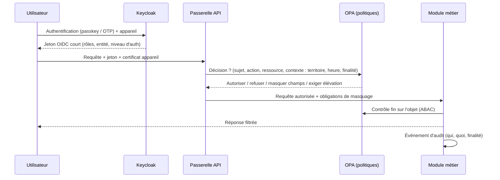
```mermaid
sequenceDiagram
  participant U as Utilisateur
  participant IdP as Keycloak
  participant GW as Passerelle API
  participant PDP as OPA (politiques)
  participant API as Module métier
  U->>IdP: Authentification (passkey / OTP) + appareil
  IdP-->>U: Jeton OIDC court (rôles, entité, niveau d'auth)
  U->>GW: Requête + jeton + certificat appareil
  GW->>PDP: Décision ? (sujet, action, ressource, contexte : territoire, heure, finalité)
  PDP-->>GW: Autoriser / refuser / masquer champs / exiger élévation
  GW->>API: Requête autorisée + obligations de masquage
  API->>PDP: Contrôle fin sur l'objet (ABAC)
  API-->>U: Réponse filtrée
  API->>API: Événement d'audit (qui, quoi, finalité)
```

## 28.8 Reprise après sinistre

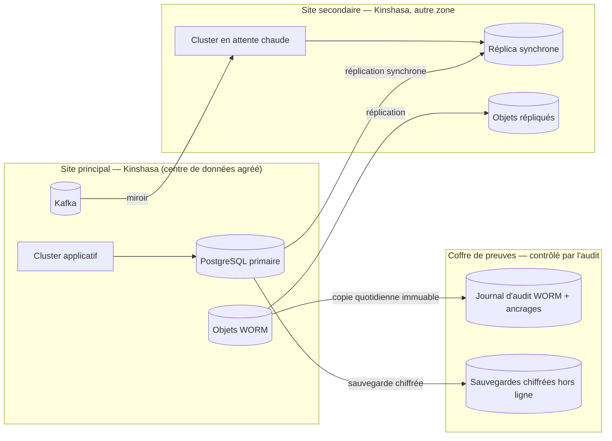
```mermaid
flowchart LR
  subgraph SiteA["Site principal — Kinshasa (centre de données agréé)"]
    A1[Cluster applicatif] --> A2[(PostgreSQL primaire)]
    A3[(Kafka)]
    A4[(Objets WORM)]
  end
  subgraph SiteB["Site secondaire — Kinshasa, autre zone"]
    B1[Cluster en attente chaude] --> B2[(Réplica synchrone)]
    B4[(Objets répliqués)]
  end
  subgraph SiteC["Coffre de preuves — contrôlé par l'audit"]
    C1[(Journal d'audit WORM + ancrages)]
    C2[(Sauvegardes chiffrées hors ligne)]
  end
  A2 -- réplication synchrone --> B2
  A4 -- réplication --> B4
  A3 -- miroir --> B1
  A4 -- copie quotidienne immuable --> C1
  A2 -- sauvegarde chiffrée --> C2
```

| Indicateur | Cible |
|---|---|
| Disponibilité des services contribuables | 99,5 % (pilote), 99,9 % (généralisation) |
| RPO (perte de données maximale) — paiements et grand livre | 0 (réplication synchrone) |
| RPO — autres données | ≤ 15 minutes |
| RTO (délai de reprise) | ≤ 4 heures (pilote), ≤ 1 heure (généralisation) |
| Test de restauration | Mensuel ; exercice de bascule complet semestriel |
| Mode dégradé | Guichets et agents en mode hors ligne ; références de paiement pré-émises ; protection automatique des échéances (`system.deadline_protection`) |

## 28.9 Rapports gouvernementaux

Exports normalisés vers la comptabilité publique et le budget (format à convenir avec le Trésor), rapports périodiques signés pour le Gouverneur, l'Assemblée provinciale, la Cour des comptes et l'inspection, jeux de données ouverts agrégés (format CSV et API publique en lecture).

# 29. Modèle de données conceptuel

## 29.1 Attributs communs obligatoires

Chaque entité porte : `id` (UUID), `entity_scope` (entité responsable), `created_at`, `created_by`, `version`, `status`, `valid_from` / `valid_to` lorsque temporel, `source` (déclaré, observé, vérifié, partenaire, système), `privacy_class` (C1–C5), et produit à chaque changement un événement d'audit (acteur, appareil, avant/après, motif, approbations, empreinte chaînée).

## 29.2 Diagramme des entités principales

```mermaid
erDiagram
  USER ||--o| TAXPAYER : "peut être"
  TAXPAYER ||--o{ IDENTITY : prouve
  TAXPAYER ||--o| ORGANISATION : "est (personne morale)"
  TAXPAYER ||--o{ ADDRESS : a
  ADDRESS ||--o| GEOLOCATION : localisée
  TAXPAYER ||--o{ OBJECT_RELATION : "détient un rôle"
  FISCAL_OBJECT ||--o{ OBJECT_RELATION : concerné
  FISCAL_OBJECT ||--|| GEOLOCATION : situé
  FISCAL_OBJECT ||--o{ PROPERTY : "sous-type"
  PROPERTY ||--o{ BUILDING : porte
  BUILDING ||--o{ RENTAL_UNIT : comprend
  RENTAL_UNIT ||--o{ LEASE : "loué par"
  FISCAL_OBJECT ||--o{ LICENCE : autorisé
  LEGAL_INSTRUMENT ||--o{ TARIFF_RULE : fonde
  REVENUE_TYPE ||--o{ TARIFF_RULE : "est calculé par"
  TARIFF_RULE ||--o{ EXEMPTION : prévoit
  DECLARATION ||--o{ ASSESSMENT : produit
  TARIFF_RULE ||--o{ ASSESSMENT : "appliquée dans"
  ASSESSMENT ||--|| OBLIGATION : crée
  OBLIGATION ||--o{ PAYMENT_NOTICE : notifiée
  OBLIGATION ||--o{ PAYMENT_ORDER : "payée via"
  PAYMENT_ORDER ||--o{ PAYMENT_EVENT : reçoit
  PAYMENT_EVENT }o--o| SETTLEMENT : "réglé dans"
  RECONCILIATION }o--|| PAYMENT_EVENT : apparie
  RECONCILIATION }o--|| SETTLEMENT : apparie
  RECONCILIATION ||--o{ LEDGER_ENTRY : comptabilise
  PAYMENT_EVENT ||--o| RECEIPT : prouve
  OBLIGATION ||--o{ PENALTY : majorée
  OBLIGATION ||--o{ APPEAL : contestée
  OBLIGATION ||--o{ ENFORCEMENT_CASE : recouvrée
  FIELD_MISSION ||--o{ INSPECTION : comprend
  INSPECTION ||--o{ EVIDENCE : documente
  USER ||--o{ USER_ROLE : a
  USER_ROLE }o--|| PERMISSION : accorde
  USER ||--o{ DELEGATION : "délègue/reçoit"
  USER ||--o{ DEVICE : utilise
  AI_RECOMMENDATION }o--o| USER : "décidée par"
  FRAUD_ALERT }o--o| USER : "instruite par"
  ALLOCATION_RULE ||--o{ BUDGET_RECOMMENDATION : encadre
  BUDGET_RECOMMENDATION }o--o{ PUBLIC_PROJECT : propose
```

## 29.3 Dictionnaire des entités

Classes de confidentialité : **C1** public ; **C2** interne ; **C3** personnel ; **C4** personnel sensible / secret fiscal ; **C5** secret (clés, preuves d'enquête). Durées de conservation : **valeurs de conception** à valider au regard des textes sur la prescription et les archives publiques (J4, J8).

| Entité | Finalité | Champs importants | Relations | Validation | Cycle de vie | Audit | Conservation | Classe |
|---|---|---|---|---|---|---|---|---|
| **User** | Compte d'accès | login, auth_methods, entity, status, last_login | Taxpayer, UserRole, Device | Unicité ; MFA pour comptes de travail | INVITÉ→ACTIF→SUSPENDU→DÉSACTIVÉ | Toutes connexions et changements | Fin de fonction + 10 ans | C3 |
| **Taxpayer** | Compte fiscal unique | iuc, type (PP/PM), nif, legal_name, verification_level, language, preferred_currency_display | Identity, Address, ObjectRelation, Obligation | Clés fortes uniques ; anti-doublon | PROVISOIRE→ACTIF→SUSPENDU→CLÔTURÉ→ARCHIVÉ | Changements d'identité | Clôture + prescription + 10 ans | C4 |
| **Identity** | Preuve d'identité | doc_type, doc_number (haché + chiffré), issuer, expiry, image_ref, verified_by | Taxpayer | Format par type ; expiration | SOUMISE→VÉRIFIÉE / REJETÉE / EXPIRÉE | Consultation journalisée | Durée du compte | C4 |
| **Organisation** | Personne morale | rccm, nif, legal_form, representatives[] | Taxpayer, Delegation | RCCM/NIF | ACTIVE→DISSOUTE | Oui | Dissolution + 10 ans | C3 |
| **Address** | Adresse | commune, quartier, avenue, street, plot_ref, description, verification_status | Geolocation | Référentiel territorial | DÉCLARÉE→VÉRIFIÉE | Oui | Historisée | C3 |
| **Geolocation** | Position | geometry, accuracy_m, capture_method, captured_at, device_id | FiscalObject, Address | Plausibilité | — | Capture scellée | Avec l'objet | C3 |
| **FiscalObject** | Objet générateur | igf_uuid, territorial_code, category, status, probative_status | Relations, Obligations | Catégorie du référentiel | PROVISOIRE→VÉRIFIÉ→INACTIF→ARCHIVÉ | Oui | Permanent (archive) | C3 |
| **Property** | Parcelle | area_declared, area_measured, locality_rank, built, land_status_declared | Building | Superficie > 0 | — | Oui | Permanent | C3 |
| **Building** | Bâtiment | floors, use, footprint, year_est, photos | RentalUnit | — | — | Oui | Permanent | C2 |
| **RentalUnit** | Unité | type, area, use, occupancy_status | Lease | — | VACANTE / OCCUPÉE | Oui | Permanent | C3 |
| **Lease** | Bail | lessor, lessee, rent (Money), periodicity, start, end, evidence, source | RentalUnit, Obligation | Loyer > 0 ; dates cohérentes | DÉCLARÉ→VÉRIFIÉ→TERMINÉ / CONTESTÉ | Oui | Fin + prescription + 5 ans | C4 |
| **Business** | Entreprise / établissement | trade_name, activity_codes, premises[] | Activity, Licence | — | ACTIVE→CESSÉE | Oui | Cessation + 10 ans | C3 |
| **Activity** | Activité économique | code, description, location, start | Business | Nomenclature d'activités | — | Oui | Idem | C3 |
| **Vehicle** | Véhicule | plate, vin (haché), category, power, use | ObjectRelation | Format de plaque | ACTIF→MUTÉ→RETIRÉ | Oui | Retrait + 10 ans | C3 |
| **Advertisement** | Support publicitaire | faces, area_m2, type, illuminated, permit_ref | Licence | — | — | Oui | Retrait + 10 ans | C2 |
| **Antenna** | Site télécom | operator, structure_type, height, co_located | Licence | — | — | Oui | Idem | C2 |
| **Vessel** | Embarcation | registration, type, capacity, home_port | — | — | — | Oui | Idem | C2 |
| **Concession** | Concession | title_ref, type, area_ha, holder | — | — | — | Oui | Idem | C2 |
| **Licence / Permit** | Titre / autorisation | type, valid_from, valid_to, conditions, status | FiscalObject | Dates | DEMANDÉ→DÉLIVRÉ→EXPIRÉ / SUSPENDU / RETIRÉ | Oui | Expiration + 10 ans | C2 |
| **LegalInstrument** | Texte | type, number, date, title, official_copy_hash, status | TariffRule | Pièce officielle | À_VÉRIFIER→EN_VIGUEUR→MODIFIÉ→ABROGÉ | Oui | Permanent | C1 |
| **RevenueType** | Nature de recette | code (non réutilisable), label, category (§ 6.11), administering_entity | TariffRule | Code unique | ACTIF→CLOS | Oui | Permanent | C1 |
| **TariffRule** | Règle exécutable | 20 champs de la fiche (§ 6.12) | LegalInstrument, Exemption | Tests juridiques verts ; 4 approbateurs | § 6.12 | Chaque version | Permanent | C1 |
| **Exemption** | Exonération | legal_basis, beneficiary, scope, from, to, evidence, approvals | TariffRule, Obligation | Fondement légal | DEMANDÉE→ACCORDÉE / REFUSÉE→EXPIRÉE / RETIRÉE | Oui, renforcé | Fin + prescription + 10 ans | C4 |
| **Declaration** | Déclaration | period, content, submitted_by, channel | Assessment | Complétude | BROUILLON→DÉPOSÉE→RECTIFIÉE | Oui | Prescription + 10 ans | C4 |
| **Assessment** | Liquidation | inputs_snapshot, rule_version, formula_trace, result, computed_by | Obligation | Déterminisme | CALCULÉE→ÉMISE→RECTIFIÉE / ANNULÉE (contre-acte) | Trace complète | Prescription + 10 ans | C4 |
| **Obligation** | Dette | amount (Money), due_date, status, balance | Notice, Payment, Appeal | Montant ≥ 0 | ÉMISE→EXIGIBLE→PARTIELLEMENT_PAYÉE→SOLDÉE / EN_RETARD / CONTESTÉE / ADMISE_EN_NON_VALEUR | Oui | Solde + prescription + 10 ans | C4 |
| **PaymentNotice** | Avis | number, pdf_ref, signature, delivery_proofs | Obligation | Mentions légales | ÉMIS→DÉLIVRÉ→LU | Oui | Idem | C4 |
| **PaymentOrder** | Référence de paiement | reference, amount, currency, beneficiary_alias, expiry, idempotency_key | PaymentEvent | Montant = solde ou panier explicite | ACTIVE→UTILISÉE / EXPIRÉE | Oui | 10 ans | C3 |
| **PaymentEvent** | Événement prestataire | provider, provider_txn_id (unique), amount, signature, nonce, received_at, state | Receipt, Reconciliation | Signature ; unicité | § 18.4 | Oui | 10 ans | C3 |
| **Settlement** | Règlement bancaire | account_alias, statement_line, value_date, amount | Reconciliation | — | REÇU→APPARIÉ | Oui | 10 ans | C2 |
| **Reconciliation** | Appariement | links, tolerance_used, status, resolver, approver | LedgerEntry | Équilibre | AUTO / EXCEPTION→RÉSOLUE | Oui | 10 ans | C2 |
| **LedgerEntry** | Écriture | journal, debit, credit, amount, links, day_hash | — | Débit = crédit | Ajout seul | Chaîné | 10 ans minimum | C2 |
| **Receipt** | Quittance | number, payment_event, qr_payload, signature, status | PaymentEvent | Émission seulement si état autorisé | PROVISOIRE→DÉFINITIVE / ANNULÉE / REMPLACÉE / SUSPECTE | Oui | 10 ans | C3 |
| **Inspection** | Constat | mission, object, observations, gps, photos, agent, device | Evidence | Plausibilité | BROUILLON→SYNCHRONISÉ→VALIDÉ / REJETÉ | Oui | Prescription + 10 ans | C4 |
| **FieldMission** | Mission | polygon, objects[], team, window, status | Inspection | — | PLANIFIÉE→EN_COURS→CLOSE | Oui | 5 ans | C2 |
| **Evidence** | Preuve | type, file_ref, sha256, captured_at, device, seal | Inspection, Appeal | Hachage | SCELLÉE | Oui | Avec le dossier | C4 |
| **Notification** | Message | event_code, channel, recipient, template_version, status, proof | — | Modèle approuvé | § 11.4.7 | Oui | 5 ans (10 ans pour avis légaux) | C3 |
| **Appeal** | Réclamation | reason_code, submitted_at, evidence, instructor, decider, decision | Obligation | Délai | § 22.2 | Oui | Décision + 10 ans | C4 |
| **Penalty** | Pénalité | legal_basis, computation, decided_by | Obligation | Base légale | PROPOSÉE→DÉCIDÉE→ANNULÉE | Oui | Idem | C4 |
| **EnforcementCase** | Dossier d'exécution | measures[], authority, status | Obligation | Procédure | OUVERT→DÉCIDÉ→LEVÉ / CLOS | Oui | Clôture + 10 ans | C4 |
| **AllocationRule** | Clé légale de répartition | legal_basis, shares, effective dates | — | Somme = 100 % | Versionnée | Oui | Permanent | C1 |
| **BudgetRecommendation** | Scénario d'emploi des fonds | available_amount, projects, rationale, model_version | PublicProject | — | PROPOSÉE→EXAMINÉE→RETENUE / ÉCARTÉE | Oui | 10 ans | C2 |
| **PublicProject** | Projet | location, cost, recurrent_cost, readiness, indicators | — | — | IDÉE→PRÊT→FINANCÉ→RÉALISÉ | Oui | Permanent | C1 |
| **UserRole / Permission** | Habilitation | role, scope attributes, from, to, granted_by | User | Incompatibilités | ACCORDÉE→EXPIRÉE / RETIRÉE | Oui | 10 ans | C2 |
| **Delegation** | Délégation | delegator, delegate, scope, from, to, reason | User | Non re-déléguable | ACTIVE→EXPIRÉE / RÉVOQUÉE | Oui | 10 ans | C2 |
| **Device** | Terminal | certificate, owner, mdm_status, last_sync | User | Enrôlement | ENRÔLÉ→RÉVOQUÉ | Oui | 5 ans | C2 |
| **AIRecommendation** | Sortie d'IA | agent, model_version, inputs_ref, output, explanation, confidence, human_decision | User | — | ÉMISE→ACCEPTÉE / MODIFIÉE / REJETÉE | Oui | 10 ans | C2–C4 |
| **FraudAlert** | Alerte | rule_or_model, score, factors, subject_refs, investigator | — | — | OUVERTE→INSTRUITE→CLASSÉE / FONDÉE | Oui | 10 ans | C5 |
| **AuditEvent** | Journal | actor, action, resource, before_hash, after_hash, purpose, approvals, prev_hash, signature | — | Chaîne continue | Ajout seul | — | Permanent (archives) | C5 |
| **Money** (type valeur) | Montant | amount (décimal), currency (ISO 4217) | — | Pas d'opération entre devises sans conversion | — | — | — | — |
| **ExchangeRate** | Taux officiel | pair, rate, date, source, signature | — | Source officielle | Ajout seul | Oui | Permanent | C1 |

# 30. Catalogue des API

## 30.1 Normes d'interface

REST/JSON versionné (`/v1`), spécification OpenAPI 3.1 publiée (`specs/openapi.yaml`), OAuth 2.1 / OIDC, mTLS pour les partenaires sensibles, jetons à portée minimale (scopes), en-tête `Idempotency-Key` obligatoire sur toute création financière, `X-Request-Id` de corrélation, pagination par curseur, erreurs au format RFC 9457 (`application/problem+json`), limites de débit par client, signatures de messages (JWS détaché) pour les rappels prestataires, horodatage serveur de référence, langue par `Accept-Language`, montants au format `{ "amount": "1250000.00", "currency": "CDF" }`.

## 30.2 Catalogue

| # | Méthode et route | Objet | Acteur autorisé | Idempotence | Événement d'audit |
|---|---|---|---|---|---|
| 1 | `POST /v1/registrations` | Inscription | Public (OTP) | Oui | `account.registration.requested` |
| 2 | `POST /v1/identity-verifications` | Vérification d'identité | Contribuable, guichet | Oui | `identity.verification.submitted` |
| 3 | `POST /v1/account-recoveries` | Récupération de compte | Contribuable | Oui | `auth.recovery.requested` |
| 4 | `POST /v1/fiscal-objects` | Déclaration / création d'objet | Contribuable, agent | Oui | `object.declared` |
| 5 | `POST /v1/properties` | Enregistrement de parcelle / bâtiment / unités | Contribuable, agent | Oui | `object.declared` |
| 6 | `POST /v1/object-relations` | Demande de rattachement (rôle) | Contribuable | Oui | `object.link.requested` |
| 7 | `POST /v1/leases` | Déclaration de bail | Bailleur, locataire | Oui | `lease.declared` |
| 8 | `POST /v1/activities` | Enregistrement d'activité | Contribuable, agent | Oui | `object.declared` |
| 9 | `POST /v1/assessments:calculate` | Calcul (simulation ou liquidation) | Moteur, contrôleur | Oui | `assessment.calculated` |
| 10 | `POST /v1/legal-rules` · `POST /v1/legal-rules/{id}:submit` · `:approve` · `:publish` | Cycle de publication de règle | Juristes, validateur, autorité | Oui | `rule.*` |
| 11 | `POST /v1/obligations/{id}/payment-orders` | Création de référence de paiement | Contribuable, mandataire, guichet | **Obligatoire** | `payment.reference.issued` |
| 12 | `POST /v1/providers/{provider}/callbacks` | Confirmation prestataire | Prestataire (mTLS + JWS) | Par `provider_txn_id` | `payment.confirmed` |
| 13 | `POST /v1/settlements/statements` | Import de relevé bancaire | Banque, Trésor | Par identifiant de relevé | `settlement.received` |
| 14 | `POST /v1/reconciliations:run` · `PATCH /v1/reconciliation-exceptions/{id}` | Rapprochement, traitement d'exception | Trésor (quatre yeux) | Oui | `reconciliation.*` |
| 15 | `GET /v1/public/receipts/{code}` | Vérification publique de quittance | Public | — | `receipt.verified` |
| 16 | `POST /v1/field-sync/batches` | Synchronisation terrain | Terminal enrôlé | Par identifiant de lot | `mission.sync.completed` |
| 17 | `POST /v1/appeals` · `POST /v1/appeals/{id}:decide` | Réclamation, décision | Contribuable ; autorité | Oui | `appeal.*` |
| 18 | `POST /v1/inspections` | Constat | Agent, contrôleur | Oui | `inspection.created` |
| 19 | `GET /v1/fraud-alerts` · `PATCH /v1/fraud-alerts/{id}` | Alertes de fraude | Enquêteur | Oui | `fraud.*` |
| 20 | `GET /v1/dashboards/{board}` | Tableaux de bord | Selon rôle | — | `dashboard.viewed` (C4 uniquement) |
| 21 | `POST /v1/forecasts:run` | Prévision | Direction financière | Oui | `ai.forecast.updated` |
| 22 | `POST /v1/allocation-scenarios` | Scénario d'emploi des fonds | Planification | Oui | `allocation.scenario.created` |
| 23 | `GET /v1/ai-recommendations` · `POST /v1/ai-recommendations/{id}:decide` | Recommandations IA | Utilisateur habilité | Oui | `ai.recommendation.decided` |
| 24 | `GET /v1/clearances/{code}:verify` | Vérification de quitus | Service habilité | — | `clearance.verified_by_service` |
| 25 | `POST /v1/beneficiary-accounts/change-requests` · `:approve` | Changement de compte bénéficiaire | Trésor ; gestionnaires du coffre | Oui | `beneficiary.change.*` |
| 26 | `POST /v1/refunds` · `:approve` | Remboursement | Régie ; Trésor | Oui | `refund.*` |
| 27 | `GET /v1/exchange-rates/{date}` | Taux officiels | Tous | — | — |
| 28 | `POST /v1/notifications:test` | Envoi de test d'un modèle | Administrateur communication | Oui | `notification.test_sent` |

## 30.3 Spécifications de référence

**Création d'une référence de paiement**

```http
POST /v1/obligations/OBL-2027-IF-00012345/payment-orders
Authorization: Bearer <jeton contribuable, scope payments:create>
Idempotency-Key: 5f0c2f7e-2b1a-4b8e-9a51-3c9d2e7a1b10
Content-Type: application/json

{ "channel": "MOBILE_MONEY", "payer_msisdn": "+243810000000", "display_currency": "CDF" }
```

```json
{
  "payment_reference": "PR-7F3K-9Q2M",
  "obligation_id": "OBL-2027-IF-00012345",
  "amount": { "amount": "150.00", "currency": "USD" },
  "indicative_amount": { "amount": "340162.50", "currency": "CDF", "fx_rate_date": "2027-02-10", "fx_source": "BCC" },
  "beneficiary_alias": "KIN-DGIPK-RECETTES-01",
  "expires_at": "2027-02-11T23:59:59+01:00",
  "status": "ACTIVE",
  "ussd_instructions": "Composez *XXX# et saisissez PR7F3K9Q2M"
}
```

| Aspect | Spécification |
|---|---|
| Validation | Obligation exigible et non soldée ; montant = solde (pas de saisie libre) ; canal activé ; payeur autorisé (titulaire ou mandataire) |
| Idempotence | Même clé + même contenu → même réponse ; même clé + contenu différent → `409` |
| Sécurité | Bénéficiaire résolu dans le coffre (alias), jamais fourni par le client ; limite de débit ; journal |
| Erreurs | `400` validation ; `401/403` authentification/portée ; `404` obligation inconnue ; `409` conflit d'idempotence ou référence active existante ; `422` obligation non payable (contestée avec effet suspensif, soldée) ; `429` débit |

**Rappel d'un prestataire de paiement**

```http
POST /v1/providers/mm-operator-a/callbacks
(mTLS : certificat client du prestataire)
X-Signature: <JWS détaché, clé du prestataire>
X-Nonce: 8c1e…   X-Timestamp: 2027-02-10T09:14:03Z

{ "provider_txn_id": "MP270210.0914.A1B2C3", "payment_reference": "PR-7F3K-9Q2M",
  "amount": { "amount": "150.00", "currency": "USD" }, "status": "SUCCESS",
  "payer_msisdn_hash": "sha256:…", "completed_at": "2027-02-10T09:14:01Z" }
```

Traitement : vérification du certificat, de la signature, de la fenêtre temporelle (± 5 minutes), de l'unicité du nonce et de `provider_txn_id` ; contrôle montant/référence ; **appel de contrôle** de l'état auprès du prestataire ; puis état `CONFIRME` et quittance provisoire. Réponse `200` idempotente même en cas de rejeu (sans double effet).

**Vérification publique de quittance**

```http
GET /v1/public/receipts/Q27KIN0001234567
```

```json
{ "status": "VALID", "settlement_status": "RECONCILED", "revenue_category": "Impôt foncier 2027",
  "amount": { "amount": "150.00", "currency": "USD" }, "paid_on": "2027-02-10",
  "beneficiary_administration": "DGIPK", "taxpayer_ref_suffix": "…7K2Q", "verified_at": "2027-03-01T10:22:00Z" }
```

La spécification OpenAPI complète des routes principales figure dans `specs/openapi.yaml` (dépôt du programme).

# 31. Architecture de sécurité

## 31.1 Zéro confiance

Aucun réseau n'est présumé sûr : chaque requête est authentifiée, autorisée et chiffrée ; chaque appareil est identifié ; chaque accès est minimal et journalisé.

| Domaine | Exigences |
|---|---|
| Authentification | MFA pour tous les comptes de travail ; **passkeys (WebAuthn) ou clés matérielles FIDO2** obligatoires pour les rôles sensibles (Trésor, coffre, juristes publicateurs, administrateurs, direction) ; OTP par SMS réservé aux contribuables et comme facteur de secours |
| Autorisation | RBAC + ABAC centralisés (OPA) ; décisions journalisées |
| Chiffrement en transit | TLS 1.3 ; mTLS entre services et avec les partenaires |
| Chiffrement au repos | Bases, sauvegardes, stockage objet et terminaux (SQLCipher, chiffrement Android) ; chiffrement champ par champ des données C4 |
| Gestion des clés | HSM (FIPS 140-2 niveau 3 ou équivalent) pour les clés de signature des quittances, du grand livre et du journal ; rotation ; séparation des gardiens de clés |
| Secrets | Coffre de secrets ; aucun secret dans le code ni dans les images |
| Accès privilégiés | PAM : juste-à-temps, sessions enregistrées, double approbation pour la production |
| Réseau | Segmentation (DMZ, applicatif, données, administration, paiement isolé) ; micro-segmentation entre services |
| API | Passerelle, schémas stricts, limites de débit, détection d'abus, protections OWASP API Top 10 |
| Périmètre | WAF, anti-DDoS (fournisseur et capacité locale), géofiltrage adaptatif pour l'administration |
| Développement sécurisé | Revue de code obligatoire, SAST, DAST, analyse des dépendances, SBOM, artefacts signés, environnements séparés, données de test anonymisées |
| Tests | Test d'intrusion indépendant avant le pilote et avant chaque version majeure ; programme de divulgation coordonnée des vulnérabilités |
| Vulnérabilités | Correctifs critiques sous 7 jours, élevés sous 30 jours |
| Détection | SIEM et SOC (interne ou prestataire sous contrôle provincial) ; règles de corrélation spécifiques (changements de bénéficiaire, pics d'annulations, accès massifs) |
| Réponse aux incidents | Plan, astreinte, exercices semestriels, communication (§ 11.4) |
| Forensique | Journaux conservés et scellés, horloges synchronisées, procédures de collecte de preuves |
| Fuites de données | Masquage, filigranes, limites d'export, détection de volumes anormaux |
| Sauvegardes | Immuables, chiffrées, hors ligne, restaurations testées |
| Continuité | § 28.8 |

## 31.2 Exigences non fonctionnelles clés

| Exigence | Cible |
|---|---|
| Temps de réponse API (p95) | < 500 ms (lecture), < 1 s (écriture) |
| Délai confirmation → quittance provisoire | < 60 s |
| Capacité de pointe (échéance de février) | Dimensionnée pour 20 fois le trafic moyen, testée en charge |
| Application terrain | Android 9+ ; fonctionne 5 jours sans réseau ; synchronisation reprenable |
| Accessibilité | WCAG 2.1 AA pour le web ; tailles de police et contrastes adaptés au plein soleil sur mobile |
| Données mobiles | Application citoyenne < 25 Mo ; pages web allégées (< 500 Ko) |

# 32. Gouvernance des données

| Principe | Mise en œuvre |
|---|---|
| Propriété | **La Province est propriétaire de toutes les données**, y compris celles produites par les prestataires |
| Finalité | Registre des traitements : finalité, base légale, catégories de données, destinataires, durée |
| Minimisation | Revue de chaque champ ; suppression des champs sans finalité |
| Classification | C1 à C5 ; contrôles associés (masquage, chiffrement, journalisation) |
| Qualité | Propriétaires de données par domaine ; règles de qualité ; tableau de bord qualité (complétude, exactitude, fraîcheur, doublons) |
| Durées de conservation | Tableau § 29.3, validé par le service juridique et les archives |
| Droits des personnes | Accès, rectification, information, opposition lorsque la loi le permet ; délais de réponse |
| Partage | Uniquement par protocole signé, API contrôlée, minimisation, journal ; information des personnes (`privacy.data_shared_with_partner`) |
| Données partenaires | Quarantaine, validation, statut « partenaire » jusqu'à vérification |
| Analyse d'impact | Avant le pilote, avant chaque nouveau partage, avant chaque nouveau modèle d'IA |
| Délégué à la protection des données | Nommé dès la phase 0, indépendant, rattaché au Comité de pilotage |
| Données ouvertes | Agrégats anonymisés (seuils minimaux, contrôle de ré-identification) |

# 33. Hébergement et souveraineté

## 33.1 Options d'hébergement

| Option | Description | Avantages | Risques | Verdict |
|---|---|---|---|---|
| H1 — Centre de données gouvernemental provincial | Salles de la Province | Contrôle maximal | Capacités, énergie, compétences à construire | Cible à moyen terme |
| H2 — Centre de données commercial agréé à Kinshasa (colocation) avec matériel propriété de la Province | Infrastructure louée, matériel et clés à la Province | Rapide, contrôle des clés, résidence en RDC | Dépendance au fournisseur de colocation (réversible) | **Recommandé pour le pilote et la généralisation** |
| H3 — Nuage public hors RDC | Services gérés | Rapidité | Résidence des données, dépendance, droit étranger | **Exclu pour les données C3–C5** ; possible pour le CDN public et l'anti-DDoS sans données personnelles |
| H4 — Hybride | H2 principal + site secondaire local + coffre de preuves contrôlé par l'audit | Résilience | Coordination | **Architecture cible** |

## 33.2 Exigences de souveraineté

| Exigence | Traduction contractuelle et technique |
|---|---|
| Résidence des données | Données C3–C5 et sauvegardes hébergées en RDC ; aucun transfert sans base légale et décision écrite |
| Clés | Clés de chiffrement et de signature générées et détenues dans des HSM de la Province ; gardiens de clés nommés par arrêté |
| Accès des fournisseurs | Aucun accès permanent ; accès juste-à-temps, approuvé, enregistré ; interdiction d'accès depuis l'étranger sauf urgence approuvée |
| Code source | Propriété de la Province ou licence perpétuelle, irrévocable, cessible, avec droit de modification ; dépôt du code, des scripts d'infrastructure et de la documentation dans un dépôt contrôlé par la Province à chaque version ; séquestre complémentaire |
| Standards ouverts | PostgreSQL, OpenAPI, OGC, OIDC, formats ouverts d'export |
| Portabilité | Export complet documenté (données, schémas, règles, journaux, pièces) en moins de 30 jours |
| Plan de sortie | Plan de réversibilité testé avant la généralisation ; transfert de compétences ; assistance à la reprise pendant 12 mois |
| Indépendance | Aucun composant propriétaire sans alternative ; pas de dépendance à un seul prestataire de paiement ou de SMS |
| Compétences | Équipe provinciale (DSI MOSOLO) formée et associée dès la phase 1 ; cible : exploitation courante par la Province à 36 mois |

# 34. Feuille de route de mise en œuvre


## 34.1 Contrainte de calendrier

Nous sommes fin septembre 2026. La prochaine campagne annuelle de l'impôt foncier et de l'IRL a son échéance en février 2027. **Il est irréaliste de livrer la plateforme complète avant cette date.** La feuille de route distingue donc :

- une **version R0 « recensement »** (application terrain hors ligne, registre des objets, référentiel territorial, carte) opérationnelle en décembre 2026 dans des quartiers échantillons des quatre communes pilotes ;
- un **test partiel de février 2027** : pour les objets recensés, préparation d'avis pré-remplis et de références de paiement, soit par MOSOLO R1 si prêt, **soit par export vers la plateforme de déclaration existante de la régie** (plan de repli) ; mesure des effets du recensement sur les déclarations ;
- un **pilote complet de 180 jours** (février–juillet 2027) avec la chaîne financière complète ;
- l'extension et la généralisation **conditionnées à des résultats audités**.

## 34.2 Phases

| Phase | Durée | Objectifs | Livrables | Autorité responsable | Dépendances | Catégories de budget | Risques | Critères de succès | Porte d'approbation |
|---|---|---|---|---|---|---|---|---|---|
| **0 — Mandat et mobilisation juridique** | Oct.–nov. 2026 (2 mois) | Mandat, gouvernance, relevé juridique, inventaire des systèmes, base de référence, contrôles de risque | Arrêté de mandat ; comité de pilotage ; relevé juridique certifié v1 (IF, IRL, véhicules) ; inventaire des recettes, comptes et systèmes ; protocole de base de référence ; délégué à la protection des données nommé | Gouverneur ; ministre provincial des Finances | Décisions 1 à 5 (ch. 47) | Programme, juridique, audit de base | Retard de décision ; textes introuvables | Relevé juridique certifié pour les 3 impôts ; base de référence lancée | G0 : Comité de pilotage |
| **1 — Découverte et architecture** | Nov. 2026–janv. 2027 (3 mois) | Cartographie des processus, consultations, audit des systèmes existants (dont la plateforme de déclaration de la régie), audit des données, recherche utilisateurs, exigences, architecture de sécurité, choix des quartiers pilotes | Processus cibles ; dossier d'architecture ; plan de migration/intégration de l'existant ; analyse d'impact protection des données ; plan de sécurité ; backlog priorisé | Directeur de programme ; DGIPK ; DGTK ; DSI | Phase 0 | Conception, études utilisateurs | Résistance des services ; données inexploitables | Architecture validée ; plan d'intégration de l'existant accepté par la régie | G1 : Comité de pilotage + comité de sécurité |
| **2 — Socle (R0 → R1)** | Déc. 2026–mai 2027 (6 mois) | Identité, compte, objets, règles, paiements, quittances, SIG, audit, application terrain, tableaux de bord | R0 (déc. 2026) : recensement ; R1 (avril 2027) : chaîne complète IF/IRL/véhicules | Directeur de programme | Hébergement ; conventions bancaires ; règles certifiées | Développement, hébergement, sécurité, équipements | Glissement ; intégrations bancaires lentes | Tests d'acceptation ch. 41 au vert ; test d'intrusion sans vulnérabilité critique | G2 : mise en production (comité des changements) |
| **3 — Pilote** | Févr.–juil. 2027 (180 jours) | Démontrer, dans 4 communes représentatives, les gains nets, le rapprochement et la maîtrise des risques | Rapport d'évaluation indépendant | Comité de pilotage ; évaluateur indépendant | R1 ; équipes terrain ; financement des moyens physiques | Terrain, communication, évaluation | Faible adoption ; incidents | Critères § 45.3 | G3 : décision de généralisation par le Gouverneur, sur rapport indépendant |
| **4 — Extension** | Août 2027–mars 2028 | Nouvelles communes, recettes (patente, publicité, antennes, marchés, stationnement), canaux, intégrations | R2, R3 | Régies ; ministères | Actes (zonage, tarifs) ; protocoles | Terrain, intégrations | Dispersion | Couverture et rapprochement tenus à l'échelle | G4 |
| **5 — Généralisation** | Janv. 2028–déc. 2028 | 24 communes ; toutes recettes certifiées ; reprise de l'existant | R4 ; décommissionnement contrôlé des systèmes remplacés | Gouvernement provincial | Budget ; équipes provinciales formées | Extension, transfert de compétences | Charge ; qualité | Exercice de réversibilité réussi | G5 |
| **6 — Optimisation** | Continu à partir d'oct. 2028 | Amélioration continue par les données, l'IA et les résultats | Revues trimestrielles | Comité de pilotage | — | Exploitation | Routine, dérive | Recettes nettes vérifiées en hausse ; coût de collecte en baisse | Revue annuelle |

## 34.3 Plans d'action datés

| Horizon | Actions |
|---|---|
| **30 jours** | Arrêté de mandat ; comité de pilotage installé ; directeur de programme et délégué à la protection des données nommés ; lettre aux services juridiques pour le relevé certifié ; inventaire des comptes publics de recettes ; rencontre avec la direction de la DGIPK et de la DGTK sur la plateforme existante ; choix des quartiers échantillons ; cahier des charges de l'évaluateur indépendant |
| **90 jours** | Relevé juridique v1 certifié (IF, IRL, véhicules) ; base de référence 2023–2025 établie pour les communes pilotes ; R0 recensement en service ; 30 % des quartiers échantillons recensés ; conventions avec au moins deux banques et deux émetteurs de monnaie mobile en cours ; analyse d'impact protection des données ; hébergement installé |
| **180 jours** | R1 en production ; campagne de février 2027 mesurée ; pilote en cours ; rapprochement quotidien automatisé pour les flux couverts ; tableau de bord du Gouverneur en service ; premier rapport intermédiaire (J+90 du pilote) |
| **12 mois** | Pilote évalué par un évaluateur indépendant ; décision de généralisation ; R2 (patente, publicité, antennes, marchés) ; premier tableau de transparence publié |
| **24 mois** | Généralisation aux 24 communes en cours ; recettes certifiées toutes intégrées ; exercice de réversibilité ; équipe provinciale capable d'exploiter la plateforme |

# 35. Modèle opérationnel

| Fonction | Rattachement | Missions |
|---|---|---|
| **Bureau du programme MOSOLO** | Comité de pilotage | Planning, budget, risques, conduite du changement, relation avec les partenaires |
| **Cellule juridique et tarifaire** | Ministère provincial des Finances | Registre juridique, fiches de règles, tests juridiques |
| **Centre de services contribuables** | Régies | Guichets, centre d'appels, SVI, traitement des demandes |
| **Opérations terrain** | Régies | Superviseurs, agents, sous-traitants accrédités, contrôle qualité |
| **Salle de contrôle financière** | Trésor provincial | Rapprochement, exceptions, clôtures |
| **Cellule de renseignement anti-fraude** | Inspection / audit interne | Alertes, enquêtes |
| **Cellule données et IA** | Programme puis DSI provinciale | Qualité des données, modèles, tableaux de bord |
| **DSI MOSOLO** | Province | Exploitation, sécurité, support ; montée en compétences progressive |
| **Centre de sécurité (SOC)** | RSSI | Surveillance, réponse aux incidents |
| **Délégué à la protection des données** | Comité de pilotage | Conformité |

Rythmes : point quotidien de la salle de contrôle (exceptions) ; revue hebdomadaire des opérations ; comité mensuel de performance présidé par le ministre des Finances ; revue trimestrielle du Gouverneur ; rapport trimestriel d'audit.

# 36. Gouvernance du programme

```mermaid
flowchart TB
  GOUV[Gouverneur — sponsor exécutif] --> CP[Comité de pilotage<br/>Finances, Budget, régies, SG, DSI, audit, observateur indépendant]
  CP --> BP[Bureau du programme]
  CP --> CJT[Comité juridique et tarifaire]
  CP --> CS[Comité de sécurité et protection des données]
  CP --> CCC[Comité de contrôle des changements]
  CP --> CM[Comité des modèles d'IA]
  CP --> CA[Comité d'audit — rapporte aussi à l'Assemblée provinciale]
  BP --> EQ[Équipes produit, terrain, finances]
  AUD[Cour des comptes · Inspection · Assemblée provinciale] -. contrôle externe .-> CA
```

| Instance | Composition | Décisions |
|---|---|---|
| Comité de pilotage | Ministre des Finances (président), SG du Gouvernement, DG DGIPK, DG DGTK, Trésor, DSI, audit interne, directeur de programme, observateur indépendant (sans voix délibérative) | Priorités, portes d'approbation, budget, arbitrages |
| Comité juridique et tarifaire | Juristes, régies, finances | Fiches de règles, conflits de compétence |
| Comité de sécurité et protection des données | RSSI, délégué à la protection des données, DSI, audit | Politiques, incidents, analyses d'impact |
| Comité de contrôle des changements | Programme, DSI, sécurité, métier | Mises en production |
| Comité des modèles d'IA | Métier, données, audit, protection des données | Mise en service et retrait des modèles |
| Comité d'audit | Audit interne, inspecteur, personnalité indépendante | Plan d'audit, suites des rapports |

**Standard minimal de chaque module critique** (définition de « terminé ») : responsable métier nommé ; règles certifiées ; séparation des tâches testée ; événements d'audit complets ; tests automatisés ; test de sécurité ; documentation utilisateur et d'exploitation ; indicateurs ; plan de reprise.

# 37. Passation des marchés et modèle commercial

## 37.1 Comparaison des modèles

| Modèle | Description | Avantages | Risques pour la Province | Évaluation |
|---|---|---|---|---|
| Financement public intégral | La Province finance et fait réaliser | Contrôle total | Charge budgétaire initiale ; capacité de pilotage | Possible pour le socle |
| Licence + service géré | Logiciel sous licence, exploitation par le prestataire | Rapidité | Verrouillage, coûts récurrents, propriété du code | Acceptable seulement avec clauses fortes |
| PPP (Loi n° 18/016) | Partenaire finance, conçoit, exploite, rémunéré selon le contrat | Financement privé, engagement de performance | Complexité, durée, risque de rémunération excessive | Possible avec mise en concurrence |
| BOT (construire-exploiter-transférer) | Idem avec transfert à terme | Transfert final | Durée longue ; qualité au moment du transfert | Possible, durée courte |
| Contrat à la performance (pourcentage des recettes) | Rémunération indexée sur les recettes | Aligne les intérêts en apparence | **Fermage fiscal**, rémunération sur des recettes que la Province aurait perçues de toute façon, conflit avec l'unité de caisse, risque de gestion de fait, défiance des partenaires | **Déconseillé sous forme non plafonnée ou sur recettes brutes** |
| **Hybride recommandé** | Forfaits de réalisation et d'exploitation + prime de performance plafonnée sur recettes additionnelles nettes vérifiées | Maîtrise des coûts, incitation réelle, réversibilité | Mesure de la base de référence | **Recommandé** |

## 37.2 Analyse du modèle proposé dans le Cahier v2.9 (§ 37A)

Le Cahier des exigences v2.9 retient une proposition du promoteur : financement intégral du système numérique par le promoteur contre **10 % de toute recette générée par le système pendant 30 ans**, plus 10 % aux ministères de tutelle et 10 % aux agents et sous-traitants, exécutés par deux virements automatiques depuis le compte de recettes. Le présent document, conformément à la commande (« la rémunération à la performance doit être fondée sur une recette additionnelle nette vérifiée, avec base de référence, formule, exclusions, plafond, audit et durée fixe »), en fait l'analyse suivante :

| Point | Constat | Conséquence |
|---|---|---|
| Assiette | 10 % de **toute** recette rapprochée passant par MOSOLO, y compris les recettes que la Province percevait déjà avant le programme | Rémunération sur une base non additionnelle : à recettes constantes, la Province perd 10 % |
| Durée | 30 ans | Très au-delà de la durée de vie d'un système informatique ; engage cinq à six mandatures |
| Plafond | Aucun | Coût non borné |
| Exécution | Prélèvement automatique depuis le compte de recettes vers un compte privé | Contraire au principe de fonds publics sur comptes publics (P5) et exposé au regard de l'unité de caisse (LOFIP) et du risque de gestion de fait (Cour des comptes) |
| Rétrocessions de 10 % aux ministères et de 10 % aux agents | Affectation automatique hors procédure budgétaire | À fonder sur un texte ; sinon contraire à l'universalité budgétaire |
| Perception externe | Les partenaires techniques et financiers et l'évaluation TADAT regardent avec prudence les rémunérations privées indexées sur les recettes fiscales | Risque de réputation et de financement |
| Base juridique | Aucun texte identifié ne l'autorise ni ne l'interdit expressément (J11) | Avis juridique certifié indispensable avant toute signature |

**Recommandation.** Ne pas retenir le modèle 10/10/10/70 sous sa forme actuelle. Lui substituer le modèle hybride du § 37.3, qui préserve l'intérêt du partenaire à la réussite **sans prélèvement à la source**, avec une rémunération bornée et mesurée sur la seule valeur ajoutée. Si le Gouvernement souhaite néanmoins examiner une formule de partage, elle doit au minimum : (1) porter sur la **recette additionnelle nette vérifiée** et non sur la recette brute ; (2) être **plafonnée** en montant annuel et cumulé ; (3) avoir une **durée fixe courte** (5 à 7 ans) ; (4) être **payée sur crédit budgétaire** après certification, jamais par prélèvement automatique ; (5) être attribuée après **mise en concurrence** (marchés publics ou PPP) ; (6) être validée par un avis juridique certifié et, si nécessaire, par un acte de l'Assemblée provinciale.

## 37.3 Structure commerciale recommandée

| Composante | Nature | Mode de paiement |
|---|---|---|
| Forfait de réalisation | Prix ferme par lot (socle, R1, R2…), payé sur livrables acceptés | Budget d'investissement |
| Forfait d'exploitation et de maintenance | Prix annuel par niveau de service (disponibilité, support, correctifs) | Budget de fonctionnement, pénalités de SLA |
| Hébergement | Refacturation transparente au coût ou marché séparé | Idem |
| Prime de performance plafonnée | % de la **recette additionnelle nette vérifiée** au-delà de la base de référence | Payée annuellement après certification par l'auditeur indépendant ; plafond annuel ; durée 5 ans |
| Évolutions | Bordereau de prix unitaires (jours-personne par profil) fixé au contrat | Sur bons de commande approuvés |

**Formule de la prime (à ajuster en négociation).**

> Prime(année) = min( taux × max(0, RANV(année)) ; plafond annuel )
>
> RANV = Recettes rapprochées du périmètre − Base de référence ajustée − Recettes exclues − Remboursements et corrections
>
> Base de référence ajustée = moyenne des recettes rapprochées des 3 exercices antérieurs × (1 + inflation officielle) × (1 + effet des changements de taux décidés par la Province)
>
> Exclusions : effets de hausses de taux ou de nouvelles recettes créées par acte ; recettes exceptionnelles (arriérés de grands redevables recouvrés par voie judiciaire, régularisations imposées par un texte) ; effets de change

| Protection | Clause |
|---|---|
| Base de référence | Mesurée et certifiée par un auditeur indépendant avant démarrage |
| Audit | Droit d'audit de la Province, de la Cour des comptes et de l'inspection |
| Plafond | Annuel et cumulé |
| Durée | Fixe, sans reconduction tacite |
| Frais cachés | Interdiction de toute commission non inscrite au contrat ; commissions des canaux de paiement négociées séparément et publiées |
| Verrouillage | Propriété ou licence perpétuelle du code, dépôt à chaque version, formats ouverts |
| Données | Propriété exclusive de la Province ; interdiction de réutilisation |
| Coûts de changement | Bordereau de prix unitaires ; plafond annuel des évolutions |
| Sortie | Plan de réversibilité, assistance de 12 mois, prix fixé à l'avance |
| Dépendance | Transfert de compétences obligatoire ; indicateur d'autonomie de l'équipe provinciale |

## 37.4 Postes de coût à chiffrer

| Poste | Contenu | Inducteur de coût |
|---|---|---|
| Réalisation | Conception, développement, tests | Périmètre fonctionnel, nombre d'intégrations |
| Licences | Idéalement nulles (logiciels libres) ; composants commerciaux éventuels | Nombre d'utilisateurs, cœurs |
| Hébergement | Colocation, matériel, réseau, énergie | Volumétrie, redondance |
| Maintenance et support | Correctifs, évolutions mineures, support N2/N3 | Niveau de service |
| Intégrations | Banques, monnaie mobile, opérateurs, données partenaires | Nombre de partenaires |
| Coûts des canaux de paiement | Commissions par transaction | Volumes, négociation, **qui les supporte** (contribuable, Province) |
| Équipements terrain | Terminaux, batteries, imprimantes | Nombre d'agents |
| Plaques et cartes | Plaques fiscales, cartes MOSOLO | Nombre d'objets |
| SMS et communications | SMS, USSD, SVI | Nombre d'événements × canal (§ 11.4) |
| Formation | Parcours, formateurs, certification | Nombre d'utilisateurs |
| Cybersécurité | SOC, tests d'intrusion, HSM | Niveau de service |
| Évolutions | Demandes de changement | Bordereau |
| Migration de données | Reprise de l'existant | Qualité des sources |
| Audit | Auditeur indépendant, évaluateur du pilote | Périmètre |
| Sortie | Réversibilité | Fixé au contrat |

Référence de comparaison : le système de gestion des recettes de la ville de Kampala (eCitie) a été rapporté à environ 2,1 millions de dollars, tous postes confondus (développement, matériel, formation, données, sensibilisation) [PROBABLE] ; ce chiffre n'est pas transposable sans étude, la taille et le périmètre de Kinshasa étant très supérieurs.

# 38. Modèle financier

## 38.1 Établir la base de référence avant toute promesse

| Mesure | Définition | Source | Responsable |
|---|---|---|---|
| Contribuables enregistrés | Comptes actifs par catégorie | Bases des régies | DGIPK, DGTK |
| Objets imposables connus | Par type et commune | Bases, rôles | Régies |
| Liquidations annuelles | Montants émis par recette | Rôles, avis | Régies |
| Encaissements | Montants encaissés | Banques, Trésor | Trésor |
| Délais de règlement | Paiement → crédit du compte public | Relevés | Trésor |
| Paiements non rapprochés | Montants en suspens | Rapprochement | Trésor |
| Arriérés | Stock par âge | Régies | Régies |
| Exonérations | Nombre, montant, fondement | Régies | Audit |
| Annulations | Nombre, montant, motif | Régies | Audit |
| Coût de recouvrement et de collecte | Personnel, commissions, équipements | Finances | Finances |
| Pertes par fraude | Cas établis | Inspection | Audit |
| Délais de traitement | Demande → décision | Échantillon | Programme |

## 38.2 Formules

- Potentiel théorique = Σ objets × montant légal moyen dû
- Recette additionnelle attendue = potentiel × (conformité cible − conformité actuelle) − coût marginal de recouvrement
- **Recette additionnelle nette vérifiée (RANV)** = assiette vérifiée supplémentaire + gains de conformité + arriérés recouvrés + déperdition évitée + gains de rapprochement − coûts additionnels − remboursements − corrections
- Délai de retour = coût d'investissement cumulé / RANV annuelle moyenne

## 38.3 Scénarios


| Élément | Conservateur | Attendu | Transformationnel |
|---|---|---|---|
| Hypothèses | Conformité locative +3 à +5 points ; adoption lente ; protocoles tardifs | +10 à +15 points ; pilote réussi ; protocoles obtenus | +20 points et plus ; quitus généralisé ; grands redevables fiabilisés |
| Objets additionnels enregistrés | Faible | Moyen | Élevé |
| Amélioration du paiement | Faible | Moyenne | Forte |
| Réduction de la déperdition | Faible | Moyenne | Forte |
| Rapprochement automatique | 80 % | 95 % | 98 % |
| Recette brute additionnelle | Formule § 38.2 sur base mesurée | Idem | Idem |
| Coût de mise en œuvre | Complet | Complet | Complet + campagnes |
| Coût récurrent | Exploitation | Exploitation | Exploitation + terrain accru |
| Recette nette additionnelle | À calculer | À calculer | À calculer |
| Délai de retour | > 24 mois | 12–24 mois | < 12 mois |
| Référence empirique | Kananga (RDC) | Kampala | Freetown |

**Exemple illustratif** [EXEMPLE — hypothèses de travail à remplacer par le recensement pilote et les tarifs certifiés] : si 200 000 unités louées nouvellement identifiées dans le périmètre pilote avaient un loyer moyen de 60 USD par mois, l'IRL théorique au taux de 17 % (hors 1er rang) serait de 200 000 × 60 × 12 × 17 % ≈ 24,5 millions USD par an ; avec une conformité de 25 %, la recette effective serait d'environ 6,1 millions USD, avant coûts. **Chaque paramètre de cet exemple est une hypothèse.**

**Sensibilité.** Chaque scénario est testé sur : taux de conformité (± 50 %), taux de change CDF/USD (le budget 2026 supposait environ 2 900 CDF pour 1 USD, le cours de septembre 2026 est rapporté autour de 2 270 [À VÉRIFIER] — tout scénario libellé en USD doit indiquer son taux), délai d'obtention des protocoles de données (± 6 mois), coût des canaux de paiement.

# 39. Indicateurs de performance

| Domaine | Indicateur | Formule | Cible pilote |
|---|---|---|---|
| Couverture | Taux de recensement | Objets recensés / objets estimés (quartiers pilotes) | ≥ 90 % |
| Identification | Taux de rattachement vérifié | Objets rattachés N2+ / objets recensés | ≥ 70 % |
| Légalité | Règles actives certifiées | Règles actives avec pièce officielle / règles actives | 100 % |
| Liquidation | Exactitude | Obligations sans rectification fondée / obligations émises | ≥ 98 % |
| Paiement | Conversion | Obligations payées à l'échéance / exigibles | Base + 15 points |
| Numérique | Part électronique | Encaissements électroniques / total (flux couverts) | ≥ 80 % |
| Règlement | Délai | Médiane confirmation → crédit | ≤ 1 jour ouvré |
| Rapprochement | Taux automatique J+1 | Rapprochés auto / confirmés | ≥ 95 % |
| Exceptions | Âge | Exceptions > 30 jours | 0 |
| Quittance | Délai | Confirmation → quittance provisoire | < 60 s |
| Recouvrement | Rendement | Recouvré / coût de recouvrement | Base + 20 % |
| Arriérés | Récupération | Arriérés recouvrés / stock recouvrable | À fixer |
| Intégrité | Anomalies traitées | Alertes instruites dans le délai / alertes | ≥ 90 % |
| Intégrité | Espèces hors canal | Cas détectés | 0 toléré |
| Recours | Délai | Médiane dépôt → décision | Délai légal |
| Recours | Taux fondé | Décisions favorables / décisions | Suivi (alerte si > 20 % sur un motif) |
| Service | Satisfaction | Enquête post-paiement | ≥ 4/5 |
| Inclusion | Parcours assistés | Opérations par USSD, SVI, guichet / total | Suivi |
| Communication | Délivrance | Messages délivrés / tentés, par canal | ≥ 95 % |
| Technique | Disponibilité | Temps disponible / temps total | ≥ 99,5 % |
| Sécurité | Vulnérabilités critiques ouvertes | Nombre | 0 |
| IA | Acceptation | Recommandations acceptées / émises | Suivi ; alerte si < 30 % ou > 95 % |
| Coût | Coût de collecte | Coût total / recettes rapprochées | En baisse |
| Résultat | RANV | § 38.2 | Positive et certifiée |
| Souveraineté | Autonomie | Tâches d'exploitation réalisées par l'équipe provinciale | ≥ 50 % à 24 mois |

# 40. Registre des risques


Échelle : probabilité (P) et impact (I) de 1 à 5.

| ID | Risque | P | I | Traitement | Propriétaire |
|---|---|---|---|---|---|
| R01 | Liquidations fondées sur des textes ou taux non certifiés, contestées en masse | 4 | 5 | Registre juridique, statut `A_VERIFIER` bloquant, relevé certifié en phase 0 | Cellule juridique |
| R02 | Détournement par changement de compte bénéficiaire ou fraude interne majeure | 3 | 5 | Coffre, quorum, hors bande, refroidissement, audit | Trésor, audit |
| R03 | Rejet politique ou social (hausse perçue de la pression fiscale) | 4 | 4 | Communication, simplicité, équité, transparence de l'emploi des fonds, pas de nouvelle taxe au pilote | Gouverneur, programme |
| R04 | Retard des protocoles de données partenaires | 3 | 4 | Recensement terrain d'abord ; protocoles en parallèle | Programme |
| R05 | Cyberattaque ou fuite de données fiscales | 3 | 5 | Zéro confiance, SOC, chiffrement, tests d'intrusion | RSSI |
| R06 | Désorganisation liée à la réforme des régies (DGRK → DGIPK et DGTK) | 4 | 4 | Administration paramétrable ; association des nouvelles directions dès J+30 | Finances |
| R07 | Dépendance au fournisseur | 3 | 4 | Clauses § 33 et § 37 ; code déposé ; réversibilité testée | Comité de pilotage |
| R08 | Connectivité et énergie insuffisantes sur le terrain | 4 | 3 | Hors ligne ; batteries ; synchronisation au bureau | Opérations |
| R09 | Invalidation du modèle de rémunération du prestataire (fermage, gestion de fait) | 2 | 5 | Modèle hybride § 37.3 ; avis juridique | Finances |
| R10 | Corruption et collusion sur le terrain | 3 | 4 | Zéro espèce, contrôle qualité indépendant, badges, signalement | Audit |
| R11 | Mauvaise qualité des données (adresses, doublons) | 4 | 3 | Référentiel territorial, anti-doublon, contrôles de qualité | Données |
| R12 | Faible adoption par les contribuables | 3 | 3 | Canaux assistés, langues nationales, simplicité | Service contribuables |
| R13 | Biais de ciblage des modèles d'IA | 2 | 4 | Tests de biais, validation humaine, comité des modèles | Comité IA |
| R14 | Défaillance ou fraude d'un canal de paiement | 3 | 4 | Multi-prestataires, rapprochement, pénalités, signatures | Trésor |
| R15 | Coexistence avec la plateforme existante et doubles systèmes | 3 | 3 | Plan d'intégration puis migration ; un seul système de référence par recette | DSI |
| R16 | Non-conformité en matière de protection des données (autorité non encore créée) | 2 | 4 | Délégué, analyses d'impact, formalités auprès de l'autorité intérimaire | DPD |
| R17 | Calendrier de février 2027 non tenu | 4 | 4 | Plan de repli par export vers l'existant ; périmètre R0 réduit | Programme |
| R18 | Financement des moyens physiques non arrêté | 3 | 3 | Décision budgétaire en phase 0 | Finances |
| R19 | Volatilité du change CDF/USD | 3 | 4 | Règles de change certifiées ; scénarios avec taux explicites | Trésor |
| R20 | Rotation du personnel formé | 2 | 3 | Formation continue, documentation, certification | Programme |

# 41. Critères d'acceptation

| ID | Critère (Étant donné / Lorsque / Alors) |
|---|---|
| AC-LEG-01 | Étant donné une règle au statut `A_VERIFIER`, lorsque le moteur est sollicité pour liquider, alors aucune obligation n'est créée et la tentative est journalisée |
| AC-LEG-02 | Étant donné une règle, lorsqu'une même personne tente de la rédiger et de la publier, alors la publication est refusée |
| AC-LEG-03 | Étant donné un instrument abrogé, lorsqu'une règle le référence avec une date d'effet postérieure, alors la publication est bloquée |
| AC-LEG-04 | Étant donné deux entités revendiquant le même fait générateur, lorsque la seconde crée l'obligation, alors elle est bloquée et un arbitrage est ouvert |
| AC-ASS-01 | Étant donné une obligation, lorsque le contribuable ouvre le détail, alors il voit règle, version, base légale, assiette, formule, montant, échéance et voie de recours |
| AC-ASS-02 | Étant donné un changement de règle, lorsque le recalcul est approuvé, alors des obligations rectificatives sont créées et les anciennes conservées |
| AC-PAY-01 | Étant donné une même clé d'idempotence rejouée, alors une seule référence existe |
| AC-PAY-02 | Étant donné un rappel prestataire à signature invalide ou nonce déjà vu, alors il est rejeté et une alerte est émise |
| AC-PAY-03 | Étant donné une capture d'écran de paiement, alors aucune fonction ne permet d'émettre une quittance à partir d'elle |
| AC-PAY-04 | Étant donné un paiement confirmé, alors une quittance provisoire est émise en moins de 60 secondes ; elle devient définitive au rapprochement |
| AC-BEN-01 | Étant donné une demande de changement de compte bénéficiaire, alors elle ne prend effet qu'après deux approbations distinctes, vérification hors bande et 72 heures |
| AC-LED-01 | Étant donné toute correction financière, alors elle est une contre-écriture liée à l'original ; aucune suppression n'est possible |
| AC-AUD-01 | Étant donné la chaîne d'audit, lorsqu'un enregistrement est altéré en base, alors le contrôle d'intégrité détecte la rupture en moins d'une heure |
| AC-ACC-01 | Étant donné un super-administrateur, alors il ne peut ni lire les montants nominatifs, ni modifier une obligation, un paiement, un bénéficiaire ou un événement d'audit |
| AC-ACC-02 | Étant donné le Gouverneur, alors il voit les agrégats et ne peut modifier aucune donnée financière |
| AC-FLD-01 | Étant donné une mission téléchargée, lorsque l'agent capture GPS, photo et formulaire hors ligne, alors la preuve est chiffrée, horodatée, synchronisée, et aucune dette n'est créée sans validation |
| AC-FLD-02 | Étant donné un terminal déclaré perdu, alors il est révoqué et ses données locales sont inaccessibles |
| AC-RCP-01 | Étant donné un QR de quittance, lorsqu'il est scanné publiquement, alors seules les données minimales sont affichées |
| AC-COM-01 | Étant donné un avis obligatoire, lorsque le destinataire s'est désinscrit des communications facultatives, alors l'avis est tout de même délivré et sa preuve conservée |
| AC-COM-02 | Étant donné un fournisseur non configuré, lorsqu'un envoi de test est déclenché, alors il est enregistré en mode bac à sable avec le statut « journalisé » |
| AC-CUR-01 | Étant donné une obligation en USD payée en EUR, alors la quittance affiche les trois devises avec leurs drapeaux, le taux et sa source |
| AC-AI-01 | Étant donné une recommandation d'IA, alors elle n'a aucun effet tant qu'un utilisateur habilité ne l'a pas acceptée, et la décision est journalisée |
| AC-SAV-01 | Étant donné un formulaire en cours de saisie, lorsque la connexion est coupée, alors le brouillon est conservé et restauré, avec son historique de versions |
| AC-DR-01 | Étant donné une panne du site principal, alors le service reprend sur le site secondaire dans le RTO, sans perte de paiement |
| AC-REV-01 | Étant donné l'exercice de réversibilité, alors un tiers restaure la plateforme à partir du code déposé et des exports, sans le prestataire |

# 42. Carnet de développement

## 42.1 Épopées

| Épopée | Contenu | Release |
|---|---|---|
| E01 Identité et compte | Inscription, OTP, niveaux, anti-doublon, mandats, récupération | R0/R1 |
| E02 Référentiel territorial et SIG | Communes, quartiers, rues, parcelles, cartes, tuiles | R0 |
| E03 Recensement terrain hors ligne | Missions, formulaires, GPS, photos, QR, synchronisation, MDM | R0 |
| E04 Registre juridique | Instruments, fiches, cycle de vie, tests juridiques | R1 |
| E05 Liquidation | Moteur de règles, explication, rectification | R1 |
| E06 Paiements | Références, canaux, rappels, idempotence | R1 |
| E07 Trésor et grand livre | Relevés, rapprochement, écritures, clôtures | R1 |
| E08 Quittances et quitus | Émission, signature, vérification, quitus | R1 |
| E09 Communications | Moteur d'événements, modèles, canaux, journal (§ 11.4) | R1 |
| E10 Tableaux de bord | Gouverneur, régies, Trésor, audit | R1 |
| E11 Audit et intégrité | Journal chaîné, WORM, contrôles | R1 |
| E12 Accès | RBAC/ABAC, invitations, délégations, JIT | R1 |
| E13 Contentieux | Réclamations, décisions | R1 |
| E14 Recouvrement | Relances, dossiers d'exécution | R2 |
| E15 Anti-fraude | Règles, modèles, enquêtes | R2 |
| E16 IA | Passerelle, agents, gouvernance | R2 |
| E17 Verticales R2 | Patente, publicité, antennes, marchés, stationnement | R2 |
| E18 Multilingue et multidevise | Ressources, SVI, devises et drapeaux | R1 |
| E19 Autosauvegarde et versions | Brouillons, historique, restauration | R1 |
| E20 Transparence publique | Tableau public, données ouvertes | R2 |

## 42.2 Récits de référence

| ID | Récit | Critère |
|---|---|---|
| US-01 | En tant que contribuable, je veux voir l'origine légale et le calcul de chaque obligation afin de comprendre ce que je paie | AC-ASS-01 |
| US-02 | En tant qu'agent de terrain, je veux enregistrer un constat hors connexion sans pouvoir créer une dette | AC-FLD-01 |
| US-03 | En tant qu'auditeur, je veux reconstituer toute modification financière | Chaîne complète sans trou |
| US-04 | En tant que comptable du Trésor, je veux voir les exceptions de rapprochement classées par âge et montant | Tri, filtres, quatre yeux |
| US-05 | En tant que juriste, je veux simuler une règle sur un jeu de cas avant de la soumettre | Rapport de tests |
| US-06 | En tant que Gouverneur, je veux voir l'échelle de la recette du jour et les actions recommandées | Tableau § 26.2 |
| US-07 | En tant que commerçant sans smartphone, je veux payer mon étal par USSD dans ma langue | Parcours USSD en lingala |
| US-08 | En tant que propriétaire de la diaspora, je veux payer par carte en EUR et recevoir une quittance valable | AC-CUR-01 |
| US-09 | En tant que citoyen, je veux vérifier qu'un agent est authentique | Vérification du badge par code court |
| US-10 | En tant que gestionnaire du coffre, je veux approuver un changement de compte bénéficiaire avec vérification hors bande | AC-BEN-01 |
| US-11 | En tant qu'administrateur des communications, je veux prévisualiser un modèle et me l'envoyer en test | AC-COM-02 |
| US-12 | En tant qu'agent public, je veux que mes saisies soient enregistrées automatiquement | AC-SAV-01 |

# 43. Plan de livraison par versions

| Version | Date cible | Contenu | Correspondance Cahier v2.9 |
|---|---|---|---|
| **R0 — Recensement** | Déc. 2026 | E02, E03, E01 (partiel), socle d'audit | V0.1 |
| **R1 — Chaîne financière** | Avril 2027 | E01, E04–E13, E18, E19 ; IF, IRL, véhicules | V1.0 / R1 |
| **R2 — Verticales et intelligence** | Oct. 2027 | E14–E17, E20 | V2.0 / R2 |
| **R3 — Extension** | Mars 2028 | Transport, embarquement, événements, carrières, ports, assainissement, billetterie | R3 |
| **R4 — Généralisation** | Déc. 2028 | Forêts, péages, espace communal, contribution environnementale si acte, AVIA si validé | V3.0 / R4 |

# 44. Stratégie de tests

| Niveau | Objet | Outils / méthode | Seuil |
|---|---|---|---|
| Unitaires | Fonctions, règles, calculs monétaires | Frameworks standard | Couverture ≥ 80 % sur domaines financiers |
| Tests juridiques | Jeux de cas validés par les juristes pour chaque règle | Tables de décision | 100 % verts pour publier |
| Propriétés | Invariants (somme des écritures nulle, pas de double paiement, pas de quittance sans état autorisé) | Tests de propriétés | 0 violation |
| Intégration | Banques, monnaie mobile, SMS, données | Bacs à sable des partenaires, doublures | Contrats d'API validés |
| Bout en bout | Parcours contribuable, agent, Trésor | Automatisation navigateur et mobile | Parcours critiques verts |
| Hors ligne | Coupures, conflits, perte de terminal | Scénarios de chaos réseau | Aucune perte |
| Charge | Pic de février (20 × moyenne) | Tests de charge | SLA tenus |
| Sécurité | SAST, DAST, dépendances, test d'intrusion, revue de configuration | Outils + prestataire indépendant | 0 critique |
| Accessibilité | WCAG 2.1 AA | Audits automatiques et manuels | Conforme |
| Linguistique | Traductions, SVI | Relecteurs natifs | Complétude 100 % |
| Reprise | Restauration, bascule | Exercices | RTO/RPO tenus |
| Acceptation | Critères ch. 41 | Recette par les métiers | Signée |
| Réversibilité | Restauration par un tiers | Exercice | Réussi |

# 45. Plan pilote de 180 jours

## 45.1 Communes

| Commune | Profil | Intérêt pour le pilote |
|---|---|---|
| **Gombe** | Centre administratif et d'affaires, forte valeur foncière | Grands redevables, publicité, stationnement, bureaux loués |
| **Limete** | Mixte résidentiel, industriel et commercial | Locations, entrepôts, commerces |
| **Kalamu** | Densément résidentielle, commerce populaire | Location résidentielle, marchés, informalité |
| **Ngaliema** | Contrastée : quartiers aisés et quartiers populaires, zones d'extension | Hétérogénéité foncière, constructions nouvelles |

Chaque commune comprend des quartiers traités et des quartiers de comparaison appariés (profil semblable), pour mesurer l'effet réel du programme.

## 45.2 Séquence

| Période | Activité |
|---|---|
| J−120 à J0 (oct. 2026 – janv. 2027) | Recensement R0 des quartiers traités ; communication ; conventions de paiement |
| J0 – J30 (févr. 2027) | Campagne IF/IRL (test partiel) ; avis pré-remplis ; canaux de paiement |
| J30 – J90 | R1 en production ; rapprochement complet ; réclamations ; premières vérifications ciblées |
| J90 | Rapport intermédiaire |
| J90 – J150 | Extension aux véhicules et aux quittances de titres ; campagne de régularisation si acte |
| J150 – J180 | Évaluation indépendante |
| J180 | Décision de généralisation |

## 45.3 Critères de succès

- Couverture ≥ 90 % des objets des quartiers traités ;
- Rapprochement automatique ≥ 95 % à J+1 ;
- Aucune espèce hors canal agréé non instruite ;
- RANV positive et significative dans les quartiers traités par rapport aux quartiers de comparaison ;
- Coût de collecte par franc recouvré inférieur à la base ;
- Délai de traitement des réclamations dans le délai légal ;
- Satisfaction ≥ 4/5 ;
- Aucun incident de sécurité majeur ;
- Aucune liquidation fondée sur une règle non certifiée.

## 45.4 Protocole d'évaluation

Évaluateur indépendant sélectionné en phase 0 ; plan d'analyse préenregistré ; accès en lecture aux données ; rapport public agrégé. Tests intégrés : effet de la simplicité du forfait, effet de l'appui des relais de quartier, effet des rappels SMS dans la langue du destinataire.

# 46. Plan des 100 premiers jours

| Jours | Jalons |
|---|---|
| J1–J10 | Arrêté de mandat ; comité de pilotage ; directeur de programme ; DPD ; lettre de mission juridique |
| J11–J30 | Inventaire des recettes, comptes et systèmes ; rencontre DGIPK/DGTK ; choix des quartiers ; hébergement commandé ; cahier des charges de l'évaluateur |
| J31–J45 | Relevé juridique v1 (IF, IRL, véhicules) ; base de référence 2023–2025 ; architecture validée (G1) |
| J46–J60 | R0 en recette ; formation des premiers agents ; plaques commandées ; conventions bancaires en négociation |
| J61–J75 | R0 en production ; démarrage du recensement ; analyse d'impact protection des données |
| J76–J90 | 30 % des quartiers recensés ; fiches de règles IF/IRL certifiées ; modèles d'avis validés |
| J91–J100 | Revue de fin de phase ; décision sur la voie de la campagne de février (R1 ou export) ; rapport au Gouverneur |

# 47. Décisions requérant une action immédiate du Gouvernement

| # | Décision | Autorité | Échéance |
|---|---|---|---|
| 1 | Mandater KINSHASA MOSOLO comme architecture faîtière des recettes provinciales et installer le comité de pilotage | Gouverneur | 15 jours |
| 2 | Désigner le sponsor exécutif (ministre des Finances) et le directeur de programme | Gouverneur | 15 jours |
| 3 | Ordonner le relevé juridique certifié (OL 18/004, Édit 005/2021, édit budgétaire 2026, arrêtés de taux, arrêtés DGIPK/DGTK) | Gouverneur → services juridiques | 45 jours |
| 4 | Ordonner la mesure de la base de référence par un auditeur indépendant | Ministre des Finances | 30 jours |
| 5 | Poser le principe « fonds publics sur comptes publics » et désigner les comptes de recettes et les gardiens du coffre | Ministre des Finances, Trésor | 30 jours |
| 6 | Approuver la Constitution financière (séparation des pouvoirs, quorum, contre-écritures) | Gouvernement provincial | 30 jours |
| 7 | Autoriser la négociation des protocoles de données (énergie, eau, immatriculations, télécoms, brasseries, DGI, employeurs) | Gouverneur | 30 jours |
| 8 | Approuver les quatre communes pilotes et le calendrier (recensement avant février 2027) | Gouverneur | 15 jours |
| 9 | Retenir le modèle commercial hybride (§ 37.3) et exclure tout prélèvement automatique de recettes au profit d'un tiers ; lancer la procédure de passation appropriée | Gouvernement, Finances | 60 jours |
| 10 | Arrêter le financement des moyens physiques (terminaux, plaques, guichets, communications) et conditionner la généralisation à des résultats audités | Gouvernement provincial | 45 jours |

# Conclusion stratégique {.unnumbered}

KINSHASA MOSOLO donne au Gouvernement provincial **une vue opérationnelle unique et vérifiée** : qui génère la recette provinciale ; quel bien, quelle activité ou quelle transaction crée l'obligation ; où il se trouve ; quelle loi s'applique ; comment le montant est calculé ; s'il a été payé ; si les fonds ont atteint le compte public autorisé ; comment la transaction a été rapprochée ; qui a fait chaque action ; où la recette se perd ; quelle intervention licite peut accroître la collecte ; et quelles priorités publiques les fonds disponibles peuvent financer.

## 1. Dix décisions immédiates du Gouverneur {.unnumbered}

1. Mandater KINSHASA MOSOLO comme architecture faîtière des recettes et installer le comité de pilotage sous quinze jours.
2. Désigner le ministre provincial des Finances comme sponsor exécutif et nommer un directeur de programme.
3. Ordonner le relevé juridique certifié : OL 18/004, Édit 005/2021, édit budgétaire 2026, arrêtés de taux, arrêtés DGIPK et DGTK, statut de la « Loi n° 18/014 ».
4. Faire mesurer la base de référence des recettes par un auditeur indépendant avant tout engagement chiffré.
5. Poser par écrit le principe « fonds publics sur comptes publics » et désigner les comptes de recettes et les gardiens du coffre des bénéficiaires.
6. Adopter la Constitution financière : aucune personne ne peut seule modifier une dette, un paiement, un compte bénéficiaire, une règle ou une trace.
7. Autoriser la négociation des protocoles de données (énergie, eau, immatriculations, télécoms, brasseries, DGI, grands employeurs), sous analyse d'impact.
8. Approuver les communes pilotes — Gombe, Limete, Kalamu, Ngaliema — et le calendrier de recensement avant février 2027.
9. Retenir le modèle commercial hybride et exclure tout prélèvement automatique de recettes publiques au profit d'un tiers.
10. Arrêter le financement des moyens physiques et conditionner la généralisation à des résultats audités.

## 2. Le pilote recommandé de 180 jours {.unnumbered}

Quatre communes représentatives, quartiers traités et quartiers de comparaison ; recensement R0 dès décembre 2026 ; test partiel sur la campagne IF/IRL de février 2027 ; chaîne financière complète (R1) en avril 2027 ; périmètre des recettes : impôt foncier, IRL, véhicules, puis quittances de titres ; critères de succès (§ 45.3) : couverture ≥ 90 %, rapprochement automatique ≥ 95 %, recette additionnelle nette positive par rapport aux quartiers de comparaison, coût de collecte en baisse, recours dans les délais, zéro espèce hors canal non instruite ; décision de généralisation sur rapport indépendant à J+180.

## 3. Le modèle de gouvernance institutionnelle {.unnumbered}

Gouverneur, sponsor politique ; comité de pilotage présidé par le ministre des Finances (SG du Gouvernement, DGIPK, DGTK, Trésor, DSI, audit, observateur indépendant) ; comités spécialisés : juridique et tarifaire, sécurité et protection des données, contrôle des changements, modèles d'IA, audit ; bureau du programme ; contrôle externe par la Cour des comptes, l'inspection et l'Assemblée provinciale ; séparation stricte entre pouvoir politique (priorités), pouvoir fiscal (régies), pouvoir comptable (Trésor), pouvoir technique (plateforme) et contrôle (audit).

## 4. Les catégories du budget initial {.unnumbered}

| Catégorie | Contenu |
|---|---|
| Programme et gouvernance | Direction de programme, conduite du changement, communication |
| Juridique | Relevé certifié, fiches de règles, tests juridiques |
| Base de référence et évaluation | Auditeur indépendant, évaluateur du pilote |
| Réalisation logicielle | Socle R0/R1, intégrations |
| Hébergement et sécurité | Colocation, matériel, HSM, SOC, tests d'intrusion |
| Paiements | Intégrations, commissions des canaux |
| Terrain | Terminaux, batteries, plaques, badges, cartes, déplacements |
| Guichets et inclusion | Guichets communaux, SVI, USSD, SMS |
| Formation | Parcours, formateurs, certification |
| Données | Imagerie, fonds de carte, protocoles, qualité |
| Réversibilité | Dépôt du code, documentation, exercice |

Chaque ligne doit être chiffrée sur devis ; aucun montant n'est avancé ici sans étude.

## 5. Les gisements à plus fort potentiel {.unnumbered}

Recensement locatif (IRL) ; recensement foncier et requalification ; retenue IRL par les employeurs et locataires personnes morales ; grands redevables (bière, tabac, antennes, carrières) ; quitus fiscal numérique ; rapprochement automatisé et fin des fausses quittances ; exonérations et annulations ; véhicules ; publicité extérieure ; marchés sans espèces ; arriérés.

## 6. Les contrôles anti-fraude les plus forts {.unnumbered}

Zéro espèce entre les mains des agents ; montants calculés et non modifiables sur le terrain ; comptes bénéficiaires dans un coffre sous quorum, vérification hors bande et 72 heures de refroidissement ; quittance émise seulement sur confirmation serveur à serveur signée, vérifiable par QR ; rapprochement quotidien à trois voies ; grand livre en ajout seul ; journal d'audit chaîné, signé, ancré et copié sur stockage WORM contrôlé par l'audit ; quatre yeux sur exonérations, annulations et remboursements ; séparation totale entre administration technique et pouvoir financier.

## 7. Les validations juridiques critiques {.unnumbered}

J1 texte consolidé de l'OL 18/004 et clés de répartition ; J2 objet de la « Loi n° 18/014 » ; J3 arrêtés des taux 2026 (IRL 22/17 %, retenue 20/15 %, barèmes fonciers, véhicules) ; J4 contenu de l'Édit n° 005/2021 ; J5 arrêtés DGIPK/DGTK ; J6 acte du quitus fiscal ; J7 valeur de la quittance et de la notification électroniques ; J9 agréments BCC des prestataires ; J11 régime de la rémunération du prestataire ; J12 régime de déclaration des services numériques de 2026 ; J15 compétence pour une contribution plastique.

## 8. La prochaine action recommandée {.unnumbered}

**Dans les quinze jours** : signature de l'arrêté de mandat et première réunion du comité de pilotage, avec à l'ordre du jour le lancement simultané du relevé juridique certifié, de la mesure de la base de référence et du recensement R0 des quartiers échantillons — car chaque mois perdu avant février 2027 reporte d'un an la première mesure de résultats.

> **KINSHASA MOSOLO — chaque contribuable identifié, chaque activité localisée, chaque obligation légalement calculée, chaque paiement vérifiable et chaque franc public traçable.**

# Annexe A — Registre de vérification juridique et sources {.unnumbered}

Méthode : recherche en sources publiques, septembre 2026. Plusieurs bases de textes congolaises n'étaient pas consultables en texte intégral pendant la revue ; **toute affirmation doit être relue sur le texte officiel avant paramétrage**.

| # | Affirmation | Statut | Source(s) publiques consultées |
|---|---|---|---|
| A1 | Constitution, art. 204 pt 16 : impôts, taxes et droits provinciaux et locaux, notamment IF, IRL, impôt sur les véhicules | CONFIRMÉ (formulation) | 7sur7.cd (2 juin 2024) ; commentaires doctrinaux |
| A2 | Constitution, art. 175 : 40 % des recettes à caractère national aux provinces, retenus à la source | CONFIRMÉ | deskeco.com (déc. 2020) ; Journal officiel n° spécial du 5 février 2011 |
| A3 | Constitution, art. 171 (finances distinctes) et art. 174 (légalité de l'impôt) | CONFIRMÉ / PROBABLE | Supports de formation universitaire (ULiège, 2025) ; legalrdc.com |
| A4 | OL n° 18/004 du 13 mars 2018, nomenclature province/ETD, JO n° spécial du 23 avril 2018 ; abroge l'OL n° 13/001 | CONFIRMÉ | FAOLEX / ECOLEX (LEX-FAOC182989) ; PNUE LEAP ; legalrdc.com |
| A5 | OL n° 18/003 du 13 mars 2018, nomenclature du pouvoir central | CONFIRMÉ | PNUE LEAP ; legalrdc.com |
| A6 | Clés de répartition province/ETD de l'OL 18/004 | NON VÉRIFIÉ | Texte intégral non consulté |
| A7 | « Loi n° 18/014 du 9 juillet 2018 » | NON RETROUVÉE | Aucune trace ; lois du 9 juillet 2018 identifiées : 18/010 (LOFIP), 18/016 (PPP), 18/019 (paiements), 18/020 |
| A8 | IRL Kinshasa : 22 % (1er rang), 17 % (autres rangs) ; retenue 20 % / 15 % | CONFIRMÉ (presse) | lepoint.cd (févr. 2026) ; mediacongo.net (févr. 2026) ; Légavox |
| A9 | Échéance IF/IRL 2026 prorogée au 28 février 2026 | CONFIRMÉ (presse) | acp.cd ; radiookapi.net (28 janv. 2026) ; deskeco.com |
| A10 | Innovations IRL de l'édit budgétaire 2026 | PROBABLE | fec-rdc.com |
| A11 | Barèmes IF 2026 (450/150/50/10 USD ; 3,5/2,5/2/1,5 USD/m² ; 8/5/4/3 USD/m²) | CONFIRMÉ (source unique) | lepoint.cd (févr. 2026) |
| A12 | Vignette dématérialisée à QR, déclaration en ligne obligatoire depuis janv. 2026, banques partenaires | CONFIRMÉ (presse) | rtnc.cd ; acp.cd ; flambeau-eco.cd |
| A13 | Plateforme de déclaration et paiement lancée le 5 mars 2026 (IF, IRL, vignette) | PROBABLE | deskeco.com (6 mars 2026) |
| A14 | DGRK créée par l'Édit n° 0001/08 du 22 janvier 2008 | PROBABLE | Portail de la régie |
| A15 | Remplacement de la DGRK par la DGIPK et une direction des droits, taxes et redevances, par arrêtés ; feuille de route le 8 sept. 2026 | CONFIRMÉ (presse) | 7sur7.cd, actualite.cd (16 mai 2026) ; acp.cd ; allafrica (10 sept. 2026) |
| A16 | Quitus fiscal provincial | PROBABLE | radiookapi.net (janv. 2026) ; mediacongo.net |
| A17 | Évaluation TADAT de la régie de Kinshasa restituée le 5 sept. 2025 | CONFIRMÉ (fait) | ecomine.cd (12 sept. 2025) ; coref.cd |
| A18 | Budget 2025 : 3 696,15 Md CDF ; budget 2026 : 3 023,3 ou 3 223,6 Md CDF | CONFIRMÉ / PROBABLE | actualite.cd ; deskeco.com ; 7sur7.cd ; acp.cd |
| A19 | LOFIP n° 11/011 modifiée par la loi n° 18/010 ; unité de caisse | CONFIRMÉ | leganet.cd ; odep-rdc.com |
| A20 | RGCP, décret n° 13/050 du 6 nov. 2013 | PROBABLE | droitcongolais.info |
| A21 | Loi n° 08/012 modifiée par la loi n° 13/008 ; loi organique n° 08/016 | CONFIRMÉ | leganet.cd |
| A22 | Loi n° 004/2003 (procédures fiscales) modifiée, notamment par la loi n° 23/052 | CONFIRMÉ | leganet.cd ; leganews.pro |
| A23 | Édit n° 005/2021 du 31 déc. 2021 (procédures de perception de la Ville), JO spécial 14 févr. 2022 | CONFIRMÉ (existence) | legalrdc.com |
| A24 | OL n° 23/010 du 13 mars 2023, Code du numérique | CONFIRMÉ | refworld.org |
| A25 | Autorité de protection des données non créée ; missions intérimaires à l'ARPTIC | PROBABLE | leganews.pro ; doctrine |
| A26 | Arrêtés n° 004 et 005 du 11 mars 2026 (services numériques) | PROBABLE | doseco.cd ; kbs-rdc.com |
| A27 | Loi n° 18/019 du 9 juillet 2018 (systèmes de paiement) ; LO n° 18/027 (BCC) | CONFIRMÉ | droitcongolais.info ; bcc.cd |
| A28 | Instructions BCC n° 24, 42, 58/2024 | PROBABLE / NON VÉRIFIÉ | bcc.cd ; sources secondaires |
| A29 | Loi n° 10/010 (marchés publics) ; révision validée en commission en janv. 2026 | CONFIRMÉ / PROBABLE | armp-rdc.cd |
| A30 | Loi n° 18/016 (PPP) ; décret n° 23/38 | CONFIRMÉ | droit-afrique.com |
| A31 | LO n° 18/024 (Cour des comptes) | CONFIRMÉ | courdescomptes.cd |
| A32 | Décret n° 17/018 du 30 déc. 2017 (interdiction des emballages plastiques visés) ; arrêté de 2018 | CONFIRMÉ | FAOLEX ; PNUE LEAP |
| A33 | Loi n° 11/009 modifiée par l'OL n° 23/007 | CONFIRMÉ | droitcongolais.info ; medd.gouv.cd |
| A34 | Loi n° 22/068 (LBC/FT) | CONFIRMÉ | cenaref.org |
| A35 | Identification de masse annoncée pour fin 2026 | PROBABLE | congoquotidien.com (16 sept. 2026) |
| A36 | Kananga : conformité et élasticité (Bergeron et al., Econometrica 2024 ; Balán et al., AER 2022 ; Weigel) | CONFIRMÉ | Publications académiques |
| A37 | Kampala KCCA : recettes propres de 30 à 110 Md UGX (2011–2016) | CONFIRMÉ | theigc.org |
| A38 | Freetown : impôt foncier de 4,25 à 15 Md SLL (2017–2020) ; suspension de 2020 | PROBABLE | logri.org ; ids.ac.uk |
| A39 | Monnaie mobile RDC : ≈ 24 millions de comptes actifs (T1 2024) ; parts de marché | PROBABLE | ARPTC via presse spécialisée |
| A40 | Taux de change BCC ≈ 2 268 CDF/USD (sept. 2026) ; hypothèse budgétaire ≈ 2 900 | PROBABLE | bcc.cd (non consulté directement) |

# Annexe B — Fiches de règles modèles {.unnumbered}

Les fiches ci-dessous sont des **modèles de saisie**. Leur statut est `A_VERIFIER` : elles ne produisent aucune obligation avant certification.

| Champ | IRL — 1er rang | Impôt foncier — personne physique, bâti, 1er rang |
|---|---|---|
| Code | `IRL-KIN-R1` | `IF-KIN-PP-BATI-R1` |
| Catégorie | IMPOT_PROVINCIAL | IMPOT_PROVINCIAL |
| Instrument | Constitution art. 204 pt 16 ; OL 18/004 ; OL 69/009 modifiée ; arrêté 2026 [À VÉRIFIER] | Constitution art. 204 pt 16 ; OL 18/004 ; OL 69/006 modifiée ; arrêté 2026 [À VÉRIFIER] |
| Autorité / administration | Ministère provincial des Finances / DGIPK | Idem |
| Fait générateur | Perception de loyers | Propriété d'un immeuble bâti [date À VÉRIFIER] |
| Redevable | Bailleur ; retenue par locataire assujetti [À VÉRIFIER] | Propriétaire personne physique |
| Assiette | Loyers effectivement perçus sur la période | Forfait par propriété |
| Formule | `impot = loyers_percus × taux ; solde = impot − retenues_imputees` | `impot = forfait(rang)` |
| Taux / tarif | 22 % ; retenue 20 % | 450 USD |
| Devise | Devise du loyer ou CDF [À VÉRIFIER] | USD ; contre-valeur CDF au taux certifié |
| Périodicité / échéance | Annuelle, 1er février ; retenue mensuelle [À VÉRIFIER] | Annuelle, 1er février |
| Exonérations | [À VÉRIFIER] | [À VÉRIFIER] |
| Pénalités | [À VÉRIFIER — Édit 005/2021] | Idem |
| Compte bénéficiaire | Alias `KIN-DGIPK-RECETTES-01` (coffre) | Idem |
| Recours | Réclamation auprès de la DGIPK [délai À VÉRIFIER] | Idem |
| Statut | `A_VERIFIER` | `A_VERIFIER` |

Le socle logiciel (Annexe E) contient ces fiches sous forme exécutable, avec des tests qui démontrent qu'elles restent bloquées tant qu'elles ne sont pas certifiées.

# Annexe C — Glossaire {.unnumbered}

| Terme | Définition |
|---|---|
| ABAC | Contrôle d'accès fondé sur des attributs (territoire, heure, appareil, finalité) |
| Assiette | Base sur laquelle est calculé un impôt |
| BCC | Banque Centrale du Congo |
| Coffre des bénéficiaires | Registre verrouillé des comptes publics de destination (module 60) |
| Contre-écriture | Écriture inverse qui corrige une écriture sans l'effacer |
| CQRS | Séparation des modèles d'écriture et de lecture |
| DGIPK | Direction générale des impôts provinciaux de Kinshasa |
| DGRK | Direction générale des recettes de Kinshasa (en voie de remplacement) |
| DGTK | Direction des droits, taxes et redevances de Kinshasa (dénomination à confirmer) |
| ETD | Entité territoriale décentralisée (commune, secteur, chefferie) |
| Event sourcing | Stockage d'un état sous forme de suite d'événements immuables |
| HSM | Module matériel de sécurité pour les clés cryptographiques |
| Idempotence | Propriété d'une opération rejouée sans effet supplémentaire |
| IGF | Identifiant géographique fiscal d'un objet |
| IRL | Impôt sur les revenus locatifs |
| IUC | Identifiant unique de contribuable MOSOLO (technique) |
| Liquidation | Calcul du montant dû |
| Maker-checker | Initiateur et vérificateur distincts |
| mTLS | TLS avec authentification mutuelle par certificats |
| NIF | Numéro d'identification fiscale (DGI) |
| OTP | Code à usage unique |
| Quitus fiscal | Attestation de régularité fiscale |
| RANV | Recette additionnelle nette vérifiée |
| Rang de localité | Classement territorial déterminant certains taux |
| Règlement (settlement) | Crédit effectif du compte public |
| RPO / RTO | Perte de données / délai de reprise maximaux admissibles |
| SVI | Serveur vocal interactif |
| TADAT | Outil diagnostique d'évaluation de l'administration fiscale |
| WORM | Stockage à écriture unique, lecture multiple |

# Annexe D — Arbitrages avec les documents antérieurs et traçabilité {.unnumbered}

## D.1 Documents sources

| Réf. | Document | Traitement |
|---|---|---|
| S1 | Cahier des exigences consolidé v2.9 (24 sept. 2026) | Intégralement repris dans sa structure en 47 chapitres ; corrigé sur les points du tableau D.2 ; reste la référence détaillée pour les verticales (ParkSmart, KIN PUB CONTROL, KIN-AVIA FISCUS, RakaPay, moto-taxis, CALCU, NFIU) |
| S2 | Spécification fonctionnelle des 81 modules et 16 verticales v1.2 | Numérotation 1–81 conservée ; modules 82–95 ajoutés (§ 11.2) ; reste la référence module par module |
| S3 | Dossier Gouverneur et spécification directrice v1.0 | Principes, Constitution financière, annexes A à C repris |
| S4 | Note exécutive au Gouverneur (24 sept. 2026) | Reprise dans le résumé exécutif, mise à jour |

## D.2 Arbitrages de la version 3.0

| Point | Documents antérieurs | Position retenue | Raison |
|---|---|---|---|
| Taux IRL | 22 % unique ; retenue 20 % (1er rang) et 15 % | 22 % (1er rang) et **17 %** (autres rangs) ; retenues 20 % et 15 % | Communiqué provincial de février 2026 |
| Loi n° 18/014 | Présentée comme loi de ratification de l'OL 18/004 | **Non retrouvée** ; à vérifier | Aucune source publique |
| Régies | DGRK, DGIPK, futures DGRFK et DGTK | DGIPK et DGTK en remplacement de la DGRK ; administration paramétrable | Réforme 2026 |
| Système existant | E-DGRK repris | Plateforme de déclaration lancée en mars 2026 à intégrer ou migrer | Fait nouveau |
| Rémunération du prestataire (§ 37A) | 10 % des recettes pendant 30 ans + 10 % ministères + 10 % agents, par prélèvement automatique | **Déconseillé** ; modèle hybride plafonné sur recette additionnelle nette vérifiée, payé sur crédit budgétaire | Commande ; unité de caisse ; risque de gestion de fait ; note exécutive initiale (« aucun pourcentage sur les recettes publiques ») |
| Rétrocession automatique aux ministères et aux agents | 10 % + 10 % | Uniquement si un texte le prévoit, par voie budgétaire (§ 27.2) | Universalité budgétaire |
| Calendrier | Pilote complet à partir de février 2027 | R0 recensement en déc. 2026 ; test partiel en février ; R1 en avril 2027 | Réalisme |
| Pile technique | Java / .NET recommandés | TypeScript de bout en bout pour le socle livré (partage des types entre `shared`, `backend` et `frontend`) ; PostgreSQL/PostGIS inchangé | Cohérence du socle livré ; compétences disponibles |
| Communications | Module 39 générique | Architecture événementielle, 255 événements, avis obligatoires (§ 11.4) | Demande du promoteur |
| Devises et langues | Multidevise, multilingue | CDF principale ; drapeaux par devise ; langues par nom natif (§ 11.5–11.6) | Demande du promoteur |
| Couche d'intelligence | Agents IA | Système d'exploitation IA encadré, autosave, mémoire, format de sortie (§ 23.5) | Demande du promoteur |
| Charte graphique | Teal Groupe Nseya | **Logo officiel de la Ville de Kinshasa, sans modification**, et couleurs de sa charte (marine `#232C6B`, bleu `#1E9BD7`, jaune `#F7D618`, rouge `#D7141A`, or `#E0A526`, vert `#1E8C3A`) dans les graphiques, documents et interfaces ; logo Groupe Nseya en mention « réalisé par » | Demande du promoteur |
| Direction artistique | — | Interface sobre et éditoriale de console financière publique ; page d'accueil cinématographique ; aucun artifice « généré par IA » | Demande du promoteur |

# Annexe E — Socle logiciel livré {.unnumbered}

Le dépôt du programme contient, en plus du document, un **socle logiciel exécutable** qui met en œuvre les garde-fous essentiels de la plateforme. Il ne remplace pas la réalisation de la phase 2 : il en fixe l'architecture, les contrats et les invariants, et sert de référence aux équipes et aux évaluateurs.

## E.1 Organisation : backend, frontend et shared séparés

```mermaid
flowchart LR
  subgraph shared["shared — @mosolo/shared"]
    M[Montants exacts<br/>Money]
    C[Devises<br/>CDF principale + drapeaux]
    L[Langues<br/>fr · ln · sw · kg · lua · en]
    E[Catalogue<br/>255 événements]
    R[Fiches de règles<br/>+ exécutabilité]
    D[États, rôles,<br/>incompatibilités]
    A[Format de sortie IA]
  end
  subgraph backend["backend — API REST"]
    B1[Identité, objets]
    B2[Registre juridique<br/>+ liquidation]
    B3[Paiements, coffre,<br/>rapprochement, grand livre]
    B4[Quittances,<br/>vérification publique]
    B5[Audit chaîné]
    B6[Communications,<br/>autosauvegarde, IA]
  end
  subgraph frontend["frontend — PWA"]
    F1[Portail contribuable]
    F2[Centre de commandement]
    F3[Console communications]
    F4[Registre, Trésor, audit]
    F5[Terrain hors ligne]
    F6[Vérification publique]
  end
  shared --> backend
  shared --> frontend
  frontend -- HTTP /v1 uniquement --> backend
```

| Paquet | Technologie | Rôle |
|---|---|---|
| `shared` | TypeScript, sans dépendance d'exécution | Source unique des types, calculs monétaires, référentiels et catalogues |
| `backend` | Node.js 22, TypeScript, Fastify, Zod | API REST conforme à `specs/contrat-api.md` et `specs/openapi.yaml` |
| `frontend` | React 18, Vite, Recharts, vite-plugin-pwa | Application web progressive installable, responsive (téléphone, tablette, poste de travail), hors ligne |

## E.2 Invariants démontrés par les tests automatisés

État au 26 septembre 2026 : **74 tests automatisés, tous verts** (shared : 16 ; backend : 47 ; frontend : 11), vérification de types stricte sans erreur, construction de la PWA réussie. Le backend implémente les 39 routes du contrat, vérifiées contre `specs/openapi.yaml` ; le schéma PostgreSQL (`backend/db/schema.sql`) a été chargé dans PostgreSQL 16 et refuse toute modification ou suppression du journal d'audit ainsi que toute écriture comptable déséquilibrée.


| Critère (ch. 41) | Invariant | Paquet |
|---|---|---|
| AC-LEG-01 | Une règle `A_VERIFIER` ne peut produire aucune obligation | shared, backend |
| AC-LEG-02 | Quatre approbateurs distincts pour publier une règle | shared, backend |
| AC-LEG-03 | Aucune règle fondée sur un texte abrogé | backend |
| AC-ASS-01 | Chaque obligation porte son explication (règle, version, base légale, formule, entrées) | backend, frontend |
| AC-PAY-01 | Idempotence des références de paiement | backend |
| AC-PAY-02 | Rappels prestataires : signature, fenêtre temporelle, nonce, unicité | backend |
| AC-PAY-04 | Quittance provisoire à la confirmation, définitive au rapprochement | backend |
| AC-BEN-01 | Coffre des bénéficiaires : deux approbateurs, vérification hors bande, 72 heures | backend |
| AC-LED-01 | Grand livre en ajout seul, équilibré, corrections par contre-écriture | backend |
| AC-AUD-01 | Toute altération du journal d'audit est détectée | backend |
| AC-ACC-01/02 | Super-administrateur et Gouverneur sans pouvoir financier | backend |
| AC-RCP-01 | Vérification publique minimale | backend, frontend |
| AC-COM-01/02 | Avis obligatoires malgré la désinscription ; bac à sable « journalisé » | shared, backend |
| AC-CUR-01 | Montants exacts multidevises, drapeaux, taux et source | shared, backend, frontend |
| AC-AI-01 | Une recommandation d'IA est sans effet avant décision humaine | backend, frontend |
| AC-SAV-01 | Autosauvegarde versionnée | backend, frontend |

## E.3 Ce qui relève de la démonstration

| Élément | Socle | Production (phase 2) |
|---|---|---|
| Authentification | En-tête de démonstration `x-demo-user` et utilisateurs semés | OIDC (Keycloak), passkeys, MFA, certificats d'appareil |
| Stockage | Référentiels en mémoire derrière des interfaces | PostgreSQL/PostGIS (schéma fourni), stockage objet WORM |
| Bus d'événements | Émetteur en processus | Kafka avec boîte d'envoi transactionnelle |
| Signatures | Clés générées au démarrage | HSM, PKI provinciale |
| IA | Générateur déterministe à base de règles derrière une interface de fournisseur | Modèles hébergés sous contrôle, passerelle IA, comité des modèles |
| Canaux de communication | Adaptateurs en bac à sable | Contrats opérateurs SMS, USSD, SVI, courriel, push |
| Paiements | Prestataire simulé signé HMAC | Banques et émetteurs agréés BCC, mTLS + signatures |
| Données du tableau de bord | Données d'exemple marquées « EXEMPLE » | Entrepôt analytique alimenté par CQRS |
| Application terrain | Parcours hors ligne dans la PWA | Application Android native (Kotlin), MDM, stockage chiffré |

## E.4 Écrans de l'application (PWA)

| Route | Écran | Points clés |
|---|---|---|
| `/` | Accueil | Visuel de couverture officiel de la Ville, scène nocturne de la ville, frise des 13 maillons, chiffres sourcés, principes |
| `/inscription` | Inscription | Question de situation à l'adresse (8 réponses), autosauvegarde, rappel « déclarer n'est pas prouver » |
| `/espace` | Espace contribuable | Objets et statuts cartographiques, obligations et explication du calcul, paiement par référence, quittances, réclamation |
| `/verifier` | Vérification publique de quittance | Résultat minimal, lecture QR si l'appareil le permet |
| `/gouverneur` | Centre de commandement | Tuiles, communes, catégories, échelle de la recette, campagne, scénarios, alertes, recommandations |
| `/communications` | Console des communications | Catalogue de 255 événements, couverture par canal, aperçu de courriel à la charte, envoi de test, délivrances |
| `/registre` | Registre juridique | Fiches de règles, statuts, circuit des quatre approbations |
| `/tresor` | Trésor et rapprochement | Exceptions, équilibre du grand livre, relevés, coffre des bénéficiaires |
| `/terrain` | Agent de terrain | Missions, capture hors ligne (GPS, photo hachée), synchronisation signée |
| `/audit` | Audit | Vérification de la chaîne, journal |
| `/ia` | Recommandations | Boîte de décision humaine |

Toutes les pages s'adaptent au téléphone (390 px), à la tablette et au poste de travail, en mode clair et sombre ; l'application est installable et fonctionne hors ligne pour son enveloppe et les vérifications publiques récentes.

# Annexe H — Intégration exhaustive des exigences des documents sources {.unnumbered}

Cette annexe garantit qu'aucune exigence des quatre documents sources du programme n'est perdue dans le passage au document maître v3.0. Elle reprend, élément par élément, ce que les chapitres 1 à 47 ne couvraient pas ou ne couvraient que superficiellement, et consigne dans un tableau d'arbitrage chaque point sur lequel la version 3.0 a délibérément changé de position.

| Rubrique | Contenu |
|---|---|
| Documents sources | **C** — Cahier des exigences consolidé v2.9 (24 septembre 2026) ; **SF** — Spécification fonctionnelle des 81 modules et 16 verticales v1.2 ; **DG** — Dossier Gouverneur et spécification directrice v1.0 ; **NE** — Note exécutive au Gouverneur (24 septembre 2026) |
| Rang normatif | **Chapitres 1 à 47 du document maître > Annexe H > documents sources.** L'Annexe H complète les chapitres ; elle ne les modifie pas. Un élément de l'Annexe H qui contredirait un chapitre est réputé non écrit et doit être signalé au Bureau du programme |
| Portée | Les éléments intégrés ici sont des **exigences opposables aux équipes de réalisation**, soumises aux mêmes marqueurs de statut, aux mêmes principes constitutionnels (P1 à P14, § 3.4) et à la même Constitution financière (§ 12.6) que le reste du document |
| Ce que l'annexe ne fait pas | Elle ne réintroduit **aucune** position écartée par la version 3.0 : partage automatique 10/10/10/70 des recettes pendant 30 ans ; IRL à taux unique de 22 % ; sanctions, pénalités ou immobilisations déclenchées par un algorithme ; calendrier de pilote complet dès février 2027 ; prestataires techniques nommés (agrégateurs, vérificateurs) prescrits sans mise en concurrence ; pile Java/.NET ou Next.js/NestJS imposée. Ces points figurent au tableau d'arbitrage (§ H.29) |

**Marqueurs.** Les conventions de lecture du document s'appliquent sans exception : **[CONFIRMÉ]**, **[À VÉRIFIER]**, **[ACTE REQUIS]**, **[EXEMPLE]**. Tout chiffre repris des sources et non vérifié sur une source publique ou un texte officiel porte **[À VÉRIFIER]** ; toute valeur illustrative porte **[EXEMPLE]** et reste interdite en production (tests d'acceptation du chapitre 41).

## H.1 Méthode et statistiques de couverture

### H.1.1 Méthode

| Étape | Travail réalisé | Produit |
|---|---|---|
| 1. Extraction | Lecture intégrale des quatre sources ; découpage en **éléments élémentaires d'exigence** (une règle, une donnée, un contrôle, un chiffre, un critère par ligne) | 1 792 éléments sources (+ 55 contradictions identifiées + 112 lignes de consolidation technique servant au contrôle croisé) |
| 2. Rapprochement | Recherche de chaque élément dans les chapitres 1 à 47 et les annexes A à G de la version 3.0 | Statut par élément |
| 3. Classement | **C** — couvert dans un chapitre (substance reprise, éventuellement reformulée) ; **I** — absent ou superficiel, **intégré dans la présente annexe** ; **A** — en conflit avec une position de la v3.0, **arbitré** (§ H.29) | Tableau H.1.3 |
| 4. Mise en conformité doctrinale | Réécriture de chaque élément intégré selon la doctrine v3.0 : l'agent constate, l'autorité décide ; zéro espèce entre les mains des agents ; aucune activation sans certification juridique ; chiffres sources marqués | Sections H.2 à H.28 |
| 5. Traçabilité | Rattachement de chaque section source à sa destination (chapitre v3.0 ou section H) | Matrice § H.30 |

### H.1.2 Statistiques globales

| Source | Éléments | Couverts dans les chapitres (C) | Intégrés dans l'Annexe H (I) | Arbitrés (A) |
|---|---|---|---|---|
| Cahier des exigences v2.9 (C) | 1 334 | 677 | 529 | 128 |
| Spécification fonctionnelle v1.2 (SF) | 435 | 198 | 209 | 28 |
| Dossier Gouverneur (DG) et Note exécutive (NE) | 23 | 17 | 1 | 5 |
| **Total** | **1 792** | **892 (49,8 %)** | **739 (41,2 %)** | **161 (9,0 %)** |

Après intégration, **100 % des éléments sources ont une destination** : 1 631 éléments (91,0 %) sont couverts par les chapitres ou par la présente annexe, et 161 éléments (9,0 %) font l'objet d'une position explicite motivée. Les 55 contradictions internes relevées dans les sources sont toutes traitées au § H.29 (ARB-01 à ARB-55), complétées par 22 arbitrages propres à la v3.0 (ARB-56 à ARB-77).

```mermaid
pie showData
  title Destination des 1 792 éléments sources
  "Couverts dans les chapitres v3.0" : 892
  "Intégrés dans l'Annexe H" : 739
  "Arbitrés (tableau H.29)" : 161
```

### H.1.3 Couverture par section du Cahier v2.9

Les sections à fort taux « I » sont celles que la v3.0 avait renvoyées au Cahier comme « référence détaillée » (Annexe D.1) : verticales, titres, paiement assisté, sous-traitance, invitations, multi-entités, CALCU.

| Section C | Élém. | C | I | A | Section C | Élém. | C | I | A |
|---|---|---|---|---|---|---|---|---|---|
| En-tête | 9 | 9 | 0 | 0 | § 19 | 5 | 5 | 0 | 0 |
| Note de consolidation | 27 | 12 | 9 | 6 | § 19A | 51 | 4 | 46 | 1 |
| Note exécutive intégrée | 28 | 19 | 4 | 5 | § 20 | 13 | 9 | 4 | 0 |
| § 1 | 17 | 14 | 2 | 1 | § 21 | 11 | 8 | 2 | 1 |
| § 2 | 7 | 6 | 1 | 0 | § 22 | 3 | 3 | 0 | 0 |
| § 3 | 13 | 13 | 0 | 0 | § 23 | 22 | 20 | 2 | 0 |
| § 4 | 8 | 8 | 0 | 0 | § 24 | 8 | 6 | 2 | 0 |
| § 5 | 10 | 8 | 0 | 2 | § 25 | 5 | 4 | 1 | 0 |
| § 6 | 32 | 24 | 4 | 4 | § 26 | 19 | 14 | 3 | 2 |
| § 7 | 23 | 20 | 1 | 2 | § 27 | 12 | 8 | 1 | 3 |
| § 8 | 31 | 29 | 2 | 0 | § 27A | 19 | 1 | 17 | 1 |
| § 9 | 24 | 21 | 2 | 1 | § 28 | 26 | 18 | 4 | 4 |
| § 10 | 8 | 8 | 0 | 0 | § 29 | 43 | 25 | 16 | 2 |
| § 10A | 24 | 10 | 14 | 0 | § 30 | 79 | 20 | 57 | 2 |
| § 11 | 30 | 22 | 6 | 2 | § 31 | 14 | 13 | 1 | 0 |
| § 11A | 28 | 3 | 23 | 2 | § 32 | 8 | 8 | 0 | 0 |
| § 11B | 15 | 3 | 12 | 0 | § 33 | 7 | 6 | 0 | 1 |
| § 11C | 13 | 2 | 8 | 3 | § 34 | 22 | 8 | 8 | 6 |
| § 11D | 33 | 3 | 25 | 5 | § 35 | 9 | 2 | 7 | 0 |
| § 12 | 58 | 42 | 14 | 2 | § 36 | 15 | 9 | 5 | 1 |
| § 12A | 43 | 6 | 35 | 2 | § 37 | 7 | 4 | 1 | 2 |
| § 13 | 8 | 6 | 1 | 1 | § 37A | 38 | 2 | 6 | 30 |
| § 13A | 27 | 8 | 18 | 1 | § 38 | 14 | 9 | 3 | 2 |
| § 14 | 8 | 8 | 0 | 0 | § 39 | 17 | 6 | 10 | 1 |
| § 15 | 17 | 11 | 5 | 1 | § 40 | 17 | 9 | 6 | 2 |
| § 15A | 27 | 5 | 20 | 2 | § 41 | 48 | 14 | 30 | 4 |
| § 16 | 33 | 25 | 6 | 2 | § 42 | 20 | 4 | 14 | 2 |
| § 17 | 18 | 13 | 3 | 2 | § 43 | 8 | 1 | 6 | 1 |
| § 18 | 35 | 27 | 5 | 3 | § 44 | 15 | 9 | 6 | 0 |
| § 18A | 37 | 8 | 28 | 1 | § 45 | 13 | 6 | 5 | 2 |
| Annexe A | 2 | 2 | 0 | 0 | § 46 | 8 | 5 | 3 | 0 |
| Annexe B (29 points) | 29 | 14 | 10 | 5 | § 47 | 12 | 6 | 4 | 2 |
| Annexe C | 1 | 1 | 0 | 0 | Annexe D | 3 | 1 | 1 | 1 |

### H.1.4 Couverture de la Spécification fonctionnelle et du Dossier Gouverneur

| Bloc | Élém. | C | I | A | Commentaire |
|---|---|---|---|---|---|
| SF — en-tête | 3 | 2 | 0 | 1 | « La SF prévaut sur… » : la v3.0 prévaut sur la SF (arbitrage ARB-47) |
| SF — Partie I, principes communs | 12 | 12 | 0 | 0 | Repris par les principes P1 à P14 (§ 3.4) |
| SF — Partie II, synthèse des releases | 17 | 6 | 0 | 11 | Releases réalignées sur le calendrier v3.0 (ARB-66) ; historique conservé au § H.28 |
| SF — modules 1 à 58 | 284 | 150 | 130 | 4 | Fonctions, contrôles, données, intégrations et indicateurs détaillés au § H.28 |
| SF — modules 59 à 81 | 100 | 25 | 65 | 10 | Idem ; module 73 requalifié (ARB-67) |
| SF — Partie V, verticales | 19 | 3 | 14 | 2 | § H.27 (17 verticales) |
| DG | 19 | 15 | 1 | 3 | Cinq piliers, seize verticales, feuille de route en « phases » = lots |
| NE | 4 | 2 | 0 | 2 | La ligne « Contrat : forfait et primes, aucun pourcentage » **fonde** la position v3.0 (§ 37) |

### H.1.5 Règles de réécriture appliquées aux éléments intégrés

| # | Règle | Effet sur le contenu repris des sources |
|---|---|---|
| RW1 | **L'agent constate, l'autorité décide** | Toute formulation source du type « pénalité appliquée », « blocage », « fourrière priorisée », « suspension automatique », « facturation automatique », « gel » est réécrite selon le circuit ci-dessous |
| RW2 | **Zéro espèce entre les mains des agents** | Les espèces ne sont reçues que par un point de paiement agréé et régulé (§ 18.2), avec règlement quotidien ; jamais par un agent public, un sous-traitant, un contrôleur, un placier, un vendeur non référencé |
| RW3 | **Aucune activation sans certification** | Chaque verticale et chaque tarif repris est une règle au statut `A_VERIFIER` ou `ACTE_REQUIS` jusqu'à certification (§ 6.12) |
| RW4 | **Chiffres marqués** | Les estimations des dossiers sectoriels (wewa, AVIA, stationnement, exemples financiers) portent [À VÉRIFIER] ou [EXEMPLE] |
| RW5 | **Calendrier v3.0** | Les releases citées sont celles de la v3.0 (R0 déc. 2026, R1 avril 2027, R2 oct. 2027, R3 mars 2028, R4 déc. 2028 — § 43) ; la release source est donnée pour mémoire |
| RW6 | **Aucun partage automatique de recettes** | Toute mention de la clé 10/10/10/70, de la « réserve de 10 % », des « deux flux de décaissement » ou de la « part de 10 % du ministère de tutelle » est remplacée par : clés **légales** de répartition (module 73), rémunération contractuelle des prestataires et sous-traitants **sur crédit budgétaire**, incitations des agents **uniquement si un texte les prévoit** (§ 27.2) |

```mermaid
flowchart LR
  S[Signal, contrôle ou échéance] --> C[Constat par un agent habilité<br/>preuves scellées, GPS, horodatage]
  C --> V[Vérification par un superviseur<br/>ou un service distinct]
  V --> P[Proposition de mesure<br/>préparée par le système selon le barème de l'acte]
  P --> D{Décision motivée<br/>de l'autorité compétente}
  D -- retenue --> N[Notification : base légale, preuves,<br/>montant, délai, voie de recours,<br/>modalités officielles de paiement]
  D -- écartée --> K[Classement motivé]
  N --> R[Recours ouvert, effet suspensif selon le texte]
  N --> L[Levée proposée dès régularisation]
```

*Circuit unique de toute mesure défavorable (RW1), applicable à toutes les verticales de la présente annexe.*

## H.2 Chapitres 1 à 5 — Compléments « Décider »

### H.2.1 Les sept piliers de la note exécutive

La Note exécutive intégrée au Cahier présentait sept piliers ; le Dossier Gouverneur n'en retenait que cinq (sans « Verrouiller » ni « Encadrer l'IA »). La v3.0 les couvre tous, sous forme de principes et de chapitres :

| # | Pilier | Contenu source | Destination v3.0 |
|---|---|---|---|
| 1 | RECENSER — un compte MOSOLO | Un compte principal par personne ou organisation, relié aux rôles, biens, activités, véhicules, locations, autorisations et obligations | Ch. 9 ; P3 |
| 2 | LOCALISER — un SIG fiscal unique | Commune → quartier → avenue → parcelle → bâtiment → unité → activité ; identifiant géographique fiscal | Ch. 17 |
| 3 | CALCULER LÉGALEMENT | Moteur juridique ; aucune règle non versionnée, validée, approuvée, datée, auditable ; taux non confirmés jamais codés en dur | Ch. 6 ; P1, P2 |
| 4 | SÉCURISER LE FRANC PUBLIC | Référence unique → paiement → confirmation → règlement → rapprochement → comptabilisation → quittance vérifiable | Ch. 18 à 20 ; P5 |
| 5 | DÉCIDER AVEC LA PREUVE | Centre de commandement distinguant potentiel, assiette vérifiée, liquidé, exigible, impayé, payé, réglé, rapproché, comptabilisé | Ch. 26 ; § H.14 |
| 6 | VERROUILLER | Constitution financière : personne, y compris l'administrateur technique ou une autorité, ne détient seul les clés | § 12.6 ; P6, P7 |
| 7 | ENCADRER L'IA | L'IA détecte, explique, priorise, recommande ; elle ne crée ni taxe, ni dette finale, ni sanction, ni transfert | Ch. 23 ; P10 |

### H.2.2 Les huit résultats attendus (Cahier § 1)

| Résultat | Indicateur de résultat | Leviers | Destination v3.0 |
|---|---|---|---|
| Couverture | Registre géofiscal continu dans les communes pilotes | Recensement hors ligne, auto-enrôlement, recoupement partenaires | O1 ; ch. 17 |
| Assiette | Élargissement légal **sans nouvelle taxe** | Détection d'objets non enregistrés, régularisation volontaire, requalification contrôlée | Ch. 8 ; G01, G02 |
| Encaissement | Paiement électronique majoritaire | Monnaie mobile, banques, cartes, USSD, QR, points agréés | O4 ; ch. 18 |
| Traçabilité | Obligation → paiement → règlement → quittance → comptabilisation | Registre en ajout seul, signature, rapprochement quotidien | Ch. 20, 25 |
| Intégrité | Aucun acte financier sensible par une seule personne | Séparation, double validation, accès privilégié temporaire, journal immuable | § 12.6 |
| Service | Réduction du coût et du temps de conformité | Compte unique, déclaration pré-remplie, paiement mobile, quittance instantanée | Ch. 13 |
| Pilotage | Vision temps réel potentiel / constaté / encaissé / rapproché | Tableau du Gouverneur, cartes de chaleur, files d'exception | Ch. 26 |
| Affectation | Lien recettes ↔ réalisations | Recommandation d'affectation, tableau de transparence | Ch. 27 |

### H.2.3 Les trois décisions institutionnelles qui conditionnent la conception

| Décision ou fait | Conséquence de conception reprise | Statut |
|---|---|---|
| Quitus fiscal provincial 2026 (IF, IRL, véhicules le cas échéant ; condition des marchés publics et de certaines autorisations) | Module 82 ; conditionnalité par règle versionnée ; recours suspensif de l'effet bloquant | [À VÉRIFIER] acte instituant (J6) |
| Réforme des régies (projets DGRFK/DGTK examinés en mai 2026 ; arrêtés DGIPK/DGTK de 2026) | **L'administration compétente est une donnée de configuration**, jamais codée en dur | ARB-57 ; § 2.2 |
| Évaluation TADAT de septembre 2025 | Registre, télépaiement, contrôle interne, audit interne, prévision : chacun a son module et son indicateur | [CONFIRMÉ] pour le fait ; scores [À VÉRIFIER] |

### H.2.4 Objectifs stratégiques : cibles sources et cibles v3.0

| Objectif | Cible source (C § 5, § 39) | Cible v3.0 (ch. 5, 39) | Position |
|---|---|---|---|
| Couverture du recensement | > 80 % (pilotes, 18 mois) | ≥ 90 % des quartiers pilotes à J+180 | v3.0 (plus exigeante, périmètre plus restreint) |
| Part électronique | « Dominante » 18 mois après le pilote ; > 90 % à 18 mois | > 80 % dans les flux couverts 18 mois après le pilote | v3.0 (ARB-40) |
| Paiement → quittance | < 1 minute (médiane < 60 s) | < 60 s pour la quittance provisoire | Identique |
| Paiement → rapprochement | < 24 heures | < 24 heures ouvrées ; ≥ 95 % automatique à J+1 | v3.0 |
| Écart de rapprochement | < 1 % à J+2 | < 1 % à J+3 (O7) | v3.0 ; l'indicateur J+2 est conservé en suivi (§ H.19) |
| Régularisation après notification | > 50 % | — | **Intégré** comme indicateur de suivi (§ H.19) |
| Recours dans le délai légal | > 90 % | Délai légal | Identique en substance |
| Baux enregistrés | Croissance continue publiée mensuellement | — | **Intégré** (§ H.19) |

## H.3 Chapitres 6 à 8 — Compléments « Le droit et l'argent »

### H.3.1 Cycle de vie des règles : les quatre contrôles

Le Cahier exigeait quatre contrôles avant l'entrée en vigueur d'une règle — **juridique, fiscal, financier, publication par une autorité distincte** — et décrivait deux cycles de vie concurrents (ARB-36). La v3.0 retient la machine à états unique du § 6.12 et quatre personnes distinctes. Le **contrôle fiscal** est intégré ainsi :

| Contrôle source | Traitement v3.0 | Pièce exigée |
|---|---|---|
| Juridique | État `REVUE_JURIDIQUE`, visa du juriste vérificateur (R14) | Pièce officielle hachée ; cas de tests juridiques |
| **Fiscal** | Pièce obligatoire jointe au dossier de `REVUE_JURIDIQUE`, produite par le service d'assiette de la régie administrante | **Rapport de simulation sur échantillon réel** (module 26 : « simulation sur échantillon avant publication ») : nombre de redevables touchés, montants, écarts avec l'exercice précédent, cas limites |
| Financier | État `REVUE_FINANCIERE`, visa du validateur financier (R15) | Compte bénéficiaire (alias du coffre), cohérence budgétaire |
| Publication | État `PUBLIEE` par l'autorité de publication (R16), distincte des trois précédents | Acte de publication |

Exigences complémentaires reprises : **code de recette stable et non réutilisable** (déjà porté par `RevenueType.code`, § 29.3) ; conservation de la version appliquée à chaque liquidation ; une règle expirée ne produit aucune nouvelle obligation (AC-LEG-05, § H.21) ; anciennes références et anciens taux enregistrés au statut `A_VERIFIER`, donc **désactivés dans le moteur** tant qu'ils ne sont pas validés pour l'exercice.

### H.3.2 Les 29 points de vérification du Cahier (Annexe B) et leur rattachement

Les points J1 à J16 du § 6.13 couvrent une partie des 29 points de l'Annexe B du Cahier. Les autres sont intégrés ci-dessous sous les numéros **J17 à J30**, avec le même formalisme (autorité, hypothèse intérimaire sûre, verrou technique).

| Point Annexe B (C) | Objet | Rattachement v3.0 |
|---|---|---|
| 1 | Texte consolidé de la nomenclature et des OL de 1969 | J1 |
| 2 | Objet et statut de la Loi n° 18/014 | J2 |
| 3 | Arrêtés des taux IF, IRL, véhicules de l'exercice | J3 |
| 4 | Texte intégral de l'édit budgétaire | J3 |
| 5 | Code du numérique : résidence, signature, protection | J7, J8 ; § 33 |
| 6 | Habilitation des agrégateurs et prestataires (BCC) | J9 |
| 7 | Textes DGRFK/DGTK et compétences | J5 |
| 8 | Régime des primes des agents | J10 |
| 9 | Valeur de la quittance « en attente de règlement » et délai maximal de bascule | J7 + **J17** |
| 10 | Base légale des verticales ports/fluvial et AVIA | **J30** et J23 |
| 11 | Rémunération du prestataire indexée sur les recettes additionnelles nettes | J11 (modèle hybride, § 37.3) |
| 12 | Valeur du consentement par empreinte, voix ou témoin ; régime de capture de l'empreinte | **J18** |
| 13 | Délégation à des sous-traitants privés (recensement, enrôlement, constats) | **J19** |
| 14 | Encaissement pour compte de la Ville par agents de monnaie mobile et guichets bancaires ; commission | J9 + **J20** |
| 15 | Obligations de protection des données des sous-traitants | J8 + **J19** |
| 16 | Valeur juridique des titres dématérialisés ; acte par module | **J21** |
| 17 | Compétences province / communes / opérateurs pour les services partagés ; arbitrage opposable | **J22** |
| 18 | Acte instituant la clé 10/10/10/70 ; compatibilité LOFIP | J11 — **sans objet** (modèle écarté, ARB-01) |
| 19 | Application de la clé aux parts ETD et du pouvoir central | J1 — seules les clés **légales** sont paramétrées (module 73) |
| 20 | Contrat de 30 ans rémunéré par une part des recettes | J11 — **sans objet** (ARB-10) |
| 21 | Convention tripartite ; traitement fiscal des sommes versées | J11 — sans objet pour la convention ; traitement fiscal des primes éventuelles des agents : J10 |
| 22 | Financement des moyens physiques ; frais USSD, SVI, SMS | Décision n° 10 (ch. 47) + **J29** |
| 23 | Mesures AVIA (non-validation, pénalités, suspension, retrait d'agrément) ; compétences Ville/RVA/DGM/aviation civile | **J23** |
| 24 | Clé spécifique AVIA | J11 — sans objet (ARB-07) |
| 25 | Affectation des recettes de stationnement ; zones payantes ; surréservation ; fourrière | **J24** |
| 26 | Vendeur d'opérateur délégué comme point agréé ; base légale de la taxe journalière des transports | **J25** |
| 27 | Texte CALCU (déclaration obligatoire des comptes, transmission bancaire, preuve, responsabilité, secret bancaire) | **J26** |
| 28 | Acte NFIU (immatriculation obligatoire, interdiction de mise en bail d'un bien non immatriculé) | **J27** |
| 29 | Pass wewa : base légale, redevable, tarif, articulation, supports, coopératives, pouvoirs de contrôle | **J28** |

| # | Question | Autorité responsable | Hypothèse intérimaire sûre | Verrou technique |
|---|---|---|---|---|
| J17 | Délai maximal entre quittance provisoire et quittance définitive ; effet d'un règlement non constaté | Services juridiques ; Trésor | Délai de conception : J+2 ouvrés, puis exception « règlement manquant » ; le contribuable de bonne foi n'est jamais privé de ses droits (§ 18.6) | Paramètre `receipt_finalization_max_delay` certifié ; tant qu'il ne l'est pas, la quittance provisoire porte la mention « en attente de règlement » sans date d'échéance |
| J18 | Valeur du consentement par empreinte, enregistrement vocal ou témoin ; régime de la donnée biométrique | Services juridiques ; autorité (intérimaire) de protection des données | Consentement par enregistrement vocal ou témoin identifié ; empreinte seulement comme **marque** de consentement, jamais comme identifiant de recherche | Capture d'empreinte désactivée tant que J18 n'est pas certifié ; image chiffrée liée au seul acte de consentement, jamais indexée ni comparée |
| J19 | Délégation de missions de recensement, d'enrôlement et de constat à des sous-traitants privés ; obligations de protection des données | Services juridiques ; Fonction publique ; régies | Les sous-traitants **observent et documentent** (statut probant OBSERVÉ) ; tout procès-verbal, notification légale ou constat opposable est validé et signé par un agent public habilité | Rôle « agent sous-traitant » sans permission de signature d'acte ; convention de sous-traitance de données obligatoire avant activation du lot |
| J20 | Encaissement pour compte de la Ville par des agents de monnaie mobile et des guichets bancaires ; régime de la commission | Finances ; BCC ; Trésor | Seuls des établissements régulés, sous convention, encaissent ; la commission n'est jamais déduite du montant dû (§ 20.1) | Point de paiement non activable sans convention signée et agrément vérifié |
| J21 | Valeur juridique des titres dématérialisés (ticket, vignette, droit d'étal, pass) ; acte par module | Services juridiques ; entité responsable du module | Titre dématérialisé doublé d'une preuve imprimable ou SMS vérifiable | Type de titre non activable sans référence d'acte dans la fiche de configuration du module |
| J22 | Compétences province / communes / opérateurs délégués pour les services partagés ; opposabilité de l'arbitrage | Services juridiques ; Comité juridique et tarifaire | Une seule revendication par fait générateur ; la seconde est bloquée et arbitrée (§ 10.3) | Blocage automatique de la seconde obligation ; aucune exposition au citoyen |
| J23 | Mesures AVIA ; compétences respectives de la Ville, de la RVA, de la DGM et de l'aviation civile | Gouvernement provincial ; autorités aéroportuaires et migratoires | Rapprochement **informatif** ; aucune mesure contraignante | Mesures non paramétrables sans arrêté certifié |
| J24 | Zonage et tarifs du stationnement ; surréservation ; fourrière ; affectation des recettes | Ministère provincial des Transports ; Finances ; juridique | Stationnement payant uniquement dans les zones délimitées par acte ; surréservation désactivée ; affectation = engagement de programmation publié | Règles `ACTE_REQUIS` ; option de surréservation non activable |
| J25 | Vendeurs d'opérateurs délégués comme points agréés ; base légale de la taxe journalière des transports | Finances ; BCC ; Transports | Vente en espèces uniquement par points agréés régulés ; taxe journalière non liquidée avant certification | Canal « vendeur délégué » désactivé sans agrément ; règle `ACTE_REQUIS` |
| J26 | Texte CALCU : déclaration obligatoire des comptes publics, transmission bancaire, valeur de la preuve numérique, responsabilité des gestionnaires, secret bancaire | Gouvernement provincial ; ministère national des Finances ; BCC | Déclaration volontaire des entités pilotes ; aucune transmission bancaire sans convention | Connecteurs bancaires CALCU désactivés sans texte et convention |
| J27 | Acte NFIU : immatriculation fiscale obligatoire, reconnaissance du QR, interdiction de mise en bail d'un bien non immatriculé | Assemblée provinciale ou Gouvernement provincial | Plaque posée à titre d'identification administrative, sans effet restrictif | Aucune restriction de location appliquée par le système |
| J28 | Pass wewa : base légale, redevable, tarif, articulation avec vignette, autorisation de transport et prélèvements communaux, statut des gilets et autocollants, rôle des coopératives, pouvoirs de contrôle | Ministère provincial des Transports ; Finances ; communes | Enregistrement gratuit des motos et conducteurs (recensement) ; aucun pass payant ni contrôle avant acte | Règle du pass `ACTE_REQUIS` ; période de grâce paramétrable |
| J29 | Financement des moyens physiques ; prise en charge des frais d'USSD, de SVI et de SMS « gratuits pour l'appelant » | Gouvernement provincial ; opérateurs ; partenaires | Conventions avec les opérateurs (numéros verts, codes courts) financées sur le budget du programme | Canal gratuit non annoncé au public tant que la convention n'est pas signée |
| J30 | Base légale et cadrage sectoriel des verticales ports et fluvial | Transports ; autorités portuaires ; régies | Recensement des embarcations et quais sans liquidation | Modules 13 et 24 non activables avant certification |

### H.3.3 Les sept points juridiques du Cahier (§ 6.4)

| Point | Autorité | Risque si non tranché | v3.0 |
|---|---|---|---|
| Statut consolidé des textes après l'OL 18/004 | Service juridique | Texte abrogé appliqué | J1 |
| Taux IRL et retenue par rang | Ministère provincial des Finances | Contentieux de masse | J3 ; § 6.4 |
| Valeur de la quittance électronique et de la signature | Services juridiques ; Code du numérique | Preuve contestée | J7, J17 |
| Base légale des échéanciers par monnaie mobile | Assemblée provinciale ou arrêté | Pas de paiement fractionné | J14 ; module 83 |
| Partage des données énergie, eau, opérateurs | Autorité de protection des données | Blocage du recoupement | J13 |
| Régime des incitations de performance des agents | LOFIP, édit, arrêté | Rémunération irrégulière | J10 |
| Habilitation des agrégateurs de paiement | BCC | Canal illégal | J9 |

### H.3.4 Reprise de l'existant et inventaire de référence

| Exigence source | Traitement v3.0 |
|---|---|
| « MOSOLO reprend les comptes et l'historique d'e-DGRK dès le premier jour ; aucun système parallèle » (C § 7.5) | Remplacé par l'intégration ou la migration de la **plateforme de déclaration lancée en mars 2026** (§ 2.2, phase 1) ; l'exigence de fond est conservée : **import par lots** des comptes et de l'historique (module 2, « enrôlement par lots »), avec rapprochement anti-doublon et statut probant « importé — source régie » ; un seul système de référence par recette (R15) |
| Inventaire de référence : mode de perception, canal, compte, volumétrie, coût, déperdition, données disponibles, dépendances | Couvert (§ 7.5), complété par l'attribut **« dépendances »** (règles ou services conditionnant la recette, par exemple quitus ou vignette) |
| Taux budgétaire moyen 2025 de **2 859,2 CDF/USD** ; cours BCC de **2 267,75 CDF/USD le 22 septembre 2026** | [À VÉRIFIER] ; seul le taux désigné par la règle certifiée s'applique (module 89) ; tout scénario libellé en USD indique son taux (§ 38.3) |

### H.3.5 Moteur de recoupement : compléments

Chaque règle de recoupement produit une **liste de travail priorisée**, jamais un avis d'imposition (§ 8.4). Deux signaux sources sont ajoutés au tableau du § 8.4 :

| Signal | Règle | Sortie (jamais une dette) |
|---|---|---|
| Immeuble multi-unités déclaré vacant, baux expirés, loyers atypiques, doublons | Incohérence répétée | Examen humain, puis mission autorisée |
| Entreprise demandant une autorisation provinciale | Pas de quitus valide | Service suspendu jusqu'à régularisation **seulement si l'acte de conditionnalité le prévoit** (J6) ; sinon simple information |

## H.4 Chapitres 9 et 10 — Compte unique et architecture multi-entités

### H.4.1 Compléments au compte unique

| Exigence source | Détail intégré | Module |
|---|---|---|
| Vérification proportionnée au risque, inscription progressive | Le niveau exigé dépend de l'opération (consultation N0 ; déclaration N1 ; objet de forte valeur N2 ; mandat de tiers et quitus N3) | 1, 2 |
| Score de confiance par pièce | Chaque pièce reçoit un score (lecture automatique, OCR, cohérence) ; en dessous du seuil, revue humaine | 2 |
| Enrôlement par lots | Import de registres existants (plateforme de la régie, registres partenaires sous protocole) avec anti-doublon et statut probant de la source | 2 |
| Identifiants alternatifs et récupération contrôlée | Récupération par téléphone, pièce, guichet ; contrôle renforcé et vérification hors bande pour N2–N3 (§ 9.7) | 1 |
| Journalisation des modifications d'identité sensibles | Toute modification de nom, pièce, NIF, date de naissance produit un événement d'audit et une notification au titulaire | 1 |
| Personnes morales | NIF + RCCM + mandataires **nommément habilités** ; séparation des droits préparer / valider / payer (§ 13.7) | 1 |
| Séparation profil contribuable / profil de travail | Une même personne physique peut être contribuable et agent public : deux profils distincts rattachés à la même identité, **sans croisement** ; l'agent ne peut traiter ni son propre dossier ni celui de ses proches déclarés (module 91) | 1, 74, 91 |
| Session courte sur appareil partagé | Portail et application : verrouillage automatique, déconnexion rapide sur appareil déclaré partagé | 3, 4 |

### H.4.2 Architecture multi-entités (Cahier § 10A)

**Principe : socle commun, espaces propres.** Le citoyen voit un seul compte ; chaque entité ne voit que ce que la loi lui attribue. **Chaque objet, règle, titre, paiement et événement porte l'identifiant de l'entité responsable** (`entity_scope`, § 29.1) ; le cloisonnement est appliqué par le système (filtre par entité et par attributs), jamais par simple consigne.

| Type d'entité | Place dans MOSOLO | Garde-fous spécifiques |
|---|---|---|
| Régies (DGIPK, DGTK, successeurs éventuels) | Administration compétente paramétrée par recette | Aucune régie ne voit les dossiers d'une autre |
| Ministères provinciaux | Accès par attributs aux modules rattachés | Aucune donnée hors compétence |
| Communes et ETD | Espace distinct (module 95), clés légales de répartition, refus des doublons, arbitrage | Pas de liquidation de recettes communales par la province |
| Services techniques (voirie, transport, environnement, urbanisme) | Autorisations conditionnées au quitus lorsqu'une règle l'exige | Vérification oui/non par API (R37) |
| Opérateurs délégués (stationnement, marchés, ports, gares routières, péages) | Émettent des titres **exclusivement via MOSOLO** ; encaissement uniquement par points agréés, reversement direct au compte public, rapprochement | Un titre non émis par MOSOLO n'a aucune valeur (R30, § H.20) |
| Pouvoir central | Nomenclature OL 18/003 servant à exclure les doubles impositions | Aucune liquidation |
| Banques et prestataires de paiement | Contrats, délais, pénalités (module 88) | Aucun accès aux données fiscales au-delà de la référence |
| Sous-traitants terrain | Lots, équipes accréditées, contrôle qualité indépendant (§ H.8) | Aucun encaissement ; aucune auto-validation |
| Partenaires de données | Protocoles signés, minimisation | Connecteurs désactivés sans protocole (J13) |
| Citoyens et entreprises | Compte unique, preuve, recours | — |
| Audit, inspection, société civile | Lecture indépendante, journal inaltérable | Aucune modification possible |

| Relève du socle commun | Relève de l'espace de chaque entité |
|---|---|
| Identité et compte unique | Recettes, règles et tarifs de sa compétence |
| Cadastre fiscal et identifiants géofiscaux | Workflows, circuits d'approbation, délais de service |
| Registre juridique et moteur de liquidation | Agents, équipes, sous-traitants, missions |
| Orchestration des paiements, grand livre, rapprochement | Comptes publics bénéficiaires propres, verrouillés dans le coffre |
| Moteur de titres et de preuves (§ H.11) | Types de titres, modèles de QR, règles de validité |
| Audit, sécurité, journal | Tableaux de bord de l'entité |
| Notifications, SVI, USSD, SMS | Modèles de messages et calendrier de campagnes (charte de l'entité, § 11.4.6) |

**Règles de coexistence complémentaires** (en plus du § 10.3) :

1. **Accords de niveau de service inter-entités** (instruction d'une demande, reversement d'une part légale, réponse à une vérification de quitus) : délais paramétrés, suivis et publiés au tableau des ministères (module 44) et au Comité de pilotage.
2. **Transparence de chaque obligation et de chaque titre** : le citoyen voit l'entité responsable, la base légale et la voie de recours.
3. **Échanges inter-entités par API contractualisées** uniquement (module 52), journalisés.

### H.4.3 Fiche de configuration de module

L'ajout d'un service ou d'une entité se fait **sans redéveloppement**, par une fiche de configuration validée en maker-checker par le programme, le juridique et l'entité, testée en environnement de recette, puis activée après seconde validation.

| Rubrique de la fiche | Contenu | Contrôle |
|---|---|---|
| Entité responsable | Administration, responsable de module, comptes bénéficiaires (alias du coffre) | Une seule entité responsable à un instant donné |
| Types d'objets | Catégories du référentiel (module 86) | Existence dans le référentiel |
| Règles | Références aux fiches de règles (§ 6.12) | Règles au statut `ACTIVE` uniquement pour l'activation |
| Types de titres et de preuves | Catalogue § H.11.4 | Référence d'acte (J21) |
| Modèle de validité | Horaire, journalier, hebdomadaire, mensuel, annuel, par usage, par événement, abonnement, conditionnel | § H.11.3 |
| Mécanismes de preuve | QR dynamique ou statique, plaque, vignette, SMS, carte, reçu imprimé, lecture automatique de plaque (LPR) | — |
| Règles d'usage | Unique ou multiple, zone, transférabilité (défaut : non transférable), tolérance, prolongation, remboursement | — |
| Canaux | Application, USSD, SVI, guichet, point de paiement agréé, agent (sans encaissement), terminal | Canal de paiement activé seulement sur agrément (J9) |
| Workflows terrain | Missions, constats, contrôles | Circuit RW1 pour toute mesure défavorable |
| Tableaux de bord | Indicateurs du module | — |
| Dépendances | Conditions inter-entités (quitus, vignette) | Règles versionnées visibles du citoyen |

```mermaid
stateDiagram-v2
  [*] --> BROUILLON
  BROUILLON --> VALIDATION_PROGRAMME: soumission (entité)
  VALIDATION_PROGRAMME --> VALIDATION_JURIDIQUE: visa programme
  VALIDATION_JURIDIQUE --> RECETTE: visa juridique (références d'actes)
  RECETTE --> SECONDE_VALIDATION: tests de recette réussis
  RECETTE --> BROUILLON: échec motivé
  SECONDE_VALIDATION --> ACTIF: comité de pilotage (référence d'arrêté)
  ACTIF --> SUSPENDU: décision motivée
  SUSPENDU --> ACTIF: levée
  ACTIF --> RETIRE: décision motivée
```

Critère d'acceptation (AC-ENT-02, § H.21) : aucun module n'est activé sans fiche approuvée et recette réussie ; deux entités revendiquant le même fait générateur, le même objet et la même période → la seconde obligation est bloquée, un dossier d'arbitrage est ouvert, **aucune double obligation n'est exposée au citoyen** (AC-LEG-04).

## H.5 Chapitre 11 — Catalogue des modules et verticales

### H.5.1 Correspondance avec le plan directeur KIN-RECETTES (M01 à M20)

| KIN-RECETTES | Fonction | Modules MOSOLO |
|---|---|---|
| M01 | Identité et enrôlement | 1, 2 |
| M02 | Relations contribuable–objet | 7 |
| M03 | Cadastre et SIG | 8 |
| M04 | Registre des règles | 26 |
| M05 | Liquidation | 27 |
| M06 | Facturation publique, échéances, acomptes autorisés | 27, 32 (échéanciers : 83) |
| M07 | Paiements | 28 |
| M08 | Rapprochement et grand livre | 30, 59 |
| M09 | Quittances | 31 |
| M10 | Terrain, inspection, équipements | 34, 35, 58 |
| M11 | Arriérés et recouvrement | 32, 33 |
| M12 | Recours | 37 |
| M13 | Anti-fraude | 40 |
| M14 | Tableaux de bord | 41 à 45 |
| M15 | Audit | 46 |
| M16 | Accès | 51, 74 |
| M17 | API | 52 |
| M18 | Notifications (SMS, push, courriel, WhatsApp autorisé) | 39 (§ 11.4) |
| M19 | Pièces, OCR, signature | 38 |
| M20 | Communes, zones, calendriers, devises, langues | 53, 72, 85, 86, 89 |

### H.5.2 Réalignement des releases et requalification du module 73

Les releases de la Spécification fonctionnelle (R1 à R4, où R1 regroupait V0.1, V0.5 et V1.0) ne correspondent pas au calendrier v3.0 (R0 à R4, § 43). **Les releases v3.0 prévalent** (ARB-66) ; le § H.28 donne pour chaque module la release source et la release v3.0. Le **module 73** passe de « Répartition des recettes (clé 10/10/10/70, deux flux de décaissement) » à « **Répartition légale des recettes** » : calcul, sur recettes rapprochées, des seules parts prévues par un texte (province, ETD, pouvoir central le cas échéant), sans aucun flux vers un compte privé (ARB-67).

### H.5.3 Les dix-sept verticales : composition réconciliée

Le Cahier listait 17 verticales, la Spécification en annonçait 16 et en décrivait 17, le Dossier Gouverneur en comptait 16 (sans billetterie), la v3.0 en présente 15 (Markets et Public Domain fusionnés, billetterie absente). **L'Annexe H retient les 17 verticales** avec la composition suivante (union des sources, modules 82 à 95 ajoutés lorsque pertinents) ; le détail figure au § H.27.

| # | Verticale | C § 11.1 | SF Partie V | v3.0 § 11.3 | Composition retenue |
|---|---|---|---|---|---|
| 1 | Property | 7, 8, 9 | 7, 8, 9, 79 | 7, 8, 9, 79 | 7, 8, 9, 34, 79, 82 |
| 2 | Rental | 9 | 9, 79 | 9 | 9, 79, 61 |
| 3 | Business | 10, 17, 56 | 10, 17, 56 | 10, 17, 56 | 10, 17, 56 |
| 4 | Mobility | 11, 12, 25 | 11, 12, 25, 76 | 11, 12, 13, 25, 81 | 11, 12, 25, 76, 82 |
| 5 | Parking (ParkSmart) | 14, 75 | 14, 75, 76 | 14, 75 | 14, 70, 71, 75, 76 |
| 6 | Advertising (KIN PUB CONTROL) | 15, 77 | 15, 77 | 15, 77 | 15, 35, 77 |
| 7 | Telecom | 16 | 16, 56 | 16 | 16, 56 |
| 8 | Markets | 20 | 20, 76 | 20 | 20, 70, 71, 76 |
| 9 | Public Domain | 19, 20 | 19, 20 | (fusionné) | 19, 20, 70 |
| 10 | Environment | 18, 19 | 18, 19 | 18, 19 | 18, 19, 92 |
| 11 | Ports | 13, 24 | 13, 24 | 13, 24 | 13, 24, 70, 71 |
| 12 | AVIA (KIN-AVIA FISCUS) | 62, 78 | 62, 78 | 62, 78 | 62, 78, 52 |
| 13 | Events | 21 | 21, 76 | 21 | 21, 70, 76 |
| 14 | Construction | 22 | 19, 22 | 22, 82 | 19, 22, 82 |
| 15 | Assets | 48, 61 | 48, 61 | 61, 92 | 48, 61, 92 |
| 16 | Billetterie et moto-taxis (RakaPay, wewa) | 12, 14, 20, 25, 76, 81 | idem | (absente) | 12, 14, 20, 25, 66, 70, 71, 76, 81 |
| 17 | Recovery | 32, 33, 36 | 32, 33, 36 | 32, 33, 36, 83, 90 | 32, 33, 36, 83, 90 |

Règle commune rappelée : **aucune verticale ne possède son propre compte contribuable, ses propres règles hors registre ni son propre circuit de paiement.**

## H.6 Chapitre 12 — Rôles, impossibilités et invitations en cascade

### H.6.1 Rôles des canaux assistés, du paiement et de la sous-traitance

| Rôle | Peut | Ne peut jamais |
|---|---|---|
| Responsable de module (IRL, IF, publicité, marchés, stationnement, véhicules, domaine public, ports…) | Créer et gérer ses équipes internes ; affecter zones et missions à des agents ou sous-traitants accrédités ; suivre la qualité ; suspendre un agent à titre conservatoire (décision motivée) | Valider seul les constats de ses équipes sans contrôle qualité ; toucher des fonds ; créer une dette hors règle |
| Sous-traitant accrédité (responsable) | Inviter ses agents et les proposer à l'habilitation ; répartir les missions de son lot ; suivre sa production | Recevoir un paiement de contribuable ; voir des données hors mission ; **habiliter lui-même un agent** ; valider ses propres résultats |
| Superviseur du sous-traitant | Répartir, encadrer, relire les constats avant soumission | Mêmes interdictions que le sous-traitant |
| Agent d'enrôlement assisté | Créer un compte assisté ; recueillir le consentement ; remettre la carte MOSOLO ; générer une **référence** de paiement | Encaisser ; modifier un montant ; enrôler hors de sa zone ou de son horaire |
| Point de paiement agréé (banque, agent de monnaie mobile, guichet bancaire, TPE d'un prestataire habilité) | Voir la référence et le montant ; encaisser vers le compte public ; imprimer ou transmettre la preuve | Modifier le montant ; encaisser sans référence ; conserver les fonds au-delà du délai contractuel |
| Opérateur de la ligne de signalement | Enregistrer, qualifier, transmettre à l'enquêteur | Révéler l'identité du signalant |
| Présidence ou autorité nationale | Vue macro ; demande de rapport ou d'audit | Toute mutation |
| Comité financier restreint | Quorum sur les opérations les plus sensibles (coffre) | Agir hors quorum |

### H.6.2 Règle des impossibilités

| Combinaison interdite | Mécanisme qui la rend impossible |
|---|---|
| Créer puis publier une règle | Quatre personnes distinctes (§ 6.12) ; métiers distincts |
| Liquider puis annuler la même dette | Rôles incompatibles (§ 12.5) |
| Changer un bénéficiaire puis exécuter un paiement | Quorum, délai de refroidissement de 72 h, vérification bancaire indépendante (§ 12.6) |
| Créer un compte d'agent puis lui attribuer des pouvoirs élevés | Gestionnaire d'identité distinct + approbation de la sécurité |
| Effacer ou réécrire l'audit | Ajout seul, scellement, copie WORM indépendante |
| Approuver sa propre exception | Détection des conflits d'intérêts ; auto-validation techniquement impossible |
| Télécharger massivement sans justification | Accès limité, motif obligatoire, prévention des fuites, alerte |

**Contrôle des accès privilégiés — compléments** : comptes nominatifs, **comptes partagés interdits** (et supprimés dans les 100 premiers jours, § H.25) ; approbation par deux personnes de **directions différentes** pour les opérations critiques ; sessions à haut risque enregistrées au niveau des commandes ; **revue mensuelle** des accès privilégiés (trimestrielle pour les autres) ; révocation automatique en fin d'affectation ; alerte sur export massif, connexion atypique, désactivation d'un contrôle, tentative refusée.

### H.6.3 Deux portes d'entrée

| Porte | Public | Canaux | Ce qu'elle crée |
|---|---|---|---|
| Publique | Citoyens, entreprises, diaspora, mandataires | Application, portail, USSD, SVI, guichet MOSOLO, enrôlement assisté | **Exclusivement** des comptes contribuables |
| Intervenants | Du Gouverneur à l'agent de terrain | Invitation nominative uniquement | Comptes de travail |

Règles : aucune route, aucun formulaire, aucun canal public ne crée un compte de travail ; **un compte contribuable n'est jamais transformable en compte de travail** ; une personne à la fois contribuable et agent dispose de deux profils distincts, sans croisement.

### H.6.4 Invitations en cascade

La v3.0 (§ 12.7) indique que le Comité de pilotage invite les responsables d'entité. Réconciliation (ARB-63) : **l'administrateur de la plateforme exécute techniquement les invitations de niveau 0 sur décision écrite du Comité de pilotage** ; les comptes sensibles restent inactifs jusqu'à la seconde validation.

| Niveau | Qui invite | Qui est invité | Périmètre attribuable |
|---|---|---|---|
| 0 | Administrateur de la plateforme, sur décision du Comité de pilotage | Gouverneur, Cabinet, Secrétariat général, ministres et administrateurs ministériels, directions de régie, communes, Trésor, audit et inspection, services techniques, opérateurs délégués, banques et points de paiement, partenaires API | Espace d'entité et modules rattachés |
| 1 | Administrateur ou responsable d'entité | Directions, services, responsables de module, superviseurs, agents internes, sous-traitants de ses modules | Son entité et ses modules |
| 2 | Responsable de module ou sous-traitant accrédité | Superviseurs et agents | Son module ou son lot |
| 3 | Superviseur (si délégation expresse) | Agents | Son équipe, sa zone, sa période |

Trois règles non négociables : **pas d'élévation** (niveau et périmètre accordés ≤ ceux de l'invitant ; l'administrateur de la plateforme fait exception mais reste soumis au § H.6.8) ; **pas de sortie de périmètre** ; **le droit d'inviter est une permission** explicite, délégable et révocable.

```mermaid
flowchart TD
  CP[Comité de pilotage<br/>décision écrite] --> AP[Administrateur de la plateforme<br/>niveau 0]
  AP --> E1[Responsables d'entité<br/>régies, ministères, Trésor, audit, communes]
  E1 --> M1[Responsables de module<br/>niveau 1]
  E1 --> ST[Sous-traitants accrédités<br/>niveau 1]
  M1 --> SV[Superviseurs<br/>niveau 2]
  ST --> SV2[Superviseurs du sous-traitant<br/>niveau 2]
  SV --> AG[Agents<br/>niveau 3, sur délégation]
  SV2 --> AG2[Agents sous-traitants<br/>inactifs jusqu'à habilitation par la régie]
  AP -. seconde validation obligatoire .-> SV1[(Validateur distinct<br/>de l'invitant)]
```

### H.6.5 Espaces d'entité et rattachement des modules

L'administrateur de la plateforme crée l'espace de chaque entité et y rattache les modules sur la base d'une fiche de configuration approuvée (par exemple : stationnement, autorisations de transport, embarquement → ministère des Transports ; patente, marchés → ministère de l'Économie). **Un module a une seule entité responsable à un instant donné** ; un partage en lecture est possible. **Tout rattachement ou changement de rattachement exige une seconde validation du Comité de pilotage sur référence de l'arrêté** ; l'historique est conservé. Le rattachement détermine les droits d'accès et le périmètre des tableaux ministériels (module 44) ; il **ne détermine aucune part de recettes** (ARB-05).

### H.6.6 Niveaux d'accès standard

Les niveaux ci-dessous sont ensuite restreints par attributs (territoire, module, dossier, période, appareil — § 12.1).

| Niveau | Capacités | Droit d'inviter |
|---|---|---|
| Consultation | Lecture des tableaux et dossiers du périmètre | Non |
| Agent de terrain | Missions, constats, enrôlement assisté, contrôle des titres | Non |
| Opérateur | Traitement des dossiers, déclarations, notifications | Non |
| Superviseur | Encadrement, affectation des missions, contrôle qualité | Sur délégation |
| Responsable de module | Pilotage du module, équipes, sous-traitants | Dans le module |
| Opérateur d'accès désigné | Inscription assistée des invités de son entité | Non, sauf délégation expresse |
| Administrateur d'entité | Comptes et rôles de l'entité (sans accès aux montants, R08) | Dans l'entité |
| Direction et exécutif | Vision, décisions, arbitrages | Dans l'entité |
| Audit et inspection | Lecture intégrale des preuves | Non (comptes créés par l'administrateur, validés par l'autorité d'audit) |
| Administration technique | Exploitation sans pouvoir fiscal ni financier | Selon § H.6.8 |

### H.6.7 Cycle de vie d'une invitation

| Étape | Exigence |
|---|---|
| Création | Champs : nom, téléphone, courriel le cas échéant, entité, niveau d'accès, périmètre, date de fin éventuelle, motif |
| Envoi | Lien + OTP par SMS ou courriel ; **durée limitée ; lié au numéro invité ; usage unique ; inopérant depuis un autre numéro** |
| Vérification | OTP, pièce d'identité, photo ; pour un agent de terrain : liaison à un terminal enrôlé (module 58) |
| Sécurisation | MFA ; clé d'accès résistante à l'hameçonnage (passkey) pour les rôles sensibles (§ 31.1) |
| Activation | Automatique pour les niveaux standard ; après habilitation par la régie pour les agents de terrain (certification, module 50) ; **après seconde validation par une personne distincte de l'invitant** pour les rôles sensibles : Gouverneur, Cabinet, ministres, Trésor et finances, juridique et publication des règles, audit, administrateurs d'entité, gestionnaires du coffre, **tout compte disposant du droit d'inviter** |
| Vie | Revue trimestrielle ; expiration automatique des accès temporaires ; changement de rôle = nouvelle validation ; suspension après 60 jours d'inactivité (§ 12.7) |
| Sortie | Révocation immédiate du compte et de ses terminaux ; la suspension d'une entité ou d'un sous-traitant révoque tous ses comptes ; le départ d'un responsable **ne révoque pas** ses invités (rattachés au successeur ou à l'administrateur d'entité) |

```mermaid
stateDiagram-v2
  [*] --> ENVOYEE
  ENVOYEE --> EXPIREE: délai dépassé
  ENVOYEE --> REFUSEE: autre numéro / second usage
  ENVOYEE --> FINALISEE: lien + OTP + identité + MFA
  ENVOYEE --> FINALISEE: inscription assistée (opérateur d'accès, en présence)
  FINALISEE --> ATTENTE_VALIDATION: rôle sensible ou agent terrain
  FINALISEE --> ACTIF: niveau standard
  ATTENTE_VALIDATION --> ACTIF: seconde validation / habilitation
  ACTIF --> SUSPENDU: inactivité 60 j ou décision motivée
  SUSPENDU --> ACTIF: réactivation validée
  ACTIF --> REVOQUE: sortie, suspension de l'entité
  EXPIREE --> [*]
  REVOQUE --> [*]
```

### H.6.8 Garde-fous de l'administrateur de la plateforme

- Il invite, crée les espaces, prépare les rattachements ; il **ne peut s'attribuer aucun rôle métier**, ni consulter de données fiscales individuelles, ni modifier une dette, un paiement, un compte bénéficiaire, une règle ou une piste d'audit (cohérent avec R26 et AC-ACC-01).
- Il ne peut activer seul aucun rôle sensible ; **le compte du Gouverneur est confirmé hors bande par le Cabinet ou le Secrétariat général**.
- Toute invitation, activation, modification ou révocation est journalisée et visible en temps réel par l'administrateur d'entité concerné et par l'audit.
- **Bris de glace** : réservé à l'exploitation technique ; motivé, limité dans le temps, enregistré, signalé immédiatement à l'audit et au Comité de sécurité (`auth.break_glass.used`).

### H.6.9 Inscription assistée par l'opérateur d'accès désigné

| Aspect | Exigence |
|---|---|
| Usage | Agents sans smartphone ni courriel, personnel peu familier du numérique, recrutements en nombre |
| Désignation | Invité et désigné par l'administrateur d'entité, avec la permission expresse « inscription assistée des intervenants », en seconde validation ; agit seulement pour son entité (et les modules ou sous-traitants confiés) |
| Portée | **Uniquement pour des personnes déjà invitées** ; ouvre l'invitation existante ; ne modifie ni le niveau ni le périmètre |
| Présence | En présence de la personne : pièce, photo, OTP reçu sur le téléphone de la personne ; à défaut, empreinte comme marque de consentement (si J18 certifié) ou témoin identifié |
| Secrets | L'opérateur ne connaît jamais les secrets (code, mot de passe, second facteur), définis par la personne ; il ne peut pas se connecter à sa place |
| Traçabilité | Chaque inscription est horodatée, géolocalisée, liée au terminal de l'opérateur, notifiée à la personne et à l'administrateur d'entité, visible par l'audit |
| Lots | Traitement par lots possible ; **jamais** de comptes génériques ou partagés |

Critères d'acceptation : voir AC-INV-01 à AC-INV-05 (§ H.21).

## H.7 Chapitre 13 — Parcours contribuables et enrôlement inclusif

### H.7.1 Principe et canaux

**Personne n'est exclu faute de téléphone, de connexion ou d'alphabétisation ; l'enrôlement est gratuit sur tous les canaux.**

| Canal | Public cible | Fonctions | Règles v3.0 applicables |
|---|---|---|---|
| Application mobile | Smartphone, connexion lente | Pictogrammes, audio, mode données réduites, portefeuille de titres | < 25 Mo (§ 31.2) |
| Portail web | Entreprises, diaspora, mandataires | Espace entreprise, télédéclaration, API grands redevables | WCAG 2.1 AA |
| USSD (code court gratuit) | Téléphone basique | Consultation, enrôlement simplifié, paiement sur référence | **Jamais de donnée sensible complète** à l'écran |
| SVI (numéro gratuit) | Personnes peu alphabétisées | Lingala, kikongo, tshiluba, kiswahili, français ; réponses par touches ; consultation par numéro de carte ou d'objet ; confirmation vocale | Module 64 |
| Assistant WhatsApp | Lingala et français | Rappel des obligations et **invitation à payer par le code USSD officiel ou l'application** | **Aucun lien de paiement, aucun montant nominatif, aucun avis obligatoire** (§ 11.4.4 ; ARB-64) |
| SMS | Tous | Confirmations, codes de quittance, rappels | < 160 caractères ; **jamais de lien de paiement** |
| Enrôlement assisté à domicile ou sur site | Personnes isolées | Agent + application terrain hors ligne | Aucun paiement reçu par l'agent |
| Guichet MOSOLO | Tous | Kiosque communal : agent d'accueil, poste d'enrôlement, **guichet bancaire partenaire** | Seul le guichet bancaire encaisse |
| Mandataire de confiance | Personnes dépendantes | Droits limités, révocables ; chaque acte notifié au mandant | Mandat N3 si tiers professionnel |

### H.7.2 Carte MOSOLO (module 65)

| Aspect | Exigence |
|---|---|
| Contenu | Gratuite ; numéro de contribuable (IUC), QR signé, photo, commune ; code court |
| Usages | Consultation de la situation au guichet, chez un point de paiement agréé ou auprès d'un agent ; titre rattaché au titulaire (§ H.11.5) |
| Perte ou vol | Blocage immédiat au guichet ou par SVI (y compris par un proche mandataire) ; réémission avec nouveau code **sous double validation** ; l'ancien QR affiche « carte révoquée » |
| Objets | Chaque objet conserve sa propre plaque QR (§ 16.8, § 17.3) ; la carte identifie la personne, la plaque identifie l'objet |
| États | `ACTIVE` → `BLOQUÉE` → `RÉVOQUÉE` ; `RÉÉMISE` (nouvelle carte liée) |

### H.7.3 Consentement sans écriture

1. Lecture à voix haute du résumé dans la langue choisie (audio pré-enregistré validé, § 11.5).
2. Consentement par **enregistrement vocal ou témoin identifié** ; empreinte digitale comme **marque de consentement** seulement si J18 est certifié ; l'empreinte **n'est jamais un identifiant biométrique de recherche** et relève du régime des données sensibles (C5).
3. Récapitulatif remis par SMS, appel vocal ou document imprimé.
4. **Impossible de terminer un enrôlement assisté sans lecture du résumé et consentement** ; toute tentative est journalisée.

### H.7.4 Faible alphabétisation et faible connectivité

| Exigence | Traduction |
|---|---|
| Pictogrammes normalisés | Un pictogramme par type d'objet et par action (payer, contester, vérifier), identique sur application, avis imprimé, plaque et guichet |
| Montants | En chiffres et à l'oral ; devise énoncée (§ 11.6.3) |
| Couleurs | Toujours doublées d'une forme ou d'un son (accessibilité, daltonisme) |
| Réseau | Fonctionnement en 2G, pages légères, reprise après coupure, **aucune étape bloquée par l'absence de réseau** |
| Notifications | Appel vocal, SMS, avis imprimé remis ou apposé sur la plaque (module 39) |

### H.7.5 Parcours d'une personne sans téléphone et illettrée

```mermaid
sequenceDiagram
  actor P as Personne sans téléphone
  participant V as Voisin / guichet / SMS
  participant A as Agent d'enrôlement (hors ligne)
  participant M as MOSOLO
  participant PP as Point de paiement agréé
  A->>P: Présente son badge (QR + code court)
  P->>V: Fait vérifier le badge (SMS au code court, guichet)
  V-->>P: « Agent habilité, module, zone, date »
  A->>P: Enregistrement, photo, lecture du résumé dans sa langue
  P->>A: Consentement (voix, témoin, empreinte si J18)
  A->>M: Compte N0-A (synchronisation différée)
  A->>P: Carte MOSOLO + avis imprimé à pictogrammes
  P->>PP: Présente la carte ou l'avis (référence)
  PP->>M: Encaissement sur référence (montant non modifiable)
  M-->>PP: Confirmation S2S
  PP-->>P: Quittance imprimée QR + SMS au proche si associé
  M-->>M: Statut de l’objet mis à jour (visible par le titulaire et les agents habilités)
```

### H.7.6 Garanties et critère

- Aucun frais d'enrôlement ; USSD et SVI gratuits pour l'appelant (sous réserve de J29).
- Contestation possible à tout moment au guichet ou par SVI, **sans écrit**.
- Critère AC-INC-02 : une personne sans téléphone, enrôlée hors ligne, obtient un compte **N0-A**, un consentement horodaté lié à la mission, une carte émise ; **aucun paiement n'est demandé ni reçu par l'agent**.

### H.7.7 Compléments aux parcours

| Exigence source | Intégration |
|---|---|
| Attestation de bail enregistré remise au locataire | Délivrée avec QR vérifiable après enregistrement du bail (module 9) ; valeur juridique [À VÉRIFIER J7] ; distincte de l'attestation de retenue (§ 13.3) |
| Le bail déclaré par le locataire « apparaît dans l'espace du bailleur » | Réécrit (ARB-65) : le bailleur est **invité à déclarer** ses unités ; l'identité du locataire déclarant n'est pas révélée tant que le bail n'est pas vérifié contradictoirement |
| Motifs de contestation : bien non détenu, activité fermée, véhicule vendu, information erronée, double imposition | Ajoutés aux motifs codifiés du § 13.4 (« activité fermée », « véhicule vendu », « double imposition ») ; l'effet sur l'exigibilité suit la règle |
| Obligation affichée seulement pour un objet rattaché | Aucune obligation n'est affichée à un compte sans objet rattaché (récit US-13, § H.22) |
| Diaspora : chaque acte du mandataire notifié au mandant | Couvert (§ 13.5) ; événement `mandate.action_performed` |

## H.8 Chapitres 14 et 15 — Agent de terrain et sous-traitance

### H.8.1 Écrans de contrôle de l'agent

| Objet contrôlé | Entrée | Affichage minimal | Action possible |
|---|---|---|---|
| Véhicule | Plaque (format officiel) ou QR de vignette | Vignette et taxe de circulation : valide / non régularisée ; autres titres actifs du module ; date du dernier paiement | Constat ; aucune immobilisation (décision de l'autorité) |
| Commerce | QR de devanture | Nom, localisation, patente : valide / non régularisée | Constat → notification préparée pour validation |
| Embarcation | Identifiant, QR ou numéro | Propriétaire, départ, destination, historique, obligations | Constat ; titre d'embarquement consommé |
| Maison ou parcelle | Plaque fiscale immobilière (§ H.9.1) | Statut occupé propriétaire / loué ; situation IF et IRL par couleur ; dernier constat | Constat ; **aucun montant détaillé** (§ 15.1) |
| Support publicitaire | Plaque QR, OCR des références | Autorisation, échéance, exploitant | Dossier de constat (§ H.27.6) |
| Moto-taxi | Gilet, autocollant ou plaque | Statut du pass, conducteur vérifié, validité | Constat ; wewa en vert = rien à payer (§ H.27.16.1) |

**Géolocalisation de chaque action.** Toute opération éloignée du point enregistré est signalée (par exemple : « opération effectuée à 430 mètres du point enregistré — vérification requise ») ; la **tolérance GPS est paramétrée par commune** ; une opération hors zone justifiée n'est pas rejetée automatiquement, elle est revue. Temps de réponse du contrôle par plaque : **< 3 secondes en ligne** ; statut minimal hors ligne ; chaque consultation journalisée.

**Sécurité du terminal — complément** : détection de terminal rooté ou débridé (root/jailbreak) et contrôle d'intégrité de l'application ; fonctions sensibles désactivées sur appareil modifié.

### H.8.2 Sous-traitance terrain : principe et périmètre

> **Ni agent, ni sous-traitant, ni responsable de module ne touche l'argent, ne crée de dette hors règle ou ne valide seul ses résultats.**

Modules ouverts à la sous-traitance, sous réserve de J19 : foncier et locatif ; activités et patentes ; véhicules ; stationnement ; publicité ; antennes ; marchés et domaine public ; carrières ; ports et embarcations ; spectacles ; enrôlement assisté ; recouvrement amiable (information, jamais contrainte).

### H.8.3 Hiérarchie à cinq niveaux

```mermaid
flowchart TD
  CP[Comité de pilotage] --> DR[1. Direction de régie<br/>attribue les lots]
  DR --> RM[2. Responsable de module<br/>agents internes + sous-traitants]
  RM --> ST[3. Sous-traitant accrédité<br/>superviseurs + agents]
  ST --> SU[4. Superviseur<br/>équipes]
  SU --> AG[5. Agent<br/>missions]
  QC[Contrôle qualité indépendant<br/>de la régie] -. ré-inspection .-> AG
  QC -. note de qualité .-> ST
```

Un sous-traitant peut intervenir sur plusieurs modules s'il est accrédité pour chacun. Le **nombre maximal d'agents par gestionnaire, par zone et par sous-traitant est paramétrable**.

### H.8.4 Accréditation des sous-traitants

| Étape | Exigence |
|---|---|
| Entrée | Invitation par la direction de régie ou le responsable de module **après sélection** (appel à manifestation d'intérêt ou procédure de passation, hors plateforme) ; aucune inscription libre |
| Dossier | Raison sociale, RCCM, NIF, dirigeants et pièces, références, capacité (effectifs, équipements), modules visés |
| Diligence | Existence légale, **quitus fiscal à jour**, absence de conflit d'intérêts, déclaration des liens avec des agents publics (module 91) |
| Décision | Accréditation en maker-checker, **par module, pour une durée limitée, avec période probatoire sur un lot réduit** |
| Convention | Périmètre ; confidentialité ; clauses de sous-traitant de données ; interdictions (encaissement, auto-validation) ; qualité ; pénalités ; restitution et destruction des données en fin de mission |
| Suivi | Note de qualité ; rotation des zones ; renouvellement ou retrait motivé |
| États | `INVITÉ` → `EN_DILIGENCE` → `ACCRÉDITÉ_PROBATOIRE` → `ACCRÉDITÉ` → `SUSPENDU` / `RETIRÉ` |

### H.8.5 Gestion des agents et contrôle qualité

| Exigence | Détail |
|---|---|
| Comptes | Invités par leur gestionnaire ; nominatifs ; **aucun compte partagé** |
| Activation | Seulement après **habilitation par la régie** : identité vérifiée, certification de formation (module 50 bloque l'habilitation d'un agent non certifié), engagement déontologique signé, liaison à un terminal enrôlé |
| Missions | Réparties dans la zone et la période attribuées ; **aucune mission hors lot** (refus technique) |
| Suivi | Production, qualité, rejets, alertes en temps réel ; suspension conservatoire immédiate sur décision motivée |
| Sortie | Révocation + effacement à distance du terminal ; la suspension d'un sous-traitant révoque tous ses agents |
| Contrôle qualité | Indépendant de la régie : ré-inspection d'un échantillon aléatoire (≥ 5 %, et 100 % des cas à risque, § 15.3), intégrité GPS et photo (hachage), doublons, objets fictifs |
| Tableau de qualité | Par agent, équipe, sous-traitant : taux de rejet, taux d'objets confirmés, contestations, anomalies, délais |
| Rotation | Rotation périodique des zones ; **interdiction d'affecter un agent à sa propre rue ou aux objets de ses proches** |
| Identification | Badge photo + QR signé + code court ; vérification par scan, SMS, SVI (habilitation, module, zone, période, structure) ; agent non vérifiable → signalement (module 69) |

### H.8.6 Rémunération des sous-traitants (réécrite selon RW6)

La source prévoyait une rémunération prélevée sur une « réserve de 10 % » des recettes (ARB-11). Position retenue :

| Élément | Règle |
|---|---|
| Base | **Livrables vérifiés** : objets confirmés après contrôle qualité, enrôlements valides, missions réalisées à temps |
| Prix | Prix unitaires fixés au contrat, après mise en concurrence ; **jamais un pourcentage des recettes** ni un montant lié au montant liquidé |
| Paiement | Sur crédit budgétaire, après certification des livrables par la régie |
| Récupération | Récupération des sommes versées pour des objets fictifs ou des constats frauduleux ; pénalités contractuelles |
| Critère | AC-SUB-01 : un agent invité par un sous-traitant n'agit qu'après habilitation par la régie, dans la zone et la période du lot ; aucun constat ne produit d'obligation sans validation indépendante |

## H.9 Chapitres 16 et 17 — Foncier, plaque fiscale immobilière et cadastre

### H.9.1 Plaque fiscale immobilière (NFIU)

La v3.0 (§ 16.8) prévoit une plaque par bâtiment. Le dossier source NFIU (Numéro Fiscal Immobilier Unique) est intégré comme suit :

| Aspect | Exigence intégrée | Statut |
|---|---|---|
| Plaque | Plaque officielle normalisée et visible : NFIU (= code territorial lisible de l'IGF, § 17.3), QR signé, code court, commune, quartier, logo de la Ville ; identité fiscale permanente du bien | Pose [ACTE REQUIS J27] pour l'obligation ; pose administrative possible avant |
| Scan par un agent habilité | Identifiant, localisation, statut d'occupation (occupé par le propriétaire / mis en bail), couleur de situation IF et IRL, dernier constat ; **aucun montant modifiable, aucune négociation, aucune estimation manuelle** | Conforme § 15.1 |
| Scan public | « Plaque authentique, bâtiment enregistré, commune, quartier » et **couleur de situation fiscale** avec légende générique, sans nom, adresse précise ni montant (§ 16.8) | **La source prévaut** (décision de la Ville, ARB-76 révisé) |
| Propriétaire | Application et portail : statut, loyer déclaré, obligations, paiement ; **sans smartphone** : paiement en banque ou au guichet sur présentation du NFIU, rattachement automatique à l'obligation | Module 79 |
| Rapports | **Rapports journaliers automatiques** d'activité des agents (plaques posées, scans, constats) au superviseur | Module 79 |
| Restriction de location | Interdiction de mettre en bail une maison non immatriculée | [ACTE REQUIS J27] ; **non appliquée par le système avant l'acte** (ARB-16) |

### H.9.2 Identifiant géofiscal et provenance des données

| Exigence source | Position |
|---|---|
| Format `KIN-<commune>-<quartier>-<voie>-<séquence>` (exemple `KIN-GOM-GOMBE-AV-MONT-001245`) | Remplacé par le format v3.0 `KIN-GOM-Q012-P004517-B01-U03` (commune, quartier, parcelle, bâtiment, unité), code lisible **versionné**, adossé à un UUID permanent (ARB-59) |
| Chaque donnée recensée porte **provenance, niveau de confiance, date de vérification, responsable de validation** | Intégré : attributs `source`, `confidence`, `verified_at`, `verified_by` obligatoires sur `FiscalObject`, `Geolocation`, `Lease`, `Occupation` (complète § 29.1) |
| QR = jeton signé ou URL de vérification à durée contrôlée ; n'expose jamais nom, montant, historique | Couvert (§ 19.2, § 16.8) |

### H.9.3 Vagues de recensement comme états de l'objet

La méthode de recensement du § 17.5 est complétée par les six vagues du Cahier, qui deviennent le **statut de maturité** de chaque objet et un indicateur de couverture :

| Vague | Contenu | Statut de maturité de l'objet | Effet fiscal |
|---|---|---|---|
| 0 — Préparation | Découpage, import, carte de référence, doublons, zones blanches | `PRÉ_POINTÉ` | Aucun |
| 1 — Détection | Objet provisoire + preuve minimale | `DÉTECTÉ` | Aucun |
| 2 — Qualification | Fiche complète + score de confiance | `QUALIFIÉ` | Aucun |
| 3 — Rattachement | Relation contribuable vérifiée ou à confirmer | `RATTACHÉ` | Aucun avant vérification |
| 4 — Fiscalisation | Application des seules règles actives | `FISCALISÉ` | Obligations |
| 5 — Entretien | Ouvertures, fermetures, mutations | `EN_ENTRETIEN` | Mise à jour des obligations à la date d'effet |

### H.9.4 Compléments fonciers et locatifs

| Exigence | Intégration |
|---|---|
| Couleurs de la couche fiscale : « orange » (source) / « ambre » (v3.0) | **Ambre** retenu partout (ARB-35) |
| Registre des **unités louables** (pas seulement des propriétaires) | Couvert par le modèle parcelle → bâtiment → étage → unité (§ 16.1) ; indicateur « unités louables recensées » ajouté (§ H.19) |
| Déclaration de bail en « deux minutes » par le bailleur ou le locataire | Exigence d'ergonomie du module 9, mesurée en recette utilisateur |
| Calcul de la retenue et de l'IRL **à partir des baux vérifiés** | Couvert (§ 16.2) ; déclarés si la procédure est déclarative |
| Élargissement 2026 (baux emphytéotiques, sociétés immobilières, indemnités de logement) : formulaire propre, contrôle de cohérence, voie de recours (résolutions du Conseil national du travail invoquées par les entreprises) | Couvert (§ 6.4) ; argument des résolutions du Conseil national du travail ajouté au dossier de contentieux prévisible [À VÉRIFIER] |

## H.10 Chapitres 18 à 20 — Paiement de bout en bout, preuve de paiement et rapprochement

### H.10.1 Principe

Les espèces ne sont possibles **que dans des établissements régulés, rapprochés chaque jour** ; le montant est fixé par le système, jamais négocié ; **la seule preuve est l'enregistrement du système**.

### H.10.2 Trois modes de paiement

| Mode | Déroulement | Rôle de l'agent public |
|---|---|---|
| Autonome | Le contribuable initie et paie (application, USSD, banque en ligne) vers le compte public | Aucun |
| Assisté | L'agent ou le guichetier génère la référence et explique ; le contribuable paie sur son téléphone ou chez un point agréé | Génère la référence ; **ne reçoit jamais de fonds** |
| Au guichet | Le contribuable présente sa carte, son avis ou la plaque de l'objet ; paie en espèces ou par carte chez un point agréé, qui règle le compte public dans le délai contractuel | Aucun |

### H.10.3 Réseau des points de paiement agréés (module 66)

| Type de point | Exemples | Conditions |
|---|---|---|
| Monnaie mobile | Application, USSD de l'opérateur | Émetteur agréé BCC (J9) |
| Agent de monnaie mobile de quartier | Agent référencé de l'émetteur | Référencé dans MOSOLO ; plafonds ; contrôles mystère |
| Agence bancaire | Banque de recettes conventionnée | Convention, relevés quotidiens |
| Guichet bancaire dans un guichet MOSOLO | Guichet d'une banque partenaire installé au kiosque communal | Idem ; seul le guichet bancaire encaisse |
| TPE d'un prestataire habilité | Terminal de paiement opéré par un prestataire agréé BCC | Agrément vérifié (J20) |
| Carte en ligne | Diaspora, entreprises | Acquéreur habilité ; 3-D Secure |

**Référencement** : localisation, opérateur, horaires, statut (`RÉFÉRENCÉ` → `ACTIF` → `SUSPENDU`) ; liste consultable par SMS, SVI, avis imprimé et portail (`GET` public, § H.16.6). **Un point non référencé ne peut émettre aucune preuve valable.** Indicateur d'accessibilité : part de la population à moins de 15 minutes de marche d'un point agréé (§ H.19).

### H.10.4 Étapes du paiement sur référence

```mermaid
sequenceDiagram
  autonumber
  participant L as Liquidation
  participant C as Contribuable
  participant PT as Point de paiement agréé
  participant M as MOSOLO (orchestrateur)
  participant B as Compte public
  L->>M: Obligation liquidée sur règle active
  M-->>C: Référence unique : obligation, montant, devise,<br/>date d'expiration, chiffre de contrôle (imprimé, SMS, QR)
  C->>PT: Présente la référence (carte, avis, SMS)
  PT->>M: Saisie de la seule référence
  M-->>PT: Montant affiché, NON modifiable
  PT->>M: Confirmation S2S signée (mTLS, nonce, horodatage)
  M->>M: Rejet si non signée, rejouée ou hors délai
  M-->>PT: Numéro de quittance généré EXCLUSIVEMENT par MOSOLO
  PT-->>C: Quittance imprimée QR + SMS
  B->>M: Règlement (relevé quotidien)
  M->>M: Rapprochement, quittance définitive
  M-->>C: Statut de l’objet « payé pour la période » (titulaire, agents habilités)
```

### H.10.5 Formes de la preuve de paiement

| Forme | Contenu | Vérifiable sans smartphone |
|---|---|---|
| SMS de quittance | Numéro, montant, objet, période, code de vérification court | Oui (SMS au code court) |
| Quittance imprimée | Contenu du § 19.1, QR signé, pictogrammes | Oui (guichet, SVI par numéro) |
| Quittance électronique PDF | Signature électronique avancée | — |
| Confirmation vocale | Lecture par le SVI | Oui |
| Statut de l'objet | Plaque QR : payé / non payé pour la période (vue agent habilité) | Oui (contrôle) |
| Historique du compte | Toutes les quittances téléchargeables | — |

### H.10.6 Vérification par acteur

| Acteur | Moyen | Résultat |
|---|---|---|
| Contribuable | SMS du code au numéro court, USSD, SVI, scan du QR | Statut minimal (§ 19.2) |
| Contrôleur | Scan de la plaque ou du QR, **hors ligne avec statut minimal** (signature + liste de révocation, § 19.3) | « Authentique — statut vérifié au … » |
| Guichet, banque, administration | QR ou code | Validité de la quittance et du quitus (API, R37) |
| Trésorerie | Rapprochement quotidien quittance ↔ paiement ↔ règlement ↔ écriture | Files d'exception |
| Auditeur | Piste complète | Chaîne sans trou |

### H.10.7 Authenticité de la preuve

- Seul le système émet un numéro de quittance, après confirmation serveur à serveur.
- Le QR est un jeton signé renvoyant à la vérification en ligne ; toute copie modifiée est déclarée « invalide ».
- Code court avec chiffre de contrôle ; **limitation de fréquence contre l'énumération** (module 68).
- Une quittance par paiement ; une réimpression porte la mention « **DUPLICATA** » et la même référence.
- **Un papier seul, sans enregistrement dans le système, n'a aucune valeur.**

### H.10.8 Verrouillage des fuites

| Fuite | Verrou |
|---|---|
| Agent ou sous-traitant qui encaisse | Aucune fonction d'encaissement ; interdiction contractuelle ; résiliation ; poursuites |
| Faux agent | Badge vérifiable par SMS, USSD, SVI |
| Montant négocié | Montant fixé par le moteur, non modifiable au point de paiement |
| Fausse quittance | Numérotation exclusive ; vérification publique |
| Point conservant les fonds | Délai contractuel de règlement ; rapprochement quotidien ; alerte ; **suspension du point décidée par le Trésor** sur proposition du système (ARB-12) |
| Faux point de paiement | Seuls les points référencés produisent une preuve valable |
| Détournement vers un autre compte | Coffre, quorum, refroidissement 72 h (§ 12.6) |
| Paiement perdu | Rapprochement quotidien ; **files d'exception traitées sous 48 heures** (revue du contrôle interne) |
| Objets fictifs | Contrôle qualité ; récupération des sommes versées |
| Effacement de traces | Ajout seul ; contre-écritures |

### H.10.9 Ligne de signalement et contrôles mystère (module 69)

- Numéro gratuit, SMS, SVI ; anonymat possible ; **protection du signalant** (identité jamais révélée par l'opérateur).
- Chaque signalement est enregistré, qualifié, transmis à l'enquêteur ; délai de traitement suivi jusqu'à clôture.
- **Contrôles mystère périodiques** auprès des agents, des sous-traitants et des points de paiement ; **résultats publiés sous forme agrégée**.
- Critère AC-PPT-03 : un paiement en espèces chez un point agréé donne un montant non modifiable, une quittance émise seulement après confirmation S2S, une preuve imprimée et un SMS, et le statut « payé » de l'objet.

### H.10.10 Statuts de quittance : correspondance des vocabulaires

Trois vocabulaires coexistaient dans les sources (ARB-34). La correspondance normative est :

| État interne (`Receipt.status`, § 29.3) | Affichage public (§ 19.2) | Code court (module 68) | État de paiement (§ 18.4) |
|---|---|---|---|
| `PROVISOIRE` | ⏳ En attente (« paiement confirmé, règlement en cours ») | EN ATTENTE | `CONFIRME`, `REGLE` |
| `DÉFINITIVE` | ✅ Valide | VALIDE | `RAPPROCHE` |
| `ANNULÉE` | ❌ Non valable | RÉVOQUÉE | `ECHOUE` après émission, décision |
| `CONTREPASSÉE` | ❌ Non valable (contrepassée) | RÉVOQUÉE | `CONTREPASSE` |
| `REMPLACÉE` | 🔁 Remplacée par la quittance n° … | RÉVOQUÉE (renvoi) | — |
| `SUSPECTE` | ⚠️ Vérification impossible — contactez la régie | RÉVOQUÉE (message générique) | `CONTESTE` |
| — (titre) | — | EXPIRÉ (titre uniquement) | — |

### H.10.11 Rapprochement : rythme des contrôles

| Contrôle | Fréquence | Responsable | Déclencheur d'exception |
|---|---|---|---|
| Appariement automatique à trois voies | Continu | Système | Tout écart |
| Rapprochement bancaire | Quotidien | Trésorerie provinciale | Écart > seuil ou règlement > 24 h (J+1 ouvré, § 20.1) |
| Revue des exceptions | Quotidienne | Contrôle interne | File non traitée **sous 48 heures** |
| Clôture comptable | Quotidienne (hachage) et mensuelle | Comptable public | Écritures non imputées |
| Audit indépendant | Trimestriel | Audit interne, inspection | Correction non motivée |

Chaque exception a un délai de traitement, un responsable et un circuit d'approbation. Critère AC-REC-01 : un appariement déterministe au-dessus du seuil est proposé ou appliqué selon la politique approuvée, et audité ; l'auditeur voit l'original, chaque événement, l'auteur, les approbations, l'horodatage, la contre-écriture et son motif, **sans trou de journal**.

### H.10.12 Compléments au modèle de paiement

| Exigence source | Position |
|---|---|
| Aucun canal exclusif ; choix du contribuable | Couvert (§ 18.2) ; indépendance vis-à-vis d'un prestataire unique (§ 33.2) |
| Plafonds et seuils d'alerte **par canal, par agent (générateur de référence) et par point d'encaissement** | Intégré aux règles du module 28 et aux alertes du module 40 |
| Détection des doublons par référence, montant, objet et fenêtre temporelle | Couvert (§ 18.5) |
| Quittance définitive à `SETTLED` (KIN-RECETTES) ou `RECONCILED` (Cahier) | `RAPPROCHE` retenu ; le Comité de pilotage peut, par décision motivée, ramener la bascule à `REGLE` si le rapprochement devient quasi instantané (paramètre versionné, ARB-21) |
| **Quitus fiscal délivré uniquement sur quittances définitives** | Intégré (module 82) : une quittance provisoire ne suffit pas à délivrer un quitus |
| Agrégateur et commutateur QR nommé ; vérificateur de confirmations nommé | Non prescrits (ARB-19) : fonction d'agrégation confiée à un agrégateur agréé BCC choisi après mise en concurrence (§ 6.10) |

## H.11 Chapitre 19 (complément) — Titres, preuves et laissez-passer à durée

### H.11.1 Quittance et titre

| | Quittance | Titre |
|---|---|---|
| Prouve | Un paiement fait (provisoire) puis rapproché (définitive) | Un **droit ouvert** : stationner, occuper, circuler, embarquer, exploiter, afficher |
| Durée | Permanente, jamais expirée ; peut être annulée ou contrepassée | Limitée, parfois en nombre d'usages (ticket, vignette, droit d'étal, quitus fiscal) |
| Adossement | Un événement de paiement | **Toujours au moins une quittance ou une exonération validée** |

Un titre de courte durée peut être émis sur **quittance provisoire** (on ne fait pas attendre un automobiliste le rapprochement bancaire) ; si le paiement est ensuite contrepassé, le titre passe à l'état révoqué (noir) et le titulaire est notifié (ARB-22).

### H.11.2 Statuts et couleurs des titres

La v3.0 (§ 19.4) cite trois couleurs ; le modèle complet comprend six statuts. **La couleur n'est jamais seule** : elle est doublée d'une icône, d'un texte et, en contrôle, d'un son.

| Couleur | Statut | Affichage | Signal |
|---|---|---|---|
| ⚪ Gris | Pas encore actif | « VALIDE À PARTIR DE … » | — |
| 🟢 Vert | Valide | ✓ « VALIDE » + compte à rebours | Son court |
| 🟠 Ambre | Bientôt expiré | ⚠ « EXPIRE DANS … » + compte à rebours | — |
| 🔴 Rouge | Expiré (après tolérance) | ✗ « EXPIRÉ DEPUIS … » | Son distinct |
| 🔵 Bleu | Suspendu ou contesté | Texte + motif | — |
| ⚫ Noir | Révoqué, déjà utilisé ou invalide | « INVALIDE » / « DÉJÀ UTILISÉ » | Son distinct |

Le seuil de passage à l'ambre est paramétré par type de titre dans la fiche de configuration du module.

> **Décision du maître d'ouvrage (26/09/2026), qui prévaut sur les seuils en durée ci-dessus et sur ceux du § H.11.4.** Toute preuve à durée limitée affiche un **compte à rebours**. Il est **vert** tant qu'il reste au moins 50 % de la validité, **ambre** de 1 % à moins de 50 %, et **rouge** sous 1 %. Sous 1 %, la preuve est encore valable : le contrôle répond « VALIDE » et aucun constat n'est possible. Elle passe ensuite à « EXPIRÉ ». Voir l'Annexe I, § I.14.

### H.11.3 Modèles de validité

| Modèle | Règle | Exemples |
|---|---|---|
| Durée courte | Début au paiement ou à l'heure choisie ; prolongation ; plafond | Stationnement horaire |
| Journalier | Journée calendaire ou 24 heures glissantes | Droit d'étal, pass wewa jour |
| Hebdomadaire / mensuel | Date de début, renouvellement, rappel | Abonnement résidentiel, pass wewa |
| Annuel / exercice | Exercice fiscal, échéance légale, tolérance | Vignette, patente, autorisation publicitaire |
| Par événement | Dates et lieu | Spectacle, réservation de voirie |
| Usage unique | Consommé au premier contrôle valide | Embarquement, bon de sortie de carrière |
| Carnet d'usages | Nombre d'usages restant | Péage |
| Abonnement | Renouvellement automatique **avec consentement**, résiliation | Stationnement résidentiel |
| Glissant conditionnel | Valide tant que les conditions sont remplies, avec date limite | Quitus fiscal |

Paramètres communs : début et fin (date + heure), **fuseau de Kinshasa**, tolérance, délai d'alerte ambre, zone ou lieu, objet ou plaque, titulaire, transférabilité (**par défaut : non transférable**), remboursement et prolongation autorisés ou non.

### H.11.4 Catalogue des titres

Seuils ambre **indicatifs**, fixés définitivement par la fiche de configuration de chaque module. Tout tarif relève d'une règle certifiée ; aucun type de titre n'est activable sans acte (J21).

| Module | Titre | Validité | Seuil ambre | Support principal | Secours |
|---|---|---|---|---|---|
| Stationnement (14, 75) | Ticket horaire, journalier, hebdomadaire, mensuel ; abonnement | Heure à mois | 15 min (horaire) ; 2 h (journalier) ; 1 jour (hebdo) ; 3 jours (mensuel) | Titre lié à la plaque | QR dynamique, SMS, ticket imprimé |
| Véhicules (11) | Vignette, taxe de circulation | Exercice | 30 jours | Vignette autocollante QR + plaque | SMS, quittance |
| Autorisations de transport (12) | Taxi, bus, moto-taxi | Mois, année | 7 jours | Autocollant QR + carte conducteur | Plaque |
| RakaPay — pass wewa (76, 81) | Pass professionnel | Jour, semaine, mois | 2 h / 1 jour / 3 jours | Gilet numéroté QR + autocollant QR (plaque + conducteur) | USSD, SMS, carte conducteur |
| Marchés, domaine public (20) | Droit d'étal, d'occupation | Jour, semaine, mois | Fin de journée / 1 jour / 3 jours | Plaque QR de l'étal + carte commerçant | SMS, reçu |
| Patente, débits de boissons (10) | Certificat d'exploitation | Exercice | 30 jours | QR sur devanture | — |
| Publicité, antennes (15, 16) | Autorisation | Exercice | 30 jours | Plaque QR sur panneau ou site | Identifiant géofiscal |
| Embarquement, ports (13, 24) | Titre d'embarquement, d'accostage | Usage unique ou journalier | Avant départ | QR à usage unique | Code court SMS |
| Péage (25) | Passage, forfait | Usage unique, carnet, abonnement | — | Titre lié à la plaque | Reçu QR |
| Carrières (22) | Bon de sortie de camion | Usage unique | — | QR lié au camion et au chargement | Code court |
| Spectacles (21) | Autorisation | Dates de l'événement | 2 jours | Certificat QR affiché | — |
| Chantiers, voirie (19) | Permis d'occuper la voie | Durée du chantier | 3 jours | Panneau de chantier QR | — |
| IF et IRL (9, 79) | Quittance annuelle + statut de l'objet | Exercice | Échéance légale | Plaque QR de la parcelle ou de l'unité | — |
| Quitus fiscal (82) | Attestation de conformité | Période fixée par la règle | 15 jours | Document QR vérifiable | Code court |

### H.11.5 Supports : QR dynamique, QR statique, plaque, carte

| Support | Exigence |
|---|---|
| **QR dynamique** (application) | **Régénéré toutes les 30 secondes** ; compte à rebours animé ; date et heure de fin ; couleur ; élément animé qui rend une capture d'écran reconnaissable ; un code copié est invalide |
| QR statique (papier, autocollant, plaque) | Jeton signé (type de titre, identifiant, dates de début et de fin) ; dates en gros caractères, pictogrammes, code court |
| Titre sans support | Stationnement, péage, circulation : le titre est lié à la plaque |
| SMS et code court | Secours universel |
| Carte MOSOLO | Titre rattaché au titulaire (§ H.7.2) |
| Visuels par module | Couleur de cadre, pictogramme, **préfixe de code** (par exemple `STA` stationnement, `MAR` marché, `VIG` vignette) |

### H.11.6 Temps de référence, contrôle et hors ligne

- **L'heure de référence est l'heure du serveur**, synchronisée sur une source de confiance, au fuseau de Kinshasa ; **l'heure du téléphone ou du terminal n'est jamais prise en compte** pour la validité.
- Contrôle en ligne : statut, couleur, temps restant ou écoulé, module, objet, zone.
- Contrôle hors ligne : vérification de la signature du jeton par **clé publique**, comparaison avec l'horloge du terminal synchronisée à la dernière connexion, **liste de révocation signée en cache** ; résultat affiché « vérifié hors ligne », **reconfirmé à la synchronisation**.
- Chaque contrôle est journalisé (qui, où, quand, résultat) ; un titre à usage unique présenté deux fois est détecté, y compris entre deux contrôles hors ligne réconciliés.
- Usage unique : le premier scan consomme ; les suivants affichent « **DÉJÀ UTILISÉ** » avec l'heure et le lieu du premier usage.

### H.11.7 Cycle de vie d'un titre

```mermaid
stateDiagram-v2
  [*] --> EMIS: adossé à une quittance ou une exonération
  EMIS --> PAS_ENCORE_ACTIF: début futur (gris)
  EMIS --> VALIDE: début immédiat (vert)
  PAS_ENCORE_ACTIF --> VALIDE
  VALIDE --> BIENTOT_EXPIRE: seuil ambre (ambre)
  BIENTOT_EXPIRE --> VALIDE: prolongation / renouvellement
  BIENTOT_EXPIRE --> EXPIRE: fin + tolérance (rouge)
  VALIDE --> CONSOMME: usage unique scanné (noir)
  VALIDE --> SUSPENDU: contestation / décision (bleu)
  SUSPENDU --> VALIDE: levée
  VALIDE --> REVOQUE: contrepassement, décision (noir)
  EXPIRE --> [*]
  CONSOMME --> [*]
  REVOQUE --> [*]
```

Règles : rappels avant expiration (notification, SMS, appel) ; prolongation ou renouvellement par téléphone, guichet ou point agréé (nouveau paiement) ; **à l'expiration, aucune pénalité automatique** — un éventuel constat suit la règle et le circuit RW1, avec recours ; remboursement d'un titre non utilisé seulement si la règle le permet, par contre-écriture.

Critères : AC-TIT-01 à AC-TIT-05 (§ H.21), notamment : un ticket journalier lu à moins de 2 heures de son expiration s'affiche en ambre, avec icône et temps restant calculés sur l'heure du serveur.

## H.12 Chapitres 21 et 22 — Recouvrement et recours

### H.12.1 Calendrier gradué réconcilié

La v3.0 (§ 21.3) commence à J+1. Le Cahier prévoyait aussi des rappels **avant** l'échéance. Le calendrier retenu (valeurs de conception, à remplacer par l'Édit n° 005/2021 — J4) :

| Étape | Délai | Canal | Garde-fou |
|---|---|---|---|
| Déclaration pré-remplie prête | J−45 | SMS, application, USSD | Avis facultatif |
| Rappel amiable | **J−15 et J−3** | SMS, application, courriel | Preuve d'envoi ; heures de silence (§ 11.4.5) |
| Avis d'échéance dépassée | J+1 | SMS, application | Référence de paiement maintenue |
| Relance ciblée + offre d'assistance | J+15 | Appel, visite d'information | **Aucune sanction** |
| Constat et notification formelle | J+30 | Agent habilité | Motivation, voie de recours |
| Mise en demeure | Selon l'édit | Notification officielle | Double validation hiérarchique |
| Mesures d'exécution | Selon l'édit | Service compétent | Décision motivée, jamais automatique |
| Plan d'apurement | À tout moment | Espace contribuable | Sous réserve d'un acte autorisant l'échéancier (J14) |

### H.12.2 Segments : correspondance

| Segment source (7) | Segment v3.0 (§ 21.2) |
|---|---|
| Conforme | (hors recouvrement) |
| Retard occasionnel | Oubli |
| Difficulté réelle | Capacité limitée ; Friction |
| Erreur ou litige | Contestation |
| Non-déclarant probable | Refus délibéré (après vérification) |
| Fraude présumée | Refus délibéré + dossier d'enquête (module 40) |
| Grand débiteur | Grands redevables (gestion de cas, garanties) |

Toute campagne est **testée sur échantillon, mesurée, et arrêtée** si son coût est disproportionné, si elle produit des erreurs ou un impact social excessif (module 33) ; la récupération est mesurée **brute et nette des coûts**.

### H.12.3 Recours — compléments

Le décideur d'un recours est **distinct de l'auteur de la liquidation** (module 37) ; le non-respect du délai légal de réponse est un indicateur suivi et publié (§ 22.2, `appeal.sla_breach`).

## H.13 Chapitres 23 à 25 — IA, apprentissage et fraude

### H.13.1 Fiche de contrôle obligatoire de chaque agent d'IA

| Rubrique | Contenu |
|---|---|
| Outils autorisés | Liste fermée d'API en lecture (§ 23.3) |
| Données autorisées | Par classe de confidentialité et par finalité |
| Seuils | Confiance minimale d'affichage ; seuils d'alerte |
| Points d'intervention humaine | Niveaux B et C du § 23.5.8 |
| Journaux | Prompt, version, données citées, sortie, décision humaine |
| **Coupe-circuit (kill switch)** | Détenu conjointement par le directeur de programme et le RSSI ; désactivation immédiate d'un agent, journalisée (`ai.agent.disabled`) |

Correspondance des noms d'agents : Revenue Discovery → Découverte des recettes ; Registration → Enrôlement ; User Learning → Apprentissage de l'usager ; Employee Copilot → Copilote ; Legal Intelligence → Veille juridique ; Rental Intelligence → Intelligence locative ; Field Mission → Missions terrain ; Payment Reconciliation → Rapprochement ; Fraud Detection → Détection de fraude ; Forecasting → Prévision ; Executive Decision → Aide à la décision ; Public Investment Allocation → Allocation des investissements ; Continuous Learning → Apprentissage continu.

### H.13.2 Apprentissage et certification — compléments

| Public | Exigence source intégrée |
|---|---|
| Contribuables | Mesure de l'efficacité : **taux de dossiers complets du premier coup** |
| Agents recenseurs | Certification avant toute affectation (blocage technique, module 50) |
| Contrôleurs | Certification + **recertification annuelle** |
| Agents de guichet | Évaluation continue |
| Cadres et superviseurs | Évaluation par résultats vérifiables |
| Finances et Trésor | Contrôle par échantillon |
| Administrateurs | Habilitation renouvelable |

### H.13.3 Vecteurs de fraude complémentaires

| Vecteur | Prévention | Détection | Preuve |
|---|---|---|---|
| Faux agent | Badge QR + code court | Signalements, vérifications échouées | Journal des vérifications de badge |
| Sous-traitant qui encaisse | Aucune fonction d'encaissement ; convention | Contrôles mystère ; plaintes ; écart constats/paiements | Journal des missions |
| Point de paiement qui retient les fonds | Délai contractuel ; garantie | Rapprochement quotidien, âge des confirmations non réglées | Relevés, confirmations signées |
| Objets fictifs | Rémunération sur objets vérifiés uniquement | Ré-inspection ; photos hachées réutilisées | Hachages, GPS |
| Enrôlement sans consentement réel | Lecture audio obligatoire | Échantillonnage des enregistrements | Enregistrement horodaté |
| Contrôle manuel hors système (billetterie) | Aucun contrôle valable hors application | Écart contrôles/ventes par agent | Journal des contrôles |

La preuve « pratiquement infalsifiable » inclut la **publication quotidienne de la racine de hachage** de la journée dans un registre indépendant (ancrage, § 25.2 ; vérifiable par le module 46).

## H.14 Chapitre 26 — Tableaux de bord : compléments

### H.14.1 Échelle de la recette : réconciliation

| # | Cahier § 26.1 | v3.0 § 26.1 | Position |
|---|---|---|---|
| 1 | Potentiel estimé | Potentiel estimé | Identique |
| 2 | Assiette vérifiée | Assiette vérifiée | Identique |
| 3 | Liquidé (constaté) | Liquidé | Identique |
| 4 | Exigible (échu) | Exigible | Identique |
| 5 | En retard (impayé) | En retard | Identique |
| 6 | Paiement initié | **Contesté** | v3.0 : le contesté est un niveau à part entière (droits du contribuable) |
| 7 | Paiement confirmé | Paiement initié | Décalage |
| 8 | Réglé en compte public | Paiement confirmé | Décalage |
| 9 | Rapproché | Réglé | Décalage |
| 10 | **Comptabilisé** | Rapproché | v3.0 : « rapproché » inclut les écritures passées ; la **clôture comptable** est un attribut affiché (jour clôturé / non clôturé) |
| 11 | Disponible pour affectation | Disponible pour appropriation budgétaire | Identique en substance |

**L'échelle v3.0 est la seule référence** pour les tableaux, rapports et exports (ARB-62). Les récits sources évoquant « six états » ou « potentiel, constaté, encaissé, réglé, rapproché, disponible » sont satisfaits par des vues agrégées de cette échelle (ARB-33).

### H.14.2 Questions de décision du Gouverneur

Chaque bloc du tableau du Gouverneur (§ 26.2) répond à une question explicite :

| Question | Niveau de l'échelle | Action ouverte |
|---|---|---|
| Quelle assiette reste invisible ? | 1 vs 2 | Campagne de recensement |
| Quelles créances sont échues ? | 4, 5 | Campagne de recouvrement |
| L'argent est-il arrivé ? | 8, 9, 10 | Ouvrir les exceptions |
| Quels paiements investiguer ? | Écart 8 → 10 | Salle de contrôle |
| Quelles zones sont sous-recensées ? | Couverture géofiscale | Interpeller le chef de centre |
| Quelle conformité volontaire ? | Paiements spontanés / exigible | Communication |
| Quelle déperdition évitée ou récupérée ? | Indicateurs d'intégrité | Saisir l'audit ou l'inspection |
| Quel coût par franc net ? | Coût de collecte / RANV | Arbitrage budgétaire |

Compléments : bloc « **Par régie ou ministère** » (performance, délais, contentieux → plan d'action) ; bloc « **Couverture locative** » (unités, baux, conformité → campagne ciblée) ; carte filtrable par commune, quartier, catégorie, activité, situation fiscale, période, administration, type de recette ; drill-down sous contrôle d'accès (agrégats pour le Gouverneur, § 12.3) ; export de rapport **signé**.

### H.14.3 Salle de contrôle financière et autres tableaux

- La salle de contrôle (module 45) surveille règlements, anomalies, **modifications de paramètres sensibles**, comptes privilégiés et alertes critiques, **sans aucun pouvoir de correction silencieuse** ; chaque incident a un propriétaire, une sévérité, un délai et une preuve de clôture.
- Tableaux complémentaires issus du Dossier Gouverneur : **tableau des communes** (couverture, recettes ETD dans l'espace communal, arbitrages en cours — module 95) ; tableau des **superviseurs terrain** (charge, productivité, qualité) ; tableau des **enquêteurs** (dossiers, liens).

## H.15 Chapitre 27 — Affectation et contrôle de la dépense publique (CALCU)

### H.15.1 Compléments sur l'affectation

- Affectation des recettes de stationnement à l'entretien routier, à la signalisation, à la mobilité (dossier ParkSmart) : **possible seulement par un acte compatible avec l'universalité budgétaire** (J24) ; à défaut, **engagement de programmation publié** au tableau de transparence (§ 27.4).
- La séquence de la dépense est rappelée : collecte → comptabilité → partage légal → Trésor → appropriation budgétaire → autorisation de dépense → engagement → planification → dépense réelle ; **aucun transfert ni engagement automatique**.

### H.15.2 CALCU — Central Automated Ledger for Control & Understanding (module 80)

**Finalité.** Prolonger la traçabilité des recettes jusqu'à la **dépense** publique, au profit de l'organe de contrôle et d'inspection compétent de la Ville (source : « Hôtel de Ville »), avec extension nationale possible (Inspection générale des finances, ministère des Finances, BCC). CALCU **ne bloque aucun paiement**, ne remplace pas les banques et **respecte le secret bancaire**.

| Problème constaté | Objectif |
|---|---|
| Comptes publics non déclarés | Registre de tous les comptes publics, nombre d'entités et de comptes non limité |
| Pas de traçabilité en temps réel | Traçage de chaque sortie de fonds dès sa transmission |
| Pièces papier | Preuves numériques obligatoires, horodatées, géolocalisées, liées |
| Contrôle a posteriori | Détection d'anomalies et missions ciblées sans déplacement |

Champ : entreprises et établissements publics, ministères, province, ETD, projets financés par l'État ou par des partenaires — **selon le texte qui l'instituera (J26)**.

| Composant | Exigence |
|---|---|
| Registre des comptes publics | Types : fonctionnement, investissement, projet, spécial ; déclaration obligatoire (banque, numéro, devise, type, responsables et signataires) validée conjointement par les Finances et l'organe de contrôle ; **un compte non enregistré est réputé irrégulier** et signalé ; un compte validé est surveillé en permanence |
| Passerelle bancaire | Transmission sécurisée des opérations (montant, date et heure, bénéficiaire, référence, compte émetteur) ; la passerelle **standardise sans analyser** ; conventions bancaires (J26) |
| Justificatifs | Avant paiement : devis, bon de commande, engagement budgétaire, contrat, fournisseur enregistré ; identifiant unique par opération |
| Moteur de correspondance | Contrôles : compte enregistré ; existence des pièces ; cohérence du montant et de la date ; conformité budgétaire. Détection : surfacturation, fractionnement, paiements répétés, dépenses hors objet |
| Score | 🟢 vert : conformité totale ; 🟠 ambre : correspondance partielle ; 🔴 rouge : aucune correspondance ou anomalie grave (légende propre, ARB-35) |
| Rapport d'anomalie | Horodaté, numéro unique, PDF téléchargeable, consultable par l'organe de contrôle, les Finances et les organes habilités |
| Organe de contrôle | Vision en temps réel ; missions ciblées ; accès aux preuves ; **gel administratif d'un dossier seulement selon ses pouvoirs légaux et par décision humaine motivée** (ARB-12) ; transmission à la justice |
| Tableaux | Montants contrôlés et récupérés ; institutions à risque ; zones à forte exposition ; taux d'exécution des recommandations |
| Sécurité | Hébergement souverain (§ 33) ; chiffrement ; journal d'accès inviolable ; sauvegardes quotidiennes ; **audit externe annuel** |

```mermaid
flowchart LR
  E[Entité publique] -->|déclare| RC[(Registre des comptes)]
  E -->|dépose| J[Justificatifs<br/>devis, BC, engagement, contrat]
  BK[Banque] -->|opération| PB[Passerelle bancaire<br/>standardise sans analyser]
  PB --> MC{Moteur de correspondance}
  RC --> MC
  J --> MC
  MC -->|vert| OK[Conforme]
  MC -->|ambre| PA[Correspondance partielle<br/>demande de pièces]
  MC -->|rouge| RA[Rapport d'anomalie n° unique]
  RA --> OC[Organe de contrôle<br/>décision humaine, pouvoirs légaux]
  OC --> SUI[Mission, gel de dossier selon la loi,<br/>transmission à la justice]
```

| Phase (source, [À VÉRIFIER]) | Durée | Contenu |
|---|---|---|
| 1 | 0 à 3 mois | Cadre juridique (J26), développement, formation |
| 2 | 3 à 6 mois | Conventions bancaires ; enregistrement des entités et des comptes |
| 3 | 6 à 12 mois | Automatisation ; extension |
| Pilote | — | Une entité volontaire |

Dans le calendrier v3.0, CALCU relève de **R4** (décembre 2028), après texte (J26) ; le pilote sur une entité volontaire peut être préparé dès R3. Cadre à adopter : registre obligatoire, preuve numérique, responsabilité personnelle des gestionnaires, sanctions de la non-déclaration et de la falsification [ACTE REQUIS]. Critère AC-CAL-01 : une transaction publique sans justificatif est classée rouge **sans être bloquée**.

## H.16 Chapitres 28 à 33 — Compléments techniques

### H.16.1 Diagrammes livrables de la phase 1

Le Cahier exigeait neuf diagrammes livrables en phase 1, conditionnant la phase 2. Couverture v3.0 :

| Diagramme | Où dans la v3.0 | Statut |
|---|---|---|
| Contexte | § 28.3 | Couvert |
| Conteneurs | § 28.4 | Couvert |
| Domaines | § 10.1, § 28.5 | Couvert |
| Flux de données | § 28.5 | Couvert |
| Séquence de paiement | § 18.3 ; § H.10.4 (paiement assisté) | Couvert |
| Séquence de synchronisation terrain | § 28.6 | Couvert |
| Flux d'habilitation | § 28.7 ; § H.6.4, § H.6.7 (invitations) | Couvert + complété |
| Chaîne de décision de l'IA | § 23.3 | Couvert |
| Reprise après sinistre | § 28.8 | Couvert |

Ces diagrammes restent **des livrables formels de la phase 1**, versionnés, approuvés par le Comité de sécurité et conditionnant la porte G1.

### H.16.2 Exigences non fonctionnelles : sources et v3.0

| Exigence | Source | v3.0 | Position |
|---|---|---|---|
| Disponibilité services contribuables et paiement | 99,9 % / mois | 99,5 % pilote ; 99,9 % généralisation | v3.0 (ARB-61) |
| RPO grand livre | ≈ 0 | 0 (réplication synchrone) | Identique |
| RTO critique | 4 h pilote ; 1 h maturité | ≤ 4 h ; ≤ 1 h | Identique |
| Test de restauration | Trimestriel | Mensuel ; bascule complète semestrielle | v3.0 (plus exigeante) |
| Capacité | Tests au pic avec marge ≥ 3× | 20 fois le trafic moyen (pic de février) | v3.0 ; la marge ≥ 3× **au-dessus du pic mesuré** est conservée comme critère complémentaire |
| Application terrain hors ligne | Une journée complète | 5 jours | v3.0 |
| Contrôle par plaque | **< 3 s en ligne** | — | **Intégré** (AC-FLD-04) |
| USSD | **Jamais de donnée sensible complète** | — | **Intégré** (AC-INC-03) |
| Sessions | **Courtes** ; session courte sur appareil partagé | Jeton OIDC court | Couvert + complété (§ H.4.1) |
| Exports sensibles | Filigranés, chiffrés, à expiration | Filigranes, limites (§ 25.2) | Couvert ; **expiration** des exports ajoutée |
| Pentest | Avant chaque mise en production majeure | Avant le pilote et chaque version majeure | Identique |
| Réversibilité | Testée au moins une fois par an | Avant généralisation (O12) | **Complété** : exercice annuel après la généralisation |

### H.16.3 Entités de données complémentaires

Le dictionnaire du § 29.3 est complété par les entités nécessaires aux modules 63 à 81. Attributs communs obligatoires du § 29.1 (dont `entity_scope`) applicables à toutes.

| Entité | Finalité | Champs importants | Cycle de vie | Classe |
|---|---|---|---|---|
| **Entity** | Entité publique ou partenaire | type, name, legal_basis, parent | ACTIVE → SUSPENDUE → RETIRÉE | C1 |
| **Tenant** | Espace d'entité | entity, modules[], branding | ACTIF → SUSPENDU | C2 |
| **ModuleConfiguration** | Fiche de configuration (§ H.4.3) | entity, object_types, rules[], credential_types[], channels, workflows, dependencies, approvals | § H.4.3 | C2 |
| **ModuleAttachment** | Rattachement module ↔ entité | module, entity, decree_ref, from, to, approvals | PROPOSÉ → VALIDÉ → CLOS | C2 |
| **Arbitration** | Conflit de revendication | fact, object, period, claimants[], decision | OUVERT → RÉSOLU | C2 |
| **Invitation** | Invitation nominative | inviter, invitee_phone, entity, level, scope, expires_at, reason | § H.6.7 | C3 |
| **Validation** | Seconde validation d'un rôle sensible | account, validator (≠ inviter), decision | DEMANDÉE → ACCORDÉE / REFUSÉE | C2 |
| **Subcontractor** | Sous-traitant accrédité | rccm, nif, modules[], probation_until, quality_score | § H.8.4 | C3 |
| **Lot** | Lot de missions | subcontractor, module, zone, period, max_agents | OUVERT → CLOS | C2 |
| **AgentBadge** | Badge d'agent | holder, qr_token, short_code, module, zone, period | ACTIF → RÉVOQUÉ | C2 |
| **MosoloCard** | Carte MOSOLO | taxpayer, qr_token, short_code, photo_ref | § H.7.2 | C3 |
| **Consent** | Consentement assisté | mode (voix, témoin, empreinte), audio_ref, witness, mission | SCELLÉ | C5 si empreinte, sinon C4 |
| **PaymentPoint** | Point de paiement agréé | provider, location, hours, licence_ref, settlement_delay | RÉFÉRENCÉ → ACTIF → SUSPENDU | C1 |
| **Report** | Signalement | channel, anonymous, category, status, investigator | REÇU → QUALIFIÉ → TRANSMIS → CLOS | C5 |
| **MysteryCheck** | Contrôle mystère | target, date, result | PLANIFIÉ → RÉALISÉ | C4 |
| **CredentialType** | Type de titre | module, prefix, validity_model, amber_threshold, transferable | Versionné | C1 |
| **ValidityPolicy** | Modèle de validité | model, timezone, tolerance, extension_rules | Versionnée | C1 |
| **Credential** | Titre | type, holder, object_or_plate, starts_at, ends_at, receipt_or_exemption, token | § H.11.7 | C3 |
| **UsageEvent** | Consommation d'un usage | credential, time, place, device | Ajout seul | C3 |
| **VerificationEvent** | Contrôle d'un titre | credential, controller, gps, result, offline | Ajout seul | C3 |
| **Revocation** | Révocation (titre, carte, badge, quittance) | target, reason, time | Ajout seul ; liste signée | C2 |
| **Merchant** | Opérateur de billetterie | entity, type (public/privé), catalogue, commission_contract_ref | ACCRÉDITÉ → SUSPENDU | C2 |
| **Ticket** | Ticket de billetterie | merchant, service, location, validity, qr | = Credential | C3 |
| **ParkingZone** | Zone de stationnement | geometry, tariff_rule, decree_ref | ACTIVE (après acte) | C1 |
| **ParkingSession** | Session de stationnement | plate, zone, start, end, credential | OUVERTE → CLOSE | C3 |
| **Reservation** | Réservation de voirie | purpose, zone, period, applicant | DEMANDÉE → ACCORDÉE → CLOSE | C3 |
| **AdvertisingPanel** | Support publicitaire | (= Advertisement, § 29.3) + authorization_ref, qr | — | C2 |
| **InspectionCase** | Dossier de constat | controller, evidence[], presumed_nature, supervisor, authority_decision | OUVERT → VALIDÉ / CLASSÉ → NOTIFIÉ | C4 |
| **Motorbike** | Moto (wewa) | plate, order_number, owner, commune | ACTIVE → RETIRÉE | C3 |
| **Driver** | Conducteur | identity, photo, licence, motorbikes[] | ACTIF → SUSPENDU | C4 |
| **Cooperative** | Coopérative de wewa | entity, members[], accreditation | ACCRÉDITÉE → SUSPENDUE | C2 |
| **Station** | Station de wewa | geometry, code | ACTIVE | C1 |
| **Flight** | Vol (AVIA) | carrier, number, date, departures | — | C2 |
| **AirTaxId** | Identifiant fiscal aérien (IFA) | flight, passenger_ref (pseudonymisé), ticket_ref | ÉMIS → EMBARQUÉ → SORTI | C4 |
| **AirReconciliation** | Rapprochement aérien mensuel | carrier, period, sold, boarded, exited, remitted, gap | CALCULÉ → CONTRADICTOIRE → CLOS | C2 |
| **PublicAccount** | Compte public (CALCU) | bank, number (chiffré), currency, type, signatories | DÉCLARÉ → VALIDÉ ; NON ENREGISTRÉ (irrégulier) | C4 |
| **BankTransaction** | Opération bancaire transmise | account, amount, date, beneficiary, reference | Ajout seul | C4 |
| **SupportingDocument** | Justificatif de dépense | type, operation_id, hash, gps, time | SCELLÉ | C3 |
| **SpendingAlert** | Anomalie de dépense | score (vert/ambre/rouge), rules, report_number | OUVERTE → TRAITÉE | C4 |

**Remplacements (ARB-74)** : les entités sources `RevenueShareKey`, `Allocation`, `Disbursement`, `AllocationBeneficiary` sont remplacées par `AllocationRule` (clés **légales**, § 29.3) ; aucune entité ne porte d'instruction de virement vers un compte privé.

**Événements d'audit obligatoires** (liste minimale, complète le § 29.1) : connexion, échec, MFA, changement d'appareil, élévation de privilège ; création, lecture sensible, export, modification, fusion, archivage d'identité ou d'objet ; création, validation, publication, suspension, expiration de règle ; calcul, recalcul, correction, remise, exonération, pénalité, annulation ; ordre de paiement, rappel, règlement, rapprochement, exception, remboursement, révocation ; mission, preuve, position, synchronisation, conflit ; recours, pièce, consultation, décision, délai, notification ; changement de clé, de secret, de bénéficiaire, de configuration, de rôle, de politique de sécurité ; **invitation, finalisation, seconde validation, rattachement de module, contrôle de titre, consommation d'usage, émission et révocation de carte ou de badge**.

### H.16.4 Correspondance des routes d'API

La convention unique demandée par le Cahier (« à arrêter en phase 1 ») est **celle du § 30.2 de la v3.0** (ressources en anglais, verbes d'action `:action`, montants typés, RFC 9457) (ARB-43). Les routes sources sont conservées comme alias documentés pendant la seule période de transition des partenaires.

| Route source (FR — Cahier) | Alias sources (EN, KIN-RECETTES) | Route v3.0 retenue |
|---|---|---|
| `POST /v1/comptes` ; `POST /v1/public/inscriptions` | `POST /v1/identity/persons` ; `POST /v1/taxpayers` | `POST /v1/registrations` (crée **exclusivement** un compte contribuable) |
| `POST /v1/identites/verification` | — | `POST /v1/identity-verifications` |
| `POST /v1/objets` | `POST /v1/objects` | `POST /v1/fiscal-objects` ; `POST /v1/properties` |
| — | `POST /v1/relationships` | `POST /v1/object-relations` |
| `POST /v1/baux` | — | `POST /v1/leases` |
| `GET /v1/objets/{id}/obligations` | `GET /v1/obligations` | `GET /v1/fiscal-objects/{id}/obligations` **(à ajouter)** |
| `POST /v1/liquidations/simulation` | — | `POST /v1/assessments:calculate` (mode simulation) |
| — | `POST /v1/declarations` | `POST /v1/declarations` **(à ajouter)** : version, signature, verrouillage |
| `POST /v1/regles` ; `POST /v1/regles/{id}/publication` | `POST /v1/legal-rules` | `POST /v1/legal-rules` · `:submit` · `:approve` · `:publish` |
| `POST /v1/paiements/ordres` | `POST /v1/obligations/{id}/payment-references` ; `POST /v1/payment-orders` | `POST /v1/obligations/{id}/payment-orders` |
| `POST /v1/paiements/callback` | `POST /v1/payments/webhooks/{provider}` ; `POST /v1/payment-events` | `POST /v1/providers/{provider}/callbacks` |
| `POST /v1/reglements/import` | — | `POST /v1/settlements/statements` |
| — | `POST /v1/reconciliations/jobs` ; `POST /v1/reconciliations` | `POST /v1/reconciliations:run` |
| `GET /v1/rapprochements/exceptions` | — | `GET /v1/reconciliation-exceptions` **(à ajouter)** · `PATCH /v1/reconciliation-exceptions/{id}` |
| `GET /v1/quittances/{ref}/verification` | `GET /v1/receipts/{id}/verify` | `GET /v1/public/receipts/{code}` |
| `POST /v1/missions/synchronisation` | `POST /v1/field-missions/{id}/evidence` ; `POST /v1/field/sync` | `POST /v1/field-sync/batches` |
| `POST /v1/constats` | — | `POST /v1/inspections` |
| `POST /v1/recours` | `POST /v1/appeals` | `POST /v1/appeals` · `:decide` |
| `GET /v1/alertes-fraude` | — | `GET /v1/fraud-alerts` |
| `GET /v1/tableaux/{profil}` | — | `GET /v1/dashboards/{board}` |
| `GET /v1/previsions` | — | `POST /v1/forecasts:run` |
| `POST /v1/affectations/scenarios` | — | `POST /v1/allocation-scenarios` |

Routes **à ajouter** à la spécification OpenAPI (`specs/openapi.yaml`) pour les modules intégrés ; mêmes normes que le § 30.1 (OAuth 2.1, mTLS pour partenaires et terminaux, `Idempotency-Key` pour tout effet financier, limites de débit, audit).

| Route v3.0 (convention retenue) | Route source | Acteur | Contrôles |
|---|---|---|---|
| `POST /v1/assisted-enrolments` | `POST /v1/enrolements/assistes` | Agent d'enrôlement | Lecture audio, consentement horodaté, zone et horaire, terminal enrôlé |
| `POST /v1/mosolo-cards` · `:revoke` · `:reissue` | `POST /v1/cartes` | Agent, guichet | Double validation pour la réémission |
| `GET /v1/public/verifications/{short_code}` | `GET /v1/verification/code/{code}` | Public | Chiffre de contrôle, limite de débit, divulgation minimale (quittance, carte, badge, titre) |
| `GET /v1/public/payment-points` | `GET /v1/points-paiement` | Public | — |
| `POST /v1/payment-points/{id}/collections` | `POST /v1/points-paiement/{id}/encaissements` | Point agréé | mTLS, référence valide, **montant immuable**, idempotence |
| `POST /v1/subcontractors` · `:accredit` | `POST /v1/partenaires/sous-traitants` | Direction de régie, responsable de module | Statut « en diligence » ; maker-checker |
| `POST /v1/subcontractors/{id}/agents` | `POST /v1/sous-traitants/{id}/agents` | Sous-traitant, responsable de module | Agent **inactif jusqu'à habilitation** |
| `POST /v1/lots/{id}/mission-assignments` | `POST /v1/lots/{id}/missions/affectations` | Sous-traitant, superviseur | Limité au lot (zone, période) |
| `GET /v1/public/agent-badges/{badge}` | `GET /v1/agents/{badge}/verification` | Public | Statut, module, zone, période, structure |
| `POST /v1/public/reports` | `POST /v1/signalements` | Public | Anonymat possible, accusé de réception |
| `POST /v1/credentials` | `POST /v1/titres` | Système, point agréé | Quittance ou exonération valide ; type activé ; **validité calculée par le serveur** |
| `GET /v1/credentials/{id}/status` | `GET /v1/titres/{id}/statut` | Public (minimal), contrôleur | Heure serveur, liste de révocation |
| `POST /v1/credentials/{id}/verifications` | `POST /v1/titres/{id}/controles` | Contrôleur | Terminal enrôlé, géolocalisation, consommation si usage unique |
| `POST /v1/credentials/{id}:extend` | `POST /v1/titres/{id}/prolongations` | Titulaire, guichet | Règle du module, nouveau paiement |
| `GET /v1/vehicles/{plate}/credentials` | `GET /v1/vehicules/{plaque}/titres` | Contrôleur | Journalisation, filtrage par module et entité |
| `GET /v1/revocation-lists/{kind}` | `GET /v1/revocations` | Terminaux | mTLS, liste signée |
| `POST /v1/entities` | `POST /v1/entites` | Administrateur de la plateforme | Décision du Comité de pilotage référencée |
| `POST /v1/entities/{id}/module-configurations` | `POST /v1/entites/{id}/modules` | Programme, entité | Maker-checker, recette avant activation |
| `POST /v1/entities/{id}/module-attachments` | `POST /v1/entites/{id}/modules/rattachements` | Administrateur de la plateforme | Seconde validation du comité, référence d'arrêté |
| `POST /v1/arbitrations` | `POST /v1/arbitrages` | Système, entité | Comité juridique et tarifaire |
| `POST /v1/invitations` | idem | Tout compte avec droit d'inviter | Pas d'élévation, périmètre propre, nominative, durée limitée |
| `POST /v1/invitations/{code}:accept` | `POST /v1/invitations/{code}/acceptation` | Invité | Usage unique, lié au numéro, identité, MFA |
| `POST /v1/invitations/{id}:assisted-registration` | `POST /v1/invitations/{id}/inscription-assistee` | Opérateur d'accès désigné | Même entité ; niveau et périmètre inchangés ; secrets définis par la personne |
| `POST /v1/accounts/{id}/validations` | `POST /v1/comptes/{id}/validations` | Validateur désigné | **Distinct de l'invitant** |
| `POST /v1/accounts/{id}:revoke` · `POST /v1/entities/{id}:revoke-accounts` | `POST /v1/comptes/{id}/revocations` | Administrateur d'entité ou de plateforme | Effet immédiat sur les terminaux |
| `GET /v1/allocation-rules` · `POST /v1/allocation-rules` | `GET/POST /v1/repartition/cles` | Finances, audit (lecture) ; juridique (proposition) | Clés **légales** ; brouillon ; référence d'acte ; quorum |
| `POST /v1/legal-shares:calculate` | `POST /v1/repartition/calculs` | Système | Somme des parts = 100 % du rapproché ; idempotence ; **aucune instruction de virement** |
| — | `POST /v1/repartition/ordres` ; `GET /v1/repartition/reserve-agents/{module}` | — | **Non retenues** (ARB-74) |

Les routes des verticales (stationnement, billetterie, publicité, AVIA, NFIU, CALCU, wewa) suivent la même convention : `/v1/parking-zones`, `/v1/parking-sessions`, `/v1/reservations`, `/v1/merchants`, `/v1/tickets`, `/v1/advertising-panels`, `/v1/inspection-cases`, `/v1/air/flights`, `/v1/air/reconciliations`, `/v1/property-plates`, `/v1/public-accounts`, `/v1/bank-transactions`, `/v1/supporting-documents`, `/v1/spending-alerts`, `/v1/motorbikes`, `/v1/drivers`, `/v1/cooperatives`, `/v1/cooperatives/{id}/group-payments`, `/v1/stations`. Elles sont spécifiées dans `specs/openapi.yaml` **au plus tard à la release de leur module** (§ H.28).

### H.16.5 Pile technique

Le Cahier recommandait Next.js, NestJS, PostgreSQL/PostGIS et Kafka avec outbox transactionnelle. La v3.0 retient TypeScript sur Node.js (Fastify) et React (§ 28.2) — même écosystème, cadres différents (ARB-60). Sont **conservés** de la source : **outbox transactionnelle et files de reprise** pour la publication fiable des événements sur le bus ; journal d'audit comme système de référence en event sourcing ; moteur fiscal fonctionnant **sans IA**.

## H.17 Chapitres 34 à 36 — Feuille de route, modèle opérationnel, gouvernance

### H.17.1 Phases : sources et v3.0

| Phase | Durée source (C § 34.1) | Découpage KIN-RECETTES | v3.0 (§ 34.2) |
|---|---|---|---|
| 0 — Mandat et mobilisation juridique | 4 à 6 semaines | J0–30 : sponsor, gouvernance, revue juridique, cartographie des comptes, gel des risques critiques | Oct.–nov. 2026 |
| 1 — Cadrage et architecture | 6 à 8 semaines | J31–90 | Nov. 2026–janv. 2027 |
| 2 — Socle | 10 à 14 semaines | J91–180 | Déc. 2026–mai 2027 (R0 déc. 2026, R1 avril 2027) |
| 3 — Pilote | 180 jours | J181–270 (90 jours) | Févr.–juil. 2027 (180 jours) |
| 4 — Extension | 9 à 12 mois | 9–18 mois | Août 2027–mars 2028 |
| 5 — Généralisation | 6 à 9 mois (24 communes) | 18–24 mois | Janv.–déc. 2028 |
| 6 — Optimisation | Continu | — | À partir d'oct. 2028 |

Le calendrier v3.0 prévaut (ARB-38, ARB-39). **Conditions de passage à l'échelle** reprises de la source et ajoutées aux critères de la porte G3 : rapprochement au-dessus du seuil et écarts résolus ; **aucune vulnérabilité critique ouverte** ; doublons et erreurs sous contrôle ; recours traités dans les délais ; agents formés, équipés et revus ; gain net démontré par rapport à une base de référence vérifiée ; PCA testé et restauration réussie.

### H.17.2 Lots fonctionnels (vue produit) et épopées v3.0

| Lot source | Contenu | Phases | Release source | Épopées et release v3.0 |
|---|---|---|---|---|
| Lot 0 — Cadrage et droit | Registre juridique, relevé certifié | 0–1 | — | Phase 0–1 ; E04 (R1) |
| Lot 1 — Socle identité et SIG | Comptes, objets, cartes | 2 | R1 | E01, E02, E03 (R0/R1) |
| Lot 2 — Obligations et paiements | Règles, liquidation, paiement, grand livre | 2 | R1 | E04–E08 (R1) |
| Lot 3 — Terrain, contrôle, recouvrement | Missions, constats, recouvrement | 2–3 | R1, R2 | E03 (R0), E13 (R1), E14 (R2) |
| Lot 4 — Intelligence et IA | Agents, prévision, fraude | 3–4 | R3 | E15, E16 (R2) |
| Lot 5 — Verticales et intégrations | Mobility, Parking, Markets, Ports, AVIA… | 4–5 | R2–R4 | E17 (R2), E30–E36 (R2–R4, § H.22) |
| Lot 6 — Extension et industrialisation | 24 communes, transfert | 5–6 | R4 | R4 |

### H.17.3 Plans datés : compléments

Éléments des plans à 30, 90, 180 jours, 12 et 24 mois du Cahier non repris au § 34.3, et intégrés :

| Horizon | Complément intégré |
|---|---|
| 30 jours | **Lettres d'intention des partenaires de données** (énergie, eau, immatriculations, télécoms, brasseries) |
| 90 jours | Protocoles de données signés pour au moins une source par commune pilote ; **équipes formées** |
| 180 jours | Recensement locatif **et commercial** des quartiers pilotes ; plaques QR posées sur commerces et panneaux des zones échantillons |
| 12 mois | **Cellule grands redevables** opérationnelle ; **audit du premier exercice** couvert par MOSOLO |
| 24 mois | **Transfert de compétences** mesuré (indicateur d'autonomie ≥ 50 %, § 39) ; affectation et transparence publiées |

### H.17.4 Effectifs indicatifs du pilote

[EXEMPLE — dimensionnement indicatif issu du Cahier, à confirmer par le plan de charge de la phase 1] :

| Fonction | Effectif indicatif | Rattachement |
|---|---|---|
| Direction de programme | 1 directeur, 1 adjoint | Ministère provincial des Finances |
| Référentiel juridique | 2 juristes, 1 tarificateur | Cellule juridique et tarifaire |
| Produit | 1 responsable produit, 1 designer de service | Bureau du programme |
| Ingénierie | 6 à 10 développeurs, 1 architecte, 1 spécialiste des données spatiales | Prestataire + transfert |
| Sécurité | 1 responsable sécurité + audit externe périodique | RSSI |
| Terrain, par commune pilote | 1 chef de centre, 10 à 20 recenseurs, 4 à 8 contrôleurs | Régies |
| Assistance | 1 centre d'appui ; formateurs par commune | Centre de services contribuables |
| Trésorerie | 2 comptables publics dédiés | Trésor provincial |

**Règle de transfert** : chaque poste externe est doublé d'un agent provincial ; le calendrier de transfert est vérifié à chaque porte d'approbation.

### H.17.5 Instances complémentaires

| Instance source | Rythme | Traitement v3.0 |
|---|---|---|
| Comité technique | Hebdomadaire | **Intégré** sous le Bureau du programme (architecture, intégrations, dette technique) |
| Comité des données (Data Governance Council) | Mensuel | Fusionné dans le Comité de sécurité et protection des données, avec un **ordre du jour « données » mensuel** (qualité, partages, conservation) |
| Product / Programme Office | Hebdomadaire | = Bureau du programme (backlog, matrice RACI) |
| Comité finances et rapprochement | Hebdomadaire ; quotidien en période critique | **Intégré** : point quotidien de la salle de contrôle (§ 35) + revue hebdomadaire présidée par le Trésor |
| Comité produit | Toutes les 2 semaines | Revue de produit du Bureau du programme |
| Comité de suivi de la répartition | Trimestriel | Remplacé par le **comité de suivi du contrat et de la prime** (Finances, Trésor, audit interne, observateur indépendant ; prestataire sans voix délibérative) (ARB-71) |
| Matrice RACI par domaine | — | Livrable de la phase 1 |

**Définition de « terminé » — compléments** : tests de **cas négatifs** et de **retour arrière** obligatoires ; responsable métier + responsable produit + contrôle indépendant co-signataires ; aucune mise en production sans critères mesurables et preuves de test.

## H.18 Chapitres 37 et 38 — Passation et modèle financier

### H.18.1 Ce qui est retenu de la proposition de financement du Cahier

La clé 10/10/10/70 et la durée de 30 ans sont écartées (§ 37.2 ; ARB-01 à ARB-11). Deux éléments de fond sont en revanche **conservés**, car ils structurent le chiffrage et le plan de financement :

| Périmètre « système d'exploitation numérique » (logiciel) | Périmètre « moyens physiques » |
|---|---|
| Conception, développement et évolutions de tous les modules | Terminaux Android, imprimantes portables, TPE |
| Applications citoyenne et terrain (logiciel), portail, tableaux de bord | Guichets (locaux, mobilier, électricité, connexion) |
| Logiciels USSD, SVI, SMS et intégration des opérateurs | Plaques et autocollants QR, badges, cartes physiques, avis imprimés |
| Hébergement, infrastructure, sauvegardes, reprise après sinistre | Rémunération et déplacements des agents |
| Cybersécurité (logiciels, supervision, tests d'intrusion, audits) | Véhicules, locaux, campagnes physiques |
| Moteurs (règles, liquidation, paiements, rapprochement, grand livre, titres, IA) | Frais de communication à l'usage (SMS, SVI, USSD) sauf convention |
| Intégrations (banques, monnaie mobile, partenaires) ; maintenance, support, documentation, contenus de formation numériques | — |

1. **Cette partition sert de structure aux lots de passation et aux postes de coût** (§ 37.4) : le périmètre logiciel relève des forfaits de réalisation et d'exploitation (§ 37.3) ; le périmètre physique relève de marchés distincts ou de conventions (opérateurs, banques, partenaires techniques et financiers).
2. **Sans financement arrêté des moyens physiques avant le pilote, l'enrôlement inclusif (§ H.7), la sous-traitance terrain (§ H.8) et le paiement assisté (§ H.10) ne peuvent pas être déployés** — d'où la décision n° 10 (ch. 47) et le risque R18.

### H.18.2 Clauses contractuelles complémentaires

| Partenaire | Clauses obligatoires |
|---|---|
| Sous-traitants terrain | Accréditation par module et par durée ; paiement sur livrables vérifiés ; **interdiction d'encaisser** ; clauses de sous-traitant de données ; récupération des sommes indûment versées ; audit sur place ; **résiliation immédiate en cas de fraude** |
| Points de paiement | Agrément et référencement ; commission contractuelle distincte, **jamais prélevée sur le montant dû sans base légale** ; délai maximal de règlement ; pénalités de retard ; **suspension du point décidée par le Trésor** sur alerte d'écart non justifié (proposition automatique, décision humaine rapide — ARB-12) |
| Opérateurs délégués et opérateurs de billetterie | Émission des titres exclusivement via MOSOLO ; encaissement uniquement par points agréés ; séparation comptable des ventes privées (§ H.27.16) |
| Tous | Aucun droit du fournisseur sur les comptes publics ni sur les fonds en transit ; prix séparés (construction, licences, hébergement, support, appareils, SMS, paiements, évolutions) ; transfert de compétences, documentation et code à chaque version ; tests d'acceptation, pénalités de service, audit de sécurité, réversibilité |

### H.18.3 Exemple financier du Cahier (reproduit à titre d'illustration)

[EXEMPLE — hypothèses de travail du Cahier, **non opposables** ; l'exemple de référence est celui du § 38.3]. Le calcul source appliquait un taux IRL unique de 22 % ; la colonne « IRL corrigé » applique le taux de 17 % hors 1er rang (§ 6.4) pour montrer la sensibilité au taux.

| Recette | Objets | Montant moyen dû | Conformité actuelle → cible | Recette additionnelle source | Remarque |
|---|---|---|---|---|---|
| IRL | 2 000 000 unités | 158 USD (22 % de 60 USD × 12) | 8 % → 35 % | ≈ 85 M USD | À 17 % : ≈ 122 USD dû, ≈ 66 M USD |
| Impôt foncier | 1 200 000 parcelles | 40 USD | 15 % → 50 % | ≈ 17 M USD | Barèmes 2026 [À VÉRIFIER] |
| Véhicules | 600 000 | 60 USD | 35 % → 70 % | ≈ 13 M USD | Barèmes non retrouvés |
| Patente, débits de boissons | 400 000 | 50 USD | 10 % → 40 % | ≈ 6 M USD | Seuils d'assujettissement |
| Publicité, antennes | 15 000 | 900 USD | 30 % → 80 % | ≈ 7 M USD | Contentieux possibles |

Sensibilité obligatoire de tout scénario sur trois variables : taux de conformité, **taux de change**, délai d'obtention des protocoles de données (§ 38.3). Correspondance des noms de scénarios : prudent = **conservateur** ; attendu = attendu ; transformationnel = **ambitieux** (ARB-75).

## H.19 Chapitre 39 — Indicateurs complémentaires

Les indicateurs ci-dessous complètent le tableau du § 39 ; leurs cibles sont fixées après mesure de la base de référence, sauf mention.

| Domaine | Indicateur | Formule | Cible |
|---|---|---|---|
| Recouvrement | Régularisation après notification | Obligations régularisées / notifiées (période) | > 50 % (cible source, à confirmer) |
| Rapprochement | Écart à J+2 | Paiements confirmés non appariés à J+2 / confirmés | < 1 % (suivi ; cible opposable v3.0 : J+3) |
| Locatif | Baux enregistrés | Nombre, croissance mensuelle publiée | Croissance continue |
| Locatif | Unités louables recensées | Unités recensées / unités estimées | Suivi par avenue, quartier, commune |
| Identification | Taux de rattachement NIF | Comptes avec NIF vérifié / comptes N1+ | Suivi |
| Déclaration | Dépôt à temps | Déclarations déposées avant l'échéance / attendues | Base + x points |
| Contrôle | Rendement net du contrôle | (Montant récupéré − coût) / coût | Positif |
| Intégrité | Erreurs confirmées | Rectifications fondées / obligations | En baisse |
| Intégrité | Alertes critiques non résolues | Nombre, âge | 0 au-delà du délai |
| Usage | Utilisateurs actifs | Comptes actifs par canal | Suivi |
| **Inclusion** | Part des enrôlements assistés | Enrôlements N0-A / total | Suivi par commune |
| Inclusion | Cartes MOSOLO actives | Nombre | Suivi |
| Inclusion | Usage USSD, SVI, SMS | Opérations par canal | Suivi |
| Inclusion | **Accessibilité des points agréés** | Population à < 15 minutes de marche d'un point agréé | À fixer après cartographie |
| Paiement assisté | Délai de règlement des points | Médiane encaissement → crédit du compte public | ≤ délai contractuel |
| Sous-traitance | Qualité des sous-traitants | Note de qualité (rejets, confirmations, contestations) | Seuil contractuel |
| Confiance | Signalements | Nombre, délai de traitement, part confirmée | Délai tenu |
| Confiance | Contrôles mystère | Réalisés, taux de conformité | Publication agrégée |
| **Titres** | Titres contrôlés / actifs | Contrôles / titres actifs | Suivi |
| Titres | Part des contrôles en rouge | Contrôles rouges / contrôles | En baisse |
| Titres | Renouvellement en phase ambre | Renouvellements avant expiration / titres arrivant à terme | En hausse |
| Titres | Tentatives de réutilisation | « DÉJÀ UTILISÉ » + QR copiés détectés | Suivi |
| Titres | Contrôles hors ligne reconfirmés | Reconfirmés à la synchronisation / hors ligne | 100 % |
| **Entités** | Arbitrages | Nombre, délai de décision | Délai du comité |
| Entités | Respect des accords de service inter-entités | Demandes traitées dans le délai / demandes | ≥ 90 % |
| **Répartition légale** | Écart de répartition | Somme des parts légales − rapproché | 0 |
| Répartition légale | Délai de reversement des parts légales | Rapprochement → reversement | Délai du texte |
| **Stationnement** | Occupation | Places occupées / places (par zone et heure) | 75–85 % (15–25 % libres) |
| Stationnement | Véhicules payants par place et par jour | Sessions payées / places | En hausse |
| Stationnement | Recettes par mètre linéaire | Recettes rapprochées / mètres de voirie payante | Suivi |
| **AVIA** | Écart de reversement | (Dû calculé par le hub − reversé) / dû | En baisse |
| AVIA | Passagers tracés | Embarqués avec IFA / embarqués | Suivi |
| **CALCU** | Transactions vertes | Transactions vertes / contrôlées | En hausse |
| CALCU | Montants récupérés | Récupérés après rapport d'anomalie | Suivi |
| **Wewa** | Couverture | Wewa enregistrés / estimés, par station et commune | Suivi |
| Wewa | Conformité du pass | Contrôles en vert / contrôles | En hausse |
| Wewa | Paiement numérique | Paiements du pass par canaux numériques ou points agréés / paiements | 100 % |
| Wewa | Plaintes pour prélèvements irréguliers | Signalements confirmés | En baisse |

## H.20 Chapitre 40 — Risques complémentaires

Échelle du § 40 (1 à 5). Conversion des sources : probabilité Faible = 2, Moyenne = 3, Élevée = 4 ; impact Moyen = 3, Élevé = 4, Très élevé = 5.

| ID | Risque | P | I | Traitement | Propriétaire |
|---|---|---|---|---|---|
| R21 | Exclusion des personnes sans téléphone | 4 | 4 | Canaux assistés, carte MOSOLO, SVI, guichets (§ H.7) | Service contribuables |
| R22 | Sous-traitant fictif ou qui encaisse | 3 | 5 | Accréditation, contrôle qualité, contrôles mystère, aucune fonction d'encaissement | Régies, audit |
| R23 | Point de paiement qui retient les fonds | 3 | 4 | Règlement quotidien, garantie, alerte, suspension décidée par le Trésor | Trésor |
| R24 | Faux agents | 4 | 4 | Badge vérifiable, campagne « un agent ne demande jamais d'espèces » | Programme |
| R25 | Consentement contesté (assisté) | 3 | 3 | Lecture audio, enregistrement, témoin, J18 | DPD |
| R26 | Capture d'écran d'un titre | 4 | 3 | QR dynamique régénéré toutes les 30 s | Programme |
| R27 | Heure falsifiée sur le terminal | 3 | 3 | Heure serveur de référence | DSI |
| R28 | Conflit entre entités sur un même fait générateur | 4 | 4 | Blocage de la seconde obligation, arbitrage (J22) | Comité juridique et tarifaire |
| R29 | Complexité de configuration des modules | 3 | 3 | Fiche de configuration, recette obligatoire | Bureau du programme |
| R30 | Opérateur délégué collectant hors plateforme | 3 | 4 | Titre valable seulement s'il est émis par MOSOLO ; contrôles | Entités responsables |
| R31 | Pression pour réintroduire un partage automatique de recettes | 3 | 5 | Position v3.0 (§ 37.2), avis juridique J11, décision n° 9 | Comité de pilotage |
| R32 | Incitations poussant à la surtaxation | 2 | 4 | Primes éventuelles jamais liées au montant liquidé ; qualité pondératrice | Finances |
| R33 | Concurrence entre ministères pour le rattachement des modules | 3 | 3 | Rattachement sur arrêté, seconde validation ; aucune part liée | Comité de pilotage |
| R34 | Invitations abusives | 3 | 4 | Pas d'élévation, seconde validation, revues | Administrateurs d'entité |
| R35 | Hameçonnage par faux liens d'invitation | 4 | 4 | Liens liés au numéro, usage unique, expéditeurs publiés | RSSI |
| R36 | Opérateur d'accès inscrivant des personnes fictives | 2 | 4 | Uniquement des personnes déjà invitées ; présence ; géolocalisation ; audit | Audit |
| R37 | Administrateur de la plateforme trop puissant | 2 | 5 | Garde-fous § H.6.8 ; journalisation vers SIEM | RSSI, audit |
| R38 | Vente en espèces par des vendeurs de billetterie | 4 | 4 | Espèces seulement chez des points agréés régulés (J25) | Entités, Trésor |
| R39 | Perception de sanctions automatiques (stationnement, AVIA, billetterie) | 3 | 4 | Circuit RW1 ; communication ; recours | Programme |
| R40 | Surréservation du stationnement contestée | 3 | 3 | Désactivée jusqu'à J24 | Transports |
| R41 | Refus des compagnies ou de l'IATA de partager les données BSP/GDS | 4 | 4 | Portail des agences, données RVA/DGM d'abord, arrêté (J23) | Finances |
| R42 | Résistance au contrôle de la dépense (CALCU) | 4 | 4 | Texte (J26), pilote volontaire, publication des résultats | Organe de contrôle |
| R43 | Agent fantôme ou appareil compromis | 3 | 4 | Attestation d'appareil, MDM, détection root, liaison appareil–utilisateur | RSSI |
| R44 | Rejet du pass wewa comme charge nouvelle | 4 | 4 | Concertation, enregistrement gratuit, période de grâce, fin des prélèvements multiples | Transports |
| R45 | Résistance violente des collecteurs informels sur la route | 4 | 4 | Coordination avec la police de circulation, contrôles protecteurs, signalement | Transports, communes |
| R46 | Double imposition pass wewa / prélèvements communaux | 4 | 4 | Articulation par acte (J28) ; refus des doublons | Juridique |
| R47 | Promesse « zéro fraude » | 3 | 3 | Communication : « difficile à commettre, rapide à détecter, impossible à effacer » (§ 25.1) | Programme |
| R48 | Incohérence entre quittance provisoire et règlement | 3 | 4 | Délai maximal de bascule (J17), exception automatique, notification | Trésor |
| R49 | Ouverture prématurée des verticales ports et AVIA | 3 | 4 | Cadrage sectoriel (J23, J30) ; release R3/R4 | Comité de pilotage |
| R50 | Résistance des agents perdant des revenus informels | 4 | 4 | Rotation, dialogue social, indicateurs de qualité, incitations légales si texte (J10) | Régies |
| R51 | Double imposition province / communes / pouvoir central | 3 | 4 | Moteur refusant les doublons ; catégories § 6.11 | Juridique |
| R52 | Surdimensionnement du périmètre | 3 | 4 | Releases incrémentales, portes d'approbation | Bureau du programme |
| R53 | Imprécision GPS | 4 | 3 | Tolérance par commune, pointage assisté, statut `LOCALISATION_APPROXIMATIVE` | Opérations |

## H.21 Chapitre 41 — Critères d'acceptation complémentaires

Format du § 41. Chaque critère est un **test automatisé** ; les critères marqués « négatif » vérifient qu'une action interdite est effectivement refusée.

| ID | Critère (Étant donné / Lorsque / Alors) | Source |
|---|---|---|
| AC-LEG-05 | Étant donné une règle expirée ou abrogée, lorsque le moteur liquide une période postérieure, alors aucune obligation n'est produite | C § 41 |
| AC-ACC-03 | Étant donné la consultation d'un dossier individuel (C4–C5), alors l'acteur, la finalité déclarée et l'horodatage sont journalisés, **y compris pour une simple lecture** | C § 12.1, § 41 |
| AC-ACC-04 | Étant donné une modification sensible, lorsque son auteur tente de l'approuver, alors l'approbation est refusée (négatif) | C § 41 |
| AC-IDN-01 | Étant donné deux contribuables homonymes, alors chacun retrouve tous ses objets sans voir ceux de l'autre | C § 41 |
| AC-APL-01 | Étant donné un recours déposé, alors il est horodaté, affecté à un instructeur distinct du liquidateur, suivi jusqu'à une décision motivée, et son délai est visible | C § 41 |
| AC-DSH-01 | Étant donné un tableau de bord, alors il affiche les niveaux de l'échelle de la recette (§ 26.1) sans jamais les additionner | C § 41 |
| AC-DSH-02 | Étant donné un montant affiché, alors il est traçable jusqu'aux écritures sources du grand livre | C § 41 |
| AC-PAY-05 | Étant donné un paiement confirmé non réglé, alors il n'est jamais compté comme recette rapprochée ni comme quittance définitive | C § 41 |
| AC-RCP-02 | Étant donné le QR d'une quittance révoquée, lorsqu'il est scanné, alors il affiche son statut actuel sans données excessives | C § 41 |
| AC-REL-01 | Étant donné une release, alors elle ne passe en production qu'après les portes : sécurité, droit, données, performance, reprise, audit, recette utilisateur | C § 41 |
| AC-INC-01 | Étant donné une personne sans smartphone ni Internet, alors l'enrôlement, le paiement et la vérification sont réalisables par USSD, SVI, SMS, guichet ou agent | C § 41 |
| AC-INC-02 | Étant donné un enrôlement hors ligne d'une personne sans téléphone, alors un compte N0-A, un consentement horodaté lié à la mission et une carte sont créés, sans paiement demandé ni reçu par l'agent | C § 13A.6 |
| AC-INC-03 | Étant donné une session USSD, alors aucune donnée sensible complète n'est affichée (nom complet, montant nominatif détaillé, historique) | C § 31.1 |
| AC-CASH-01 | Étant donné un agent, un sous-traitant ou un responsable de module, alors aucune fonction d'encaissement n'existe dans son interface ni dans l'API (négatif) | C § 41 |
| AC-SUB-01 | Étant donné un agent invité par un sous-traitant, alors il reste inactif tant qu'il n'est pas habilité par la régie | C § 15A.7 |
| AC-SUB-02 | Étant donné une mission hors du lot, de la zone ou de la période attribués, lorsqu'on tente de l'affecter, alors l'affectation est refusée (négatif) | C § 41 |
| AC-SUB-03 | Étant donné un badge d'agent, alors il est vérifiable publiquement, et sa révocation prend effet immédiatement sur tous les terminaux | C § 41 |
| AC-PPT-01 | Étant donné un point de paiement, lorsqu'il tente de modifier le montant d'une référence, alors la modification est refusée (négatif) | C § 41 |
| AC-PPT-02 | Étant donné tout paiement, alors au moins une preuve imprimable ou SMS vérifiable sans smartphone est produite | C § 41 |
| AC-PPT-03 | Étant donné un paiement en espèces chez un point agréé, alors le montant est non modifiable, la quittance n'est émise qu'après confirmation S2S, une preuve imprimée et un SMS sont remis, et le statut de l'objet devient « payé » | C § 18A.8 |
| AC-PPT-04 | Étant donné un point non référencé, alors aucune preuve qu'il présente n'est acceptée par la vérification | C § 18A.2 |
| AC-TIT-01 | Étant donné un titre, alors sa validité est calculée sur l'heure du serveur uniquement ; une horloge de terminal faussée n'a aucun effet | C § 41 |
| AC-TIT-02 | Étant donné un statut de titre, alors il est affiché par couleur + icône + texte | C § 41 |
| AC-TIT-03 | Étant donné un titre à usage unique, lorsqu'il est présenté une seconde fois (en ligne ou entre deux contrôles hors ligne réconciliés), alors « DÉJÀ UTILISÉ » s'affiche avec l'heure et le lieu du premier usage | C § 19A.7, § 41 |
| AC-TIT-04 | Étant donné un ticket journalier lu à moins de 2 heures de son expiration, alors il s'affiche en ambre avec icône et temps restant | C § 19A.7 |
| AC-TIT-05 | Étant donné une capture d'écran d'un QR dynamique, lorsqu'elle est scannée après 30 secondes, alors elle est refusée | C § 44 |
| AC-TIT-06 | Étant donné l'expiration d'un titre, alors aucune pénalité n'est créée automatiquement | C § 19A.7 |
| AC-ENT-01 | Étant donné une entité, lorsqu'elle tente de lire ou modifier les règles, titres ou obligations d'une autre, alors l'accès est refusé (négatif) | C § 41 |
| AC-ENT-02 | Étant donné un module, alors il n'est activé qu'avec une fiche approuvée et une recette réussie | C § 41 |
| AC-ENT-03 | Étant donné un rattachement de module, alors il est versionné et n'est effectif qu'après seconde validation | C § 41 |
| AC-INV-01 | Étant donné le parcours public, lorsqu'on tente d'obtenir un rôle de travail, alors seul un compte contribuable est créé (négatif) | C § 12A.7 |
| AC-INV-02 | Étant donné un responsable de module, alors il ne peut accorder qu'un niveau et un périmètre inférieurs ou égaux aux siens, dans son module | C § 12A.7 |
| AC-INV-03 | Étant donné un lien d'invitation ouvert depuis un autre numéro, après expiration ou une seconde fois, alors il est refusé | C § 12A.7 |
| AC-INV-04 | Étant donné une inscription assistée, alors niveau et périmètre sont conservés, les secrets sont définis par la personne, l'opération est journalisée et notifiée ; une personne non invitée ou d'une autre entité est refusée | C § 12A.7 |
| AC-INV-05 | Étant donné un rôle sensible invité par l'administrateur de la plateforme, alors le compte reste inactif jusqu'à la seconde validation par une personne distincte de l'invitant | C § 12A.7 |
| AC-ALL-01 | Étant donné un lot de paiements rapprochés relevant d'une recette partagée par la loi, alors la somme des parts légales est égale au montant rapproché ; tout écart déclenche une alerte | C § 41 (réécrit, ARB-74) |
| AC-ALL-02 | Étant donné toute tentative de créer une instruction de virement automatique d'une part de recettes vers un compte non public, alors elle est rejetée (négatif) | C § 41 (réécrit, ARB-04) |
| AC-FLD-03 | Étant donné des captures hors ligne concurrentes, lors de la synchronisation, alors doublons et conflits sont détectés et arbitrés sans perte | C § 41 |
| AC-FLD-04 | Étant donné un contrôle par plaque en ligne, alors la réponse est fournie en moins de 3 secondes ; hors ligne, un statut minimal est affiché ; la consultation est journalisée | C § 42 |
| AC-PRK-01 | Étant donné un ticket de stationnement, alors il est vérifiable par la seule plaque | C § 41 |
| AC-AVI-01 | Étant donné un billet sans IFA, alors il est signalé au rapprochement aérien, **sans aucune mesure automatique** | C § 41 |
| AC-CAL-01 | Étant donné une transaction publique sans justificatif, alors CALCU la classe rouge sans la bloquer | C § 41 |
| AC-PUB-01 | Étant donné un constat publicitaire soumis, alors le contrôleur ne peut plus le modifier ni le supprimer ; toute correction est un acte contraire motivé | C § 11B.4 |
| AC-WEW-01 | Étant donné une moto en vert scannée, alors le statut, le conducteur vérifié et la validité sont affichés, le contrôle est journalisé, et **aucun paiement n'est demandé** | C § 11D.8 |
| AC-WEW-02 | Étant donné un paiement groupé par une coopérative, alors chaque pass est activé individuellement, lié à une plaque et à un conducteur, non transférable, avec sa quittance | C § 11D.8 |
| AC-TKT-01 | Étant donné une vente d'un opérateur privé de billetterie, alors elle est enregistrée dans un circuit comptable séparé des recettes publiques | C § 41 |
| AC-TKT-02 | Étant donné un usager sans ticket valide, lors du contrôle, alors le système produit un constat et propose l'achat immédiat du ticket (régularisation) ; toute pénalité n'est émise que par un agent habilité selon le barème de l'acte et reste contestable | C § 11D.3 (réécrit, ARB-13) |
| AC-REC-01 | Étant donné un appariement déterministe au-dessus du seuil, alors le rapprochement est proposé ou appliqué selon la politique approuvée, et audité | C § 20.1 |

## H.22 Chapitres 42 et 43 — Carnet de développement et plan de livraison

### H.22.1 Épopées complémentaires

| Épopée | Contenu | Modules | Release source | Release v3.0 |
|---|---|---|---|---|
| E21 Enrôlement inclusif | Guichets, enrôlement assisté, consentement, carte MOSOLO, SVI | 63, 64, 65 | R1 | R1 (63) ; R2 (64, 65) |
| E22 Réseau de paiement assisté | Points agréés, encaissement sur référence, preuves, vérification par code court | 66, 68 | R1 | R1 |
| E23 Sous-traitance et équipes | Accréditation, lots, habilitation, qualité, badges | 67, 58 | R1–R2 | R2 (R0 pour les équipes internes du recensement) |
| E24 Signalement et contrôles | Ligne de signalement, contrôles mystère | 69 | R2 | R2 |
| E25 Moteur de titres | Types, validité, statuts, QR dynamique | 70 | R1–R2 | R2 |
| E26 Contrôle des titres | Plaque, QR, hors ligne, usage unique, révocations | 71 | R1–R2 | R2 |
| E27 Multi-entités | Espaces, fiches de configuration, arbitrages, accords de service | 72 | R1–R3 | R1 |
| E28 Invitations et accès | Cascade, seconde validation, inscription assistée | 74 | R1 | R1 (avec E12) |
| E29 Répartition légale | Clés légales, parts sur recettes rapprochées | 73 | R1 (clé 10/10/10/70) | R3 (requalifiée, ARB-67) |
| E30 Stationnement intelligent | Zones, sessions, réservations, contrôle par plaque | 14, 75 | R1–R3 | R2 (après acte, J24) |
| E31 Billetterie multi-opérateurs | Opérateurs, tickets, audit comportemental, séparation comptable | 76 | R1–R2 | R3 |
| E32 KIN PUB CONTROL | OCR, dossiers de constat, supervision | 77 | R2 | R2 |
| E33 AVIA | Connecteurs, IFA, rapprochement mensuel | 62, 78 | R3–R4 | R4 (après J23) |
| E34 Plaque fiscale immobilière | Plaques, scan, rapports journaliers | 79 | R1–R2 | R2 (pose des plaques dès R0 dans les quartiers échantillons) |
| E35 CALCU | Comptes publics, passerelle, correspondance | 80 | R3–R4 | R4 (après J26) |
| E36 Pass wewa (extension de RakaPay) | Registre, pass, coopératives, contrôle protecteur | 81 | R1–R2 | R3 (enregistrement gratuit possible dès R2 si concertation) |

### H.22.2 Récits complémentaires

| ID | Récit | Critère |
|---|---|---|
| US-13 | En tant que Kinois, je crée mon compte avec mon téléphone (OTP), pièce facultative au N0, et je ne vois aucune obligation tant qu'aucun objet n'est rattaché | § 9.3 |
| US-14 | En tant que bailleur, je déclare mes unités louées (une unité par déclaration) et je vois le calcul avec taux, retenue et référence de l'arrêté | AC-ASS-01 |
| US-15 | En tant que locataire, j'enregistre mon bail et je reçois une attestation QR, sans qu'aucune donnée sensible ne soit exposée | § H.7.7 |
| US-16 | En tant que contrôleur, je vérifie une plaque en moins de 3 secondes | AC-FLD-04 |
| US-17 | En tant que contribuable, je conteste une donnée par un formulaire typé et reçois un accusé horodaté avec le délai légal | AC-APL-01 |
| US-18 | En tant que personne sans téléphone, j'obtiens une carte, un avis à pictogrammes et un consentement horodaté | AC-INC-02 |
| US-19 | En tant que personne illettrée, j'appelle le SVI, je saisis le numéro de ma carte et j'entends dans ma langue le montant, l'échéance et les lieux de paiement | § H.7.1 |
| US-20 | En tant que contribuable, je paie en espèces chez un point agréé sans risque : montant affiché non modifiable, quittance et SMS | AC-PPT-03 |
| US-21 | En tant que sous-traitant, je gère mes agents dans mon lot, sans pouvoir les habiliter moi-même | AC-SUB-01 |
| US-22 | En tant que responsable de module, je suspends un agent à titre conservatoire, avec motif | § H.6.1 |
| US-23 | En tant qu'automobiliste, je reçois un rappel en phase ambre et je prolonge mon stationnement par l'application ou l'USSD | § H.11.7 |
| US-24 | En tant que contrôleur, je vois tous les titres actifs d'une plaque pour mon module | `GET /v1/vehicles/{plate}/credentials` |
| US-25 | En tant que commerçant, je prouve mon droit d'étal par la plaque de mon étal | § H.11.4 |
| US-26 | En tant qu'agent portuaire, je vois « DÉJÀ UTILISÉ » sur un titre d'embarquement déjà consommé | AC-TIT-03 |
| US-27 | En tant qu'entité, je configure mon service par une fiche, sans modification du socle | AC-ENT-02 |
| US-28 | En tant que conducteur de wewa, je paie mon pass par USSD et mon statut passe au vert immédiatement | AC-WEW-01 |
| US-29 | En tant que passager, je scanne le gilet du conducteur pour vérifier son pass | § H.27.16.1 |
| US-30 | En tant que coopérative, je paie en groupe et chaque pass est activé individuellement | AC-WEW-02 |
| US-31 | En tant que contrôleur publicitaire, je constitue un dossier de constat sans pouvoir sanctionner | AC-PUB-01 |
| US-32 | En tant que propriétaire sans smartphone, je paie à la banque avec mon numéro de plaque fiscale | § H.9.1 |
| US-33 | En tant qu'analyste AVIA, je vois l'écart mensuel par compagnie entre billets vendus, embarqués, sortis et reversés | § H.27.12 |
| US-34 | En tant qu'organe de contrôle, je reçois un rapport d'anomalie numéroté sur une dépense sans justificatif | AC-CAL-01 |

### H.22.3 Plan de livraison : correspondance des versions

| Version Cahier | Contenu source | Release source | Release v3.0 | Date v3.0 |
|---|---|---|---|---|
| V0.1 — Socle interne | Identité, objets, référentiel, audit | R1 | R0 (recensement + socle d'audit) | Déc. 2026 |
| V0.5 — Pilote restreint | Déclaration, liquidation, paiement mobile, quittance, application terrain — une commune | R1 | R1 | Avril 2027 |
| V1.0 — Pilote complet | 4 communes, tableaux, rapprochement, recours | R1 | R1 + pilote | Avril–juil. 2027 |
| V1.5 — Campagne | Déclarations pré-remplies, relances, quitus numérique | R2 | R1 (quitus, pré-remplissage) ; R2 (relances, E14) | Avril / oct. 2027 |
| V2.0 — Extension | Communes, grands redevables, publicité, antennes, domaine public | R2 | R2 | Oct. 2027 |
| V2.5 — Intelligence | IA de priorisation, prévision, fraude | R3 | R2 (E15, E16) | Oct. 2027 |
| V3.0 — Généralisation | 24 communes, affectation, transparence | R4 | R4 (transparence dès R2, E20) | Déc. 2028 |

## H.23 Chapitre 44 — Tests complémentaires

| Test | Exigence source intégrée |
|---|---|
| Liquidation | Comparaison avec des **dossiers réels anonymisés** en plus des cas juridiques |
| Paiement bout en bout | **Avec chaque prestataire** : échec, doublon, rappel frauduleux |
| Paiement en espèces | Chez **chaque type de point agréé** : retard de règlement, tentative de modification du montant |
| Charge | **Calée sur les pics de fin janvier** (échéance de février) |
| Hors ligne | Journée complète (v3.0 : 5 jours), perte d'appareil, conflit |
| Sécurité | Intrusion, élévation de privilèges, **altération du journal**, **exfiltration massive** |
| Accessibilité et inclusion | Terminaux d'entrée de gamme et connexions lentes ; **usage avec des personnes non alphabétisées et des téléphones basiques, dans chaque langue du SVI** |
| Recette utilisateur | **Avec des agents réels dans une commune** |
| Reprise | Restauration complète et vérification d'intégrité |
| Équipes | Invitation, habilitation, affectation hors lot refusée, **révocation en masse** |
| Titres | Passage vert → ambre → rouge sur l'heure serveur ; horloge client faussée ; capture de QR dynamique ; réutilisation d'un usage unique en ligne et hors ligne |
| Multi-entités | Accès inter-entités (négatif) ; double revendication ; activation par fiche |
| Invitations | Lien depuis un autre numéro ; second usage ; élévation tentée ; inscription assistée d'une personne non invitée |
| Chaque livraison | Unitaires, intégration, sécurité, recette, **cas négatifs**, **retour arrière** |

## H.24 Chapitre 45 — Pilote : compléments

### H.24.1 Profils et recettes par commune

| Commune | Profil (source) | Recettes prioritaires (source) | Compléments v3.0 |
|---|---|---|---|
| Gombe | 1er rang, bureaux, forte valeur locative, publicité, **point fluvial** | IRL, IF, publicité, embarquement | Stationnement après acte (J24) ; embarquement fluvial seulement après cadrage (J30) |
| Limete | Industriel, logistique, entrepôts, poids lourds | IF, patente, véhicules, domaine public | Locations, entrepôts, commerces |
| Kalamu | Commerce dense (Matonge), locatif compact | IRL, patente, débits de boissons | Marchés, informalité |
| Ngaliema | Résidentiel de valeur, **bailleurs institutionnels** | IRL, IF | Constructions nouvelles, hétérogénéité |

### H.24.2 Séquence source (26 semaines) et séquence v3.0

| Semaines (source) | Activité source | Équivalent v3.0 (§ 45.2) |
|---|---|---|
| S1–4 | Paramétrage du référentiel pilote, conventions de données, recrutement et certification des agents | Phase 0–1 (oct.–nov. 2026) |
| S5–12 | Recensement locatif et commercial ; objets ; plaques QR sur commerces et panneaux | J−120 à J0 (R0) |
| S13–16 | Ouverture des paiements électroniques, quittance vérifiable, assistance en centres communaux | J0–J30 (test partiel) puis R1 |
| S17–22 | Campagne pré-remplie calée sur l'échéance de début février ; relances | J0–J30 (février 2027) |
| S23–26 | Évaluation indépendante ; comparaison avec les communes témoins ; décision d'extension | J150–J180 |

### H.24.3 Matrice de priorité et revues

| Domaine | Priorité (source) | Position v3.0 |
|---|---|---|
| Immobilier et foncier | Très haute | Pilote (R0/R1) |
| Revenus locatifs | Très haute (pilote ciblé) | Pilote (R0/R1) |
| Mobilité et véhicules | Haute | J90–J150 |
| Publicité et antennes | Haute | R2 |
| Marchés et domaine public | Haute (risque de fraude élevé) | R2 (deux marchés, G11) |
| Stationnement | Pilote ciblé | Après acte (J24) |
| Ports et fluvial | À cadrer | R3 après J30 |
| AVIA | À cadrer | R4 après J23 |

**Revues mensuelles du pilote** : J30, J60, J90 (rapport intermédiaire), J120, J180 — chacune avec instrumentation, comparaison aux quartiers témoins et décisions correctives consignées.

### H.24.4 Inclusion et sous-traitance dans le pilote

- **Au moins un guichet MOSOLO avec guichet bancaire par commune pilote** (J29 pour le financement).
- **SVI et USSD disponibles dès l'ouverture des paiements.**
- **Un ou deux sous-traitants en période probatoire par commune**, sur lots réduits.
- **Les indicateurs d'inclusion sont des critères de succès** du pilote (§ H.19 : part des parcours assistés, accessibilité des points agréés, cartes actives), en complément du § 45.3.
- Critère de succès source ajouté : **progression des recettes pilotes significativement supérieure à celle des communes (quartiers) témoins** — déjà exprimé en RANV positive (§ 45.3).

## H.25 Chapitre 46 — 100 premiers jours : compléments

Le portefeuille d'actions du Cahier ajoute aux jalons du § 46 :

| Action | Échéance | Responsable |
|---|---|---|
| Registre unique des recettes + **suspension de toute règle sans propriétaire juridique** | J30 | Cellule juridique et tarifaire |
| Cartographie et sécurisation des comptes bénéficiaires (inventaire, gardiens du coffre) | J30 | Trésor |
| Registres locatif et des commerces des quartiers échantillons | J90 | Régies |
| **Au moins deux canaux de paiement** avec règlement réel testé | J90 | Trésor, programme |
| QR de quittance et application de vérification | J100 (R1 en avril 2027 pour la production) | Programme |
| Rapprochement quotidien + cellule d'exceptions (flux couverts) | Dès R1 | Trésor |
| Revue des accès existants et **suppression des comptes partagés** | J45 | RSSI |
| **Formation de tous les agents au non-encaissement** | Avant le premier recensement | Régies |
| Premier tableau public agrégé | À la fin du pilote (O9) | Programme |
| Premier tableau de bord exécutif | J100 (maquette sur données R0) | Programme |

## H.26 Chapitre 47 — Décisions : correspondance et décisions sectorielles différées

### H.26.1 Les dix décisions du Cahier

| Décision Cahier (§ 47.1) | Décision v3.0 | Position |
|---|---|---|
| 1. Approuver MOSOLO comme système unique | 1 | Couverte |
| 2. Autorité porteuse + comité de pilotage | 1, 2 | Couverte |
| 3. Refondation sur l'OL 18/004 ; écarter l'OL 13/001 | 3 | Couverte |
| 4. Certifier les taux (IRL, retenue par rang) | 3 (J3) | Couverte |
| 5. Protocoles de données | 7 | Couverte |
| 6. Quatre communes pilotes + campagne de février 2027 | 8 | Couverte ; calendrier réaliste (ARB-38) |
| 7. Acte autorisant le paiement fractionné mobile de l'IF et de l'IRL | — | **D11** ci-dessous |
| 8. Quitus numérique étendu aux permis de bâtir et mutations | — | **D12** ci-dessous |
| 9. Interdire toute manipulation d'espèces par les agents + régime légal des primes | P9 ; J10 | **D13** ci-dessous |
| 10. Approuver le financement Nseya et le partage sur 30 ans | 9 (modèle hybride) | **Arbitrée** (ARB-01) |

### H.26.2 Décisions complémentaires (Cahier § 47.3) et décisions sectorielles

Les décisions 11 à 25 du Cahier sont soit couvertes par les dix décisions v3.0, soit reportées aux portes d'extension, **chacune sous réserve de l'acte correspondant**.

| Réf. | Décision | Autorité | Échéance v3.0 | Statut |
|---|---|---|---|---|
| — | Architecture faîtière ; sponsor ; baseline ; versement direct ; Constitution financière ; accès inter-administrations ; passation souveraine ; généralisation conditionnée | Gouverneur, Gouvernement | Décisions 1 à 10 | Couvertes |
| — | Comité juridique et tarifaire permanent | Gouverneur | Phase 0 | Couverte (§ 36) |
| D11 | Acte autorisant le paiement fractionné (échéanciers) de l'IF et de l'IRL par monnaie mobile | Assemblée provinciale ou Gouvernement | Avant la campagne 2028 | [ACTE REQUIS J14] |
| D12 | Extension du quitus numérique aux permis de bâtir, mutations foncières et mutations de véhicules | Gouvernement provincial | Phase 4 | [ACTE REQUIS J6] |
| D13 | Interdiction réglementaire de toute manipulation d'espèces par les agents et réseau de points de paiement agréés | Gouvernement ; Finances | Avant le pilote | [ACTE REQUIS J20] |
| D14 | Cadre d'accréditation des sous-traitants et désignation d'un responsable par module | Finances ; régies | Avant R2 | [ACTE REQUIS J19] |
| D15 | Gratuité de l'enrôlement, de l'USSD et du SVI ; un guichet MOSOLO par commune pilote | Gouvernement ; opérateurs | Avant le pilote | Liée à la décision 10 et à J29 |
| D16 | Ligne de signalement et contrôles mystère | Gouvernement ; inspection | R2 | À prendre |
| D17 | Principe « socle commun, espaces propres » et procédure d'arbitrage opposable | Gouvernement | Phase 1 | [ACTE REQUIS J22] |
| D18 | Standard des titres ; obligation pour les opérateurs délégués d'émettre par MOSOLO | Gouvernement | R2 | [ACTE REQUIS J21] |
| D19 | Politique d'accès (invitations en cascade, seconde validation) | Comité de pilotage | Phase 1 | À adopter |
| D20 | ParkSmart : zones payantes (axes principaux, Gombe intégrale), barème, protocole | Gouvernement ; Transports | Phase 4 | [ACTE REQUIS J24] |
| D21 | Arrêtés AVIA | Gouvernement ; autorités aéroportuaires | Phase 5 | [ACTE REQUIS J23] |
| D22 | KIN PUB CONTROL : accréditation des contrôleurs, procédure de constat | Gouvernement | R2 | [ACTE REQUIS J19] |
| D23 | Plaque fiscale immobilière obligatoire | Assemblée provinciale ou Gouvernement | Phase 4 | [ACTE REQUIS J27] |
| D24 | CALCU : registre obligatoire des comptes publics | Gouvernement ; niveau national le cas échéant | Phase 5 | [ACTE REQUIS J26] |
| D25 | Billetterie multi-opérateurs : accréditation des opérateurs, vendeurs, séparation des circuits | Gouvernement ; Transports | R3 | [ACTE REQUIS J25] |
| D26 | Pass wewa : base légale, tarif, supports, coopératives | Gouvernement ; Transports ; communes | R3 | [ACTE REQUIS J28] |
| — | Acte instituant la clé 10/10/10/70 et convention tripartite | — | — | **Non retenue** (ARB-01) |

## H.27 Verticales sectorielles détaillées

Chaque verticale est décrite selon la même grille : finalité, modules, flux de bout en bout, titres, contrôles, indicateurs, prérequis juridiques, release. **Doctrine commune** : aucune verticale ne possède son propre compte contribuable, ses propres règles hors registre ni son propre circuit de paiement ; l'agent constate, l'autorité décide (RW1) ; zéro espèce entre les mains des agents (RW2) ; aucune activation sans certification (RW3) ; chiffres des dossiers sources marqués (RW4).

### H.27.1 Property — foncier et plaque fiscale immobilière

| Rubrique | Contenu |
|---|---|
| Finalité | Identifier chaque parcelle et chaque bâtiment, les rattacher à un redevable vérifié et liquider l'impôt foncier sur des faits établis |
| Modules | 7, 8, 9, 34, 79, 82 |
| Flux | Recensement de la parcelle et des bâtiments (34) → géolocalisation et IGF (8) → rattachement du propriétaire avec preuve (7) → pose de la plaque (79) → liquidation IF sur règle active (26, 27) → paiement, quittance, statut « payé » au scan agent (28, 31, 71) → quitus (82) |
| Titres | Quittance annuelle IF + statut de l'objet ; quitus fiscal |
| Contrôles | Propriété déclarée / observée / vérifiée / contestée ; **blocage des mutations sans quitus seulement si l'acte le prévoit** (J6) ; requalification bâti / non bâti **après visite** ; scan public minimal (§ H.9.1) |
| Indicateurs | Parcelles recensées / estimées ; rattachement N2+ ; conformité IF ; maisons immatriculées (plaques posées) |
| Prérequis juridiques | Barèmes IF 2026 (J3) ; Édit n° 005/2021 (J4) ; acte NFIU pour l'obligation de plaque (J27) ; quitus (J6) |
| Release | SF : R1 (7, 8, 9), R1–R2 (79) → v3.0 : R0 (recensement, plaques dans les quartiers échantillons), R1 (liquidation IF), R2 (module 79 complet) |

### H.27.2 Rental — revenus locatifs

| Rubrique | Contenu |
|---|---|
| Finalité | Porter à la connaissance de la Ville les unités louées et les loyers, gisement le plus élevé (§ 16) |
| Modules | 9, 61, 79 |
| Flux | Signal (compteurs multiples, indemnités de logement, imagerie, annonces) → dossier de vérification (61) → déclaration du bail (bailleur ou locataire, attestation QR) → calcul de la retenue et de l'IRL → attestation au locataire → campagne pré-remplie de février → rapprochement annuel retenues ↔ déclaration du bailleur |
| Titres | Attestation de bail enregistré ; attestation de retenue ; quittance IRL |
| Contrôles | **Aucune dette sur un signal** ; taux 22 % / 17 % et retenue 20 % / 15 % par rang (§ 6.4) ; loyer et identité du locataire visibles des seuls rôles habilités ; protection du locataire déclarant (§ H.7.7) |
| Indicateurs | Baux enregistrés ; couverture locative ; assiette IRL vérifiée ; conformité ; unités louables recensées |
| Prérequis juridiques | Arrêté des taux (J3) ; agents de retenue (J3) ; élargissement 2026 (édit, J3) ; protocoles énergie, eau, employeurs (J13) |
| Release | SF : R1 → v3.0 : R0 (recensement), R1 (liquidation) |

### H.27.3 Business — activités, patentes, débits de boissons, grands redevables

| Rubrique | Contenu |
|---|---|
| Finalité | Recenser établissements et activités, délivrer patentes et autorisations, fiabiliser les recettes concentrées |
| Modules | 10, 17, 56 |
| Flux | Établissement + dirigeants → obligations par activité, lieu, catégorie, période → patente et autorisations avec QR « en règle » sur devanture → recoupements (codes marchands de monnaie mobile, livraisons des brasseries à moins de 50 m, RCCM) → cellule grands redevables (déclarations mensuelles de volumes rapprochées des accises et de la facturation) |
| Titres | Certificat de patente ; autorisation de débit de boissons (catégorie, horaires) |
| Contrôles | **L'existence d'une activité ne vaut pas assujettissement** (seuils, régimes) ; aucune visite sans mission autorisée ; rotation des gestionnaires de grands redevables ; accès restreint aux données commerciales sensibles |
| Indicateurs | Établissements recensés ; patentes actives ; renouvellements à temps ; commerces non enregistrés détectés ; volumes déclarés vs rapprochés ; recettes grands redevables |
| Prérequis juridiques | Liste des taxes d'intérêt commun et clés (J1) ; protocoles brasseries et opérateurs (J13) ; conventions de déclaration des grands redevables |
| Release | SF : R1–R2 (10), R2 (17, 56) → v3.0 : R2 |

### H.27.4 Mobility — véhicules, circulation, autorisations de transport, péage

| Rubrique | Contenu |
|---|---|
| Finalité | Rapprocher le parc immatriculé, la vignette, la taxe de circulation et les autorisations de transport, avec contrôle par plaque |
| Modules | 11, 12, 25, 76, 82 |
| Flux | Import et rapprochement du fichier des immatriculations (protocole) → liquidation vignette + taxe de circulation par catégorie et exercice (même objet, même scan) → autorisations de transport (taxi, bus, minibus, moto-taxi, poids lourds ; corridors et zones) conditionnées à la vignette si la règle l'exige → péage lié à la plaque → contrôle par plaque en ligne et hors ligne |
| Titres | Vignette autocollante QR ; autorisation de transport + carte conducteur ; titres de péage (passage, carnet, abonnement) |
| Contrôles | Mutations conditionnées au quitus seulement si l'acte le prévoit ; **aucune immobilisation algorithmique** ; suspension d'autorisation uniquement par décision motivée ; consultation par plaque journalisée |
| Indicateurs | Couverture du parc ; taux de paiement ; contrôles par jour ; mutations bloquées puis régularisées ; autorisations actives ; renouvellements à temps ; passages et recettes par axe |
| Prérequis juridiques | Barèmes véhicules (J3) ; clé de la taxe spéciale de circulation (J1) ; protocole avec le pouvoir central (immatriculations) ; péage (acte, J1) |
| Release | SF : R1–R2 (11), R2 (12), R3 (25) → v3.0 : R2 (11, 12), R4 (25) ; véhicules dans le pilote à J90–J150 |

### H.27.5 Parking — stationnement intelligent (ParkSmart)

| Rubrique | Contenu |
|---|---|
| Finalité | Transformer le stationnement, aujourd'hui actif public non exploité (stationnement sauvage, trottoirs occupés, absence de rotation, collecte manuelle non auditée), en redevance de service traçable |
| Modules | 14, 70, 71, 75, 76 |
| Flux | Zones délimitées par acte → ticket lié à la plaque (achat, prolongation à distance : application, USSD, point agréé) → rappel ambre → contrôle par terminal ou caméra → constat par agent habilité + SMS → amende selon barème, contestable |
| Titres | Tickets 1 à 24 h, 7, 15, 30 jours ; abonnements résidentiels et professionnels virtuels liés à la plaque ; réservations de voirie |
| Contrôles | Pénalité uniquement selon le barème de l'acte, par constat humain ; **blocage administratif et mise en fourrière décidés par l'autorité compétente, jamais par l'algorithme** (le score de récidive sert seulement à prioriser les patrouilles) ; aucun agent n'encaisse |
| Indicateurs | Occupation (cible : 15 à 25 % de places libres) ; rotation ; véhicules payants par place et par jour ; recettes par mètre linéaire ; pénalités contestées |
| Prérequis juridiques | Acte de zonage et barème (J24) ; surréservation (J24) ; affectation (J24) |
| Release | SF : R1–R2 (14), R1–R3 (75) → v3.0 : R2, **après acte** |

**Décision structurante proposée par le dossier source** (décision D20, [ACTE REQUIS J24]) : toutes les artères principales en zones de stationnement payant réglementé ; **intégralité des voiries de la Gombe en zone payante** ; tarification contrôlée et traçable.

| Mode de tarification | Usage |
|---|---|
| Horaire, journalière, par zone | Base tarifaire |
| Différenciée selon la demande | Zones et heures de forte demande |
| Événements | Tarif spécial ponctuel |
| Pré-réservation premium | Place garantie avec prime |
| Résidentielle numérique | Abonnement virtuel lié à la plaque |
| Entreprises et zones commerciales | Abonnements professionnels |
| Courte durée | Rotation rapide devant les commerces |
| Longue durée majorée | Dissuader l'occupation prolongée |

Toute grille tarifaire est une **règle du registre juridique** approuvée avant activation (§ 6.12) ; la tarification « dynamique » ne peut faire varier le prix qu'**entre des valeurs fixées par l'acte**, selon des plages horaires et des zones publiées.

| Source de recettes | Contenu | Condition |
|---|---|---|
| Redevances | Horaire, journalier, anticipé ; prolongation à distance ; abonnements | Acte J24 |
| Pénalités | Non-paiement, dépassement, stationnement interdit, récidive majorée | Barème de l'acte ; circuit RW1 |
| Réservations temporaires de voirie | Déménagements, chantiers, livraisons, événements | Acte |
| Zones premium | Zones commerciales, administratives, gouvernementales | Acte |
| Services à valeur ajoutée | Pré-réservation garantie, zone VIP, recharge électrique (phase future), partenariats commerciaux | Acte ; mise en concurrence |
| Données urbaines | Flux, congestion, appui à la planification | **Agrégées et anonymisées uniquement** ; pas avant 2028 (G24) |

**Technologie** : paiement par QR, monnaie mobile, USSD, carte, portefeuille électronique ; reçus numériques ; la **plaque d'immatriculation est l'identifiant central** (historique, profil de récidive, score de conformité ; aucun papier à montrer) ; déploiement progressif de capteurs d'occupation, de caméras de lecture automatique des plaques et de patrouilles guidées par la donnée.

**Optimisation des espaces** : passage du stationnement parallèle au stationnement en épi sur les axes compatibles ; nouvelles baies ; zones de livraison ; zones de rotation rapide ; longue durée en périphérie. **Surréservation de 10 à 15 %** sur l'historique réel : **désactivée** jusqu'à validation juridique au regard de la protection du consommateur, avec garantie de place ou compensation (J24, ARB-14).

**Impact annoncé** : hausse potentielle de **20 à 40 %** des recettes de stationnement [À VÉRIFIER — estimation du dossier source, à mesurer par le pilote]. Affectation proposée (entretien routier, signalisation, sécurité urbaine, mobilité) : seulement par acte compatible avec l'universalité budgétaire, sinon engagement de programmation publié (§ H.15.1).

| Phase (source) | Durée | Périmètre |
|---|---|---|
| 1 — Activation | 3 mois [À VÉRIFIER] | Gombe intégrale et axes structurants pilotes |
| 2 — Extension | 6 mois [À VÉRIFIER] | Routes commerciales majeures, zones administratives |
| 3 — Généralisation | Progressive | Extension communale, zones à forte densité |

```mermaid
flowchart LR
  A[Automobiliste se gare<br/>zone délimitée par acte] --> B[Achète un ticket<br/>app, USSD, point agréé]
  B --> C[Titre lié à la plaque<br/>QR dynamique + SMS de secours]
  C --> D{Contrôle<br/>terminal ou caméra}
  D -- vert --> OK[Aucune action]
  D -- ambre --> R[Rappel, prolongation proposée]
  D -- rouge ou absent --> K[Constat par agent habilité<br/>photo, GPS, SMS]
  K --> P[Amende selon barème de l'acte<br/>notifiée, contestable]
  P --> REC[Recours]
  K -. récidive .-> AUT[Fourrière / blocage :<br/>décision de l'autorité compétente]
```

### H.27.6 Advertising — publicité extérieure (KIN PUB CONTROL)

| Rubrique | Contenu |
|---|---|
| Finalité | Connaître chaque support, savoir s'il est autorisé et qui l'exploite, suivre sa situation, sécuriser les recettes ; **le contrôleur est un collecteur de preuves, l'autorité décide, la technologie trace** |
| Modules | 15, 35, 77 |
| Flux | Recensement + plaque QR → autorisation + liquidation (surface, faces, zone) → contrôle (photo, GPS et horodatage automatiques, OCR des références, recherche de l'autorisation) → dossier de constat → superviseur → autorité compétente → notification à l'exploitant → paiement par canaux officiels |
| Titres | Autorisation annuelle ; plaque QR sur le support (sans plaque = présumé non enregistré) |
| Contrôles | Identité et accréditation du contrôleur vérifiées par le système ; **aucune sanction prononcée par l'application** ; contrôleur sans pouvoir de modifier ou supprimer un constat (AC-PUB-01) ; séparation constat / vérification / décision ; badge vérifiable par les exploitants ; le contrôleur ne collecte jamais d'argent |
| Indicateurs | Supports enregistrés et actifs ; taux de supports autorisés ; autorisations expirées ; contrôles ; dossiers validés ; supports régularisés ou retirés ; recettes par m² ; performance des équipes |
| Prérequis juridiques | Base légale de la taxe (J1) ; procédure de constat et d'accréditation des contrôleurs (J19, D22) |
| Release | SF : R2 → v3.0 : R2 |

| Élément | Exigence |
|---|---|
| Enregistrement d'un support | Identité de l'exploitant, référence de l'autorisation, localisation et GPS, dimensions, type de publicité, durée et échéance, photographies, situation des droits ; identifiant unique + plaque QR |
| Carte | Supports autorisés ; autorisations arrivant à expiration ; zones saturées ; zones à contrôler ; supports signalés ; interventions réalisées |
| Dossier de constat | Contrôleur, localisation, date, photos, référence, exploitant, nature présumée, observations |
| Notification après validation | Référence du dossier, support, nature du constat, preuves, démarches, délais, voies de contestation, modalités officielles de paiement |
| Contrôleurs | Formés, identifiés, accrédités, limités à l'application officielle, évalués, révocables ; **ne constituent pas une administration parallèle** (J19) |
| Évaluation des contrôleurs | Qualité des preuves, exactitude, absence de faux signalements, constats validés, respect des procédures, comportement — **jamais le nombre de sanctions** ; rémunération éventuelle selon § H.8.6 |
| Pilote en sept étapes | Sélection de communes ou d'axes à forte concentration (axes de la Gombe, G09) → recensement numérique → enregistrement des autorisations existantes → formation et accréditation → déploiement de l'application → évaluation → extension |
| Vision | Demande et renouvellement en ligne ; paiement des droits ; cartographie des espaces disponibles ; contrats publicitaires ; échéances ; statistiques par commune ; portail des entreprises publicitaires ; portail citoyen de signalement ; analyse d'images par IA pour **signaler** (jamais sanctionner) les supports non enregistrés |

### H.27.7 Telecom — antennes et infrastructures

| Rubrique | Contenu |
|---|---|
| Finalité | Inventaire contradictoire des sites et liquidation annuelle |
| Modules | 16, 56 |
| Flux | Import des listes des opérateurs et du régulateur → rapprochement sites déclarés ↔ observés ↔ payés → avis annuel automatique par site (après règle active) → suivi par la cellule grands redevables ; mutations de sites entre opérateurs |
| Titres | Autorisation annuelle ; plaque QR sur le site |
| Contrôles | Données des opérateurs **sous protocole** ; site observé absent des listes → vérification contradictoire, jamais taxation automatique |
| Indicateurs | Sites recensés vs déclarés ; recouvrement par opérateur |
| Prérequis juridiques | Base légale et barème (J1, J3) ; protocole avec opérateurs et ARPTC (J13) |
| Release | SF : R2 → v3.0 : R2 |

### H.27.8 Markets — marchés sans espèces

| Rubrique | Contenu |
|---|---|
| Finalité | Supprimer la collecte en espèces, première source de fuite, et protéger les vendeurs contre les prélèvements multiples (G11) |
| Modules | 20, 70, 71, 76 |
| Flux | Plan géoréférencé (marchés, étals, emprises) → titre d'étal jour / semaine / mois / abonnement → plaque QR d'étal + carte commerçant → paiement par monnaie mobile, USSD ou point agréé → contrôle par scan de la plaque d'étal, **sans téléphone requis pour le commerçant** → rapprochement occupations ↔ titres ↔ paiements |
| Titres | Droit d'étal (seuil ambre : fin de journée / 1 jour / 3 jours) |
| Contrôles | **Aucun encaissement par le placier** ; contrôles mystère ; pas de saisie a posteriori par un collecteur (« numérisation cosmétique ») |
| Indicateurs | Étals recensés ; taux d'occupation payée ; recettes par marché ; signalements de prélèvements irréguliers |
| Prérequis juridiques | Décision fixant la perception numérique exclusive ; compétences province / communes / gestionnaires (J22) ; titres dématérialisés (J21) |
| Release | SF : R2 → v3.0 : R2 (deux marchés de taille moyenne) |

### H.27.9 Public Domain — occupation du domaine public

| Rubrique | Contenu |
|---|---|
| Finalité | Titrer toutes les occupations (terrasses, étals hors marché, chantiers, événements) |
| Modules | 19, 20, 70 |
| Flux | Demande d'occupation → instruction → titre à durée (QR) → contrôle → renouvellement ou libération |
| Titres | Autorisation d'occupation ; permis d'occuper la voie (chantier : seuil ambre 3 jours) |
| Contrôles | Rattachement aux objets existants (parcelle, activité) ; aucune double facturation d'un même fait générateur |
| Indicateurs | Emprises recensées ; occupations titrées / observées ; recettes |
| Prérequis juridiques | Base légale et tarifs (J1, J3) ; titres dématérialisés (J21) |
| Release | SF : R2 → v3.0 : R2 (20), R3 (19) |

### H.27.10 Environment — assainissement, voirie, contribution environnementale

| Rubrique | Contenu |
|---|---|
| Finalité | Liquider les taxes d'assainissement et de voirie adossées aux objets existants ; préparer, sans l'activer, une éventuelle contribution sur les plastiques licites |
| Modules | 18, 19, 92 |
| Flux | Rattachement automatique aux parcelles et activités → liquidation groupée sur le même avis ; pour le plastique : registre des metteurs en marché → simulation d'impact (92) → activation **uniquement après acte** → déclarations et reversements |
| Titres | Avis unique ; permis d'occuper la voie |
| Contrôles | Module 18 **désactivé** tant que la règle n'est pas publiée (catégorie `ACTE_REQUIS`) ; pas de taxe sur des produits interdits (§ 8.5) |
| Indicateurs | Recettes par objet ; taux de paiement groupé ; assujettis identifiés ; simulations |
| Prérequis juridiques | J15, J16 ; voie REP recommandée (§ 8.5) |
| Release | SF : R2 (19), R4 (18) → v3.0 : R3 (19), R4 (18, après acte) |

### H.27.11 Ports — embarcations, accostage, embarquement

| Rubrique | Contenu |
|---|---|
| Finalité | Tracer les départs, les passagers et les mouvements d'embarcations |
| Modules | 13, 24, 70, 71 |
| Flux | Registre des embarcations (identifiant, QR, propriétaire, capacité) et des quais → titre d'embarquement à usage unique (par passager ou par départ) → paiement au départ par monnaie mobile ou point agréé, **jamais à l'agent de quai** → **manifestes** (passagers, volumes par départ) → rapprochement mouvements ↔ manifestes ↔ titres ↔ paiements |
| Titres | Titre d'embarquement ou d'accostage (usage unique ou journalier) ; code court SMS |
| Contrôles | Consommation au premier scan, « DÉJÀ UTILISÉ » ensuite ; aucun encaissement par l'agent de quai |
| Indicateurs | Départs tracés ; titres consommés ; écart manifestes / titres ; recettes portuaires |
| Prérequis juridiques | Cadrage sectoriel et base légale (J30) |
| Release | SF : R3 → v3.0 : R3 après J30 |

### H.27.12 AVIA — réconciliation fiscale aérienne (KIN-AVIA FISCUS)

| Rubrique | Contenu |
|---|---|
| Finalité | Faire en sorte que la Ville **calcule** ce qui lui est dû sur la taxe urbaine intégrée au billet passager (dont la taxe dite « Kimbuta ») et sur la taxe d'embarquement du fret, au lieu de dépendre des déclarations des compagnies |
| Modules | 52, 62, 78 |
| Flux | Voir diagramme ci-dessous |
| Titres | Identifiant fiscal aérien (IFA) intégré au QR de la carte d'embarquement |
| Contrôles | **Mesures contraignantes seulement après arrêté** (J23), décidées par l'autorité compétente ; écarts facturés **après procédure contradictoire** avec la compagnie ; aucune interférence avec Go-Pass ; aucun coût pour le voyageur ; données passagers pseudonymisées |
| Indicateurs | Passagers tracés ; écart de reversement ((dû calculé − reversé) / dû) ; délai de régularisation par compagnie |
| Prérequis juridiques | Base légale des taxes aériennes provinciales ; compétences Ville / RVA / DGM / aviation civile ; arrêtés (J23, D21) ; accès aux données BSP/GDS (accords) |
| Release | SF : R3–R4 → v3.0 : R4 |

**Constat chiffré du dossier source** [À VÉRIFIER — toutes les valeurs] :

| Donnée | Valeur source |
|---|---|
| Passagers au départ | ≈ 420 000 par an |
| Taxe moyenne | ≈ 5 USD par passager |
| Potentiel théorique (hors fret) | ≈ 2,1 M USD par an (420 000 × 5) |
| Recettes constatées historiquement | ≈ 0,4 à 0,5 M USD par an |
| Collecte 2017 – mi-2019 | 1,409 M USD, pour des projections d'environ 3 M USD par an |
| Fret aérien | ≈ 0 USD déclaré |
| Scénario prudent | 85 % du potentiel ≈ 1,8 M USD par an ; gain net ≈ + 1,3 M USD par an hors fret |

**Chaîne actuelle et ruptures** : les GDS calculent la taxe à partir de la base IATA (Ticket Tax Box Service) ; les agences vendent ; les fonds transitent par le Billing and Settlement Plan (BSP) de l'IATA et sont reversés aux compagnies, à qui il revient de reverser les taxes. Ruptures : aucun accès de la Ville au flux BSP ; aucun lien automatisé entre billets émis, passagers embarqués (RVA), sorties validées (DGM) et montants reversés ; reporting non consolidé des banques collectrices.

**Concept** : un **hub de réconciliation des recettes** (RRH) contrôlé par la Ville, qui ne remplace pas la chaîne IATA mais crée une couche locale de contrôle ; intégration par API avec les compagnies structurées (GDS, systèmes de contrôle des départs) ; **portail sécurisé pour les agences locales** (comptes certifiés, déclarations structurées).

```mermaid
flowchart LR
  T[Émission du billet<br/>calcul de la taxe GDS/TTBS] --> I[Génération de l'IFA]
  I --> Q[IFA dans le QR<br/>de la carte d'embarquement]
  Q --> RVA[Scan à l'embarquement<br/>RVA]
  RVA --> DGM[Validation de sortie<br/>DGM]
  BSP[Reversements BSP / banques] --> H
  DGM --> H[Hub de réconciliation<br/>rapprochement mensuel :<br/>vendus, embarqués, sortis, reversés]
  H --> E{Écart ?}
  E -- non --> OK[Clôture du mois]
  E -- oui --> C[Procédure contradictoire<br/>avec la compagnie]
  C --> AV[Avis de régularisation<br/>émis par l'autorité habilitée]
```

La règle proposée par le dossier source — « billet sans IFA = non validable au départ », avec pénalités électroniques, suspension d'accès au départ et retrait d'agrément — **n'est paramétrable qu'après adoption de l'arrêté** et en coordination avec la RVA, la DGM, l'autorité de l'aviation civile et les compagnies ; le système constate et calcule, il ne sanctionne pas (ARB-12). La répartition 65 % Ville / 35 % prestataire proposée par le dossier source n'est pas retenue (ARB-07).

### H.27.13 Events — spectacles et événements

| Rubrique | Contenu |
|---|---|
| Finalité | Conditionner toute autorisation d'événement à l'enregistrement et asseoir la taxe sur une billetterie déclarée ou contrôlée |
| Modules | 21, 70, 76 |
| Flux | Demande d'autorisation en ligne + pièces → déclaration de billetterie ou de jauge → certificat QR affiché sur le lieu → liquidation → rapprochement déclaration ↔ contrôle (billetterie RakaPay le cas échéant) |
| Titres | Autorisation par événement (seuil ambre : 2 jours) ; certificat QR |
| Contrôles | Autorisation refusée sans enregistrement préalable ; contrôle de jauge par échantillonnage |
| Indicateurs | Événements autorisés ; recettes par événement ; écart déclaré / contrôlé |
| Prérequis juridiques | Base légale et tarif (J1, J3) |
| Release | SF : R3 → v3.0 : R3 |

### H.27.14 Construction — carrières, droits de voirie, permis de bâtir

| Rubrique | Contenu |
|---|---|
| Finalité | Tracer les sorties de carrières, les droits de voirie des chantiers et conditionner les permis de bâtir au quitus |
| Modules | 19, 22, 82 |
| Flux | Géoréférencement des sites (superficie, exploitant, titre) → bons de sortie QR à usage unique par camion et chargement → comptage aux points de contrôle → liquidation sur superficie et volumes → droits de voirie des chantiers → quitus pour permis de bâtir |
| Titres | Bon de sortie (usage unique) ; permis d'occuper la voie ; quitus |
| Contrôles | Bon non réutilisable ; écart sorties comptées / déclarées suivi mensuellement ; conditionnalité du permis selon l'acte (J6) |
| Indicateurs | Sites actifs ; écart sorties / déclarations ; droits de chantier recouvrés |
| Prérequis juridiques | Base légale carrières (J1) ; arrêté et barème des droits de voirie (G17) ; quitus (J6) |
| Release | SF : R3 (22), R2 (19) → v3.0 : R3 ; module 82 en R1 |

### H.27.15 Assets — valorisation des actifs provinciaux

| Rubrique | Contenu |
|---|---|
| Finalité | Inventorier, évaluer et valoriser les actifs provinciaux sous-utilisés, sans bradage |
| Modules | 48, 61, 92 |
| Flux | Inventaire → évaluation → appel public ou délibération → contrat → suivi des revenus domaniaux |
| Titres | Contrat de location ou de concession |
| Contrôles | **Aucune attribution de gré à gré sans procédure** ; mise en concurrence ; publication |
| Indicateurs | Actifs inventoriés ; revenus domaniaux ; délais de procédure |
| Prérequis juridiques | Régime du domaine ; Loi PPP n° 18/016 (G21, G32) |
| Release | SF : R3–R4 → v3.0 : R3–R4 |

### H.27.16 Billetterie urbaine multi-opérateurs RakaPay — y compris le pass des moto-taxis (wewa)

| Rubrique | Contenu |
|---|---|
| Finalité | Couche de billetterie numérique pour tous les usages urbains soumis à un droit d'accès payant : transport urbain (bus, minibus, rail futur), stationnement public et privé, taxe journalière des transports (wewa, taxis, bus, minibus, cars) sous réserve de base légale, péages et zones régulées, marchés et vente informelle, accès à durée limitée |
| Modules | 12, 14, 20, 25, 66, 70, 71, 76, 81 |
| Flux | Opérateurs invités et accrédités (communes, exploitants, coopératives, opérateurs privés) → catalogue de tickets à prix approuvés et localisés → achat (application, USSD, coopérative, point agréé) + SMS de secours → contrôle QR, plaque ou gilet → analyse quotidienne, audit comportemental, blocage préventif motivé |
| Titres | Tickets à durée : accès ouverts **1, 7, 15 ou 30 jours** ; stationnement **1, 3, 6, 9, 12, 15, 18 ou 24 heures ; 7, 15 ou 30 jours** |
| Contrôles | Espèces **uniquement via un point agréé** ; agent exclusif à un opérateur, sans visibilité croisée ; aucun contrôle manuel hors système ; pénalité selon circuit RW1 (AC-TKT-02) ; séparation comptable ventes privées / recettes publiques |
| Indicateurs | Tickets vendus ; contrôles ; pénalités contestées ; ventes post-infraction ; écarts contrôles / ventes par agent |
| Prérequis juridiques | Titres dématérialisés (J21) ; vendeurs comme points agréés et taxe journalière (J25) ; accréditation des opérateurs (D25) |
| Release | SF : R1–R2 → v3.0 : R3 |

**Attributs d'un ticket** : opérateur, type de service, durée ou nombre d'usages, **localisation obligatoire**, période de validité, QR unique infalsifiable et traçable. L'opérateur définit le nom commercial, **propose** le prix et associe la localisation ; **pour une recette publique, le prix est celui de la règle approuvée du registre**.

| Rôle source | Équivalent MOSOLO | Peut | Ne peut pas |
|---|---|---|---|
| Superuser | Administrateur de la plateforme + Comité de pilotage | Paramétrage global, validation des opérateurs, supervision, audit, gouvernance des barèmes | Agir seul sur un rôle sensible (§ H.6.8) |
| Merchant Admin | Opérateur délégué / entité responsable (responsable de module) | Créer et proposer les tickets de son périmètre ; gérer **exclusivement** ses agents ; ajuster prix et commissions **dans les limites approuvées** ; voir ses ventes | Fixer un prix de recette publique hors règle |
| Agent | Agent terrain de l'opérateur | Contrôler et valider les QR ; constater ; vente **assistée** (référence, jamais d'espèces) | Voir les données d'un autre opérateur ; encaisser |
| Client | Contribuable ou usager | Acheter (application ou assisté) ; recevoir ticket + SMS de secours ; présenter le QR | — |

**Parcours** : (1) *usager* : se gare → achète (application, USSD, point agréé) → QR + SMS → contrôle QR ou plaque → validation ou constat ; (2) *agent d'opérateur* : connexion par compte invité (§ H.6.4) → tickets de son opérateur et de sa zone seulement → vente assistée → scan en ligne ou hors ligne → règles de validité appliquées automatiquement → affichage de sa commission contractuelle (vendeurs d'opérateurs privés uniquement) ; (3) *opérateur* : analyse quotidienne des ventes, contrôles et constats ; ajustement dans les limites ; (4) *supervision* : audit comportemental limité aux actes (ventes atypiques, annulations, écarts contrôles / ventes — § 24.2) ; blocage préventif d'un agent ou d'un opérateur **sous décision motivée** ; reporting.

**Exigences techniques** : QR unique ; validation en ligne et hors ligne ; multicanal ; multidevise (§ 11.6) ; multilingue (français, anglais, lingala, kiswahili, kikongo, tshiluba) ; cartographie obligatoire ; historique infalsifiable ; multi-opérateurs natif ; chiffrement de bout en bout ; haute disponibilité ; montée en charge urbaine ; interface très simple pour les agents ; Android et iOS ; administration web sécurisée. Le calendrier de 7 semaines et le plafond de 500 USD du produit minimal source sont remplacés par la feuille de route (§ 34) et l'hébergement souverain (§ 33) (ARB-46).

**Modèle économique ouvert** : des opérateurs privés (parkings privés, événements, espaces commerciaux, transporteurs privés) peuvent vendre leurs tickets ; **les ventes non publiques sont réglées directement à l'opérateur privé** ; les recettes publiques suivent exclusivement le circuit des comptes publics ; les **deux circuits sont séparés comptablement** et visibles. Une éventuelle redevance d'usage de la plateforme par les opérateurs privés est **une recette de la Province** fixée par acte et publiée, jamais une commission perçue par le prestataire technique (ARB-08) [ACTE REQUIS J25].

#### H.27.16.1 Pass professionnel des moto-taxis (wewa) — composante de RakaPay

Le pass wewa **fait partie intégrante de RakaPay** : c'est un ticket RakaPay à durée (jour, semaine, mois), premier cas d'usage de la billetterie, vendu, payé, contrôlé et rapproché par les mêmes fonctions que tous les autres tickets RakaPay (modules 76, 70, 71). Le module 81 n'est pas une verticale distincte : c'est l'extension de RakaPay qui porte le registre des motos, des conducteurs, des stations et des coopératives.

| Rubrique | Contenu |
|---|---|
| Finalité | Identifier chaque moto et chaque conducteur, offrir un pass légal et abordable, mettre fin aux prélèvements informels multiples sur la route, produire une recette traçable et une reconnaissance pour les wewa |
| Modules | 66, 67, 70, 71, 74, 76 (socle), 81, 11, 12 |
| Flux | Concertation → recensement par stations et coopératives (enregistrement **gratuit**) → remise des gilets et autocollants → **période de grâce** sans pénalité → paiements et contrôles dans les communes pilotes → extension |
| Titres | Pass jour, semaine, mois, abonnement renouvelable ; **un pass, un conducteur, une moto, non transférable** ; statuts vert / ambre (rappel SMS) / rouge |
| Contrôles | Aucun encaissement d'espèces sur la route par quiconque ; tarif fixé **par l'acte uniquement** (jamais par un agent ou un opérateur) ; **un wewa en vert ne peut être sanctionné et n'a rien à payer** ; aucune immobilisation algorithmique ; chaque contrôle journalisé (qui, où, quand, résultat) ; le passager peut scanner le gilet ; plaintes via la ligne de signalement |
| Indicateurs | Wewa enregistrés / estimés par station et commune ; conformité du pass ; paiement numérique (cible 100 %) ; plaintes pour prélèvements irréguliers |
| Prérequis juridiques | J28 : base légale (taxe journalière des transports, autorisation de transport ou équivalent), redevable, tarif, articulation avec vignette, autorisation et prélèvements communaux, statut des gilets et autocollants, rôle des coopératives, pouvoirs de contrôle (D26) |
| Release | SF : R1–R2 → v3.0 : R3 (recensement gratuit possible en R2 après concertation) |

| Registre | Contenu |
|---|---|
| Moto | Plaque, numéro d'ordre, marque, propriétaire, commune de rattachement ; le pass est lié à la plaque |
| Conducteur | Identité, photo, permis, contact, motos conduites ; carte conducteur QR |
| Propriétaire ou exploitant | Compte unique MOSOLO |
| Coopérative ou association | Accréditée comme opérateur de billetterie ; espace d'entité |
| Station ou parking wewa | Géoréférencé ; code de station |

**Propriétaire et conducteur sont des rôles distincts** ; l'obligation est portée par la personne désignée par l'acte ; le système sait qui conduit quelle moto.

| Aspect | Exigence |
|---|---|
| Supports | Autocollant QR sur la moto ; gilet numéroté QR ; carte conducteur ; pass sur téléphone ou USSD |
| Paiement | Par le conducteur (monnaie mobile, USSD) ; par la coopérative (paiement groupé, **activation individuelle** de chaque pass) ; chez un point agréé ; quittance SMS et mise à jour immédiate du statut |
| Contrôle | Scan du gilet, de l'autocollant ou de la plaque → statut, identité, autorisation, en ligne ou hors ligne ; pass expiré → constat, pénalité selon le barème de l'acte, contestable (RW1) |
| Coopératives | Invitées et accréditées ; inscrivent et suivent leurs membres, paient en groupe, voient la conformité, reçoivent les alertes ; **ne peuvent ni encaisser d'espèces hors point agréé, ni modifier un tarif, ni valider un contrôle** |
| Bénéfices pour les wewa | Reconnaissance ; fin des prélèvements multiples ; historique de paiement utilisable (assurance, épargne, crédit via des partenaires, sur consentement) ; sécurité |

**Illustration économique** [EXEMPLE — nombre de motos, tarif et conformité à établir par le recensement et l'acte ; [À VÉRIFIER]] : recette annuelle = motos actives × tarif journalier × jours d'activité × taux de conformité. Avec un pass de 500 FC par jour et 300 jours d'activité, **chaque tranche de 100 000 wewa en règle représente 15 milliards de FC par an (≈ 6,5 M USD)** ; pour l'estimation du promoteur de **plus d'un million de wewa** [À VÉRIFIER], cela représenterait 150 milliards de FC par an (≈ 65 M USD) à conformité totale et ≈ 33 M USD à 50 % de conformité. Conversion au cours d'environ 2 300 CDF/USD (cours BCC de 2 267,75 CDF le 22 septembre 2026 [À VÉRIFIER]). Le texte source, qui juxtaposait 6,5 M et 33 M USD de façon incohérente, est corrigé ici (ARB-30).

```mermaid
sequenceDiagram
  actor W as Conducteur wewa
  participant CO as Coopérative
  participant M as MOSOLO
  actor K as Contrôleur
  actor PA as Passager
  CO->>M: Paiement groupé (monnaie mobile / point agréé)
  M->>M: Activation individuelle de chaque pass<br/>(plaque + conducteur, non transférable)
  M-->>W: SMS : pass valide jusqu'au …
  PA->>W: Scanne le gilet
  M-->>PA: Vert : conducteur vérifié, pass valide
  K->>M: Scan gilet / autocollant / plaque
  M-->>K: Vert — rien à payer, contrôle journalisé
  Note over K,M: Rouge : constat, pénalité selon l'acte, contestable<br/>aucune immobilisation algorithmique, aucune espèce
```

## H.28 Fiches des modules 1 à 81 (synthèse)

Synthèse normative de la Spécification fonctionnelle v1.2, réécrite selon la doctrine v3.0. Les principes communs (légalité, compte unique, zéro espèce, preuve, accès, séparation des pouvoirs, IA assistive, recours, inclusion, hors ligne, heure serveur, définition de « terminé ») s'appliquent à chaque module et ne sont pas répétés. Colonne **Release** : release de la Spécification → release v3.0 (qui prévaut). Les modules 82 à 95, nouveaux dans la v3.0, sont décrits au § 11.2.

| N° | Module | Finalité | Fonctions clés | Contrôles spécifiques | Indicateurs | Release |
|---|---|---|---|---|---|---|
| 1 | Identité et compte contribuable | Identité fiscale unique, socle de tout rattachement | Compte unique (espaces personnel et entreprise) ; clés NIF / téléphone + pièce / RCCM ; niveaux N0, N0-A, N1–N3 ; rôles multiples ; mandats datés et révocables ; récupération ; séparation profil contribuable / de travail | Pas de fusion sur le nom ; fusion réversible en double validation ; identité masquée selon le rôle ; consultation journalisée avec motif | Comptes actifs par niveau ; rattachement NIF ; doublons détectés/résolus ; délai de vérification | R1 → R1 |
| 2 | Enrôlement et vérification | Parcours court par profil, contrôle proportionné | Parcours par profil ; formulaires adaptatifs ; contrôle des pièces (OCR, cohérence) ; score de confiance ; anti-doublon probabiliste ; enrôlement assisté ; **enrôlement par lots** (import de l'existant) ; récapitulatif SMS/vocal/imprimé | Déclarer un rôle ≠ propriété ni dette ; gratuité ; horodatage, géolocalisation et terminal pour tout enrôlement assisté | Enrôlements par canal ; dossiers complets du premier coup ; délai ; rejets | R1 → R1 |
| 3 | Portail contribuable | Vue unique objets, obligations, paiements, titres, recours | « Mon espace MOSOLO » (vert/ambre/rouge) ; obligations expliquées ; déclarations pré-remplies ; paiement ; titres et quittances ; contestation ; échéancier si légal ; espace entreprise ; attestation de situation / quitus | Aucune donnée de tiers ; authentification forte pour les opérations sensibles ; session courte sur appareil partagé | Utilisateurs actifs ; paiement en ligne ; délai déclaration → paiement ; satisfaction | R1 → R1 |
| 4 | Application citoyenne Android | Accès mobile économe en données | Mode 2G avec reprise ; paiement tous opérateurs ; portefeuille de titres (QR régénéré toutes les 30 s) ; scanner de vérification ; notifications ; six langues, pictogrammes, audio | Aucune validité sur l'horloge du téléphone ; détection d'appareil modifié ; cache chiffré minimal ; verrouillage automatique | Installations actives ; transactions ; échecs de paiement ; note | R1 → R1 |
| 5 | Portail web public | Informer, simuler, vérifier sans compte | Guides, textes, calendrier fiscal, points de paiement ; simulateurs IF, IRL, vignette, patente sur règles publiées ; vérification quittances, titres, cartes, badges ; transparence ; inscription publique (contribuable uniquement) | Aucune donnée individuelle ; limites de débit ; anti-robots ; simulation sans conservation de données personnelles | Visites ; simulations ; vérifications ; conversion vers l'inscription | R1 → R1 |
| 6 | USSD et SMS | Service sur téléphone basique | Code court gratuit ; consultation par objet, plaque ou carte ; paiement sur référence ; quittance SMS ; rappels ; vérification par code | Aucune donnée sensible complète ; SMS < 160 caractères sans lien ; anti-hameçonnage ; limites de débit | Sessions ; paiements USSD ; délivrance SMS ; coût par message | R1 → R1 |
| 7 | Relations contribuable–objet | Lier personnes et objets par des rôles datés et prouvés | Rattachement (rôle, dates, pièces) ; détachement (vente, fin de bail, fermeture, mutation) ; revendication d'un objet provisoire ; historique ; conflits | Aucune relation sans preuve minimale ; objet de forte valeur réservé au N2 ; blocage de mutation sans quitus **si la règle l'exige** | Objets rattachés ; délai ; litiges ouverts | R1 → R1 |
| 8 | Cadastre fiscal géospatial | Localiser et décrire les objets | Hiérarchie commune → activité ; couches ; IGF (UUID + code lisible) ; cartes de chaleur ; cas difficiles ; historique des géométries ; détection d'objets superposés | Ne tranche pas les droits réels ; couches sensibles restreintes | Couverture géofiscale ; objets géolocalisés ; précision moyenne | R1 → R1 |
| 9 | Intelligence foncière et locative | Registre parcelle → unité → bail et détection d'anomalies | Déclaration de bail en deux minutes + attestation ; taux et retenue par rang ; anomalies (compteurs, indemnités, immeubles neufs, vacance) ; élargissement 2026 ; carte à deux couches ; pré-remplissage de campagne | Aucune dette sur un signal ; loyer et locataire visibles des seuls rôles habilités | Baux enregistrés ; couverture locative ; assiette IRL vérifiée ; conformité | R1 → R1 |
| 10 | Activités et patentes | Registre des établissements et patentes | Établissements, activités, dirigeants ; patente (QR de devanture) ; commerces de marché ; débits de boissons ; recoupements (codes marchands, livraisons, RCCM) ; renouvellement mobile | Activité ≠ assujettissement ; pas de visite sans mission | Établissements recensés ; patentes actives ; renouvellement ; non-enregistrés détectés | R1–R2 → R2 |
| 11 | Véhicules et circulation | Vignette et taxe de circulation par plaque | Référentiel (plaque, catégorie, usage, mutations) ; vignette autocollante QR ; taxe de circulation (même scan) ; import des immatriculations ; contrôle par plaque | Consultation journalisée ; aucune immobilisation algorithmique ; mutation bloquée seulement si règle | Couverture du parc ; paiement ; contrôles/jour ; mutations régularisées | R1–R2 → R2 |
| 12 | Autorisations de transport | Licences de transport à durée | Taxi, bus, minibus, moto-taxi, poids lourds ; corridors et zones ; carte conducteur ; taxe journalière via billetterie **si base légale** ; renouvellement mobile | Pas d'autorisation sans règle ; suspension par décision motivée uniquement | Autorisations actives ; conformité ; renouvellements à temps | R2 → R2 |
| 13 | Embarquement et débarquement | Titres de départ et manifestes | Points géoréférencés ; titres à usage unique ; paiement au départ (jamais à l'agent) ; manifestes | Aucun encaissement par l'agent de quai ; « DÉJÀ UTILISÉ » | Départs tracés ; titres consommés ; écart manifestes/titres | R3 → R3 |
| 14 | Stationnement public | Sessions et titres liés à la plaque | Zones et places, tarif par zone et heure ; sessions (démarrage, prolongation, fin) ; abonnements ; exemptions prévues par l'acte | Pénalité seulement selon barème, contestable | Occupation ; rotation ; recettes par place ; conformité | R1–R2 → R2 (après acte) |
| 15 | Publicité extérieure | Inventaire et autorisations des supports | Panneau, face, surface, emplacement ; autorisations ; plaque QR ; liquidation surface/face/zone ; alertes d'échéance | Aucune sanction sans décision de l'autorité | Panneaux recensés ; taux autorisés ; recettes par m² | R2 → R2 |
| 16 | Antennes et télécoms | Inventaire contradictoire des sites | Registre des sites ; import des listes opérateurs/régulateur ; avis annuel ; mutations de sites | Suivi par la cellule grands redevables ; données sous protocole | Sites recensés vs déclarés ; recouvrement par opérateur | R2 → R2 |
| 17 | Boissons, alcools et tabac | Fiabiliser les volumes déclarés | Déclarations mensuelles ; rapprochement accises, factures, livraisons ; carte des points de livraison ; listes de points de vente non autorisés | Accès restreint aux données commerciales | Volumes déclarés ; écarts ; recettes mensuelles | R2 → R2 |
| 18 | Plastique et environnement | Préparer, sans activer, une contribution | Registre des assujettis ; déclarations ; reversements ; données d'étude d'impact ; simulation | **Désactivé** sans règle publiée (`ACTE_REQUIS`) | Assujettis identifiés ; simulations | R4 → R4 (après acte) |
| 19 | Assainissement, voirie, drainage | Taxes adossées aux objets | Rattachement automatique ; liquidation groupée sur un avis ; droits de voirie (chantiers, permis) | Aucune double facturation d'un même fait générateur | Recettes par objet ; paiement groupé | R2 → R3 |
| 20 | Marchés et domaine public | Titres d'occupation sans espèces | Plan géoréférencé ; droits d'occupation jour/semaine/mois ; plaque QR d'étal ; occupations temporaires | **Aucun encaissement par le placier** ; paiement par point agréé | Étals recensés ; occupation payée ; recettes par marché | R2 → R2 |
| 21 | Spectacles et événements | Autorisation conditionnée à l'enregistrement | Demande en ligne ; déclaration de billetterie ou jauge ; certificat QR | Refus sans enregistrement | Événements autorisés ; recettes par événement | R3 → R3 |
| 22 | Carrières et recettes minières | Tracer les sorties | Registre des sites ; bons de sortie QR à usage unique ; comptage ; liquidation superficie/volumes | Bon non réutilisable | Sites actifs ; écart sorties/déclarations | R3 → R3 |
| 23 | Recettes forestières | Concessions et produits non ligneux | Concessions ; déclarations aux points de contrôle ; liquidation sur superficie | Accès limité aux services compétents | Concessions liquidées ; déclarations | R4 → R4 |
| 24 | Ports, embarcations, accostage | Mouvements et redevances portuaires | Registre des embarcations ; quais et ports privés ; mouvements ; redevances | Pilote après cadrage sectoriel (J30) | Embarcations ; mouvements ; recettes | R3 → R3 |
| 25 | Péage provincial | Titres liés à la plaque | Axes et points ; passage unique, carnet, abonnement ; reçus QR | Aucun encaissement non tracé | Passages ; recettes par axe ; fraude détectée | R3 → R4 |
| 26 | Moteur de règles | Registre juridique exécutable | Fiche complète ; cycle de vie ; versionnage ; **simulation sur échantillon** ; veille ; séparation des compétences | Pas de publication sans texte en vigueur ; quatre personnes distinctes ; refus des doublons ; rétroactivité bloquée ; code stable | Règles actives validées ; règles expirant ; délai d'approbation | R1 → R1 |
| 27 | Déclaration et liquidation | Obligations explicables | Déclarations adaptatives ; pré-remplissage ; calcul explicable ; avis ; recalcul contrôlé | Aucune logique fiscale dans l'interface ou l'IA ; montants décimaux | Obligations émises ; erreurs corrigées ; délai | R1 → R1 |
| 28 | Orchestration des paiements | Références et confirmations | Canaux multiples ; référence idempotente expirable ; neuf états ; rappels signés ; vérification S2S | Aucun compte privé ; bénéficiaire issu du coffre ; agrégateur agréé BCC (pas de prestataire nommé) | Succès ; délai de confirmation ; doublons évités | R1 → R1 |
| 29 | Règlement en trésorerie | Constater le crédit des comptes publics | Import des relevés ; imputation ; comptes d'attente | **Double validation des imports** ; intégrité des relevés | Délai de règlement ; fonds en attente | R1 → R1 |
| 30 | Rapprochement | Appariement à trois voies | Quatre files d'exception ; délais par file et escalade ; quittance définitive au rapprochement | Aucune correction silencieuse | Rapprochement auto ; écart J+2/J+3 ; délai de traitement | R1 → R1 |
| 31 | Quittances électroniques | Preuve de paiement vérifiable | Contenu § 19.1 ; statuts ; formes SMS, imprimée, PDF, vocale ; vérification scan, code, USSD, SVI | Numérotation exclusive ; divulgation minimale ; duplicata marqué | Délai paiement → quittance ; vérifications ; suspectes | R1 → R1 |
| 32 | Arriérés et créances | Balance âgée et priorisation | Balance par recette, commune, contribuable ; segmentation ; plans d'apurement si autorisés | Aucune pénalité hors règle | Encours ; recouvré brut/net | R2 → R2 |
| 33 | Campagnes de recouvrement | Relances graduées | Segments ; J−15, J−3, J+1, J+15, J+30 ; tests avant généralisation | Aucune contrainte en première étape ; arrêt si coût disproportionné | Régularisation ; coût par franc récupéré | R2 → R2 |
| 34 | Recensement terrain | Découvrir les objets | Missions ; objet provisoire (GPS, photo, catégorie) ; vagues 0–5 ; synchronisation | Aucun effet fiscal avant qualification | Objets découverts ; couverture ; rejets qualité | R1 → R1 (R0 pour le recensement) |
| 35 | Inspection et constat | Constats probants | Dossiers préparés ; constat numérique (photos, GPS, signature ou refus) ; procès-verbal selon pouvoirs | **Constat validé non modifiable** ; géorepérage | Constats ; validation ; contestations | R1–R2 → R1 |
| 36 | Dossiers d'exécution | Mesures légales tracées | Mise en demeure (double validation) ; suivi des mesures jusqu'à clôture | Aucune mesure automatique | Dossiers ouverts/clos ; délais | R2 → R3 |
| 37 | Réclamations et recours | Droits du contribuable | Contestation typée ; décompte visible ; décision motivée + voie suivante | **Décideur distinct du liquidateur** | Recours dans le délai ; erreurs confirmées | R2 → R1 |
| 38 | Gestion documentaire | Pièces scellées | Stockage chiffré (versions, empreintes) ; OCR ; classification ; conservation par catégorie | Exports filigranés et expirables ; purge sauf preuves d'audit | Volume ; intégrité vérifiée | R1 → R1 |
| 39 | Notifications et communication | Moteur événementiel multicanal | § 11.4 : 255 événements ; modèles versionnés ; préférences ; preuve de remise ; **réessai sur canal de secours** ; avis apposé sur la plaque | Messages minimaux ; avis légaux seulement si autorisés ; WhatsApp sur consentement | Délivrance ; délai ; ouverture | R1 → R1 |
| 40 | Renseignement anti-fraude | Détecter, instruire, prouver | Signaux ; dossiers d'enquête ; scores explicables ; signalements (69) ; suspension conservatoire d'un accès technique **sur décision motivée** | Clôture d'alerte par un responsable distinct de l'enquêteur | Alertes ouvertes/résolues ; délai ; déperdition évitée | R2–R3 → R2 |
| 41 | Centre de commandement | Vision exécutive | Échelle des 11 niveaux ; carte de chaleur ; alertes ; décisions tracées ; export signé | Aucune capacité d'édition financière | Écart assignation/rapproché ; couverture ; alertes critiques | R2 → R1 |
| 42 | Tableau de bord DGIPK (régie fiscale) | Pilotage de la régie des impôts | Assiette, liquidation, recouvrement, contentieux, performance ; affectation des zones ; validation des campagnes | Périmètre de compétence | Recouvrement ; délai de contentieux | R2 → R1 |
| 43 | Tableau de bord DGTK (régie des taxes) | Pilotage des droits, taxes, redevances | Recettes par taxe ; autorisations et échéances ; résultats des contrôles | Périmètre de compétence | Recettes par taxe ; renouvellements | R2 → R1 |
| 44 | Tableaux ministériels | Pilotage sectoriel | Modules rattachés ; recettes du périmètre ; performance par module | Aucune donnée hors compétence ; **aucune « part de 10 % »** (ARB-05) | Recettes par module ; délais | R2 → R2 |
| 45 | Salle de contrôle financière | Surveillance de la trésorerie | Règlements, exceptions, incidents, changements de paramètres sensibles | Aucune correction silencieuse ; escalade hors délai | Exceptions ouvertes ; délai de clôture | R1–R2 → R1 |
| 46 | Audit et investigation | Preuve opposable | Lecture intégrale ; échantillonnage ; export scellé avec chaîne de possession ; vérification de la racine quotidienne | Aucune modification possible | Missions ; constats ; recommandations suivies | R1 → R1 |
| 47 | Prévision des recettes | Scénarios | Trois scénarios ; sensibilité ; prévision hebdomadaire de trésorerie par catégorie et commune | Hypothèses jointes ; ne fixe pas d'assignation | Écart prévision/réalisé | R3 → R2 |
| 48 | Recommandation d'investissement | Scénarios d'emploi des fonds | Capacité disponible ; scénarios ; fiches projet | L'IA propose, l'autorité décide | Scénarios produits/retenus | R3–R4 → R3 |
| 49 | Gestion des agents d'IA | Gouvernance des modèles | Registre ; évaluations ; coupe-circuit ; journal des décisions assistées | Interdits absolus ; validation avant service ; retour arrière | Dérive ; acceptation | R3 → R2 |
| 50 | Apprentissage et connaissance | Former et certifier | Micro-apprentissage ; certification et recertification ; base de procédures | **Bloque l'habilitation d'un agent non certifié** ; pas de surveillance intrusive | Agents certifiés ; réussite | R1 → R1 |
| 51 | Accès et délégations | Autorisation fine | RBAC + ABAC ; délégations ; JIT ; revues trimestrielles (mensuelles pour les privilégiés) ; conflits d'intérêts | Comptes partagés interdits | Accès revus ; privilèges excessifs | R1 → R1 |
| 52 | Intégration et API | Échanges contractualisés | REST + événements ; OAuth2/OIDC, mTLS ; quotas ; registre des interfaces | Protocole signé pour chaque échange ; rejet hors objet | Appels ; erreurs ; disponibilité partenaires | R1 → R1 |
| 53 | Administration de la plateforme | Exploitation technique | Environnements recette / pré-production / production ; déploiements ; retour arrière | Validation du comité des changements ; aucune lecture métier ni modification financière | Déploiements réussis ; incidents | R1 → R1 |
| 54 | Transparence publique | Redevabilité | Recettes agrégées par commune ; réalisations ; parts légales par catégorie de bénéficiaire | Test anti-ré-identification | Consultations ; publications à temps | R3 → R2 |
| 55 | Supervision et santé | Disponibilité | Observabilité ; alertes ; incidents ; astreinte | Logs sans secrets ni données inutiles | Disponibilité ; délai de rétablissement | R1 → R1 |
| 56 | Grands redevables | Fiabiliser les recettes concentrées | Portefeuille dédié ; conventions ; gestion de cas ; gestionnaire dédié | **Rotation des gestionnaires** ; décisions collégiales | Recettes ; délais de paiement | R2 → R2 |
| 57 | Registre des exonérations | Contrôler l'érosion | Demande avec pièces ; décision en double validation ; échéance et révision automatiques | Aucune exonération sans base légale ; alerte de concentration | Exonérations actives ; montants ; anomalies | R2 → R1 |
| 58 | Équipements terrain (MDM) | Terminaux maîtrisés | Enrôlement, politiques, effacement à distance ; attestation ; expiration des données | Détection d'appareil modifié ; révocation en masse | Terminaux actifs ; incidents ; révocations | R1 → R1 |
| 59 | Grand livre public | Partie double en ajout seul | Écritures équilibrées ; comptes d'attente ; contre-écritures ; clôtures | Écritures scellées et chaînées ; aucune modification destructive | Écart GL/relevés ; délai de clôture | R1 → R1 |
| 60 | Coffre des comptes bénéficiaires | Verrouiller les destinations | Registre des comptes bancaires **et de monnaie mobile** publics ; changement sous quorum, hors bande, 72 h, **date d'effet future** | Aucun administrateur ne peut substituer un compte | Changements demandés/approuvés/refusés | R1 → R1 |
| 61 | Découverte des recettes | Pipeline des opportunités | Signaux ; fiches ; pipeline en 8 étapes ; revenu net ajusté du risque ; listes de travail | Aucune opportunité ne devient taxe par algorithme | Opportunités instruites ; gain net des pilotes | R3 → R2 |
| 62 | Rapprochement aérien | Écarts mensuels par compagnie | Billets, embarquements, sorties, reversements | Sous validation juridique (J23) ; contradictoire | Écart de réconciliation | R3–R4 → R4 |
| 63 | Enrôlement assisté et guichets | Inclusion | Enrôlement à domicile hors ligne ; guichets communaux ; consentement ; avis à pictogrammes ; compte N0-A + carte | Lecture audio obligatoire ; aucun paiement reçu | Enrôlements assistés ; part par commune | R1 → R1 |
| 64 | SVI multilingue | Service vocal | Menus dans cinq langues + français ; consultation par carte ou objet ; paiement ; confirmation vocale | Numéro gratuit (J29) | Appels ; opérations à la voix | R1 → R2 |
| 65 | Carte MOSOLO | Identifiant physique | Carte QR signée ; blocage et réémission ; usages guichet, point agréé, agent | Réémission sous double validation ; révocation de l'ancien QR | Cartes actives ; réémissions | R1 → R2 |
| 66 | Points de paiement agréés | Seul canal d'espèces | Référencement ; encaissement sur référence ; preuve ; règlement dans le délai ; suspension décidée par le Trésor | Point non référencé ≠ preuve | Accessibilité ; délai de règlement ; points suspendus | R1 → R1 |
| 67 | Portail partenaires et équipes | Sous-traitance maîtrisée | Accréditation ; lots ; équipes ; qualité ; paiement sur livrables vérifiés | Aucune mission hors lot ; aucun encaissement ; aucune auto-validation | Qualité par sous-traitant ; production ; rejets | R1–R2 → R2 |
| 68 | Vérification par code court | Confiance du public | Codes avec chiffre de contrôle ; SMS, USSD, SVI, web ; réponse minimale | Limites de débit anti-énumération | Vérifications ; tentatives suspectes | R1 → R1 |
| 69 | Signalement et contrôles mystère | Détecter les abus | Numéro gratuit ; anonymat ; qualification ; contrôles mystère publiés | Identité du signalant protégée | Signalements ; délai ; part confirmée | R2 → R2 |
| 70 | Moteur de titres | Titres à durée | Modèles de validité ; six statuts ; supports ; visuels par module ; rappels ; prolongation | Validité sur l'heure serveur ; aucune pénalité automatique | Titres actifs ; renouvellements en ambre | R1–R2 → R2 |
| 71 | Contrôle des titres | Vérification terrain | Par plaque (tous titres actifs) ; hors ligne ; usage unique ; journal | Terminal enrôlé obligatoire ; reconfirmation à la synchronisation | Contrôles ; taux de rouge ; réutilisations | R1–R2 → R2 |
| 72 | Espaces d'entité et configuration | Multi-entités | Espaces cloisonnés ; fiches de configuration ; arbitrage ; accords de service | Aucune entité n'accède au périmètre d'une autre ; activation après recette et seconde validation | Modules activés ; arbitrages ; délais | R1–R3 → R1 |
| 73 | Répartition **légale** des recettes | Parts prévues par un texte | Clés légales versionnées ; calcul sur recettes rapprochées ; tableau calculé / rapproché / reversé | **Aucun flux vers un compte privé** ; somme = 100 % ; référence d'acte | Écart de répartition ; délai de reversement | R1 → R3 (requalifié, ARB-67) |
| 74 | Invitations et accès | Comptes de travail sur invitation | Cascade sans élévation ; lien à usage unique ; inscription assistée ; seconde validation ; révocation en cascade | L'opérateur d'accès ne connaît jamais les secrets | Invitations acceptées ; délais ; révocations | R1 → R1 |
| 75 | Stationnement intelligent ParkSmart | Stationnement rentable et fluide | Zones ; tarification réglementée dans les bornes de l'acte ; réservations ; capteurs et LPR progressifs ; score de conformité par plaque | Fourrière et blocage décidés par l'autorité | Occupation, rotation, recettes par mètre linéaire | R1–R3 → R2 (après acte) |
| 76 | Billetterie multi-opérateurs | Tickets à durée pour les usages urbains | Opérateurs ; tickets 1 h à 30 jours ; vente application/USSD/point agréé + SMS ; audit comportemental ; séparation comptable | Espèces via point agréé seulement ; agent exclusif à un opérateur ; pénalité selon RW1 | Tickets vendus ; contrôles ; pénalités contestées | R1–R2 → R3 |
| 77 | KIN PUB CONTROL | Contrôle publicitaire probant | OCR ; dossier de constat ; notification ; supervision ; recherche de l'autorisation | Contrôleur constate, superviseur vérifie, autorité décide | Supports régularisés ; constats validés | R2 → R2 |
| 78 | Hub de réconciliation aérienne | Données aériennes | Connecteurs BSP, GDS, DCS ; portail des agences ; IFA ; rapprochement | Mesures contraignantes seulement après arrêté | Passagers tracés ; écart de reversement | R3–R4 → R4 |
| 79 | Plaque fiscale immobilière | Identité visible du bien | Plaque NFIU + QR ; statut d'occupation ; situation (agent habilité) ; paiement sans smartphone ; rapports journaliers | Montants non modifiables par l'agent ; scan public minimal | Maisons immatriculées ; conformité IF/IRL | R1–R2 → R2 |
| 80 | CALCU | Contrôle de la dépense | Registre des comptes publics ; passerelle bancaire ; justificatifs ; score vert/ambre/rouge ; rapports numérotés | Ne bloque aucun paiement ; secret bancaire ; gel seulement par l'organe de contrôle selon la loi | Transactions vertes ; montants récupérés | R3–R4 → R4 |
| 81 | Pass moto-taxis wewa — extension de la billetterie RakaPay (module 76) | Identifier et libérer les wewa | Registre motos, conducteurs, stations ; pass non transférable ; gilet et autocollant QR ; paiement individuel ou groupé ; vérification passager ; espace coopérative ; période de grâce | Aucune espèce sur la route ; tarif fixé par l'acte ; wewa en vert = rien à payer ; aucune immobilisation algorithmique | Wewa enregistrés ; conformité ; paiement numérique ; plaintes | R1–R2 → R3 |

**Intégrations clés (rappel de la Spécification)** : registre NIF (DGI) et RCCM sous convention (1) ; import de l'existant (2) ; opérateurs télécoms (6, 64) ; cadastre foncier et imagerie sous licence (8) ; énergie, eau, employeurs sous protocole (9) ; immatriculations et assurances (11) ; brasseries (17) ; banques, opérateurs de monnaie mobile, agrégateur agréé (28, 29) ; IATA/BSP, GDS, DCS, RVA, DGM (78) ; banques pour CALCU (80).

## H.29 Tableau d'arbitrage des contradictions des sources

Les arbitrages ARB-01 à ARB-55 reprennent, dans l'ordre, les contradictions et points sensibles relevés dans les sources (partie « points sensibles » de l'extraction : A — financement ; B — sanctions ; C — espèces et paiement ; D — données et sous-traitance ; E — incohérences internes ; F — légalité). ARB-56 à ARB-77 consignent les changements propres à la v3.0. **La position v3.0 est opposable** ; toute remise en cause passe par le Comité de contrôle des changements et, pour les points juridiques, par le Comité juridique et tarifaire.

### H.29.1 Financement et rémunération privée (A)

| ID | Contradiction dans les sources | Position v3.0 | Justification |
|---|---|---|---|
| ARB-01 | Partage 10 % au prestataire pendant 30 ans (C § 37A) vs Note exécutive « aucun pourcentage sur les recettes publiques » vs C § 37 « contrat à la performance déconseillé » vs DG § 30 (plafond, durée fixe) | **Modèle 10/10/10/70 écarté** ; modèle hybride : forfaits + prime plafonnée sur la seule recette additionnelle nette vérifiée (RANV), durée fixe courte, payée sur crédit budgétaire (§ 37.2–37.3 ; décision n° 9) | Unité de caisse (LOFIP) ; risque de gestion de fait (Cour des comptes) ; perception de « fermage fiscal » ; position initiale de la Note exécutive ; exigence de la commande |
| ARB-02 | Assiette du 10 % = toute recette rapprochée, y compris celles perçues avant MOSOLO | Toute prime porte **uniquement sur la RANV** au-delà d'une base de référence certifiée par un auditeur indépendant | À recettes constantes, la Province perdrait 10 % ; § 38.2 fait de la RANV la mesure du succès |
| ARB-03 | C § 27 « aucune répartition discrétionnaire à un partenaire privé » vs § 37A | Principe du § 27 **renforcé** : l'administrateur de la plateforme ne reçoit jamais de part automatique (§ 27.1) | Cohérence interne ; P5 |
| ARB-04 | Répartition « à la source » par la banque de règlement (deux virements automatiques) | **Aucun prélèvement à la source** ; aucune instruction de virement automatique vers un compte non public (AC-ALL-02) | LOFIP (§ 6.8) ; P5 |
| ARB-05 | 10 % aux ministères de tutelle et 10 % aux agents et sous-traitants ; rattachement des modules déterminant la part | Incitations des agents **uniquement si un texte le prévoit**, par voie budgétaire, sur résultats vérifiés, plafonnées (§ 27.2, J10) ; **aucune part ministérielle** ; le rattachement ne détermine que les accès (§ H.6.5) | Universalité budgétaire ; risque de surtaxation et de concurrence entre ministères |
| ARB-06 | Application de la clé aux parts ETD et du pouvoir central non tranchée | Seules les **clés légales** de répartition sont paramétrées (module 73), après lecture certifiée de l'OL 18/004 (J1) | Aucune part non fondée sur un texte |
| ARB-07 | Clé AVIA 65/35 ; modèles propres ParkSmart et KIN PUB CONTROL | Écartés ; les verticales relèvent du contrat hybride unique ; aucune clé sectorielle | Mêmes motifs qu'ARB-01 |
| ARB-08 | Commission de service de la plateforme sur les ventes privées de billetterie vs « aucune autre part » | Toute redevance d'usage par les opérateurs privés est une **recette de la Province** fixée par acte et publiée ; le prestataire technique ne perçoit rien sur les flux | Transparence ; P5 ; J25 |
| ARB-09 | Moyens physiques exclus du financement du prestataire ; gratuité USSD/SVI supposant un payeur | Financement des moyens physiques arrêté **avant le pilote** (décision n° 10) ; conventions opérateurs pour la gratuité (J29) ; partition logiciel / physique conservée pour le chiffrage (§ H.18.1) | Sans ce financement, l'inclusion, la sous-traitance et le paiement assisté ne sont pas déployables |
| ARB-10 | Contrat de 30 ans à compter du pilote | Durée fixe courte (5 à 7 ans pour une éventuelle prime) ; réversibilité testée ; aucune dépendance de long terme | Durée de vie d'un système ; mandatures ; § 33 |
| ARB-11 | Prime « jamais sur le montant liquidé » mais réserve = 10 % des recettes | Sous-traitants payés **sur livrables vérifiés à prix unitaires** ; aucune réserve indexée sur les recettes (§ H.8.6) | Supprime le lien indirect au volume |

### H.29.2 Sanctions et mesures coercitives (B)

| ID | Contradiction | Position v3.0 | Justification |
|---|---|---|---|
| ARB-12 | « Aucune sanction par un algorithme » (C § 21) vs pénalités appliquées au contrôle (RakaPay), blocage et fourrière par score (ParkSmart), non-validation, suspension et facturation automatique (AVIA), gel (CALCU), suspension automatique d'un point de paiement, blocage préventif, suspension conservatoire (module 40) | **Circuit unique RW1** : constat humain → vérification → proposition → décision motivée → notification → recours. Mesures conservatoires techniques (suspension d'un accès, d'un point de paiement) : **proposées** par le système, **décidées** par un responsable habilité dans un délai court, journalisées. AVIA : procédure contradictoire avant tout avis. CALCU : gel seulement par l'organe de contrôle dans ses pouvoirs légaux | P8 ; § 21.1 ; § 23.1 |
| ARB-13 | « Aucune pénalité automatique à l'expiration » (§ 19A.7) vs pénalité en % du ticket dès le contrôle (§ 11D.3) | Au contrôle : constat + proposition d'achat immédiat (régularisation) ; pénalité émise par un agent habilité selon le barème de l'acte, contestable (AC-TKT-02) | Cohérence avec § 19A.7 et RW1 |
| ARB-14 | Surréservation du stationnement de 10 à 15 % | **Désactivée** jusqu'à validation juridique (protection du consommateur, J24) | Risque de contentieux |
| ARB-15 | Affectation des recettes de stationnement vs universalité budgétaire | Acte compatible requis ; à défaut, engagement de programmation publié | LOFIP ; J24 |
| ARB-16 | NFIU : interdiction de mettre en bail une maison non immatriculée | [ACTE REQUIS J27] ; **aucune restriction appliquée par le système avant l'acte** | Restriction du droit de propriété |
| ARB-17 | Quitus bloquant services, mutations et marchés publics | Quitus **informatif** tant que l'acte de conditionnalité n'est pas certifié (J6) ; recours en cours suspend l'effet bloquant | Effets lourds ; base légale |

### H.29.3 Espèces et circuit de paiement (C)

| ID | Contradiction | Position v3.0 | Justification |
|---|---|---|---|
| ARB-18 | « Zéro espèce » vs espèces chez les points agréés et vendeurs d'opérateurs délégués | Zéro espèce **entre les mains des agents** ; espèces seulement chez des établissements régulés, agréés, référencés, réglant chaque jour (J9, J20, J25) | Inclusion des non-bancarisés sans fuite |
| ARB-19 | Agrégateur et vérificateur de confirmations nommés dans les sources | Aucun prestataire nommé dans les spécifications ; agrégateur agréé BCC choisi après mise en concurrence ; « sans jamais détenir de fonds » garanti par contrat | Marchés publics ; indépendance (§ 33.2) |
| ARB-20 | Commission des points de paiement : qui la paie ? | Jamais prélevée sur le montant dû ; facturée séparément et payée sur crédit budgétaire, sauf convention approuvée visible au grand livre (§ 20.1) | Montant dû intégral ; transparence |
| ARB-21 | Valeur de la quittance « en attente » ; bascule à `SETTLED` (KIN-RECETTES) ou `RECONCILED` (Cahier) | Deux niveaux ; définitive à `RAPPROCHE` ; délai maximal de bascule paramétrable (J17) ; retour à `REGLE` possible sur décision motivée du Comité | § 18.6 ; valeur juridique à certifier (J7) |
| ARB-22 | « Une quittance prouve un paiement fait **et rapproché** » vs quittance émise dès la confirmation | Quittance provisoire = paiement confirmé ; définitive = rapproché ; un titre court peut être émis sur quittance provisoire et révoqué si contrepassement | Distinction explicite des états (§ H.11.1) |
| ARB-23 | « Pas de quittance sans paiement confirmé » vs « définitive à la confirmation S2S » | Modèle de données `Receipt.status` : `PROVISOIRE` / `DÉFINITIVE` (§ 29.3) | Levée de l'ambiguïté |

### H.29.4 Données personnelles, biométrie, sous-traitance (D)

| ID | Contradiction ou point sensible | Position v3.0 | Justification |
|---|---|---|---|
| ARB-24 | Empreinte digitale comme marque de consentement | Seulement si J18 certifié ; jamais identifiant de recherche ; voix ou témoin par défaut | Donnée biométrique ; Code du numérique |
| ARB-25 | Partage de données énergie, eau, télécoms, brasseries, employeurs | Protocole signé + analyse d'impact ; connecteurs désactivés sinon (J13) ; données en RDC (§ 33) | Minimisation ; légalité |
| ARB-26 | Délégation du recensement, de l'enrôlement et des constats à des sous-traitants privés ; contrôleurs publicitaires non publics | Les sous-traitants observent ; tout acte opposable est validé et signé par un agent public habilité (J19) | Prérogatives de puissance publique |
| ARB-27 | Données urbaines (stationnement) et produits de données | Agrégées, anonymisées, testées contre la ré-identification ; pas avant 2028 (G24) | Protection des données |
| ARB-28 | Audit comportemental des agents de billetterie vs « pas de surveillance permanente » | Limité aux actes (ventes, annulations, écarts) ; règles publiées (§ 24.2) | Surveillance légitime |
| ARB-29 | Drill-down du Gouverneur vs accès du Cabinet limité par finalité | Gouverneur : agrégats ; nominatif uniquement via enquête motivée instruite par l'audit (§ 12.3) | Confidentialité fiscale |

### H.29.5 Incohérences internes et chiffrées (E)

| ID | Incohérence | Position v3.0 | Justification |
|---|---|---|---|
| ARB-30 | Illustration wewa : « 100 000 wewa = 15 Md FC (≈ 6,5 M) … ≈ 33 M$ à 50 % » | Corrigée : 100 000 → ≈ 6,5 M USD ; 1 million → ≈ 65 M USD à conformité totale, ≈ 33 M USD à 50 % ; [EXEMPLE] [À VÉRIFIER] (§ H.27.16.1) | Arithmétique ; Annexe D du Cahier |
| ARB-31 | Deux taux de change (2 859,2 budget 2025 ; 2 267,75 BCC 22/09/2026) | Taux désigné par la règle certifiée (module 89) ; tout scénario indique son taux | § 11.6, § 38.3 |
| ARB-32 | 16 ou 17 verticales ; compositions divergentes | 17 verticales, composition réconciliée (§ H.5.3) | Exhaustivité |
| ARB-33 | 11 états vs « six états » vs liste de six niveaux | Échelle v3.0 à 11 niveaux, seule référence ; vues agrégées autorisées | § 26.1 |
| ARB-34 | Trois vocabulaires de statuts de quittance | Table de correspondance normative (§ H.10.10) | Cohérence API / affichage |
| ARB-35 | « Orange » (carte fiscale, CALCU) vs « ambre » (titres) | **Ambre** partout ; chaque couche garde sa légende | Accessibilité, cohérence |
| ARB-36 | Deux cycles de vie de règle ; quatre contrôles vs trois rôles | Machine à états unique (§ 6.12) ; contrôle fiscal = pièce obligatoire (§ H.3.1) | Simplicité, traçabilité |
| ARB-37 | « Quatre personnes distinctes » (initiateur, vérificateur, approbateur, auditeur) vs tables à trois rôles | Publication d'une règle : quatre personnes (rédacteur, vérificateur, validateur financier, autorité de publication) ; l'audit est un **contrôle a posteriori** non bloquant, jamais un rôle opérationnel (§ 12.5) | Indépendance de l'audit |
| ARB-38 | Pilote complet et campagne de février 2027 infaisables après 20 à 28 semaines de phases 0–2 | R0 recensement en déc. 2026 ; test partiel en février 2027 (plan de repli par export) ; R1 en avril 2027 ; pilote février–juillet 2027 | Réalisme (§ 34.1) |
| ARB-39 | Pilote de 180 jours (C) vs 90 jours (KIN-RECETTES) | 180 jours | Mesure sur un cycle complet de campagne |
| ARB-40 | Part électronique « dominante » vs > 90 % | > 80 % dans les flux couverts à 18 mois | Cible réaliste, mesurée sur base de référence |
| ARB-41 | Prime sur « quittance payée » vs « quittance définitive » | Uniquement quittance définitive, et seulement si un texte prévoit une incitation | § 27.2 |
| ARB-42 | Compte créé « avec téléphone et pièce » vs N0 = téléphone seul | N0 : téléphone ; N1 : pièce (§ 9.3) | Inscription progressive |
| ARB-43 | Deux conventions de routes (FR/EN) + KIN-RECETTES ; doublon d'inscription | Convention unique du § 30.2 ; alias transitoires (§ H.16.4) ; `POST /v1/registrations` seule route d'inscription | Phase 1 : décision prise |
| ARB-44 | Chiffres AVIA : potentiel 2,1 M vs projections 3 M ; 85 % = 1,785 | Tous [À VÉRIFIER] ; calcul cohérent présenté (§ H.27.12) | Sources secondaires |
| ARB-45 | Loi n° 18/014 « non confirmée » vs « ratifie l'OL 18/004 » | Non retrouvée ; ne pas citer avant J2 | Annexe A (A7) |
| ARB-46 | Produit minimal de billetterie en 7 semaines pour 500 USD | Remplacé par la feuille de route et l'hébergement souverain | Irréaliste |
| ARB-47 | La SF « prévaut en cas de divergence » vs le Cahier ; statut de la v3.0 | Le document maître v3.0 prévaut sur toutes les sources (Annexe D) | Hiérarchie documentaire |
| ARB-48 | « Agents agréés » (institutions financières) vs « agent d'enrôlement » | Vocabulaire : **point de paiement agréé** (financier) ; « agent » réservé au personnel de terrain, sans fonds | Lever toute ambiguïté sur les espèces |

### H.29.6 Légalité du référentiel (F)

| ID | Point | Position v3.0 | Justification |
|---|---|---|---|
| ARB-49 | Projet de référence fondé sur l'OL 13/001 abrogée | Instrument au statut `ABROGE` ; liste noire du moteur (AC-LEG-03) | § 6.3 |
| ARB-50 | IRL 22 % unique vs retenue 20 % / 15 % | **22 % (1er rang) et 17 % (autres rangs)** ; retenues 20 % et 15 % ; deux paramètres distincts [arrêté À VÉRIFIER] | Communiqué provincial de février 2026 (§ 6.4) |
| ARB-51 | Base légale de la taxe journalière des transports et du pass wewa | Règles `ACTE_REQUIS` (J25, J28) ; enregistrement gratuit possible | Double imposition, communes |
| ARB-52 | Impôt personnel minimum | `RECETTE_ETD` non activée | § 6.11 |
| ARB-53 | Contribution plastique | `ACTE_REQUIS` ; voie REP recommandée | § 8.5 ; J15, J16 |
| ARB-54 | Échéanciers par monnaie mobile | Module 83 désactivé jusqu'à J14 (décision D11) | Base légale requise |
| ARB-55 | Ports et AVIA | Après cadrage sectoriel et validation (J23, J30) ; R3/R4 | Coordination multi-acteurs |

### H.29.7 Arbitrages propres à la version 3.0

| ID | Point | Sources | Position v3.0 | Justification |
|---|---|---|---|---|
| ARB-56 | Budget, population, dépense par habitant | ≈ 1,2 Md USD ; 20 M hab. ; < 70 USD | ≈ 1,1 Md USD [À VÉRIFIER] ; 17 à 20 M ; 55 à 65 USD | Édit budgétaire 2026 (§ 2.1) |
| ARB-57 | Régies | DGRK, DGIPK, futures DGRFK et DGTK | DGIPK et DGTK remplaçant la DGRK ; administration paramétrable | Réforme 2026 (§ 2.2) |
| ARB-58 | Reprise de l'existant | e-DGRK repris dès le premier jour | Plateforme de déclaration de mars 2026 intégrée ou migrée ; import par lots | Fait nouveau (§ H.3.4) |
| ARB-59 | Format de l'identifiant géofiscal | `KIN-GOM-GOMBE-AV-MONT-001245` | `KIN-GOM-Q012-P004517-B01-U03` + UUID permanent | Hiérarchie jusqu'à l'unité (§ 17.3) |
| ARB-60 | Pile technique | Next.js, NestJS (Cahier) ; Java/.NET (autres documents) | TypeScript/Node.js (Fastify) + React ; PostgreSQL/PostGIS ; Kafka ; outbox conservée | Socle livré (§ 28.2) |
| ARB-61 | Valeurs non fonctionnelles | 99,9 % ; restauration trimestrielle ; marge ≥ 3× ; hors ligne 1 jour | 99,5 % pilote / 99,9 % ; restauration mensuelle ; 20× la moyenne ; 5 jours | § H.16.2 |
| ARB-62 | Composition de l'échelle de la recette | Comptabilisé = niveau 10 | Contesté = niveau 6 ; clôture comptable en attribut | Droits du contribuable (§ H.14.1) |
| ARB-63 | Invitations de niveau 0 | Administrateur de la plateforme | Exécutées par l'administrateur sur décision écrite du Comité de pilotage ; seconde validation | Réconciliation § 12.7 / § 12A |
| ARB-64 | Assistant WhatsApp renvoyant un lien de paiement | Lien de paiement | Aucun lien de paiement, aucun montant nominatif ; renvoi vers l'USSD officiel ou l'application | Anti-hameçonnage (§ 11.4.4) |
| ARB-65 | Bail déclaré par le locataire affiché chez le bailleur | Visible du bailleur | Bailleur invité à déclarer, sans révéler le déclarant avant vérification | Protection contre les représailles (§ 13.3) |
| ARB-66 | Releases des modules | Releases SF | Releases v3.0 (§ 11, § 43) ; historique au § H.28 | Calendrier réaliste |
| ARB-67 | Module 73 | Répartition 10/10/10/70, deux flux | Répartition **légale** des recettes | ARB-01 à ARB-06 |
| ARB-68 | Expiration des données de mission | « Date d'expiration automatique » | 72 heures par défaut, paramétrable | § 15.1 |
| ARB-69 | Échantillon de contrôle qualité | « Échantillon aléatoire » | ≥ 5 % aléatoire + 100 % des cas à risque | § 15.3 |
| ARB-70 | Calendrier de recouvrement | J−15, J−3, J+1, J+15, J+30 (constat) | Fusionné : rappels J−15 et J−3 ajoutés ; mise en demeure selon l'édit | § H.12.1 |
| ARB-71 | Comité de suivi de la répartition | Trimestriel, avec le prestataire | Comité de suivi du contrat et de la prime ; prestataire sans voix délibérative | Conflit d'intérêts |
| ARB-72 | Effectifs du pilote | Chiffres fermes | [EXEMPLE] indicatif, confirmé par le plan de charge | § H.17.4 |
| ARB-73 | Cibles des indicateurs à 18 mois | > 80 % couverture ; > 90 % électronique | ≥ 90 % couverture des quartiers pilotes ; > 80 % électronique | § H.2.4 |
| ARB-74 | Entités et routes de répartition (`RevenueShareKey`, `/v1/repartition/ordres`, réserve agents) | Prévues | Remplacées par `AllocationRule` et `/v1/legal-shares:calculate` ; aucune instruction de virement | § H.16.3–H.16.4 |
| ARB-75 | Noms des scénarios | Prudent, attendu, transformationnel | Conservateur, attendu, transformationnel (ambitieux) | § 38.3 |
| ARB-76 | Scan public de la plaque fiscale immobilière | « Statut minimal » incluant la situation (vert, orange, rouge, gris) | **Révisé par décision de la Ville : la source prévaut.** Authenticité, enregistrement, commune, quartier et couleur de situation avec légende générique ; ni nom, ni adresse précise, ni montant ; aucune mesure automatique | P14 (§ 16.8) |
| ARB-77 | Cinq piliers (DG) vs sept piliers (NE, C) | — | Sept piliers, tous couverts (§ H.2.1) | Exhaustivité |

## H.30 Matrice de traçabilité

### H.30.1 Cahier des exigences consolidé v2.9 → document maître v3.0

| Section source | Objet | Destination v3.0 | Complément Annexe H |
|---|---|---|---|
| En-tête, positionnement | Nom, devise, chaîne, statut | Couverture ; § 3.3 | — |
| Note de consolidation | Sources, arbitrages, historique v2.1–v2.9 | Annexe D | H.1, H.29 |
| Note exécutive intégrée | Constat, sept piliers, décisions | Ch. 1, 2 | H.2.1, H.26 |
| § 1 | Résumé exécutif, huit résultats, décisions institutionnelles | Ch. 1 | H.2.2, H.2.3 |
| § 2 | Argumentaire, équation de la recette | Ch. 2 | H.3.4 (taux de change) |
| § 3 | Vision, principes constitutionnels | Ch. 3 | — |
| § 4 | Énoncé du problème | Ch. 4 | — |
| § 5 | Objectifs | Ch. 5 | H.2.4 |
| § 6.1–6.3 | Textes, fiche de recette, séparation des compétences | § 6.2, 6.11, 6.12 | H.3.1 |
| § 6.4 | Points juridiques | § 6.13 | H.3.3 |
| § 7 | Paysage des recettes | Ch. 7 | H.3.4 |
| § 8 | Opportunités, découverte, recoupement, leviers | Ch. 8 | H.3.5 |
| § 9 | Compte unique, niveaux, profils | Ch. 9 | H.4.1 |
| § 10 | Sept domaines | § 10.1–10.2 | — |
| § 10A | Multi-entités | § 10.3 | H.4.2, H.4.3 |
| § 11 | Catalogue des 81 modules | § 11.1–11.2 | H.5.1, H.5.2, H.28 |
| § 11.1 | Verticales | § 11.3 | H.5.3, H.27 |
| § 11.2–11.3 | Moteurs de liquidation et de notification | § 6.12, § 11.4 | H.28 (26, 27, 39) |
| § 11A | ParkSmart | G15 (§ 8.3) | H.27.5 |
| § 11B | KIN PUB CONTROL | G09 (§ 8.2) | H.27.6 |
| § 11C | KIN-AVIA FISCUS | § 11.3 (AVIA) | H.27.12 |
| § 11D.1–11D.7 | Billetterie RakaPay | — | H.27.16 |
| § 11D.8 | Pass wewa (composante RakaPay) | § 11.3, § 13.8 | H.27.16.1 |
| § 12, § 12.1–12.3 | Rôles, contrôles, Constitution financière | § 12.1–12.6 | — |
| § 12.4–12.5 | Rôles assistés, impossibilités, accès privilégiés | § 12.5 | H.6.1, H.6.2 |
| § 12A | Invitations en cascade | § 12.7 | H.6.3 à H.6.9 |
| § 13 | Parcours contribuable | Ch. 13 | H.7.7 |
| § 13A | Enrôlement inclusif | § 13.6 | H.7.1 à H.7.6 |
| § 14 | Parcours gouvernementaux | Ch. 14 | — |
| § 15, § 15.1–15.4 | Agent de terrain, hors ligne | Ch. 15 ; § 28.6 | H.8.1 |
| § 15.5 | Écrans de contrôle | — | H.8.1 |
| § 15A | Sous-traitance terrain | § 15.3 (partiel) | H.8.2 à H.8.6 |
| § 16 | Foncier et locatif | Ch. 16 | H.9.4 |
| § 16.7 | Plaque NFIU | § 16.8 | H.9.1, H.27.1 |
| § 17 | Cadastre fiscal | Ch. 17 | H.9.2, H.9.3 |
| § 18 | Paiement et règlement | Ch. 18 | H.10.12 |
| § 18A | Paiement de bout en bout, preuve | § 18.2 (partiel) | H.10.1 à H.10.10 |
| § 19 | Quittance | Ch. 19 | H.10.10 |
| § 19A | Titres et laissez-passer | § 19.4 (partiel) | H.11 |
| § 20 | Rapprochement, grand livre | Ch. 20 | H.10.11 |
| § 21 | Recouvrement | Ch. 21 | H.12.1, H.12.2 |
| § 22 | Recours | Ch. 22 | H.12.3 |
| § 23 | Agents d'IA | Ch. 23 | H.13.1 |
| § 24 | Apprentissage | Ch. 24 | H.13.2 |
| § 25 | Fraude | Ch. 25 | H.13.3 |
| § 26 | Tableaux de bord | Ch. 26 | H.14 |
| § 27 | Affectation | Ch. 27 | H.15.1 |
| § 27A | CALCU | § 11.2 (module 80) | H.15.2 |
| § 28 | Architecture technique | Ch. 28 | H.16.1, H.16.2, H.16.5 |
| § 29 | Modèle de données | Ch. 29 | H.16.3 |
| § 30 | API | Ch. 30 | H.16.4 |
| § 31 | Sécurité | Ch. 31 | H.16.2 |
| § 32 | Gouvernance des données | Ch. 32 | — |
| § 33 | Hébergement | Ch. 33 | H.16.2 (réversibilité annuelle) |
| § 34 | Feuille de route | Ch. 34 | H.17.1 à H.17.3 |
| § 35 | Effectifs | Ch. 35 | H.17.4 |
| § 36 | Gouvernance | Ch. 36 | H.17.5 |
| § 37 | Passation | Ch. 37 | H.18.2 |
| § 37A | Financement et partage 10/10/10/70 | § 37.2 (arbitré) | H.18.1, H.29.1 |
| § 38 | Modèle financier | Ch. 38 | H.18.3 |
| § 39 | Indicateurs | Ch. 39 | H.19 |
| § 40 | Risques | Ch. 40 | H.20 |
| § 41 | Critères d'acceptation | Ch. 41 | H.21 |
| § 42 | Carnet de développement | Ch. 42 | H.22.1, H.22.2 |
| § 43 | Plan de livraison | Ch. 43 | H.22.3 |
| § 44 | Tests | Ch. 44 | H.23 |
| § 45 | Pilote | Ch. 45 | H.24 |
| § 46 | 100 premiers jours | Ch. 46 | H.25 |
| § 47 | Décisions | Ch. 47 ; conclusion | H.26 |
| Annexe A | Sources | Annexe A | — |
| Annexe B | 29 points à vérifier | § 6.13 (J1–J16) | H.3.2 (J17–J30) |
| Annexe C | Glossaire | Annexe C | — |
| Annexe D | Traçabilité | Annexe D | H.30 |

### H.30.2 Spécification fonctionnelle v1.2 → document maître v3.0

| Section source | Destination v3.0 | Complément Annexe H |
|---|---|---|
| En-tête (81 modules, 16 verticales) | Couverture ; Annexe D | ARB-47 |
| Partie I — principes communs | § 3.4 (P1 à P14) | H.28 (préambule) |
| Partie II — synthèse modules, domaines, releases | § 11.1–11.2 ; § 43 | H.5.2, H.28 (colonne Release) |
| Modules 1 à 7 (identité et contribuable) | Ch. 9, 13 ; § 11.1 | H.4.1, H.28 |
| Modules 8, 9 (territoire et immobilier) | Ch. 16, 17 | H.9, H.28 |
| Modules 10 à 25 (recettes sectorielles) | Ch. 7, 8 ; § 11.1 | H.27, H.28 |
| Modules 26, 27 (droit et liquidation) | Ch. 6 ; § 6.12 | H.3.1, H.28 |
| Modules 28 à 31 (paiement et preuve) | Ch. 18 à 20 | H.10, H.28 |
| Modules 32 à 37 (recouvrement, contrôle, recours) | Ch. 21, 22 | H.12, H.28 |
| Modules 38, 39 (documents, communication) | § 11.4 | H.28 |
| Module 40 (intégrité) | Ch. 25 | H.13.3, H.28 |
| Modules 41 à 48 (pilotage et décision) | Ch. 26, 27 | H.14, H.28 |
| Modules 49, 50 (IA, apprentissage) | Ch. 23, 24 | H.13, H.28 |
| Modules 51 à 55 (plateforme et accès) | Ch. 12, 28, 31 | H.6, H.28 |
| Modules 56, 57 (grands redevables, exonérations) | Ch. 8, 25 | H.27.3, H.28 |
| Module 58 (terrain) | Ch. 15 | H.8.1, H.28 |
| Modules 59, 60 (grand livre, coffre) | Ch. 20 ; § 12.6 | H.28 |
| Modules 61, 62 (découverte, aérien) | Ch. 8 | H.27.12, H.28 |
| Modules 63 à 69 (inclusion, paiement assisté, confiance) | § 13.6 ; § 18.2 | H.7, H.10, H.28 |
| Modules 70 à 74 (titres, entités, répartition, accès) | § 19.4 ; § 10.3 ; § 12.7 | H.4, H.6, H.11, H.28 |
| Modules 75 à 81 (verticales avancées) | § 11.3 | H.27, H.28 |
| Partie V — 17 verticales | § 11.3 | H.5.3, H.27 |

### H.30.3 Dossier Gouverneur v1.0 → document maître v3.0

| Point source | Destination v3.0 | Complément Annexe H |
|---|---|---|
| Sous-titre ; cinq piliers | Ch. 1, 3 | H.2.1 (ARB-77) |
| Décision immédiate : pilote 180 jours, base de référence auditée, généralisation sur preuve | Ch. 45, 47 | — |
| Socle KIN-RECETTES sous MOSOLO | Annexe D | H.5.1 |
| § 3 Registre juridique (redevable, date d'expiration, administration) | § 6.12 | — |
| § 6 Modèle immobilier (étage, usage) | § 16.1 | — |
| § 11 États de paiement (doublon, inversé) | § 18.4 | — |
| § 16 Gouverneur « sans capacité secrète » | § 12.4 | — |
| § 22 Centre de commandement ; tableaux des communes et superviseurs | Ch. 26 | H.14.1, H.14.3 |
| § 23 Seize verticales | § 11.3 | H.5.3 |
| § 25 Entités cœur | § 29.3 | H.16.3 |
| § 27 Sécurité (zéro confiance, HSM, SIEM, SBOM…) | Ch. 31, 33 | — |
| § 30 Passation (plafond, durée fixe, audit) | § 37.3 | ARB-01 |
| § 35 Feuille de route en « phases » = lots | Ch. 34 | H.17.2 |
| § 36 Critères d'acceptation | Ch. 41 | H.21 |
| § 37 Dix décisions | Ch. 47 | H.26 |
| Annexe A — matrice pilote (six domaines) | Ch. 45 | H.24.3 |
| Annexe B — spécification de l'API de référence de paiement (400, 403, 409, 422) | § 30.3 | — |
| Annexe C — récits Given/When/Then | § 42.2 | H.22.2 |

### H.30.4 Note exécutive au Gouverneur → document maître v3.0

| Élément | Destination v3.0 | Complément Annexe H |
|---|---|---|
| Constat : assiette invisible, TADAT, contrat de performance, IF + IRL à fin janvier 2026 | Ch. 1, § 2.2 | — |
| Alerte OL 13/001 → OL 18/004 | § 6.3 | ARB-49 |
| IRL 22 % vs retenue 20 % | § 6.4 | ARB-50 |
| Cinq apports (un compte, l'objet, aucune espèce, quitus, aucun pouvoir absolu) | Ch. 1, 3 ; § 12.6 | — |
| Ligne « Contrat : forfait et primes, aucun pourcentage sur les recettes publiques » | § 37 ; décision n° 9 | ARB-01 |
| Calendrier : recensement locatif avant février ; chaque mois perdu = un an de retard | § 2.3 ; ch. 34 ; conclusion | H.17.1 |

## H.31 Tenue de l'annexe

1. **Toute nouvelle version d'un document source** est soumise à la même méthode (§ H.1.1) ; les éléments nouveaux sont classés C, I ou A et la matrice H.30 est mise à jour.
2. **Tout élément intégré ici qui est ensuite repris dans un chapitre** est retiré de l'Annexe H au profit d'un renvoi, pour éviter les doubles sources.
3. **Chaque arbitrage** peut être rouvert par le Comité de contrôle des changements (et, pour le droit, par le Comité juridique et tarifaire) ; la décision est consignée avec sa date et sa motivation.
4. **Les points J17 à J30** sont ajoutés au suivi du relevé juridique certifié (décision n° 3) et à la liste des validations juridiques critiques de la conclusion stratégique.
5. **Les critères AC-* du § H.21** sont intégrés à la suite de tests automatisés au plus tard à la release de leur module ; ceux des modules R1 conditionnent la porte G2.

# Annexe G — Catalogue des événements de communication

Catalogue généré à partir de `specs/evenements-communication.yaml` (outil `tools/gen_evenements.py`). **255 événements** répartis en **23 catégories**, dont **135 avis obligatoires** qui s'appliquent même lorsque le destinataire s'est désinscrit des communications facultatives.

Légende des canaux : E courriel · A dans l'application · S SMS · P notification push · U boîte USSD · V serveur vocal (SVI) · C courrier imprimé · W WhatsApp (sur consentement préalable, contenu non sensible uniquement). Public : C contribuable · G agent public ou interne · X partenaire externe. **M** = obligatoire.

## G.1 Synthèse

| Indicateur | Valeur |
|---|---|
| Événements au catalogue | 255 |
| Catégories | 23 |
| Avis obligatoires | 135 |
| Événements diffusés par défaut sur « email » | 206 |
| Événements diffusés par défaut sur « in-app » | 248 |
| Événements diffusés par défaut sur « sms » | 117 |
| Événements diffusés par défaut sur « push » | 43 |
| Événements diffusés par défaut sur « whatsapp » | 64 |
| Événements diffusés par défaut sur « ussd » | 31 |
| Événements diffusés par défaut sur « svi » | 11 |
| Événements diffusés par défaut sur « courrier » | 26 |

| Catégorie | Événements | Obligatoires |
|---|---|---|
| Identité et compte | 18 | 6 |
| Connexion et sécurité | 17 | 14 |
| Mandats et représentants | 5 | 3 |
| Objets fiscaux et recensement | 10 | 5 |
| Foncier et locatif | 9 | 4 |
| Déclarations et liquidation | 19 | 10 |
| Paiements | 14 | 8 |
| Quittances et quitus | 12 | 8 |
| Titres, autorisations et droits d'accès | 14 | 7 |
| Recouvrement et arriérés | 9 | 6 |
| Missions et contrôle terrain | 9 | 4 |
| Réclamations et recours | 6 | 5 |
| Approbations et workflows (maker-checker) | 12 | 6 |
| Registre juridique et règles | 11 | 5 |
| Trésor, règlement et rapprochement | 11 | 4 |
| Anti-fraude et audit | 13 | 12 |
| Agents d'intelligence artificielle | 9 | 3 |
| Pilotage et tableaux de bord | 8 | 1 |
| Invitations et accès des agents publics | 14 | 5 |
| Apprentissage et certification | 7 | 2 |
| Plateforme et continuité | 8 | 4 |
| Données personnelles et consentement | 8 | 6 |
| Partenaires, contrats et points de paiement | 12 | 7 |

## G.2 Identité et compte

| Code | Événement | Objet du message (fr) | Gravité | Canaux | M | Public |
|---|---|---|---|---|---|---|
| `account.registration.requested` | Inscription demandée | Bienvenue sur KINSHASA MOSOLO — confirmez votre compte | info | EAS+W |  | C |
| `account.registration.received` | Inscription reçue | Nous avons bien reçu votre inscription | info | EA+W |  | C |
| `account.phone_verification_required` | Vérification du téléphone requise | Votre code de vérification MOSOLO | warning | SA+W |  | C |
| `account.email_verification_required` | Vérification du courriel requise | Confirmez votre adresse électronique | warning | EA+W |  | C |
| `account.verification.level_upgraded` | Niveau de vérification relevé | Votre compte est désormais au niveau {{niveau}} | success | EAS+W |  | C |
| `account.verification.failed` | Vérification non aboutie | La vérification de votre identité n'a pas abouti | warning | EAS+W |  | C |
| `account.verification.documents_requested` | Pièces demandées | Pièces nécessaires pour vérifier votre compte | warning | EASU+W |  | C |
| `account.verification.expired` | Vérification expirée | Votre lien de vérification a expiré | warning | EA+W |  | C |
| `account.registration.abandoned` | Inscription inachevée | Terminez votre inscription MOSOLO | info | EAS+W |  | C |
| `account.duplicate_suspected` | Doublon possible détecté | Un compte similaire existe peut-être | warning | EA+W |  | C |
| `account.merge.proposed` | Rapprochement de comptes proposé | Rapprochement de comptes à confirmer | warning | EAS | M | C |
| `account.merge.completed` | Comptes rapprochés | Vos comptes ont été rapprochés | info | EAS | M | C |
| `account.contact.changed` | Coordonnées modifiées | Vos coordonnées ont été modifiées | warning | EAS | M | C |
| `account.mosolo_card.issued` | Carte MOSOLO délivrée | Votre carte MOSOLO est prête | success | ASV+W |  | C |
| `account.mosolo_card.revoked` | Carte MOSOLO révoquée | Votre carte MOSOLO a été révoquée | warning | ASV | M | C |
| `account.suspended` | Compte suspendu | Votre compte a été suspendu — motif et recours | critical | EASC | M | C |
| `account.reactivated` | Compte réactivé | Votre compte est réactivé | success | EAS+W |  | C |
| `account.closed` | Compte clôturé | Votre compte a été clôturé | info | EAC | M | C |

## G.3 Connexion et sécurité

| Code | Événement | Objet du message (fr) | Gravité | Canaux | M | Public |
|---|---|---|---|---|---|---|
| `auth.login.success` | Connexion réussie | Nouvelle connexion à votre compte | info | A+W |  | CG |
| `auth.login.failed` | Échec de connexion | Tentative de connexion échouée | warning | A+W |  | CG |
| `auth.login.suspicious` | Connexion suspecte | Connexion inhabituelle détectée | critical | EAS | M | CG |
| `auth.device.new` | Nouvel appareil | Un nouvel appareil s'est connecté | warning | EAS | M | CG |
| `auth.device.revoked` | Appareil révoqué | Un appareil a été révoqué | warning | EA | M | CG |
| `auth.otp_code` | Code à usage unique | Votre code MOSOLO : {{code}} | info | SV | M | CG |
| `auth.recovery.requested` | Récupération de compte demandée | Demande de récupération de votre compte | warning | EAS | M | C |
| `auth.recovery.completed` | Récupération effectuée | Votre accès a été rétabli | success | EAS | M | C |
| `auth.password.changed` | Mot de passe modifié | Votre mot de passe a été modifié | success | EAS | M | CG |
| `auth.mfa.enabled` | Double authentification activée | Double authentification activée | success | EA | M | CG |
| `auth.mfa.disabled` | Double authentification désactivée | Double authentification désactivée | warning | EAS | M | CG |
| `auth.passkey.registered` | Clé d'accès enregistrée | Nouvelle clé d'accès enregistrée | info | EA | M | G |
| `auth.account.locked` | Compte verrouillé | Votre compte a été verrouillé | critical | EAS | M | CG |
| `auth.session.revoked` | Session fermée | Une session a été fermée | warning | EA | M | CG |
| `auth.privileged_access.granted` | Accès privilégié accordé | Accès privilégié temporaire accordé jusqu'à {{fin}} | warning | EAP | M | G |
| `auth.privileged_access.expired` | Accès privilégié expiré | Votre accès privilégié a expiré | info | A |  | G |
| `auth.break_glass.used` | Accès d'urgence utilisé | Accès « bris de glace » utilisé — revue requise | critical | EAS | M | G |

## G.4 Mandats et représentants

| Code | Événement | Objet du message (fr) | Gravité | Canaux | M | Public |
|---|---|---|---|---|---|---|
| `mandate.requested` | Mandat demandé | {{mandataire}} demande à vous représenter | warning | EAS | M | C |
| `mandate.granted` | Mandat accordé | Mandat accordé à {{mandataire}} | success | EAS | M | C |
| `mandate.revoked` | Mandat révoqué | Mandat révoqué | info | EAS | M | C |
| `mandate.expiring` | Mandat bientôt expiré | Votre mandat expire le {{date}} | warning | EA+W |  | C |
| `mandate.action_performed` | Action d'un mandataire | {{mandataire}} a effectué une action sur votre compte | info | EA+W |  | C |

## G.5 Objets fiscaux et recensement

| Code | Événement | Objet du message (fr) | Gravité | Canaux | M | Public |
|---|---|---|---|---|---|---|
| `object.declared` | Bien ou activité déclaré | Déclaration enregistrée : {{objet}} | info | EA+W |  | C |
| `object.provisional.created` | Objet recensé | Un bien vous concernant a été recensé : {{objet}} | info | EASU+W |  | C |
| `object.link.requested` | Rattachement demandé | Demande de rattachement de {{objet}} reçue | info | EA+W |  | C |
| `object.link.approved` | Rattachement validé | {{objet}} est rattaché à votre compte | success | EAS | M | C |
| `object.link.rejected` | Rattachement refusé | Rattachement de {{objet}} refusé — motif et recours | warning | EAS | M | C |
| `object.ownership.conflict` | Conflit de propriété | Un conflit concerne {{objet}} | warning | EASC | M | C |
| `object.characteristics.changed` | Caractéristiques modifiées | Les caractéristiques de {{objet}} ont été mises à jour | warning | EA | M | C |
| `object.plate.issued` | Plaque fiscale délivrée | La plaque fiscale de {{objet}} est disponible | info | ASU+W |  | C |
| `object.field_visit.scheduled` | Visite de vérification prévue | Visite de vérification prévue le {{date}} | info | ASU | M | C |
| `object.field_visit.done` | Visite effectuée | Compte rendu de visite pour {{objet}} | info | EA+W |  | C |

## G.6 Foncier et locatif

| Code | Événement | Objet du message (fr) | Gravité | Canaux | M | Public |
|---|---|---|---|---|---|---|
| `lease.declared` | Bail déclaré | Bail enregistré pour {{unite}} | info | EA+W |  | C |
| `lease.declared_by_tenant` | Bail déclaré par un locataire | Un bail portant sur votre bien a été déclaré | warning | EAS | M | C |
| `lease.expiring` | Bail arrivant à échéance | Le bail de {{unite}} expire le {{date}} | info | EA+W |  | C |
| `lease.ended` | Fin de bail | Fin de bail enregistrée pour {{unite}} | info | EA+W |  | C |
| `rental.withholding.due` | Retenue sur loyer à reverser | Retenue de {{montant}} à reverser avant le {{date}} | warning | EAS | M | C |
| `rental.withholding.certificate` | Attestation de retenue | Attestation de retenue disponible | success | EA+W |  | C |
| `rental.withholding.credited` | Retenue imputée | Une retenue a été imputée sur votre impôt | success | EA+W |  | C |
| `rental.occupancy.inconsistency` | Incohérence d'occupation | Vérification demandée pour {{objet}} | warning | EA | M | C |
| `property.reclassification.proposed` | Requalification proposée | Proposition de requalification de {{objet}} — vos observations | warning | EASC | M | C |

## G.7 Déclarations et liquidation

| Code | Événement | Objet du message (fr) | Gravité | Canaux | M | Public |
|---|---|---|---|---|---|---|
| `declaration.prefilled_ready` | Déclaration pré-remplie prête | Votre déclaration {{exercice}} est prête | info | EASPU+W |  | C |
| `declaration.due_soon` | Échéance de déclaration proche | Déclaration à déposer avant le {{date}} | warning | EASPUV+W |  | C |
| `declaration.submitted` | Déclaration déposée | Déclaration déposée — accusé de réception | success | EA | M | C |
| `declaration.late` | Déclaration en retard | Déclaration non déposée à l'échéance | warning | EASU | M | C |
| `declaration.deadline_extended` | Échéance prorogée | L'échéance est prorogée au {{date}} | info | EASPUV+W |  | C |
| `assessment.issued` | Avis d'imposition émis | Avis {{reference}} : {{montant}} dû avant le {{date}} | warning | EASUC | M | C |
| `assessment.explained` | Explication du calcul | Comment votre montant a été calculé | info | EA+W |  | C |
| `assessment.rectified` | Avis rectificatif | Avis rectificatif {{reference}} | warning | EASC | M | C |
| `assessment.cancelled` | Avis annulé | Avis {{reference}} annulé — motif | info | EAS | M | C |
| `obligation.due_soon` | Échéance de paiement proche | {{montant}} à payer avant le {{date}} | warning | EASPUV+W |  | C |
| `obligation.due_today` | Échéance aujourd'hui | Dernier jour pour payer {{reference}} | warning | SPUV+W |  | C |
| `obligation.overdue` | Obligation en retard | {{reference}} est en retard | warning | EASU | M | C |
| `exemption.requested` | Exonération demandée | Demande d'exonération reçue | info | EA+W |  | C |
| `exemption.granted` | Exonération accordée | Exonération accordée jusqu'au {{date}} | success | EASC | M | C |
| `exemption.refused` | Exonération refusée | Exonération refusée — motif et recours | warning | EASC | M | C |
| `exemption.expiring` | Exonération bientôt expirée | Votre exonération expire le {{date}} | warning | EA+W |  | C |
| `installment_plan.granted` | Échéancier accordé | Échéancier accordé : {{n}} versements | success | EAS | M | C |
| `installment_plan.installment_due` | Versement d'échéancier dû | Versement {{i}}/{{n}} dû le {{date}} | warning | SPU+W |  | C |
| `installment_plan.defaulted` | Échéancier non respecté | Échéancier non respecté — conséquences | warning | EASC | M | C |

## G.8 Paiements

| Code | Événement | Objet du message (fr) | Gravité | Canaux | M | Public |
|---|---|---|---|---|---|---|
| `payment.reference.issued` | Référence de paiement émise | Référence {{ref_paiement}} : {{montant}} | info | ASU+W |  | C |
| `payment.initiated` | Paiement initié | Paiement en cours de traitement | info | A+W |  | C |
| `payment.confirmed` | Paiement confirmé | Paiement de {{montant}} confirmé par {{canal}} | success | EASP | M | C |
| `payment.failed` | Paiement échoué | Votre paiement n'a pas abouti | warning | ASP+W |  | C |
| `payment.duplicate_detected` | Paiement en double détecté | Paiement en double détecté — remboursement ou imputation | warning | EAS | M | C |
| `payment.reversed` | Paiement contrepassé | Paiement {{ref_paiement}} contrepassé | warning | EASC | M | C |
| `payment.disputed` | Paiement contesté | Contestation de paiement enregistrée | warning | EA | M | C |
| `payment.partial` | Paiement partiel | Paiement partiel reçu — reste {{solde}} | info | EAS+W |  | C |
| `payment.currency_converted` | Conversion de devise appliquée | Paiement en {{devise_paiement}} converti au taux officiel du {{date}} | info | EA+W |  | C |
| `refund.requested` | Remboursement demandé | Demande de remboursement reçue | info | EA+W |  | C |
| `refund.approved` | Remboursement approuvé | Remboursement de {{montant}} approuvé | success | EAS | M | C |
| `refund.paid` | Remboursement versé | Remboursement de {{montant}} versé | success | EAS | M | C |
| `refund.refused` | Remboursement refusé | Remboursement refusé — motif et recours | warning | EASC | M | C |
| `payment_point.cash_receipt` | Encaissement au point agréé | Reçu provisoire {{ref_paiement}} — quittance à suivre | info | SU | M | C |

## G.9 Quittances et quitus

| Code | Événement | Objet du message (fr) | Gravité | Canaux | M | Public |
|---|---|---|---|---|---|---|
| `receipt.issued_provisional` | Quittance provisoire émise | Quittance {{numero}} — en attente de règlement | info | EASU | M | C |
| `receipt.finalized` | Quittance définitive | Quittance {{numero}} définitive | success | EA | M | C |
| `receipt.cancelled` | Quittance annulée | Quittance {{numero}} annulée — motif | warning | EASC | M | C |
| `receipt.replaced` | Quittance remplacée | Quittance {{numero}} remplacée par {{nouveau_numero}} | info | EA | M | C |
| `receipt.verification.fraud_suspected` | Vérification : fraude suspectée | Une quittance à votre nom a été signalée | critical | EAS | M | C |
| `clearance.issued` | Quitus fiscal délivré | Votre quitus fiscal est disponible | success | EAS+W |  | C |
| `clearance.expiring` | Quitus bientôt expiré | Votre quitus expire le {{date}} | warning | EA+W |  | C |
| `clearance.revoked` | Quitus suspendu | Votre quitus est suspendu — motif | warning | EASC | M | C |
| `clearance.verified_by_service` | Quitus vérifié par un service | Votre quitus a été vérifié par {{service}} | info | A+W |  | C |
| `receipt.reversed` | Quittance contrepassée | Votre quittance {{reference}} n'est plus valable — paiement contrepassé | warning | EASC | M | C |
| `receipt.refunded` | Quittance remboursée | Remboursement effectué — quittance {{reference}} clôturée | info | EAS | M | C |
| `receipt.duplicate_issued` | Duplicata délivré | Duplicata de la quittance {{reference}} délivré | info | EA+W |  | C |

## G.10 Titres, autorisations et droits d'accès

| Code | Événement | Objet du message (fr) | Gravité | Canaux | M | Public |
|---|---|---|---|---|---|---|
| `permit.application.received` | Demande d'autorisation reçue | Demande {{titre}} reçue | info | EA+W |  | C |
| `permit.issued` | Autorisation délivrée | {{titre}} délivré, valable jusqu'au {{date}} | success | EASU | M | C |
| `permit.refused` | Autorisation refusée | {{titre}} refusé — motif et recours | warning | EASC | M | C |
| `permit.expiring` | Titre bientôt expiré | {{titre}} expire le {{date}} | warning | EASPU+W |  | C |
| `permit.expired` | Titre expiré | {{titre}} a expiré | warning | ASPU+W |  | C |
| `permit.renewed` | Titre renouvelé | {{titre}} renouvelé | success | EAS+W |  | C |
| `permit.suspended` | Titre suspendu | {{titre}} suspendu — motif et recours | critical | EASC | M | C |
| `ticket.purchased` | Ticket acheté | Ticket {{titre}} valable jusqu'à {{heure}} | success | ASPU+W |  | C |
| `ticket.expiring` | Ticket bientôt expiré | Votre ticket expire dans {{minutes}} min | warning | SP+W |  | C |
| `ticket.extended` | Ticket prolongé | Ticket prolongé jusqu'à {{heure}} | success | SP+W |  | C |
| `parking.violation.recorded` | Constat de stationnement | Constat {{reference}} — paiement ou contestation | warning | EASU | M | C |
| `credential.suspended` | Titre suspendu | Votre titre {{reference}} est suspendu — motif et recours | warning | EASC | M | C |
| `credential.revoked` | Titre révoqué | Votre titre {{reference}} est révoqué — motif et recours | warning | EASC | M | C |
| `control.finding.opened` | Constat établi | Constat {{reference}} établi — aucune somme n’est due à ce stade | warning | EAS | M | C |

## G.11 Recouvrement et arriérés

| Code | Événement | Objet du message (fr) | Gravité | Canaux | M | Public |
|---|---|---|---|---|---|---|
| `recovery.reminder.1` | Première relance | Rappel amiable : {{reference}} impayé | warning | EASUV | M | C |
| `recovery.reminder.2` | Deuxième relance | Second rappel : {{reference}} impayé | warning | EASUV | M | C |
| `recovery.formal_notice` | Mise en demeure | Mise en demeure {{reference}} | critical | EASUC | M | C |
| `recovery.enforcement.proposed` | Mesure d'exécution envisagée | Mesure d'exécution envisagée — vos droits | critical | EASC | M | C |
| `recovery.enforcement.decided` | Mesure d'exécution décidée | Décision de mesure d'exécution {{reference}} | critical | EASC | M | C |
| `recovery.enforcement.lifted` | Mesure levée | Mesure {{reference}} levée | success | EASC | M | C |
| `recovery.regularisation_campaign` | Campagne de régularisation | Régularisez votre situation avant le {{date}} | info | EASPUV+W |  | C |
| `recovery.arrears_statement` | Relevé d'arriérés | Votre relevé d'arriérés | info | EAU+W |  | C |
| `recovery.notice.read` | Avis consulté | Accusé de lecture de l'avis {{reference}} | info | A |  | G |

## G.12 Missions et contrôle terrain

| Code | Événement | Objet du message (fr) | Gravité | Canaux | M | Public |
|---|---|---|---|---|---|---|
| `mission.assigned` | Mission assignée | Mission {{mission}} assignée | info | AP |  | G |
| `mission.updated` | Mission modifiée | Mission {{mission}} modifiée | info | AP |  | G |
| `mission.expiring_offline_data` | Données hors ligne bientôt expirées | Synchronisez avant {{heure}} | warning | AP | M | G |
| `mission.sync.completed` | Synchronisation terminée | {{n}} constats synchronisés | success | A |  | G |
| `mission.sync.conflict` | Conflit de synchronisation | Conflit sur {{objet}} — arbitrage requis | warning | AP |  | G |
| `mission.geofence.breach` | Sortie de zone | Constat hors zone de mission | warning | AP | M | G |
| `inspection.qa.rejected` | Constat rejeté en contrôle qualité | Constat {{reference}} rejeté — motif | warning | AP |  | G |
| `inspection.report.issued` | Procès-verbal émis | Procès-verbal {{reference}} — vos observations | warning | EASC | M | C |
| `device.lost_reported` | Terminal déclaré perdu | Terminal {{appareil}} révoqué et effacé | critical | EAS | M | G |

## G.13 Réclamations et recours

| Code | Événement | Objet du message (fr) | Gravité | Canaux | M | Public |
|---|---|---|---|---|---|---|
| `appeal.submitted` | Réclamation déposée | Réclamation {{reference}} — accusé de réception | info | EASC | M | C |
| `appeal.info_requested` | Complément demandé | Pièces complémentaires demandées | warning | EASU | M | C |
| `appeal.deadline_approaching` | Délai de décision proche | Décision attendue avant le {{date}} | info | EA+W |  | CG |
| `appeal.decided` | Décision rendue | Décision sur votre réclamation {{reference}} | warning | EASC | M | C |
| `appeal.escalated` | Recours transmis | Votre recours a été transmis à {{autorite}} | info | EAS | M | C |
| `appeal.sla_breach` | Délai légal dépassé | Réclamation {{reference}} hors délai | critical | EAP | M | G |

## G.14 Approbations et workflows (maker-checker)

| Code | Événement | Objet du message (fr) | Gravité | Canaux | M | Public |
|---|---|---|---|---|---|---|
| `approval.requested` | Approbation demandée | Approbation requise : {{objet}} | warning | EAP |  | G |
| `approval.reminder` | Relance d'approbation | Rappel : approbation en attente pour {{objet}} | warning | EAP |  | G |
| `approval.approved` | Approuvé | {{objet}} approuvé | success | EAP |  | G |
| `approval.rejected` | Rejeté | {{objet}} rejeté | warning | EAP |  | G |
| `approval.returned` | Renvoyé pour correction | {{objet}} renvoyé pour correction | warning | EAP |  | G |
| `approval.escalated` | Approbation escaladée | Approbation escaladée : {{objet}} | warning | EAP |  | G |
| `approval.sla_breach` | Délai d'approbation dépassé | Délai dépassé : {{objet}} | critical | EAS | M | G |
| `approval.self_approval_blocked` | Auto-approbation bloquée | Tentative d'auto-approbation bloquée | critical | EA | M | G |
| `beneficiary.change.proposed` | Changement de compte bénéficiaire proposé | Proposition de changement de compte public — quorum requis | critical | EASP | M | G |
| `beneficiary.change.cooling_off` | Délai de refroidissement en cours | Changement de compte public effectif le {{date}} sauf opposition | critical | EAS | M | G |
| `beneficiary.change.effective` | Changement de compte bénéficiaire effectif | Compte public modifié | critical | EAS | M | G |
| `beneficiary.change.blocked` | Changement de compte bloqué | Changement de compte public bloqué | critical | EAS | M | G |

## G.15 Registre juridique et règles

| Code | Événement | Objet du message (fr) | Gravité | Canaux | M | Public |
|---|---|---|---|---|---|---|
| `rule.draft.submitted` | Règle soumise | Règle {{regle}} soumise à revue | info | EA |  | G |
| `rule.legal_review.done` | Visa juridique | Visa juridique : {{regle}} | info | EA |  | G |
| `rule.financial_review.done` | Visa financier | Visa financier : {{regle}} | info | EA |  | G |
| `rule.published` | Règle publiée | Règle {{regle}} publiée, effet au {{date}} | success | EA |  | G |
| `rule.activated` | Règle active | Règle {{regle}} active | success | A |  | G |
| `rule.expiring` | Règle bientôt expirée | Règle {{regle}} expire le {{date}} | warning | EAP | M | G |
| `rule.suspended` | Règle suspendue | Règle {{regle}} suspendue | critical | EAS | M | G |
| `rule.conflict.detected` | Conflit de règles | Double revendication d'un fait générateur | critical | EA | M | G |
| `legal.instrument.abrogated` | Texte abrogé | Le texte {{texte}} est abrogé — règles impactées | critical | EA | M | G |
| `legal.change.public_notice` | Information réglementaire | Changement de règle vous concernant | info | EASU+W |  | C |
| `rule.abrogated` | Règle abrogée | La règle {{reference}} est abrogée à compter du {{date}} | warning | EA | M | G |

## G.16 Trésor, règlement et rapprochement

| Code | Événement | Objet du message (fr) | Gravité | Canaux | M | Public |
|---|---|---|---|---|---|---|
| `settlement.received` | Règlement reçu | Relevé {{banque}} du {{date}} intégré | info | A |  | G |
| `settlement.delayed` | Règlement en retard | Règlement {{canal}} en retard de {{heures}} h | warning | EAP | M | G |
| `reconciliation.daily_completed` | Rapprochement journalier terminé | Rapprochement du {{date}} : {{taux}} % | info | EA |  | G |
| `reconciliation.exception.opened` | Exception de rapprochement | Exception {{reference}} ouverte | warning | AP |  | G |
| `reconciliation.exception.aged` | Exception ancienne | Exception {{reference}} ouverte depuis {{jours}} j | critical | EAS | M | G |
| `ledger.day_closed` | Journée comptable clôturée | Clôture du {{date}} signée | success | A |  | G |
| `ledger.imbalance` | Déséquilibre du grand livre | Déséquilibre détecté | critical | EAS | M | G |
| `fx.rate.published` | Taux de change officiel intégré | Taux officiel du {{date}} intégré | info | A |  | G |
| `fx.rate.missing` | Taux de change manquant | Taux officiel du {{date}} absent | critical | EAS | M | G |
| `ledger.month_closed` | Clôture mensuelle | Clôture mensuelle signée du grand livre | info | EA |  | G |
| `suspense.opened` | Suspens ouvert | Suspens {{reference}} ouvert — justification requise | warning | EA |  | G |

## G.17 Anti-fraude et audit

| Code | Événement | Objet du message (fr) | Gravité | Canaux | M | Public |
|---|---|---|---|---|---|---|
| `fraud.alert.raised` | Alerte de fraude | Alerte {{reference}} — score {{score}} | critical | EAP | M | G |
| `fraud.case.opened` | Dossier d'enquête ouvert | Enquête {{reference}} ouverte | warning | EA | M | G |
| `fraud.case.closed` | Dossier d'enquête clos | Enquête {{reference}} close | info | EA | M | G |
| `fraud.exemption_concentration` | Concentration d'exonérations | Concentration anormale d'exonérations | critical | EA | M | G |
| `fraud.cancellation_spike` | Pic d'annulations | Pic d'annulations sur {{perimetre}} | critical | EA | M | G |
| `fraud.fake_agent_reported` | Faux agent signalé | Signalement de faux agent à {{lieu}} | critical | EAS | M | G |
| `fraud.cash_request_reported` | Demande d'espèces signalée | Signalement de demande d'espèces | critical | EAS | M | G |
| `audit.log.integrity_failure` | Rupture de la chaîne d'audit | Rupture d'intégrité du journal | critical | EAS | M | G |
| `audit.policy_violation` | Violation de politique | Violation de politique détectée | critical | EAS | M | G |
| `audit.access_review.due` | Revue d'accès due | Revue trimestrielle des accès à réaliser | warning | EA | M | G |
| `whistleblower.report.received` | Signalement reçu | Votre signalement {{reference}} est enregistré | info | SUV | M | C |
| `incident.declared` | Incident de sécurité déclaré | Incident {{reference}} déclaré — gravité {{gravite}} | critical | EAP | M | G |
| `whistleblower.report.updated` | Signalement mis à jour | Votre signalement a évolué — consultez-le avec votre code de suivi | info | SA+W |  | C |

## G.18 Agents d'intelligence artificielle

| Code | Événement | Objet du message (fr) | Gravité | Canaux | M | Public |
|---|---|---|---|---|---|---|
| `ai.insight_generated` | Analyse produite | Nouvelle analyse de {{agent}} | info | AP |  | G |
| `ai.recommendation_available` | Recommandation disponible | Recommandation à examiner | info | AP |  | G |
| `ai.opportunity_identified` | Gisement identifié | Gisement de recettes identifié | success | EA |  | G |
| `ai.risk_detected` | Risque détecté | Alerte de risque | warning | EAP |  | G |
| `ai.forecast.updated` | Prévision mise à jour | Prévision {{periode}} mise à jour | info | A |  | G |
| `ai.human_intervention_required` | Décision humaine requise | Action requise : {{objet}} | critical | EAP | M | G |
| `ai.model.drift_detected` | Dérive de modèle | Dérive détectée sur {{modele}} | warning | EA | M | G |
| `ai.model.rollback` | Retour arrière de modèle | Modèle {{modele}} rétabli en version {{version}} | warning | EA | M | G |
| `ai.workflow_failed` | Traitement IA échoué | Traitement {{objet}} échoué | warning | EA |  | G |

## G.19 Pilotage et tableaux de bord

| Code | Événement | Objet du message (fr) | Gravité | Canaux | M | Public |
|---|---|---|---|---|---|---|
| `report.generated` | Rapport produit | Rapport disponible : {{rapport}} | info | A |  | G |
| `report.scheduled_ready` | Rapport périodique prêt | Votre rapport {{periode}} est prêt | info | EA |  | G |
| `kpi.threshold_breached` | Seuil d'indicateur franchi | Alerte indicateur : {{kpi}} | warning | EAP |  | G |
| `kpi.recovered` | Indicateur rétabli | Indicateur rétabli : {{kpi}} | success | A |  | G |
| `executive.alert` | Alerte exécutive | Alerte exécutive : {{objet}} | critical | EAS | M | G |
| `executive.daily_brief` | Note quotidienne | Note quotidienne des recettes du {{date}} | info | EAP |  | G |
| `decision.follow_up_due` | Suivi de décision | Décision {{reference}} : échéance de mise en œuvre | warning | EA |  | G |
| `transparency.published` | Publication de transparence | Tableau de transparence {{periode}} publié | info | EA+W |  | CG |

## G.20 Invitations et accès des agents publics

| Code | Événement | Objet du message (fr) | Gravité | Canaux | M | Public |
|---|---|---|---|---|---|---|
| `invitation.sent` | Invitation envoyée | {{acteur}} vous invite à rejoindre {{entite}} sur MOSOLO | info | EAS |  | G |
| `invitation.reminder` | Rappel d'invitation | Rappel : invitation à {{entite}} | info | EA |  | G |
| `invitation.accepted` | Invitation acceptée | {{nom}} a accepté votre invitation | success | A |  | G |
| `invitation.declined` | Invitation déclinée | {{nom}} a décliné l'invitation | info | A |  | G |
| `invitation.expired` | Invitation expirée | Votre invitation a expiré | info | EA |  | G |
| `role.assigned` | Rôle attribué | Rôle {{role}} attribué jusqu'au {{date}} | info | EA | M | G |
| `role.removed` | Rôle retiré | Rôle {{role}} retiré | info | EA | M | G |
| `delegation.granted` | Délégation accordée | Délégation de {{delegant}} jusqu'au {{date}} | warning | EA | M | G |
| `delegation.expired` | Délégation expirée | Délégation expirée | info | A |  | G |
| `access.expiring` | Accès bientôt expiré | Votre accès expire le {{date}} | warning | EA |  | G |
| `access.suspended_inactivity` | Accès suspendu (inactivité) | Accès suspendu après 60 jours d'inactivité | warning | EA | M | G |
| `conflict_of_interest.detected` | Conflit d'intérêts détecté | Dossier réaffecté pour conflit d'intérêts | warning | EA | M | G |
| `entity.space.activated` | Espace d'entité activé | L'espace {{entite}} est actif | success | EA |  | G |
| `entity.module.attached` | Module rattaché | Module {{module}} rattaché à {{entite}} | info | EA |  | G |

## G.21 Apprentissage et certification

| Code | Événement | Objet du message (fr) | Gravité | Canaux | M | Public |
|---|---|---|---|---|---|---|
| `training.assigned` | Formation assignée | Formation assignée : {{formation}} | info | EAP |  | G |
| `training.due_soon` | Formation à terminer | Terminez {{formation}} avant le {{date}} | warning | AP |  | G |
| `training.completed` | Formation terminée | Formation terminée : {{formation}} | success | A |  | G |
| `certification.achieved` | Certification obtenue | Certification obtenue : {{certification}} | success | EA |  | G |
| `certification.expiring` | Certification bientôt expirée | Recyclage requis avant le {{date}} | warning | EA | M | G |
| `procedure.changed` | Procédure modifiée | La procédure {{procedure}} a changé | info | AP | M | G |
| `taxpayer.guide.available` | Guide pratique disponible | Guide : {{sujet}} | info | AU+W |  | C |

## G.22 Plateforme et continuité

| Code | Événement | Objet du message (fr) | Gravité | Canaux | M | Public |
|---|---|---|---|---|---|---|
| `system.maintenance_scheduled` | Maintenance programmée | Maintenance le {{date}} | info | EA+W |  | CG |
| `system.maintenance_emergency` | Maintenance d'urgence | Maintenance d'urgence en cours | warning | EAS | M | G |
| `system.outage` | Interruption de service | Interruption de service — solutions de repli | critical | EAS | M | CG |
| `system.service_restored` | Service rétabli | Service rétabli | success | EA+W |  | CG |
| `system.channel_degraded` | Canal dégradé | Canal {{canal}} dégradé — utilisez {{alternative}} | warning | A+W |  | CG |
| `system.deadline_protection` | Protection d'échéance | Échéance prorogée en raison d'une interruption | info | EASU | M | C |
| `release.deployed` | Version déployée | Version {{version}} déployée | info | A |  | G |
| `backup.restore_test.failed` | Test de restauration échoué | Test de restauration échoué | critical | EAS | M | G |

## G.23 Données personnelles et consentement

| Code | Événement | Objet du message (fr) | Gravité | Canaux | M | Public |
|---|---|---|---|---|---|---|
| `privacy.consent_request` | Demande de consentement | Nous avons besoin de votre accord | info | EA | M | C |
| `privacy.consent_updated` | Consentement mis à jour | Vos préférences ont été mises à jour | info | EA+W |  | C |
| `privacy.access_request.received` | Demande d'accès reçue | Votre demande d'accès à vos données est enregistrée | info | EA | M | C |
| `privacy.data_export_ready` | Export de données prêt | Votre export de données est prêt | success | EA+W |  | C |
| `privacy.rectification.done` | Rectification effectuée | Vos données ont été rectifiées | success | EA | M | C |
| `privacy.data_shared_with_partner` | Partage de données | Vos données ont été communiquées à {{destinataire}} ({{base_legale}}) | info | EA | M | C |
| `privacy.breach_notification` | Violation de données | Information sur un incident de données | critical | EASC | M | C |
| `privacy.rectification.received` | Demande de rectification reçue | Votre demande de rectification est enregistrée | info | EA | M | C |

## G.24 Partenaires, contrats et points de paiement

| Code | Événement | Objet du message (fr) | Gravité | Canaux | M | Public |
|---|---|---|---|---|---|---|
| `partner.api_key.expiring` | Clé d'API bientôt expirée | Clé d'API {{partenaire}} expire le {{date}} | warning | EA | M | X |
| `partner.callback.signature_invalid` | Signature de rappel invalide | Rappel rejeté : signature invalide | critical | EA | M | GX |
| `partner.sla_breach` | Engagement de service non tenu | SLA non respecté par {{partenaire}} | warning | EA | M | G |
| `payment_point.accredited` | Point de paiement agréé | Point {{point}} agréé | success | EA |  | X |
| `payment_point.settlement_overdue` | Reversement en retard | Reversement du point {{point}} en retard | critical | EAS | M | GX |
| `payment_point.suspended` | Point de paiement suspendu | Point {{point}} suspendu | critical | EAS | M | X |
| `contract.expiring` | Contrat bientôt échu | Contrat {{contrat}} échu le {{date}} | warning | EA |  | G |
| `subcontractor.agent.accredited` | Agent accrédité | Agent {{agent}} accrédité | success | EA |  | X |
| `subcontractor.agent.revoked` | Accréditation révoquée | Accréditation de {{agent}} révoquée | warning | EA | M | X |
| `subcontractor.accredited` | Sous-traitant accrédité | Accréditation de {{nom}} décidée | info | EA |  | G |
| `subcontractor.suspended` | Sous-traitant suspendu | Accréditation de {{nom}} suspendue — motif et recours | warning | EA | M | G |
| `payment_point.exception.opened` | Exception de point de paiement | Écart de caisse ou versement en retard — {{reference}} | warning | EA |  | G |

# Annexe I — Modules construits et couverture des exigences

Cette annexe décrit, **tel que construit et testé**, le logiciel qui met en œuvre le présent document. Elle résulte d’un audit exhaustif des quatre documents sources (Cahier des exigences consolidé v2, Spécification fonctionnelle des modules, Dossier du Gouverneur, Note exécutive) et du prompt « AI Operating System » : **3 793 exigences** relevées une à une, comparées au code, puis construites par lots. Les arbitrages du présent document (Annexe H) prévalent sur les sources en cas de contradiction.

## I.0 Architecture d’extension et synthèse

Chaque verticale ou fonction transverse est un **module d’extension** qui réutilise le socle commun : compte unique, registre des règles à quatre visas, liquidation déterministe, paiement par référence vers le compte public, quittance signée, rapprochement à trois voies, grand livre, audit chaîné et communications. **Aucun module n’a son propre compte contribuable, ses propres règles ni son propre circuit de paiement** (§ 11.3). Les droits d’accès de chaque module sont déclarés dans le point de décision central (actions `module:action`, refus par défaut, jamais permises à l’IA).

| Module | Extension(s) | Routes API | Écrans | Tests backend |
|---|---|---|---|---|
| Socle technique : persistance, identité et sécurité | `socle` | 14 | 1 | 20 |
| Accès, entités, invitations, mandats et identité | `acces` | 63 | 7 | 24 |
| Fiscal : biens, déclarations, exonérations, quitus | `fiscal` | 39 | 9 | 19 |
| Trésor et cycle complet de la quittance | `tresor` | 23 | 0 | 11 |
| Registre juridique complet, avis et recouvrement | `recouvrement` | 33 | 3 | 22 |
| Moteur de titres, RakaPay et pass wewa | `titres + rakapay` | 43 | 3 | 28 |
| Stationnement (ParkSmart) et publicité (KIN PUB CONTROL) | `parking + publicite` | 58 | 9 | 22 |
| Verticales branchées sur l’API, AVIA, NFIU, CALCU | `verticales` | 43 | 4 | 22 |
| Canaux : USSD, SVI, enrôlement assisté, points de paiement agréés | `canaux` | 33 | 7 | 27 |
| Opérations de terrain, sous-traitance et badges | `terrain` | 47 | 4 | 9 |
| Intégrité : signalement, enquêtes, incidents, données personnelles | `integrite` | 52 | 6 | 25 |
| Pilotage sur données réelles, indicateurs et transparence | `pilotage` | 15 | 4 | 16 |
| Système d’exploitation de l’IA (AI OS) | `ia` | 28 | 3 | 19 |

Ensemble : **555 routes** (catalogue : `specs/routes-api.md`), **70 écrans** en plus des 13 écrans du socle, **335 tests backend**, 37 tests d’interface et 16 tests du paquet partagé, tous au vert ; l’application complète (socle et 14 modules) est couverte par un test d’intégration. Chaque écran a été contrôlé à 390 px et 1 440 px sans défilement horizontal.

**Garde-fous vérifiés par les tests, pour tous les modules.** Aucun montant sans règle ACTIVE ; aucune sanction, pénalité, immobilisation, suspension ou blocage automatique (le système constate et propose, une personne habilitée décide avec motif, séparation des tâches) ; fonds uniquement vers les comptes publics du coffre ; aucun encaissement par un agent, un contrôleur, une coopérative ou un sous-traitant ; aucune quittance sur capture d’écran ou SMS ; jamais de double perception d’un même fait générateur (garde du moteur de liquidation et revendication unique par entité) ; vérifications publiques sans nom ni adresse ; l’IA propose, l’humain décide.

## I.1 Socle technique : persistance, identité et sécurité

Le module « socle » donne au monolithe modulaire les fonctions transverses qu'exige la mise en service : une persistance PostgreSQL, une authentification réelle, une limitation de débit et une chaîne d'intégration continue. Rien de cela ne change le fonctionnement par défaut. Sans `DATABASE_URL`, les données restent en mémoire. L'en-tête de démonstration `x-demo-user` reste accepté tant que `MOSOLO_DEMO_MODE` ne vaut pas `false`. Les tests existants et les écrans de démonstration continuent donc de fonctionner.

**Persistance.** Le serveur découvre automatiquement tous les dépôts de l'application, ceux du socle comme ceux des modules d'extension, et les nomme par leur chemin (`payments.orders`, `ledger.entries`…). Chaque écriture est journalisée dans PostgreSQL. Les documents modifiables vont dans `repository_snapshot` (JSONB, mise à jour par UPSERT). Les journaux en ajout seul vont dans `append_only_journal` : audit chaîné, grand livre, délivrances, observations, alertes et preuves. Dans cette table, un déclencheur refuse toute modification ou suppression. Au redémarrage, l'instantané est rechargé et la chaîne d'audit est vérifiée. Les générateurs d'identifiants repartent au-delà des numéros déjà attribués. Les migrations sont versionnées et chaque sauvegarde est un export JSON complet signé (HMAC-SHA256) avec un manifeste SHA-256 par dépôt. Toute restauration est refusée si la signature, le manifeste ou la chaîne d'audit ne se vérifient pas. Cette étape reste transitoire : le schéma relationnel `backend/db/schema.sql` (PostgreSQL + PostGIS) demeure la cible.

**Authentification.** Un fournisseur d'identité local, compatible OIDC, publie une découverte minimale (`/.well-known/openid-configuration`) et ses clés publiques (JWKS). Le contribuable se connecte avec son numéro de téléphone et un code à usage unique envoyé par SMS (événement `auth.otp_code`). Un numéro inconnu reçoit une réponse identique, ce qui empêche de deviner quels numéros sont inscrits. L'agent public se connecte avec son identifiant, un mot de passe (scrypt) et un code TOTP, avec protection contre le rejeu : la MFA vaut pour tout compte de travail. Le serveur émet un jeton EdDSA de 15 minutes, lié à une session serveur révocable. La session dure au plus 4 à 12 heures selon le profil, et 30 minutes sans prolongation sur un appareil partagé. Chaque connexion, chaque échec, chaque verrouillage temporaire (5 échecs, 15 minutes, sans autre effet sur le compte) et chaque révocation est inscrit au journal d'audit. Pour les rôles sensibles, le document maître exige des clés d'accès (passkeys, FIDO2). Leur enregistrement est **[À RACCORDER]** à l'IdP souverain : l'API l'indique explicitement (501) et aucune clé n'est simulée.

**Limitation de débit et exploitation.** Toutes les requêtes passent par une fenêtre glissante, par utilisateur authentifié ou, à défaut, par adresse IP. Elle a trois paliers : global 600/min, routes publiques 60/min, connexion 10/min par IP. Un dépassement renvoie un 429 au format RFC 9457, avec les en-têtes `Retry-After` et `RateLimit-*`. Le premier refus de chaque fenêtre est journalisé. La limitation est temporaire et automatique : elle ne bloque jamais un compte. La chaîne d'intégration continue (`.github/workflows/ci.yml`) installe les dépendances de façon reproductible. Elle contrôle les types et exécute les tests des trois paquets, puis construit le frontend. Un second travail démarre sur un PostgreSQL réel, sauvegarde, vérifie que la base refuse la modification du journal, restaure et redémarre.

**Écran de connexion.** L'écran `frontend/src/modules/socle/Login.tsx` propose deux parcours : contribuable (téléphone puis code) et agent (identifiant et mot de passe, puis code TOTP). En démonstration, il affiche des comptes fictifs avec leur QR TOTP. Une fois connecté, l'utilisateur voit sa session et son niveau d'authentification, peut révoquer ses sessions et se déconnecter. Le sélecteur de démonstration de l'en-tête reste disponible.

| Fonction | Construit | Paramètre / route | Reste à raccorder |
|---|---|---|---|
| Persistance | Instantané JSONB par dépôt, journal en ajout seul protégé, migrations | `DATABASE_URL`, `npm run start:persistent` | Schéma relationnel cible, écriture transactionnelle + outbox |
| Sauvegarde | Export signé, vérification, restauration refusée si altérée | `npm run db:backup / db:verify / db:restore`, `POST /v1/socle/exports` | Copie WORM hors site, exercices trimestriels |
| Contribuable | Téléphone + OTP SMS (5 min, 5 essais, empreinte seule) | `POST /v1/auth/login`, `POST /v1/auth/otp` | Fournisseur SMS réel |
| Agent | Mot de passe + TOTP (MFA pour tous), verrouillage temporaire | idem | Passkeys / FIDO2 pour rôles sensibles, IdP Keycloak |
| Sessions | JWT EdDSA 15 min, JWKS, révocation, appareil partagé | `/v1/auth/me`, `/refresh`, `/logout`, `/sessions` | Jetons en cookie httpOnly (BFF) |
| Démonstration | `x-demo-user`, codes affichés, comptes fictifs | `MOSOLO_DEMO_MODE` (défaut actif) | Désactivation en production |
| Débit | Fenêtre glissante, 3 paliers, 429 RFC 9457 + audit | `MOSOLO_RATE_LIMIT*` | Passerelle API, détection d'abus |
| CI | Types, tests, construction, PostgreSQL réel | `.github/workflows/ci.yml` | SAST/DAST, SBOM, portes de mise en production |

## I.2 Accès, entités, invitations, mandats et identité

#### Module « acces » — identité avancée, entités, invitations en cascade et arbitrage entre entités

Le module « acces » applique deux principes. Pour le citoyen, un compte unique. Pour les administrations, des espaces propres (§ 10A, § 12A).

Chaque entité reçoit un **espace d'entité**. C'est l'administrateur de la plateforme qui le crée, sur décision écrite du Comité de pilotage (ARB-63). Les entités sont des régies, ministères, communes, services techniques, Trésor, audit, sous-traitants ou opérateurs délégués. Elles sont organisées en arborescence : un administrateur d'entité agit dans son entité et dans ses sous-entités, jamais au-delà.

Chaque service est décrit par une **fiche de configuration de module**. Elle précise l'entité responsable, les comptes bénéficiaires et les règles du registre. Elle précise aussi les types d'objets et de titres, le modèle de validité, les preuves, les canaux et les dépendances. Seuls les alias de comptes publics du coffre sont acceptés.

La fiche suit un circuit à visas donnés par des personnes distinctes :
1. soumission par l'entité ;
2. visa du programme (Cabinet ou Secrétariat général) ;
3. visa juridique avec références d'actes ;
4. recette constatée par l'exploitation technique ;
5. seconde validation par le comité de pilotage, sur référence d'arrêté.

L'activation est refusée tant qu'une règle de la fiche n'est pas au statut ACTIVE. Un module n'a qu'une seule entité responsable à un instant donné. Chaque changement de rattachement exige une seconde validation et laisse un historique. Le rattachement ne détermine aucune part de recettes : la clé 10/10/10/70 et la « part de 10 % » sont écartées (ARB-01, ARB-05).

**Arbitrage entre entités.** Un fait générateur (objet × fait × période) ne peut être revendiqué qu'une fois. Lorsqu'une seconde entité revendique le même fait pour le même objet et la même période :
- la revendication est bloquée ;
- un dossier d'arbitrage est ouvert ;
- aucune obligation n'est créée, donc le citoyen ne voit jamais de double obligation (critère d'acceptation § 10A.4).

Le même mécanisme vaut pour une compétence de module : une seconde fiche sur un domaine déjà rattaché reste bloquée.

Le dossier est d'abord instruit par un juriste, qui rend un avis motivé. Il est ensuite tranché par une autorité distincte, étrangère aux entités en litige et authentifiée par un second facteur. Aucune obligation déjà émise n'est annulée d'office : si elle relève d'une autre entité, la décision le signale et la rectification passe par le circuit de réclamation.

La liquidation « sous garde » procède en trois temps :
- elle vérifie la revendication ;
- elle refuse toute seconde obligation pour le même fait et la même période ;
- elle passe ensuite par le circuit commun (`ctx.assessment`), avec la règle ACTIVE de l'entité.

**Invitations en cascade.** Aucun compte de travail ne naît d'une inscription publique. Le parcours public ne crée que des comptes de contribuable ; il rejette tout champ de rôle. Inviter est une permission explicite, délégable après seconde validation et révocable.

Une invitation est nominative : nom, téléphone, entité, niveau d'accès, rôles, périmètre, date de fin, motif. Elle respecte trois interdits :
- pas d'élévation : le niveau et les rôles accordés sont inférieurs ou égaux à ceux de l'invitant ;
- pas de sortie de périmètre : même entité, même territoire, mêmes modules ;
- pas de rôles incompatibles au sens du § 12.5.

L'invité reçoit un lien et un code à usage unique. Le lien est valable 72 heures, ne sert qu'une fois et ne fonctionne qu'avec le numéro invité. Pour finaliser, la personne présente :
- ce code ;
- une pièce d'identité ;
- une photographie ;
- un second facteur qu'elle définit elle-même (une clé d'accès pour les rôles sensibles) ;
- un terminal enregistré, s'il s'agit d'un agent de terrain.

Certains comptes restent inactifs jusqu'à une seconde validation par une personne distincte de l'invitant :
- rôles sensibles et comptes disposant du droit d'inviter : responsable sécurité ou direction de l'entité ;
- compte du Gouverneur : confirmation hors bande par le Cabinet ou le Secrétariat général ;
- comptes d'audit : autorité d'audit ;
- agents de terrain : habilitation par la régie, sur formation certifiée.

L'opérateur d'accès désigné peut finaliser en présence de la personne une invitation déjà émise par son entité. Il ne modifie ni le niveau ni le périmètre et ne connaît jamais les secrets. La révocation d'un compte est immédiate et révoque aussi ses terminaux ; ses invités sont rattachés au successeur. La suspension d'une entité révoque en cascade tous ses comptes et toutes ses invitations. Chaque étape est journalisée dans le journal chaîné, qui est visible de l'administrateur de l'entité et de l'audit.

**Identité avancée.** Le téléphone est vérifié par un code à usage unique : 5 minutes, 5 essais, empreinte stockée seulement. En bac à sable, le code est journalisé dans une boîte d'envoi de démonstration. Il n'est jamais renvoyé par l'API métier, et cette boîte disparaît dès qu'un fournisseur SMS est branché.

Les niveaux N0-A et N0 à N3 sont calculés à partir de preuves. Chaque pièce est contrôlée par une personne distincte de celle qui l'a saisie, et le niveau ne baisse jamais d'office.

Les personnes morales s'inscrivent avec leurs identifiants RCCM, identification nationale et NIF. Ces identifiants ont le statut probant « déclaré » tant qu'ils ne sont pas contrôlés. L'inscription désigne des représentants nommément habilités. L'enrôlement assisté N0-A se fait avec un consentement devant témoin ou oral enregistré. L'empreinte reste désactivée tant que la question J18 n'est pas certifiée, et l'agent ne reçoit jamais de paiement.

Le système propose les doublons à partir d'une même pièce, d'un même RCCM, d'un même NIF ou d'un même courriel. Une similitude de noms ne suffit pas sans pièce justificative. La fusion suit trois étapes, par trois personnes distinctes : proposition, vérification, approbation. Elle conserve les preuves des deux comptes et reste réversible.

Le contribuable de niveau N1 au moins peut désigner un mandataire. Le mandat précise les actions (consulter, déclarer, payer, contester), les objets et la durée (trois ans au plus). Un mandat de tiers professionnel est réservé aux mandataires certifiés N3. Le mandat est révocable par le mandant ou par le mandataire, et la politique d'accès commune suit immédiatement son état.

**Consultation motivée.** Toute consultation d'un dossier individuel par cette voie déclare sa finalité et son motif. Hors du périmètre de l'agent, l'accès « bris de glace » :
- exige un second facteur ;
- dure 30 minutes ;
- déclenche une alerte à l'audit et à la sécurité ;
- fait l'objet d'une revue a posteriori.

La consultation de son propre dossier ou de celui d'un proche déclaré est refusée, et l'administrateur de la plateforme n'y a pas accès. Une revue qui conclut à une consultation injustifiée ouvre un signalement, sans sanction automatique.

| Fonction | Garde-fou principal | Références |
|---|---|---|
| Espaces d'entité | Création sur décision écrite du Comité de pilotage ; suspension ⇒ révocation en cascade | § 12A.3, § 12A.5, ARB-63 |
| Fiche de module | Visas distincts, recette, seconde validation sur arrêté ; règles ACTIVE ; comptes du coffre seulement | § 10A.4, H.4.3, AC-ENT-02/03 |
| Arbitrage | Seconde revendication bloquée ; avis puis décision motivée d'une autorité étrangère au litige ; aucune annulation d'office | § 10A.3, § 10A.4, J22 |
| Invitations | Droit d'inviter explicite ; pas d'élévation ni de sortie de périmètre ; lien à usage unique, lié au numéro, 72 h | § 12A.2, § 12A.5, AC-INV-01 à 03 |
| Seconde validation | Personne distincte de l'invitant ; hors bande pour le Gouverneur ; habilitation par la régie pour le terrain | § 12A.5, § 12A.6, AC-INV-05 |
| Inscription assistée | Invitation préalable, même entité, niveau conservé, secrets définis par la personne | § 12A.7, AC-INV-04 |
| Vérification d'identité | Code à usage unique jamais exposé en production ; niveaux N0-A à N3 fondés sur des preuves | § 9.1, § 9.2 |
| Doublons et fusion | Aucune fusion sur la seule similitude de noms ; trois personnes ; réversible | § 9.1, § 12.3 |
| Mandats | Périmètre, durée, révocation ; N1 pour le mandant, N3 pour un tiers professionnel | § 9.1, § 13.5 |
| Consultation motivée | Motif obligatoire ; bris de glace avec MFA, 30 min, alerte et revue ; récusation | § 12.1, H.6.8 |
| MFA (simulé) | Second facteur récent pour les actions sensibles ; clé d'accès exigée pour les rôles sensibles | § 12.5, § 12A.5 |

## I.3 Fiscal : biens, déclarations, exonérations, quitus

Le module fiscal (extension `backend/src/plugins/fiscal`, écrans `frontend/src/modules/fiscal`) donne une identité fiscale stable à chaque bien et organise les démarches qui s'y rattachent, sans créer de circuit parallèle : liquidation par le moteur commun et les règles du registre, paiement par le circuit commun, audit chaîné et communications du catalogue. La hiérarchie SIG suit le document maître (§ 16.1, § 17) : commune › quartier › avenue › parcelle › bâtiment › unité. À la **validation** d'un objet par un agent habilité (contrôleur, chef de service ou direction, jamais l'auteur du recensement), le système attribue un **identifiant géographique fiscal** : un UUID interne permanent et un code territorial lisible au format `KIN-LIM-Q001-P000001-U01` (§ 17.3). Le code n'est jamais réattribué et un sous-objet prolonge le code de son parent. Une étiquette QR signée (« QR par bien », NFIU) est émise à la validation, puis posée par un agent. Avant l'acte J27, elle sert à l'identification administrative et n'entraîne aucune restriction de location (ARB-16).

Les **relations contribuable–objet** (propriétaire, copropriétaire, usufruitier, héritier présumé, gestionnaire) sont datées. Elles portent une quote-part, des pièces et un statut probant (déclaré, observé, vérifié, contesté). Une relation sans pièce est refusée. La déclaration d'un contribuable ouvre une instruction et ne vaut jamais preuve de propriété. Un agent distinct du déclarant la valide. Pour un objet de forte valeur, le niveau N2 est exigé. Des revendications qui dépasseraient 100 % sur une même période ouvrent un dossier de conflit, sans qu'aucune donnée de l'autre partie ne soit communiquée. Le conflit est ensuite tranché par une décision motivée. Un détachement (vente, mutation…) clôt la relation sans jamais la supprimer.

La **déclaration pré-remplie** reprend les données connues de l'objet : loyers annuels calculés à partir des baux déclarés, superficie et rang de localité. Le contribuable confirme ou corrige, atteste, puis dépose. Il reçoit un accusé de réception horodaté avec l'empreinte du contenu. Une obligation n'est liquidée que si la règle est ACTIVE (quatre visas). Sinon, le calcul reste une **simulation non opposable**. Un même fait générateur n'est jamais facturé deux fois sur une même période. Une correction à la baisse d'un élément vérifié ouvre une vérification sans bloquer le dépôt. La correction d'une déclaration déjà liquidée est instruite par un contrôleur ; si elle est acceptée, une obligation rectificative est émise par contre-écriture.

Le **registre des exonérations et remises** suit le circuit du § 12.6 : demande, instruction avec base légale obligatoire, visa juridique, puis décision. La base légale doit être un instrument EN VIGUEUR du registre juridique, avec l'article cité. Les deux validations sont données par des personnes distinctes entre elles et distinctes de l'initiateur. Une exonération n'est jamais décidée par l'IA (garde `APPROVE_EXEMPTION`). Son effet est daté et ne rétroagit jamais sans décision expresse de rétroactivité. Une exonération approuvée s'applique aux liquidations suivantes ; le montant brut et la réduction, avec sa base légale, figurent dans la trace et l'explication de l'obligation. Une remise approuvée rectifie l'obligation visée par contre-écriture. Des alertes de concentration (même décideur, même commune) sont proposées à l'audit.

Le **quitus fiscal numérique** n'est délivré que si aucune obligation exigible n'est impayée. Les obligations en recours sont exclues, sauf refus exprès de l'effet suspensif (ARB-17). Chaque obligation exigible doit être soldée sur **quittance définitive** : un paiement seulement confirmé ne suffit pas. Sa validité est limitée (90 jours, seuil ambre à 15 jours, paramètres de démonstration). Il est vérifiable par QR sans nom ni montant, l'identifiant du contribuable étant masqué, et par l'API des services (R37). Il est révocable sur décision motivée ; la revue ne fait que proposer. Il reste **informatif** tant que l'acte J6 n'est pas certifié. L'**attestation de bail enregistré** est délivrée au bailleur ou au locataire et se vérifie publiquement sans nom ni loyer. Enfin, la **carte à deux couches** (situation fiscale, et vérification / couverture du recensement) affiche des couleurs calculées par le serveur. Le public ne voit que des agrégats par commune, masqués sous 20 objets. Le contribuable voit ses biens, l'agent son périmètre, sans aucun montant.

| Fonction | Garde-fou principal | Route clé |
|---|---|---|
| IGF et QR par bien | Validation par une personne distincte ; IGF jamais réattribué | `POST /v1/fiscal/objects/:id/validate` |
| Scan public de plaque | Authenticité, commune, quartier et couleur de situation avec légende générique ; ni nom ni montant (le Cahier prévaut, ARB-76 révisé) | `GET /v1/public/fiscal/plates/:code` |
| Relations | Pièce obligatoire ; N2 pour forte valeur ; conflit > 100 % | `POST /v1/fiscal/relationships` |
| Déclaration pré-remplie | Règle ACTIVE sinon simulation non opposable ; anti-double facturation | `POST /v1/fiscal/declarations` |
| Exonérations / remises | Base légale du registre ; 2 validations distinctes ; jamais l'IA ; pas de rétroactivité sans décision | `POST /v1/fiscal/exemptions/:id/decision` |
| Quitus | Quittances définitives ; recours exclus ; informatif (J6) ; révocation motivée | `POST /v1/fiscal/clearances` |
| Attestation de bail | Parties du bail seulement ; vérification sans nom ni loyer | `POST /v1/fiscal/leases/:id/attestations` |
| Carte à deux couches | Agrégats publics ≥ 20 objets ; aucun montant | `GET /v1/fiscal/map` |

## I.4 Trésor et cycle complet de la quittance

Le module « tresor » achève la chaîne financière décrite aux chapitres 18 à 20 : une quittance n'est plus seulement émise puis rendue définitive, elle peut aussi être annulée, remplacée, contrepassée ou remboursée, et réimprimée en duplicata. Toute modification d'état suit une décision humaine motivée, proposée par une personne et validée par une autre (quatre yeux). Aucune quittance n'est jamais supprimée ni ne « expire » : son statut public évolue. La vérification publique, sans authentification, renvoie un statut minimal (valide, en attente, annulée, contrepassée, remboursée, remplacée par la quittance n° …, suspecte, inconnue), le motif générique et la date du statut, sans nom, adresse ni historique. Un remplacement produit un nouveau numéro repris des données faisant foi (le montant, la référence de paiement et la transaction ne changent jamais) ; l'ancienne quittance renvoie vers la nouvelle. Un duplicata garde le même numéro et la même signature, porte la mention « DUPLICATA n° k », est horodaté et compté ; un duplicata présenté mais jamais délivré est déclaré suspect.

La vérification publique est protégée contre l'énumération : le chiffre de contrôle du code court est vérifié avant toute recherche, et le débit est limité par poste (30 vérifications par minute, 10 codes inconnus par quart d'heure, réponse 429 avec délai d'attente). Le poste n'est connu que par une empreinte salée et tronquée. Le journal des vérifications est agrégé (compteurs par jour et par résultat, nombre de postes distincts) et réservé au Trésor, à l'audit, à l'anti-fraude et à la sécurité. Pour les contrôleurs hors connexion, une liste de révocation signée Ed25519 (codes et statuts uniquement) est publiée à côté de la clé publique des quittances (§ 19.3).

Côté Trésor, les exceptions de rapprochement sont rangées dans les quatre files du § 20 (paiement sans obligation, obligation payée sans règlement, règlement sans paiement identifié, écart de montant, de devise ou de compte). Chaque exception a une échéance de 48 heures, un responsable (affecté parmi les analystes de rapprochement ou comptables publics), un état (ouverte, en cours, résolue, classée), des justificatifs référencés par empreinte SHA-256 et un historique. La clôture est proposée par la personne affectée, avec motif, et validée par un comptable public distinct ; un dépassement de délai est signalé une fois au Trésor. Un crédit non identifié peut être porté, par cette même validation, au compte d'attente : le suspens est daté (date de valeur), justifié, suivi par ancienneté (0–2 j, 3–5 j, 6–30 j, plus de 30 j) et apuré en double validation, soit par affectation à un paiement confirmé du même montant et du même compte public (rapprochement, quittance définitive, obligation soldée), soit par restitution à l'émetteur d'origine.

Les opérations financières sensibles passent toutes par la double validation : annulation et remplacement de quittance, contrepassation d'un paiement (contre-écriture liée à l'original, paiement « contrepassé », quittance « contrepassée », obligation de nouveau exigible, notification), remboursement (seulement après rapprochement ou sur doublon, montant payé exactement, vers l'instrument d'origine — aucun compte ne peut être saisi), contre-écriture d'une écriture du grand livre, apurement de suspens et paramétrage de la nomenclature. L'auteur ne peut pas valider sa propre proposition ; un agent d'IA ne peut ni proposer ni valider. Chaque proposition, validation ou rejet est journalisé avec son motif.

La comptabilisation suit l'échelle v3.0 : un paiement rapproché devient « Comptabilisé » lorsqu'il est imputé selon une nomenclature paramétrable (les codes livrés sont fictifs et marqués DÉMO tant que la nomenclature officielle n'est pas fournie ; un code n'est réputé officiel que s'il cite son acte). La clôture quotidienne couvre toutes les écritures non encore clôturées jusqu'à la journée choisie (heure de Kinshasa) ; elle enregistre les totaux par devise, l'équilibre, les exceptions, suspens et imputations en attente, et son empreinte SHA-256 est chaînée à la précédente puis signée Ed25519. La clôture mensuelle exige que toutes les écritures du mois soient couvertes et imputées. L'export vers la comptabilité publique (CSV séparé par points-virgules ou JSON) ne contient aucune donnée nominative, porte l'empreinte et la signature du contenu, et signale les codes de démonstration.

| Fonction | Règle appliquée | Qui propose | Qui valide / consulte |
|---|---|---|---|
| Annulation de quittance | Provisoire ou suspecte seulement, paiement non réglé | Trésor (R17), analyste (R18), contentieux (R20), guichet (R12) | Comptable public distinct (R17) |
| Remplacement de quittance | Nouveau numéro, données faisant foi, renvoi public | idem | R17 distinct |
| Contrepassation | Paiement confirmé ou contesté ; contre-écriture liée | R17, R18 | R17 distinct |
| Remboursement | Après rapprochement ou doublon ; instrument d'origine uniquement | R17, R18 | R17 distinct |
| Duplicata | Même numéro, mention DUPLICATA n° k, compteur audité | Contribuable (sa quittance), mandataire, guichet, Trésor | — |
| Exceptions (4 files) | Délai 48 h, responsable, justificatif, motif | Personne affectée (R17/R18) | R17 distinct ; lecture R22 |
| Compte d'attente | Daté, justifié, ancienneté, apurement à quatre yeux | R17, R18 | R17 distinct ; lecture R22, R23 |
| Clôtures | Quotidienne chaînée et signée ; mensuelle si tout est clôturé et imputé | R17 | Lecture R18, R22, R23, R05 |
| Imputation / export | Nomenclature paramétrable (codes DÉMO), export signé sans nominatif | R17 | Export R17, R22, R23 |
| Vérification publique | Statut minimal, clé de contrôle, 30/min et 10 inconnus/15 min par poste | Public | Journal agrégé : R17, R22, R24, R28 |

## I.5 Registre juridique complet, avis et recouvrement

#### Recouvrement gradué, avis légaux, arriérés et recours (module d'extension « recouvrement » et compléments du registre)

Le registre juridique couvre désormais tout le cycle de vie d'une règle au-delà de la publication. Une règle PUBLIEE ou ACTIVE peut être **suspendue** par l'autorité de publication (R16) sur décision motivée (autorité et motif obligatoires) : elle cesse immédiatement de produire des obligations, et la levée, elle aussi motivée, lui rend son statut antérieur. L'**abrogation** est datée et citée : l'instrument abrogatoire doit figurer au registre et être en vigueur ; à compter de la date, la règle passe ABROGEE et toute liquidation est refusée ; en cas de date passée, les obligations émises depuis sont signalées pour examen, jamais annulées d'office. L'abrogation d'un instrument l'inscrit sur la liste noire et signale les règles qui le citent, sans abrogation automatique. Chaque version porte son **historique** en ajout seul (création, visas, entrée en vigueur, suspension, levée, abrogation, remplacement), consultable version par version ; à l'entrée en vigueur d'une nouvelle version, la précédente est close (EXPIREE, « remplacée par »). La **rétroactivité** est bloquée : une nouvelle version dont la date d'effet précède sa publication n'est publiable que si elle cite un acte en vigueur (instrument, article, justification) l'autorisant expressément.

Le **recalcul contrôlé** suit trois temps. La simulation d'impact, sans effet, examine les obligations des versions antérieures : ancien et nouveau montant, sens de l'écart, traitement proposé et motif d'exclusion (obligation soldée, contestée, partiellement payée, émise avant la date d'effet, hausse sans acte de rétroactivité). La décision appartient à la direction de la régie (R06, même entité), personne distincte de l'auteur de la simulation, et exige que la nouvelle version soit ACTIVE. L'application se fait par obligation rectificative : l'originale est conservée (ANNULEE, contre-écriture au grand livre) et la nouvelle porte la version de règle appliquée et son explication complète. Une obligation modifiée entre simulation et décision est écartée.

Les **avis légaux** sont numérotés par nature (AI avis d'imposition, RA rappel, AE échéance dépassée, RL relance, AF notification formelle, MD mise en demeure, ME mesure envisagée, DM décision de mesure, LM levée, EC échéancier). Un avis n'est jamais émis sans ses mentions obligatoires : base légale, montant, échéance, voie et délai de recours, destinataire. Chaque avis porte l'empreinte SHA-256 de son contenu, la preuve de notification (lignes du journal de délivrance du moteur de communications, canal, statut, horodatage) et l'accusé de lecture horodaté enregistré à l'ouverture par le destinataire. L'aperçu est imprimable.

Les **arriérés** sont constatés (âge, tranche de la balance âgée, totaux par devise jamais additionnés entre devises, commune du fait générateur) et **segmentés** selon le § 21.2 (oubli, friction, capacité limitée, contestation, retards répétés, refus présumé à vérifier, grand redevable) avec un profil de risque explicable ; segment et profil sont des aides à l'orientation (`automaticDecision: false`) et ne sont jamais montrés au contribuable. La prescription est calculée à titre indicatif (cinq ans, à vérifier) : elle bloque les mesures et appelle un examen juridique, sans extinction automatique. La reprise d'un arriéré historique exige sa base légale d'origine (un instrument abrogé ne fonde que les exercices nés sous son empire), un avis juridique, un acte interruptif si la prescription indicative est atteinte, et la validation d'une personne distincte (R06).

Le **parcours gradué** combine des rappels amiables datés (J−15, J−3, J+1 avec constat du retard, J+15 avec offre d'assistance), exécutés par la planification sans jamais sauter d'étape, et des étapes au-delà du rappel qui sont toujours une **proposition** d'un agent de recouvrement (R20) suivie d'une **décision motivée** d'une autorité distincte (R21) : notification formelle, mise en demeure (base légale en vigueur obligatoire), mesure d'exécution (nature prévue par l'acte, information préalable du contribuable et recueil de ses observations), levée proposée par le système dès régularisation, classement motivé. Aucune proposition ni décision n'est possible sur un dossier contesté avec effet suspensif demandé ou accordé, sans adresse de notification vérifiée, pendant un paiement en cours de règlement, pendant un échéancier en vigueur, sur une règle suspendue ou une créance à prescription indicative atteinte. Les **échéanciers** ne sont possibles que si un instrument en vigueur les autorise (instrument fictif en démonstration) ; le découpage est exact en unités mineures, le suivi impute les paiements confirmés par le circuit commun, et la défaillance est constatée par une personne. **Pénalités** et **remises** exigent une règle ACTIVE du registre (catégorie PENALITE pour une pénalité ; base de remise déclarée pour une remise), une décision R21 distincte et, pour la pénalité, une liquidation par le moteur commun par un troisième agent ; la remise produit une obligation rectificative.

Les **réclamations** sont typées (bien non détenu, activité fermée, véhicule vendu, information erronée, double imposition, montant erroné), reçoivent un accusé de réception numéroté et scellé, affichent leurs délais (introduction, décision) et un décompte calculé à l'heure serveur, acceptent des pièces par empreinte SHA-256 (dédoublonnées), conservent un historique complet et indiquent la voie de recours suivante avec la décision. L'effet suspensif est demandé par le contribuable et décidé par l'autorité (R21). Le décideur est distinct de l'instructeur et de l'auteur de la liquidation contestée ; le dépassement du délai de réponse est signalé une seule fois à la régie et à l'audit (`appeal.sla_breach`). Tous les délais sont des valeurs de conception à remplacer par l'Édit n° 005/2021.

| Élément | Règle appliquée | Qui décide | Événement / trace |
|---|---|---|---|
| Suspension d'une règle | Motif + autorité ; plus aucune liquidation | R16 | `rule.suspended`, historique |
| Abrogation | Instrument abrogatoire en vigueur ; aucune liquidation après la date | R16 | `rule.abrogated`, `rule.abrogated.effective` |
| Nouvelle version rétroactive | Bloquée sans acte autorisant | 4 visas + acte | `RETROACTIVITY_NOT_AUTHORIZED` |
| Recalcul | Simulation → décision → rectificative ; jamais en défaveur sans acte | R06 (≠ auteur simulation) | `rule.recalculation.*` |
| Avis légal | Mentions obligatoires, empreinte, preuve de délivrance, accusé de lecture | Système / agent | `recovery.notice.issued`, `recovery.notice.read` |
| Rappels J−15, J−3, J+1, J+15 | Datés, un par étape, écart minimal 7 j | Planification | `obligation.due_soon`, `obligation.overdue`, `recovery.reminder.1` |
| Notification formelle, mise en demeure, mesure | Proposition + décision motivée ; garde-fous § 21.3 | R20 propose, R21 décide | `recovery.proposal.*`, `recovery.formal_notice`, `recovery.enforcement.*` |
| Échéancier | Acte requis ; défaillance constatée par une personne | R20 / R21 | `installment_plan.*` |
| Pénalité / remise | Règle ACTIVE ; décision humaine ; liquidation ou rectificative | R20, R21, liquidateur | `recovery.penalty.*`, `recovery.remission.*` |
| Réclamation | Délais, pièces par empreinte, effet suspensif décidé | R20 instruit, R21 décide | `appeal.*`, `appeal.sla_breach` |

## I.6 Moteur de titres, RakaPay et pass wewa

Le **moteur de titres** (plugin `titres`) distingue la quittance, preuve permanente d'un paiement, du titre, droit ouvert limité dans le temps ou dans l'usage. Aucun titre n'existe sans paiement confirmé : une commande de titre crée une obligation par la règle du registre (liquidation déterministe d'une règle ACTIVE, jamais un prix saisi), puis un ordre de paiement du circuit commun ; le titre n'est émis qu'après le rappel signé du prestataire et la quittance provisoire, à laquelle il reste adossé (§ H.11.1). Une référence expirée ou un paiement échoué ferme la commande et annule l'obligation par contre-écriture (aucune dette pour un service non rendu) ; un paiement contrepassé ou une quittance annulée révoque le titre (ARB-22). Chaque type de titre porte une référence d'acte (J21, J28) : un type « acte requis » n'est pas activable. La validité est calculée sur l'heure du serveur, au fuseau de Kinshasa, selon les neuf modèles du § H.11.3, et restituée par six statuts affichés couleur + icône + texte (+ signal sonore au contrôle).

Le **contrôle** accepte le QR dynamique de l'application (HMAC-SHA256 du titre et de la fenêtre de 30 s, régénéré automatiquement : une capture d'écran ou un code copié est refusé à la fenêtre suivante), le QR statique signé Ed25519 (papier, autocollant, gilet), le code court et la plaque. La réponse est minimale — valide, expiré ou invalide — sans nom, adresse ni identifiant de contribuable. Un titre à usage unique est consommé au premier contrôle valide ; toute nouvelle présentation affiche « DÉJÀ UTILISÉ » avec l'heure et le lieu du premier usage et lève une alerte. Hors ligne, le terminal enrôlé télécharge un paquet signé (clé publique, liste de révocation signée, plaques actives), contrôle localement puis synchronise un lot signé HMAC par sa clé : le serveur reconfirme chaque contrôle, détecte les divergences et les doubles usages. Un contrôle négatif ouvre un **constat** à instruire (`legalEffect: AUCUN_MONTANT`) : jamais d'amende, d'obligation, d'immobilisation ni d'encaissement ; le contrôleur auteur ne peut pas en décider. Suspension, levée, annulation et remplacement d'un titre sont des décisions humaines motivées (chef de service ou directeur de l'entité), journalisées.

La **billetterie RakaPay** (plugin `rakapay`) gère opérateurs (public, coopératives, privé), stations géoréférencées, lignes et catalogue de tickets (trajet à usage unique, accès 1, 7 et 30 jours). La station de départ fixe la commune à laquelle la recette est attribuée (`STATION_DEPART`, § 20.3). Le **pass wewa** est un ticket RakaPay à durée (jour en 24 h glissantes, semaine, mois ; seuils ambre 2 h / 1 j / 3 j) lié à la plaque et au conducteur, non transférable ; il se renouvelle en continuité. Le registre des motos (plaque, numéro d'ordre, marque, propriétaire, commune, station d'attache, autocollant QR signé) et des conducteurs (permis, gilet numéroté QR signé, carte conducteur, affectation historisée conducteur ↔ moto) est tenu **gratuitement**. Le conducteur paie son pass (USSD, Mobile Money, point agréé) ; la coopérative accréditée peut payer en groupe (une référence par commune, activation individuelle de chaque pass). La coopérative inscrit et suit ses membres mais n'encaisse pas, ne fixe aucun tarif et ne valide aucun contrôle ; son accréditation et sa suspension sont des décisions humaines motivées.

Le **contrôle protecteur** lit le gilet, l'autocollant, la plaque ou le QR du téléphone : un wewa en vert obtient « rien à payer » et aucun constat n'est possible ; le passager peut vérifier publiquement un gilet (conducteur enregistré, pass vert ou rouge, sans nom). Une période de grâce paramétrable marque les constats comme pédagogiques. Les signalements de prélèvements irréguliers sont reçus sans compte, anonymes, et instruits par la cellule anti-fraude. Le tableau de pilotage expose des agrégats : couverture par station et commune (estimations [EXEMPLE]), conformité au contrôle, paiement numérique (cible 100 %, espèces sur la route : 0), plaintes (délai, part confirmée), tickets, réutilisations détectées et recette par commune.

**Démonstration.** Les tarifs proviennent de deux règles FICTIVES publiées par le circuit complet (quatre visas distincts, `demo: true`) : pass wewa 500 / 3 500 / 15 000 FC (illustration [EXEMPLE] du § H.27.16.1), bus 500 / 1 500 / 9 000 / 30 000 FC. Les tarifs réels restent « acte requis » (J28, J21, J25). Les paiements de démonstration passent par un rappel prestataire signé HMAC traité par le circuit commun.

| Élément | Construit | Garde-fou |
|---|---|---|
| Statuts | Gris, vert, ambre, rouge, bleu, noir ; texte + icône + son | Heure serveur seule (AC-TIT-01, 02, 04) |
| Modèles de validité | Durée courte, journalier (calendaire / 24 h), hebdo-mensuel, exercice, événement, usage unique, carnet, abonnement (consentement), glissant conditionnel | Calcul serveur, plafond, tolérance, seuil ambre par type |
| Émission | Commande → obligation (règle ACTIVE) → ordre → rappel signé → quittance → titre | Type sans acte refusé ; aucun titre sans quittance |
| QR | Dynamique HMAC 30 s ; statique Ed25519 ; code court ; plaque | Capture refusée (AC-TIT-05) ; préfixe par module |
| Contrôle | En ligne, par plaque, hors ligne (paquet + lot signés) | Usage unique une fois (AC-TIT-03) ; constat sans montant (AC-TIT-06) |
| Décisions | Suspendre, lever, annuler, remplacer ; classer / transmettre un constat | Personne habilitée de l'entité, motif, séparation contrôleur / décideur |
| Wewa | Registre gratuit, pass plaque + conducteur, paiement individuel ou groupé, vérification passager | Vert = rien à payer ; coopérative sans encaissement ni contrôle |
| Pilotage | Couverture, conformité, paiement numérique, plaintes, recette par commune | Agrégats uniquement ; estimations [EXEMPLE] |

## I.7 Stationnement (ParkSmart) et publicité (KIN PUB CONTROL)

**MOSOLO Parking (ParkSmart, § 11A ; § H.27.5).** Le module `parking` gère des zones de stationnement délimitées par une géométrie simple (polygone pour une zone, ligne pour une artère), leur capacité (places standard, livraison, PMR, mètres linéaires) et leur rang de localité. Une zone n'est payante que si elle est rattachée à une grille tarifaire qui est une règle ACTIVE du registre juridique (quatre visas, date d'effet atteinte). Sinon elle reste « acte requis » et aucune session ne peut y être vendue. Les deux décisions structurantes du dossier source, la Gombe en zone payante intégrale et le boulevard du 30 Juin en artère payante, sont enregistrées avec ce statut (décision D20, acte J24). La démonstration s'appuie sur deux zones fictives, « DEMO-GOMBE-CENTRE » et « DEMO-LIMETE-LUMUMBA ». Elles sont liées à une grille et à un barème fictifs (`DEMO-PARK-HORAIRE`, `DEMO-PARK-PENALITE`) publiés par le circuit réel et marqués démonstration. La régie peut créer une zone, la rattacher à une grille et la suspendre ou la rouvrir avec un motif. Elle ne saisit jamais de montant.

**Sessions liées à la plaque.** L'usager démarre une session pour une plaque, une zone et une durée (multiple de 15 minutes, dans la limite fixée par l'acte). Le moteur commun liquide alors une obligation sur la règle ACTIVE, au nom d'un compte technique de liquidation. Cette obligation est rattachée à un objet « occupation de voirie » situé dans la commune de la zone : la recette est donc attribuée au lieu du stationnement (§ 20.3). Le paiement passe exclusivement par le circuit commun : ordre de paiement, confirmation signée du prestataire, quittance provisoire, puis rapprochement. La validité court à partir de la confirmation. La prolongation suit le même chemin : chaque achat est une obligation distincte, créée avec une clé d'idempotence. Un rappel « ambre » (événement `ticket.expiring`) est envoyé une seule fois avant l'expiration. L'usager peut terminer sa session et consulter son historique. Un marchand peut payer une session pour la plaque d'un client. Les réservations de voirie (déménagement, chantier, livraison, événement) sont soumises à une décision motivée de la régie. Leur approbation liquide la redevance. La surréservation est désactivée (ARB-14) et la capacité publiée est une borne stricte. Les parkings privés et marchands partenaires sont inscrits, conventionnés ou suspendus sur décision motivée. Leurs places libres sont déclarées par l'exploitant et aucun fonds privé ne transite par MOSOLO.

**Contrôle et constat (RW1, ARB-12).** Le contrôle par plaque rend un résultat minimal (vert, ambre ou rouge, avec l'échéance), sans nom ni adresse, et chaque contrôle est journalisé. Un feu rouge ne crée aucune obligation. Le constat est humain et photographique : empreintes SHA-256 des photos, GPS et heure du serveur, preuves en ajout seul. Le constat de non-paiement est impossible si un titre valide existe. Le superviseur vérifie ensuite le constat ; il doit être une personne distincte de l'agent. Le système prépare alors une proposition selon le barème ACTIF de la zone, ou « acte requis » si aucun barème n'est publié. Une troisième personne décide avec motif. Si la décision retient le constat et que le titulaire déclaré de la plaque est connu, l'obligation de pénalité est liquidée au nom du décideur. Sinon, la décision est tracée sans montant. L'usager présente ses observations avant la décision. Après la décision, sa contestation ouvre une réclamation dans le circuit commun des recours. Le module ne contient aucune route de blocage, de fourrière ou d'encaissement par un agent.

**KIN PUB CONTROL (§ 11B ; § H.27.6).** Le module `publicite` tient l'inventaire géolocalisé des dispositifs. Chaque fiche comporte le type, les dimensions, la surface calculée exactement en décimal, les faces, l'éclairage, les empreintes des photos, l'exploitant (compte unique) ou l'exploitant présumé, un identifiant unique et un jeton de plaque QR. Un objet fiscal `PANNEAU` est créé dès que l'exploitant est connu. L'exploitant déclare ses supports et demande l'autorisation en ligne, pièces jointes par empreinte. La demande est instruite (complément ou proposition) puis décidée par une personne distincte. Quand l'autorisation est accordée, les droits sont liquidés par la règle du registre (démonstration : `DEMO-PUB-SURFACE`, surface × faces × tarif du rang + supplément d'éclairage). Sans règle active, la liquidation est tracée « acte requis », sans montant. L'avis au redevable (base, formule, taux, échéance, voie de recours) et le paiement passent par le circuit commun. Les échéances font l'objet d'un préavis à 30 jours puis d'un avis d'expiration. Seul un inspecteur accrédité (commune, période) peut constater ; son accréditation est révocable et son badge est vérifiable publiquement. L'inspecteur recherche l'autorisation par référence, jeton QR ou texte lu par lecture optique (simple proposition), puis dresse un constat en ajout seul. Un constat non conforme, non déclaré ou de retrait ouvre un dossier : vérification par le superviseur, puis décision motivée par une personne distincte. La décision peut rattacher l'exploitant, constater un retrait et liquider les droits. Elle n'émet aucune pénalité, faute de barème publié. L'exploitant est notifié et peut contester.

**Pilotage.** Les deux tableaux de bord ne présentent que des agrégats. Côté stationnement : occupation et cible de 15 à 25 % de places libres, rotation, recettes confirmées et rapprochées par zone, par place, par mètre linéaire et par commune, taux de conformité au contrôle, priorités de patrouille (usage exclusif du « score »), et garde-fous affichés. Côté publicité : taux d'autorisation, échéances, contrôles par nature, dossiers, régularisations, recettes par m², situation par commune, et qualité des inspecteurs, mesurée par l'exactitude et non par le nombre de sanctions.

| Élément | Parking (ParkSmart) | Publicité (KIN PUB CONTROL) |
|---|---|---|
| Règle de liquidation | Grille de la zone, règle ACTIVE (démo : `DEMO-PARK-HORAIRE`, CDF) | `DEMO-PUB-SURFACE` (démo, CDF) ; sinon « acte requis » |
| Pénalités | Barème ACTIF de la zone (démo : `DEMO-PARK-PENALITE`), après décision motivée seulement | Aucune (barème non publié) |
| Compte bénéficiaire | Alias du coffre `KIN-DGTK-RECETTES-01` | Idem |
| Attribution (§ 20.3) | Commune de la zone (objet d'occupation de voirie) | Commune du support (objet `PANNEAU`) |
| Circuit RW1 | Agent R11 → superviseur R09 → régie R06/R07 → recours R20/R21 | Inspecteur accrédité R11 → R09 → R06/R07 → recours |
| Garde-fous testés | Aucune obligation au contrôle, photo obligatoire, séparation des personnes, pas de fourrière ni de blocage, pas de surréservation, agents sans encaissement | Accréditation obligatoire, constat en ajout seul, instruction ≠ décision, aucun montant sans règle active, vérification publique sans nom |
| Données de démonstration | 4 zones (2 réelles « acte requis », 2 fictives), sessions payées, contrôles, constats, réservation, partenaires | Exploitant fictif, 3 supports déclarés et 1 recensé, autorisations, inspecteur accrédité, dossiers |

## I.8 Verticales branchées sur l’API, AVIA, NFIU, CALCU

#### Module « verticales » — services sectoriels branchés sur le socle

Le module « verticales » est la mise en œuvre de la règle du § 11.3 : chaque verticale (Property, Rental, Business, Mobility, RakaPay, Parking, Advertising, Telecom, Markets & Public Domain, Environment, Ports, Events, Construction, Assets, Recovery, AVIA) est une vue du compte unique, sans compte contribuable propre, sans règle hors registre et sans circuit de paiement parallèle. Le catalogue est servi par le serveur : pour chaque verticale, la composition de modules retenue par l'Annexe H (§ H.5.3), le statut juridique, les prérequis (codes J, G, D), l'entité gestionnaire, la tutelle indicative [À VÉRIFIER], la release, le point de vigilance et les démarches disponibles. Aucune verticale n'est présentée comme « confirmée » : faute de règle sectorielle certifiée, le statut est « base légale existante — textes et barèmes à certifier », « base partielle », « acte requis » ou « cadrage sectoriel préalable ». Les verticales RakaPay, stationnement et publicité sont servies par leurs modules dédiés ; le portail en conserve seulement les cartes.

L'espace de l'usager par verticale est calculé à partir des vraies données du socle : objets du contribuable rattachés par catégorie ou par type (étal, emprise, site télécom, embarcation, événement, chantier, aéronef…), obligations issues du moteur de liquidation, paiements, quittances et démarches. Chaque obligation montre sa règle, sa version et la commune du fait générateur ; en démonstration, les montants proviennent de règles fictives publiées par le circuit réel des quatre visas et portent la mention « Règle fictive de démonstration, non opposable ». Les verticales « acte requis » ou « cadrage requis » (AVIA, ports, stationnement, RakaPay, contribution plastique) n'ont aucune obligation : le serveur les filtre et refuse toute liquidation, avec trace dans l'audit. Le paiement passe toujours par l'ordre de paiement du socle et la confirmation signée du prestataire ; la quittance est provisoire jusqu'au rapprochement.

Les démarches en ligne sont génériques : dépôt idempotent avec pièces transmises par empreinte SHA-256 (le fichier reste chez l'usager), prise en charge par un agent de l'entité gestionnaire, demande de complément, visite sur place consignée par un agent de terrain dans son territoire, proposition motivée, puis décision motivée par une personne distincte de l'instructeur et du visiteur. Le système vérifie et affiche les conditions (visite conforme, droits réglés, étal libre) mais ne décide pas. L'acceptation produit l'effet prévu : création de l'objet déclaré, certificat QR (autorisation d'événement, permis d'occuper la voie, autorisation d'occupation, quitus de chantier), cessation à une date prouvée, attribution d'étal. Les signalements de demande d'espèces sont protégés : instruits par l'anti-fraude, invisibles des agents de la régie concernée, identité du déclarant masquée.

Les spécificités sectorielles couvrent : les marchés sans espèces (plan des marchés et étals, plaque QR d'étal, titre au jour, à la semaine ou au mois liquidé sur la règle active et payé à distance, statut vert, ambre ou rouge calculé à l'heure du serveur, contrôle par scan sans téléphone du commerçant, aucun placier n'encaisse) ; les événements (autorisation, certificat QR, déclaration de billetterie, liquidation par un agent, contrôle de jauge qui constate un écart sans sanction) ; la construction (demande, visite, permis d'occuper la voie, droits de voirie, quitus de chantier délivré seulement après visite conforme et paiement confirmé, sans conditionner d'autre service avant l'acte J6) ; le télécom (rapprochement contradictoire des sites déclarés et observés, jamais de taxation automatique). La plaque NFIU et les plaques d'objets reçoivent un code lisible à clé de contrôle et une signature ; la vérification publique n'indique que l'authenticité, la commune et le quartier (ARB-76) ; le scan d'un agent est journalisé, en lecture seule, sans montant pour l'agent de terrain ; le guichet retrouve les obligations payables par plaque ; un rapport journalier d'activité des agents est produit sans montant.

AVIA (KIN-AVIA FISCUS) est préparée derrière « acte requis » : déclarations mensuelles des compagnies, données d'embarquement et de sortie transmises par l'exploitant (partenaire de données), rapprochement par un analyste, procédure contradictoire en cas d'écart, validation motivée par une autre personne, facturation uniquement sur demande humaine et uniquement si une règle ACTIVE existe — refusée et tracée aujourd'hui. CALCU (module 80) fonctionne en pilote de démonstration : registre des comptes publics validé conjointement par les Finances et l'organe de contrôle, justificatifs par empreinte, passerelle bancaire qui standardise sans analyser, moteur de correspondance vert / ambre / rouge (compte non enregistré, pièces manquantes, surfacturation, paiement répété, fractionnement, bénéficiaire hors objet), rapports d'anomalie numérotés ; aucune opération n'est jamais bloquée et le gel d'un dossier relève d'une décision humaine motivée de l'organe de contrôle, avec base légale citée, clôturée par une autre personne.

| Élément | Construit | Garde-fou |
|---|---|---|
| Catalogue des verticales | 16 verticales servies par l'API (Markets et Public Domain fusionnés, § 11.3) | Aucun statut « confirmé » ; tutelle marquée [À VÉRIFIER] |
| Espace de l'usager | Objets, obligations, quittances, démarches, certificats par verticale | Vraies données du socle ; aucune obligation en « acte requis » |
| Démarches en ligne | Dépôt, pièces par empreinte, complément, visite, proposition, décision | Décideur distinct de l'instructeur et du visiteur ; motif obligatoire |
| Marchés | Plan, étals, plaque QR, titres jour / semaine / mois | Paiement par le circuit commun ; aucun placier n'encaisse |
| Événements | Autorisation, certificat QR, billetterie, liquidation, contrôle de jauge | Double facturation refusée ; écart constaté sans sanction |
| Construction | Demande, visite, permis d'occuper la voie, droits, quitus | Quitus seulement après visite conforme et paiement confirmé |
| Plaques (NFIU et objets) | Pose, remplacement, scan agent, guichet, rapport journalier | Vérification publique minimale ; aucun montant modifiable |
| Télécom | Rapprochement déclaré ↔ observé | Vérification contradictoire, jamais de taxation automatique |
| AVIA | Déclarations, données exploitant, rapprochement, contradictoire, validation | Aucune facturation automatique ; refus « acte requis » tracé |
| CALCU | Registre des comptes, justificatifs, correspondance, rapports | Aucun paiement bloqué ; gel humain motivé du seul dossier |

## I.9 Canaux : USSD, SVI, enrôlement assisté, points de paiement agréés

Le module « canaux » met en œuvre la promesse du § 13A et du § H.7 : personne n'est exclu de l'enrôlement, du paiement ou de la preuve de paiement faute de téléphone, de connexion ou d'alphabétisation. Il ne crée aucun circuit parallèle. Les comptes sont ceux du compte unique, les montants viennent d'obligations liquidées sur une règle ACTIVE. Les paiements passent par la référence du circuit commun et par une confirmation signée, et les fonds vont uniquement vers les comptes publics du coffre. Dans la démonstration, les montants proviennent de la règle fictive DEMO-IF-BATI. Le code USSD et le numéro vert du SVI restent « À CONFIGURER » jusqu'aux conventions avec les opérateurs (J29, décision 10, D15).

L'enrôlement assisté (module 63) fonctionne à domicile, sur site ou au guichet MOSOLO, même sans réseau. L'agent enregistre les dossiers sur son terminal enrôlé. Il les transmet ensuite en lot signé par la clé HMAC de ce terminal, qui doit être affecté à l'agent ; un terminal révoqué est refusé. Chaque dossier est contrôlé séparément : zone et plage horaire de l'agent, lecture du résumé (version audio identifiée) avant le consentement, et consentement par voix enregistrée ou devant un témoin identifié. L'empreinte digitale reste fermée tant que J18 n'est pas certifié (ARB-24). L'agent doit aussi attester qu'aucun paiement n'a été demandé ni reçu. Tout refus est journalisé. Le dossier accepté crée un compte N0-A et une carte MOSOLO. Un doublon possible, même nom ou même téléphone, donne un dossier « à revoir ». C'est un superviseur distinct de l'agent qui tranche : jamais de fusion automatique. L'avis à pictogrammes est produit en données structurées : ce qui est dû, l'échéance, les lieux de paiement et les actions payer, contester et vérifier. Chaque couleur y est doublée d'une forme.

La carte MOSOLO (module 65) porte un numéro de 12 chiffres avec clé de Luhn, qu'on peut saisir sur un clavier basique, et un QR signé Ed25519 qui ne contient aucune donnée personnelle. La vérification publique ne renvoie que « authentique et active », « bloquée », « révoquée » ou « non authentique ». Le guichet, l'agent, le titulaire ou son mandataire peuvent bloquer la carte immédiatement, y compris par l'USSD ou le SVI. La réémission exige une seconde personne ; l'ancien QR renvoie alors « carte révoquée ». Le code secret des canaux USSD et SVI n'est conservé que sous forme d'empreinte scrypt salée. Trois erreurs verrouillent le canal pour ce compte pendant 15 minutes : c'est une mesure de protection, avec alerte, et non une sanction.

L'USSD (module 6) et le SVI (module 64) partagent un même moteur de session et les mêmes parcours : solde et obligations, payer, vérifier une quittance, mes quittances, points de paiement, langue, carte perdue. Un écran USSD fait au plus 182 caractères. Aucune donnée sensible complète n'est affichée (AC-INC-03) : ni nom, ni adresse, ni historique détaillé, et les montants n'apparaissent qu'après le code secret. Le SVI énonce les montants en toutes lettres, par exemple « cent cinquante dollars américains », et épelle la référence. « Payer » émet ou réaffiche la référence du circuit commun au nom du seul titulaire. Chaque session est journalisée avec le numéro appelant sous forme d'empreinte, et la saisie du code secret est toujours masquée. Une session expire après 3 minutes d'inactivité. Les langues nationales sont sélectionnables, mais leurs messages vocaux restent signalés « à valider par des relecteurs natifs ».

Les points de paiement agréés (module 66, R32) sont référencés par le Trésor à partir d'un agrément. Une seconde personne du Trésor les active, et ils deviennent alors des prestataires habilités dotés d'un secret de signature. L'opérateur saisit la seule référence, ou présente la carte pour faire émettre une référence : le montant est lu dans l'ordre et ne peut pas être transmis. L'encaissement est confirmé par le rappel signé commun (HMAC, nonce, horodatage) : seule cette confirmation produit la quittance provisoire, puis la quittance devient définitive après le relevé du compte public. Le reçu imprimable porte le QR signé et un code court de 6 caractères avec contrôle ; une réimpression porte la mention DUPLICATA. La caisse est clôturée chaque jour puis rapprochée du versement bancaire, par compte public du coffre. Un compte hors coffre est refusé. Un écart ou un retard ouvre une exception et une proposition de suspension ; le Trésor décide avec motif (ARB-12), et le point suspendu perd immédiatement son habilitation. La vérification par code court limite la fréquence et alerte en cas d'énumération.

| Fonction | Route principale | Rôles | Garde-fou |
|---|---|---|---|
| Session USSD / SVI | `POST /v1/ussd/sessions`, `/v1/ivr/sessions` (+ `/:id/input`) | Passerelle opérateur (simulateur) | Code secret haché, 182 caractères, rien de sensible, expiration 3 min |
| Enrôlement assisté | `POST /v1/assisted-enrolments/batches` | R10 (dans sa zone), R12 | Lot signé, résumé lu + consentement, horaire, aucun paiement |
| Revue des doublons | `POST /v1/assisted-enrolments/:id/review` | R09 | Personne distincte de l'agent, motif |
| Avis à pictogrammes | `GET /v1/pictogram-notices/:taxpayerId` | R09, R10, R12, R30 (lui-même), R31 | Initiales seulement |
| Carte MOSOLO | `GET/POST /v1/mosolo-cards/:n` (block, pin, reissue-requests) | R10, R12, R09, R30, R31 | Réémission sous double validation |
| Vérification publique | `GET /v1/public/short-codes/:code`, `/v1/public/mosolo-cards/verify` | Public | Réponse minimale, limitation 10 par 10 min et 5 échecs |
| Registre des points | `GET/POST /v1/payment-points` (+ activate, suspend, reinstate) | R17 (R18, R22, R24 en lecture) | Quatre yeux, suspension humaine motivée |
| Encaissement | `POST /v1/payment-points/:id/collections` | R32 opérateur du point | Référence seule, plafonds, confirmation signée, idempotence |
| Caisse et versement | `POST /v1/payment-points/:id/cash-days/:day/close` et `/deposit` | R32 | Comptes du coffre, exception si écart ou retard |
| Indicateurs | `GET /v1/channels/indicators` | R01–R29, R36 | Agrégats seulement |

## I.10 Opérations de terrain, sous-traitance et badges

#### Opérations de terrain, sous-traitance et badges vérifiables (module « terrain »)

Le module « terrain » met en œuvre les chapitres 15 et 15A du Cahier tels qu'arbitrés au § H.8 : il organise le travail des équipes internes de la régie et des sous-traitants accrédités, depuis l'invitation d'une structure jusqu'au contrôle de la qualité de ses constats. Son principe cardinal est inscrit dans le code : ni agent, ni sous-traitant, ni responsable de module ne touche l'argent public, ne crée une dette ou ne valide seul ses propres résultats. Le module ne contient aucune fonction d'encaissement, n'appelle jamais le circuit de paiement et n'accepte aucun champ de montant dans ses formulaires ; un constat terrain garde le statut probant « observé » et ne produit jamais d'obligation.

Un sous-traitant n'entre dans la plateforme que sur invitation de la régie, après une sélection conduite hors plateforme. Il complète son dossier (RCCM, NIF, références, capacité), la régie enregistre sa diligence (existence légale, quitus fiscal, absence de conflit d'intérêts, liens déclarés avec des agents publics), puis l'accréditation suit un circuit maker-checker : une personne propose, une autre approuve. L'accréditation est donnée par module et par commune, pour une durée limitée, et commence par une période probatoire sur un lot réduit (cinq agents au plus), conformément au § H.24.4. La confirmation, la suspension, la levée et le retrait sont des décisions humaines motivées ; la suspension d'un sous-traitant révoque d'un coup ses agents, leurs badges et leurs terminaux. Les agents invités par un gestionnaire restent inactifs tant que la régie ne les a pas habilités (identité vérifiée, certificat de formation valide, engagement déontologique, terminal enrôlé) ; chaque habilitation délivre un badge numérique à code court et QR signé.

Les missions sont bornées dans le temps et dans l'espace : commune, quartier, point central et rayon, objets assignés, objectif chiffré, consignes et échéance. Un sous-traitant ne peut créer ni affecter de mission hors du lot qui lui est attribué (commune, quartiers, période) ; l'affectation refuse un agent non habilité, hors zone, d'une autre structure, ou déclaré lié au quartier ou aux objets visés. L'agent capture hors ligne sa position, la précision du GPS, l'empreinte SHA-256 de sa photo (jamais le fichier) et ses observations ; à la synchronisation, chaque constat est scellé par l'empreinte de son contenu et rejouable sans doublon. Toute opération éloignée du point enregistré au-delà de la tolérance de la commune est signalée — « Opération effectuée à 430 m du point enregistré — vérification requise » — puis revue par un superviseur, jamais rejetée automatiquement.

Le contrôle qualité est indépendant du producteur des constats. Un superviseur ou un contrôleur de la régie tire un échantillon aléatoire d'au moins 5 % des constats soumis, auquel s'ajoutent tous les constats à risque (écart GPS, hors zone, GPS imprécis) ; chaque constat retenu fait l'objet d'une contre-visite confiée à un autre agent de la régie, qui constate à l'aveugle. La contre-visite produit une proposition ; la validation ou le rejet reste une décision motivée d'un réviseur qui n'est ni l'auteur ni membre de sa structure, et un constat revu est figé. Le tableau de qualité donne, par agent et par sous-traitant, le taux d'erreur mesuré par contre-visite, le taux de rejet, les écarts GPS, les délais de revue et les résultats des contrôles mystère, eux-mêmes publiés sous forme agrégée. Une irrégularité ouvre une alerte et une proposition d'examen : aucune sanction n'est automatique.

La rémunération des sous-traitants suit l'arbitrage RW6 : elle n'est jamais un pourcentage des recettes ni un montant lié à ce que paient les contribuables. Le module calcule seulement une estimation indicative, livrables vérifiés (constats validés après contrôle, missions achevées dans les délais) multipliés par les prix unitaires du contrat, le paiement réel intervenant sur crédit budgétaire, hors plateforme, après certification par la régie. Enfin, tout citoyen peut vérifier un agent sans compte, par le code du badge ou son QR : la réponse (valide, suspendu, révoqué, expiré ou inconnu) indique le nom d'usage, la structure, le module, la zone et la période, sans téléphone ni adresse ; un badge inconnu ou un agent qui demande de l'argent peut être signalé anonymement, et le signalement est transmis à l'enquêteur anti-fraude.

| Fonction | Règle appliquée | Écran / route |
|---|---|---|
| Accréditation des sous-traitants | Invitation après sélection ; diligence ; maker-checker ; par module et commune ; durée limitée ; probation sur lot réduit (≤ 5 agents) | Sous-traitants et équipes · `/v1/terrain/subcontractors` |
| Agents et habilitation | Compte nominatif inactif jusqu'à l'habilitation par la régie ; plafond d'agents ; suspension motivée révoquant badge et terminaux | `/v1/terrain/agents/:id/habilitation`, `/suspend` |
| Badge vérifiable | Code court à caractère de contrôle + QR signé ; vérification publique minimale ; signalement anonyme | Vérifier un agent · `/v1/public/agent-badges/:code` |
| Missions | Zone, période, objectifs ; aucune mission hors lot ; interdiction du quartier et des objets déclarés de l'agent | Supervision terrain · `/v1/terrain/missions` |
| Constats | GPS et précision, empreinte SHA-256 de la photo, scellé, horodatage ; écart au point enregistré signalé selon la tolérance communale ; aucune dette | Écran agent `/terrain` · `/v1/terrain/missions/:id/findings` |
| Contrôle qualité | Échantillon ≥ 5 % + 100 % des cas à risque ; contre-visite par un autre agent de la régie ; décision humaine motivée ; taux d'erreur par agent et sous-traitant | Supervision terrain · `/v1/terrain/quality` |
| Contrôles mystère | Planifiés et consignés par l'audit ou l'enquêteur ; alerte et proposition en cas d'irrégularité ; publication agrégée | `/v1/terrain/mystery-checks`, `/v1/public/terrain/mystery-checks/summary` |
| Rémunération | Calcul indicatif : livrables vérifiés × prix unitaires du contrat ; jamais sur les montants payés ; paiement sur crédit budgétaire hors plateforme | `/v1/terrain/subcontractors/:id/remuneration` |

## I.11 Intégrité : signalement, enquêtes, incidents, données personnelles

#### Module Intégrité — ligne de signalement, anti-fraude, incidents, protection des données

Le module Intégrité réunit les dispositifs par lesquels KINSHASA MOSOLO rend la fraude difficile à commettre, rapide à détecter et impossible à effacer, sans jamais promettre sa disparition (§ 18A.8, § 25, modules 40, 45, 51 et 69). Il suit la même doctrine que le reste de la plateforme : **le système constate et propose, une personne habilitée décide, avec motif, et tout est journalisé dans le journal d'audit chaîné**. Aucune alerte, aucun contrôle mystère, aucune conclusion d'enquête ne produit de sanction, de suspension ni de blocage automatique : chaque objet porte la mention « effet automatique : aucun » et un agent d'IA ne peut ni qualifier, ni classer, ni décider (garde `assertAiMay`).

**Ligne de signalement protégée.** Toute personne peut signaler, sans compte, une demande d'espèces, un faux agent, une fausse quittance, un point de paiement irrégulier, un prélèvement sur un wewa ou un sous-traitant qui encaisse, par le web, par SMS (mot-clé `SIGNAL`), par le serveur vocal ou par l'intermédiaire d'une opératrice du numéro gratuit ou d'un guichet. SMS et serveur vocal sont simulés en démonstration ; les numéros courts restent à attribuer. L'anonymat est possible : aucune coordonnée n'est alors conservée. Sinon, les coordonnées sont chiffrées (AES-256-GCM) et ne sont renvoyées par aucune route ; elles ne servent qu'aux accusés de réception, adressés sous le nom « Signalant protégé ». Le signalant reçoit une seule fois un **code de suivi secret** de douze caractères, dont seule une empreinte HMAC est stockée. Ce code lui permet de consulter l'état de son signalement, de lire les messages de la ligne et d'ajouter des éléments ou des pièces. Les pièces ne sont jamais téléversées : seule leur empreinte SHA-256 est transmise. Chaque signalement suit le cycle Reçu → Qualifié → Transmis → Clos. Il a des délais de qualification et de traitement suivis au tableau de bord ; ces délais de démonstration restent paramétrables. **Une personne mise en cause n'y a jamais accès**, même si elle est enquêteur : le refus est journalisé. Elle ne peut pas non plus être désignée pour l'instruire.

**Détection et dossiers d'enquête.** Des règles explicables produisent des *alertes à examiner* : quittance vérifiée depuis des lieux éloignés dans un court délai, quittance vérifiée un grand nombre de fois, paiements fractionnés sur une même obligation, agent visé par plusieurs signalements, taux anormal de non-conformité aux contrôles mystère, concentration d'actes sensibles sur une même personne, refus d'accès répétés, alertes techniques du socle. Chaque alerte expose ses variables, ses sources et un niveau de confiance. Ses seuils sont des paramètres de démonstration. Une alerte ne se classe que si un responsable **distinct** de l'enquêteur valide la proposition de classement. Le dossier d'enquête réunit alertes, signalements et contrôles mystère. Il contient les pièces par empreinte, les liens, les demandes de pièces et une chronologie. Il est complété par la trace du journal d'audit. L'enquêteur en charge dépose ses conclusions et propose une suite. La **décision motivée** (au moins 20 caractères) revient à une autorité de décision (R06 ou R21) qui n'a pas contribué au dossier. Quatre suites sont possibles : classement, saisine de l'autorité compétente, suspension conservatoire d'un accès technique, renvoi à l'autorité hiérarchique. La décision décrit l'exécution attendue sans jamais l'effectuer elle-même.

**Contrôles mystère, incidents, données, accès.** Les contrôles mystère sont planifiés par l'audit interne ou les enquêteurs. Seul le contrôleur désigné en enregistre le résultat. Un constat non conforme ouvre un signal ; les suites (aucune, rappel de procédure, dossier) sont décidées ensuite. Les résultats sont publiés sous forme **agrégée** par type de cible, sans aucun nom. Chaque incident de sécurité a une gravité, un propriétaire, une échéance et un cycle qui ne recule pas (Déclaré → En cours → Contenu → Résolu → Clos). La clôture exige une preuve scellée par empreinte. En cas d'atteinte aux données personnelles, le délégué à la protection des données doit être informé avant la clôture. Lui seul décide d'informer les personnes concernées. Dans son espace, le DPO traite les demandes d'accès (export des données et de l'historique des actions, les agents étant pseudonymisés) et de rectification (nom, adresse électronique, langue ; journalisées par empreintes avant et après). Il tient un registre des traitements versionné, où les bases légales et les durées de conservation non établies sont marquées « à confirmer ». Il contrôle aussi le journal des consultations de dossiers individuels. Enfin, la revue périodique des habilitations se fait par campagnes. Chaque accès interne est confirmé ou retiré avec motif, par le responsable sécurité ou par l'administrateur de l'entité concernée, jamais par la personne elle-même. Les accès privilégiés sont signalés pour une revue mensuelle. Les retraits décidés sont exécutés et attestés par l'administrateur de l'annuaire.

| Fonction | Qui agit | Garde-fou codé |
|---|---|---|
| Signaler (web, SMS, SVI, numéro gratuit) | Public, opératrice (R12) | Anonymat réel, identité chiffrée, code de suivi non stocké |
| Qualifier, transmettre, informer, clore | Enquêteur R24 | Personne mise en cause exclue ; clôture impossible avant décision du dossier lié |
| Examiner une alerte / proposer le classement | Enquêteur R24 | Effet automatique : aucun |
| Valider le classement | R24 ou R28 distinct | Séparation des tâches (`SEPARATION_OF_DUTIES`) |
| Instruire et conclure un dossier | Enquêteur en charge | Pièces par empreinte, chronologie, dossier figé après décision |
| Décider la suite | R06 / R21 non contributeur | Motif obligatoire, exécution par l'autorité compétente |
| Contrôles mystère | R22 / R24, contrôleur désigné | Publication agrégée seulement |
| Incidents | Tout agent déclare ; R28 / R27 pilotent ; R28 clôt | Preuve de clôture, DPO informé si données personnelles |
| Demandes des personnes, registre | Personne concernée, guichet ; DPO (R25) | Accès limité à son propre dossier ; versions conservées |
| Revue des accès | R28, R08 (son entité) | Nul ne revoit ses propres accès |
| Indicateurs | Gouverneur, R05, audit, enquêteurs, DPO | Agrégats seulement |

## I.12 Pilotage sur données réelles, indicateurs et transparence

Le module de pilotage (module d'extension `pilotage`) calcule les tableaux de bord de la Ville-Province **sur les données réelles du socle** : obligations liquidées sur règle active, ordres de paiement, confirmations signées des prestataires, quittances, relevés du compte public importés par le Trésor, écritures du grand livre et réclamations. Il ne modifie aucune donnée métier et n'exécute aucun acte financier ou juridique : il lit, agrège, explique et exporte. Les tableaux ne montrent que des agrégats ; le rattachement territorial suit la commune du fait générateur (§ 20.3), et une recette sans lieu établi apparaît comme « lieu non établi », jamais devinée.

L'**échelle unifiée de la recette** (onze niveaux, § 26.1) est la seule grille de lecture de tous les tableaux, rapports et exports. Chaque niveau est un stock « ayant atteint au moins ce stade » : le confirmé inclut le réglé, qui inclut le rapproché, et **les niveaux ne s'additionnent jamais**. Les montants sont donnés par devise légale (arithmétique exacte, sans nombre flottant) avec une contre-valeur consolidée en francs congolais, explicitement indicative. Deux niveaux ne sont pas mesurables aujourd'hui et sont déclarés comme tels : le potentiel estimé (modèle statistique non calibré) et le disponible pour affectation (budget voté et règles du Trésor non intégrés). L'assiette vérifiée est comptée en objets validés, sans valorisation monétaire. Le montant contesté est un indicateur séparé, hors échelle : une obligation sous réclamation sort de l'exigible. La consultation détaillée se fait par commune, catégorie de recette, administration, canal et mois ; la consultation jusqu'au paiement individuel (référence, statut, écritures, sans nom) est réservée au Trésor et à l'audit, jamais au Gouverneur.

Le **catalogue des indicateurs** (§ 39, annexe H § H.19, questions de décision du § 26.1) donne pour chacun sa définition, sa formule, sa source, sa valeur calculée, sa cible, son statut (atteinte, sous la cible, sans cible, non calculable, non mesuré) et sa tendance sur sept jours, recalculée à la date d'arrêté antérieure. Un indicateur sans source mesurable (taux de recensement, coût de collecte, RANV, satisfaction) est déclaré « non mesuré » : aucune valeur n'est inventée. Les **tableaux par profil** (Gouverneur, direction générale de régie, Trésor, commune, audit, ministre) appliquent le périmètre du rôle : province entière pour les autorités, le Trésor et l'audit ; administration propre pour un ministre sectoriel ou un directeur de régie ; territoire pour une commune. Toute demande hors périmètre est refusée et journalisée.

La **transparence publique** est trimestrielle : recettes rapprochées par commune et par catégorie, délais de recours, sans aucune donnée personnelle. Avant toute publication, un contrôle de divulgation s'exécute : seuil de cinq contribuables distincts par cellule, règle de dominance (un contribuable ne peut représenter plus de 85 % d'une cellule), masquage complémentaire pour qu'aucune cellule masquée ne se retrouve par différence avec le total, effectifs publiés par tranches, et recherche de tout identifiant personnel dans le contenu. La publication est une **décision humaine** du Gouverneur ou du ministre des Finances, motivée, journalisée, versionnée, avec empreinte SHA-256 et signature ; le public peut vérifier l'authenticité du tableau affiché.

La **piste d'audit par dossier** (auditeurs internes et externes, enquêteur anti-fraude) reconstitue la chronologie complète d'un objet fiscal, d'une obligation ou d'un paiement : journal d'audit chaîné, écritures du grand livre, quittances provisoire et définitive, réclamations et notifications (destinataire masqué). Elle vérifie qu'il n'y a pas de trou : intégrité du journal chaîné, équilibre du grand livre, écriture de constatation de chaque obligation, chaîne paiement → quittance → écritures → rapprochement, contre-écritures motivées. Chaque consultation est journalisée. Enfin, tout tableau s'**exporte signé** : fichier CSV et fichier JSON canonique, empreinte SHA-256 et signature HMAC-SHA256 par une clé d'export dédiée, manifeste téléchargeable, vérification publique et journalisation de chaque extraction (qui, quoi, quels filtres, quelle empreinte).

| Fonction | Route | Accès | Garde-fous |
|---|---|---|---|
| Échelle de la recette | `GET /v1/pilotage/echelle` | R01–R08, R17, R18, R22–R24 (périmètre du rôle) | Onze niveaux, jamais additionnés ; potentiel et disponible « non mesurés » ; contesté hors échelle |
| Consultation détaillée | `GET /v1/pilotage/drill/{commune\|category\|entity\|channel\|month}` | idem | Agrégats ; colonnes = niveaux distincts |
| Paiements individuels | `GET /v1/pilotage/drill/paiements` | R17, R18, R22, R23 | Sans nom ni coordonnée ; traçable jusqu'aux écritures |
| Série mensuelle | `GET /v1/pilotage/serie` | idem échelle | Liquidé, confirmé, rapproché |
| Indicateurs | `GET /v1/pilotage/indicateurs` | idem échelle | Définition, formule, source, cible, tendance ; « non mesuré » explicite |
| Tableaux par profil | `GET /v1/pilotage/tableaux/{profil}` (alias `GET /v1/tableaux/{profil}`) | selon le profil | Périmètre imposé ; refus journalisé |
| Piste d'audit | `GET /v1/pilotage/piste-audit/{référence}` | R22, R23, R24 | Contrôles « sans trou » ; consultation journalisée |
| Export signé | `GET /v1/pilotage/exports/{type}` ; `POST /v1/pilotage/exports/verify` | lecteurs du tableau ; vérification publique | SHA-256 + HMAC ; neutralisation des formules CSV ; export journalisé |
| Transparence (aperçu, publication) | `GET /v1/pilotage/transparence/{AAAA-Tn}` ; `POST …/publier` | aperçu R01, R05, R22, R23 ; publication R01, R05 | Test anti-ré-identification bloquant ; décision motivée ; versions |
| Transparence publique | `GET /v1/public/transparency[/{AAAA-Tn}]` | public | Aucune donnée personnelle ; seuil 5, dominance 85 %, masquage complémentaire |

## I.13 Système d’exploitation de l’IA (AI OS)

#### Couche d’intelligence (module « ia ») — état construit

La couche d’intelligence (§ 23.5) est un module d’extension du socle (`backend/src/plugins/ia`). Il ne passe par aucun LLM. Quatorze agents déterministes (les 13 agents métier du § 23.2 et l’agent transverse Communication) lisent les données réelles du socle au travers d’une **passerelle en lecture seule**. Chaque agent a une **fiche de contrôle** : mission, domaines de données autorisés, niveau d’autonomie maximal, actions permises, rôles qui peuvent le solliciter, rôles qui valident et interdits. Si un agent lit un domaine absent de sa fiche, l’erreur `IA_DATA_DOMAIN_FORBIDDEN` est levée. Les vues fournies aux agents sont minimisées : elles ne contiennent ni nom, ni téléphone, ni courriel, ni coordonnées GPS, ni numéro de compte. Les identifiants des agents publics y sont pseudonymisés. L’interface `IaAgentProvider` reste en place : un fournisseur fondé sur un modèle pourra remplacer le fournisseur déterministe derrière la même passerelle.

Chaque sortie est une recommandation au **format standard à 8 rubriques** : situation, analyse, risque, recommandation, prochaine action, responsable (toujours un rôle humain), échéance et confiance avec ses sources. Elle comprend au besoin le bloc de décision complet, étape recommandée incluse. Les scores s’accompagnent de leurs facteurs contributifs. Les **données citées** donnent la référence de chaque élément lu. Le **journal IA**, en ajout seul, enregistre pour chaque génération : la finalité déclarée, la version du modèle, la version de la fiche (empreinte de la consigne), l’empreinte des données lues, les domaines consultés, les champs masqués, les citations et l’empreinte de la sortie. Il lie ensuite la décision humaine (rôle, motif, délai en millisecondes), les exécutions et les annulations. Chaque événement est aussi inscrit au journal d’audit chaîné. La reconstitution d’une recommandation (`GET /v1/ia/journal/:id`) vérifie l’intégrité de sa sortie.

Les **trois niveaux d’autonomie** sont appliqués techniquement. Le **niveau A** couvre la préparation de brouillons, les résumés, le classement, la création de tâches et les rappels facultatifs. L’agent exécute ces actions sous la garde `assertAiMay(…, 'draft.write')`, qui reste inchangée. Elles sont journalisées et réversibles. Le responsable d’entité (R08 ou R06, entité propre) peut les désactiver globalement, action par action ou agent par agent ; une action désactivée reste proposée à la validation humaine. Le **niveau B** couvre la demande de pièces, l’ouverture de mission, la relance obligatoire et le dossier de vérification anti-fraude. L’IA n’exécute jamais ces actions : l’exécution a lieu au nom de l’agent public qui valide, en un clic, et reste annulable. Une mission n’est jamais affectée hors du périmètre de l’agent de terrain ni de celui du superviseur. Le **niveau C** ne s’exécute jamais : la décision (acceptée, modifiée ou rejetée, avec motif) renvoie au circuit maker-checker du domaine. Rejeter une recommandation retire ses effets automatiques. Un **coupe-circuit** par agent est réservé aux rôles R28 et R29.

La **mémoire à quatre niveaux** (§ 23.5.4) est en place.
- **Utilisateur** : le titulaire seul la consulte. Pour un contribuable, une liste blanche limite la mémoire aux préférences de service ; aucun profilage. Toute consultation par un tiers est refusée et journalisée. La conservation est de 12 mois pour un agent public et de 24 mois pour un contribuable.
- **Espace (entité)** : cloisonnée par entité. Elle reçoit les décisions humaines, les hypothèses et les modèles. Les décisions sont conservées 10 ans et ne peuvent pas être effacées avant cette échéance. Les autres éléments peuvent être effacés avec un motif, qui est journalisé.
- **Processus** : étape atteinte, étapes faites, en attente et bloquées, changements récents et prochaine décision, pour les règles, recours, obligations, changements de bénéficiaire et recommandations. Son accès suit les droits sur le dossier.
- **Intelligence** : agrégats pseudonymisés. Tout identifiant y est refusé. Conservation de 36 mois.

Le délégué à la protection des données voit un registre des volumes, jamais le contenu, et applique la purge. Les durées ci-dessus sont des propositions à valider.

Côté navigateur, l’écran `/ia` offre la boîte de réception (filtres par agent, niveau et statut ; validation B, décision C, annulation), le catalogue des agents, les paramètres d’autonomie, l’explorateur de mémoire et le journal. Le motif de décision est enregistré automatiquement sur l’appareil sous forme **chiffrée** (WebCrypto AES-GCM-256). La clé est dérivée par utilisateur d’une clé d’appareil HMAC non exportable, conservée comme `CryptoKey` dans IndexedDB : elle n’est jamais stockée en clair. Sans WebCrypto, rien n’est écrit.

| Agent | Données autorisées | Niveau max. | Actions | Validation |
|---|---|---|---|---|
| Découverte des recettes | Objets, baux | C | A : fiche d’opportunité (brouillon) | R06, R07 → comité |
| Enrôlement | Compte de l’usager | A | A : pré-remplissage | Le contribuable confirme |
| Apprentissage de l’usager | Compte, obligations propres, pages d’aide | A | A : réponse sourcée | Sans effet ; renvoi au guichet |
| Copilote des agents publics | Recours, obligations | C | A : résumé, classement du motif, projet de décision | R20, R21 signent |
| Veille juridique | Règles, textes | C | A : note de veille, tâche de certification | R13, R14 ; aucune publication |
| Intelligence locative | Objets, baux, constats | B | B : demande de pièces | R09, R06 |
| Missions terrain | Objets, baux, conflits, équipes | B | B : mission dans le périmètre | R09 |
| Rapprochement | Paiements, exceptions | C | A : tâche d’affectation | R17, R18 (quatre yeux) |
| Détection de fraude | Audit pseudonymisé, alertes, terminaux, agrégats, coffre | B | B : dossier de vérification | R24 |
| Prévision | Obligations, paiements | C | — | R05, R17 |
| Aide à la décision exécutive | Agrégats | C | — | R01, R02, R05 |
| Allocation des investissements | Paiements rapprochés, comptes publics | C | — (aucune clé de répartition) | R05, R01 |
| Apprentissage continu | Décisions humaines | C | A : note de version candidate | R29 + comité des modèles |
| Communication | Communications, obligations | B | A : note ; B : relance n° 1 | R06, R07, R08 |

## I.14 Preuves sur tous les canaux : compte à rebours 50 % / 1 %, WhatsApp, SMS, version légère, papier

Tout le monde n’a pas un téléphone Android ou iOS. Le module d’extension `preuves` rend **chaque preuve vérifiable par son code, sur tous les canaux**, avec la même réponse :

- **Application** : page « Vérifier une preuve » (`/preuve`).
- **WhatsApp** : assistant officiel (compte certifié).
- **SMS** : « V + code », depuis n’importe quel téléphone.
- **USSD et serveur vocal** : l’option 3 vérifie désormais tout code.
- **Pages légères sans JavaScript** (`/l`) : pour KaiOS, Opera Mini et la 2G.
- **Papier imprimé** : aux couleurs de la Ville.

Les preuves couvertes sont :
- tickets et places de stationnement (code aléatoire `PKT…`, non séquentiel) ;
- places d’étal au marché ;
- pass wewa et tickets RakaPay ;
- certificats et autorisations des verticales ;
- supports publicitaires ;
- quitus et attestations de bail ;
- badges d’agents ;
- quittances, reçus de points agréés et cartes MOSOLO ;
- plaques.

**Règle de couleur unique (décision du maître d’ouvrage).** Toute preuve à durée limitée affiche un compte à rebours dont la couleur dépend de la part de validité restante :

| Part de validité restante | Couleur | Texte | Au contrôle |
|---|---|---|---|
| 50 % ou plus | Vert | ✓ VALIDE — encore … | Valable |
| De 1 % à moins de 50 % | Ambre (orange) | ⚠ VALIDE — expire dans … | Valable |
| Moins de 1 % | Rouge | ⚠ VALIDE — EXPIRE DANS … | **Valable** (à renouveler) |
| 0 % | Rouge | ✗ EXPIRÉ DEPUIS … | Non valable |
| Avant le début | Gris | PAS ENCORE ACTIF | Non valable |

Cette règle remplace les seuils ambre fixés en durée de l’Annexe H (§ H.11.4) et les seuils propres à chaque module. Elle est calculée en un seul endroit (`shared/validity.ts`), côté serveur comme côté client. La couleur n’est jamais seule : icône, texte, barre de progression graduée à 50 % et 1 %, et pourcentage l’accompagnent.

L’heure de référence est **celle du serveur**. Chaque réponse porte l’en-tête `x-mosolo-server-time` : changer l’heure du téléphone ne change rien. Le rouge sous 1 % n’est **pas** une infraction. Le résultat du contrôle reste « VALIDE », et le feu de contrôle du stationnement reste distinct de la couleur d’affichage : aucun constat n’est possible sur un titre encore valable.

| Canal | Pour qui | Ce qu’il fait | Garde-fous |
|---|---|---|---|
| Application, `/preuve` | Smartphone | Vérifier tout code ou QR, compte à rebours en direct, « comment lire la couleur » | Réponse minimale : ni nom, ni adresse ; plaque masquée (KN-00••-DM) |
| WhatsApp (assistant officiel) | Habitants avec WhatsApp, sans l’application | Vérifier un code ; où payer ; comment payer ; rappels ; signaler un faux agent ; français et lingala | **Consentement explicite** (« OUI ») avant tout contenu ; « STOP » le retire. **Aucun lien de paiement** (tout lien est retiré, ARB-64). **Aucun montant** nominatif. Webhook signé `x-hub-signature-256` |
| SMS « V code », « POINTS commune », « SIGNAL … » | Tout téléphone, sans Internet | Réponse de 320 caractères au plus, sans accents (GSM-7) : couleur, temps restant, fin de validité | Passerelle signée HMAC (`x-mosolo-signature`) ; limiteur anti-énumération par numéro |
| USSD et serveur vocal (option 3) | Sans données mobiles | Tout code, même réponse | Existant (§ I.9), étendu au résolveur universel |
| Pages légères `/l` | KaiOS, Opera Mini, 2G/EDGE, forfaits de quelques Mo | Vérifier, où payer, comment payer, signaler (anonyme) ; version imprimable avec QR | **Aucun JavaScript**, aucune police ni image externe, moins de 10 Ko par page, barre de validité en caractères (lisible sur écran monochrome) |
| Papier imprimé | Sans téléphone ; guichet, point agréé, affichage | A6 à afficher ; ticket thermique 80 mm ou 58 mm | Voir ci-dessous |

**Vérifier en scannant le QR code.** Sur la page « Vérifier une preuve », au guichet de quittance et sur l'écran de contrôle des agents, le bouton « Scanner un QR code » ouvre la caméra arrière. Il fonctionne sur (presque) tous les téléphones :

- **Détecteur natif** du navigateur quand il existe (Chrome sur Android).
- **Sinon, décodage en JavaScript** (jsQR, 47 Ko compressés, chargé seulement à l'ouverture du lecteur) : iPhone et Safari, Firefox, anciens Android.
- **Secours universel « Prendre une photo du QR »** : l'appareil photo du téléphone prend l'image, décodée sur place. Utile quand la caméra en direct est refusée ou indisponible (page hors HTTPS).
- **Aucune image n'est envoyée au serveur** : seul le texte lu du QR l'est.

Le contenu lu est interprété de la même façon partout (`shared/proofs.ts`) :

- lien de vérification de la preuve, quel que soit le domaine imprimé ;
- charge signée d'une quittance, duplicata compris ;
- jeton signé d'un titre ou d'un gilet ;
- code nu.

Un lien collé dans un SMS, WhatsApp ou la version légère est aussi accepté. Un QR de plaque, de quitus, d'agent, de support publicitaire ou de carte ouvre directement sa page de vérification, signature comprise.

Essai réel dans Chromium sans détecteur natif (donc avec jsQR) :

- **caméra simulée** filmant la preuve imprimée : ticket reconnu environ 0,2 s après l'apparition du QR ;
- **photo** de la preuve A6, inclinée et floue : ticket reconnu.

La preuve imprimée est marquée et vérifiable :
- **Marquage** : logo officiel de la Ville inchangé, bandeau aux couleurs nationales, fond de sécurité (guilloche) et micro-texte du code.
- **Vérification** : QR vers la page de vérification (lisible par tout appareil photo et par le terminal de contrôle), code court et dates en gros caractères.
- **Échéancier des couleurs** : un papier ne peut pas décompter. Il porte donc les instants de passage : vert jusqu’au …, orange jusqu’au …, rouge jusqu’au …, puis expiré.
- **État et mentions** : état à l’impression, rappel « aucun agent ne reçoit d’espèces », et mention « DÉMONSTRATION — NON OPPOSABLE » tant que les actes ne sont pas pris.
- **Aucun nom ni montant** n’est imprimé. **Seule la vérification en ligne fait foi** : la photocopie d’un ticket expiré s’affiche EXPIRÉ.

Routes :
- `GET /v1/public/preuves/:code` ;
- `GET /v1/public/preuves?c=` (jetons longs) ;
- `GET /v1/public/preuves/:code/impression` ;
- `POST /v1/sms/inbound` ;
- `GET|POST /v1/whatsapp/webhook` ;
- `GET /l`, `/l/v`, `/l/imprimer`, `/l/points`, `/l/payer`, `GET|POST /l/signaler`.

Écrans :
- `/preuve` et `/preuve/:code` ;
- `/preuve/:code/imprimer` (formats A6, 80 mm, 58 mm) ;
- `/canaux/whatsapp-sms` (simulateur) ;
- liens « Imprimer » depuis le stationnement, le pass wewa, les tickets RakaPay, les certificats et le quitus.

Tests :
- `backend/test/preuves.test.ts` : résolution de chaque type de preuve ; seuils à l’heure serveur ; SMS sans accents et signé en production ; consentement WhatsApp, absence de lien et de montant ; pages sans script de moins de 10 Ko.
- `frontend/test/validity-countdown.test.tsx` : seuils, dates seules, statut bloquant, contenu de la preuve imprimée.

## I.15 Terrain : lecture de plaque, caméra de preuve des abords, pénalités visibles avec leur montant, commission de tous les agents

Décisions du maître d’ouvrage du 27/09/2026, puis précisions du même jour, construites et testées :
- le montant est montré à tous les agents ;
- la commission de 10 % vaut pour les agents de tous les modules ;
- les photos de preuve portent sur les abords du véhicule, pas sur la plaque.

**1. Lecture de la plaque à la caméra.** Sur le terminal de contrôle, « Scanner la plaque (caméra) » ouvre la caméra arrière avec un cadre de visée au format plaque. La reconnaissance de caractères (Tesseract) est **servie par MOSOLO lui-même** (`/ocr/`, environ 7 Mo) : aucun service externe, et elle fonctionne hors réseau après la première utilisation. Elle n’est pas dans le pré-cache d’installation de l’application.

**La machine propose, l’agent décide** : le texte lu (normalisé au format KN-0000-XX) s’affiche avec sa confiance. L’agent le corrige si besoin, puis « Confirmer et contrôler ». Un secours par photo existe.

Essai réel dans Chromium, caméra simulée filmant l’arrière d’un véhicule : KN-0777-DM lu correctement en moins de 0,3 s une fois le moteur chargé.

**2. Caméra de preuve géolocalisée : les abords du véhicule (plaque ROUGE).** Quand le contrôle est rouge, la caméra de preuve s’ouvre d’elle-même.

- **Vues** : l’agent prend **jusqu’à 5 photos des abords du véhicule** : devant, derrière, côté droit, côté gauche, plus une autre vue (panneau d’interdiction, marquage au sol, horaire affiché).
- **Objet de la preuve** : le **lieu et les circonstances** du stationnement (passage piéton, trottoir, voie, signalisation). **Ce n’est pas un gros plan de la plaque** : la plaque est déjà lue au contrôle et figure en texte sur chaque photo.
- **Mentions incrustées dans l’image**, dans un bandeau et en filigrane :
  - date et heure (horloge du **serveur**, Kinshasa) ;
  - nom et identifiant de l’agent, numéro du contrôle ;
  - coordonnées GPS avec leur précision ;
  - **lieu saisi par l’agent** (obligatoire) ;
  - plaque et vue.
- **Empreinte et versement** : l’empreinte SHA-256 de l’image est calculée sur l’appareil. Le serveur **vérifie l’empreinte**, n’accepte que du JPEG (900 Ko au plus), dans les 30 minutes du contrôle rouge et par l’agent qui l’a fait. Il **conserve l’image telle que reçue** et signale un écart d’horloge de plus de 5 minutes.
- **Protection des photos** :
  - une même image ne peut servir deux fois ;
  - une reprise conserve l’ancienne photo ;
  - une photo jointe à un constat ne peut plus être remplacée.
- **Sans GPS** : l’agent peut utiliser la position de la zone, signalée au vérificateur.
- **Lecture des photos** : le superviseur, la régie et le titulaire de la plaque les voient (droit de contester) ; toute consultation est journalisée.

Le circuit RW1 est inchangé : le **constat ne sanctionne pas**.

**3. Pénalités visibles, avec leur montant.**

Règle retenue par le maître d’ouvrage : **dans les 30 jours, seulement les agents du module ; au-delà de 30 jours, tous les agents**.

- **Agents du même module, à tout âge** : après un contrôle, l’agent voit les pénalités impayées de l’usager **relevant de son module**, dès leur décision, avec leur montant (marquées « votre module »). Correspondance : contrôle de stationnement → pénalités du stationnement ; contrôle de titres ou de pass wewa → pénalités des titres ; inspection publicitaire → publicité ; scan de plaque d’objet → verticales.
- **Agents de tous les modules, après 30 jours d’impayé** : une pénalité non payée 30 jours après sa décision devient visible, **avec son montant**, de **tout agent de tout module, à l’occasion d’un contrôle**. Contrôles concernés :
  - stationnement ;
  - titres et tickets ;
  - pass wewa (même pour une plaque qui n’est pas celle d’une moto enregistrée) ;
  - scan d’une plaque d’étal, de chantier ou de site ;
  - inspection publicitaire.
- Le bandeau de l’écran de contrôle s’intitule selon le cas « Pénalités impayées de votre module », « … depuis plus de 30 jours » ou les deux.
- **Garde-fous** :
  - visible seulement **après un contrôle réel** (divulgation journalisée avec la référence du contrôle) ;
  - jamais pour un usager ;
  - le montant est celui **fixé par la décision : il ne se négocie pas** ;
  - l’agent invite l’usager à payer par les canaux officiels avec sa référence, et **n’encaisse rien** ;
  - aucune mesure sur place ;
  - une pénalité contestée, payée ou annulée sort du registre.

Le montant visible de tous les agents augmente le risque de sollicitation d’espèces. Les parades à maintenir :
- la règle « zéro espèces » affichée partout ;
- le signalement anonyme (SMS, WhatsApp, version légère) ;
- les contrôles mystère (§ 15A) ;
- le suivi des divulgations par agent.

**4. Commission de 10 % pour tous les agents, quel que soit leur module.** Deux recettes seulement comptent.

- **Pénalités issues du constat de l’agent**, vérifiées et décidées par d’autres personnes :
  - stationnement : constat ;
  - publicité : inspection non conforme retenue.
- **Paiements provoqués par un contrôle de l’agent qui a révélé un défaut** :

| Module | Paiement attribué à l’agent | Délai |
|---|---|---|
| Stationnement | Session ouverte pour la plaque après un contrôle rouge | 1 h |
| Titres et pass wewa (RakaPay) | Titre acheté pour la plaque ou le titulaire après un contrôle non valide | 1 h |
| Verticales | Dette de l’objet (étal, chantier, site…) payée après le scan de sa plaque | 72 h |
| Publicité | Dette du support payée après une inspection non conforme | 72 h |
| Terrain (missions) | Dette de l’objet payée après le constat de l’agent | 72 h |

**Attribution unique** : une pénalité revient à l’auteur du constat. Un paiement ne compte qu’une fois, pour le **premier** contrôle qui l’a précédé, tous modules confondus.

Chaque ligne passe par des états :

- **en attente** (l’usager n’a pas payé) ;
- **payée, rapprochement en cours** ;
- **acquise** (rapprochée au compte public, à verser) ;
- **annulée** (pénalité annulée sur recours).

**Garde-fous** :
- La commission est calculée sur des recettes **arrivées au compte public** et **versée par le Trésor (paie)**. **Un agent ne reçoit jamais d’argent de l’usager.**
- Les personnes qui vérifient ou décident ne perçoivent rien sur leurs décisions.
- Sommes par devise, sans addition de devises.

Tableaux de bord :
- **chaque agent** : « Mes gains (10 %) », sur `/mes-gains`, avec la ventilation par module ;
- **le pilotage, les régies, le Trésor et l’audit** : « Commissions des agents », tous modules.

**Le taux est une décision du maître d’ouvrage : un arrêté est requis avant tout versement réel.**

Risque de conflit d’intérêts à surveiller (indicateurs par agent, contrôles mystère, § 15A) : les garde-fous ci-dessus (preuve vérifiée, décision par un tiers, recours, annulation de la commission) doivent rester actifs.

**5. Surveillance des constats par agent (recommandation retenue).** La commission sur les pénalités crée une incitation à multiplier les constats ; l’écran « Surveillance des constats » (`/agents/surveillance`) la rend visible.

- **Compteurs par agent et par module** : contrôles, défauts relevés, constats, constats écartés à la vérification, retenus, classés sans suite, contestés, annulés, photos ou positions faibles (GPS absent, ajusté à la main ou au-delà de 50 m, horloge décalée) ; part des pénalités dans sa commission.
- **Signaux « à examiner »**, comparés à la **médiane des autres agents du même module** :

| Signal | Condition (seuils à valider par l’inspection des services) |
|---|---|
| Taux de constats élevé | Plus du double de la médiane des pairs (au moins 5 contrôles et 3 constats) |
| Preuves écartées | 30 % ou plus des constats vérifiés écartés |
| Constats classés | 40 % ou plus des constats décidés classés sans suite |
| Contestations | 30 % ou plus des pénalités retenues contestées ou annulées |
| Preuves faibles | 30 % ou plus de photos ou positions imprécises |
| Commission issue de pénalités | 70 % ou plus (information seulement) |

- **Un signal n’entraîne aucune mesure automatique** : il ouvre un examen humain (superviseur, contrôle mystère § 15A). Accès : Gouverneur et cabinet, direction et régies (DGIPK, DGRK), supervision de terrain, inspection, audit.

Routes :

| Route | Rôle |
|---|---|
| `POST /v1/parking/evidence-photos` | Verser une photo de preuve |
| `GET /v1/parking/evidence-photos/:id` | Lire une photo de preuve |
| `GET /v1/parking/penalties?plate=` | Pénalités d’un usager (agents du module) |
| `GET /v1/agents/me/earnings` | Gains de l’agent, tous modules |
| `GET /v1/agents/earnings` | Commissions de tous les agents (pilotage, régies, Trésor, audit) |
| `GET /v1/agents/monitoring` | Surveillance des constats par agent (pilotage, régies, supervision, inspection, audit) |
| `GET /v1/parking/agents/me/earnings` | Gains de l’agent (même contenu, pour les écrans du stationnement) |
| Champ `penalitesImpayees` | Ajouté aux réponses des contrôles des autres modules |

Tests (`backend/test/parking-field.test.ts`) :
- empreintes, formats, délais et verrouillage des photos ;
- constat lié à ses photos, droits de lecture ;
- visibilité : même module à tout âge, tous modules après 30 jours, jamais pour l’usager ;
- états de la commission, attribution des paiements, droits d’accès ;
- commission d’un contrôleur de titres (titre racheté après un contrôle non valide) et d’un agent des verticales (dette payée après le scan) ;
- montant visible dans les autres modules ;
- surveillance des constats (signal d’un agent qui multiplie les constats, droits d’accès) ;
- point ajusté à la main (source MANUEL) signalé comme position imprécise.

## I.16 Cartographie OpenStreetMap auto-hébergée et géolocalisation précise

**Choix du maître d’ouvrage : OpenStreetMap, auto-hébergée** (plutôt que Google Maps).

| Critère | Google Maps | OpenStreetMap auto-hébergée (retenue) |
|---|---|---|
| Coût | Facturé à l’usage au-delà d’un quota ; montant variable avec le nombre d’agents et d’usagers | Aucune redevance ; seul l’hébergement (quelques centaines de Mo) |
| Souveraineté des données | Chaque affichage passe par les serveurs de Google (positions des agents, lieux contrôlés) | Tout est servi par MOSOLO : aucune position ne sort de l’infrastructure de la Ville |
| Hors réseau | Limité, conditions d’utilisation restrictives | Fonctionne sans réseau une fois l’application et la carte chargées |
| Qualité à Kinshasa | Bonne sur les grands axes | Bonne sur les axes ; les quartiers peuvent être complétés par la Ville (données ouvertes, licence ODbL) |
| Licence | Contrat commercial, restrictions de stockage | ODbL : mention « © contributeurs OpenStreetMap » obligatoire (affichée sur chaque carte) |

**Construction.**

- **Moteur** : MapLibre GL (libre), chargé seulement par les écrans qui affichent une carte.
- **Fond de carte** : tuiles vectorielles de Kinshasa au format PMTiles, fichier unique `/tiles/kinshasa.pmtiles` servi par MOSOLO, fabriqué par `tools/maps/construire-tuiles-kinshasa.sh` (extrait Protomaps ou Geofabrik + Planetiler ; emprise 15,05–15,70 E, 4,15–4,75 S ; zoom 16). Le fichier n’est pas dans le dépôt : il se fabrique sur le serveur de la Ville. Tant qu’il manque, les cartes affichent les couches MOSOLO (points, zones, cercle de précision) sur un fond neutre, avec une note.
- **Polices et icônes de carte** : servies par MOSOLO (`/map/`), licences dans `frontend/public/map/LICENCES.md`.
- **Anciens téléphones sans WebGL** : les écrans gardent leur plan schématique ; les coordonnées restent affichées et enregistrées.
- **Application installée (PWA)** : le moteur de carte est pré-chargé ; polices et icônes sont mises en cache à la première carte ; les tuiles (lues par plages d’octets) ne passent pas par le service worker.

**Géolocalisation précise, partout où elle sert.**

- **Méthode** : GPS haute précision, jamais de position en cache ; plusieurs relevés ; la position retenue est la **moyenne pondérée des meilleurs relevés récents** (précision au plus 1,5 fois la meilleure, 25 secondes au plus). La recherche s’arrête à la précision cible (10 m pour les preuves, l’enrôlement et les missions ; 15 m pour le contrôle des titres, qui ne doit pas attendre) ou au bout de 30 secondes, en gardant le meilleur résultat.
- **Qualité affichée et transmise** : excellente (≤ 5 m), bonne (≤ 15 m), moyenne (≤ 50 m), faible au-delà ; nombre de relevés ; barre de progression.
- **Carte de vérification** : le point et son cercle de précision sur la carte OSM. L’agent peut **ajuster le point à la main** : la position est alors marquée « MANUEL » et signalée au vérificateur ; sans GPS, la position de la zone peut être utilisée, marquée « ZONE ».
- **Écrans concernés** :

| Écran | Usage de la position |
|---|---|
| Caméra de preuve (stationnement) | Incrustée dans chaque photo, avec sa précision et sa source |
| Constat de stationnement, inspection publicitaire, espace annonceur | Position du véhicule ou du support |
| Contrôle des titres et du pass wewa | Lieu du contrôle |
| Enrôlement assisté | Domicile ou site de la personne enrôlée |
| Missions de terrain et contre-visites | Position du constat, comparée au point enregistré |
| Carte des zones (usager, régie), carte des supports, points de paiement | Fond OSM au lieu du plan schématique |

- **Contrôle côté serveur** : chaque photo de preuve porte sa distance au centre de la zone ; elle est signalée si la précision dépasse 30 m, si la source n’est pas le GPS, ou si elle est à plus de 600 m de la zone. Ces signaux alimentent la surveillance des constats (§ I.15, 5).

## I.17 Ce qui reste ouvert

Les points suivants ne relèvent pas du logiciel seul ou attendent un acte, un protocole ou une convention ; ils sont signalés dans les écrans concernés et ne produisent aucun effet financier tant qu’ils ne sont pas levés.

| Domaine | Point ouvert | Condition de levée |
|---|---|---|
| Commission et surveillance | Arrêté fixant le taux de 10 % ; validation des seuils de surveillance des constats | Arrêté du Gouverneur ; avis de l’inspection des services |
| Tarifs et assiettes | Tarifs réels du pass wewa, du stationnement, des titres de transport, de la publicité, des redevances AVIA et portuaires, de la contribution plastique | Actes J21, J23, J24, J25, J28 et fiches de règles certifiées (quatre visas) |
| Quitus fiscal | Effet bloquant sur les mutations et services | Acte J6 ; le quitus reste informatif jusque-là |
| Répartition | Parts légales éventuelles entre entités | Lecture de l’OL 18/004 et actes provinciaux ; aucune clé paramétrée |
| Identité | Clés d’accès FIDO2 (passkeys), récupération de compte | Raccordement WebAuthn ; procédure de récupération validée |
| Canaux | Passerelles USSD, SMS, SVI et courrier réelles ; code court et numéro vert ; compte WhatsApp Business certifié et fournisseur contractualisé ; validation des textes lingala de l’assistant | Conventions opérateurs (J29), contrat du fournisseur WhatsApp, avis de l’autorité de protection des données |
| Données géographiques | Géométries PostGIS, référentiel officiel des codes de communes, cartographie de la population ; installation du fond OSM de Kinshasa sur le serveur de la Ville (`tools/maps/construire-tuiles-kinshasa.sh`) et complétion des quartiers | Protocoles de données et référentiel arrêté ; accès réseau à `build.protomaps.com` ou `download.geofabrik.de` depuis le serveur |
| Partenaires | Connecteurs BSP/GDS et IFA (AVIA), passerelle bancaire réelle (CALCU), immatriculations nationales | Accords et protocoles avec le pouvoir central et les partenaires |
| Exploitation | Persistance des états encore volatils (idempotence, brouillons serveur, lots terrain, boîtes in-app), clé de signature QR dédiée, secrets TOTP au coffre de secrets | Mise en production (hébergement souverain) |
| IA | Registre complet des modèles (évaluations, biais, dérive), OCR des baux, « 12 questions » par action | Gouvernance IA validée par le délégué à la protection des données |
