# KINSHASA MOSOLO {.unnumbered}

{width=35mm}

**Sovereign Revenue Maximisation Operating System for the City Province of Kinshasa**

*Plateforme unique de recensement, de géolocalisation, de gestion, de paiement, de contrôle et de maximisation des recettes de la Ville Province de Kinshasa*

> « Une ville, un contribuable, une donnée, une quittance. »

**RECENSER → IDENTIFIER → GÉOLOCALISER → QUALIFIER → CALCULER → NOTIFIER → PAYER → RAPPROCHER → QUITTANCER → CONTRÔLER → RECOUVRER → AUDITER → PLANIFIER**

| Rubrique | Contenu |
|---|---|
| Document | Document maître unique — conception, exigences produit, architecture, gouvernance, financement et mise en œuvre (47 chapitres, conclusion stratégique et annexes) |
| Version | 3.0 — 26 septembre 2026 |
| Statut | Document de travail soumis à validation juridique provinciale. **Aucune règle, aucun taux, aucune pénalité et aucune projection financière contenus dans ce document ne peuvent entrer en production avant certification par les services juridiques compétents et approbation par l'autorité compétente.** |
| Bénéficiaires institutionnels | Gouvernement provincial de Kinshasa ; Direction générale des impôts provinciaux de Kinshasa (DGIPK) ; Direction générale des recettes de Kinshasa (DGRK) ; ministères et services provinciaux légalement responsables de recettes spécifiques ; communes et autres entités publiques autorisées, lorsque la loi le prévoit |
| Destinataires | Gouverneur et Gouvernement provincial ; régies financières ; services juridiques ; Trésor et finances ; audit et inspection ; partenaires de mise en œuvre ; architectes, développeurs, testeurs |
| Documents compagnons | Cahier des exigences consolidé v2.9 (24 septembre 2026) ; Spécification fonctionnelle des 81 modules et 16 verticales v1.2 ; Dossier Gouverneur v1.0 ; Note exécutive au Gouverneur (24 septembre 2026). **En cas de divergence, le présent document prévaut** (Annexe D). |
| Préparé par | Groupe Nseya Digital / JNN Global Ltd, pour le compte du programme KINSHASA MOSOLO |

## Conventions de lecture {.unnumbered}

**Marqueurs de statut juridique.** Toute affirmation de droit ou de chiffre porte l'un des marqueurs suivants :

| Marqueur | Signification | Effet dans la plateforme |
|---|---|---|
| **[CONFIRMÉ]** | Vérifié sur une source publique identifiée (texte publié, site officiel, rapport institutionnel), référencée à l'Annexe A | Peut alimenter une fiche de règle, qui reste soumise à la certification juridique formelle avant activation |
| **[À VÉRIFIER]** | Information plausible, issue d'une source secondaire ou des documents de travail, non confirmée sur le texte officiel | Reste en statut `A_VERIFIER` dans le registre juridique : **aucun effet financier possible** |
| **[ACTE REQUIS]** | Mesure qui n'a pas de base légale suffisante aujourd'hui et exige un édit, un arrêté, une convention ou une loi | Modélisée et simulable, **non activable** |
| **[EXEMPLE]** | Valeur illustrative destinée à montrer une mécanique de calcul | Interdite en production ; bloquée par les tests d'acceptation |

**Règle de prudence appliquée partout.** Lorsque l'information manque, le document (1) dit ce qui est inconnu, (2) précise ce qui doit être vérifié, (3) désigne l'autorité responsable, (4) définit les données requises, (5) propose une hypothèse de conception sûre pour l'intérim, et (6) décrit le verrou technique qui empêche cette hypothèse d'entrer en production.

**Vocabulaire.** « Régie » désigne la DGIPK, la DGRK ou toute administration légalement chargée d'une recette ; l'administration compétente est une **donnée de configuration** de chaque règle, jamais une constante du code, parce que la répartition des compétences entre régies provinciales est en cours de réforme. « Settlement » est traduit par **règlement en compte public**. Le français est la langue de référence ; les termes techniques anglais sont conservés entre parenthèses et définis au glossaire (Annexe C).

**Conventions des diagrammes et graphiques.** Les diagrammes sont écrits en Mermaid dans la source Markdown (rendus automatiquement sur la forge Git et convertis en images dans la version Word). Les graphiques sont générés par `tools/gen_graphiques.py` dans la charte de marque (teal `#1BA996`, teal foncé `#0E5E55`) avec une palette catégorielle contrôlée pour les daltonismes ; ceux qui reposent sur des valeurs illustratives portent la mention « EXEMPLE — non opposable ».

**Monnaies et langues.** Le franc congolais (🇨🇩 CDF) est la devise principale ; chaque devise est affichée avec le drapeau de son pays émetteur (§ 11.6). La plateforme est multilingue : français (référence), lingala, kiswahili, kikongo, tshiluba, anglais (§ 11.5).

## Sommaire {.unnumbered}

| Partie | Chapitres |
|---|---|
| I — Décider | 1 Résumé exécutif · 2 Argumentaire politique et économique · 3 Vision · 4 Énoncé du problème · 5 Objectifs stratégiques |
| II — Le droit et l'argent | 6 Analyse juridique et réglementaire · 7 Paysage des recettes · 8 Nouvelles opportunités de recettes |
| III — Le produit | 9 Un utilisateur, un compte · 10 Architecture fonctionnelle · 11 Catalogue des modules · 12 Rôles et matrice d'habilitations · 13 Parcours contribuables · 14 Parcours gouvernementaux · 15 Parcours de l'agent de terrain · 16 Foncier et intelligence locative · 17 Cadastre fiscal géospatial |
| IV — La chaîne financière | 18 Paiement et règlement · 19 Quittance électronique · 20 Rapprochement · 21 Recouvrement et exécution · 22 Recours et droits du contribuable |
| V — Intelligence et intégrité | 23 Agents d'IA · 24 Apprentissage et environnement de travail · 25 Fraude et déperdition · 26 Tableaux de bord · 27 Affectation des fonds publics |
| VI — La technique | 28 Architecture technique · 29 Modèle de données · 30 Catalogue des API · 31 Sécurité · 32 Gouvernance des données · 33 Hébergement et souveraineté |
| VII — Mettre en œuvre | 34 Feuille de route · 35 Modèle opérationnel · 36 Gouvernance · 37 Passation et modèle commercial · 38 Modèle financier · 39 Indicateurs · 40 Registre des risques · 41 Critères d'acceptation · 42 Carnet de développement · 43 Plan de livraison · 44 Stratégie de tests · 45 Plan pilote · 46 Plan des 100 premiers jours · 47 Décisions immédiates |
| VIII — Conclusion stratégique | Dix décisions · pilote de 180 jours · gouvernance · budget initial · gisements prioritaires · contrôles anti-fraude · validations juridiques critiques · prochaine action |
| Annexes | A Registre de vérification juridique et sources · B Fiches de règles modèles · C Glossaire · D Arbitrages avec les documents antérieurs et traçabilité · E Socle logiciel livré (backend, frontend, shared) · G Catalogue des événements de communication |

# 1. Résumé exécutif

**Le problème.** Kinshasa, avec entre 17 et 20 millions d'habitants selon les estimations, finance ses services publics avec un budget provincial de l'ordre de 1,1 milliard de dollars pour 2026 [À VÉRIFIER sur l'édit promulgué], soit environ 60 dollars par habitant et par an. Le principal frein n'est pas le niveau des taux : **la Ville ne voit pas son assiette**. Une large part des parcelles, logements loués, commerces, véhicules, panneaux et occupations du domaine public n'existe dans aucune base numérique géolocalisée. Ce qui n'est pas vu n'est pas liquidé ; ce qui est encaissé en espèces n'est pas toujours rapproché. L'évaluation TADAT de la régie provinciale, restituée en septembre 2025, a confirmé les faiblesses du registre, du télépaiement, du contrôle interne et de l'audit.

**La proposition.** KINSHASA MOSOLO est le **système d'exploitation souverain des recettes** de la Ville Province. Il relie, dans une chaîne unique et auditable, l'identité du contribuable, l'objet imposable et sa localisation, la règle juridique certifiée, l'obligation, le paiement vers un compte public, le rapprochement, la quittance vérifiable, le contrôle, le recouvrement, l'audit et la planification de l'emploi des fonds :

**RECENSER → IDENTIFIER → GÉOLOCALISER → QUALIFIER → CALCULER → NOTIFIER → PAYER → RAPPROCHER → QUITTANCER → CONTRÔLER → RECOUVRER → AUDITER → PLANIFIER**

| Ce que MOSOLO fait | Ce que MOSOLO ne fait jamais |
|---|---|
| Un compte unique par personne ou organisation, relié à tous ses biens, activités et rôles | Créer un impôt, un taux ou une pénalité |
| Un identifiant géofiscal et une plaque à QR pour chaque objet imposable | Encaisser sur un compte privé |
| Des obligations calculées uniquement à partir de règles certifiées, versionnées et expliquées | Transformer un signal statistique en dette |
| Le paiement mobile, bancaire ou assisté vers les comptes publics désignés | Permettre à une seule personne — Gouverneur, ministre, directeur, administrateur, prestataire — de modifier seule une dette, un paiement, un compte bénéficiaire ou une trace |
| Une quittance signée vérifiable par simple scan | Sanctionner automatiquement |
| Un rapprochement quotidien automatisé et un grand livre en partie double | Exposer publiquement la situation fiscale d'une personne |
| Un centre de commandement exécutif distinguant potentiel, liquidé, payé, réglé et rapproché | Supprimer une écriture ou un événement d'audit |
| Des agents d'IA qui détectent, expliquent, prévoient et recommandent | Laisser l'IA décider d'un acte juridique ou financier |

**Quatre alertes à traiter avant toute ligne de production.**

1. **Référentiel juridique.** Le projet d'origine s'appuyait sur l'Ordonnance-loi n° 13/001 de 2013, **abrogée** par l'Ordonnance-loi n° 18/004 du 13 mars 2018. La « Loi n° 18/014 du 9 juillet 2018 » citée comme référence **n'a pas pu être identifiée** ; son objet doit être vérifié au Journal officiel. La procédure provinciale repose sur l'Édit n° 005/2021, dont le contenu doit être certifié.
2. **Taux de l'IRL.** Le chiffre de 20 % n'est **pas** le taux de l'impôt : c'est la retenue du locataire au 1er rang. Les taux rapportés pour Kinshasa sont de **22 % au 1er rang et 17 % aux autres rangs** (retenues de 20 % et 15 %) ; l'arrêté de référence doit être certifié.
3. **Réforme des régies en cours.** La DGRK est remplacée par la DGIPK (impôts) et une direction des droits, taxes et redevances ; une plateforme de déclaration en ligne existe déjà depuis mars 2026. **MOSOLO doit l'intégrer, pas la dupliquer.**
4. **Modèle de rémunération.** Le prélèvement automatique de 10 % de toutes les recettes pendant 30 ans au profit du prestataire, proposé dans le Cahier v2.9, est **déconseillé** : assiette non additionnelle, durée, absence de plafond, conflit avec l'unité de caisse. Le document recommande un **modèle hybride** : forfaits, plus une prime plafonnée sur la seule recette additionnelle nette vérifiée, payée sur crédit budgétaire (§ 37).

**Les gisements prioritaires**, tous activables à droit constant : recensement locatif et foncier ; quitus fiscal numérique ; retenue IRL par les employeurs ; cellule des grands redevables ; rapprochement automatisé contre les fausses quittances ; contrôle des exonérations et annulations ; véhicules ; publicité ; antennes ; marchés sans espèces. Les prélèvements nouveaux (contribution plastique, captation de plus-value, péages urbains) exigent des actes et des études d'impact. Aucun chiffre de recettes n'est promis avant la mesure d'une base de référence indépendante.

**Le pilote.** 180 jours dans quatre communes représentatives — **Gombe, Limete, Kalamu, Ngaliema** — avec des quartiers de comparaison. Le recensement démarre dès décembre 2026 (version R0), la campagne foncière et locative de février 2027 sert de test partiel, et la chaîne financière complète (R1) entre en service en avril 2027. La généralisation est décidée sur rapport d'un évaluateur indépendant.

**Ce qui est livré avec ce document.** Au-delà du document maître : un catalogue de 239 événements de communication couvrant tous les canaux ; un référentiel multidevise dont le franc congolais est la devise principale, chaque devise étant affichée avec le drapeau de son pays ; un prompt système de la couche d'intelligence ; et un **socle logiciel** organisé en trois parties — `shared` (types, règles et référentiels communs), `backend` (API) et `frontend` (portails) — qui met en œuvre les garde-fous essentiels (Annexe E).

**Décision demandée.** Approuver KINSHASA MOSOLO comme architecture faîtière, installer le comité de pilotage sous quinze jours, ordonner le relevé juridique certifié et la mesure de la base de référence, approuver les communes pilotes, adopter la Constitution financière et retenir le modèle commercial hybride (les dix décisions du chapitre 47).

> **KINSHASA MOSOLO — chaque contribuable identifié, chaque activité localisée, chaque obligation légalement calculée, chaque paiement vérifiable et chaque franc public traçable.**

# 2. Argumentaire politique et économique

## 2.1 La question posée au Gouvernement provincial

La question n'est pas de savoir s'il faut « numériser la fiscalité ». Elle est de savoir comment une agglomération d'environ vingt millions d'habitants [À VÉRIFIER — estimations démographiques non issues d'un recensement] finance sa voirie, son drainage, son assainissement, son éclairage, ses marchés, ses écoles, ses centres de santé et sa sécurité, alors que ses ressources propres croissent moins vite que ses besoins. Le budget provincial 2026 est rapporté par la presse à environ 3 000 à 3 200 milliards de francs congolais, soit de l'ordre de 1,1 milliard de dollars américains, en baisse par rapport à 2025 [À VÉRIFIER : deux montants circulent, 3 023 et 3 223 milliards CDF ; seul l'édit budgétaire promulgué fait foi]. Rapporté à une population estimée entre 17 et 20 millions d'habitants, cela représente de l'ordre de 55 à 65 dollars par habitant et par an, toutes dépenses confondues.


L'écart entre ce que la Ville pourrait légalement mobiliser et ce qu'elle encaisse effectivement ne s'explique pas principalement par les taux. Il s'explique par cinq ruptures cumulatives, qui sont toutes des ruptures d'information :

| Rupture | Manifestation à Kinshasa | Conséquence financière |
|---|---|---|
| **Recensement partiel** | Une large part des parcelles, unités louées, commerces, véhicules, panneaux et occupations du domaine public n'existe dans aucune base numérique géolocalisée et à jour | Ce qui n'est pas vu n'est pas liquidé |
| **Identification faible** | L'administration connaît parfois un bien sans pouvoir relier de façon fiable personne → bien → lieu → obligation → paiement | Avis non délivrables, contestations, prescriptions |
| **Dispersion** | Bases parallèles entre régies, ministères, communes et supports papier | Double sollicitation de certains contribuables, angles morts pour d'autres |
| **Friction** | Le contribuable ne sait pas toujours ce qu'il doit, à qui, combien, quand et comment payer | Non-paiement par friction plutôt que par refus |
| **Déperdition en bout de chaîne** | Encaissements physiques, quittances non standardisées, rapprochement tardif, annulations peu tracées | Fuites difficiles à mesurer et plus difficiles encore à prouver |

## 2.2 Des faits déjà établis

Les documents de travail du programme rapportent trois constats qui orientent la conception. Ils sont repris ici avec leur statut de vérification ; ils devront être confirmés sur pièces par la cellule de base de référence (chapitre 38) avant toute communication publique.

1. **Évaluation TADAT de la régie provinciale de Kinshasa, restituée le 5 septembre 2025** [CONFIRMÉ pour le fait de l'évaluation] — selon les documents de travail : registre des contribuables incomplet et peu fiable, télépaiement non opérationnel, contrôle interne insuffisant, audit interne non fonctionnel, faible capacité de prévision ; recommandations publiques : système intégré de gestion et de suivi des recettes, renforcement des capacités, reporting public [À VÉRIFIER : scores par indicateur ; rapport à obtenir auprès du ministère provincial des Finances]. Au niveau national, la réévaluation TADAT de 2023 plaçait la RDC en note D sur 26 des 32 indicateurs [À VÉRIFIER sur le rapport FMI].
2. **Contrat de performance 2026 de la DGRK** — assignations de l'ordre de 500 millions de dollars pour l'exercice, alors que l'impôt foncier et l'impôt sur les revenus locatifs cumulés à fin janvier 2026 étaient rapportés à environ 40 milliards de francs congolais (≈ 14 millions de dollars) [À VÉRIFIER : pièces DGRK]. Il faut lire ce chiffre avec prudence : janvier précède l'échéance déclarative principale de l'impôt foncier et de l'IRL, de sorte qu'un cumul à fin janvier ne mesure pas le rendement annuel. Il mesure en revanche un fait utile : l'essentiel du rendement foncier et locatif se joue sur une fenêtre de quelques semaines, que la plateforme doit préparer des mois à l'avance.
3. **Quitus fiscal provincial** — la régie délivre un quitus fiscal attestant le paiement de l'impôt foncier, de l'IRL et, le cas échéant, de l'impôt sur les véhicules, présenté comme exigible pour certaines démarches administratives [À VÉRIFIER : acte instituant et liste exacte des démarches conditionnées]. C'est le levier de conformité le plus puissant dont dispose la Ville ; il ne vaut que s'il est numérique, instantané et infalsifiable.
4. **La numérisation a commencé.** La régie a lancé en mars 2026 la plateforme de déclaration et de paiement en ligne de l'impôt foncier, de l'IRL et de la vignette, avec avis à QR code et paiement dans des banques partenaires, en remplacement du portail précédent [CONFIRMÉ par la presse ; périmètre exact à inventorier]. **KINSHASA MOSOLO ne doit pas construire un système parallèle** : il doit reprendre, intégrer ou faire migrer cet acquis (chapitre 34, phase 1).
5. **La réforme des régies est en cours.** La Direction générale des recettes de Kinshasa (DGRK) est en voie de remplacement par deux régies créées par arrêtés provinciaux : la Direction générale des impôts provinciaux de Kinshasa (DGIPK) pour les impôts, et une direction générale des droits, taxes et redevances (DGTK) ; les nouveaux dirigeants ont reçu leur feuille de route le 8 septembre 2026 [CONFIRMÉ par la presse ; numéros et dates des arrêtés À VÉRIFIER].

## 2.3 Pourquoi maintenant

- **La réforme des régies est en cours d'exécution.** La séparation entre impôts (DGIPK) et droits, taxes et redevances (successeur de la DGRK) produira deux silos au lieu d'un si elle ne s'appuie pas sur un socle d'information commun. Le moment de la réorganisation est le seul où l'on peut imposer un registre commun sans casser des habitudes.
- **Le quitus fiscal existe.** Le rendre numérique et vérifiable transforme la conformité en condition d'accès aux services, sans créer aucun prélèvement nouveau.
- **La monnaie mobile est devenue un canal de masse.** Le paiement vers un compte public identifié, par téléphone, supprime la manipulation d'espèces par les agents dans les circuits couverts.
- **Les partenaires techniques et financiers suivent la trajectoire TADAT.** Un programme structuré, auditable et non prédateur est finançable ; un programme perçu comme un fermage fiscal ne l'est pas.
- **Le calendrier fiscal commande.** Pour que la campagne foncière et locative de début 2027 serve de premier test réel, le recensement des communes pilotes doit être avancé avant la fin de l'année 2026. Chaque trimestre perdu décale d'un an la première mesure de résultats.

## 2.4 Le risque de ne rien faire

Sans registre unique, chaque campagne recommence à zéro, la pression se concentre sur les contribuables déjà connus — entreprises formelles, propriétaires identifiés, fonctionnaires — et l'inégalité devant l'impôt devient visible. Le civisme fiscal se dégrade. Une numérisation partielle produit alors l'effet inverse de celui recherché : davantage de pression sur la même assiette étroite, au lieu d'un élargissement équitable.

## 2.5 L'équation de la recette

La plateforme agit séparément sur chacun des facteurs de l'équation suivante, et les mesure séparément :

> **Recette nette rapprochée** = objets détectés × objets correctement rattachés × règles légalement applicables × taux de déclaration × taux de paiement × taux de règlement en compte public × taux de rapprochement − (erreurs + exonérations indues + annulations irrégulières + détournements + remboursements + coût de collecte)

| Modèle actuel à réduire | Modèle cible |
|---|---|
| Chercher le contribuable | Détecter et suivre l'objet générateur de recettes |
| Identifiants multiples | Identité fiscale unique, liens vérifiés |
| Paiement difficile à rapprocher | Référence unique, rapprochement automatisé |
| Contrôle uniforme | Contrôle orienté par le risque et le potentiel |
| Rapport périodique tardif | Pilotage quotidien, alertes explicables |
| Correction sans preuve | Contre-écriture motivée, pièces, double approbation |

# 3. Vision du projet

## 3.1 Énoncé de vision

**KINSHASA MOSOLO est l'infrastructure de vérité des recettes de Kinshasa.** C'est le système par lequel la Ville Province connaît, gère, protège et accroît ses recettes, et rend compte de leur emploi. Ce n'est ni un portail fiscal de plus, ni une application de paiement : c'est un système d'exploitation, au sens où tous les services de recettes — impôts, taxes, droits, redevances, recettes domaniales — s'exécutent sur le même socle d'identité, de territoire, de droit, de paiement, de grand livre et d'audit.

Pour chaque objet et chaque obligation, la plateforme répond en permanence à douze questions :

| # | Question | Brique qui répond |
|---|---|---|
| 1 | Qui génère la recette ? | Compte unique et graphe fiscal (ch. 9) |
| 2 | Quel bien, quelle activité ou quelle transaction crée l'obligation ? | Registre des objets fiscaux (ch. 16–17) |
| 3 | Où se trouve-t-il ? | Cadastre fiscal géospatial (ch. 17) |
| 4 | Quelle loi s'applique ? | Registre juridique versionné (ch. 6) |
| 5 | Comment le montant est-il calculé ? | Moteur de liquidation explicable (ch. 11) |
| 6 | A-t-il été payé ? | Orchestration des paiements (ch. 18) |
| 7 | Les fonds ont-ils atteint le compte public autorisé ? | Règlement en compte public (ch. 18) |
| 8 | Comment la transaction a-t-elle été rapprochée ? | Moteur de rapprochement et grand livre (ch. 20) |
| 9 | Qui a fait quoi, quand, avec quelle approbation ? | Journal d'audit inaltérable (ch. 25) |
| 10 | Où la recette se perd-elle ? | Renseignement anti-fraude et déperdition (ch. 25) |
| 11 | Quelle intervention licite peut accroître la collecte ? | Moteur de découverte des recettes (ch. 8, 23) |
| 12 | Quelles priorités publiques les fonds disponibles peuvent-ils soutenir ? | Recommandation d'affectation (ch. 27) |

## 3.2 La chaîne opératoire

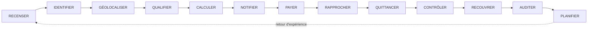

Chaque maillon produit un événement horodaté, signé et inaltérable. **Aucun maillon ne peut être sauté** : pas de quittance définitive sans paiement réglé et rapproché ; pas de paiement sans obligation ; pas d'obligation sans règle active ; pas de règle active sans texte en vigueur vérifié.

| Maillon | Ce qui se passe | Garde-fou |
|---|---|---|
| Recenser | Objet détecté par auto-déclaration, terrain, données partenaires | Objet provisoire tant qu'il n'est pas vérifié |
| Identifier | Rattachement à un compte unique et à un rôle | Pas de fusion automatique d'identités |
| Géolocaliser | Identifiant géofiscal, coordonnées, précision | Contrôle de plausibilité GPS |
| Qualifier | Détermination des règles applicables | Seules les règles actives du registre |
| Calculer | Liquidation déterministe et explicable | Version de règle figée dans l'obligation |
| Notifier | Avis numérique et imprimable, preuve de délivrance | Mentions obligatoires et voie de recours |
| Payer | Référence unique, canal autorisé | Compte bénéficiaire issu du coffre verrouillé |
| Rapprocher | Obligation ↔ paiement ↔ règlement ↔ écriture | Exceptions en file, jamais d'ajustement silencieux |
| Quittancer | Quittance signée, QR vérifiable | Statut « provisoire » tant que non réglé |
| Contrôler | Missions terrain ciblées, constats | L'agent constate, il n'encaisse pas |
| Recouvrer | Relances graduées, mesures légales | Décision humaine habilitée, recours garanti |
| Auditer | Reconstitution intégrale de toute opération | Journal chaîné, stockage WORM indépendant |
| Planifier | Capacité de financement et scénarios | L'IA recommande, l'autorité décide |

## 3.3 Positionnement

- **Une identité • un territoire • une règle légale • une recette traçable.**
- **Principe fondateur :** chaque franc public doit être identifiable, rapprochable et auditable.
- **Priorité d'action :** mobiliser d'abord les recettes légalement dues mais non identifiées ou non recouvrées, avant de proposer tout prélèvement nouveau.

## 3.4 Principes constitutionnels du produit (non négociables)

Ces principes sont opposables à toute équipe de réalisation. Aucune dérogation n'est possible sans décision écrite du Comité de pilotage, publiée au journal des décisions du programme.

| # | Principe | Traduction obligatoire dans le produit |
|---|---|---|
| P1 | **Légalité avant automatisation** | Aucune obligation sans règle active portant sa référence légale ; aucun taux codé en dur ; toute règle non confirmée reste désactivée |
| P2 | **Le système applique le droit, il ne le crée pas** | Ni l'IA, ni l'administrateur, ni un agent ne peut créer une taxe, un taux ou une pénalité |
| P3 | **Une identité, plusieurs rôles, plusieurs objets** | Compte principal unique ; pas de fusion silencieuse ; rôles distincts (propriétaire, bailleur, locataire, exploitant…) |
| P4 | **Minimisation des données** | Collecte limitée à une finalité administrative, fiscale ou de service légitime et documentée |
| P5 | **Fonds publics sur comptes publics** | Aucun paiement de recette publique vers un compte privé de plateforme ou de prestataire |
| P6 | **Séparation des pouvoirs** | Aucune personne, quel que soit son rang, ne peut seule modifier une dette, un paiement, un compte bénéficiaire, une règle ou une trace |
| P7 | **Aucune disparition** | Toute correction est une contre-écriture liée à l'original ; aucune suppression d'écriture financière ou d'événement d'audit |
| P8 | **Preuve avant sanction** | Un signal analytique ouvre une vérification humaine ; jamais une taxation ou une sanction automatique |
| P9 | **Zéro espèce entre les mains des agents** | L'agent constate et notifie ; l'encaissement se fait par des canaux agréés vers le compte public |
| P10 | **IA assistive et redevable** | L'IA détecte, explique, priorise et recommande ; chaque recommandation est journalisée et attribuée |
| P11 | **Hors ligne d'abord pour le terrain, temps réel pour le pilotage** | Application terrain pleinement opérationnelle sans réseau |
| P12 | **Inclusion** | Chaque parcours citoyen existe sans smartphone ni Internet (USSD, SVI, SMS, guichet assisté) et en langues nationales |
| P13 | **Souveraineté et réversibilité** | La Ville possède les données, les clés et le droit d'usage du code ; sortie documentée et testée |
| P14 | **Transparence sans exposition** | Le public voit des agrégats ; jamais la situation fiscale d'une personne identifiable |

# 4. Énoncé du problème

| # | Problème constaté | Effet sur les recettes | Réponse de KINSHASA MOSOLO | Chapitre |
|---|---|---|---|---|
| 1 | Registre des contribuables incomplet et peu fiable | Assiette étroite, pression concentrée, inéquité | Registre par objet, identifiant unique, enrôlement continu | 9, 17 |
| 2 | Absence d'adresse fiscale géolocalisée généralisée | Impossible de notifier, contrôler, prouver | Identifiant géofiscal, plaque et QR par objet | 17 |
| 3 | Télépaiement non opérationnel ou fragmenté | Espèces, quittances non standardisées | Orchestration multicanale vers comptes publics | 18 |
| 4 | Bases dispersées entre services | Doubles sollicitations, statistiques non fiables | Socle commun, API contractualisées | 10, 30 |
| 5 | Le contribuable ignore quoi, combien, où payer | Non-paiement par friction | Espace unique, déclaration pré-remplie, explication du calcul | 13 |
| 6 | Références juridiques obsolètes dans certains documents de projet (texte de 2013 abrogé) et taux mal qualifiés | Liquidations contestables, contentieux de masse | Registre juridique certifié et versionné | 6 |
| 7 | Contrôle terrain sans données fiables | Contrôles inefficaces, arbitraire, corruption | Missions préparées, preuves géolocalisées, hors ligne | 15 |
| 8 | Contrôle interne faible, audit interne peu opérant | Déperdition impossible à prouver | Journal inaltérable, séparation des fonctions, accès auditeur indépendant | 25 |
| 9 | Exonérations et annulations peu tracées | Érosion silencieuse de la base | Registre des exonérations, quatre yeux, alertes de concentration | 25 |
| 10 | Rapprochement bancaire tardif | Fonds « perdus » en suspens, fraudes aux quittances | Rapprochement quotidien automatisé, files d'exception | 20 |
| 11 | Faible capacité de prévision | Assignations irréalistes, pilotage à l'aveugle | Base de référence, modèles de potentiel, scénarios | 38 |
| 12 | Opacité de l'emploi des recettes | Faible consentement à l'impôt | Tableau de transparence publique et recommandations d'affectation | 27 |

**Ce qui n'est pas le problème.** Le programme ne part pas de l'hypothèse que les contribuables kinois refusent l'impôt ni que les agents sont malhonnêtes. Il part de l'hypothèse, étayée par les constats d'évaluation, que l'architecture actuelle de l'information rend la conformité coûteuse, la fraude facile et la preuve difficile. Il corrige l'architecture.

# 5. Objectifs stratégiques

Les cibles chiffrées ci-dessous sont des **cibles de conception** ; les cibles de performance opposables seront fixées après mesure de la base de référence (chapitre 38) et approuvées par le Comité de pilotage.

| # | Objectif | Indicateur principal | Cible de conception |
|---|---|---|---|
| O1 | Constituer un registre géolocalisé des objets générateurs de recettes, commune par commune | Couverture du recensement dans les zones pilotes | ≥ 90 % des parcelles des quartiers pilotes à J+180 |
| O2 | Attribuer une identité fiscale unique à chaque contribuable, reliée à tous ses objets et rôles | Taux d'objets rattachés à un compte vérifié (N2+) | ≥ 70 % des objets recensés à J+180 |
| O3 | Fonder chaque obligation sur une règle certifiée, datée et versionnée | Obligations émises sans règle active | 0 (contrôle bloquant) |
| O4 | Rendre dominant l'encaissement électronique vers les comptes publics | Part des encaissements électroniques dans les flux couverts | > 80 % dans les flux couverts 18 mois après le pilote |
| O5 | Raccourcir la chaîne paiement → quittance → rapprochement | Délai confirmation → quittance ; délai règlement → rapprochement | < 1 minute ; < 24 heures ouvrées |
| O6 | Supprimer la manipulation d'espèces par les agents dans les circuits couverts | Encaissements hors canal agréé détectés | 0 toléré ; chaque cas instruit |
| O7 | Réduire la déperdition mesurable | Paiements non rapprochés à J+3 ; annulations non justifiées | < 1 % ; 0 |
| O8 | Donner à l'exécutif une vision exacte, en temps réel, de l'échelle de la recette | Fraîcheur des données du tableau de bord | < 15 minutes pour les flux électroniques |
| O9 | Relier recettes encaissées et réalisations publiques | Publication du tableau de transparence | Trimestrielle dès la fin du pilote |
| O10 | Améliorer l'environnement de travail des agents publics | Taux de certification ; satisfaction ; temps de traitement | Tous les agents actifs certifiés ; baisse mesurée du temps de traitement |
| O11 | Protéger les droits des contribuables | Délai moyen de traitement des recours ; taux de recours fondés | Dans le délai légal ; suivi public agrégé |
| O12 | Garantir la souveraineté et la réversibilité | Exercice de réversibilité réussi | Un exercice complet avant la généralisation |

# 6. Analyse juridique et réglementaire

Ce chapitre fixe le cadre dans lequel le référentiel juridique de KINSHASA MOSOLO peut être paramétré. Il distingue ce qui est établi, ce qui doit être vérifié sur le texte officiel avant toute mise en production, et ce qui exige un acte nouveau. **Il ne constitue pas un avis juridique** : il prépare le relevé juridique certifié que les services juridiques provinciaux doivent produire (décision n° 3, chapitre 47).

## 6.1 Méthode, sources et limites

La revue a été conduite en septembre 2026 sur des sources publiques : Journal officiel et bases de législation congolaises, sites institutionnels (Banque Centrale du Congo, Cour des comptes, DGI, ARMP), bases internationales (FAOLEX/ECOLEX, PNUE), rapports du FMI et de la Banque mondiale, presse économique congolaise. **Limite importante** : plusieurs bases de textes congolaises n'ont pas pu être consultées en texte intégral pendant la revue ; les éléments marqués [CONFIRMÉ] l'ont été par recoupement de sources publiques identifiées, mais **aucun numéro d'article ni aucun taux ne doit être paramétré sans lecture du texte officiel publié** par le juriste certificateur. L'Annexe A liste chaque affirmation, sa source et son niveau de confiance.

**Conséquence de conception.** Le registre juridique de la plateforme (module 26) ne peut contenir qu'une copie numérisée et hachée du texte officiel comme pièce justificative de chaque règle. Une règle dont la pièce justificative est une coupure de presse ou un document de travail reste au statut `A_VERIFIER` et ne peut produire aucune obligation.

## 6.2 Hiérarchie des normes applicables

| Niveau | Texte | Objet utile à MOSOLO | Statut | Conséquence pour la plateforme |
|---|---|---|---|---|
| Constitution | Constitution du 18 février 2006, révisée par la loi du 20 janvier 2011 — **art. 171** | « Les finances du pouvoir central et celles des provinces sont distinctes » | [CONFIRMÉ] | Comptes, grands livres et tableaux de bord séparés entre recettes provinciales et centrales |
| Constitution | **Art. 174** | Principe de légalité de l'impôt (« il ne peut être établi d'impôts que par la loi ») | [CONFIRMÉ pour le principe ; texte intégral À VÉRIFIER] | Une province ne peut pas créer librement un impôt hors du cadre légal ; toute nouvelle recette doit s'inscrire dans une nomenclature légale ou dans une loi |
| Constitution | **Art. 175** | 40 % des recettes à caractère national allouées aux provinces, retenus à la source | [CONFIRMÉ] | Hors périmètre de liquidation de MOSOLO ; peut être suivi comme ressource dans le module d'affectation (ch. 27) |
| Constitution | **Art. 204, point 16** | Compétence exclusive des provinces pour « les impôts, les taxes et les droits provinciaux et locaux, notamment l'impôt foncier, l'impôt sur les revenus locatifs et l'impôt sur les véhicules automoteurs » | [CONFIRMÉ pour la formulation] | Fondement constitutionnel des trois impôts cœur du pilote |
| Loi | **Loi n° 08/012 du 31 juillet 2008** portant principes fondamentaux relatifs à la libre administration des provinces, modifiée par la **Loi n° 13/008 du 22 janvier 2013** | Compétences et ressources des provinces ; édits de l'Assemblée provinciale | [CONFIRMÉ] | L'édit est l'instrument normal des règles provinciales de perception |
| Loi organique | **Loi organique n° 08/016 du 7 octobre 2008** (ETD) | Organisation des communes et autres ETD | [CONFIRMÉ pour l'existence ; dispositions financières À VÉRIFIER] | Espace communal distinct (module 95) ; pas de liquidation de recettes communales par la province |
| Ordonnance-loi | **Ordonnance-loi n° 18/004 du 13 mars 2018** fixant la nomenclature des impôts, droits, taxes et redevances de la province et de l'entité territoriale décentralisée ainsi que les modalités de leur répartition (JO, n° spécial, 23 avril 2018) | Nomenclature provinciale et locale ; clés de répartition | [CONFIRMÉ pour l'existence, l'objet et l'abrogation de l'OL 13/001] ; [À VÉRIFIER : liste intégrale et clés de répartition] | **Base normative du référentiel.** Toute ligne du catalogue (ch. 7) doit citer son rang dans la nomenclature |
| Ordonnance-loi | **Ordonnance-loi n° 13/001 du 23 février 2013** | Ancienne nomenclature provinciale | **ABROGÉE** par l'OL 18/004 [CONFIRMÉ] | **Interdite comme base de règle.** Toute référence héritée est bloquée par le moteur |
| Ordonnance-loi | **Ordonnance-loi n° 18/003 du 13 mars 2018** | Nomenclature des droits, taxes et redevances du pouvoir central | [CONFIRMÉ] | Liste d'exclusion : empêcher toute double imposition d'un fait générateur central |
| Loi (réf. commande) | **Loi n° 18/014 du 9 juillet 2018** | Présentée dans la commande comme texte de référence et, par un document de travail antérieur, comme loi de ratification de l'OL 18/004 | **[À VÉRIFIER — NON RETROUVÉE]** : aucune trace publique n'a été trouvée de ce numéro comme loi de ratification de l'OL 18/004 ; d'autres lois du 9 juillet 2018 portent les numéros 18/016 (PPP), 18/019 (systèmes de paiement), 18/020 | Ne pas citer dans une fiche de règle avant confirmation au Journal officiel ; vérifier en outre si l'OL 18/004 a été ratifiée et par quel texte |
| Ordonnance-loi | **OL n° 69/006 du 10 février 1969** relative à l'impôt réel, modifiée | Impôt foncier, impôt sur les véhicules, superficie des concessions | [CONFIRMÉ pour l'existence ; version consolidée À VÉRIFIER] | Base matérielle historique de l'IF et de l'impôt sur les véhicules |
| Ordonnance-loi | **OL n° 69/009 du 10 février 1969** relative aux impôts cédulaires sur les revenus, modifiée (notamment OL n° 009/2012 du 21 septembre 2012) | Impôt sur les revenus locatifs | [CONFIRMÉ pour l'existence ; version consolidée À VÉRIFIER] | Base matérielle historique de l'IRL |
| Loi | **Loi n° 004/2003 du 13 mars 2003** portant réforme des procédures fiscales, modifiée (notamment Loi n° 23/052 du 30 novembre 2023) | Déclaration, liquidation, avis de mise en recouvrement, contrôle, recouvrement, prescription, recours | [CONFIRMÉ] | Modèle procédural ; applicabilité aux impôts provinciaux à confirmer au regard de l'édit provincial de procédure |
| Édit provincial | **Édit n° 005/2021 du 31 décembre 2021** portant réforme des procédures de perception des impôts, droits, taxes et redevances dus à la Ville de Kinshasa (JO n° spécial, 14 février 2022) | **Procédure fiscale provinciale de Kinshasa** | [CONFIRMÉ pour l'existence ; contenu À VÉRIFIER] | **Texte clé** pour les états de l'obligation, les délais, les pénalités, les actes de poursuite et les recours. Son éventuelle modification après la réforme des régies de 2026 doit être vérifiée |
| Loi / OL | **Loi n° 04/015 du 16 juillet 2004** (nomenclature des actes générateurs de recettes administratives, judiciaires, domaniales et de participations), modifiée ; **OL n° 13/003 du 23 février 2013** (procédures relatives aux recettes non fiscales) | Recettes non fiscales, surtout centrales | [PROBABLE] | Référence méthodologique pour les droits, taxes et redevances ; applicabilité provinciale À VÉRIFIER |
| Loi | **Loi n° 11/011 du 13 juillet 2011** relative aux finances publiques (LOFIP), modifiée par la **Loi n° 18/010 du 9 juillet 2018** | Budget, unité de caisse et de trésorerie, séparation ordonnateur–comptable, comptes publics | [CONFIRMÉ] | Voir § 6.8 : la plateforme ne détient aucun fonds et ne répartit aucune recette hors procédure budgétaire |
| Décret | **Décret n° 13/050 du 6 novembre 2013** portant règlement général sur la comptabilité publique (RGCP) | Chaîne constatation–liquidation–recouvrement, rôle du comptable public | [PROBABLE — en vigueur, aucune abrogation trouvée] | Modèle des états de la recette ; habilitation du comptable dans les workflows |
| Édits annuels | **Édit budgétaire de la Ville de Kinshasa pour 2026** et arrêtés du ministre provincial des Finances | Taux, tarifs, innovations d'assiette | [À VÉRIFIER : numéro, date, montant définitif] | Source directe des taux ; chaque exercice crée une nouvelle version de règle |
| Arrêtés provinciaux 2026 | Arrêtés créant la **DGIPK** et la direction des droits, taxes et redevances (**DGTK**), en remplacement de la **DGRK** (créée par l'Édit n° 0001/08 du 22 janvier 2008) | Répartition des compétences d'assiette et de recouvrement | [CONFIRMÉ par la presse ; numéros et dates À VÉRIFIER] | L'administration compétente est une donnée de configuration de chaque règle |
| OL | **Ordonnance-loi n° 23/010 du 13 mars 2023** portant Code du numérique (JO 11 avril 2023) | Écrit et signature électroniques, services de confiance, protection des données, cybersécurité | [CONFIRMÉ] ; ratification parlementaire [À VÉRIFIER] | Valeur probante de la quittance et de l'avis électroniques ; obligations de protection des données (§ 6.9) |
| Arrêtés ministériels | **Arrêtés n° 004 et n° 005 du 11 mars 2026** du ministre de l'Économie numérique (régimes de déclaration et d'autorisation des activités et services numériques) | Pleine application depuis le 1er juillet 2026 | [PROBABLE] | **Vérifier si l'exploitation de MOSOLO, ou de ses prestataires, est soumise à déclaration ou à autorisation** |
| Loi | **Loi n° 20/017 du 25 novembre 2020** relative aux télécommunications et aux TIC | Régulation (ARPTIC) | [CONFIRMÉ] | Conventions USSD, SMS, codes courts |
| Loi | **Loi n° 18/019 du 9 juillet 2018** relative aux systèmes de paiement et de règlement-titres | Instruments de paiement, caractère définitif du règlement, surveillance BCC | [CONFIRMÉ] | Cadre des paiements électroniques et mobiles (§ 6.10) |
| Loi organique | **Loi organique n° 18/027 du 13 décembre 2018** portant organisation et fonctionnement de la Banque Centrale du Congo | BCC caissier de l'État, surveillance des paiements | [CONFIRMÉ] | Comptes publics provinciaux et habilitation des prestataires |
| Instructions BCC | **Instruction n° 24** (monnaie électronique), **Instruction n° 42** (agrégateurs, fintechs), **Instruction n° 58/2024** (interopérabilité) | Habilitation des émetteurs de monnaie électronique et des agrégateurs | [PROBABLE / À VÉRIFIER pour les versions en vigueur] | **Si MOSOLO ou un prestataire agrège des paiements, un agrément BCC est probablement requis** |
| Loi | **Loi n° 22/068 du 27 décembre 2022** (lutte contre le blanchiment et le financement du terrorisme) | Vigilance, identification, déclarations de soupçon à la CENAREF | [CONFIRMÉ] | Obligations portées par les banques et émetteurs partenaires ; clauses contractuelles |
| Loi | **Loi n° 10/010 du 27 avril 2010** relative aux marchés publics (projet de révision validé en commission en janvier 2026) | Sélection des prestataires | [CONFIRMÉ ; révision À VÉRIFIER] | Chapitre 37 |
| Loi | **Loi n° 18/016 du 9 juillet 2018** relative au partenariat public-privé ; décrets d'application (dont décret n° 23/38 du 26 octobre 2023) | PPP, appel à la concurrence, rémunération | [CONFIRMÉ] | Chapitre 37 ; clauses de rémunération à lire dans le texte |
| Loi organique | **Loi organique n° 18/024 du 13 novembre 2018** relative à la Cour des comptes | Contrôle des finances des provinces et de toute personne gérant des fonds publics ; chambres provinciales | [CONFIRMÉ] | Accès auditeur, risque de **gestion de fait** si un tiers manie des fonds publics |
| Loi | **Loi n° 11/009 du 9 juillet 2011** relative à la protection de l'environnement, modifiée par l'**OL n° 23/007 du 3 mars 2023** | Principe pollueur-payeur | [CONFIRMÉ pour l'existence] | Fondement possible d'une contribution environnementale, sous réserve de la nomenclature |
| Décret | **Décret n° 17/018 du 30 décembre 2017** portant interdiction de production, d'importation, de commercialisation et d'utilisation des sacs, sachets, films et autres emballages en plastique (emballages alimentaires, eau, boissons, non biodégradables), avec exemptions ; arrêté d'exécution de 2018 fixant des amendes | Interdiction nationale | [CONFIRMÉ] | Toute contribution plastique doit s'articuler avec l'interdiction (§ 8.5) |
| Décrets | Décret n° 011/48 du 3 décembre 2011 (ONIP) ; décrets n° 22/07 et 22/08 du 2 mars 2022 (fichier général de la population, carte d'identité nationale) | Identification de la population | [PROBABLE] ; identification de masse annoncée pour fin 2026 | Pas d'identifiant national universel fiable avant 2027 : conception tolérante (ch. 9) |
| Pratique | Numéro d'identification fiscale (NIF) délivré par la DGI, y compris pour les redevables des ETD | Identifiant fiscal national | [PROBABLE] | Clé de rapprochement privilégiée ; l'IUC MOSOLO n'est qu'un identifiant technique, pas un identifiant fiscal concurrent |

## 6.3 Statut de l'Ordonnance-loi n° 13/001 et des références héritées

Le document de projet d'origine (note KIN-RECETTES) s'appuyait sur l'Ordonnance-loi n° 13/001 du 23 février 2013. **Ce texte est abrogé** par l'Ordonnance-loi n° 18/004 du 13 mars 2018 [CONFIRMÉ]. Conséquences :

1. aucune fiche de règle ne peut citer l'OL 13/001 comme fondement d'une obligation née après l'abrogation ;
2. les arriérés nés sous l'empire de l'OL 13/001 (exercices antérieurs à 2018) ne peuvent être repris qu'avec leur base légale d'origine et sous réserve des règles de prescription, après avis juridique ;
3. le moteur de règles tient une **liste noire des instruments abrogés** : toute tentative de publier une règle référençant un instrument au statut `ABROGE` avec une date d'effet postérieure à l'abrogation est bloquée (test d'acceptation AC-LEG-03, ch. 41) ;
4. les clés de répartition province–ETD souvent citées (par exemple « 40 % aux ETD ») proviennent de l'ancien régime ou de la rétrocession des recettes nationales ; **aucun pourcentage de répartition issu de l'OL 18/004 ne doit être paramétré avant lecture du texte** [À VÉRIFIER].

## 6.4 Impôt sur les revenus locatifs : taux, retenue et assiette

La commande initiale mentionnait un taux de 20 %. **Ce chiffre ne doit pas être utilisé comme taux de l'impôt.** Selon le communiqué du Gouvernement provincial relayé par la presse en février 2026, qui reprend les taux applicables depuis le 1er janvier 2024 [CONFIRMÉ par recoupement de presse ; **arrêté de référence À VÉRIFIER**] :

| Rang de localité | Taux de l'impôt (sur le loyer effectivement perçu) | Retenue à la source opérée par le locataire | Complément à la charge du bailleur |
|---|---|---|---|
| 1er rang | **22 %** | **20 %** | 2 points |
| 2e, 3e et 4e rangs | **17 %** | **15 %** | 2 points |


| Point | État de la connaissance | Hypothèse de conception sûre |
|---|---|---|
| Qui opère la retenue (tous locataires, ou seulement personnes morales et entités assimilées) | [À VÉRIFIER] | Paramètre `withholding_agent_categories` de la règle ; à défaut de confirmation, **la retenue n'est proposée que pour les locataires personnes morales et administrations**, les autres cas relevant de la déclaration du bailleur |
| Délai de reversement de la retenue (dans les 10 jours de chaque paiement, ou avant le 10 du mois suivant) | [À VÉRIFIER — deux formulations circulent] | Paramètre `remittance_due_rule` ; aucune pénalité de retard calculée tant que la règle n'est pas certifiée |
| Échéance de la déclaration annuelle du bailleur | 1er février, prorogée au 28 février en 2026 [CONFIRMÉ par la presse pour 2026] | Échéance annuelle paramétrable + mécanisme de prorogation par acte, versionné |
| Innovations de l'édit budgétaire 2026 : baux emphytéotiques entre entreprises et confessions ou ONG pour des constructions destinées à la location ; loyers perçus par les sociétés immobilières ; indemnités de logement de travailleurs occupant leur propre logement, celui du conjoint ou logés gratuitement | [PROBABLE — édit À VÉRIFIER] | Trois sous-règles distinctes, désactivées jusqu'à certification ; chacune avec formulaire, contrôle de cohérence et voie de recours ; attention au contentieux prévisible sur les indemnités de logement |
| Pénalités (retard de déclaration, de paiement, de reversement de retenue) | [À VÉRIFIER — Édit 005/2021 et textes d'application] | Aucune pénalité automatique ; calcul affiché comme « estimation non opposable » dans le simulateur interne uniquement |
| Déductions, abattements, exonérations | [À VÉRIFIER] | Champs prévus dans la fiche ; valeur nulle par défaut, bloquée tant que non certifiée |

**Règle de modélisation.** La fiche IRL porte deux paramètres distincts — `tax_rate` et `withholding_rate` — et un paramètre `locality_rank` rattaché à la parcelle via le référentiel des rangs de localité (module 86). Le crédit de retenue est imputé sur l'obligation du bailleur ; le moteur empêche que la même période soit liquidée deux fois (retenue et déclaration) sans imputation.

## 6.5 Impôt foncier : barèmes 2026 rapportés

Selon la presse économique de février 2026 [CONFIRMÉ par une source de presse unique ; **arrêté de référence À VÉRIFIER**] :

| Redevable | Assiette | 1er rang | 2e rang | 3e rang | 4e rang |
|---|---|---|---|---|---|
| Personnes physiques — bâti (forfait annuel) | Par propriété | 450 USD (villas) | 150 USD | 50 USD | 10 USD |
| Personnes morales | Par m² | 3,5 USD | 2,5 USD | 2 USD | 1,5 USD |
| Sociétés immobilières | Par m² | 8 USD | 5 USD | 4 USD | 3 USD |
| Personnes physiques — non bâti | Forfait par rang | [À VÉRIFIER] | [À VÉRIFIER] | [À VÉRIFIER] | [À VÉRIFIER] |


Ces montants sont libellés en dollars ; la règle de conversion en francs congolais (taux applicable, date de référence) doit être certifiée (module 89). L'échéance déclarative 2026 a été le 1er février, prorogée au 28 février [CONFIRMÉ par la presse].

**Point d'attention d'équité.** Les travaux expérimentaux menés à Kananga (RDC) sur l'impôt foncier montrent que la conformité réagit fortement au niveau du forfait : une baisse du montant exigé augmente la conformité au point que la recette totale peut augmenter (élasticité de la conformité proche de −1,25) [CONFIRMÉ — publication académique, Econometrica 2024]. MOSOLO ne fixe pas les taux, mais son laboratoire de simulation (module 92) doit permettre au Gouvernement de tester ces effets sur données réelles avant tout arrêté.


## 6.6 Véhicules : impôt et taxe spéciale de circulation routière

La régie provinciale perçoit l'impôt sur les véhicules automoteurs et la taxe spéciale de circulation routière (vignette), avec déclaration en ligne obligatoire depuis janvier 2026, vignette dématérialisée à QR code et paiement dans des banques partenaires [CONFIRMÉ par la presse]. **Les barèmes par catégorie de véhicule n'ont pas été retrouvés** [À VÉRIFIER]. La répartition de la TSCR (taxe d'intérêt commun) entre niveaux de gouvernement doit être confirmée dans l'OL 18/004. Le rapprochement avec le fichier des immatriculations (pouvoir central) exige un protocole.

## 6.7 Procédure fiscale, recouvrement et recours

La procédure applicable aux recettes de la Ville repose sur l'**Édit n° 005/2021** [contenu À VÉRIFIER], articulé avec les principes de la Loi n° 004/2003 modifiée. Le relevé juridique certifié doit fournir, pour chaque recette, les éléments suivants, qui paramètrent directement les modules 27, 32, 33, 36 et 37 :

| Élément de procédure | Paramètre de la plateforme | Statut |
|---|---|---|
| Mode d'établissement (déclaration, auto-liquidation, liquidation d'office, rôle) | `assessment_mode` | À VÉRIFIER par recette |
| Titre de perception (avis de mise en recouvrement, note de perception, etc.) et mentions obligatoires | Modèle d'avis versionné | À VÉRIFIER |
| Délai de paiement après notification | `payment_term_days` | À VÉRIFIER |
| Pénalités d'assiette et de recouvrement, plafonds | `penalty_rules[]` | À VÉRIFIER |
| Actes de poursuite (commandement, saisie, fermeture) et autorité compétente | Workflow du module 36 | À VÉRIFIER |
| Délai et forme de la réclamation ; effet suspensif éventuel | `appeal_path`, `suspensive_effect` | À VÉRIFIER |
| Voies de recours juridictionnel | Texte d'information du contribuable | À VÉRIFIER |
| Prescription de l'action en recouvrement et du droit de reprise | `limitation_period` | À VÉRIFIER (le régime national prévoit un droit de rappel de cinq ans : applicabilité provinciale à confirmer) |
| Remises gracieuses, transactions, échéanciers | Modules 83 et 90 | À VÉRIFIER |
| Valeur de la notification électronique | Module 39 | À VÉRIFIER au regard du Code du numérique et de l'édit |

## 6.8 Finances publiques : ce que la LOFIP impose à l'architecture

La LOFIP pose le principe d'**unité de caisse et de trésorerie** et prévoit la tenue des disponibilités de la province dans un compte ouvert auprès de la Banque Centrale du Congo, avec séparation des fonctions d'ordonnateur et de comptable [CONFIRMÉ pour le principe ; articles À VÉRIFIER]. Quatre conséquences de conception sont non négociables :

1. **MOSOLO ne détient jamais de fonds.** Tous les paiements sont dirigés vers les comptes publics désignés (compte de recettes auprès des banques partenaires, puis compte de la province). La plateforme orchestre, trace, rapproche et prouve.
2. **Aucune répartition à la source hors texte.** Un prélèvement automatique d'une partie des recettes au profit d'un tiers (prestataire, agents, ministères) avant leur entrée dans la caisse publique est **juridiquement très exposé** au regard de l'unité de caisse, de l'universalité budgétaire et du risque de gestion de fait contrôlé par la Cour des comptes. Voir chapitre 37 pour l'analyse du modèle de rémunération proposé dans le Cahier v2.9.
3. **Le comptable public reste l'autorité de prise en charge.** Les workflows de règlement et de rapprochement (modules 29, 30, 59) prévoient la validation par le comptable habilité ; MOSOLO fournit les pièces.
4. **L'affectation relève du budget.** Le module 48 recommande ; il n'affecte pas (chapitre 27).

## 6.9 Numérique, protection des données et signature électronique

| Sujet | État | Conséquence de conception |
|---|---|---|
| Valeur de l'écrit et de la signature électroniques | Reconnue par le Code du numérique [CONFIRMÉ] | Quittance et avis électroniques signés ; la valeur probante exacte (signature simple, avancée, qualifiée) dépend des textes d'application |
| Autorité nationale de certification électronique (ANCE) | Non opérationnelle ; missions exercées à titre intérimaire par l'ARPTIC [PROBABLE] | **Pas de PKI qualifiée nationale disponible** : MOSOLO opère une PKI provinciale (HSM) à titre de signature avancée, avec chaîne de certification documentée, transitoire jusqu'à la reconnaissance d'un prestataire qualifié |
| Autorité de protection des données (APD) | Non créée ; missions intérimaires confiées à l'ARPTIC par arrêté de 2024, dont la légalité est discutée [PROBABLE] | Formalités préalables auprès de l'autorité intérimaire à vérifier ; registre des traitements tenu dès le premier jour ; analyse d'impact sur la protection des données avant le pilote |
| Transferts de données hors du territoire | Régime à vérifier dans le Code du numérique | Hébergement primaire en RDC (ch. 33) ; aucun transfert de données personnelles fiscales hors du territoire sans base légale |
| Régime de déclaration ou d'autorisation des services numériques (arrêtés du 11 mars 2026) | [PROBABLE] | Vérifier l'assujettissement de l'opérateur de la plateforme et des prestataires avant le pilote |

## 6.10 Paiements électroniques

Le cadre repose sur la Loi n° 18/019 (systèmes de paiement), la loi organique de la BCC et les instructions de la BCC relatives à la monnaie électronique, aux agrégateurs et à l'interopérabilité. **Règle de conception : MOSOLO n'est ni un établissement de paiement, ni un émetteur de monnaie électronique, ni un agrégateur, sauf agrément formel.** Les paiements sont initiés vers des comptes publics par des prestataires eux-mêmes habilités (banques, émetteurs de monnaie électronique) ; MOSOLO émet la référence de paiement, reçoit les confirmations signées et rapproche. Si l'architecture retenue exige une fonction d'agrégation (un seul point d'intégration pour plusieurs opérateurs), cette fonction est confiée à un **agrégateur agréé par la BCC**, sous contrat avec la Province, et non à l'opérateur de la plateforme [ACTE REQUIS : vérification de l'agrément].

## 6.11 Typologie des recettes et séparation des compétences

Chaque ligne du catalogue porte obligatoirement l'une des catégories suivantes. Le moteur de règles refuse toute obligation qui reproduirait, pour un même fait générateur, un même redevable et une même période, une obligation déjà portée par une autre administration.

| Catégorie | Définition | Exemples | Traitement MOSOLO |
|---|---|---|---|
| **IMPOT_PROVINCIAL** | Impôt attribué à la province par la Constitution et la nomenclature | Impôt foncier, IRL, impôt sur les véhicules, superficie des concessions | Liquidation par la régie des impôts provinciaux |
| **INTERET_COMMUN** | Impôt ou taxe d'intérêt commun, avec clé de répartition légale | Selon OL 18/004 [liste À VÉRIFIER] : TSCR, patente, consommation bière et tabac, superficie des concessions forestières et minières, ventes de matières précieuses artisanales | Liquidation + calcul des parts légales (module 73) |
| **PROVINCIAL_SPECIFIQUE** | Droits, taxes et redevances propres à la province | Transport, embarquement, publicité, antennes, voirie et drainage, assainissement, débits de boissons, spectacles, carrières, péages, accostage, produits forestiers non ligneux | Liquidation par la régie des taxes |
| **RECETTE_ETD** | Recette des communes ou autres ETD | Impôt personnel minimum selon les informations disponibles [rattachement exact À VÉRIFIER], droits communaux | **Non liquidée par la province** ; espace communal séparé ultérieur |
| **RECETTE_CENTRALE** | Recette du pouvoir central | Nomenclature OL 18/003, impôts DGI | Exclue ; sert uniquement à prévenir la double imposition |
| **PARTAGEE** | Recette dont le produit est légalement partagé | Selon texte | Parts calculées sur recettes rapprochées ; aucune clé modifiable par un utilisateur |
| **DROIT_ADMINISTRATIF** | Contrepartie d'un acte administratif | Autorisations, permis, duplicatas, attestations | Liquidation à la demande de l'acte |
| **REDEVANCE_SERVICE** | Contrepartie d'un service rendu | Stationnement, marchés, enlèvement de déchets | Titres à durée (module 70) |
| **PENALITE** | Sanction pécuniaire prévue par un texte | Pénalités de retard, amendes réglementaires | Jamais automatique ; décision habilitée ; recours |
| **CONCESSION_DOMANIALE** | Produit du domaine et des concessions | Occupation du domaine public, location d'actifs | Contrat + règle tarifaire |
| **RECETTE_COMMERCIALE** | Recette d'une activité commerciale publique | Droits de dénomination, données agrégées | Contrat mis en concurrence |
| **ACTE_REQUIS** | Recette envisagée sans base suffisante | Contribution plastique, captation de plus-value | Simulable, **non activable** |

**Impôt personnel minimum.** Les informations disponibles indiquent que l'IPM est perçu au niveau des communes, secteurs et chefferies ; son rattachement exact dans l'OL 18/004 n'a pas pu être confirmé [À VÉRIFIER]. Il est classé `RECETTE_ETD` et **n'est pas activé** dans le périmètre provincial.

## 6.12 Règle d'or : la fiche de règle de recette

Aucune recette n'est activable sans une fiche complète, certifiée par le service juridique provincial et approuvée par l'autorité compétente. La fiche et le modèle technique sont identiques : ce que le juriste signe est ce que le moteur exécute.

| # | Champ de la fiche | Attribut technique | Contrôle |
|---|---|---|---|
| 1 | Référence légale | `legal_instrument_id` (instrument au statut `EN_VIGUEUR`, pièce officielle hachée) | Bloquant |
| 2 | Article(s) | `articles[]` | Bloquant |
| 3 | Autorité compétente | `competent_authority_id` | Bloquant |
| 4 | Fait générateur | `taxable_event` (typé : possession, location, activité, transaction, occupation, acte) | Bloquant |
| 5 | Catégorie de redevable | `liable_party_rule`, `withholding_agent_rule` | Bloquant |
| 6 | Assiette | `base_definition` (champs d'objet utilisés, unité) | Bloquant |
| 7 | Formule officielle | `formula` (expression dans le langage de règles, testée) | Bloquant |
| 8 | Taux ou tarif | `rate_table` (par rang, catégorie, tranche) | Bloquant |
| 9 | Devise et arrondi | `currency`, `fx_rule_id`, `rounding` | Bloquant |
| 10 | Exonérations | `exemption_rules[]` (fondement, preuve exigée, durée) | Obligatoire si applicable |
| 11 | Pénalités | `penalty_rules[]` (base légale, taux, plafond) | Obligatoire si applicable |
| 12 | Date d'effet | `effective_from` | Bloquant |
| 13 | Date de fin | `effective_to` (ou instrument d'abrogation) | Bloquant si connue |
| 14 | Administration responsable | `administering_entity_id` | Bloquant |
| 15 | Compte public bénéficiaire | `beneficiary_account_ref` (référence au coffre, jamais saisie libre) | Bloquant |
| 16 | Voie de recours | `appeal_path` (délai, service, effet suspensif) | Bloquant |
| 17 | Approbations | `approvals[]` : rédacteur juridique ≠ vérificateur juridique ≠ validateur financier ≠ autorité de publication | Quatre personnes distinctes |
| 18 | Historique des versions | `version`, `supersedes_rule_version_id`, `change_reason` | Automatique, immuable |
| 19 | Catégorie de recette | `revenue_category` (§ 6.11) | Bloquant |
| 20 | Statut de vérification des sources | `source_verification` : `OFFICIEL_CERTIFIE` requis pour l'activation | Bloquant |

**Cycle de vie d'une règle.**

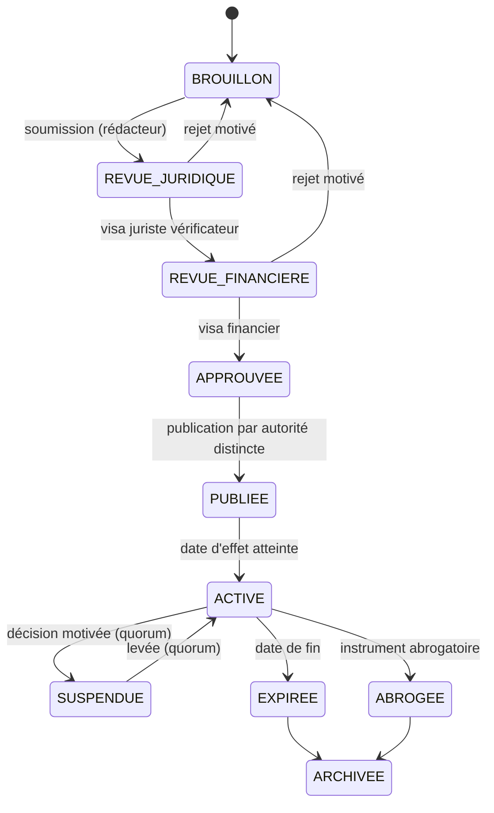

Règles complémentaires : une règle en brouillon ou approuvée mais non encore active n'affecte aucune obligation ; toute rétroactivité exige une référence légale expresse et une approbation renforcée ; la version appliquée est figée dans chaque obligation ; un changement de texte produit une nouvelle version et, si le texte l'exige, un recalcul contrôlé qui crée des obligations rectificatives sans écraser les anciennes.

## 6.13 Points juridiques à trancher avant la production

| # | Question | Autorité responsable | Données requises | Hypothèse intérimaire sûre | Verrou technique |
|---|---|---|---|---|---|
| J1 | Texte intégral et consolidé de l'OL 18/004 ; liste et clés de répartition ; ratification | Service juridique provincial + ministère provincial des Finances | JO du 23 avril 2018, lois de ratification, modifications | Seules les trois recettes nommées par l'art. 204 pt 16 sont modélisées en priorité | Aucune règle `INTERET_COMMUN` ou `PARTAGEE` activable sans clé certifiée |
| J2 | Objet réel de la « Loi n° 18/014 du 9 juillet 2018 » | Service juridique provincial | Journal officiel | Référence non citée | Instrument au statut `A_VERIFIER` |
| J3 | Arrêtés et édit fixant les taux 2026 (IRL, IF, véhicules) | Ministère provincial des Finances | Textes signés et publiés | Taux de presse enregistrés en `A_VERIFIER` | Pas d'obligation émise |
| J4 | Contenu et mise à jour de l'Édit n° 005/2021 (procédure) | Service juridique provincial | Texte, amendements | Aucune pénalité automatique ; notification papier doublée | Règles de pénalités désactivées |
| J5 | Arrêtés de création de la DGIPK et de la DGTK ; transfert des compétences et des comptes | Cabinet du Gouverneur, Finances | Arrêtés, décisions de transfert | Administration paramétrable par règle | Pas de règle sans `administering_entity_id` valide |
| J6 | Acte instituant le quitus fiscal et liste des démarches conditionnées | Finances, services concernés | Acte | Quitus informatif uniquement | Aucun blocage de service sans règle de conditionnalité certifiée |
| J7 | Valeur probante de la quittance et de la notification électroniques | Services juridiques ; autorité intérimaire du numérique | Code du numérique et textes d'application | Double preuve (électronique + imprimable signée) | — |
| J8 | Formalités de protection des données et analyse d'impact | Délégué à la protection des données du programme | Registre des traitements | Minimisation maximale ; pas de partage de données partenaires sans protocole | Connecteurs partenaires désactivés sans protocole signé |
| J9 | Habilitation BCC des prestataires de paiement et besoin d'agrément d'agrégation | Finances + BCC | Agréments | Seuls des prestataires déjà agréés, sous contrat avec la Province | Connecteur de canal non activable sans preuve d'agrément |
| J10 | Régime des incitations des agents (primes, quotes-parts) | Finances, Fonction publique provinciale | LOFIP, édit, arrêté | Aucune prime calculée par la plateforme | Module de performance en mode « indicateurs » seulement |
| J11 | Régime juridique de la rémunération du prestataire (marché, PPP, pourcentage) | Finances, ARMP/DGCMP, UC-PPP | Loi 10/010, Loi 18/016, LOFIP | Rémunération contractuelle payée sur crédit budgétaire (ch. 37) | Aucun flux de décaissement automatique vers un compte privé |
| J12 | Assujettissement de la plateforme aux régimes de déclaration ou d'autorisation des services numériques (2026) | Ministère de l'Économie numérique | Arrêtés du 11 mars 2026 | Déclaration préventive | — |
| J13 | Conditions de partage de données avec les distributeurs d'énergie, d'eau, les opérateurs télécoms, les brasseries, les employeurs | Juridique + autorité de protection des données | Protocoles | Aucun échange de données personnelles sans protocole | Connecteurs désactivés |
| J14 | Base légale des échéanciers et de la régularisation volontaire (abandon de pénalités) | Finances / Assemblée provinciale | Texte | Modules 83 et 90 désactivés | — |
| J15 | Compétence provinciale pour une contribution plastique ou une REP (art. 174 Constitution, nomenclature, Décret 17/018) | Juridique + Environnement + pouvoir central | Analyse | Aucune activation | Catégorie `ACTE_REQUIS` |
| J16 | Portée d'une décision de la Cour constitutionnelle de 2024 sur la création d'impôts provinciaux hors nomenclature, rapportée par la presse | Service juridique | Arrêt | Aucune recette nouvelle hors nomenclature | Catégorie `ACTE_REQUIS` |

# 7. Paysage des recettes

Les catégories ci-dessous structurent le paramétrage, **sous réserve de la certification prévue au chapitre 6**. La colonne « Rendement à Kinshasa » est une appréciation qualitative fondée sur la structure économique de la ville ; elle n'est pas une prévision. La colonne « Régie » indique l'hypothèse de rattachement après la réforme de 2026 (DGIPK pour les impôts, direction des droits, taxes et redevances — DGTK, successeur de la DGRK — pour les autres recettes) ; elle est configurable.

## 7.1 Impôts provinciaux

| Recette | Objet fiscal dans MOSOLO | Fait générateur | Régie | Où se trouvent déjà les redevables | Statut juridique | Rendement à Kinshasa |
|---|---|---|---|---|---|---|
| **Impôt foncier** (bâti et non bâti) | Parcelle, bâtiment ; rang de localité ; superficie ; catégorie de redevable | Propriété ou possession d'un immeuble au 1er janvier [À VÉRIFIER] | DGIPK | Titres fonciers, permis de bâtir, raccordements électricité et eau, déclarations antérieures | Art. 204 pt 16 [CONFIRMÉ] ; barèmes 2026 [À VÉRIFIER] | Élevé ; très grand nombre de petits montants |
| **Impôt sur les revenus locatifs** | Unité louée, bail, bailleur, locataire, loyer | Perception de loyers | DGIPK | Indemnités de logement en paie, agences, baux d'entreprises, compteurs multiples, annonces | Art. 204 pt 16 [CONFIRMÉ] ; taux 22/17 % et retenue 20/15 % [CONFIRMÉ presse, arrêté À VÉRIFIER] | **Le plus élevé** ; fortement sous-déclaré |
| **Impôt sur les véhicules automoteurs** | Véhicule, plaque, catégorie, puissance, usage | Détention d'un véhicule immatriculé [À VÉRIFIER] | DGIPK | Fichier des immatriculations, assurances, mutations, contrôles routiers | Art. 204 pt 16 [CONFIRMÉ] ; barèmes [À VÉRIFIER] | Élevé |
| **Impôt sur la superficie des concessions minières** (et d'hydrocarbures [À VÉRIFIER]) | Concession, superficie, titulaire | Détention d'un titre | DGIPK | Cadastre minier | OL 18/004 [CONFIRMÉ pour les concessions minières] | Faible à Kinshasa |

## 7.2 Taxes d'intérêt commun (liste à confirmer sur l'OL 18/004)

| Recette | Objet | Mécanisme de capture | Point de vigilance | Rendement |
|---|---|---|---|---|
| Taxe spéciale de circulation routière | Véhicule | Même objet et même scan que l'impôt sur les véhicules | Clé de répartition [À VÉRIFIER] | Moyen à élevé |
| Taxe annuelle pour la délivrance de la patente | Activité, établissement, étal | Recensement par marché et par rue ; code marchand de monnaie mobile ; vignette QR sur devanture | Ne pas confondre existence d'une activité et assujettissement (seuils, régimes) | Volume élevé, ticket faible |
| Taxes de consommation sur bière, alcools, spiritueux et tabac | Producteur, importateur, volumes | Cellule grands redevables : déclaration mensuelle de volumes rapprochée des données d'accises et de facturation | Articulation avec les droits d'accises centraux ; peu de redevables, enjeux élevés | Très élevé, très peu de redevables |
| Taxe de superficie sur les concessions forestières | Concession | Liquidation sur la superficie du titre | Données du ministère de l'Environnement | Faible à Kinshasa |
| Taxe de superficie sur les concessions minières | Concession | Idem | Cadastre minier | Faible |
| Taxe sur les ventes de matières précieuses de production artisanale (or, diamant) | Comptoir, négociant, transaction | Déclaration par transaction des comptoirs agréés | Coordination avec les services des mines | Faible à Kinshasa, sauf comptoirs |

## 7.3 Taxes, droits et redevances propres à la province

| Recette | Objet | Mécanisme de capture | Titre délivré | Rendement |
|---|---|---|---|---|
| Autorisation de transport (personnes, marchandises) | Véhicule de transport, opérateur | Autorisation rattachée à l'objet véhicule, contrôle par plaque | Titre annuel ou périodique (module 70) | Moyen |
| Embarquement et débarquement (routier, fluvial) | Point d'embarquement, embarcation, véhicule | Paiement mobile au point de départ ; comptage croisé | Titre par voyage ou périodique | Moyen |
| Publicité extérieure | Support, face, surface, emplacement | Identifiant géofiscal et plaque QR par support ; tout support sans plaque est présumé non enregistré | Autorisation annuelle | Élevé |
| Antennes de télécommunications | Site, pylône, opérateur | Listes de sites des opérateurs ; liquidation annuelle | Avis annuel | Élevé ; risque de contentieux |
| Entretien de la voirie et drainage | Parcelle, activité, véhicule selon texte | Adossé aux objets existants | Selon texte | Moyen |
| Assainissement | Parcelle, activité | Idem | Selon texte | Moyen |
| Autorisation d'exploitation de débit de boissons | Établissement, catégorie | Recoupement avec les points de livraison des brasseries | Autorisation annuelle | Élevé |
| Spectacles et divertissements | Événement, salle, organisateur | Autorisation conditionnée à l'enregistrement ; assiette sur billetterie déclarée | Autorisation par événement | Moyen |
| Carrières à ciel ouvert | Site, exploitant | Sites géoréférencés ; comptage des sorties de camions rapproché des déclarations | Autorisation + déclaration | Moyen |
| Péage provincial | Axe, passage | Reçu électronique lié à la plaque | Titre par passage ou abonnement | Moyen |
| Accostage dans les ports privés | Quai, embarcation | Déclaration de mouvements, contrôle | Titre par escale | Moyen |
| Produits forestiers non ligneux | Point de vente, quantité | Déclaration aux points de contrôle | Titre de transport | Faible |
| Occupation du domaine public | Emprise | Plan géoréférencé des emprises | Autorisation d'occupation | Moyen à élevé |
| Stationnement | Place, zone | Sessions payées par plaque | Titre horaire à mensuel | Moyen à élevé (après acte de zonage) |
| Marchés | Étal, emplacement | Plan des marchés, titres périodiques | Titre journalier à mensuel | Élevé en volume ; historiquement en espèces |
| Permis et documents administratifs | Acte demandé | Liquidation à la demande | Acte + quittance | Moyen |

## 7.4 Recettes administratives et domaniales

Actes, permis, duplicatas, attestations, autorisations et autres droits légalement prévus, rattachés à une demande, un acte ou une prestation ; loyers et redevances d'actifs provinciaux ; concessions. Chaque ligne suit la règle d'or (§ 6.12).

## 7.5 Inventaire de référence à constituer (phase 0)

Le programme construit, avant tout paramétrage, l'inventaire exhaustif des recettes effectivement perçues aujourd'hui. Il alimente la base de référence (chapitre 38).

| Attribut | Contenu attendu | Source |
|---|---|---|
| Recette et code | Libellé officiel, code budgétaire | Nomenclature budgétaire |
| Administration | Régie ou service responsable | Arrêtés 2026 |
| Base légale | Texte, article, statut de certification | Relevé juridique |
| Mode de perception actuel | Déclaratif, rôle, perception au point de service | Régie |
| Canaux | Guichet, banque, monnaie mobile, agent, portail existant | Régie, banques |
| Comptes | Comptes publics de destination actuels | Trésor provincial |
| Systèmes | Portail de déclaration existant, logiciels, bases | DSI provinciale |
| Volumétrie | Nombre de redevables et d'opérations par période | Régie |
| Réalisations | Montants liquidés, encaissés, rapprochés, par mois, trois derniers exercices | Régie, Trésor |
| Coût de collecte | Coût observé | Finances |
| Déperdition estimée | Écart entre dû, encaissé et rapproché | Audit |
| Données disponibles | Sources, qualité, fraîcheur | Programme |

# 8. Nouvelles opportunités de recettes

## 8.1 Doctrine

KINSHASA MOSOLO cherche **d'abord l'argent déjà légalement dû** : assiettes non recensées, sous-déclarations, arriérés, défauts de rapprochement, exonérations et annulations irrégulières, fuites dans la collecte. Les prélèvements nouveaux ne viennent qu'ensuite, par la voie légale, après analyse d'impact et consultation. **Aucune opportunité ne devient une recette par décision algorithmique.**

Chaque piste est instruite selon la même grille de quinze attributs : faisabilité juridique ; objectif de politique publique ; autorité responsable ; fait générateur ; population concernée ; méthode de calcul ; coût de mise en œuvre ; impact social ; impact économique ; potentiel de recettes ; risque de corruption ; exigences de contrôle ; texte requis ; priorité ; recommandation de pilote.

## 8.2 Matrice de synthèse des gisements

Légende. **Faisabilité juridique** : A = droit existant (sous certification) ; B = arrêté ou décision d'exécution ; C = édit ou acte provincial nouveau dans le cadre de la nomenclature ; D = loi nationale ou compétence incertaine. **Potentiel** : qualitatif, à chiffrer par la base de référence. **Risque de corruption** : F faible, M moyen, É élevé. **Priorité** : 1 (immédiate) à 4 (étude).

| ID | Gisement | Nature | Faisab. | Potentiel | Risque corr. | Priorité | Pilote |
|---|---|---|---|---|---|---|---|
| G01 | Recensement locatif systématique (unités, baux) | Assiette existante | A | Très élevé | É (négociation terrain) | 1 | Oui, 4 communes |
| G02 | Recensement foncier et requalification bâti/non bâti | Assiette existante | A | Élevé | M | 1 | Oui |
| G03 | Quitus fiscal numérique et conditionnalité des services | Conformité | B | Élevé (effet levier) | F | 1 | Oui |
| G04 | Retenue IRL par les employeurs et locataires personnes morales | Assiette existante | A | Élevé | F | 1 | Oui (grands employeurs) |
| G05 | Cellule grands redevables (bière, tabac, antennes, carrières) | Fiabilisation | A | Très élevé par redevable | M | 1 | Oui |
| G06 | Rapprochement automatisé et fin des fausses quittances | Déperdition évitée | A | Élevé | Réduit le risque | 1 | Oui |
| G07 | Registre des exonérations et contrôle des annulations | Récupération de base | A | Moyen à élevé | Réduit le risque | 1 | Oui |
| G08 | Véhicules : rapprochement immatriculations–vignette–contrôles | Assiette existante | A | Élevé | M | 2 | Oui, contrôles ciblés |
| G09 | Publicité extérieure non déclarée | Assiette existante | A | Élevé | M | 2 | Oui, axes de Gombe |
| G10 | Occupation du domaine public (terrasses, étals, chantiers) | Assiette existante | A/B | Moyen | É | 2 | Oui |
| G11 | Marchés : titres numériques, fin de la collecte en espèces | Déperdition évitée | A/B | Élevé en volume | É | 2 | Oui, 2 marchés |
| G12 | Recouvrement des arriérés et régularisation volontaire | Recettes historiques | A/B | Élevé ponctuel | M | 2 | Oui |
| G13 | Débits de boissons (recoupement livraisons brasseries) | Assiette existante | A | Élevé | M | 2 | Oui |
| G14 | Antennes : inventaire contradictoire des sites | Assiette existante | A | Élevé | F | 2 | Oui |
| G15 | Stationnement réglementé (zones, rotation) | Redevance de service | B/C (zonage, tarif) | Moyen à élevé | M (réduit si sans espèces) | 2 | Oui, Gombe après acte |
| G16 | Embarquement et transport (y compris moto-taxis) | Assiette existante | A/B | Moyen à élevé | É (prélèvements informels) | 3 | Après concertation |
| G17 | Droits liés aux chantiers et permis de bâtir | Droit administratif | B/C | Moyen | M | 3 | Oui |
| G18 | Carrières : comptage des sorties rapproché des déclarations | Assiette existante | A | Moyen | M | 3 | Étude |
| G19 | Ports privés et accostage | Assiette existante | A | Moyen | M | 3 | Cadrage sectoriel |
| G20 | Événements et spectacles (billetterie déclarée) | Assiette existante | A | Faible à moyen | M | 3 | Oui |
| G21 | Location et valorisation d'actifs provinciaux sous-utilisés | Recette domaniale | B/C | Moyen | É (bradage) | 3 | Inventaire d'abord |
| G22 | Droits de dénomination et de publicité sur actifs publics | Recette commerciale | C | Faible à moyen | É | 4 | Étude |
| G23 | Services administratifs numériques premium (délai garanti) | Droit administratif | C | Faible | M (service à deux vitesses) | 4 | Étude |
| G24 | Produits de données urbaines anonymisées | Recette commerciale | C + protection des données | Faible | M (ré-identification) | 4 | Non avant 2028 |
| G25 | Contribution environnementale plastique / REP | Prélèvement nouveau | **D** | Moyen, décroissant | M | 4 | Étude d'impact |
| G26 | Accès logistique des poids lourds et zones de livraison | Redevance nouvelle | C/D | Moyen | M | 4 | Étude |
| G27 | Captation de plus-value foncière liée aux infrastructures | Prélèvement nouveau | **D** | Élevé à long terme | É (évaluation) | 4 | Étude |
| G28 | Péages urbains, congestion, basses émissions | Prélèvement nouveau | **D** | Incertain | M | 4 | Non recommandé à court terme |
| G29 | Gestion des déchets : redevance d'enlèvement liée au service | Redevance de service | B/C | Moyen | M | 3 | Avec un opérateur de service |
| G30 | Tourisme (hébergement) | Selon nomenclature | C/D | Faible à moyen | F | 4 | Étude |
| G31 | Réduction du coût de collecte (moins d'intermédiaires, moins d'espèces) | Efficience | A | Moyen (net) | Réduit le risque | 1 | Mesuré dans le pilote |
| G32 | Partenariats public-privé d'infrastructures payantes (marchés modernisés, gares routières, parkings en ouvrage) | Concession | B/C + Loi PPP | Moyen | É | 3 | Un projet test |
| G33 | Sanctions pour non-conformité vérifiée | Pénalités légales | A (selon édit) | Faible à moyen | É si discrétionnaire | 2 | Encadré, jamais automatique |


## 8.3 Fiches détaillées des gisements prioritaires

Chaque fiche suit la grille des quinze attributs. Les ordres de grandeur de potentiel sont exprimés **en formule** ; les valeurs chiffrées appartiennent au chapitre 38 et restent des exemples tant que la base de référence n'est pas mesurée.

### G01 — Recensement locatif systématique

| Attribut | Contenu |
|---|---|
| Faisabilité juridique | A — IRL prévu par la Constitution et la nomenclature ; taux et procédure à certifier (J3, J4) |
| Objectif de politique publique | Équité entre bailleurs ; élargissement de l'assiette sans hausse de taux |
| Autorité | DGIPK ; ministère provincial des Finances |
| Fait générateur | Perception d'un loyer sur une unité située à Kinshasa |
| Population concernée | Bailleurs personnes physiques et morales ; locataires retenant à la source |
| Méthode de calcul | Loyer effectivement perçu × taux du rang ; imputation des retenues |
| Coût de mise en œuvre | Recensement terrain (agents, terminaux), plaques, communication, protocoles de données ; coût par unité à établir par devis |
| Impact social | Risque de répercussion sur les loyers ; risque de pression sur les petits bailleurs ; atténuation par campagne de régularisation, simplicité et paiement fractionné si la loi le permet |
| Impact économique | Formalisation du marché locatif ; données utiles à la politique du logement |
| Potentiel | `Unités louées estimées × loyer moyen × taux × (conformité cible − conformité actuelle)` |
| Risque de corruption | Élevé : négociation de la déclaration sur le terrain. Contre-mesures : l'agent n'encaisse rien, ne voit pas le montant final, constats photographiés et géolocalisés, double visite aléatoire |
| Exigences de contrôle | Visites ciblées après revue humaine ; recoupements (compteurs, indemnités de logement, annonces) sous protocole |
| Texte requis | Aucun pour l'impôt ; protocoles de données (J13) ; éventuel arrêté sur la plaque d'immatriculation fiscale des immeubles |
| Priorité | 1 |
| Pilote | Recensement complet de quartiers échantillons dans les quatre communes pilotes avant la campagne de février 2027 |

### G03 — Quitus fiscal numérique

| Attribut | Contenu |
|---|---|
| Faisabilité juridique | B — quitus existant ; conditionnalité à fonder sur l'acte qui l'institue et, pour de nouveaux services, sur arrêté |
| Objectif | Faire de la conformité une condition d'accès, sans prélèvement nouveau |
| Autorité | DGIPK ; services délivrant les autorisations |
| Fait générateur | Demande d'un service conditionné (marché public provincial, permis de bâtir, mutation, autorisation) |
| Population | Entreprises soumissionnaires, propriétaires, demandeurs d'autorisations |
| Méthode | Vérification en temps réel de l'absence d'obligation exigible non contestée ; QR vérifiable ; durée de validité |
| Coût | Faible (logiciel, intégration aux services) |
| Impact social | Risque d'exclusion si le contribuable conteste de bonne foi : le recours en cours suspend l'effet bloquant |
| Impact économique | Incitation forte à la régularisation des entreprises |
| Potentiel | Indirect : `régularisations déclenchées par des demandes de service × montant moyen` |
| Risque de corruption | Faible si délivrance automatique ; élevé si délivrance manuelle — la délivrance manuelle est supprimée |
| Contrôle | API de vérification pour les services ; journal des vérifications |
| Texte requis | Acte de conditionnalité par service (J6) |
| Priorité | 1 |
| Pilote | Marchés publics provinciaux et permis de bâtir dans les communes pilotes |

### G05 — Cellule grands redevables

| Attribut | Contenu |
|---|---|
| Faisabilité | A |
| Objectif | Fiabiliser les recettes concentrées (bière, tabac, antennes, carrières, grands bailleurs, grands employeurs) |
| Autorité | DGIPK et DGTK selon recette |
| Fait générateur | Selon la recette (volumes mis à la consommation, sites, superficies) |
| Population | Quelques centaines d'entités |
| Méthode | Déclaration mensuelle structurée par API ou portail ; rapprochement avec données tierces (accises, facturation, listes de sites) |
| Coût | Faible |
| Impact social | Neutre |
| Impact économique | Sécurité juridique pour les entreprises (interlocuteur unique, règles lisibles) |
| Potentiel | `Écart déclaré vs rapproché × nombre de redevables` |
| Risque de corruption | Moyen (négociations de haut niveau) : décisions collégiales, piste d'audit, rotation |
| Contrôle | Contrôles sur pièces, contrôle contradictoire |
| Texte requis | Conventions de déclaration |
| Priorité | 1 |
| Pilote | Brasseries et opérateurs télécoms dès R2 |

### G06 — Rapprochement automatisé et fin des fausses quittances

| Attribut | Contenu |
|---|---|
| Faisabilité | A |
| Objectif | Garantir que chaque paiement déclaré atteint le compte public ; rendre inopérantes les fausses preuves de paiement (des poursuites pour faux et usage de faux sur des preuves de paiement ont été rapportées à Kinshasa en 2025–2026) |
| Autorité | Trésor provincial ; régies |
| Fait générateur | Tout paiement |
| Population | Tous les contribuables |
| Méthode | Référence unique, confirmation serveur à serveur signée, relevés bancaires quotidiens, grand livre en partie double |
| Coût | Intégrations bancaires et opérateurs |
| Impact social | Positif : preuve vérifiable par le contribuable |
| Impact économique | Baisse du coût de la conformité |
| Potentiel | `Montants en suspens ou détournés récupérés + fraudes évitées` |
| Risque de corruption | Réduit structurellement |
| Contrôle | Files d'exception, suspens daté, alertes |
| Texte requis | Conventions avec banques et opérateurs |
| Priorité | 1 |
| Pilote | Toutes les recettes du pilote |

### G11 — Marchés sans espèces

| Attribut | Contenu |
|---|---|
| Faisabilité | A/B — droits de place existants ; modalités de perception numérique par arrêté ou décision |
| Objectif | Supprimer la collecte en espèces, première source de fuite ; sécuriser les vendeurs contre les prélèvements multiples |
| Autorité | Régie compétente ; gestionnaires de marchés ; communes selon compétence |
| Fait générateur | Occupation d'un étal ou d'un emplacement |
| Population | Commerçants de marché, dont beaucoup sans compte bancaire |
| Méthode | Tarif par étal et par période ; titre numérique (QR, SMS) ; paiement par monnaie mobile ou point de paiement agréé |
| Coût | Plans des marchés, plaques d'étal, points de paiement |
| Impact social | Fort, positif si les prélèvements informels disparaissent ; risque d'exclusion des vendeurs sans téléphone : carte MOSOLO et points agréés |
| Impact économique | Prévisibilité pour les vendeurs |
| Potentiel | `Étals × tarif × jours × (taux de paiement cible − actuel)` |
| Risque de corruption | Élevé : les expériences régionales montrent qu'une « numérisation cosmétique » avec saisie a posteriori par le collecteur laisse les fuites intactes ; **le paiement direct au compte public est la condition de l'effet** |
| Contrôle | Contrôle par scan d'étal ; contrôles mystère |
| Texte requis | Décision fixant la perception numérique exclusive |
| Priorité | 2 |
| Pilote | Deux marchés de taille moyenne |

### G15 — Stationnement réglementé

| Attribut | Contenu |
|---|---|
| Faisabilité | B/C — redevance existante dans la nomenclature provinciale ; acte de zonage et barème nécessaires |
| Objectif | Rotation, fluidité, recettes d'usage de la voirie |
| Autorité | Ministère provincial des Transports ; régie des taxes |
| Fait générateur | Stationnement en zone réglementée |
| Population | Automobilistes, entreprises |
| Méthode | Tarif horaire par zone ; titre lié à la plaque ; contrôle par terminal ou caméra |
| Coût | Signalisation, marquage, terminaux ; caméras en phase ultérieure |
| Impact social | Faible pour les ménages sans véhicule ; attention aux riverains (abonnements) |
| Impact économique | Rotation favorable au commerce |
| Potentiel | `Places × taux d'occupation payante × heures × tarif` |
| Risque de corruption | Moyen ; réduit par l'absence d'espèces et la verbalisation tracée |
| Contrôle | Constat numérique ; amende selon barème réglementaire ; recours |
| Texte requis | Arrêté de zonage et de tarifs ; barème des amendes |
| Priorité | 2 |
| Pilote | Axes de la Gombe après l'acte ; les enlèvements et immobilisations restent des décisions humaines |

### G12 — Arriérés et régularisation volontaire

| Attribut | Contenu |
|---|---|
| Faisabilité | A pour le recouvrement ; B/C pour une remise de pénalités (J14) |
| Objectif | Récupérer des recettes dues ; remettre les contribuables dans le système |
| Autorité | Régies ; Finances |
| Fait générateur | Obligations antérieures non payées et non prescrites |
| Population | Contribuables en retard |
| Méthode | Segmentation par âge, montant, solvabilité ; relances graduées ; échéanciers si la loi le permet |
| Coût | Faible |
| Impact social | Modéré ; proportionnalité exigée |
| Impact économique | Neutre à positif |
| Potentiel | `Stock d'arriérés recouvrables × taux de recouvrement par segment` |
| Risque de corruption | Moyen (remises négociées) : remises uniquement par règle, jamais au cas par cas sans double approbation |
| Contrôle | Journal des remises ; alertes de concentration |
| Texte requis | Acte de régularisation si remise de pénalités |
| Priorité | 2 |
| Pilote | Campagne ciblée après la campagne de février 2027 |

## 8.4 Leviers de maximisation et moteur de découverte

| # | Levier | Action | Mesure |
|---|---|---|---|
| 1 | Couverture | Recenser objets et activités invisibles | Objets vérifiés nouveaux |
| 2 | Rattachement | Associer chaque objet au bon compte | Taux d'identification |
| 3 | Qualité | Corriger adresses, catégories, dimensions | Baisse des rejets et recours fondés |
| 4 | Règles | Appliquer exactement la règle en vigueur | Écart de liquidation |
| 5 | Déclaration | Pré-remplissage, rappels | Taux de dépôt à temps |
| 6 | Paiement | Canaux simples, références uniques | Conversion avis → paiement |
| 7 | Rapprochement | Dénouement automatisé | Montants en exception |
| 8 | Recouvrement | Prioriser le rendement net | Recouvré par unité de coût |
| 9 | Intégrité | Détecter exonérations, annulations, collusions | Déperdition évitée |
| 10 | Service | Réduire erreurs et déplacements | Satisfaction, délais |
| 11 | Données | Partager légalement les signaux utiles | Nouvelles correspondances |
| 12 | Pilotage | Responsabiliser par zone et catégorie | Écart cible/réalisé |

**Pipeline de découverte.** Signal (IA, terrain, partenaire) → qualification juridique (juriste) → estimation en trois scénarios (analyste) → impact socio-économique → risque de corruption (contrôle interne) → coût → proposition de pilote → décision motivée de l'autorité compétente. Le moteur classe les pistes par **revenu net ajusté du risque** : potentiel légal × probabilité de conformité × vitesse d'encaissement − coûts de recensement et de contrôle − risque de contestation − risque social. Les tableaux de bord séparent toujours recettes nouvelles, arriérés, gains de rapprochement et simple reclassement.

**Signaux de recoupement** (chaque source exige un protocole signé, J13) :

| Signal | Règle | Sortie (jamais une dette) |
|---|---|---|
| Point de livraison d'une brasserie | Pas d'autorisation de débit de boissons à moins de 50 m | Objet provisoire « débit de boissons » et visite |
| Code marchand de monnaie mobile actif | Pas d'objet patente à l'emplacement | Commerce probablement non enregistré |
| Plaque lue lors d'un contrôle | Vignette non valide | Statut pour le contrôleur |
| Candidature à un marché provincial | Pas de quitus valide | Service suspendu jusqu'à régularisation, si l'acte le prévoit |
| Parcelle à compteurs multiples | Pas de déclaration locative | Probable bien loué : visite de vérification |
| Indemnités de logement en paie | Pas de retenue IRL correspondante | Notification à l'employeur |
| Parcelle déclarée non bâtie | Imagerie ou permis montrant une construction | Requalification contrôlée |

## 8.5 Contribution sur les plastiques : analyse de faisabilité

**Constat juridique.** Le Décret n° 17/018 du 30 décembre 2017 **interdit** la production, l'importation, la commercialisation et l'utilisation de sacs, sachets, films et autres emballages plastiques visés (emballages alimentaires, eau et boissons, plastiques non biodégradables), avec des exemptions (usage médical, agricole, sacs poubelle, BTP, bouteilles d'eau, etc.) [CONFIRMÉ]. La Ville a par ailleurs pris en 2021 une mesure d'interdiction des emballages plastiques et de l'eau en sachet, faiblement appliquée [PROBABLE]. La Loi n° 11/009 modifiée consacre le principe pollueur-payeur [CONFIRMÉ]. **Aucune taxe ni contribution plastique nationale ou provinciale n'a été identifiée.**

**Conséquences.**

1. Une taxe sur des produits **interdits** serait incohérente : elle légitimerait une activité illicite. Le seul flux financier lié aux produits interdits est l'amende prévue par l'arrêté d'exécution, qui relève de l'autorité compétente en matière d'environnement.
2. Un prélèvement ne peut viser que les plastiques **licites** (produits exemptés, emballages non couverts, bouteilles PET, emballages industriels).
3. En vertu de l'article 174 de la Constitution et de la nomenclature, **une province ne peut pas créer par simple édit un impôt absent de la nomenclature** [à confirmer par J15–J16]. Trois voies sont envisageables :

| Voie | Nature | Base juridique à établir | Avantages | Risques |
|---|---|---|---|---|
| V1 — Rattachement à une ligne existante de la nomenclature (assainissement, environnement) | Taxe ou redevance provinciale | Lecture certifiée de l'OL 18/004 | Pas de loi nouvelle | Risque de requalification et de contentieux si le rattachement est forcé |
| V2 — Responsabilité élargie du producteur (REP) conventionnelle | Contribution versée par les metteurs en marché à un dispositif de collecte et de recyclage, contre un service | Loi environnementale (pollueur-payeur) + convention + éventuel décret national | Finance un service mesurable ; accepté internationalement | Ce n'est pas une recette fiscale ; exige un éco-organisme gouverné et audité |
| V3 — Loi nationale ou modification de la nomenclature | Impôt ou taxe nouvelle | Parlement | Sécurité juridique maximale | Délai long |

**Politique recommandée.** (1) Faire appliquer l'interdiction existante par l'autorité compétente, avec des amendes tracées dans MOSOLO si la Province est compétente pour les constater ; (2) lancer une étude d'impact et une consultation sur une **REP** couvrant les emballages licites (voie V2) ; (3) ne mettre en place une contribution fiscale (V1 ou V3) qu'après avis juridique certifié. **Aucune activation dans la plateforme avant ces étapes** (module 18 en catégorie `ACTE_REQUIS`).

**Évaluation d'impact économique à produire.** Volumes mis en marché par catégorie (importations, production locale) ; élasticité de la demande ; effet sur les prix des biens de première nécessité ; risque de contrebande interprovinciale et transfrontalière ; effet sur l'emploi informel (récupérateurs) ; coût de collecte et de recyclage ; scénario de **recettes décroissantes** si la politique réussit (les recettes d'une taxe à l'unité baissent quand la consommation baisse).

**Consultation.** Fabricants, importateurs, distributeurs, grandes surfaces, brasseries et producteurs d'eau, associations de récupérateurs, organisations environnementales, communes, ministère national de l'Environnement.

**Conditions de mise en œuvre.** Base juridique certifiée ; registre des metteurs en marché ; déclarations périodiques de volumes ; rapprochement avec données douanières ; affectation transparente (collecte, assainissement) dans le respect des règles budgétaires ; indicateurs environnementaux publiés.

**Références comparatives** : taxe à l'unité sur les sacs en Afrique du Sud (depuis 2004, relevée progressivement) ; interdictions au Rwanda (2008), au Kenya (2017), en Tanzanie (2019) ; interdiction du plastique à usage unique et cadre REP au Nigeria [voir Annexe A]. Leçon : les interdictions ne produisent pas de recettes, hors amendes ; seule une contribution par unité ou une REP produit un flux régulier.

## 8.6 Scénarios de potentiel : méthode

Aucune projection n'est présentée comme acquise. Trois scénarios sont calculés pour chaque gisement, à partir de la base de référence :

| Scénario | Hypothèses types | Référence empirique utilisable |
|---|---|---|
| **Conservateur** | Conformité faible et lente à progresser ; résistance ; protocoles de données retardés | Expériences de collecte de l'impôt foncier à Kananga (RDC) : conformité de l'ordre de 5 à 13 % selon les modalités [CONFIRMÉ — publications académiques] |
| **Attendu** | Pilote réussi ; extension régulière ; protocoles obtenus ; rapprochement automatisé | Hausse des recettes propres de Kampala (KCCA) d'environ ×3,7 en cinq ans après réforme administrative et numérique [CONFIRMÉ] |
| **Transformationnel (ambitieux)** | Quitus généralisé ; grands redevables fiabilisés ; arriérés recouvrés ; registre quasi exhaustif | Freetown : registre foncier doublé et recettes foncières multipliées par plus de trois en trois ans, avec une réforme suspendue six mois pour raisons politiques [PROBABLE] |

Deux enseignements empiriques orientent la conception : (1) **la simplicité et la modération des montants forfaitaires augmentent la conformité**, parfois au point d'augmenter la recette totale ; (2) **l'appui d'acteurs locaux de confiance** (chefs de quartier, associations) améliore la conformité et le rendement par unité de coût. Ces effets doivent être testés, pas supposés, dans le pilote (chapitre 45).


# 9. Modèle « un utilisateur, un compte »

## 9.1 Principe

Chaque personne physique ou morale dispose d'**un compte principal unique**, utilisable dans tous les modules. Ce compte porte l'identité, les coordonnées vérifiées, les rôles, les objets rattachés, les obligations, les paiements, les quittances, les preuves, les mandats, les consentements et les recours. Une même personne peut détenir, sous une seule connexion, un espace personnel et un ou plusieurs espaces d'organisation (entreprise, association, institution) dont elle est mandataire.

Trois règles gouvernent le modèle :

1. **Saisir une fois, réutiliser partout.** Une donnée vérifiée n'est jamais redemandée par un autre module ; elle est réutilisée avec son niveau de vérification et sa date.
2. **Minimiser.** Chaque champ du profil a une finalité documentée dans le registre des traitements (chapitre 32). Un champ sans finalité n'est pas collecté. La date et le lieu de naissance, par exemple, ne sont collectés que lorsqu'un texte ou une procédure d'identification l'exige.
3. **Déclarer n'est pas prouver.** La déclaration d'un rôle (propriétaire, bailleur, locataire) ouvre une instruction ; elle n'établit à elle seule ni la propriété, ni l'assujettissement, ni la dette.

## 9.2 Identifiants

| Identifiant | Émetteur | Usage dans MOSOLO | Statut |
|---|---|---|---|
| **IUC — Identifiant unique de contribuable MOSOLO** | MOSOLO (aléatoire, non signifiant, avec clé de contrôle) | Clé technique interne et référence du compte ; ne remplace aucun identifiant légal | Créé à l'enrôlement |
| **NIF** | Administration fiscale nationale (DGI) | Clé de rapprochement privilégiée lorsqu'il existe ; demande de NIF facilitée lorsque la procédure le permet | [À VÉRIFIER] conditions d'accès provincial au répertoire NIF et protocole DGI |
| Pièce d'identité légalement acceptée | État (carte d'électeur, passeport, carte nationale d'identité lorsque disponible, etc.) | Preuve d'identité des personnes physiques | [À VÉRIFIER] liste officielle des pièces acceptées par les régies provinciales |
| RCCM, identification nationale | Guichet unique / greffe | Personnes morales | Protocole à conclure |
| Téléphone vérifié (OTP) | Opérateur | Canal d'authentification et de notification ; **n'est pas une preuve d'identité** | — |
| Identifiant géofiscal (IGF) | MOSOLO | Identifie un **objet**, pas une personne (ch. 17) | — |

**Hypothèse de conception sûre.** Tant que le protocole d'accès au répertoire NIF n'est pas signé, l'IUC est la clé de rattachement et le NIF est un attribut facultatif vérifié manuellement. Aucune fonctionnalité ne dépend de la disponibilité d'une base nationale.

## 9.3 Niveaux de vérification et droits ouverts

| Niveau | Preuve exigée | Droits ouverts | Durée de validité |
|---|---|---|---|
| **N0 — déclaratif** | Téléphone vérifié par OTP | Consulter, simuler, signaler, payer une référence reçue | Illimitée |
| **N0-A — assisté** | Enrôlement assisté (guichet, agent habilité), consentement oral enregistré, carte MOSOLO | Droits N0 + paiement assisté | Illimitée |
| **N1 — identifié** | Pièce d'identité contrôlée (photo + OCR + contrôle visuel), adresse déclarée | Déclarer des objets, recevoir des obligations, obtenir des quittances | Revue tous les 3 ans |
| **N2 — vérifié** | Vérification documentaire approfondie ou visite terrain | Rattachement d'objets de forte valeur, contestation formelle, mandat simple | Revue tous les 3 ans |
| **N3 — certifié** | NIF vérifié, RCCM pour les personnes morales, mandat écrit ou notarié pour les représentants | Opérations d'entreprise, mandat de tiers, quitus fiscal, grands redevables | Revue annuelle |

## 9.4 Profils et parcours d'enrôlement

Chaque profil suit un parcours court qui ne demande que les informations utiles à ses obligations potentielles. Le tronc commun (identité, contact, adresse) est saisi une fois ; les blocs spécifiques s'ajoutent lorsque le rôle est activé.

| Profil | Bloc spécifique | Pièces typiques | Vérification | Objets créés ou rattachés |
|---|---|---|---|---|
| Citoyen | Tronc commun | Pièce d'identité | N1 | — |
| Propriétaire | Parcelle(s), titre ou preuve d'occupation | Certificat d'enregistrement, contrat de location du sol, fiche parcellaire, livret de logeur [À VÉRIFIER liste] | N2 pour rattachement définitif | Parcelle, bâtiment |
| Bailleur | Unités louées, baux, loyers | Contrats de bail, reçus de loyer | N2 | Unité locative, bail |
| Locataire | Unité occupée, bailleur, loyer | Contrat ou reçu de loyer | N1 | Bail (côté locataire) |
| Sous-locataire | Locataire principal, unité | Accord de sous-location | N1 | Bail secondaire |
| Occupant autorisé | Titre d'occupation | Attestation | N1 | Occupation |
| Gestionnaire immobilier | Mandats de gestion | Mandat écrit | N3 | Portefeuille d'objets sous mandat |
| Entreprise, société | RCCM, NIF, dirigeants, établissements | Statuts, RCCM, NIF | N3 | Établissements, activités |
| Opérateur informel | Activité, emplacement, pièce d'identité | Pièce d'identité, photo de l'activité | N1 (N0-A possible) | Activité, emplacement |
| Commerçant de marché | Marché, étal, catégorie | Carte de marché existante le cas échéant | N1 | Étal |
| Transporteur, propriétaire de véhicule | Véhicules, autorisations | Carte grise, permis, autorisation | N1/N3 | Véhicule, autorisation |
| Fabricant, importateur | Sites, produits, volumes | RCCM, NIF, licences | N3 | Site, déclarations de volumes |
| Boissons alcoolisées et tabac | Sites, entrepôts, points de distribution | Licences | N3 | Site, déclarations |
| Organisateur d'événements | Événements, lieux, billetterie | Autorisation | N1/N3 | Événement |
| Annonceur, régie publicitaire | Supports, emplacements, autorisations | Autorisations d'affichage | N3 | Support publicitaire |
| Carrières et mines | Sites, titres, superficies | Titre minier ou autorisation | N3 | Site, concession |
| Opérateur forestier | Concessions, produits | Titres forestiers | N3 | Concession |
| Batelier, opérateur portuaire | Embarcations, quais | Documents de navigation | N1/N3 | Embarcation, quai |
| Occupant du domaine public | Emprise, durée, usage | Autorisation d'occupation | N1 | Emprise |
| Association, confession, ONG | Statuts, représentants | Statuts, personnalité juridique | N3 | Établissements, baux |
| Institution publique | Service, représentant | Acte de nomination | N3 | Selon compétence |
| Mandataire, représentant | Mandant(s), périmètre, durée | Mandat | N3 | Aucun objet propre |
| Diaspora | Tronc commun, mandataire local | Passeport | N1 → N2 à distance (vidéo-vérification si acte l'autorise) | Selon objets |

## 9.5 Contenu du profil unifié et classification

| Bloc | Données | Finalité | Classification (ch. 32) |
|---|---|---|---|
| Identité | IUC, NIF, nom légal, pièce, date et lieu de naissance si requis | Identifier sans ambiguïté | C4 — sensible |
| Contact | Téléphones, courriel, langue, préférences de canal | Notifier, authentifier | C3 — personnel |
| Adresse | Commune, quartier, avenue, rue, référence de parcelle, GPS, précision, statut de vérification | Localiser, notifier | C3 |
| Situation résidentielle | Propriétaire occupant, bailleur, locataire, sous-locataire, occupant, gestionnaire, locataire commercial | Qualifier les règles potentielles | C4 |
| Rôles | Rôles actifs, dates, preuves | Déterminer la responsabilité selon la règle | C3 |
| Objets | Parcelles, bâtiments, unités, baux, activités, établissements, véhicules, autorisations de transport, supports publicitaires, antennes, embarcations, concessions, licences, permis | Liquider | C3/C4 |
| Situation fiscale | Obligations en cours, exigibles, en retard, payées, quittances, arriérés, échéanciers | Servir et recouvrer | C4 |
| Contentieux | Réclamations, recours, décisions | Garantir les droits | C4 |
| Contrôles | Inspections, constats, missions | Contrôler | C4 |
| Preuves | Documents, photos, procès-verbaux | Prouver | C4 |
| Mandats | Représentants, périmètre, durée | Représenter | C3 |
| Consentements et notifications | Historique des consentements, notifications et preuves de délivrance | Conformité | C3 |

## 9.6 Anti-doublon et rapprochement d'identités

La prévention des doublons repose sur un **rapprochement contrôlé**, jamais sur une fusion automatique fondée sur la ressemblance de noms.

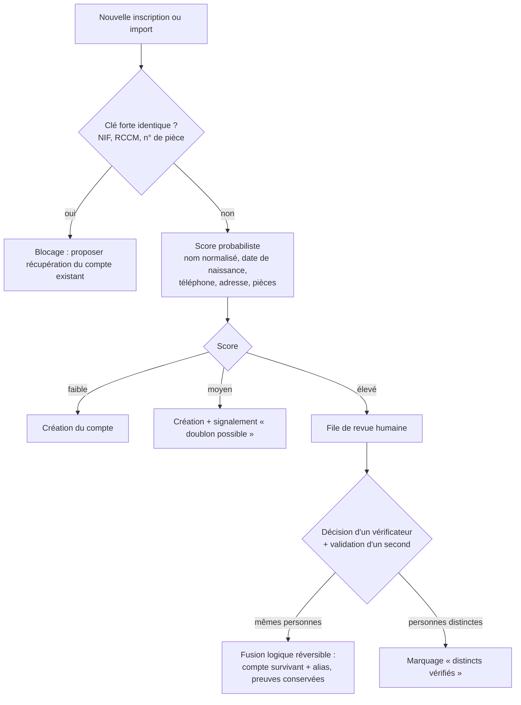

Règles :

- **Clés fortes bloquantes** : deux comptes actifs ne peuvent porter le même NIF, le même RCCM ou le même numéro de pièce d'identité.
- **Normalisation des noms** adaptée aux usages congolais (ordre nom–post-nom–prénom variable, translittérations, homonymies fréquentes) ; la similarité de noms seule n'est **jamais** suffisante.
- **Fusion réversible** : le compte absorbé devient un alias ; aucune donnée ni preuve n'est écrasée ; la « défusion » est possible avec la même double validation.
- **Conflits sensibles** (propriété d'un bien de forte valeur, grand redevable, compte de fonctionnaire) : revue par un vérificateur de niveau supérieur.
- **Téléphone partagé** : un même numéro peut servir à plusieurs personnes d'un foyer ; il est un canal, pas un identifiant.

## 9.7 Cycle de vie du compte

`PROVISOIRE → ACTIF (N0…N3) → SUSPENDU (décision motivée) → CLÔTURÉ (décès, dissolution) → ARCHIVÉ`. Un compte n'est jamais supprimé ; la clôture conserve les obligations et l'historique selon les durées de conservation (chapitre 32). La récupération de compte (perte de téléphone, changement de numéro) exige une preuve d'identité au niveau du compte et une vérification hors bande pour les niveaux N2 et N3.

## 9.8 Ce que le compte unique change pour le contribuable

- Une seule saisie, une seule vue de tous ses objets, obligations, échéances et quittances.
- L'explication de chaque montant : règle, version, assiette, formule, échéance, voie de recours.
- Un paiement depuis le téléphone, avec référence unique et quittance immédiate vérifiable.
- Une contestation possible depuis chaque objet et chaque obligation, avec suivi du délai.
- Un mode diaspora : paiement par carte, mandataire local aux droits limités, quittances à distance.
- Un quitus fiscal numérique téléchargeable et vérifiable par tout service habilité.

# 10. Architecture fonctionnelle

## 10.1 Sept domaines, une responsabilité chacun

La plateforme est organisée en sept domaines fonctionnels. Chacun est propriétaire de ses données, expose des services aux autres et **s'interdit explicitement** certaines actions. Cette séparation est à la fois une règle d'architecture et un contrôle interne.

| Domaine | Responsabilité | Ne fait jamais |
|---|---|---|
| **D1 Identité et contribuable** | Comptes, rôles, vérification, mandats, consentements | Liquider une obligation |
| **D2 Objets et cadastre fiscal** | Recensement, géolocalisation, cycle de vie des objets | Trancher la propriété juridique |
| **D3 Droit et référentiel** | Instruments juridiques, fiches de règles, tarifs, exonérations, versions | Appliquer une règle non approuvée |
| **D4 Liquidation et obligations** | Déclarations, calculs, avis, échéanciers, pénalités légales, arriérés | Modifier une règle ou un paiement |
| **D5 Paiement, trésorerie et grand livre** | Ordres, événements de paiement, règlement, rapprochement, quittances, écritures | Créer une obligation |
| **D6 Contrôle et contentieux** | Missions, constats, notifications, recouvrement, recours | Encaisser |
| **D7 Pilotage, IA et audit** | Tableaux de bord, prévisions, détection, journal d'audit, recommandations | Décider ou exécuter un acte financier |

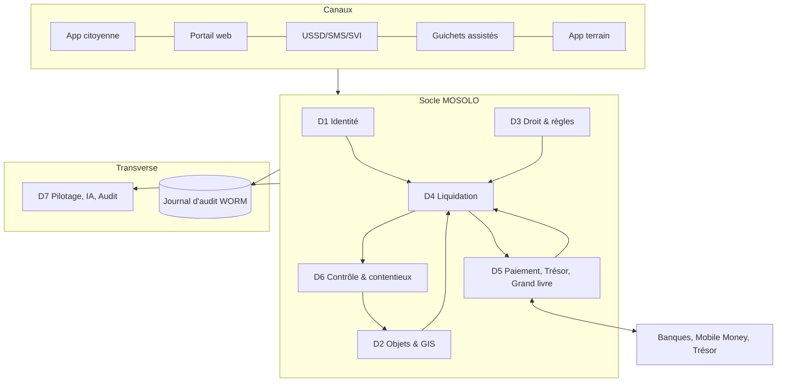

## 10.2 Principe de l'immutabilité des faits

**Les faits sont immuables ; les corrections sont des faits nouveaux.** Un constat erroné n'est pas effacé : il est annulé par un acte contraire, motivé, signé et relié à l'original. Une liquidation erronée est corrigée par une liquidation rectificative qui référence la précédente. Un paiement contesté est traité par un événement de litige, puis éventuellement par un contrepassement. Ce principe s'applique aux sept domaines.

## 10.3 Architecture multi-entités

MOSOLO fait coexister des entités dont les compétences, les calendriers et parfois les intérêts diffèrent : régies provinciales, ministères, communes, services techniques, opérateurs délégués, pouvoir central (pour l'exclusion des doublons), banques, sous-traitants, partenaires de données, audit et société civile.

| Partagé par toutes les entités (socle) | Propre à chaque entité (espace) |
|---|---|
| Identité et compte unique | Recettes, règles et tarifs relevant de sa compétence |
| Cadastre fiscal et identifiants géofiscaux | Circuits d'approbation, délais de service |
| Registre juridique et moteur de liquidation | Agents, équipes, missions |
| Paiements, grand livre, rapprochement | Comptes publics bénéficiaires propres, verrouillés |
| Moteur de titres et de quittances | Modèles de titres, de QR, de notifications |
| Audit, sécurité, journal | Tableaux de bord et rapports |

Règles de coexistence :

- **Une seule revendication par fait générateur.** Si deux entités revendiquent le même objet, pour le même fait générateur et la même période, le moteur bloque la seconde obligation et ouvre un dossier d'arbitrage au Comité juridique et tarifaire. Le contribuable ne voit jamais de double obligation.
- **Partage légal transparent.** Pour une recette partagée selon une clé légale, chaque entité voit sa part calculée et rapprochée ; aucune ne peut modifier la clé.
- **Aucune action hors périmètre.** Le cloisonnement est appliqué par le système (filtre par entité et par attributs), jamais par simple consigne.
- **Dépendances explicites.** Lorsqu'un service d'une entité dépend de la situation fiscale gérée par une autre (permis de bâtir conditionné au quitus), la condition est une règle versionnée, visible du citoyen, fondée sur un texte.
- **Ajout d'une entité ou d'un service sans redéveloppement**, par une fiche de configuration de module validée en maker-checker (entité responsable, types d'objets, règles, titres, canaux, workflows, tableaux de bord, dépendances).

# 11. Catalogue complet des modules

## 11.1 Les 55 modules de base

La numérotation 1 à 55 est commune au présent document, au Cahier des exigences v2.9 et à la Spécification fonctionnelle v1.2, qui détaille chaque module (finalité, fonctionnalités, fonctions système, contrôles, données, intégrations, indicateurs). Colonne « Base légale » : **E** = existe en principe, sous réserve de certification (ch. 6) ; **A** = acte requis pour tout ou partie ; **T** = module technique ou transverse.

| N° | Module | Domaine | Base légale | Release |
|---|---|---|---|---|
| 1 | Identité et compte contribuable | D1 | T | R1 |
| 2 | Enrôlement et vérification | D1 | T | R1 |
| 3 | Portail contribuable (self-service) | D1 | T | R1 |
| 4 | Application citoyenne Android | D1 | T | R1 |
| 5 | Portail web public | D1 | T | R1 |
| 6 | USSD et SMS | D1 | T | R1 |
| 7 | Gestionnaire des relations contribuable–objet | D2 | T | R1 |
| 8 | Cadastre fiscal géospatial | D2 | T | R1 |
| 9 | Intelligence foncière et locative | D2/D4 | E | R1 |
| 10 | Registre des activités et patentes | D2/D4 | E | R2 |
| 11 | Véhicules et circulation | D2/D4 | E | R2 |
| 12 | Autorisations de transport | D4 | E | R2 |
| 13 | Embarquement et débarquement | D4 | E | R3 |
| 14 | Stationnement public | D4 | E/A (zonage, tarifs) | R2 |
| 15 | Publicité extérieure | D4 | E | R2 |
| 16 | Antennes et infrastructures télécoms | D4 | E | R2 |
| 17 | Boissons, alcools et tabac | D4 | E | R2 |
| 18 | Plastiques et contributions environnementales | D4 | **A** | R4 (après acte) |
| 19 | Assainissement, déchets, voirie et drainage | D4 | E | R3 |
| 20 | Marchés et occupation du domaine public | D4 | E | R2 |
| 21 | Spectacles, événements et divertissement | D4 | E | R3 |
| 22 | Carrières et recettes minières | D4 | E | R3 |
| 23 | Recettes forestières | D4 | E | R4 |
| 24 | Ports, embarcations et accostage | D4 | E | R3 |
| 25 | Péage provincial | D4 | E/A | R4 |
| 26 | Moteur de règles juridiques et tarifaires | D3 | T | R1 |
| 27 | Déclaration et liquidation | D4 | T | R1 |
| 28 | Orchestration des paiements | D5 | T | R1 |
| 29 | Règlement en trésorerie | D5 | T | R1 |
| 30 | Rapprochement | D5 | T | R1 |
| 31 | Quittances électroniques | D5 | T | R1 |
| 32 | Arriérés et créances | D4 | T | R2 |
| 33 | Campagnes de recouvrement | D6 | T | R2 |
| 34 | Recensement terrain | D6/D2 | T | R1 |
| 35 | Inspection et constat | D6 | T | R1 |
| 36 | Dossiers d'exécution (enforcement) | D6 | E (procédure) | R3 |
| 37 | Réclamations et recours | D6 | E (procédure) | R1 |
| 38 | Gestion documentaire | T | T | R1 |
| 39 | Notifications et communication | T | T | R1 |
| 40 | Renseignement anti-fraude | D7 | T | R2 |
| 41 | Centre de commandement exécutif | D7 | T | R1 |
| 42 | Tableau de bord DGIPK | D7 | T | R1 |
| 43 | Tableau de bord DGRK | D7 | T | R1 |
| 44 | Tableaux de bord ministériels | D7 | T | R2 |
| 45 | Salle de contrôle finances et trésorerie | D7 | T | R1 |
| 46 | Audit et investigation | D7 | T | R1 |
| 47 | Prévision des recettes | D7 | T | R2 |
| 48 | Recommandation d'investissement public | D7 | T | R3 |
| 49 | Gestion des agents d'IA | D7 | T | R2 |
| 50 | Apprentissage et connaissance | T | T | R1 |
| 51 | Accès, rôles et délégations | T | T | R1 |
| 52 | Intégration et API | T | T | R1 |
| 53 | Administration de la plateforme | T | T | R1 |
| 54 | Transparence publique | D7 | T | R2 |
| 55 | Supervision et santé du système | T | T | R1 |

## 11.2 Modules complémentaires issus de l'analyse approfondie

L'analyse des processus, des risques et des documents de travail fait apparaître des modules indispensables qui ne figuraient pas dans la liste initiale. Les numéros 56 à 81 reprennent ceux de la Spécification fonctionnelle ; les numéros 82 à 95 sont **nouveaux dans la version 3.0**.

| N° | Module | Pourquoi il est nécessaire | Release |
|---|---|---|---|
| 56 | Grands redevables | 20 % des redevables portent souvent l'essentiel de certaines recettes (brasseries, télécoms, carrières) : suivi dédié, déclarations mensuelles, rapprochement de volumes | R2 |
| 57 | Registre des exonérations | Les exonérations et annulations sont un canal majeur d'érosion ; chaque exonération doit avoir un fondement, une preuve, une durée et deux approbateurs | R1 |
| 58 | Gestion des équipements terrain (MDM) | Enrôlement, révocation, effacement à distance, expiration des données hors ligne | R1 |
| 59 | Grand livre public en partie double | Aucune correction sans contre-écriture ; clôtures ; compte d'attente | R1 |
| 60 | Coffre des comptes bénéficiaires | Les comptes publics de destination sont des références verrouillées, modifiables uniquement sous quorum | R1 |
| 61 | Moteur de découverte des recettes | Pipeline signal → qualification juridique → estimation → décision | R2 |
| 62 | Rapprochement aérien (volet AVIA) | Rapprochement billetterie/embarquement/reversements, sous réserve de validation juridique | R4 |
| 63 | Enrôlement assisté et guichets MOSOLO | Inclusion des personnes sans téléphone ou peu alphabétisées | R1 |
| 64 | Serveur vocal interactif multilingue | Consultation et paiement à la voix en français, lingala, swahili, kikongo, tshiluba | R2 |
| 65 | Carte MOSOLO | Identifiant physique pour les personnes sans téléphone | R2 |
| 66 | Réseau des points de paiement agréés | Seul canal légitime d'encaissement en espèces, avec règlement quotidien vers le compte public | R1 |
| 67 | Portail des partenaires et des équipes terrain | Accréditation des sous-traitants, lots, missions, qualité | R2 |
| 68 | Vérification publique par code court | Vérifier une quittance, une carte ou un badge par SMS/USSD | R1 |
| 69 | Ligne de signalement et contrôles mystère | Signalements protégés d'abus, faux agents, demandes d'espèces | R2 |
| 70 | Moteur de titres et de validité | Titres à durée (stationnement, marchés, transport) : vert/ambre/rouge | R2 |
| 71 | Contrôle des titres | Vérification par plaque, QR ou code, en ligne et hors ligne | R2 |
| 72 | Espaces d'entité et configuration des modules | Cloisonnement multi-entités et ajout de services sans redéveloppement | R1 |
| 73 | Répartition légale des recettes | Calcul des parts légalement dues aux entités (province, ETD, etc.) sur recettes rapprochées ; aucun partage non fondé sur un texte | R3 |
| 74 | Invitations et gestion des accès | Accès des agents publics uniquement sur invitation en cascade ; inscription publique réservée aux contribuables | R1 |
| 75 | Stationnement intelligent | Zones, sessions, tarification réglementée, contrôle par plaque | R2 |
| 76 | Billetterie urbaine multi-opérateurs | Droits d'accès à durée pour usages payants | R3 |
| 77 | Publicité extérieure augmentée | Registre et carte des supports, lecture optique, dossiers de constat | R2 |
| 78 | Hub de réconciliation aérienne | Connecteurs de données aériennes, sous validation juridique | R4 |
| 79 | Plaque fiscale immobilière | Plaque et QR par bâtiment, statut minimal au scan public | R2 |
| 80 | Contrôle de la dépense publique | Registre des comptes publics, justificatifs, correspondance ; pour l'organe de contrôle compétent | R4 |
| 81 | Pass professionnel des moto-taxis | Identification des motos et conducteurs, pass légal, fin des prélèvements informels | R3 |
| **82** | **Quitus fiscal numérique** | Délivrance instantanée, vérification par QR et API, révocation ; conditionnalité des services selon les textes | R1 |
| **83** | **Échéanciers et plans de paiement** | Paiement fractionné lorsque la loi le permet ; suivi des défauts | R2 |
| **84** | **Remboursements et restitutions** | Circuit distinct, quatre yeux, plafonds, rapprochement ; seule voie de sortie de fonds autorisée | R1 |
| **85** | **Référentiel territorial et adresses** | Communes, quartiers, avenues, rues, numérotation ; gestion des changements de limites | R1 |
| **86** | **Gestion des données de référence (MDM)** | Nomenclatures, catégories d'objets, rangs de localité, devises, taux de change officiels | R1 |
| **87** | **Consentements, droits des personnes et registre des traitements** | Conformité à la protection des données, accès, rectification, opposition lorsque applicable | R1 |
| **88** | **Gestion des contrats et conventions partenaires** | SLA des banques, opérateurs, sous-traitants ; pénalités ; échéances ; conditions tarifaires | R2 |
| **89** | **Gestion des taux de change officiels** | Conversion CDF/USD selon le taux légalement applicable à la date du fait générateur ou du paiement [À VÉRIFIER règle applicable] | R1 |
| **90** | **Régularisation volontaire** | Campagnes de régularisation avec conditions légales, délais et suivi | R2 |
| **91** | **Gestion des conflits d'intérêts et déclarations des agents** | Déclarations d'intérêts, liens avec des contribuables, récusation automatique d'affectation | R2 |
| **92** | **Laboratoire de simulation des politiques** | Simuler l'effet d'un tarif, d'une exonération ou d'un zonage avant tout acte | R3 |
| **93** | **Gestion des incidents et de la continuité** | Déclaration, qualification, communication, post-mortem ; mode dégradé des guichets | R1 |
| **94** | **Suivi législatif et réglementaire** | Veille des textes, alertes d'expiration, liens texte → règles impactées | R2 |
| **95** | **Relations avec les communes (espace ETD)** | Accueil ultérieur des recettes communales dans un espace distinct du compte unique | R4 |

## 11.3 Verticales

Les modules sectoriels sont regroupés en verticales qui partagent toutes le même socle. **Aucune verticale ne possède son propre compte contribuable, ses propres règles hors registre ni son propre circuit de paiement.**

| Verticale | Modules | Point de vigilance spécifique |
|---|---|---|
| MOSOLO Property | 7, 8, 9, 79 | Distinguer propriété déclarée, observée, vérifiée, contestée |
| MOSOLO Rental | 9 | Distinguer taux de l'impôt et taux de retenue ; preuve avant liquidation |
| MOSOLO Business | 10, 17, 56 | L'existence d'une activité ne vaut pas assujettissement |
| MOSOLO Mobility | 11, 12, 13, 25, 81 | Coordination avec le pouvoir central (immatriculation) |
| MOSOLO Parking | 14, 75 | Acte de zonage et barème requis |
| MOSOLO Advertising | 15, 77 | Constat humain, pas de sanction automatique |
| MOSOLO Telecom | 16 | Contentieux possible sur l'assiette ; dialogue avec les opérateurs |
| MOSOLO Markets & Public Domain | 20 | Collecte historiquement en espèces : priorité anti-fraude |
| MOSOLO Environment | 18, 19 | Contribution plastique non activable sans acte |
| MOSOLO Ports | 13, 24 | Cadrage sectoriel préalable |
| MOSOLO Events | 21 | Assiette déclarative sur billetterie |
| MOSOLO Construction | 22, 82 | Quitus et droits liés aux chantiers |
| MOSOLO Assets | 61, 92 | Valorisation d'actifs provinciaux par mise en concurrence |
| MOSOLO Recovery | 32, 33, 36, 83, 90 | Proportionnalité et recours |
| MOSOLO AVIA | 62, 78 | Validation juridique et coordination multi-acteurs préalables |

## 11.4 Architecture des communications événementielles

### 11.4.1 Principe : un seul moteur d'événements, tous les canaux

Toute communication de KINSHASA MOSOLO, qu'elle s'adresse à un contribuable, un agent public ou un partenaire, part d'**un événement métier** publié sur le bus d'événements par le domaine qui en est propriétaire (chapitre 10). Un seul moteur de communication (module 39) reçoit l'événement et le diffuse (*fan-out*) sur les canaux prévus : courriel, notification dans l'application, SMS, notification push, WhatsApp sur consentement, boîte de messages USSD, serveur vocal (SVI) et courrier imprimé. Aucun module n'envoie de message directement : c'est la garantie que chaque message est traçable, conforme à son modèle approuvé, traduit, et rattaché à la preuve de délivrance.

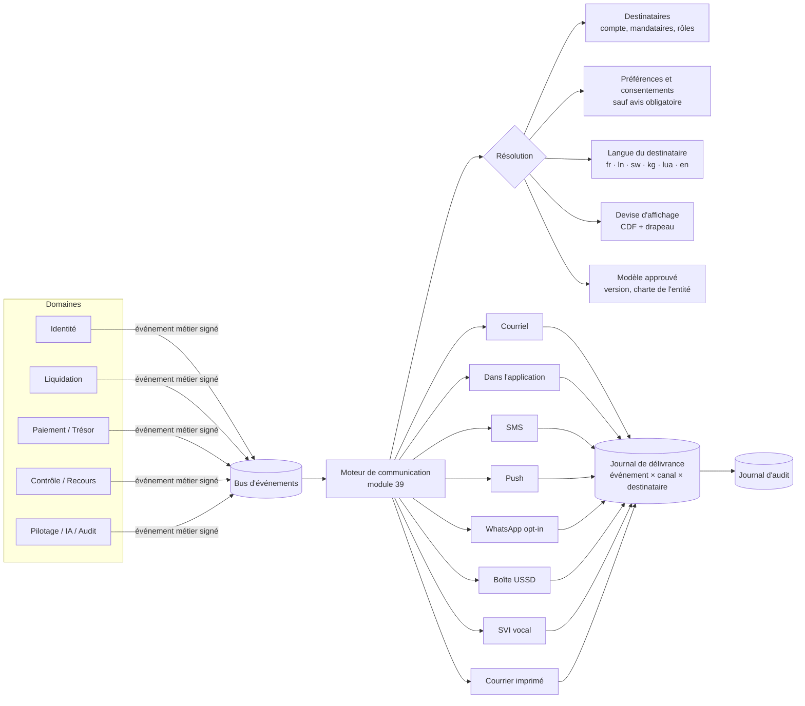

### 11.4.2 Le catalogue d'événements

Le catalogue est une **donnée de référence versionnée** (`specs/evenements-communication.yaml`), et non du code : l'ajout ou la modification d'un événement suit un maker-checker (programme + entité concernée + juriste lorsque l'événement porte un avis légal). Il est reproduit intégralement à l'Annexe G.

| Indicateur du catalogue (version 1) | Valeur |
|---|---|
| Événements | **239** |
| Catégories | **23** |
| Avis obligatoires (non désinscriptibles) | **126** |
| Événements diffusés par défaut en courriel | 192 |
| … dans l'application | 232 |
| … par SMS | 111 |
| … par notification push | 42 |
| … dans la boîte USSD | 31 |
| … par SVI vocal | 11 |
| … par courrier imprimé | 23 |
| … éligibles à WhatsApp sur consentement | 62 |


| # | Catégorie | Exemples d'événements |
|---|---|---|
| 1 | Identité et compte | `account.registration.requested`, `account.verification.level_upgraded`, `account.merge.proposed`, `account.mosolo_card.issued` |
| 2 | Connexion et sécurité | `auth.login.suspicious`, `auth.device.new`, `auth.otp_code`, `auth.break_glass.used` |
| 3 | Mandats et représentants | `mandate.requested`, `mandate.action_performed` |
| 4 | Objets fiscaux et recensement | `object.provisional.created`, `object.link.approved`, `object.ownership.conflict`, `object.field_visit.scheduled` |
| 5 | Foncier et locatif | `lease.declared_by_tenant`, `rental.withholding.due`, `property.reclassification.proposed` |
| 6 | Déclarations et liquidation | `declaration.prefilled_ready`, `assessment.issued`, `assessment.explained`, `exemption.granted`, `installment_plan.defaulted` |
| 7 | Paiements | `payment.reference.issued`, `payment.confirmed`, `payment.duplicate_detected`, `payment.currency_converted`, `refund.paid` |
| 8 | Quittances et quitus | `receipt.issued_provisional`, `receipt.finalized`, `receipt.verification.fraud_suspected`, `clearance.issued` |
| 9 | Titres et autorisations | `permit.issued`, `permit.expiring`, `ticket.expiring`, `parking.violation.recorded` |
| 10 | Recouvrement et arriérés | `recovery.reminder.1`, `recovery.formal_notice`, `recovery.enforcement.proposed` |
| 11 | Missions et contrôle terrain | `mission.assigned`, `mission.expiring_offline_data`, `mission.geofence.breach`, `device.lost_reported` |
| 12 | Réclamations et recours | `appeal.submitted`, `appeal.decided`, `appeal.sla_breach` |
| 13 | Approbations et workflows | `approval.requested`, `approval.self_approval_blocked`, `beneficiary.change.proposed`, `beneficiary.change.cooling_off` |
| 14 | Registre juridique et règles | `rule.published`, `rule.conflict.detected`, `legal.instrument.abrogated` |
| 15 | Trésor et rapprochement | `settlement.delayed`, `reconciliation.exception.aged`, `ledger.imbalance`, `fx.rate.missing` |
| 16 | Anti-fraude et audit | `fraud.alert.raised`, `fraud.cash_request_reported`, `audit.log.integrity_failure` |
| 17 | Agents d'IA | `ai.recommendation_available`, `ai.human_intervention_required`, `ai.model.drift_detected` |
| 18 | Pilotage et tableaux de bord | `executive.daily_brief`, `kpi.threshold_breached`, `executive.alert` |
| 19 | Invitations et accès | `invitation.sent`, `delegation.granted`, `conflict_of_interest.detected` |
| 20 | Apprentissage et certification | `training.assigned`, `certification.expiring`, `procedure.changed` |
| 21 | Plateforme et continuité | `system.outage`, `system.channel_degraded`, `system.deadline_protection` |
| 22 | Données personnelles et consentement | `privacy.consent_request`, `privacy.data_shared_with_partner`, `privacy.breach_notification` |
| 23 | Partenaires et points de paiement | `partner.callback.signature_invalid`, `payment_point.settlement_overdue` |

Chaque événement porte : code stable, catégorie, libellé, objet du message par langue, gravité (`info`, `success`, `warning`, `critical`), canaux par défaut, éligibilité WhatsApp, caractère obligatoire, public (contribuable, agent public, partenaire), variables autorisées (`{{montant}}`, `{{reference}}`, `{{date}}`…) et, pour les avis légaux, la **référence au modèle d'acte approuvé** et aux mentions obligatoires (base légale, délai, voie de recours).

### 11.4.3 Avis obligatoires

Un avis est **obligatoire** lorsqu'il produit un effet de droit ou protège le destinataire : avis d'imposition, rectification, mise en demeure, mesure d'exécution, décision sur réclamation, refus ou retrait d'autorisation, contrepassement de paiement, annulation de quittance, conflit de propriété, alerte de sécurité, changement de coordonnées, partage de données, violation de données, changement de compte bénéficiaire public. Règles :

1. un avis obligatoire **ignore la désinscription** des communications facultatives, mais respecte le canal légalement valable (lorsque la notification électronique n'a pas de valeur juridique certaine, l'avis est **doublé** d'un exemplaire imprimable ou postal — J7, chapitre 6) ;
2. il est délivré au contribuable **et** à ses mandataires habilités ;
3. il n'est jamais envoyé sur WhatsApp ni sur un canal tiers non souverain ;
4. sa preuve de délivrance (accusé fournisseur, lecture dans l'application, remise en main propre avec signature) est versée au dossier et conditionne le décompte des délais légaux ;
5. en cas d'échec sur tous les canaux électroniques, une tâche de remise physique est créée automatiquement pour l'équipe terrain.

### 11.4.4 Canaux : règles d'usage

| Canal | Usage | Règles |
|---|---|---|
| Courriel | Avis détaillés, pièces jointes signées | Charte graphique de l'entité émettrice ; SPF, DKIM, DMARC ; aucune donnée sensible en clair dans l'objet |
| Dans l'application | Canal de référence, historique complet | Chaque message est consultable à vie dans le compte |
| SMS | Rappels, OTP, confirmations, alertes | 160 caractères, langue du destinataire ; **jamais de lien de paiement** (lutte contre l'hameçonnage) — le contribuable est invité à composer le code USSD officiel |
| Push | Agents terrain, contribuables avec application | Contenu minimal, détail dans l'application |
| WhatsApp | Rappels et informations non sensibles | **Consentement préalable explicite**, pas d'avis obligatoire, pas de montant nominatif, via un fournisseur contractualisé ; désactivable par l'autorité de protection des données |
| Boîte USSD | Contribuables sans smartphone | Messages en attente consultables via le code court |
| SVI vocal | Personnes peu alphabétisées | Messages enregistrés dans les cinq langues nationales et en français |
| Courrier imprimé | Avis légaux, échec des canaux électroniques | Généré avec QR de vérification ; remise tracée |

**Anti-usurpation.** Les expéditeurs (nom SMS, domaine de courriel, compte WhatsApp certifié, numéro SVI) sont **uniques et publiés**. Tout message peut être vérifié par le destinataire (code court de vérification, module 68). Les campagnes de sensibilisation rappellent qu'un agent MOSOLO ne demande jamais d'espèces ni de code OTP.

### 11.4.5 Préférences, fréquence et heures de silence

Le contribuable choisit ses canaux et sa langue pour les communications facultatives. Le moteur applique un **plafond de fréquence** (par exemple : pas plus de deux rappels facultatifs par semaine et par obligation) et des **heures de silence** (pas de SMS ni de push facultatif entre 21 h et 7 h), sauf alertes de sécurité. Les agents publics ne peuvent pas désactiver les notifications de mission, d'approbation ou de sécurité pendant leur service.

### 11.4.6 Modèles et assurance qualité

| Fonction | Description |
|---|---|
| Modèles versionnés | Un modèle par événement × canal × langue ; maker-checker (rédacteur, relecteur linguistique, juriste pour les avis légaux) |
| Charte par entité | Logo, couleurs, coordonnées et mentions de l'entité émettrice (DGIPK, DGTK, ministère, commune) appliqués automatiquement, pour que le citoyen sache toujours qui lui écrit |
| Aperçu | Rendu exact de ce que reçoit le destinataire, par canal et par langue, avec données fictives |
| Envoi de test à soi-même | Déclenche l'événement réel vers l'utilisateur qui teste, sur tous ses canaux |
| Mode bac à sable | Si la clé d'un fournisseur n'est pas configurée (environnement de recette), l'envoi est **enregistré** comme « journalisé » sans être transmis : le parcours est toujours testable |
| Contrôles automatiques | Variables manquantes, longueur SMS, présence des mentions légales obligatoires, cohérence des montants et devises, traduction complète dans les langues actives |

### 11.4.7 Journal de délivrance

Chaque combinaison **événement × canal × destinataire** crée une ligne de délivrance : identifiant d'événement, canal, fournisseur, statut (`en_file`, `envoyé`, `délivré`, `lu`, `échoué`, `journalisé` en bac à sable, `supprimé_par_préférence`), horodatages, nombre de tentatives, coût unitaire, empreinte du contenu. Le journal alimente : la preuve de notification des avis légaux ; le tableau de bord des communications (taux de délivrance par canal et par opérateur, coût, échecs) ; la détection d'anomalies (numéro recevant les avis de nombreux contribuables sans lien de mandat).

| Écran « Communications » (administration du module 39) | Contenu |
|---|---|
| Cartes de synthèse | Événements au catalogue ; catégories ; avis obligatoires ; messages délivrés / tentés ; canaux raccordés |
| Couverture par canal | Nombre d'événements diffusés par défaut sur chaque canal et nombre de messages envoyés sur la période |
| Assurance qualité des modèles | Sélecteur d'événement et d'entité, aperçu, envoi de test |
| Dernières délivrances | Flux temps réel événement × canal × destinataire (masqué selon les droits) et statut |
| Catalogue | Événements par catégorie, gravité, canaux, caractère obligatoire |

## 11.5 Plateforme multilingue

| Langue | Code | Rôle |
|---|---|---|
| Français | `fr` | **Langue de référence** : seule version juridiquement opposable des avis et décisions |
| Lingala | `ln` | Langue nationale ; langue d'usage majoritaire à Kinshasa |
| Kiswahili | `sw` | Langue nationale |
| Kikongo | `kg` | Langue nationale |
| Tshiluba | `lua` | Langue nationale |
| Anglais | `en` | Diaspora, investisseurs, partenaires |

Règles : toutes les chaînes d'interface, tous les modèles de messages, tous les contenus d'apprentissage et tous les messages SVI sont externalisés dans des fichiers de ressources (format ICU MessageFormat, gestion des pluriels et du genre) ; la langue est un attribut du compte, modifiable à tout moment ; les avis légaux en langue nationale portent la mention « traduction d'information — la version française fait foi » et un lien vers la version française ; les traductions sont validées par des relecteurs natifs rémunérés, avec glossaire fiscal commun ; un indicateur « complétude de traduction » bloque l'activation d'une langue incomplète pour un parcours donné. **Les langues sont désignées par leur nom natif, jamais par un drapeau** (une langue n'est pas un pays).

## 11.6 Plateforme multidevise : le franc congolais comme devise principale

### 11.6.1 Principes

1. **Le franc congolais (🇨🇩 CDF) est la devise principale** de la plateforme : devise de consolidation de tous les tableaux de bord, du grand livre de synthèse, des prévisions et du tableau de transparence.
2. **La devise de l'obligation est celle fixée par la règle légale.** Lorsqu'un arrêté fixe un tarif en dollars américains (cas rapporté de l'impôt foncier 2026), l'obligation est libellée en 🇺🇸 USD et affichée avec sa contre-valeur indicative en 🇨🇩 CDF ; la plateforme ne convertit jamais d'elle-même une obligation légalement libellée dans une devise en une autre.
3. **Chaque devise est représentée par le drapeau de son pays émetteur**, placé devant le code ISO 4217 et le montant : 🇨🇩 CDF 1 250 000,00 · 🇺🇸 USD 450,00 · 🇪🇺 EUR 410,00. Pour une devise commune à plusieurs pays, le drapeau de l'union monétaire (🇪🇺 pour l'euro) ou un drapeau de référence configurable est utilisé.
4. **Les taux de change sont ceux de la source officielle** désignée par le texte (en principe le cours indicatif de la Banque Centrale du Congo), importés quotidiennement, signés, horodatés et jamais saisis à la main. La règle précisant **quel taux s'applique à quelle date** (fait générateur, émission de l'avis, paiement) est une règle juridique certifiée [À VÉRIFIER J3].
5. **Le montant payé dans une devise étrangère** (carte de la diaspora, par exemple) est converti par le prestataire selon le contrat, puis rapproché dans la devise de l'obligation ; l'écart de change éventuel est traité par règle (tolérance, reliquat, trop-perçu) et visible du contribuable (`payment.currency_converted`).
6. **Aucune écriture comptable n'est convertie rétroactivement** : chaque écriture conserve sa devise d'origine, le taux appliqué et sa contre-valeur en CDF.

### 11.6.2 Référentiel des devises

Le référentiel (`specs/devises.yaml`, module 89) distingue le rôle de chaque devise :

| Drapeau | Code | Devise | Rôle | Liquidation | Paiement |
|---|---|---|---|---|---|
| 🇨🇩 | CDF | Franc congolais | **Principale** | Oui | Oui |
| 🇺🇸 | USD | Dollar américain | Légale secondaire (si la règle l'exige) | Si la règle l'exige | Oui |
| 🇪🇺 | EUR | Euro | Paiement diaspora | Non | Carte ou virement, converti |
| 🇬🇧 | GBP | Livre sterling | Paiement diaspora | Non | Carte, converti |
| 🇨🇦 | CAD | Dollar canadien | Paiement diaspora | Non | Carte, converti |
| 🇨🇭 | CHF | Franc suisse | Paiement diaspora | Non | Carte, converti |
| 🇿🇦 | ZAR | Rand sud-africain | Paiement diaspora | Non | Carte, converti |
| 🇨🇬 | XAF | Franc CFA (CEMAC) | Affichage | Non | Non |
| 🇦🇴 | AOA | Kwanza | Affichage | Non | Non |
| 🇿🇲 | ZMW | Kwacha zambien | Affichage | Non | Non |
| 🇷🇼 | RWF | Franc rwandais | Affichage | Non | Non |
| 🇺🇬 | UGX | Shilling ougandais | Affichage | Non | Non |
| 🇰🇪 | KES | Shilling kényan | Affichage | Non | Non |
| 🇹🇿 | TZS | Shilling tanzanien | Affichage | Non | Non |
| 🇧🇮 | BIF | Franc burundais | Affichage | Non | Non |
| 🇨🇳 | CNY | Yuan renminbi | Affichage | Non | Non |
| 🇦🇪 | AED | Dirham des Émirats | Affichage | Non | Non |

L'activation d'une devise pour le **paiement** exige un contrat avec un prestataire habilité et la conformité à la réglementation des changes [À VÉRIFIER : règles de la BCC sur l'encaissement de recettes publiques en devises].

### 11.6.3 Règles d'affichage et de calcul

| Règle | Détail |
|---|---|
| Format | Drapeau + code ISO + montant selon la langue : `🇨🇩 CDF 1 250 000,00` (fr), séparateurs selon la locale ; le code ISO est toujours présent, car les drapeaux ne s'affichent pas sur tous les terminaux ni dans les SMS |
| SMS et USSD | Code ISO seul (`CDF 1250000`), sans drapeau (jeu de caractères limité) |
| SVI | Montant énoncé dans la langue avec le nom de la devise (« un million deux cent cinquante mille francs congolais ») |
| Précision | Calcul en décimal exact (jamais en virgule flottante) ; arrondi défini par la règle (`rounding`) ; décimales selon la devise |
| Double affichage | Obligation en USD : montant légal en USD + contre-valeur CDF « à titre indicatif au taux officiel du JJ/MM/AAAA » |
| Tableaux de bord | Consolidation en CDF ; bascule d'affichage en USD pour comparaison, avec le taux et la date utilisés |
| Données | `Money { amount: decimal, currency: ISO4217 }` ; toute opération entre devises différentes sans conversion explicite est rejetée par le type |

Critère d'acceptation : **Étant donné** une obligation légalement libellée en USD et un paiement en EUR par carte, **lorsque** le paiement est confirmé, **alors** la quittance mentionne le montant de l'obligation en 🇺🇸 USD, le montant payé en 🇪🇺 EUR, le taux et sa source, la contre-valeur en 🇨🇩 CDF, et tout écart est traité par la règle de tolérance sans intervention manuelle.

# 12. Rôles et matrice d'habilitations

## 12.1 Modèle d'autorisation : RBAC + ABAC

L'autorisation combine des **rôles** (ce qu'une fonction peut faire) et des **attributs** (dans quel périmètre, à quel moment, sur quel appareil, pour quelle finalité). Une décision d'accès est évaluée par un moteur de politiques centralisé (policy decision point) à chaque requête, jamais dans l'interface.

| Attribut | Exemples | Effet |
|---|---|---|
| Entité | DGIPK, DGTK, ministère X, commune Y | Cloisonnement par entité |
| Territoire | Commune, quartier, polygone de mission | Agent limité à sa zone |
| Dossier assigné | Mission, dossier de contrôle, recours | Accès limité aux objets du dossier |
| Plage horaire | Horaires de service, durée de mission | Refus hors plage, sauf astreinte déclarée |
| Appareil | Terminal enrôlé et conforme (MDM) | Refus depuis un appareil non enrôlé |
| Niveau d'authentification | Mot de passe + OTP, clé d'accès (passkey), clé matérielle | Actions sensibles réservées aux facteurs résistants à l'hameçonnage |
| Sensibilité de la donnée | C1 à C5 (ch. 32) | Masquage, champ par champ |
| Finalité déclarée | Contrôle, recours, audit, enquête | Finalité journalisée ; accès « bris de glace » motivé et revu |
| Conflit d'intérêts | Lien déclaré ou détecté avec le contribuable | Récusation automatique |
| Durée | Délégation temporaire, accès privilégié juste-à-temps | Expiration automatique |

## 12.2 Principes de contrôle interne

| Principe | Mise en œuvre |
|---|---|
| Moindre privilège | Rôles fins ; aucun droit par défaut ; revue trimestrielle des accès |
| Séparation des tâches | Incompatibilités codées (tableau § 12.5) ; un utilisateur ne peut cumuler deux rôles incompatibles |
| Maker-checker / quatre yeux | Initiateur ≠ vérificateur pour toute opération critique ; auto-validation impossible |
| Contrôle double (dual control) | Opérations les plus sensibles : deux approbateurs + délai de refroidissement |
| Délégation temporaire | Datée, bornée, motivée, visible, révocable ; non re-déléguable |
| Accès privilégié juste-à-temps | Élévation sur demande motivée, approuvée, limitée dans le temps, session enregistrée |
| MFA | Obligatoire pour tout compte de travail ; résistante à l'hameçonnage pour les rôles sensibles |
| Authentification de l'appareil | Certificat d'appareil pour les terminaux terrain et les postes sensibles |
| Expiration des accès | Tout accès de travail a une date de fin ; renouvellement sur revue |
| Détection des conflits d'intérêts | Déclarations (module 91) + détection de liens (adresse, téléphone, compte bancaire communs) |
| Revues d'accès | Trimestrielles par les responsables d'entité ; semestrielles par l'audit interne |
| Journalisation complète | Toute consultation de donnée C4–C5 et toute action sont journalisées |

## 12.3 Rôles

| Code | Rôle | Mission | Périmètre |
|---|---|---|---|
| R01 | **Gouverneur** | Vision exécutive consolidée, priorités stratégiques, demandes d'enquête | Toute la province, **agrégats** ; détail nominatif uniquement via une demande d'enquête motivée instruite par l'audit |
| R02 | **Directeur de cabinet du Gouverneur** | Coordination et suivi, sur délégation formelle | Comme R01, dans les limites de la délégation écrite |
| R03 | **Secrétaire général du Gouvernement provincial** | Coordination gouvernementale, décisions, suivi de mise en œuvre | Décisions, actes, tableaux de suivi ; pas de données fiscales individuelles |
| R04 | **Ministre provincial** | Pilotage du périmètre légal de son ministère | Modules et recettes relevant de son ministère ; agrégats |
| R05 | **Ministre provincial des Finances** | Tutelle des régies, politique fiscale, approbation des règles relevant de sa compétence | Agrégats de toutes les recettes ; approbation des règles et tarifs selon texte |
| R06 | **Directeur général DGIPK / DGTK** | Direction opérationnelle de la régie | Recettes de sa régie ; nominatif dans son périmètre |
| R07 | **Directeur / chef de service de régie** | Gestion d'un service (assiette, contrôle, recouvrement, contentieux) | Service et territoire |
| R08 | **Administrateur d'entité** | Gestion des agents, affectations et workflows approuvés de son entité | Personnes et configurations de son entité ; **aucun accès aux montants** |
| R09 | **Superviseur terrain** | Planification et contrôle qualité des missions | Équipes et zones assignées |
| R10 | **Agent de terrain / recenseur** | Recensement, constat, notification | Missions assignées ; données minimales |
| R11 | **Contrôleur / vérificateur** | Contrôle sur pièces et sur place, proposition de rectification | Dossiers assignés |
| R12 | **Agent de guichet / enrôlement assisté** | Enrôlement, assistance, remise de cartes | Guichet ; pas d'encaissement sauf point agréé |
| R13 | **Juriste rédacteur de règles** | Rédaction des fiches de règles | Registre juridique, brouillons |
| R14 | **Juriste vérificateur** | Visa juridique | Registre juridique |
| R15 | **Validateur financier des règles** | Visa financier et budgétaire | Registre juridique |
| R16 | **Autorité de publication** | Publication d'une règle approuvée | Registre juridique |
| R17 | **Comptable public / Trésor** | Prise en charge, règlement, rapprochement, écritures | Paiements, relevés, grand livre ; **ne crée aucune obligation** |
| R18 | **Analyste de rapprochement** | Traitement des exceptions de rapprochement | Files d'exception |
| R19 | **Gestionnaire du coffre des bénéficiaires** (×3 minimum) | Proposition et approbation des changements de comptes publics | Coffre ; quorum obligatoire |
| R20 | **Agent de contentieux** | Instruction des réclamations et recours | Dossiers assignés |
| R21 | **Autorité de décision contentieuse** | Décision sur réclamation | Dossiers instruits |
| R22 | **Auditeur interne** | Audit, lecture intégrale des preuves | Lecture seule, tout périmètre, journal des consultations |
| R23 | **Auditeur externe / Cour des comptes / inspection** | Contrôle externe | Accès contrôlé, lecture seule, par mission |
| R24 | **Enquêteur anti-fraude** | Instruction des alertes | Dossiers d'enquête ; accès nominatif motivé |
| R25 | **Délégué à la protection des données** | Conformité, droits des personnes | Registre des traitements, journaux d'accès |
| R26 | **Super-administrateur de la plateforme** | Configuration technique, disponibilité, sécurité, versions, identité | Technique ; **aucun pouvoir financier** |
| R27 | **Ingénieur d'exploitation / support** | Exploitation, incidents | Technique ; données masquées ; accès JIT |
| R28 | **Responsable sécurité (RSSI)** | Politique de sécurité, SIEM, incidents | Journaux de sécurité |
| R29 | **Gestionnaire des modèles d'IA** | Versions, validation, surveillance | Registre des modèles ; données d'entraînement approuvées |
| R30 | **Contribuable** | Ses données, ses objets, ses obligations | Son compte |
| R31 | **Mandataire** | Agir pour un mandant | Mandat (périmètre, durée) |
| R32 | **Point de paiement agréé** | Encaissement sur référence | API de paiement ; aucune donnée fiscale au-delà du montant de la référence |
| R33 | **Partenaire bancaire / monnaie mobile** | Confirmation, règlement | API du canal |
| R34 | **Partenaire de données** | Fourniture de données sous protocole | API d'import restreinte |
| R35 | **Sous-traitant terrain (responsable)** | Gestion de ses équipes accréditées | Ses agents, ses lots ; aucune donnée fiscale |
| R36 | **Observateur de la société civile** | Suivi des agrégats et de la transparence | Tableau public enrichi, sans nominatif |
| R37 | **Service utilisateur du quitus** (urbanisme, marchés publics…) | Vérifier un quitus | API de vérification : oui/non + validité |

## 12.4 Matrice synthétique : Voir / Initier / Approuver / Interdit

Légende : **V** voir (agrégats) ; **Vn** voir nominatif dans le périmètre ; **I** initier ; **A** approuver ; **—** aucun accès ; **✖** interdit par construction (aucun rôle ne peut le faire seul).

| Action | R01 Gouv. | R04 Min. | R06 DG régie | R10 Agent | R11 Contrôleur | R13–16 Juridique | R17 Trésor | R19 Coffre | R22 Audit | R26 Super-admin | R30 Contrib. |
|---|---|---|---|---|---|---|---|---|---|---|---|
| Tableau exécutif consolidé | V | V (périmètre) | V (régie) | — | — | — | V (financier) | — | V | — | — |
| Données fiscales d'un contribuable | Sur enquête motivée | — | Vn | Vn minimal (mission) | Vn (dossier) | — | Vn (paiements) | — | Vn | — (masqué) | Vn (soi) |
| Créer un objet provisoire | — | — | I | I | I | — | — | — | — | — | I (déclaration) |
| Valider un objet / rattachement | — | — | A | — | I | — | — | — | — | — | — |
| Rédiger / viser / publier une règle | — | A (selon texte) | — | — | — | I / A / A (4 personnes distinctes) | — | — | V | ✖ | — |
| Émettre une obligation | — | — | Automate (règle active) | — | Propose rectification | — | ✖ | — | V | ✖ | — |
| Rectifier / annuler une obligation | — | — | A (2e niveau) | — | I | — | ✖ | — | V | ✖ | Réclame |
| Accorder une exonération | — | A (si texte) | I / A (quatre yeux) | — | — | Vérifie fondement | — | — | V | ✖ | Demande |
| Enregistrer un paiement | — | — | — | ✖ | ✖ | — | Événement prestataire uniquement | — | V | ✖ | Initie |
| Rapprocher / traiter une exception | — | — | V | — | — | — | I / A (quatre yeux) | — | V | ✖ | — |
| Remboursement | — | — | I (motivé) | — | — | — | A (2 approbateurs) | — | V | ✖ | Demande |
| Modifier un compte bénéficiaire | ✖ | ✖ | ✖ | ✖ | ✖ | ✖ | Propose | A (quorum 2 sur 3 + hors bande + 72 h) | V | ✖ | — |
| Émettre / annuler une quittance | — | — | — | — | — | — | Automate ; annulation par contrepassement A | — | V | ✖ | Vérifie |
| Lancer une mission terrain | — | — | A | Exécute | I | — | — | — | V | — | — |
| Engager un acte de poursuite | — | — | A (autorité légale) | — | I | — | — | — | V | ✖ | Recours |
| Décider d'une réclamation | — | — | A (selon texte) | — | — | Avis | — | — | V | ✖ | Initie |
| Consulter le journal d'audit | Agrégats d'alertes | — | Son entité | — | — | — | Son périmètre | — | **Intégral** | Technique uniquement | Son historique |
| Supprimer une écriture ou un événement d'audit | ✖ | ✖ | ✖ | ✖ | ✖ | ✖ | ✖ | ✖ | ✖ | ✖ | ✖ |
| Déployer une version logicielle | — | — | — | — | — | — | — | — | V | I (A par comité des changements) | — |
| Attribuer un rôle | — | — | A (son entité) | — | — | — | — | — | V | Technique uniquement, sur demande approuvée | — |

**Le Gouverneur** dispose de la vision la plus large sur les agrégats, les performances par ministère, régie, commune et catégorie, les alertes critiques, les prévisions et les recommandations. Il peut demander une enquête, approuver des priorités stratégiques et recevoir les rapports exécutifs. **Il ne peut pas** supprimer une transaction, réécrire une quittance, modifier un compte bénéficiaire ou altérer une preuve d'audit ; aucune interface ne le permet, et toute tentative indirecte (demande à un technicien) laisserait une trace et exigerait des approbations qu'il ne peut pas donner seul.

**Le super-administrateur de la plateforme** gère la configuration technique, la disponibilité, les espaces d'entité, les politiques de sécurité, la santé des intégrations, les versions, les systèmes d'identité et le support. **Il n'a aucun pouvoir** sur les obligations, les paiements, les comptes bénéficiaires ni les journaux d'audit : les données financières sont signées par des clés qu'il ne détient pas, le journal d'audit est répliqué dans un stockage WORM hors de son contrôle, et ses propres actions sont journalisées vers un SIEM surveillé par le RSSI et l'audit.

## 12.5 Incompatibilités (séparation des tâches)

| Rôle A | Incompatible avec | Raison |
|---|---|---|
| Rédacteur de règle | Vérificateur, validateur financier, publicateur de la même règle | Quatre yeux juridiques |
| Agent de terrain | Contrôleur qualité de ses propres constats ; toute fonction de paiement | Constat ≠ contrôle ≠ encaissement |
| Initiateur d'exonération | Approbateur de la même exonération | Quatre yeux |
| Analyste de rapprochement | Approbateur de la même exception | Quatre yeux |
| Initiateur de remboursement | Approbateur ; bénéficiaire lié | Anti-détournement |
| Gestionnaire du coffre | Comptable qui exécute les virements | Séparation proposition/exécution |
| Super-administrateur | Tout rôle métier ou financier | Séparation technique/financier |
| Gestionnaire de modèles d'IA | Utilisateur métier décidant sur la base du modèle | Indépendance de la validation |
| Auditeur | Tout rôle opérationnel | Indépendance |

## 12.6 La Constitution financière MOSOLO

> **« Aucun individu ne possède les clés du système financier. »**

| Opération critique | Initiateur | Vérificateur | Approbateur | Contrôles additionnels |
|---|---|---|---|---|
| Publication d'une règle | Juriste rédacteur | Juriste vérificateur | Validateur financier + autorité de publication | Pièce officielle hachée ; tests de cas juridiques verts |
| Changement de compte bénéficiaire | Trésor | Gestionnaire du coffre n° 1 | Gestionnaires n° 2 et n° 3 (quorum 2 sur 3) | Confirmation hors bande auprès de la banque ; délai de refroidissement de 72 heures ; notification au Gouverneur, au ministre des Finances et à l'audit ; journal immuable |
| Exonération | Agent de régie | Juriste | Chef de service + (au-delà d'un seuil) directeur | Fondement légal, pièce, durée ; alerte de concentration |
| Annulation / rectification d'obligation | Contrôleur | Chef de service | Directeur au-delà d'un seuil | Motif codifié ; contre-écriture |
| Remboursement | Régie | Trésor | Deux approbateurs | Plafond ; vers le compte d'origine uniquement ; délai |
| Contrepassement de paiement | Trésor | Analyste | Chef comptable | Preuve prestataire |
| Attribution d'un rôle sensible | Responsable d'entité | Sécurité | Comité des accès | Durée limitée |
| Mise en production logicielle | Équipe | Revue de code et sécurité | Comité de contrôle des changements | Signature des artefacts ; déploiement reproductible |
| Accès privilégié à la production | Ingénieur | RSSI | Responsable d'exploitation | Juste-à-temps, session enregistrée |

## 12.7 Accès des agents publics : invitation en cascade

L'inscription publique est réservée aux contribuables. Les comptes de travail ne sont créés **que sur invitation** : le Comité de pilotage invite les responsables d'entité, qui invitent leurs directeurs, qui invitent leurs agents, chacun dans son périmètre et sans pouvoir accorder plus de droits qu'il n'en détient. Une invitation est nominative, limitée dans le temps, liée à une adresse ou un numéro vérifié, et finalisée par la personne invitée elle-même (ou par l'opérateur d'accès de son entité, en sa présence). Tout compte de travail inactif 60 jours est suspendu.

# 13. Parcours des contribuables

## 13.1 Inscription et rattachement d'un bien (propriétaire)

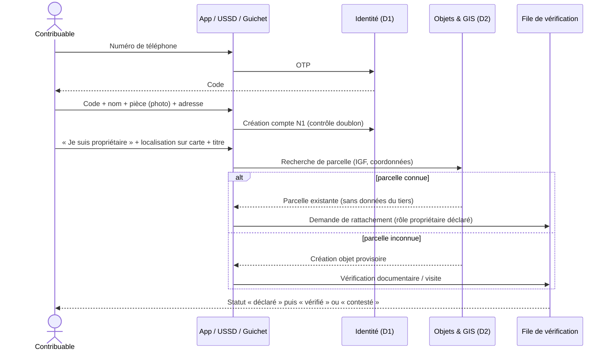

Critère d'acceptation : **Étant donné** un contribuable N1 déclarant être propriétaire d'une parcelle déjà rattachée à un autre compte, **lorsqu'il** soumet sa demande, **alors** aucune donnée de l'autre compte ne lui est montrée, un dossier de conflit est ouvert, et aucune obligation n'est déplacée tant que le dossier n'est pas tranché.

## 13.2 Déclaration et paiement annuels

1. **J−45** avant l'échéance : notification « votre déclaration est prête » (SMS, application, USSD).
2. Le contribuable ouvre sa déclaration **pré-remplie** (objets vérifiés, baux déclarés, rang de localité).
3. Il confirme ou corrige (toute correction à la baisse d'un élément vérifié ouvre une vérification, sans bloquer le paiement de la partie non contestée).
4. Le moteur liquide et affiche l'**explication** : règle, version, base légale, assiette, formule, montant, échéance, voie de recours.
5. Le contribuable choisit un canal ; une référence unique est émise.
6. Paiement ; confirmation du prestataire ; **quittance électronique** émise avec statut « en attente de règlement », puis « définitive » après rapprochement.
7. Quitus fiscal mis à jour automatiquement.

## 13.3 Parcours locataire

Le locataire déclare son bail (bailleur, unité, loyer, preuve). Si le locataire est une personne morale ou une administration soumise à la retenue [À VÉRIFIER J3], la plateforme calcule la retenue par échéance de loyer, émet la référence de reversement, puis délivre au locataire une attestation de retenue et crédite l'obligation du bailleur. Le locataire personne physique **n'est jamais rendu débiteur de l'impôt du bailleur** sans texte ; sa déclaration sert de signal et de preuve, protégée contre les représailles (le bailleur ne voit pas qui a déclaré).

## 13.4 Contestation

Depuis chaque objet ou obligation : bouton « Contester ». Le contribuable choisit le motif codifié (je ne suis pas propriétaire, surface erronée, bien non loué, montant erroné, déjà payé, exonéré), joint ses pièces et reçoit un accusé de réception horodaté avec le délai légal de réponse [À VÉRIFIER J4]. Le statut « contesté » est visible ; l'effet suspensif éventuel s'applique selon le texte ; la partie non contestée reste payable.

## 13.5 Parcours diaspora

Inscription à distance (passeport, vidéo-vérification si l'acte le permet), paiement par carte internationale ou virement vers le compte public, désignation d'un mandataire local aux droits limités (consulter, déclarer, recevoir les notifications — pas modifier les coordonnées bancaires ni fermer le compte), téléchargement des quittances et du quitus.

## 13.6 Parcours sans smartphone ni lecture

1. Au guichet communal ou auprès d'un agent habilité : identification par pièce ; photo ; consentement oral enregistré ; empreinte comme marque de consentement si l'acte le permet.
2. Remise d'une **carte MOSOLO** (QR + code court) ; le numéro de téléphone d'un proche peut être associé comme canal, pas comme identité.
3. Consultation et paiement par **SVI** (serveur vocal) en lingala, swahili, kikongo, tshiluba ou français, ou chez un point de paiement agréé qui scanne la carte.
4. Quittance imprimée avec QR, vérifiable par quiconque.

## 13.7 Parcours entreprise

Inscription par le représentant légal (N3 : RCCM, NIF, mandat), création de l'espace entreprise, déclaration des établissements, désignation de mandataires internes (comptable, juriste) avec droits séparés (préparer / valider / payer), déclarations mensuelles structurées (retenues IRL, volumes pour les grands redevables), API pour les grands redevables, quitus fiscal téléchargeable pour les soumissions.

## 13.8 Parcours des opérateurs spécialisés (synthèse)

| Profil | Objet principal | Titre ou obligation | Canal privilégié |
|---|---|---|---|
| Transporteur | Véhicule, ligne | Autorisation de transport ; embarquement | Application, USSD |
| Moto-taxi | Moto, conducteur | Pass professionnel (après acte) | USSD, coopérative |
| Commerçant de marché | Étal | Titre journalier à mensuel | USSD, carte MOSOLO |
| Annonceur | Support | Autorisation annuelle | Portail |
| Organisateur d'événements | Événement | Autorisation + déclaration de billetterie | Portail |
| Carrière | Site | Autorisation + déclarations | Portail |
| Batelier | Embarcation | Titre d'accostage / embarquement | USSD |
| Occupant du domaine public | Emprise | Autorisation d'occupation | Portail |

# 14. Parcours des utilisateurs gouvernementaux

| Utilisateur | Parcours type | Ce que MOSOLO lui apporte |
|---|---|---|
| **Gouverneur** | Ouvre le centre de commandement le matin ; voit l'échelle de la recette du jour, les alertes critiques, les communes en retard ; demande une note d'analyse à l'agent de décision ; ordonne une enquête sur une alerte | Une vérité unique, sans rapport papier ; des recommandations argumentées |
| **Directeur de cabinet** | Suit les décisions du Gouverneur, les délais de mise en œuvre, prépare les réunions de performance | Tableau de suivi des décisions et des engagements |
| **Secrétaire général** | Suit les actes (édits, arrêtés) nécessaires, leur état d'adoption et leur effet dans la plateforme | Lien acte → règles → effet |
| **Ministre provincial** | Consulte les recettes et les indicateurs de son périmètre ; valide les tarifs de sa compétence ; reçoit les recommandations | Pilotage sectoriel sans accès nominatif hors finalité |
| **DG de régie** | Pilote les campagnes, les assignations, la performance des services et des équipes ; approuve les actes de 2e niveau | Tableau opérationnel, files d'approbation |
| **Chef de service d'assiette** | Traite les demandes de rattachement, valide les objets, prépare les campagnes | Files de travail priorisées par l'IA |
| **Contrôleur** | Ouvre un dossier préparé (historique, preuves, anomalies), planifie la visite, rédige le procès-verbal assisté par le copilote | Dossiers complets, rédaction assistée |
| **Juriste** | Rédige une fiche de règle, l'accompagne de cas de test, la soumet ; suit l'état des textes | Atelier de règles avec simulateur |
| **Comptable du Trésor** | Rapproche les relevés du jour, traite les exceptions, clôture la journée | Rapprochement automatique à plus de 95 % visé, exceptions expliquées |
| **Auditeur** | Reconstitue la vie d'une obligation ou d'un paiement ; extrait un dossier de preuve signé | Chaîne de preuve complète |
| **Enquêteur anti-fraude** | Reçoit une alerte expliquée, ouvre un dossier, rassemble les preuves, propose des mesures | Graphe des liens, historique, preuves scellées |

Critère d'acceptation (auditeur) : **Étant donné** une obligation ou un paiement, **lorsque** l'auditeur consulte la piste d'audit, **alors** il voit chaque événement, son auteur, ses approbations, son horodatage et ses contre-écritures, sans trou dans la chaîne de hachage.

# 15. Parcours de l'agent de terrain

## 15.1 Avant la mission

Le superviseur (ou l'agent de mission IA, sous validation du superviseur) crée une mission : polygone, liste d'objets prioritaires, objectifs, durée. L'agent synchronise son terminal au bureau : la mission, les objets de la zone avec les **données minimales** (identifiant, catégorie, statut de couleur, adresse, dernier constat — **jamais** le montant dû détaillé ni les données personnelles non nécessaires), les fonds de carte hors ligne et les formulaires. Les données de mission expirent automatiquement (72 heures par défaut).

## 15.2 Sur le terrain

| Étape | Action | Contrôle automatique |
|---|---|---|
| 1 | Ouverture de session (biométrie locale du terminal + PIN) | Terminal enrôlé ; mission active ; plage horaire |
| 2 | Navigation vers l'objet ; carte avec couleurs de statut | Géorepérage : alerte si hors zone |
| 3 | Scan du QR de plaque ou création d'un objet provisoire | QR signé vérifié hors ligne |
| 4 | Capture GPS (avec précision), photos contrôlées (appareil photo de l'application uniquement, horodatées, empreinte hachée) | Plausibilité GPS (précision, vitesse de déplacement, cohérence avec le polygone) |
| 5 | Relevé des caractéristiques (usage, niveaux, unités, occupation, activité) | Formulaires dynamiques par type d'objet |
| 6 | Vérification de l'occupation déclarée | Comparaison avec la déclaration, écart signalé |
| 7 | Remise d'une notification lorsque la loi l'autorise (avis de passage, invitation à régulariser) | Modèle approuvé ; accusé de réception (signature sur écran, photo, ou mention de refus) |
| 8 | Enregistrement d'une absence ou d'un refus | Motif codifié ; photo de façade |
| 9 | Signalement d'incohérence (compteurs multiples, activité non déclarée) | Crée un signal, jamais une dette |
| 10 | Vérification du statut d'une quittance présentée | Par QR : vérification de signature hors ligne + statut en ligne si réseau (§ 19.4) |

**Interdits codés dans l'application :** l'agent ne peut ni déterminer la propriété, ni créer une obligation définitive, ni voir ou modifier un montant, ni enregistrer un paiement, ni encaisser d'espèces. Toute proposition d'argent par un contribuable doit être refusée ; l'application affiche à l'écran le moyen de paiement officiel et le numéro de signalement.

## 15.3 Après la mission

Synchronisation automatique dès que le réseau revient ; contrôle qualité par un vérificateur distinct sur un échantillon (au moins 5 % aléatoire + 100 % des cas à risque) ; validation des objets par le chef de service ; indicateurs de qualité par agent (précision, taux de rejet, doublons, plaintes) — pas d'indicateur de « montant généré » par agent.

## 15.4 Identification des agents par le public

Chaque agent porte un badge avec QR et code court ; tout citoyen peut vérifier par SMS ou USSD que l'agent est habilité, pour quelle mission, dans quelle zone et à quelle date. Un faux agent est signalable en un geste.

# 16. Modèle foncier et intelligence locative

Le module de l'intelligence foncière et locative (module 9, verticales Property et Rental) porte le gisement le plus important et le plus sensible. Il combine carte, enrôlement vérifié, recensement terrain, auto-déclaration, données administratives autorisées et détection d'anomalies assistée par l'IA.

## 16.1 Structure des données

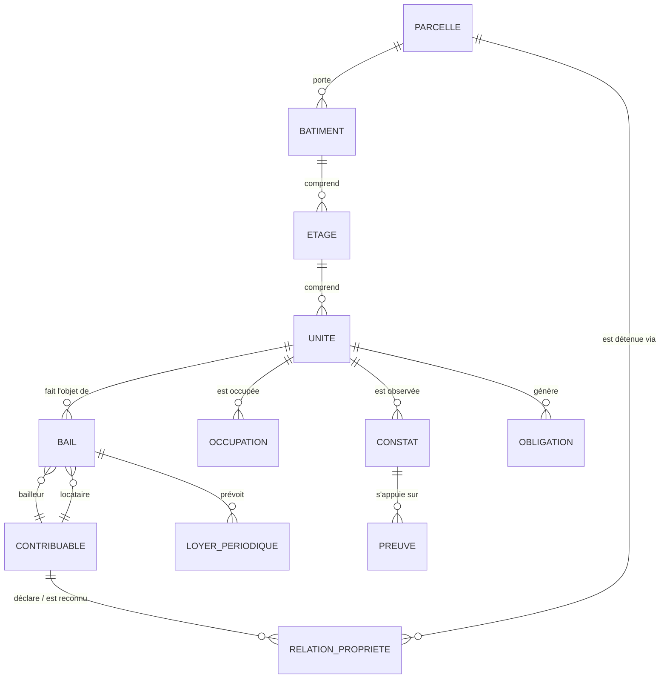

| Niveau | Champs principaux | Usage fiscal |
|---|---|---|
| **Parcelle** | IGF, référence cadastrale ou coutumière, polygone ou point, superficie (déclarée / mesurée), rang de localité, bâtie ou non bâtie, statut foncier déclaré | Impôt foncier |
| **Bâtiment** | IGF, parcelle, nombre de niveaux, usage dominant, année approximative, emprise, matériaux (facultatif), photos | Impôt foncier, requalification |
| **Étage** | Numéro, usage | Structuration des unités |
| **Unité** | IGF, type (appartement, chambre, local commercial, annexe, dépendance), surface, usage (habitation, commerce, bureau, mixte), statut d'occupation | IRL, patente éventuelle |
| **Relation de propriété** | Contribuable, rôle (propriétaire, copropriétaire, usufruitier, héritier présumé, gestionnaire), quote-part, preuve, statut probant, dates | Détermination du redevable |
| **Bail** | Unité, bailleur, locataire, sous-locataire éventuel, loyer, périodicité, devise, date de début, date de fin, garantie, preuve, source (déclaré par bailleur / par locataire / observé) | Base de l'IRL et de la retenue |
| **Occupation** | Occupant, qualité (propriétaire occupant, locataire, sous-locataire, occupant autorisé, locataire commercial, logé gratuitement, vacant), date de constat | Contrôle et qualification |
| **Constat** | Agent, date, GPS, photos, observations, écarts avec déclaration | Preuve terrain |
| **Contestation** | Objet, motif, statut, décision | Protection des droits |

## 16.2 Valeur probante et chaîne de responsabilité

Chaque information porte l'un des quatre statuts probants : **DÉCLARÉ** (par le contribuable ou un tiers), **OBSERVÉ** (constaté sur le terrain), **VÉRIFIÉ** (validé par un agent habilité à partir de preuves concordantes), **CONTESTÉ** (en litige). La même échelle s'applique à la propriété.

| Qui | Fait | Ne fait jamais |
|---|---|---|
| Contribuable | Déclare son rôle, ses unités, ses baux | — |
| IA | Détecte incohérences et signaux de location | Créer une obligation ou désigner un redevable |
| Agent de terrain | Observe et documente | Trancher la propriété ou la dette |
| Contrôleur | Vérifie et propose la qualification | Publier seul une rectification au-delà du seuil |
| Chef de service | Valide la qualification | Modifier la règle |
| Moteur de liquidation | Calcule selon la règle active sur les faits vérifiés (ou déclarés si la procédure est déclarative) | Calculer sur un simple signal |

**La réponse de l'utilisateur à la question « êtes-vous propriétaire, bailleur, locataire… ? » n'est jamais une preuve suffisante de propriété ni d'assujettissement.** Elle ouvre une instruction.

## 16.3 Question posée à l'inscription et à chaque changement d'adresse

« Quelle est votre situation à cette adresse ? » — propriétaire occupant ; bailleur (je loue tout ou partie) ; locataire ; sous-locataire ; occupant autorisé (logé par un tiers) ; gestionnaire immobilier ; locataire commercial ; autre occupant légalement reconnu. Chaque réponse déclenche un bloc court et des pièces facultatives ou requises selon le rôle (chapitre 9).

## 16.4 Taux, retenue et élargissement d'assiette

Voir § 6.4 : taux de 22 % (1er rang) et 17 % (autres rangs), retenue de 20 % et 15 % [taux CONFIRMÉS par la presse, arrêté À VÉRIFIER] ; innovations 2026 sur les baux emphytéotiques, les sociétés immobilières et les indemnités de logement [À VÉRIFIER]. Ces valeurs sont paramétrées dans le registre juridique, jamais dans le code, et revalidées à chaque édit budgétaire.

## 16.5 Moteur de détection d'anomalies locatives

| Signal | Source (sous protocole) | Règle | Sortie |
|---|---|---|---|
| Plusieurs compteurs d'électricité ou d'eau sur une parcelle | Distributeurs | Aucune déclaration locative | Probable bien loué → file de vérification |
| Indemnités de logement en paie | Employeurs (grands redevables) | Pas de retenue IRL correspondante | Notification à l'employeur |
| Annonce ou mandat d'agence | Agences, annonces publiques | Bien non rattaché | Enquête documentaire |
| Bail d'entreprise déclaré au fisc national | Protocole DGI | Bailleur inconnu du registre provincial | Rapprochement inter-administrations |
| Parcelle déclarée non bâtie | Imagerie, permis | Construction visible | Requalification contrôlée |
| Immeuble neuf réceptionné | Permis de bâtir | Pas d'unité déclarée après 12 mois | Visite de recensement |
| Immeuble multi-unités déclaré vacant | Déclarations | Vacance longue et répétée | Vérification |
| Loyer atypique | Déclarations | Écart fort par rapport aux loyers du même quartier et type | Vérification (jamais rehaussement automatique) |
| Bail déclaré par le locataire, non déclaré par le bailleur | Déclarations croisées | Discordance | Invitation du bailleur à déclarer |

Chaque signal a un **score explicable** (facteurs contributifs affichés) ; un superviseur décide de l'ouverture d'une mission ; les biais sont surveillés (sur-ciblage d'une commune ou d'une catégorie de population, chapitre 23).

## 16.6 Carte et niveaux de visibilité

**Couche de situation fiscale** (interne) :

| Couleur | Signification |
|---|---|
| 🟢 Vert | Obligation régularisée |
| 🟠 Ambre | Paiement partiel, échéance proche ou revue nécessaire |
| 🔴 Rouge | En retard ou non régularisé **après vérification** |
| ⚪ Gris | Non enregistré ou données insuffisantes |
| 🔵 Bleu | En litige ou en revue formelle |

**Couche opérationnelle de vérification** (superviseurs, terrain) : vert vérifié ; ambre à vérifier ; rouge anomalie détectée ; gris inconnu ; bleu dossier en instruction.

| Public | Ce qu'il voit |
|---|---|
| Grand public | Aucune situation fiscale individuelle ; cartes agrégées par quartier (couverture, recettes) avec seuil minimal d'agrégation (pas de maille de moins de 20 objets) |
| Contribuable | Ses propres objets et statuts |
| Agent de terrain | Objets de sa mission : couleur, adresse, identifiant, dernier constat ; pas de montant ni d'historique de paiement détaillé |
| Contrôleur | Dossier complet des objets assignés |
| Direction | Couches agrégées et nominatives dans son périmètre |
| Exécutif | Agrégats et cartes de chaleur |

## 16.7 Indicateurs de couverture locative

Par avenue, quartier et commune : nombre estimé de parcelles, bâtiments et unités ; nombre enregistré ; unités occupées par le propriétaire ; unités louées ; bailleurs et locataires identifiés ; loyer déclaré ; base légalement imposable ; obligations émises, payées, impayées ; concentration géographique ; taux de couverture du recensement ; âge moyen de la dernière vérification.

## 16.8 Plaque fiscale immobilière

Chaque bâtiment reçoit une plaque normalisée portant l'identifiant géofiscal, un QR signé et un code court. Scan par un agent habilité : identifiant, statut d'occupation déclaré, couleur de situation. Scan public : **uniquement** « plaque authentique, bâtiment enregistré, commune, quartier ». Rendre la plaque obligatoire et interdire la mise en location d'un bien non immatriculé exige un acte [ACTE REQUIS].

## 16.9 Campagne locative prioritaire

1. Recensement des quartiers échantillons des communes pilotes (septembre 2026 → janvier 2027).
2. Invitation à la régularisation volontaire avec délai clair.
3. Déclaration simplifiée du bail et du loyer, pré-remplie à partir du recensement.
4. Détection des incohérences ; visites ciblées après revue humaine et autorisation de mission.
5. Liquidation selon la règle certifiée, avec explication.
6. Mesure des résultats par rapport au groupe de comparaison (chapitre 45).

# 17. Cadastre fiscal géospatial

## 17.1 Principes

Le cadastre fiscal de MOSOLO est un **cadastre d'usage fiscal**, pas un cadastre juridique : il localise et décrit les objets générateurs de recettes, il ne confère aucun droit de propriété. Il s'articule avec les services fonciers et cadastraux compétents, auxquels il ne se substitue pas.

## 17.2 Couches

| Groupe | Couches |
|---|---|
| Territoire | Province, communes (24), quartiers, avenues, rues, îlots, rangs de localité |
| Foncier | Parcelles, bâtiments, unités |
| Économie | Commerces et établissements, marchés et étals, débits de boissons, carrières |
| Mobilité | Axes, zones de stationnement, gares routières, points d'embarquement, routes de transport, péages |
| Domaine public | Emprises, occupations temporaires |
| Réseaux | Supports publicitaires, antennes et pylônes |
| Fluvial | Ports, quais, embarcations (position au port d'attache) |
| Concessions | Concessions minières, forestières, carrières |
| Infrastructures publiques | Bâtiments publics, écoles, centres de santé, ouvrages de drainage |
| Opérations | Zones d'inspection, polygones de mission, traces de recensement, couverture |
| Analyse | Cartes de chaleur des recettes, de la conformité, du potentiel estimé, des anomalies |

## 17.3 Identifiant géographique fiscal (IGF)

Chaque objet imposable reçoit un **identifiant interne aléatoire, non signifiant et permanent** (UUID) et un **code territorial lisible** pour l'usage humain, par exemple `KIN-GOM-Q012-P004517-B01-U03` (commune, quartier, parcelle, bâtiment, unité). Le code lisible peut changer (redécoupage) ; l'identifiant interne jamais. L'IGF est relié à : localisation et géométrie, catégorie d'objet, relations avec les contribuables et leurs statuts probants, photographies, documents, historique d'inspection, règles applicables, obligations, paiements, quittances, litiges et journal d'audit.

## 17.4 Cas difficiles

| Cas | Procédure |
|---|---|
| Objet sans adresse formelle | Adresse descriptive + point GPS + photo de repère + code territorial ; plaque |
| Quartiers d'habitat informel | Recensement par îlot avec chefs de quartier ; identification de l'occupation sans préjuger du droit foncier ; mention explicite « situation foncière non établie » |
| GPS imprécis (< 15 m de précision non atteinte) | Mode « pointage assisté » sur fond de carte, relevé multiple moyenné ; statut `LOCALISATION_APPROXIMATIVE` ; revue ultérieure |
| Conflit de limites entre parcelles | Statut `CONTESTÉ` sur la géométrie ; aucune modification sans décision du service foncier compétent ; les obligations restent calculées sur la base non contestée |
| Plusieurs activités en un lieu | Un objet par activité, rattaché au même bâtiment ou à la même unité |
| Une entreprise, plusieurs établissements | Un compte, plusieurs établissements, chacun avec son IGF |
| Un bien, plusieurs unités louées ou commerciales | Modèle parcelle → bâtiment → étage → unité ; une obligation par unité et par période |
| Doublon d'objet (deux recensements) | Fusion d'objets par maker-checker ; aucun historique perdu |
| Changement de limites administratives | Historisation des codes territoriaux ; recalcul des agrégats |

## 17.5 Méthode de recensement massif

1. **Fond de carte** : imagerie récente, empreintes de bâtiments (sources ouvertes et acquisitions), numérotation existante.
2. **Pré-pointage** des bâtiments sur imagerie (assisté par apprentissage automatique, validé humainement).
3. **Recensement terrain** par îlot avec l'application hors ligne, en présence d'un relais de quartier.
4. **Pose de plaques** et remise d'une invitation à l'enrôlement.
5. **Contrôle qualité** par échantillonnage indépendant (5 % minimum).
6. **Recoupement** avec les données partenaires.
7. **Mise à jour continue** : permis de bâtir, mutations, signalements, constats.

## 17.6 Architecture géospatiale

Base spatiale PostgreSQL/PostGIS ; services cartographiques aux normes OGC (WMS, WFS, tuiles vectorielles) ; fonds de carte hors ligne sur les terminaux (MBTiles / PMTiles) ; système de référence WGS 84 pour la capture, projection métrique locale pour les calculs de surface ; index spatiaux ; historique des géométries (tables temporelles) ; séparation stricte entre couches publiques agrégées et couches nominatives.

# 18. Modèle de paiement et de règlement

## 18.1 Principe : MOSOLO orchestre, il ne détient pas

KINSHASA MOSOLO **n'est pas un compte de recettes**. Il émet des références de paiement, reçoit les confirmations signées des prestataires habilités, suit le règlement sur les comptes publics désignés, rapproche et prouve. Les fonds vont du payeur au prestataire habilité, puis au compte public de recettes désigné, puis au compte de la province selon les règles du Trésor (§ 6.8). Aucune recette publique ne transite par un compte de l'opérateur de la plateforme.

## 18.2 Canaux

| Canal | Fonctionnement | Conditions |
|---|---|---|
| Monnaie mobile | Paiement marchand (push de demande de paiement ou saisie de la référence) vers le compte marchand de recettes publiques | Émetteur agréé BCC ; compte marchand au nom de l'entité publique ; confirmation serveur à serveur signée |
| Banques | Paiement au guichet ou en ligne sur référence | Convention de banque de recettes ; relevés quotidiens |
| Cartes de paiement | Passerelle d'acquisition (diaspora, entreprises) | Acquéreur habilité ; 3-D Secure |
| Points de paiement agréés | Seul canal d'espèces ; encaissement sur référence, reçu provisoire, règlement quotidien | Agrément, garantie, plafonds, contrôles mystère |
| USSD | Consultation de la référence et paiement par monnaie mobile | Code court officiel unique |
| QR | QR de paiement sur l'avis (norme d'interopérabilité si disponible) | Référence et montant non modifiables |
| Virement | Grandes entreprises, administrations | Référence obligatoire dans le libellé |
| Autres canaux légalement autorisés | Selon agrément | Connecteur activé seulement sur preuve d'agrément (J9) |


## 18.3 Cycle de vie complet

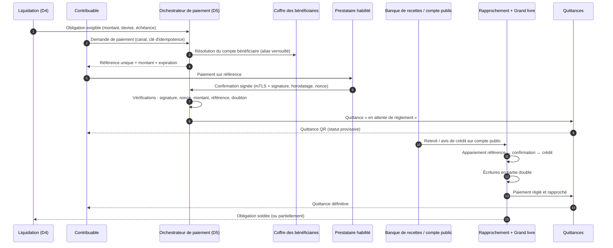

| # | Étape | Données produites | Contrôle |
|---|---|---|---|
| 1 | Création de l'obligation | Obligation, version de règle | Règle active |
| 2 | Avis de paiement | Avis signé | Mentions légales |
| 3 | Référence unique | `payment_reference` (clé de contrôle, expiration) | Montant figé ; une référence = une obligation (ou un panier explicite) |
| 4 | Choix du canal | Canal | Canal activé |
| 5 | Initiation | Ordre de paiement | Idempotence |
| 6 | Confirmation du prestataire | Événement signé | Signature, anti-rejeu, montant |
| 7 | Règlement en compte public | Ligne de relevé | Compte = alias du coffre |
| 8 | Rapprochement | Correspondance | Tolérances définies |
| 9 | Comptabilisation définitive | Écritures | Équilibre débit/crédit |
| 10 | Quittance électronique | Quittance signée | État autorisé |
| 11 | Traitement des exceptions | Dossier d'exception | Quatre yeux |
| 12 | Remboursement ou contrepassement | Écritures inverses | Double approbation, vers la source |

## 18.4 États distincts du paiement

| État | Définition | Quittance |
|---|---|---|
| `INITIE` | Ordre créé, référence émise | Aucune |
| `CONFIRME` | Confirmation signée et vérifiée du prestataire | Provisoire (« en attente de règlement ») |
| `REGLE` | Crédit constaté sur le compte public | Provisoire |
| `RAPPROCHE` | Correspondance complète obligation–confirmation–crédit, écritures passées | **Définitive** |
| `ECHOUE` | Refus ou expiration | Aucune |
| `DOUBLON` | Deuxième paiement pour la même référence | Crédit ou remboursement selon règle |
| `CONTREPASSE` | Annulation par le prestataire (fraude, erreur) | Quittance annulée, contre-écriture |
| `REMBOURSE` | Restitution approuvée | Mention de remboursement |
| `CONTESTE` | Litige ouvert (contribuable ou prestataire) | Statut « contesté » |

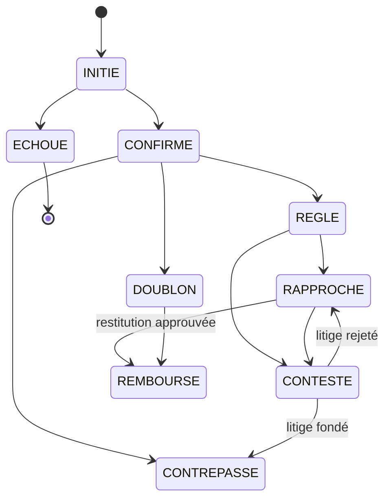

## 18.5 Protections du circuit

| Menace | Contre-mesure |
|---|---|
| Paiement en double | Clé d'idempotence par demande ; une référence ne peut être soldée qu'une fois ; tout excédent devient `DOUBLON` traité par règle |
| Rejeu de confirmation | Nonce unique, horodatage à fenêtre courte, stockage des identifiants de transaction prestataire (unicité) |
| Faux rappel (callback) | mTLS + signature asymétrique du message ; liste d'adresses autorisées ; vérification de l'état auprès du prestataire (appel de contrôle) avant toute quittance |
| Capture d'écran falsifiée ou SMS forgé | **Aucune quittance sur présentation d'une preuve visuelle** ; seule compte la confirmation serveur à serveur ; le contrôleur vérifie par QR |
| Référence manipulée | Clé de contrôle, montant et bénéficiaire liés à la référence côté serveur ; l'API refuse toute modification |
| Compte bénéficiaire altéré | Les canaux reçoivent un **alias** résolu dans le coffre verrouillé ; changement sous quorum, hors bande, 72 h de refroidissement (§ 12.6) |
| Fraude interne | Aucun rôle ne peut créer un paiement ; séparation des tâches ; journal d'audit |
| Remboursement indu | Double approbation, plafond, vers l'instrument d'origine uniquement, délai de carence, contrôle a posteriori à 100 % |
| Encaissement en espèces non enregistré | Espèces uniquement via points agréés ; reçu provisoire horodaté par le système ; règlement quotidien ; contrôles mystère ; signalement public |

## 18.6 Politique de quittance

Deux niveaux : **quittance provisoire** dès la confirmation serveur à serveur vérifiée (en moins d'une minute), portant la mention « en attente de règlement » ; **quittance définitive** à l'état `RAPPROCHE`. Si le règlement n'est pas constaté dans le délai contractuel, une exception est ouverte, sans remise en cause automatique des droits du contribuable, qui a payé de bonne foi par un canal officiel : le litige est avec le prestataire.

# 19. Quittance électronique

## 19.1 Contenu

| Champ | Exemple |
|---|---|
| Numéro de quittance | `Q-2027-KIN-000123456-7` |
| Référence du contribuable | IUC (et NIF si disponible) |
| Référence de paiement | `PR-7F3K-9Q2M` |
| Obligation(s) et objet(s) | Avis `AV-2027-IF-…`, IGF de la parcelle |
| Catégorie de recette | Impôt foncier 2027 |
| Montant et devise | 🇺🇸 USD 150,00 (contre-valeur indicative 🇨🇩 CDF …) |
| Date et heure du paiement | Heure serveur |
| Canal et identifiant de transaction | Monnaie mobile, identifiant prestataire |
| État de règlement | Provisoire / définitive |
| Administration bénéficiaire | DGIPK (compte public désigné par alias) |
| QR sécurisé | Lien de vérification + signature compacte |
| Signature numérique | Signature avancée (PKI provinciale, HSM) |
| Statut | Valide, en attente, annulée, contrepassée, remplacée, fraude suspectée |
| Mode de vérification | Scan QR, code court par SMS/USSD, portail |

## 19.2 Vérification publique

Le scan du QR (ou la saisie du code court) renvoie un résultat **minimal** :

| Résultat | Affichage public |
|---|---|
| ✅ Valide | « Quittance authentique — montant, date, catégorie de recette, administration bénéficiaire, quatre derniers caractères de la référence du contribuable » |
| ⏳ En attente | « Paiement confirmé, règlement en cours » |
| ❌ Annulée / contrepassée | « Quittance non valable » + motif générique |
| 🔁 Remplacée | « Remplacée par la quittance n° … » |
| ⚠️ Fraude suspectée | « Vérification impossible — contactez la régie » ; signalement automatique à l'équipe anti-fraude |
| ❓ Inconnue | « Aucune quittance ne correspond » |

Aucun nom complet, adresse ou historique n'est exposé. Les vérifications sont limitées en fréquence et journalisées. Les services habilités (API quitus, contrôleurs) obtiennent des informations supplémentaires selon leurs droits.

## 19.3 Vérification hors ligne

Le QR contient une signature compacte vérifiable hors ligne par l'application terrain (clé publique embarquée) : l'agent sait que la quittance a été émise par MOSOLO et n'a pas été altérée. Le **statut** (annulation éventuelle) exige une vérification en ligne ; hors ligne, l'application utilise une liste de révocation signée téléchargée au départ de mission et affiche « authentique — statut vérifié au JJ/MM HH:MM ».

## 19.4 Titres et quittances

Une quittance prouve un paiement ; un **titre** (autorisation, vignette, ticket, pass) prouve un droit, avec une période de validité et des statuts (vert valide, ambre bientôt expiré, rouge expiré ou suspendu). Les titres sont gérés par le moteur de titres (module 70) et contrôlés par plaque, QR ou code (module 71).

# 20. Rapprochement

## 20.1 Appariement à trois voies

Chaque paiement est rapproché sur trois sources indépendantes : **l'obligation** (ce qui est dû), **la confirmation du prestataire** (ce qui a été payé), **le relevé du compte public** (ce qui est arrivé). Un quatrième niveau, **l'écriture comptable**, clôt la chaîne.

| Règle d'appariement | Traitement |
|---|---|
| Référence, montant et devise identiques, crédit constaté | Rapprochement automatique |
| Montant différent dans la tolérance de change définie | Rapprochement + écart de change enregistré |
| Crédit sans confirmation | Exception « crédit orphelin » → recherche prestataire |
| Confirmation sans crédit à J+1 ouvré | Exception « règlement manquant » → relance prestataire, pénalités contractuelles |
| Crédit groupé (règlement net d'un prestataire) | Décomposition par le fichier de détail du prestataire ; contrôle de totaux |
| Commissions prélevées à la source par le prestataire | **Interdit par défaut** : le prestataire règle le brut, les commissions sont facturées séparément et payées sur crédit budgétaire (sauf convention contraire approuvée, visible au grand livre) |

Cible : plus de 95 % de rapprochement automatique à J+1, exceptions résolues sous 5 jours ouvrés, aucune exception de plus de 30 jours sans décision.

## 20.2 Grand livre public en partie double

Le grand livre (module 59) enregistre chaque événement financier par des écritures équilibrées, **en ajout seul**. Exemple simplifié :

| Événement | Débit | Crédit |
|---|---|---|
| Émission d'une obligation de 100 | Créance sur contribuable 100 | Recette constatée 100 |
| Confirmation de paiement | Fonds à recevoir du prestataire 100 | Créance sur contribuable 100 |
| Crédit sur compte public | Compte public de recettes 100 | Fonds à recevoir du prestataire 100 |
| Contrepassement | Créance sur contribuable 100 | Fonds à recevoir du prestataire 100 (inverse) |
| Remboursement | Recette constatée (restitution) 100 | Compte public de recettes 100 |

Clôture quotidienne signée (hachage de la journée chaîné à la précédente), comptes d'attente (suspens) datés et justifiés, interface d'export vers la comptabilité publique du Trésor provincial. **Aucune correction sans contre-écriture liée à l'original.**

# 21. Recouvrement et exécution

## 21.1 Principes

Le recouvrement est **gradué, proportionné, tracé et contestable**. Le système calcule, segmente, prépare et notifie ; **toute mesure coercitive est décidée par l'autorité légalement compétente**, après vérification humaine, conformément à l'édit de procédure (J4).

## 21.2 Segmentation

| Segment | Critère | Approche |
|---|---|---|
| Oubli | Premier retard, bon historique | Rappel simple, facilité de paiement |
| Friction | Difficultés d'accès au paiement | Assistance, point de paiement proche |
| Capacité limitée | Montant élevé relatif au revenu présumé | Échéancier si la loi le permet |
| Contestation | Désaccord sur la base | Orientation vers la réclamation |
| Refus délibéré | Relances ignorées, capacité établie | Procédure légale graduée |
| Grands redevables | Enjeux élevés | Suivi dédié, contrôle contradictoire |

## 21.3 Parcours gradué

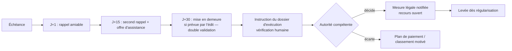

Les délais ci-dessus sont des **valeurs de conception** à remplacer par ceux de l'édit. Garde-fous : aucune mesure sur un dossier contesté avec effet suspensif ; aucune mesure si l'adresse de notification n'est pas vérifiée ; vérification que le paiement n'est pas en cours de règlement ; levée automatique proposée dès régularisation ; indicateurs de proportionnalité (mesures par segment de revenu, par commune) suivis par l'audit.

## 21.4 Arriérés

Tableau d'âge des créances, prescription calculée par règle, priorisation par rendement net (montant recouvrable × probabilité − coût), campagnes de régularisation (module 90) si un acte le prévoit, admission en non-valeur par décision motivée et contrôlée.

# 22. Recours et droits du contribuable

## 22.1 Charte des droits intégrée au produit

| Droit | Traduction dans MOSOLO |
|---|---|
| Savoir ce qu'il doit et pourquoi | Explication de chaque montant : règle, version, base légale, assiette, formule |
| Accéder à ses données | Consultation et export de ses données |
| Faire rectifier une erreur | Demande de rectification depuis chaque donnée |
| Contester | Réclamation depuis chaque objet et chaque obligation |
| Être entendu avant une mesure | Notification préalable et délai d'observations (selon texte) |
| Recevoir une décision motivée | Modèle de décision avec motifs obligatoires |
| Connaître les délais | Compte à rebours légal visible |
| Ne pas payer deux fois | Blocage des doubles revendications (§ 10.3) et des doubles paiements |
| Être protégé contre l'arbitraire | Aucune sanction automatique ; journal d'audit consultable par le contribuable pour son dossier |
| Signaler un abus | Ligne de signalement protégée (module 69) |
| Confidentialité fiscale | Accès limité et journalisé ; aucune exposition publique |

## 22.2 Workflow des réclamations

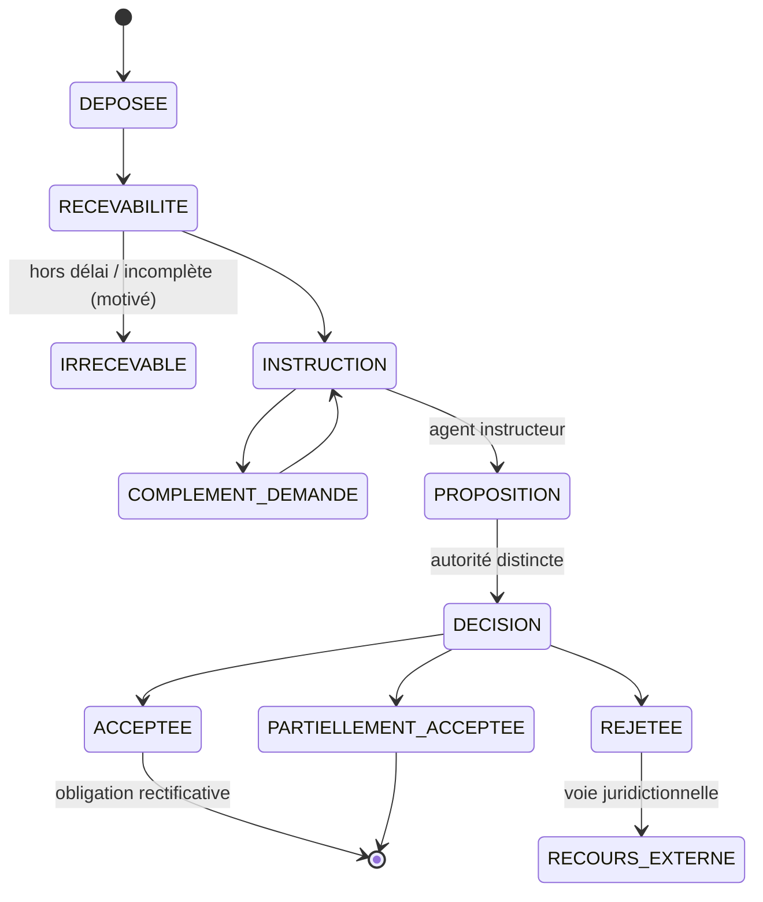

L'instructeur et le décideur sont des personnes distinctes ; l'IA peut résumer le dossier et proposer des éléments, **jamais clore un recours**. Les exonérations, annulations et corrections suivent le même principe de séparation et de contre-écriture. Les statistiques de recours (volume, délai, taux de décisions favorables par motif et par commune) sont publiées de façon agrégée ; un taux élevé de recours fondés sur un motif déclenche une revue de la qualité des données ou de la règle.

# 23. Architecture des agents d'intelligence artificielle

## 23.1 Doctrine

L'IA de KINSHASA MOSOLO **détecte, explique, priorise, rédige et recommande**. Elle ne décide ni n'exécute aucun acte ayant un effet juridique ou financier. Chaque agent fonctionne derrière une **passerelle d'IA** (AI Gateway) qui contrôle ses accès aux données, ses outils, ses journaux et ses limites.

**Aucun agent ne peut, de lui-même :** créer une taxe ; imposer une pénalité ; déterminer la propriété définitive ; saisir un bien ; suspendre un droit d'un citoyen ; approuver une exonération ; clore un recours ; transférer de l'argent ; modifier un compte bénéficiaire ; détruire un enregistrement d'audit. Ces interdits sont **techniques** : les agents n'ont pas de droits d'écriture sur les domaines concernés ; leurs sorties sont des objets `AIRecommendation` qu'un humain habilité accepte, modifie ou rejette.

## 23.2 Catalogue des agents

| Agent | Mission | Données accessibles | Sorties | Validation humaine |
|---|---|---|---|---|
| **Découverte des recettes** | Identifier sous-enregistrement, activités non déclarées, actifs publics non valorisés | Agrégats, objets, signaux partenaires pseudonymisés | Fiches d'opportunité (§ 8.1) | Analyste + juriste + comité |
| **Enrôlement** | Guider l'inscription, détecter les pièces manquantes, réutiliser les données vérifiées | Données du compte en cours | Suggestions, pré-remplissage | Le contribuable confirme |
| **Apprentissage de l'usager** | Expliquer obligations, échéances, pièces, moyens de paiement, droits de recours, usage de la plateforme — en français simple, lingala et autres langues | Base de connaissances publique + données du compte de l'usager authentifié | Réponses sourcées (citation du texte ou de la page d'aide) | Réponses sans effet juridique ; renvoi vers un humain |
| **Copilote des agents publics** | Résumés de dossiers, guidage procédural, projets de documents, prochaines étapes, priorisation, formation | Dossiers dans le périmètre de l'utilisateur | Brouillons, résumés | L'agent public signe |
| **Veille juridique** | Suivre les textes, repérer règles expirées et conflits | Registre juridique, textes officiels | Alertes, propositions de fiches | Juristes ; **aucune publication** |
| **Intelligence locative** | Repérer biens probablement loués, incohérences d'occupation, zones à vérifier | Objets, déclarations, signaux sous protocole | Listes de vérification avec scores expliqués | Superviseur |
| **Missions terrain** | Planifier des tournées efficaces, prioriser les objets, préparer les dossiers | Objets de la zone, contraintes d'équipe | Plans de mission | Superviseur |
| **Rapprochement** | Proposer des appariements complexes, expliquer les écarts | Paiements, relevés, obligations | Propositions d'appariement | Analyste (quatre yeux au-delà des tolérances) |
| **Détection de fraude** | Identités dupliquées, exonérations suspectes, annulations anormales, collusions, activité géographique inhabituelle, réutilisation d'appareils, manipulation de quittances, changements de bénéficiaires irréguliers, baisses de recettes inexpliquées | Journaux, transactions, métadonnées | Alertes expliquées | Enquêteur |
| **Prévision** | Scénarios conservateur, attendu, ambitieux, avec hypothèses explicites | Séries historiques, base de référence | Prévisions + intervalles | Direction financière |
| **Aide à la décision exécutive** | Transformer les données en recommandations prêtes à décider | Agrégats | Notes de décision (options, effets, risques) | Gouverneur et autorités |
| **Allocation des investissements** | Proposer des scénarios d'emploi des fonds disponibles | Recettes réglées, budget, projets, indicateurs territoriaux | Scénarios (ch. 27) | Autorités budgétaires |
| **Apprentissage continu** | Améliorer les modèles à partir de corrections validées | Jeux de données **approuvés** | Nouvelles versions candidates | Comité des modèles |

## 23.3 Flux de travail d'un agent

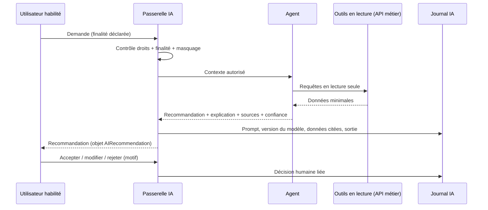

## 23.4 Gouvernance des modèles

| Exigence | Mise en œuvre |
|---|---|
| Jeux d'entraînement approuvés | Registre des jeux de données (source, base légale, période, pseudonymisation, validation) ; aucune donnée sensible non approuvée |
| Pas de réentraînement silencieux | L'apprentissage continu produit des **candidats** ; mise en production uniquement après validation |
| Versionnage | Modèles, prompts, paramètres et jeux de données versionnés ensemble |
| Validation humaine | Comité des modèles (métier, audit, protection des données, sécurité) |
| Suivi de performance | Précision, rappel, taux d'acceptation des recommandations, faux positifs par commune |
| Tests de biais | Écarts de ciblage entre communes, catégories de contribuables, genre lorsque la donnée existe |
| Détection de dérive | Surveillance statistique des entrées et sorties |
| Explicabilité | Facteurs contributifs affichés pour chaque score |
| Retour arrière | Version précédente restaurable immédiatement |
| Journal des décisions IA | Conservation au même niveau que le journal d'audit |
| Hébergement | Modèles hébergés sous contrôle de la Province ou fournisseur contractualisé sans conservation ni réutilisation des données ; aucune donnée fiscale nominative vers un service d'IA public |

## 23.5 Couche d'intelligence : MOSOLO, système d'exploitation piloté par l'IA

### 23.5.1 Identité de la couche d'intelligence

La couche d'intelligence n'est pas un assistant conversationnel ajouté à la plateforme : c'est **le cerveau opérationnel de MOSOLO**. Elle soutient chaque fonction, parcours, action, document, tableau de bord, notification et décision. MOSOLO fonctionne ainsi comme :

| Ce que MOSOLO est | Et non |
|---|---|
| Un système d'exploitation des recettes piloté par l'IA | Un simple logiciel de saisie |
| Une infrastructure d'intelligence vivante | Un tableau de bord statique |
| Un moteur d'aide à la décision | Un affichage de données |
| Une couche d'automatisation des processus | Un registre passif |
| Un assistant prédictif | Un assistant qui attend qu'on l'interroge |
| Une plateforme d'exécution multi-agents | Une interface de conversation |
| Un système qui s'améliore à partir des résultats validés | Un système figé |

**Limite constitutionnelle.** Cette ambition s'exerce **à l'intérieur** des principes P1 à P14 (§ 3.4) et des interdits du § 23.1 : l'IA prépare, accélère, prédit et recommande ; seuls des agents publics habilités produisent un effet juridique ou financier.

### 23.5.2 Les douze questions posées à chaque action

Pour chaque action d'un utilisateur, la couche d'intelligence se pose silencieusement les questions suivantes, et l'interface en affiche les réponses utiles :

| # | Question | Exemple (agent de régie ouvrant un dossier locatif) |
|---|---|---|
| 1 | Que cherche à accomplir l'utilisateur ? | Qualifier une unité déclarée vacante |
| 2 | Quelles données sont disponibles ? | Déclarations, constat terrain, compteurs (sous protocole) |
| 3 | Que manque-t-il ? | Bail ou preuve de vacance |
| 4 | Quel risque existe ? | Sous-déclaration ; contestation si la preuve est faible |
| 5 | Que peut-on automatiser ? | Demande de pièces au bailleur |
| 6 | Que peut-on prédire ? | Probabilité de location : 0,78 (facteurs affichés) |
| 7 | Que peut-on améliorer ? | Qualité de l'adresse (précision GPS faible) |
| 8 | Que doit-il se passer ensuite ? | Invitation à déclarer, puis visite si pas de réponse sous 15 jours |
| 9 | Qui doit être notifié ? | Bailleur (`rental.occupancy.inconsistency`), superviseur |
| 10 | Que faut-il enregistrer ? | Brouillon de qualification, justification, sources |
| 11 | Que faut-il apprendre ? | Résultat de la vérification, pour recalibrer le modèle (après validation) |
| 12 | Que doit recommander la plateforme ? | « Demander le bail — confiance moyenne » |

### 23.5.3 Principe d'enregistrement automatique (autosave)

**Aucune action importante ne doit être perdue.** L'enregistrement automatique est obligatoire dans tous les modules et couvre : saisies, contenus générés, brouillons, fichiers déposés, modifications, commentaires, sélections, recommandations et décisions de l'IA, sorties modifiées, changements d'état, notifications, approbations, rejets, tâches terminées, processus abandonnés, recherches (sous forme minimisée), analyses produites, préférences, usage de l'IA, versions historiques et journaux d'audit.

| Capacité (chaque module) | Mise en œuvre |
|---|---|
| Enregistrement automatique | Brouillon persistant côté serveur toutes les 5 secondes d'inactivité et à chaque changement de champ ; stockage local chiffré en hors ligne |
| Historique des versions | Chaque enregistrement crée une version ; différences consultables |
| Horodatage | Heure serveur de référence |
| Attribution | Utilisateur, rôle, appareil |
| Suivi des modifications | Avant/après champ par champ |
| Retour arrière | Restauration d'une version de **brouillon** ; pour les actes validés, uniquement par acte contraire (P7) |
| Piste d'audit | Événement chaîné (§ 25.2) |
| Résumé IA des changements | « 3 champs modifiés depuis hier : surface (120 → 135 m²), usage, photo ajoutée » |
| Indicateur visible | « Enregistré à 09:15 » / « Enregistrement… » / « Hors ligne — enregistré sur l'appareil » |

Distinction essentielle : **un brouillon n'est pas un acte**. L'enregistrement automatique ne vaut ni déclaration déposée, ni décision, ni approbation ; ces effets exigent une action explicite de validation, signée et horodatée.

### 23.5.4 Mémoire structurée à quatre niveaux

| Niveau | Contenu | Limites (protection des données, ch. 32) |
|---|---|---|
| **Mémoire utilisateur** | Rôle, préférences, langue, tâches fréquentes, priorités, sorties enregistrées, objectifs récurrents | Pour les **agents publics** : aide au travail, jamais utilisée pour l'évaluation disciplinaire sans procédure. Pour les **contribuables** : préférences de service uniquement ; **aucun profilage comportemental** ni « tolérance au risque » inférée |
| **Mémoire d'espace (entité)** | Données de l'entité, règles, modèles, circuits, décisions historiques, hypothèses | Cloisonnée par entité (§ 10.3) |
| **Mémoire de processus** | Étape atteinte, fait, en attente, bloqué, changé récemment, prochaine décision | Liée au dossier, conservée avec lui |
| **Mémoire d'intelligence** | Tendances, risques, problèmes répétés, signaux de performance, de coût, de productivité, de prévision, améliorations recommandées | Agrégée et pseudonymisée ; alimente les modèles uniquement via des jeux approuvés (§ 23.4) |

### 23.5.5 Agents transverses et correspondance avec les agents métier

| Agent transverse | Responsabilité | Agents métier MOSOLO concernés (§ 23.2) |
|---|---|---|
| Stratégie | Comprendre l'objectif, recommander la meilleure voie, identifier les leviers | Aide à la décision exécutive ; découverte des recettes |
| Processus (workflow) | Faire avancer les tâches, détecter les goulets, proposer l'étape suivante, automatiser le répétitif | Copilote ; missions terrain |
| Intelligence des données | Lire les données structurées et non structurées, extraire le sens, détecter les manques | Intelligence locative ; rapprochement |
| Prédiction | Prévoir issues, retards, risques, points de défaillance, occasions manquées | Prévision ; détection de fraude |
| Documents | Créer, relire, résumer, comparer, versionner ; extraire obligations, actions, risques | Copilote ; veille juridique |
| Communication | Rédiger avis, messages, rapports, réponses — ton professionnel et adapté | Apprentissage de l'usager ; moteur de communication (§ 11.4) |
| Conformité | Vérifier règles, délais, approbations, permissions, pièces obligatoires | Veille juridique ; contrôle des séparations de tâches |
| Finances (commercial) | Analyser coûts, recettes, rendement, déperdition, pression budgétaire | Découverte des recettes ; allocation |
| Automatisation | Repérer les actions répétées, proposer des automatisations, déclencher rappels, alertes, tâches | Tous |
| Personnalisation | Adapter l'expérience au rôle, à la langue, à l'historique | Tous (dans les limites du § 23.5.4) |

Tous passent par la **couche d'orchestration** (passerelle IA, § 23.3), qui applique les droits, journalise et impose le format de sortie.

### 23.5.6 Fonctions IA disponibles dans toute la plateforme

| Fonction | Exemple MOSOLO |
|---|---|
| Recherche IA | « Parcelles de Limete avec plus de 3 compteurs et sans bail » (dans le périmètre de l'utilisateur) |
| Résumés | Résumé d'un dossier de réclamation de 40 pièces |
| Recommandations | Prochaine meilleure action sur un arriéré |
| Détection de risques | Pic d'annulations |
| Guidage de l'étape suivante | Liste de contrôle contextuelle |
| Rédaction | Projet de décision motivée (à signer par l'autorité) |
| Classification et étiquetage | Type de pièce déposée, motif de réclamation |
| Notation | Score de probabilité de location, expliqué |
| Prévision | Encaissements de la semaine par commune |
| Alertes | Seuils d'indicateurs |
| Automatisation des processus | Relances, affectations, création de tâches |
| Compréhension de documents | Lecture d'un bail scanné (OCR + extraction) |
| Extraction de données | Loyer, dates, parties d'un bail |
| Personnalisation | Tableau de bord par rôle |
| Comparaison | Deux versions d'une règle |
| Explication | Pourquoi ce montant, pourquoi cette alerte |
| Aide à la décision | Options, effets, risques |
| Suivi de performance | Indicateurs d'équipe, écarts |
| Détection d'anomalies | Transactions, accès, constats |
| Génération de piste d'audit | Chronologie lisible d'un dossier |

### 23.5.7 Format de sortie standard

Toute analyse de la couche d'intelligence est structurée ainsi (objet `AIRecommendation`) :

| Rubrique | Contenu |
|---|---|
| **1. Situation** | Ce qui se passe |
| **2. Analyse** | Ce que signifient les données |
| **3. Risque** | Ce qui pourrait mal tourner |
| **4. Recommandation** | Ce qu'il faudrait faire |
| **5. Prochaine action** | L'étape la plus pratique maintenant |
| **6. Responsable** | Qui doit agir (rôle, jamais « l'IA ») |
| **7. Échéance** | Quand |
| **8. Niveau de confiance** | Élevé, moyen ou faible, selon la qualité des données, avec les sources citées |

Pour toute décision importante, la couche fournit en outre : **meilleure option ; option alternative ; risque de l'inaction ; impact financier ; impact opérationnel ; étape recommandée**.

### 23.5.8 Règles de prédiction, d'automatisation et de données

**Prédiction proactive.** La plateforme n'attend pas que l'utilisateur découvre un problème : elle signale retards, informations manquantes, performances faibles, pression sur les coûts, faible engagement, processus incomplets, doublons de travail, données contradictoires, comportements inhabituels, lacunes de conformité, gisements de recettes et inefficacités.

**Automatisation, selon trois niveaux d'autonomie :**

| Niveau | Actions | Exemples | Contrôle |
|---|---|---|---|
| A — Exécution automatique | Actions sans effet juridique ni financier, réversibles | Rappels facultatifs, création de tâches, affectation selon des règles approuvées, préparation de brouillons, résumés, classement de pièces | Journalisé ; désactivable par le responsable d'entité |
| B — Exécution après validation | Actions à effet sur un tiers | Envoi d'une demande de pièces, ouverture d'une mission, relance obligatoire | Un clic de validation par un agent habilité |
| C — Recommandation seulement | Actions à effet juridique ou financier | Liquidation rectificative, exonération, pénalité, mesure d'exécution, remboursement, changement de bénéficiaire, clôture d'un recours | Circuits maker-checker complets ; **jamais automatisé** |

**Données.** Toute donnée est structurée, étiquetée, recherchable (selon les droits), reliée aux processus, aux utilisateurs, aux décisions, aux horodatages et aux résultats, et réutilisable pour l'intelligence future dans le respect de sa finalité.

### 23.5.9 Sécurité, transparence et contrôle

- L'interface n'expose ni les fournisseurs techniques d'IA, ni la logique interne, ni les clés, ni les données confidentielles, ni la complexité technique inutile.
- **Mais l'usager sait toujours qu'une IA est intervenue** : tout contenu généré ou recommandé porte la mention « préparé avec l'assistance de l'IA — validé par [rôle] » ; l'explication de toute décision automatisée ou assistée est disponible. C'est une exigence de loyauté de l'administration et de protection des données, non négociable dans un service public.
- La couche respecte permissions, rôles, cloisonnements, auditabilité, confidentialité fiscale et obligations de conformité.

### 23.5.10 Expérience utilisateur : une plateforme vivante

Chaque tableau de bord répond à sept questions : que se passe-t-il ? qu'est-ce qui a changé ? qu'est-ce qui est à risque ? que faut-il faire aujourd'hui ? qu'est-ce qui coûte du temps ou de l'argent ? que va-t-il probablement se passer ? qui détient la décision ?

Chaque écran comporte, lorsque c'est pertinent, un **panneau d'intelligence** : analyse IA, recommandation, alerte de risque, prochaine action, résumé, niveau de confiance et **statut d'enregistrement automatique** (voir la maquette du tableau de bord du Gouverneur, § 26.2).

### 23.5.11 Apprentissage

La plateforme apprend des corrections des utilisateurs, des décisions répétées, des réussites et des échecs de processus, des recommandations acceptées et rejetées, du temps passé, des questions fréquentes, des sorties souvent modifiées et des résultats. **Cet apprentissage alimente des candidats** (modèles, modèles de documents, règles d'automatisation), mis en service après validation par le comité des modèles (§ 23.4) : aucune auto-modification silencieuse.

### 23.5.12 Positionnement

MOSOLO remplace les outils fragmentés, l'administration manuelle, les tableurs déconnectés, la communication lente, la faible visibilité et la gestion réactive. Sa valeur : rapidité, contrôle, automatisation, prédiction, redevabilité, intelligence, réduction des coûts, productivité, meilleures décisions, risques réduits, meilleurs résultats. L'objectif est que la plateforme devienne **indispensable par la valeur qu'elle apporte**, et non par un verrouillage : la Province doit rester capable de l'exploiter, de la faire évoluer et d'en sortir (§ 33).

Le prompt système de la couche d'intelligence, adapté à ces règles, figure dans `specs/ia/prompt-systeme-mosolo.md`.

# 24. Apprentissage des utilisateurs et environnement de travail

## 24.1 Environnement d'apprentissage intégré

| Public | Contenus | Modalités |
|---|---|---|
| Contribuables | Obligations, échéances, calcul, paiement, recours | Guides contextuels, vidéos courtes, SVI, questions-réponses en langues nationales |
| Agents de terrain | Procédures, déontologie, sécurité, application hors ligne | Parcours d'intégration, cas simulés, certification obligatoire avant la première mission |
| Contrôleurs | Qualification, preuves, procès-verbaux | Cas simulés, certification |
| Personnel des ministères | Tableaux de bord, circuits d'approbation | Parcours par rôle |
| Superviseurs | Planification, contrôle qualité, gestion d'équipe | Parcours par rôle |
| Finances et Trésor | Rapprochement, exceptions, clôtures | Simulations |
| Administrateurs | Sécurité, configuration, séparation des tâches | Certification |
| Exécutifs | Lecture de l'échelle de la recette, arbitrages | Sessions courtes |

Fonctions : intégration par rôle ; tâches guidées ; explications contextuelles ; listes de contrôle interactives ; aide multilingue ; vidéos ; quiz ; procédures consultables ; questions-réponses assistées par l'IA (avec sources) ; cas simulés dans un environnement d'entraînement ; certification et recyclage ; retour de performance ; notifications de changement de procédure ; analyse des lacunes de connaissance.

## 24.2 Surveillance légitime, pas surveillance oppressive

| Surveillance légitime (maintenue) | Surveillance excessive (proscrite) |
|---|---|
| Journal des actions sur les données et les montants | Enregistrement continu de l'écran ou du micro |
| Géolocalisation **pendant les missions** et pour les constats | Géolocalisation hors mission ou hors service |
| Contrôle qualité des constats par échantillon | Classement public des agents |
| Indicateurs de qualité (exactitude, délais, plaintes) | Indicateurs fondés sur les montants imposés par agent |
| Alertes de sécurité et d'intégrité | Lecture des communications privées |

Les agents ont accès à leurs propres indicateurs et à leur journal ; les règles de surveillance sont publiées, expliquées pendant la formation et soumises au délégué à la protection des données.

# 25. Prévention de la fraude et de la déperdition

## 25.1 Objectif réaliste

La fraude ne peut pas être éliminée. L'objectif est de la rendre **difficile à commettre, rapide à détecter et impossible à effacer sans trace**.

| Fonction | Comment MOSOLO agit |
|---|---|
| **Prévenir** | Aucune espèce entre les mains des agents ; montants calculés par le moteur et non modifiables sur le terrain ; comptes bénéficiaires verrouillés ; quatre yeux ; séparation des tâches ; MFA ; accès juste-à-temps |
| **Détecter** | Règles et modèles d'anomalies ; rapprochement quotidien ; contrôles mystère ; signalements du public ; vérification des quittances par QR |
| **Contenir** | Suspension conservatoire d'un accès sur décision motivée ; gel d'un point de paiement ; révocation d'appareil ; blocage d'une quittance suspecte |
| **Enquêter** | Dossier d'enquête ; graphe des liens ; chronologie reconstituée depuis le journal |
| **Prouver** | Journal chaîné et signé ; horodatage fiable ; preuves scellées ; extraction probante signée pour les autorités |
| **Corriger** | Contre-écritures ; rectifications motivées ; récupération des sommes |
| **Rendre compte** | Rapport trimestriel au Comité d'audit ; indicateurs agrégés publics |

## 25.2 Socle technique d'intégrité

| Contrôle | Description |
|---|---|
| Historique d'événements immuable | Toute action produit un événement en ajout seul |
| Hachage cryptographique chaîné | Chaque événement contient l'empreinte du précédent ; toute suppression rompt la chaîne |
| Signatures numériques | Événements financiers signés par des clés en HSM |
| Horodatage de confiance | Ancrage périodique de l'empreinte de la chaîne auprès d'une autorité d'horodatage et chez un tiers indépendant |
| Grand livre en ajout seul, partie double | § 20.2 |
| Stockage WORM | Copie du journal sur stockage à écriture unique, sous le contrôle de l'audit |
| Sauvegarde indépendante des preuves | Réplication vers un site contrôlé par l'autorité d'audit |
| Maker-checker, contrôle double | § 12.6 |
| Limites de transaction | Plafonds de remboursement, d'annulation, d'exonération par rôle |
| Verrouillage des bénéficiaires | Coffre, quorum, hors bande, refroidissement |
| Détection d'anomalies | Règles + modèles |
| Empreinte d'appareil | Terminaux enrôlés ; détection de réutilisation d'appareil entre comptes |
| Géorepérage et plausibilité GPS | Vitesse de déplacement, précision, sortie de zone |
| Intégrité des photos et documents | Capture dans l'application uniquement, hachage à la capture, métadonnées scellées |
| Anti-rejeu | Nonces, fenêtres temporelles, idempotence |
| Rapprochement | Trois voies + écritures |
| Surveillance des accès privilégiés | Sessions enregistrées, alertes en temps réel |
| Prévention des fuites de données | Masquage, filigranes sur exports, limites de volume, alertes |
| Accès d'audit indépendant | Rôle auditeur non modifiable par les administrateurs |

## 25.3 Scénarios de fraude et contrôles

| Scénario | Signal | Contrôle |
|---|---|---|
| Agent qui encaisse des espèces « pour arranger » | Plaintes, régularisations sans paiement, écarts constat/paiement | Zéro espèce, badge vérifiable, signalement, contrôle mystère |
| Exonérations de complaisance | Concentration par agent, zone ou période | Quatre yeux, fondement légal obligatoire, alerte de concentration |
| Annulations d'avis après paiement hors circuit | Pic d'annulations | Motif codifié, double validation, revue audit |
| Fausse quittance | Scan QR invalide | Vérification publique, signalement |
| Détournement par changement de compte bénéficiaire | Tentative de modification | Quorum, hors bande, refroidissement, notification multiple |
| Collusion recenseur–contribuable (sous-déclaration d'unités) | Écart avec imagerie, compteurs | Contrôle qualité indépendant, double visite aléatoire |
| Objets fictifs pour gonfler la production | Objets sans suite, photos réutilisées | Hachage des photos, rémunération sur objets vérifiés uniquement |
| Rappel de paiement falsifié | Signature invalide | mTLS + signature + appel de contrôle |
| Remboursement vers un compte tiers | Instrument différent de l'origine | Remboursement vers l'origine uniquement |
| Initié technique modifiant la base | Rupture de chaîne de hachage, écart avec copie WORM | Contrôle d'intégrité horaire, alerte critique |
| Baisse inexpliquée de recettes d'une zone | Série temporelle | Alerte de l'agent de fraude, enquête |

**Aucun paiement, liquidation, exonération, annulation ni correction ne peut disparaître.** Les corrections se font par contrepassement ou contre-écriture autorisés, liés à l'original.

# 26. Tableaux de bord exécutifs

## 26.1 L'échelle unifiée de la recette

Tous les tableaux de bord emploient la même échelle, sans jamais additionner des niveaux différents :


| # | Niveau | Définition |
|---|---|---|
| 1 | **Potentiel estimé** | Estimation statistique, non opposable |
| 2 | **Assiette vérifiée** | Objets et redevables vérifiés × règles actives |
| 3 | **Liquidé (assessed)** | Obligations émises |
| 4 | **Exigible** | Obligations échues non contestées avec effet suspensif |
| 5 | **En retard (overdue)** | Exigible non payé après échéance |
| 6 | **Contesté** | Sous réclamation |
| 7 | **Paiement initié** | Références en cours |
| 8 | **Paiement confirmé** | Confirmé par le prestataire |
| 9 | **Réglé sur le compte public** | Crédit constaté |
| 10 | **Rapproché** | Appariement complet et écritures |
| 11 | **Disponible pour appropriation budgétaire** | Selon les règles du Trésor et du budget |

## 26.2 Tableau de bord du Gouverneur

| Zone | Contenu | Visualisation |
|---|---|---|
| Bandeau du jour | Collecté aujourd'hui (confirmé), réglé, rapproché ; comparaison J−1 et même jour de l'année précédente | Chiffres clés avec tendance |
| Échelle de la recette | Niveaux 1 à 11 sur l'exercice | Entonnoir |
| Cible | Réalisé vs cible annuelle et mensuelle | Jauge et courbe cumulée |
| Répartition | Par ministère, régie, commune, catégorie | Barres triées, drill-down |
| Carte | Recettes, conformité, couverture du recensement, couverture locative par commune et quartier | Carte choroplèthe et carte de chaleur |
| Historique | Comparaison pluriannuelle | Courbes |
| Potentiel | Potentiel estimé vs assiette vérifiée (écart de couverture) | Barres empilées |
| Obligations | En retard, contestées | Tableau |
| Exceptions | Paiements en exception, règlements en retard | File avec âge |
| Intégrité | Déperdition suspectée, alertes critiques | Liste priorisée |
| Performance | Zones les plus et les moins performantes | Classement |
| Prévisions | Trois scénarios | Éventail |
| Capacité d'investissement | Fonds disponibles et scénarios d'emploi (ch. 27) | Cartes de scénario |
| Actions recommandées | Trois à cinq décisions proposées avec justification | Cartes d'action |


**Écran de référence (description).** En haut, cinq tuiles : « Confirmé aujourd'hui 🇨🇩 CDF … », « Réglé », « Rapproché », « Taux de rapprochement J−1 », « Alertes critiques ». Au centre, la carte de Kinshasa colorée par taux de conformité, avec bascule couverture/recettes/potentiel. À droite, l'entonnoir de l'échelle de la recette. En bas, les actions recommandées (« Autoriser la campagne de régularisation à Kalamu — effet estimé, risques, décision requise ») et la file des alertes critiques.

## 26.3 Autres tableaux de bord

| Tableau | Contenu principal |
|---|---|
| Directeur de cabinet | Suivi des décisions et engagements, alertes, agenda de performance |
| Secrétaire général | Actes en préparation, état d'adoption, effets dans la plateforme |
| Ministre provincial | Recettes et indicateurs de son périmètre, tarifs de sa compétence, recommandations |
| DG DGIPK | Assiette, campagnes, liquidation, recouvrement, contentieux, performance des services |
| DG DGTK | Droits, taxes, redevances, titres, marchés, publicité, stationnement |
| Trésor | Confirmé, réglé, rapproché, suspens, exceptions par âge, prestataires en retard, clôtures |
| Juridique et tarifs | Règles par statut, expirations, conflits, tests en échec |
| Chefs de service | Files de travail, délais, qualité |
| Superviseurs | Missions, couverture, qualité des constats, conflits de synchronisation |
| Auditeurs | Intégrité de la chaîne, opérations sensibles, écarts, accès privilégiés |
| Enquêteurs | Alertes, dossiers, graphe des liens |
| Agents de terrain | Mission du jour, objets restants, synchronisation, formation |
| Contribuables | Objets, obligations, échéances, quittances, quitus, recours |
| Administrateurs de la plateforme | Disponibilité, performance, intégrations, sécurité, communications (§ 11.4.7) |
| Transparence publique | Recettes agrégées par catégorie et commune, emploi des fonds, délais de recours |

Tous les montants sont consolidés en 🇨🇩 CDF avec bascule d'affichage en 🇺🇸 USD (taux et date indiqués).

# 27. Affectation des recettes et planification de l'investissement public

## 27.1 Distinguer pour ne pas confondre

| Étape | Autorité | Rôle de MOSOLO |
|---|---|---|
| Collecte | Prestataires habilités vers comptes publics | Orchestrer et prouver |
| Comptabilisation | Comptable public | Fournir les écritures |
| Partage légal | Texte (nomenclature, clés) | Calculer les parts sur recettes rapprochées |
| Gestion de trésorerie | Trésor provincial | Informer (prévisions de trésorerie) |
| Appropriation budgétaire | Assemblée provinciale (édit budgétaire) | Informer |
| Autorisation de dépense | Ordonnateur | Aucun |
| Planification des investissements | Gouvernement provincial | Recommander des scénarios |
| Dépense effective | Ordonnateur et comptable | Suivre (lien avec le module de contrôle de la dépense) |

**Aucune répartition arbitraire** entre le Gouvernement, les ministères, les régies, les agents, les administrateurs de la plateforme ou des partenaires privés n'est possible. Toute répartition suit la loi, le budget approuvé, les règles du Trésor, les clés légales, les contrats et les approbations formelles de dépense. **L'administrateur de la plateforme ne reçoit jamais de part automatique des recettes publiques du seul fait qu'il administre le système.**

## 27.2 Incitations de performance (si la loi le permet)

Si un texte autorise des incitations (agents, services, partenaires de collecte), le calcul est transparent et auditable :

| Élément | Exigence |
|---|---|
| Autorité légale | Texte citant la base (J10) |
| Formule approuvée | Pourcentage ou barème fixé par acte |
| Conditions | Résultats **vérifiés** (quittances définitives, objets validés en contrôle qualité), jamais montants liquidés |
| Plafonds | Par agent, par service, par période |
| Anti-manipulation | Exclusion des objets contestés ou annulés ; récupération en cas de fraude ; indicateurs de qualité pondérateurs |
| Traitement fiscal | Selon la réglementation |
| Approbation | Ordonnateur, sur proposition calculée par la plateforme |
| Traitement comptable | Dépense budgétaire, **pas prélèvement à la source** |

## 27.3 Recommandation d'emploi des fonds

L'agent d'allocation propose des scénarios fondés sur : recettes réglées et rapprochées ; obligations récurrentes ; budget approuvé ; maturité des projets ; besoins géographiques ; population ; pauvreté ; déficits d'infrastructure ; rendement économique et social ; coût d'entretien ; résilience climatique ; restrictions légales de dépense.

| Pour chaque recommandation | Contenu |
|---|---|
| Montant disponible | Selon l'échelle (niveau 11) |
| Source légale des fonds | Ligne budgétaire, recettes affectées le cas échéant |
| Allocation proposée | Montant par projet |
| Bénéficiaires | Population et zones |
| Impact géographique | Carte |
| Résultat attendu | Indicateurs mesurables |
| Maturité du projet | Études, foncier, marchés |
| Coût récurrent | Entretien et exploitation |
| Passation de marché requise | Procédure applicable |
| Risques | Techniques, financiers, sociaux |
| Autorité d'approbation | Ordonnateur, Assemblée si modification budgétaire |

Domaines typiques : réfection des routes, drainage et protection contre les inondations, assainissement et déchets, éclairage public, transport public, modernisation des marchés, écoles, centres de santé, services numériques, programmes d'emploi, infrastructures de sécurité publique. **L'IA recommande des scénarios ; elle n'approuve aucune dépense et ne déplace aucun fonds.**

## 27.4 Transparence

Tableau public trimestriel : recettes par catégorie et par commune, emploi des fonds par programme, projets financés et état d'avancement, délais de traitement des recours — sans aucune donnée personnelle.

# 28. Architecture technique

## 28.1 Recommandation : un hybride contrôlé

| Option | Avantages | Inconvénients dans le contexte de Kinshasa | Verdict |
|---|---|---|---|
| Monolithe modulaire | Simple à exploiter, cohérence transactionnelle, peu d'équipes nécessaires | Montée en charge par blocs ; risque de couplage si mal discipliné | **Socle retenu** |
| Services orientés domaines | Autonomie des domaines, isolation des risques | Plus d'exploitation | **Retenu pour 4 composants** |
| Microservices généralisés | Évolutivité fine | Complexité d'exploitation élevée, compétences rares, surface d'attaque plus large, coûts | Rejeté |
| Architecture événementielle | Découplage, audit, intégrations, hors ligne | Cohérence à terme à gérer | **Retenue** (bus interne) |
| CQRS | Lecture analytique performante sans charger les transactions | Duplication de modèles | **Retenu** pour tableaux de bord et SIG |
| Event sourcing intégral | Historique parfait | Complexité élevée, migrations difficiles | **Limité** au grand livre et au journal d'audit |

**Recommandation : un monolithe modulaire orienté domaines** (les sept domaines du chapitre 10 sont des modules avec frontières strictes, bases de schémas séparées et contrats internes), **plus quatre services isolés** pour des raisons de sécurité ou de charge : (1) passerelle de paiement et coffre des bénéficiaires ; (2) journal d'audit et horodatage ; (3) passerelle d'IA ; (4) moteur de communication et canaux (USSD, SMS, SVI). Le grand livre et le journal d'audit sont en **event sourcing** ; les lectures analytiques passent par **CQRS** vers l'entrepôt.

| Critère | Justification |
|---|---|
| Connectivité | Terrain hors ligne d'abord ; serveur central simple et robuste ; synchronisation par lots |
| Capacité technique | Une équipe provinciale peut reprendre un monolithe modulaire documenté ; pas un maillage de 60 microservices |
| Risque de mise en œuvre | Moins de pièces mobiles, déploiements plus sûrs |
| Budget | Infrastructure et exploitation réduites |
| Exposition cybersécurité | Surface réduite ; les composants les plus sensibles sont isolés |
| Évolutivité | Extraction ultérieure d'un module en service si la charge le justifie |
| Souveraineté | Logiciels libres standards, compétences disponibles, pas de dépendance à un nuage propriétaire |

## 28.2 Pile technologique recommandée (ouverte et réversible)

| Couche | Choix recommandé | Alternative |
|---|---|---|
| Langage serveur | **TypeScript sur Node.js 22 LTS** (Fastify), partageant ses types et règles avec les interfaces via le paquet `shared` — choix retenu pour le socle livré (Annexe E) | Java 21 / Kotlin ou .NET 8 pour une réécriture ultérieure de services isolés ; Go pour les services réseau |
| Base transactionnelle | PostgreSQL 16 + PostGIS | — |
| Bus d'événements | Apache Kafka (ou Redpanda) | RabbitMQ pour le socle initial |
| Entrepôt analytique | ClickHouse ou PostgreSQL analytique | DuckDB pour les exports |
| Stockage documentaire | Stockage objet compatible S3 (MinIO) avec verrouillage d'objet (WORM) | Ceph |
| Identité | Keycloak (OIDC, WebAuthn/passkeys) | — |
| Autorisation | Open Policy Agent (politiques RBAC + ABAC) | Cedar |
| Passerelle API | Kong ou APISIX | Envoy |
| Secrets et clés | HashiCorp Vault / OpenBao + HSM | — |
| Application terrain et citoyenne | Kotlin natif Android (Jetpack Compose), base locale chiffrée SQLCipher | Flutter |
| Web | TypeScript, React + Vite, conception accessible (WCAG 2.1 AA), charte teal Groupe Nseya | — |
| Cartographie | MapLibre, tuiles vectorielles, GeoServer | — |
| IA | Modèles ouverts hébergés sous contrôle (inférence locale) + passerelle | Fournisseur contractualisé sans conservation |
| Observabilité | OpenTelemetry, Prometheus, Grafana, Loki | — |
| SIEM | Wazuh / Elastic Security | — |
| Orchestration | Kubernetes (distribution standard) | Machines virtuelles au démarrage |
| CI/CD | GitLab CI ou équivalent auto-hébergé, artefacts signés (Sigstore), SBOM | — |

**Organisation du code : trois parties séparées.**

| Partie | Rôle | Dépend de |
|---|---|---|
| `shared/` | Types du domaine, montants et devises (CDF principale, drapeaux), catalogue d'événements, langues et traductions, fiches de règles, états, validations, format de sortie IA | — |
| `backend/` | API REST : identité, objets, registre juridique, liquidation, paiements, coffre, rapprochement, grand livre, quittances, audit chaîné, communications, autosauvegarde, IA | `shared` |
| `frontend/` | Portail contribuable, vérification publique de quittance, centre de commandement, console des communications, multilingue, graphiques en couleur | `shared` (types, i18n), `backend` (par API uniquement) |

Le `frontend` n'importe jamais le code du `backend` : il ne le connaît que par l'API. Le `backend` n'importe jamais le `frontend`. Toute logique partagée (calcul monétaire, formats, catalogues) vit dans `shared`.

## 28.3 Diagramme de contexte du système

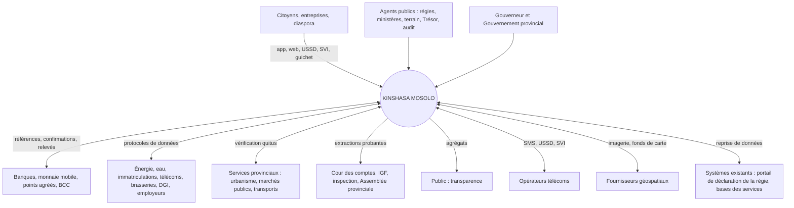

## 28.4 Architecture des conteneurs

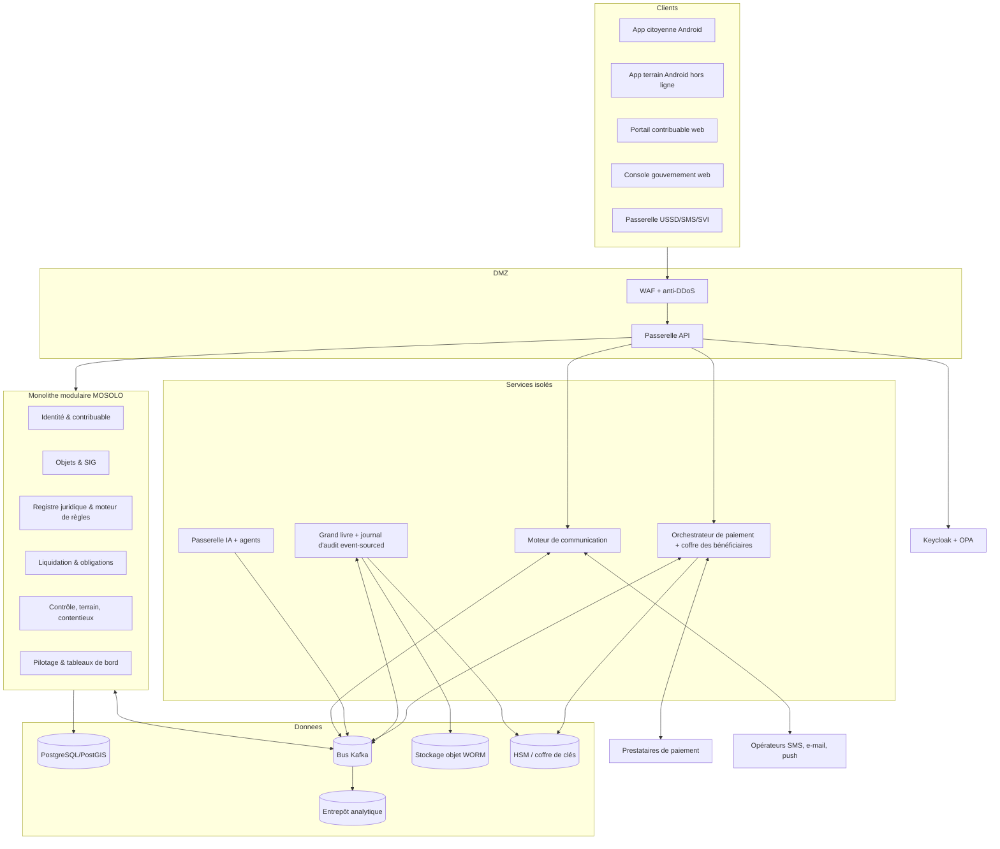

## 28.5 Architecture des domaines et flux de données

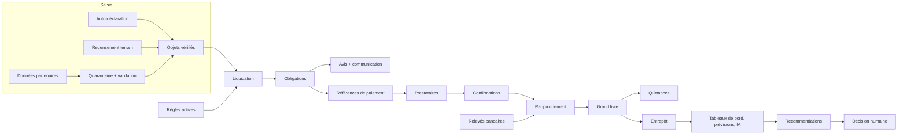

## 28.6 Séquence de synchronisation terrain

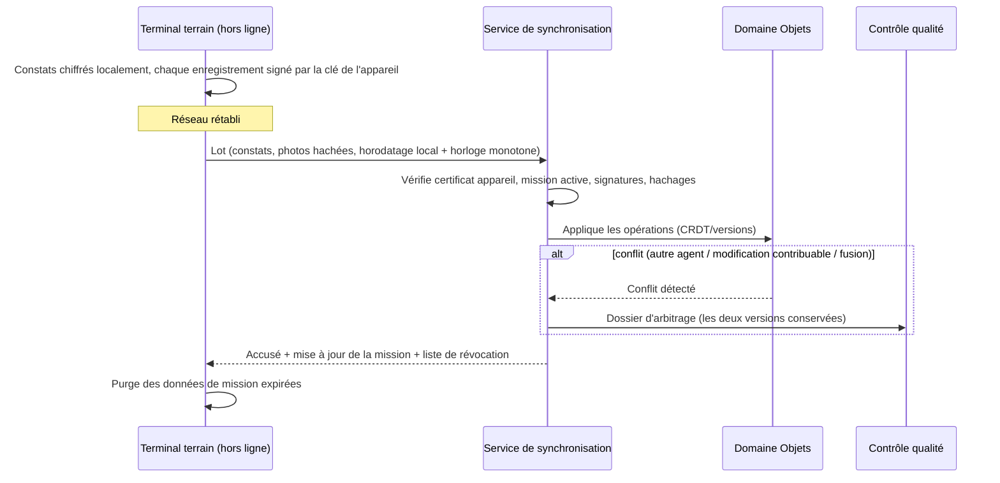

**Règles de résolution des conflits.**

| Cas | Règle |
|---|---|
| Deux agents inspectent la même propriété | Les deux constats sont conservés ; si divergents sur un champ fiscal, arbitrage par le superviseur ; jamais de « dernier écrit gagne » sur un champ fiscal |
| Le contribuable a modifié ses données pendant que l'agent était hors ligne | La déclaration et le constat coexistent avec leur statut probant (déclaré / observé) ; l'écart est signalé |
| GPS imprécis | Constat accepté avec statut `LOCALISATION_APPROXIMATIVE` ; revue |
| Objets fusionnés entre-temps | Le constat est redirigé vers l'objet survivant via l'alias |
| Terminal perdu | Révocation du certificat, effacement à distance, données locales chiffrées et expirées ; les lots non synchronisés signés avant la déclaration de perte peuvent être acceptés après revue |

## 28.7 Flux de contrôle d'accès

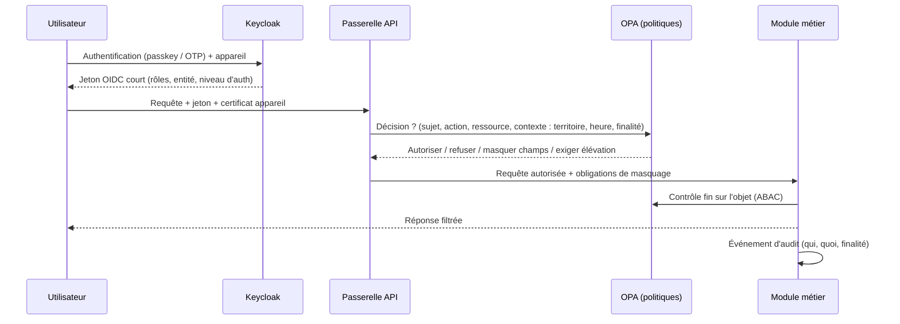

## 28.8 Reprise après sinistre

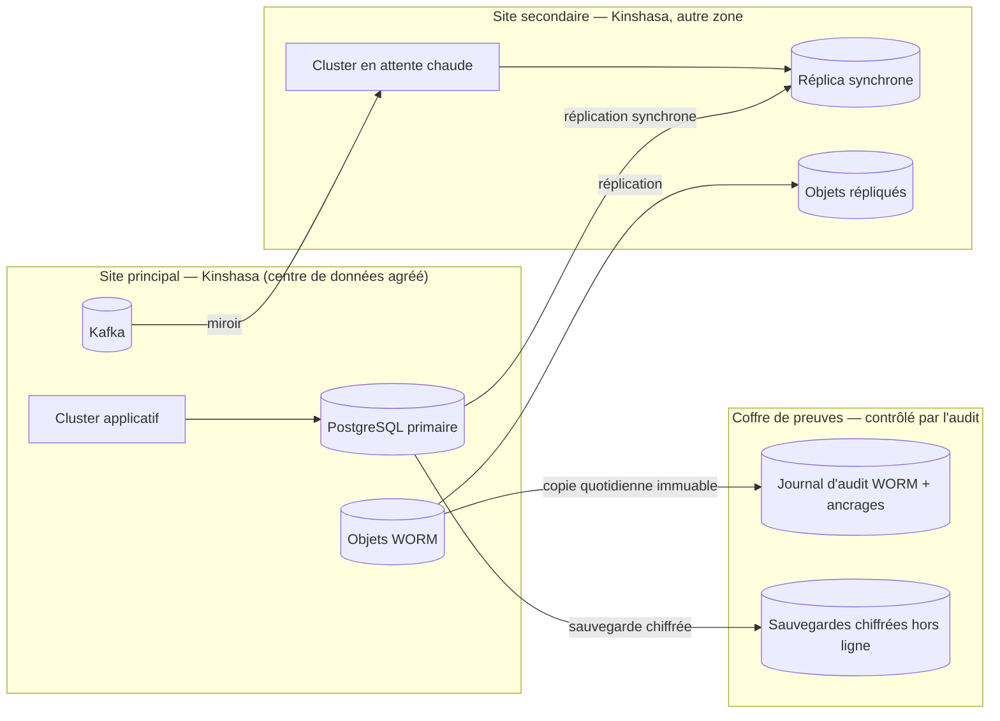

| Indicateur | Cible |
|---|---|
| Disponibilité des services contribuables | 99,5 % (pilote), 99,9 % (généralisation) |
| RPO (perte de données maximale) — paiements et grand livre | 0 (réplication synchrone) |
| RPO — autres données | ≤ 15 minutes |
| RTO (délai de reprise) | ≤ 4 heures (pilote), ≤ 1 heure (généralisation) |
| Test de restauration | Mensuel ; exercice de bascule complet semestriel |
| Mode dégradé | Guichets et agents en mode hors ligne ; références de paiement pré-émises ; protection automatique des échéances (`system.deadline_protection`) |

## 28.9 Rapports gouvernementaux

Exports normalisés vers la comptabilité publique et le budget (format à convenir avec le Trésor), rapports périodiques signés pour le Gouverneur, l'Assemblée provinciale, la Cour des comptes et l'inspection, jeux de données ouverts agrégés (format CSV et API publique en lecture).

# 29. Modèle de données conceptuel

## 29.1 Attributs communs obligatoires

Chaque entité porte : `id` (UUID), `entity_scope` (entité responsable), `created_at`, `created_by`, `version`, `status`, `valid_from` / `valid_to` lorsque temporel, `source` (déclaré, observé, vérifié, partenaire, système), `privacy_class` (C1–C5), et produit à chaque changement un événement d'audit (acteur, appareil, avant/après, motif, approbations, empreinte chaînée).

## 29.2 Diagramme des entités principales

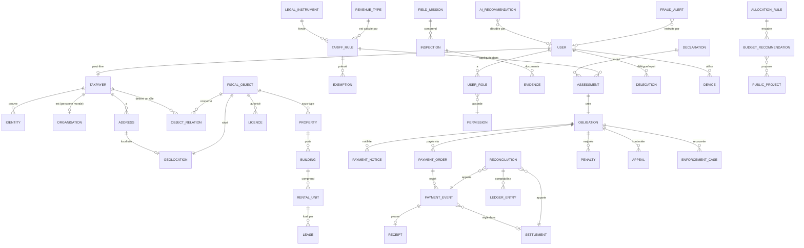

## 29.3 Dictionnaire des entités

Classes de confidentialité : **C1** public ; **C2** interne ; **C3** personnel ; **C4** personnel sensible / secret fiscal ; **C5** secret (clés, preuves d'enquête). Durées de conservation : **valeurs de conception** à valider au regard des textes sur la prescription et les archives publiques (J4, J8).

| Entité | Finalité | Champs importants | Relations | Validation | Cycle de vie | Audit | Conservation | Classe |
|---|---|---|---|---|---|---|---|---|
| **User** | Compte d'accès | login, auth_methods, entity, status, last_login | Taxpayer, UserRole, Device | Unicité ; MFA pour comptes de travail | INVITÉ→ACTIF→SUSPENDU→DÉSACTIVÉ | Toutes connexions et changements | Fin de fonction + 10 ans | C3 |
| **Taxpayer** | Compte fiscal unique | iuc, type (PP/PM), nif, legal_name, verification_level, language, preferred_currency_display | Identity, Address, ObjectRelation, Obligation | Clés fortes uniques ; anti-doublon | PROVISOIRE→ACTIF→SUSPENDU→CLÔTURÉ→ARCHIVÉ | Changements d'identité | Clôture + prescription + 10 ans | C4 |
| **Identity** | Preuve d'identité | doc_type, doc_number (haché + chiffré), issuer, expiry, image_ref, verified_by | Taxpayer | Format par type ; expiration | SOUMISE→VÉRIFIÉE / REJETÉE / EXPIRÉE | Consultation journalisée | Durée du compte | C4 |
| **Organisation** | Personne morale | rccm, nif, legal_form, representatives[] | Taxpayer, Delegation | RCCM/NIF | ACTIVE→DISSOUTE | Oui | Dissolution + 10 ans | C3 |
| **Address** | Adresse | commune, quartier, avenue, street, plot_ref, description, verification_status | Geolocation | Référentiel territorial | DÉCLARÉE→VÉRIFIÉE | Oui | Historisée | C3 |
| **Geolocation** | Position | geometry, accuracy_m, capture_method, captured_at, device_id | FiscalObject, Address | Plausibilité | — | Capture scellée | Avec l'objet | C3 |
| **FiscalObject** | Objet générateur | igf_uuid, territorial_code, category, status, probative_status | Relations, Obligations | Catégorie du référentiel | PROVISOIRE→VÉRIFIÉ→INACTIF→ARCHIVÉ | Oui | Permanent (archive) | C3 |
| **Property** | Parcelle | area_declared, area_measured, locality_rank, built, land_status_declared | Building | Superficie > 0 | — | Oui | Permanent | C3 |
| **Building** | Bâtiment | floors, use, footprint, year_est, photos | RentalUnit | — | — | Oui | Permanent | C2 |
| **RentalUnit** | Unité | type, area, use, occupancy_status | Lease | — | VACANTE / OCCUPÉE | Oui | Permanent | C3 |
| **Lease** | Bail | lessor, lessee, rent (Money), periodicity, start, end, evidence, source | RentalUnit, Obligation | Loyer > 0 ; dates cohérentes | DÉCLARÉ→VÉRIFIÉ→TERMINÉ / CONTESTÉ | Oui | Fin + prescription + 5 ans | C4 |
| **Business** | Entreprise / établissement | trade_name, activity_codes, premises[] | Activity, Licence | — | ACTIVE→CESSÉE | Oui | Cessation + 10 ans | C3 |
| **Activity** | Activité économique | code, description, location, start | Business | Nomenclature d'activités | — | Oui | Idem | C3 |
| **Vehicle** | Véhicule | plate, vin (haché), category, power, use | ObjectRelation | Format de plaque | ACTIF→MUTÉ→RETIRÉ | Oui | Retrait + 10 ans | C3 |
| **Advertisement** | Support publicitaire | faces, area_m2, type, illuminated, permit_ref | Licence | — | — | Oui | Retrait + 10 ans | C2 |
| **Antenna** | Site télécom | operator, structure_type, height, co_located | Licence | — | — | Oui | Idem | C2 |
| **Vessel** | Embarcation | registration, type, capacity, home_port | — | — | — | Oui | Idem | C2 |
| **Concession** | Concession | title_ref, type, area_ha, holder | — | — | — | Oui | Idem | C2 |
| **Licence / Permit** | Titre / autorisation | type, valid_from, valid_to, conditions, status | FiscalObject | Dates | DEMANDÉ→DÉLIVRÉ→EXPIRÉ / SUSPENDU / RETIRÉ | Oui | Expiration + 10 ans | C2 |
| **LegalInstrument** | Texte | type, number, date, title, official_copy_hash, status | TariffRule | Pièce officielle | À_VÉRIFIER→EN_VIGUEUR→MODIFIÉ→ABROGÉ | Oui | Permanent | C1 |
| **RevenueType** | Nature de recette | code (non réutilisable), label, category (§ 6.11), administering_entity | TariffRule | Code unique | ACTIF→CLOS | Oui | Permanent | C1 |
| **TariffRule** | Règle exécutable | 20 champs de la fiche (§ 6.12) | LegalInstrument, Exemption | Tests juridiques verts ; 4 approbateurs | § 6.12 | Chaque version | Permanent | C1 |
| **Exemption** | Exonération | legal_basis, beneficiary, scope, from, to, evidence, approvals | TariffRule, Obligation | Fondement légal | DEMANDÉE→ACCORDÉE / REFUSÉE→EXPIRÉE / RETIRÉE | Oui, renforcé | Fin + prescription + 10 ans | C4 |
| **Declaration** | Déclaration | period, content, submitted_by, channel | Assessment | Complétude | BROUILLON→DÉPOSÉE→RECTIFIÉE | Oui | Prescription + 10 ans | C4 |
| **Assessment** | Liquidation | inputs_snapshot, rule_version, formula_trace, result, computed_by | Obligation | Déterminisme | CALCULÉE→ÉMISE→RECTIFIÉE / ANNULÉE (contre-acte) | Trace complète | Prescription + 10 ans | C4 |
| **Obligation** | Dette | amount (Money), due_date, status, balance | Notice, Payment, Appeal | Montant ≥ 0 | ÉMISE→EXIGIBLE→PARTIELLEMENT_PAYÉE→SOLDÉE / EN_RETARD / CONTESTÉE / ADMISE_EN_NON_VALEUR | Oui | Solde + prescription + 10 ans | C4 |
| **PaymentNotice** | Avis | number, pdf_ref, signature, delivery_proofs | Obligation | Mentions légales | ÉMIS→DÉLIVRÉ→LU | Oui | Idem | C4 |
| **PaymentOrder** | Référence de paiement | reference, amount, currency, beneficiary_alias, expiry, idempotency_key | PaymentEvent | Montant = solde ou panier explicite | ACTIVE→UTILISÉE / EXPIRÉE | Oui | 10 ans | C3 |
| **PaymentEvent** | Événement prestataire | provider, provider_txn_id (unique), amount, signature, nonce, received_at, state | Receipt, Reconciliation | Signature ; unicité | § 18.4 | Oui | 10 ans | C3 |
| **Settlement** | Règlement bancaire | account_alias, statement_line, value_date, amount | Reconciliation | — | REÇU→APPARIÉ | Oui | 10 ans | C2 |
| **Reconciliation** | Appariement | links, tolerance_used, status, resolver, approver | LedgerEntry | Équilibre | AUTO / EXCEPTION→RÉSOLUE | Oui | 10 ans | C2 |
| **LedgerEntry** | Écriture | journal, debit, credit, amount, links, day_hash | — | Débit = crédit | Ajout seul | Chaîné | 10 ans minimum | C2 |
| **Receipt** | Quittance | number, payment_event, qr_payload, signature, status | PaymentEvent | Émission seulement si état autorisé | PROVISOIRE→DÉFINITIVE / ANNULÉE / REMPLACÉE / SUSPECTE | Oui | 10 ans | C3 |
| **Inspection** | Constat | mission, object, observations, gps, photos, agent, device | Evidence | Plausibilité | BROUILLON→SYNCHRONISÉ→VALIDÉ / REJETÉ | Oui | Prescription + 10 ans | C4 |
| **FieldMission** | Mission | polygon, objects[], team, window, status | Inspection | — | PLANIFIÉE→EN_COURS→CLOSE | Oui | 5 ans | C2 |
| **Evidence** | Preuve | type, file_ref, sha256, captured_at, device, seal | Inspection, Appeal | Hachage | SCELLÉE | Oui | Avec le dossier | C4 |
| **Notification** | Message | event_code, channel, recipient, template_version, status, proof | — | Modèle approuvé | § 11.4.7 | Oui | 5 ans (10 ans pour avis légaux) | C3 |
| **Appeal** | Réclamation | reason_code, submitted_at, evidence, instructor, decider, decision | Obligation | Délai | § 22.2 | Oui | Décision + 10 ans | C4 |
| **Penalty** | Pénalité | legal_basis, computation, decided_by | Obligation | Base légale | PROPOSÉE→DÉCIDÉE→ANNULÉE | Oui | Idem | C4 |
| **EnforcementCase** | Dossier d'exécution | measures[], authority, status | Obligation | Procédure | OUVERT→DÉCIDÉ→LEVÉ / CLOS | Oui | Clôture + 10 ans | C4 |
| **AllocationRule** | Clé légale de répartition | legal_basis, shares, effective dates | — | Somme = 100 % | Versionnée | Oui | Permanent | C1 |
| **BudgetRecommendation** | Scénario d'emploi des fonds | available_amount, projects, rationale, model_version | PublicProject | — | PROPOSÉE→EXAMINÉE→RETENUE / ÉCARTÉE | Oui | 10 ans | C2 |
| **PublicProject** | Projet | location, cost, recurrent_cost, readiness, indicators | — | — | IDÉE→PRÊT→FINANCÉ→RÉALISÉ | Oui | Permanent | C1 |
| **UserRole / Permission** | Habilitation | role, scope attributes, from, to, granted_by | User | Incompatibilités | ACCORDÉE→EXPIRÉE / RETIRÉE | Oui | 10 ans | C2 |
| **Delegation** | Délégation | delegator, delegate, scope, from, to, reason | User | Non re-déléguable | ACTIVE→EXPIRÉE / RÉVOQUÉE | Oui | 10 ans | C2 |
| **Device** | Terminal | certificate, owner, mdm_status, last_sync | User | Enrôlement | ENRÔLÉ→RÉVOQUÉ | Oui | 5 ans | C2 |
| **AIRecommendation** | Sortie d'IA | agent, model_version, inputs_ref, output, explanation, confidence, human_decision | User | — | ÉMISE→ACCEPTÉE / MODIFIÉE / REJETÉE | Oui | 10 ans | C2–C4 |
| **FraudAlert** | Alerte | rule_or_model, score, factors, subject_refs, investigator | — | — | OUVERTE→INSTRUITE→CLASSÉE / FONDÉE | Oui | 10 ans | C5 |
| **AuditEvent** | Journal | actor, action, resource, before_hash, after_hash, purpose, approvals, prev_hash, signature | — | Chaîne continue | Ajout seul | — | Permanent (archives) | C5 |
| **Money** (type valeur) | Montant | amount (décimal), currency (ISO 4217) | — | Pas d'opération entre devises sans conversion | — | — | — | — |
| **ExchangeRate** | Taux officiel | pair, rate, date, source, signature | — | Source officielle | Ajout seul | Oui | Permanent | C1 |

# 30. Catalogue des API

## 30.1 Normes d'interface

REST/JSON versionné (`/v1`), spécification OpenAPI 3.1 publiée (`specs/openapi.yaml`), OAuth 2.1 / OIDC, mTLS pour les partenaires sensibles, jetons à portée minimale (scopes), en-tête `Idempotency-Key` obligatoire sur toute création financière, `X-Request-Id` de corrélation, pagination par curseur, erreurs au format RFC 9457 (`application/problem+json`), limites de débit par client, signatures de messages (JWS détaché) pour les rappels prestataires, horodatage serveur de référence, langue par `Accept-Language`, montants au format `{ "amount": "1250000.00", "currency": "CDF" }`.

## 30.2 Catalogue

| # | Méthode et route | Objet | Acteur autorisé | Idempotence | Événement d'audit |
|---|---|---|---|---|---|
| 1 | `POST /v1/registrations` | Inscription | Public (OTP) | Oui | `account.registration.requested` |
| 2 | `POST /v1/identity-verifications` | Vérification d'identité | Contribuable, guichet | Oui | `identity.verification.submitted` |
| 3 | `POST /v1/account-recoveries` | Récupération de compte | Contribuable | Oui | `auth.recovery.requested` |
| 4 | `POST /v1/fiscal-objects` | Déclaration / création d'objet | Contribuable, agent | Oui | `object.declared` |
| 5 | `POST /v1/properties` | Enregistrement de parcelle / bâtiment / unités | Contribuable, agent | Oui | `object.declared` |
| 6 | `POST /v1/object-relations` | Demande de rattachement (rôle) | Contribuable | Oui | `object.link.requested` |
| 7 | `POST /v1/leases` | Déclaration de bail | Bailleur, locataire | Oui | `lease.declared` |
| 8 | `POST /v1/activities` | Enregistrement d'activité | Contribuable, agent | Oui | `object.declared` |
| 9 | `POST /v1/assessments:calculate` | Calcul (simulation ou liquidation) | Moteur, contrôleur | Oui | `assessment.calculated` |
| 10 | `POST /v1/legal-rules` · `POST /v1/legal-rules/{id}:submit` · `:approve` · `:publish` | Cycle de publication de règle | Juristes, validateur, autorité | Oui | `rule.*` |
| 11 | `POST /v1/obligations/{id}/payment-orders` | Création de référence de paiement | Contribuable, mandataire, guichet | **Obligatoire** | `payment.reference.issued` |
| 12 | `POST /v1/providers/{provider}/callbacks` | Confirmation prestataire | Prestataire (mTLS + JWS) | Par `provider_txn_id` | `payment.confirmed` |
| 13 | `POST /v1/settlements/statements` | Import de relevé bancaire | Banque, Trésor | Par identifiant de relevé | `settlement.received` |
| 14 | `POST /v1/reconciliations:run` · `PATCH /v1/reconciliation-exceptions/{id}` | Rapprochement, traitement d'exception | Trésor (quatre yeux) | Oui | `reconciliation.*` |
| 15 | `GET /v1/public/receipts/{code}` | Vérification publique de quittance | Public | — | `receipt.verified` |
| 16 | `POST /v1/field-sync/batches` | Synchronisation terrain | Terminal enrôlé | Par identifiant de lot | `mission.sync.completed` |
| 17 | `POST /v1/appeals` · `POST /v1/appeals/{id}:decide` | Réclamation, décision | Contribuable ; autorité | Oui | `appeal.*` |
| 18 | `POST /v1/inspections` | Constat | Agent, contrôleur | Oui | `inspection.created` |
| 19 | `GET /v1/fraud-alerts` · `PATCH /v1/fraud-alerts/{id}` | Alertes de fraude | Enquêteur | Oui | `fraud.*` |
| 20 | `GET /v1/dashboards/{board}` | Tableaux de bord | Selon rôle | — | `dashboard.viewed` (C4 uniquement) |
| 21 | `POST /v1/forecasts:run` | Prévision | Direction financière | Oui | `ai.forecast.updated` |
| 22 | `POST /v1/allocation-scenarios` | Scénario d'emploi des fonds | Planification | Oui | `allocation.scenario.created` |
| 23 | `GET /v1/ai-recommendations` · `POST /v1/ai-recommendations/{id}:decide` | Recommandations IA | Utilisateur habilité | Oui | `ai.recommendation.decided` |
| 24 | `GET /v1/clearances/{code}:verify` | Vérification de quitus | Service habilité | — | `clearance.verified_by_service` |
| 25 | `POST /v1/beneficiary-accounts/change-requests` · `:approve` | Changement de compte bénéficiaire | Trésor ; gestionnaires du coffre | Oui | `beneficiary.change.*` |
| 26 | `POST /v1/refunds` · `:approve` | Remboursement | Régie ; Trésor | Oui | `refund.*` |
| 27 | `GET /v1/exchange-rates/{date}` | Taux officiels | Tous | — | — |
| 28 | `POST /v1/notifications:test` | Envoi de test d'un modèle | Administrateur communication | Oui | `notification.test_sent` |

## 30.3 Spécifications de référence

**Création d'une référence de paiement**

```http
POST /v1/obligations/OBL-2027-IF-00012345/payment-orders
Authorization: Bearer <jeton contribuable, scope payments:create>
Idempotency-Key: 5f0c2f7e-2b1a-4b8e-9a51-3c9d2e7a1b10
Content-Type: application/json

{ "channel": "MOBILE_MONEY", "payer_msisdn": "+243810000000", "display_currency": "CDF" }
```

```json
{
  "payment_reference": "PR-7F3K-9Q2M",
  "obligation_id": "OBL-2027-IF-00012345",
  "amount": { "amount": "150.00", "currency": "USD" },
  "indicative_amount": { "amount": "340162.50", "currency": "CDF", "fx_rate_date": "2027-02-10", "fx_source": "BCC" },
  "beneficiary_alias": "KIN-DGIPK-RECETTES-01",
  "expires_at": "2027-02-11T23:59:59+01:00",
  "status": "ACTIVE",
  "ussd_instructions": "Composez *XXX# et saisissez PR7F3K9Q2M"
}
```

| Aspect | Spécification |
|---|---|
| Validation | Obligation exigible et non soldée ; montant = solde (pas de saisie libre) ; canal activé ; payeur autorisé (titulaire ou mandataire) |
| Idempotence | Même clé + même contenu → même réponse ; même clé + contenu différent → `409` |
| Sécurité | Bénéficiaire résolu dans le coffre (alias), jamais fourni par le client ; limite de débit ; journal |
| Erreurs | `400` validation ; `401/403` authentification/portée ; `404` obligation inconnue ; `409` conflit d'idempotence ou référence active existante ; `422` obligation non payable (contestée avec effet suspensif, soldée) ; `429` débit |

**Rappel d'un prestataire de paiement**

```http
POST /v1/providers/mm-operator-a/callbacks
(mTLS : certificat client du prestataire)
X-Signature: <JWS détaché, clé du prestataire>
X-Nonce: 8c1e…   X-Timestamp: 2027-02-10T09:14:03Z

{ "provider_txn_id": "MP270210.0914.A1B2C3", "payment_reference": "PR-7F3K-9Q2M",
  "amount": { "amount": "150.00", "currency": "USD" }, "status": "SUCCESS",
  "payer_msisdn_hash": "sha256:…", "completed_at": "2027-02-10T09:14:01Z" }
```

Traitement : vérification du certificat, de la signature, de la fenêtre temporelle (± 5 minutes), de l'unicité du nonce et de `provider_txn_id` ; contrôle montant/référence ; **appel de contrôle** de l'état auprès du prestataire ; puis état `CONFIRME` et quittance provisoire. Réponse `200` idempotente même en cas de rejeu (sans double effet).

**Vérification publique de quittance**

```http
GET /v1/public/receipts/Q27KIN0001234567
```

```json
{ "status": "VALID", "settlement_status": "RECONCILED", "revenue_category": "Impôt foncier 2027",
  "amount": { "amount": "150.00", "currency": "USD" }, "paid_on": "2027-02-10",
  "beneficiary_administration": "DGIPK", "taxpayer_ref_suffix": "…7K2Q", "verified_at": "2027-03-01T10:22:00Z" }
```

La spécification OpenAPI complète des routes principales figure dans `specs/openapi.yaml` (dépôt du programme).

# 31. Architecture de sécurité

## 31.1 Zéro confiance

Aucun réseau n'est présumé sûr : chaque requête est authentifiée, autorisée et chiffrée ; chaque appareil est identifié ; chaque accès est minimal et journalisé.

| Domaine | Exigences |
|---|---|
| Authentification | MFA pour tous les comptes de travail ; **passkeys (WebAuthn) ou clés matérielles FIDO2** obligatoires pour les rôles sensibles (Trésor, coffre, juristes publicateurs, administrateurs, direction) ; OTP par SMS réservé aux contribuables et comme facteur de secours |
| Autorisation | RBAC + ABAC centralisés (OPA) ; décisions journalisées |
| Chiffrement en transit | TLS 1.3 ; mTLS entre services et avec les partenaires |
| Chiffrement au repos | Bases, sauvegardes, stockage objet et terminaux (SQLCipher, chiffrement Android) ; chiffrement champ par champ des données C4 |
| Gestion des clés | HSM (FIPS 140-2 niveau 3 ou équivalent) pour les clés de signature des quittances, du grand livre et du journal ; rotation ; séparation des gardiens de clés |
| Secrets | Coffre de secrets ; aucun secret dans le code ni dans les images |
| Accès privilégiés | PAM : juste-à-temps, sessions enregistrées, double approbation pour la production |
| Réseau | Segmentation (DMZ, applicatif, données, administration, paiement isolé) ; micro-segmentation entre services |
| API | Passerelle, schémas stricts, limites de débit, détection d'abus, protections OWASP API Top 10 |
| Périmètre | WAF, anti-DDoS (fournisseur et capacité locale), géofiltrage adaptatif pour l'administration |
| Développement sécurisé | Revue de code obligatoire, SAST, DAST, analyse des dépendances, SBOM, artefacts signés, environnements séparés, données de test anonymisées |
| Tests | Test d'intrusion indépendant avant le pilote et avant chaque version majeure ; programme de divulgation coordonnée des vulnérabilités |
| Vulnérabilités | Correctifs critiques sous 7 jours, élevés sous 30 jours |
| Détection | SIEM et SOC (interne ou prestataire sous contrôle provincial) ; règles de corrélation spécifiques (changements de bénéficiaire, pics d'annulations, accès massifs) |
| Réponse aux incidents | Plan, astreinte, exercices semestriels, communication (§ 11.4) |
| Forensique | Journaux conservés et scellés, horloges synchronisées, procédures de collecte de preuves |
| Fuites de données | Masquage, filigranes, limites d'export, détection de volumes anormaux |
| Sauvegardes | Immuables, chiffrées, hors ligne, restaurations testées |
| Continuité | § 28.8 |

## 31.2 Exigences non fonctionnelles clés

| Exigence | Cible |
|---|---|
| Temps de réponse API (p95) | < 500 ms (lecture), < 1 s (écriture) |
| Délai confirmation → quittance provisoire | < 60 s |
| Capacité de pointe (échéance de février) | Dimensionnée pour 20 fois le trafic moyen, testée en charge |
| Application terrain | Android 9+ ; fonctionne 5 jours sans réseau ; synchronisation reprenable |
| Accessibilité | WCAG 2.1 AA pour le web ; tailles de police et contrastes adaptés au plein soleil sur mobile |
| Données mobiles | Application citoyenne < 25 Mo ; pages web allégées (< 500 Ko) |

# 32. Gouvernance des données

| Principe | Mise en œuvre |
|---|---|
| Propriété | **La Province est propriétaire de toutes les données**, y compris celles produites par les prestataires |
| Finalité | Registre des traitements : finalité, base légale, catégories de données, destinataires, durée |
| Minimisation | Revue de chaque champ ; suppression des champs sans finalité |
| Classification | C1 à C5 ; contrôles associés (masquage, chiffrement, journalisation) |
| Qualité | Propriétaires de données par domaine ; règles de qualité ; tableau de bord qualité (complétude, exactitude, fraîcheur, doublons) |
| Durées de conservation | Tableau § 29.3, validé par le service juridique et les archives |
| Droits des personnes | Accès, rectification, information, opposition lorsque la loi le permet ; délais de réponse |
| Partage | Uniquement par protocole signé, API contrôlée, minimisation, journal ; information des personnes (`privacy.data_shared_with_partner`) |
| Données partenaires | Quarantaine, validation, statut « partenaire » jusqu'à vérification |
| Analyse d'impact | Avant le pilote, avant chaque nouveau partage, avant chaque nouveau modèle d'IA |
| Délégué à la protection des données | Nommé dès la phase 0, indépendant, rattaché au Comité de pilotage |
| Données ouvertes | Agrégats anonymisés (seuils minimaux, contrôle de ré-identification) |

# 33. Hébergement et souveraineté

## 33.1 Options d'hébergement

| Option | Description | Avantages | Risques | Verdict |
|---|---|---|---|---|
| H1 — Centre de données gouvernemental provincial | Salles de la Province | Contrôle maximal | Capacités, énergie, compétences à construire | Cible à moyen terme |
| H2 — Centre de données commercial agréé à Kinshasa (colocation) avec matériel propriété de la Province | Infrastructure louée, matériel et clés à la Province | Rapide, contrôle des clés, résidence en RDC | Dépendance au fournisseur de colocation (réversible) | **Recommandé pour le pilote et la généralisation** |
| H3 — Nuage public hors RDC | Services gérés | Rapidité | Résidence des données, dépendance, droit étranger | **Exclu pour les données C3–C5** ; possible pour le CDN public et l'anti-DDoS sans données personnelles |
| H4 — Hybride | H2 principal + site secondaire local + coffre de preuves contrôlé par l'audit | Résilience | Coordination | **Architecture cible** |

## 33.2 Exigences de souveraineté

| Exigence | Traduction contractuelle et technique |
|---|---|
| Résidence des données | Données C3–C5 et sauvegardes hébergées en RDC ; aucun transfert sans base légale et décision écrite |
| Clés | Clés de chiffrement et de signature générées et détenues dans des HSM de la Province ; gardiens de clés nommés par arrêté |
| Accès des fournisseurs | Aucun accès permanent ; accès juste-à-temps, approuvé, enregistré ; interdiction d'accès depuis l'étranger sauf urgence approuvée |
| Code source | Propriété de la Province ou licence perpétuelle, irrévocable, cessible, avec droit de modification ; dépôt du code, des scripts d'infrastructure et de la documentation dans un dépôt contrôlé par la Province à chaque version ; séquestre complémentaire |
| Standards ouverts | PostgreSQL, OpenAPI, OGC, OIDC, formats ouverts d'export |
| Portabilité | Export complet documenté (données, schémas, règles, journaux, pièces) en moins de 30 jours |
| Plan de sortie | Plan de réversibilité testé avant la généralisation ; transfert de compétences ; assistance à la reprise pendant 12 mois |
| Indépendance | Aucun composant propriétaire sans alternative ; pas de dépendance à un seul prestataire de paiement ou de SMS |
| Compétences | Équipe provinciale (DSI MOSOLO) formée et associée dès la phase 1 ; cible : exploitation courante par la Province à 36 mois |

# 34. Feuille de route de mise en œuvre


## 34.1 Contrainte de calendrier

Nous sommes fin septembre 2026. La prochaine campagne annuelle de l'impôt foncier et de l'IRL a son échéance en février 2027. **Il est irréaliste de livrer la plateforme complète avant cette date.** La feuille de route distingue donc :

- une **version R0 « recensement »** (application terrain hors ligne, registre des objets, référentiel territorial, carte) opérationnelle en décembre 2026 dans des quartiers échantillons des quatre communes pilotes ;
- un **test partiel de février 2027** : pour les objets recensés, préparation d'avis pré-remplis et de références de paiement, soit par MOSOLO R1 si prêt, **soit par export vers la plateforme de déclaration existante de la régie** (plan de repli) ; mesure des effets du recensement sur les déclarations ;
- un **pilote complet de 180 jours** (février–juillet 2027) avec la chaîne financière complète ;
- l'extension et la généralisation **conditionnées à des résultats audités**.

## 34.2 Phases

| Phase | Durée | Objectifs | Livrables | Autorité responsable | Dépendances | Catégories de budget | Risques | Critères de succès | Porte d'approbation |
|---|---|---|---|---|---|---|---|---|---|
| **0 — Mandat et mobilisation juridique** | Oct.–nov. 2026 (2 mois) | Mandat, gouvernance, relevé juridique, inventaire des systèmes, base de référence, contrôles de risque | Arrêté de mandat ; comité de pilotage ; relevé juridique certifié v1 (IF, IRL, véhicules) ; inventaire des recettes, comptes et systèmes ; protocole de base de référence ; délégué à la protection des données nommé | Gouverneur ; ministre provincial des Finances | Décisions 1 à 5 (ch. 47) | Programme, juridique, audit de base | Retard de décision ; textes introuvables | Relevé juridique certifié pour les 3 impôts ; base de référence lancée | G0 : Comité de pilotage |
| **1 — Découverte et architecture** | Nov. 2026–janv. 2027 (3 mois) | Cartographie des processus, consultations, audit des systèmes existants (dont la plateforme de déclaration de la régie), audit des données, recherche utilisateurs, exigences, architecture de sécurité, choix des quartiers pilotes | Processus cibles ; dossier d'architecture ; plan de migration/intégration de l'existant ; analyse d'impact protection des données ; plan de sécurité ; backlog priorisé | Directeur de programme ; DGIPK ; DGTK ; DSI | Phase 0 | Conception, études utilisateurs | Résistance des services ; données inexploitables | Architecture validée ; plan d'intégration de l'existant accepté par la régie | G1 : Comité de pilotage + comité de sécurité |
| **2 — Socle (R0 → R1)** | Déc. 2026–mai 2027 (6 mois) | Identité, compte, objets, règles, paiements, quittances, SIG, audit, application terrain, tableaux de bord | R0 (déc. 2026) : recensement ; R1 (avril 2027) : chaîne complète IF/IRL/véhicules | Directeur de programme | Hébergement ; conventions bancaires ; règles certifiées | Développement, hébergement, sécurité, équipements | Glissement ; intégrations bancaires lentes | Tests d'acceptation ch. 41 au vert ; test d'intrusion sans vulnérabilité critique | G2 : mise en production (comité des changements) |
| **3 — Pilote** | Févr.–juil. 2027 (180 jours) | Démontrer, dans 4 communes représentatives, les gains nets, le rapprochement et la maîtrise des risques | Rapport d'évaluation indépendant | Comité de pilotage ; évaluateur indépendant | R1 ; équipes terrain ; financement des moyens physiques | Terrain, communication, évaluation | Faible adoption ; incidents | Critères § 45.3 | G3 : décision de généralisation par le Gouverneur, sur rapport indépendant |
| **4 — Extension** | Août 2027–mars 2028 | Nouvelles communes, recettes (patente, publicité, antennes, marchés, stationnement), canaux, intégrations | R2, R3 | Régies ; ministères | Actes (zonage, tarifs) ; protocoles | Terrain, intégrations | Dispersion | Couverture et rapprochement tenus à l'échelle | G4 |
| **5 — Généralisation** | Janv. 2028–déc. 2028 | 24 communes ; toutes recettes certifiées ; reprise de l'existant | R4 ; décommissionnement contrôlé des systèmes remplacés | Gouvernement provincial | Budget ; équipes provinciales formées | Extension, transfert de compétences | Charge ; qualité | Exercice de réversibilité réussi | G5 |
| **6 — Optimisation** | Continu à partir d'oct. 2028 | Amélioration continue par les données, l'IA et les résultats | Revues trimestrielles | Comité de pilotage | — | Exploitation | Routine, dérive | Recettes nettes vérifiées en hausse ; coût de collecte en baisse | Revue annuelle |

## 34.3 Plans d'action datés

| Horizon | Actions |
|---|---|
| **30 jours** | Arrêté de mandat ; comité de pilotage installé ; directeur de programme et délégué à la protection des données nommés ; lettre aux services juridiques pour le relevé certifié ; inventaire des comptes publics de recettes ; rencontre avec la direction de la DGIPK et de la DGTK sur la plateforme existante ; choix des quartiers échantillons ; cahier des charges de l'évaluateur indépendant |
| **90 jours** | Relevé juridique v1 certifié (IF, IRL, véhicules) ; base de référence 2023–2025 établie pour les communes pilotes ; R0 recensement en service ; 30 % des quartiers échantillons recensés ; conventions avec au moins deux banques et deux émetteurs de monnaie mobile en cours ; analyse d'impact protection des données ; hébergement installé |
| **180 jours** | R1 en production ; campagne de février 2027 mesurée ; pilote en cours ; rapprochement quotidien automatisé pour les flux couverts ; tableau de bord du Gouverneur en service ; premier rapport intermédiaire (J+90 du pilote) |
| **12 mois** | Pilote évalué par un évaluateur indépendant ; décision de généralisation ; R2 (patente, publicité, antennes, marchés) ; premier tableau de transparence publié |
| **24 mois** | Généralisation aux 24 communes en cours ; recettes certifiées toutes intégrées ; exercice de réversibilité ; équipe provinciale capable d'exploiter la plateforme |

# 35. Modèle opérationnel

| Fonction | Rattachement | Missions |
|---|---|---|
| **Bureau du programme MOSOLO** | Comité de pilotage | Planning, budget, risques, conduite du changement, relation avec les partenaires |
| **Cellule juridique et tarifaire** | Ministère provincial des Finances | Registre juridique, fiches de règles, tests juridiques |
| **Centre de services contribuables** | Régies | Guichets, centre d'appels, SVI, traitement des demandes |
| **Opérations terrain** | Régies | Superviseurs, agents, sous-traitants accrédités, contrôle qualité |
| **Salle de contrôle financière** | Trésor provincial | Rapprochement, exceptions, clôtures |
| **Cellule de renseignement anti-fraude** | Inspection / audit interne | Alertes, enquêtes |
| **Cellule données et IA** | Programme puis DSI provinciale | Qualité des données, modèles, tableaux de bord |
| **DSI MOSOLO** | Province | Exploitation, sécurité, support ; montée en compétences progressive |
| **Centre de sécurité (SOC)** | RSSI | Surveillance, réponse aux incidents |
| **Délégué à la protection des données** | Comité de pilotage | Conformité |

Rythmes : point quotidien de la salle de contrôle (exceptions) ; revue hebdomadaire des opérations ; comité mensuel de performance présidé par le ministre des Finances ; revue trimestrielle du Gouverneur ; rapport trimestriel d'audit.

# 36. Gouvernance du programme

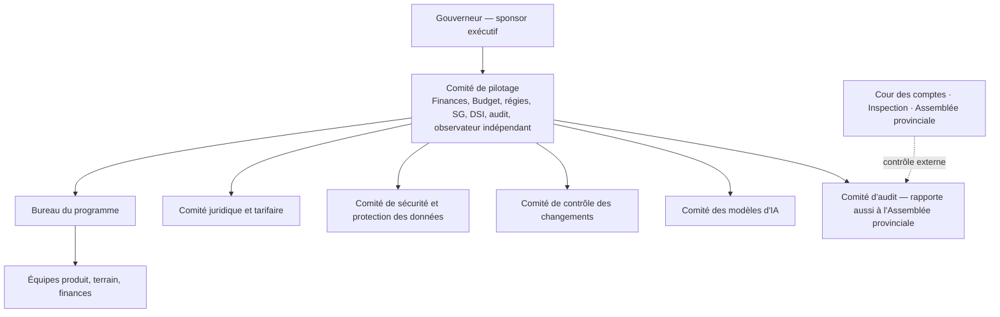

| Instance | Composition | Décisions |
|---|---|---|
| Comité de pilotage | Ministre des Finances (président), SG du Gouvernement, DG DGIPK, DG DGTK, Trésor, DSI, audit interne, directeur de programme, observateur indépendant (sans voix délibérative) | Priorités, portes d'approbation, budget, arbitrages |
| Comité juridique et tarifaire | Juristes, régies, finances | Fiches de règles, conflits de compétence |
| Comité de sécurité et protection des données | RSSI, délégué à la protection des données, DSI, audit | Politiques, incidents, analyses d'impact |
| Comité de contrôle des changements | Programme, DSI, sécurité, métier | Mises en production |
| Comité des modèles d'IA | Métier, données, audit, protection des données | Mise en service et retrait des modèles |
| Comité d'audit | Audit interne, inspecteur, personnalité indépendante | Plan d'audit, suites des rapports |

**Standard minimal de chaque module critique** (définition de « terminé ») : responsable métier nommé ; règles certifiées ; séparation des tâches testée ; événements d'audit complets ; tests automatisés ; test de sécurité ; documentation utilisateur et d'exploitation ; indicateurs ; plan de reprise.

# 37. Passation des marchés et modèle commercial

## 37.1 Comparaison des modèles

| Modèle | Description | Avantages | Risques pour la Province | Évaluation |
|---|---|---|---|---|
| Financement public intégral | La Province finance et fait réaliser | Contrôle total | Charge budgétaire initiale ; capacité de pilotage | Possible pour le socle |
| Licence + service géré | Logiciel sous licence, exploitation par le prestataire | Rapidité | Verrouillage, coûts récurrents, propriété du code | Acceptable seulement avec clauses fortes |
| PPP (Loi n° 18/016) | Partenaire finance, conçoit, exploite, rémunéré selon le contrat | Financement privé, engagement de performance | Complexité, durée, risque de rémunération excessive | Possible avec mise en concurrence |
| BOT (construire-exploiter-transférer) | Idem avec transfert à terme | Transfert final | Durée longue ; qualité au moment du transfert | Possible, durée courte |
| Contrat à la performance (pourcentage des recettes) | Rémunération indexée sur les recettes | Aligne les intérêts en apparence | **Fermage fiscal**, rémunération sur des recettes que la Province aurait perçues de toute façon, conflit avec l'unité de caisse, risque de gestion de fait, défiance des partenaires | **Déconseillé sous forme non plafonnée ou sur recettes brutes** |
| **Hybride recommandé** | Forfaits de réalisation et d'exploitation + prime de performance plafonnée sur recettes additionnelles nettes vérifiées | Maîtrise des coûts, incitation réelle, réversibilité | Mesure de la base de référence | **Recommandé** |

## 37.2 Analyse du modèle proposé dans le Cahier v2.9 (§ 37A)

Le Cahier des exigences v2.9 retient une proposition du promoteur : financement intégral du système numérique par le promoteur contre **10 % de toute recette générée par le système pendant 30 ans**, plus 10 % aux ministères de tutelle et 10 % aux agents et sous-traitants, exécutés par deux virements automatiques depuis le compte de recettes. Le présent document, conformément à la commande (« la rémunération à la performance doit être fondée sur une recette additionnelle nette vérifiée, avec base de référence, formule, exclusions, plafond, audit et durée fixe »), en fait l'analyse suivante :

| Point | Constat | Conséquence |
|---|---|---|
| Assiette | 10 % de **toute** recette rapprochée passant par MOSOLO, y compris les recettes que la Province percevait déjà avant le programme | Rémunération sur une base non additionnelle : à recettes constantes, la Province perd 10 % |
| Durée | 30 ans | Très au-delà de la durée de vie d'un système informatique ; engage cinq à six mandatures |
| Plafond | Aucun | Coût non borné |
| Exécution | Prélèvement automatique depuis le compte de recettes vers un compte privé | Contraire au principe de fonds publics sur comptes publics (P5) et exposé au regard de l'unité de caisse (LOFIP) et du risque de gestion de fait (Cour des comptes) |
| Rétrocessions de 10 % aux ministères et de 10 % aux agents | Affectation automatique hors procédure budgétaire | À fonder sur un texte ; sinon contraire à l'universalité budgétaire |
| Perception externe | Les partenaires techniques et financiers et l'évaluation TADAT regardent avec prudence les rémunérations privées indexées sur les recettes fiscales | Risque de réputation et de financement |
| Base juridique | Aucun texte identifié ne l'autorise ni ne l'interdit expressément (J11) | Avis juridique certifié indispensable avant toute signature |

**Recommandation.** Ne pas retenir le modèle 10/10/10/70 sous sa forme actuelle. Lui substituer le modèle hybride du § 37.3, qui préserve l'intérêt du partenaire à la réussite **sans prélèvement à la source**, avec une rémunération bornée et mesurée sur la seule valeur ajoutée. Si le Gouvernement souhaite néanmoins examiner une formule de partage, elle doit au minimum : (1) porter sur la **recette additionnelle nette vérifiée** et non sur la recette brute ; (2) être **plafonnée** en montant annuel et cumulé ; (3) avoir une **durée fixe courte** (5 à 7 ans) ; (4) être **payée sur crédit budgétaire** après certification, jamais par prélèvement automatique ; (5) être attribuée après **mise en concurrence** (marchés publics ou PPP) ; (6) être validée par un avis juridique certifié et, si nécessaire, par un acte de l'Assemblée provinciale.

## 37.3 Structure commerciale recommandée

| Composante | Nature | Mode de paiement |
|---|---|---|
| Forfait de réalisation | Prix ferme par lot (socle, R1, R2…), payé sur livrables acceptés | Budget d'investissement |
| Forfait d'exploitation et de maintenance | Prix annuel par niveau de service (disponibilité, support, correctifs) | Budget de fonctionnement, pénalités de SLA |
| Hébergement | Refacturation transparente au coût ou marché séparé | Idem |
| Prime de performance plafonnée | % de la **recette additionnelle nette vérifiée** au-delà de la base de référence | Payée annuellement après certification par l'auditeur indépendant ; plafond annuel ; durée 5 ans |
| Évolutions | Bordereau de prix unitaires (jours-personne par profil) fixé au contrat | Sur bons de commande approuvés |

**Formule de la prime (à ajuster en négociation).**

> Prime(année) = min( taux × max(0, RANV(année)) ; plafond annuel )
>
> RANV = Recettes rapprochées du périmètre − Base de référence ajustée − Recettes exclues − Remboursements et corrections
>
> Base de référence ajustée = moyenne des recettes rapprochées des 3 exercices antérieurs × (1 + inflation officielle) × (1 + effet des changements de taux décidés par la Province)
>
> Exclusions : effets de hausses de taux ou de nouvelles recettes créées par acte ; recettes exceptionnelles (arriérés de grands redevables recouvrés par voie judiciaire, régularisations imposées par un texte) ; effets de change

| Protection | Clause |
|---|---|
| Base de référence | Mesurée et certifiée par un auditeur indépendant avant démarrage |
| Audit | Droit d'audit de la Province, de la Cour des comptes et de l'inspection |
| Plafond | Annuel et cumulé |
| Durée | Fixe, sans reconduction tacite |
| Frais cachés | Interdiction de toute commission non inscrite au contrat ; commissions des canaux de paiement négociées séparément et publiées |
| Verrouillage | Propriété ou licence perpétuelle du code, dépôt à chaque version, formats ouverts |
| Données | Propriété exclusive de la Province ; interdiction de réutilisation |
| Coûts de changement | Bordereau de prix unitaires ; plafond annuel des évolutions |
| Sortie | Plan de réversibilité, assistance de 12 mois, prix fixé à l'avance |
| Dépendance | Transfert de compétences obligatoire ; indicateur d'autonomie de l'équipe provinciale |

## 37.4 Postes de coût à chiffrer

| Poste | Contenu | Inducteur de coût |
|---|---|---|
| Réalisation | Conception, développement, tests | Périmètre fonctionnel, nombre d'intégrations |
| Licences | Idéalement nulles (logiciels libres) ; composants commerciaux éventuels | Nombre d'utilisateurs, cœurs |
| Hébergement | Colocation, matériel, réseau, énergie | Volumétrie, redondance |
| Maintenance et support | Correctifs, évolutions mineures, support N2/N3 | Niveau de service |
| Intégrations | Banques, monnaie mobile, opérateurs, données partenaires | Nombre de partenaires |
| Coûts des canaux de paiement | Commissions par transaction | Volumes, négociation, **qui les supporte** (contribuable, Province) |
| Équipements terrain | Terminaux, batteries, imprimantes | Nombre d'agents |
| Plaques et cartes | Plaques fiscales, cartes MOSOLO | Nombre d'objets |
| SMS et communications | SMS, USSD, SVI | Nombre d'événements × canal (§ 11.4) |
| Formation | Parcours, formateurs, certification | Nombre d'utilisateurs |
| Cybersécurité | SOC, tests d'intrusion, HSM | Niveau de service |
| Évolutions | Demandes de changement | Bordereau |
| Migration de données | Reprise de l'existant | Qualité des sources |
| Audit | Auditeur indépendant, évaluateur du pilote | Périmètre |
| Sortie | Réversibilité | Fixé au contrat |

Référence de comparaison : le système de gestion des recettes de la ville de Kampala (eCitie) a été rapporté à environ 2,1 millions de dollars, tous postes confondus (développement, matériel, formation, données, sensibilisation) [PROBABLE] ; ce chiffre n'est pas transposable sans étude, la taille et le périmètre de Kinshasa étant très supérieurs.

# 38. Modèle financier

## 38.1 Établir la base de référence avant toute promesse

| Mesure | Définition | Source | Responsable |
|---|---|---|---|
| Contribuables enregistrés | Comptes actifs par catégorie | Bases des régies | DGIPK, DGTK |
| Objets imposables connus | Par type et commune | Bases, rôles | Régies |
| Liquidations annuelles | Montants émis par recette | Rôles, avis | Régies |
| Encaissements | Montants encaissés | Banques, Trésor | Trésor |
| Délais de règlement | Paiement → crédit du compte public | Relevés | Trésor |
| Paiements non rapprochés | Montants en suspens | Rapprochement | Trésor |
| Arriérés | Stock par âge | Régies | Régies |
| Exonérations | Nombre, montant, fondement | Régies | Audit |
| Annulations | Nombre, montant, motif | Régies | Audit |
| Coût de recouvrement et de collecte | Personnel, commissions, équipements | Finances | Finances |
| Pertes par fraude | Cas établis | Inspection | Audit |
| Délais de traitement | Demande → décision | Échantillon | Programme |

## 38.2 Formules

- Potentiel théorique = Σ objets × montant légal moyen dû
- Recette additionnelle attendue = potentiel × (conformité cible − conformité actuelle) − coût marginal de recouvrement
- **Recette additionnelle nette vérifiée (RANV)** = assiette vérifiée supplémentaire + gains de conformité + arriérés recouvrés + déperdition évitée + gains de rapprochement − coûts additionnels − remboursements − corrections
- Délai de retour = coût d'investissement cumulé / RANV annuelle moyenne

## 38.3 Scénarios


| Élément | Conservateur | Attendu | Transformationnel |
|---|---|---|---|
| Hypothèses | Conformité locative +3 à +5 points ; adoption lente ; protocoles tardifs | +10 à +15 points ; pilote réussi ; protocoles obtenus | +20 points et plus ; quitus généralisé ; grands redevables fiabilisés |
| Objets additionnels enregistrés | Faible | Moyen | Élevé |
| Amélioration du paiement | Faible | Moyenne | Forte |
| Réduction de la déperdition | Faible | Moyenne | Forte |
| Rapprochement automatique | 80 % | 95 % | 98 % |
| Recette brute additionnelle | Formule § 38.2 sur base mesurée | Idem | Idem |
| Coût de mise en œuvre | Complet | Complet | Complet + campagnes |
| Coût récurrent | Exploitation | Exploitation | Exploitation + terrain accru |
| Recette nette additionnelle | À calculer | À calculer | À calculer |
| Délai de retour | > 24 mois | 12–24 mois | < 12 mois |
| Référence empirique | Kananga (RDC) | Kampala | Freetown |

**Exemple illustratif** [EXEMPLE — hypothèses de travail à remplacer par le recensement pilote et les tarifs certifiés] : si 200 000 unités louées nouvellement identifiées dans le périmètre pilote avaient un loyer moyen de 60 USD par mois, l'IRL théorique au taux de 17 % (hors 1er rang) serait de 200 000 × 60 × 12 × 17 % ≈ 24,5 millions USD par an ; avec une conformité de 25 %, la recette effective serait d'environ 6,1 millions USD, avant coûts. **Chaque paramètre de cet exemple est une hypothèse.**

**Sensibilité.** Chaque scénario est testé sur : taux de conformité (± 50 %), taux de change CDF/USD (le budget 2026 supposait environ 2 900 CDF pour 1 USD, le cours de septembre 2026 est rapporté autour de 2 270 [À VÉRIFIER] — tout scénario libellé en USD doit indiquer son taux), délai d'obtention des protocoles de données (± 6 mois), coût des canaux de paiement.

# 39. Indicateurs de performance

| Domaine | Indicateur | Formule | Cible pilote |
|---|---|---|---|
| Couverture | Taux de recensement | Objets recensés / objets estimés (quartiers pilotes) | ≥ 90 % |
| Identification | Taux de rattachement vérifié | Objets rattachés N2+ / objets recensés | ≥ 70 % |
| Légalité | Règles actives certifiées | Règles actives avec pièce officielle / règles actives | 100 % |
| Liquidation | Exactitude | Obligations sans rectification fondée / obligations émises | ≥ 98 % |
| Paiement | Conversion | Obligations payées à l'échéance / exigibles | Base + 15 points |
| Numérique | Part électronique | Encaissements électroniques / total (flux couverts) | ≥ 80 % |
| Règlement | Délai | Médiane confirmation → crédit | ≤ 1 jour ouvré |
| Rapprochement | Taux automatique J+1 | Rapprochés auto / confirmés | ≥ 95 % |
| Exceptions | Âge | Exceptions > 30 jours | 0 |
| Quittance | Délai | Confirmation → quittance provisoire | < 60 s |
| Recouvrement | Rendement | Recouvré / coût de recouvrement | Base + 20 % |
| Arriérés | Récupération | Arriérés recouvrés / stock recouvrable | À fixer |
| Intégrité | Anomalies traitées | Alertes instruites dans le délai / alertes | ≥ 90 % |
| Intégrité | Espèces hors canal | Cas détectés | 0 toléré |
| Recours | Délai | Médiane dépôt → décision | Délai légal |
| Recours | Taux fondé | Décisions favorables / décisions | Suivi (alerte si > 20 % sur un motif) |
| Service | Satisfaction | Enquête post-paiement | ≥ 4/5 |
| Inclusion | Parcours assistés | Opérations par USSD, SVI, guichet / total | Suivi |
| Communication | Délivrance | Messages délivrés / tentés, par canal | ≥ 95 % |
| Technique | Disponibilité | Temps disponible / temps total | ≥ 99,5 % |
| Sécurité | Vulnérabilités critiques ouvertes | Nombre | 0 |
| IA | Acceptation | Recommandations acceptées / émises | Suivi ; alerte si < 30 % ou > 95 % |
| Coût | Coût de collecte | Coût total / recettes rapprochées | En baisse |
| Résultat | RANV | § 38.2 | Positive et certifiée |
| Souveraineté | Autonomie | Tâches d'exploitation réalisées par l'équipe provinciale | ≥ 50 % à 24 mois |

# 40. Registre des risques


Échelle : probabilité (P) et impact (I) de 1 à 5.

| ID | Risque | P | I | Traitement | Propriétaire |
|---|---|---|---|---|---|
| R01 | Liquidations fondées sur des textes ou taux non certifiés, contestées en masse | 4 | 5 | Registre juridique, statut `A_VERIFIER` bloquant, relevé certifié en phase 0 | Cellule juridique |
| R02 | Détournement par changement de compte bénéficiaire ou fraude interne majeure | 3 | 5 | Coffre, quorum, hors bande, refroidissement, audit | Trésor, audit |
| R03 | Rejet politique ou social (hausse perçue de la pression fiscale) | 4 | 4 | Communication, simplicité, équité, transparence de l'emploi des fonds, pas de nouvelle taxe au pilote | Gouverneur, programme |
| R04 | Retard des protocoles de données partenaires | 3 | 4 | Recensement terrain d'abord ; protocoles en parallèle | Programme |
| R05 | Cyberattaque ou fuite de données fiscales | 3 | 5 | Zéro confiance, SOC, chiffrement, tests d'intrusion | RSSI |
| R06 | Désorganisation liée à la réforme des régies (DGRK → DGIPK et DGTK) | 4 | 4 | Administration paramétrable ; association des nouvelles directions dès J+30 | Finances |
| R07 | Dépendance au fournisseur | 3 | 4 | Clauses § 33 et § 37 ; code déposé ; réversibilité testée | Comité de pilotage |
| R08 | Connectivité et énergie insuffisantes sur le terrain | 4 | 3 | Hors ligne ; batteries ; synchronisation au bureau | Opérations |
| R09 | Invalidation du modèle de rémunération du prestataire (fermage, gestion de fait) | 2 | 5 | Modèle hybride § 37.3 ; avis juridique | Finances |
| R10 | Corruption et collusion sur le terrain | 3 | 4 | Zéro espèce, contrôle qualité indépendant, badges, signalement | Audit |
| R11 | Mauvaise qualité des données (adresses, doublons) | 4 | 3 | Référentiel territorial, anti-doublon, contrôles de qualité | Données |
| R12 | Faible adoption par les contribuables | 3 | 3 | Canaux assistés, langues nationales, simplicité | Service contribuables |
| R13 | Biais de ciblage des modèles d'IA | 2 | 4 | Tests de biais, validation humaine, comité des modèles | Comité IA |
| R14 | Défaillance ou fraude d'un canal de paiement | 3 | 4 | Multi-prestataires, rapprochement, pénalités, signatures | Trésor |
| R15 | Coexistence avec la plateforme existante et doubles systèmes | 3 | 3 | Plan d'intégration puis migration ; un seul système de référence par recette | DSI |
| R16 | Non-conformité en matière de protection des données (autorité non encore créée) | 2 | 4 | Délégué, analyses d'impact, formalités auprès de l'autorité intérimaire | DPD |
| R17 | Calendrier de février 2027 non tenu | 4 | 4 | Plan de repli par export vers l'existant ; périmètre R0 réduit | Programme |
| R18 | Financement des moyens physiques non arrêté | 3 | 3 | Décision budgétaire en phase 0 | Finances |
| R19 | Volatilité du change CDF/USD | 3 | 4 | Règles de change certifiées ; scénarios avec taux explicites | Trésor |
| R20 | Rotation du personnel formé | 2 | 3 | Formation continue, documentation, certification | Programme |

# 41. Critères d'acceptation

| ID | Critère (Étant donné / Lorsque / Alors) |
|---|---|
| AC-LEG-01 | Étant donné une règle au statut `A_VERIFIER`, lorsque le moteur est sollicité pour liquider, alors aucune obligation n'est créée et la tentative est journalisée |
| AC-LEG-02 | Étant donné une règle, lorsqu'une même personne tente de la rédiger et de la publier, alors la publication est refusée |
| AC-LEG-03 | Étant donné un instrument abrogé, lorsqu'une règle le référence avec une date d'effet postérieure, alors la publication est bloquée |
| AC-LEG-04 | Étant donné deux entités revendiquant le même fait générateur, lorsque la seconde crée l'obligation, alors elle est bloquée et un arbitrage est ouvert |
| AC-ASS-01 | Étant donné une obligation, lorsque le contribuable ouvre le détail, alors il voit règle, version, base légale, assiette, formule, montant, échéance et voie de recours |
| AC-ASS-02 | Étant donné un changement de règle, lorsque le recalcul est approuvé, alors des obligations rectificatives sont créées et les anciennes conservées |
| AC-PAY-01 | Étant donné une même clé d'idempotence rejouée, alors une seule référence existe |
| AC-PAY-02 | Étant donné un rappel prestataire à signature invalide ou nonce déjà vu, alors il est rejeté et une alerte est émise |
| AC-PAY-03 | Étant donné une capture d'écran de paiement, alors aucune fonction ne permet d'émettre une quittance à partir d'elle |
| AC-PAY-04 | Étant donné un paiement confirmé, alors une quittance provisoire est émise en moins de 60 secondes ; elle devient définitive au rapprochement |
| AC-BEN-01 | Étant donné une demande de changement de compte bénéficiaire, alors elle ne prend effet qu'après deux approbations distinctes, vérification hors bande et 72 heures |
| AC-LED-01 | Étant donné toute correction financière, alors elle est une contre-écriture liée à l'original ; aucune suppression n'est possible |
| AC-AUD-01 | Étant donné la chaîne d'audit, lorsqu'un enregistrement est altéré en base, alors le contrôle d'intégrité détecte la rupture en moins d'une heure |
| AC-ACC-01 | Étant donné un super-administrateur, alors il ne peut ni lire les montants nominatifs, ni modifier une obligation, un paiement, un bénéficiaire ou un événement d'audit |
| AC-ACC-02 | Étant donné le Gouverneur, alors il voit les agrégats et ne peut modifier aucune donnée financière |
| AC-FLD-01 | Étant donné une mission téléchargée, lorsque l'agent capture GPS, photo et formulaire hors ligne, alors la preuve est chiffrée, horodatée, synchronisée, et aucune dette n'est créée sans validation |
| AC-FLD-02 | Étant donné un terminal déclaré perdu, alors il est révoqué et ses données locales sont inaccessibles |
| AC-RCP-01 | Étant donné un QR de quittance, lorsqu'il est scanné publiquement, alors seules les données minimales sont affichées |
| AC-COM-01 | Étant donné un avis obligatoire, lorsque le destinataire s'est désinscrit des communications facultatives, alors l'avis est tout de même délivré et sa preuve conservée |
| AC-COM-02 | Étant donné un fournisseur non configuré, lorsqu'un envoi de test est déclenché, alors il est enregistré en mode bac à sable avec le statut « journalisé » |
| AC-CUR-01 | Étant donné une obligation en USD payée en EUR, alors la quittance affiche les trois devises avec leurs drapeaux, le taux et sa source |
| AC-AI-01 | Étant donné une recommandation d'IA, alors elle n'a aucun effet tant qu'un utilisateur habilité ne l'a pas acceptée, et la décision est journalisée |
| AC-SAV-01 | Étant donné un formulaire en cours de saisie, lorsque la connexion est coupée, alors le brouillon est conservé et restauré, avec son historique de versions |
| AC-DR-01 | Étant donné une panne du site principal, alors le service reprend sur le site secondaire dans le RTO, sans perte de paiement |
| AC-REV-01 | Étant donné l'exercice de réversibilité, alors un tiers restaure la plateforme à partir du code déposé et des exports, sans le prestataire |

# 42. Carnet de développement

## 42.1 Épopées

| Épopée | Contenu | Release |
|---|---|---|
| E01 Identité et compte | Inscription, OTP, niveaux, anti-doublon, mandats, récupération | R0/R1 |
| E02 Référentiel territorial et SIG | Communes, quartiers, rues, parcelles, cartes, tuiles | R0 |
| E03 Recensement terrain hors ligne | Missions, formulaires, GPS, photos, QR, synchronisation, MDM | R0 |
| E04 Registre juridique | Instruments, fiches, cycle de vie, tests juridiques | R1 |
| E05 Liquidation | Moteur de règles, explication, rectification | R1 |
| E06 Paiements | Références, canaux, rappels, idempotence | R1 |
| E07 Trésor et grand livre | Relevés, rapprochement, écritures, clôtures | R1 |
| E08 Quittances et quitus | Émission, signature, vérification, quitus | R1 |
| E09 Communications | Moteur d'événements, modèles, canaux, journal (§ 11.4) | R1 |
| E10 Tableaux de bord | Gouverneur, régies, Trésor, audit | R1 |
| E11 Audit et intégrité | Journal chaîné, WORM, contrôles | R1 |
| E12 Accès | RBAC/ABAC, invitations, délégations, JIT | R1 |
| E13 Contentieux | Réclamations, décisions | R1 |
| E14 Recouvrement | Relances, dossiers d'exécution | R2 |
| E15 Anti-fraude | Règles, modèles, enquêtes | R2 |
| E16 IA | Passerelle, agents, gouvernance | R2 |
| E17 Verticales R2 | Patente, publicité, antennes, marchés, stationnement | R2 |
| E18 Multilingue et multidevise | Ressources, SVI, devises et drapeaux | R1 |
| E19 Autosauvegarde et versions | Brouillons, historique, restauration | R1 |
| E20 Transparence publique | Tableau public, données ouvertes | R2 |

## 42.2 Récits de référence

| ID | Récit | Critère |
|---|---|---|
| US-01 | En tant que contribuable, je veux voir l'origine légale et le calcul de chaque obligation afin de comprendre ce que je paie | AC-ASS-01 |
| US-02 | En tant qu'agent de terrain, je veux enregistrer un constat hors connexion sans pouvoir créer une dette | AC-FLD-01 |
| US-03 | En tant qu'auditeur, je veux reconstituer toute modification financière | Chaîne complète sans trou |
| US-04 | En tant que comptable du Trésor, je veux voir les exceptions de rapprochement classées par âge et montant | Tri, filtres, quatre yeux |
| US-05 | En tant que juriste, je veux simuler une règle sur un jeu de cas avant de la soumettre | Rapport de tests |
| US-06 | En tant que Gouverneur, je veux voir l'échelle de la recette du jour et les actions recommandées | Tableau § 26.2 |
| US-07 | En tant que commerçant sans smartphone, je veux payer mon étal par USSD dans ma langue | Parcours USSD en lingala |
| US-08 | En tant que propriétaire de la diaspora, je veux payer par carte en EUR et recevoir une quittance valable | AC-CUR-01 |
| US-09 | En tant que citoyen, je veux vérifier qu'un agent est authentique | Vérification du badge par code court |
| US-10 | En tant que gestionnaire du coffre, je veux approuver un changement de compte bénéficiaire avec vérification hors bande | AC-BEN-01 |
| US-11 | En tant qu'administrateur des communications, je veux prévisualiser un modèle et me l'envoyer en test | AC-COM-02 |
| US-12 | En tant qu'agent public, je veux que mes saisies soient enregistrées automatiquement | AC-SAV-01 |

# 43. Plan de livraison par versions

| Version | Date cible | Contenu | Correspondance Cahier v2.9 |
|---|---|---|---|
| **R0 — Recensement** | Déc. 2026 | E02, E03, E01 (partiel), socle d'audit | V0.1 |
| **R1 — Chaîne financière** | Avril 2027 | E01, E04–E13, E18, E19 ; IF, IRL, véhicules | V1.0 / R1 |
| **R2 — Verticales et intelligence** | Oct. 2027 | E14–E17, E20 | V2.0 / R2 |
| **R3 — Extension** | Mars 2028 | Transport, embarquement, événements, carrières, ports, assainissement, billetterie | R3 |
| **R4 — Généralisation** | Déc. 2028 | Forêts, péages, espace communal, contribution environnementale si acte, AVIA si validé | V3.0 / R4 |

# 44. Stratégie de tests

| Niveau | Objet | Outils / méthode | Seuil |
|---|---|---|---|
| Unitaires | Fonctions, règles, calculs monétaires | Frameworks standard | Couverture ≥ 80 % sur domaines financiers |
| Tests juridiques | Jeux de cas validés par les juristes pour chaque règle | Tables de décision | 100 % verts pour publier |
| Propriétés | Invariants (somme des écritures nulle, pas de double paiement, pas de quittance sans état autorisé) | Tests de propriétés | 0 violation |
| Intégration | Banques, monnaie mobile, SMS, données | Bacs à sable des partenaires, doublures | Contrats d'API validés |
| Bout en bout | Parcours contribuable, agent, Trésor | Automatisation navigateur et mobile | Parcours critiques verts |
| Hors ligne | Coupures, conflits, perte de terminal | Scénarios de chaos réseau | Aucune perte |
| Charge | Pic de février (20 × moyenne) | Tests de charge | SLA tenus |
| Sécurité | SAST, DAST, dépendances, test d'intrusion, revue de configuration | Outils + prestataire indépendant | 0 critique |
| Accessibilité | WCAG 2.1 AA | Audits automatiques et manuels | Conforme |
| Linguistique | Traductions, SVI | Relecteurs natifs | Complétude 100 % |
| Reprise | Restauration, bascule | Exercices | RTO/RPO tenus |
| Acceptation | Critères ch. 41 | Recette par les métiers | Signée |
| Réversibilité | Restauration par un tiers | Exercice | Réussi |

# 45. Plan pilote de 180 jours

## 45.1 Communes

| Commune | Profil | Intérêt pour le pilote |
|---|---|---|
| **Gombe** | Centre administratif et d'affaires, forte valeur foncière | Grands redevables, publicité, stationnement, bureaux loués |
| **Limete** | Mixte résidentiel, industriel et commercial | Locations, entrepôts, commerces |
| **Kalamu** | Densément résidentielle, commerce populaire | Location résidentielle, marchés, informalité |
| **Ngaliema** | Contrastée : quartiers aisés et quartiers populaires, zones d'extension | Hétérogénéité foncière, constructions nouvelles |

Chaque commune comprend des quartiers traités et des quartiers de comparaison appariés (profil semblable), pour mesurer l'effet réel du programme.

## 45.2 Séquence

| Période | Activité |
|---|---|
| J−120 à J0 (oct. 2026 – janv. 2027) | Recensement R0 des quartiers traités ; communication ; conventions de paiement |
| J0 – J30 (févr. 2027) | Campagne IF/IRL (test partiel) ; avis pré-remplis ; canaux de paiement |
| J30 – J90 | R1 en production ; rapprochement complet ; réclamations ; premières vérifications ciblées |
| J90 | Rapport intermédiaire |
| J90 – J150 | Extension aux véhicules et aux quittances de titres ; campagne de régularisation si acte |
| J150 – J180 | Évaluation indépendante |
| J180 | Décision de généralisation |

## 45.3 Critères de succès

- Couverture ≥ 90 % des objets des quartiers traités ;
- Rapprochement automatique ≥ 95 % à J+1 ;
- Aucune espèce hors canal agréé non instruite ;
- RANV positive et significative dans les quartiers traités par rapport aux quartiers de comparaison ;
- Coût de collecte par franc recouvré inférieur à la base ;
- Délai de traitement des réclamations dans le délai légal ;
- Satisfaction ≥ 4/5 ;
- Aucun incident de sécurité majeur ;
- Aucune liquidation fondée sur une règle non certifiée.

## 45.4 Protocole d'évaluation

Évaluateur indépendant sélectionné en phase 0 ; plan d'analyse préenregistré ; accès en lecture aux données ; rapport public agrégé. Tests intégrés : effet de la simplicité du forfait, effet de l'appui des relais de quartier, effet des rappels SMS dans la langue du destinataire.

# 46. Plan des 100 premiers jours

| Jours | Jalons |
|---|---|
| J1–J10 | Arrêté de mandat ; comité de pilotage ; directeur de programme ; DPD ; lettre de mission juridique |
| J11–J30 | Inventaire des recettes, comptes et systèmes ; rencontre DGIPK/DGTK ; choix des quartiers ; hébergement commandé ; cahier des charges de l'évaluateur |
| J31–J45 | Relevé juridique v1 (IF, IRL, véhicules) ; base de référence 2023–2025 ; architecture validée (G1) |
| J46–J60 | R0 en recette ; formation des premiers agents ; plaques commandées ; conventions bancaires en négociation |
| J61–J75 | R0 en production ; démarrage du recensement ; analyse d'impact protection des données |
| J76–J90 | 30 % des quartiers recensés ; fiches de règles IF/IRL certifiées ; modèles d'avis validés |
| J91–J100 | Revue de fin de phase ; décision sur la voie de la campagne de février (R1 ou export) ; rapport au Gouverneur |

# 47. Décisions requérant une action immédiate du Gouvernement

| # | Décision | Autorité | Échéance |
|---|---|---|---|
| 1 | Mandater KINSHASA MOSOLO comme architecture faîtière des recettes provinciales et installer le comité de pilotage | Gouverneur | 15 jours |
| 2 | Désigner le sponsor exécutif (ministre des Finances) et le directeur de programme | Gouverneur | 15 jours |
| 3 | Ordonner le relevé juridique certifié (OL 18/004, Édit 005/2021, édit budgétaire 2026, arrêtés de taux, arrêtés DGIPK/DGTK) | Gouverneur → services juridiques | 45 jours |
| 4 | Ordonner la mesure de la base de référence par un auditeur indépendant | Ministre des Finances | 30 jours |
| 5 | Poser le principe « fonds publics sur comptes publics » et désigner les comptes de recettes et les gardiens du coffre | Ministre des Finances, Trésor | 30 jours |
| 6 | Approuver la Constitution financière (séparation des pouvoirs, quorum, contre-écritures) | Gouvernement provincial | 30 jours |
| 7 | Autoriser la négociation des protocoles de données (énergie, eau, immatriculations, télécoms, brasseries, DGI, employeurs) | Gouverneur | 30 jours |
| 8 | Approuver les quatre communes pilotes et le calendrier (recensement avant février 2027) | Gouverneur | 15 jours |
| 9 | Retenir le modèle commercial hybride (§ 37.3) et exclure tout prélèvement automatique de recettes au profit d'un tiers ; lancer la procédure de passation appropriée | Gouvernement, Finances | 60 jours |
| 10 | Arrêter le financement des moyens physiques (terminaux, plaques, guichets, communications) et conditionner la généralisation à des résultats audités | Gouvernement provincial | 45 jours |

# Conclusion stratégique {.unnumbered}

KINSHASA MOSOLO donne au Gouvernement provincial **une vue opérationnelle unique et vérifiée** : qui génère la recette provinciale ; quel bien, quelle activité ou quelle transaction crée l'obligation ; où il se trouve ; quelle loi s'applique ; comment le montant est calculé ; s'il a été payé ; si les fonds ont atteint le compte public autorisé ; comment la transaction a été rapprochée ; qui a fait chaque action ; où la recette se perd ; quelle intervention licite peut accroître la collecte ; et quelles priorités publiques les fonds disponibles peuvent financer.

## 1. Dix décisions immédiates du Gouverneur {.unnumbered}

1. Mandater KINSHASA MOSOLO comme architecture faîtière des recettes et installer le comité de pilotage sous quinze jours.
2. Désigner le ministre provincial des Finances comme sponsor exécutif et nommer un directeur de programme.
3. Ordonner le relevé juridique certifié : OL 18/004, Édit 005/2021, édit budgétaire 2026, arrêtés de taux, arrêtés DGIPK et DGTK, statut de la « Loi n° 18/014 ».
4. Faire mesurer la base de référence des recettes par un auditeur indépendant avant tout engagement chiffré.
5. Poser par écrit le principe « fonds publics sur comptes publics » et désigner les comptes de recettes et les gardiens du coffre des bénéficiaires.
6. Adopter la Constitution financière : aucune personne ne peut seule modifier une dette, un paiement, un compte bénéficiaire, une règle ou une trace.
7. Autoriser la négociation des protocoles de données (énergie, eau, immatriculations, télécoms, brasseries, DGI, grands employeurs), sous analyse d'impact.
8. Approuver les communes pilotes — Gombe, Limete, Kalamu, Ngaliema — et le calendrier de recensement avant février 2027.
9. Retenir le modèle commercial hybride et exclure tout prélèvement automatique de recettes publiques au profit d'un tiers.
10. Arrêter le financement des moyens physiques et conditionner la généralisation à des résultats audités.

## 2. Le pilote recommandé de 180 jours {.unnumbered}

Quatre communes représentatives, quartiers traités et quartiers de comparaison ; recensement R0 dès décembre 2026 ; test partiel sur la campagne IF/IRL de février 2027 ; chaîne financière complète (R1) en avril 2027 ; périmètre des recettes : impôt foncier, IRL, véhicules, puis quittances de titres ; critères de succès (§ 45.3) : couverture ≥ 90 %, rapprochement automatique ≥ 95 %, recette additionnelle nette positive par rapport aux quartiers de comparaison, coût de collecte en baisse, recours dans les délais, zéro espèce hors canal non instruite ; décision de généralisation sur rapport indépendant à J+180.

## 3. Le modèle de gouvernance institutionnelle {.unnumbered}

Gouverneur, sponsor politique ; comité de pilotage présidé par le ministre des Finances (SG du Gouvernement, DGIPK, DGTK, Trésor, DSI, audit, observateur indépendant) ; comités spécialisés : juridique et tarifaire, sécurité et protection des données, contrôle des changements, modèles d'IA, audit ; bureau du programme ; contrôle externe par la Cour des comptes, l'inspection et l'Assemblée provinciale ; séparation stricte entre pouvoir politique (priorités), pouvoir fiscal (régies), pouvoir comptable (Trésor), pouvoir technique (plateforme) et contrôle (audit).

## 4. Les catégories du budget initial {.unnumbered}

| Catégorie | Contenu |
|---|---|
| Programme et gouvernance | Direction de programme, conduite du changement, communication |
| Juridique | Relevé certifié, fiches de règles, tests juridiques |
| Base de référence et évaluation | Auditeur indépendant, évaluateur du pilote |
| Réalisation logicielle | Socle R0/R1, intégrations |
| Hébergement et sécurité | Colocation, matériel, HSM, SOC, tests d'intrusion |
| Paiements | Intégrations, commissions des canaux |
| Terrain | Terminaux, batteries, plaques, badges, cartes, déplacements |
| Guichets et inclusion | Guichets communaux, SVI, USSD, SMS |
| Formation | Parcours, formateurs, certification |
| Données | Imagerie, fonds de carte, protocoles, qualité |
| Réversibilité | Dépôt du code, documentation, exercice |

Chaque ligne doit être chiffrée sur devis ; aucun montant n'est avancé ici sans étude.

## 5. Les gisements à plus fort potentiel {.unnumbered}

Recensement locatif (IRL) ; recensement foncier et requalification ; retenue IRL par les employeurs et locataires personnes morales ; grands redevables (bière, tabac, antennes, carrières) ; quitus fiscal numérique ; rapprochement automatisé et fin des fausses quittances ; exonérations et annulations ; véhicules ; publicité extérieure ; marchés sans espèces ; arriérés.

## 6. Les contrôles anti-fraude les plus forts {.unnumbered}

Zéro espèce entre les mains des agents ; montants calculés et non modifiables sur le terrain ; comptes bénéficiaires dans un coffre sous quorum, vérification hors bande et 72 heures de refroidissement ; quittance émise seulement sur confirmation serveur à serveur signée, vérifiable par QR ; rapprochement quotidien à trois voies ; grand livre en ajout seul ; journal d'audit chaîné, signé, ancré et copié sur stockage WORM contrôlé par l'audit ; quatre yeux sur exonérations, annulations et remboursements ; séparation totale entre administration technique et pouvoir financier.

## 7. Les validations juridiques critiques {.unnumbered}

J1 texte consolidé de l'OL 18/004 et clés de répartition ; J2 objet de la « Loi n° 18/014 » ; J3 arrêtés des taux 2026 (IRL 22/17 %, retenue 20/15 %, barèmes fonciers, véhicules) ; J4 contenu de l'Édit n° 005/2021 ; J5 arrêtés DGIPK/DGTK ; J6 acte du quitus fiscal ; J7 valeur de la quittance et de la notification électroniques ; J9 agréments BCC des prestataires ; J11 régime de la rémunération du prestataire ; J12 régime de déclaration des services numériques de 2026 ; J15 compétence pour une contribution plastique.

## 8. La prochaine action recommandée {.unnumbered}

**Dans les quinze jours** : signature de l'arrêté de mandat et première réunion du comité de pilotage, avec à l'ordre du jour le lancement simultané du relevé juridique certifié, de la mesure de la base de référence et du recensement R0 des quartiers échantillons — car chaque mois perdu avant février 2027 reporte d'un an la première mesure de résultats.

> **KINSHASA MOSOLO — chaque contribuable identifié, chaque activité localisée, chaque obligation légalement calculée, chaque paiement vérifiable et chaque franc public traçable.**

# Annexe A — Registre de vérification juridique et sources {.unnumbered}

Méthode : recherche en sources publiques, septembre 2026. Plusieurs bases de textes congolaises n'étaient pas consultables en texte intégral pendant la revue ; **toute affirmation doit être relue sur le texte officiel avant paramétrage**.

| # | Affirmation | Statut | Source(s) publiques consultées |
|---|---|---|---|
| A1 | Constitution, art. 204 pt 16 : impôts, taxes et droits provinciaux et locaux, notamment IF, IRL, impôt sur les véhicules | CONFIRMÉ (formulation) | 7sur7.cd (2 juin 2024) ; commentaires doctrinaux |
| A2 | Constitution, art. 175 : 40 % des recettes à caractère national aux provinces, retenus à la source | CONFIRMÉ | deskeco.com (déc. 2020) ; Journal officiel n° spécial du 5 février 2011 |
| A3 | Constitution, art. 171 (finances distinctes) et art. 174 (légalité de l'impôt) | CONFIRMÉ / PROBABLE | Supports de formation universitaire (ULiège, 2025) ; legalrdc.com |
| A4 | OL n° 18/004 du 13 mars 2018, nomenclature province/ETD, JO n° spécial du 23 avril 2018 ; abroge l'OL n° 13/001 | CONFIRMÉ | FAOLEX / ECOLEX (LEX-FAOC182989) ; PNUE LEAP ; legalrdc.com |
| A5 | OL n° 18/003 du 13 mars 2018, nomenclature du pouvoir central | CONFIRMÉ | PNUE LEAP ; legalrdc.com |
| A6 | Clés de répartition province/ETD de l'OL 18/004 | NON VÉRIFIÉ | Texte intégral non consulté |
| A7 | « Loi n° 18/014 du 9 juillet 2018 » | NON RETROUVÉE | Aucune trace ; lois du 9 juillet 2018 identifiées : 18/010 (LOFIP), 18/016 (PPP), 18/019 (paiements), 18/020 |
| A8 | IRL Kinshasa : 22 % (1er rang), 17 % (autres rangs) ; retenue 20 % / 15 % | CONFIRMÉ (presse) | lepoint.cd (févr. 2026) ; mediacongo.net (févr. 2026) ; Légavox |
| A9 | Échéance IF/IRL 2026 prorogée au 28 février 2026 | CONFIRMÉ (presse) | acp.cd ; radiookapi.net (28 janv. 2026) ; deskeco.com |
| A10 | Innovations IRL de l'édit budgétaire 2026 | PROBABLE | fec-rdc.com |
| A11 | Barèmes IF 2026 (450/150/50/10 USD ; 3,5/2,5/2/1,5 USD/m² ; 8/5/4/3 USD/m²) | CONFIRMÉ (source unique) | lepoint.cd (févr. 2026) |
| A12 | Vignette dématérialisée à QR, déclaration en ligne obligatoire depuis janv. 2026, banques partenaires | CONFIRMÉ (presse) | rtnc.cd ; acp.cd ; flambeau-eco.cd |
| A13 | Plateforme de déclaration et paiement lancée le 5 mars 2026 (IF, IRL, vignette) | PROBABLE | deskeco.com (6 mars 2026) |
| A14 | DGRK créée par l'Édit n° 0001/08 du 22 janvier 2008 | PROBABLE | Portail de la régie |
| A15 | Remplacement de la DGRK par la DGIPK et une direction des droits, taxes et redevances, par arrêtés ; feuille de route le 8 sept. 2026 | CONFIRMÉ (presse) | 7sur7.cd, actualite.cd (16 mai 2026) ; acp.cd ; allafrica (10 sept. 2026) |
| A16 | Quitus fiscal provincial | PROBABLE | radiookapi.net (janv. 2026) ; mediacongo.net |
| A17 | Évaluation TADAT de la régie de Kinshasa restituée le 5 sept. 2025 | CONFIRMÉ (fait) | ecomine.cd (12 sept. 2025) ; coref.cd |
| A18 | Budget 2025 : 3 696,15 Md CDF ; budget 2026 : 3 023,3 ou 3 223,6 Md CDF | CONFIRMÉ / PROBABLE | actualite.cd ; deskeco.com ; 7sur7.cd ; acp.cd |
| A19 | LOFIP n° 11/011 modifiée par la loi n° 18/010 ; unité de caisse | CONFIRMÉ | leganet.cd ; odep-rdc.com |
| A20 | RGCP, décret n° 13/050 du 6 nov. 2013 | PROBABLE | droitcongolais.info |
| A21 | Loi n° 08/012 modifiée par la loi n° 13/008 ; loi organique n° 08/016 | CONFIRMÉ | leganet.cd |
| A22 | Loi n° 004/2003 (procédures fiscales) modifiée, notamment par la loi n° 23/052 | CONFIRMÉ | leganet.cd ; leganews.pro |
| A23 | Édit n° 005/2021 du 31 déc. 2021 (procédures de perception de la Ville), JO spécial 14 févr. 2022 | CONFIRMÉ (existence) | legalrdc.com |
| A24 | OL n° 23/010 du 13 mars 2023, Code du numérique | CONFIRMÉ | refworld.org |
| A25 | Autorité de protection des données non créée ; missions intérimaires à l'ARPTIC | PROBABLE | leganews.pro ; doctrine |
| A26 | Arrêtés n° 004 et 005 du 11 mars 2026 (services numériques) | PROBABLE | doseco.cd ; kbs-rdc.com |
| A27 | Loi n° 18/019 du 9 juillet 2018 (systèmes de paiement) ; LO n° 18/027 (BCC) | CONFIRMÉ | droitcongolais.info ; bcc.cd |
| A28 | Instructions BCC n° 24, 42, 58/2024 | PROBABLE / NON VÉRIFIÉ | bcc.cd ; sources secondaires |
| A29 | Loi n° 10/010 (marchés publics) ; révision validée en commission en janv. 2026 | CONFIRMÉ / PROBABLE | armp-rdc.cd |
| A30 | Loi n° 18/016 (PPP) ; décret n° 23/38 | CONFIRMÉ | droit-afrique.com |
| A31 | LO n° 18/024 (Cour des comptes) | CONFIRMÉ | courdescomptes.cd |
| A32 | Décret n° 17/018 du 30 déc. 2017 (interdiction des emballages plastiques visés) ; arrêté de 2018 | CONFIRMÉ | FAOLEX ; PNUE LEAP |
| A33 | Loi n° 11/009 modifiée par l'OL n° 23/007 | CONFIRMÉ | droitcongolais.info ; medd.gouv.cd |
| A34 | Loi n° 22/068 (LBC/FT) | CONFIRMÉ | cenaref.org |
| A35 | Identification de masse annoncée pour fin 2026 | PROBABLE | congoquotidien.com (16 sept. 2026) |
| A36 | Kananga : conformité et élasticité (Bergeron et al., Econometrica 2024 ; Balán et al., AER 2022 ; Weigel) | CONFIRMÉ | Publications académiques |
| A37 | Kampala KCCA : recettes propres de 30 à 110 Md UGX (2011–2016) | CONFIRMÉ | theigc.org |
| A38 | Freetown : impôt foncier de 4,25 à 15 Md SLL (2017–2020) ; suspension de 2020 | PROBABLE | logri.org ; ids.ac.uk |
| A39 | Monnaie mobile RDC : ≈ 24 millions de comptes actifs (T1 2024) ; parts de marché | PROBABLE | ARPTC via presse spécialisée |
| A40 | Taux de change BCC ≈ 2 268 CDF/USD (sept. 2026) ; hypothèse budgétaire ≈ 2 900 | PROBABLE | bcc.cd (non consulté directement) |

# Annexe B — Fiches de règles modèles {.unnumbered}

Les fiches ci-dessous sont des **modèles de saisie**. Leur statut est `A_VERIFIER` : elles ne produisent aucune obligation avant certification.

| Champ | IRL — 1er rang | Impôt foncier — personne physique, bâti, 1er rang |
|---|---|---|
| Code | `IRL-KIN-R1` | `IF-KIN-PP-BATI-R1` |
| Catégorie | IMPOT_PROVINCIAL | IMPOT_PROVINCIAL |
| Instrument | Constitution art. 204 pt 16 ; OL 18/004 ; OL 69/009 modifiée ; arrêté 2026 [À VÉRIFIER] | Constitution art. 204 pt 16 ; OL 18/004 ; OL 69/006 modifiée ; arrêté 2026 [À VÉRIFIER] |
| Autorité / administration | Ministère provincial des Finances / DGIPK | Idem |
| Fait générateur | Perception de loyers | Propriété d'un immeuble bâti [date À VÉRIFIER] |
| Redevable | Bailleur ; retenue par locataire assujetti [À VÉRIFIER] | Propriétaire personne physique |
| Assiette | Loyers effectivement perçus sur la période | Forfait par propriété |
| Formule | `impot = loyers_percus × taux ; solde = impot − retenues_imputees` | `impot = forfait(rang)` |
| Taux / tarif | 22 % ; retenue 20 % | 450 USD |
| Devise | Devise du loyer ou CDF [À VÉRIFIER] | USD ; contre-valeur CDF au taux certifié |
| Périodicité / échéance | Annuelle, 1er février ; retenue mensuelle [À VÉRIFIER] | Annuelle, 1er février |
| Exonérations | [À VÉRIFIER] | [À VÉRIFIER] |
| Pénalités | [À VÉRIFIER — Édit 005/2021] | Idem |
| Compte bénéficiaire | Alias `KIN-DGIPK-RECETTES-01` (coffre) | Idem |
| Recours | Réclamation auprès de la DGIPK [délai À VÉRIFIER] | Idem |
| Statut | `A_VERIFIER` | `A_VERIFIER` |

Le socle logiciel (Annexe E) contient ces fiches sous forme exécutable, avec des tests qui démontrent qu'elles restent bloquées tant qu'elles ne sont pas certifiées.

# Annexe C — Glossaire {.unnumbered}

| Terme | Définition |
|---|---|
| ABAC | Contrôle d'accès fondé sur des attributs (territoire, heure, appareil, finalité) |
| Assiette | Base sur laquelle est calculé un impôt |
| BCC | Banque Centrale du Congo |
| Coffre des bénéficiaires | Registre verrouillé des comptes publics de destination (module 60) |
| Contre-écriture | Écriture inverse qui corrige une écriture sans l'effacer |
| CQRS | Séparation des modèles d'écriture et de lecture |
| DGIPK | Direction générale des impôts provinciaux de Kinshasa |
| DGRK | Direction générale des recettes de Kinshasa (en voie de remplacement) |
| DGTK | Direction des droits, taxes et redevances de Kinshasa (dénomination à confirmer) |
| ETD | Entité territoriale décentralisée (commune, secteur, chefferie) |
| Event sourcing | Stockage d'un état sous forme de suite d'événements immuables |
| HSM | Module matériel de sécurité pour les clés cryptographiques |
| Idempotence | Propriété d'une opération rejouée sans effet supplémentaire |
| IGF | Identifiant géographique fiscal d'un objet |
| IRL | Impôt sur les revenus locatifs |
| IUC | Identifiant unique de contribuable MOSOLO (technique) |
| Liquidation | Calcul du montant dû |
| Maker-checker | Initiateur et vérificateur distincts |
| mTLS | TLS avec authentification mutuelle par certificats |
| NIF | Numéro d'identification fiscale (DGI) |
| OTP | Code à usage unique |
| Quitus fiscal | Attestation de régularité fiscale |
| RANV | Recette additionnelle nette vérifiée |
| Rang de localité | Classement territorial déterminant certains taux |
| Règlement (settlement) | Crédit effectif du compte public |
| RPO / RTO | Perte de données / délai de reprise maximaux admissibles |
| SVI | Serveur vocal interactif |
| TADAT | Outil diagnostique d'évaluation de l'administration fiscale |
| WORM | Stockage à écriture unique, lecture multiple |

# Annexe D — Arbitrages avec les documents antérieurs et traçabilité {.unnumbered}

## D.1 Documents sources

| Réf. | Document | Traitement |
|---|---|---|
| S1 | Cahier des exigences consolidé v2.9 (24 sept. 2026) | Intégralement repris dans sa structure en 47 chapitres ; corrigé sur les points du tableau D.2 ; reste la référence détaillée pour les verticales (ParkSmart, KIN PUB CONTROL, KIN-AVIA FISCUS, RakaPay, moto-taxis, CALCU, NFIU) |
| S2 | Spécification fonctionnelle des 81 modules et 16 verticales v1.2 | Numérotation 1–81 conservée ; modules 82–95 ajoutés (§ 11.2) ; reste la référence module par module |
| S3 | Dossier Gouverneur et spécification directrice v1.0 | Principes, Constitution financière, annexes A à C repris |
| S4 | Note exécutive au Gouverneur (24 sept. 2026) | Reprise dans le résumé exécutif, mise à jour |

## D.2 Arbitrages de la version 3.0

| Point | Documents antérieurs | Position retenue | Raison |
|---|---|---|---|
| Taux IRL | 22 % unique ; retenue 20 % (1er rang) et 15 % | 22 % (1er rang) et **17 %** (autres rangs) ; retenues 20 % et 15 % | Communiqué provincial de février 2026 |
| Loi n° 18/014 | Présentée comme loi de ratification de l'OL 18/004 | **Non retrouvée** ; à vérifier | Aucune source publique |
| Régies | DGRK, DGIPK, futures DGRFK et DGTK | DGIPK et DGTK en remplacement de la DGRK ; administration paramétrable | Réforme 2026 |
| Système existant | E-DGRK repris | Plateforme de déclaration lancée en mars 2026 à intégrer ou migrer | Fait nouveau |
| Rémunération du prestataire (§ 37A) | 10 % des recettes pendant 30 ans + 10 % ministères + 10 % agents, par prélèvement automatique | **Déconseillé** ; modèle hybride plafonné sur recette additionnelle nette vérifiée, payé sur crédit budgétaire | Commande ; unité de caisse ; risque de gestion de fait ; note exécutive initiale (« aucun pourcentage sur les recettes publiques ») |
| Rétrocession automatique aux ministères et aux agents | 10 % + 10 % | Uniquement si un texte le prévoit, par voie budgétaire (§ 27.2) | Universalité budgétaire |
| Calendrier | Pilote complet à partir de février 2027 | R0 recensement en déc. 2026 ; test partiel en février ; R1 en avril 2027 | Réalisme |
| Pile technique | Java / .NET recommandés | TypeScript de bout en bout pour le socle livré (partage des types entre `shared`, `backend` et `frontend`) ; PostgreSQL/PostGIS inchangé | Cohérence du socle livré ; compétences disponibles |
| Communications | Module 39 générique | Architecture événementielle, 239 événements, avis obligatoires (§ 11.4) | Demande du promoteur |
| Devises et langues | Multidevise, multilingue | CDF principale ; drapeaux par devise ; langues par nom natif (§ 11.5–11.6) | Demande du promoteur |
| Couche d'intelligence | Agents IA | Système d'exploitation IA encadré, autosave, mémoire, format de sortie (§ 23.5) | Demande du promoteur |
| Charte graphique | Teal Groupe Nseya | Logo inchangé ; teal `#1BA996` et teal foncé `#0E5E55` dans les graphiques, documents et interfaces | Demande du promoteur |

# Annexe G — Catalogue des événements de communication

Catalogue généré à partir de `specs/evenements-communication.yaml` (outil `tools/gen_evenements.py`). **239 événements** répartis en **23 catégories**, dont **126 avis obligatoires** qui s'appliquent même lorsque le destinataire s'est désinscrit des communications facultatives.

Légende des canaux : E courriel · A dans l'application · S SMS · P notification push · U boîte USSD · V serveur vocal (SVI) · C courrier imprimé · W WhatsApp (sur consentement préalable, contenu non sensible uniquement). Public : C contribuable · G agent public ou interne · X partenaire externe. **M** = obligatoire.

## G.1 Synthèse

| Indicateur | Valeur |
|---|---|
| Événements au catalogue | 239 |
| Catégories | 23 |
| Avis obligatoires | 126 |
| Événements diffusés par défaut sur « email » | 192 |
| Événements diffusés par défaut sur « in-app » | 232 |
| Événements diffusés par défaut sur « sms » | 111 |
| Événements diffusés par défaut sur « push » | 42 |
| Événements diffusés par défaut sur « whatsapp » | 62 |
| Événements diffusés par défaut sur « ussd » | 31 |
| Événements diffusés par défaut sur « svi » | 11 |
| Événements diffusés par défaut sur « courrier » | 23 |

| Catégorie | Événements | Obligatoires |
|---|---|---|
| Identité et compte | 18 | 6 |
| Connexion et sécurité | 17 | 14 |
| Mandats et représentants | 5 | 3 |
| Objets fiscaux et recensement | 10 | 5 |
| Foncier et locatif | 9 | 4 |
| Déclarations et liquidation | 19 | 10 |
| Paiements | 14 | 8 |
| Quittances et quitus | 9 | 6 |
| Titres, autorisations et droits d'accès | 11 | 4 |
| Recouvrement et arriérés | 8 | 6 |
| Missions et contrôle terrain | 9 | 4 |
| Réclamations et recours | 6 | 5 |
| Approbations et workflows (maker-checker) | 12 | 6 |
| Registre juridique et règles | 10 | 4 |
| Trésor, règlement et rapprochement | 9 | 4 |
| Anti-fraude et audit | 11 | 11 |
| Agents d'intelligence artificielle | 9 | 3 |
| Pilotage et tableaux de bord | 8 | 1 |
| Invitations et accès des agents publics | 14 | 5 |
| Apprentissage et certification | 7 | 2 |
| Plateforme et continuité | 8 | 4 |
| Données personnelles et consentement | 7 | 5 |
| Partenaires, contrats et points de paiement | 9 | 6 |

## G.2 Identité et compte

| Code | Événement | Objet du message (fr) | Gravité | Canaux | M | Public |
|---|---|---|---|---|---|---|
| `account.registration.requested` | Inscription demandée | Bienvenue sur KINSHASA MOSOLO — confirmez votre compte | info | EAS+W |  | C |
| `account.registration.received` | Inscription reçue | Nous avons bien reçu votre inscription | info | EA+W |  | C |
| `account.phone_verification_required` | Vérification du téléphone requise | Votre code de vérification MOSOLO | warning | SA+W |  | C |
| `account.email_verification_required` | Vérification du courriel requise | Confirmez votre adresse électronique | warning | EA+W |  | C |
| `account.verification.level_upgraded` | Niveau de vérification relevé | Votre compte est désormais au niveau {{niveau}} | success | EAS+W |  | C |
| `account.verification.failed` | Vérification non aboutie | La vérification de votre identité n'a pas abouti | warning | EAS+W |  | C |
| `account.verification.documents_requested` | Pièces demandées | Pièces nécessaires pour vérifier votre compte | warning | EASU+W |  | C |
| `account.verification.expired` | Vérification expirée | Votre lien de vérification a expiré | warning | EA+W |  | C |
| `account.registration.abandoned` | Inscription inachevée | Terminez votre inscription MOSOLO | info | EAS+W |  | C |
| `account.duplicate_suspected` | Doublon possible détecté | Un compte similaire existe peut-être | warning | EA+W |  | C |
| `account.merge.proposed` | Rapprochement de comptes proposé | Rapprochement de comptes à confirmer | warning | EAS | M | C |
| `account.merge.completed` | Comptes rapprochés | Vos comptes ont été rapprochés | info | EAS | M | C |
| `account.contact.changed` | Coordonnées modifiées | Vos coordonnées ont été modifiées | warning | EAS | M | C |
| `account.mosolo_card.issued` | Carte MOSOLO délivrée | Votre carte MOSOLO est prête | success | ASV+W |  | C |
| `account.mosolo_card.revoked` | Carte MOSOLO révoquée | Votre carte MOSOLO a été révoquée | warning | ASV | M | C |
| `account.suspended` | Compte suspendu | Votre compte a été suspendu — motif et recours | critical | EASC | M | C |
| `account.reactivated` | Compte réactivé | Votre compte est réactivé | success | EAS+W |  | C |
| `account.closed` | Compte clôturé | Votre compte a été clôturé | info | EAC | M | C |

## G.3 Connexion et sécurité

| Code | Événement | Objet du message (fr) | Gravité | Canaux | M | Public |
|---|---|---|---|---|---|---|
| `auth.login.success` | Connexion réussie | Nouvelle connexion à votre compte | info | A+W |  | CG |
| `auth.login.failed` | Échec de connexion | Tentative de connexion échouée | warning | A+W |  | CG |
| `auth.login.suspicious` | Connexion suspecte | Connexion inhabituelle détectée | critical | EAS | M | CG |
| `auth.device.new` | Nouvel appareil | Un nouvel appareil s'est connecté | warning | EAS | M | CG |
| `auth.device.revoked` | Appareil révoqué | Un appareil a été révoqué | warning | EA | M | CG |
| `auth.otp_code` | Code à usage unique | Votre code MOSOLO : {{code}} | info | SV | M | CG |
| `auth.recovery.requested` | Récupération de compte demandée | Demande de récupération de votre compte | warning | EAS | M | C |
| `auth.recovery.completed` | Récupération effectuée | Votre accès a été rétabli | success | EAS | M | C |
| `auth.password.changed` | Mot de passe modifié | Votre mot de passe a été modifié | success | EAS | M | CG |
| `auth.mfa.enabled` | Double authentification activée | Double authentification activée | success | EA | M | CG |
| `auth.mfa.disabled` | Double authentification désactivée | Double authentification désactivée | warning | EAS | M | CG |
| `auth.passkey.registered` | Clé d'accès enregistrée | Nouvelle clé d'accès enregistrée | info | EA | M | G |
| `auth.account.locked` | Compte verrouillé | Votre compte a été verrouillé | critical | EAS | M | CG |
| `auth.session.revoked` | Session fermée | Une session a été fermée | warning | EA | M | CG |
| `auth.privileged_access.granted` | Accès privilégié accordé | Accès privilégié temporaire accordé jusqu'à {{fin}} | warning | EAP | M | G |
| `auth.privileged_access.expired` | Accès privilégié expiré | Votre accès privilégié a expiré | info | A |  | G |
| `auth.break_glass.used` | Accès d'urgence utilisé | Accès « bris de glace » utilisé — revue requise | critical | EAS | M | G |

## G.4 Mandats et représentants

| Code | Événement | Objet du message (fr) | Gravité | Canaux | M | Public |
|---|---|---|---|---|---|---|
| `mandate.requested` | Mandat demandé | {{mandataire}} demande à vous représenter | warning | EAS | M | C |
| `mandate.granted` | Mandat accordé | Mandat accordé à {{mandataire}} | success | EAS | M | C |
| `mandate.revoked` | Mandat révoqué | Mandat révoqué | info | EAS | M | C |
| `mandate.expiring` | Mandat bientôt expiré | Votre mandat expire le {{date}} | warning | EA+W |  | C |
| `mandate.action_performed` | Action d'un mandataire | {{mandataire}} a effectué une action sur votre compte | info | EA+W |  | C |

## G.5 Objets fiscaux et recensement

| Code | Événement | Objet du message (fr) | Gravité | Canaux | M | Public |
|---|---|---|---|---|---|---|
| `object.declared` | Bien ou activité déclaré | Déclaration enregistrée : {{objet}} | info | EA+W |  | C |
| `object.provisional.created` | Objet recensé | Un bien vous concernant a été recensé : {{objet}} | info | EASU+W |  | C |
| `object.link.requested` | Rattachement demandé | Demande de rattachement de {{objet}} reçue | info | EA+W |  | C |
| `object.link.approved` | Rattachement validé | {{objet}} est rattaché à votre compte | success | EAS | M | C |
| `object.link.rejected` | Rattachement refusé | Rattachement de {{objet}} refusé — motif et recours | warning | EAS | M | C |
| `object.ownership.conflict` | Conflit de propriété | Un conflit concerne {{objet}} | warning | EASC | M | C |
| `object.characteristics.changed` | Caractéristiques modifiées | Les caractéristiques de {{objet}} ont été mises à jour | warning | EA | M | C |
| `object.plate.issued` | Plaque fiscale délivrée | La plaque fiscale de {{objet}} est disponible | info | ASU+W |  | C |
| `object.field_visit.scheduled` | Visite de vérification prévue | Visite de vérification prévue le {{date}} | info | ASU | M | C |
| `object.field_visit.done` | Visite effectuée | Compte rendu de visite pour {{objet}} | info | EA+W |  | C |

## G.6 Foncier et locatif

| Code | Événement | Objet du message (fr) | Gravité | Canaux | M | Public |
|---|---|---|---|---|---|---|
| `lease.declared` | Bail déclaré | Bail enregistré pour {{unite}} | info | EA+W |  | C |
| `lease.declared_by_tenant` | Bail déclaré par un locataire | Un bail portant sur votre bien a été déclaré | warning | EAS | M | C |
| `lease.expiring` | Bail arrivant à échéance | Le bail de {{unite}} expire le {{date}} | info | EA+W |  | C |
| `lease.ended` | Fin de bail | Fin de bail enregistrée pour {{unite}} | info | EA+W |  | C |
| `rental.withholding.due` | Retenue sur loyer à reverser | Retenue de {{montant}} à reverser avant le {{date}} | warning | EAS | M | C |
| `rental.withholding.certificate` | Attestation de retenue | Attestation de retenue disponible | success | EA+W |  | C |
| `rental.withholding.credited` | Retenue imputée | Une retenue a été imputée sur votre impôt | success | EA+W |  | C |
| `rental.occupancy.inconsistency` | Incohérence d'occupation | Vérification demandée pour {{objet}} | warning | EA | M | C |
| `property.reclassification.proposed` | Requalification proposée | Proposition de requalification de {{objet}} — vos observations | warning | EASC | M | C |

## G.7 Déclarations et liquidation

| Code | Événement | Objet du message (fr) | Gravité | Canaux | M | Public |
|---|---|---|---|---|---|---|
| `declaration.prefilled_ready` | Déclaration pré-remplie prête | Votre déclaration {{exercice}} est prête | info | EASPU+W |  | C |
| `declaration.due_soon` | Échéance de déclaration proche | Déclaration à déposer avant le {{date}} | warning | EASPUV+W |  | C |
| `declaration.submitted` | Déclaration déposée | Déclaration déposée — accusé de réception | success | EA | M | C |
| `declaration.late` | Déclaration en retard | Déclaration non déposée à l'échéance | warning | EASU | M | C |
| `declaration.deadline_extended` | Échéance prorogée | L'échéance est prorogée au {{date}} | info | EASPUV+W |  | C |
| `assessment.issued` | Avis d'imposition émis | Avis {{reference}} : {{montant}} dû avant le {{date}} | warning | EASUC | M | C |
| `assessment.explained` | Explication du calcul | Comment votre montant a été calculé | info | EA+W |  | C |
| `assessment.rectified` | Avis rectificatif | Avis rectificatif {{reference}} | warning | EASC | M | C |
| `assessment.cancelled` | Avis annulé | Avis {{reference}} annulé — motif | info | EAS | M | C |
| `obligation.due_soon` | Échéance de paiement proche | {{montant}} à payer avant le {{date}} | warning | EASPUV+W |  | C |
| `obligation.due_today` | Échéance aujourd'hui | Dernier jour pour payer {{reference}} | warning | SPUV+W |  | C |
| `obligation.overdue` | Obligation en retard | {{reference}} est en retard | warning | EASU | M | C |
| `exemption.requested` | Exonération demandée | Demande d'exonération reçue | info | EA+W |  | C |
| `exemption.granted` | Exonération accordée | Exonération accordée jusqu'au {{date}} | success | EASC | M | C |
| `exemption.refused` | Exonération refusée | Exonération refusée — motif et recours | warning | EASC | M | C |
| `exemption.expiring` | Exonération bientôt expirée | Votre exonération expire le {{date}} | warning | EA+W |  | C |
| `installment_plan.granted` | Échéancier accordé | Échéancier accordé : {{n}} versements | success | EAS | M | C |
| `installment_plan.installment_due` | Versement d'échéancier dû | Versement {{i}}/{{n}} dû le {{date}} | warning | SPU+W |  | C |
| `installment_plan.defaulted` | Échéancier non respecté | Échéancier non respecté — conséquences | warning | EASC | M | C |

## G.8 Paiements

| Code | Événement | Objet du message (fr) | Gravité | Canaux | M | Public |
|---|---|---|---|---|---|---|
| `payment.reference.issued` | Référence de paiement émise | Référence {{ref_paiement}} : {{montant}} | info | ASU+W |  | C |
| `payment.initiated` | Paiement initié | Paiement en cours de traitement | info | A+W |  | C |
| `payment.confirmed` | Paiement confirmé | Paiement de {{montant}} confirmé par {{canal}} | success | EASP | M | C |
| `payment.failed` | Paiement échoué | Votre paiement n'a pas abouti | warning | ASP+W |  | C |
| `payment.duplicate_detected` | Paiement en double détecté | Paiement en double détecté — remboursement ou imputation | warning | EAS | M | C |
| `payment.reversed` | Paiement contrepassé | Paiement {{ref_paiement}} contrepassé | warning | EASC | M | C |
| `payment.disputed` | Paiement contesté | Contestation de paiement enregistrée | warning | EA | M | C |
| `payment.partial` | Paiement partiel | Paiement partiel reçu — reste {{solde}} | info | EAS+W |  | C |
| `payment.currency_converted` | Conversion de devise appliquée | Paiement en {{devise_paiement}} converti au taux officiel du {{date}} | info | EA+W |  | C |
| `refund.requested` | Remboursement demandé | Demande de remboursement reçue | info | EA+W |  | C |
| `refund.approved` | Remboursement approuvé | Remboursement de {{montant}} approuvé | success | EAS | M | C |
| `refund.paid` | Remboursement versé | Remboursement de {{montant}} versé | success | EAS | M | C |
| `refund.refused` | Remboursement refusé | Remboursement refusé — motif et recours | warning | EASC | M | C |
| `payment_point.cash_receipt` | Encaissement au point agréé | Reçu provisoire {{ref_paiement}} — quittance à suivre | info | SU | M | C |

## G.9 Quittances et quitus

| Code | Événement | Objet du message (fr) | Gravité | Canaux | M | Public |
|---|---|---|---|---|---|---|
| `receipt.issued_provisional` | Quittance provisoire émise | Quittance {{numero}} — en attente de règlement | info | EASU | M | C |
| `receipt.finalized` | Quittance définitive | Quittance {{numero}} définitive | success | EA | M | C |
| `receipt.cancelled` | Quittance annulée | Quittance {{numero}} annulée — motif | warning | EASC | M | C |
| `receipt.replaced` | Quittance remplacée | Quittance {{numero}} remplacée par {{nouveau_numero}} | info | EA | M | C |
| `receipt.verification.fraud_suspected` | Vérification : fraude suspectée | Une quittance à votre nom a été signalée | critical | EAS | M | C |
| `clearance.issued` | Quitus fiscal délivré | Votre quitus fiscal est disponible | success | EAS+W |  | C |
| `clearance.expiring` | Quitus bientôt expiré | Votre quitus expire le {{date}} | warning | EA+W |  | C |
| `clearance.revoked` | Quitus suspendu | Votre quitus est suspendu — motif | warning | EASC | M | C |
| `clearance.verified_by_service` | Quitus vérifié par un service | Votre quitus a été vérifié par {{service}} | info | A+W |  | C |

## G.10 Titres, autorisations et droits d'accès

| Code | Événement | Objet du message (fr) | Gravité | Canaux | M | Public |
|---|---|---|---|---|---|---|
| `permit.application.received` | Demande d'autorisation reçue | Demande {{titre}} reçue | info | EA+W |  | C |
| `permit.issued` | Autorisation délivrée | {{titre}} délivré, valable jusqu'au {{date}} | success | EASU | M | C |
| `permit.refused` | Autorisation refusée | {{titre}} refusé — motif et recours | warning | EASC | M | C |
| `permit.expiring` | Titre bientôt expiré | {{titre}} expire le {{date}} | warning | EASPU+W |  | C |
| `permit.expired` | Titre expiré | {{titre}} a expiré | warning | ASPU+W |  | C |
| `permit.renewed` | Titre renouvelé | {{titre}} renouvelé | success | EAS+W |  | C |
| `permit.suspended` | Titre suspendu | {{titre}} suspendu — motif et recours | critical | EASC | M | C |
| `ticket.purchased` | Ticket acheté | Ticket {{titre}} valable jusqu'à {{heure}} | success | ASPU+W |  | C |
| `ticket.expiring` | Ticket bientôt expiré | Votre ticket expire dans {{minutes}} min | warning | SP+W |  | C |
| `ticket.extended` | Ticket prolongé | Ticket prolongé jusqu'à {{heure}} | success | SP+W |  | C |
| `parking.violation.recorded` | Constat de stationnement | Constat {{reference}} — paiement ou contestation | warning | EASU | M | C |

## G.11 Recouvrement et arriérés

| Code | Événement | Objet du message (fr) | Gravité | Canaux | M | Public |
|---|---|---|---|---|---|---|
| `recovery.reminder.1` | Première relance | Rappel amiable : {{reference}} impayé | warning | EASUV | M | C |
| `recovery.reminder.2` | Deuxième relance | Second rappel : {{reference}} impayé | warning | EASUV | M | C |
| `recovery.formal_notice` | Mise en demeure | Mise en demeure {{reference}} | critical | EASUC | M | C |
| `recovery.enforcement.proposed` | Mesure d'exécution envisagée | Mesure d'exécution envisagée — vos droits | critical | EASC | M | C |
| `recovery.enforcement.decided` | Mesure d'exécution décidée | Décision de mesure d'exécution {{reference}} | critical | EASC | M | C |
| `recovery.enforcement.lifted` | Mesure levée | Mesure {{reference}} levée | success | EASC | M | C |
| `recovery.regularisation_campaign` | Campagne de régularisation | Régularisez votre situation avant le {{date}} | info | EASPUV+W |  | C |
| `recovery.arrears_statement` | Relevé d'arriérés | Votre relevé d'arriérés | info | EAU+W |  | C |

## G.12 Missions et contrôle terrain

| Code | Événement | Objet du message (fr) | Gravité | Canaux | M | Public |
|---|---|---|---|---|---|---|
| `mission.assigned` | Mission assignée | Mission {{mission}} assignée | info | AP |  | G |
| `mission.updated` | Mission modifiée | Mission {{mission}} modifiée | info | AP |  | G |
| `mission.expiring_offline_data` | Données hors ligne bientôt expirées | Synchronisez avant {{heure}} | warning | AP | M | G |
| `mission.sync.completed` | Synchronisation terminée | {{n}} constats synchronisés | success | A |  | G |
| `mission.sync.conflict` | Conflit de synchronisation | Conflit sur {{objet}} — arbitrage requis | warning | AP |  | G |
| `mission.geofence.breach` | Sortie de zone | Constat hors zone de mission | warning | AP | M | G |
| `inspection.qa.rejected` | Constat rejeté en contrôle qualité | Constat {{reference}} rejeté — motif | warning | AP |  | G |
| `inspection.report.issued` | Procès-verbal émis | Procès-verbal {{reference}} — vos observations | warning | EASC | M | C |
| `device.lost_reported` | Terminal déclaré perdu | Terminal {{appareil}} révoqué et effacé | critical | EAS | M | G |

## G.13 Réclamations et recours

| Code | Événement | Objet du message (fr) | Gravité | Canaux | M | Public |
|---|---|---|---|---|---|---|
| `appeal.submitted` | Réclamation déposée | Réclamation {{reference}} — accusé de réception | info | EASC | M | C |
| `appeal.info_requested` | Complément demandé | Pièces complémentaires demandées | warning | EASU | M | C |
| `appeal.deadline_approaching` | Délai de décision proche | Décision attendue avant le {{date}} | info | EA+W |  | CG |
| `appeal.decided` | Décision rendue | Décision sur votre réclamation {{reference}} | warning | EASC | M | C |
| `appeal.escalated` | Recours transmis | Votre recours a été transmis à {{autorite}} | info | EAS | M | C |
| `appeal.sla_breach` | Délai légal dépassé | Réclamation {{reference}} hors délai | critical | EAP | M | G |

## G.14 Approbations et workflows (maker-checker)

| Code | Événement | Objet du message (fr) | Gravité | Canaux | M | Public |
|---|---|---|---|---|---|---|
| `approval.requested` | Approbation demandée | Approbation requise : {{objet}} | warning | EAP |  | G |
| `approval.reminder` | Relance d'approbation | Rappel : approbation en attente pour {{objet}} | warning | EAP |  | G |
| `approval.approved` | Approuvé | {{objet}} approuvé | success | EAP |  | G |
| `approval.rejected` | Rejeté | {{objet}} rejeté | warning | EAP |  | G |
| `approval.returned` | Renvoyé pour correction | {{objet}} renvoyé pour correction | warning | EAP |  | G |
| `approval.escalated` | Approbation escaladée | Approbation escaladée : {{objet}} | warning | EAP |  | G |
| `approval.sla_breach` | Délai d'approbation dépassé | Délai dépassé : {{objet}} | critical | EAS | M | G |
| `approval.self_approval_blocked` | Auto-approbation bloquée | Tentative d'auto-approbation bloquée | critical | EA | M | G |
| `beneficiary.change.proposed` | Changement de compte bénéficiaire proposé | Proposition de changement de compte public — quorum requis | critical | EASP | M | G |
| `beneficiary.change.cooling_off` | Délai de refroidissement en cours | Changement de compte public effectif le {{date}} sauf opposition | critical | EAS | M | G |
| `beneficiary.change.effective` | Changement de compte bénéficiaire effectif | Compte public modifié | critical | EAS | M | G |
| `beneficiary.change.blocked` | Changement de compte bloqué | Changement de compte public bloqué | critical | EAS | M | G |

## G.15 Registre juridique et règles

| Code | Événement | Objet du message (fr) | Gravité | Canaux | M | Public |
|---|---|---|---|---|---|---|
| `rule.draft.submitted` | Règle soumise | Règle {{regle}} soumise à revue | info | EA |  | G |
| `rule.legal_review.done` | Visa juridique | Visa juridique : {{regle}} | info | EA |  | G |
| `rule.financial_review.done` | Visa financier | Visa financier : {{regle}} | info | EA |  | G |
| `rule.published` | Règle publiée | Règle {{regle}} publiée, effet au {{date}} | success | EA |  | G |
| `rule.activated` | Règle active | Règle {{regle}} active | success | A |  | G |
| `rule.expiring` | Règle bientôt expirée | Règle {{regle}} expire le {{date}} | warning | EAP | M | G |
| `rule.suspended` | Règle suspendue | Règle {{regle}} suspendue | critical | EAS | M | G |
| `rule.conflict.detected` | Conflit de règles | Double revendication d'un fait générateur | critical | EA | M | G |
| `legal.instrument.abrogated` | Texte abrogé | Le texte {{texte}} est abrogé — règles impactées | critical | EA | M | G |
| `legal.change.public_notice` | Information réglementaire | Changement de règle vous concernant | info | EASU+W |  | C |

## G.16 Trésor, règlement et rapprochement

| Code | Événement | Objet du message (fr) | Gravité | Canaux | M | Public |
|---|---|---|---|---|---|---|
| `settlement.received` | Règlement reçu | Relevé {{banque}} du {{date}} intégré | info | A |  | G |
| `settlement.delayed` | Règlement en retard | Règlement {{canal}} en retard de {{heures}} h | warning | EAP | M | G |
| `reconciliation.daily_completed` | Rapprochement journalier terminé | Rapprochement du {{date}} : {{taux}} % | info | EA |  | G |
| `reconciliation.exception.opened` | Exception de rapprochement | Exception {{reference}} ouverte | warning | AP |  | G |
| `reconciliation.exception.aged` | Exception ancienne | Exception {{reference}} ouverte depuis {{jours}} j | critical | EAS | M | G |
| `ledger.day_closed` | Journée comptable clôturée | Clôture du {{date}} signée | success | A |  | G |
| `ledger.imbalance` | Déséquilibre du grand livre | Déséquilibre détecté | critical | EAS | M | G |
| `fx.rate.published` | Taux de change officiel intégré | Taux officiel du {{date}} intégré | info | A |  | G |
| `fx.rate.missing` | Taux de change manquant | Taux officiel du {{date}} absent | critical | EAS | M | G |

## G.17 Anti-fraude et audit

| Code | Événement | Objet du message (fr) | Gravité | Canaux | M | Public |
|---|---|---|---|---|---|---|
| `fraud.alert.raised` | Alerte de fraude | Alerte {{reference}} — score {{score}} | critical | EAP | M | G |
| `fraud.case.opened` | Dossier d'enquête ouvert | Enquête {{reference}} ouverte | warning | EA | M | G |
| `fraud.case.closed` | Dossier d'enquête clos | Enquête {{reference}} close | info | EA | M | G |
| `fraud.exemption_concentration` | Concentration d'exonérations | Concentration anormale d'exonérations | critical | EA | M | G |
| `fraud.cancellation_spike` | Pic d'annulations | Pic d'annulations sur {{perimetre}} | critical | EA | M | G |
| `fraud.fake_agent_reported` | Faux agent signalé | Signalement de faux agent à {{lieu}} | critical | EAS | M | G |
| `fraud.cash_request_reported` | Demande d'espèces signalée | Signalement de demande d'espèces | critical | EAS | M | G |
| `audit.log.integrity_failure` | Rupture de la chaîne d'audit | Rupture d'intégrité du journal | critical | EAS | M | G |
| `audit.policy_violation` | Violation de politique | Violation de politique détectée | critical | EAS | M | G |
| `audit.access_review.due` | Revue d'accès due | Revue trimestrielle des accès à réaliser | warning | EA | M | G |
| `whistleblower.report.received` | Signalement reçu | Votre signalement {{reference}} est enregistré | info | SUV | M | C |

## G.18 Agents d'intelligence artificielle

| Code | Événement | Objet du message (fr) | Gravité | Canaux | M | Public |
|---|---|---|---|---|---|---|
| `ai.insight_generated` | Analyse produite | Nouvelle analyse de {{agent}} | info | AP |  | G |
| `ai.recommendation_available` | Recommandation disponible | Recommandation à examiner | info | AP |  | G |
| `ai.opportunity_identified` | Gisement identifié | Gisement de recettes identifié | success | EA |  | G |
| `ai.risk_detected` | Risque détecté | Alerte de risque | warning | EAP |  | G |
| `ai.forecast.updated` | Prévision mise à jour | Prévision {{periode}} mise à jour | info | A |  | G |
| `ai.human_intervention_required` | Décision humaine requise | Action requise : {{objet}} | critical | EAP | M | G |
| `ai.model.drift_detected` | Dérive de modèle | Dérive détectée sur {{modele}} | warning | EA | M | G |
| `ai.model.rollback` | Retour arrière de modèle | Modèle {{modele}} rétabli en version {{version}} | warning | EA | M | G |
| `ai.workflow_failed` | Traitement IA échoué | Traitement {{objet}} échoué | warning | EA |  | G |

## G.19 Pilotage et tableaux de bord

| Code | Événement | Objet du message (fr) | Gravité | Canaux | M | Public |
|---|---|---|---|---|---|---|
| `report.generated` | Rapport produit | Rapport disponible : {{rapport}} | info | A |  | G |
| `report.scheduled_ready` | Rapport périodique prêt | Votre rapport {{periode}} est prêt | info | EA |  | G |
| `kpi.threshold_breached` | Seuil d'indicateur franchi | Alerte indicateur : {{kpi}} | warning | EAP |  | G |
| `kpi.recovered` | Indicateur rétabli | Indicateur rétabli : {{kpi}} | success | A |  | G |
| `executive.alert` | Alerte exécutive | Alerte exécutive : {{objet}} | critical | EAS | M | G |
| `executive.daily_brief` | Note quotidienne | Note quotidienne des recettes du {{date}} | info | EAP |  | G |
| `decision.follow_up_due` | Suivi de décision | Décision {{reference}} : échéance de mise en œuvre | warning | EA |  | G |
| `transparency.published` | Publication de transparence | Tableau de transparence {{periode}} publié | info | EA+W |  | CG |

## G.20 Invitations et accès des agents publics

| Code | Événement | Objet du message (fr) | Gravité | Canaux | M | Public |
|---|---|---|---|---|---|---|
| `invitation.sent` | Invitation envoyée | {{acteur}} vous invite à rejoindre {{entite}} sur MOSOLO | info | EAS |  | G |
| `invitation.reminder` | Rappel d'invitation | Rappel : invitation à {{entite}} | info | EA |  | G |
| `invitation.accepted` | Invitation acceptée | {{nom}} a accepté votre invitation | success | A |  | G |
| `invitation.declined` | Invitation déclinée | {{nom}} a décliné l'invitation | info | A |  | G |
| `invitation.expired` | Invitation expirée | Votre invitation a expiré | info | EA |  | G |
| `role.assigned` | Rôle attribué | Rôle {{role}} attribué jusqu'au {{date}} | info | EA | M | G |
| `role.removed` | Rôle retiré | Rôle {{role}} retiré | info | EA | M | G |
| `delegation.granted` | Délégation accordée | Délégation de {{delegant}} jusqu'au {{date}} | warning | EA | M | G |
| `delegation.expired` | Délégation expirée | Délégation expirée | info | A |  | G |
| `access.expiring` | Accès bientôt expiré | Votre accès expire le {{date}} | warning | EA |  | G |
| `access.suspended_inactivity` | Accès suspendu (inactivité) | Accès suspendu après 60 jours d'inactivité | warning | EA | M | G |
| `conflict_of_interest.detected` | Conflit d'intérêts détecté | Dossier réaffecté pour conflit d'intérêts | warning | EA | M | G |
| `entity.space.activated` | Espace d'entité activé | L'espace {{entite}} est actif | success | EA |  | G |
| `entity.module.attached` | Module rattaché | Module {{module}} rattaché à {{entite}} | info | EA |  | G |

## G.21 Apprentissage et certification

| Code | Événement | Objet du message (fr) | Gravité | Canaux | M | Public |
|---|---|---|---|---|---|---|
| `training.assigned` | Formation assignée | Formation assignée : {{formation}} | info | EAP |  | G |
| `training.due_soon` | Formation à terminer | Terminez {{formation}} avant le {{date}} | warning | AP |  | G |
| `training.completed` | Formation terminée | Formation terminée : {{formation}} | success | A |  | G |
| `certification.achieved` | Certification obtenue | Certification obtenue : {{certification}} | success | EA |  | G |
| `certification.expiring` | Certification bientôt expirée | Recyclage requis avant le {{date}} | warning | EA | M | G |
| `procedure.changed` | Procédure modifiée | La procédure {{procedure}} a changé | info | AP | M | G |
| `taxpayer.guide.available` | Guide pratique disponible | Guide : {{sujet}} | info | AU+W |  | C |

## G.22 Plateforme et continuité

| Code | Événement | Objet du message (fr) | Gravité | Canaux | M | Public |
|---|---|---|---|---|---|---|
| `system.maintenance_scheduled` | Maintenance programmée | Maintenance le {{date}} | info | EA+W |  | CG |
| `system.maintenance_emergency` | Maintenance d'urgence | Maintenance d'urgence en cours | warning | EAS | M | G |
| `system.outage` | Interruption de service | Interruption de service — solutions de repli | critical | EAS | M | CG |
| `system.service_restored` | Service rétabli | Service rétabli | success | EA+W |  | CG |
| `system.channel_degraded` | Canal dégradé | Canal {{canal}} dégradé — utilisez {{alternative}} | warning | A+W |  | CG |
| `system.deadline_protection` | Protection d'échéance | Échéance prorogée en raison d'une interruption | info | EASU | M | C |
| `release.deployed` | Version déployée | Version {{version}} déployée | info | A |  | G |
| `backup.restore_test.failed` | Test de restauration échoué | Test de restauration échoué | critical | EAS | M | G |

## G.23 Données personnelles et consentement

| Code | Événement | Objet du message (fr) | Gravité | Canaux | M | Public |
|---|---|---|---|---|---|---|
| `privacy.consent_request` | Demande de consentement | Nous avons besoin de votre accord | info | EA | M | C |
| `privacy.consent_updated` | Consentement mis à jour | Vos préférences ont été mises à jour | info | EA+W |  | C |
| `privacy.access_request.received` | Demande d'accès reçue | Votre demande d'accès à vos données est enregistrée | info | EA | M | C |
| `privacy.data_export_ready` | Export de données prêt | Votre export de données est prêt | success | EA+W |  | C |
| `privacy.rectification.done` | Rectification effectuée | Vos données ont été rectifiées | success | EA | M | C |
| `privacy.data_shared_with_partner` | Partage de données | Vos données ont été communiquées à {{destinataire}} ({{base_legale}}) | info | EA | M | C |
| `privacy.breach_notification` | Violation de données | Information sur un incident de données | critical | EASC | M | C |

## G.24 Partenaires, contrats et points de paiement

| Code | Événement | Objet du message (fr) | Gravité | Canaux | M | Public |
|---|---|---|---|---|---|---|
| `partner.api_key.expiring` | Clé d'API bientôt expirée | Clé d'API {{partenaire}} expire le {{date}} | warning | EA | M | X |
| `partner.callback.signature_invalid` | Signature de rappel invalide | Rappel rejeté : signature invalide | critical | EA | M | GX |
| `partner.sla_breach` | Engagement de service non tenu | SLA non respecté par {{partenaire}} | warning | EA | M | G |
| `payment_point.accredited` | Point de paiement agréé | Point {{point}} agréé | success | EA |  | X |
| `payment_point.settlement_overdue` | Reversement en retard | Reversement du point {{point}} en retard | critical | EAS | M | GX |
| `payment_point.suspended` | Point de paiement suspendu | Point {{point}} suspendu | critical | EAS | M | X |
| `contract.expiring` | Contrat bientôt échu | Contrat {{contrat}} échu le {{date}} | warning | EA |  | G |
| `subcontractor.agent.accredited` | Agent accrédité | Agent {{agent}} accrédité | success | EA |  | X |
| `subcontractor.agent.revoked` | Accréditation révoquée | Accréditation de {{agent}} révoquée | warning | EA | M | X |
