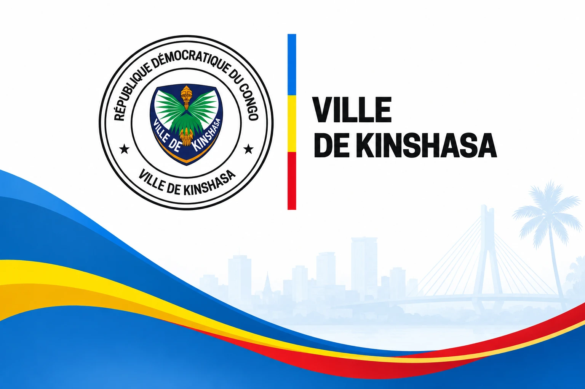

# KINSHASA MOSOLO {.unnumbered}

{width=170mm}

**Sovereign Revenue Maximisation Operating System for the City Province of Kinshasa**

*Plateforme unique de recensement, de géolocalisation, de gestion, de paiement, de contrôle et de maximisation des recettes de la Ville Province de Kinshasa*

> « Une ville, un contribuable, une donnée, une quittance. »

**RECENSER → IDENTIFIER → GÉOLOCALISER → QUALIFIER → CALCULER → NOTIFIER → PAYER → RAPPROCHER → QUITTANCER → CONTRÔLER → RECOUVRER → AUDITER → PLANIFIER**

| Rubrique | Contenu |
|---|---|
| Document | Document maître unique — conception, exigences produit, architecture, gouvernance, financement et mise en œuvre (47 chapitres, conclusion stratégique et annexes) |
| Version | 3.0 — 26 septembre 2026 |
| Statut | Document de travail soumis à validation juridique provinciale. **Aucune règle, aucun taux, aucune pénalité et aucune projection financière contenus dans ce document ne peuvent entrer en production avant certification par les services juridiques compétents et approbation par l'autorité compétente.** |
| Bénéficiaires institutionnels | Gouvernement provincial de Kinshasa ; Direction générale des impôts provinciaux de Kinshasa (DGIPK) ; Direction générale des recettes de Kinshasa (DGRK) ; ministères et services provinciaux légalement responsables de recettes spécifiques ; communes et autres entités publiques autorisées, lorsque la loi le prévoit |
| Destinataires | Gouverneur et Gouvernement provincial ; régies financières ; services juridiques ; Trésor et finances ; audit et inspection ; partenaires de mise en œuvre ; architectes, développeurs, testeurs |
| Documents compagnons | Cahier des exigences consolidé v2.9 (24 septembre 2026) ; Spécification fonctionnelle des 81 modules et 16 verticales v1.2 ; Dossier Gouverneur v1.0 ; Note exécutive au Gouverneur (24 septembre 2026). **En cas de divergence, le présent document prévaut** (Annexe D). |
| Identité visuelle | Visuel de couverture officiel de la Ville de Kinshasa (logo, liseré tricolore, silhouette de la ville), reproduit sans modification ; couleurs de la charte de la Ville |
| Préparé par | Groupe Nseya Digital / JNN Global Ltd, pour le compte du programme KINSHASA MOSOLO |

## Conventions de lecture {.unnumbered}

**Marqueurs de statut juridique.** Toute affirmation de droit ou de chiffre porte l'un des marqueurs suivants :

| Marqueur | Signification | Effet dans la plateforme |
|---|---|---|
| **[CONFIRMÉ]** | Vérifié sur une source publique identifiée (texte publié, site officiel, rapport institutionnel), référencée à l'Annexe A | Peut alimenter une fiche de règle, qui reste soumise à la certification juridique formelle avant activation |
| **[À VÉRIFIER]** | Information plausible, issue d'une source secondaire ou des documents de travail, non confirmée sur le texte officiel | Reste en statut `A_VERIFIER` dans le registre juridique : **aucun effet financier possible** |
| **[ACTE REQUIS]** | Mesure qui n'a pas de base légale suffisante aujourd'hui et exige un édit, un arrêté, une convention ou une loi | Modélisée et simulable, **non activable** |
| **[EXEMPLE]** | Valeur illustrative destinée à montrer une mécanique de calcul | Interdite en production ; bloquée par les tests d'acceptation |

**Règle de prudence appliquée partout.** Lorsque l'information manque, le document (1) dit ce qui est inconnu, (2) précise ce qui doit être vérifié, (3) désigne l'autorité responsable, (4) définit les données requises, (5) propose une hypothèse de conception sûre pour l'intérim, et (6) décrit le verrou technique qui empêche cette hypothèse d'entrer en production.

**Vocabulaire.** « Régie » désigne la DGIPK, la DGRK ou toute administration légalement chargée d'une recette ; l'administration compétente est une **donnée de configuration** de chaque règle, jamais une constante du code, parce que la répartition des compétences entre régies provinciales est en cours de réforme. « Settlement » est traduit par **règlement en compte public**. Le français est la langue de référence ; les termes techniques anglais sont conservés entre parenthèses et définis au glossaire (Annexe C).

**Conventions des diagrammes et graphiques.** Les diagrammes sont écrits en Mermaid dans la source Markdown (rendus automatiquement sur la forge Git et convertis en images dans la version Word). Les graphiques sont générés par `tools/gen_graphiques.py` dans la charte de la Ville de Kinshasa (marine de l'écu `#232C6B`, liseré tricolore bleu `#1E9BD7`, jaune `#F7D618`, rouge `#D7141A`, or `#E0A526`, vert `#1E8C3A`) avec une palette catégorielle contrôlée pour les daltonismes ; ceux qui reposent sur des valeurs illustratives portent la mention « EXEMPLE — non opposable ».

**Monnaies et langues.** Le franc congolais (🇨🇩 CDF) est la devise principale ; chaque devise est affichée avec le drapeau de son pays émetteur (§ 11.6). La plateforme est multilingue : français (référence), lingala, kiswahili, kikongo, tshiluba, anglais (§ 11.5).

## Sommaire {.unnumbered}

| Partie | Chapitres |
|---|---|
| I — Décider | 1 Résumé exécutif · 2 Argumentaire politique et économique · 3 Vision · 4 Énoncé du problème · 5 Objectifs stratégiques |
| II — Le droit et l'argent | 6 Analyse juridique et réglementaire · 7 Paysage des recettes · 8 Nouvelles opportunités de recettes |
| III — Le produit | 9 Un utilisateur, un compte · 10 Architecture fonctionnelle · 11 Catalogue des modules · 12 Rôles et matrice d'habilitations · 13 Parcours contribuables · 14 Parcours gouvernementaux · 15 Parcours de l'agent de terrain · 16 Foncier et intelligence locative · 17 Cadastre fiscal géospatial |
| IV — La chaîne financière | 18 Paiement et règlement · 19 Quittance électronique · 20 Rapprochement · 21 Recouvrement et exécution · 22 Recours et droits du contribuable |
| V — Intelligence et intégrité | 23 Agents d'IA · 24 Apprentissage et environnement de travail · 25 Fraude et déperdition · 26 Tableaux de bord · 27 Affectation des fonds publics |
| VI — La technique | 28 Architecture technique · 29 Modèle de données · 30 Catalogue des API · 31 Sécurité · 32 Gouvernance des données · 33 Hébergement et souveraineté |
| VII — Mettre en œuvre | 34 Feuille de route · 35 Modèle opérationnel · 36 Gouvernance · 37 Passation et modèle commercial · 38 Modèle financier · 39 Indicateurs · 40 Registre des risques · 41 Critères d'acceptation · 42 Carnet de développement · 43 Plan de livraison · 44 Stratégie de tests · 45 Plan pilote · 46 Plan des 100 premiers jours · 47 Décisions immédiates |
| VIII — Conclusion stratégique | Dix décisions · pilote de 180 jours · gouvernance · budget initial · gisements prioritaires · contrôles anti-fraude · validations juridiques critiques · prochaine action |
| Annexes | A Registre de vérification juridique et sources · B Fiches de règles modèles · C Glossaire · D Arbitrages avec les documents antérieurs et traçabilité · E Socle logiciel livré (backend, frontend, shared) · H Intégration exhaustive des exigences des documents sources (1 792 exigences, verticales, modules 1–81, arbitrages, traçabilité) · G Catalogue des événements de communication |
