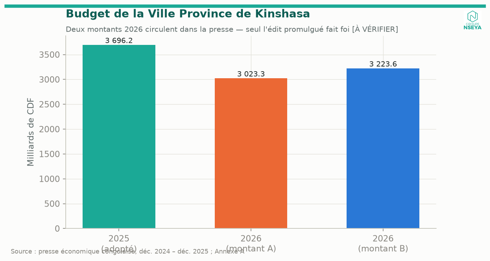

# 2. Argumentaire politique et économique

## 2.1 La question posée au Gouvernement provincial

La question n'est pas de savoir s'il faut « numériser la fiscalité ». Elle est de savoir comment une agglomération d'environ vingt millions d'habitants [À VÉRIFIER — estimations démographiques non issues d'un recensement] finance sa voirie, son drainage, son assainissement, son éclairage, ses marchés, ses écoles, ses centres de santé et sa sécurité, alors que ses ressources propres croissent moins vite que ses besoins. Le budget provincial 2026 est rapporté par la presse à environ 3 000 à 3 200 milliards de francs congolais, soit de l'ordre de 1,1 milliard de dollars américains, en baisse par rapport à 2025 [À VÉRIFIER : deux montants circulent, 3 023 et 3 223 milliards CDF ; seul l'édit budgétaire promulgué fait foi]. Rapporté à une population estimée entre 17 et 20 millions d'habitants, cela représente de l'ordre de 55 à 65 dollars par habitant et par an, toutes dépenses confondues.

L'écart entre ce que la Ville pourrait légalement mobiliser et ce qu'elle encaisse effectivement ne s'explique pas principalement par les taux. Il s'explique par cinq ruptures cumulatives, qui sont toutes des ruptures d'information :

| Rupture | Manifestation à Kinshasa | Conséquence financière |
|---|---|---|
| **Recensement partiel** | Une large part des parcelles, unités louées, commerces, véhicules, panneaux et occupations du domaine public n'existe dans aucune base numérique géolocalisée et à jour | Ce qui n'est pas vu n'est pas liquidé |
| **Identification faible** | L'administration connaît parfois un bien sans pouvoir relier de façon fiable personne → bien → lieu → obligation → paiement | Avis non délivrables, contestations, prescriptions |
| **Dispersion** | Bases parallèles entre régies, ministères, communes et supports papier | Double sollicitation de certains contribuables, angles morts pour d'autres |
| **Friction** | Le contribuable ne sait pas toujours ce qu'il doit, à qui, combien, quand et comment payer | Non-paiement par friction plutôt que par refus |
| **Déperdition en bout de chaîne** | Encaissements physiques, quittances non standardisées, rapprochement tardif, annulations peu tracées | Fuites difficiles à mesurer et plus difficiles encore à prouver |

## 2.2 Des faits déjà établis

Les documents de travail du programme rapportent trois constats qui orientent la conception. Ils sont repris ici avec leur statut de vérification ; ils devront être confirmés sur pièces par la cellule de base de référence (chapitre 38) avant toute communication publique.

1. **Évaluation TADAT de la régie provinciale de Kinshasa, restituée le 5 septembre 2025** [CONFIRMÉ pour le fait de l'évaluation] — selon les documents de travail : registre des contribuables incomplet et peu fiable, télépaiement non opérationnel, contrôle interne insuffisant, audit interne non fonctionnel, faible capacité de prévision ; recommandations publiques : système intégré de gestion et de suivi des recettes, renforcement des capacités, reporting public [À VÉRIFIER : scores par indicateur ; rapport à obtenir auprès du ministère provincial des Finances]. Au niveau national, la réévaluation TADAT de 2023 plaçait la RDC en note D sur 26 des 32 indicateurs [À VÉRIFIER sur le rapport FMI].
2. **Contrat de performance 2026 de la DGRK** — assignations de l'ordre de 500 millions de dollars pour l'exercice, alors que l'impôt foncier et l'impôt sur les revenus locatifs cumulés à fin janvier 2026 étaient rapportés à environ 40 milliards de francs congolais (≈ 14 millions de dollars) [À VÉRIFIER : pièces DGRK]. Il faut lire ce chiffre avec prudence : janvier précède l'échéance déclarative principale de l'impôt foncier et de l'IRL, de sorte qu'un cumul à fin janvier ne mesure pas le rendement annuel. Il mesure en revanche un fait utile : l'essentiel du rendement foncier et locatif se joue sur une fenêtre de quelques semaines, que la plateforme doit préparer des mois à l'avance.
3. **Quitus fiscal provincial** — la régie délivre un quitus fiscal attestant le paiement de l'impôt foncier, de l'IRL et, le cas échéant, de l'impôt sur les véhicules, présenté comme exigible pour certaines démarches administratives [À VÉRIFIER : acte instituant et liste exacte des démarches conditionnées]. C'est le levier de conformité le plus puissant dont dispose la Ville ; il ne vaut que s'il est numérique, instantané et infalsifiable.
4. **La numérisation a commencé.** La régie a lancé en mars 2026 la plateforme de déclaration et de paiement en ligne de l'impôt foncier, de l'IRL et de la vignette, avec avis à QR code et paiement dans des banques partenaires, en remplacement du portail précédent [CONFIRMÉ par la presse ; périmètre exact à inventorier]. **KINSHASA MOSOLO ne doit pas construire un système parallèle** : il doit reprendre, intégrer ou faire migrer cet acquis (chapitre 34, phase 1).
5. **La réforme des régies est en cours.** La Direction générale des recettes de Kinshasa (DGRK) est en voie de remplacement par deux régies créées par arrêtés provinciaux : la Direction générale des impôts provinciaux de Kinshasa (DGIPK) pour les impôts, et une direction générale des droits, taxes et redevances (DGTK) ; les nouveaux dirigeants ont reçu leur feuille de route le 8 septembre 2026 [CONFIRMÉ par la presse ; numéros et dates des arrêtés À VÉRIFIER].

## 2.3 Pourquoi maintenant

- **La réforme des régies est en cours d'exécution.** La séparation entre impôts (DGIPK) et droits, taxes et redevances (successeur de la DGRK) produira deux silos au lieu d'un si elle ne s'appuie pas sur un socle d'information commun. Le moment de la réorganisation est le seul où l'on peut imposer un registre commun sans casser des habitudes.
- **Le quitus fiscal existe.** Le rendre numérique et vérifiable transforme la conformité en condition d'accès aux services, sans créer aucun prélèvement nouveau.
- **La monnaie mobile est devenue un canal de masse.** Le paiement vers un compte public identifié, par téléphone, supprime la manipulation d'espèces par les agents dans les circuits couverts.
- **Les partenaires techniques et financiers suivent la trajectoire TADAT.** Un programme structuré, auditable et non prédateur est finançable ; un programme perçu comme un fermage fiscal ne l'est pas.
- **Le calendrier fiscal commande.** Pour que la campagne foncière et locative de début 2027 serve de premier test réel, le recensement des communes pilotes doit être avancé avant la fin de l'année 2026. Chaque trimestre perdu décale d'un an la première mesure de résultats.

## 2.4 Le risque de ne rien faire

Sans registre unique, chaque campagne recommence à zéro, la pression se concentre sur les contribuables déjà connus — entreprises formelles, propriétaires identifiés, fonctionnaires — et l'inégalité devant l'impôt devient visible. Le civisme fiscal se dégrade. Une numérisation partielle produit alors l'effet inverse de celui recherché : davantage de pression sur la même assiette étroite, au lieu d'un élargissement équitable.

## 2.5 L'équation de la recette

La plateforme agit séparément sur chacun des facteurs de l'équation suivante, et les mesure séparément :

> **Recette nette rapprochée** = objets détectés × objets correctement rattachés × règles légalement applicables × taux de déclaration × taux de paiement × taux de règlement en compte public × taux de rapprochement − (erreurs + exonérations indues + annulations irrégulières + détournements + remboursements + coût de collecte)

| Modèle actuel à réduire | Modèle cible |
|---|---|
| Chercher le contribuable | Détecter et suivre l'objet générateur de recettes |
| Identifiants multiples | Identité fiscale unique, liens vérifiés |
| Paiement difficile à rapprocher | Référence unique, rapprochement automatisé |
| Contrôle uniforme | Contrôle orienté par le risque et le potentiel |
| Rapport périodique tardif | Pilotage quotidien, alertes explicables |
| Correction sans preuve | Contre-écriture motivée, pièces, double approbation |

# 3. Vision du projet

## 3.1 Énoncé de vision

**KINSHASA MOSOLO est l'infrastructure de vérité des recettes de Kinshasa.** C'est le système par lequel la Ville Province connaît, gère, protège et accroît ses recettes, et rend compte de leur emploi. Ce n'est ni un portail fiscal de plus, ni une application de paiement : c'est un système d'exploitation, au sens où tous les services de recettes — impôts, taxes, droits, redevances, recettes domaniales — s'exécutent sur le même socle d'identité, de territoire, de droit, de paiement, de grand livre et d'audit.

Pour chaque objet et chaque obligation, la plateforme répond en permanence à douze questions :

| # | Question | Brique qui répond |
|---|---|---|
| 1 | Qui génère la recette ? | Compte unique et graphe fiscal (ch. 9) |
| 2 | Quel bien, quelle activité ou quelle transaction crée l'obligation ? | Registre des objets fiscaux (ch. 16–17) |
| 3 | Où se trouve-t-il ? | Cadastre fiscal géospatial (ch. 17) |
| 4 | Quelle loi s'applique ? | Registre juridique versionné (ch. 6) |
| 5 | Comment le montant est-il calculé ? | Moteur de liquidation explicable (ch. 11) |
| 6 | A-t-il été payé ? | Orchestration des paiements (ch. 18) |
| 7 | Les fonds ont-ils atteint le compte public autorisé ? | Règlement en compte public (ch. 18) |
| 8 | Comment la transaction a-t-elle été rapprochée ? | Moteur de rapprochement et grand livre (ch. 20) |
| 9 | Qui a fait quoi, quand, avec quelle approbation ? | Journal d'audit inaltérable (ch. 25) |
| 10 | Où la recette se perd-elle ? | Renseignement anti-fraude et déperdition (ch. 25) |
| 11 | Quelle intervention licite peut accroître la collecte ? | Moteur de découverte des recettes (ch. 8, 23) |
| 12 | Quelles priorités publiques les fonds disponibles peuvent-ils soutenir ? | Recommandation d'affectation (ch. 27) |

## 3.2 La chaîne opératoire

Chaque maillon produit un événement horodaté, signé et inaltérable. **Aucun maillon ne peut être sauté** : pas de quittance définitive sans paiement réglé et rapproché ; pas de paiement sans obligation ; pas d'obligation sans règle active ; pas de règle active sans texte en vigueur vérifié.

| Maillon | Ce qui se passe | Garde-fou |
|---|---|---|
| Recenser | Objet détecté par auto-déclaration, terrain, données partenaires | Objet provisoire tant qu'il n'est pas vérifié |
| Identifier | Rattachement à un compte unique et à un rôle | Pas de fusion automatique d'identités |
| Géolocaliser | Identifiant géofiscal, coordonnées, précision | Contrôle de plausibilité GPS |
| Qualifier | Détermination des règles applicables | Seules les règles actives du registre |
| Calculer | Liquidation déterministe et explicable | Version de règle figée dans l'obligation |
| Notifier | Avis numérique et imprimable, preuve de délivrance | Mentions obligatoires et voie de recours |
| Payer | Référence unique, canal autorisé | Compte bénéficiaire issu du coffre verrouillé |
| Rapprocher | Obligation ↔ paiement ↔ règlement ↔ écriture | Exceptions en file, jamais d'ajustement silencieux |
| Quittancer | Quittance signée, QR vérifiable | Statut « provisoire » tant que non réglé |
| Contrôler | Missions terrain ciblées, constats | L'agent constate, il n'encaisse pas |
| Recouvrer | Relances graduées, mesures légales | Décision humaine habilitée, recours garanti |
| Auditer | Reconstitution intégrale de toute opération | Journal chaîné, stockage WORM indépendant |
| Planifier | Capacité de financement et scénarios | L'IA recommande, l'autorité décide |

## 3.3 Positionnement

- **Une identité • un territoire • une règle légale • une recette traçable.**
- **Principe fondateur :** chaque franc public doit être identifiable, rapprochable et auditable.
- **Priorité d'action :** mobiliser d'abord les recettes légalement dues mais non identifiées ou non recouvrées, avant de proposer tout prélèvement nouveau.

## 3.4 Principes constitutionnels du produit (non négociables)

Ces principes sont opposables à toute équipe de réalisation. Aucune dérogation n'est possible sans décision écrite du Comité de pilotage, publiée au journal des décisions du programme.

| # | Principe | Traduction obligatoire dans le produit |
|---|---|---|
| P1 | **Légalité avant automatisation** | Aucune obligation sans règle active portant sa référence légale ; aucun taux codé en dur ; toute règle non confirmée reste désactivée |
| P2 | **Le système applique le droit, il ne le crée pas** | Ni l'IA, ni l'administrateur, ni un agent ne peut créer une taxe, un taux ou une pénalité |
| P3 | **Une identité, plusieurs rôles, plusieurs objets** | Compte principal unique ; pas de fusion silencieuse ; rôles distincts (propriétaire, bailleur, locataire, exploitant…) |
| P4 | **Minimisation des données** | Collecte limitée à une finalité administrative, fiscale ou de service légitime et documentée |
| P5 | **Fonds publics sur comptes publics** | Aucun paiement de recette publique vers un compte privé de plateforme ou de prestataire |
| P6 | **Séparation des pouvoirs** | Aucune personne, quel que soit son rang, ne peut seule modifier une dette, un paiement, un compte bénéficiaire, une règle ou une trace |
| P7 | **Aucune disparition** | Toute correction est une contre-écriture liée à l'original ; aucune suppression d'écriture financière ou d'événement d'audit |
| P8 | **Preuve avant sanction** | Un signal analytique ouvre une vérification humaine ; jamais une taxation ou une sanction automatique |
| P9 | **Zéro espèce entre les mains des agents** | L'agent constate et notifie ; l'encaissement se fait par des canaux agréés vers le compte public |
| P10 | **IA assistive et redevable** | L'IA détecte, explique, priorise et recommande ; chaque recommandation est journalisée et attribuée |
| P11 | **Hors ligne d'abord pour le terrain, temps réel pour le pilotage** | Application terrain pleinement opérationnelle sans réseau |
| P12 | **Inclusion** | Chaque parcours citoyen existe sans smartphone ni Internet (USSD, SVI, SMS, guichet assisté) et en langues nationales |
| P13 | **Souveraineté et réversibilité** | La Ville possède les données, les clés et le droit d'usage du code ; sortie documentée et testée |
| P14 | **Transparence sans exposition** | Le public voit des agrégats ; jamais la situation fiscale d'une personne identifiable |

# 4. Énoncé du problème

| # | Problème constaté | Effet sur les recettes | Réponse de KINSHASA MOSOLO | Chapitre |
|---|---|---|---|---|
| 1 | Registre des contribuables incomplet et peu fiable | Assiette étroite, pression concentrée, inéquité | Registre par objet, identifiant unique, enrôlement continu | 9, 17 |
| 2 | Absence d'adresse fiscale géolocalisée généralisée | Impossible de notifier, contrôler, prouver | Identifiant géofiscal, plaque et QR par objet | 17 |
| 3 | Télépaiement non opérationnel ou fragmenté | Espèces, quittances non standardisées | Orchestration multicanale vers comptes publics | 18 |
| 4 | Bases dispersées entre services | Doubles sollicitations, statistiques non fiables | Socle commun, API contractualisées | 10, 30 |
| 5 | Le contribuable ignore quoi, combien, où payer | Non-paiement par friction | Espace unique, déclaration pré-remplie, explication du calcul | 13 |
| 6 | Références juridiques obsolètes dans certains documents de projet (texte de 2013 abrogé) et taux mal qualifiés | Liquidations contestables, contentieux de masse | Registre juridique certifié et versionné | 6 |
| 7 | Contrôle terrain sans données fiables | Contrôles inefficaces, arbitraire, corruption | Missions préparées, preuves géolocalisées, hors ligne | 15 |
| 8 | Contrôle interne faible, audit interne peu opérant | Déperdition impossible à prouver | Journal inaltérable, séparation des fonctions, accès auditeur indépendant | 25 |
| 9 | Exonérations et annulations peu tracées | Érosion silencieuse de la base | Registre des exonérations, quatre yeux, alertes de concentration | 25 |
| 10 | Rapprochement bancaire tardif | Fonds « perdus » en suspens, fraudes aux quittances | Rapprochement quotidien automatisé, files d'exception | 20 |
| 11 | Faible capacité de prévision | Assignations irréalistes, pilotage à l'aveugle | Base de référence, modèles de potentiel, scénarios | 38 |
| 12 | Opacité de l'emploi des recettes | Faible consentement à l'impôt | Tableau de transparence publique et recommandations d'affectation | 27 |

**Ce qui n'est pas le problème.** Le programme ne part pas de l'hypothèse que les contribuables kinois refusent l'impôt ni que les agents sont malhonnêtes. Il part de l'hypothèse, étayée par les constats d'évaluation, que l'architecture actuelle de l'information rend la conformité coûteuse, la fraude facile et la preuve difficile. Il corrige l'architecture.

# 5. Objectifs stratégiques

Les cibles chiffrées ci-dessous sont des **cibles de conception** ; les cibles de performance opposables seront fixées après mesure de la base de référence (chapitre 38) et approuvées par le Comité de pilotage.

| # | Objectif | Indicateur principal | Cible de conception |
|---|---|---|---|
| O1 | Constituer un registre géolocalisé des objets générateurs de recettes, commune par commune | Couverture du recensement dans les zones pilotes | ≥ 90 % des parcelles des quartiers pilotes à J+180 |
| O2 | Attribuer une identité fiscale unique à chaque contribuable, reliée à tous ses objets et rôles | Taux d'objets rattachés à un compte vérifié (N2+) | ≥ 70 % des objets recensés à J+180 |
| O3 | Fonder chaque obligation sur une règle certifiée, datée et versionnée | Obligations émises sans règle active | 0 (contrôle bloquant) |
| O4 | Rendre dominant l'encaissement électronique vers les comptes publics | Part des encaissements électroniques dans les flux couverts | > 80 % dans les flux couverts 18 mois après le pilote |
| O5 | Raccourcir la chaîne paiement → quittance → rapprochement | Délai confirmation → quittance ; délai règlement → rapprochement | < 1 minute ; < 24 heures ouvrées |
| O6 | Supprimer la manipulation d'espèces par les agents dans les circuits couverts | Encaissements hors canal agréé détectés | 0 toléré ; chaque cas instruit |
| O7 | Réduire la déperdition mesurable | Paiements non rapprochés à J+3 ; annulations non justifiées | < 1 % ; 0 |
| O8 | Donner à l'exécutif une vision exacte, en temps réel, de l'échelle de la recette | Fraîcheur des données du tableau de bord | < 15 minutes pour les flux électroniques |
| O9 | Relier recettes encaissées et réalisations publiques | Publication du tableau de transparence | Trimestrielle dès la fin du pilote |
| O10 | Améliorer l'environnement de travail des agents publics | Taux de certification ; satisfaction ; temps de traitement | Tous les agents actifs certifiés ; baisse mesurée du temps de traitement |
| O11 | Protéger les droits des contribuables | Délai moyen de traitement des recours ; taux de recours fondés | Dans le délai légal ; suivi public agrégé |
| O12 | Garantir la souveraineté et la réversibilité | Exercice de réversibilité réussi | Un exercice complet avant la généralisation |
