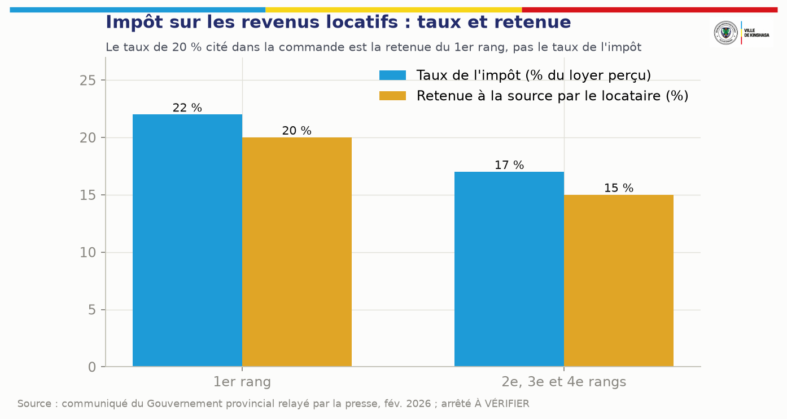
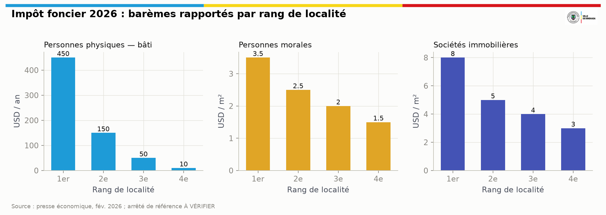
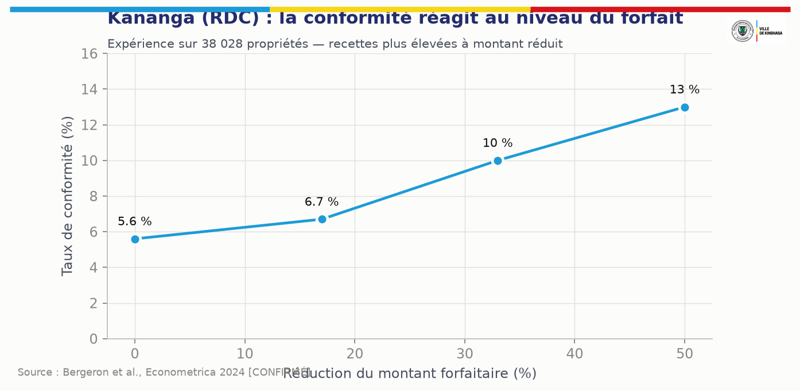
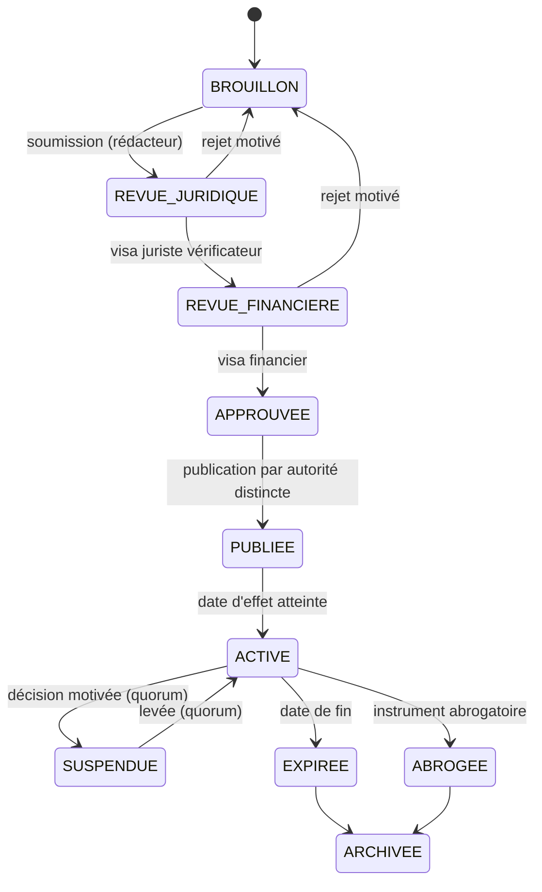

# 6. Analyse juridique et réglementaire

Ce chapitre fixe le cadre dans lequel le référentiel juridique de KINSHASA MOSOLO peut être paramétré. Il distingue ce qui est établi, ce qui doit être vérifié sur le texte officiel avant toute mise en production, et ce qui exige un acte nouveau. **Il ne constitue pas un avis juridique** : il prépare le relevé juridique certifié que les services juridiques provinciaux doivent produire (décision n° 3, chapitre 47).

## 6.1 Méthode, sources et limites

La revue a été conduite en septembre 2026 sur des sources publiques : Journal officiel et bases de législation congolaises, sites institutionnels (Banque Centrale du Congo, Cour des comptes, DGI, ARMP), bases internationales (FAOLEX/ECOLEX, PNUE), rapports du FMI et de la Banque mondiale, presse économique congolaise. **Limite importante** : plusieurs bases de textes congolaises n'ont pas pu être consultées en texte intégral pendant la revue ; les éléments marqués [CONFIRMÉ] l'ont été par recoupement de sources publiques identifiées, mais **aucun numéro d'article ni aucun taux ne doit être paramétré sans lecture du texte officiel publié** par le juriste certificateur. L'Annexe A liste chaque affirmation, sa source et son niveau de confiance.

**Conséquence de conception.** Le registre juridique de la plateforme (module 26) ne peut contenir qu'une copie numérisée et hachée du texte officiel comme pièce justificative de chaque règle. Une règle dont la pièce justificative est une coupure de presse ou un document de travail reste au statut `A_VERIFIER` et ne peut produire aucune obligation.

## 6.2 Hiérarchie des normes applicables

| Niveau | Texte | Objet utile à MOSOLO | Statut | Conséquence pour la plateforme |
|---|---|---|---|---|
| Constitution | Constitution du 18 février 2006, révisée par la loi du 20 janvier 2011 — **art. 171** | « Les finances du pouvoir central et celles des provinces sont distinctes » | [CONFIRMÉ] | Comptes, grands livres et tableaux de bord séparés entre recettes provinciales et centrales |
| Constitution | **Art. 174** | Principe de légalité de l'impôt (« il ne peut être établi d'impôts que par la loi ») | [CONFIRMÉ pour le principe ; texte intégral À VÉRIFIER] | Une province ne peut pas créer librement un impôt hors du cadre légal ; toute nouvelle recette doit s'inscrire dans une nomenclature légale ou dans une loi |
| Constitution | **Art. 175** | 40 % des recettes à caractère national allouées aux provinces, retenus à la source | [CONFIRMÉ] | Hors périmètre de liquidation de MOSOLO ; peut être suivi comme ressource dans le module d'affectation (ch. 27) |
| Constitution | **Art. 204, point 16** | Compétence exclusive des provinces pour « les impôts, les taxes et les droits provinciaux et locaux, notamment l'impôt foncier, l'impôt sur les revenus locatifs et l'impôt sur les véhicules automoteurs » | [CONFIRMÉ pour la formulation] | Fondement constitutionnel des trois impôts cœur du pilote |
| Loi | **Loi n° 08/012 du 31 juillet 2008** portant principes fondamentaux relatifs à la libre administration des provinces, modifiée par la **Loi n° 13/008 du 22 janvier 2013** | Compétences et ressources des provinces ; édits de l'Assemblée provinciale | [CONFIRMÉ] | L'édit est l'instrument normal des règles provinciales de perception |
| Loi organique | **Loi organique n° 08/016 du 7 octobre 2008** (ETD) | Organisation des communes et autres ETD | [CONFIRMÉ pour l'existence ; dispositions financières À VÉRIFIER] | Espace communal distinct (module 95) ; pas de liquidation de recettes communales par la province |
| Ordonnance-loi | **Ordonnance-loi n° 18/004 du 13 mars 2018** fixant la nomenclature des impôts, droits, taxes et redevances de la province et de l'entité territoriale décentralisée ainsi que les modalités de leur répartition (JO, n° spécial, 23 avril 2018) | Nomenclature provinciale et locale ; clés de répartition | [CONFIRMÉ pour l'existence, l'objet et l'abrogation de l'OL 13/001] ; [À VÉRIFIER : liste intégrale et clés de répartition] | **Base normative du référentiel.** Toute ligne du catalogue (ch. 7) doit citer son rang dans la nomenclature |
| Ordonnance-loi | **Ordonnance-loi n° 13/001 du 23 février 2013** | Ancienne nomenclature provinciale | **ABROGÉE** par l'OL 18/004 [CONFIRMÉ] | **Interdite comme base de règle.** Toute référence héritée est bloquée par le moteur |
| Ordonnance-loi | **Ordonnance-loi n° 18/003 du 13 mars 2018** | Nomenclature des droits, taxes et redevances du pouvoir central | [CONFIRMÉ] | Liste d'exclusion : empêcher toute double imposition d'un fait générateur central |
| Loi (réf. commande) | **Loi n° 18/014 du 9 juillet 2018** | Présentée dans la commande comme texte de référence et, par un document de travail antérieur, comme loi de ratification de l'OL 18/004 | **[À VÉRIFIER — NON RETROUVÉE]** : aucune trace publique n'a été trouvée de ce numéro comme loi de ratification de l'OL 18/004 ; d'autres lois du 9 juillet 2018 portent les numéros 18/016 (PPP), 18/019 (systèmes de paiement), 18/020 | Ne pas citer dans une fiche de règle avant confirmation au Journal officiel ; vérifier en outre si l'OL 18/004 a été ratifiée et par quel texte |
| Ordonnance-loi | **OL n° 69/006 du 10 février 1969** relative à l'impôt réel, modifiée | Impôt foncier, impôt sur les véhicules, superficie des concessions | [CONFIRMÉ pour l'existence ; version consolidée À VÉRIFIER] | Base matérielle historique de l'IF et de l'impôt sur les véhicules |
| Ordonnance-loi | **OL n° 69/009 du 10 février 1969** relative aux impôts cédulaires sur les revenus, modifiée (notamment OL n° 009/2012 du 21 septembre 2012) | Impôt sur les revenus locatifs | [CONFIRMÉ pour l'existence ; version consolidée À VÉRIFIER] | Base matérielle historique de l'IRL |
| Loi | **Loi n° 004/2003 du 13 mars 2003** portant réforme des procédures fiscales, modifiée (notamment Loi n° 23/052 du 30 novembre 2023) | Déclaration, liquidation, avis de mise en recouvrement, contrôle, recouvrement, prescription, recours | [CONFIRMÉ] | Modèle procédural ; applicabilité aux impôts provinciaux à confirmer au regard de l'édit provincial de procédure |
| Édit provincial | **Édit n° 005/2021 du 31 décembre 2021** portant réforme des procédures de perception des impôts, droits, taxes et redevances dus à la Ville de Kinshasa (JO n° spécial, 14 février 2022) | **Procédure fiscale provinciale de Kinshasa** | [CONFIRMÉ pour l'existence ; contenu À VÉRIFIER] | **Texte clé** pour les états de l'obligation, les délais, les pénalités, les actes de poursuite et les recours. Son éventuelle modification après la réforme des régies de 2026 doit être vérifiée |
| Loi / OL | **Loi n° 04/015 du 16 juillet 2004** (nomenclature des actes générateurs de recettes administratives, judiciaires, domaniales et de participations), modifiée ; **OL n° 13/003 du 23 février 2013** (procédures relatives aux recettes non fiscales) | Recettes non fiscales, surtout centrales | [PROBABLE] | Référence méthodologique pour les droits, taxes et redevances ; applicabilité provinciale À VÉRIFIER |
| Loi | **Loi n° 11/011 du 13 juillet 2011** relative aux finances publiques (LOFIP), modifiée par la **Loi n° 18/010 du 9 juillet 2018** | Budget, unité de caisse et de trésorerie, séparation ordonnateur–comptable, comptes publics | [CONFIRMÉ] | Voir § 6.8 : la plateforme ne détient aucun fonds et ne répartit aucune recette hors procédure budgétaire |
| Décret | **Décret n° 13/050 du 6 novembre 2013** portant règlement général sur la comptabilité publique (RGCP) | Chaîne constatation–liquidation–recouvrement, rôle du comptable public | [PROBABLE — en vigueur, aucune abrogation trouvée] | Modèle des états de la recette ; habilitation du comptable dans les workflows |
| Édits annuels | **Édit budgétaire de la Ville de Kinshasa pour 2026** et arrêtés du ministre provincial des Finances | Taux, tarifs, innovations d'assiette | [À VÉRIFIER : numéro, date, montant définitif] | Source directe des taux ; chaque exercice crée une nouvelle version de règle |
| Arrêtés provinciaux 2026 | Arrêtés créant la **DGIPK** et la direction des droits, taxes et redevances (**DGTK**), en remplacement de la **DGRK** (créée par l'Édit n° 0001/08 du 22 janvier 2008) | Répartition des compétences d'assiette et de recouvrement | [CONFIRMÉ par la presse ; numéros et dates À VÉRIFIER] | L'administration compétente est une donnée de configuration de chaque règle |
| OL | **Ordonnance-loi n° 23/010 du 13 mars 2023** portant Code du numérique (JO 11 avril 2023) | Écrit et signature électroniques, services de confiance, protection des données, cybersécurité | [CONFIRMÉ] ; ratification parlementaire [À VÉRIFIER] | Valeur probante de la quittance et de l'avis électroniques ; obligations de protection des données (§ 6.9) |
| Arrêtés ministériels | **Arrêtés n° 004 et n° 005 du 11 mars 2026** du ministre de l'Économie numérique (régimes de déclaration et d'autorisation des activités et services numériques) | Pleine application depuis le 1er juillet 2026 | [PROBABLE] | **Vérifier si l'exploitation de MOSOLO, ou de ses prestataires, est soumise à déclaration ou à autorisation** |
| Loi | **Loi n° 20/017 du 25 novembre 2020** relative aux télécommunications et aux TIC | Régulation (ARPTIC) | [CONFIRMÉ] | Conventions USSD, SMS, codes courts |
| Loi | **Loi n° 18/019 du 9 juillet 2018** relative aux systèmes de paiement et de règlement-titres | Instruments de paiement, caractère définitif du règlement, surveillance BCC | [CONFIRMÉ] | Cadre des paiements électroniques et mobiles (§ 6.10) |
| Loi organique | **Loi organique n° 18/027 du 13 décembre 2018** portant organisation et fonctionnement de la Banque Centrale du Congo | BCC caissier de l'État, surveillance des paiements | [CONFIRMÉ] | Comptes publics provinciaux et habilitation des prestataires |
| Instructions BCC | **Instruction n° 24** (monnaie électronique), **Instruction n° 42** (agrégateurs, fintechs), **Instruction n° 58/2024** (interopérabilité) | Habilitation des émetteurs de monnaie électronique et des agrégateurs | [PROBABLE / À VÉRIFIER pour les versions en vigueur] | **Si MOSOLO ou un prestataire agrège des paiements, un agrément BCC est probablement requis** |
| Loi | **Loi n° 22/068 du 27 décembre 2022** (lutte contre le blanchiment et le financement du terrorisme) | Vigilance, identification, déclarations de soupçon à la CENAREF | [CONFIRMÉ] | Obligations portées par les banques et émetteurs partenaires ; clauses contractuelles |
| Loi | **Loi n° 10/010 du 27 avril 2010** relative aux marchés publics (projet de révision validé en commission en janvier 2026) | Sélection des prestataires | [CONFIRMÉ ; révision À VÉRIFIER] | Chapitre 37 |
| Loi | **Loi n° 18/016 du 9 juillet 2018** relative au partenariat public-privé ; décrets d'application (dont décret n° 23/38 du 26 octobre 2023) | PPP, appel à la concurrence, rémunération | [CONFIRMÉ] | Chapitre 37 ; clauses de rémunération à lire dans le texte |
| Loi organique | **Loi organique n° 18/024 du 13 novembre 2018** relative à la Cour des comptes | Contrôle des finances des provinces et de toute personne gérant des fonds publics ; chambres provinciales | [CONFIRMÉ] | Accès auditeur, risque de **gestion de fait** si un tiers manie des fonds publics |
| Loi | **Loi n° 11/009 du 9 juillet 2011** relative à la protection de l'environnement, modifiée par l'**OL n° 23/007 du 3 mars 2023** | Principe pollueur-payeur | [CONFIRMÉ pour l'existence] | Fondement possible d'une contribution environnementale, sous réserve de la nomenclature |
| Décret | **Décret n° 17/018 du 30 décembre 2017** portant interdiction de production, d'importation, de commercialisation et d'utilisation des sacs, sachets, films et autres emballages en plastique (emballages alimentaires, eau, boissons, non biodégradables), avec exemptions ; arrêté d'exécution de 2018 fixant des amendes | Interdiction nationale | [CONFIRMÉ] | Toute contribution plastique doit s'articuler avec l'interdiction (§ 8.5) |
| Décrets | Décret n° 011/48 du 3 décembre 2011 (ONIP) ; décrets n° 22/07 et 22/08 du 2 mars 2022 (fichier général de la population, carte d'identité nationale) | Identification de la population | [PROBABLE] ; identification de masse annoncée pour fin 2026 | Pas d'identifiant national universel fiable avant 2027 : conception tolérante (ch. 9) |
| Pratique | Numéro d'identification fiscale (NIF) délivré par la DGI, y compris pour les redevables des ETD | Identifiant fiscal national | [PROBABLE] | Clé de rapprochement privilégiée ; l'IUC MOSOLO n'est qu'un identifiant technique, pas un identifiant fiscal concurrent |

## 6.3 Statut de l'Ordonnance-loi n° 13/001 et des références héritées

Le document de projet d'origine (note KIN-RECETTES) s'appuyait sur l'Ordonnance-loi n° 13/001 du 23 février 2013. **Ce texte est abrogé** par l'Ordonnance-loi n° 18/004 du 13 mars 2018 [CONFIRMÉ]. Conséquences :

1. aucune fiche de règle ne peut citer l'OL 13/001 comme fondement d'une obligation née après l'abrogation ;
2. les arriérés nés sous l'empire de l'OL 13/001 (exercices antérieurs à 2018) ne peuvent être repris qu'avec leur base légale d'origine et sous réserve des règles de prescription, après avis juridique ;
3. le moteur de règles tient une **liste noire des instruments abrogés** : toute tentative de publier une règle référençant un instrument au statut `ABROGE` avec une date d'effet postérieure à l'abrogation est bloquée (test d'acceptation AC-LEG-03, ch. 41) ;
4. les clés de répartition province–ETD souvent citées (par exemple « 40 % aux ETD ») proviennent de l'ancien régime ou de la rétrocession des recettes nationales ; **aucun pourcentage de répartition issu de l'OL 18/004 ne doit être paramétré avant lecture du texte** [À VÉRIFIER].

## 6.4 Impôt sur les revenus locatifs : taux, retenue et assiette

La commande initiale mentionnait un taux de 20 %. **Ce chiffre ne doit pas être utilisé comme taux de l'impôt.** Selon le communiqué du Gouvernement provincial relayé par la presse en février 2026, qui reprend les taux applicables depuis le 1er janvier 2024 [CONFIRMÉ par recoupement de presse ; **arrêté de référence À VÉRIFIER**] :

| Rang de localité | Taux de l'impôt (sur le loyer effectivement perçu) | Retenue à la source opérée par le locataire | Complément à la charge du bailleur |
|---|---|---|---|
| 1er rang | **22 %** | **20 %** | 2 points |
| 2e, 3e et 4e rangs | **17 %** | **15 %** | 2 points |

| Point | État de la connaissance | Hypothèse de conception sûre |
|---|---|---|
| Qui opère la retenue (tous locataires, ou seulement personnes morales et entités assimilées) | [À VÉRIFIER] | Paramètre `withholding_agent_categories` de la règle ; à défaut de confirmation, **la retenue n'est proposée que pour les locataires personnes morales et administrations**, les autres cas relevant de la déclaration du bailleur |
| Délai de reversement de la retenue (dans les 10 jours de chaque paiement, ou avant le 10 du mois suivant) | [À VÉRIFIER — deux formulations circulent] | Paramètre `remittance_due_rule` ; aucune pénalité de retard calculée tant que la règle n'est pas certifiée |
| Échéance de la déclaration annuelle du bailleur | 1er février, prorogée au 28 février en 2026 [CONFIRMÉ par la presse pour 2026] | Échéance annuelle paramétrable + mécanisme de prorogation par acte, versionné |
| Innovations de l'édit budgétaire 2026 : baux emphytéotiques entre entreprises et confessions ou ONG pour des constructions destinées à la location ; loyers perçus par les sociétés immobilières ; indemnités de logement de travailleurs occupant leur propre logement, celui du conjoint ou logés gratuitement | [PROBABLE — édit À VÉRIFIER] | Trois sous-règles distinctes, désactivées jusqu'à certification ; chacune avec formulaire, contrôle de cohérence et voie de recours ; attention au contentieux prévisible sur les indemnités de logement |
| Pénalités (retard de déclaration, de paiement, de reversement de retenue) | [À VÉRIFIER — Édit 005/2021 et textes d'application] | Aucune pénalité automatique ; calcul affiché comme « estimation non opposable » dans le simulateur interne uniquement |
| Déductions, abattements, exonérations | [À VÉRIFIER] | Champs prévus dans la fiche ; valeur nulle par défaut, bloquée tant que non certifiée |

**Règle de modélisation.** La fiche IRL porte deux paramètres distincts — `tax_rate` et `withholding_rate` — et un paramètre `locality_rank` rattaché à la parcelle via le référentiel des rangs de localité (module 86). Le crédit de retenue est imputé sur l'obligation du bailleur ; le moteur empêche que la même période soit liquidée deux fois (retenue et déclaration) sans imputation.

## 6.5 Impôt foncier : barèmes 2026 rapportés

Selon la presse économique de février 2026 [CONFIRMÉ par une source de presse unique ; **arrêté de référence À VÉRIFIER**] :

| Redevable | Assiette | 1er rang | 2e rang | 3e rang | 4e rang |
|---|---|---|---|---|---|
| Personnes physiques — bâti (forfait annuel) | Par propriété | 450 USD (villas) | 150 USD | 50 USD | 10 USD |
| Personnes morales | Par m² | 3,5 USD | 2,5 USD | 2 USD | 1,5 USD |
| Sociétés immobilières | Par m² | 8 USD | 5 USD | 4 USD | 3 USD |
| Personnes physiques — non bâti | Forfait par rang | [À VÉRIFIER] | [À VÉRIFIER] | [À VÉRIFIER] | [À VÉRIFIER] |

Ces montants sont libellés en dollars ; la règle de conversion en francs congolais (taux applicable, date de référence) doit être certifiée (module 89). L'échéance déclarative 2026 a été le 1er février, prorogée au 28 février [CONFIRMÉ par la presse].

**Point d'attention d'équité.** Les travaux expérimentaux menés à Kananga (RDC) sur l'impôt foncier montrent que la conformité réagit fortement au niveau du forfait : une baisse du montant exigé augmente la conformité au point que la recette totale peut augmenter (élasticité de la conformité proche de −1,25) [CONFIRMÉ — publication académique, Econometrica 2024]. MOSOLO ne fixe pas les taux, mais son laboratoire de simulation (module 92) doit permettre au Gouvernement de tester ces effets sur données réelles avant tout arrêté.

## 6.6 Véhicules : impôt et taxe spéciale de circulation routière

La régie provinciale perçoit l'impôt sur les véhicules automoteurs et la taxe spéciale de circulation routière (vignette), avec déclaration en ligne obligatoire depuis janvier 2026, vignette dématérialisée à QR code et paiement dans des banques partenaires [CONFIRMÉ par la presse]. **Les barèmes par catégorie de véhicule n'ont pas été retrouvés** [À VÉRIFIER]. La répartition de la TSCR (taxe d'intérêt commun) entre niveaux de gouvernement doit être confirmée dans l'OL 18/004. Le rapprochement avec le fichier des immatriculations (pouvoir central) exige un protocole.

## 6.7 Procédure fiscale, recouvrement et recours

La procédure applicable aux recettes de la Ville repose sur l'**Édit n° 005/2021** [contenu À VÉRIFIER], articulé avec les principes de la Loi n° 004/2003 modifiée. Le relevé juridique certifié doit fournir, pour chaque recette, les éléments suivants, qui paramètrent directement les modules 27, 32, 33, 36 et 37 :

| Élément de procédure | Paramètre de la plateforme | Statut |
|---|---|---|
| Mode d'établissement (déclaration, auto-liquidation, liquidation d'office, rôle) | `assessment_mode` | À VÉRIFIER par recette |
| Titre de perception (avis de mise en recouvrement, note de perception, etc.) et mentions obligatoires | Modèle d'avis versionné | À VÉRIFIER |
| Délai de paiement après notification | `payment_term_days` | À VÉRIFIER |
| Pénalités d'assiette et de recouvrement, plafonds | `penalty_rules[]` | À VÉRIFIER |
| Actes de poursuite (commandement, saisie, fermeture) et autorité compétente | Workflow du module 36 | À VÉRIFIER |
| Délai et forme de la réclamation ; effet suspensif éventuel | `appeal_path`, `suspensive_effect` | À VÉRIFIER |
| Voies de recours juridictionnel | Texte d'information du contribuable | À VÉRIFIER |
| Prescription de l'action en recouvrement et du droit de reprise | `limitation_period` | À VÉRIFIER (le régime national prévoit un droit de rappel de cinq ans : applicabilité provinciale à confirmer) |
| Remises gracieuses, transactions, échéanciers | Modules 83 et 90 | À VÉRIFIER |
| Valeur de la notification électronique | Module 39 | À VÉRIFIER au regard du Code du numérique et de l'édit |

## 6.8 Finances publiques : ce que la LOFIP impose à l'architecture

La LOFIP pose le principe d'**unité de caisse et de trésorerie** et prévoit la tenue des disponibilités de la province dans un compte ouvert auprès de la Banque Centrale du Congo, avec séparation des fonctions d'ordonnateur et de comptable [CONFIRMÉ pour le principe ; articles À VÉRIFIER]. Quatre conséquences de conception sont non négociables :

1. **MOSOLO ne détient jamais de fonds.** Tous les paiements sont dirigés vers les comptes publics désignés (compte de recettes auprès des banques partenaires, puis compte de la province). La plateforme orchestre, trace, rapproche et prouve.
2. **Aucune répartition à la source hors texte.** Un prélèvement automatique d'une partie des recettes au profit d'un tiers (prestataire, agents, ministères) avant leur entrée dans la caisse publique est **juridiquement très exposé** au regard de l'unité de caisse, de l'universalité budgétaire et du risque de gestion de fait contrôlé par la Cour des comptes. Voir chapitre 37 pour l'analyse du modèle de rémunération proposé dans le Cahier v2.9.
3. **Le comptable public reste l'autorité de prise en charge.** Les workflows de règlement et de rapprochement (modules 29, 30, 59) prévoient la validation par le comptable habilité ; MOSOLO fournit les pièces.
4. **L'affectation relève du budget.** Le module 48 recommande ; il n'affecte pas (chapitre 27).

## 6.9 Numérique, protection des données et signature électronique

| Sujet | État | Conséquence de conception |
|---|---|---|
| Valeur de l'écrit et de la signature électroniques | Reconnue par le Code du numérique [CONFIRMÉ] | Quittance et avis électroniques signés ; la valeur probante exacte (signature simple, avancée, qualifiée) dépend des textes d'application |
| Autorité nationale de certification électronique (ANCE) | Non opérationnelle ; missions exercées à titre intérimaire par l'ARPTIC [PROBABLE] | **Pas de PKI qualifiée nationale disponible** : MOSOLO opère une PKI provinciale (HSM) à titre de signature avancée, avec chaîne de certification documentée, transitoire jusqu'à la reconnaissance d'un prestataire qualifié |
| Autorité de protection des données (APD) | Non créée ; missions intérimaires confiées à l'ARPTIC par arrêté de 2024, dont la légalité est discutée [PROBABLE] | Formalités préalables auprès de l'autorité intérimaire à vérifier ; registre des traitements tenu dès le premier jour ; analyse d'impact sur la protection des données avant le pilote |
| Transferts de données hors du territoire | Régime à vérifier dans le Code du numérique | Hébergement primaire en RDC (ch. 33) ; aucun transfert de données personnelles fiscales hors du territoire sans base légale |
| Régime de déclaration ou d'autorisation des services numériques (arrêtés du 11 mars 2026) | [PROBABLE] | Vérifier l'assujettissement de l'opérateur de la plateforme et des prestataires avant le pilote |

## 6.10 Paiements électroniques

Le cadre repose sur la Loi n° 18/019 (systèmes de paiement), la loi organique de la BCC et les instructions de la BCC relatives à la monnaie électronique, aux agrégateurs et à l'interopérabilité. **Règle de conception : MOSOLO n'est ni un établissement de paiement, ni un émetteur de monnaie électronique, ni un agrégateur, sauf agrément formel.** Les paiements sont initiés vers des comptes publics par des prestataires eux-mêmes habilités (banques, émetteurs de monnaie électronique) ; MOSOLO émet la référence de paiement, reçoit les confirmations signées et rapproche. Si l'architecture retenue exige une fonction d'agrégation (un seul point d'intégration pour plusieurs opérateurs), cette fonction est confiée à un **agrégateur agréé par la BCC**, sous contrat avec la Province, et non à l'opérateur de la plateforme [ACTE REQUIS : vérification de l'agrément].

## 6.11 Typologie des recettes et séparation des compétences

Chaque ligne du catalogue porte obligatoirement l'une des catégories suivantes. Le moteur de règles refuse toute obligation qui reproduirait, pour un même fait générateur, un même redevable et une même période, une obligation déjà portée par une autre administration.

| Catégorie | Définition | Exemples | Traitement MOSOLO |
|---|---|---|---|
| **IMPOT_PROVINCIAL** | Impôt attribué à la province par la Constitution et la nomenclature | Impôt foncier, IRL, impôt sur les véhicules, superficie des concessions | Liquidation par la régie des impôts provinciaux |
| **INTERET_COMMUN** | Impôt ou taxe d'intérêt commun, avec clé de répartition légale | Selon OL 18/004 [liste À VÉRIFIER] : TSCR, patente, consommation bière et tabac, superficie des concessions forestières et minières, ventes de matières précieuses artisanales | Liquidation + calcul des parts légales (module 73) |
| **PROVINCIAL_SPECIFIQUE** | Droits, taxes et redevances propres à la province | Transport, embarquement, publicité, antennes, voirie et drainage, assainissement, débits de boissons, spectacles, carrières, péages, accostage, produits forestiers non ligneux | Liquidation par la régie des taxes |
| **RECETTE_ETD** | Recette des communes ou autres ETD | Impôt personnel minimum selon les informations disponibles [rattachement exact À VÉRIFIER], droits communaux | **Non liquidée par la province** ; espace communal séparé ultérieur |
| **RECETTE_CENTRALE** | Recette du pouvoir central | Nomenclature OL 18/003, impôts DGI | Exclue ; sert uniquement à prévenir la double imposition |
| **PARTAGEE** | Recette dont le produit est légalement partagé | Selon texte | Parts calculées sur recettes rapprochées ; aucune clé modifiable par un utilisateur |
| **DROIT_ADMINISTRATIF** | Contrepartie d'un acte administratif | Autorisations, permis, duplicatas, attestations | Liquidation à la demande de l'acte |
| **REDEVANCE_SERVICE** | Contrepartie d'un service rendu | Stationnement, marchés, enlèvement de déchets | Titres à durée (module 70) |
| **PENALITE** | Sanction pécuniaire prévue par un texte | Pénalités de retard, amendes réglementaires | Jamais automatique ; décision habilitée ; recours |
| **CONCESSION_DOMANIALE** | Produit du domaine et des concessions | Occupation du domaine public, location d'actifs | Contrat + règle tarifaire |
| **RECETTE_COMMERCIALE** | Recette d'une activité commerciale publique | Droits de dénomination, données agrégées | Contrat mis en concurrence |
| **ACTE_REQUIS** | Recette envisagée sans base suffisante | Contribution plastique, captation de plus-value | Simulable, **non activable** |

**Impôt personnel minimum.** Les informations disponibles indiquent que l'IPM est perçu au niveau des communes, secteurs et chefferies ; son rattachement exact dans l'OL 18/004 n'a pas pu être confirmé [À VÉRIFIER]. Il est classé `RECETTE_ETD` et **n'est pas activé** dans le périmètre provincial.

## 6.12 Règle d'or : la fiche de règle de recette

Aucune recette n'est activable sans une fiche complète, certifiée par le service juridique provincial et approuvée par l'autorité compétente. La fiche et le modèle technique sont identiques : ce que le juriste signe est ce que le moteur exécute.

| # | Champ de la fiche | Attribut technique | Contrôle |
|---|---|---|---|
| 1 | Référence légale | `legal_instrument_id` (instrument au statut `EN_VIGUEUR`, pièce officielle hachée) | Bloquant |
| 2 | Article(s) | `articles[]` | Bloquant |
| 3 | Autorité compétente | `competent_authority_id` | Bloquant |
| 4 | Fait générateur | `taxable_event` (typé : possession, location, activité, transaction, occupation, acte) | Bloquant |
| 5 | Catégorie de redevable | `liable_party_rule`, `withholding_agent_rule` | Bloquant |
| 6 | Assiette | `base_definition` (champs d'objet utilisés, unité) | Bloquant |
| 7 | Formule officielle | `formula` (expression dans le langage de règles, testée) | Bloquant |
| 8 | Taux ou tarif | `rate_table` (par rang, catégorie, tranche) | Bloquant |
| 9 | Devise et arrondi | `currency`, `fx_rule_id`, `rounding` | Bloquant |
| 10 | Exonérations | `exemption_rules[]` (fondement, preuve exigée, durée) | Obligatoire si applicable |
| 11 | Pénalités | `penalty_rules[]` (base légale, taux, plafond) | Obligatoire si applicable |
| 12 | Date d'effet | `effective_from` | Bloquant |
| 13 | Date de fin | `effective_to` (ou instrument d'abrogation) | Bloquant si connue |
| 14 | Administration responsable | `administering_entity_id` | Bloquant |
| 15 | Compte public bénéficiaire | `beneficiary_account_ref` (référence au coffre, jamais saisie libre) | Bloquant |
| 16 | Voie de recours | `appeal_path` (délai, service, effet suspensif) | Bloquant |
| 17 | Approbations | `approvals[]` : rédacteur juridique ≠ vérificateur juridique ≠ validateur financier ≠ autorité de publication | Quatre personnes distinctes |
| 18 | Historique des versions | `version`, `supersedes_rule_version_id`, `change_reason` | Automatique, immuable |
| 19 | Catégorie de recette | `revenue_category` (§ 6.11) | Bloquant |
| 20 | Statut de vérification des sources | `source_verification` : `OFFICIEL_CERTIFIE` requis pour l'activation | Bloquant |

**Cycle de vie d'une règle.**

Règles complémentaires : une règle en brouillon ou approuvée mais non encore active n'affecte aucune obligation ; toute rétroactivité exige une référence légale expresse et une approbation renforcée ; la version appliquée est figée dans chaque obligation ; un changement de texte produit une nouvelle version et, si le texte l'exige, un recalcul contrôlé qui crée des obligations rectificatives sans écraser les anciennes.

## 6.13 Points juridiques à trancher avant la production

| # | Question | Autorité responsable | Données requises | Hypothèse intérimaire sûre | Verrou technique |
|---|---|---|---|---|---|
| J1 | Texte intégral et consolidé de l'OL 18/004 ; liste et clés de répartition ; ratification | Service juridique provincial + ministère provincial des Finances | JO du 23 avril 2018, lois de ratification, modifications | Seules les trois recettes nommées par l'art. 204 pt 16 sont modélisées en priorité | Aucune règle `INTERET_COMMUN` ou `PARTAGEE` activable sans clé certifiée |
| J2 | Objet réel de la « Loi n° 18/014 du 9 juillet 2018 » | Service juridique provincial | Journal officiel | Référence non citée | Instrument au statut `A_VERIFIER` |
| J3 | Arrêtés et édit fixant les taux 2026 (IRL, IF, véhicules) | Ministère provincial des Finances | Textes signés et publiés | Taux de presse enregistrés en `A_VERIFIER` | Pas d'obligation émise |
| J4 | Contenu et mise à jour de l'Édit n° 005/2021 (procédure) | Service juridique provincial | Texte, amendements | Aucune pénalité automatique ; notification papier doublée | Règles de pénalités désactivées |
| J5 | Arrêtés de création de la DGIPK et de la DGTK ; transfert des compétences et des comptes | Cabinet du Gouverneur, Finances | Arrêtés, décisions de transfert | Administration paramétrable par règle | Pas de règle sans `administering_entity_id` valide |
| J6 | Acte instituant le quitus fiscal et liste des démarches conditionnées | Finances, services concernés | Acte | Quitus informatif uniquement | Aucun blocage de service sans règle de conditionnalité certifiée |
| J7 | Valeur probante de la quittance et de la notification électroniques | Services juridiques ; autorité intérimaire du numérique | Code du numérique et textes d'application | Double preuve (électronique + imprimable signée) | — |
| J8 | Formalités de protection des données et analyse d'impact | Délégué à la protection des données du programme | Registre des traitements | Minimisation maximale ; pas de partage de données partenaires sans protocole | Connecteurs partenaires désactivés sans protocole signé |
| J9 | Habilitation BCC des prestataires de paiement et besoin d'agrément d'agrégation | Finances + BCC | Agréments | Seuls des prestataires déjà agréés, sous contrat avec la Province | Connecteur de canal non activable sans preuve d'agrément |
| J10 | Régime des incitations des agents (primes, quotes-parts) | Finances, Fonction publique provinciale | LOFIP, édit, arrêté | Aucune prime calculée par la plateforme | Module de performance en mode « indicateurs » seulement |
| J11 | Régime juridique de la rémunération du prestataire (marché, PPP, pourcentage) | Finances, ARMP/DGCMP, UC-PPP | Loi 10/010, Loi 18/016, LOFIP | Rémunération contractuelle payée sur crédit budgétaire (ch. 37) | Aucun flux de décaissement automatique vers un compte privé |
| J12 | Assujettissement de la plateforme aux régimes de déclaration ou d'autorisation des services numériques (2026) | Ministère de l'Économie numérique | Arrêtés du 11 mars 2026 | Déclaration préventive | — |
| J13 | Conditions de partage de données avec les distributeurs d'énergie, d'eau, les opérateurs télécoms, les brasseries, les employeurs | Juridique + autorité de protection des données | Protocoles | Aucun échange de données personnelles sans protocole | Connecteurs désactivés |
| J14 | Base légale des échéanciers et de la régularisation volontaire (abandon de pénalités) | Finances / Assemblée provinciale | Texte | Modules 83 et 90 désactivés | — |
| J15 | Compétence provinciale pour une contribution plastique ou une REP (art. 174 Constitution, nomenclature, Décret 17/018) | Juridique + Environnement + pouvoir central | Analyse | Aucune activation | Catégorie `ACTE_REQUIS` |
| J16 | Portée d'une décision de la Cour constitutionnelle de 2024 sur la création d'impôts provinciaux hors nomenclature, rapportée par la presse | Service juridique | Arrêt | Aucune recette nouvelle hors nomenclature | Catégorie `ACTE_REQUIS` |

## 6.14 Complément — Document maître FR 2 (27/09/2026) : annexes A et B

- **Annexe A (sources et fiabilité)** : les onze sources sont reprises mot pour mot au registre juridique
  (`SOURCES_ANNEXE_A`). Chacune est rattachée aux instruments du registre des textes, dont le statut est affiché, et aux
  points juridiques. Une source n'active jamais rien par elle-même. Le taux budgétaire moyen de 2025 est cité comme source
  et n'est pas paramétré.
- **Annexe B (13 points à vérifier)** : les points 1 à 8 étaient déjà couverts par J1 à J10. J5 cite la DGIPK ; la
  dénomination DGRFK est à harmoniser selon les textes. Les points 9 à 13 ajoutent cinq points juridiques :
  - **J31** : statuts de la RFCK ;
  - **J32** : arrêté ministériel du 12 novembre 2025 ;
  - **J33** : fourrière, avec J24 ;
  - **J34** : nom de domaine officiel ;
  - **J35** : valeur probante de la vignette électronique et de la vérification en ligne.

  Pour ces points, l'autorité, l'hypothèse intérimaire et le verrou sont par défaut, à confirmer. Chacun se tranche par le
  circuit existant : acte, puis deux personnes distinctes. Le 13e point ne figure que dans le fichier Word de la
  nouvelle version.
- La décision n° 3 du Gouvernement provincial (ch. 48) écarte expressément l'OL 13/001. Le registre des textes la tient
  pour ABROGÉE, et toute règle qui la cite comme en vigueur est refusée à la publication.
