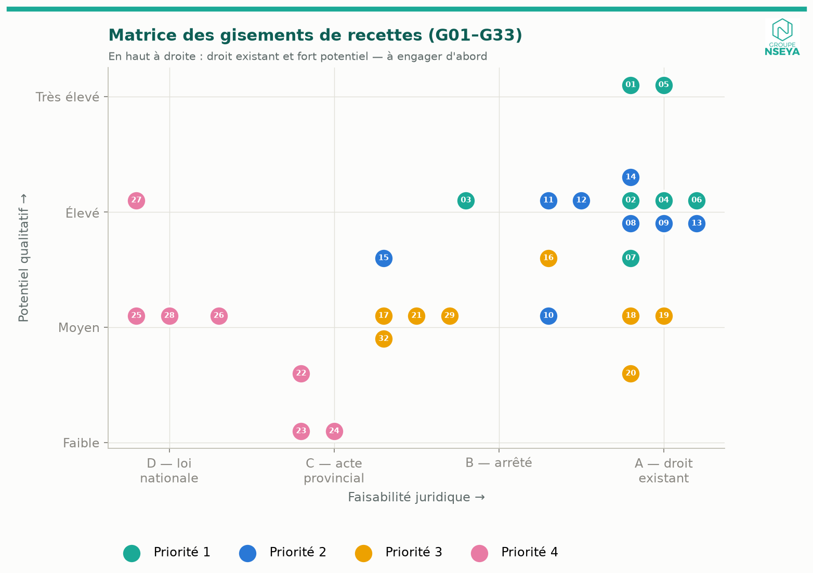
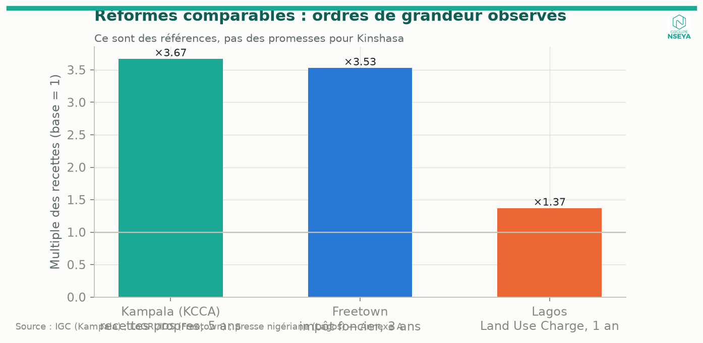

# 7. Paysage des recettes

Les catégories ci-dessous structurent le paramétrage, **sous réserve de la certification prévue au chapitre 6**. La colonne « Rendement à Kinshasa » est une appréciation qualitative fondée sur la structure économique de la ville ; elle n'est pas une prévision. La colonne « Régie » indique l'hypothèse de rattachement après la réforme de 2026 (DGIPK pour les impôts, direction des droits, taxes et redevances — DGTK, successeur de la DGRK — pour les autres recettes) ; elle est configurable.

## 7.1 Impôts provinciaux

| Recette | Objet fiscal dans MOSOLO | Fait générateur | Régie | Où se trouvent déjà les redevables | Statut juridique | Rendement à Kinshasa |
|---|---|---|---|---|---|---|
| **Impôt foncier** (bâti et non bâti) | Parcelle, bâtiment ; rang de localité ; superficie ; catégorie de redevable | Propriété ou possession d'un immeuble au 1er janvier [À VÉRIFIER] | DGIPK | Titres fonciers, permis de bâtir, raccordements électricité et eau, déclarations antérieures | Art. 204 pt 16 [CONFIRMÉ] ; barèmes 2026 [À VÉRIFIER] | Élevé ; très grand nombre de petits montants |
| **Impôt sur les revenus locatifs** | Unité louée, bail, bailleur, locataire, loyer | Perception de loyers | DGIPK | Indemnités de logement en paie, agences, baux d'entreprises, compteurs multiples, annonces | Art. 204 pt 16 [CONFIRMÉ] ; taux 22/17 % et retenue 20/15 % [CONFIRMÉ presse, arrêté À VÉRIFIER] | **Le plus élevé** ; fortement sous-déclaré |
| **Impôt sur les véhicules automoteurs** | Véhicule, plaque, catégorie, puissance, usage | Détention d'un véhicule immatriculé [À VÉRIFIER] | DGIPK | Fichier des immatriculations, assurances, mutations, contrôles routiers | Art. 204 pt 16 [CONFIRMÉ] ; barèmes [À VÉRIFIER] | Élevé |
| **Impôt sur la superficie des concessions minières** (et d'hydrocarbures [À VÉRIFIER]) | Concession, superficie, titulaire | Détention d'un titre | DGIPK | Cadastre minier | OL 18/004 [CONFIRMÉ pour les concessions minières] | Faible à Kinshasa |

## 7.2 Taxes d'intérêt commun (liste à confirmer sur l'OL 18/004)

| Recette | Objet | Mécanisme de capture | Point de vigilance | Rendement |
|---|---|---|---|---|
| Taxe spéciale de circulation routière | Véhicule | Même objet et même scan que l'impôt sur les véhicules | Clé de répartition [À VÉRIFIER] | Moyen à élevé |
| Taxe annuelle pour la délivrance de la patente | Activité, établissement, étal | Recensement par marché et par rue ; code marchand de monnaie mobile ; vignette QR sur devanture | Ne pas confondre existence d'une activité et assujettissement (seuils, régimes) | Volume élevé, ticket faible |
| Taxes de consommation sur bière, alcools, spiritueux et tabac | Producteur, importateur, volumes | Cellule grands redevables : déclaration mensuelle de volumes rapprochée des données d'accises et de facturation | Articulation avec les droits d'accises centraux ; peu de redevables, enjeux élevés | Très élevé, très peu de redevables |
| Taxe de superficie sur les concessions forestières | Concession | Liquidation sur la superficie du titre | Données du ministère de l'Environnement | Faible à Kinshasa |
| Taxe de superficie sur les concessions minières | Concession | Idem | Cadastre minier | Faible |
| Taxe sur les ventes de matières précieuses de production artisanale (or, diamant) | Comptoir, négociant, transaction | Déclaration par transaction des comptoirs agréés | Coordination avec les services des mines | Faible à Kinshasa, sauf comptoirs |

## 7.3 Taxes, droits et redevances propres à la province

| Recette | Objet | Mécanisme de capture | Titre délivré | Rendement |
|---|---|---|---|---|
| Autorisation de transport (personnes, marchandises) | Véhicule de transport, opérateur | Autorisation rattachée à l'objet véhicule, contrôle par plaque | Titre annuel ou périodique (module 70) | Moyen |
| Embarquement et débarquement (routier, fluvial) | Point d'embarquement, embarcation, véhicule | Paiement mobile au point de départ ; comptage croisé | Titre par voyage ou périodique | Moyen |
| Publicité extérieure | Support, face, surface, emplacement | Identifiant géofiscal et plaque QR par support ; tout support sans plaque est présumé non enregistré | Autorisation annuelle | Élevé |
| Antennes de télécommunications | Site, pylône, opérateur | Listes de sites des opérateurs ; liquidation annuelle | Avis annuel | Élevé ; risque de contentieux |
| Entretien de la voirie et drainage | Parcelle, activité, véhicule selon texte | Adossé aux objets existants | Selon texte | Moyen |
| Assainissement | Parcelle, activité | Idem | Selon texte | Moyen |
| Autorisation d'exploitation de débit de boissons | Établissement, catégorie | Recoupement avec les points de livraison des brasseries | Autorisation annuelle | Élevé |
| Spectacles et divertissements | Événement, salle, organisateur | Autorisation conditionnée à l'enregistrement ; assiette sur billetterie déclarée | Autorisation par événement | Moyen |
| Carrières à ciel ouvert | Site, exploitant | Sites géoréférencés ; comptage des sorties de camions rapproché des déclarations | Autorisation + déclaration | Moyen |
| Péage provincial | Axe, passage | Reçu électronique lié à la plaque | Titre par passage ou abonnement | Moyen |
| Accostage dans les ports privés | Quai, embarcation | Déclaration de mouvements, contrôle | Titre par escale | Moyen |
| Produits forestiers non ligneux | Point de vente, quantité | Déclaration aux points de contrôle | Titre de transport | Faible |
| Occupation du domaine public | Emprise | Plan géoréférencé des emprises | Autorisation d'occupation | Moyen à élevé |
| Stationnement | Place, zone | Sessions payées par plaque | Titre horaire à mensuel | Moyen à élevé (après acte de zonage) |
| Marchés | Étal, emplacement | Plan des marchés, titres périodiques | Titre journalier à mensuel | Élevé en volume ; historiquement en espèces |
| Permis et documents administratifs | Acte demandé | Liquidation à la demande | Acte + quittance | Moyen |

## 7.4 Recettes administratives et domaniales

Actes, permis, duplicatas, attestations, autorisations et autres droits légalement prévus, rattachés à une demande, un acte ou une prestation ; loyers et redevances d'actifs provinciaux ; concessions. Chaque ligne suit la règle d'or (§ 6.12).

## 7.5 Inventaire de référence à constituer (phase 0)

Le programme construit, avant tout paramétrage, l'inventaire exhaustif des recettes effectivement perçues aujourd'hui. Il alimente la base de référence (chapitre 38).

| Attribut | Contenu attendu | Source |
|---|---|---|
| Recette et code | Libellé officiel, code budgétaire | Nomenclature budgétaire |
| Administration | Régie ou service responsable | Arrêtés 2026 |
| Base légale | Texte, article, statut de certification | Relevé juridique |
| Mode de perception actuel | Déclaratif, rôle, perception au point de service | Régie |
| Canaux | Guichet, banque, monnaie mobile, agent, portail existant | Régie, banques |
| Comptes | Comptes publics de destination actuels | Trésor provincial |
| Systèmes | Portail de déclaration existant, logiciels, bases | DSI provinciale |
| Volumétrie | Nombre de redevables et d'opérations par période | Régie |
| Réalisations | Montants liquidés, encaissés, rapprochés, par mois, trois derniers exercices | Régie, Trésor |
| Coût de collecte | Coût observé | Finances |
| Déperdition estimée | Écart entre dû, encaissé et rapproché | Audit |
| Données disponibles | Sources, qualité, fraîcheur | Programme |

# 8. Nouvelles opportunités de recettes

## 8.1 Doctrine

KINSHASA MOSOLO cherche **d'abord l'argent déjà légalement dû** : assiettes non recensées, sous-déclarations, arriérés, défauts de rapprochement, exonérations et annulations irrégulières, fuites dans la collecte. Les prélèvements nouveaux ne viennent qu'ensuite, par la voie légale, après analyse d'impact et consultation. **Aucune opportunité ne devient une recette par décision algorithmique.**

Chaque piste est instruite selon la même grille de quinze attributs : faisabilité juridique ; objectif de politique publique ; autorité responsable ; fait générateur ; population concernée ; méthode de calcul ; coût de mise en œuvre ; impact social ; impact économique ; potentiel de recettes ; risque de corruption ; exigences de contrôle ; texte requis ; priorité ; recommandation de pilote.

## 8.2 Matrice de synthèse des gisements

Légende. **Faisabilité juridique** : A = droit existant (sous certification) ; B = arrêté ou décision d'exécution ; C = édit ou acte provincial nouveau dans le cadre de la nomenclature ; D = loi nationale ou compétence incertaine. **Potentiel** : qualitatif, à chiffrer par la base de référence. **Risque de corruption** : F faible, M moyen, É élevé. **Priorité** : 1 (immédiate) à 4 (étude).

| ID | Gisement | Nature | Faisab. | Potentiel | Risque corr. | Priorité | Pilote |
|---|---|---|---|---|---|---|---|
| G01 | Recensement locatif systématique (unités, baux) | Assiette existante | A | Très élevé | É (négociation terrain) | 1 | Oui, 4 communes |
| G02 | Recensement foncier et requalification bâti/non bâti | Assiette existante | A | Élevé | M | 1 | Oui |
| G03 | Quitus fiscal numérique et conditionnalité des services | Conformité | B | Élevé (effet levier) | F | 1 | Oui |
| G04 | Retenue IRL par les employeurs et locataires personnes morales | Assiette existante | A | Élevé | F | 1 | Oui (grands employeurs) |
| G05 | Cellule grands redevables (bière, tabac, antennes, carrières) | Fiabilisation | A | Très élevé par redevable | M | 1 | Oui |
| G06 | Rapprochement automatisé et fin des fausses quittances | Déperdition évitée | A | Élevé | Réduit le risque | 1 | Oui |
| G07 | Registre des exonérations et contrôle des annulations | Récupération de base | A | Moyen à élevé | Réduit le risque | 1 | Oui |
| G08 | Véhicules : rapprochement immatriculations–vignette–contrôles | Assiette existante | A | Élevé | M | 2 | Oui, contrôles ciblés |
| G09 | Publicité extérieure non déclarée | Assiette existante | A | Élevé | M | 2 | Oui, axes de Gombe |
| G10 | Occupation du domaine public (terrasses, étals, chantiers) | Assiette existante | A/B | Moyen | É | 2 | Oui |
| G11 | Marchés : titres numériques, fin de la collecte en espèces | Déperdition évitée | A/B | Élevé en volume | É | 2 | Oui, 2 marchés |
| G12 | Recouvrement des arriérés et régularisation volontaire | Recettes historiques | A/B | Élevé ponctuel | M | 2 | Oui |
| G13 | Débits de boissons (recoupement livraisons brasseries) | Assiette existante | A | Élevé | M | 2 | Oui |
| G14 | Antennes : inventaire contradictoire des sites | Assiette existante | A | Élevé | F | 2 | Oui |
| G15 | Stationnement réglementé (zones, rotation) | Redevance de service | B/C (zonage, tarif) | Moyen à élevé | M (réduit si sans espèces) | 2 | Oui, Gombe après acte |
| G16 | Embarquement et transport (y compris moto-taxis) | Assiette existante | A/B | Moyen à élevé | É (prélèvements informels) | 3 | Après concertation |
| G17 | Droits liés aux chantiers et permis de bâtir | Droit administratif | B/C | Moyen | M | 3 | Oui |
| G18 | Carrières : comptage des sorties rapproché des déclarations | Assiette existante | A | Moyen | M | 3 | Étude |
| G19 | Ports privés et accostage | Assiette existante | A | Moyen | M | 3 | Cadrage sectoriel |
| G20 | Événements et spectacles (billetterie déclarée) | Assiette existante | A | Faible à moyen | M | 3 | Oui |
| G21 | Location et valorisation d'actifs provinciaux sous-utilisés | Recette domaniale | B/C | Moyen | É (bradage) | 3 | Inventaire d'abord |
| G22 | Droits de dénomination et de publicité sur actifs publics | Recette commerciale | C | Faible à moyen | É | 4 | Étude |
| G23 | Services administratifs numériques premium (délai garanti) | Droit administratif | C | Faible | M (service à deux vitesses) | 4 | Étude |
| G24 | Produits de données urbaines anonymisées | Recette commerciale | C + protection des données | Faible | M (ré-identification) | 4 | Non avant 2028 |
| G25 | Contribution environnementale plastique / REP | Prélèvement nouveau | **D** | Moyen, décroissant | M | 4 | Étude d'impact |
| G26 | Accès logistique des poids lourds et zones de livraison | Redevance nouvelle | C/D | Moyen | M | 4 | Étude |
| G27 | Captation de plus-value foncière liée aux infrastructures | Prélèvement nouveau | **D** | Élevé à long terme | É (évaluation) | 4 | Étude |
| G28 | Péages urbains, congestion, basses émissions | Prélèvement nouveau | **D** | Incertain | M | 4 | Non recommandé à court terme |
| G29 | Gestion des déchets : redevance d'enlèvement liée au service | Redevance de service | B/C | Moyen | M | 3 | Avec un opérateur de service |
| G30 | Tourisme (hébergement) | Selon nomenclature | C/D | Faible à moyen | F | 4 | Étude |
| G31 | Réduction du coût de collecte (moins d'intermédiaires, moins d'espèces) | Efficience | A | Moyen (net) | Réduit le risque | 1 | Mesuré dans le pilote |
| G32 | Partenariats public-privé d'infrastructures payantes (marchés modernisés, gares routières, parkings en ouvrage) | Concession | B/C + Loi PPP | Moyen | É | 3 | Un projet test |
| G33 | Sanctions pour non-conformité vérifiée | Pénalités légales | A (selon édit) | Faible à moyen | É si discrétionnaire | 2 | Encadré, jamais automatique |

## 8.3 Fiches détaillées des gisements prioritaires

Chaque fiche suit la grille des quinze attributs. Les ordres de grandeur de potentiel sont exprimés **en formule** ; les valeurs chiffrées appartiennent au chapitre 38 et restent des exemples tant que la base de référence n'est pas mesurée.

### G01 — Recensement locatif systématique

| Attribut | Contenu |
|---|---|
| Faisabilité juridique | A — IRL prévu par la Constitution et la nomenclature ; taux et procédure à certifier (J3, J4) |
| Objectif de politique publique | Équité entre bailleurs ; élargissement de l'assiette sans hausse de taux |
| Autorité | DGIPK ; ministère provincial des Finances |
| Fait générateur | Perception d'un loyer sur une unité située à Kinshasa |
| Population concernée | Bailleurs personnes physiques et morales ; locataires retenant à la source |
| Méthode de calcul | Loyer effectivement perçu × taux du rang ; imputation des retenues |
| Coût de mise en œuvre | Recensement terrain (agents, terminaux), plaques, communication, protocoles de données ; coût par unité à établir par devis |
| Impact social | Risque de répercussion sur les loyers ; risque de pression sur les petits bailleurs ; atténuation par campagne de régularisation, simplicité et paiement fractionné si la loi le permet |
| Impact économique | Formalisation du marché locatif ; données utiles à la politique du logement |
| Potentiel | `Unités louées estimées × loyer moyen × taux × (conformité cible − conformité actuelle)` |
| Risque de corruption | Élevé : négociation de la déclaration sur le terrain. Contre-mesures : l'agent n'encaisse rien, ne voit pas le montant final, constats photographiés et géolocalisés, double visite aléatoire |
| Exigences de contrôle | Visites ciblées après revue humaine ; recoupements (compteurs, indemnités de logement, annonces) sous protocole |
| Texte requis | Aucun pour l'impôt ; protocoles de données (J13) ; éventuel arrêté sur la plaque d'immatriculation fiscale des immeubles |
| Priorité | 1 |
| Pilote | Recensement complet de quartiers échantillons dans les quatre communes pilotes avant la campagne de février 2027 |

### G03 — Quitus fiscal numérique

| Attribut | Contenu |
|---|---|
| Faisabilité juridique | B — quitus existant ; conditionnalité à fonder sur l'acte qui l'institue et, pour de nouveaux services, sur arrêté |
| Objectif | Faire de la conformité une condition d'accès, sans prélèvement nouveau |
| Autorité | DGIPK ; services délivrant les autorisations |
| Fait générateur | Demande d'un service conditionné (marché public provincial, permis de bâtir, mutation, autorisation) |
| Population | Entreprises soumissionnaires, propriétaires, demandeurs d'autorisations |
| Méthode | Vérification en temps réel de l'absence d'obligation exigible non contestée ; QR vérifiable ; durée de validité |
| Coût | Faible (logiciel, intégration aux services) |
| Impact social | Risque d'exclusion si le contribuable conteste de bonne foi : le recours en cours suspend l'effet bloquant |
| Impact économique | Incitation forte à la régularisation des entreprises |
| Potentiel | Indirect : `régularisations déclenchées par des demandes de service × montant moyen` |
| Risque de corruption | Faible si délivrance automatique ; élevé si délivrance manuelle — la délivrance manuelle est supprimée |
| Contrôle | API de vérification pour les services ; journal des vérifications |
| Texte requis | Acte de conditionnalité par service (J6) |
| Priorité | 1 |
| Pilote | Marchés publics provinciaux et permis de bâtir dans les communes pilotes |

### G05 — Cellule grands redevables

| Attribut | Contenu |
|---|---|
| Faisabilité | A |
| Objectif | Fiabiliser les recettes concentrées (bière, tabac, antennes, carrières, grands bailleurs, grands employeurs) |
| Autorité | DGIPK et DGTK selon recette |
| Fait générateur | Selon la recette (volumes mis à la consommation, sites, superficies) |
| Population | Quelques centaines d'entités |
| Méthode | Déclaration mensuelle structurée par API ou portail ; rapprochement avec données tierces (accises, facturation, listes de sites) |
| Coût | Faible |
| Impact social | Neutre |
| Impact économique | Sécurité juridique pour les entreprises (interlocuteur unique, règles lisibles) |
| Potentiel | `Écart déclaré vs rapproché × nombre de redevables` |
| Risque de corruption | Moyen (négociations de haut niveau) : décisions collégiales, piste d'audit, rotation |
| Contrôle | Contrôles sur pièces, contrôle contradictoire |
| Texte requis | Conventions de déclaration |
| Priorité | 1 |
| Pilote | Brasseries et opérateurs télécoms dès R2 |

### G06 — Rapprochement automatisé et fin des fausses quittances

| Attribut | Contenu |
|---|---|
| Faisabilité | A |
| Objectif | Garantir que chaque paiement déclaré atteint le compte public ; rendre inopérantes les fausses preuves de paiement (des poursuites pour faux et usage de faux sur des preuves de paiement ont été rapportées à Kinshasa en 2025–2026) |
| Autorité | Trésor provincial ; régies |
| Fait générateur | Tout paiement |
| Population | Tous les contribuables |
| Méthode | Référence unique, confirmation serveur à serveur signée, relevés bancaires quotidiens, grand livre en partie double |
| Coût | Intégrations bancaires et opérateurs |
| Impact social | Positif : preuve vérifiable par le contribuable |
| Impact économique | Baisse du coût de la conformité |
| Potentiel | `Montants en suspens ou détournés récupérés + fraudes évitées` |
| Risque de corruption | Réduit structurellement |
| Contrôle | Files d'exception, suspens daté, alertes |
| Texte requis | Conventions avec banques et opérateurs |
| Priorité | 1 |
| Pilote | Toutes les recettes du pilote |

### G11 — Marchés sans espèces

| Attribut | Contenu |
|---|---|
| Faisabilité | A/B — droits de place existants ; modalités de perception numérique par arrêté ou décision |
| Objectif | Supprimer la collecte en espèces, première source de fuite ; sécuriser les vendeurs contre les prélèvements multiples |
| Autorité | Régie compétente ; gestionnaires de marchés ; communes selon compétence |
| Fait générateur | Occupation d'un étal ou d'un emplacement |
| Population | Commerçants de marché, dont beaucoup sans compte bancaire |
| Méthode | Tarif par étal et par période ; titre numérique (QR, SMS) ; paiement par monnaie mobile ou point de paiement agréé |
| Coût | Plans des marchés, plaques d'étal, points de paiement |
| Impact social | Fort, positif si les prélèvements informels disparaissent ; risque d'exclusion des vendeurs sans téléphone : carte MOSOLO et points agréés |
| Impact économique | Prévisibilité pour les vendeurs |
| Potentiel | `Étals × tarif × jours × (taux de paiement cible − actuel)` |
| Risque de corruption | Élevé : les expériences régionales montrent qu'une « numérisation cosmétique » avec saisie a posteriori par le collecteur laisse les fuites intactes ; **le paiement direct au compte public est la condition de l'effet** |
| Contrôle | Contrôle par scan d'étal ; contrôles mystère |
| Texte requis | Décision fixant la perception numérique exclusive |
| Priorité | 2 |
| Pilote | Deux marchés de taille moyenne |

### G15 — Stationnement réglementé

| Attribut | Contenu |
|---|---|
| Faisabilité | B/C — redevance existante dans la nomenclature provinciale ; acte de zonage et barème nécessaires |
| Objectif | Rotation, fluidité, recettes d'usage de la voirie |
| Autorité | Ministère provincial des Transports ; régie des taxes |
| Fait générateur | Stationnement en zone réglementée |
| Population | Automobilistes, entreprises |
| Méthode | Tarif horaire par zone ; titre lié à la plaque ; contrôle par terminal ou caméra |
| Coût | Signalisation, marquage, terminaux ; caméras en phase ultérieure |
| Impact social | Faible pour les ménages sans véhicule ; attention aux riverains (abonnements) |
| Impact économique | Rotation favorable au commerce |
| Potentiel | `Places × taux d'occupation payante × heures × tarif` |
| Risque de corruption | Moyen ; réduit par l'absence d'espèces et la verbalisation tracée |
| Contrôle | Constat numérique ; amende selon barème réglementaire ; recours |
| Texte requis | Arrêté de zonage et de tarifs ; barème des amendes |
| Priorité | 2 |
| Pilote | Axes de la Gombe après l'acte ; les enlèvements et immobilisations restent des décisions humaines |

### G12 — Arriérés et régularisation volontaire

| Attribut | Contenu |
|---|---|
| Faisabilité | A pour le recouvrement ; B/C pour une remise de pénalités (J14) |
| Objectif | Récupérer des recettes dues ; remettre les contribuables dans le système |
| Autorité | Régies ; Finances |
| Fait générateur | Obligations antérieures non payées et non prescrites |
| Population | Contribuables en retard |
| Méthode | Segmentation par âge, montant, solvabilité ; relances graduées ; échéanciers si la loi le permet |
| Coût | Faible |
| Impact social | Modéré ; proportionnalité exigée |
| Impact économique | Neutre à positif |
| Potentiel | `Stock d'arriérés recouvrables × taux de recouvrement par segment` |
| Risque de corruption | Moyen (remises négociées) : remises uniquement par règle, jamais au cas par cas sans double approbation |
| Contrôle | Journal des remises ; alertes de concentration |
| Texte requis | Acte de régularisation si remise de pénalités |
| Priorité | 2 |
| Pilote | Campagne ciblée après la campagne de février 2027 |

## 8.4 Leviers de maximisation et moteur de découverte

| # | Levier | Action | Mesure |
|---|---|---|---|
| 1 | Couverture | Recenser objets et activités invisibles | Objets vérifiés nouveaux |
| 2 | Rattachement | Associer chaque objet au bon compte | Taux d'identification |
| 3 | Qualité | Corriger adresses, catégories, dimensions | Baisse des rejets et recours fondés |
| 4 | Règles | Appliquer exactement la règle en vigueur | Écart de liquidation |
| 5 | Déclaration | Pré-remplissage, rappels | Taux de dépôt à temps |
| 6 | Paiement | Canaux simples, références uniques | Conversion avis → paiement |
| 7 | Rapprochement | Dénouement automatisé | Montants en exception |
| 8 | Recouvrement | Prioriser le rendement net | Recouvré par unité de coût |
| 9 | Intégrité | Détecter exonérations, annulations, collusions | Déperdition évitée |
| 10 | Service | Réduire erreurs et déplacements | Satisfaction, délais |
| 11 | Données | Partager légalement les signaux utiles | Nouvelles correspondances |
| 12 | Pilotage | Responsabiliser par zone et catégorie | Écart cible/réalisé |

**Pipeline de découverte.** Signal (IA, terrain, partenaire) → qualification juridique (juriste) → estimation en trois scénarios (analyste) → impact socio-économique → risque de corruption (contrôle interne) → coût → proposition de pilote → décision motivée de l'autorité compétente. Le moteur classe les pistes par **revenu net ajusté du risque** : potentiel légal × probabilité de conformité × vitesse d'encaissement − coûts de recensement et de contrôle − risque de contestation − risque social. Les tableaux de bord séparent toujours recettes nouvelles, arriérés, gains de rapprochement et simple reclassement.

**Signaux de recoupement** (chaque source exige un protocole signé, J13) :

| Signal | Règle | Sortie (jamais une dette) |
|---|---|---|
| Point de livraison d'une brasserie | Pas d'autorisation de débit de boissons à moins de 50 m | Objet provisoire « débit de boissons » et visite |
| Code marchand de monnaie mobile actif | Pas d'objet patente à l'emplacement | Commerce probablement non enregistré |
| Plaque lue lors d'un contrôle | Vignette non valide | Statut pour le contrôleur |
| Candidature à un marché provincial | Pas de quitus valide | Service suspendu jusqu'à régularisation, si l'acte le prévoit |
| Parcelle à compteurs multiples | Pas de déclaration locative | Probable bien loué : visite de vérification |
| Indemnités de logement en paie | Pas de retenue IRL correspondante | Notification à l'employeur |
| Parcelle déclarée non bâtie | Imagerie ou permis montrant une construction | Requalification contrôlée |

## 8.5 Contribution sur les plastiques : analyse de faisabilité

**Constat juridique.** Le Décret n° 17/018 du 30 décembre 2017 **interdit** la production, l'importation, la commercialisation et l'utilisation de sacs, sachets, films et autres emballages plastiques visés (emballages alimentaires, eau et boissons, plastiques non biodégradables), avec des exemptions (usage médical, agricole, sacs poubelle, BTP, bouteilles d'eau, etc.) [CONFIRMÉ]. La Ville a par ailleurs pris en 2021 une mesure d'interdiction des emballages plastiques et de l'eau en sachet, faiblement appliquée [PROBABLE]. La Loi n° 11/009 modifiée consacre le principe pollueur-payeur [CONFIRMÉ]. **Aucune taxe ni contribution plastique nationale ou provinciale n'a été identifiée.**

**Conséquences.**

1. Une taxe sur des produits **interdits** serait incohérente : elle légitimerait une activité illicite. Le seul flux financier lié aux produits interdits est l'amende prévue par l'arrêté d'exécution, qui relève de l'autorité compétente en matière d'environnement.
2. Un prélèvement ne peut viser que les plastiques **licites** (produits exemptés, emballages non couverts, bouteilles PET, emballages industriels).
3. En vertu de l'article 174 de la Constitution et de la nomenclature, **une province ne peut pas créer par simple édit un impôt absent de la nomenclature** [à confirmer par J15–J16]. Trois voies sont envisageables :

| Voie | Nature | Base juridique à établir | Avantages | Risques |
|---|---|---|---|---|
| V1 — Rattachement à une ligne existante de la nomenclature (assainissement, environnement) | Taxe ou redevance provinciale | Lecture certifiée de l'OL 18/004 | Pas de loi nouvelle | Risque de requalification et de contentieux si le rattachement est forcé |
| V2 — Responsabilité élargie du producteur (REP) conventionnelle | Contribution versée par les metteurs en marché à un dispositif de collecte et de recyclage, contre un service | Loi environnementale (pollueur-payeur) + convention + éventuel décret national | Finance un service mesurable ; accepté internationalement | Ce n'est pas une recette fiscale ; exige un éco-organisme gouverné et audité |
| V3 — Loi nationale ou modification de la nomenclature | Impôt ou taxe nouvelle | Parlement | Sécurité juridique maximale | Délai long |

**Politique recommandée.** (1) Faire appliquer l'interdiction existante par l'autorité compétente, avec des amendes tracées dans MOSOLO si la Province est compétente pour les constater ; (2) lancer une étude d'impact et une consultation sur une **REP** couvrant les emballages licites (voie V2) ; (3) ne mettre en place une contribution fiscale (V1 ou V3) qu'après avis juridique certifié. **Aucune activation dans la plateforme avant ces étapes** (module 18 en catégorie `ACTE_REQUIS`).

**Évaluation d'impact économique à produire.** Volumes mis en marché par catégorie (importations, production locale) ; élasticité de la demande ; effet sur les prix des biens de première nécessité ; risque de contrebande interprovinciale et transfrontalière ; effet sur l'emploi informel (récupérateurs) ; coût de collecte et de recyclage ; scénario de **recettes décroissantes** si la politique réussit (les recettes d'une taxe à l'unité baissent quand la consommation baisse).

**Consultation.** Fabricants, importateurs, distributeurs, grandes surfaces, brasseries et producteurs d'eau, associations de récupérateurs, organisations environnementales, communes, ministère national de l'Environnement.

**Conditions de mise en œuvre.** Base juridique certifiée ; registre des metteurs en marché ; déclarations périodiques de volumes ; rapprochement avec données douanières ; affectation transparente (collecte, assainissement) dans le respect des règles budgétaires ; indicateurs environnementaux publiés.

**Références comparatives** : taxe à l'unité sur les sacs en Afrique du Sud (depuis 2004, relevée progressivement) ; interdictions au Rwanda (2008), au Kenya (2017), en Tanzanie (2019) ; interdiction du plastique à usage unique et cadre REP au Nigeria [voir Annexe A]. Leçon : les interdictions ne produisent pas de recettes, hors amendes ; seule une contribution par unité ou une REP produit un flux régulier.

## 8.6 Scénarios de potentiel : méthode

Aucune projection n'est présentée comme acquise. Trois scénarios sont calculés pour chaque gisement, à partir de la base de référence :

| Scénario | Hypothèses types | Référence empirique utilisable |
|---|---|---|
| **Conservateur** | Conformité faible et lente à progresser ; résistance ; protocoles de données retardés | Expériences de collecte de l'impôt foncier à Kananga (RDC) : conformité de l'ordre de 5 à 13 % selon les modalités [CONFIRMÉ — publications académiques] |
| **Attendu** | Pilote réussi ; extension régulière ; protocoles obtenus ; rapprochement automatisé | Hausse des recettes propres de Kampala (KCCA) d'environ ×3,7 en cinq ans après réforme administrative et numérique [CONFIRMÉ] |
| **Transformationnel (ambitieux)** | Quitus généralisé ; grands redevables fiabilisés ; arriérés recouvrés ; registre quasi exhaustif | Freetown : registre foncier doublé et recettes foncières multipliées par plus de trois en trois ans, avec une réforme suspendue six mois pour raisons politiques [PROBABLE] |

Deux enseignements empiriques orientent la conception : (1) **la simplicité et la modération des montants forfaitaires augmentent la conformité**, parfois au point d'augmenter la recette totale ; (2) **l'appui d'acteurs locaux de confiance** (chefs de quartier, associations) améliore la conformité et le rendement par unité de coût. Ces effets doivent être testés, pas supposés, dans le pilote (chapitre 45).

