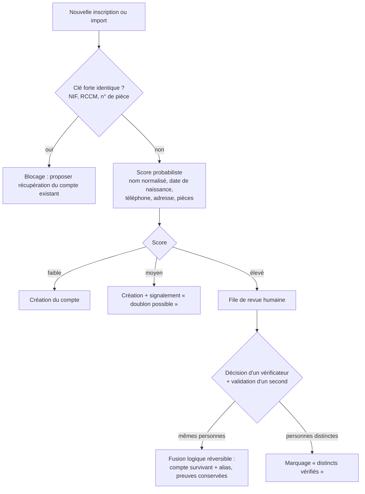
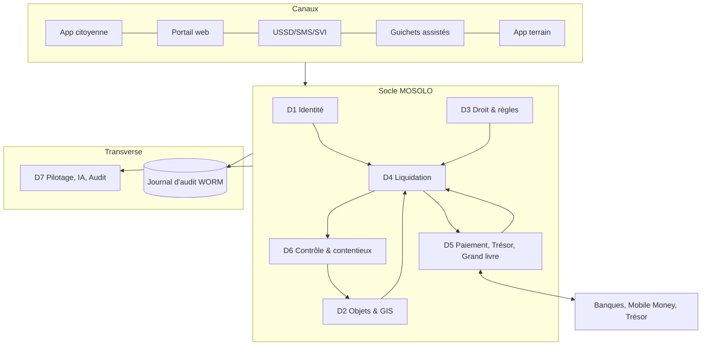

# 9. Modèle « un utilisateur, un compte »

## 9.1 Principe

Chaque personne physique ou morale dispose d'**un compte principal unique**, utilisable dans tous les modules. Ce compte porte l'identité, les coordonnées vérifiées, les rôles, les objets rattachés, les obligations, les paiements, les quittances, les preuves, les mandats, les consentements et les recours. Une même personne peut détenir, sous une seule connexion, un espace personnel et un ou plusieurs espaces d'organisation (entreprise, association, institution) dont elle est mandataire.

Trois règles gouvernent le modèle :

1. **Saisir une fois, réutiliser partout.** Une donnée vérifiée n'est jamais redemandée par un autre module ; elle est réutilisée avec son niveau de vérification et sa date.
2. **Minimiser.** Chaque champ du profil a une finalité documentée dans le registre des traitements (chapitre 32). Un champ sans finalité n'est pas collecté. La date et le lieu de naissance, par exemple, ne sont collectés que lorsqu'un texte ou une procédure d'identification l'exige.
3. **Déclarer n'est pas prouver.** La déclaration d'un rôle (propriétaire, bailleur, locataire) ouvre une instruction ; elle n'établit à elle seule ni la propriété, ni l'assujettissement, ni la dette.

## 9.2 Identifiants

| Identifiant | Émetteur | Usage dans MOSOLO | Statut |
|---|---|---|---|
| **IUC — Identifiant unique de contribuable MOSOLO** | MOSOLO (aléatoire, non signifiant, avec clé de contrôle) | Clé technique interne et référence du compte ; ne remplace aucun identifiant légal | Créé à l'enrôlement |
| **NIF** | Administration fiscale nationale (DGI) | Clé de rapprochement privilégiée lorsqu'il existe ; demande de NIF facilitée lorsque la procédure le permet | [À VÉRIFIER] conditions d'accès provincial au répertoire NIF et protocole DGI |
| Pièce d'identité légalement acceptée | État (carte d'électeur, passeport, carte nationale d'identité lorsque disponible, etc.) | Preuve d'identité des personnes physiques | [À VÉRIFIER] liste officielle des pièces acceptées par les régies provinciales |
| RCCM, identification nationale | Guichet unique / greffe | Personnes morales | Protocole à conclure |
| Téléphone vérifié (OTP) | Opérateur | Canal d'authentification et de notification ; **n'est pas une preuve d'identité** | — |
| Identifiant géofiscal (IGF) | MOSOLO | Identifie un **objet**, pas une personne (ch. 17) | — |

**Hypothèse de conception sûre.** Tant que le protocole d'accès au répertoire NIF n'est pas signé, l'IUC est la clé de rattachement et le NIF est un attribut facultatif vérifié manuellement. Aucune fonctionnalité ne dépend de la disponibilité d'une base nationale.

## 9.3 Niveaux de vérification et droits ouverts

| Niveau | Preuve exigée | Droits ouverts | Durée de validité |
|---|---|---|---|
| **N0 — déclaratif** | Téléphone vérifié par OTP | Consulter, simuler, signaler, payer une référence reçue | Illimitée |
| **N0-A — assisté** | Enrôlement assisté (guichet, agent habilité), consentement oral enregistré, carte MOSOLO | Droits N0 + paiement assisté | Illimitée |
| **N1 — identifié** | Pièce d'identité contrôlée (photo + OCR + contrôle visuel), adresse déclarée | Déclarer des objets, recevoir des obligations, obtenir des quittances | Revue tous les 3 ans |
| **N2 — vérifié** | Vérification documentaire approfondie ou visite terrain | Rattachement d'objets de forte valeur, contestation formelle, mandat simple | Revue tous les 3 ans |
| **N3 — certifié** | NIF vérifié, RCCM pour les personnes morales, mandat écrit ou notarié pour les représentants | Opérations d'entreprise, mandat de tiers, quitus fiscal, grands redevables | Revue annuelle |

## 9.4 Profils et parcours d'enrôlement

Chaque profil suit un parcours court qui ne demande que les informations utiles à ses obligations potentielles. Le tronc commun (identité, contact, adresse) est saisi une fois ; les blocs spécifiques s'ajoutent lorsque le rôle est activé.

| Profil | Bloc spécifique | Pièces typiques | Vérification | Objets créés ou rattachés |
|---|---|---|---|---|
| Citoyen | Tronc commun | Pièce d'identité | N1 | — |
| Propriétaire | Parcelle(s), titre ou preuve d'occupation | Certificat d'enregistrement, contrat de location du sol, fiche parcellaire, livret de logeur [À VÉRIFIER liste] | N2 pour rattachement définitif | Parcelle, bâtiment |
| Bailleur | Unités louées, baux, loyers | Contrats de bail, reçus de loyer | N2 | Unité locative, bail |
| Locataire | Unité occupée, bailleur, loyer | Contrat ou reçu de loyer | N1 | Bail (côté locataire) |
| Sous-locataire | Locataire principal, unité | Accord de sous-location | N1 | Bail secondaire |
| Occupant autorisé | Titre d'occupation | Attestation | N1 | Occupation |
| Gestionnaire immobilier | Mandats de gestion | Mandat écrit | N3 | Portefeuille d'objets sous mandat |
| Entreprise, société | RCCM, NIF, dirigeants, établissements | Statuts, RCCM, NIF | N3 | Établissements, activités |
| Opérateur informel | Activité, emplacement, pièce d'identité | Pièce d'identité, photo de l'activité | N1 (N0-A possible) | Activité, emplacement |
| Commerçant de marché | Marché, étal, catégorie | Carte de marché existante le cas échéant | N1 | Étal |
| Transporteur, propriétaire de véhicule | Véhicules, autorisations | Carte grise, permis, autorisation | N1/N3 | Véhicule, autorisation |
| Fabricant, importateur | Sites, produits, volumes | RCCM, NIF, licences | N3 | Site, déclarations de volumes |
| Boissons alcoolisées et tabac | Sites, entrepôts, points de distribution | Licences | N3 | Site, déclarations |
| Organisateur d'événements | Événements, lieux, billetterie | Autorisation | N1/N3 | Événement |
| Annonceur, régie publicitaire | Supports, emplacements, autorisations | Autorisations d'affichage | N3 | Support publicitaire |
| Carrières et mines | Sites, titres, superficies | Titre minier ou autorisation | N3 | Site, concession |
| Opérateur forestier | Concessions, produits | Titres forestiers | N3 | Concession |
| Batelier, opérateur portuaire | Embarcations, quais | Documents de navigation | N1/N3 | Embarcation, quai |
| Occupant du domaine public | Emprise, durée, usage | Autorisation d'occupation | N1 | Emprise |
| Association, confession, ONG | Statuts, représentants | Statuts, personnalité juridique | N3 | Établissements, baux |
| Institution publique | Service, représentant | Acte de nomination | N3 | Selon compétence |
| Mandataire, représentant | Mandant(s), périmètre, durée | Mandat | N3 | Aucun objet propre |
| Diaspora | Tronc commun, mandataire local | Passeport | N1 → N2 à distance (vidéo-vérification si acte l'autorise) | Selon objets |

## 9.5 Contenu du profil unifié et classification

| Bloc | Données | Finalité | Classification (ch. 32) |
|---|---|---|---|
| Identité | IUC, NIF, nom légal, pièce, date et lieu de naissance si requis | Identifier sans ambiguïté | C4 — sensible |
| Contact | Téléphones, courriel, langue, préférences de canal | Notifier, authentifier | C3 — personnel |
| Adresse | Commune, quartier, avenue, rue, référence de parcelle, GPS, précision, statut de vérification | Localiser, notifier | C3 |
| Situation résidentielle | Propriétaire occupant, bailleur, locataire, sous-locataire, occupant, gestionnaire, locataire commercial | Qualifier les règles potentielles | C4 |
| Rôles | Rôles actifs, dates, preuves | Déterminer la responsabilité selon la règle | C3 |
| Objets | Parcelles, bâtiments, unités, baux, activités, établissements, véhicules, autorisations de transport, supports publicitaires, antennes, embarcations, concessions, licences, permis | Liquider | C3/C4 |
| Situation fiscale | Obligations en cours, exigibles, en retard, payées, quittances, arriérés, échéanciers | Servir et recouvrer | C4 |
| Contentieux | Réclamations, recours, décisions | Garantir les droits | C4 |
| Contrôles | Inspections, constats, missions | Contrôler | C4 |
| Preuves | Documents, photos, procès-verbaux | Prouver | C4 |
| Mandats | Représentants, périmètre, durée | Représenter | C3 |
| Consentements et notifications | Historique des consentements, notifications et preuves de délivrance | Conformité | C3 |

## 9.6 Anti-doublon et rapprochement d'identités

La prévention des doublons repose sur un **rapprochement contrôlé**, jamais sur une fusion automatique fondée sur la ressemblance de noms.

Règles :

- **Clés fortes bloquantes** : deux comptes actifs ne peuvent porter le même NIF, le même RCCM ou le même numéro de pièce d'identité.
- **Normalisation des noms** adaptée aux usages congolais (ordre nom–post-nom–prénom variable, translittérations, homonymies fréquentes) ; la similarité de noms seule n'est **jamais** suffisante.
- **Fusion réversible** : le compte absorbé devient un alias ; aucune donnée ni preuve n'est écrasée ; la « défusion » est possible avec la même double validation.
- **Conflits sensibles** (propriété d'un bien de forte valeur, grand redevable, compte de fonctionnaire) : revue par un vérificateur de niveau supérieur.
- **Téléphone partagé** : un même numéro peut servir à plusieurs personnes d'un foyer ; il est un canal, pas un identifiant.

## 9.7 Cycle de vie du compte

`PROVISOIRE → ACTIF (N0…N3) → SUSPENDU (décision motivée) → CLÔTURÉ (décès, dissolution) → ARCHIVÉ`. Un compte n'est jamais supprimé ; la clôture conserve les obligations et l'historique selon les durées de conservation (chapitre 32). La récupération de compte (perte de téléphone, changement de numéro) exige une preuve d'identité au niveau du compte et une vérification hors bande pour les niveaux N2 et N3.

## 9.8 Ce que le compte unique change pour le contribuable

- Une seule saisie, une seule vue de tous ses objets, obligations, échéances et quittances.
- L'explication de chaque montant : règle, version, assiette, formule, échéance, voie de recours.
- Un paiement depuis le téléphone, avec référence unique et quittance immédiate vérifiable.
- Une contestation possible depuis chaque objet et chaque obligation, avec suivi du délai.
- Un mode diaspora : paiement par carte, mandataire local aux droits limités, quittances à distance.
- Un quitus fiscal numérique téléchargeable et vérifiable par tout service habilité.

# 10. Architecture fonctionnelle

## 10.1 Sept domaines, une responsabilité chacun

La plateforme est organisée en sept domaines fonctionnels. Chacun est propriétaire de ses données, expose des services aux autres et **s'interdit explicitement** certaines actions. Cette séparation est à la fois une règle d'architecture et un contrôle interne.

| Domaine | Responsabilité | Ne fait jamais |
|---|---|---|
| **D1 Identité et contribuable** | Comptes, rôles, vérification, mandats, consentements | Liquider une obligation |
| **D2 Objets et cadastre fiscal** | Recensement, géolocalisation, cycle de vie des objets | Trancher la propriété juridique |
| **D3 Droit et référentiel** | Instruments juridiques, fiches de règles, tarifs, exonérations, versions | Appliquer une règle non approuvée |
| **D4 Liquidation et obligations** | Déclarations, calculs, avis, échéanciers, pénalités légales, arriérés | Modifier une règle ou un paiement |
| **D5 Paiement, trésorerie et grand livre** | Ordres, événements de paiement, règlement, rapprochement, quittances, écritures | Créer une obligation |
| **D6 Contrôle et contentieux** | Missions, constats, notifications, recouvrement, recours | Encaisser |
| **D7 Pilotage, IA et audit** | Tableaux de bord, prévisions, détection, journal d'audit, recommandations | Décider ou exécuter un acte financier |

## 10.2 Principe de l'immutabilité des faits

**Les faits sont immuables ; les corrections sont des faits nouveaux.** Un constat erroné n'est pas effacé : il est annulé par un acte contraire, motivé, signé et relié à l'original. Une liquidation erronée est corrigée par une liquidation rectificative qui référence la précédente. Un paiement contesté est traité par un événement de litige, puis éventuellement par un contrepassement. Ce principe s'applique aux sept domaines.

## 10.3 Architecture multi-entités

MOSOLO fait coexister des entités dont les compétences, les calendriers et parfois les intérêts diffèrent : régies provinciales, ministères, communes, services techniques, opérateurs délégués, pouvoir central (pour l'exclusion des doublons), banques, sous-traitants, partenaires de données, audit et société civile.

| Partagé par toutes les entités (socle) | Propre à chaque entité (espace) |
|---|---|
| Identité et compte unique | Recettes, règles et tarifs relevant de sa compétence |
| Cadastre fiscal et identifiants géofiscaux | Circuits d'approbation, délais de service |
| Registre juridique et moteur de liquidation | Agents, équipes, missions |
| Paiements, grand livre, rapprochement | Comptes publics bénéficiaires propres, verrouillés |
| Moteur de titres et de quittances | Modèles de titres, de QR, de notifications |
| Audit, sécurité, journal | Tableaux de bord et rapports |

Règles de coexistence :

- **Une seule revendication par fait générateur.** Si deux entités revendiquent le même objet, pour le même fait générateur et la même période, le moteur bloque la seconde obligation et ouvre un dossier d'arbitrage au Comité juridique et tarifaire. Le contribuable ne voit jamais de double obligation.
- **Partage légal transparent.** Pour une recette partagée selon une clé légale, chaque entité voit sa part calculée et rapprochée ; aucune ne peut modifier la clé.
- **Aucune action hors périmètre.** Le cloisonnement est appliqué par le système (filtre par entité et par attributs), jamais par simple consigne.
- **Dépendances explicites.** Lorsqu'un service d'une entité dépend de la situation fiscale gérée par une autre (permis de bâtir conditionné au quitus), la condition est une règle versionnée, visible du citoyen, fondée sur un texte.
- **Ajout d'une entité ou d'un service sans redéveloppement**, par une fiche de configuration de module validée en maker-checker (entité responsable, types d'objets, règles, titres, canaux, workflows, tableaux de bord, dépendances).

# 11. Catalogue complet des modules

## 11.1 Les 55 modules de base

La numérotation 1 à 55 est commune au présent document, au Cahier des exigences v2.9 et à la Spécification fonctionnelle v1.2, qui détaille chaque module (finalité, fonctionnalités, fonctions système, contrôles, données, intégrations, indicateurs). Colonne « Base légale » : **E** = existe en principe, sous réserve de certification (ch. 6) ; **A** = acte requis pour tout ou partie ; **T** = module technique ou transverse.

| N° | Module | Domaine | Base légale | Release |
|---|---|---|---|---|
| 1 | Identité et compte contribuable | D1 | T | R1 |
| 2 | Enrôlement et vérification | D1 | T | R1 |
| 3 | Portail contribuable (self-service) | D1 | T | R1 |
| 4 | Application citoyenne Android | D1 | T | R1 |
| 5 | Portail web public | D1 | T | R1 |
| 6 | USSD et SMS | D1 | T | R1 |
| 7 | Gestionnaire des relations contribuable–objet | D2 | T | R1 |
| 8 | Cadastre fiscal géospatial | D2 | T | R1 |
| 9 | Intelligence foncière et locative | D2/D4 | E | R1 |
| 10 | Registre des activités et patentes | D2/D4 | E | R2 |
| 11 | Véhicules et circulation | D2/D4 | E | R2 |
| 12 | Autorisations de transport | D4 | E | R2 |
| 13 | Embarquement et débarquement | D4 | E | R3 |
| 14 | Stationnement public | D4 | E/A (zonage, tarifs) | R2 |
| 15 | Publicité extérieure | D4 | E | R2 |
| 16 | Antennes et infrastructures télécoms | D4 | E | R2 |
| 17 | Boissons, alcools et tabac | D4 | E | R2 |
| 18 | Plastiques et contributions environnementales | D4 | **A** | R4 (après acte) |
| 19 | Assainissement, déchets, voirie et drainage | D4 | E | R3 |
| 20 | Marchés et occupation du domaine public | D4 | E | R2 |
| 21 | Spectacles, événements et divertissement | D4 | E | R3 |
| 22 | Carrières et recettes minières | D4 | E | R3 |
| 23 | Recettes forestières | D4 | E | R4 |
| 24 | Ports, embarcations et accostage | D4 | E | R3 |
| 25 | Péage provincial | D4 | E/A | R4 |
| 26 | Moteur de règles juridiques et tarifaires | D3 | T | R1 |
| 27 | Déclaration et liquidation | D4 | T | R1 |
| 28 | Orchestration des paiements | D5 | T | R1 |
| 29 | Règlement en trésorerie | D5 | T | R1 |
| 30 | Rapprochement | D5 | T | R1 |
| 31 | Quittances électroniques | D5 | T | R1 |
| 32 | Arriérés et créances | D4 | T | R2 |
| 33 | Campagnes de recouvrement | D6 | T | R2 |
| 34 | Recensement terrain | D6/D2 | T | R1 |
| 35 | Inspection et constat | D6 | T | R1 |
| 36 | Dossiers d'exécution (enforcement) | D6 | E (procédure) | R3 |
| 37 | Réclamations et recours | D6 | E (procédure) | R1 |
| 38 | Gestion documentaire | T | T | R1 |
| 39 | Notifications et communication | T | T | R1 |
| 40 | Renseignement anti-fraude | D7 | T | R2 |
| 41 | Centre de commandement exécutif | D7 | T | R1 |
| 42 | Tableau de bord DGIPK | D7 | T | R1 |
| 43 | Tableau de bord DGRK | D7 | T | R1 |
| 44 | Tableaux de bord ministériels | D7 | T | R2 |
| 45 | Salle de contrôle finances et trésorerie | D7 | T | R1 |
| 46 | Audit et investigation | D7 | T | R1 |
| 47 | Prévision des recettes | D7 | T | R2 |
| 48 | Recommandation d'investissement public | D7 | T | R3 |
| 49 | Gestion des agents d'IA | D7 | T | R2 |
| 50 | Apprentissage et connaissance | T | T | R1 |
| 51 | Accès, rôles et délégations | T | T | R1 |
| 52 | Intégration et API | T | T | R1 |
| 53 | Administration de la plateforme | T | T | R1 |
| 54 | Transparence publique | D7 | T | R2 |
| 55 | Supervision et santé du système | T | T | R1 |

## 11.2 Modules complémentaires issus de l'analyse approfondie

L'analyse des processus, des risques et des documents de travail fait apparaître des modules indispensables qui ne figuraient pas dans la liste initiale. Les numéros 56 à 81 reprennent ceux de la Spécification fonctionnelle ; les numéros 82 à 95 sont **nouveaux dans la version 3.0**.

| N° | Module | Pourquoi il est nécessaire | Release |
|---|---|---|---|
| 56 | Grands redevables | 20 % des redevables portent souvent l'essentiel de certaines recettes (brasseries, télécoms, carrières) : suivi dédié, déclarations mensuelles, rapprochement de volumes | R2 |
| 57 | Registre des exonérations | Les exonérations et annulations sont un canal majeur d'érosion ; chaque exonération doit avoir un fondement, une preuve, une durée et deux approbateurs | R1 |
| 58 | Gestion des équipements terrain (MDM) | Enrôlement, révocation, effacement à distance, expiration des données hors ligne | R1 |
| 59 | Grand livre public en partie double | Aucune correction sans contre-écriture ; clôtures ; compte d'attente | R1 |
| 60 | Coffre des comptes bénéficiaires | Les comptes publics de destination sont des références verrouillées, modifiables uniquement sous quorum | R1 |
| 61 | Moteur de découverte des recettes | Pipeline signal → qualification juridique → estimation → décision | R2 |
| 62 | Rapprochement aérien (volet AVIA) | Rapprochement billetterie/embarquement/reversements, sous réserve de validation juridique | R4 |
| 63 | Enrôlement assisté et guichets MOSOLO | Inclusion des personnes sans téléphone ou peu alphabétisées | R1 |
| 64 | Serveur vocal interactif multilingue | Consultation et paiement à la voix en français, lingala, swahili, kikongo, tshiluba | R2 |
| 65 | Carte MOSOLO | Identifiant physique pour les personnes sans téléphone | R2 |
| 66 | Réseau des points de paiement agréés | Seul canal légitime d'encaissement en espèces, avec règlement quotidien vers le compte public | R1 |
| 67 | Portail des partenaires et des équipes terrain | Accréditation des sous-traitants, lots, missions, qualité | R2 |
| 68 | Vérification publique par code court | Vérifier une quittance, une carte ou un badge par SMS/USSD | R1 |
| 69 | Ligne de signalement et contrôles mystère | Signalements protégés d'abus, faux agents, demandes d'espèces | R2 |
| 70 | Moteur de titres et de validité | Titres à durée (stationnement, marchés, transport) : vert/ambre/rouge | R2 |
| 71 | Contrôle des titres | Vérification par plaque, QR ou code, en ligne et hors ligne | R2 |
| 72 | Espaces d'entité et configuration des modules | Cloisonnement multi-entités et ajout de services sans redéveloppement | R1 |
| 73 | Répartition légale des recettes | Calcul des parts légalement dues aux entités (province, ETD, etc.) sur recettes rapprochées ; aucun partage non fondé sur un texte | R3 |
| 74 | Invitations et gestion des accès | Accès des agents publics uniquement sur invitation en cascade ; inscription publique réservée aux contribuables | R1 |
| 75 | Stationnement intelligent | Zones, sessions, tarification réglementée, contrôle par plaque | R2 |
| 76 | Billetterie urbaine multi-opérateurs | Droits d'accès à durée pour usages payants | R3 |
| 77 | Publicité extérieure augmentée | Registre et carte des supports, lecture optique, dossiers de constat | R2 |
| 78 | Hub de réconciliation aérienne | Connecteurs de données aériennes, sous validation juridique | R4 |
| 79 | Plaque fiscale immobilière | Plaque et QR par bâtiment, statut minimal au scan public | R2 |
| 80 | Contrôle de la dépense publique | Registre des comptes publics, justificatifs, correspondance ; pour l'organe de contrôle compétent | R4 |
| 81 | Pass professionnel des moto-taxis | Identification des motos et conducteurs, pass légal, fin des prélèvements informels | R3 |
| **82** | **Quitus fiscal numérique** | Délivrance instantanée, vérification par QR et API, révocation ; conditionnalité des services selon les textes | R1 |
| **83** | **Échéanciers et plans de paiement** | Paiement fractionné lorsque la loi le permet ; suivi des défauts | R2 |
| **84** | **Remboursements et restitutions** | Circuit distinct, quatre yeux, plafonds, rapprochement ; seule voie de sortie de fonds autorisée | R1 |
| **85** | **Référentiel territorial et adresses** | Communes, quartiers, avenues, rues, numérotation ; gestion des changements de limites | R1 |
| **86** | **Gestion des données de référence (MDM)** | Nomenclatures, catégories d'objets, rangs de localité, devises, taux de change officiels | R1 |
| **87** | **Consentements, droits des personnes et registre des traitements** | Conformité à la protection des données, accès, rectification, opposition lorsque applicable | R1 |
| **88** | **Gestion des contrats et conventions partenaires** | SLA des banques, opérateurs, sous-traitants ; pénalités ; échéances ; conditions tarifaires | R2 |
| **89** | **Gestion des taux de change officiels** | Conversion CDF/USD selon le taux légalement applicable à la date du fait générateur ou du paiement [À VÉRIFIER règle applicable] | R1 |
| **90** | **Régularisation volontaire** | Campagnes de régularisation avec conditions légales, délais et suivi | R2 |
| **91** | **Gestion des conflits d'intérêts et déclarations des agents** | Déclarations d'intérêts, liens avec des contribuables, récusation automatique d'affectation | R2 |
| **92** | **Laboratoire de simulation des politiques** | Simuler l'effet d'un tarif, d'une exonération ou d'un zonage avant tout acte | R3 |
| **93** | **Gestion des incidents et de la continuité** | Déclaration, qualification, communication, post-mortem ; mode dégradé des guichets | R1 |
| **94** | **Suivi législatif et réglementaire** | Veille des textes, alertes d'expiration, liens texte → règles impactées | R2 |
| **95** | **Relations avec les communes (espace ETD)** | Accueil ultérieur des recettes communales dans un espace distinct du compte unique | R4 |

## 11.3 Verticales

Les modules sectoriels sont regroupés en verticales qui partagent toutes le même socle. **Aucune verticale ne possède son propre compte contribuable, ses propres règles hors registre ni son propre circuit de paiement.**

| Verticale | Modules | Point de vigilance spécifique |
|---|---|---|
| MOSOLO Property | 7, 8, 9, 79 | Distinguer propriété déclarée, observée, vérifiée, contestée |
| MOSOLO Rental | 9 | Distinguer taux de l'impôt et taux de retenue ; preuve avant liquidation |
| MOSOLO Business | 10, 17, 56 | L'existence d'une activité ne vaut pas assujettissement |
| MOSOLO Mobility | 11, 12, 13, 25, 81 | Coordination avec le pouvoir central (immatriculation) |
| MOSOLO Parking | 14, 75 | Acte de zonage et barème requis |
| MOSOLO Advertising | 15, 77 | Constat humain, pas de sanction automatique |
| MOSOLO Telecom | 16 | Contentieux possible sur l'assiette ; dialogue avec les opérateurs |
| MOSOLO Markets & Public Domain | 20 | Collecte historiquement en espèces : priorité anti-fraude |
| MOSOLO Environment | 18, 19 | Contribution plastique non activable sans acte |
| MOSOLO Ports | 13, 24 | Cadrage sectoriel préalable |
| MOSOLO Events | 21 | Assiette déclarative sur billetterie |
| MOSOLO Construction | 22, 82 | Quitus et droits liés aux chantiers |
| MOSOLO Assets | 61, 92 | Valorisation d'actifs provinciaux par mise en concurrence |
| MOSOLO Recovery | 32, 33, 36, 83, 90 | Proportionnalité et recours |
| MOSOLO AVIA | 62, 78 | Validation juridique et coordination multi-acteurs préalables |
