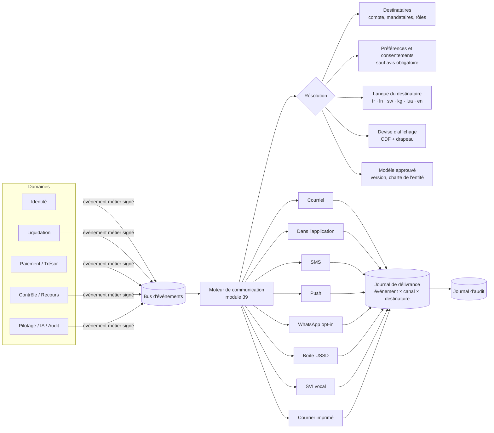
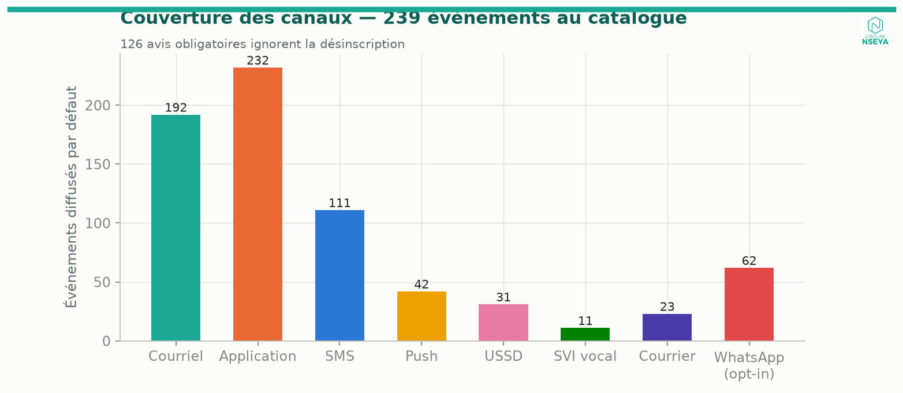
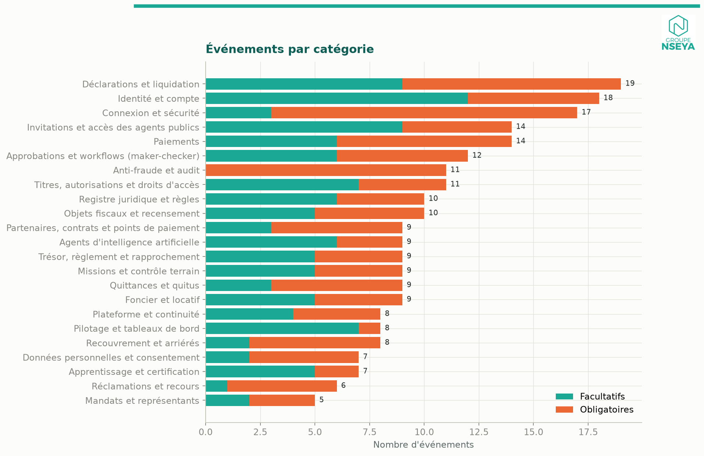

## 11.4 Architecture des communications événementielles

### 11.4.1 Principe : un seul moteur d'événements, tous les canaux

Toute communication de KINSHASA MOSOLO, qu'elle s'adresse à un contribuable, un agent public ou un partenaire, part d'**un événement métier** publié sur le bus d'événements par le domaine qui en est propriétaire (chapitre 10). Un seul moteur de communication (module 39) reçoit l'événement et le diffuse (*fan-out*) sur les canaux prévus : courriel, notification dans l'application, SMS, notification push, WhatsApp sur consentement, boîte de messages USSD, serveur vocal (SVI) et courrier imprimé. Aucun module n'envoie de message directement : c'est la garantie que chaque message est traçable, conforme à son modèle approuvé, traduit, et rattaché à la preuve de délivrance.

### 11.4.2 Le catalogue d'événements

Le catalogue est une **donnée de référence versionnée** (`specs/evenements-communication.yaml`), et non du code : l'ajout ou la modification d'un événement suit un maker-checker (programme + entité concernée + juriste lorsque l'événement porte un avis légal). Il est reproduit intégralement à l'Annexe G.

| Indicateur du catalogue (version 1) | Valeur |
|---|---|
| Événements | **239** |
| Catégories | **23** |
| Avis obligatoires (non désinscriptibles) | **126** |
| Événements diffusés par défaut en courriel | 192 |
| … dans l'application | 232 |
| … par SMS | 111 |
| … par notification push | 42 |
| … dans la boîte USSD | 31 |
| … par SVI vocal | 11 |
| … par courrier imprimé | 23 |
| … éligibles à WhatsApp sur consentement | 62 |

| # | Catégorie | Exemples d'événements |
|---|---|---|
| 1 | Identité et compte | `account.registration.requested`, `account.verification.level_upgraded`, `account.merge.proposed`, `account.mosolo_card.issued` |
| 2 | Connexion et sécurité | `auth.login.suspicious`, `auth.device.new`, `auth.otp_code`, `auth.break_glass.used` |
| 3 | Mandats et représentants | `mandate.requested`, `mandate.action_performed` |
| 4 | Objets fiscaux et recensement | `object.provisional.created`, `object.link.approved`, `object.ownership.conflict`, `object.field_visit.scheduled` |
| 5 | Foncier et locatif | `lease.declared_by_tenant`, `rental.withholding.due`, `property.reclassification.proposed` |
| 6 | Déclarations et liquidation | `declaration.prefilled_ready`, `assessment.issued`, `assessment.explained`, `exemption.granted`, `installment_plan.defaulted` |
| 7 | Paiements | `payment.reference.issued`, `payment.confirmed`, `payment.duplicate_detected`, `payment.currency_converted`, `refund.paid` |
| 8 | Quittances et quitus | `receipt.issued_provisional`, `receipt.finalized`, `receipt.verification.fraud_suspected`, `clearance.issued` |
| 9 | Titres et autorisations | `permit.issued`, `permit.expiring`, `ticket.expiring`, `parking.violation.recorded` |
| 10 | Recouvrement et arriérés | `recovery.reminder.1`, `recovery.formal_notice`, `recovery.enforcement.proposed` |
| 11 | Missions et contrôle terrain | `mission.assigned`, `mission.expiring_offline_data`, `mission.geofence.breach`, `device.lost_reported` |
| 12 | Réclamations et recours | `appeal.submitted`, `appeal.decided`, `appeal.sla_breach` |
| 13 | Approbations et workflows | `approval.requested`, `approval.self_approval_blocked`, `beneficiary.change.proposed`, `beneficiary.change.cooling_off` |
| 14 | Registre juridique et règles | `rule.published`, `rule.conflict.detected`, `legal.instrument.abrogated` |
| 15 | Trésor et rapprochement | `settlement.delayed`, `reconciliation.exception.aged`, `ledger.imbalance`, `fx.rate.missing` |
| 16 | Anti-fraude et audit | `fraud.alert.raised`, `fraud.cash_request_reported`, `audit.log.integrity_failure` |
| 17 | Agents d'IA | `ai.recommendation_available`, `ai.human_intervention_required`, `ai.model.drift_detected` |
| 18 | Pilotage et tableaux de bord | `executive.daily_brief`, `kpi.threshold_breached`, `executive.alert` |
| 19 | Invitations et accès | `invitation.sent`, `delegation.granted`, `conflict_of_interest.detected` |
| 20 | Apprentissage et certification | `training.assigned`, `certification.expiring`, `procedure.changed` |
| 21 | Plateforme et continuité | `system.outage`, `system.channel_degraded`, `system.deadline_protection` |
| 22 | Données personnelles et consentement | `privacy.consent_request`, `privacy.data_shared_with_partner`, `privacy.breach_notification` |
| 23 | Partenaires et points de paiement | `partner.callback.signature_invalid`, `payment_point.settlement_overdue` |

Chaque événement porte : code stable, catégorie, libellé, objet du message par langue, gravité (`info`, `success`, `warning`, `critical`), canaux par défaut, éligibilité WhatsApp, caractère obligatoire, public (contribuable, agent public, partenaire), variables autorisées (`{{montant}}`, `{{reference}}`, `{{date}}`…) et, pour les avis légaux, la **référence au modèle d'acte approuvé** et aux mentions obligatoires (base légale, délai, voie de recours).

### 11.4.3 Avis obligatoires

Un avis est **obligatoire** lorsqu'il produit un effet de droit ou protège le destinataire : avis d'imposition, rectification, mise en demeure, mesure d'exécution, décision sur réclamation, refus ou retrait d'autorisation, contrepassement de paiement, annulation de quittance, conflit de propriété, alerte de sécurité, changement de coordonnées, partage de données, violation de données, changement de compte bénéficiaire public. Règles :

1. un avis obligatoire **ignore la désinscription** des communications facultatives, mais respecte le canal légalement valable (lorsque la notification électronique n'a pas de valeur juridique certaine, l'avis est **doublé** d'un exemplaire imprimable ou postal — J7, chapitre 6) ;
2. il est délivré au contribuable **et** à ses mandataires habilités ;
3. il n'est jamais envoyé sur WhatsApp ni sur un canal tiers non souverain ;
4. sa preuve de délivrance (accusé fournisseur, lecture dans l'application, remise en main propre avec signature) est versée au dossier et conditionne le décompte des délais légaux ;
5. en cas d'échec sur tous les canaux électroniques, une tâche de remise physique est créée automatiquement pour l'équipe terrain.

### 11.4.4 Canaux : règles d'usage

| Canal | Usage | Règles |
|---|---|---|
| Courriel | Avis détaillés, pièces jointes signées | Charte graphique de l'entité émettrice ; SPF, DKIM, DMARC ; aucune donnée sensible en clair dans l'objet |
| Dans l'application | Canal de référence, historique complet | Chaque message est consultable à vie dans le compte |
| SMS | Rappels, OTP, confirmations, alertes | 160 caractères, langue du destinataire ; **jamais de lien de paiement** (lutte contre l'hameçonnage) — le contribuable est invité à composer le code USSD officiel |
| Push | Agents terrain, contribuables avec application | Contenu minimal, détail dans l'application |
| WhatsApp | Rappels et informations non sensibles | **Consentement préalable explicite**, pas d'avis obligatoire, pas de montant nominatif, via un fournisseur contractualisé ; désactivable par l'autorité de protection des données |
| Boîte USSD | Contribuables sans smartphone | Messages en attente consultables via le code court |
| SVI vocal | Personnes peu alphabétisées | Messages enregistrés dans les cinq langues nationales et en français |
| Courrier imprimé | Avis légaux, échec des canaux électroniques | Généré avec QR de vérification ; remise tracée |

**Anti-usurpation.** Les expéditeurs (nom SMS, domaine de courriel, compte WhatsApp certifié, numéro SVI) sont **uniques et publiés**. Tout message peut être vérifié par le destinataire (code court de vérification, module 68). Les campagnes de sensibilisation rappellent qu'un agent MOSOLO ne demande jamais d'espèces ni de code OTP.

### 11.4.5 Préférences, fréquence et heures de silence

Le contribuable choisit ses canaux et sa langue pour les communications facultatives. Le moteur applique un **plafond de fréquence** (par exemple : pas plus de deux rappels facultatifs par semaine et par obligation) et des **heures de silence** (pas de SMS ni de push facultatif entre 21 h et 7 h), sauf alertes de sécurité. Les agents publics ne peuvent pas désactiver les notifications de mission, d'approbation ou de sécurité pendant leur service.

### 11.4.6 Modèles et assurance qualité

| Fonction | Description |
|---|---|
| Modèles versionnés | Un modèle par événement × canal × langue ; maker-checker (rédacteur, relecteur linguistique, juriste pour les avis légaux) |
| Charte par entité | Logo, couleurs, coordonnées et mentions de l'entité émettrice (DGIPK, DGTK, ministère, commune) appliqués automatiquement, pour que le citoyen sache toujours qui lui écrit |
| Aperçu | Rendu exact de ce que reçoit le destinataire, par canal et par langue, avec données fictives |
| Envoi de test à soi-même | Déclenche l'événement réel vers l'utilisateur qui teste, sur tous ses canaux |
| Mode bac à sable | Si la clé d'un fournisseur n'est pas configurée (environnement de recette), l'envoi est **enregistré** comme « journalisé » sans être transmis : le parcours est toujours testable |
| Contrôles automatiques | Variables manquantes, longueur SMS, présence des mentions légales obligatoires, cohérence des montants et devises, traduction complète dans les langues actives |

### 11.4.7 Journal de délivrance

Chaque combinaison **événement × canal × destinataire** crée une ligne de délivrance : identifiant d'événement, canal, fournisseur, statut (`en_file`, `envoyé`, `délivré`, `lu`, `échoué`, `journalisé` en bac à sable, `supprimé_par_préférence`), horodatages, nombre de tentatives, coût unitaire, empreinte du contenu. Le journal alimente : la preuve de notification des avis légaux ; le tableau de bord des communications (taux de délivrance par canal et par opérateur, coût, échecs) ; la détection d'anomalies (numéro recevant les avis de nombreux contribuables sans lien de mandat).

| Écran « Communications » (administration du module 39) | Contenu |
|---|---|
| Cartes de synthèse | Événements au catalogue ; catégories ; avis obligatoires ; messages délivrés / tentés ; canaux raccordés |
| Couverture par canal | Nombre d'événements diffusés par défaut sur chaque canal et nombre de messages envoyés sur la période |
| Assurance qualité des modèles | Sélecteur d'événement et d'entité, aperçu, envoi de test |
| Dernières délivrances | Flux temps réel événement × canal × destinataire (masqué selon les droits) et statut |
| Catalogue | Événements par catégorie, gravité, canaux, caractère obligatoire |

## 11.5 Plateforme multilingue

| Langue | Code | Rôle |
|---|---|---|
| Français | `fr` | **Langue de référence** : seule version juridiquement opposable des avis et décisions |
| Lingala | `ln` | Langue nationale ; langue d'usage majoritaire à Kinshasa |
| Kiswahili | `sw` | Langue nationale |
| Kikongo | `kg` | Langue nationale |
| Tshiluba | `lua` | Langue nationale |
| Anglais | `en` | Diaspora, investisseurs, partenaires |

Règles : toutes les chaînes d'interface, tous les modèles de messages, tous les contenus d'apprentissage et tous les messages SVI sont externalisés dans des fichiers de ressources (format ICU MessageFormat, gestion des pluriels et du genre) ; la langue est un attribut du compte, modifiable à tout moment ; les avis légaux en langue nationale portent la mention « traduction d'information — la version française fait foi » et un lien vers la version française ; les traductions sont validées par des relecteurs natifs rémunérés, avec glossaire fiscal commun ; un indicateur « complétude de traduction » bloque l'activation d'une langue incomplète pour un parcours donné. **Les langues sont désignées par leur nom natif, jamais par un drapeau** (une langue n'est pas un pays).

## 11.6 Plateforme multidevise : le franc congolais comme devise principale

### 11.6.1 Principes

1. **Le franc congolais (🇨🇩 CDF) est la devise principale** de la plateforme : devise de consolidation de tous les tableaux de bord, du grand livre de synthèse, des prévisions et du tableau de transparence.
2. **La devise de l'obligation est celle fixée par la règle légale.** Lorsqu'un arrêté fixe un tarif en dollars américains (cas rapporté de l'impôt foncier 2026), l'obligation est libellée en 🇺🇸 USD et affichée avec sa contre-valeur indicative en 🇨🇩 CDF ; la plateforme ne convertit jamais d'elle-même une obligation légalement libellée dans une devise en une autre.
3. **Chaque devise est représentée par le drapeau de son pays émetteur**, placé devant le code ISO 4217 et le montant : 🇨🇩 CDF 1 250 000,00 · 🇺🇸 USD 450,00 · 🇪🇺 EUR 410,00. Pour une devise commune à plusieurs pays, le drapeau de l'union monétaire (🇪🇺 pour l'euro) ou un drapeau de référence configurable est utilisé.
4. **Les taux de change sont ceux de la source officielle** désignée par le texte (en principe le cours indicatif de la Banque Centrale du Congo), importés quotidiennement, signés, horodatés et jamais saisis à la main. La règle précisant **quel taux s'applique à quelle date** (fait générateur, émission de l'avis, paiement) est une règle juridique certifiée [À VÉRIFIER J3].
5. **Le montant payé dans une devise étrangère** (carte de la diaspora, par exemple) est converti par le prestataire selon le contrat, puis rapproché dans la devise de l'obligation ; l'écart de change éventuel est traité par règle (tolérance, reliquat, trop-perçu) et visible du contribuable (`payment.currency_converted`).
6. **Aucune écriture comptable n'est convertie rétroactivement** : chaque écriture conserve sa devise d'origine, le taux appliqué et sa contre-valeur en CDF.

### 11.6.2 Référentiel des devises

Le référentiel (`specs/devises.yaml`, module 89) distingue le rôle de chaque devise :

| Drapeau | Code | Devise | Rôle | Liquidation | Paiement |
|---|---|---|---|---|---|
| 🇨🇩 | CDF | Franc congolais | **Principale** | Oui | Oui |
| 🇺🇸 | USD | Dollar américain | Légale secondaire (si la règle l'exige) | Si la règle l'exige | Oui |
| 🇪🇺 | EUR | Euro | Paiement diaspora | Non | Carte ou virement, converti |
| 🇬🇧 | GBP | Livre sterling | Paiement diaspora | Non | Carte, converti |
| 🇨🇦 | CAD | Dollar canadien | Paiement diaspora | Non | Carte, converti |
| 🇨🇭 | CHF | Franc suisse | Paiement diaspora | Non | Carte, converti |
| 🇿🇦 | ZAR | Rand sud-africain | Paiement diaspora | Non | Carte, converti |
| 🇨🇬 | XAF | Franc CFA (CEMAC) | Affichage | Non | Non |
| 🇦🇴 | AOA | Kwanza | Affichage | Non | Non |
| 🇿🇲 | ZMW | Kwacha zambien | Affichage | Non | Non |
| 🇷🇼 | RWF | Franc rwandais | Affichage | Non | Non |
| 🇺🇬 | UGX | Shilling ougandais | Affichage | Non | Non |
| 🇰🇪 | KES | Shilling kényan | Affichage | Non | Non |
| 🇹🇿 | TZS | Shilling tanzanien | Affichage | Non | Non |
| 🇧🇮 | BIF | Franc burundais | Affichage | Non | Non |
| 🇨🇳 | CNY | Yuan renminbi | Affichage | Non | Non |
| 🇦🇪 | AED | Dirham des Émirats | Affichage | Non | Non |

L'activation d'une devise pour le **paiement** exige un contrat avec un prestataire habilité et la conformité à la réglementation des changes [À VÉRIFIER : règles de la BCC sur l'encaissement de recettes publiques en devises].

### 11.6.3 Règles d'affichage et de calcul

| Règle | Détail |
|---|---|
| Format | Drapeau + code ISO + montant selon la langue : `🇨🇩 CDF 1 250 000,00` (fr), séparateurs selon la locale ; le code ISO est toujours présent, car les drapeaux ne s'affichent pas sur tous les terminaux ni dans les SMS |
| SMS et USSD | Code ISO seul (`CDF 1250000`), sans drapeau (jeu de caractères limité) |
| SVI | Montant énoncé dans la langue avec le nom de la devise (« un million deux cent cinquante mille francs congolais ») |
| Précision | Calcul en décimal exact (jamais en virgule flottante) ; arrondi défini par la règle (`rounding`) ; décimales selon la devise |
| Double affichage | Obligation en USD : montant légal en USD + contre-valeur CDF « à titre indicatif au taux officiel du JJ/MM/AAAA » |
| Tableaux de bord | Consolidation en CDF ; bascule d'affichage en USD pour comparaison, avec le taux et la date utilisés |
| Données | `Money { amount: decimal, currency: ISO4217 }` ; toute opération entre devises différentes sans conversion explicite est rejetée par le type |

Critère d'acceptation : **Étant donné** une obligation légalement libellée en USD et un paiement en EUR par carte, **lorsque** le paiement est confirmé, **alors** la quittance mentionne le montant de l'obligation en 🇺🇸 USD, le montant payé en 🇪🇺 EUR, le taux et sa source, la contre-valeur en 🇨🇩 CDF, et tout écart est traité par la règle de tolérance sans intervention manuelle.
