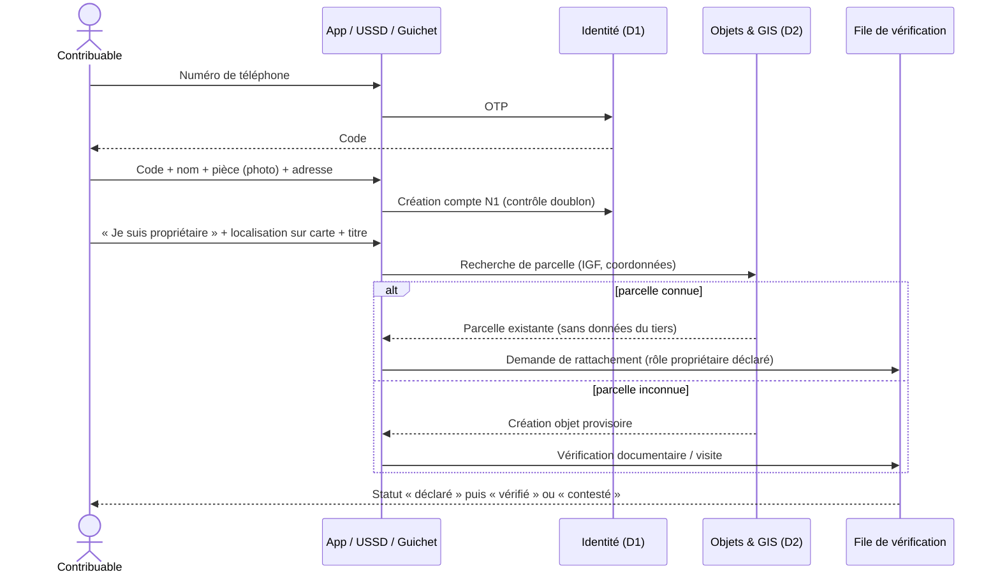

# 12. Rôles et matrice d'habilitations

## 12.1 Modèle d'autorisation : RBAC + ABAC

L'autorisation combine des **rôles** (ce qu'une fonction peut faire) et des **attributs** (dans quel périmètre, à quel moment, sur quel appareil, pour quelle finalité). Une décision d'accès est évaluée par un moteur de politiques centralisé (policy decision point) à chaque requête, jamais dans l'interface.

| Attribut | Exemples | Effet |
|---|---|---|
| Entité | DGIPK, DGTK, ministère X, commune Y | Cloisonnement par entité |
| Territoire | Commune, quartier, polygone de mission | Agent limité à sa zone |
| Dossier assigné | Mission, dossier de contrôle, recours | Accès limité aux objets du dossier |
| Plage horaire | Horaires de service, durée de mission | Refus hors plage, sauf astreinte déclarée |
| Appareil | Terminal enrôlé et conforme (MDM) | Refus depuis un appareil non enrôlé |
| Niveau d'authentification | Mot de passe + OTP, clé d'accès (passkey), clé matérielle | Actions sensibles réservées aux facteurs résistants à l'hameçonnage |
| Sensibilité de la donnée | C1 à C5 (ch. 32) | Masquage, champ par champ |
| Finalité déclarée | Contrôle, recours, audit, enquête | Finalité journalisée ; accès « bris de glace » motivé et revu |
| Conflit d'intérêts | Lien déclaré ou détecté avec le contribuable | Récusation automatique |
| Durée | Délégation temporaire, accès privilégié juste-à-temps | Expiration automatique |

## 12.2 Principes de contrôle interne

| Principe | Mise en œuvre |
|---|---|
| Moindre privilège | Rôles fins ; aucun droit par défaut ; revue trimestrielle des accès |
| Séparation des tâches | Incompatibilités codées (tableau § 12.5) ; un utilisateur ne peut cumuler deux rôles incompatibles |
| Maker-checker / quatre yeux | Initiateur ≠ vérificateur pour toute opération critique ; auto-validation impossible |
| Contrôle double (dual control) | Opérations les plus sensibles : deux approbateurs + délai de refroidissement |
| Délégation temporaire | Datée, bornée, motivée, visible, révocable ; non re-déléguable |
| Accès privilégié juste-à-temps | Élévation sur demande motivée, approuvée, limitée dans le temps, session enregistrée |
| MFA | Obligatoire pour tout compte de travail ; résistante à l'hameçonnage pour les rôles sensibles |
| Authentification de l'appareil | Certificat d'appareil pour les terminaux terrain et les postes sensibles |
| Expiration des accès | Tout accès de travail a une date de fin ; renouvellement sur revue |
| Détection des conflits d'intérêts | Déclarations (module 91) + détection de liens (adresse, téléphone, compte bancaire communs) |
| Revues d'accès | Trimestrielles par les responsables d'entité ; semestrielles par l'audit interne |
| Journalisation complète | Toute consultation de donnée C4–C5 et toute action sont journalisées |

## 12.3 Rôles

| Code | Rôle | Mission | Périmètre |
|---|---|---|---|
| R01 | **Gouverneur** | Vision exécutive consolidée, priorités stratégiques, demandes d'enquête | Toute la province, **agrégats** ; détail nominatif uniquement via une demande d'enquête motivée instruite par l'audit |
| R02 | **Directeur de cabinet du Gouverneur** | Coordination et suivi, sur délégation formelle | Comme R01, dans les limites de la délégation écrite |
| R03 | **Secrétaire général du Gouvernement provincial** | Coordination gouvernementale, décisions, suivi de mise en œuvre | Décisions, actes, tableaux de suivi ; pas de données fiscales individuelles |
| R04 | **Ministre provincial** | Pilotage du périmètre légal de son ministère | Modules et recettes relevant de son ministère ; agrégats |
| R05 | **Ministre provincial des Finances** | Tutelle des régies, politique fiscale, approbation des règles relevant de sa compétence | Agrégats de toutes les recettes ; approbation des règles et tarifs selon texte |
| R06 | **Directeur général DGIPK / DGTK** | Direction opérationnelle de la régie | Recettes de sa régie ; nominatif dans son périmètre |
| R07 | **Directeur / chef de service de régie** | Gestion d'un service (assiette, contrôle, recouvrement, contentieux) | Service et territoire |
| R08 | **Administrateur d'entité** | Gestion des agents, affectations et workflows approuvés de son entité | Personnes et configurations de son entité ; **aucun accès aux montants** |
| R09 | **Superviseur terrain** | Planification et contrôle qualité des missions | Équipes et zones assignées |
| R10 | **Agent de terrain / recenseur** | Recensement, constat, notification | Missions assignées ; données minimales |
| R11 | **Contrôleur / vérificateur** | Contrôle sur pièces et sur place, proposition de rectification | Dossiers assignés |
| R12 | **Agent de guichet / enrôlement assisté** | Enrôlement, assistance, remise de cartes | Guichet ; pas d'encaissement sauf point agréé |
| R13 | **Juriste rédacteur de règles** | Rédaction des fiches de règles | Registre juridique, brouillons |
| R14 | **Juriste vérificateur** | Visa juridique | Registre juridique |
| R15 | **Validateur financier des règles** | Visa financier et budgétaire | Registre juridique |
| R16 | **Autorité de publication** | Publication d'une règle approuvée | Registre juridique |
| R17 | **Comptable public / Trésor** | Prise en charge, règlement, rapprochement, écritures | Paiements, relevés, grand livre ; **ne crée aucune obligation** |
| R18 | **Analyste de rapprochement** | Traitement des exceptions de rapprochement | Files d'exception |
| R19 | **Gestionnaire du coffre des bénéficiaires** (×3 minimum) | Proposition et approbation des changements de comptes publics | Coffre ; quorum obligatoire |
| R20 | **Agent de contentieux** | Instruction des réclamations et recours | Dossiers assignés |
| R21 | **Autorité de décision contentieuse** | Décision sur réclamation | Dossiers instruits |
| R22 | **Auditeur interne** | Audit, lecture intégrale des preuves | Lecture seule, tout périmètre, journal des consultations |
| R23 | **Auditeur externe / Cour des comptes / inspection** | Contrôle externe | Accès contrôlé, lecture seule, par mission |
| R24 | **Enquêteur anti-fraude** | Instruction des alertes | Dossiers d'enquête ; accès nominatif motivé |
| R25 | **Délégué à la protection des données** | Conformité, droits des personnes | Registre des traitements, journaux d'accès |
| R26 | **Super-administrateur de la plateforme** | Configuration technique, disponibilité, sécurité, versions, identité | Technique ; **aucun pouvoir financier** |
| R27 | **Ingénieur d'exploitation / support** | Exploitation, incidents | Technique ; données masquées ; accès JIT |
| R28 | **Responsable sécurité (RSSI)** | Politique de sécurité, SIEM, incidents | Journaux de sécurité |
| R29 | **Gestionnaire des modèles d'IA** | Versions, validation, surveillance | Registre des modèles ; données d'entraînement approuvées |
| R30 | **Contribuable** | Ses données, ses objets, ses obligations | Son compte |
| R31 | **Mandataire** | Agir pour un mandant | Mandat (périmètre, durée) |
| R32 | **Point de paiement agréé** | Encaissement sur référence | API de paiement ; aucune donnée fiscale au-delà du montant de la référence |
| R33 | **Partenaire bancaire / monnaie mobile** | Confirmation, règlement | API du canal |
| R34 | **Partenaire de données** | Fourniture de données sous protocole | API d'import restreinte |
| R35 | **Sous-traitant terrain (responsable)** | Gestion de ses équipes accréditées | Ses agents, ses lots ; aucune donnée fiscale |
| R36 | **Observateur de la société civile** | Suivi des agrégats et de la transparence | Tableau public enrichi, sans nominatif |
| R37 | **Service utilisateur du quitus** (urbanisme, marchés publics…) | Vérifier un quitus | API de vérification : oui/non + validité |

## 12.4 Matrice synthétique : Voir / Initier / Approuver / Interdit

Légende : **V** voir (agrégats) ; **Vn** voir nominatif dans le périmètre ; **I** initier ; **A** approuver ; **—** aucun accès ; **✖** interdit par construction (aucun rôle ne peut le faire seul).

| Action | R01 Gouv. | R04 Min. | R06 DG régie | R10 Agent | R11 Contrôleur | R13–16 Juridique | R17 Trésor | R19 Coffre | R22 Audit | R26 Super-admin | R30 Contrib. |
|---|---|---|---|---|---|---|---|---|---|---|---|
| Tableau exécutif consolidé | V | V (périmètre) | V (régie) | — | — | — | V (financier) | — | V | — | — |
| Données fiscales d'un contribuable | Sur enquête motivée | — | Vn | Vn minimal (mission) | Vn (dossier) | — | Vn (paiements) | — | Vn | — (masqué) | Vn (soi) |
| Créer un objet provisoire | — | — | I | I | I | — | — | — | — | — | I (déclaration) |
| Valider un objet / rattachement | — | — | A | — | I | — | — | — | — | — | — |
| Rédiger / viser / publier une règle | — | A (selon texte) | — | — | — | I / A / A (4 personnes distinctes) | — | — | V | ✖ | — |
| Émettre une obligation | — | — | Automate (règle active) | — | Propose rectification | — | ✖ | — | V | ✖ | — |
| Rectifier / annuler une obligation | — | — | A (2e niveau) | — | I | — | ✖ | — | V | ✖ | Réclame |
| Accorder une exonération | — | A (si texte) | I / A (quatre yeux) | — | — | Vérifie fondement | — | — | V | ✖ | Demande |
| Enregistrer un paiement | — | — | — | ✖ | ✖ | — | Événement prestataire uniquement | — | V | ✖ | Initie |
| Rapprocher / traiter une exception | — | — | V | — | — | — | I / A (quatre yeux) | — | V | ✖ | — |
| Remboursement | — | — | I (motivé) | — | — | — | A (2 approbateurs) | — | V | ✖ | Demande |
| Modifier un compte bénéficiaire | ✖ | ✖ | ✖ | ✖ | ✖ | ✖ | Propose | A (quorum 2 sur 3 + hors bande + 72 h) | V | ✖ | — |
| Émettre / annuler une quittance | — | — | — | — | — | — | Automate ; annulation par contrepassement A | — | V | ✖ | Vérifie |
| Lancer une mission terrain | — | — | A | Exécute | I | — | — | — | V | — | — |
| Engager un acte de poursuite | — | — | A (autorité légale) | — | I | — | — | — | V | ✖ | Recours |
| Décider d'une réclamation | — | — | A (selon texte) | — | — | Avis | — | — | V | ✖ | Initie |
| Consulter le journal d'audit | Agrégats d'alertes | — | Son entité | — | — | — | Son périmètre | — | **Intégral** | Technique uniquement | Son historique |
| Supprimer une écriture ou un événement d'audit | ✖ | ✖ | ✖ | ✖ | ✖ | ✖ | ✖ | ✖ | ✖ | ✖ | ✖ |
| Déployer une version logicielle | — | — | — | — | — | — | — | — | V | I (A par comité des changements) | — |
| Attribuer un rôle | — | — | A (son entité) | — | — | — | — | — | V | Technique uniquement, sur demande approuvée | — |

**Le Gouverneur** dispose de la vision la plus large sur les agrégats, les performances par ministère, régie, commune et catégorie, les alertes critiques, les prévisions et les recommandations. Il peut demander une enquête, approuver des priorités stratégiques et recevoir les rapports exécutifs. **Il ne peut pas** supprimer une transaction, réécrire une quittance, modifier un compte bénéficiaire ou altérer une preuve d'audit ; aucune interface ne le permet, et toute tentative indirecte (demande à un technicien) laisserait une trace et exigerait des approbations qu'il ne peut pas donner seul.

**Le super-administrateur de la plateforme** gère la configuration technique, la disponibilité, les espaces d'entité, les politiques de sécurité, la santé des intégrations, les versions, les systèmes d'identité et le support. **Il n'a aucun pouvoir** sur les obligations, les paiements, les comptes bénéficiaires ni les journaux d'audit : les données financières sont signées par des clés qu'il ne détient pas, le journal d'audit est répliqué dans un stockage WORM hors de son contrôle, et ses propres actions sont journalisées vers un SIEM surveillé par le RSSI et l'audit.

## 12.5 Incompatibilités (séparation des tâches)

| Rôle A | Incompatible avec | Raison |
|---|---|---|
| Rédacteur de règle | Vérificateur, validateur financier, publicateur de la même règle | Quatre yeux juridiques |
| Agent de terrain | Contrôleur qualité de ses propres constats ; toute fonction de paiement | Constat ≠ contrôle ≠ encaissement |
| Initiateur d'exonération | Approbateur de la même exonération | Quatre yeux |
| Analyste de rapprochement | Approbateur de la même exception | Quatre yeux |
| Initiateur de remboursement | Approbateur ; bénéficiaire lié | Anti-détournement |
| Gestionnaire du coffre | Comptable qui exécute les virements | Séparation proposition/exécution |
| Super-administrateur | Tout rôle métier ou financier | Séparation technique/financier |
| Gestionnaire de modèles d'IA | Utilisateur métier décidant sur la base du modèle | Indépendance de la validation |
| Auditeur | Tout rôle opérationnel | Indépendance |

## 12.6 La Constitution financière MOSOLO

> **« Aucun individu ne possède les clés du système financier. »**

| Opération critique | Initiateur | Vérificateur | Approbateur | Contrôles additionnels |
|---|---|---|---|---|
| Publication d'une règle | Juriste rédacteur | Juriste vérificateur | Validateur financier + autorité de publication | Pièce officielle hachée ; tests de cas juridiques verts |
| Changement de compte bénéficiaire | Trésor | Gestionnaire du coffre n° 1 | Gestionnaires n° 2 et n° 3 (quorum 2 sur 3) | Confirmation hors bande auprès de la banque ; délai de refroidissement de 72 heures ; notification au Gouverneur, au ministre des Finances et à l'audit ; journal immuable |
| Exonération | Agent de régie | Juriste | Chef de service + (au-delà d'un seuil) directeur | Fondement légal, pièce, durée ; alerte de concentration |
| Annulation / rectification d'obligation | Contrôleur | Chef de service | Directeur au-delà d'un seuil | Motif codifié ; contre-écriture |
| Remboursement | Régie | Trésor | Deux approbateurs | Plafond ; vers le compte d'origine uniquement ; délai |
| Contrepassement de paiement | Trésor | Analyste | Chef comptable | Preuve prestataire |
| Attribution d'un rôle sensible | Responsable d'entité | Sécurité | Comité des accès | Durée limitée |
| Mise en production logicielle | Équipe | Revue de code et sécurité | Comité de contrôle des changements | Signature des artefacts ; déploiement reproductible |
| Accès privilégié à la production | Ingénieur | RSSI | Responsable d'exploitation | Juste-à-temps, session enregistrée |

## 12.7 Accès des agents publics : invitation en cascade

L'inscription publique est réservée aux contribuables. Les comptes de travail ne sont créés **que sur invitation** : le Comité de pilotage invite les responsables d'entité, qui invitent leurs directeurs, qui invitent leurs agents, chacun dans son périmètre et sans pouvoir accorder plus de droits qu'il n'en détient. Une invitation est nominative, limitée dans le temps, liée à une adresse ou un numéro vérifié, et finalisée par la personne invitée elle-même (ou par l'opérateur d'accès de son entité, en sa présence). Tout compte de travail inactif 60 jours est suspendu.

## 12.8 Types de comptes, départements, modules et variables (§ 12A — ajout du 27/09/2026)

*Demande du maître d'ouvrage : « tous les types de comptes sont créés ; l'administrateur rattache modules et variables
aux départements ». Ajout par-dessus le § 12.7 : aucun contrôle retiré (pas d'élévation, seconde validation par une
personne distincte, MFA, un compte par personne).*

**Types de comptes.** Chacun des 37 rôles a une voie de création réelle, jamais un amorçage :

| Rôles | Parcours de création | Seconde validation |
|---|---|---|
| R01 | Invitation → acceptation (clé d'accès) | Confirmation hors bande par le Cabinet ou le Secrétariat général |
| R02 à R06, R08, R13 à R19, R21, R26 à R29 | Invitation → acceptation (clé d'accès) | Responsable sécurité ou direction de l'entité, personne distincte |
| R07, R09, R11, R20 | Invitation → acceptation | Seconde validation (chaîne constat → décision) |
| R10 | Invitation → acceptation (terminal enregistré) | Habilitation par la régie sur formation certifiée |
| R12 | Invitation → acceptation | Aucune (compte actif à l'acceptation) |
| R22 à R25 | Invitation au niveau « Audit » par l'administrateur de la plateforme | Autorité d'audit |
| R30 | Inscription publique, téléphone vérifié par code, connexion par code | — |
| R31 | Inscription publique du mandataire (téléphone vérifié) ; agit seulement sous mandat daté du contribuable | — (mandat professionnel : certification N3) |
| R32 à R34 | Contrat de partenariat enregistré par R26, approuvé par une personne distincte : le Directeur de cabinet (R02) seul — décision du maître d'ouvrage du 27/09/2026, puis invitation dans l'entité partenaire | Contrat à deux personnes |
| R35 | Invitation du sous-traitant par la régie → dossier → diligences → accréditation à deux personnes | Accréditation |
| R36 | Invitation au niveau « Consultation » (observateur désigné) | Aucune |
| R37 | Invitation au niveau « Consultation » d'un agent du service vérificateur du quitus | Aucune |

Le référentiel `GET /v1/acces/types-de-comptes` (écran « Types de comptes ») donne pour chaque rôle : libellé français,
famille (autorité, régie, trésor, juridique, contrôle, terrain, audit, technique, public, partenaire), parcours, qui peut
inviter, seconde validation, niveau de second facteur, natures d'entité (indicatives — par défaut, à confirmer) et le
décompte vivant des comptes par état, dans le périmètre de la personne.

**Modules rattachés aux départements.** Un catalogue à codes stables (`M01` à `M81` : les 81 modules de la spécification
fonctionnelle ; `V-<slug>` : les verticales de la Partie V) se rattache à une entité (ministère, régie, commune,
service) par l'administrateur de la plateforme (R26) ou l'administrateur d'entité (R08, dans son sous-arbre), avec
motif, date d'effet, date de fin facultative et historique complet :
- module **sans recette** : une personne, second facteur, acte journalisé ;
- module **porteur de recettes** : référence de l'acte obligatoire et circuit **existant** des fiches de module
  (création de fiche → visas programme et juridique → recette → activation par le comité ; réattribution proposée par
  R26 et décidée par le Gouverneur ou le Cabinet ; retrait proposé puis décidé par une personne distincte).

Effet : les personnes de l'entité (et de sa lignée) voient le module dans leur menu, filtré par rôle comme aujourd'hui ;
les autres ne le voient plus — sauf le Gouverneur, le Directeur de cabinet, le Secrétaire exécutif et les ministres
(R01 à R05), qui voient toujours tous les modules quel que soit leur rattachement (décision du maître d'ouvrage du
27/09/2026). Présentation seulement : le serveur continue d'appliquer les droits sur chaque route
(ABAC) et chaque donnée d'entité reste cloisonnée à son entité.

**Variables par département.** Les paramètres du registre des seuils déclarés « modulables par entité » (liste par
défaut, à confirmer : plafonds de références par agent, lecture massive DLP, plafond de notifications, taille d'alerte
de corbeille) reçoivent une valeur par entité par le **même circuit à deux personnes** que les valeurs globales, avec
motif et date d'effet. Résolution : entité → entité parente → valeur globale (`GET /v1/parametres/effectifs?entity=…`
donne la valeur et sa provenance). Les variables des barèmes juridiques restent gouvernées par le registre des règles
et ses quatre visas : **aucune surcharge par entité**.

# 13. Parcours des contribuables

## 13.1 Inscription et rattachement d'un bien (propriétaire)

Critère d'acceptation : **Étant donné** un contribuable N1 déclarant être propriétaire d'une parcelle déjà rattachée à un autre compte, **lorsqu'il** soumet sa demande, **alors** aucune donnée de l'autre compte ne lui est montrée, un dossier de conflit est ouvert, et aucune obligation n'est déplacée tant que le dossier n'est pas tranché.

## 13.2 Déclaration et paiement annuels

1. **J−45** avant l'échéance : notification « votre déclaration est prête » (SMS, application, USSD).
2. Le contribuable ouvre sa déclaration **pré-remplie** (objets vérifiés, baux déclarés, rang de localité).
3. Il confirme ou corrige (toute correction à la baisse d'un élément vérifié ouvre une vérification, sans bloquer le paiement de la partie non contestée).
4. Le moteur liquide et affiche l'**explication** : règle, version, base légale, assiette, formule, montant, échéance, voie de recours.
5. Le contribuable choisit un canal ; une référence unique est émise.
6. Paiement ; confirmation du prestataire ; **quittance électronique** émise avec statut « en attente de règlement », puis « définitive » après rapprochement.
7. Quitus fiscal mis à jour automatiquement.

## 13.3 Parcours locataire

Le locataire déclare son bail (bailleur, unité, loyer, preuve). Si le locataire est une personne morale ou une administration soumise à la retenue [À VÉRIFIER J3], la plateforme calcule la retenue par échéance de loyer, émet la référence de reversement, puis délivre au locataire une attestation de retenue et crédite l'obligation du bailleur. Le locataire personne physique **n'est jamais rendu débiteur de l'impôt du bailleur** sans texte ; sa déclaration sert de signal et de preuve, protégée contre les représailles (le bailleur ne voit pas qui a déclaré).

## 13.4 Contestation

Depuis chaque objet ou obligation : bouton « Contester ». Le contribuable choisit le motif codifié (je ne suis pas propriétaire, surface erronée, bien non loué, montant erroné, déjà payé, exonéré), joint ses pièces et reçoit un accusé de réception horodaté avec le délai légal de réponse [À VÉRIFIER J4]. Le statut « contesté » est visible ; l'effet suspensif éventuel s'applique selon le texte ; la partie non contestée reste payable.

## 13.5 Parcours diaspora

Inscription à distance (passeport, vidéo-vérification si l'acte le permet), paiement par carte internationale ou virement vers le compte public, désignation d'un mandataire local aux droits limités (consulter, déclarer, recevoir les notifications — pas modifier les coordonnées bancaires ni fermer le compte), téléchargement des quittances et du quitus.

## 13.6 Parcours sans smartphone ni lecture

1. Au guichet communal ou auprès d'un agent habilité : identification par pièce ; photo ; consentement oral enregistré ; empreinte comme marque de consentement si l'acte le permet.
2. Remise d'une **carte MOSOLO** (QR + code court) ; le numéro de téléphone d'un proche peut être associé comme canal, pas comme identité.
3. Consultation et paiement par **SVI** (serveur vocal) en lingala, swahili, kikongo, tshiluba ou français, ou chez un point de paiement agréé qui scanne la carte.
4. Quittance imprimée avec QR, vérifiable par quiconque.

## 13.7 Parcours entreprise

Inscription par le représentant légal (N3 : RCCM, NIF, mandat), création de l'espace entreprise, déclaration des établissements, désignation de mandataires internes (comptable, juriste) avec droits séparés (préparer / valider / payer), déclarations mensuelles structurées (retenues IRL, volumes pour les grands redevables), API pour les grands redevables, quitus fiscal téléchargeable pour les soumissions.

## 13.8 Parcours des opérateurs spécialisés (synthèse)

| Profil | Objet principal | Titre ou obligation | Canal privilégié |
|---|---|---|---|
| Transporteur | Véhicule, ligne | Autorisation de transport ; embarquement | Application, USSD |
| Moto-taxi (wewa) | Moto, conducteur | Pass wewa RakaPay — jour, semaine, mois (après acte) | USSD, coopérative |
| Commerçant de marché | Étal | Titre journalier à mensuel | USSD, carte MOSOLO |
| Annonceur | Support | Autorisation annuelle | Portail |
| Organisateur d'événements | Événement | Autorisation + déclaration de billetterie | Portail |
| Carrière | Site | Autorisation + déclarations | Portail |
| Batelier | Embarcation | Titre d'accostage / embarquement | USSD |
| Occupant du domaine public | Emprise | Autorisation d'occupation | Portail |

# 14. Parcours des utilisateurs gouvernementaux

| Utilisateur | Parcours type | Ce que MOSOLO lui apporte |
|---|---|---|
| **Gouverneur** | Ouvre le centre de commandement le matin ; voit l'échelle de la recette du jour, les alertes critiques, les communes en retard ; demande une note d'analyse à l'agent de décision ; ordonne une enquête sur une alerte | Une vérité unique, sans rapport papier ; des recommandations argumentées |
| **Directeur de cabinet** | Suit les décisions du Gouverneur, les délais de mise en œuvre, prépare les réunions de performance | Tableau de suivi des décisions et des engagements |
| **Secrétaire général** | Suit les actes (édits, arrêtés) nécessaires, leur état d'adoption et leur effet dans la plateforme | Lien acte → règles → effet |
| **Ministre provincial** | Consulte les recettes et les indicateurs de son périmètre ; valide les tarifs de sa compétence ; reçoit les recommandations | Pilotage sectoriel sans accès nominatif hors finalité |
| **DG de régie** | Pilote les campagnes, les assignations, la performance des services et des équipes ; approuve les actes de 2e niveau | Tableau opérationnel, files d'approbation |
| **Chef de service d'assiette** | Traite les demandes de rattachement, valide les objets, prépare les campagnes | Files de travail priorisées par l'IA |
| **Contrôleur** | Ouvre un dossier préparé (historique, preuves, anomalies), planifie la visite, rédige le procès-verbal assisté par le copilote | Dossiers complets, rédaction assistée |
| **Juriste** | Rédige une fiche de règle, l'accompagne de cas de test, la soumet ; suit l'état des textes | Atelier de règles avec simulateur |
| **Comptable du Trésor** | Rapproche les relevés du jour, traite les exceptions, clôture la journée | Rapprochement automatique à plus de 95 % visé, exceptions expliquées |
| **Auditeur** | Reconstitue la vie d'une obligation ou d'un paiement ; extrait un dossier de preuve signé | Chaîne de preuve complète |
| **Enquêteur anti-fraude** | Reçoit une alerte expliquée, ouvre un dossier, rassemble les preuves, propose des mesures | Graphe des liens, historique, preuves scellées |

Critère d'acceptation (auditeur) : **Étant donné** une obligation ou un paiement, **lorsque** l'auditeur consulte la piste d'audit, **alors** il voit chaque événement, son auteur, ses approbations, son horodatage et ses contre-écritures, sans trou dans la chaîne de hachage.

# 15. Parcours de l'agent de terrain

## 15.1 Avant la mission

Le superviseur (ou l'agent de mission IA, sous validation du superviseur) crée une mission : polygone, liste d'objets prioritaires, objectifs, durée. L'agent synchronise son terminal au bureau : la mission, les objets de la zone avec les **données minimales** (identifiant, catégorie, statut de couleur, adresse, dernier constat — **jamais** le montant dû détaillé ni les données personnelles non nécessaires), les fonds de carte hors ligne et les formulaires. Les données de mission expirent automatiquement (72 heures par défaut).

## 15.2 Sur le terrain

| Étape | Action | Contrôle automatique |
|---|---|---|
| 1 | Ouverture de session (biométrie locale du terminal + PIN) | Terminal enrôlé ; mission active ; plage horaire |
| 2 | Navigation vers l'objet ; carte avec couleurs de statut | Géorepérage : alerte si hors zone |
| 3 | Scan du QR de plaque ou création d'un objet provisoire | QR signé vérifié hors ligne |
| 4 | Capture GPS (avec précision), photos contrôlées (appareil photo de l'application uniquement, horodatées, empreinte hachée) | Plausibilité GPS (précision, vitesse de déplacement, cohérence avec le polygone) |
| 5 | Relevé des caractéristiques (usage, niveaux, unités, occupation, activité) | Formulaires dynamiques par type d'objet |
| 6 | Vérification de l'occupation déclarée | Comparaison avec la déclaration, écart signalé |
| 7 | Remise d'une notification lorsque la loi l'autorise (avis de passage, invitation à régulariser) | Modèle approuvé ; accusé de réception (signature sur écran, photo, ou mention de refus) |
| 8 | Enregistrement d'une absence ou d'un refus | Motif codifié ; photo de façade |
| 9 | Signalement d'incohérence (compteurs multiples, activité non déclarée) | Crée un signal, jamais une dette |
| 10 | Vérification du statut d'une quittance présentée | Par QR : vérification de signature hors ligne + statut en ligne si réseau (§ 19.4) |

**Interdits codés dans l'application :** l'agent ne peut ni déterminer la propriété, ni créer une obligation définitive, ni voir ou modifier un montant, ni enregistrer un paiement, ni encaisser d'espèces. Toute proposition d'argent par un contribuable doit être refusée ; l'application affiche à l'écran le moyen de paiement officiel et le numéro de signalement.

## 15.3 Après la mission

Synchronisation automatique dès que le réseau revient ; contrôle qualité par un vérificateur distinct sur un échantillon (au moins 5 % aléatoire + 100 % des cas à risque) ; validation des objets par le chef de service ; indicateurs de qualité par agent (précision, taux de rejet, doublons, plaintes) — pas d'indicateur de « montant généré » par agent.

## 15.4 Identification des agents par le public

Chaque agent porte un badge avec QR et code court ; tout citoyen peut vérifier par SMS ou USSD que l'agent est habilité, pour quelle mission, dans quelle zone et à quelle date. Un faux agent est signalable en un geste.
