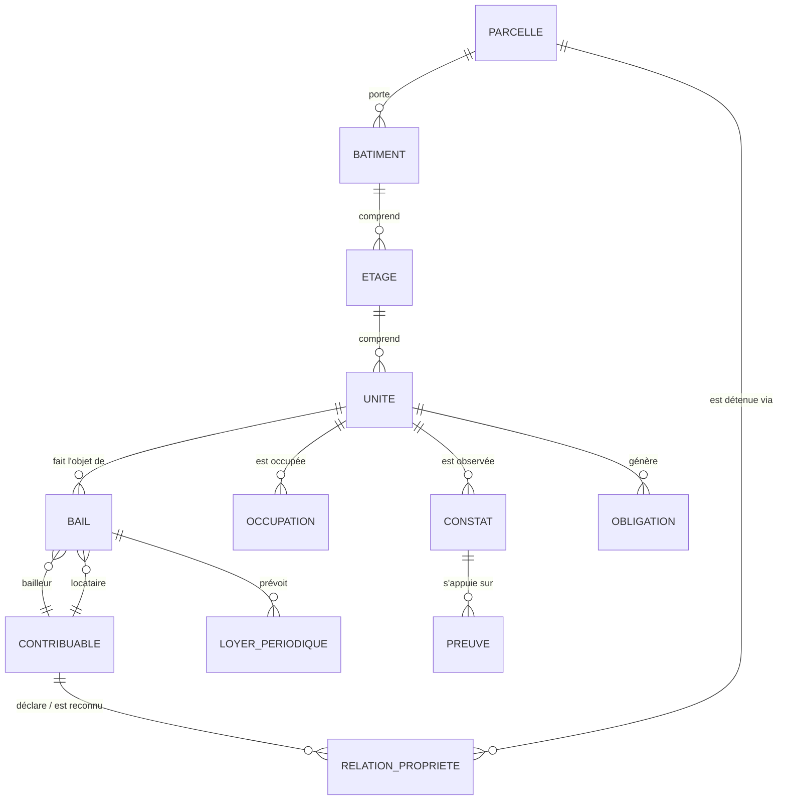

# 16. Modèle foncier et intelligence locative

Le module de l'intelligence foncière et locative (module 9, verticales Property et Rental) porte le gisement le plus important et le plus sensible. Il combine carte, enrôlement vérifié, recensement terrain, auto-déclaration, données administratives autorisées et détection d'anomalies assistée par l'IA.

## 16.1 Structure des données

| Niveau | Champs principaux | Usage fiscal |
|---|---|---|
| **Parcelle** | IGF, référence cadastrale ou coutumière, polygone ou point, superficie (déclarée / mesurée), rang de localité, bâtie ou non bâtie, statut foncier déclaré | Impôt foncier |
| **Bâtiment** | IGF, parcelle, nombre de niveaux, usage dominant, année approximative, emprise, matériaux (facultatif), photos | Impôt foncier, requalification |
| **Étage** | Numéro, usage | Structuration des unités |
| **Unité** | IGF, type (appartement, chambre, local commercial, annexe, dépendance), surface, usage (habitation, commerce, bureau, mixte), statut d'occupation | IRL, patente éventuelle |
| **Relation de propriété** | Contribuable, rôle (propriétaire, copropriétaire, usufruitier, héritier présumé, gestionnaire), quote-part, preuve, statut probant, dates | Détermination du redevable |
| **Bail** | Unité, bailleur, locataire, sous-locataire éventuel, loyer, périodicité, devise, date de début, date de fin, garantie, preuve, source (déclaré par bailleur / par locataire / observé) | Base de l'IRL et de la retenue |
| **Occupation** | Occupant, qualité (propriétaire occupant, locataire, sous-locataire, occupant autorisé, locataire commercial, logé gratuitement, vacant), date de constat | Contrôle et qualification |
| **Constat** | Agent, date, GPS, photos, observations, écarts avec déclaration | Preuve terrain |
| **Contestation** | Objet, motif, statut, décision | Protection des droits |

## 16.2 Valeur probante et chaîne de responsabilité

Chaque information porte l'un des quatre statuts probants : **DÉCLARÉ** (par le contribuable ou un tiers), **OBSERVÉ** (constaté sur le terrain), **VÉRIFIÉ** (validé par un agent habilité à partir de preuves concordantes), **CONTESTÉ** (en litige). La même échelle s'applique à la propriété.

| Qui | Fait | Ne fait jamais |
|---|---|---|
| Contribuable | Déclare son rôle, ses unités, ses baux | — |
| IA | Détecte incohérences et signaux de location | Créer une obligation ou désigner un redevable |
| Agent de terrain | Observe et documente | Trancher la propriété ou la dette |
| Contrôleur | Vérifie et propose la qualification | Publier seul une rectification au-delà du seuil |
| Chef de service | Valide la qualification | Modifier la règle |
| Moteur de liquidation | Calcule selon la règle active sur les faits vérifiés (ou déclarés si la procédure est déclarative) | Calculer sur un simple signal |

**La réponse de l'utilisateur à la question « êtes-vous propriétaire, bailleur, locataire… ? » n'est jamais une preuve suffisante de propriété ni d'assujettissement.** Elle ouvre une instruction.

## 16.3 Question posée à l'inscription et à chaque changement d'adresse

« Quelle est votre situation à cette adresse ? » — propriétaire occupant ; bailleur (je loue tout ou partie) ; locataire ; sous-locataire ; occupant autorisé (logé par un tiers) ; gestionnaire immobilier ; locataire commercial ; autre occupant légalement reconnu. Chaque réponse déclenche un bloc court et des pièces facultatives ou requises selon le rôle (chapitre 9).

## 16.4 Taux, retenue et élargissement d'assiette

Voir § 6.4 : taux de 22 % (1er rang) et 17 % (autres rangs), retenue de 20 % et 15 % [taux CONFIRMÉS par la presse, arrêté À VÉRIFIER] ; innovations 2026 sur les baux emphytéotiques, les sociétés immobilières et les indemnités de logement [À VÉRIFIER]. Ces valeurs sont paramétrées dans le registre juridique, jamais dans le code, et revalidées à chaque édit budgétaire.

## 16.5 Moteur de détection d'anomalies locatives

| Signal | Source (sous protocole) | Règle | Sortie |
|---|---|---|---|
| Plusieurs compteurs d'électricité ou d'eau sur une parcelle | Distributeurs | Aucune déclaration locative | Probable bien loué → file de vérification |
| Indemnités de logement en paie | Employeurs (grands redevables) | Pas de retenue IRL correspondante | Notification à l'employeur |
| Annonce ou mandat d'agence | Agences, annonces publiques | Bien non rattaché | Enquête documentaire |
| Bail d'entreprise déclaré au fisc national | Protocole DGI | Bailleur inconnu du registre provincial | Rapprochement inter-administrations |
| Parcelle déclarée non bâtie | Imagerie, permis | Construction visible | Requalification contrôlée |
| Immeuble neuf réceptionné | Permis de bâtir | Pas d'unité déclarée après 12 mois | Visite de recensement |
| Immeuble multi-unités déclaré vacant | Déclarations | Vacance longue et répétée | Vérification |
| Loyer atypique | Déclarations | Écart fort par rapport aux loyers du même quartier et type | Vérification (jamais rehaussement automatique) |
| Bail déclaré par le locataire, non déclaré par le bailleur | Déclarations croisées | Discordance | Invitation du bailleur à déclarer |

Chaque signal a un **score explicable** (facteurs contributifs affichés) ; un superviseur décide de l'ouverture d'une mission ; les biais sont surveillés (sur-ciblage d'une commune ou d'une catégorie de population, chapitre 23).

## 16.6 Carte et niveaux de visibilité

**Couche de situation fiscale** (interne) :

| Couleur | Signification |
|---|---|
| 🟢 Vert | Obligation régularisée |
| 🟠 Ambre | Paiement partiel, échéance proche ou revue nécessaire |
| 🔴 Rouge | En retard ou non régularisé **après vérification** |
| ⚪ Gris | Non enregistré ou données insuffisantes |
| 🔵 Bleu | En litige ou en revue formelle |

**Couche opérationnelle de vérification** (superviseurs, terrain) : vert vérifié ; ambre à vérifier ; rouge anomalie détectée ; gris inconnu ; bleu dossier en instruction.

| Public | Ce qu'il voit |
|---|---|
| Grand public | Aucune situation fiscale individuelle ; cartes agrégées par quartier (couverture, recettes) avec seuil minimal d'agrégation (pas de maille de moins de 20 objets) |
| Contribuable | Ses propres objets et statuts |
| Agent de terrain | Objets de sa mission : couleur, adresse, identifiant, dernier constat ; pas de montant ni d'historique de paiement détaillé |
| Contrôleur | Dossier complet des objets assignés |
| Direction | Couches agrégées et nominatives dans son périmètre |
| Exécutif | Agrégats et cartes de chaleur |

## 16.7 Indicateurs de couverture locative

Par avenue, quartier et commune : nombre estimé de parcelles, bâtiments et unités ; nombre enregistré ; unités occupées par le propriétaire ; unités louées ; bailleurs et locataires identifiés ; loyer déclaré ; base légalement imposable ; obligations émises, payées, impayées ; concentration géographique ; taux de couverture du recensement ; âge moyen de la dernière vérification.

## 16.8 Plaque fiscale immobilière

Chaque bâtiment reçoit une plaque normalisée portant l'identifiant géofiscal, un QR signé et un code court. Scan par un agent habilité : identifiant, statut d'occupation déclaré, couleur de situation. Scan public : « plaque authentique, bâtiment enregistré, commune, quartier » **et couleur de situation fiscale** (vert régularisé, orange partiel ou échéance proche, rouge en retard après vérification, gris non enregistré), avec sa légende générique — jamais le nom du propriétaire, l'adresse précise, un montant ou le détail des obligations. Une couleur rouge n'entraîne aucune mesure automatique : elle signale un dossier à traiter par une personne habilitée. *Décision de la Ville (26 septembre 2026) : le Cahier des exigences prévaut sur l'arbitrage ARB-76 de la version précédente, qui masquait la couleur au public.* Rendre la plaque obligatoire et interdire la mise en location d'un bien non immatriculé exige un acte [ACTE REQUIS].

## 16.9 Campagne locative prioritaire

1. Recensement des quartiers échantillons des communes pilotes (septembre 2026 → janvier 2027).
2. Invitation à la régularisation volontaire avec délai clair.
3. Déclaration simplifiée du bail et du loyer, pré-remplie à partir du recensement.
4. Détection des incohérences ; visites ciblées après revue humaine et autorisation de mission.
5. Liquidation selon la règle certifiée, avec explication.
6. Mesure des résultats par rapport au groupe de comparaison (chapitre 45).

## 16.10 Liaison des biens et occupations (spécification v1.0 du 28/09/2026)

*Source : `docs/sources/Specification_Liaison_Biens_Occupations_v1.0.md` ; couverture critère par critère :
`couverture-liaison-biens-occupations.md`. Construit sur le module 7 (§ 16.1) : chaque revendication porte une relation
du module 7 ; les rôles et états existants restent, LOCATAIRE, SOUS_LOCATAIRE, OCCUPANT et EXPLOITANT s'ajoutent.*

**Enregistrements distincts.** Le compte (la personne ou l'organisation), le bien (parcelle, bâtiment, unité ;
établissement d'activité) et la relation (revendication datée : rôle, quote-part, dates du / au, état, méthode de
vérification, pièces avec empreinte SHA-256, historique complet). Le bien porte son propre statut d'enregistrement —
PROVISIONAL (auto-déclaré, sans effet fiscal), CANONICAL (validé), ARCHIVED_ALIAS (ancien identifiant après une fusion
revue) — affiché à part de l'état de la relation, avec sa provenance et sa confiance.

**Cycle d'une revendication.** DRAFT → SUBMITTED → MATCHED_PENDING_VERIFICATION → VERIFIED ; NEEDS_EVIDENCE ; DISPUTED →
UNDER_REVIEW → VERIFIED | REJECTED | SUPERSEDED ; VERIFIED → ENDED. Chaque mutation exige une clé d'idempotence, contrôle
la version (409 si périmée), vérifie les dates (422) et laisse un événement d'audit avec empreintes avant / après.

**Rapprochement.** Référence officielle dans son espace de noms, puis adresse normalisée avec bâtiment et unité, puis
proximité GPS (seuil par défaut — à confirmer) avec composantes d'adresse. Un téléphone, un nom ou le GPS seul ne
proposent jamais rien ; aucun score ne vérifie. Les candidats ne montrent que des libellés neutres (« Unité 2, n° 12,
avenue … »), jamais une personne ; « Mon adresse n'y figure pas » crée un bien provisoire.

**Ordre indifférent.** Propriétaire d'abord : il déclare parcelle, bâtiment, unités et locataires connus (invitations
opaques, aucun compte créé). Locataire d'abord : un bien provisoire est créé ; quand le propriétaire déclare le sien, le
doublon est PROPOSÉ en revue (dossier FUSION_BIENS : deux arbres, cible canonique explicite, motif, réviseur, alias
conservés, bloqué si des références officielles vérifiées divergent). Une personne déjà inscrite pour une autre raison
(entreprise, stationnement) revendique son logement depuis son compte, sans second compte.

**Vérification.** Seul un réviseur habilité vérifie (pièce acceptée pour le rôle, constat de terrain GPS + photo par un
agent affecté dans son territoire et pour une durée limitée, ou intégration autorisée) ; une invitation acceptée n'est
qu'une preuve d'appui. Contestation ⇒ revue motivée ; un rejet se conteste par un nouveau dossier (appel). Aucune
décision automatique, aucune IA.

**Périodes.** Un déménagement termine la relation à sa date (jamais supprimée) ; « qui occupait l'unité X à la date D »
se lit par la vue datée `GET /v1/relations-biens/effectives` (relations VÉRIFIÉES seulement), qui sert les modules en
aval (IRL, impôt foncier, baux). Un bien auto-déclaré non qualifié n'alimente aucune liquidation définitive.

**Confidentialité.** Avant vérification, aucune donnée de l'autre partie (nom, téléphone, NIF, compte, pièces). Après
vérification, le propriétaire voit qu'une unité a un occupant vérifié, la période et le loyer du bail qu'il a lui-même
déclaré (IRL) ; le locataire voit la désignation du propriétaire (attestation). Jamais d'accès au compte, aux autres
biens, obligations ou paiements de l'autre partie. Paramètres du § 10 (preuves par rôle, espace de noms, vérificateurs,
fondement fiscal, conservation, recours, mandat terrain, divulgation) : par défaut — à confirmer par le maître
d'ouvrage ; les revendications restent « non validées juridiquement » jusqu'à leur approbation.

# 17. Cadastre fiscal géospatial

## 17.1 Principes

Le cadastre fiscal de MOSOLO est un **cadastre d'usage fiscal**, pas un cadastre juridique : il localise et décrit les objets générateurs de recettes, il ne confère aucun droit de propriété. Il s'articule avec les services fonciers et cadastraux compétents, auxquels il ne se substitue pas.

## 17.2 Couches

| Groupe | Couches |
|---|---|
| Territoire | Province, communes (24), quartiers, avenues, rues, îlots, rangs de localité |
| Foncier | Parcelles, bâtiments, unités |
| Économie | Commerces et établissements, marchés et étals, débits de boissons, carrières |
| Mobilité | Axes, zones de stationnement, gares routières, points d'embarquement, routes de transport, péages |
| Domaine public | Emprises, occupations temporaires |
| Réseaux | Supports publicitaires, antennes et pylônes |
| Fluvial | Ports, quais, embarcations (position au port d'attache) |
| Concessions | Concessions minières, forestières, carrières |
| Infrastructures publiques | Bâtiments publics, écoles, centres de santé, ouvrages de drainage |
| Opérations | Zones d'inspection, polygones de mission, traces de recensement, couverture |
| Analyse | Cartes de chaleur des recettes, de la conformité, du potentiel estimé, des anomalies |

## 17.3 Identifiant géographique fiscal (IGF)

Chaque objet imposable reçoit un **identifiant interne aléatoire, non signifiant et permanent** (UUID) et un **code territorial lisible** pour l'usage humain, par exemple `KIN-GOM-Q012-P004517-B01-U03` (commune, quartier, parcelle, bâtiment, unité). Le code lisible peut changer (redécoupage) ; l'identifiant interne jamais. L'IGF est relié à : localisation et géométrie, catégorie d'objet, relations avec les contribuables et leurs statuts probants, photographies, documents, historique d'inspection, règles applicables, obligations, paiements, quittances, litiges et journal d'audit.

## 17.4 Cas difficiles

| Cas | Procédure |
|---|---|
| Objet sans adresse formelle | Adresse descriptive + point GPS + photo de repère + code territorial ; plaque |
| Quartiers d'habitat informel | Recensement par îlot avec chefs de quartier ; identification de l'occupation sans préjuger du droit foncier ; mention explicite « situation foncière non établie » |
| GPS imprécis (< 15 m de précision non atteinte) | Mode « pointage assisté » sur fond de carte, relevé multiple moyenné ; statut `LOCALISATION_APPROXIMATIVE` ; revue ultérieure |
| Conflit de limites entre parcelles | Statut `CONTESTÉ` sur la géométrie ; aucune modification sans décision du service foncier compétent ; les obligations restent calculées sur la base non contestée |
| Plusieurs activités en un lieu | Un objet par activité, rattaché au même bâtiment ou à la même unité |
| Une entreprise, plusieurs établissements | Un compte, plusieurs établissements, chacun avec son IGF |
| Un bien, plusieurs unités louées ou commerciales | Modèle parcelle → bâtiment → étage → unité ; une obligation par unité et par période |
| Doublon d'objet (deux recensements) | Fusion d'objets par maker-checker ; aucun historique perdu |
| Changement de limites administratives | Historisation des codes territoriaux ; recalcul des agrégats |

## 17.5 Méthode de recensement massif

1. **Fond de carte** : imagerie récente, empreintes de bâtiments (sources ouvertes et acquisitions), numérotation existante.
2. **Pré-pointage** des bâtiments sur imagerie (assisté par apprentissage automatique, validé humainement).
3. **Recensement terrain** par îlot avec l'application hors ligne, en présence d'un relais de quartier.
4. **Pose de plaques** et remise d'une invitation à l'enrôlement.
5. **Contrôle qualité** par échantillonnage indépendant (5 % minimum).
6. **Recoupement** avec les données partenaires.
7. **Mise à jour continue** : permis de bâtir, mutations, signalements, constats.

## 17.6 Architecture géospatiale

Base spatiale PostgreSQL/PostGIS ; services cartographiques aux normes OGC (WMS, WFS, tuiles vectorielles) ; fonds de carte hors ligne sur les terminaux (MBTiles / PMTiles) ; système de référence WGS 84 pour la capture, projection métrique locale pour les calculs de surface ; index spatiaux ; historique des géométries (tables temporelles) ; séparation stricte entre couches publiques agrégées et couches nominatives.
