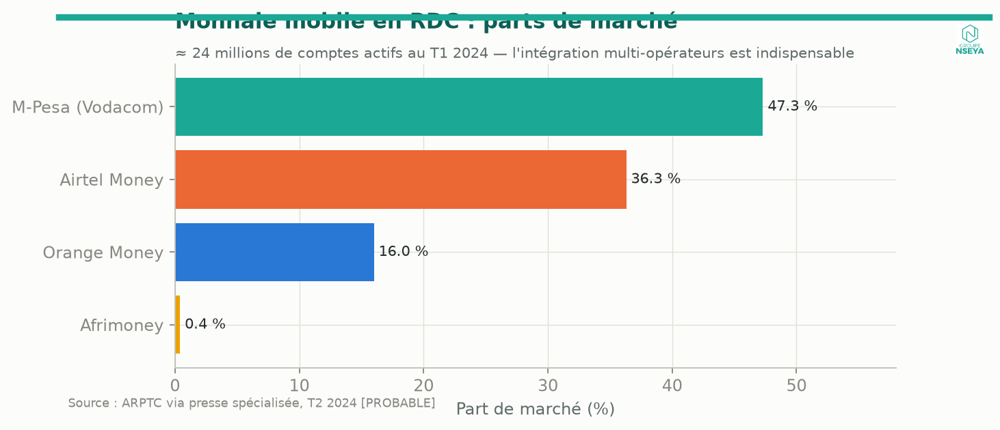
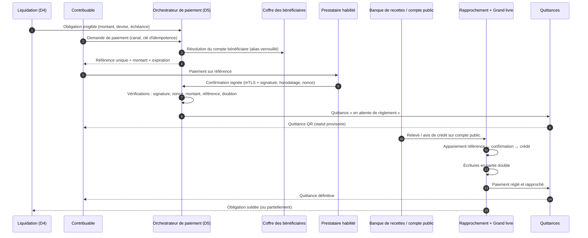
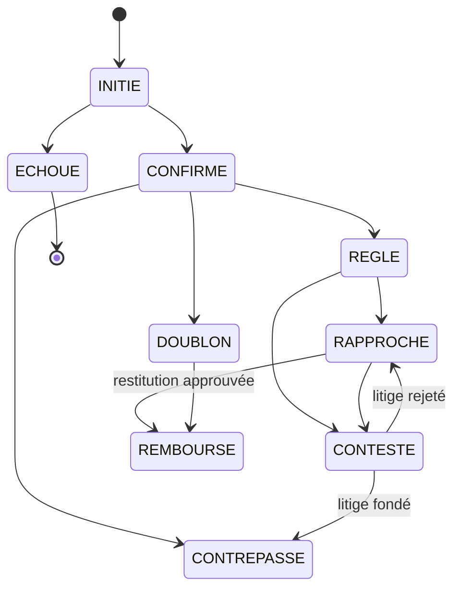
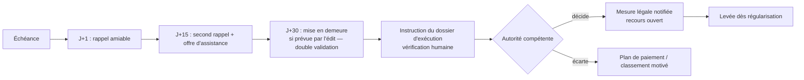
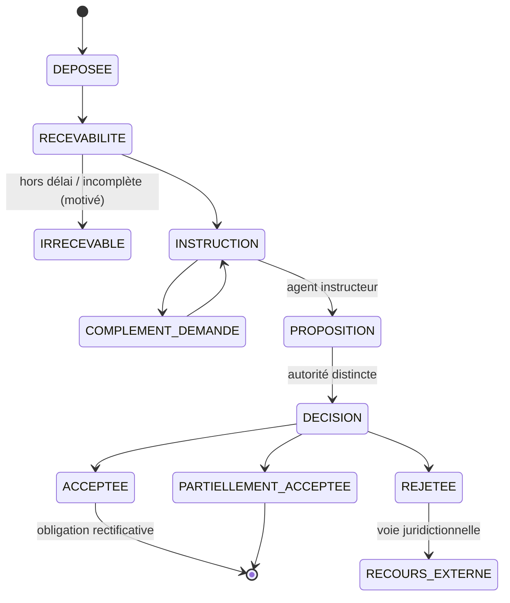

# 18. Modèle de paiement et de règlement

## 18.1 Principe : MOSOLO orchestre, il ne détient pas

KINSHASA MOSOLO **n'est pas un compte de recettes**. Il émet des références de paiement, reçoit les confirmations signées des prestataires habilités, suit le règlement sur les comptes publics désignés, rapproche et prouve. Les fonds vont du payeur au prestataire habilité, puis au compte public de recettes désigné, puis au compte de la province selon les règles du Trésor (§ 6.8). Aucune recette publique ne transite par un compte de l'opérateur de la plateforme.

## 18.2 Canaux

| Canal | Fonctionnement | Conditions |
|---|---|---|
| Monnaie mobile | Paiement marchand (push de demande de paiement ou saisie de la référence) vers le compte marchand de recettes publiques | Émetteur agréé BCC ; compte marchand au nom de l'entité publique ; confirmation serveur à serveur signée |
| Banques | Paiement au guichet ou en ligne sur référence | Convention de banque de recettes ; relevés quotidiens |
| Cartes de paiement | Passerelle d'acquisition (diaspora, entreprises) | Acquéreur habilité ; 3-D Secure |
| Points de paiement agréés | Seul canal d'espèces ; encaissement sur référence, reçu provisoire, règlement quotidien | Agrément, garantie, plafonds, contrôles mystère |
| USSD | Consultation de la référence et paiement par monnaie mobile | Code court officiel unique |
| QR | QR de paiement sur l'avis (norme d'interopérabilité si disponible) | Référence et montant non modifiables |
| Virement | Grandes entreprises, administrations | Référence obligatoire dans le libellé |
| Autres canaux légalement autorisés | Selon agrément | Connecteur activé seulement sur preuve d'agrément (J9) |

## 18.3 Cycle de vie complet

| # | Étape | Données produites | Contrôle |
|---|---|---|---|
| 1 | Création de l'obligation | Obligation, version de règle | Règle active |
| 2 | Avis de paiement | Avis signé | Mentions légales |
| 3 | Référence unique | `payment_reference` (clé de contrôle, expiration) | Montant figé ; une référence = une obligation (ou un panier explicite) |
| 4 | Choix du canal | Canal | Canal activé |
| 5 | Initiation | Ordre de paiement | Idempotence |
| 6 | Confirmation du prestataire | Événement signé | Signature, anti-rejeu, montant |
| 7 | Règlement en compte public | Ligne de relevé | Compte = alias du coffre |
| 8 | Rapprochement | Correspondance | Tolérances définies |
| 9 | Comptabilisation définitive | Écritures | Équilibre débit/crédit |
| 10 | Quittance électronique | Quittance signée | État autorisé |
| 11 | Traitement des exceptions | Dossier d'exception | Quatre yeux |
| 12 | Remboursement ou contrepassement | Écritures inverses | Double approbation, vers la source |

## 18.4 États distincts du paiement

| État | Définition | Quittance |
|---|---|---|
| `INITIE` | Ordre créé, référence émise | Aucune |
| `CONFIRME` | Confirmation signée et vérifiée du prestataire | Provisoire (« en attente de règlement ») |
| `REGLE` | Crédit constaté sur le compte public | Provisoire |
| `RAPPROCHE` | Correspondance complète obligation–confirmation–crédit, écritures passées | **Définitive** |
| `ECHOUE` | Refus ou expiration | Aucune |
| `DOUBLON` | Deuxième paiement pour la même référence | Crédit ou remboursement selon règle |
| `CONTREPASSE` | Annulation par le prestataire (fraude, erreur) | Quittance annulée, contre-écriture |
| `REMBOURSE` | Restitution approuvée | Mention de remboursement |
| `CONTESTE` | Litige ouvert (contribuable ou prestataire) | Statut « contesté » |

## 18.5 Protections du circuit

| Menace | Contre-mesure |
|---|---|
| Paiement en double | Clé d'idempotence par demande ; une référence ne peut être soldée qu'une fois ; tout excédent devient `DOUBLON` traité par règle |
| Rejeu de confirmation | Nonce unique, horodatage à fenêtre courte, stockage des identifiants de transaction prestataire (unicité) |
| Faux rappel (callback) | mTLS + signature asymétrique du message ; liste d'adresses autorisées ; vérification de l'état auprès du prestataire (appel de contrôle) avant toute quittance |
| Capture d'écran falsifiée ou SMS forgé | **Aucune quittance sur présentation d'une preuve visuelle** ; seule compte la confirmation serveur à serveur ; le contrôleur vérifie par QR |
| Référence manipulée | Clé de contrôle, montant et bénéficiaire liés à la référence côté serveur ; l'API refuse toute modification |
| Compte bénéficiaire altéré | Les canaux reçoivent un **alias** résolu dans le coffre verrouillé ; changement sous quorum, hors bande, 72 h de refroidissement (§ 12.6) |
| Fraude interne | Aucun rôle ne peut créer un paiement ; séparation des tâches ; journal d'audit |
| Remboursement indu | Double approbation, plafond, vers l'instrument d'origine uniquement, délai de carence, contrôle a posteriori à 100 % |
| Encaissement en espèces non enregistré | Espèces uniquement via points agréés ; reçu provisoire horodaté par le système ; règlement quotidien ; contrôles mystère ; signalement public |

## 18.6 Politique de quittance

Deux niveaux : **quittance provisoire** dès la confirmation serveur à serveur vérifiée (en moins d'une minute), portant la mention « en attente de règlement » ; **quittance définitive** à l'état `RAPPROCHE`. Si le règlement n'est pas constaté dans le délai contractuel, une exception est ouverte, sans remise en cause automatique des droits du contribuable, qui a payé de bonne foi par un canal officiel : le litige est avec le prestataire.

# 19. Quittance électronique

## 19.1 Contenu

| Champ | Exemple |
|---|---|
| Numéro de quittance | `Q-2027-KIN-000123456-7` |
| Référence du contribuable | IUC (et NIF si disponible) |
| Référence de paiement | `PR-7F3K-9Q2M` |
| Obligation(s) et objet(s) | Avis `AV-2027-IF-…`, IGF de la parcelle |
| Catégorie de recette | Impôt foncier 2027 |
| Montant et devise | 🇺🇸 USD 150,00 (contre-valeur indicative 🇨🇩 CDF …) |
| Date et heure du paiement | Heure serveur |
| Canal et identifiant de transaction | Monnaie mobile, identifiant prestataire |
| État de règlement | Provisoire / définitive |
| Administration bénéficiaire | DGIPK (compte public désigné par alias) |
| QR sécurisé | Lien de vérification + signature compacte |
| Signature numérique | Signature avancée (PKI provinciale, HSM) |
| Statut | Valide, en attente, annulée, contrepassée, remplacée, fraude suspectée |
| Mode de vérification | Scan QR, code court par SMS/USSD, portail |

## 19.2 Vérification publique

Le scan du QR (ou la saisie du code court) renvoie un résultat **minimal** :

| Résultat | Affichage public |
|---|---|
| ✅ Valide | « Quittance authentique — montant, date, catégorie de recette, administration bénéficiaire, quatre derniers caractères de la référence du contribuable » |
| ⏳ En attente | « Paiement confirmé, règlement en cours » |
| ❌ Annulée / contrepassée | « Quittance non valable » + motif générique |
| 🔁 Remplacée | « Remplacée par la quittance n° … » |
| ⚠️ Fraude suspectée | « Vérification impossible — contactez la régie » ; signalement automatique à l'équipe anti-fraude |
| ❓ Inconnue | « Aucune quittance ne correspond » |

Aucun nom complet, adresse ou historique n'est exposé. Les vérifications sont limitées en fréquence et journalisées. Les services habilités (API quitus, contrôleurs) obtiennent des informations supplémentaires selon leurs droits.

## 19.3 Vérification hors ligne

Le QR contient une signature compacte vérifiable hors ligne par l'application terrain (clé publique embarquée) : l'agent sait que la quittance a été émise par MOSOLO et n'a pas été altérée. Le **statut** (annulation éventuelle) exige une vérification en ligne ; hors ligne, l'application utilise une liste de révocation signée téléchargée au départ de mission et affiche « authentique — statut vérifié au JJ/MM HH:MM ».

## 19.4 Titres et quittances

Une quittance prouve un paiement ; un **titre** (autorisation, vignette, ticket, pass) prouve un droit, avec une période de validité et des statuts (vert valide, ambre bientôt expiré, rouge expiré ou suspendu). Les titres sont gérés par le moteur de titres (module 70) et contrôlés par plaque, QR ou code (module 71).

# 20. Rapprochement

## 20.1 Appariement à trois voies

Chaque paiement est rapproché sur trois sources indépendantes : **l'obligation** (ce qui est dû), **la confirmation du prestataire** (ce qui a été payé), **le relevé du compte public** (ce qui est arrivé). Un quatrième niveau, **l'écriture comptable**, clôt la chaîne.

| Règle d'appariement | Traitement |
|---|---|
| Référence, montant et devise identiques, crédit constaté | Rapprochement automatique |
| Montant différent dans la tolérance de change définie | Rapprochement + écart de change enregistré |
| Crédit sans confirmation | Exception « crédit orphelin » → recherche prestataire |
| Confirmation sans crédit à J+1 ouvré | Exception « règlement manquant » → relance prestataire, pénalités contractuelles |
| Crédit groupé (règlement net d'un prestataire) | Décomposition par le fichier de détail du prestataire ; contrôle de totaux |
| Commissions prélevées à la source par le prestataire | **Interdit par défaut** : le prestataire règle le brut, les commissions sont facturées séparément et payées sur crédit budgétaire (sauf convention contraire approuvée, visible au grand livre) |

Cible : plus de 95 % de rapprochement automatique à J+1, exceptions résolues sous 5 jours ouvrés, aucune exception de plus de 30 jours sans décision.

## 20.2 Grand livre public en partie double

Le grand livre (module 59) enregistre chaque événement financier par des écritures équilibrées, **en ajout seul**. Exemple simplifié :

| Événement | Débit | Crédit |
|---|---|---|
| Émission d'une obligation de 100 | Créance sur contribuable 100 | Recette constatée 100 |
| Confirmation de paiement | Fonds à recevoir du prestataire 100 | Créance sur contribuable 100 |
| Crédit sur compte public | Compte public de recettes 100 | Fonds à recevoir du prestataire 100 |
| Contrepassement | Créance sur contribuable 100 | Fonds à recevoir du prestataire 100 (inverse) |
| Remboursement | Recette constatée (restitution) 100 | Compte public de recettes 100 |

Clôture quotidienne signée (hachage de la journée chaîné à la précédente), comptes d'attente (suspens) datés et justifiés, interface d'export vers la comptabilité publique du Trésor provincial. **Aucune correction sans contre-écriture liée à l'original.**

# 21. Recouvrement et exécution

## 21.1 Principes

Le recouvrement est **gradué, proportionné, tracé et contestable**. Le système calcule, segmente, prépare et notifie ; **toute mesure coercitive est décidée par l'autorité légalement compétente**, après vérification humaine, conformément à l'édit de procédure (J4).

## 21.2 Segmentation

| Segment | Critère | Approche |
|---|---|---|
| Oubli | Premier retard, bon historique | Rappel simple, facilité de paiement |
| Friction | Difficultés d'accès au paiement | Assistance, point de paiement proche |
| Capacité limitée | Montant élevé relatif au revenu présumé | Échéancier si la loi le permet |
| Contestation | Désaccord sur la base | Orientation vers la réclamation |
| Refus délibéré | Relances ignorées, capacité établie | Procédure légale graduée |
| Grands redevables | Enjeux élevés | Suivi dédié, contrôle contradictoire |

## 21.3 Parcours gradué

Les délais ci-dessus sont des **valeurs de conception** à remplacer par ceux de l'édit. Garde-fous : aucune mesure sur un dossier contesté avec effet suspensif ; aucune mesure si l'adresse de notification n'est pas vérifiée ; vérification que le paiement n'est pas en cours de règlement ; levée automatique proposée dès régularisation ; indicateurs de proportionnalité (mesures par segment de revenu, par commune) suivis par l'audit.

## 21.4 Arriérés

Tableau d'âge des créances, prescription calculée par règle, priorisation par rendement net (montant recouvrable × probabilité − coût), campagnes de régularisation (module 90) si un acte le prévoit, admission en non-valeur par décision motivée et contrôlée.

# 22. Recours et droits du contribuable

## 22.1 Charte des droits intégrée au produit

| Droit | Traduction dans MOSOLO |
|---|---|
| Savoir ce qu'il doit et pourquoi | Explication de chaque montant : règle, version, base légale, assiette, formule |
| Accéder à ses données | Consultation et export de ses données |
| Faire rectifier une erreur | Demande de rectification depuis chaque donnée |
| Contester | Réclamation depuis chaque objet et chaque obligation |
| Être entendu avant une mesure | Notification préalable et délai d'observations (selon texte) |
| Recevoir une décision motivée | Modèle de décision avec motifs obligatoires |
| Connaître les délais | Compte à rebours légal visible |
| Ne pas payer deux fois | Blocage des doubles revendications (§ 10.3) et des doubles paiements |
| Être protégé contre l'arbitraire | Aucune sanction automatique ; journal d'audit consultable par le contribuable pour son dossier |
| Signaler un abus | Ligne de signalement protégée (module 69) |
| Confidentialité fiscale | Accès limité et journalisé ; aucune exposition publique |

## 22.2 Workflow des réclamations

L'instructeur et le décideur sont des personnes distinctes ; l'IA peut résumer le dossier et proposer des éléments, **jamais clore un recours**. Les exonérations, annulations et corrections suivent le même principe de séparation et de contre-écriture. Les statistiques de recours (volume, délai, taux de décisions favorables par motif et par commune) sont publiées de façon agrégée ; un taux élevé de recours fondés sur un motif déclenche une revue de la qualité des données ou de la règle.
