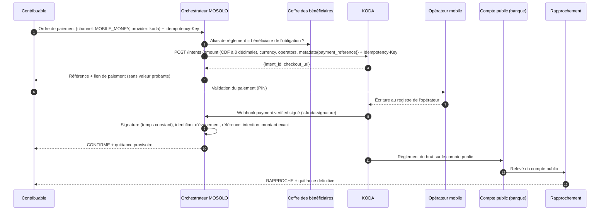
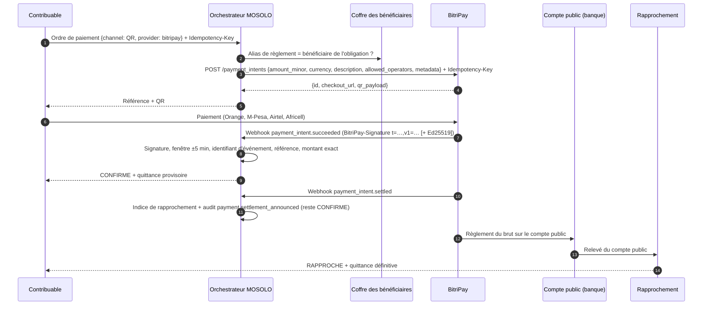

## 18.7 Connecteurs de prestataires : rôle et périmètre

Les connecteurs **BitriPay** et **KODA** raccordent KINSHASA MOSOLO à deux prestataires de paiement par monnaie mobile et QR. Ils appliquent sans exception le principe du § 18.1 : **MOSOLO orchestre, il ne détient pas**. Concrètement, un connecteur :

- crée chez le prestataire une *intention de paiement* portant la référence MOSOLO, le montant figé de l'obligation et le seul minimum de métadonnées nécessaire (référence de paiement, identifiant d'ordre, identifiant d'obligation) — aucune donnée personnelle du contribuable n'est transmise ;
- reçoit, vérifie et normalise les **webhooks signés serveur à serveur** du prestataire ;
- transmet l'événement normalisé à la même fonction de confirmation que tous les autres canaux (`confirmFromProvider`) : unicité de la transaction, référence connue, liaison ordre ↔ intention, montant **exactement** égal au montant dû, doublon, écritures en partie double, quittance provisoire, communications et audit.

Le connecteur ne décide de rien : il ne peut ni émettre une quittance, ni solder une obligation, ni marquer un paiement comme réglé. Les fonds vont du payeur au prestataire, puis au **compte public désigné dans le coffre des bénéficiaires**, jamais à un compte de l'opérateur de la plateforme. La configuration de chaque connecteur porte un `settlementAccountAlias` qui **doit** exister dans le coffre : dans le cas contraire, la plateforme refuse de démarrer. À la création d'une intention, ce compte de règlement doit en outre être celui de l'obligation (sinon refus `SETTLEMENT_ACCOUNT_MISMATCH`), afin que le rapprochement à trois voies (§ 20.1) puisse s'appliquer sans exception « mauvais compte ».

Si le prestataire est injoignable lors de la création de l'intention, MOSOLO répond `502 PROVIDER_UNAVAILABLE` et **n'enregistre aucun ordre** : le contribuable peut réessayer immédiatement. Une intention qui aurait malgré tout été créée côté prestataire porte une référence inconnue de MOSOLO ; elle ne pourra jamais produire de quittance et toute confirmation la concernant déclenche une alerte.

## 18.8 Prérequis à toute activation en production

BitriPay et KODA sont des **prestataires candidats**. Leur intégration technique dans le socle ne vaut ni désignation, ni engagement de la Province. L'activation en production est subordonnée à l'ensemble des conditions suivantes :

| Prérequis | Contenu | Référence |
|---|---|---|
| Agrément BCC | Preuve de l'habilitation du prestataire par la Banque centrale du Congo pour l'activité exercée (émission de monnaie électronique, agrégation, acquisition) | J9 (§ 6) ; § 18.2 |
| Compte de règlement public | Compte de recettes au nom de l'entité publique, inscrit au coffre sous un alias, vers lequel le prestataire règle le **montant brut** | § 18.1 ; § 12.6 ; § 20.1 |
| Convention | Délais de règlement, fichiers de détail, pénalités pour règlement manquant, commissions facturées séparément, sécurité des webhooks, réversibilité | § 20.1 |
| Passation | Sélection par une procédure conforme aux règles de la commande publique provinciale ; aucun prestataire n'est désigné par le code | § 34 |
| Recette technique | Épreuves en environnement de test du prestataire, levée des points [À VÉRIFIER] du § 18.14 | § 18.14 |

Sans clé API, chaque connecteur fonctionne en **bac à sable local** : aucune connexion réseau, intention simulée (`sbx_…`), secret de webhook de démonstration. Ce mode sert exclusivement à la démonstration et aux tests.

## 18.9 Correspondance des événements

| Prestataire | Événement | Effet dans MOSOLO | Méthode de confirmation |
|---|---|---|---|
| KODA | `payment.verified` | Confirmation commune → `CONFIRME` + quittance provisoire | `KODA_OPERATOR_LEDGER` |
| KODA | `payment.verified.late` | Idem (un même reçu KODA déjà traité est un rejeu sans effet ; un reçu différent sur une référence déjà payée devient `DOUBLON`) | `KODA_OPERATOR_LEDGER` |
| BitriPay | `payment_intent.succeeded` | Confirmation commune → `CONFIRME` + quittance provisoire | `BITRIPAY_RAIL` |
| BitriPay | `payment_intent.canceled` | `ECHOUE` si l'ordre est encore `INITIE` | `BITRIPAY_RAIL` |
| BitriPay | `payment_intent.payment_failed` | Journalisé (`payment.attempt_failed`), **sans changement d'état** : une tentative échouée n'est pas terminale, le payeur peut réessayer sur la même intention | — |
| BitriPay | `payment_intent.ambiguous_hold` | **Attente prestataire** (résultat opérateur inconnu, paiement en revue manuelle chez BitriPay) : **aucun changement d'état, aucune quittance**, alerte et exception de rapprochement `PROVIDER_AMBIGUOUS` jusqu'à la confirmation signée ou l'échec | — |
| BitriPay | `payment_intent.settled` | **Annonce de règlement** : conservée comme indice de rapprochement, audit `payment.settlement_announced`. L'ordre **reste `CONFIRME`** | — |
| Tous | Autre type | 200, ignoré, audit `payment.webhook.ignored` | — |

La référence MOSOLO d'un événement est résolue à partir des métadonnées (`payment_reference`, `order_id`) et de l'intention enregistrée sur l'ordre ; si ces sources divergent, l'événement est refusé (`REFERENCE_CONFLICT`) et une alerte est levée. Un ordre lié à une intention ne peut être confirmé que par **ce** prestataire et pour **cette** intention (`PROVIDER_ORDER_MISMATCH`).

Les états `REGLE` puis `RAPPROCHE`, et donc la quittance **définitive**, ne résultent **que** du rapprochement à trois voies avec le relevé du compte public (§ 20.1). L'annonce de règlement d'un prestataire est une information utile, non une preuve d'arrivée des fonds.

## 18.10 Conversion des unités mineures

Les prestataires échangent des montants entiers en *unités mineures*, mais leurs conventions diffèrent de celles de MOSOLO, où le franc congolais compte deux décimales.

| Devise | MOSOLO | KODA | BitriPay |
|---|---|---|---|
| CDF | 2 décimales | **0 décimale** : `25000` = 25 000 FC | 2 décimales par défaut (ISO 4217), paramétrable `BITRIPAY_CDF_EXPONENT` [À VÉRIFIER] |
| USD | 2 décimales | 2 décimales : `589` = 5,89 $ | 2 décimales |

La conversion est **exacte** (chaînes décimales et entiers `BigInt`, jamais de virgule flottante) et s'appuie sur une table d'exposants propre à chaque connecteur. Un montant non représentable chez le prestataire — par exemple 1 250,50 CDF chez KODA — est **refusé** (`422 AMOUNT_NOT_REPRESENTABLE`) et jamais arrondi : tout arrondi créerait un écart entre le dû et le payé. En sens inverse, `25000` CDF reçu de KODA devient `"25000.00"` CDF ; `589` USD devient `"5.89"` USD. Un montant hors de la plage entière sûre d'un document JSON est également refusé.

## 18.11 Sécurité : signatures, anti-rejeu, secrets

| Mesure | KODA | BitriPay |
|---|---|---|
| Signature | `x-koda-signature` = HMAC-SHA256 hexadécimal du corps brut | `BitriPay-Signature: t=<unix>,v1=<hex>` avec HMAC-SHA256 de `"<t>.<corps brut>"` [À VÉRIFIER] ; en complément, `BitriPay-Signature-Ed25519` vérifiée avec la clé publique de la plateforme épinglée par configuration (exigible) |
| Comparaison | À temps constant | À temps constant |
| Fenêtre temporelle | Aucun horodatage signé connu : anti-rejeu par identifiant d'événement | ±5 minutes sur l'horodatage signé |
| Anti-rejeu | Identifiant d'événement unique ; unicité du reçu KODA | Identifiant d'événement unique ; unicité de l'intention |
| Échec | 401 + alerte de sécurité (critique pour une signature invalide) | Idem |
| Rejeu | 200, réponse mémorisée, aucun double effet | Idem |

Un événement refusé (montant différent, référence inconnue) n'est pas mémorisé : s'il est présenté de nouveau, il est de nouveau contrôlé, et de nouveau refusé avec alerte. La preuve interne attachée à chaque quittance provisoire indique la garde anti-rejeu utilisée (nonce ou identifiant d'événement) et si un horodatage signé a été vérifié.

Les clés API sont des clés **secrètes** `sk_…`, lues uniquement depuis les variables d'environnement du serveur ; une clé publiable `pk_…` est refusée au démarrage. Aucune clé n'est journalisée : le client HTTP n'écrit que des valeurs masquées (`sk_live_…a1b2`). Le `client_secret` renvoyé par les prestataires n'est ni conservé ni transmis au navigateur. Hors bac à sable local, le secret de webhook est obligatoire ; les secrets de démonstration ne peuvent donc pas être utilisés en production. Chaque POST qui engage de l'argent porte un en-tête `Idempotency-Key` égal à la référence de paiement MOSOLO ; les nouvelles tentatives automatiques ne concernent que les appels idempotents (lectures, et POST BitriPay dont l'idempotence est documentée).

## 18.12 Ce qui est interdit

**Aucune quittance n'est émise sur présentation d'une capture d'écran ou d'un code SMS** (§ 18.5). Les deux prestataires proposent pourtant des points d'entrée qui acceptent de telles preuves (KODA : `POST /intents/{id}/verify`, `POST /checkout/{id}/verify` ; BitriPay : `POST /verifications`). MOSOLO **ne les expose pas au contribuable** et ne s'en sert jamais pour confirmer un paiement.

Un relais serveur, réservé au comptable public (R17), à l'analyste de rapprochement (R18) et à l'agent de contentieux (R20), permet seulement de joindre le résultat de cette vérification à un **dossier de litige ou d'exception**. Ce résultat est une pièce de dossier (`legalEffect: AUCUN`) : il ne modifie jamais l'état du paiement et ne produit jamais de quittance. Aucune image n'est reçue par MOSOLO — seule son empreinte SHA-256 — et le code SMS présenté n'est conservé que sous forme hachée. Chaque demande est journalisée.

Sont également interdits : tout **frais d'application** (`application_fee_minor`) prélevé sur une intention de paiement d'une recette publique (§ 18.15) ; la confirmation d'un paiement à partir de l'URL de retour (`success_url`) ou de la page de paiement du prestataire ; le règlement vers un compte absent du coffre ; la compensation de commissions sur le montant réglé sans convention approuvée (§ 20.1).

## 18.13 Diagrammes de séquence

### KODA

### BitriPay

## 18.14 Points à vérifier avant mise en production

Les éléments ci-dessous ne sont pas documentés publiquement ou l'ont été de façon incomplète. Le socle adopte une hypothèse prudente, isolée dans le connecteur et paramétrable ; chacune doit être confirmée sur la spécification OpenAPI du prestataire lors de la recette.

| # | Prestataire | Point | Hypothèse retenue dans le socle |
|---|---|---|---|
| 1 | KODA | Forme exacte du corps des webhooks | Parseur tolérant : intention `intent_id` \| `intent.id` \| `data.intent_id` ; montant `amount` \| `data.amount` (unités mineures) ; `currency` ; `receipt_id` ; `metadata.order_id` ou `metadata.payment_reference` ; identifiant d'événement `id` \| `event_id` (à défaut, empreinte du corps) [À VÉRIFIER sur /v1/openapi.json] |
| 2 | KODA | Horodatage signé des webhooks | Aucun : anti-rejeu par identifiant d'événement et unicité du reçu [À VÉRIFIER sur /v1/openapi.json] |
| 3 | KODA | Préfixe `sha256=` éventuel de la signature | Toléré [À VÉRIFIER sur /v1/openapi.json] |
| 4 | KODA | Prise en charge de l'en-tête Idempotency-Key | Envoyé, mais aucune nouvelle tentative automatique de POST [À VÉRIFIER sur /v1/openapi.json] |
| 5 | KODA | Champ de description d'une intention | Porté dans `metadata.description` [À VÉRIFIER sur /v1/openapi.json] |
| 6 | KODA | Préfixe des clés de test (`sk_test_`) et références magiques du bac à sable (`TEST-OK-25000`, `TEST-REPLAY`…) | Clé `sk_live_` = réel, autre `sk_` = test [À VÉRIFIER sur /v1/openapi.json] |
| 7 | KODA | Événement d'échec de paiement | Aucun traité ; seuls `payment.verified` et `payment.verified.late` [À VÉRIFIER sur /v1/openapi.json] |
| 8 | KODA | Corps de `POST /intents/{id}/verify` | `{sms_code?, screenshot_sha256?}` (pièce de dossier uniquement) [À VÉRIFIER sur /v1/openapi.json] |
| 9 | BitriPay | Format de l'en-tête `BitriPay-Signature` | `t=<unix>,v1=<hex HMAC-SHA256 de "<t>.<corps>">`, tolérance ±5 min [À VÉRIFIER sur l'OpenAPI BitriPay] |
| 10 | BitriPay | Signature Ed25519 | En-tête `BitriPay-Signature-Ed25519`, base64 sur le corps brut ; clé publique épinglée depuis `GET /v1/keys` [À VÉRIFIER sur l'OpenAPI BitriPay] |
| 11 | BitriPay | Exposant du CDF | 2 (ISO 4217), paramétrable 0 ou 2 [À VÉRIFIER sur l'OpenAPI BitriPay] |
| 12 | BitriPay | Forme des événements | `data.object` avec `id`, `amount_minor`, `currency`, `metadata` [À VÉRIFIER sur l'OpenAPI BitriPay] |
| 13 | BitriPay | Noms `payment_intent.payment_failed` et `payment_intent.canceled` | Traités respectivement comme tentative non terminale et comme échec [À VÉRIFIER sur l'OpenAPI BitriPay] |
| 14 | BitriPay | Corps de `POST /verifications` | `{payment_intent, sms_code?, screenshot_sha256?}` (pièce de dossier uniquement) [À VÉRIFIER sur l'OpenAPI BitriPay] |
| 15 | BitriPay | Exploitation des relevés (`settlements:read`) et rapports (`reconciliation:read`) | Non raccordés : seul le relevé du compte public fait foi ; ces sources pourront alimenter la décomposition des règlements groupés (§ 20.1) |
| 17 | BitriPay | Paramètres de `GET /payment_resolution` | `payment_intent` et `reference` ; réponse CONFIRMED, PENDING, AMBIGUOUS ou NOT_FOUND versée au dossier [À VÉRIFIER sur l'OpenAPI BitriPay] |
| 18 | BitriPay | Présence du champ `account` dans les webhooks des comptes connectés, et son absence pour un compte propre | Exigé et comparé au compte configuré ; refusé s'il est présent sans compte configuré [À VÉRIFIER sur l'OpenAPI BitriPay] |
| 19 | BitriPay | Nom du champ de frais sur l'intention reçue | `application_fee_minor` ou `application_fee_amount` [À VÉRIFIER sur l'OpenAPI BitriPay] |
| 16 | Les deux | Un compte marchand, donc un alias de règlement, par entité bénéficiaire | Un alias par connecteur ; toute obligation d'une autre entité est refusée (`SETTLEMENT_ACCOUNT_MISMATCH`) [À VÉRIFIER dans la convention] |

## 18.15 BitriPay : comptes connectés, attente prestataire et résolution

BitriPay propose aux plateformes et intégrateurs d'ouvrir, par API, le compte marchand de chacun de leurs clients (`POST /accounts`), puis d'agir pour ce compte avec leur propre clé en ajoutant l'en-tête `BitriPay-Account: acct_…` à chaque requête. BitriPay conserve la licence d'agrégateur et reste la partie régulée ; chaque client est le **marchand en titre** (*merchant of record*), avec ses portefeuilles, son profil de règlement, ses relevés et sa vérification. Le client peut revendiquer son compte par un lien à usage unique, voir l'intégrateur dans son équipe, et le retirer à tout moment : clés, portefeuilles et historique restent les siens.

Ce modèle est compatible avec la doctrine de MOSOLO **à quatre conditions**, que le connecteur applique :

| Condition | Application dans le socle |
|---|---|
| La Ville est le marchand en titre | Le compte connecté est celui de l'entité publique (régie) ; son profil de règlement verse au **compte public inscrit au coffre** (`settlementAccountAlias`). Paramètre `BITRIPAY_ACCOUNT_ID` (format `acct_…` contrôlé au démarrage) ; l'en-tête `BitriPay-Account` accompagne **chaque** requête, y compris les lectures |
| Aucun prélèvement sur la recette | Le connecteur **n'envoie jamais** `application_fee_minor`. La rémunération d'un intégrateur relève d'un contrat plafonné et facturé séparément (modèle hybride plafonné, § 20.1), jamais d'une retenue sur la recette. Si un événement de paiement révèle un frais retenu, la quittance reste due au payeur (il a payé l'intégralité), mais une **alerte critique** `APPLICATION_FEE_ON_PUBLIC_REVENUE` est levée et le rapprochement fera apparaître l'écart au compte public |
| Chaque événement concerne la Ville | Le champ `account` de chaque webhook doit être celui de la Ville : sinon `422 CONNECTED_ACCOUNT_MISMATCH` et alerte, sans effet. Sans compte connecté configuré, un événement portant un `account` est refusé (`UNEXPECTED_CONNECTED_ACCOUNT`) |
| La Ville garde la maîtrise | Le compte est revendiqué par la Ville (lien de revendication), l'intégrateur n'y a que le rôle *développeur* (clés, webhooks, création de paiements — rien sur le règlement, les virements ou les exports) et la Ville peut le détacher à tout moment. Ces dispositions figurent dans la convention [ACTE REQUIS] |

**Attente prestataire.** Lorsque le résultat chez l'opérateur est inconnu, BitriPay place le paiement en revue manuelle et émet `payment_intent.ambiguous_hold`. MOSOLO n'en tire **aucune** conséquence financière : l'ordre reste `INITIE`, aucune quittance n'est émise, une alerte est levée et une exception calculée `PROVIDER_AMBIGUOUS` apparaît dans la file du Trésor tant que ni confirmation signée ni échec ne sont arrivés.

**Résolution.** Pour instruire une exception, le comptable public, l'analyste de rapprochement ou l'agent de contentieux peut interroger `GET /payment_resolution` (« ce paiement a-t-il eu lieu ? ») par la route `POST /v1/payment-orders/{référence}/provider-resolution`. La réponse du prestataire est une **pièce de dossier** (`legalEffect: AUCUN`) : même « CONFIRMED », elle ne vaut ni confirmation signée ni quittance. Seuls la confirmation signée serveur à serveur et le relevé du compte public font foi.

**Bac à sable.** Avec une clé de test, les numéros suivants pilotent le moteur de tentatives de BitriPay et permettent la recette de chaque issue sans opérateur : `+243000000501` réussite ; `+243000000404` portefeuille introuvable ; `+243000000408` résultat ambigu (`payment_intent.ambiguous_hold`) ; `+243000000500` délai puis réussite ; `+243000000503` opérateur indisponible ; tout numéro finissant par `0000` refus du payeur. Les autres services de BitriPay (transferts, virements groupés, change, abonnements, crédit, diaspora, paiements hors ligne, agents d'IA) **ne sont pas raccordés** : ils sortent du périmètre d'une recette publique et exigeraient chacun une base légale et une convention propres.

