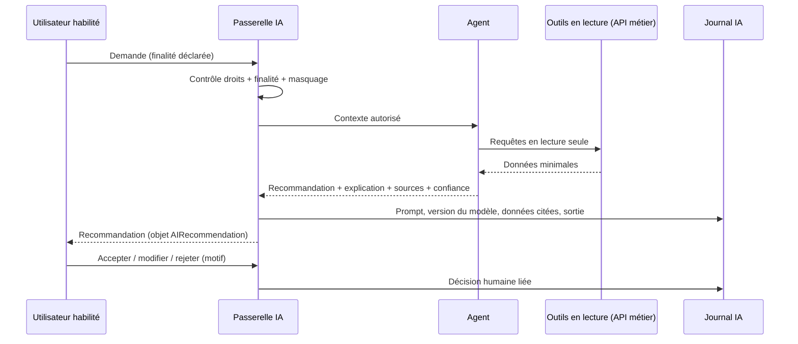
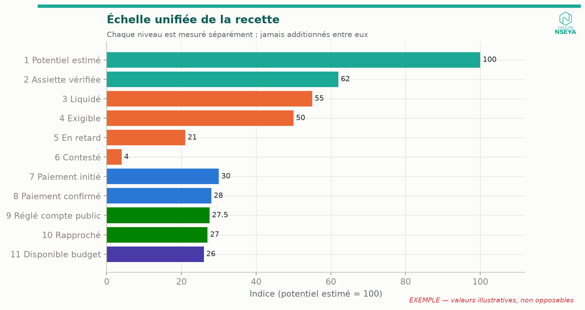
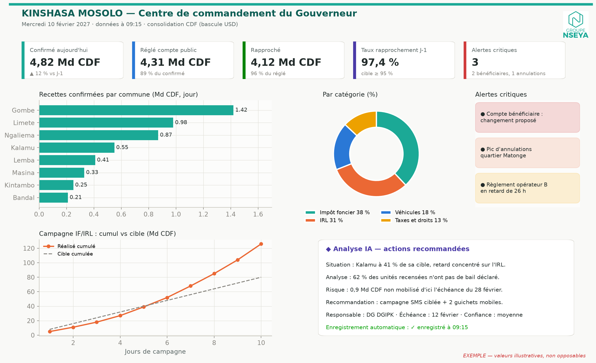

# 23. Architecture des agents d'intelligence artificielle

## 23.1 Doctrine

L'IA de KINSHASA MOSOLO **détecte, explique, priorise, rédige et recommande**. Elle ne décide ni n'exécute aucun acte ayant un effet juridique ou financier. Chaque agent fonctionne derrière une **passerelle d'IA** (AI Gateway) qui contrôle ses accès aux données, ses outils, ses journaux et ses limites.

**Aucun agent ne peut, de lui-même :** créer une taxe ; imposer une pénalité ; déterminer la propriété définitive ; saisir un bien ; suspendre un droit d'un citoyen ; approuver une exonération ; clore un recours ; transférer de l'argent ; modifier un compte bénéficiaire ; détruire un enregistrement d'audit. Ces interdits sont **techniques** : les agents n'ont pas de droits d'écriture sur les domaines concernés ; leurs sorties sont des objets `AIRecommendation` qu'un humain habilité accepte, modifie ou rejette.

## 23.2 Catalogue des agents

| Agent | Mission | Données accessibles | Sorties | Validation humaine |
|---|---|---|---|---|
| **Découverte des recettes** | Identifier sous-enregistrement, activités non déclarées, actifs publics non valorisés | Agrégats, objets, signaux partenaires pseudonymisés | Fiches d'opportunité (§ 8.1) | Analyste + juriste + comité |
| **Enrôlement** | Guider l'inscription, détecter les pièces manquantes, réutiliser les données vérifiées | Données du compte en cours | Suggestions, pré-remplissage | Le contribuable confirme |
| **Apprentissage de l'usager** | Expliquer obligations, échéances, pièces, moyens de paiement, droits de recours, usage de la plateforme — en français simple, lingala et autres langues | Base de connaissances publique + données du compte de l'usager authentifié | Réponses sourcées (citation du texte ou de la page d'aide) | Réponses sans effet juridique ; renvoi vers un humain |
| **Copilote des agents publics** | Résumés de dossiers, guidage procédural, projets de documents, prochaines étapes, priorisation, formation | Dossiers dans le périmètre de l'utilisateur | Brouillons, résumés | L'agent public signe |
| **Veille juridique** | Suivre les textes, repérer règles expirées et conflits | Registre juridique, textes officiels | Alertes, propositions de fiches | Juristes ; **aucune publication** |
| **Intelligence locative** | Repérer biens probablement loués, incohérences d'occupation, zones à vérifier | Objets, déclarations, signaux sous protocole | Listes de vérification avec scores expliqués | Superviseur |
| **Missions terrain** | Planifier des tournées efficaces, prioriser les objets, préparer les dossiers | Objets de la zone, contraintes d'équipe | Plans de mission | Superviseur |
| **Rapprochement** | Proposer des appariements complexes, expliquer les écarts | Paiements, relevés, obligations | Propositions d'appariement | Analyste (quatre yeux au-delà des tolérances) |
| **Détection de fraude** | Identités dupliquées, exonérations suspectes, annulations anormales, collusions, activité géographique inhabituelle, réutilisation d'appareils, manipulation de quittances, changements de bénéficiaires irréguliers, baisses de recettes inexpliquées | Journaux, transactions, métadonnées | Alertes expliquées | Enquêteur |
| **Prévision** | Scénarios conservateur, attendu, ambitieux, avec hypothèses explicites | Séries historiques, base de référence | Prévisions + intervalles | Direction financière |
| **Aide à la décision exécutive** | Transformer les données en recommandations prêtes à décider | Agrégats | Notes de décision (options, effets, risques) | Gouverneur et autorités |
| **Allocation des investissements** | Proposer des scénarios d'emploi des fonds disponibles | Recettes réglées, budget, projets, indicateurs territoriaux | Scénarios (ch. 27) | Autorités budgétaires |
| **Apprentissage continu** | Améliorer les modèles à partir de corrections validées | Jeux de données **approuvés** | Nouvelles versions candidates | Comité des modèles |

## 23.3 Flux de travail d'un agent

## 23.4 Gouvernance des modèles

| Exigence | Mise en œuvre |
|---|---|
| Jeux d'entraînement approuvés | Registre des jeux de données (source, base légale, période, pseudonymisation, validation) ; aucune donnée sensible non approuvée |
| Pas de réentraînement silencieux | L'apprentissage continu produit des **candidats** ; mise en production uniquement après validation |
| Versionnage | Modèles, prompts, paramètres et jeux de données versionnés ensemble |
| Validation humaine | Comité des modèles (métier, audit, protection des données, sécurité) |
| Suivi de performance | Précision, rappel, taux d'acceptation des recommandations, faux positifs par commune |
| Tests de biais | Écarts de ciblage entre communes, catégories de contribuables, genre lorsque la donnée existe |
| Détection de dérive | Surveillance statistique des entrées et sorties |
| Explicabilité | Facteurs contributifs affichés pour chaque score |
| Retour arrière | Version précédente restaurable immédiatement |
| Journal des décisions IA | Conservation au même niveau que le journal d'audit |
| Hébergement | Modèles hébergés sous contrôle de la Province ou fournisseur contractualisé sans conservation ni réutilisation des données ; aucune donnée fiscale nominative vers un service d'IA public |

## 23.5 Couche d'intelligence : MOSOLO, système d'exploitation piloté par l'IA

### 23.5.1 Identité de la couche d'intelligence

La couche d'intelligence n'est pas un assistant conversationnel ajouté à la plateforme : c'est **le cerveau opérationnel de MOSOLO**. Elle soutient chaque fonction, parcours, action, document, tableau de bord, notification et décision. MOSOLO fonctionne ainsi comme :

| Ce que MOSOLO est | Et non |
|---|---|
| Un système d'exploitation des recettes piloté par l'IA | Un simple logiciel de saisie |
| Une infrastructure d'intelligence vivante | Un tableau de bord statique |
| Un moteur d'aide à la décision | Un affichage de données |
| Une couche d'automatisation des processus | Un registre passif |
| Un assistant prédictif | Un assistant qui attend qu'on l'interroge |
| Une plateforme d'exécution multi-agents | Une interface de conversation |
| Un système qui s'améliore à partir des résultats validés | Un système figé |

**Limite constitutionnelle.** Cette ambition s'exerce **à l'intérieur** des principes P1 à P14 (§ 3.4) et des interdits du § 23.1 : l'IA prépare, accélère, prédit et recommande ; seuls des agents publics habilités produisent un effet juridique ou financier.

### 23.5.2 Les douze questions posées à chaque action

Pour chaque action d'un utilisateur, la couche d'intelligence se pose silencieusement les questions suivantes, et l'interface en affiche les réponses utiles :

| # | Question | Exemple (agent de régie ouvrant un dossier locatif) |
|---|---|---|
| 1 | Que cherche à accomplir l'utilisateur ? | Qualifier une unité déclarée vacante |
| 2 | Quelles données sont disponibles ? | Déclarations, constat terrain, compteurs (sous protocole) |
| 3 | Que manque-t-il ? | Bail ou preuve de vacance |
| 4 | Quel risque existe ? | Sous-déclaration ; contestation si la preuve est faible |
| 5 | Que peut-on automatiser ? | Demande de pièces au bailleur |
| 6 | Que peut-on prédire ? | Probabilité de location : 0,78 (facteurs affichés) |
| 7 | Que peut-on améliorer ? | Qualité de l'adresse (précision GPS faible) |
| 8 | Que doit-il se passer ensuite ? | Invitation à déclarer, puis visite si pas de réponse sous 15 jours |
| 9 | Qui doit être notifié ? | Bailleur (`rental.occupancy.inconsistency`), superviseur |
| 10 | Que faut-il enregistrer ? | Brouillon de qualification, justification, sources |
| 11 | Que faut-il apprendre ? | Résultat de la vérification, pour recalibrer le modèle (après validation) |
| 12 | Que doit recommander la plateforme ? | « Demander le bail — confiance moyenne » |

### 23.5.3 Principe d'enregistrement automatique (autosave)

**Aucune action importante ne doit être perdue.** L'enregistrement automatique est obligatoire dans tous les modules et couvre : saisies, contenus générés, brouillons, fichiers déposés, modifications, commentaires, sélections, recommandations et décisions de l'IA, sorties modifiées, changements d'état, notifications, approbations, rejets, tâches terminées, processus abandonnés, recherches (sous forme minimisée), analyses produites, préférences, usage de l'IA, versions historiques et journaux d'audit.

| Capacité (chaque module) | Mise en œuvre |
|---|---|
| Enregistrement automatique | Brouillon persistant côté serveur toutes les 5 secondes d'inactivité et à chaque changement de champ ; stockage local chiffré en hors ligne |
| Historique des versions | Chaque enregistrement crée une version ; différences consultables |
| Horodatage | Heure serveur de référence |
| Attribution | Utilisateur, rôle, appareil |
| Suivi des modifications | Avant/après champ par champ |
| Retour arrière | Restauration d'une version de **brouillon** ; pour les actes validés, uniquement par acte contraire (P7) |
| Piste d'audit | Événement chaîné (§ 25.2) |
| Résumé IA des changements | « 3 champs modifiés depuis hier : surface (120 → 135 m²), usage, photo ajoutée » |
| Indicateur visible | « Enregistré à 09:15 » / « Enregistrement… » / « Hors ligne — enregistré sur l'appareil » |

Distinction essentielle : **un brouillon n'est pas un acte**. L'enregistrement automatique ne vaut ni déclaration déposée, ni décision, ni approbation ; ces effets exigent une action explicite de validation, signée et horodatée.

### 23.5.4 Mémoire structurée à quatre niveaux

| Niveau | Contenu | Limites (protection des données, ch. 32) |
|---|---|---|
| **Mémoire utilisateur** | Rôle, préférences, langue, tâches fréquentes, priorités, sorties enregistrées, objectifs récurrents | Pour les **agents publics** : aide au travail, jamais utilisée pour l'évaluation disciplinaire sans procédure. Pour les **contribuables** : préférences de service uniquement ; **aucun profilage comportemental** ni « tolérance au risque » inférée |
| **Mémoire d'espace (entité)** | Données de l'entité, règles, modèles, circuits, décisions historiques, hypothèses | Cloisonnée par entité (§ 10.3) |
| **Mémoire de processus** | Étape atteinte, fait, en attente, bloqué, changé récemment, prochaine décision | Liée au dossier, conservée avec lui |
| **Mémoire d'intelligence** | Tendances, risques, problèmes répétés, signaux de performance, de coût, de productivité, de prévision, améliorations recommandées | Agrégée et pseudonymisée ; alimente les modèles uniquement via des jeux approuvés (§ 23.4) |

### 23.5.5 Agents transverses et correspondance avec les agents métier

| Agent transverse | Responsabilité | Agents métier MOSOLO concernés (§ 23.2) |
|---|---|---|
| Stratégie | Comprendre l'objectif, recommander la meilleure voie, identifier les leviers | Aide à la décision exécutive ; découverte des recettes |
| Processus (workflow) | Faire avancer les tâches, détecter les goulets, proposer l'étape suivante, automatiser le répétitif | Copilote ; missions terrain |
| Intelligence des données | Lire les données structurées et non structurées, extraire le sens, détecter les manques | Intelligence locative ; rapprochement |
| Prédiction | Prévoir issues, retards, risques, points de défaillance, occasions manquées | Prévision ; détection de fraude |
| Documents | Créer, relire, résumer, comparer, versionner ; extraire obligations, actions, risques | Copilote ; veille juridique |
| Communication | Rédiger avis, messages, rapports, réponses — ton professionnel et adapté | Apprentissage de l'usager ; moteur de communication (§ 11.4) |
| Conformité | Vérifier règles, délais, approbations, permissions, pièces obligatoires | Veille juridique ; contrôle des séparations de tâches |
| Finances (commercial) | Analyser coûts, recettes, rendement, déperdition, pression budgétaire | Découverte des recettes ; allocation |
| Automatisation | Repérer les actions répétées, proposer des automatisations, déclencher rappels, alertes, tâches | Tous |
| Personnalisation | Adapter l'expérience au rôle, à la langue, à l'historique | Tous (dans les limites du § 23.5.4) |

Tous passent par la **couche d'orchestration** (passerelle IA, § 23.3), qui applique les droits, journalise et impose le format de sortie.

### 23.5.6 Fonctions IA disponibles dans toute la plateforme

| Fonction | Exemple MOSOLO |
|---|---|
| Recherche IA | « Parcelles de Limete avec plus de 3 compteurs et sans bail » (dans le périmètre de l'utilisateur) |
| Résumés | Résumé d'un dossier de réclamation de 40 pièces |
| Recommandations | Prochaine meilleure action sur un arriéré |
| Détection de risques | Pic d'annulations |
| Guidage de l'étape suivante | Liste de contrôle contextuelle |
| Rédaction | Projet de décision motivée (à signer par l'autorité) |
| Classification et étiquetage | Type de pièce déposée, motif de réclamation |
| Notation | Score de probabilité de location, expliqué |
| Prévision | Encaissements de la semaine par commune |
| Alertes | Seuils d'indicateurs |
| Automatisation des processus | Relances, affectations, création de tâches |
| Compréhension de documents | Lecture d'un bail scanné (OCR + extraction) |
| Extraction de données | Loyer, dates, parties d'un bail |
| Personnalisation | Tableau de bord par rôle |
| Comparaison | Deux versions d'une règle |
| Explication | Pourquoi ce montant, pourquoi cette alerte |
| Aide à la décision | Options, effets, risques |
| Suivi de performance | Indicateurs d'équipe, écarts |
| Détection d'anomalies | Transactions, accès, constats |
| Génération de piste d'audit | Chronologie lisible d'un dossier |

### 23.5.7 Format de sortie standard

Toute analyse de la couche d'intelligence est structurée ainsi (objet `AIRecommendation`) :

| Rubrique | Contenu |
|---|---|
| **1. Situation** | Ce qui se passe |
| **2. Analyse** | Ce que signifient les données |
| **3. Risque** | Ce qui pourrait mal tourner |
| **4. Recommandation** | Ce qu'il faudrait faire |
| **5. Prochaine action** | L'étape la plus pratique maintenant |
| **6. Responsable** | Qui doit agir (rôle, jamais « l'IA ») |
| **7. Échéance** | Quand |
| **8. Niveau de confiance** | Élevé, moyen ou faible, selon la qualité des données, avec les sources citées |

Pour toute décision importante, la couche fournit en outre : **meilleure option ; option alternative ; risque de l'inaction ; impact financier ; impact opérationnel ; étape recommandée**.

### 23.5.8 Règles de prédiction, d'automatisation et de données

**Prédiction proactive.** La plateforme n'attend pas que l'utilisateur découvre un problème : elle signale retards, informations manquantes, performances faibles, pression sur les coûts, faible engagement, processus incomplets, doublons de travail, données contradictoires, comportements inhabituels, lacunes de conformité, gisements de recettes et inefficacités.

**Automatisation, selon trois niveaux d'autonomie :**

| Niveau | Actions | Exemples | Contrôle |
|---|---|---|---|
| A — Exécution automatique | Actions sans effet juridique ni financier, réversibles | Rappels facultatifs, création de tâches, affectation selon des règles approuvées, préparation de brouillons, résumés, classement de pièces | Journalisé ; désactivable par le responsable d'entité |
| B — Exécution après validation | Actions à effet sur un tiers | Envoi d'une demande de pièces, ouverture d'une mission, relance obligatoire | Un clic de validation par un agent habilité |
| C — Recommandation seulement | Actions à effet juridique ou financier | Liquidation rectificative, exonération, pénalité, mesure d'exécution, remboursement, changement de bénéficiaire, clôture d'un recours | Circuits maker-checker complets ; **jamais automatisé** |

**Données.** Toute donnée est structurée, étiquetée, recherchable (selon les droits), reliée aux processus, aux utilisateurs, aux décisions, aux horodatages et aux résultats, et réutilisable pour l'intelligence future dans le respect de sa finalité.

### 23.5.9 Sécurité, transparence et contrôle

- L'interface n'expose ni les fournisseurs techniques d'IA, ni la logique interne, ni les clés, ni les données confidentielles, ni la complexité technique inutile.
- **Mais l'usager sait toujours qu'une IA est intervenue** : tout contenu généré ou recommandé porte la mention « préparé avec l'assistance de l'IA — validé par [rôle] » ; l'explication de toute décision automatisée ou assistée est disponible. C'est une exigence de loyauté de l'administration et de protection des données, non négociable dans un service public.
- La couche respecte permissions, rôles, cloisonnements, auditabilité, confidentialité fiscale et obligations de conformité.

### 23.5.10 Expérience utilisateur : une plateforme vivante

Chaque tableau de bord répond à sept questions : que se passe-t-il ? qu'est-ce qui a changé ? qu'est-ce qui est à risque ? que faut-il faire aujourd'hui ? qu'est-ce qui coûte du temps ou de l'argent ? que va-t-il probablement se passer ? qui détient la décision ?

Chaque écran comporte, lorsque c'est pertinent, un **panneau d'intelligence** : analyse IA, recommandation, alerte de risque, prochaine action, résumé, niveau de confiance et **statut d'enregistrement automatique** (voir la maquette du tableau de bord du Gouverneur, § 26.2).

### 23.5.11 Apprentissage

La plateforme apprend des corrections des utilisateurs, des décisions répétées, des réussites et des échecs de processus, des recommandations acceptées et rejetées, du temps passé, des questions fréquentes, des sorties souvent modifiées et des résultats. **Cet apprentissage alimente des candidats** (modèles, modèles de documents, règles d'automatisation), mis en service après validation par le comité des modèles (§ 23.4) : aucune auto-modification silencieuse.

### 23.5.12 Positionnement

MOSOLO remplace les outils fragmentés, l'administration manuelle, les tableurs déconnectés, la communication lente, la faible visibilité et la gestion réactive. Sa valeur : rapidité, contrôle, automatisation, prédiction, redevabilité, intelligence, réduction des coûts, productivité, meilleures décisions, risques réduits, meilleurs résultats. L'objectif est que la plateforme devienne **indispensable par la valeur qu'elle apporte**, et non par un verrouillage : la Province doit rester capable de l'exploiter, de la faire évoluer et d'en sortir (§ 33).

Le prompt système de la couche d'intelligence, adapté à ces règles, figure dans `specs/ia/prompt-systeme-mosolo.md`.

# 24. Apprentissage des utilisateurs et environnement de travail

## 24.1 Environnement d'apprentissage intégré

| Public | Contenus | Modalités |
|---|---|---|
| Contribuables | Obligations, échéances, calcul, paiement, recours | Guides contextuels, vidéos courtes, SVI, questions-réponses en langues nationales |
| Agents de terrain | Procédures, déontologie, sécurité, application hors ligne | Parcours d'intégration, cas simulés, certification obligatoire avant la première mission |
| Contrôleurs | Qualification, preuves, procès-verbaux | Cas simulés, certification |
| Personnel des ministères | Tableaux de bord, circuits d'approbation | Parcours par rôle |
| Superviseurs | Planification, contrôle qualité, gestion d'équipe | Parcours par rôle |
| Finances et Trésor | Rapprochement, exceptions, clôtures | Simulations |
| Administrateurs | Sécurité, configuration, séparation des tâches | Certification |
| Exécutifs | Lecture de l'échelle de la recette, arbitrages | Sessions courtes |

Fonctions : intégration par rôle ; tâches guidées ; explications contextuelles ; listes de contrôle interactives ; aide multilingue ; vidéos ; quiz ; procédures consultables ; questions-réponses assistées par l'IA (avec sources) ; cas simulés dans un environnement d'entraînement ; certification et recyclage ; retour de performance ; notifications de changement de procédure ; analyse des lacunes de connaissance.

## 24.2 Surveillance légitime, pas surveillance oppressive

| Surveillance légitime (maintenue) | Surveillance excessive (proscrite) |
|---|---|
| Journal des actions sur les données et les montants | Enregistrement continu de l'écran ou du micro |
| Géolocalisation **pendant les missions** et pour les constats | Géolocalisation hors mission ou hors service |
| Contrôle qualité des constats par échantillon | Classement public des agents |
| Indicateurs de qualité (exactitude, délais, plaintes) | Indicateurs fondés sur les montants imposés par agent |
| Alertes de sécurité et d'intégrité | Lecture des communications privées |

Les agents ont accès à leurs propres indicateurs et à leur journal ; les règles de surveillance sont publiées, expliquées pendant la formation et soumises au délégué à la protection des données.

# 25. Prévention de la fraude et de la déperdition

## 25.1 Objectif réaliste

La fraude ne peut pas être éliminée. L'objectif est de la rendre **difficile à commettre, rapide à détecter et impossible à effacer sans trace**.

| Fonction | Comment MOSOLO agit |
|---|---|
| **Prévenir** | Aucune espèce entre les mains des agents ; montants calculés par le moteur et non modifiables sur le terrain ; comptes bénéficiaires verrouillés ; quatre yeux ; séparation des tâches ; MFA ; accès juste-à-temps |
| **Détecter** | Règles et modèles d'anomalies ; rapprochement quotidien ; contrôles mystère ; signalements du public ; vérification des quittances par QR |
| **Contenir** | Suspension conservatoire d'un accès sur décision motivée ; gel d'un point de paiement ; révocation d'appareil ; blocage d'une quittance suspecte |
| **Enquêter** | Dossier d'enquête ; graphe des liens ; chronologie reconstituée depuis le journal |
| **Prouver** | Journal chaîné et signé ; horodatage fiable ; preuves scellées ; extraction probante signée pour les autorités |
| **Corriger** | Contre-écritures ; rectifications motivées ; récupération des sommes |
| **Rendre compte** | Rapport trimestriel au Comité d'audit ; indicateurs agrégés publics |

## 25.2 Socle technique d'intégrité

| Contrôle | Description |
|---|---|
| Historique d'événements immuable | Toute action produit un événement en ajout seul |
| Hachage cryptographique chaîné | Chaque événement contient l'empreinte du précédent ; toute suppression rompt la chaîne |
| Signatures numériques | Événements financiers signés par des clés en HSM |
| Horodatage de confiance | Ancrage périodique de l'empreinte de la chaîne auprès d'une autorité d'horodatage et chez un tiers indépendant |
| Grand livre en ajout seul, partie double | § 20.2 |
| Stockage WORM | Copie du journal sur stockage à écriture unique, sous le contrôle de l'audit |
| Sauvegarde indépendante des preuves | Réplication vers un site contrôlé par l'autorité d'audit |
| Maker-checker, contrôle double | § 12.6 |
| Limites de transaction | Plafonds de remboursement, d'annulation, d'exonération par rôle |
| Verrouillage des bénéficiaires | Coffre, quorum, hors bande, refroidissement |
| Détection d'anomalies | Règles + modèles |
| Empreinte d'appareil | Terminaux enrôlés ; détection de réutilisation d'appareil entre comptes |
| Géorepérage et plausibilité GPS | Vitesse de déplacement, précision, sortie de zone |
| Intégrité des photos et documents | Capture dans l'application uniquement, hachage à la capture, métadonnées scellées |
| Anti-rejeu | Nonces, fenêtres temporelles, idempotence |
| Rapprochement | Trois voies + écritures |
| Surveillance des accès privilégiés | Sessions enregistrées, alertes en temps réel |
| Prévention des fuites de données | Masquage, filigranes sur exports, limites de volume, alertes |
| Accès d'audit indépendant | Rôle auditeur non modifiable par les administrateurs |

## 25.3 Scénarios de fraude et contrôles

| Scénario | Signal | Contrôle |
|---|---|---|
| Agent qui encaisse des espèces « pour arranger » | Plaintes, régularisations sans paiement, écarts constat/paiement | Zéro espèce, badge vérifiable, signalement, contrôle mystère |
| Exonérations de complaisance | Concentration par agent, zone ou période | Quatre yeux, fondement légal obligatoire, alerte de concentration |
| Annulations d'avis après paiement hors circuit | Pic d'annulations | Motif codifié, double validation, revue audit |
| Fausse quittance | Scan QR invalide | Vérification publique, signalement |
| Détournement par changement de compte bénéficiaire | Tentative de modification | Quorum, hors bande, refroidissement, notification multiple |
| Collusion recenseur–contribuable (sous-déclaration d'unités) | Écart avec imagerie, compteurs | Contrôle qualité indépendant, double visite aléatoire |
| Objets fictifs pour gonfler la production | Objets sans suite, photos réutilisées | Hachage des photos, rémunération sur objets vérifiés uniquement |
| Rappel de paiement falsifié | Signature invalide | mTLS + signature + appel de contrôle |
| Remboursement vers un compte tiers | Instrument différent de l'origine | Remboursement vers l'origine uniquement |
| Initié technique modifiant la base | Rupture de chaîne de hachage, écart avec copie WORM | Contrôle d'intégrité horaire, alerte critique |
| Baisse inexpliquée de recettes d'une zone | Série temporelle | Alerte de l'agent de fraude, enquête |

**Aucun paiement, liquidation, exonération, annulation ni correction ne peut disparaître.** Les corrections se font par contrepassement ou contre-écriture autorisés, liés à l'original.

# 26. Tableaux de bord exécutifs

## 26.1 L'échelle unifiée de la recette

Tous les tableaux de bord emploient la même échelle, sans jamais additionner des niveaux différents :

| # | Niveau | Définition |
|---|---|---|
| 1 | **Potentiel estimé** | Estimation statistique, non opposable |
| 2 | **Assiette vérifiée** | Objets et redevables vérifiés × règles actives |
| 3 | **Liquidé (assessed)** | Obligations émises |
| 4 | **Exigible** | Obligations échues non contestées avec effet suspensif |
| 5 | **En retard (overdue)** | Exigible non payé après échéance |
| 6 | **Contesté** | Sous réclamation |
| 7 | **Paiement initié** | Références en cours |
| 8 | **Paiement confirmé** | Confirmé par le prestataire |
| 9 | **Réglé sur le compte public** | Crédit constaté |
| 10 | **Rapproché** | Appariement complet et écritures |
| 11 | **Disponible pour appropriation budgétaire** | Selon les règles du Trésor et du budget |

## 26.2 Tableau de bord du Gouverneur

| Zone | Contenu | Visualisation |
|---|---|---|
| Bandeau du jour | Collecté aujourd'hui (confirmé), réglé, rapproché ; comparaison J−1 et même jour de l'année précédente | Chiffres clés avec tendance |
| Échelle de la recette | Niveaux 1 à 11 sur l'exercice | Entonnoir |
| Cible | Réalisé vs cible annuelle et mensuelle | Jauge et courbe cumulée |
| Répartition | Par ministère, régie, commune, catégorie | Barres triées, drill-down |
| Carte | Recettes, conformité, couverture du recensement, couverture locative par commune et quartier | Carte choroplèthe et carte de chaleur |
| Historique | Comparaison pluriannuelle | Courbes |
| Potentiel | Potentiel estimé vs assiette vérifiée (écart de couverture) | Barres empilées |
| Obligations | En retard, contestées | Tableau |
| Exceptions | Paiements en exception, règlements en retard | File avec âge |
| Intégrité | Déperdition suspectée, alertes critiques | Liste priorisée |
| Performance | Zones les plus et les moins performantes | Classement |
| Prévisions | Trois scénarios | Éventail |
| Capacité d'investissement | Fonds disponibles et scénarios d'emploi (ch. 27) | Cartes de scénario |
| Actions recommandées | Trois à cinq décisions proposées avec justification | Cartes d'action |

**Écran de référence (description).** En haut, cinq tuiles : « Confirmé aujourd'hui 🇨🇩 CDF … », « Réglé », « Rapproché », « Taux de rapprochement J−1 », « Alertes critiques ». Au centre, la carte de Kinshasa colorée par taux de conformité, avec bascule couverture/recettes/potentiel. À droite, l'entonnoir de l'échelle de la recette. En bas, les actions recommandées (« Autoriser la campagne de régularisation à Kalamu — effet estimé, risques, décision requise ») et la file des alertes critiques.

## 26.3 Autres tableaux de bord

| Tableau | Contenu principal |
|---|---|
| Directeur de cabinet | Suivi des décisions et engagements, alertes, agenda de performance |
| Secrétaire général | Actes en préparation, état d'adoption, effets dans la plateforme |
| Ministre provincial | Recettes et indicateurs de son périmètre, tarifs de sa compétence, recommandations |
| DG DGIPK | Assiette, campagnes, liquidation, recouvrement, contentieux, performance des services |
| DG DGTK | Droits, taxes, redevances, titres, marchés, publicité, stationnement |
| Trésor | Confirmé, réglé, rapproché, suspens, exceptions par âge, prestataires en retard, clôtures |
| Juridique et tarifs | Règles par statut, expirations, conflits, tests en échec |
| Chefs de service | Files de travail, délais, qualité |
| Superviseurs | Missions, couverture, qualité des constats, conflits de synchronisation |
| Auditeurs | Intégrité de la chaîne, opérations sensibles, écarts, accès privilégiés |
| Enquêteurs | Alertes, dossiers, graphe des liens |
| Agents de terrain | Mission du jour, objets restants, synchronisation, formation |
| Contribuables | Objets, obligations, échéances, quittances, quitus, recours |
| Administrateurs de la plateforme | Disponibilité, performance, intégrations, sécurité, communications (§ 11.4.7) |
| Transparence publique | Recettes agrégées par catégorie et commune, emploi des fonds, délais de recours |

Tous les montants sont consolidés en 🇨🇩 CDF avec bascule d'affichage en 🇺🇸 USD (taux et date indiqués).

# 27. Affectation des recettes et planification de l'investissement public

## 27.1 Distinguer pour ne pas confondre

| Étape | Autorité | Rôle de MOSOLO |
|---|---|---|
| Collecte | Prestataires habilités vers comptes publics | Orchestrer et prouver |
| Comptabilisation | Comptable public | Fournir les écritures |
| Partage légal | Texte (nomenclature, clés) | Calculer les parts sur recettes rapprochées |
| Gestion de trésorerie | Trésor provincial | Informer (prévisions de trésorerie) |
| Appropriation budgétaire | Assemblée provinciale (édit budgétaire) | Informer |
| Autorisation de dépense | Ordonnateur | Aucun |
| Planification des investissements | Gouvernement provincial | Recommander des scénarios |
| Dépense effective | Ordonnateur et comptable | Suivre (lien avec le module de contrôle de la dépense) |

**Aucune répartition arbitraire** entre le Gouvernement, les ministères, les régies, les agents, les administrateurs de la plateforme ou des partenaires privés n'est possible. Toute répartition suit la loi, le budget approuvé, les règles du Trésor, les clés légales, les contrats et les approbations formelles de dépense. **L'administrateur de la plateforme ne reçoit jamais de part automatique des recettes publiques du seul fait qu'il administre le système.**

## 27.2 Incitations de performance (si la loi le permet)

Si un texte autorise des incitations (agents, services, partenaires de collecte), le calcul est transparent et auditable :

| Élément | Exigence |
|---|---|
| Autorité légale | Texte citant la base (J10) |
| Formule approuvée | Pourcentage ou barème fixé par acte |
| Conditions | Résultats **vérifiés** (quittances définitives, objets validés en contrôle qualité), jamais montants liquidés |
| Plafonds | Par agent, par service, par période |
| Anti-manipulation | Exclusion des objets contestés ou annulés ; récupération en cas de fraude ; indicateurs de qualité pondérateurs |
| Traitement fiscal | Selon la réglementation |
| Approbation | Ordonnateur, sur proposition calculée par la plateforme |
| Traitement comptable | Dépense budgétaire, **pas prélèvement à la source** |

## 27.3 Recommandation d'emploi des fonds

L'agent d'allocation propose des scénarios fondés sur : recettes réglées et rapprochées ; obligations récurrentes ; budget approuvé ; maturité des projets ; besoins géographiques ; population ; pauvreté ; déficits d'infrastructure ; rendement économique et social ; coût d'entretien ; résilience climatique ; restrictions légales de dépense.

| Pour chaque recommandation | Contenu |
|---|---|
| Montant disponible | Selon l'échelle (niveau 11) |
| Source légale des fonds | Ligne budgétaire, recettes affectées le cas échéant |
| Allocation proposée | Montant par projet |
| Bénéficiaires | Population et zones |
| Impact géographique | Carte |
| Résultat attendu | Indicateurs mesurables |
| Maturité du projet | Études, foncier, marchés |
| Coût récurrent | Entretien et exploitation |
| Passation de marché requise | Procédure applicable |
| Risques | Techniques, financiers, sociaux |
| Autorité d'approbation | Ordonnateur, Assemblée si modification budgétaire |

Domaines typiques : réfection des routes, drainage et protection contre les inondations, assainissement et déchets, éclairage public, transport public, modernisation des marchés, écoles, centres de santé, services numériques, programmes d'emploi, infrastructures de sécurité publique. **L'IA recommande des scénarios ; elle n'approuve aucune dépense et ne déplace aucun fonds.**

## 27.4 Transparence

Tableau public trimestriel : recettes par catégorie et par commune, emploi des fonds par programme, projets financés et état d'avancement, délais de traitement des recours — sans aucune donnée personnelle.
