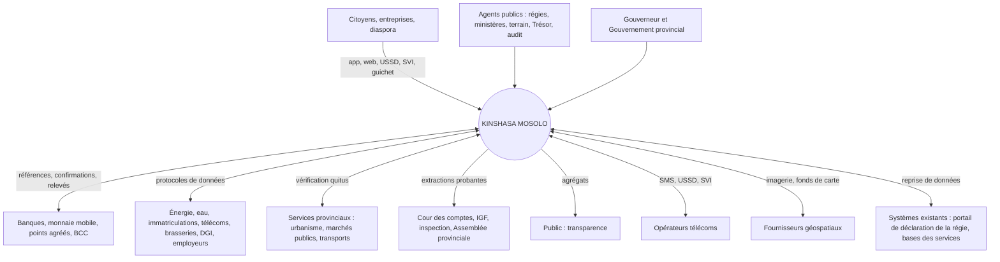
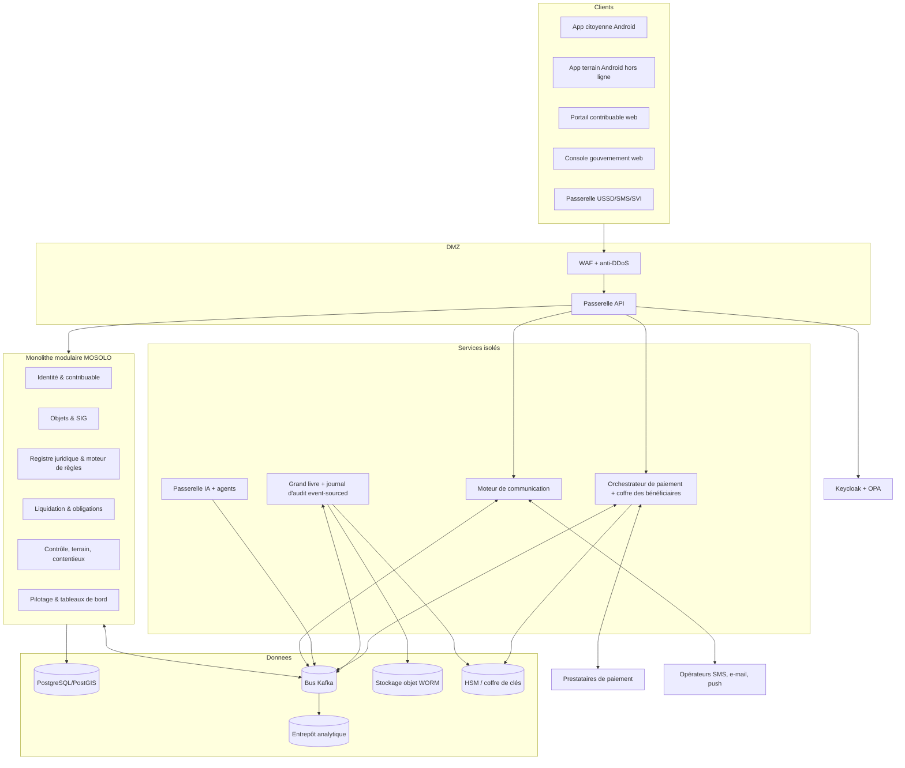
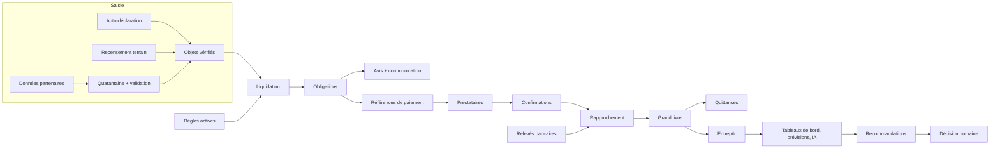
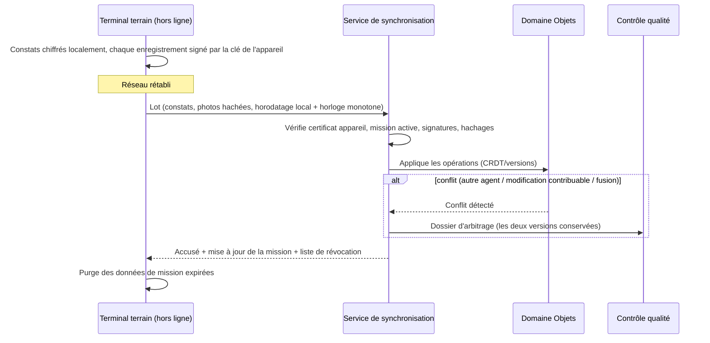
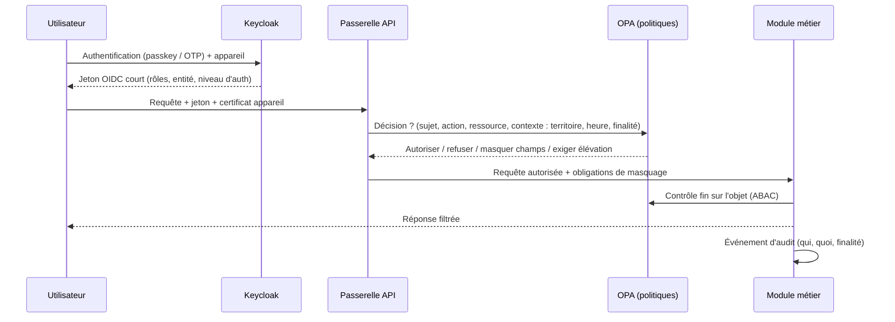
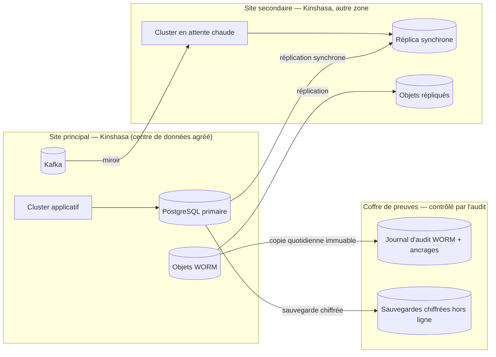
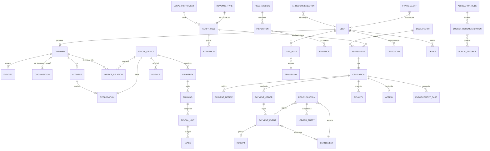

# 28. Architecture technique

## 28.1 Recommandation : un hybride contrôlé

| Option | Avantages | Inconvénients dans le contexte de Kinshasa | Verdict |
|---|---|---|---|
| Monolithe modulaire | Simple à exploiter, cohérence transactionnelle, peu d'équipes nécessaires | Montée en charge par blocs ; risque de couplage si mal discipliné | **Socle retenu** |
| Services orientés domaines | Autonomie des domaines, isolation des risques | Plus d'exploitation | **Retenu pour 4 composants** |
| Microservices généralisés | Évolutivité fine | Complexité d'exploitation élevée, compétences rares, surface d'attaque plus large, coûts | Rejeté |
| Architecture événementielle | Découplage, audit, intégrations, hors ligne | Cohérence à terme à gérer | **Retenue** (bus interne) |
| CQRS | Lecture analytique performante sans charger les transactions | Duplication de modèles | **Retenu** pour tableaux de bord et SIG |
| Event sourcing intégral | Historique parfait | Complexité élevée, migrations difficiles | **Limité** au grand livre et au journal d'audit |

**Recommandation : un monolithe modulaire orienté domaines** (les sept domaines du chapitre 10 sont des modules avec frontières strictes, bases de schémas séparées et contrats internes), **plus quatre services isolés** pour des raisons de sécurité ou de charge : (1) passerelle de paiement et coffre des bénéficiaires ; (2) journal d'audit et horodatage ; (3) passerelle d'IA ; (4) moteur de communication et canaux (USSD, SMS, SVI). Le grand livre et le journal d'audit sont en **event sourcing** ; les lectures analytiques passent par **CQRS** vers l'entrepôt.

| Critère | Justification |
|---|---|
| Connectivité | Terrain hors ligne d'abord ; serveur central simple et robuste ; synchronisation par lots |
| Capacité technique | Une équipe provinciale peut reprendre un monolithe modulaire documenté ; pas un maillage de 60 microservices |
| Risque de mise en œuvre | Moins de pièces mobiles, déploiements plus sûrs |
| Budget | Infrastructure et exploitation réduites |
| Exposition cybersécurité | Surface réduite ; les composants les plus sensibles sont isolés |
| Évolutivité | Extraction ultérieure d'un module en service si la charge le justifie |
| Souveraineté | Logiciels libres standards, compétences disponibles, pas de dépendance à un nuage propriétaire |

## 28.2 Pile technologique recommandée (ouverte et réversible)

| Couche | Choix recommandé | Alternative |
|---|---|---|
| Langage serveur | **TypeScript sur Node.js 22 LTS** (Fastify), partageant ses types et règles avec les interfaces via le paquet `shared` — choix retenu pour le socle livré (Annexe E) | Java 21 / Kotlin ou .NET 8 pour une réécriture ultérieure de services isolés ; Go pour les services réseau |
| Base transactionnelle | PostgreSQL 16 + PostGIS | — |
| Bus d'événements | Apache Kafka (ou Redpanda) | RabbitMQ pour le socle initial |
| Entrepôt analytique | ClickHouse ou PostgreSQL analytique | DuckDB pour les exports |
| Stockage documentaire | Stockage objet compatible S3 (MinIO) avec verrouillage d'objet (WORM) | Ceph |
| Identité | Keycloak (OIDC, WebAuthn/passkeys) | — |
| Autorisation | Open Policy Agent (politiques RBAC + ABAC) | Cedar |
| Passerelle API | Kong ou APISIX | Envoy |
| Secrets et clés | HashiCorp Vault / OpenBao + HSM | — |
| Application terrain et citoyenne | Kotlin natif Android (Jetpack Compose), base locale chiffrée SQLCipher | Flutter |
| Web | TypeScript, React + Vite, conception accessible (WCAG 2.1 AA), charte de la Ville de Kinshasa (marine, liseré tricolore) | — |
| Cartographie | MapLibre, tuiles vectorielles, GeoServer | — |
| IA | Modèles ouverts hébergés sous contrôle (inférence locale) + passerelle | Fournisseur contractualisé sans conservation |
| Observabilité | OpenTelemetry, Prometheus, Grafana, Loki | — |
| SIEM | Wazuh / Elastic Security | — |
| Orchestration | Kubernetes (distribution standard) | Machines virtuelles au démarrage |
| CI/CD | GitLab CI ou équivalent auto-hébergé, artefacts signés (Sigstore), SBOM | — |

**Organisation du code : trois parties séparées.**

| Partie | Rôle | Dépend de |
|---|---|---|
| `shared/` | Types du domaine, montants et devises (CDF principale, drapeaux), catalogue d'événements, langues et traductions, fiches de règles, états, validations, format de sortie IA | — |
| `backend/` | API REST : identité, objets, registre juridique, liquidation, paiements, coffre, rapprochement, grand livre, quittances, audit chaîné, communications, autosauvegarde, IA | `shared` |
| `frontend/` | Portail contribuable, vérification publique de quittance, centre de commandement, console des communications, multilingue, graphiques en couleur | `shared` (types, i18n), `backend` (par API uniquement) |

Le `frontend` n'importe jamais le code du `backend` : il ne le connaît que par l'API. Le `backend` n'importe jamais le `frontend`. Toute logique partagée (calcul monétaire, formats, catalogues) vit dans `shared`.

## 28.3 Diagramme de contexte du système



## 28.4 Architecture des conteneurs



## 28.5 Architecture des domaines et flux de données



## 28.6 Séquence de synchronisation terrain



**Règles de résolution des conflits.**

| Cas | Règle |
|---|---|
| Deux agents inspectent la même propriété | Les deux constats sont conservés ; si divergents sur un champ fiscal, arbitrage par le superviseur ; jamais de « dernier écrit gagne » sur un champ fiscal |
| Le contribuable a modifié ses données pendant que l'agent était hors ligne | La déclaration et le constat coexistent avec leur statut probant (déclaré / observé) ; l'écart est signalé |
| GPS imprécis | Constat accepté avec statut `LOCALISATION_APPROXIMATIVE` ; revue |
| Objets fusionnés entre-temps | Le constat est redirigé vers l'objet survivant via l'alias |
| Terminal perdu | Révocation du certificat, effacement à distance, données locales chiffrées et expirées ; les lots non synchronisés signés avant la déclaration de perte peuvent être acceptés après revue |

## 28.7 Flux de contrôle d'accès



## 28.8 Reprise après sinistre



| Indicateur | Cible |
|---|---|
| Disponibilité des services contribuables | 99,5 % (pilote), 99,9 % (généralisation) |
| RPO (perte de données maximale) — paiements et grand livre | 0 (réplication synchrone) |
| RPO — autres données | ≤ 15 minutes |
| RTO (délai de reprise) | ≤ 4 heures (pilote), ≤ 1 heure (généralisation) |
| Test de restauration | Mensuel ; exercice de bascule complet semestriel |
| Mode dégradé | Guichets et agents en mode hors ligne ; références de paiement pré-émises ; protection automatique des échéances (`system.deadline_protection`) |

## 28.9 Rapports gouvernementaux

Exports normalisés vers la comptabilité publique et le budget (format à convenir avec le Trésor), rapports périodiques signés pour le Gouverneur, l'Assemblée provinciale, la Cour des comptes et l'inspection, jeux de données ouverts agrégés (format CSV et API publique en lecture).

# 29. Modèle de données conceptuel

## 29.1 Attributs communs obligatoires

Chaque entité porte : `id` (UUID), `entity_scope` (entité responsable), `created_at`, `created_by`, `version`, `status`, `valid_from` / `valid_to` lorsque temporel, `source` (déclaré, observé, vérifié, partenaire, système), `privacy_class` (C1–C5), et produit à chaque changement un événement d'audit (acteur, appareil, avant/après, motif, approbations, empreinte chaînée).

## 29.2 Diagramme des entités principales



## 29.3 Dictionnaire des entités

Classes de confidentialité : **C1** public ; **C2** interne ; **C3** personnel ; **C4** personnel sensible / secret fiscal ; **C5** secret (clés, preuves d'enquête). Durées de conservation : **valeurs de conception** à valider au regard des textes sur la prescription et les archives publiques (J4, J8).

| Entité | Finalité | Champs importants | Relations | Validation | Cycle de vie | Audit | Conservation | Classe |
|---|---|---|---|---|---|---|---|---|
| **User** | Compte d'accès | login, auth_methods, entity, status, last_login | Taxpayer, UserRole, Device | Unicité ; MFA pour comptes de travail | INVITÉ→ACTIF→SUSPENDU→DÉSACTIVÉ | Toutes connexions et changements | Fin de fonction + 10 ans | C3 |
| **Taxpayer** | Compte fiscal unique | iuc, type (PP/PM), nif, legal_name, verification_level, language, preferred_currency_display | Identity, Address, ObjectRelation, Obligation | Clés fortes uniques ; anti-doublon | PROVISOIRE→ACTIF→SUSPENDU→CLÔTURÉ→ARCHIVÉ | Changements d'identité | Clôture + prescription + 10 ans | C4 |
| **Identity** | Preuve d'identité | doc_type, doc_number (haché + chiffré), issuer, expiry, image_ref, verified_by | Taxpayer | Format par type ; expiration | SOUMISE→VÉRIFIÉE / REJETÉE / EXPIRÉE | Consultation journalisée | Durée du compte | C4 |
| **Organisation** | Personne morale | rccm, nif, legal_form, representatives[] | Taxpayer, Delegation | RCCM/NIF | ACTIVE→DISSOUTE | Oui | Dissolution + 10 ans | C3 |
| **Address** | Adresse | commune, quartier, avenue, street, plot_ref, description, verification_status | Geolocation | Référentiel territorial | DÉCLARÉE→VÉRIFIÉE | Oui | Historisée | C3 |
| **Geolocation** | Position | geometry, accuracy_m, capture_method, captured_at, device_id | FiscalObject, Address | Plausibilité | — | Capture scellée | Avec l'objet | C3 |
| **FiscalObject** | Objet générateur | igf_uuid, territorial_code, category, status, probative_status | Relations, Obligations | Catégorie du référentiel | PROVISOIRE→VÉRIFIÉ→INACTIF→ARCHIVÉ | Oui | Permanent (archive) | C3 |
| **Property** | Parcelle | area_declared, area_measured, locality_rank, built, land_status_declared | Building | Superficie > 0 | — | Oui | Permanent | C3 |
| **Building** | Bâtiment | floors, use, footprint, year_est, photos | RentalUnit | — | — | Oui | Permanent | C2 |
| **RentalUnit** | Unité | type, area, use, occupancy_status | Lease | — | VACANTE / OCCUPÉE | Oui | Permanent | C3 |
| **Lease** | Bail | lessor, lessee, rent (Money), periodicity, start, end, evidence, source | RentalUnit, Obligation | Loyer > 0 ; dates cohérentes | DÉCLARÉ→VÉRIFIÉ→TERMINÉ / CONTESTÉ | Oui | Fin + prescription + 5 ans | C4 |
| **Business** | Entreprise / établissement | trade_name, activity_codes, premises[] | Activity, Licence | — | ACTIVE→CESSÉE | Oui | Cessation + 10 ans | C3 |
| **Activity** | Activité économique | code, description, location, start | Business | Nomenclature d'activités | — | Oui | Idem | C3 |
| **Vehicle** | Véhicule | plate, vin (haché), category, power, use | ObjectRelation | Format de plaque | ACTIF→MUTÉ→RETIRÉ | Oui | Retrait + 10 ans | C3 |
| **Advertisement** | Support publicitaire | faces, area_m2, type, illuminated, permit_ref | Licence | — | — | Oui | Retrait + 10 ans | C2 |
| **Antenna** | Site télécom | operator, structure_type, height, co_located | Licence | — | — | Oui | Idem | C2 |
| **Vessel** | Embarcation | registration, type, capacity, home_port | — | — | — | Oui | Idem | C2 |
| **Concession** | Concession | title_ref, type, area_ha, holder | — | — | — | Oui | Idem | C2 |
| **Licence / Permit** | Titre / autorisation | type, valid_from, valid_to, conditions, status | FiscalObject | Dates | DEMANDÉ→DÉLIVRÉ→EXPIRÉ / SUSPENDU / RETIRÉ | Oui | Expiration + 10 ans | C2 |
| **LegalInstrument** | Texte | type, number, date, title, official_copy_hash, status | TariffRule | Pièce officielle | À_VÉRIFIER→EN_VIGUEUR→MODIFIÉ→ABROGÉ | Oui | Permanent | C1 |
| **RevenueType** | Nature de recette | code (non réutilisable), label, category (§ 6.11), administering_entity | TariffRule | Code unique | ACTIF→CLOS | Oui | Permanent | C1 |
| **TariffRule** | Règle exécutable | 20 champs de la fiche (§ 6.12) | LegalInstrument, Exemption | Tests juridiques verts ; 4 approbateurs | § 6.12 | Chaque version | Permanent | C1 |
| **Exemption** | Exonération | legal_basis, beneficiary, scope, from, to, evidence, approvals | TariffRule, Obligation | Fondement légal | DEMANDÉE→ACCORDÉE / REFUSÉE→EXPIRÉE / RETIRÉE | Oui, renforcé | Fin + prescription + 10 ans | C4 |
| **Declaration** | Déclaration | period, content, submitted_by, channel | Assessment | Complétude | BROUILLON→DÉPOSÉE→RECTIFIÉE | Oui | Prescription + 10 ans | C4 |
| **Assessment** | Liquidation | inputs_snapshot, rule_version, formula_trace, result, computed_by | Obligation | Déterminisme | CALCULÉE→ÉMISE→RECTIFIÉE / ANNULÉE (contre-acte) | Trace complète | Prescription + 10 ans | C4 |
| **Obligation** | Dette | amount (Money), due_date, status, balance | Notice, Payment, Appeal | Montant ≥ 0 | ÉMISE→EXIGIBLE→PARTIELLEMENT_PAYÉE→SOLDÉE / EN_RETARD / CONTESTÉE / ADMISE_EN_NON_VALEUR | Oui | Solde + prescription + 10 ans | C4 |
| **PaymentNotice** | Avis | number, pdf_ref, signature, delivery_proofs | Obligation | Mentions légales | ÉMIS→DÉLIVRÉ→LU | Oui | Idem | C4 |
| **PaymentOrder** | Référence de paiement | reference, amount, currency, beneficiary_alias, expiry, idempotency_key | PaymentEvent | Montant = solde ou panier explicite | ACTIVE→UTILISÉE / EXPIRÉE | Oui | 10 ans | C3 |
| **PaymentEvent** | Événement prestataire | provider, provider_txn_id (unique), amount, signature, nonce, received_at, state | Receipt, Reconciliation | Signature ; unicité | § 18.4 | Oui | 10 ans | C3 |
| **Settlement** | Règlement bancaire | account_alias, statement_line, value_date, amount | Reconciliation | — | REÇU→APPARIÉ | Oui | 10 ans | C2 |
| **Reconciliation** | Appariement | links, tolerance_used, status, resolver, approver | LedgerEntry | Équilibre | AUTO / EXCEPTION→RÉSOLUE | Oui | 10 ans | C2 |
| **LedgerEntry** | Écriture | journal, debit, credit, amount, links, day_hash | — | Débit = crédit | Ajout seul | Chaîné | 10 ans minimum | C2 |
| **Receipt** | Quittance | number, payment_event, qr_payload, signature, status | PaymentEvent | Émission seulement si état autorisé | PROVISOIRE→DÉFINITIVE / ANNULÉE / REMPLACÉE / SUSPECTE | Oui | 10 ans | C3 |
| **Inspection** | Constat | mission, object, observations, gps, photos, agent, device | Evidence | Plausibilité | BROUILLON→SYNCHRONISÉ→VALIDÉ / REJETÉ | Oui | Prescription + 10 ans | C4 |
| **FieldMission** | Mission | polygon, objects[], team, window, status | Inspection | — | PLANIFIÉE→EN_COURS→CLOSE | Oui | 5 ans | C2 |
| **Evidence** | Preuve | type, file_ref, sha256, captured_at, device, seal | Inspection, Appeal | Hachage | SCELLÉE | Oui | Avec le dossier | C4 |
| **Notification** | Message | event_code, channel, recipient, template_version, status, proof | — | Modèle approuvé | § 11.4.7 | Oui | 5 ans (10 ans pour avis légaux) | C3 |
| **Appeal** | Réclamation | reason_code, submitted_at, evidence, instructor, decider, decision | Obligation | Délai | § 22.2 | Oui | Décision + 10 ans | C4 |
| **Penalty** | Pénalité | legal_basis, computation, decided_by | Obligation | Base légale | PROPOSÉE→DÉCIDÉE→ANNULÉE | Oui | Idem | C4 |
| **EnforcementCase** | Dossier d'exécution | measures[], authority, status | Obligation | Procédure | OUVERT→DÉCIDÉ→LEVÉ / CLOS | Oui | Clôture + 10 ans | C4 |
| **AllocationRule** | Clé légale de répartition | legal_basis, shares, effective dates | — | Somme = 100 % | Versionnée | Oui | Permanent | C1 |
| **BudgetRecommendation** | Scénario d'emploi des fonds | available_amount, projects, rationale, model_version | PublicProject | — | PROPOSÉE→EXAMINÉE→RETENUE / ÉCARTÉE | Oui | 10 ans | C2 |
| **PublicProject** | Projet | location, cost, recurrent_cost, readiness, indicators | — | — | IDÉE→PRÊT→FINANCÉ→RÉALISÉ | Oui | Permanent | C1 |
| **UserRole / Permission** | Habilitation | role, scope attributes, from, to, granted_by | User | Incompatibilités | ACCORDÉE→EXPIRÉE / RETIRÉE | Oui | 10 ans | C2 |
| **Delegation** | Délégation | delegator, delegate, scope, from, to, reason | User | Non re-déléguable | ACTIVE→EXPIRÉE / RÉVOQUÉE | Oui | 10 ans | C2 |
| **Device** | Terminal | certificate, owner, mdm_status, last_sync | User | Enrôlement | ENRÔLÉ→RÉVOQUÉ | Oui | 5 ans | C2 |
| **AIRecommendation** | Sortie d'IA | agent, model_version, inputs_ref, output, explanation, confidence, human_decision | User | — | ÉMISE→ACCEPTÉE / MODIFIÉE / REJETÉE | Oui | 10 ans | C2–C4 |
| **FraudAlert** | Alerte | rule_or_model, score, factors, subject_refs, investigator | — | — | OUVERTE→INSTRUITE→CLASSÉE / FONDÉE | Oui | 10 ans | C5 |
| **AuditEvent** | Journal | actor, action, resource, before_hash, after_hash, purpose, approvals, prev_hash, signature | — | Chaîne continue | Ajout seul | — | Permanent (archives) | C5 |
| **Money** (type valeur) | Montant | amount (décimal), currency (ISO 4217) | — | Pas d'opération entre devises sans conversion | — | — | — | — |
| **ExchangeRate** | Taux officiel | pair, rate, date, source, signature | — | Source officielle | Ajout seul | Oui | Permanent | C1 |

# 30. Catalogue des API

## 30.1 Normes d'interface

REST/JSON versionné (`/v1`), spécification OpenAPI 3.1 publiée (`specs/openapi.yaml`), OAuth 2.1 / OIDC, mTLS pour les partenaires sensibles, jetons à portée minimale (scopes), en-tête `Idempotency-Key` obligatoire sur toute création financière, `X-Request-Id` de corrélation, pagination par curseur, erreurs au format RFC 9457 (`application/problem+json`), limites de débit par client, signatures de messages (JWS détaché) pour les rappels prestataires, horodatage serveur de référence, langue par `Accept-Language`, montants au format `{ "amount": "1250000.00", "currency": "CDF" }`.

## 30.2 Catalogue

| # | Méthode et route | Objet | Acteur autorisé | Idempotence | Événement d'audit |
|---|---|---|---|---|---|
| 1 | `POST /v1/registrations` | Inscription | Public (OTP) | Oui | `account.registration.requested` |
| 2 | `POST /v1/identity-verifications` | Vérification d'identité | Contribuable, guichet | Oui | `identity.verification.submitted` |
| 3 | `POST /v1/account-recoveries` | Récupération de compte | Contribuable | Oui | `auth.recovery.requested` |
| 4 | `POST /v1/fiscal-objects` | Déclaration / création d'objet | Contribuable, agent | Oui | `object.declared` |
| 5 | `POST /v1/properties` | Enregistrement de parcelle / bâtiment / unités | Contribuable, agent | Oui | `object.declared` |
| 6 | `POST /v1/object-relations` | Demande de rattachement (rôle) | Contribuable | Oui | `object.link.requested` |
| 7 | `POST /v1/leases` | Déclaration de bail | Bailleur, locataire | Oui | `lease.declared` |
| 8 | `POST /v1/activities` | Enregistrement d'activité | Contribuable, agent | Oui | `object.declared` |
| 9 | `POST /v1/assessments:calculate` | Calcul (simulation ou liquidation) | Moteur, contrôleur | Oui | `assessment.calculated` |
| 10 | `POST /v1/legal-rules` · `POST /v1/legal-rules/{id}:submit` · `:approve` · `:publish` | Cycle de publication de règle | Juristes, validateur, autorité | Oui | `rule.*` |
| 11 | `POST /v1/obligations/{id}/payment-orders` | Création de référence de paiement | Contribuable, mandataire, guichet | **Obligatoire** | `payment.reference.issued` |
| 12 | `POST /v1/providers/{provider}/callbacks` | Confirmation prestataire | Prestataire (mTLS + JWS) | Par `provider_txn_id` | `payment.confirmed` |
| 13 | `POST /v1/settlements/statements` | Import de relevé bancaire | Banque, Trésor | Par identifiant de relevé | `settlement.received` |
| 14 | `POST /v1/reconciliations:run` · `PATCH /v1/reconciliation-exceptions/{id}` | Rapprochement, traitement d'exception | Trésor (quatre yeux) | Oui | `reconciliation.*` |
| 15 | `GET /v1/public/receipts/{code}` | Vérification publique de quittance | Public | — | `receipt.verified` |
| 16 | `POST /v1/field-sync/batches` | Synchronisation terrain | Terminal enrôlé | Par identifiant de lot | `mission.sync.completed` |
| 17 | `POST /v1/appeals` · `POST /v1/appeals/{id}:decide` | Réclamation, décision | Contribuable ; autorité | Oui | `appeal.*` |
| 18 | `POST /v1/inspections` | Constat | Agent, contrôleur | Oui | `inspection.created` |
| 19 | `GET /v1/fraud-alerts` · `PATCH /v1/fraud-alerts/{id}` | Alertes de fraude | Enquêteur | Oui | `fraud.*` |
| 20 | `GET /v1/dashboards/{board}` | Tableaux de bord | Selon rôle | — | `dashboard.viewed` (C4 uniquement) |
| 21 | `POST /v1/forecasts:run` | Prévision | Direction financière | Oui | `ai.forecast.updated` |
| 22 | `POST /v1/allocation-scenarios` | Scénario d'emploi des fonds | Planification | Oui | `allocation.scenario.created` |
| 23 | `GET /v1/ai-recommendations` · `POST /v1/ai-recommendations/{id}:decide` | Recommandations IA | Utilisateur habilité | Oui | `ai.recommendation.decided` |
| 24 | `GET /v1/clearances/{code}:verify` | Vérification de quitus | Service habilité | — | `clearance.verified_by_service` |
| 25 | `POST /v1/beneficiary-accounts/change-requests` · `:approve` | Changement de compte bénéficiaire | Trésor ; gestionnaires du coffre | Oui | `beneficiary.change.*` |
| 26 | `POST /v1/refunds` · `:approve` | Remboursement | Régie ; Trésor | Oui | `refund.*` |
| 27 | `GET /v1/exchange-rates/{date}` | Taux officiels | Tous | — | — |
| 28 | `POST /v1/notifications:test` | Envoi de test d'un modèle | Administrateur communication | Oui | `notification.test_sent` |

## 30.3 Spécifications de référence

**Création d'une référence de paiement**

```http
POST /v1/obligations/OBL-2027-IF-00012345/payment-orders
Authorization: Bearer <jeton contribuable, scope payments:create>
Idempotency-Key: 5f0c2f7e-2b1a-4b8e-9a51-3c9d2e7a1b10
Content-Type: application/json

{ "channel": "MOBILE_MONEY", "payer_msisdn": "+243810000000", "display_currency": "CDF" }
```

```json
{
  "payment_reference": "PR-7F3K-9Q2M",
  "obligation_id": "OBL-2027-IF-00012345",
  "amount": { "amount": "150.00", "currency": "USD" },
  "indicative_amount": { "amount": "340162.50", "currency": "CDF", "fx_rate_date": "2027-02-10", "fx_source": "BCC" },
  "beneficiary_alias": "KIN-DGIPK-RECETTES-01",
  "expires_at": "2027-02-11T23:59:59+01:00",
  "status": "ACTIVE",
  "ussd_instructions": "Composez *XXX# et saisissez PR7F3K9Q2M"
}
```

| Aspect | Spécification |
|---|---|
| Validation | Obligation exigible et non soldée ; montant = solde (pas de saisie libre) ; canal activé ; payeur autorisé (titulaire ou mandataire) |
| Idempotence | Même clé + même contenu → même réponse ; même clé + contenu différent → `409` |
| Sécurité | Bénéficiaire résolu dans le coffre (alias), jamais fourni par le client ; limite de débit ; journal |
| Erreurs | `400` validation ; `401/403` authentification/portée ; `404` obligation inconnue ; `409` conflit d'idempotence ou référence active existante ; `422` obligation non payable (contestée avec effet suspensif, soldée) ; `429` débit |

**Rappel d'un prestataire de paiement**

```http
POST /v1/providers/mm-operator-a/callbacks
(mTLS : certificat client du prestataire)
X-Signature: <JWS détaché, clé du prestataire>
X-Nonce: 8c1e…   X-Timestamp: 2027-02-10T09:14:03Z

{ "provider_txn_id": "MP270210.0914.A1B2C3", "payment_reference": "PR-7F3K-9Q2M",
  "amount": { "amount": "150.00", "currency": "USD" }, "status": "SUCCESS",
  "payer_msisdn_hash": "sha256:…", "completed_at": "2027-02-10T09:14:01Z" }
```

Traitement : vérification du certificat, de la signature, de la fenêtre temporelle (± 5 minutes), de l'unicité du nonce et de `provider_txn_id` ; contrôle montant/référence ; **appel de contrôle** de l'état auprès du prestataire ; puis état `CONFIRME` et quittance provisoire. Réponse `200` idempotente même en cas de rejeu (sans double effet).

**Vérification publique de quittance**

```http
GET /v1/public/receipts/Q27KIN0001234567
```

```json
{ "status": "VALID", "settlement_status": "RECONCILED", "revenue_category": "Impôt foncier 2027",
  "amount": { "amount": "150.00", "currency": "USD" }, "paid_on": "2027-02-10",
  "beneficiary_administration": "DGIPK", "taxpayer_ref_suffix": "…7K2Q", "verified_at": "2027-03-01T10:22:00Z" }
```

La spécification OpenAPI complète des routes principales figure dans `specs/openapi.yaml` (dépôt du programme).

## 30.4 Routes françaises du catalogue du Cahier (chapitre 31) — construites (27/09/2026)

Le Cahier (chapitre 31 « Catalogue des API ») nomme le noyau de 20 routes en français. Elles sont désormais **construites comme des routes réelles** (module d'extension `catalogue-api`), à côté des routes canoniques du § 30.2, qui restent inchangées et disponibles (règle d'ajout). Chaque route française **relaie** la requête vers la route canonique par le pipeline complet du serveur : mêmes contrôles d'accès et de périmètre, même idempotence (`Idempotency-Key`), même vérification de signature (corps brut relayé octet pour octet pour les rappels des prestataires et les lots des terminaux), mêmes gardes (plafonds de références, rotation des circuits à quatre yeux, TLS mutuel), même journal d'audit sous le même `X-Request-Id`. La réponse porte l'en-tête `X-Mosolo-Route-Canonique`. La limitation de débit n'est comptée qu'une fois, au palier de la route canonique. La table est aussi servie par `GET /v1/catalogue-api`.

| # | Route française (Cahier) | Objet | Acteur autorisé | Contrôles | Route canonique relayée |
|---|---|---|---|---|---|
| 1 | `POST /v1/comptes` | Créer un compte | Public | Vérification téléphone, anti-doublon, journal | `POST /v1/registrations` |
| 2 | `POST /v1/identites/verification` | Élever le niveau de vérification | Contribuable, agent | Pièces, double validation N3 | POST /v1/acces/identity/{id}/otp · …/otp/verify · …/proofs · POST /v1/acces/identity-proofs/{id}/review (champ `etape`) |
| 3 | `POST /v1/objets` | Déclarer un objet | Contribuable, agent | Géolocalisation, catégorie, preuve | `POST /v1/fiscal-objects` |
| 4 | `POST /v1/baux` | Déclarer un bail | Bailleur, locataire | Cohérence loyer, unité, période | `POST /v1/leases` |
| 5 | `GET /v1/objets/{id}/obligations` | Obligations applicables | Contribuable, agent habilité | Filtrage par rôle et territoire | GET /v1/obligations?objectId={id} (filtre ajouté) |
| 6 | `POST /v1/liquidations/simulation` | Simuler une liquidation | Contribuable, agent | Règle publiée uniquement | POST /v1/assessments/calculate (simulate: true imposé ; règle non ACTIVE ⇒ 422 RULE_NOT_PUBLISHED) |
| 7 | `POST /v1/regles` | Proposer une règle | Juriste | Interdiction de créer, valider et publier par la même personne | `POST /v1/legal-rules` |
| 8 | `POST /v1/regles/{id}/publication` | Publier une règle | Approbateur | Quatre yeux, texte légal obligatoire | `POST /v1/legal-rules/{id}/approve` |
| 9 | `POST /v1/paiements/ordres` | Créer un ordre de paiement | Contribuable | Idempotence, référence unique, expiration | POST /v1/obligations/{id}/payment-orders (obligation dans le corps, Idempotency-Key relayée) |
| 10 | `POST /v1/paiements/callback` | Confirmation prestataire | Partenaire agréé | Signature, anti-rejeu, vérification serveur | POST /v1/providers/{provider}/callbacks (prestataire : en-tête X-Provider ou champ `provider` ; corps brut relayé octet pour octet) |
| 11 | `POST /v1/reglements/import` | Relevé de compte public | Trésorerie, banque | Contrôle d'intégrité, double validation | `POST /v1/settlements/statements` |
| 12 | `GET /v1/rapprochements/exceptions` | Files d'exception | Trésorerie, contrôle interne | Lecture seule, journalisée | `GET /v1/reconciliation/exceptions` |
| 13 | `GET /v1/quittances/{ref}/verification` | Vérifier une quittance | Public | Divulgation minimale | `GET /v1/public/receipts/{code}` |
| 14 | `POST /v1/missions/synchronisation` | Synchroniser le terrain | Agent | Appareil enregistré, résolution de conflits | POST /v1/field-sync/batches (corps brut signé par le terminal) |
| 15 | `POST /v1/constats` | Enregistrer un constat | Agent habilité | GPS, photo, horodatage, géorepérage | POST /v1/terrain/missions/{id}/findings (mission dans le corps) |
| 16 | `POST /v1/recours` | Introduire une contestation | Contribuable | Délai légal, accusé de réception | `POST /v1/appeals` |
| 17 | `GET /v1/alertes-fraude` | Consulter les alertes | Enquêteur, audit | Aucune action automatique | GET /v1/integrite/alerts (ou GET /v1/security/alerts avec `?source=securite`) |
| 18 | `GET /v1/tableaux/{profil}` | Données de tableau de bord | Selon rôle | Agrégation conforme au périmètre | GET /v1/tableaux/{profil} (déjà construite ; = GET /v1/pilotage/tableaux/{profil}) |
| 19 | `GET /v1/previsions` | Scénarios de recettes | Direction, Gouverneur | Hypothèses jointes | `GET /v1/pilotage/scenarios` |
| 20 | `POST /v1/affectations/scenarios` | Générer des scénarios d'affectation | Finances | Aucune exécution de dépense | `POST /v1/pilotage/projets/recommandations` |

Contrôle **ajouté** par la route française de simulation : seule une règle publiée (ACTIVE, en vigueur) est acceptée, et le mode simulation est imposé (aucune obligation n'est jamais créée) ; la route canonique `POST /v1/assessments/calculate` garde son comportement (simulation non opposable possible sur une règle en projet). Tests : `backend/test/catalogue-api.test.ts` (chaque route, cas refusés compris).

# 31. Architecture de sécurité

## 31.1 Zéro confiance

Aucun réseau n'est présumé sûr : chaque requête est authentifiée, autorisée et chiffrée ; chaque appareil est identifié ; chaque accès est minimal et journalisé.

| Domaine | Exigences |
|---|---|
| Authentification | MFA pour tous les comptes de travail ; **passkeys (WebAuthn) ou clés matérielles FIDO2** obligatoires pour les rôles sensibles (Trésor, coffre, juristes publicateurs, administrateurs, direction) ; OTP par SMS réservé aux contribuables et comme facteur de secours |
| Autorisation | RBAC + ABAC centralisés (OPA) ; décisions journalisées |
| Chiffrement en transit | TLS 1.3 ; mTLS entre services et avec les partenaires |
| Chiffrement au repos | Bases, sauvegardes, stockage objet et terminaux (SQLCipher, chiffrement Android) ; chiffrement champ par champ des données C4 |
| Gestion des clés | HSM (FIPS 140-2 niveau 3 ou équivalent) pour les clés de signature des quittances, du grand livre et du journal ; rotation ; séparation des gardiens de clés |
| Secrets | Coffre de secrets ; aucun secret dans le code ni dans les images |
| Accès privilégiés | PAM : juste-à-temps, sessions enregistrées, double approbation pour la production |
| Réseau | Segmentation (DMZ, applicatif, données, administration, paiement isolé) ; micro-segmentation entre services |
| API | Passerelle, schémas stricts, limites de débit, détection d'abus, protections OWASP API Top 10 |
| Périmètre | WAF, anti-DDoS (fournisseur et capacité locale), géofiltrage adaptatif pour l'administration |
| Développement sécurisé | Revue de code obligatoire, SAST, DAST, analyse des dépendances, SBOM, artefacts signés, environnements séparés, données de test anonymisées |
| Tests | Test d'intrusion indépendant avant le pilote et avant chaque version majeure ; programme de divulgation coordonnée des vulnérabilités |
| Vulnérabilités | Correctifs critiques sous 7 jours, élevés sous 30 jours |
| Détection | SIEM et SOC (interne ou prestataire sous contrôle provincial) ; règles de corrélation spécifiques (changements de bénéficiaire, pics d'annulations, accès massifs) |
| Réponse aux incidents | Plan, astreinte, exercices semestriels, communication (§ 11.4) |
| Forensique | Journaux conservés et scellés, horloges synchronisées, procédures de collecte de preuves |
| Fuites de données | Masquage, filigranes, limites d'export, détection de volumes anormaux |
| Sauvegardes | Immuables, chiffrées, hors ligne, restaurations testées |
| Continuité | § 28.8 |

## 31.2 Exigences non fonctionnelles clés

| Exigence | Cible |
|---|---|
| Temps de réponse API (p95) | < 500 ms (lecture), < 1 s (écriture) |
| Délai confirmation → quittance provisoire | < 60 s |
| Capacité de pointe (échéance de février) | Dimensionnée pour 20 fois le trafic moyen, testée en charge |
| Application terrain | Android 9+ ; fonctionne 5 jours sans réseau ; synchronisation reprenable |
| Accessibilité | WCAG 2.1 AA pour le web ; tailles de police et contrastes adaptés au plein soleil sur mobile |
| Données mobiles | Application citoyenne < 25 Mo ; pages web allégées (< 500 Ko) |

# 32. Gouvernance des données

| Principe | Mise en œuvre |
|---|---|
| Propriété | **La Province est propriétaire de toutes les données**, y compris celles produites par les prestataires |
| Finalité | Registre des traitements : finalité, base légale, catégories de données, destinataires, durée |
| Minimisation | Revue de chaque champ ; suppression des champs sans finalité |
| Classification | C1 à C5 ; contrôles associés (masquage, chiffrement, journalisation) |
| Qualité | Propriétaires de données par domaine ; règles de qualité ; tableau de bord qualité (complétude, exactitude, fraîcheur, doublons) |
| Durées de conservation | Tableau § 29.3, validé par le service juridique et les archives |
| Droits des personnes | Accès, rectification, information, opposition lorsque la loi le permet ; délais de réponse |
| Partage | Uniquement par protocole signé, API contrôlée, minimisation, journal ; information des personnes (`privacy.data_shared_with_partner`) |
| Données partenaires | Quarantaine, validation, statut « partenaire » jusqu'à vérification |
| Analyse d'impact | Avant le pilote, avant chaque nouveau partage, avant chaque nouveau modèle d'IA |
| Délégué à la protection des données | Nommé dès la phase 0, indépendant, rattaché au Comité de pilotage |
| Données ouvertes | Agrégats anonymisés (seuils minimaux, contrôle de ré-identification) |

# 33. Hébergement et souveraineté

## 33.1 Options d'hébergement

| Option | Description | Avantages | Risques | Verdict |
|---|---|---|---|---|
| H1 — Centre de données gouvernemental provincial | Salles de la Province | Contrôle maximal | Capacités, énergie, compétences à construire | Cible à moyen terme |
| H2 — Centre de données commercial agréé à Kinshasa (colocation) avec matériel propriété de la Province | Infrastructure louée, matériel et clés à la Province | Rapide, contrôle des clés, résidence en RDC | Dépendance au fournisseur de colocation (réversible) | **Recommandé pour le pilote et la généralisation** |
| H3 — Nuage public hors RDC | Services gérés | Rapidité | Résidence des données, dépendance, droit étranger | **Exclu pour les données C3–C5** ; possible pour le CDN public et l'anti-DDoS sans données personnelles |
| H4 — Hybride | H2 principal + site secondaire local + coffre de preuves contrôlé par l'audit | Résilience | Coordination | **Architecture cible** |

## 33.2 Exigences de souveraineté

| Exigence | Traduction contractuelle et technique |
|---|---|
| Résidence des données | Données C3–C5 et sauvegardes hébergées en RDC ; aucun transfert sans base légale et décision écrite |
| Clés | Clés de chiffrement et de signature générées et détenues dans des HSM de la Province ; gardiens de clés nommés par arrêté |
| Accès des fournisseurs | Aucun accès permanent ; accès juste-à-temps, approuvé, enregistré ; interdiction d'accès depuis l'étranger sauf urgence approuvée |
| Code source | Propriété de la Province ou licence perpétuelle, irrévocable, cessible, avec droit de modification ; dépôt du code, des scripts d'infrastructure et de la documentation dans un dépôt contrôlé par la Province à chaque version ; séquestre complémentaire |
| Standards ouverts | PostgreSQL, OpenAPI, OGC, OIDC, formats ouverts d'export |
| Portabilité | Export complet documenté (données, schémas, règles, journaux, pièces) en moins de 30 jours |
| Plan de sortie | Plan de réversibilité testé avant la généralisation ; transfert de compétences ; assistance à la reprise pendant 12 mois |
| Indépendance | Aucun composant propriétaire sans alternative ; pas de dépendance à un seul prestataire de paiement ou de SMS |
| Compétences | Équipe provinciale (DSI MOSOLO) formée et associée dès la phase 1 ; cible : exploitation courante par la Province à 36 mois |
