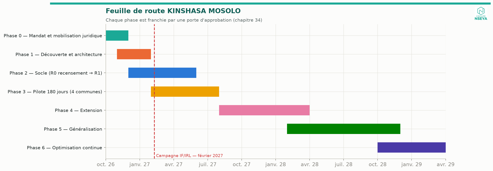
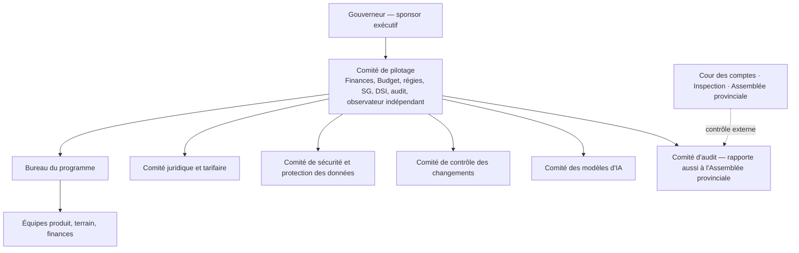
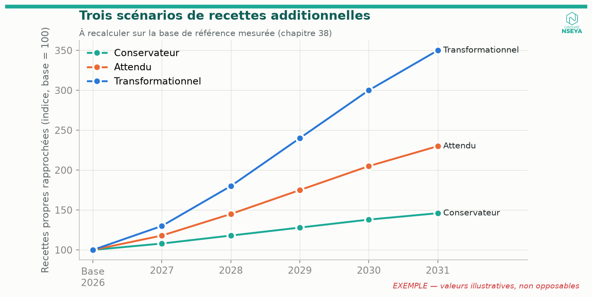
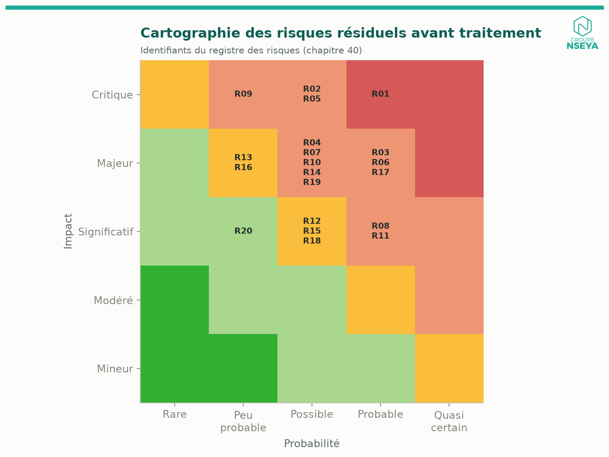

# 34. Feuille de route de mise en œuvre

## 34.1 Contrainte de calendrier

Nous sommes fin septembre 2026. La prochaine campagne annuelle de l'impôt foncier et de l'IRL a son échéance en février 2027. **Il est irréaliste de livrer la plateforme complète avant cette date.** La feuille de route distingue donc :

- une **version R0 « recensement »** (application terrain hors ligne, registre des objets, référentiel territorial, carte) opérationnelle en décembre 2026 dans des quartiers échantillons des quatre communes pilotes ;
- un **test partiel de février 2027** : pour les objets recensés, préparation d'avis pré-remplis et de références de paiement, soit par MOSOLO R1 si prêt, **soit par export vers la plateforme de déclaration existante de la régie** (plan de repli) ; mesure des effets du recensement sur les déclarations ;
- un **pilote complet de 180 jours** (février–juillet 2027) avec la chaîne financière complète ;
- l'extension et la généralisation **conditionnées à des résultats audités**.

## 34.2 Phases

| Phase | Durée | Objectifs | Livrables | Autorité responsable | Dépendances | Catégories de budget | Risques | Critères de succès | Porte d'approbation |
|---|---|---|---|---|---|---|---|---|---|
| **0 — Mandat et mobilisation juridique** | Oct.–nov. 2026 (2 mois) | Mandat, gouvernance, relevé juridique, inventaire des systèmes, base de référence, contrôles de risque | Arrêté de mandat ; comité de pilotage ; relevé juridique certifié v1 (IF, IRL, véhicules) ; inventaire des recettes, comptes et systèmes ; protocole de base de référence ; délégué à la protection des données nommé | Gouverneur ; ministre provincial des Finances | Décisions 1 à 5 (ch. 47) | Programme, juridique, audit de base | Retard de décision ; textes introuvables | Relevé juridique certifié pour les 3 impôts ; base de référence lancée | G0 : Comité de pilotage |
| **1 — Découverte et architecture** | Nov. 2026–janv. 2027 (3 mois) | Cartographie des processus, consultations, audit des systèmes existants (dont la plateforme de déclaration de la régie), audit des données, recherche utilisateurs, exigences, architecture de sécurité, choix des quartiers pilotes | Processus cibles ; dossier d'architecture ; plan de migration/intégration de l'existant ; analyse d'impact protection des données ; plan de sécurité ; backlog priorisé | Directeur de programme ; DGIPK ; DGTK ; DSI | Phase 0 | Conception, études utilisateurs | Résistance des services ; données inexploitables | Architecture validée ; plan d'intégration de l'existant accepté par la régie | G1 : Comité de pilotage + comité de sécurité |
| **2 — Socle (R0 → R1)** | Déc. 2026–mai 2027 (6 mois) | Identité, compte, objets, règles, paiements, quittances, SIG, audit, application terrain, tableaux de bord | R0 (déc. 2026) : recensement ; R1 (avril 2027) : chaîne complète IF/IRL/véhicules | Directeur de programme | Hébergement ; conventions bancaires ; règles certifiées | Développement, hébergement, sécurité, équipements | Glissement ; intégrations bancaires lentes | Tests d'acceptation ch. 41 au vert ; test d'intrusion sans vulnérabilité critique | G2 : mise en production (comité des changements) |
| **3 — Pilote** | Févr.–juil. 2027 (180 jours) | Démontrer, dans 4 communes représentatives, les gains nets, le rapprochement et la maîtrise des risques | Rapport d'évaluation indépendant | Comité de pilotage ; évaluateur indépendant | R1 ; équipes terrain ; financement des moyens physiques | Terrain, communication, évaluation | Faible adoption ; incidents | Critères § 45.3 | G3 : décision de généralisation par le Gouverneur, sur rapport indépendant |
| **4 — Extension** | Août 2027–mars 2028 | Nouvelles communes, recettes (patente, publicité, antennes, marchés, stationnement), canaux, intégrations | R2, R3 | Régies ; ministères | Actes (zonage, tarifs) ; protocoles | Terrain, intégrations | Dispersion | Couverture et rapprochement tenus à l'échelle | G4 |
| **5 — Généralisation** | Janv. 2028–déc. 2028 | 24 communes ; toutes recettes certifiées ; reprise de l'existant | R4 ; décommissionnement contrôlé des systèmes remplacés | Gouvernement provincial | Budget ; équipes provinciales formées | Extension, transfert de compétences | Charge ; qualité | Exercice de réversibilité réussi | G5 |
| **6 — Optimisation** | Continu à partir d'oct. 2028 | Amélioration continue par les données, l'IA et les résultats | Revues trimestrielles | Comité de pilotage | — | Exploitation | Routine, dérive | Recettes nettes vérifiées en hausse ; coût de collecte en baisse | Revue annuelle |

## 34.3 Plans d'action datés

| Horizon | Actions |
|---|---|
| **30 jours** | Arrêté de mandat ; comité de pilotage installé ; directeur de programme et délégué à la protection des données nommés ; lettre aux services juridiques pour le relevé certifié ; inventaire des comptes publics de recettes ; rencontre avec la direction de la DGIPK et de la DGTK sur la plateforme existante ; choix des quartiers échantillons ; cahier des charges de l'évaluateur indépendant |
| **90 jours** | Relevé juridique v1 certifié (IF, IRL, véhicules) ; base de référence 2023–2025 établie pour les communes pilotes ; R0 recensement en service ; 30 % des quartiers échantillons recensés ; conventions avec au moins deux banques et deux émetteurs de monnaie mobile en cours ; analyse d'impact protection des données ; hébergement installé |
| **180 jours** | R1 en production ; campagne de février 2027 mesurée ; pilote en cours ; rapprochement quotidien automatisé pour les flux couverts ; tableau de bord du Gouverneur en service ; premier rapport intermédiaire (J+90 du pilote) |
| **12 mois** | Pilote évalué par un évaluateur indépendant ; décision de généralisation ; R2 (patente, publicité, antennes, marchés) ; premier tableau de transparence publié |
| **24 mois** | Généralisation aux 24 communes en cours ; recettes certifiées toutes intégrées ; exercice de réversibilité ; équipe provinciale capable d'exploiter la plateforme |

# 35. Modèle opérationnel

| Fonction | Rattachement | Missions |
|---|---|---|
| **Bureau du programme MOSOLO** | Comité de pilotage | Planning, budget, risques, conduite du changement, relation avec les partenaires |
| **Cellule juridique et tarifaire** | Ministère provincial des Finances | Registre juridique, fiches de règles, tests juridiques |
| **Centre de services contribuables** | Régies | Guichets, centre d'appels, SVI, traitement des demandes |
| **Opérations terrain** | Régies | Superviseurs, agents, sous-traitants accrédités, contrôle qualité |
| **Salle de contrôle financière** | Trésor provincial | Rapprochement, exceptions, clôtures |
| **Cellule de renseignement anti-fraude** | Inspection / audit interne | Alertes, enquêtes |
| **Cellule données et IA** | Programme puis DSI provinciale | Qualité des données, modèles, tableaux de bord |
| **DSI MOSOLO** | Province | Exploitation, sécurité, support ; montée en compétences progressive |
| **Centre de sécurité (SOC)** | RSSI | Surveillance, réponse aux incidents |
| **Délégué à la protection des données** | Comité de pilotage | Conformité |

Rythmes : point quotidien de la salle de contrôle (exceptions) ; revue hebdomadaire des opérations ; comité mensuel de performance présidé par le ministre des Finances ; revue trimestrielle du Gouverneur ; rapport trimestriel d'audit.

# 36. Gouvernance du programme

| Instance | Composition | Décisions |
|---|---|---|
| Comité de pilotage | Ministre des Finances (président), SG du Gouvernement, DG DGIPK, DG DGTK, Trésor, DSI, audit interne, directeur de programme, observateur indépendant (sans voix délibérative) | Priorités, portes d'approbation, budget, arbitrages |
| Comité juridique et tarifaire | Juristes, régies, finances | Fiches de règles, conflits de compétence |
| Comité de sécurité et protection des données | RSSI, délégué à la protection des données, DSI, audit | Politiques, incidents, analyses d'impact |
| Comité de contrôle des changements | Programme, DSI, sécurité, métier | Mises en production |
| Comité des modèles d'IA | Métier, données, audit, protection des données | Mise en service et retrait des modèles |
| Comité d'audit | Audit interne, inspecteur, personnalité indépendante | Plan d'audit, suites des rapports |

**Standard minimal de chaque module critique** (définition de « terminé ») : responsable métier nommé ; règles certifiées ; séparation des tâches testée ; événements d'audit complets ; tests automatisés ; test de sécurité ; documentation utilisateur et d'exploitation ; indicateurs ; plan de reprise.

# 37. Passation des marchés et modèle commercial

## 37.1 Comparaison des modèles

| Modèle | Description | Avantages | Risques pour la Province | Évaluation |
|---|---|---|---|---|
| Financement public intégral | La Province finance et fait réaliser | Contrôle total | Charge budgétaire initiale ; capacité de pilotage | Possible pour le socle |
| Licence + service géré | Logiciel sous licence, exploitation par le prestataire | Rapidité | Verrouillage, coûts récurrents, propriété du code | Acceptable seulement avec clauses fortes |
| PPP (Loi n° 18/016) | Partenaire finance, conçoit, exploite, rémunéré selon le contrat | Financement privé, engagement de performance | Complexité, durée, risque de rémunération excessive | Possible avec mise en concurrence |
| BOT (construire-exploiter-transférer) | Idem avec transfert à terme | Transfert final | Durée longue ; qualité au moment du transfert | Possible, durée courte |
| Contrat à la performance (pourcentage des recettes) | Rémunération indexée sur les recettes | Aligne les intérêts en apparence | **Fermage fiscal**, rémunération sur des recettes que la Province aurait perçues de toute façon, conflit avec l'unité de caisse, risque de gestion de fait, défiance des partenaires | **Déconseillé sous forme non plafonnée ou sur recettes brutes** |
| **Hybride recommandé** | Forfaits de réalisation et d'exploitation + prime de performance plafonnée sur recettes additionnelles nettes vérifiées | Maîtrise des coûts, incitation réelle, réversibilité | Mesure de la base de référence | **Recommandé** |

## 37.2 Analyse du modèle proposé dans le Cahier v2.9 (§ 37A)

Le Cahier des exigences v2.9 retient une proposition du promoteur : financement intégral du système numérique par le promoteur contre **10 % de toute recette générée par le système pendant 30 ans**, plus 10 % aux ministères de tutelle et 10 % aux agents et sous-traitants, exécutés par deux virements automatiques depuis le compte de recettes. Le présent document, conformément à la commande (« la rémunération à la performance doit être fondée sur une recette additionnelle nette vérifiée, avec base de référence, formule, exclusions, plafond, audit et durée fixe »), en fait l'analyse suivante :

| Point | Constat | Conséquence |
|---|---|---|
| Assiette | 10 % de **toute** recette rapprochée passant par MOSOLO, y compris les recettes que la Province percevait déjà avant le programme | Rémunération sur une base non additionnelle : à recettes constantes, la Province perd 10 % |
| Durée | 30 ans | Très au-delà de la durée de vie d'un système informatique ; engage cinq à six mandatures |
| Plafond | Aucun | Coût non borné |
| Exécution | Prélèvement automatique depuis le compte de recettes vers un compte privé | Contraire au principe de fonds publics sur comptes publics (P5) et exposé au regard de l'unité de caisse (LOFIP) et du risque de gestion de fait (Cour des comptes) |
| Rétrocessions de 10 % aux ministères et de 10 % aux agents | Affectation automatique hors procédure budgétaire | À fonder sur un texte ; sinon contraire à l'universalité budgétaire |
| Perception externe | Les partenaires techniques et financiers et l'évaluation TADAT regardent avec prudence les rémunérations privées indexées sur les recettes fiscales | Risque de réputation et de financement |
| Base juridique | Aucun texte identifié ne l'autorise ni ne l'interdit expressément (J11) | Avis juridique certifié indispensable avant toute signature |

**Recommandation.** Ne pas retenir le modèle 10/10/10/70 sous sa forme actuelle. Lui substituer le modèle hybride du § 37.3, qui préserve l'intérêt du partenaire à la réussite **sans prélèvement à la source**, avec une rémunération bornée et mesurée sur la seule valeur ajoutée. Si le Gouvernement souhaite néanmoins examiner une formule de partage, elle doit au minimum : (1) porter sur la **recette additionnelle nette vérifiée** et non sur la recette brute ; (2) être **plafonnée** en montant annuel et cumulé ; (3) avoir une **durée fixe courte** (5 à 7 ans) ; (4) être **payée sur crédit budgétaire** après certification, jamais par prélèvement automatique ; (5) être attribuée après **mise en concurrence** (marchés publics ou PPP) ; (6) être validée par un avis juridique certifié et, si nécessaire, par un acte de l'Assemblée provinciale.

## 37.3 Structure commerciale recommandée

| Composante | Nature | Mode de paiement |
|---|---|---|
| Forfait de réalisation | Prix ferme par lot (socle, R1, R2…), payé sur livrables acceptés | Budget d'investissement |
| Forfait d'exploitation et de maintenance | Prix annuel par niveau de service (disponibilité, support, correctifs) | Budget de fonctionnement, pénalités de SLA |
| Hébergement | Refacturation transparente au coût ou marché séparé | Idem |
| Prime de performance plafonnée | % de la **recette additionnelle nette vérifiée** au-delà de la base de référence | Payée annuellement après certification par l'auditeur indépendant ; plafond annuel ; durée 5 ans |
| Évolutions | Bordereau de prix unitaires (jours-personne par profil) fixé au contrat | Sur bons de commande approuvés |

**Formule de la prime (à ajuster en négociation).**

> Prime(année) = min( taux × max(0, RANV(année)) ; plafond annuel )
>
> RANV = Recettes rapprochées du périmètre − Base de référence ajustée − Recettes exclues − Remboursements et corrections
>
> Base de référence ajustée = moyenne des recettes rapprochées des 3 exercices antérieurs × (1 + inflation officielle) × (1 + effet des changements de taux décidés par la Province)
>
> Exclusions : effets de hausses de taux ou de nouvelles recettes créées par acte ; recettes exceptionnelles (arriérés de grands redevables recouvrés par voie judiciaire, régularisations imposées par un texte) ; effets de change

| Protection | Clause |
|---|---|
| Base de référence | Mesurée et certifiée par un auditeur indépendant avant démarrage |
| Audit | Droit d'audit de la Province, de la Cour des comptes et de l'inspection |
| Plafond | Annuel et cumulé |
| Durée | Fixe, sans reconduction tacite |
| Frais cachés | Interdiction de toute commission non inscrite au contrat ; commissions des canaux de paiement négociées séparément et publiées |
| Verrouillage | Propriété ou licence perpétuelle du code, dépôt à chaque version, formats ouverts |
| Données | Propriété exclusive de la Province ; interdiction de réutilisation |
| Coûts de changement | Bordereau de prix unitaires ; plafond annuel des évolutions |
| Sortie | Plan de réversibilité, assistance de 12 mois, prix fixé à l'avance |
| Dépendance | Transfert de compétences obligatoire ; indicateur d'autonomie de l'équipe provinciale |

## 37.4 Postes de coût à chiffrer

| Poste | Contenu | Inducteur de coût |
|---|---|---|
| Réalisation | Conception, développement, tests | Périmètre fonctionnel, nombre d'intégrations |
| Licences | Idéalement nulles (logiciels libres) ; composants commerciaux éventuels | Nombre d'utilisateurs, cœurs |
| Hébergement | Colocation, matériel, réseau, énergie | Volumétrie, redondance |
| Maintenance et support | Correctifs, évolutions mineures, support N2/N3 | Niveau de service |
| Intégrations | Banques, monnaie mobile, opérateurs, données partenaires | Nombre de partenaires |
| Coûts des canaux de paiement | Commissions par transaction | Volumes, négociation, **qui les supporte** (contribuable, Province) |
| Équipements terrain | Terminaux, batteries, imprimantes | Nombre d'agents |
| Plaques et cartes | Plaques fiscales, cartes MOSOLO | Nombre d'objets |
| SMS et communications | SMS, USSD, SVI | Nombre d'événements × canal (§ 11.4) |
| Formation | Parcours, formateurs, certification | Nombre d'utilisateurs |
| Cybersécurité | SOC, tests d'intrusion, HSM | Niveau de service |
| Évolutions | Demandes de changement | Bordereau |
| Migration de données | Reprise de l'existant | Qualité des sources |
| Audit | Auditeur indépendant, évaluateur du pilote | Périmètre |
| Sortie | Réversibilité | Fixé au contrat |

Référence de comparaison : le système de gestion des recettes de la ville de Kampala (eCitie) a été rapporté à environ 2,1 millions de dollars, tous postes confondus (développement, matériel, formation, données, sensibilisation) [PROBABLE] ; ce chiffre n'est pas transposable sans étude, la taille et le périmètre de Kinshasa étant très supérieurs.

# 38. Modèle financier

## 38.1 Établir la base de référence avant toute promesse

| Mesure | Définition | Source | Responsable |
|---|---|---|---|
| Contribuables enregistrés | Comptes actifs par catégorie | Bases des régies | DGIPK, DGTK |
| Objets imposables connus | Par type et commune | Bases, rôles | Régies |
| Liquidations annuelles | Montants émis par recette | Rôles, avis | Régies |
| Encaissements | Montants encaissés | Banques, Trésor | Trésor |
| Délais de règlement | Paiement → crédit du compte public | Relevés | Trésor |
| Paiements non rapprochés | Montants en suspens | Rapprochement | Trésor |
| Arriérés | Stock par âge | Régies | Régies |
| Exonérations | Nombre, montant, fondement | Régies | Audit |
| Annulations | Nombre, montant, motif | Régies | Audit |
| Coût de recouvrement et de collecte | Personnel, commissions, équipements | Finances | Finances |
| Pertes par fraude | Cas établis | Inspection | Audit |
| Délais de traitement | Demande → décision | Échantillon | Programme |

## 38.2 Formules

- Potentiel théorique = Σ objets × montant légal moyen dû
- Recette additionnelle attendue = potentiel × (conformité cible − conformité actuelle) − coût marginal de recouvrement
- **Recette additionnelle nette vérifiée (RANV)** = assiette vérifiée supplémentaire + gains de conformité + arriérés recouvrés + déperdition évitée + gains de rapprochement − coûts additionnels − remboursements − corrections
- Délai de retour = coût d'investissement cumulé / RANV annuelle moyenne

## 38.3 Scénarios

| Élément | Conservateur | Attendu | Transformationnel |
|---|---|---|---|
| Hypothèses | Conformité locative +3 à +5 points ; adoption lente ; protocoles tardifs | +10 à +15 points ; pilote réussi ; protocoles obtenus | +20 points et plus ; quitus généralisé ; grands redevables fiabilisés |
| Objets additionnels enregistrés | Faible | Moyen | Élevé |
| Amélioration du paiement | Faible | Moyenne | Forte |
| Réduction de la déperdition | Faible | Moyenne | Forte |
| Rapprochement automatique | 80 % | 95 % | 98 % |
| Recette brute additionnelle | Formule § 38.2 sur base mesurée | Idem | Idem |
| Coût de mise en œuvre | Complet | Complet | Complet + campagnes |
| Coût récurrent | Exploitation | Exploitation | Exploitation + terrain accru |
| Recette nette additionnelle | À calculer | À calculer | À calculer |
| Délai de retour | > 24 mois | 12–24 mois | < 12 mois |
| Référence empirique | Kananga (RDC) | Kampala | Freetown |

**Exemple illustratif** [EXEMPLE — hypothèses de travail à remplacer par le recensement pilote et les tarifs certifiés] : si 200 000 unités louées nouvellement identifiées dans le périmètre pilote avaient un loyer moyen de 60 USD par mois, l'IRL théorique au taux de 17 % (hors 1er rang) serait de 200 000 × 60 × 12 × 17 % ≈ 24,5 millions USD par an ; avec une conformité de 25 %, la recette effective serait d'environ 6,1 millions USD, avant coûts. **Chaque paramètre de cet exemple est une hypothèse.**

**Sensibilité.** Chaque scénario est testé sur : taux de conformité (± 50 %), taux de change CDF/USD (le budget 2026 supposait environ 2 900 CDF pour 1 USD, le cours de septembre 2026 est rapporté autour de 2 270 [À VÉRIFIER] — tout scénario libellé en USD doit indiquer son taux), délai d'obtention des protocoles de données (± 6 mois), coût des canaux de paiement.

# 39. Indicateurs de performance

| Domaine | Indicateur | Formule | Cible pilote |
|---|---|---|---|
| Couverture | Taux de recensement | Objets recensés / objets estimés (quartiers pilotes) | ≥ 90 % |
| Identification | Taux de rattachement vérifié | Objets rattachés N2+ / objets recensés | ≥ 70 % |
| Légalité | Règles actives certifiées | Règles actives avec pièce officielle / règles actives | 100 % |
| Liquidation | Exactitude | Obligations sans rectification fondée / obligations émises | ≥ 98 % |
| Paiement | Conversion | Obligations payées à l'échéance / exigibles | Base + 15 points |
| Numérique | Part électronique | Encaissements électroniques / total (flux couverts) | ≥ 80 % |
| Règlement | Délai | Médiane confirmation → crédit | ≤ 1 jour ouvré |
| Rapprochement | Taux automatique J+1 | Rapprochés auto / confirmés | ≥ 95 % |
| Exceptions | Âge | Exceptions > 30 jours | 0 |
| Quittance | Délai | Confirmation → quittance provisoire | < 60 s |
| Recouvrement | Rendement | Recouvré / coût de recouvrement | Base + 20 % |
| Arriérés | Récupération | Arriérés recouvrés / stock recouvrable | À fixer |
| Intégrité | Anomalies traitées | Alertes instruites dans le délai / alertes | ≥ 90 % |
| Intégrité | Espèces hors canal | Cas détectés | 0 toléré |
| Recours | Délai | Médiane dépôt → décision | Délai légal |
| Recours | Taux fondé | Décisions favorables / décisions | Suivi (alerte si > 20 % sur un motif) |
| Service | Satisfaction | Enquête post-paiement | ≥ 4/5 |
| Inclusion | Parcours assistés | Opérations par USSD, SVI, guichet / total | Suivi |
| Communication | Délivrance | Messages délivrés / tentés, par canal | ≥ 95 % |
| Technique | Disponibilité | Temps disponible / temps total | ≥ 99,5 % |
| Sécurité | Vulnérabilités critiques ouvertes | Nombre | 0 |
| IA | Acceptation | Recommandations acceptées / émises | Suivi ; alerte si < 30 % ou > 95 % |
| Coût | Coût de collecte | Coût total / recettes rapprochées | En baisse |
| Résultat | RANV | § 38.2 | Positive et certifiée |
| Souveraineté | Autonomie | Tâches d'exploitation réalisées par l'équipe provinciale | ≥ 50 % à 24 mois |

# 40. Registre des risques

Échelle : probabilité (P) et impact (I) de 1 à 5.

| ID | Risque | P | I | Traitement | Propriétaire |
|---|---|---|---|---|---|
| R01 | Liquidations fondées sur des textes ou taux non certifiés, contestées en masse | 4 | 5 | Registre juridique, statut `A_VERIFIER` bloquant, relevé certifié en phase 0 | Cellule juridique |
| R02 | Détournement par changement de compte bénéficiaire ou fraude interne majeure | 3 | 5 | Coffre, quorum, hors bande, refroidissement, audit | Trésor, audit |
| R03 | Rejet politique ou social (hausse perçue de la pression fiscale) | 4 | 4 | Communication, simplicité, équité, transparence de l'emploi des fonds, pas de nouvelle taxe au pilote | Gouverneur, programme |
| R04 | Retard des protocoles de données partenaires | 3 | 4 | Recensement terrain d'abord ; protocoles en parallèle | Programme |
| R05 | Cyberattaque ou fuite de données fiscales | 3 | 5 | Zéro confiance, SOC, chiffrement, tests d'intrusion | RSSI |
| R06 | Désorganisation liée à la réforme des régies (DGRK → DGIPK et DGTK) | 4 | 4 | Administration paramétrable ; association des nouvelles directions dès J+30 | Finances |
| R07 | Dépendance au fournisseur | 3 | 4 | Clauses § 33 et § 37 ; code déposé ; réversibilité testée | Comité de pilotage |
| R08 | Connectivité et énergie insuffisantes sur le terrain | 4 | 3 | Hors ligne ; batteries ; synchronisation au bureau | Opérations |
| R09 | Invalidation du modèle de rémunération du prestataire (fermage, gestion de fait) | 2 | 5 | Modèle hybride § 37.3 ; avis juridique | Finances |
| R10 | Corruption et collusion sur le terrain | 3 | 4 | Zéro espèce, contrôle qualité indépendant, badges, signalement | Audit |
| R11 | Mauvaise qualité des données (adresses, doublons) | 4 | 3 | Référentiel territorial, anti-doublon, contrôles de qualité | Données |
| R12 | Faible adoption par les contribuables | 3 | 3 | Canaux assistés, langues nationales, simplicité | Service contribuables |
| R13 | Biais de ciblage des modèles d'IA | 2 | 4 | Tests de biais, validation humaine, comité des modèles | Comité IA |
| R14 | Défaillance ou fraude d'un canal de paiement | 3 | 4 | Multi-prestataires, rapprochement, pénalités, signatures | Trésor |
| R15 | Coexistence avec la plateforme existante et doubles systèmes | 3 | 3 | Plan d'intégration puis migration ; un seul système de référence par recette | DSI |
| R16 | Non-conformité en matière de protection des données (autorité non encore créée) | 2 | 4 | Délégué, analyses d'impact, formalités auprès de l'autorité intérimaire | DPD |
| R17 | Calendrier de février 2027 non tenu | 4 | 4 | Plan de repli par export vers l'existant ; périmètre R0 réduit | Programme |
| R18 | Financement des moyens physiques non arrêté | 3 | 3 | Décision budgétaire en phase 0 | Finances |
| R19 | Volatilité du change CDF/USD | 3 | 4 | Règles de change certifiées ; scénarios avec taux explicites | Trésor |
| R20 | Rotation du personnel formé | 2 | 3 | Formation continue, documentation, certification | Programme |

# 41. Critères d'acceptation

| ID | Critère (Étant donné / Lorsque / Alors) |
|---|---|
| AC-LEG-01 | Étant donné une règle au statut `A_VERIFIER`, lorsque le moteur est sollicité pour liquider, alors aucune obligation n'est créée et la tentative est journalisée |
| AC-LEG-02 | Étant donné une règle, lorsqu'une même personne tente de la rédiger et de la publier, alors la publication est refusée |
| AC-LEG-03 | Étant donné un instrument abrogé, lorsqu'une règle le référence avec une date d'effet postérieure, alors la publication est bloquée |
| AC-LEG-04 | Étant donné deux entités revendiquant le même fait générateur, lorsque la seconde crée l'obligation, alors elle est bloquée et un arbitrage est ouvert |
| AC-ASS-01 | Étant donné une obligation, lorsque le contribuable ouvre le détail, alors il voit règle, version, base légale, assiette, formule, montant, échéance et voie de recours |
| AC-ASS-02 | Étant donné un changement de règle, lorsque le recalcul est approuvé, alors des obligations rectificatives sont créées et les anciennes conservées |
| AC-PAY-01 | Étant donné une même clé d'idempotence rejouée, alors une seule référence existe |
| AC-PAY-02 | Étant donné un rappel prestataire à signature invalide ou nonce déjà vu, alors il est rejeté et une alerte est émise |
| AC-PAY-03 | Étant donné une capture d'écran de paiement, alors aucune fonction ne permet d'émettre une quittance à partir d'elle |
| AC-PAY-04 | Étant donné un paiement confirmé, alors une quittance provisoire est émise en moins de 60 secondes ; elle devient définitive au rapprochement |
| AC-BEN-01 | Étant donné une demande de changement de compte bénéficiaire, alors elle ne prend effet qu'après deux approbations distinctes, vérification hors bande et 72 heures |
| AC-LED-01 | Étant donné toute correction financière, alors elle est une contre-écriture liée à l'original ; aucune suppression n'est possible |
| AC-AUD-01 | Étant donné la chaîne d'audit, lorsqu'un enregistrement est altéré en base, alors le contrôle d'intégrité détecte la rupture en moins d'une heure |
| AC-ACC-01 | Étant donné un super-administrateur, alors il ne peut ni lire les montants nominatifs, ni modifier une obligation, un paiement, un bénéficiaire ou un événement d'audit |
| AC-ACC-02 | Étant donné le Gouverneur, alors il voit les agrégats et ne peut modifier aucune donnée financière |
| AC-FLD-01 | Étant donné une mission téléchargée, lorsque l'agent capture GPS, photo et formulaire hors ligne, alors la preuve est chiffrée, horodatée, synchronisée, et aucune dette n'est créée sans validation |
| AC-FLD-02 | Étant donné un terminal déclaré perdu, alors il est révoqué et ses données locales sont inaccessibles |
| AC-RCP-01 | Étant donné un QR de quittance, lorsqu'il est scanné publiquement, alors seules les données minimales sont affichées |
| AC-COM-01 | Étant donné un avis obligatoire, lorsque le destinataire s'est désinscrit des communications facultatives, alors l'avis est tout de même délivré et sa preuve conservée |
| AC-COM-02 | Étant donné un fournisseur non configuré, lorsqu'un envoi de test est déclenché, alors il est enregistré en mode bac à sable avec le statut « journalisé » |
| AC-CUR-01 | Étant donné une obligation en USD payée en EUR, alors la quittance affiche les trois devises avec leurs drapeaux, le taux et sa source |
| AC-AI-01 | Étant donné une recommandation d'IA, alors elle n'a aucun effet tant qu'un utilisateur habilité ne l'a pas acceptée, et la décision est journalisée |
| AC-SAV-01 | Étant donné un formulaire en cours de saisie, lorsque la connexion est coupée, alors le brouillon est conservé et restauré, avec son historique de versions |
| AC-DR-01 | Étant donné une panne du site principal, alors le service reprend sur le site secondaire dans le RTO, sans perte de paiement |
| AC-REV-01 | Étant donné l'exercice de réversibilité, alors un tiers restaure la plateforme à partir du code déposé et des exports, sans le prestataire |

# 42. Carnet de développement

## 42.1 Épopées

| Épopée | Contenu | Release |
|---|---|---|
| E01 Identité et compte | Inscription, OTP, niveaux, anti-doublon, mandats, récupération | R0/R1 |
| E02 Référentiel territorial et SIG | Communes, quartiers, rues, parcelles, cartes, tuiles | R0 |
| E03 Recensement terrain hors ligne | Missions, formulaires, GPS, photos, QR, synchronisation, MDM | R0 |
| E04 Registre juridique | Instruments, fiches, cycle de vie, tests juridiques | R1 |
| E05 Liquidation | Moteur de règles, explication, rectification | R1 |
| E06 Paiements | Références, canaux, rappels, idempotence | R1 |
| E07 Trésor et grand livre | Relevés, rapprochement, écritures, clôtures | R1 |
| E08 Quittances et quitus | Émission, signature, vérification, quitus | R1 |
| E09 Communications | Moteur d'événements, modèles, canaux, journal (§ 11.4) | R1 |
| E10 Tableaux de bord | Gouverneur, régies, Trésor, audit | R1 |
| E11 Audit et intégrité | Journal chaîné, WORM, contrôles | R1 |
| E12 Accès | RBAC/ABAC, invitations, délégations, JIT | R1 |
| E13 Contentieux | Réclamations, décisions | R1 |
| E14 Recouvrement | Relances, dossiers d'exécution | R2 |
| E15 Anti-fraude | Règles, modèles, enquêtes | R2 |
| E16 IA | Passerelle, agents, gouvernance | R2 |
| E17 Verticales R2 | Patente, publicité, antennes, marchés, stationnement | R2 |
| E18 Multilingue et multidevise | Ressources, SVI, devises et drapeaux | R1 |
| E19 Autosauvegarde et versions | Brouillons, historique, restauration | R1 |
| E20 Transparence publique | Tableau public, données ouvertes | R2 |

## 42.2 Récits de référence

| ID | Récit | Critère |
|---|---|---|
| US-01 | En tant que contribuable, je veux voir l'origine légale et le calcul de chaque obligation afin de comprendre ce que je paie | AC-ASS-01 |
| US-02 | En tant qu'agent de terrain, je veux enregistrer un constat hors connexion sans pouvoir créer une dette | AC-FLD-01 |
| US-03 | En tant qu'auditeur, je veux reconstituer toute modification financière | Chaîne complète sans trou |
| US-04 | En tant que comptable du Trésor, je veux voir les exceptions de rapprochement classées par âge et montant | Tri, filtres, quatre yeux |
| US-05 | En tant que juriste, je veux simuler une règle sur un jeu de cas avant de la soumettre | Rapport de tests |
| US-06 | En tant que Gouverneur, je veux voir l'échelle de la recette du jour et les actions recommandées | Tableau § 26.2 |
| US-07 | En tant que commerçant sans smartphone, je veux payer mon étal par USSD dans ma langue | Parcours USSD en lingala |
| US-08 | En tant que propriétaire de la diaspora, je veux payer par carte en EUR et recevoir une quittance valable | AC-CUR-01 |
| US-09 | En tant que citoyen, je veux vérifier qu'un agent est authentique | Vérification du badge par code court |
| US-10 | En tant que gestionnaire du coffre, je veux approuver un changement de compte bénéficiaire avec vérification hors bande | AC-BEN-01 |
| US-11 | En tant qu'administrateur des communications, je veux prévisualiser un modèle et me l'envoyer en test | AC-COM-02 |
| US-12 | En tant qu'agent public, je veux que mes saisies soient enregistrées automatiquement | AC-SAV-01 |

# 43. Plan de livraison par versions

| Version | Date cible | Contenu | Correspondance Cahier v2.9 |
|---|---|---|---|
| **R0 — Recensement** | Déc. 2026 | E02, E03, E01 (partiel), socle d'audit | V0.1 |
| **R1 — Chaîne financière** | Avril 2027 | E01, E04–E13, E18, E19 ; IF, IRL, véhicules | V1.0 / R1 |
| **R2 — Verticales et intelligence** | Oct. 2027 | E14–E17, E20 | V2.0 / R2 |
| **R3 — Extension** | Mars 2028 | Transport, embarquement, événements, carrières, ports, assainissement, billetterie | R3 |
| **R4 — Généralisation** | Déc. 2028 | Forêts, péages, espace communal, contribution environnementale si acte, AVIA si validé | V3.0 / R4 |

# 44. Stratégie de tests

| Niveau | Objet | Outils / méthode | Seuil |
|---|---|---|---|
| Unitaires | Fonctions, règles, calculs monétaires | Frameworks standard | Couverture ≥ 80 % sur domaines financiers |
| Tests juridiques | Jeux de cas validés par les juristes pour chaque règle | Tables de décision | 100 % verts pour publier |
| Propriétés | Invariants (somme des écritures nulle, pas de double paiement, pas de quittance sans état autorisé) | Tests de propriétés | 0 violation |
| Intégration | Banques, monnaie mobile, SMS, données | Bacs à sable des partenaires, doublures | Contrats d'API validés |
| Bout en bout | Parcours contribuable, agent, Trésor | Automatisation navigateur et mobile | Parcours critiques verts |
| Hors ligne | Coupures, conflits, perte de terminal | Scénarios de chaos réseau | Aucune perte |
| Charge | Pic de février (20 × moyenne) | Tests de charge | SLA tenus |
| Sécurité | SAST, DAST, dépendances, test d'intrusion, revue de configuration | Outils + prestataire indépendant | 0 critique |
| Accessibilité | WCAG 2.1 AA | Audits automatiques et manuels | Conforme |
| Linguistique | Traductions, SVI | Relecteurs natifs | Complétude 100 % |
| Reprise | Restauration, bascule | Exercices | RTO/RPO tenus |
| Acceptation | Critères ch. 41 | Recette par les métiers | Signée |
| Réversibilité | Restauration par un tiers | Exercice | Réussi |

# 45. Plan pilote de 180 jours

## 45.1 Communes

| Commune | Profil | Intérêt pour le pilote |
|---|---|---|
| **Gombe** | Centre administratif et d'affaires, forte valeur foncière | Grands redevables, publicité, stationnement, bureaux loués |
| **Limete** | Mixte résidentiel, industriel et commercial | Locations, entrepôts, commerces |
| **Kalamu** | Densément résidentielle, commerce populaire | Location résidentielle, marchés, informalité |
| **Ngaliema** | Contrastée : quartiers aisés et quartiers populaires, zones d'extension | Hétérogénéité foncière, constructions nouvelles |

Chaque commune comprend des quartiers traités et des quartiers de comparaison appariés (profil semblable), pour mesurer l'effet réel du programme.

## 45.2 Séquence

| Période | Activité |
|---|---|
| J−120 à J0 (oct. 2026 – janv. 2027) | Recensement R0 des quartiers traités ; communication ; conventions de paiement |
| J0 – J30 (févr. 2027) | Campagne IF/IRL (test partiel) ; avis pré-remplis ; canaux de paiement |
| J30 – J90 | R1 en production ; rapprochement complet ; réclamations ; premières vérifications ciblées |
| J90 | Rapport intermédiaire |
| J90 – J150 | Extension aux véhicules et aux quittances de titres ; campagne de régularisation si acte |
| J150 – J180 | Évaluation indépendante |
| J180 | Décision de généralisation |

## 45.3 Critères de succès

- Couverture ≥ 90 % des objets des quartiers traités ;
- Rapprochement automatique ≥ 95 % à J+1 ;
- Aucune espèce hors canal agréé non instruite ;
- RANV positive et significative dans les quartiers traités par rapport aux quartiers de comparaison ;
- Coût de collecte par franc recouvré inférieur à la base ;
- Délai de traitement des réclamations dans le délai légal ;
- Satisfaction ≥ 4/5 ;
- Aucun incident de sécurité majeur ;
- Aucune liquidation fondée sur une règle non certifiée.

## 45.4 Protocole d'évaluation

Évaluateur indépendant sélectionné en phase 0 ; plan d'analyse préenregistré ; accès en lecture aux données ; rapport public agrégé. Tests intégrés : effet de la simplicité du forfait, effet de l'appui des relais de quartier, effet des rappels SMS dans la langue du destinataire.

# 46. Plan des 100 premiers jours

| Jours | Jalons |
|---|---|
| J1–J10 | Arrêté de mandat ; comité de pilotage ; directeur de programme ; DPD ; lettre de mission juridique |
| J11–J30 | Inventaire des recettes, comptes et systèmes ; rencontre DGIPK/DGTK ; choix des quartiers ; hébergement commandé ; cahier des charges de l'évaluateur |
| J31–J45 | Relevé juridique v1 (IF, IRL, véhicules) ; base de référence 2023–2025 ; architecture validée (G1) |
| J46–J60 | R0 en recette ; formation des premiers agents ; plaques commandées ; conventions bancaires en négociation |
| J61–J75 | R0 en production ; démarrage du recensement ; analyse d'impact protection des données |
| J76–J90 | 30 % des quartiers recensés ; fiches de règles IF/IRL certifiées ; modèles d'avis validés |
| J91–J100 | Revue de fin de phase ; décision sur la voie de la campagne de février (R1 ou export) ; rapport au Gouverneur |

# 47. Décisions requérant une action immédiate du Gouvernement

| # | Décision | Autorité | Échéance |
|---|---|---|---|
| 1 | Mandater KINSHASA MOSOLO comme architecture faîtière des recettes provinciales et installer le comité de pilotage | Gouverneur | 15 jours |
| 2 | Désigner le sponsor exécutif (ministre des Finances) et le directeur de programme | Gouverneur | 15 jours |
| 3 | Ordonner le relevé juridique certifié (OL 18/004, Édit 005/2021, édit budgétaire 2026, arrêtés de taux, arrêtés DGIPK/DGTK) | Gouverneur → services juridiques | 45 jours |
| 4 | Ordonner la mesure de la base de référence par un auditeur indépendant | Ministre des Finances | 30 jours |
| 5 | Poser le principe « fonds publics sur comptes publics » et désigner les comptes de recettes et les gardiens du coffre | Ministre des Finances, Trésor | 30 jours |
| 6 | Approuver la Constitution financière (séparation des pouvoirs, quorum, contre-écritures) | Gouvernement provincial | 30 jours |
| 7 | Autoriser la négociation des protocoles de données (énergie, eau, immatriculations, télécoms, brasseries, DGI, employeurs) | Gouverneur | 30 jours |
| 8 | Approuver les quatre communes pilotes et le calendrier (recensement avant février 2027) | Gouverneur | 15 jours |
| 9 | Retenir le modèle commercial hybride (§ 37.3) et exclure tout prélèvement automatique de recettes au profit d'un tiers ; lancer la procédure de passation appropriée | Gouvernement, Finances | 60 jours |
| 10 | Arrêter le financement des moyens physiques (terminaux, plaques, guichets, communications) et conditionner la généralisation à des résultats audités | Gouvernement provincial | 45 jours |
