# Annexe E — Socle logiciel livré {.unnumbered}

Le dépôt du programme contient, en plus du document, un **socle logiciel exécutable** qui met en œuvre les garde-fous essentiels de la plateforme. Il ne remplace pas la réalisation de la phase 2 : il en fixe l'architecture, les contrats et les invariants, et sert de référence aux équipes et aux évaluateurs.

## E.1 Organisation : backend, frontend et shared séparés

```mermaid
flowchart LR
  subgraph shared["shared — @mosolo/shared"]
    M[Montants exacts<br/>Money]
    C[Devises<br/>CDF principale + drapeaux]
    L[Langues<br/>fr · ln · sw · kg · lua · en]
    E[Catalogue<br/>255 événements]
    R[Fiches de règles<br/>+ exécutabilité]
    D[États, rôles,<br/>incompatibilités]
    A[Format de sortie IA]
  end
  subgraph backend["backend — API REST"]
    B1[Identité, objets]
    B2[Registre juridique<br/>+ liquidation]
    B3[Paiements, coffre,<br/>rapprochement, grand livre]
    B4[Quittances,<br/>vérification publique]
    B5[Audit chaîné]
    B6[Communications,<br/>autosauvegarde, IA]
  end
  subgraph frontend["frontend — PWA"]
    F1[Portail contribuable]
    F2[Centre de commandement]
    F3[Console communications]
    F4[Registre, Trésor, audit]
    F5[Terrain hors ligne]
    F6[Vérification publique]
  end
  shared --> backend
  shared --> frontend
  frontend -- HTTP /v1 uniquement --> backend
```

| Paquet | Technologie | Rôle |
|---|---|---|
| `shared` | TypeScript, sans dépendance d'exécution | Source unique des types, calculs monétaires, référentiels et catalogues |
| `backend` | Node.js 22, TypeScript, Fastify, Zod | API REST conforme à `specs/contrat-api.md` et `specs/openapi.yaml` |
| `frontend` | React 18, Vite, Recharts, vite-plugin-pwa | Application web progressive installable, responsive (téléphone, tablette, poste de travail), hors ligne |

## E.2 Invariants démontrés par les tests automatisés

État au 26 septembre 2026 : **74 tests automatisés, tous verts** (shared : 16 ; backend : 47 ; frontend : 11), vérification de types stricte sans erreur, construction de la PWA réussie. Le backend implémente les 39 routes du contrat, vérifiées contre `specs/openapi.yaml` ; le schéma PostgreSQL (`backend/db/schema.sql`) a été chargé dans PostgreSQL 16 et refuse toute modification ou suppression du journal d'audit ainsi que toute écriture comptable déséquilibrée.

| Critère (ch. 41) | Invariant | Paquet |
|---|---|---|
| AC-LEG-01 | Une règle `A_VERIFIER` ne peut produire aucune obligation | shared, backend |
| AC-LEG-02 | Quatre approbateurs distincts pour publier une règle | shared, backend |
| AC-LEG-03 | Aucune règle fondée sur un texte abrogé | backend |
| AC-ASS-01 | Chaque obligation porte son explication (règle, version, base légale, formule, entrées) | backend, frontend |
| AC-PAY-01 | Idempotence des références de paiement | backend |
| AC-PAY-02 | Rappels prestataires : signature, fenêtre temporelle, nonce, unicité | backend |
| AC-PAY-04 | Quittance provisoire à la confirmation, définitive au rapprochement | backend |
| AC-BEN-01 | Coffre des bénéficiaires : deux approbateurs, vérification hors bande, 72 heures | backend |
| AC-LED-01 | Grand livre en ajout seul, équilibré, corrections par contre-écriture | backend |
| AC-AUD-01 | Toute altération du journal d'audit est détectée | backend |
| AC-ACC-01/02 | Super-administrateur et Gouverneur sans pouvoir financier | backend |
| AC-RCP-01 | Vérification publique minimale | backend, frontend |
| AC-COM-01/02 | Avis obligatoires malgré la désinscription ; bac à sable « journalisé » | shared, backend |
| AC-CUR-01 | Montants exacts multidevises, drapeaux, taux et source | shared, backend, frontend |
| AC-AI-01 | Une recommandation d'IA est sans effet avant décision humaine | backend, frontend |
| AC-SAV-01 | Autosauvegarde versionnée | backend, frontend |

## E.3 Ce qui relève de la démonstration

| Élément | Socle | Production (phase 2) |
|---|---|---|
| Authentification | En-tête de démonstration `x-demo-user` et utilisateurs semés | OIDC (Keycloak), passkeys, MFA, certificats d'appareil |
| Stockage | Référentiels en mémoire derrière des interfaces | PostgreSQL/PostGIS (schéma fourni), stockage objet WORM |
| Bus d'événements | Émetteur en processus | Kafka avec boîte d'envoi transactionnelle |
| Signatures | Clés générées au démarrage | HSM, PKI provinciale |
| IA | Générateur déterministe à base de règles derrière une interface de fournisseur | Modèles hébergés sous contrôle, passerelle IA, comité des modèles |
| Canaux de communication | Adaptateurs en bac à sable | Contrats opérateurs SMS, USSD, SVI, courriel, push |
| Paiements | Prestataire simulé signé HMAC | Banques et émetteurs agréés BCC, mTLS + signatures |
| Données du tableau de bord | Données d'exemple marquées « EXEMPLE » | Entrepôt analytique alimenté par CQRS |
| Application terrain | Parcours hors ligne dans la PWA | Application Android native (Kotlin), MDM, stockage chiffré |

## E.4 Écrans de l'application (PWA)

| Route | Écran | Points clés |
|---|---|---|
| `/` | Accueil | Visuel de couverture officiel de la Ville, scène nocturne de la ville, frise des 13 maillons, chiffres sourcés, principes |
| `/inscription` | Inscription | Question de situation à l'adresse (8 réponses), autosauvegarde, rappel « déclarer n'est pas prouver » |
| `/espace` | Espace contribuable | Objets et statuts cartographiques, obligations et explication du calcul, paiement par référence, quittances, réclamation |
| `/verifier` | Vérification publique de quittance | Résultat minimal, lecture QR si l'appareil le permet |
| `/gouverneur` | Centre de commandement | Tuiles, communes, catégories, échelle de la recette, campagne, scénarios, alertes, recommandations |
| `/communications` | Console des communications | Catalogue de 255 événements, couverture par canal, aperçu de courriel à la charte, envoi de test, délivrances |
| `/registre` | Registre juridique | Fiches de règles, statuts, circuit des quatre approbations |
| `/tresor` | Trésor et rapprochement | Exceptions, équilibre du grand livre, relevés, coffre des bénéficiaires |
| `/terrain` | Agent de terrain | Missions, capture hors ligne (GPS, photo hachée), synchronisation signée |
| `/audit` | Audit | Vérification de la chaîne, journal |
| `/ia` | Recommandations | Boîte de décision humaine |

Toutes les pages s'adaptent au téléphone (390 px), à la tablette et au poste de travail, en mode clair et sombre ; l'application est installable et fonctionne hors ligne pour son enveloppe et les vérifications publiques récentes.
