# Annexe H — Intégration exhaustive des exigences des documents sources {.unnumbered}

Cette annexe garantit qu'aucune exigence des quatre documents sources du programme n'est perdue dans le passage au document maître v3.0. Elle reprend, élément par élément, ce que les chapitres 1 à 47 ne couvraient pas ou ne couvraient que superficiellement, et consigne dans un tableau d'arbitrage chaque point sur lequel la version 3.0 a délibérément changé de position.

| Rubrique | Contenu |
|---|---|
| Documents sources | **C** — Cahier des exigences consolidé v2.9 (24 septembre 2026) ; **SF** — Spécification fonctionnelle des 81 modules et 16 verticales v1.2 ; **DG** — Dossier Gouverneur et spécification directrice v1.0 ; **NE** — Note exécutive au Gouverneur (24 septembre 2026) |
| Rang normatif | **Chapitres 1 à 47 du document maître > Annexe H > documents sources.** L'Annexe H complète les chapitres ; elle ne les modifie pas. Un élément de l'Annexe H qui contredirait un chapitre est réputé non écrit et doit être signalé au Bureau du programme |
| Portée | Les éléments intégrés ici sont des **exigences opposables aux équipes de réalisation**, soumises aux mêmes marqueurs de statut, aux mêmes principes constitutionnels (P1 à P14, § 3.4) et à la même Constitution financière (§ 12.6) que le reste du document |
| Ce que l'annexe ne fait pas | Elle ne réintroduit **aucune** position écartée par la version 3.0 : partage automatique 10/10/10/70 des recettes pendant 30 ans ; IRL à taux unique de 22 % ; sanctions, pénalités ou immobilisations déclenchées par un algorithme ; calendrier de pilote complet dès février 2027 ; prestataires techniques nommés (agrégateurs, vérificateurs) prescrits sans mise en concurrence ; pile Java/.NET ou Next.js/NestJS imposée. Ces points figurent au tableau d'arbitrage (§ H.29). **Depuis le 27/09/2026** (règle d'ajout du maître d'ouvrage : rien n'est omis), ces positions sont réintégrées comme **positions du promoteur** à côté de l'analyse v3.0 (§ H.31) |

**Marqueurs.** Les conventions de lecture du document s'appliquent sans exception : **[CONFIRMÉ]**, **[À VÉRIFIER]**, **[ACTE REQUIS]**, **[EXEMPLE]**. Tout chiffre repris des sources et non vérifié sur une source publique ou un texte officiel porte **[À VÉRIFIER]** ; toute valeur illustrative porte **[EXEMPLE]** et reste interdite en production (tests d'acceptation du chapitre 41).

## H.1 Méthode et statistiques de couverture

### H.1.1 Méthode

| Étape | Travail réalisé | Produit |
|---|---|---|
| 1. Extraction | Lecture intégrale des quatre sources ; découpage en **éléments élémentaires d'exigence** (une règle, une donnée, un contrôle, un chiffre, un critère par ligne) | 1 792 éléments sources (+ 55 contradictions identifiées + 112 lignes de consolidation technique servant au contrôle croisé) |
| 2. Rapprochement | Recherche de chaque élément dans les chapitres 1 à 47 et les annexes A à G de la version 3.0 | Statut par élément |
| 3. Classement | **C** — couvert dans un chapitre (substance reprise, éventuellement reformulée) ; **I** — absent ou superficiel, **intégré dans la présente annexe** ; **A** — en conflit avec une position de la v3.0, **arbitré** (§ H.29) | Tableau H.1.3 |
| 4. Mise en conformité doctrinale | Réécriture de chaque élément intégré selon la doctrine v3.0 : l'agent constate, l'autorité décide ; zéro espèce entre les mains des agents ; aucune activation sans certification juridique ; chiffres sources marqués | Sections H.2 à H.28 |
| 5. Traçabilité | Rattachement de chaque section source à sa destination (chapitre v3.0 ou section H) | Matrice § H.30 |

### H.1.2 Statistiques globales

| Source | Éléments | Couverts dans les chapitres (C) | Intégrés dans l'Annexe H (I) | Arbitrés (A) |
|---|---|---|---|---|
| Cahier des exigences v2.9 (C) | 1 334 | 677 | 529 | 128 |
| Spécification fonctionnelle v1.2 (SF) | 435 | 198 | 209 | 28 |
| Dossier Gouverneur (DG) et Note exécutive (NE) | 23 | 17 | 1 | 5 |
| **Total** | **1 792** | **892 (49,8 %)** | **739 (41,2 %)** | **161 (9,0 %)** |

Après intégration, **100 % des éléments sources ont une destination** : 1 631 éléments (91,0 %) sont couverts par les chapitres ou par la présente annexe, et 161 éléments (9,0 %) font l'objet d'une position explicite motivée. Les 55 contradictions internes relevées dans les sources sont toutes traitées au § H.29 (ARB-01 à ARB-55), complétées par 22 arbitrages propres à la v3.0 (ARB-56 à ARB-77).

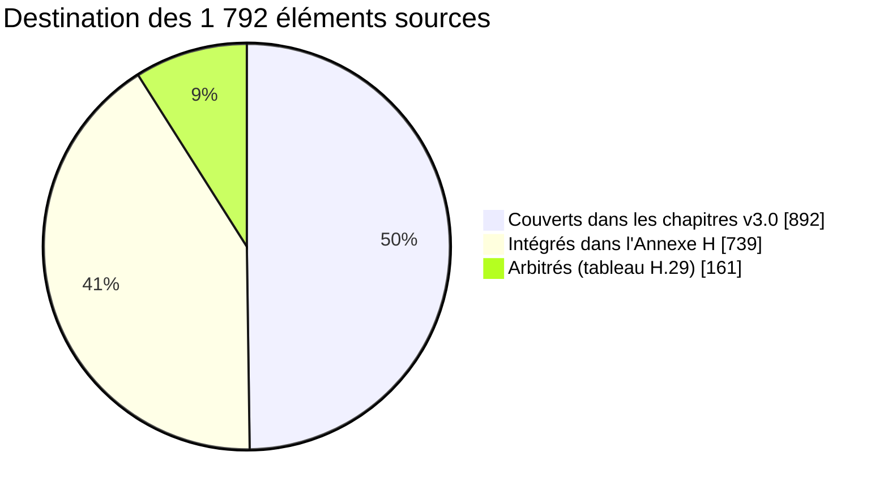

### H.1.3 Couverture par section du Cahier v2.9

Les sections à fort taux « I » sont celles que la v3.0 avait renvoyées au Cahier comme « référence détaillée » (Annexe D.1) : verticales, titres, paiement assisté, sous-traitance, invitations, multi-entités, CALCU.

| Section C | Élém. | C | I | A | Section C | Élém. | C | I | A |
|---|---|---|---|---|---|---|---|---|---|
| En-tête | 9 | 9 | 0 | 0 | § 19 | 5 | 5 | 0 | 0 |
| Note de consolidation | 27 | 12 | 9 | 6 | § 19A | 51 | 4 | 46 | 1 |
| Note exécutive intégrée | 28 | 19 | 4 | 5 | § 20 | 13 | 9 | 4 | 0 |
| § 1 | 17 | 14 | 2 | 1 | § 21 | 11 | 8 | 2 | 1 |
| § 2 | 7 | 6 | 1 | 0 | § 22 | 3 | 3 | 0 | 0 |
| § 3 | 13 | 13 | 0 | 0 | § 23 | 22 | 20 | 2 | 0 |
| § 4 | 8 | 8 | 0 | 0 | § 24 | 8 | 6 | 2 | 0 |
| § 5 | 10 | 8 | 0 | 2 | § 25 | 5 | 4 | 1 | 0 |
| § 6 | 32 | 24 | 4 | 4 | § 26 | 19 | 14 | 3 | 2 |
| § 7 | 23 | 20 | 1 | 2 | § 27 | 12 | 8 | 1 | 3 |
| § 8 | 31 | 29 | 2 | 0 | § 27A | 19 | 1 | 17 | 1 |
| § 9 | 24 | 21 | 2 | 1 | § 28 | 26 | 18 | 4 | 4 |
| § 10 | 8 | 8 | 0 | 0 | § 29 | 43 | 25 | 16 | 2 |
| § 10A | 24 | 10 | 14 | 0 | § 30 | 79 | 20 | 57 | 2 |
| § 11 | 30 | 22 | 6 | 2 | § 31 | 14 | 13 | 1 | 0 |
| § 11A | 28 | 3 | 23 | 2 | § 32 | 8 | 8 | 0 | 0 |
| § 11B | 15 | 3 | 12 | 0 | § 33 | 7 | 6 | 0 | 1 |
| § 11C | 13 | 2 | 8 | 3 | § 34 | 22 | 8 | 8 | 6 |
| § 11D | 33 | 3 | 25 | 5 | § 35 | 9 | 2 | 7 | 0 |
| § 12 | 58 | 42 | 14 | 2 | § 36 | 15 | 9 | 5 | 1 |
| § 12A | 43 | 6 | 35 | 2 | § 37 | 7 | 4 | 1 | 2 |
| § 13 | 8 | 6 | 1 | 1 | § 37A | 38 | 2 | 6 | 30 |
| § 13A | 27 | 8 | 18 | 1 | § 38 | 14 | 9 | 3 | 2 |
| § 14 | 8 | 8 | 0 | 0 | § 39 | 17 | 6 | 10 | 1 |
| § 15 | 17 | 11 | 5 | 1 | § 40 | 17 | 9 | 6 | 2 |
| § 15A | 27 | 5 | 20 | 2 | § 41 | 48 | 14 | 30 | 4 |
| § 16 | 33 | 25 | 6 | 2 | § 42 | 20 | 4 | 14 | 2 |
| § 17 | 18 | 13 | 3 | 2 | § 43 | 8 | 1 | 6 | 1 |
| § 18 | 35 | 27 | 5 | 3 | § 44 | 15 | 9 | 6 | 0 |
| § 18A | 37 | 8 | 28 | 1 | § 45 | 13 | 6 | 5 | 2 |
| Annexe A | 2 | 2 | 0 | 0 | § 46 | 8 | 5 | 3 | 0 |
| Annexe B (29 points) | 29 | 14 | 10 | 5 | § 47 | 12 | 6 | 4 | 2 |
| Annexe C | 1 | 1 | 0 | 0 | Annexe D | 3 | 1 | 1 | 1 |

### H.1.4 Couverture de la Spécification fonctionnelle et du Dossier Gouverneur

| Bloc | Élém. | C | I | A | Commentaire |
|---|---|---|---|---|---|
| SF — en-tête | 3 | 2 | 0 | 1 | « La SF prévaut sur… » : la v3.0 prévaut sur la SF (arbitrage ARB-47) |
| SF — Partie I, principes communs | 12 | 12 | 0 | 0 | Repris par les principes P1 à P14 (§ 3.4) |
| SF — Partie II, synthèse des releases | 17 | 6 | 0 | 11 | Releases réalignées sur le calendrier v3.0 (ARB-66) ; historique conservé au § H.28 |
| SF — modules 1 à 58 | 284 | 150 | 130 | 4 | Fonctions, contrôles, données, intégrations et indicateurs détaillés au § H.28 |
| SF — modules 59 à 81 | 100 | 25 | 65 | 10 | Idem ; module 73 requalifié (ARB-67) |
| SF — Partie V, verticales | 19 | 3 | 14 | 2 | § H.27 (17 verticales) |
| DG | 19 | 15 | 1 | 3 | Cinq piliers, seize verticales, feuille de route en « phases » = lots |
| NE | 4 | 2 | 0 | 2 | La ligne « Contrat : forfait et primes, aucun pourcentage » **fonde** la position v3.0 (§ 37) |

### H.1.5 Règles de réécriture appliquées aux éléments intégrés

| # | Règle | Effet sur le contenu repris des sources |
|---|---|---|
| RW1 | **L'agent constate, l'autorité décide** | Toute formulation source du type « pénalité appliquée », « blocage », « fourrière priorisée », « suspension automatique », « facturation automatique », « gel » est réécrite selon le circuit ci-dessous |
| RW2 | **Zéro espèce entre les mains des agents** | Les espèces ne sont reçues que par un point de paiement agréé et régulé (§ 18.2), avec règlement quotidien ; jamais par un agent public, un sous-traitant, un contrôleur, un placier, un vendeur non référencé |
| RW3 | **Aucune activation sans certification** | Chaque verticale et chaque tarif repris est une règle au statut `A_VERIFIER` ou `ACTE_REQUIS` jusqu'à certification (§ 6.12) |
| RW4 | **Chiffres marqués** | Les estimations des dossiers sectoriels (wewa, AVIA, stationnement, exemples financiers) portent [À VÉRIFIER] ou [EXEMPLE] |
| RW5 | **Calendrier v3.0** | Les releases citées sont celles de la v3.0 (R0 déc. 2026, R1 avril 2027, R2 oct. 2027, R3 mars 2028, R4 déc. 2028 — § 43) ; la release source est donnée pour mémoire |
| RW6 | **Aucun partage automatique de recettes** | Toute mention de la clé 10/10/10/70, de la « réserve de 10 % », des « deux flux de décaissement » ou de la « part de 10 % du ministère de tutelle » est remplacée par : clés **légales** de répartition (module 73), rémunération contractuelle des prestataires et sous-traitants **sur crédit budgétaire**, incitations des agents **uniquement si un texte les prévoit** (§ 27.2). **Complément du 27/09/2026** : la clé 10/10/10/70 du promoteur est conservée comme paramètre gouverné au statut « acte requis » (simulation seulement, décaissement après acte et double validation — § H.31) |

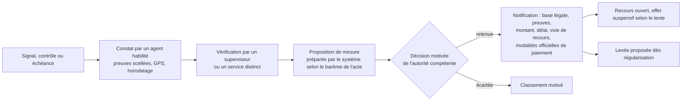

*Circuit unique de toute mesure défavorable (RW1), applicable à toutes les verticales de la présente annexe.*

## H.2 Chapitres 1 à 5 — Compléments « Décider »

### H.2.1 Les sept piliers de la note exécutive

La Note exécutive intégrée au Cahier présentait sept piliers ; le Dossier Gouverneur n'en retenait que cinq (sans « Verrouiller » ni « Encadrer l'IA »). La v3.0 les couvre tous, sous forme de principes et de chapitres :

| # | Pilier | Contenu source | Destination v3.0 |
|---|---|---|---|
| 1 | RECENSER — un compte MOSOLO | Un compte principal par personne ou organisation, relié aux rôles, biens, activités, véhicules, locations, autorisations et obligations | Ch. 9 ; P3 |
| 2 | LOCALISER — un SIG fiscal unique | Commune → quartier → avenue → parcelle → bâtiment → unité → activité ; identifiant géographique fiscal | Ch. 17 |
| 3 | CALCULER LÉGALEMENT | Moteur juridique ; aucune règle non versionnée, validée, approuvée, datée, auditable ; taux non confirmés jamais codés en dur | Ch. 6 ; P1, P2 |
| 4 | SÉCURISER LE FRANC PUBLIC | Référence unique → paiement → confirmation → règlement → rapprochement → comptabilisation → quittance vérifiable | Ch. 18 à 20 ; P5 |
| 5 | DÉCIDER AVEC LA PREUVE | Centre de commandement distinguant potentiel, assiette vérifiée, liquidé, exigible, impayé, payé, réglé, rapproché, comptabilisé | Ch. 26 ; § H.14 |
| 6 | VERROUILLER | Constitution financière : personne, y compris l'administrateur technique ou une autorité, ne détient seul les clés | § 12.6 ; P6, P7 |
| 7 | ENCADRER L'IA | L'IA détecte, explique, priorise, recommande ; elle ne crée ni taxe, ni dette finale, ni sanction, ni transfert | Ch. 23 ; P10 |

### H.2.2 Les huit résultats attendus (Cahier § 1)

| Résultat | Indicateur de résultat | Leviers | Destination v3.0 |
|---|---|---|---|
| Couverture | Registre géofiscal continu dans les communes pilotes | Recensement hors ligne, auto-enrôlement, recoupement partenaires | O1 ; ch. 17 |
| Assiette | Élargissement légal **sans nouvelle taxe** | Détection d'objets non enregistrés, régularisation volontaire, requalification contrôlée | Ch. 8 ; G01, G02 |
| Encaissement | Paiement électronique majoritaire | Monnaie mobile, banques, cartes, USSD, QR, points agréés | O4 ; ch. 18 |
| Traçabilité | Obligation → paiement → règlement → quittance → comptabilisation | Registre en ajout seul, signature, rapprochement quotidien | Ch. 20, 25 |
| Intégrité | Aucun acte financier sensible par une seule personne | Séparation, double validation, accès privilégié temporaire, journal immuable | § 12.6 |
| Service | Réduction du coût et du temps de conformité | Compte unique, déclaration pré-remplie, paiement mobile, quittance instantanée | Ch. 13 |
| Pilotage | Vision temps réel potentiel / constaté / encaissé / rapproché | Tableau du Gouverneur, cartes de chaleur, files d'exception | Ch. 26 |
| Affectation | Lien recettes ↔ réalisations | Recommandation d'affectation, tableau de transparence | Ch. 27 |

### H.2.3 Les trois décisions institutionnelles qui conditionnent la conception

| Décision ou fait | Conséquence de conception reprise | Statut |
|---|---|---|
| Quitus fiscal provincial 2026 (IF, IRL, véhicules le cas échéant ; condition des marchés publics et de certaines autorisations) | Module 82 ; conditionnalité par règle versionnée ; recours suspensif de l'effet bloquant | [À VÉRIFIER] acte instituant (J6) |
| Réforme des régies (projets DGRFK/DGTK examinés en mai 2026 ; arrêtés DGIPK/DGTK de 2026) | **L'administration compétente est une donnée de configuration**, jamais codée en dur | ARB-57 ; § 2.2 |
| Évaluation TADAT de septembre 2025 | Registre, télépaiement, contrôle interne, audit interne, prévision : chacun a son module et son indicateur | [CONFIRMÉ] pour le fait ; scores [À VÉRIFIER] |

### H.2.4 Objectifs stratégiques : cibles sources et cibles v3.0

| Objectif | Cible source (C § 5, § 39) | Cible v3.0 (ch. 5, 39) | Position |
|---|---|---|---|
| Couverture du recensement | > 80 % (pilotes, 18 mois) | ≥ 90 % des quartiers pilotes à J+180 | v3.0 (plus exigeante, périmètre plus restreint) |
| Part électronique | « Dominante » 18 mois après le pilote ; > 90 % à 18 mois | > 80 % dans les flux couverts 18 mois après le pilote | v3.0 (ARB-40) |
| Paiement → quittance | < 1 minute (médiane < 60 s) | < 60 s pour la quittance provisoire | Identique |
| Paiement → rapprochement | < 24 heures | < 24 heures ouvrées ; ≥ 95 % automatique à J+1 | v3.0 |
| Écart de rapprochement | < 1 % à J+2 | < 1 % à J+3 (O7) | v3.0 ; l'indicateur J+2 est conservé en suivi (§ H.19) |
| Régularisation après notification | > 50 % | — | **Intégré** comme indicateur de suivi (§ H.19) |
| Recours dans le délai légal | > 90 % | Délai légal | Identique en substance |
| Baux enregistrés | Croissance continue publiée mensuellement | — | **Intégré** (§ H.19) |

## H.3 Chapitres 6 à 8 — Compléments « Le droit et l'argent »

### H.3.1 Cycle de vie des règles : les quatre contrôles

Le Cahier exigeait quatre contrôles avant l'entrée en vigueur d'une règle — **juridique, fiscal, financier, publication par une autorité distincte** — et décrivait deux cycles de vie concurrents (ARB-36). La v3.0 retient la machine à états unique du § 6.12 et quatre personnes distinctes. Le **contrôle fiscal** est intégré ainsi :

| Contrôle source | Traitement v3.0 | Pièce exigée |
|---|---|---|
| Juridique | État `REVUE_JURIDIQUE`, visa du juriste vérificateur (R14) | Pièce officielle hachée ; cas de tests juridiques |
| **Fiscal** | Pièce obligatoire jointe au dossier de `REVUE_JURIDIQUE`, produite par le service d'assiette de la régie administrante | **Rapport de simulation sur échantillon réel** (module 26 : « simulation sur échantillon avant publication ») : nombre de redevables touchés, montants, écarts avec l'exercice précédent, cas limites |
| Financier | État `REVUE_FINANCIERE`, visa du validateur financier (R15) | Compte bénéficiaire (alias du coffre), cohérence budgétaire |
| Publication | État `PUBLIEE` par l'autorité de publication (R16), distincte des trois précédents | Acte de publication |

Exigences complémentaires reprises : **code de recette stable et non réutilisable** (déjà porté par `RevenueType.code`, § 29.3) ; conservation de la version appliquée à chaque liquidation ; une règle expirée ne produit aucune nouvelle obligation (AC-LEG-05, § H.21) ; anciennes références et anciens taux enregistrés au statut `A_VERIFIER`, donc **désactivés dans le moteur** tant qu'ils ne sont pas validés pour l'exercice.

### H.3.2 Les 29 points de vérification du Cahier (Annexe B) et leur rattachement

Les points J1 à J16 du § 6.13 couvrent une partie des 29 points de l'Annexe B du Cahier. Les autres sont intégrés ci-dessous sous les numéros **J17 à J30**, avec le même formalisme (autorité, hypothèse intérimaire sûre, verrou technique).

| Point Annexe B (C) | Objet | Rattachement v3.0 |
|---|---|---|
| 1 | Texte consolidé de la nomenclature et des OL de 1969 | J1 |
| 2 | Objet et statut de la Loi n° 18/014 | J2 |
| 3 | Arrêtés des taux IF, IRL, véhicules de l'exercice | J3 |
| 4 | Texte intégral de l'édit budgétaire | J3 |
| 5 | Code du numérique : résidence, signature, protection | J7, J8 ; § 33 |
| 6 | Habilitation des agrégateurs et prestataires (BCC) | J9 |
| 7 | Textes DGRFK/DGTK et compétences | J5 |
| 8 | Régime des primes des agents | J10 |
| 9 | Valeur de la quittance « en attente de règlement » et délai maximal de bascule | J7 + **J17** |
| 10 | Base légale des verticales ports/fluvial et AVIA | **J30** et J23 |
| 11 | Rémunération du prestataire indexée sur les recettes additionnelles nettes | J11 (modèle hybride, § 37.3) |
| 12 | Valeur du consentement par empreinte, voix ou témoin ; régime de capture de l'empreinte | **J18** |
| 13 | Délégation à des sous-traitants privés (recensement, enrôlement, constats) | **J19** |
| 14 | Encaissement pour compte de la Ville par agents de monnaie mobile et guichets bancaires ; commission | J9 + **J20** |
| 15 | Obligations de protection des données des sous-traitants | J8 + **J19** |
| 16 | Valeur juridique des titres dématérialisés ; acte par module | **J21** |
| 17 | Compétences province / communes / opérateurs pour les services partagés ; arbitrage opposable | **J22** |
| 18 | Acte instituant la clé 10/10/10/70 ; compatibilité LOFIP | J11 — **sans objet** (modèle écarté, ARB-01) |
| 19 | Application de la clé aux parts ETD et du pouvoir central | J1 — seules les clés **légales** sont paramétrées (module 73) |
| 20 | Contrat de 30 ans rémunéré par une part des recettes | J11 — **sans objet** (ARB-10) |
| 21 | Convention tripartite ; traitement fiscal des sommes versées | J11 — sans objet pour la convention ; traitement fiscal des primes éventuelles des agents : J10 |
| 22 | Financement des moyens physiques ; frais USSD, SVI, SMS | Décision n° 10 (ch. 47) + **J29** |
| 23 | Mesures AVIA (non-validation, pénalités, suspension, retrait d'agrément) ; compétences Ville/RVA/DGM/aviation civile | **J23** |
| 24 | Clé spécifique AVIA | J11 — sans objet (ARB-07) |
| 25 | Affectation des recettes de stationnement ; zones payantes ; surréservation ; fourrière | **J24** |
| 26 | Vendeur d'opérateur délégué comme point agréé ; base légale de la taxe journalière des transports | **J25** |
| 27 | Texte CALCU (déclaration obligatoire des comptes, transmission bancaire, preuve, responsabilité, secret bancaire) | **J26** |
| 28 | Acte NFIU (immatriculation obligatoire, interdiction de mise en bail d'un bien non immatriculé) | **J27** |
| 29 | Pass wewa : base légale, redevable, tarif, articulation, supports, coopératives, pouvoirs de contrôle | **J28** |

| # | Question | Autorité responsable | Hypothèse intérimaire sûre | Verrou technique |
|---|---|---|---|---|
| J17 | Délai maximal entre quittance provisoire et quittance définitive ; effet d'un règlement non constaté | Services juridiques ; Trésor | Délai de conception : J+2 ouvrés, puis exception « règlement manquant » ; le contribuable de bonne foi n'est jamais privé de ses droits (§ 18.6) | Paramètre `receipt_finalization_max_delay` certifié ; tant qu'il ne l'est pas, la quittance provisoire porte la mention « en attente de règlement » sans date d'échéance |
| J18 | Valeur du consentement par empreinte, enregistrement vocal ou témoin ; régime de la donnée biométrique | Services juridiques ; autorité (intérimaire) de protection des données | Consentement par enregistrement vocal ou témoin identifié ; empreinte seulement comme **marque** de consentement, jamais comme identifiant de recherche | Capture d'empreinte désactivée tant que J18 n'est pas certifié ; image chiffrée liée au seul acte de consentement, jamais indexée ni comparée |
| J19 | Délégation de missions de recensement, d'enrôlement et de constat à des sous-traitants privés ; obligations de protection des données | Services juridiques ; Fonction publique ; régies | Les sous-traitants **observent et documentent** (statut probant OBSERVÉ) ; tout procès-verbal, notification légale ou constat opposable est validé et signé par un agent public habilité | Rôle « agent sous-traitant » sans permission de signature d'acte ; convention de sous-traitance de données obligatoire avant activation du lot |
| J20 | Encaissement pour compte de la Ville par des agents de monnaie mobile et des guichets bancaires ; régime de la commission | Finances ; BCC ; Trésor | Seuls des établissements régulés, sous convention, encaissent ; la commission n'est jamais déduite du montant dû (§ 20.1) | Point de paiement non activable sans convention signée et agrément vérifié |
| J21 | Valeur juridique des titres dématérialisés (ticket, vignette, droit d'étal, pass) ; acte par module | Services juridiques ; entité responsable du module | Titre dématérialisé doublé d'une preuve imprimable ou SMS vérifiable | Type de titre non activable sans référence d'acte dans la fiche de configuration du module |
| J22 | Compétences province / communes / opérateurs délégués pour les services partagés ; opposabilité de l'arbitrage | Services juridiques ; Comité juridique et tarifaire | Une seule revendication par fait générateur ; la seconde est bloquée et arbitrée (§ 10.3) | Blocage automatique de la seconde obligation ; aucune exposition au citoyen |
| J23 | Mesures AVIA ; compétences respectives de la Ville, de la RVA, de la DGM et de l'aviation civile | Gouvernement provincial ; autorités aéroportuaires et migratoires | Rapprochement **informatif** ; aucune mesure contraignante | Mesures non paramétrables sans arrêté certifié |
| J24 | Zonage et tarifs du stationnement ; surréservation ; fourrière ; affectation des recettes | Ministère provincial des Transports ; Finances ; juridique | Stationnement payant uniquement dans les zones délimitées par acte ; surréservation désactivée ; affectation = engagement de programmation publié | Règles `ACTE_REQUIS` ; option de surréservation non activable |
| J25 | Vendeurs d'opérateurs délégués comme points agréés ; base légale de la taxe journalière des transports | Finances ; BCC ; Transports | Vente en espèces uniquement par points agréés régulés ; taxe journalière non liquidée avant certification | Canal « vendeur délégué » désactivé sans agrément ; règle `ACTE_REQUIS` |
| J26 | Texte CALCU : déclaration obligatoire des comptes publics, transmission bancaire, valeur de la preuve numérique, responsabilité des gestionnaires, secret bancaire | Gouvernement provincial ; ministère national des Finances ; BCC | Déclaration volontaire des entités pilotes ; aucune transmission bancaire sans convention | Connecteurs bancaires CALCU désactivés sans texte et convention |
| J27 | Acte NFIU : immatriculation fiscale obligatoire, reconnaissance du QR, interdiction de mise en bail d'un bien non immatriculé | Assemblée provinciale ou Gouvernement provincial | Plaque posée à titre d'identification administrative, sans effet restrictif | Aucune restriction de location appliquée par le système |
| J28 | Pass wewa : base légale, redevable, tarif, articulation avec vignette, autorisation de transport et prélèvements communaux, statut des gilets et autocollants, rôle des coopératives, pouvoirs de contrôle | Ministère provincial des Transports ; Finances ; communes | Enregistrement gratuit des motos et conducteurs (recensement) ; aucun pass payant ni contrôle avant acte | Règle du pass `ACTE_REQUIS` ; période de grâce paramétrable |
| J29 | Financement des moyens physiques ; prise en charge des frais d'USSD, de SVI et de SMS « gratuits pour l'appelant » | Gouvernement provincial ; opérateurs ; partenaires | Conventions avec les opérateurs (numéros verts, codes courts) financées sur le budget du programme | Canal gratuit non annoncé au public tant que la convention n'est pas signée |
| J30 | Base légale et cadrage sectoriel des verticales ports et fluvial | Transports ; autorités portuaires ; régies | Recensement des embarcations et quais sans liquidation | Modules 13 et 24 non activables avant certification |

### H.3.3 Les sept points juridiques du Cahier (§ 6.4)

| Point | Autorité | Risque si non tranché | v3.0 |
|---|---|---|---|
| Statut consolidé des textes après l'OL 18/004 | Service juridique | Texte abrogé appliqué | J1 |
| Taux IRL et retenue par rang | Ministère provincial des Finances | Contentieux de masse | J3 ; § 6.4 |
| Valeur de la quittance électronique et de la signature | Services juridiques ; Code du numérique | Preuve contestée | J7, J17 |
| Base légale des échéanciers par monnaie mobile | Assemblée provinciale ou arrêté | Pas de paiement fractionné | J14 ; module 83 |
| Partage des données énergie, eau, opérateurs | Autorité de protection des données | Blocage du recoupement | J13 |
| Régime des incitations de performance des agents | LOFIP, édit, arrêté | Rémunération irrégulière | J10 |
| Habilitation des agrégateurs de paiement | BCC | Canal illégal | J9 |

### H.3.4 Reprise de l'existant et inventaire de référence

| Exigence source | Traitement v3.0 |
|---|---|
| « MOSOLO reprend les comptes et l'historique d'e-DGRK dès le premier jour ; aucun système parallèle » (C § 7.5) | Remplacé par l'intégration ou la migration de la **plateforme de déclaration lancée en mars 2026** (§ 2.2, phase 1) ; l'exigence de fond est conservée : **import par lots** des comptes et de l'historique (module 2, « enrôlement par lots »), avec rapprochement anti-doublon et statut probant « importé — source régie » ; un seul système de référence par recette (R15) |
| Inventaire de référence : mode de perception, canal, compte, volumétrie, coût, déperdition, données disponibles, dépendances | Couvert (§ 7.5), complété par l'attribut **« dépendances »** (règles ou services conditionnant la recette, par exemple quitus ou vignette) |
| Taux budgétaire moyen 2025 de **2 859,2 CDF/USD** ; cours BCC de **2 267,75 CDF/USD le 22 septembre 2026** | [À VÉRIFIER] ; seul le taux désigné par la règle certifiée s'applique (module 89) ; tout scénario libellé en USD indique son taux (§ 38.3) |

### H.3.5 Moteur de recoupement : compléments

Chaque règle de recoupement produit une **liste de travail priorisée**, jamais un avis d'imposition (§ 8.4). Deux signaux sources sont ajoutés au tableau du § 8.4 :

| Signal | Règle | Sortie (jamais une dette) |
|---|---|---|
| Immeuble multi-unités déclaré vacant, baux expirés, loyers atypiques, doublons | Incohérence répétée | Examen humain, puis mission autorisée |
| Entreprise demandant une autorisation provinciale | Pas de quitus valide | Service suspendu jusqu'à régularisation **seulement si l'acte de conditionnalité le prévoit** (J6) ; sinon simple information |

## H.4 Chapitres 9 et 10 — Compte unique et architecture multi-entités

### H.4.1 Compléments au compte unique

| Exigence source | Détail intégré | Module |
|---|---|---|
| Vérification proportionnée au risque, inscription progressive | Le niveau exigé dépend de l'opération (consultation N0 ; déclaration N1 ; objet de forte valeur N2 ; mandat de tiers et quitus N3) | 1, 2 |
| Score de confiance par pièce | Chaque pièce reçoit un score (lecture automatique, OCR, cohérence) ; en dessous du seuil, revue humaine | 2 |
| Enrôlement par lots | Import de registres existants (plateforme de la régie, registres partenaires sous protocole) avec anti-doublon et statut probant de la source | 2 |
| Identifiants alternatifs et récupération contrôlée | Récupération par téléphone, pièce, guichet ; contrôle renforcé et vérification hors bande pour N2–N3 (§ 9.7) | 1 |
| Journalisation des modifications d'identité sensibles | Toute modification de nom, pièce, NIF, date de naissance produit un événement d'audit et une notification au titulaire | 1 |
| Personnes morales | NIF + RCCM + mandataires **nommément habilités** ; séparation des droits préparer / valider / payer (§ 13.7) | 1 |
| Séparation profil contribuable / profil de travail | Une même personne physique peut être contribuable et agent public : deux profils distincts rattachés à la même identité, **sans croisement** ; l'agent ne peut traiter ni son propre dossier ni celui de ses proches déclarés (module 91) | 1, 74, 91 |
| Session courte sur appareil partagé | Portail et application : verrouillage automatique, déconnexion rapide sur appareil déclaré partagé | 3, 4 |

### H.4.2 Architecture multi-entités (Cahier § 10A)

**Principe : socle commun, espaces propres.** Le citoyen voit un seul compte ; chaque entité ne voit que ce que la loi lui attribue. **Chaque objet, règle, titre, paiement et événement porte l'identifiant de l'entité responsable** (`entity_scope`, § 29.1) ; le cloisonnement est appliqué par le système (filtre par entité et par attributs), jamais par simple consigne.

| Type d'entité | Place dans MOSOLO | Garde-fous spécifiques |
|---|---|---|
| Régies (DGIPK, DGTK, successeurs éventuels) | Administration compétente paramétrée par recette | Aucune régie ne voit les dossiers d'une autre |
| Ministères provinciaux | Accès par attributs aux modules rattachés | Aucune donnée hors compétence |
| Communes et ETD | Espace distinct (module 95), clés légales de répartition, refus des doublons, arbitrage | Pas de liquidation de recettes communales par la province |
| Services techniques (voirie, transport, environnement, urbanisme) | Autorisations conditionnées au quitus lorsqu'une règle l'exige | Vérification oui/non par API (R37) |
| Opérateurs délégués (stationnement, marchés, ports, gares routières, péages) | Émettent des titres **exclusivement via MOSOLO** ; encaissement uniquement par points agréés, reversement direct au compte public, rapprochement | Un titre non émis par MOSOLO n'a aucune valeur (R30, § H.20) |
| Pouvoir central | Nomenclature OL 18/003 servant à exclure les doubles impositions | Aucune liquidation |
| Banques et prestataires de paiement | Contrats, délais, pénalités (module 88) | Aucun accès aux données fiscales au-delà de la référence |
| Sous-traitants terrain | Lots, équipes accréditées, contrôle qualité indépendant (§ H.8) | Aucun encaissement ; aucune auto-validation |
| Partenaires de données | Protocoles signés, minimisation | Connecteurs désactivés sans protocole (J13) |
| Citoyens et entreprises | Compte unique, preuve, recours | — |
| Audit, inspection, société civile | Lecture indépendante, journal inaltérable | Aucune modification possible |

| Relève du socle commun | Relève de l'espace de chaque entité |
|---|---|
| Identité et compte unique | Recettes, règles et tarifs de sa compétence |
| Cadastre fiscal et identifiants géofiscaux | Workflows, circuits d'approbation, délais de service |
| Registre juridique et moteur de liquidation | Agents, équipes, sous-traitants, missions |
| Orchestration des paiements, grand livre, rapprochement | Comptes publics bénéficiaires propres, verrouillés dans le coffre |
| Moteur de titres et de preuves (§ H.11) | Types de titres, modèles de QR, règles de validité |
| Audit, sécurité, journal | Tableaux de bord de l'entité |
| Notifications, SVI, USSD, SMS | Modèles de messages et calendrier de campagnes (charte de l'entité, § 11.4.6) |

**Règles de coexistence complémentaires** (en plus du § 10.3) :

1. **Accords de niveau de service inter-entités** (instruction d'une demande, reversement d'une part légale, réponse à une vérification de quitus) : délais paramétrés, suivis et publiés au tableau des ministères (module 44) et au Comité de pilotage.
2. **Transparence de chaque obligation et de chaque titre** : le citoyen voit l'entité responsable, la base légale et la voie de recours.
3. **Échanges inter-entités par API contractualisées** uniquement (module 52), journalisés.

### H.4.3 Fiche de configuration de module

L'ajout d'un service ou d'une entité se fait **sans redéveloppement**, par une fiche de configuration validée en maker-checker par le programme, le juridique et l'entité, testée en environnement de recette, puis activée après seconde validation.

| Rubrique de la fiche | Contenu | Contrôle |
|---|---|---|
| Entité responsable | Administration, responsable de module, comptes bénéficiaires (alias du coffre) | Une seule entité responsable à un instant donné |
| Types d'objets | Catégories du référentiel (module 86) | Existence dans le référentiel |
| Règles | Références aux fiches de règles (§ 6.12) | Règles au statut `ACTIVE` uniquement pour l'activation |
| Types de titres et de preuves | Catalogue § H.11.4 | Référence d'acte (J21) |
| Modèle de validité | Horaire, journalier, hebdomadaire, mensuel, annuel, par usage, par événement, abonnement, conditionnel | § H.11.3 |
| Mécanismes de preuve | QR dynamique ou statique, plaque, vignette, SMS, carte, reçu imprimé, lecture automatique de plaque (LPR) | — |
| Règles d'usage | Unique ou multiple, zone, transférabilité (défaut : non transférable), tolérance, prolongation, remboursement | — |
| Canaux | Application, USSD, SVI, guichet, point de paiement agréé, agent (sans encaissement), terminal | Canal de paiement activé seulement sur agrément (J9) |
| Workflows terrain | Missions, constats, contrôles | Circuit RW1 pour toute mesure défavorable |
| Tableaux de bord | Indicateurs du module | — |
| Dépendances | Conditions inter-entités (quitus, vignette) | Règles versionnées visibles du citoyen |

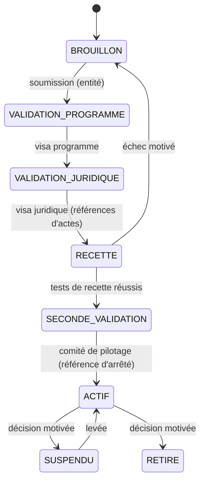

Critère d'acceptation (AC-ENT-02, § H.21) : aucun module n'est activé sans fiche approuvée et recette réussie ; deux entités revendiquant le même fait générateur, le même objet et la même période → la seconde obligation est bloquée, un dossier d'arbitrage est ouvert, **aucune double obligation n'est exposée au citoyen** (AC-LEG-04).

## H.5 Chapitre 11 — Catalogue des modules et verticales

### H.5.1 Correspondance avec le plan directeur KIN-RECETTES (M01 à M20)

| KIN-RECETTES | Fonction | Modules MOSOLO |
|---|---|---|
| M01 | Identité et enrôlement | 1, 2 |
| M02 | Relations contribuable–objet | 7 |
| M03 | Cadastre et SIG | 8 |
| M04 | Registre des règles | 26 |
| M05 | Liquidation | 27 |
| M06 | Facturation publique, échéances, acomptes autorisés | 27, 32 (échéanciers : 83) |
| M07 | Paiements | 28 |
| M08 | Rapprochement et grand livre | 30, 59 |
| M09 | Quittances | 31 |
| M10 | Terrain, inspection, équipements | 34, 35, 58 |
| M11 | Arriérés et recouvrement | 32, 33 |
| M12 | Recours | 37 |
| M13 | Anti-fraude | 40 |
| M14 | Tableaux de bord | 41 à 45 |
| M15 | Audit | 46 |
| M16 | Accès | 51, 74 |
| M17 | API | 52 |
| M18 | Notifications (SMS, push, courriel, WhatsApp autorisé) | 39 (§ 11.4) |
| M19 | Pièces, OCR, signature | 38 |
| M20 | Communes, zones, calendriers, devises, langues | 53, 72, 85, 86, 89 |

### H.5.2 Réalignement des releases et requalification du module 73

Les releases de la Spécification fonctionnelle (R1 à R4, où R1 regroupait V0.1, V0.5 et V1.0) ne correspondent pas au calendrier v3.0 (R0 à R4, § 43). **Les releases v3.0 prévalent** (ARB-66) ; le § H.28 donne pour chaque module la release source et la release v3.0. Le **module 73** passe de « Répartition des recettes (clé 10/10/10/70, deux flux de décaissement) » à « **Répartition légale des recettes** » : calcul, sur recettes rapprochées, des seules parts prévues par un texte (province, ETD, pouvoir central le cas échéant), sans aucun flux vers un compte privé (ARB-67).

### H.5.3 Les dix-sept verticales : composition réconciliée

Le Cahier listait 17 verticales, la Spécification en annonçait 16 et en décrivait 17, le Dossier Gouverneur en comptait 16 (sans billetterie), la v3.0 en présente 15 (Markets et Public Domain fusionnés, billetterie absente). **L'Annexe H retient les 17 verticales** avec la composition suivante (union des sources, modules 82 à 95 ajoutés lorsque pertinents) ; le détail figure au § H.27.

| # | Verticale | C § 11.1 | SF Partie V | v3.0 § 11.3 | Composition retenue |
|---|---|---|---|---|---|
| 1 | Property | 7, 8, 9 | 7, 8, 9, 79 | 7, 8, 9, 79 | 7, 8, 9, 34, 79, 82 |
| 2 | Rental | 9 | 9, 79 | 9 | 9, 79, 61 |
| 3 | Business | 10, 17, 56 | 10, 17, 56 | 10, 17, 56 | 10, 17, 56 |
| 4 | Mobility | 11, 12, 25 | 11, 12, 25, 76 | 11, 12, 13, 25, 81 | 11, 12, 25, 76, 82 |
| 5 | Parking (ParkSmart) | 14, 75 | 14, 75, 76 | 14, 75 | 14, 70, 71, 75, 76 |
| 6 | Advertising (KIN PUB CONTROL) | 15, 77 | 15, 77 | 15, 77 | 15, 35, 77 |
| 7 | Telecom | 16 | 16, 56 | 16 | 16, 56 |
| 8 | Markets | 20 | 20, 76 | 20 | 20, 70, 71, 76 |
| 9 | Public Domain | 19, 20 | 19, 20 | (fusionné) | 19, 20, 70 |
| 10 | Environment | 18, 19 | 18, 19 | 18, 19 | 18, 19, 92 |
| 11 | Ports | 13, 24 | 13, 24 | 13, 24 | 13, 24, 70, 71 |
| 12 | AVIA (KIN-AVIA FISCUS) | 62, 78 | 62, 78 | 62, 78 | 62, 78, 52 |
| 13 | Events | 21 | 21, 76 | 21 | 21, 70, 76 |
| 14 | Construction | 22 | 19, 22 | 22, 82 | 19, 22, 82 |
| 15 | Assets | 48, 61 | 48, 61 | 61, 92 | 48, 61, 92 |
| 16 | Billetterie et moto-taxis (RakaPay, wewa) | 12, 14, 20, 25, 76, 81 | idem | (absente) | 12, 14, 20, 25, 66, 70, 71, 76, 81 |
| 17 | Recovery | 32, 33, 36 | 32, 33, 36 | 32, 33, 36, 83, 90 | 32, 33, 36, 83, 90 |

Règle commune rappelée : **aucune verticale ne possède son propre compte contribuable, ses propres règles hors registre ni son propre circuit de paiement.**

## H.6 Chapitre 12 — Rôles, impossibilités et invitations en cascade

### H.6.1 Rôles des canaux assistés, du paiement et de la sous-traitance

| Rôle | Peut | Ne peut jamais |
|---|---|---|
| Responsable de module (IRL, IF, publicité, marchés, stationnement, véhicules, domaine public, ports…) | Créer et gérer ses équipes internes ; affecter zones et missions à des agents ou sous-traitants accrédités ; suivre la qualité ; suspendre un agent à titre conservatoire (décision motivée) | Valider seul les constats de ses équipes sans contrôle qualité ; toucher des fonds ; créer une dette hors règle |
| Sous-traitant accrédité (responsable) | Inviter ses agents et les proposer à l'habilitation ; répartir les missions de son lot ; suivre sa production | Recevoir un paiement de contribuable ; voir des données hors mission ; **habiliter lui-même un agent** ; valider ses propres résultats |
| Superviseur du sous-traitant | Répartir, encadrer, relire les constats avant soumission | Mêmes interdictions que le sous-traitant |
| Agent d'enrôlement assisté | Créer un compte assisté ; recueillir le consentement ; remettre la carte MOSOLO ; générer une **référence** de paiement | Encaisser ; modifier un montant ; enrôler hors de sa zone ou de son horaire |
| Point de paiement agréé (banque, agent de monnaie mobile, guichet bancaire, TPE d'un prestataire habilité) | Voir la référence et le montant ; encaisser vers le compte public ; imprimer ou transmettre la preuve | Modifier le montant ; encaisser sans référence ; conserver les fonds au-delà du délai contractuel |
| Opérateur de la ligne de signalement | Enregistrer, qualifier, transmettre à l'enquêteur | Révéler l'identité du signalant |
| Présidence ou autorité nationale | Vue macro ; demande de rapport ou d'audit | Toute mutation |
| Comité financier restreint | Quorum sur les opérations les plus sensibles (coffre) | Agir hors quorum |

### H.6.2 Règle des impossibilités

| Combinaison interdite | Mécanisme qui la rend impossible |
|---|---|
| Créer puis publier une règle | Quatre personnes distinctes (§ 6.12) ; métiers distincts |
| Liquider puis annuler la même dette | Rôles incompatibles (§ 12.5) |
| Changer un bénéficiaire puis exécuter un paiement | Quorum, délai de refroidissement de 72 h, vérification bancaire indépendante (§ 12.6) |
| Créer un compte d'agent puis lui attribuer des pouvoirs élevés | Gestionnaire d'identité distinct + approbation de la sécurité |
| Effacer ou réécrire l'audit | Ajout seul, scellement, copie WORM indépendante |
| Approuver sa propre exception | Détection des conflits d'intérêts ; auto-validation techniquement impossible |
| Télécharger massivement sans justification | Accès limité, motif obligatoire, prévention des fuites, alerte |

**Contrôle des accès privilégiés — compléments** : comptes nominatifs, **comptes partagés interdits** (et supprimés dans les 100 premiers jours, § H.25) ; approbation par deux personnes de **directions différentes** pour les opérations critiques ; sessions à haut risque enregistrées au niveau des commandes ; **revue mensuelle** des accès privilégiés (trimestrielle pour les autres) ; révocation automatique en fin d'affectation ; alerte sur export massif, connexion atypique, désactivation d'un contrôle, tentative refusée.

### H.6.3 Deux portes d'entrée

| Porte | Public | Canaux | Ce qu'elle crée |
|---|---|---|---|
| Publique | Citoyens, entreprises, diaspora, mandataires | Application, portail, USSD, SVI, guichet MOSOLO, enrôlement assisté | **Exclusivement** des comptes contribuables |
| Intervenants | Du Gouverneur à l'agent de terrain | Invitation nominative uniquement | Comptes de travail |

Règles : aucune route, aucun formulaire, aucun canal public ne crée un compte de travail ; **un compte contribuable n'est jamais transformable en compte de travail** ; une personne à la fois contribuable et agent dispose de deux profils distincts, sans croisement.

### H.6.4 Invitations en cascade

La v3.0 (§ 12.7) indique que le Comité de pilotage invite les responsables d'entité. Réconciliation (ARB-63) : **l'administrateur de la plateforme exécute techniquement les invitations de niveau 0 sur décision écrite du Comité de pilotage** ; les comptes sensibles restent inactifs jusqu'à la seconde validation.

| Niveau | Qui invite | Qui est invité | Périmètre attribuable |
|---|---|---|---|
| 0 | Administrateur de la plateforme, sur décision du Comité de pilotage | Gouverneur, Cabinet, Secrétariat général, ministres et administrateurs ministériels, directions de régie, communes, Trésor, audit et inspection, services techniques, opérateurs délégués, banques et points de paiement, partenaires API | Espace d'entité et modules rattachés |
| 1 | Administrateur ou responsable d'entité | Directions, services, responsables de module, superviseurs, agents internes, sous-traitants de ses modules | Son entité et ses modules |
| 2 | Responsable de module ou sous-traitant accrédité | Superviseurs et agents | Son module ou son lot |
| 3 | Superviseur (si délégation expresse) | Agents | Son équipe, sa zone, sa période |

Trois règles non négociables : **pas d'élévation** (niveau et périmètre accordés ≤ ceux de l'invitant ; l'administrateur de la plateforme fait exception mais reste soumis au § H.6.8) ; **pas de sortie de périmètre** ; **le droit d'inviter est une permission** explicite, délégable et révocable.

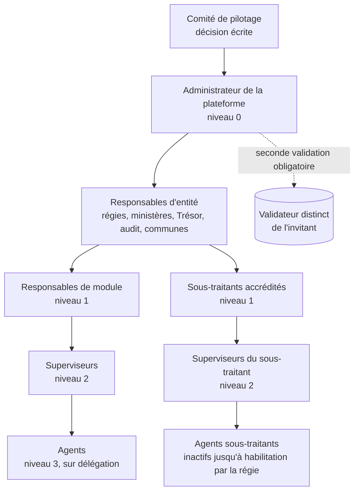

### H.6.5 Espaces d'entité et rattachement des modules

L'administrateur de la plateforme crée l'espace de chaque entité et y rattache les modules sur la base d'une fiche de configuration approuvée (par exemple : stationnement, autorisations de transport, embarquement → ministère des Transports ; patente, marchés → ministère de l'Économie). **Un module a une seule entité responsable à un instant donné** ; un partage en lecture est possible. **Tout rattachement ou changement de rattachement exige une seconde validation du Comité de pilotage sur référence de l'arrêté** ; l'historique est conservé. Le rattachement détermine les droits d'accès et le périmètre des tableaux ministériels (module 44) ; il **ne détermine aucune part de recettes** (ARB-05).

### H.6.6 Niveaux d'accès standard

Les niveaux ci-dessous sont ensuite restreints par attributs (territoire, module, dossier, période, appareil — § 12.1).

| Niveau | Capacités | Droit d'inviter |
|---|---|---|
| Consultation | Lecture des tableaux et dossiers du périmètre | Non |
| Agent de terrain | Missions, constats, enrôlement assisté, contrôle des titres | Non |
| Opérateur | Traitement des dossiers, déclarations, notifications | Non |
| Superviseur | Encadrement, affectation des missions, contrôle qualité | Sur délégation |
| Responsable de module | Pilotage du module, équipes, sous-traitants | Dans le module |
| Opérateur d'accès désigné | Inscription assistée des invités de son entité | Non, sauf délégation expresse |
| Administrateur d'entité | Comptes et rôles de l'entité (sans accès aux montants, R08) | Dans l'entité |
| Direction et exécutif | Vision, décisions, arbitrages | Dans l'entité |
| Audit et inspection | Lecture intégrale des preuves | Non (comptes créés par l'administrateur, validés par l'autorité d'audit) |
| Administration technique | Exploitation sans pouvoir fiscal ni financier | Selon § H.6.8 |

### H.6.7 Cycle de vie d'une invitation

| Étape | Exigence |
|---|---|
| Création | Champs : nom, téléphone, courriel le cas échéant, entité, niveau d'accès, périmètre, date de fin éventuelle, motif |
| Envoi | Lien + OTP par SMS ou courriel ; **durée limitée ; lié au numéro invité ; usage unique ; inopérant depuis un autre numéro** |
| Vérification | OTP, pièce d'identité, photo ; pour un agent de terrain : liaison à un terminal enrôlé (module 58) |
| Sécurisation | MFA ; clé d'accès résistante à l'hameçonnage (passkey) pour les rôles sensibles (§ 31.1) |
| Activation | Automatique pour les niveaux standard ; après habilitation par la régie pour les agents de terrain (certification, module 50) ; **après seconde validation par une personne distincte de l'invitant** pour les rôles sensibles : Gouverneur, Cabinet, ministres, Trésor et finances, juridique et publication des règles, audit, administrateurs d'entité, gestionnaires du coffre, **tout compte disposant du droit d'inviter** |
| Vie | Revue trimestrielle ; expiration automatique des accès temporaires ; changement de rôle = nouvelle validation ; suspension après 60 jours d'inactivité (§ 12.7) |
| Sortie | Révocation immédiate du compte et de ses terminaux ; la suspension d'une entité ou d'un sous-traitant révoque tous ses comptes ; le départ d'un responsable **ne révoque pas** ses invités (rattachés au successeur ou à l'administrateur d'entité) |

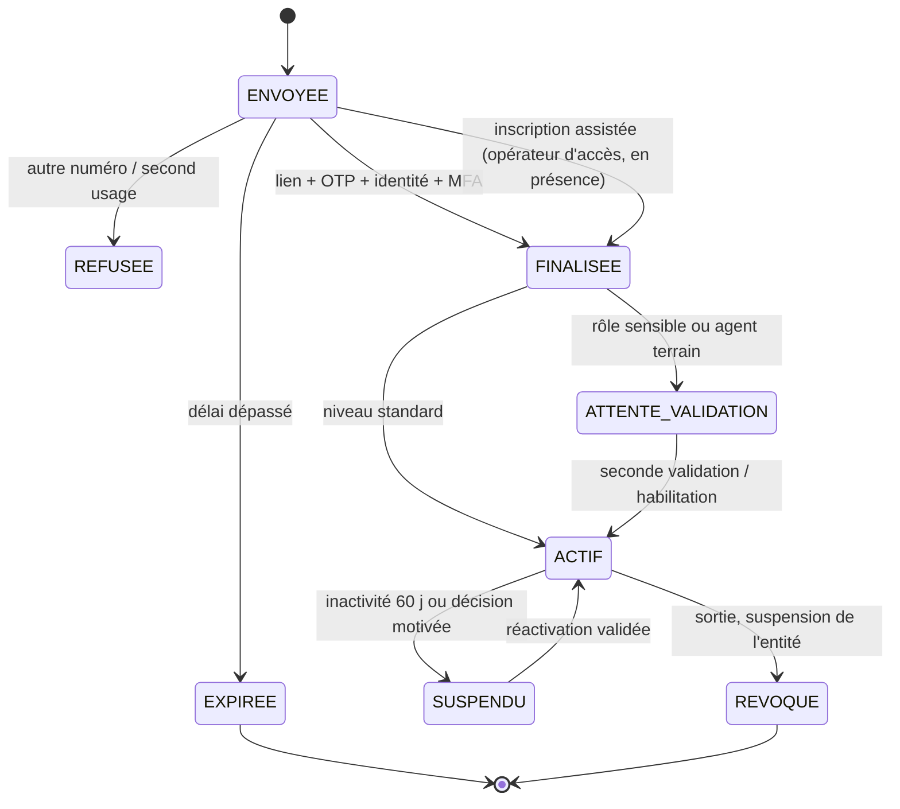

### H.6.8 Garde-fous de l'administrateur de la plateforme

- Il invite, crée les espaces, prépare les rattachements ; il **ne peut s'attribuer aucun rôle métier**, ni consulter de données fiscales individuelles, ni modifier une dette, un paiement, un compte bénéficiaire, une règle ou une piste d'audit (cohérent avec R26 et AC-ACC-01).
- Il ne peut activer seul aucun rôle sensible ; **le compte du Gouverneur est confirmé hors bande par le Cabinet ou le Secrétariat général**.
- Toute invitation, activation, modification ou révocation est journalisée et visible en temps réel par l'administrateur d'entité concerné et par l'audit.
- **Bris de glace** : réservé à l'exploitation technique ; motivé, limité dans le temps, enregistré, signalé immédiatement à l'audit et au Comité de sécurité (`auth.break_glass.used`).

### H.6.9 Inscription assistée par l'opérateur d'accès désigné

| Aspect | Exigence |
|---|---|
| Usage | Agents sans smartphone ni courriel, personnel peu familier du numérique, recrutements en nombre |
| Désignation | Invité et désigné par l'administrateur d'entité, avec la permission expresse « inscription assistée des intervenants », en seconde validation ; agit seulement pour son entité (et les modules ou sous-traitants confiés) |
| Portée | **Uniquement pour des personnes déjà invitées** ; ouvre l'invitation existante ; ne modifie ni le niveau ni le périmètre |
| Présence | En présence de la personne : pièce, photo, OTP reçu sur le téléphone de la personne ; à défaut, empreinte comme marque de consentement (si J18 certifié) ou témoin identifié |
| Secrets | L'opérateur ne connaît jamais les secrets (code, mot de passe, second facteur), définis par la personne ; il ne peut pas se connecter à sa place |
| Traçabilité | Chaque inscription est horodatée, géolocalisée, liée au terminal de l'opérateur, notifiée à la personne et à l'administrateur d'entité, visible par l'audit |
| Lots | Traitement par lots possible ; **jamais** de comptes génériques ou partagés |

Critères d'acceptation : voir AC-INV-01 à AC-INV-05 (§ H.21).

## H.7 Chapitre 13 — Parcours contribuables et enrôlement inclusif

### H.7.1 Principe et canaux

**Personne n'est exclu faute de téléphone, de connexion ou d'alphabétisation ; l'enrôlement est gratuit sur tous les canaux.**

| Canal | Public cible | Fonctions | Règles v3.0 applicables |
|---|---|---|---|
| Application mobile | Smartphone, connexion lente | Pictogrammes, audio, mode données réduites, portefeuille de titres | < 25 Mo (§ 31.2) |
| Portail web | Entreprises, diaspora, mandataires | Espace entreprise, télédéclaration, API grands redevables | WCAG 2.1 AA |
| USSD (code court gratuit) | Téléphone basique | Consultation, enrôlement simplifié, paiement sur référence | **Jamais de donnée sensible complète** à l'écran |
| SVI (numéro gratuit) | Personnes peu alphabétisées | Lingala, kikongo, tshiluba, kiswahili, français ; réponses par touches ; consultation par numéro de carte ou d'objet ; confirmation vocale | Module 64 |
| Assistant WhatsApp | Lingala et français | Rappel des obligations et **invitation à payer par le code USSD officiel ou l'application** | **Aucun lien de paiement, aucun montant nominatif, aucun avis obligatoire** (§ 11.4.4 ; ARB-64) |
| SMS | Tous | Confirmations, codes de quittance, rappels | < 160 caractères ; **jamais de lien de paiement** |
| Enrôlement assisté à domicile ou sur site | Personnes isolées | Agent + application terrain hors ligne | Aucun paiement reçu par l'agent |
| Guichet MOSOLO | Tous | Kiosque communal : agent d'accueil, poste d'enrôlement, **guichet bancaire partenaire** | Seul le guichet bancaire encaisse |
| Mandataire de confiance | Personnes dépendantes | Droits limités, révocables ; chaque acte notifié au mandant | Mandat N3 si tiers professionnel |

### H.7.2 Carte MOSOLO (module 65)

| Aspect | Exigence |
|---|---|
| Contenu | Gratuite ; numéro de contribuable (IUC), QR signé, photo, commune ; code court |
| Usages | Consultation de la situation au guichet, chez un point de paiement agréé ou auprès d'un agent ; titre rattaché au titulaire (§ H.11.5) |
| Perte ou vol | Blocage immédiat au guichet ou par SVI (y compris par un proche mandataire) ; réémission avec nouveau code **sous double validation** ; l'ancien QR affiche « carte révoquée » |
| Objets | Chaque objet conserve sa propre plaque QR (§ 16.8, § 17.3) ; la carte identifie la personne, la plaque identifie l'objet |
| États | `ACTIVE` → `BLOQUÉE` → `RÉVOQUÉE` ; `RÉÉMISE` (nouvelle carte liée) |

### H.7.3 Consentement sans écriture

1. Lecture à voix haute du résumé dans la langue choisie (audio pré-enregistré validé, § 11.5).
2. Consentement par **enregistrement vocal ou témoin identifié** ; empreinte digitale comme **marque de consentement** seulement si J18 est certifié ; l'empreinte **n'est jamais un identifiant biométrique de recherche** et relève du régime des données sensibles (C5).
3. Récapitulatif remis par SMS, appel vocal ou document imprimé.
4. **Impossible de terminer un enrôlement assisté sans lecture du résumé et consentement** ; toute tentative est journalisée.

### H.7.4 Faible alphabétisation et faible connectivité

| Exigence | Traduction |
|---|---|
| Pictogrammes normalisés | Un pictogramme par type d'objet et par action (payer, contester, vérifier), identique sur application, avis imprimé, plaque et guichet |
| Montants | En chiffres et à l'oral ; devise énoncée (§ 11.6.3) |
| Couleurs | Toujours doublées d'une forme ou d'un son (accessibilité, daltonisme) |
| Réseau | Fonctionnement en 2G, pages légères, reprise après coupure, **aucune étape bloquée par l'absence de réseau** |
| Notifications | Appel vocal, SMS, avis imprimé remis ou apposé sur la plaque (module 39) |

### H.7.5 Parcours d'une personne sans téléphone et illettrée

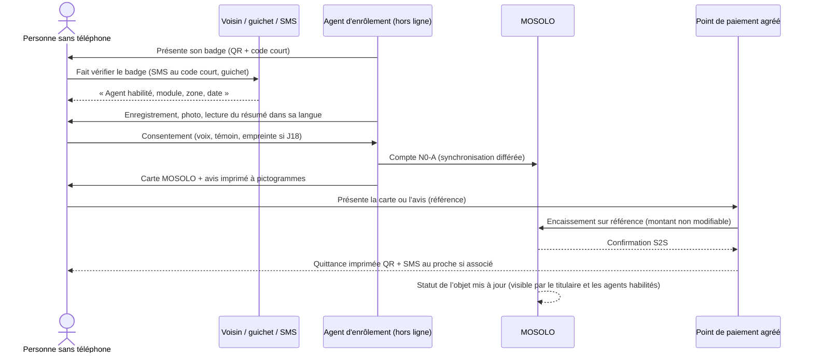

### H.7.6 Garanties et critère

- Aucun frais d'enrôlement ; USSD et SVI gratuits pour l'appelant (sous réserve de J29).
- Contestation possible à tout moment au guichet ou par SVI, **sans écrit**.
- Critère AC-INC-02 : une personne sans téléphone, enrôlée hors ligne, obtient un compte **N0-A**, un consentement horodaté lié à la mission, une carte émise ; **aucun paiement n'est demandé ni reçu par l'agent**.

### H.7.7 Compléments aux parcours

| Exigence source | Intégration |
|---|---|
| Attestation de bail enregistré remise au locataire | Délivrée avec QR vérifiable après enregistrement du bail (module 9) ; valeur juridique [À VÉRIFIER J7] ; distincte de l'attestation de retenue (§ 13.3) |
| Le bail déclaré par le locataire « apparaît dans l'espace du bailleur » | Réécrit (ARB-65) : le bailleur est **invité à déclarer** ses unités ; l'identité du locataire déclarant n'est pas révélée tant que le bail n'est pas vérifié contradictoirement |
| Motifs de contestation : bien non détenu, activité fermée, véhicule vendu, information erronée, double imposition | Ajoutés aux motifs codifiés du § 13.4 (« activité fermée », « véhicule vendu », « double imposition ») ; l'effet sur l'exigibilité suit la règle |
| Obligation affichée seulement pour un objet rattaché | Aucune obligation n'est affichée à un compte sans objet rattaché (récit US-13, § H.22) |
| Diaspora : chaque acte du mandataire notifié au mandant | Couvert (§ 13.5) ; événement `mandate.action_performed` |

## H.8 Chapitres 14 et 15 — Agent de terrain et sous-traitance

### H.8.1 Écrans de contrôle de l'agent

| Objet contrôlé | Entrée | Affichage minimal | Action possible |
|---|---|---|---|
| Véhicule | Plaque (format officiel) ou QR de vignette | Vignette et taxe de circulation : valide / non régularisée ; autres titres actifs du module ; date du dernier paiement | Constat ; aucune immobilisation (décision de l'autorité) |
| Commerce | QR de devanture | Nom, localisation, patente : valide / non régularisée | Constat → notification préparée pour validation |
| Embarcation | Identifiant, QR ou numéro | Propriétaire, départ, destination, historique, obligations | Constat ; titre d'embarquement consommé |
| Maison ou parcelle | Plaque fiscale immobilière (§ H.9.1) | Statut occupé propriétaire / loué ; situation IF et IRL par couleur ; dernier constat | Constat ; **aucun montant détaillé** (§ 15.1) |
| Support publicitaire | Plaque QR, OCR des références | Autorisation, échéance, exploitant | Dossier de constat (§ H.27.6) |
| Moto-taxi | Gilet, autocollant ou plaque | Statut du pass, conducteur vérifié, validité | Constat ; wewa en vert = rien à payer (§ H.27.16.1) |

**Géolocalisation de chaque action.** Toute opération éloignée du point enregistré est signalée (par exemple : « opération effectuée à 430 mètres du point enregistré — vérification requise ») ; la **tolérance GPS est paramétrée par commune** ; une opération hors zone justifiée n'est pas rejetée automatiquement, elle est revue. Temps de réponse du contrôle par plaque : **< 3 secondes en ligne** ; statut minimal hors ligne ; chaque consultation journalisée.

**Sécurité du terminal — complément** : détection de terminal rooté ou débridé (root/jailbreak) et contrôle d'intégrité de l'application ; fonctions sensibles désactivées sur appareil modifié.

### H.8.2 Sous-traitance terrain : principe et périmètre

> **Ni agent, ni sous-traitant, ni responsable de module ne touche l'argent, ne crée de dette hors règle ou ne valide seul ses résultats.**

Modules ouverts à la sous-traitance, sous réserve de J19 : foncier et locatif ; activités et patentes ; véhicules ; stationnement ; publicité ; antennes ; marchés et domaine public ; carrières ; ports et embarcations ; spectacles ; enrôlement assisté ; recouvrement amiable (information, jamais contrainte).

### H.8.3 Hiérarchie à cinq niveaux

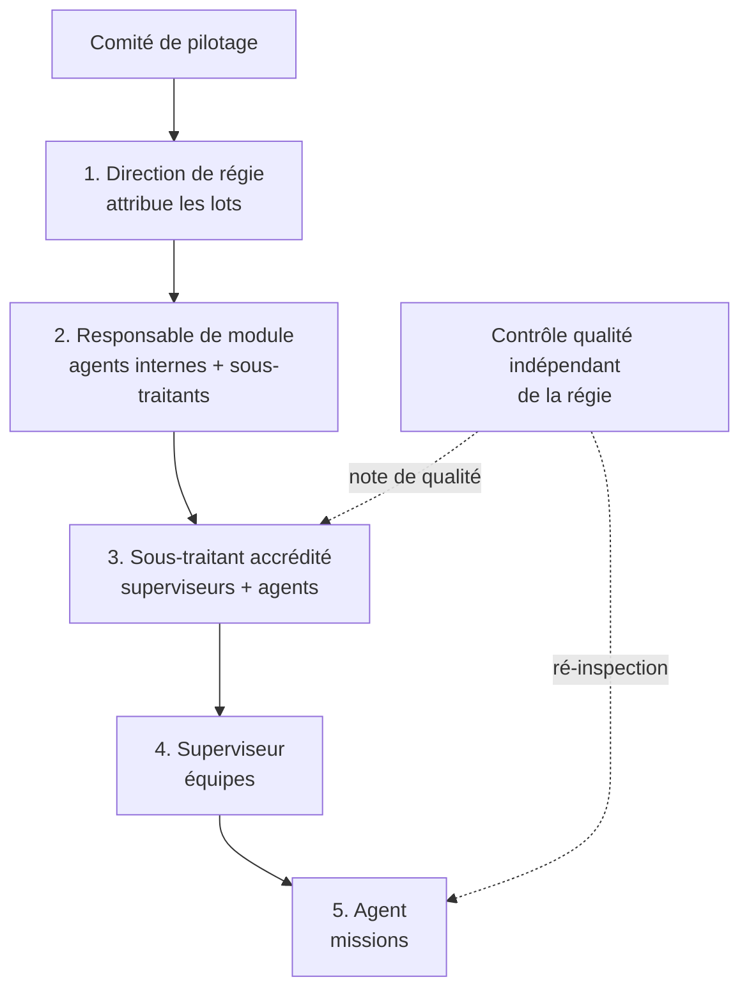

Un sous-traitant peut intervenir sur plusieurs modules s'il est accrédité pour chacun. Le **nombre maximal d'agents par gestionnaire, par zone et par sous-traitant est paramétrable**.

### H.8.4 Accréditation des sous-traitants

| Étape | Exigence |
|---|---|
| Entrée | Invitation par la direction de régie ou le responsable de module **après sélection** (appel à manifestation d'intérêt ou procédure de passation, hors plateforme) ; aucune inscription libre |
| Dossier | Raison sociale, RCCM, NIF, dirigeants et pièces, références, capacité (effectifs, équipements), modules visés |
| Diligence | Existence légale, **quitus fiscal à jour**, absence de conflit d'intérêts, déclaration des liens avec des agents publics (module 91) |
| Décision | Accréditation en maker-checker, **par module, pour une durée limitée, avec période probatoire sur un lot réduit** |
| Convention | Périmètre ; confidentialité ; clauses de sous-traitant de données ; interdictions (encaissement, auto-validation) ; qualité ; pénalités ; restitution et destruction des données en fin de mission |
| Suivi | Note de qualité ; rotation des zones ; renouvellement ou retrait motivé |
| États | `INVITÉ` → `EN_DILIGENCE` → `ACCRÉDITÉ_PROBATOIRE` → `ACCRÉDITÉ` → `SUSPENDU` / `RETIRÉ` |

### H.8.5 Gestion des agents et contrôle qualité

| Exigence | Détail |
|---|---|
| Comptes | Invités par leur gestionnaire ; nominatifs ; **aucun compte partagé** |
| Activation | Seulement après **habilitation par la régie** : identité vérifiée, certification de formation (module 50 bloque l'habilitation d'un agent non certifié), engagement déontologique signé, liaison à un terminal enrôlé |
| Missions | Réparties dans la zone et la période attribuées ; **aucune mission hors lot** (refus technique) |
| Suivi | Production, qualité, rejets, alertes en temps réel ; suspension conservatoire immédiate sur décision motivée |
| Sortie | Révocation + effacement à distance du terminal ; la suspension d'un sous-traitant révoque tous ses agents |
| Contrôle qualité | Indépendant de la régie : ré-inspection d'un échantillon aléatoire (≥ 5 %, et 100 % des cas à risque, § 15.3), intégrité GPS et photo (hachage), doublons, objets fictifs |
| Tableau de qualité | Par agent, équipe, sous-traitant : taux de rejet, taux d'objets confirmés, contestations, anomalies, délais |
| Rotation | Rotation périodique des zones ; **interdiction d'affecter un agent à sa propre rue ou aux objets de ses proches** |
| Identification | Badge photo + QR signé + code court ; vérification par scan, SMS, SVI (habilitation, module, zone, période, structure) ; agent non vérifiable → signalement (module 69) |

### H.8.6 Rémunération des sous-traitants (réécrite selon RW6)

La source prévoyait une rémunération prélevée sur une « réserve de 10 % » des recettes (ARB-11). Position retenue :

| Élément | Règle |
|---|---|
| Base | **Livrables vérifiés** : objets confirmés après contrôle qualité, enrôlements valides, missions réalisées à temps |
| Prix | Prix unitaires fixés au contrat, après mise en concurrence ; **jamais un pourcentage des recettes** ni un montant lié au montant liquidé |
| Paiement | Sur crédit budgétaire, après certification des livrables par la régie |
| Récupération | Récupération des sommes versées pour des objets fictifs ou des constats frauduleux ; pénalités contractuelles |
| Critère | AC-SUB-01 : un agent invité par un sous-traitant n'agit qu'après habilitation par la régie, dans la zone et la période du lot ; aucun constat ne produit d'obligation sans validation indépendante |

## H.9 Chapitres 16 et 17 — Foncier, plaque fiscale immobilière et cadastre

### H.9.1 Plaque fiscale immobilière (NFIU)

La v3.0 (§ 16.8) prévoit une plaque par bâtiment. Le dossier source NFIU (Numéro Fiscal Immobilier Unique) est intégré comme suit :

| Aspect | Exigence intégrée | Statut |
|---|---|---|
| Plaque | Plaque officielle normalisée et visible : NFIU (= code territorial lisible de l'IGF, § 17.3), QR signé, code court, commune, quartier, logo de la Ville ; identité fiscale permanente du bien | Pose [ACTE REQUIS J27] pour l'obligation ; pose administrative possible avant |
| Scan par un agent habilité | Identifiant, localisation, statut d'occupation (occupé par le propriétaire / mis en bail), couleur de situation IF et IRL, dernier constat ; **aucun montant modifiable, aucune négociation, aucune estimation manuelle** | Conforme § 15.1 |
| Scan public | « Plaque authentique, bâtiment enregistré, commune, quartier » et **couleur de situation fiscale** avec légende générique, sans nom, adresse précise ni montant (§ 16.8) | **La source prévaut** (décision de la Ville, ARB-76 révisé) |
| Propriétaire | Application et portail : statut, loyer déclaré, obligations, paiement ; **sans smartphone** : paiement en banque ou au guichet sur présentation du NFIU, rattachement automatique à l'obligation | Module 79 |
| Rapports | **Rapports journaliers automatiques** d'activité des agents (plaques posées, scans, constats) au superviseur | Module 79 |
| Restriction de location | Interdiction de mettre en bail une maison non immatriculée | [ACTE REQUIS J27] ; **non appliquée par le système avant l'acte** (ARB-16) |

### H.9.2 Identifiant géofiscal et provenance des données

| Exigence source | Position |
|---|---|
| Format `KIN-<commune>-<quartier>-<voie>-<séquence>` (exemple `KIN-GOM-GOMBE-AV-MONT-001245`) | Remplacé par le format v3.0 `KIN-GOM-Q012-P004517-B01-U03` (commune, quartier, parcelle, bâtiment, unité), code lisible **versionné**, adossé à un UUID permanent (ARB-59) |
| Chaque donnée recensée porte **provenance, niveau de confiance, date de vérification, responsable de validation** | Intégré : attributs `source`, `confidence`, `verified_at`, `verified_by` obligatoires sur `FiscalObject`, `Geolocation`, `Lease`, `Occupation` (complète § 29.1) |
| QR = jeton signé ou URL de vérification à durée contrôlée ; n'expose jamais nom, montant, historique | Couvert (§ 19.2, § 16.8) |

### H.9.3 Vagues de recensement comme états de l'objet

La méthode de recensement du § 17.5 est complétée par les six vagues du Cahier, qui deviennent le **statut de maturité** de chaque objet et un indicateur de couverture :

| Vague | Contenu | Statut de maturité de l'objet | Effet fiscal |
|---|---|---|---|
| 0 — Préparation | Découpage, import, carte de référence, doublons, zones blanches | `PRÉ_POINTÉ` | Aucun |
| 1 — Détection | Objet provisoire + preuve minimale | `DÉTECTÉ` | Aucun |
| 2 — Qualification | Fiche complète + score de confiance | `QUALIFIÉ` | Aucun |
| 3 — Rattachement | Relation contribuable vérifiée ou à confirmer | `RATTACHÉ` | Aucun avant vérification |
| 4 — Fiscalisation | Application des seules règles actives | `FISCALISÉ` | Obligations |
| 5 — Entretien | Ouvertures, fermetures, mutations | `EN_ENTRETIEN` | Mise à jour des obligations à la date d'effet |

### H.9.4 Compléments fonciers et locatifs

| Exigence | Intégration |
|---|---|
| Couleurs de la couche fiscale : « orange » (source) / « ambre » (v3.0) | **Ambre** retenu partout (ARB-35) |
| Registre des **unités louables** (pas seulement des propriétaires) | Couvert par le modèle parcelle → bâtiment → étage → unité (§ 16.1) ; indicateur « unités louables recensées » ajouté (§ H.19) |
| Déclaration de bail en « deux minutes » par le bailleur ou le locataire | Exigence d'ergonomie du module 9, mesurée en recette utilisateur |
| Calcul de la retenue et de l'IRL **à partir des baux vérifiés** | Couvert (§ 16.2) ; déclarés si la procédure est déclarative |
| Élargissement 2026 (baux emphytéotiques, sociétés immobilières, indemnités de logement) : formulaire propre, contrôle de cohérence, voie de recours (résolutions du Conseil national du travail invoquées par les entreprises) | Couvert (§ 6.4) ; argument des résolutions du Conseil national du travail ajouté au dossier de contentieux prévisible [À VÉRIFIER] |

## H.10 Chapitres 18 à 20 — Paiement de bout en bout, preuve de paiement et rapprochement

### H.10.1 Principe

Les espèces ne sont possibles **que dans des établissements régulés, rapprochés chaque jour** ; le montant est fixé par le système, jamais négocié ; **la seule preuve est l'enregistrement du système**.

### H.10.2 Trois modes de paiement

| Mode | Déroulement | Rôle de l'agent public |
|---|---|---|
| Autonome | Le contribuable initie et paie (application, USSD, banque en ligne) vers le compte public | Aucun |
| Assisté | L'agent ou le guichetier génère la référence et explique ; le contribuable paie sur son téléphone ou chez un point agréé | Génère la référence ; **ne reçoit jamais de fonds** |
| Au guichet | Le contribuable présente sa carte, son avis ou la plaque de l'objet ; paie en espèces ou par carte chez un point agréé, qui règle le compte public dans le délai contractuel | Aucun |

### H.10.3 Réseau des points de paiement agréés (module 66)

| Type de point | Exemples | Conditions |
|---|---|---|
| Monnaie mobile | Application, USSD de l'opérateur | Émetteur agréé BCC (J9) |
| Agent de monnaie mobile de quartier | Agent référencé de l'émetteur | Référencé dans MOSOLO ; plafonds ; contrôles mystère |
| Agence bancaire | Banque de recettes conventionnée | Convention, relevés quotidiens |
| Guichet bancaire dans un guichet MOSOLO | Guichet d'une banque partenaire installé au kiosque communal | Idem ; seul le guichet bancaire encaisse |
| TPE d'un prestataire habilité | Terminal de paiement opéré par un prestataire agréé BCC | Agrément vérifié (J20) |
| Carte en ligne | Diaspora, entreprises | Acquéreur habilité ; 3-D Secure |

**Référencement** : localisation, opérateur, horaires, statut (`RÉFÉRENCÉ` → `ACTIF` → `SUSPENDU`) ; liste consultable par SMS, SVI, avis imprimé et portail (`GET` public, § H.16.6). **Un point non référencé ne peut émettre aucune preuve valable.** Indicateur d'accessibilité : part de la population à moins de 15 minutes de marche d'un point agréé (§ H.19).

### H.10.4 Étapes du paiement sur référence

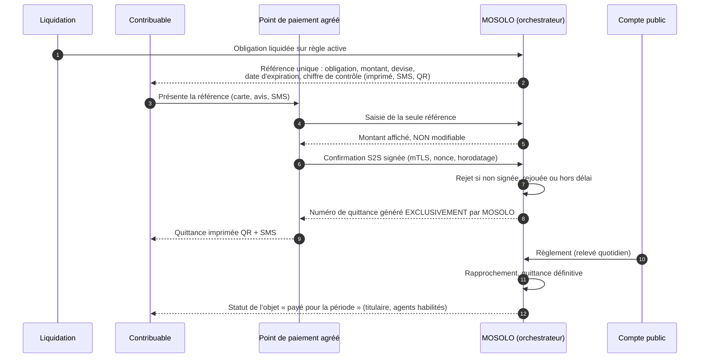

### H.10.5 Formes de la preuve de paiement

| Forme | Contenu | Vérifiable sans smartphone |
|---|---|---|
| SMS de quittance | Numéro, montant, objet, période, code de vérification court | Oui (SMS au code court) |
| Quittance imprimée | Contenu du § 19.1, QR signé, pictogrammes | Oui (guichet, SVI par numéro) |
| Quittance électronique PDF | Signature électronique avancée | — |
| Confirmation vocale | Lecture par le SVI | Oui |
| Statut de l'objet | Plaque QR : payé / non payé pour la période (vue agent habilité) | Oui (contrôle) |
| Historique du compte | Toutes les quittances téléchargeables | — |

### H.10.6 Vérification par acteur

| Acteur | Moyen | Résultat |
|---|---|---|
| Contribuable | SMS du code au numéro court, USSD, SVI, scan du QR | Statut minimal (§ 19.2) |
| Contrôleur | Scan de la plaque ou du QR, **hors ligne avec statut minimal** (signature + liste de révocation, § 19.3) | « Authentique — statut vérifié au … » |
| Guichet, banque, administration | QR ou code | Validité de la quittance et du quitus (API, R37) |
| Trésorerie | Rapprochement quotidien quittance ↔ paiement ↔ règlement ↔ écriture | Files d'exception |
| Auditeur | Piste complète | Chaîne sans trou |

### H.10.7 Authenticité de la preuve

- Seul le système émet un numéro de quittance, après confirmation serveur à serveur.
- Le QR est un jeton signé renvoyant à la vérification en ligne ; toute copie modifiée est déclarée « invalide ».
- Code court avec chiffre de contrôle ; **limitation de fréquence contre l'énumération** (module 68).
- Une quittance par paiement ; une réimpression porte la mention « **DUPLICATA** » et la même référence.
- **Un papier seul, sans enregistrement dans le système, n'a aucune valeur.**

### H.10.8 Verrouillage des fuites

| Fuite | Verrou |
|---|---|
| Agent ou sous-traitant qui encaisse | Aucune fonction d'encaissement ; interdiction contractuelle ; résiliation ; poursuites |
| Faux agent | Badge vérifiable par SMS, USSD, SVI |
| Montant négocié | Montant fixé par le moteur, non modifiable au point de paiement |
| Fausse quittance | Numérotation exclusive ; vérification publique |
| Point conservant les fonds | Délai contractuel de règlement ; rapprochement quotidien ; alerte ; **suspension du point décidée par le Trésor** sur proposition du système (ARB-12) |
| Faux point de paiement | Seuls les points référencés produisent une preuve valable |
| Détournement vers un autre compte | Coffre, quorum, refroidissement 72 h (§ 12.6) |
| Paiement perdu | Rapprochement quotidien ; **files d'exception traitées sous 48 heures** (revue du contrôle interne) |
| Objets fictifs | Contrôle qualité ; récupération des sommes versées |
| Effacement de traces | Ajout seul ; contre-écritures |

### H.10.9 Ligne de signalement et contrôles mystère (module 69)

- Numéro gratuit, SMS, SVI ; anonymat possible ; **protection du signalant** (identité jamais révélée par l'opérateur).
- Chaque signalement est enregistré, qualifié, transmis à l'enquêteur ; délai de traitement suivi jusqu'à clôture.
- **Contrôles mystère périodiques** auprès des agents, des sous-traitants et des points de paiement ; **résultats publiés sous forme agrégée**.
- Critère AC-PPT-03 : un paiement en espèces chez un point agréé donne un montant non modifiable, une quittance émise seulement après confirmation S2S, une preuve imprimée et un SMS, et le statut « payé » de l'objet.

### H.10.10 Statuts de quittance : correspondance des vocabulaires

Trois vocabulaires coexistaient dans les sources (ARB-34). La correspondance normative est :

| État interne (`Receipt.status`, § 29.3) | Affichage public (§ 19.2) | Code court (module 68) | État de paiement (§ 18.4) |
|---|---|---|---|
| `PROVISOIRE` | ⏳ En attente (« paiement confirmé, règlement en cours ») | EN ATTENTE | `CONFIRME`, `REGLE` |
| `DÉFINITIVE` | ✅ Valide | VALIDE | `RAPPROCHE` |
| `ANNULÉE` | ❌ Non valable | RÉVOQUÉE | `ECHOUE` après émission, décision |
| `CONTREPASSÉE` | ❌ Non valable (contrepassée) | RÉVOQUÉE | `CONTREPASSE` |
| `REMPLACÉE` | 🔁 Remplacée par la quittance n° … | RÉVOQUÉE (renvoi) | — |
| `SUSPECTE` | ⚠️ Vérification impossible — contactez la régie | RÉVOQUÉE (message générique) | `CONTESTE` |
| — (titre) | — | EXPIRÉ (titre uniquement) | — |

### H.10.11 Rapprochement : rythme des contrôles

| Contrôle | Fréquence | Responsable | Déclencheur d'exception |
|---|---|---|---|
| Appariement automatique à trois voies | Continu | Système | Tout écart |
| Rapprochement bancaire | Quotidien | Trésorerie provinciale | Écart > seuil ou règlement > 24 h (J+1 ouvré, § 20.1) |
| Revue des exceptions | Quotidienne | Contrôle interne | File non traitée **sous 48 heures** |
| Clôture comptable | Quotidienne (hachage) et mensuelle | Comptable public | Écritures non imputées |
| Audit indépendant | Trimestriel | Audit interne, inspection | Correction non motivée |

Chaque exception a un délai de traitement, un responsable et un circuit d'approbation. Critère AC-REC-01 : un appariement déterministe au-dessus du seuil est proposé ou appliqué selon la politique approuvée, et audité ; l'auditeur voit l'original, chaque événement, l'auteur, les approbations, l'horodatage, la contre-écriture et son motif, **sans trou de journal**.

### H.10.12 Compléments au modèle de paiement

| Exigence source | Position |
|---|---|
| Aucun canal exclusif ; choix du contribuable | Couvert (§ 18.2) ; indépendance vis-à-vis d'un prestataire unique (§ 33.2) |
| Plafonds et seuils d'alerte **par canal, par agent (générateur de référence) et par point d'encaissement** | Intégré aux règles du module 28 et aux alertes du module 40 |
| Détection des doublons par référence, montant, objet et fenêtre temporelle | Couvert (§ 18.5) |
| Quittance définitive à `SETTLED` (KIN-RECETTES) ou `RECONCILED` (Cahier) | `RAPPROCHE` retenu ; le Comité de pilotage peut, par décision motivée, ramener la bascule à `REGLE` si le rapprochement devient quasi instantané (paramètre versionné, ARB-21) |
| **Quitus fiscal délivré uniquement sur quittances définitives** | Intégré (module 82) : une quittance provisoire ne suffit pas à délivrer un quitus |
| Agrégateur et commutateur QR nommé ; vérificateur de confirmations nommé | Non prescrits (ARB-19) : fonction d'agrégation confiée à un agrégateur agréé BCC choisi après mise en concurrence (§ 6.10) |

## H.11 Chapitre 19 (complément) — Titres, preuves et laissez-passer à durée

### H.11.1 Quittance et titre

| | Quittance | Titre |
|---|---|---|
| Prouve | Un paiement fait (provisoire) puis rapproché (définitive) | Un **droit ouvert** : stationner, occuper, circuler, embarquer, exploiter, afficher |
| Durée | Permanente, jamais expirée ; peut être annulée ou contrepassée | Limitée, parfois en nombre d'usages (ticket, vignette, droit d'étal, quitus fiscal) |
| Adossement | Un événement de paiement | **Toujours au moins une quittance ou une exonération validée** |

Un titre de courte durée peut être émis sur **quittance provisoire** (on ne fait pas attendre un automobiliste le rapprochement bancaire) ; si le paiement est ensuite contrepassé, le titre passe à l'état révoqué (noir) et le titulaire est notifié (ARB-22).

### H.11.2 Statuts et couleurs des titres

La v3.0 (§ 19.4) cite trois couleurs ; le modèle complet comprend six statuts. **La couleur n'est jamais seule** : elle est doublée d'une icône, d'un texte et, en contrôle, d'un son.

| Couleur | Statut | Affichage | Signal |
|---|---|---|---|
| ⚪ Gris | Pas encore actif | « VALIDE À PARTIR DE … » | — |
| 🟢 Vert | Valide | ✓ « VALIDE » + compte à rebours | Son court |
| 🟠 Ambre | Bientôt expiré | ⚠ « EXPIRE DANS … » + compte à rebours | — |
| 🔴 Rouge | Expiré (après tolérance) | ✗ « EXPIRÉ DEPUIS … » | Son distinct |
| 🔵 Bleu | Suspendu ou contesté | Texte + motif | — |
| ⚫ Noir | Révoqué, déjà utilisé ou invalide | « INVALIDE » / « DÉJÀ UTILISÉ » | Son distinct |

Le seuil de passage à l'ambre est paramétré par type de titre dans la fiche de configuration du module.

> **Décision du maître d'ouvrage (26/09/2026), qui prévaut sur les seuils en durée ci-dessus et sur ceux du § H.11.4.** Toute preuve à durée limitée affiche un **compte à rebours**. Il est **vert** tant qu'il reste au moins 50 % de la validité, **ambre** de 1 % à moins de 50 %, et **rouge** sous 1 %. Sous 1 %, la preuve est encore valable : le contrôle répond « VALIDE » et aucun constat n'est possible. Elle passe ensuite à « EXPIRÉ ». Voir l'Annexe I, § I.14.

### H.11.3 Modèles de validité

| Modèle | Règle | Exemples |
|---|---|---|
| Durée courte | Début au paiement ou à l'heure choisie ; prolongation ; plafond | Stationnement horaire |
| Journalier | Journée calendaire ou 24 heures glissantes | Droit d'étal, pass wewa jour |
| Hebdomadaire / mensuel | Date de début, renouvellement, rappel | Abonnement résidentiel, pass wewa |
| Annuel / exercice | Exercice fiscal, échéance légale, tolérance | Vignette, patente, autorisation publicitaire |
| Par événement | Dates et lieu | Spectacle, réservation de voirie |
| Usage unique | Consommé au premier contrôle valide | Embarquement, bon de sortie de carrière |
| Carnet d'usages | Nombre d'usages restant | Péage |
| Abonnement | Renouvellement automatique **avec consentement**, résiliation | Stationnement résidentiel |
| Glissant conditionnel | Valide tant que les conditions sont remplies, avec date limite | Quitus fiscal |

Paramètres communs : début et fin (date + heure), **fuseau de Kinshasa**, tolérance, délai d'alerte ambre, zone ou lieu, objet ou plaque, titulaire, transférabilité (**par défaut : non transférable**), remboursement et prolongation autorisés ou non.

### H.11.4 Catalogue des titres

Seuils ambre **indicatifs**, fixés définitivement par la fiche de configuration de chaque module. Tout tarif relève d'une règle certifiée ; aucun type de titre n'est activable sans acte (J21).

| Module | Titre | Validité | Seuil ambre | Support principal | Secours |
|---|---|---|---|---|---|
| Stationnement (14, 75) | Ticket horaire, journalier, hebdomadaire, mensuel ; abonnement | Heure à mois | 15 min (horaire) ; 2 h (journalier) ; 1 jour (hebdo) ; 3 jours (mensuel) | Titre lié à la plaque | QR dynamique, SMS, ticket imprimé |
| Véhicules (11) | Vignette, taxe de circulation | Exercice | 30 jours | Vignette autocollante QR + plaque | SMS, quittance |
| Autorisations de transport (12) | Taxi, bus, moto-taxi | Mois, année | 7 jours | Autocollant QR + carte conducteur | Plaque |
| RakaPay — pass wewa (76, 81) | Pass professionnel | Jour, semaine, mois | 2 h / 1 jour / 3 jours | Gilet numéroté QR + autocollant QR (plaque + conducteur) | USSD, SMS, carte conducteur |
| Marchés, domaine public (20) | Droit d'étal, d'occupation | Jour, semaine, mois | Fin de journée / 1 jour / 3 jours | Plaque QR de l'étal + carte commerçant | SMS, reçu |
| Patente, débits de boissons (10) | Certificat d'exploitation | Exercice | 30 jours | QR sur devanture | — |
| Publicité, antennes (15, 16) | Autorisation | Exercice | 30 jours | Plaque QR sur panneau ou site | Identifiant géofiscal |
| Embarquement, ports (13, 24) | Titre d'embarquement, d'accostage | Usage unique ou journalier | Avant départ | QR à usage unique | Code court SMS |
| Péage (25) | Passage, forfait | Usage unique, carnet, abonnement | — | Titre lié à la plaque | Reçu QR |
| Carrières (22) | Bon de sortie de camion | Usage unique | — | QR lié au camion et au chargement | Code court |
| Spectacles (21) | Autorisation | Dates de l'événement | 2 jours | Certificat QR affiché | — |
| Chantiers, voirie (19) | Permis d'occuper la voie | Durée du chantier | 3 jours | Panneau de chantier QR | — |
| IF et IRL (9, 79) | Quittance annuelle + statut de l'objet | Exercice | Échéance légale | Plaque QR de la parcelle ou de l'unité | — |
| Quitus fiscal (82) | Attestation de conformité | Période fixée par la règle | 15 jours | Document QR vérifiable | Code court |

### H.11.5 Supports : QR dynamique, QR statique, plaque, carte

| Support | Exigence |
|---|---|
| **QR dynamique** (application) | **Régénéré toutes les 30 secondes** ; compte à rebours animé ; date et heure de fin ; couleur ; élément animé qui rend une capture d'écran reconnaissable ; un code copié est invalide |
| QR statique (papier, autocollant, plaque) | Jeton signé (type de titre, identifiant, dates de début et de fin) ; dates en gros caractères, pictogrammes, code court |
| Titre sans support | Stationnement, péage, circulation : le titre est lié à la plaque |
| SMS et code court | Secours universel |
| Carte MOSOLO | Titre rattaché au titulaire (§ H.7.2) |
| Visuels par module | Couleur de cadre, pictogramme, **préfixe de code** (par exemple `STA` stationnement, `MAR` marché, `VIG` vignette) |

### H.11.6 Temps de référence, contrôle et hors ligne

- **L'heure de référence est l'heure du serveur**, synchronisée sur une source de confiance, au fuseau de Kinshasa ; **l'heure du téléphone ou du terminal n'est jamais prise en compte** pour la validité.
- Contrôle en ligne : statut, couleur, temps restant ou écoulé, module, objet, zone.
- Contrôle hors ligne : vérification de la signature du jeton par **clé publique**, comparaison avec l'horloge du terminal synchronisée à la dernière connexion, **liste de révocation signée en cache** ; résultat affiché « vérifié hors ligne », **reconfirmé à la synchronisation**.
- Chaque contrôle est journalisé (qui, où, quand, résultat) ; un titre à usage unique présenté deux fois est détecté, y compris entre deux contrôles hors ligne réconciliés.
- Usage unique : le premier scan consomme ; les suivants affichent « **DÉJÀ UTILISÉ** » avec l'heure et le lieu du premier usage.

### H.11.7 Cycle de vie d'un titre

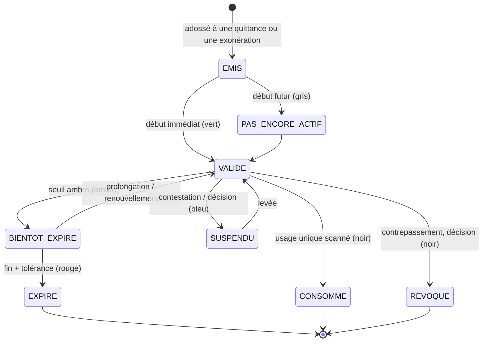

Règles : rappels avant expiration (notification, SMS, appel) ; prolongation ou renouvellement par téléphone, guichet ou point agréé (nouveau paiement) ; **à l'expiration, aucune pénalité automatique** — un éventuel constat suit la règle et le circuit RW1, avec recours ; remboursement d'un titre non utilisé seulement si la règle le permet, par contre-écriture.

Critères : AC-TIT-01 à AC-TIT-05 (§ H.21), notamment : un ticket journalier lu à moins de 2 heures de son expiration s'affiche en ambre, avec icône et temps restant calculés sur l'heure du serveur.

## H.12 Chapitres 21 et 22 — Recouvrement et recours

### H.12.1 Calendrier gradué réconcilié

La v3.0 (§ 21.3) commence à J+1. Le Cahier prévoyait aussi des rappels **avant** l'échéance. Le calendrier retenu (valeurs de conception, à remplacer par l'Édit n° 005/2021 — J4) :

| Étape | Délai | Canal | Garde-fou |
|---|---|---|---|
| Déclaration pré-remplie prête | J−45 | SMS, application, USSD | Avis facultatif |
| Rappel amiable | **J−15 et J−3** | SMS, application, courriel | Preuve d'envoi ; heures de silence (§ 11.4.5) |
| Avis d'échéance dépassée | J+1 | SMS, application | Référence de paiement maintenue |
| Relance ciblée + offre d'assistance | J+15 | Appel, visite d'information | **Aucune sanction** |
| Constat et notification formelle | J+30 | Agent habilité | Motivation, voie de recours |
| Mise en demeure | Selon l'édit | Notification officielle | Double validation hiérarchique |
| Mesures d'exécution | Selon l'édit | Service compétent | Décision motivée, jamais automatique |
| Plan d'apurement | À tout moment | Espace contribuable | Sous réserve d'un acte autorisant l'échéancier (J14) |

### H.12.2 Segments : correspondance

| Segment source (7) | Segment v3.0 (§ 21.2) |
|---|---|
| Conforme | (hors recouvrement) |
| Retard occasionnel | Oubli |
| Difficulté réelle | Capacité limitée ; Friction |
| Erreur ou litige | Contestation |
| Non-déclarant probable | Refus délibéré (après vérification) |
| Fraude présumée | Refus délibéré + dossier d'enquête (module 40) |
| Grand débiteur | Grands redevables (gestion de cas, garanties) |

Toute campagne est **testée sur échantillon, mesurée, et arrêtée** si son coût est disproportionné, si elle produit des erreurs ou un impact social excessif (module 33) ; la récupération est mesurée **brute et nette des coûts**.

### H.12.3 Recours — compléments

Le décideur d'un recours est **distinct de l'auteur de la liquidation** (module 37) ; le non-respect du délai légal de réponse est un indicateur suivi et publié (§ 22.2, `appeal.sla_breach`).

## H.13 Chapitres 23 à 25 — IA, apprentissage et fraude

### H.13.1 Fiche de contrôle obligatoire de chaque agent d'IA

| Rubrique | Contenu |
|---|---|
| Outils autorisés | Liste fermée d'API en lecture (§ 23.3) |
| Données autorisées | Par classe de confidentialité et par finalité |
| Seuils | Confiance minimale d'affichage ; seuils d'alerte |
| Points d'intervention humaine | Niveaux B et C du § 23.5.8 |
| Journaux | Prompt, version, données citées, sortie, décision humaine |
| **Coupe-circuit (kill switch)** | Détenu conjointement par le directeur de programme et le RSSI ; désactivation immédiate d'un agent, journalisée (`ai.agent.disabled`) |

Correspondance des noms d'agents : Revenue Discovery → Découverte des recettes ; Registration → Enrôlement ; User Learning → Apprentissage de l'usager ; Employee Copilot → Copilote ; Legal Intelligence → Veille juridique ; Rental Intelligence → Intelligence locative ; Field Mission → Missions terrain ; Payment Reconciliation → Rapprochement ; Fraud Detection → Détection de fraude ; Forecasting → Prévision ; Executive Decision → Aide à la décision ; Public Investment Allocation → Allocation des investissements ; Continuous Learning → Apprentissage continu.

### H.13.2 Apprentissage et certification — compléments

| Public | Exigence source intégrée |
|---|---|
| Contribuables | Mesure de l'efficacité : **taux de dossiers complets du premier coup** |
| Agents recenseurs | Certification avant toute affectation (blocage technique, module 50) |
| Contrôleurs | Certification + **recertification annuelle** |
| Agents de guichet | Évaluation continue |
| Cadres et superviseurs | Évaluation par résultats vérifiables |
| Finances et Trésor | Contrôle par échantillon |
| Administrateurs | Habilitation renouvelable |

### H.13.3 Vecteurs de fraude complémentaires

| Vecteur | Prévention | Détection | Preuve |
|---|---|---|---|
| Faux agent | Badge QR + code court | Signalements, vérifications échouées | Journal des vérifications de badge |
| Sous-traitant qui encaisse | Aucune fonction d'encaissement ; convention | Contrôles mystère ; plaintes ; écart constats/paiements | Journal des missions |
| Point de paiement qui retient les fonds | Délai contractuel ; garantie | Rapprochement quotidien, âge des confirmations non réglées | Relevés, confirmations signées |
| Objets fictifs | Rémunération sur objets vérifiés uniquement | Ré-inspection ; photos hachées réutilisées | Hachages, GPS |
| Enrôlement sans consentement réel | Lecture audio obligatoire | Échantillonnage des enregistrements | Enregistrement horodaté |
| Contrôle manuel hors système (billetterie) | Aucun contrôle valable hors application | Écart contrôles/ventes par agent | Journal des contrôles |

La preuve « pratiquement infalsifiable » inclut la **publication quotidienne de la racine de hachage** de la journée dans un registre indépendant (ancrage, § 25.2 ; vérifiable par le module 46).

## H.14 Chapitre 26 — Tableaux de bord : compléments

### H.14.1 Échelle de la recette : réconciliation

| # | Cahier § 26.1 | v3.0 § 26.1 | Position |
|---|---|---|---|
| 1 | Potentiel estimé | Potentiel estimé | Identique |
| 2 | Assiette vérifiée | Assiette vérifiée | Identique |
| 3 | Liquidé (constaté) | Liquidé | Identique |
| 4 | Exigible (échu) | Exigible | Identique |
| 5 | En retard (impayé) | En retard | Identique |
| 6 | Paiement initié | **Contesté** | v3.0 : le contesté est un niveau à part entière (droits du contribuable) |
| 7 | Paiement confirmé | Paiement initié | Décalage |
| 8 | Réglé en compte public | Paiement confirmé | Décalage |
| 9 | Rapproché | Réglé | Décalage |
| 10 | **Comptabilisé** | Rapproché | v3.0 : « rapproché » inclut les écritures passées ; la **clôture comptable** est un attribut affiché (jour clôturé / non clôturé) |
| 11 | Disponible pour affectation | Disponible pour appropriation budgétaire | Identique en substance |

**L'échelle v3.0 est la seule référence** pour les tableaux, rapports et exports (ARB-62). Les récits sources évoquant « six états » ou « potentiel, constaté, encaissé, réglé, rapproché, disponible » sont satisfaits par des vues agrégées de cette échelle (ARB-33).

### H.14.2 Questions de décision du Gouverneur

Chaque bloc du tableau du Gouverneur (§ 26.2) répond à une question explicite :

| Question | Niveau de l'échelle | Action ouverte |
|---|---|---|
| Quelle assiette reste invisible ? | 1 vs 2 | Campagne de recensement |
| Quelles créances sont échues ? | 4, 5 | Campagne de recouvrement |
| L'argent est-il arrivé ? | 8, 9, 10 | Ouvrir les exceptions |
| Quels paiements investiguer ? | Écart 8 → 10 | Salle de contrôle |
| Quelles zones sont sous-recensées ? | Couverture géofiscale | Interpeller le chef de centre |
| Quelle conformité volontaire ? | Paiements spontanés / exigible | Communication |
| Quelle déperdition évitée ou récupérée ? | Indicateurs d'intégrité | Saisir l'audit ou l'inspection |
| Quel coût par franc net ? | Coût de collecte / RANV | Arbitrage budgétaire |

Compléments : bloc « **Par régie ou ministère** » (performance, délais, contentieux → plan d'action) ; bloc « **Couverture locative** » (unités, baux, conformité → campagne ciblée) ; carte filtrable par commune, quartier, catégorie, activité, situation fiscale, période, administration, type de recette ; drill-down sous contrôle d'accès (agrégats pour le Gouverneur, § 12.3) ; export de rapport **signé**.

### H.14.3 Salle de contrôle financière et autres tableaux

- La salle de contrôle (module 45) surveille règlements, anomalies, **modifications de paramètres sensibles**, comptes privilégiés et alertes critiques, **sans aucun pouvoir de correction silencieuse** ; chaque incident a un propriétaire, une sévérité, un délai et une preuve de clôture.
- Tableaux complémentaires issus du Dossier Gouverneur : **tableau des communes** (couverture, recettes ETD dans l'espace communal, arbitrages en cours — module 95) ; tableau des **superviseurs terrain** (charge, productivité, qualité) ; tableau des **enquêteurs** (dossiers, liens).

## H.15 Chapitre 27 — Affectation et contrôle de la dépense publique (CALCU)

### H.15.1 Compléments sur l'affectation

- Affectation des recettes de stationnement à l'entretien routier, à la signalisation, à la mobilité (dossier ParkSmart) : **possible seulement par un acte compatible avec l'universalité budgétaire** (J24) ; à défaut, **engagement de programmation publié** au tableau de transparence (§ 27.4).
- La séquence de la dépense est rappelée : collecte → comptabilité → partage légal → Trésor → appropriation budgétaire → autorisation de dépense → engagement → planification → dépense réelle ; **aucun transfert ni engagement automatique**.

### H.15.2 CALCU — Central Automated Ledger for Control & Understanding (module 80)

**Finalité.** Prolonger la traçabilité des recettes jusqu'à la **dépense** publique, au profit de l'organe de contrôle et d'inspection compétent de la Ville (source : « Hôtel de Ville »), avec extension nationale possible (Inspection générale des finances, ministère des Finances, BCC). CALCU **ne bloque aucun paiement**, ne remplace pas les banques et **respecte le secret bancaire**.

| Problème constaté | Objectif |
|---|---|
| Comptes publics non déclarés | Registre de tous les comptes publics, nombre d'entités et de comptes non limité |
| Pas de traçabilité en temps réel | Traçage de chaque sortie de fonds dès sa transmission |
| Pièces papier | Preuves numériques obligatoires, horodatées, géolocalisées, liées |
| Contrôle a posteriori | Détection d'anomalies et missions ciblées sans déplacement |

Champ : entreprises et établissements publics, ministères, province, ETD, projets financés par l'État ou par des partenaires — **selon le texte qui l'instituera (J26)**.

| Composant | Exigence |
|---|---|
| Registre des comptes publics | Types : fonctionnement, investissement, projet, spécial ; déclaration obligatoire (banque, numéro, devise, type, responsables et signataires) validée conjointement par les Finances et l'organe de contrôle ; **un compte non enregistré est réputé irrégulier** et signalé ; un compte validé est surveillé en permanence |
| Passerelle bancaire | Transmission sécurisée des opérations (montant, date et heure, bénéficiaire, référence, compte émetteur) ; la passerelle **standardise sans analyser** ; conventions bancaires (J26) |
| Justificatifs | Avant paiement : devis, bon de commande, engagement budgétaire, contrat, fournisseur enregistré ; identifiant unique par opération |
| Moteur de correspondance | Contrôles : compte enregistré ; existence des pièces ; cohérence du montant et de la date ; conformité budgétaire. Détection : surfacturation, fractionnement, paiements répétés, dépenses hors objet |
| Score | 🟢 vert : conformité totale ; 🟠 ambre : correspondance partielle ; 🔴 rouge : aucune correspondance ou anomalie grave (légende propre, ARB-35) |
| Rapport d'anomalie | Horodaté, numéro unique, PDF téléchargeable, consultable par l'organe de contrôle, les Finances et les organes habilités |
| Organe de contrôle | Vision en temps réel ; missions ciblées ; accès aux preuves ; **gel administratif d'un dossier seulement selon ses pouvoirs légaux et par décision humaine motivée** (ARB-12) ; transmission à la justice |
| Tableaux | Montants contrôlés et récupérés ; institutions à risque ; zones à forte exposition ; taux d'exécution des recommandations |
| Sécurité | Hébergement souverain (§ 33) ; chiffrement ; journal d'accès inviolable ; sauvegardes quotidiennes ; **audit externe annuel** |

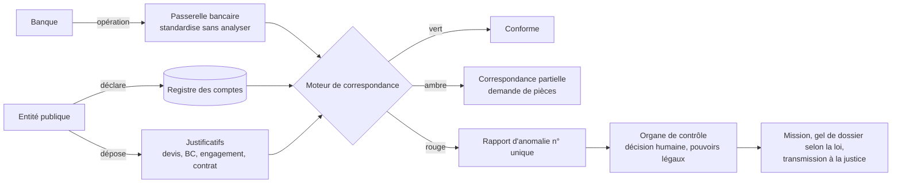

| Phase (source, [À VÉRIFIER]) | Durée | Contenu |
|---|---|---|
| 1 | 0 à 3 mois | Cadre juridique (J26), développement, formation |
| 2 | 3 à 6 mois | Conventions bancaires ; enregistrement des entités et des comptes |
| 3 | 6 à 12 mois | Automatisation ; extension |
| Pilote | — | Une entité volontaire |

Dans le calendrier v3.0, CALCU relève de **R4** (décembre 2028), après texte (J26) ; le pilote sur une entité volontaire peut être préparé dès R3. Cadre à adopter : registre obligatoire, preuve numérique, responsabilité personnelle des gestionnaires, sanctions de la non-déclaration et de la falsification [ACTE REQUIS]. Critère AC-CAL-01 : une transaction publique sans justificatif est classée rouge **sans être bloquée**.

## H.16 Chapitres 28 à 33 — Compléments techniques

### H.16.1 Diagrammes livrables de la phase 1

Le Cahier exigeait neuf diagrammes livrables en phase 1, conditionnant la phase 2. Couverture v3.0 :

| Diagramme | Où dans la v3.0 | Statut |
|---|---|---|
| Contexte | § 28.3 | Couvert |
| Conteneurs | § 28.4 | Couvert |
| Domaines | § 10.1, § 28.5 | Couvert |
| Flux de données | § 28.5 | Couvert |
| Séquence de paiement | § 18.3 ; § H.10.4 (paiement assisté) | Couvert |
| Séquence de synchronisation terrain | § 28.6 | Couvert |
| Flux d'habilitation | § 28.7 ; § H.6.4, § H.6.7 (invitations) | Couvert + complété |
| Chaîne de décision de l'IA | § 23.3 | Couvert |
| Reprise après sinistre | § 28.8 | Couvert |

Ces diagrammes restent **des livrables formels de la phase 1**, versionnés, approuvés par le Comité de sécurité et conditionnant la porte G1.

### H.16.2 Exigences non fonctionnelles : sources et v3.0

| Exigence | Source | v3.0 | Position |
|---|---|---|---|
| Disponibilité services contribuables et paiement | 99,9 % / mois | 99,5 % pilote ; 99,9 % généralisation | v3.0 (ARB-61) |
| RPO grand livre | ≈ 0 | 0 (réplication synchrone) | Identique |
| RTO critique | 4 h pilote ; 1 h maturité | ≤ 4 h ; ≤ 1 h | Identique |
| Test de restauration | Trimestriel | Mensuel ; bascule complète semestrielle | v3.0 (plus exigeante) |
| Capacité | Tests au pic avec marge ≥ 3× | 20 fois le trafic moyen (pic de février) | v3.0 ; la marge ≥ 3× **au-dessus du pic mesuré** est conservée comme critère complémentaire |
| Application terrain hors ligne | Une journée complète | 5 jours | v3.0 |
| Contrôle par plaque | **< 3 s en ligne** | — | **Intégré** (AC-FLD-04) |
| USSD | **Jamais de donnée sensible complète** | — | **Intégré** (AC-INC-03) |
| Sessions | **Courtes** ; session courte sur appareil partagé | Jeton OIDC court | Couvert + complété (§ H.4.1) |
| Exports sensibles | Filigranés, chiffrés, à expiration | Filigranes, limites (§ 25.2) | Couvert ; **expiration** des exports ajoutée |
| Pentest | Avant chaque mise en production majeure | Avant le pilote et chaque version majeure | Identique |
| Réversibilité | Testée au moins une fois par an | Avant généralisation (O12) | **Complété** : exercice annuel après la généralisation |

### H.16.3 Entités de données complémentaires

Le dictionnaire du § 29.3 est complété par les entités nécessaires aux modules 63 à 81. Attributs communs obligatoires du § 29.1 (dont `entity_scope`) applicables à toutes.

| Entité | Finalité | Champs importants | Cycle de vie | Classe |
|---|---|---|---|---|
| **Entity** | Entité publique ou partenaire | type, name, legal_basis, parent | ACTIVE → SUSPENDUE → RETIRÉE | C1 |
| **Tenant** | Espace d'entité | entity, modules[], branding | ACTIF → SUSPENDU | C2 |
| **ModuleConfiguration** | Fiche de configuration (§ H.4.3) | entity, object_types, rules[], credential_types[], channels, workflows, dependencies, approvals | § H.4.3 | C2 |
| **ModuleAttachment** | Rattachement module ↔ entité | module, entity, decree_ref, from, to, approvals | PROPOSÉ → VALIDÉ → CLOS | C2 |
| **Arbitration** | Conflit de revendication | fact, object, period, claimants[], decision | OUVERT → RÉSOLU | C2 |
| **Invitation** | Invitation nominative | inviter, invitee_phone, entity, level, scope, expires_at, reason | § H.6.7 | C3 |
| **Validation** | Seconde validation d'un rôle sensible | account, validator (≠ inviter), decision | DEMANDÉE → ACCORDÉE / REFUSÉE | C2 |
| **Subcontractor** | Sous-traitant accrédité | rccm, nif, modules[], probation_until, quality_score | § H.8.4 | C3 |
| **Lot** | Lot de missions | subcontractor, module, zone, period, max_agents | OUVERT → CLOS | C2 |
| **AgentBadge** | Badge d'agent | holder, qr_token, short_code, module, zone, period | ACTIF → RÉVOQUÉ | C2 |
| **MosoloCard** | Carte MOSOLO | taxpayer, qr_token, short_code, photo_ref | § H.7.2 | C3 |
| **Consent** | Consentement assisté | mode (voix, témoin, empreinte), audio_ref, witness, mission | SCELLÉ | C5 si empreinte, sinon C4 |
| **PaymentPoint** | Point de paiement agréé | provider, location, hours, licence_ref, settlement_delay | RÉFÉRENCÉ → ACTIF → SUSPENDU | C1 |
| **Report** | Signalement | channel, anonymous, category, status, investigator | REÇU → QUALIFIÉ → TRANSMIS → CLOS | C5 |
| **MysteryCheck** | Contrôle mystère | target, date, result | PLANIFIÉ → RÉALISÉ | C4 |
| **CredentialType** | Type de titre | module, prefix, validity_model, amber_threshold, transferable | Versionné | C1 |
| **ValidityPolicy** | Modèle de validité | model, timezone, tolerance, extension_rules | Versionnée | C1 |
| **Credential** | Titre | type, holder, object_or_plate, starts_at, ends_at, receipt_or_exemption, token | § H.11.7 | C3 |
| **UsageEvent** | Consommation d'un usage | credential, time, place, device | Ajout seul | C3 |
| **VerificationEvent** | Contrôle d'un titre | credential, controller, gps, result, offline | Ajout seul | C3 |
| **Revocation** | Révocation (titre, carte, badge, quittance) | target, reason, time | Ajout seul ; liste signée | C2 |
| **Merchant** | Opérateur de billetterie | entity, type (public/privé), catalogue, commission_contract_ref | ACCRÉDITÉ → SUSPENDU | C2 |
| **Ticket** | Ticket de billetterie | merchant, service, location, validity, qr | = Credential | C3 |
| **ParkingZone** | Zone de stationnement | geometry, tariff_rule, decree_ref | ACTIVE (après acte) | C1 |
| **ParkingSession** | Session de stationnement | plate, zone, start, end, credential | OUVERTE → CLOSE | C3 |
| **Reservation** | Réservation de voirie | purpose, zone, period, applicant | DEMANDÉE → ACCORDÉE → CLOSE | C3 |
| **AdvertisingPanel** | Support publicitaire | (= Advertisement, § 29.3) + authorization_ref, qr | — | C2 |
| **InspectionCase** | Dossier de constat | controller, evidence[], presumed_nature, supervisor, authority_decision | OUVERT → VALIDÉ / CLASSÉ → NOTIFIÉ | C4 |
| **Motorbike** | Moto (wewa) | plate, order_number, owner, commune | ACTIVE → RETIRÉE | C3 |
| **Driver** | Conducteur | identity, photo, licence, motorbikes[] | ACTIF → SUSPENDU | C4 |
| **Cooperative** | Coopérative de wewa | entity, members[], accreditation | ACCRÉDITÉE → SUSPENDUE | C2 |
| **Station** | Station de wewa | geometry, code | ACTIVE | C1 |
| **Flight** | Vol (AVIA) | carrier, number, date, departures | — | C2 |
| **AirTaxId** | Identifiant fiscal aérien (IFA) | flight, passenger_ref (pseudonymisé), ticket_ref | ÉMIS → EMBARQUÉ → SORTI | C4 |
| **AirReconciliation** | Rapprochement aérien mensuel | carrier, period, sold, boarded, exited, remitted, gap | CALCULÉ → CONTRADICTOIRE → CLOS | C2 |
| **PublicAccount** | Compte public (CALCU) | bank, number (chiffré), currency, type, signatories | DÉCLARÉ → VALIDÉ ; NON ENREGISTRÉ (irrégulier) | C4 |
| **BankTransaction** | Opération bancaire transmise | account, amount, date, beneficiary, reference | Ajout seul | C4 |
| **SupportingDocument** | Justificatif de dépense | type, operation_id, hash, gps, time | SCELLÉ | C3 |
| **SpendingAlert** | Anomalie de dépense | score (vert/ambre/rouge), rules, report_number | OUVERTE → TRAITÉE | C4 |

**Remplacements (ARB-74)** : les entités sources `RevenueShareKey`, `Allocation`, `Disbursement`, `AllocationBeneficiary` sont remplacées par `AllocationRule` (clés **légales**, § 29.3) ; aucune entité ne porte d'instruction de virement vers un compte privé.

**Événements d'audit obligatoires** (liste minimale, complète le § 29.1) : connexion, échec, MFA, changement d'appareil, élévation de privilège ; création, lecture sensible, export, modification, fusion, archivage d'identité ou d'objet ; création, validation, publication, suspension, expiration de règle ; calcul, recalcul, correction, remise, exonération, pénalité, annulation ; ordre de paiement, rappel, règlement, rapprochement, exception, remboursement, révocation ; mission, preuve, position, synchronisation, conflit ; recours, pièce, consultation, décision, délai, notification ; changement de clé, de secret, de bénéficiaire, de configuration, de rôle, de politique de sécurité ; **invitation, finalisation, seconde validation, rattachement de module, contrôle de titre, consommation d'usage, émission et révocation de carte ou de badge**.

### H.16.4 Correspondance des routes d'API

La convention unique demandée par le Cahier (« à arrêter en phase 1 ») est **celle du § 30.2 de la v3.0** (ressources en anglais, verbes d'action `:action`, montants typés, RFC 9457) (ARB-43). Les routes sources sont conservées comme alias documentés pendant la seule période de transition des partenaires.

| Route source (FR — Cahier) | Alias sources (EN, KIN-RECETTES) | Route v3.0 retenue |
|---|---|---|
| `POST /v1/comptes` ; `POST /v1/public/inscriptions` | `POST /v1/identity/persons` ; `POST /v1/taxpayers` | `POST /v1/registrations` (crée **exclusivement** un compte contribuable) |
| `POST /v1/identites/verification` | — | `POST /v1/identity-verifications` |
| `POST /v1/objets` | `POST /v1/objects` | `POST /v1/fiscal-objects` ; `POST /v1/properties` |
| — | `POST /v1/relationships` | `POST /v1/object-relations` |
| `POST /v1/baux` | — | `POST /v1/leases` |
| `GET /v1/objets/{id}/obligations` | `GET /v1/obligations` | `GET /v1/fiscal-objects/{id}/obligations` **(à ajouter)** |
| `POST /v1/liquidations/simulation` | — | `POST /v1/assessments:calculate` (mode simulation) |
| — | `POST /v1/declarations` | `POST /v1/declarations` **(à ajouter)** : version, signature, verrouillage |
| `POST /v1/regles` ; `POST /v1/regles/{id}/publication` | `POST /v1/legal-rules` | `POST /v1/legal-rules` · `:submit` · `:approve` · `:publish` |
| `POST /v1/paiements/ordres` | `POST /v1/obligations/{id}/payment-references` ; `POST /v1/payment-orders` | `POST /v1/obligations/{id}/payment-orders` |
| `POST /v1/paiements/callback` | `POST /v1/payments/webhooks/{provider}` ; `POST /v1/payment-events` | `POST /v1/providers/{provider}/callbacks` |
| `POST /v1/reglements/import` | — | `POST /v1/settlements/statements` |
| — | `POST /v1/reconciliations/jobs` ; `POST /v1/reconciliations` | `POST /v1/reconciliations:run` |
| `GET /v1/rapprochements/exceptions` | — | `GET /v1/reconciliation-exceptions` **(à ajouter)** · `PATCH /v1/reconciliation-exceptions/{id}` |
| `GET /v1/quittances/{ref}/verification` | `GET /v1/receipts/{id}/verify` | `GET /v1/public/receipts/{code}` |
| `POST /v1/missions/synchronisation` | `POST /v1/field-missions/{id}/evidence` ; `POST /v1/field/sync` | `POST /v1/field-sync/batches` |
| `POST /v1/constats` | — | `POST /v1/inspections` |
| `POST /v1/recours` | `POST /v1/appeals` | `POST /v1/appeals` · `:decide` |
| `GET /v1/alertes-fraude` | — | `GET /v1/fraud-alerts` |
| `GET /v1/tableaux/{profil}` | — | `GET /v1/dashboards/{board}` |
| `GET /v1/previsions` | — | `POST /v1/forecasts:run` |
| `POST /v1/affectations/scenarios` | — | `POST /v1/allocation-scenarios` |

**Mise en œuvre (27/09/2026).** Les 20 routes sources en français de la première colonne sont construites comme **alias réels** des routes effectivement construites (module `catalogue-api`, § 30.4) : `POST /v1/registrations`, circuit des preuves d'identité du module « acces », `POST /v1/fiscal-objects`, `POST /v1/leases`, `GET /v1/obligations?objectId=`, `POST /v1/assessments/calculate` (simulation, règle publiée uniquement), `POST /v1/legal-rules` et `…/approve`, `POST /v1/obligations/{id}/payment-orders`, `POST /v1/providers/{provider}/callbacks`, `POST /v1/settlements/statements`, `GET /v1/reconciliation/exceptions`, `GET /v1/public/receipts/{code}`, `POST /v1/field-sync/batches`, `POST /v1/terrain/missions/{id}/findings`, `POST /v1/appeals`, `GET /v1/integrite/alerts`, `GET /v1/tableaux/{profil}`, `GET /v1/pilotage/scenarios`, `POST /v1/pilotage/projets/recommandations`. La convention retenue (ARB-43) n'est pas modifiée : les alias relaient, ils ne dupliquent aucune règle ; leur maintien au-delà de la période de transition des partenaires relève du maître d'ouvrage.

Routes **à ajouter** à la spécification OpenAPI (`specs/openapi.yaml`) pour les modules intégrés ; mêmes normes que le § 30.1 (OAuth 2.1, mTLS pour partenaires et terminaux, `Idempotency-Key` pour tout effet financier, limites de débit, audit).

| Route v3.0 (convention retenue) | Route source | Acteur | Contrôles |
|---|---|---|---|
| `POST /v1/assisted-enrolments` | `POST /v1/enrolements/assistes` | Agent d'enrôlement | Lecture audio, consentement horodaté, zone et horaire, terminal enrôlé |
| `POST /v1/mosolo-cards` · `:revoke` · `:reissue` | `POST /v1/cartes` | Agent, guichet | Double validation pour la réémission |
| `GET /v1/public/verifications/{short_code}` | `GET /v1/verification/code/{code}` | Public | Chiffre de contrôle, limite de débit, divulgation minimale (quittance, carte, badge, titre) |
| `GET /v1/public/payment-points` | `GET /v1/points-paiement` | Public | — |
| `POST /v1/payment-points/{id}/collections` | `POST /v1/points-paiement/{id}/encaissements` | Point agréé | mTLS, référence valide, **montant immuable**, idempotence |
| `POST /v1/subcontractors` · `:accredit` | `POST /v1/partenaires/sous-traitants` | Direction de régie, responsable de module | Statut « en diligence » ; maker-checker |
| `POST /v1/subcontractors/{id}/agents` | `POST /v1/sous-traitants/{id}/agents` | Sous-traitant, responsable de module | Agent **inactif jusqu'à habilitation** |
| `POST /v1/lots/{id}/mission-assignments` | `POST /v1/lots/{id}/missions/affectations` | Sous-traitant, superviseur | Limité au lot (zone, période) |
| `GET /v1/public/agent-badges/{badge}` | `GET /v1/agents/{badge}/verification` | Public | Statut, module, zone, période, structure |
| `POST /v1/public/reports` | `POST /v1/signalements` | Public | Anonymat possible, accusé de réception |
| `POST /v1/credentials` | `POST /v1/titres` | Système, point agréé | Quittance ou exonération valide ; type activé ; **validité calculée par le serveur** |
| `GET /v1/credentials/{id}/status` | `GET /v1/titres/{id}/statut` | Public (minimal), contrôleur | Heure serveur, liste de révocation |
| `POST /v1/credentials/{id}/verifications` | `POST /v1/titres/{id}/controles` | Contrôleur | Terminal enrôlé, géolocalisation, consommation si usage unique |
| `POST /v1/credentials/{id}:extend` | `POST /v1/titres/{id}/prolongations` | Titulaire, guichet | Règle du module, nouveau paiement |
| `GET /v1/vehicles/{plate}/credentials` | `GET /v1/vehicules/{plaque}/titres` | Contrôleur | Journalisation, filtrage par module et entité |
| `GET /v1/revocation-lists/{kind}` | `GET /v1/revocations` | Terminaux | mTLS, liste signée |
| `POST /v1/entities` | `POST /v1/entites` | Administrateur de la plateforme | Décision du Comité de pilotage référencée |
| `POST /v1/entities/{id}/module-configurations` | `POST /v1/entites/{id}/modules` | Programme, entité | Maker-checker, recette avant activation |
| `POST /v1/entities/{id}/module-attachments` | `POST /v1/entites/{id}/modules/rattachements` | Administrateur de la plateforme | Seconde validation du comité, référence d'arrêté |
| `POST /v1/arbitrations` | `POST /v1/arbitrages` | Système, entité | Comité juridique et tarifaire |
| `POST /v1/invitations` | idem | Tout compte avec droit d'inviter | Pas d'élévation, périmètre propre, nominative, durée limitée |
| `POST /v1/invitations/{code}:accept` | `POST /v1/invitations/{code}/acceptation` | Invité | Usage unique, lié au numéro, identité, MFA |
| `POST /v1/invitations/{id}:assisted-registration` | `POST /v1/invitations/{id}/inscription-assistee` | Opérateur d'accès désigné | Même entité ; niveau et périmètre inchangés ; secrets définis par la personne |
| `POST /v1/accounts/{id}/validations` | `POST /v1/comptes/{id}/validations` | Validateur désigné | **Distinct de l'invitant** |
| `POST /v1/accounts/{id}:revoke` · `POST /v1/entities/{id}:revoke-accounts` | `POST /v1/comptes/{id}/revocations` | Administrateur d'entité ou de plateforme | Effet immédiat sur les terminaux |
| `GET /v1/allocation-rules` · `POST /v1/allocation-rules` | `GET/POST /v1/repartition/cles` | Finances, audit (lecture) ; juridique (proposition) | Clés **légales** ; brouillon ; référence d'acte ; quorum |
| `POST /v1/legal-shares:calculate` | `POST /v1/repartition/calculs` | Système | Somme des parts = 100 % du rapproché ; idempotence ; **aucune instruction de virement** |
| — | `POST /v1/repartition/ordres` ; `GET /v1/repartition/reserve-agents/{module}` | — | **Non retenues** (ARB-74) |

Les routes des verticales (stationnement, billetterie, publicité, AVIA, NFIU, CALCU, wewa) suivent la même convention : `/v1/parking-zones`, `/v1/parking-sessions`, `/v1/reservations`, `/v1/merchants`, `/v1/tickets`, `/v1/advertising-panels`, `/v1/inspection-cases`, `/v1/air/flights`, `/v1/air/reconciliations`, `/v1/property-plates`, `/v1/public-accounts`, `/v1/bank-transactions`, `/v1/supporting-documents`, `/v1/spending-alerts`, `/v1/motorbikes`, `/v1/drivers`, `/v1/cooperatives`, `/v1/cooperatives/{id}/group-payments`, `/v1/stations`. Elles sont spécifiées dans `specs/openapi.yaml` **au plus tard à la release de leur module** (§ H.28).

### H.16.5 Pile technique

Le Cahier recommandait Next.js, NestJS, PostgreSQL/PostGIS et Kafka avec outbox transactionnelle. La v3.0 retient TypeScript sur Node.js (Fastify) et React (§ 28.2) — même écosystème, cadres différents (ARB-60). Sont **conservés** de la source : **outbox transactionnelle et files de reprise** pour la publication fiable des événements sur le bus ; journal d'audit comme système de référence en event sourcing ; moteur fiscal fonctionnant **sans IA**.

## H.17 Chapitres 34 à 36 — Feuille de route, modèle opérationnel, gouvernance

### H.17.1 Phases : sources et v3.0

| Phase | Durée source (C § 34.1) | Découpage KIN-RECETTES | v3.0 (§ 34.2) |
|---|---|---|---|
| 0 — Mandat et mobilisation juridique | 4 à 6 semaines | J0–30 : sponsor, gouvernance, revue juridique, cartographie des comptes, gel des risques critiques | Oct.–nov. 2026 |
| 1 — Cadrage et architecture | 6 à 8 semaines | J31–90 | Nov. 2026–janv. 2027 |
| 2 — Socle | 10 à 14 semaines | J91–180 | Déc. 2026–mai 2027 (R0 déc. 2026, R1 avril 2027) |
| 3 — Pilote | 180 jours | J181–270 (90 jours) | Févr.–juil. 2027 (180 jours) |
| 4 — Extension | 9 à 12 mois | 9–18 mois | Août 2027–mars 2028 |
| 5 — Généralisation | 6 à 9 mois (24 communes) | 18–24 mois | Janv.–déc. 2028 |
| 6 — Optimisation | Continu | — | À partir d'oct. 2028 |

Le calendrier v3.0 prévaut (ARB-38, ARB-39). **Conditions de passage à l'échelle** reprises de la source et ajoutées aux critères de la porte G3 : rapprochement au-dessus du seuil et écarts résolus ; **aucune vulnérabilité critique ouverte** ; doublons et erreurs sous contrôle ; recours traités dans les délais ; agents formés, équipés et revus ; gain net démontré par rapport à une base de référence vérifiée ; PCA testé et restauration réussie.

### H.17.2 Lots fonctionnels (vue produit) et épopées v3.0

| Lot source | Contenu | Phases | Release source | Épopées et release v3.0 |
|---|---|---|---|---|
| Lot 0 — Cadrage et droit | Registre juridique, relevé certifié | 0–1 | — | Phase 0–1 ; E04 (R1) |
| Lot 1 — Socle identité et SIG | Comptes, objets, cartes | 2 | R1 | E01, E02, E03 (R0/R1) |
| Lot 2 — Obligations et paiements | Règles, liquidation, paiement, grand livre | 2 | R1 | E04–E08 (R1) |
| Lot 3 — Terrain, contrôle, recouvrement | Missions, constats, recouvrement | 2–3 | R1, R2 | E03 (R0), E13 (R1), E14 (R2) |
| Lot 4 — Intelligence et IA | Agents, prévision, fraude | 3–4 | R3 | E15, E16 (R2) |
| Lot 5 — Verticales et intégrations | Mobility, Parking, Markets, Ports, AVIA… | 4–5 | R2–R4 | E17 (R2), E30–E36 (R2–R4, § H.22) |
| Lot 6 — Extension et industrialisation | 24 communes, transfert | 5–6 | R4 | R4 |

### H.17.3 Plans datés : compléments

Éléments des plans à 30, 90, 180 jours, 12 et 24 mois du Cahier non repris au § 34.3, et intégrés :

| Horizon | Complément intégré |
|---|---|
| 30 jours | **Lettres d'intention des partenaires de données** (énergie, eau, immatriculations, télécoms, brasseries) |
| 90 jours | Protocoles de données signés pour au moins une source par commune pilote ; **équipes formées** |
| 180 jours | Recensement locatif **et commercial** des quartiers pilotes ; plaques QR posées sur commerces et panneaux des zones échantillons |
| 12 mois | **Cellule grands redevables** opérationnelle ; **audit du premier exercice** couvert par MOSOLO |
| 24 mois | **Transfert de compétences** mesuré (indicateur d'autonomie ≥ 50 %, § 39) ; affectation et transparence publiées |

### H.17.4 Effectifs indicatifs du pilote

[EXEMPLE — dimensionnement indicatif issu du Cahier, à confirmer par le plan de charge de la phase 1] :

| Fonction | Effectif indicatif | Rattachement |
|---|---|---|
| Direction de programme | 1 directeur, 1 adjoint | Ministère provincial des Finances |
| Référentiel juridique | 2 juristes, 1 tarificateur | Cellule juridique et tarifaire |
| Produit | 1 responsable produit, 1 designer de service | Bureau du programme |
| Ingénierie | 6 à 10 développeurs, 1 architecte, 1 spécialiste des données spatiales | Prestataire + transfert |
| Sécurité | 1 responsable sécurité + audit externe périodique | RSSI |
| Terrain, par commune pilote | 1 chef de centre, 10 à 20 recenseurs, 4 à 8 contrôleurs | Régies |
| Assistance | 1 centre d'appui ; formateurs par commune | Centre de services contribuables |
| Trésorerie | 2 comptables publics dédiés | Trésor provincial |

**Règle de transfert** : chaque poste externe est doublé d'un agent provincial ; le calendrier de transfert est vérifié à chaque porte d'approbation.

### H.17.5 Instances complémentaires

| Instance source | Rythme | Traitement v3.0 |
|---|---|---|
| Comité technique | Hebdomadaire | **Intégré** sous le Bureau du programme (architecture, intégrations, dette technique) |
| Comité des données (Data Governance Council) | Mensuel | Fusionné dans le Comité de sécurité et protection des données, avec un **ordre du jour « données » mensuel** (qualité, partages, conservation) |
| Product / Programme Office | Hebdomadaire | = Bureau du programme (backlog, matrice RACI) |
| Comité finances et rapprochement | Hebdomadaire ; quotidien en période critique | **Intégré** : point quotidien de la salle de contrôle (§ 35) + revue hebdomadaire présidée par le Trésor |
| Comité produit | Toutes les 2 semaines | Revue de produit du Bureau du programme |
| Comité de suivi de la répartition | Trimestriel | Remplacé par le **comité de suivi du contrat et de la prime** (Finances, Trésor, audit interne, observateur indépendant ; prestataire sans voix délibérative) (ARB-71) |
| Matrice RACI par domaine | — | Livrable de la phase 1 |

**Définition de « terminé » — compléments** : tests de **cas négatifs** et de **retour arrière** obligatoires ; responsable métier + responsable produit + contrôle indépendant co-signataires ; aucune mise en production sans critères mesurables et preuves de test.

## H.18 Chapitres 37 et 38 — Passation et modèle financier

### H.18.1 Ce qui est retenu de la proposition de financement du Cahier

La clé 10/10/10/70 et la durée de 30 ans sont écartées (§ 37.2 ; ARB-01 à ARB-11). Deux éléments de fond sont en revanche **conservés**, car ils structurent le chiffrage et le plan de financement :

| Périmètre « système d'exploitation numérique » (logiciel) | Périmètre « moyens physiques » |
|---|---|
| Conception, développement et évolutions de tous les modules | Terminaux Android, imprimantes portables, TPE |
| Applications citoyenne et terrain (logiciel), portail, tableaux de bord | Guichets (locaux, mobilier, électricité, connexion) |
| Logiciels USSD, SVI, SMS et intégration des opérateurs | Plaques et autocollants QR, badges, cartes physiques, avis imprimés |
| Hébergement, infrastructure, sauvegardes, reprise après sinistre | Rémunération et déplacements des agents |
| Cybersécurité (logiciels, supervision, tests d'intrusion, audits) | Véhicules, locaux, campagnes physiques |
| Moteurs (règles, liquidation, paiements, rapprochement, grand livre, titres, IA) | Frais de communication à l'usage (SMS, SVI, USSD) sauf convention |
| Intégrations (banques, monnaie mobile, partenaires) ; maintenance, support, documentation, contenus de formation numériques | — |

1. **Cette partition sert de structure aux lots de passation et aux postes de coût** (§ 37.4) : le périmètre logiciel relève des forfaits de réalisation et d'exploitation (§ 37.3) ; le périmètre physique relève de marchés distincts ou de conventions (opérateurs, banques, partenaires techniques et financiers).
2. **Sans financement arrêté des moyens physiques avant le pilote, l'enrôlement inclusif (§ H.7), la sous-traitance terrain (§ H.8) et le paiement assisté (§ H.10) ne peuvent pas être déployés** — d'où la décision n° 10 (ch. 47) et le risque R18.

### H.18.2 Clauses contractuelles complémentaires

| Partenaire | Clauses obligatoires |
|---|---|
| Sous-traitants terrain | Accréditation par module et par durée ; paiement sur livrables vérifiés ; **interdiction d'encaisser** ; clauses de sous-traitant de données ; récupération des sommes indûment versées ; audit sur place ; **résiliation immédiate en cas de fraude** |
| Points de paiement | Agrément et référencement ; commission contractuelle distincte, **jamais prélevée sur le montant dû sans base légale** ; délai maximal de règlement ; pénalités de retard ; **suspension du point décidée par le Trésor** sur alerte d'écart non justifié (proposition automatique, décision humaine rapide — ARB-12) |
| Opérateurs délégués et opérateurs de billetterie | Émission des titres exclusivement via MOSOLO ; encaissement uniquement par points agréés ; séparation comptable des ventes privées (§ H.27.16) |
| Tous | Aucun droit du fournisseur sur les comptes publics ni sur les fonds en transit ; prix séparés (construction, licences, hébergement, support, appareils, SMS, paiements, évolutions) ; transfert de compétences, documentation et code à chaque version ; tests d'acceptation, pénalités de service, audit de sécurité, réversibilité |

### H.18.3 Exemple financier du Cahier (reproduit à titre d'illustration)

[EXEMPLE — hypothèses de travail du Cahier, **non opposables** ; l'exemple de référence est celui du § 38.3]. Le calcul source appliquait un taux IRL unique de 22 % ; la colonne « IRL corrigé » applique le taux de 17 % hors 1er rang (§ 6.4) pour montrer la sensibilité au taux.

| Recette | Objets | Montant moyen dû | Conformité actuelle → cible | Recette additionnelle source | Remarque |
|---|---|---|---|---|---|
| IRL | 2 000 000 unités | 158 USD (22 % de 60 USD × 12) | 8 % → 35 % | ≈ 85 M USD | À 17 % : ≈ 122 USD dû, ≈ 66 M USD |
| Impôt foncier | 1 200 000 parcelles | 40 USD | 15 % → 50 % | ≈ 17 M USD | Barèmes 2026 [À VÉRIFIER] |
| Véhicules | 600 000 | 60 USD | 35 % → 70 % | ≈ 13 M USD | Barèmes non retrouvés |
| Patente, débits de boissons | 400 000 | 50 USD | 10 % → 40 % | ≈ 6 M USD | Seuils d'assujettissement |
| Publicité, antennes | 15 000 | 900 USD | 30 % → 80 % | ≈ 7 M USD | Contentieux possibles |

Sensibilité obligatoire de tout scénario sur trois variables : taux de conformité, **taux de change**, délai d'obtention des protocoles de données (§ 38.3). Correspondance des noms de scénarios : prudent = **conservateur** ; attendu = attendu ; transformationnel = **ambitieux** (ARB-75).

## H.19 Chapitre 39 — Indicateurs complémentaires

Les indicateurs ci-dessous complètent le tableau du § 39 ; leurs cibles sont fixées après mesure de la base de référence, sauf mention.

| Domaine | Indicateur | Formule | Cible |
|---|---|---|---|
| Recouvrement | Régularisation après notification | Obligations régularisées / notifiées (période) | > 50 % (cible source, à confirmer) |
| Rapprochement | Écart à J+2 | Paiements confirmés non appariés à J+2 / confirmés | < 1 % (suivi ; cible opposable v3.0 : J+3) |
| Locatif | Baux enregistrés | Nombre, croissance mensuelle publiée | Croissance continue |
| Locatif | Unités louables recensées | Unités recensées / unités estimées | Suivi par avenue, quartier, commune |
| Identification | Taux de rattachement NIF | Comptes avec NIF vérifié / comptes N1+ | Suivi |
| Déclaration | Dépôt à temps | Déclarations déposées avant l'échéance / attendues | Base + x points |
| Contrôle | Rendement net du contrôle | (Montant récupéré − coût) / coût | Positif |
| Intégrité | Erreurs confirmées | Rectifications fondées / obligations | En baisse |
| Intégrité | Alertes critiques non résolues | Nombre, âge | 0 au-delà du délai |
| Usage | Utilisateurs actifs | Comptes actifs par canal | Suivi |
| **Inclusion** | Part des enrôlements assistés | Enrôlements N0-A / total | Suivi par commune |
| Inclusion | Cartes MOSOLO actives | Nombre | Suivi |
| Inclusion | Usage USSD, SVI, SMS | Opérations par canal | Suivi |
| Inclusion | **Accessibilité des points agréés** | Population à < 15 minutes de marche d'un point agréé | À fixer après cartographie |
| Paiement assisté | Délai de règlement des points | Médiane encaissement → crédit du compte public | ≤ délai contractuel |
| Sous-traitance | Qualité des sous-traitants | Note de qualité (rejets, confirmations, contestations) | Seuil contractuel |
| Confiance | Signalements | Nombre, délai de traitement, part confirmée | Délai tenu |
| Confiance | Contrôles mystère | Réalisés, taux de conformité | Publication agrégée |
| **Titres** | Titres contrôlés / actifs | Contrôles / titres actifs | Suivi |
| Titres | Part des contrôles en rouge | Contrôles rouges / contrôles | En baisse |
| Titres | Renouvellement en phase ambre | Renouvellements avant expiration / titres arrivant à terme | En hausse |
| Titres | Tentatives de réutilisation | « DÉJÀ UTILISÉ » + QR copiés détectés | Suivi |
| Titres | Contrôles hors ligne reconfirmés | Reconfirmés à la synchronisation / hors ligne | 100 % |
| **Entités** | Arbitrages | Nombre, délai de décision | Délai du comité |
| Entités | Respect des accords de service inter-entités | Demandes traitées dans le délai / demandes | ≥ 90 % |
| **Répartition légale** | Écart de répartition | Somme des parts légales − rapproché | 0 |
| Répartition légale | Délai de reversement des parts légales | Rapprochement → reversement | Délai du texte |
| **Stationnement** | Occupation | Places occupées / places (par zone et heure) | 75–85 % (15–25 % libres) |
| Stationnement | Véhicules payants par place et par jour | Sessions payées / places | En hausse |
| Stationnement | Recettes par mètre linéaire | Recettes rapprochées / mètres de voirie payante | Suivi |
| **AVIA** | Écart de reversement | (Dû calculé par le hub − reversé) / dû | En baisse |
| AVIA | Passagers tracés | Embarqués avec IFA / embarqués | Suivi |
| **CALCU** | Transactions vertes | Transactions vertes / contrôlées | En hausse |
| CALCU | Montants récupérés | Récupérés après rapport d'anomalie | Suivi |
| **Wewa** | Couverture | Wewa enregistrés / estimés, par station et commune | Suivi |
| Wewa | Conformité du pass | Contrôles en vert / contrôles | En hausse |
| Wewa | Paiement numérique | Paiements du pass par canaux numériques ou points agréés / paiements | 100 % |
| Wewa | Plaintes pour prélèvements irréguliers | Signalements confirmés | En baisse |

## H.20 Chapitre 40 — Risques complémentaires

Échelle du § 40 (1 à 5). Conversion des sources : probabilité Faible = 2, Moyenne = 3, Élevée = 4 ; impact Moyen = 3, Élevé = 4, Très élevé = 5.

| ID | Risque | P | I | Traitement | Propriétaire |
|---|---|---|---|---|---|
| R21 | Exclusion des personnes sans téléphone | 4 | 4 | Canaux assistés, carte MOSOLO, SVI, guichets (§ H.7) | Service contribuables |
| R22 | Sous-traitant fictif ou qui encaisse | 3 | 5 | Accréditation, contrôle qualité, contrôles mystère, aucune fonction d'encaissement | Régies, audit |
| R23 | Point de paiement qui retient les fonds | 3 | 4 | Règlement quotidien, garantie, alerte, suspension décidée par le Trésor | Trésor |
| R24 | Faux agents | 4 | 4 | Badge vérifiable, campagne « un agent ne demande jamais d'espèces » | Programme |
| R25 | Consentement contesté (assisté) | 3 | 3 | Lecture audio, enregistrement, témoin, J18 | DPD |
| R26 | Capture d'écran d'un titre | 4 | 3 | QR dynamique régénéré toutes les 30 s | Programme |
| R27 | Heure falsifiée sur le terminal | 3 | 3 | Heure serveur de référence | DSI |
| R28 | Conflit entre entités sur un même fait générateur | 4 | 4 | Blocage de la seconde obligation, arbitrage (J22) | Comité juridique et tarifaire |
| R29 | Complexité de configuration des modules | 3 | 3 | Fiche de configuration, recette obligatoire | Bureau du programme |
| R30 | Opérateur délégué collectant hors plateforme | 3 | 4 | Titre valable seulement s'il est émis par MOSOLO ; contrôles | Entités responsables |
| R31 | Pression pour réintroduire un partage automatique de recettes | 3 | 5 | Position v3.0 (§ 37.2), avis juridique J11, décision n° 9 | Comité de pilotage |
| R32 | Incitations poussant à la surtaxation | 2 | 4 | Primes éventuelles jamais liées au montant liquidé ; qualité pondératrice | Finances |
| R33 | Concurrence entre ministères pour le rattachement des modules | 3 | 3 | Rattachement sur arrêté, seconde validation ; aucune part liée | Comité de pilotage |
| R34 | Invitations abusives | 3 | 4 | Pas d'élévation, seconde validation, revues | Administrateurs d'entité |
| R35 | Hameçonnage par faux liens d'invitation | 4 | 4 | Liens liés au numéro, usage unique, expéditeurs publiés | RSSI |
| R36 | Opérateur d'accès inscrivant des personnes fictives | 2 | 4 | Uniquement des personnes déjà invitées ; présence ; géolocalisation ; audit | Audit |
| R37 | Administrateur de la plateforme trop puissant | 2 | 5 | Garde-fous § H.6.8 ; journalisation vers SIEM | RSSI, audit |
| R38 | Vente en espèces par des vendeurs de billetterie | 4 | 4 | Espèces seulement chez des points agréés régulés (J25) | Entités, Trésor |
| R39 | Perception de sanctions automatiques (stationnement, AVIA, billetterie) | 3 | 4 | Circuit RW1 ; communication ; recours | Programme |
| R40 | Surréservation du stationnement contestée | 3 | 3 | Désactivée jusqu'à J24 | Transports |
| R41 | Refus des compagnies ou de l'IATA de partager les données BSP/GDS | 4 | 4 | Portail des agences, données RVA/DGM d'abord, arrêté (J23) | Finances |
| R42 | Résistance au contrôle de la dépense (CALCU) | 4 | 4 | Texte (J26), pilote volontaire, publication des résultats | Organe de contrôle |
| R43 | Agent fantôme ou appareil compromis | 3 | 4 | Attestation d'appareil, MDM, détection root, liaison appareil–utilisateur | RSSI |
| R44 | Rejet du pass wewa comme charge nouvelle | 4 | 4 | Concertation, enregistrement gratuit, période de grâce, fin des prélèvements multiples | Transports |
| R45 | Résistance violente des collecteurs informels sur la route | 4 | 4 | Coordination avec la police de circulation, contrôles protecteurs, signalement | Transports, communes |
| R46 | Double imposition pass wewa / prélèvements communaux | 4 | 4 | Articulation par acte (J28) ; refus des doublons | Juridique |
| R47 | Promesse « zéro fraude » | 3 | 3 | Communication : « difficile à commettre, rapide à détecter, impossible à effacer » (§ 25.1) | Programme |
| R48 | Incohérence entre quittance provisoire et règlement | 3 | 4 | Délai maximal de bascule (J17), exception automatique, notification | Trésor |
| R49 | Ouverture prématurée des verticales ports et AVIA | 3 | 4 | Cadrage sectoriel (J23, J30) ; release R3/R4 | Comité de pilotage |
| R50 | Résistance des agents perdant des revenus informels | 4 | 4 | Rotation, dialogue social, indicateurs de qualité, incitations légales si texte (J10) | Régies |
| R51 | Double imposition province / communes / pouvoir central | 3 | 4 | Moteur refusant les doublons ; catégories § 6.11 | Juridique |
| R52 | Surdimensionnement du périmètre | 3 | 4 | Releases incrémentales, portes d'approbation | Bureau du programme |
| R53 | Imprécision GPS | 4 | 3 | Tolérance par commune, pointage assisté, statut `LOCALISATION_APPROXIMATIVE` | Opérations |

## H.21 Chapitre 41 — Critères d'acceptation complémentaires

Format du § 41. Chaque critère est un **test automatisé** ; les critères marqués « négatif » vérifient qu'une action interdite est effectivement refusée.

| ID | Critère (Étant donné / Lorsque / Alors) | Source |
|---|---|---|
| AC-LEG-05 | Étant donné une règle expirée ou abrogée, lorsque le moteur liquide une période postérieure, alors aucune obligation n'est produite | C § 41 |
| AC-ACC-03 | Étant donné la consultation d'un dossier individuel (C4–C5), alors l'acteur, la finalité déclarée et l'horodatage sont journalisés, **y compris pour une simple lecture** | C § 12.1, § 41 |
| AC-ACC-04 | Étant donné une modification sensible, lorsque son auteur tente de l'approuver, alors l'approbation est refusée (négatif) | C § 41 |
| AC-IDN-01 | Étant donné deux contribuables homonymes, alors chacun retrouve tous ses objets sans voir ceux de l'autre | C § 41 |
| AC-APL-01 | Étant donné un recours déposé, alors il est horodaté, affecté à un instructeur distinct du liquidateur, suivi jusqu'à une décision motivée, et son délai est visible | C § 41 |
| AC-DSH-01 | Étant donné un tableau de bord, alors il affiche les niveaux de l'échelle de la recette (§ 26.1) sans jamais les additionner | C § 41 |
| AC-DSH-02 | Étant donné un montant affiché, alors il est traçable jusqu'aux écritures sources du grand livre | C § 41 |
| AC-PAY-05 | Étant donné un paiement confirmé non réglé, alors il n'est jamais compté comme recette rapprochée ni comme quittance définitive | C § 41 |
| AC-RCP-02 | Étant donné le QR d'une quittance révoquée, lorsqu'il est scanné, alors il affiche son statut actuel sans données excessives | C § 41 |
| AC-REL-01 | Étant donné une release, alors elle ne passe en production qu'après les portes : sécurité, droit, données, performance, reprise, audit, recette utilisateur | C § 41 |
| AC-INC-01 | Étant donné une personne sans smartphone ni Internet, alors l'enrôlement, le paiement et la vérification sont réalisables par USSD, SVI, SMS, guichet ou agent | C § 41 |
| AC-INC-02 | Étant donné un enrôlement hors ligne d'une personne sans téléphone, alors un compte N0-A, un consentement horodaté lié à la mission et une carte sont créés, sans paiement demandé ni reçu par l'agent | C § 13A.6 |
| AC-INC-03 | Étant donné une session USSD, alors aucune donnée sensible complète n'est affichée (nom complet, montant nominatif détaillé, historique) | C § 31.1 |
| AC-CASH-01 | Étant donné un agent, un sous-traitant ou un responsable de module, alors aucune fonction d'encaissement n'existe dans son interface ni dans l'API (négatif) | C § 41 |
| AC-SUB-01 | Étant donné un agent invité par un sous-traitant, alors il reste inactif tant qu'il n'est pas habilité par la régie | C § 15A.7 |
| AC-SUB-02 | Étant donné une mission hors du lot, de la zone ou de la période attribués, lorsqu'on tente de l'affecter, alors l'affectation est refusée (négatif) | C § 41 |
| AC-SUB-03 | Étant donné un badge d'agent, alors il est vérifiable publiquement, et sa révocation prend effet immédiatement sur tous les terminaux | C § 41 |
| AC-PPT-01 | Étant donné un point de paiement, lorsqu'il tente de modifier le montant d'une référence, alors la modification est refusée (négatif) | C § 41 |
| AC-PPT-02 | Étant donné tout paiement, alors au moins une preuve imprimable ou SMS vérifiable sans smartphone est produite | C § 41 |
| AC-PPT-03 | Étant donné un paiement en espèces chez un point agréé, alors le montant est non modifiable, la quittance n'est émise qu'après confirmation S2S, une preuve imprimée et un SMS sont remis, et le statut de l'objet devient « payé » | C § 18A.8 |
| AC-PPT-04 | Étant donné un point non référencé, alors aucune preuve qu'il présente n'est acceptée par la vérification | C § 18A.2 |
| AC-TIT-01 | Étant donné un titre, alors sa validité est calculée sur l'heure du serveur uniquement ; une horloge de terminal faussée n'a aucun effet | C § 41 |
| AC-TIT-02 | Étant donné un statut de titre, alors il est affiché par couleur + icône + texte | C § 41 |
| AC-TIT-03 | Étant donné un titre à usage unique, lorsqu'il est présenté une seconde fois (en ligne ou entre deux contrôles hors ligne réconciliés), alors « DÉJÀ UTILISÉ » s'affiche avec l'heure et le lieu du premier usage | C § 19A.7, § 41 |
| AC-TIT-04 | Étant donné un ticket journalier lu à moins de 2 heures de son expiration, alors il s'affiche en ambre avec icône et temps restant | C § 19A.7 |
| AC-TIT-05 | Étant donné une capture d'écran d'un QR dynamique, lorsqu'elle est scannée après 30 secondes, alors elle est refusée | C § 44 |
| AC-TIT-06 | Étant donné l'expiration d'un titre, alors aucune pénalité n'est créée automatiquement | C § 19A.7 |
| AC-ENT-01 | Étant donné une entité, lorsqu'elle tente de lire ou modifier les règles, titres ou obligations d'une autre, alors l'accès est refusé (négatif) | C § 41 |
| AC-ENT-02 | Étant donné un module, alors il n'est activé qu'avec une fiche approuvée et une recette réussie | C § 41 |
| AC-ENT-03 | Étant donné un rattachement de module, alors il est versionné et n'est effectif qu'après seconde validation | C § 41 |
| AC-INV-01 | Étant donné le parcours public, lorsqu'on tente d'obtenir un rôle de travail, alors seul un compte contribuable est créé (négatif) | C § 12A.7 |
| AC-INV-02 | Étant donné un responsable de module, alors il ne peut accorder qu'un niveau et un périmètre inférieurs ou égaux aux siens, dans son module | C § 12A.7 |
| AC-INV-03 | Étant donné un lien d'invitation ouvert depuis un autre numéro, après expiration ou une seconde fois, alors il est refusé | C § 12A.7 |
| AC-INV-04 | Étant donné une inscription assistée, alors niveau et périmètre sont conservés, les secrets sont définis par la personne, l'opération est journalisée et notifiée ; une personne non invitée ou d'une autre entité est refusée | C § 12A.7 |
| AC-INV-05 | Étant donné un rôle sensible invité par l'administrateur de la plateforme, alors le compte reste inactif jusqu'à la seconde validation par une personne distincte de l'invitant | C § 12A.7 |
| AC-ALL-01 | Étant donné un lot de paiements rapprochés relevant d'une recette partagée par la loi, alors la somme des parts légales est égale au montant rapproché ; tout écart déclenche une alerte | C § 41 (réécrit, ARB-74) |
| AC-ALL-02 | Étant donné toute tentative de créer une instruction de virement automatique d'une part de recettes vers un compte non public, alors elle est rejetée (négatif) | C § 41 (réécrit, ARB-04) |
| AC-FLD-03 | Étant donné des captures hors ligne concurrentes, lors de la synchronisation, alors doublons et conflits sont détectés et arbitrés sans perte | C § 41 |
| AC-FLD-04 | Étant donné un contrôle par plaque en ligne, alors la réponse est fournie en moins de 3 secondes ; hors ligne, un statut minimal est affiché ; la consultation est journalisée | C § 42 |
| AC-PRK-01 | Étant donné un ticket de stationnement, alors il est vérifiable par la seule plaque | C § 41 |
| AC-AVI-01 | Étant donné un billet sans IFA, alors il est signalé au rapprochement aérien, **sans aucune mesure automatique** | C § 41 |
| AC-CAL-01 | Étant donné une transaction publique sans justificatif, alors CALCU la classe rouge sans la bloquer | C § 41 |
| AC-PUB-01 | Étant donné un constat publicitaire soumis, alors le contrôleur ne peut plus le modifier ni le supprimer ; toute correction est un acte contraire motivé | C § 11B.4 |
| AC-WEW-01 | Étant donné une moto en vert scannée, alors le statut, le conducteur vérifié et la validité sont affichés, le contrôle est journalisé, et **aucun paiement n'est demandé** | C § 11D.8 |
| AC-WEW-02 | Étant donné un paiement groupé par une coopérative, alors chaque pass est activé individuellement, lié à une plaque et à un conducteur, non transférable, avec sa quittance | C § 11D.8 |
| AC-TKT-01 | Étant donné une vente d'un opérateur privé de billetterie, alors elle est enregistrée dans un circuit comptable séparé des recettes publiques | C § 41 |
| AC-TKT-02 | Étant donné un usager sans ticket valide, lors du contrôle, alors le système produit un constat et propose l'achat immédiat du ticket (régularisation) ; toute pénalité n'est émise que par un agent habilité selon le barème de l'acte et reste contestable | C § 11D.3 (réécrit, ARB-13) |
| AC-REC-01 | Étant donné un appariement déterministe au-dessus du seuil, alors le rapprochement est proposé ou appliqué selon la politique approuvée, et audité | C § 20.1 |

## H.22 Chapitres 42 et 43 — Carnet de développement et plan de livraison

### H.22.1 Épopées complémentaires

| Épopée | Contenu | Modules | Release source | Release v3.0 |
|---|---|---|---|---|
| E21 Enrôlement inclusif | Guichets, enrôlement assisté, consentement, carte MOSOLO, SVI | 63, 64, 65 | R1 | R1 (63) ; R2 (64, 65) |
| E22 Réseau de paiement assisté | Points agréés, encaissement sur référence, preuves, vérification par code court | 66, 68 | R1 | R1 |
| E23 Sous-traitance et équipes | Accréditation, lots, habilitation, qualité, badges | 67, 58 | R1–R2 | R2 (R0 pour les équipes internes du recensement) |
| E24 Signalement et contrôles | Ligne de signalement, contrôles mystère | 69 | R2 | R2 |
| E25 Moteur de titres | Types, validité, statuts, QR dynamique | 70 | R1–R2 | R2 |
| E26 Contrôle des titres | Plaque, QR, hors ligne, usage unique, révocations | 71 | R1–R2 | R2 |
| E27 Multi-entités | Espaces, fiches de configuration, arbitrages, accords de service | 72 | R1–R3 | R1 |
| E28 Invitations et accès | Cascade, seconde validation, inscription assistée | 74 | R1 | R1 (avec E12) |
| E29 Répartition légale | Clés légales, parts sur recettes rapprochées | 73 | R1 (clé 10/10/10/70) | R3 (requalifiée, ARB-67) |
| E30 Stationnement intelligent | Zones, sessions, réservations, contrôle par plaque | 14, 75 | R1–R3 | R2 (après acte, J24) |
| E31 Billetterie multi-opérateurs | Opérateurs, tickets, audit comportemental, séparation comptable | 76 | R1–R2 | R3 |
| E32 KIN PUB CONTROL | OCR, dossiers de constat, supervision | 77 | R2 | R2 |
| E33 AVIA | Connecteurs, IFA, rapprochement mensuel | 62, 78 | R3–R4 | R4 (après J23) |
| E34 Plaque fiscale immobilière | Plaques, scan, rapports journaliers | 79 | R1–R2 | R2 (pose des plaques dès R0 dans les quartiers échantillons) |
| E35 CALCU | Comptes publics, passerelle, correspondance | 80 | R3–R4 | R4 (après J26) |
| E36 Pass wewa (extension de RakaPay) | Registre, pass, coopératives, contrôle protecteur | 81 | R1–R2 | R3 (enregistrement gratuit possible dès R2 si concertation) |

### H.22.2 Récits complémentaires

| ID | Récit | Critère |
|---|---|---|
| US-13 | En tant que Kinois, je crée mon compte avec mon téléphone (OTP), pièce facultative au N0, et je ne vois aucune obligation tant qu'aucun objet n'est rattaché | § 9.3 |
| US-14 | En tant que bailleur, je déclare mes unités louées (une unité par déclaration) et je vois le calcul avec taux, retenue et référence de l'arrêté | AC-ASS-01 |
| US-15 | En tant que locataire, j'enregistre mon bail et je reçois une attestation QR, sans qu'aucune donnée sensible ne soit exposée | § H.7.7 |
| US-16 | En tant que contrôleur, je vérifie une plaque en moins de 3 secondes | AC-FLD-04 |
| US-17 | En tant que contribuable, je conteste une donnée par un formulaire typé et reçois un accusé horodaté avec le délai légal | AC-APL-01 |
| US-18 | En tant que personne sans téléphone, j'obtiens une carte, un avis à pictogrammes et un consentement horodaté | AC-INC-02 |
| US-19 | En tant que personne illettrée, j'appelle le SVI, je saisis le numéro de ma carte et j'entends dans ma langue le montant, l'échéance et les lieux de paiement | § H.7.1 |
| US-20 | En tant que contribuable, je paie en espèces chez un point agréé sans risque : montant affiché non modifiable, quittance et SMS | AC-PPT-03 |
| US-21 | En tant que sous-traitant, je gère mes agents dans mon lot, sans pouvoir les habiliter moi-même | AC-SUB-01 |
| US-22 | En tant que responsable de module, je suspends un agent à titre conservatoire, avec motif | § H.6.1 |
| US-23 | En tant qu'automobiliste, je reçois un rappel en phase ambre et je prolonge mon stationnement par l'application ou l'USSD | § H.11.7 |
| US-24 | En tant que contrôleur, je vois tous les titres actifs d'une plaque pour mon module | `GET /v1/vehicles/{plate}/credentials` |
| US-25 | En tant que commerçant, je prouve mon droit d'étal par la plaque de mon étal | § H.11.4 |
| US-26 | En tant qu'agent portuaire, je vois « DÉJÀ UTILISÉ » sur un titre d'embarquement déjà consommé | AC-TIT-03 |
| US-27 | En tant qu'entité, je configure mon service par une fiche, sans modification du socle | AC-ENT-02 |
| US-28 | En tant que conducteur de wewa, je paie mon pass par USSD et mon statut passe au vert immédiatement | AC-WEW-01 |
| US-29 | En tant que passager, je scanne le gilet du conducteur pour vérifier son pass | § H.27.16.1 |
| US-30 | En tant que coopérative, je paie en groupe et chaque pass est activé individuellement | AC-WEW-02 |
| US-31 | En tant que contrôleur publicitaire, je constitue un dossier de constat sans pouvoir sanctionner | AC-PUB-01 |
| US-32 | En tant que propriétaire sans smartphone, je paie à la banque avec mon numéro de plaque fiscale | § H.9.1 |
| US-33 | En tant qu'analyste AVIA, je vois l'écart mensuel par compagnie entre billets vendus, embarqués, sortis et reversés | § H.27.12 |
| US-34 | En tant qu'organe de contrôle, je reçois un rapport d'anomalie numéroté sur une dépense sans justificatif | AC-CAL-01 |

### H.22.3 Plan de livraison : correspondance des versions

| Version Cahier | Contenu source | Release source | Release v3.0 | Date v3.0 |
|---|---|---|---|---|
| V0.1 — Socle interne | Identité, objets, référentiel, audit | R1 | R0 (recensement + socle d'audit) | Déc. 2026 |
| V0.5 — Pilote restreint | Déclaration, liquidation, paiement mobile, quittance, application terrain — une commune | R1 | R1 | Avril 2027 |
| V1.0 — Pilote complet | 4 communes, tableaux, rapprochement, recours | R1 | R1 + pilote | Avril–juil. 2027 |
| V1.5 — Campagne | Déclarations pré-remplies, relances, quitus numérique | R2 | R1 (quitus, pré-remplissage) ; R2 (relances, E14) | Avril / oct. 2027 |
| V2.0 — Extension | Communes, grands redevables, publicité, antennes, domaine public | R2 | R2 | Oct. 2027 |
| V2.5 — Intelligence | IA de priorisation, prévision, fraude | R3 | R2 (E15, E16) | Oct. 2027 |
| V3.0 — Généralisation | 24 communes, affectation, transparence | R4 | R4 (transparence dès R2, E20) | Déc. 2028 |

## H.23 Chapitre 44 — Tests complémentaires

| Test | Exigence source intégrée |
|---|---|
| Liquidation | Comparaison avec des **dossiers réels anonymisés** en plus des cas juridiques |
| Paiement bout en bout | **Avec chaque prestataire** : échec, doublon, rappel frauduleux |
| Paiement en espèces | Chez **chaque type de point agréé** : retard de règlement, tentative de modification du montant |
| Charge | **Calée sur les pics de fin janvier** (échéance de février) |
| Hors ligne | Journée complète (v3.0 : 5 jours), perte d'appareil, conflit |
| Sécurité | Intrusion, élévation de privilèges, **altération du journal**, **exfiltration massive** |
| Accessibilité et inclusion | Terminaux d'entrée de gamme et connexions lentes ; **usage avec des personnes non alphabétisées et des téléphones basiques, dans chaque langue du SVI** |
| Recette utilisateur | **Avec des agents réels dans une commune** |
| Reprise | Restauration complète et vérification d'intégrité |
| Équipes | Invitation, habilitation, affectation hors lot refusée, **révocation en masse** |
| Titres | Passage vert → ambre → rouge sur l'heure serveur ; horloge client faussée ; capture de QR dynamique ; réutilisation d'un usage unique en ligne et hors ligne |
| Multi-entités | Accès inter-entités (négatif) ; double revendication ; activation par fiche |
| Invitations | Lien depuis un autre numéro ; second usage ; élévation tentée ; inscription assistée d'une personne non invitée |
| Chaque livraison | Unitaires, intégration, sécurité, recette, **cas négatifs**, **retour arrière** |

## H.24 Chapitre 45 — Pilote : compléments

### H.24.1 Profils et recettes par commune

| Commune | Profil (source) | Recettes prioritaires (source) | Compléments v3.0 |
|---|---|---|---|
| Gombe | 1er rang, bureaux, forte valeur locative, publicité, **point fluvial** | IRL, IF, publicité, embarquement | Stationnement après acte (J24) ; embarquement fluvial seulement après cadrage (J30) |
| Limete | Industriel, logistique, entrepôts, poids lourds | IF, patente, véhicules, domaine public | Locations, entrepôts, commerces |
| Kalamu | Commerce dense (Matonge), locatif compact | IRL, patente, débits de boissons | Marchés, informalité |
| Ngaliema | Résidentiel de valeur, **bailleurs institutionnels** | IRL, IF | Constructions nouvelles, hétérogénéité |

### H.24.2 Séquence source (26 semaines) et séquence v3.0

| Semaines (source) | Activité source | Équivalent v3.0 (§ 45.2) |
|---|---|---|
| S1–4 | Paramétrage du référentiel pilote, conventions de données, recrutement et certification des agents | Phase 0–1 (oct.–nov. 2026) |
| S5–12 | Recensement locatif et commercial ; objets ; plaques QR sur commerces et panneaux | J−120 à J0 (R0) |
| S13–16 | Ouverture des paiements électroniques, quittance vérifiable, assistance en centres communaux | J0–J30 (test partiel) puis R1 |
| S17–22 | Campagne pré-remplie calée sur l'échéance de début février ; relances | J0–J30 (février 2027) |
| S23–26 | Évaluation indépendante ; comparaison avec les communes témoins ; décision d'extension | J150–J180 |

### H.24.3 Matrice de priorité et revues

| Domaine | Priorité (source) | Position v3.0 |
|---|---|---|
| Immobilier et foncier | Très haute | Pilote (R0/R1) |
| Revenus locatifs | Très haute (pilote ciblé) | Pilote (R0/R1) |
| Mobilité et véhicules | Haute | J90–J150 |
| Publicité et antennes | Haute | R2 |
| Marchés et domaine public | Haute (risque de fraude élevé) | R2 (deux marchés, G11) |
| Stationnement | Pilote ciblé | Après acte (J24) |
| Ports et fluvial | À cadrer | R3 après J30 |
| AVIA | À cadrer | R4 après J23 |

**Revues mensuelles du pilote** : J30, J60, J90 (rapport intermédiaire), J120, J180 — chacune avec instrumentation, comparaison aux quartiers témoins et décisions correctives consignées.

### H.24.4 Inclusion et sous-traitance dans le pilote

- **Au moins un guichet MOSOLO avec guichet bancaire par commune pilote** (J29 pour le financement).
- **SVI et USSD disponibles dès l'ouverture des paiements.**
- **Un ou deux sous-traitants en période probatoire par commune**, sur lots réduits.
- **Les indicateurs d'inclusion sont des critères de succès** du pilote (§ H.19 : part des parcours assistés, accessibilité des points agréés, cartes actives), en complément du § 45.3.
- Critère de succès source ajouté : **progression des recettes pilotes significativement supérieure à celle des communes (quartiers) témoins** — déjà exprimé en RANV positive (§ 45.3).

## H.25 Chapitre 46 — 100 premiers jours : compléments

Le portefeuille d'actions du Cahier ajoute aux jalons du § 46 :

| Action | Échéance | Responsable |
|---|---|---|
| Registre unique des recettes + **suspension de toute règle sans propriétaire juridique** | J30 | Cellule juridique et tarifaire |
| Cartographie et sécurisation des comptes bénéficiaires (inventaire, gardiens du coffre) | J30 | Trésor |
| Registres locatif et des commerces des quartiers échantillons | J90 | Régies |
| **Au moins deux canaux de paiement** avec règlement réel testé | J90 | Trésor, programme |
| QR de quittance et application de vérification | J100 (R1 en avril 2027 pour la production) | Programme |
| Rapprochement quotidien + cellule d'exceptions (flux couverts) | Dès R1 | Trésor |
| Revue des accès existants et **suppression des comptes partagés** | J45 | RSSI |
| **Formation de tous les agents au non-encaissement** | Avant le premier recensement | Régies |
| Premier tableau public agrégé | À la fin du pilote (O9) | Programme |
| Premier tableau de bord exécutif | J100 (maquette sur données R0) | Programme |

## H.26 Chapitre 47 — Décisions : correspondance et décisions sectorielles différées

### H.26.1 Les dix décisions du Cahier

| Décision Cahier (§ 47.1) | Décision v3.0 | Position |
|---|---|---|
| 1. Approuver MOSOLO comme système unique | 1 | Couverte |
| 2. Autorité porteuse + comité de pilotage | 1, 2 | Couverte |
| 3. Refondation sur l'OL 18/004 ; écarter l'OL 13/001 | 3 | Couverte |
| 4. Certifier les taux (IRL, retenue par rang) | 3 (J3) | Couverte |
| 5. Protocoles de données | 7 | Couverte |
| 6. Quatre communes pilotes + campagne de février 2027 | 8 | Couverte ; calendrier réaliste (ARB-38) |
| 7. Acte autorisant le paiement fractionné mobile de l'IF et de l'IRL | — | **D11** ci-dessous |
| 8. Quitus numérique étendu aux permis de bâtir et mutations | — | **D12** ci-dessous |
| 9. Interdire toute manipulation d'espèces par les agents + régime légal des primes | P9 ; J10 | **D13** ci-dessous |
| 10. Approuver le financement Nseya et le partage sur 30 ans | 9 (modèle hybride) | **Arbitrée** (ARB-01) |

### H.26.2 Décisions complémentaires (Cahier § 47.3) et décisions sectorielles

Les décisions 11 à 25 du Cahier sont soit couvertes par les dix décisions v3.0, soit reportées aux portes d'extension, **chacune sous réserve de l'acte correspondant**.

| Réf. | Décision | Autorité | Échéance v3.0 | Statut |
|---|---|---|---|---|
| — | Architecture faîtière ; sponsor ; baseline ; versement direct ; Constitution financière ; accès inter-administrations ; passation souveraine ; généralisation conditionnée | Gouverneur, Gouvernement | Décisions 1 à 10 | Couvertes |
| — | Comité juridique et tarifaire permanent | Gouverneur | Phase 0 | Couverte (§ 36) |
| D11 | Acte autorisant le paiement fractionné (échéanciers) de l'IF et de l'IRL par monnaie mobile | Assemblée provinciale ou Gouvernement | Avant la campagne 2028 | [ACTE REQUIS J14] |
| D12 | Extension du quitus numérique aux permis de bâtir, mutations foncières et mutations de véhicules | Gouvernement provincial | Phase 4 | [ACTE REQUIS J6] |
| D13 | Interdiction réglementaire de toute manipulation d'espèces par les agents et réseau de points de paiement agréés | Gouvernement ; Finances | Avant le pilote | [ACTE REQUIS J20] |
| D14 | Cadre d'accréditation des sous-traitants et désignation d'un responsable par module | Finances ; régies | Avant R2 | [ACTE REQUIS J19] |
| D15 | Gratuité de l'enrôlement, de l'USSD et du SVI ; un guichet MOSOLO par commune pilote | Gouvernement ; opérateurs | Avant le pilote | Liée à la décision 10 et à J29 |
| D16 | Ligne de signalement et contrôles mystère | Gouvernement ; inspection | R2 | À prendre |
| D17 | Principe « socle commun, espaces propres » et procédure d'arbitrage opposable | Gouvernement | Phase 1 | [ACTE REQUIS J22] |
| D18 | Standard des titres ; obligation pour les opérateurs délégués d'émettre par MOSOLO | Gouvernement | R2 | [ACTE REQUIS J21] |
| D19 | Politique d'accès (invitations en cascade, seconde validation) | Comité de pilotage | Phase 1 | À adopter |
| D20 | ParkSmart : zones payantes (axes principaux, Gombe intégrale), barème, protocole | Gouvernement ; Transports | Phase 4 | [ACTE REQUIS J24] |
| D21 | Arrêtés AVIA | Gouvernement ; autorités aéroportuaires | Phase 5 | [ACTE REQUIS J23] |
| D22 | KIN PUB CONTROL : accréditation des contrôleurs, procédure de constat | Gouvernement | R2 | [ACTE REQUIS J19] |
| D23 | Plaque fiscale immobilière obligatoire | Assemblée provinciale ou Gouvernement | Phase 4 | [ACTE REQUIS J27] |
| D24 | CALCU : registre obligatoire des comptes publics | Gouvernement ; niveau national le cas échéant | Phase 5 | [ACTE REQUIS J26] |
| D25 | Billetterie multi-opérateurs : accréditation des opérateurs, vendeurs, séparation des circuits | Gouvernement ; Transports | R3 | [ACTE REQUIS J25] |
| D26 | Pass wewa : base légale, tarif, supports, coopératives | Gouvernement ; Transports ; communes | R3 | [ACTE REQUIS J28] |
| — | Acte instituant la clé 10/10/10/70 et convention tripartite | — | — | **Non retenue** (ARB-01) |

## H.27 Verticales sectorielles détaillées

Chaque verticale est décrite selon la même grille : finalité, modules, flux de bout en bout, titres, contrôles, indicateurs, prérequis juridiques, release. **Doctrine commune** : aucune verticale ne possède son propre compte contribuable, ses propres règles hors registre ni son propre circuit de paiement ; l'agent constate, l'autorité décide (RW1) ; zéro espèce entre les mains des agents (RW2) ; aucune activation sans certification (RW3) ; chiffres des dossiers sources marqués (RW4).

### H.27.1 Property — foncier et plaque fiscale immobilière

| Rubrique | Contenu |
|---|---|
| Finalité | Identifier chaque parcelle et chaque bâtiment, les rattacher à un redevable vérifié et liquider l'impôt foncier sur des faits établis |
| Modules | 7, 8, 9, 34, 79, 82 |
| Flux | Recensement de la parcelle et des bâtiments (34) → géolocalisation et IGF (8) → rattachement du propriétaire avec preuve (7) → pose de la plaque (79) → liquidation IF sur règle active (26, 27) → paiement, quittance, statut « payé » au scan agent (28, 31, 71) → quitus (82) |
| Titres | Quittance annuelle IF + statut de l'objet ; quitus fiscal |
| Contrôles | Propriété déclarée / observée / vérifiée / contestée ; **blocage des mutations sans quitus seulement si l'acte le prévoit** (J6) ; requalification bâti / non bâti **après visite** ; scan public minimal (§ H.9.1) |
| Indicateurs | Parcelles recensées / estimées ; rattachement N2+ ; conformité IF ; maisons immatriculées (plaques posées) |
| Prérequis juridiques | Barèmes IF 2026 (J3) ; Édit n° 005/2021 (J4) ; acte NFIU pour l'obligation de plaque (J27) ; quitus (J6) |
| Release | SF : R1 (7, 8, 9), R1–R2 (79) → v3.0 : R0 (recensement, plaques dans les quartiers échantillons), R1 (liquidation IF), R2 (module 79 complet) |

### H.27.2 Rental — revenus locatifs

| Rubrique | Contenu |
|---|---|
| Finalité | Porter à la connaissance de la Ville les unités louées et les loyers, gisement le plus élevé (§ 16) |
| Modules | 9, 61, 79 |
| Flux | Signal (compteurs multiples, indemnités de logement, imagerie, annonces) → dossier de vérification (61) → déclaration du bail (bailleur ou locataire, attestation QR) → calcul de la retenue et de l'IRL → attestation au locataire → campagne pré-remplie de février → rapprochement annuel retenues ↔ déclaration du bailleur |
| Titres | Attestation de bail enregistré ; attestation de retenue ; quittance IRL |
| Contrôles | **Aucune dette sur un signal** ; taux 22 % / 17 % et retenue 20 % / 15 % par rang (§ 6.4) ; loyer et identité du locataire visibles des seuls rôles habilités ; protection du locataire déclarant (§ H.7.7) |
| Indicateurs | Baux enregistrés ; couverture locative ; assiette IRL vérifiée ; conformité ; unités louables recensées |
| Prérequis juridiques | Arrêté des taux (J3) ; agents de retenue (J3) ; élargissement 2026 (édit, J3) ; protocoles énergie, eau, employeurs (J13) |
| Release | SF : R1 → v3.0 : R0 (recensement), R1 (liquidation) |

### H.27.3 Business — activités, patentes, débits de boissons, grands redevables

| Rubrique | Contenu |
|---|---|
| Finalité | Recenser établissements et activités, délivrer patentes et autorisations, fiabiliser les recettes concentrées |
| Modules | 10, 17, 56 |
| Flux | Établissement + dirigeants → obligations par activité, lieu, catégorie, période → patente et autorisations avec QR « en règle » sur devanture → recoupements (codes marchands de monnaie mobile, livraisons des brasseries à moins de 50 m, RCCM) → cellule grands redevables (déclarations mensuelles de volumes rapprochées des accises et de la facturation) |
| Titres | Certificat de patente ; autorisation de débit de boissons (catégorie, horaires) |
| Contrôles | **L'existence d'une activité ne vaut pas assujettissement** (seuils, régimes) ; aucune visite sans mission autorisée ; rotation des gestionnaires de grands redevables ; accès restreint aux données commerciales sensibles |
| Indicateurs | Établissements recensés ; patentes actives ; renouvellements à temps ; commerces non enregistrés détectés ; volumes déclarés vs rapprochés ; recettes grands redevables |
| Prérequis juridiques | Liste des taxes d'intérêt commun et clés (J1) ; protocoles brasseries et opérateurs (J13) ; conventions de déclaration des grands redevables |
| Release | SF : R1–R2 (10), R2 (17, 56) → v3.0 : R2 |

### H.27.4 Mobility — véhicules, circulation, autorisations de transport, péage

| Rubrique | Contenu |
|---|---|
| Finalité | Rapprocher le parc immatriculé, la vignette, la taxe de circulation et les autorisations de transport, avec contrôle par plaque |
| Modules | 11, 12, 25, 76, 82 |
| Flux | Import et rapprochement du fichier des immatriculations (protocole) → liquidation vignette + taxe de circulation par catégorie et exercice (même objet, même scan) → autorisations de transport (taxi, bus, minibus, moto-taxi, poids lourds ; corridors et zones) conditionnées à la vignette si la règle l'exige → péage lié à la plaque → contrôle par plaque en ligne et hors ligne |
| Titres | Vignette autocollante QR ; autorisation de transport + carte conducteur ; titres de péage (passage, carnet, abonnement) |
| Contrôles | Mutations conditionnées au quitus seulement si l'acte le prévoit ; **aucune immobilisation algorithmique** ; suspension d'autorisation uniquement par décision motivée ; consultation par plaque journalisée |
| Indicateurs | Couverture du parc ; taux de paiement ; contrôles par jour ; mutations bloquées puis régularisées ; autorisations actives ; renouvellements à temps ; passages et recettes par axe |
| Prérequis juridiques | Barèmes véhicules (J3) ; clé de la taxe spéciale de circulation (J1) ; protocole avec le pouvoir central (immatriculations) ; péage (acte, J1) |
| Release | SF : R1–R2 (11), R2 (12), R3 (25) → v3.0 : R2 (11, 12), R4 (25) ; véhicules dans le pilote à J90–J150 |

### H.27.5 Parking — stationnement intelligent (ParkSmart)

| Rubrique | Contenu |
|---|---|
| Finalité | Transformer le stationnement, aujourd'hui actif public non exploité (stationnement sauvage, trottoirs occupés, absence de rotation, collecte manuelle non auditée), en redevance de service traçable |
| Modules | 14, 70, 71, 75, 76 |
| Flux | Zones délimitées par acte → ticket lié à la plaque (achat, prolongation à distance : application, USSD, point agréé) → rappel ambre → contrôle par terminal ou caméra → constat par agent habilité + SMS → amende selon barème, contestable |
| Titres | Tickets 1 à 24 h, 7, 15, 30 jours ; abonnements résidentiels et professionnels virtuels liés à la plaque ; réservations de voirie |
| Contrôles | Pénalité uniquement selon le barème de l'acte, par constat humain ; **blocage administratif et mise en fourrière décidés par l'autorité compétente, jamais par l'algorithme** (le score de récidive sert seulement à prioriser les patrouilles) ; aucun agent n'encaisse |
| Indicateurs | Occupation (cible : 15 à 25 % de places libres) ; rotation ; véhicules payants par place et par jour ; recettes par mètre linéaire ; pénalités contestées |
| Prérequis juridiques | Acte de zonage et barème (J24) ; surréservation (J24) ; affectation (J24) |
| Release | SF : R1–R2 (14), R1–R3 (75) → v3.0 : R2, **après acte** |

**Décision structurante proposée par le dossier source** (décision D20, [ACTE REQUIS J24]) : toutes les artères principales en zones de stationnement payant réglementé ; **intégralité des voiries de la Gombe en zone payante** ; tarification contrôlée et traçable.

| Mode de tarification | Usage |
|---|---|
| Horaire, journalière, par zone | Base tarifaire |
| Différenciée selon la demande | Zones et heures de forte demande |
| Événements | Tarif spécial ponctuel |
| Pré-réservation premium | Place garantie avec prime |
| Résidentielle numérique | Abonnement virtuel lié à la plaque |
| Entreprises et zones commerciales | Abonnements professionnels |
| Courte durée | Rotation rapide devant les commerces |
| Longue durée majorée | Dissuader l'occupation prolongée |

Toute grille tarifaire est une **règle du registre juridique** approuvée avant activation (§ 6.12) ; la tarification « dynamique » ne peut faire varier le prix qu'**entre des valeurs fixées par l'acte**, selon des plages horaires et des zones publiées.

| Source de recettes | Contenu | Condition |
|---|---|---|
| Redevances | Horaire, journalier, anticipé ; prolongation à distance ; abonnements | Acte J24 |
| Pénalités | Non-paiement, dépassement, stationnement interdit, récidive majorée | Barème de l'acte ; circuit RW1 |
| Réservations temporaires de voirie | Déménagements, chantiers, livraisons, événements | Acte |
| Zones premium | Zones commerciales, administratives, gouvernementales | Acte |
| Services à valeur ajoutée | Pré-réservation garantie, zone VIP, recharge électrique (phase future), partenariats commerciaux | Acte ; mise en concurrence |
| Données urbaines | Flux, congestion, appui à la planification | **Agrégées et anonymisées uniquement** ; pas avant 2028 (G24) |

**Technologie** : paiement par QR, monnaie mobile, USSD, carte, portefeuille électronique ; reçus numériques ; la **plaque d'immatriculation est l'identifiant central** (historique, profil de récidive, score de conformité ; aucun papier à montrer) ; déploiement progressif de capteurs d'occupation, de caméras de lecture automatique des plaques et de patrouilles guidées par la donnée.

**Optimisation des espaces** : passage du stationnement parallèle au stationnement en épi sur les axes compatibles ; nouvelles baies ; zones de livraison ; zones de rotation rapide ; longue durée en périphérie. **Surréservation de 10 à 15 %** sur l'historique réel : **désactivée** jusqu'à validation juridique au regard de la protection du consommateur, avec garantie de place ou compensation (J24, ARB-14).

**Impact annoncé** : hausse potentielle de **20 à 40 %** des recettes de stationnement [À VÉRIFIER — estimation du dossier source, à mesurer par le pilote]. Affectation proposée (entretien routier, signalisation, sécurité urbaine, mobilité) : seulement par acte compatible avec l'universalité budgétaire, sinon engagement de programmation publié (§ H.15.1).

| Phase (source) | Durée | Périmètre |
|---|---|---|
| 1 — Activation | 3 mois [À VÉRIFIER] | Gombe intégrale et axes structurants pilotes |
| 2 — Extension | 6 mois [À VÉRIFIER] | Routes commerciales majeures, zones administratives |
| 3 — Généralisation | Progressive | Extension communale, zones à forte densité |

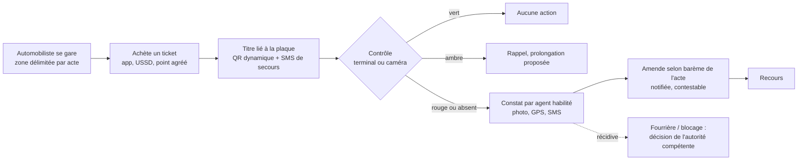

### H.27.6 Advertising — publicité extérieure (KIN PUB CONTROL)

| Rubrique | Contenu |
|---|---|
| Finalité | Connaître chaque support, savoir s'il est autorisé et qui l'exploite, suivre sa situation, sécuriser les recettes ; **le contrôleur est un collecteur de preuves, l'autorité décide, la technologie trace** |
| Modules | 15, 35, 77 |
| Flux | Recensement + plaque QR → autorisation + liquidation (surface, faces, zone) → contrôle (photo, GPS et horodatage automatiques, OCR des références, recherche de l'autorisation) → dossier de constat → superviseur → autorité compétente → notification à l'exploitant → paiement par canaux officiels |
| Titres | Autorisation annuelle ; plaque QR sur le support (sans plaque = présumé non enregistré) |
| Contrôles | Identité et accréditation du contrôleur vérifiées par le système ; **aucune sanction prononcée par l'application** ; contrôleur sans pouvoir de modifier ou supprimer un constat (AC-PUB-01) ; séparation constat / vérification / décision ; badge vérifiable par les exploitants ; le contrôleur ne collecte jamais d'argent |
| Indicateurs | Supports enregistrés et actifs ; taux de supports autorisés ; autorisations expirées ; contrôles ; dossiers validés ; supports régularisés ou retirés ; recettes par m² ; performance des équipes |
| Prérequis juridiques | Base légale de la taxe (J1) ; procédure de constat et d'accréditation des contrôleurs (J19, D22) |
| Release | SF : R2 → v3.0 : R2 |

| Élément | Exigence |
|---|---|
| Enregistrement d'un support | Identité de l'exploitant, référence de l'autorisation, localisation et GPS, dimensions, type de publicité, durée et échéance, photographies, situation des droits ; identifiant unique + plaque QR |
| Carte | Supports autorisés ; autorisations arrivant à expiration ; zones saturées ; zones à contrôler ; supports signalés ; interventions réalisées |
| Dossier de constat | Contrôleur, localisation, date, photos, référence, exploitant, nature présumée, observations |
| Notification après validation | Référence du dossier, support, nature du constat, preuves, démarches, délais, voies de contestation, modalités officielles de paiement |
| Contrôleurs | Formés, identifiés, accrédités, limités à l'application officielle, évalués, révocables ; **ne constituent pas une administration parallèle** (J19) |
| Évaluation des contrôleurs | Qualité des preuves, exactitude, absence de faux signalements, constats validés, respect des procédures, comportement — **jamais le nombre de sanctions** ; rémunération éventuelle selon § H.8.6 |
| Pilote en sept étapes | Sélection de communes ou d'axes à forte concentration (axes de la Gombe, G09) → recensement numérique → enregistrement des autorisations existantes → formation et accréditation → déploiement de l'application → évaluation → extension |
| Vision | Demande et renouvellement en ligne ; paiement des droits ; cartographie des espaces disponibles ; contrats publicitaires ; échéances ; statistiques par commune ; portail des entreprises publicitaires ; portail citoyen de signalement ; analyse d'images par IA pour **signaler** (jamais sanctionner) les supports non enregistrés |

### H.27.7 Telecom — antennes et infrastructures

| Rubrique | Contenu |
|---|---|
| Finalité | Inventaire contradictoire des sites et liquidation annuelle |
| Modules | 16, 56 |
| Flux | Import des listes des opérateurs et du régulateur → rapprochement sites déclarés ↔ observés ↔ payés → avis annuel automatique par site (après règle active) → suivi par la cellule grands redevables ; mutations de sites entre opérateurs |
| Titres | Autorisation annuelle ; plaque QR sur le site |
| Contrôles | Données des opérateurs **sous protocole** ; site observé absent des listes → vérification contradictoire, jamais taxation automatique |
| Indicateurs | Sites recensés vs déclarés ; recouvrement par opérateur |
| Prérequis juridiques | Base légale et barème (J1, J3) ; protocole avec opérateurs et ARPTC (J13) |
| Release | SF : R2 → v3.0 : R2 |

### H.27.8 Markets — marchés sans espèces

| Rubrique | Contenu |
|---|---|
| Finalité | Supprimer la collecte en espèces, première source de fuite, et protéger les vendeurs contre les prélèvements multiples (G11) |
| Modules | 20, 70, 71, 76 |
| Flux | Plan géoréférencé (marchés, étals, emprises) → titre d'étal jour / semaine / mois / abonnement → plaque QR d'étal + carte commerçant → paiement par monnaie mobile, USSD ou point agréé → contrôle par scan de la plaque d'étal, **sans téléphone requis pour le commerçant** → rapprochement occupations ↔ titres ↔ paiements |
| Titres | Droit d'étal (seuil ambre : fin de journée / 1 jour / 3 jours) |
| Contrôles | **Aucun encaissement par le placier** ; contrôles mystère ; pas de saisie a posteriori par un collecteur (« numérisation cosmétique ») |
| Indicateurs | Étals recensés ; taux d'occupation payée ; recettes par marché ; signalements de prélèvements irréguliers |
| Prérequis juridiques | Décision fixant la perception numérique exclusive ; compétences province / communes / gestionnaires (J22) ; titres dématérialisés (J21) |
| Release | SF : R2 → v3.0 : R2 (deux marchés de taille moyenne) |

### H.27.9 Public Domain — occupation du domaine public

| Rubrique | Contenu |
|---|---|
| Finalité | Titrer toutes les occupations (terrasses, étals hors marché, chantiers, événements) |
| Modules | 19, 20, 70 |
| Flux | Demande d'occupation → instruction → titre à durée (QR) → contrôle → renouvellement ou libération |
| Titres | Autorisation d'occupation ; permis d'occuper la voie (chantier : seuil ambre 3 jours) |
| Contrôles | Rattachement aux objets existants (parcelle, activité) ; aucune double facturation d'un même fait générateur |
| Indicateurs | Emprises recensées ; occupations titrées / observées ; recettes |
| Prérequis juridiques | Base légale et tarifs (J1, J3) ; titres dématérialisés (J21) |
| Release | SF : R2 → v3.0 : R2 (20), R3 (19) |

### H.27.10 Environment — assainissement, voirie, contribution environnementale

| Rubrique | Contenu |
|---|---|
| Finalité | Liquider les taxes d'assainissement et de voirie adossées aux objets existants ; préparer, sans l'activer, une éventuelle contribution sur les plastiques licites |
| Modules | 18, 19, 92 |
| Flux | Rattachement automatique aux parcelles et activités → liquidation groupée sur le même avis ; pour le plastique : registre des metteurs en marché → simulation d'impact (92) → activation **uniquement après acte** → déclarations et reversements |
| Titres | Avis unique ; permis d'occuper la voie |
| Contrôles | Module 18 **désactivé** tant que la règle n'est pas publiée (catégorie `ACTE_REQUIS`) ; pas de taxe sur des produits interdits (§ 8.5) |
| Indicateurs | Recettes par objet ; taux de paiement groupé ; assujettis identifiés ; simulations |
| Prérequis juridiques | J15, J16 ; voie REP recommandée (§ 8.5) |
| Release | SF : R2 (19), R4 (18) → v3.0 : R3 (19), R4 (18, après acte) |

### H.27.11 Ports — embarcations, accostage, embarquement

| Rubrique | Contenu |
|---|---|
| Finalité | Tracer les départs, les passagers et les mouvements d'embarcations |
| Modules | 13, 24, 70, 71 |
| Flux | Registre des embarcations (identifiant, QR, propriétaire, capacité) et des quais → titre d'embarquement à usage unique (par passager ou par départ) → paiement au départ par monnaie mobile ou point agréé, **jamais à l'agent de quai** → **manifestes** (passagers, volumes par départ) → rapprochement mouvements ↔ manifestes ↔ titres ↔ paiements |
| Titres | Titre d'embarquement ou d'accostage (usage unique ou journalier) ; code court SMS |
| Contrôles | Consommation au premier scan, « DÉJÀ UTILISÉ » ensuite ; aucun encaissement par l'agent de quai |
| Indicateurs | Départs tracés ; titres consommés ; écart manifestes / titres ; recettes portuaires |
| Prérequis juridiques | Cadrage sectoriel et base légale (J30) |
| Release | SF : R3 → v3.0 : R3 après J30 |

### H.27.12 AVIA — réconciliation fiscale aérienne (KIN-AVIA FISCUS)

| Rubrique | Contenu |
|---|---|
| Finalité | Faire en sorte que la Ville **calcule** ce qui lui est dû sur la taxe urbaine intégrée au billet passager (dont la taxe dite « Kimbuta ») et sur la taxe d'embarquement du fret, au lieu de dépendre des déclarations des compagnies |
| Modules | 52, 62, 78 |
| Flux | Voir diagramme ci-dessous |
| Titres | Identifiant fiscal aérien (IFA) intégré au QR de la carte d'embarquement |
| Contrôles | **Mesures contraignantes seulement après arrêté** (J23), décidées par l'autorité compétente ; écarts facturés **après procédure contradictoire** avec la compagnie ; aucune interférence avec Go-Pass ; aucun coût pour le voyageur ; données passagers pseudonymisées |
| Indicateurs | Passagers tracés ; écart de reversement ((dû calculé − reversé) / dû) ; délai de régularisation par compagnie |
| Prérequis juridiques | Base légale des taxes aériennes provinciales ; compétences Ville / RVA / DGM / aviation civile ; arrêtés (J23, D21) ; accès aux données BSP/GDS (accords) |
| Release | SF : R3–R4 → v3.0 : R4 |

**Constat chiffré du dossier source** [À VÉRIFIER — toutes les valeurs] :

| Donnée | Valeur source |
|---|---|
| Passagers au départ | ≈ 420 000 par an |
| Taxe moyenne | ≈ 5 USD par passager |
| Potentiel théorique (hors fret) | ≈ 2,1 M USD par an (420 000 × 5) |
| Recettes constatées historiquement | ≈ 0,4 à 0,5 M USD par an |
| Collecte 2017 – mi-2019 | 1,409 M USD, pour des projections d'environ 3 M USD par an |
| Fret aérien | ≈ 0 USD déclaré |
| Scénario prudent | 85 % du potentiel ≈ 1,8 M USD par an ; gain net ≈ + 1,3 M USD par an hors fret |

**Chaîne actuelle et ruptures** : les GDS calculent la taxe à partir de la base IATA (Ticket Tax Box Service) ; les agences vendent ; les fonds transitent par le Billing and Settlement Plan (BSP) de l'IATA et sont reversés aux compagnies, à qui il revient de reverser les taxes. Ruptures : aucun accès de la Ville au flux BSP ; aucun lien automatisé entre billets émis, passagers embarqués (RVA), sorties validées (DGM) et montants reversés ; reporting non consolidé des banques collectrices.

**Concept** : un **hub de réconciliation des recettes** (RRH) contrôlé par la Ville, qui ne remplace pas la chaîne IATA mais crée une couche locale de contrôle ; intégration par API avec les compagnies structurées (GDS, systèmes de contrôle des départs) ; **portail sécurisé pour les agences locales** (comptes certifiés, déclarations structurées).

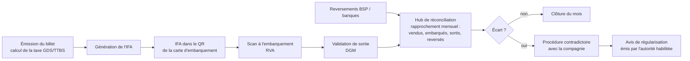

La règle proposée par le dossier source — « billet sans IFA = non validable au départ », avec pénalités électroniques, suspension d'accès au départ et retrait d'agrément — **n'est paramétrable qu'après adoption de l'arrêté** et en coordination avec la RVA, la DGM, l'autorité de l'aviation civile et les compagnies ; le système constate et calcule, il ne sanctionne pas (ARB-12). La répartition 65 % Ville / 35 % prestataire proposée par le dossier source n'est pas retenue (ARB-07).

### H.27.13 Events — spectacles et événements

| Rubrique | Contenu |
|---|---|
| Finalité | Conditionner toute autorisation d'événement à l'enregistrement et asseoir la taxe sur une billetterie déclarée ou contrôlée |
| Modules | 21, 70, 76 |
| Flux | Demande d'autorisation en ligne + pièces → déclaration de billetterie ou de jauge → certificat QR affiché sur le lieu → liquidation → rapprochement déclaration ↔ contrôle (billetterie RakaPay le cas échéant) |
| Titres | Autorisation par événement (seuil ambre : 2 jours) ; certificat QR |
| Contrôles | Autorisation refusée sans enregistrement préalable ; contrôle de jauge par échantillonnage |
| Indicateurs | Événements autorisés ; recettes par événement ; écart déclaré / contrôlé |
| Prérequis juridiques | Base légale et tarif (J1, J3) |
| Release | SF : R3 → v3.0 : R3 |

### H.27.14 Construction — carrières, droits de voirie, permis de bâtir

| Rubrique | Contenu |
|---|---|
| Finalité | Tracer les sorties de carrières, les droits de voirie des chantiers et conditionner les permis de bâtir au quitus |
| Modules | 19, 22, 82 |
| Flux | Géoréférencement des sites (superficie, exploitant, titre) → bons de sortie QR à usage unique par camion et chargement → comptage aux points de contrôle → liquidation sur superficie et volumes → droits de voirie des chantiers → quitus pour permis de bâtir |
| Titres | Bon de sortie (usage unique) ; permis d'occuper la voie ; quitus |
| Contrôles | Bon non réutilisable ; écart sorties comptées / déclarées suivi mensuellement ; conditionnalité du permis selon l'acte (J6) |
| Indicateurs | Sites actifs ; écart sorties / déclarations ; droits de chantier recouvrés |
| Prérequis juridiques | Base légale carrières (J1) ; arrêté et barème des droits de voirie (G17) ; quitus (J6) |
| Release | SF : R3 (22), R2 (19) → v3.0 : R3 ; module 82 en R1 |

### H.27.15 Assets — valorisation des actifs provinciaux

| Rubrique | Contenu |
|---|---|
| Finalité | Inventorier, évaluer et valoriser les actifs provinciaux sous-utilisés, sans bradage |
| Modules | 48, 61, 92 |
| Flux | Inventaire → évaluation → appel public ou délibération → contrat → suivi des revenus domaniaux |
| Titres | Contrat de location ou de concession |
| Contrôles | **Aucune attribution de gré à gré sans procédure** ; mise en concurrence ; publication |
| Indicateurs | Actifs inventoriés ; revenus domaniaux ; délais de procédure |
| Prérequis juridiques | Régime du domaine ; Loi PPP n° 18/016 (G21, G32) |
| Release | SF : R3–R4 → v3.0 : R3–R4 |

### H.27.16 Billetterie urbaine multi-opérateurs RakaPay — y compris le pass des moto-taxis (wewa)

| Rubrique | Contenu |
|---|---|
| Finalité | Couche de billetterie numérique pour tous les usages urbains soumis à un droit d'accès payant : transport urbain (bus, minibus, rail futur), stationnement public et privé, taxe journalière des transports (wewa, taxis, bus, minibus, cars) sous réserve de base légale, péages et zones régulées, marchés et vente informelle, accès à durée limitée |
| Modules | 12, 14, 20, 25, 66, 70, 71, 76, 81 |
| Flux | Opérateurs invités et accrédités (communes, exploitants, coopératives, opérateurs privés) → catalogue de tickets à prix approuvés et localisés → achat (application, USSD, coopérative, point agréé) + SMS de secours → contrôle QR, plaque ou gilet → analyse quotidienne, audit comportemental, blocage préventif motivé |
| Titres | Tickets à durée : accès ouverts **1, 7, 15 ou 30 jours** ; stationnement **1, 3, 6, 9, 12, 15, 18 ou 24 heures ; 7, 15 ou 30 jours** |
| Contrôles | Espèces **uniquement via un point agréé** ; agent exclusif à un opérateur, sans visibilité croisée ; aucun contrôle manuel hors système ; pénalité selon circuit RW1 (AC-TKT-02) ; séparation comptable ventes privées / recettes publiques |
| Indicateurs | Tickets vendus ; contrôles ; pénalités contestées ; ventes post-infraction ; écarts contrôles / ventes par agent |
| Prérequis juridiques | Titres dématérialisés (J21) ; vendeurs comme points agréés et taxe journalière (J25) ; accréditation des opérateurs (D25) |
| Release | SF : R1–R2 → v3.0 : R3 |

**Attributs d'un ticket** : opérateur, type de service, durée ou nombre d'usages, **localisation obligatoire**, période de validité, QR unique infalsifiable et traçable. L'opérateur définit le nom commercial, **propose** le prix et associe la localisation ; **pour une recette publique, le prix est celui de la règle approuvée du registre**.

| Rôle source | Équivalent MOSOLO | Peut | Ne peut pas |
|---|---|---|---|
| Superuser | Administrateur de la plateforme + Comité de pilotage | Paramétrage global, validation des opérateurs, supervision, audit, gouvernance des barèmes | Agir seul sur un rôle sensible (§ H.6.8) |
| Merchant Admin | Opérateur délégué / entité responsable (responsable de module) | Créer et proposer les tickets de son périmètre ; gérer **exclusivement** ses agents ; ajuster prix et commissions **dans les limites approuvées** ; voir ses ventes | Fixer un prix de recette publique hors règle |
| Agent | Agent terrain de l'opérateur | Contrôler et valider les QR ; constater ; vente **assistée** (référence, jamais d'espèces) | Voir les données d'un autre opérateur ; encaisser |
| Client | Contribuable ou usager | Acheter (application ou assisté) ; recevoir ticket + SMS de secours ; présenter le QR | — |

**Parcours** : (1) *usager* : se gare → achète (application, USSD, point agréé) → QR + SMS → contrôle QR ou plaque → validation ou constat ; (2) *agent d'opérateur* : connexion par compte invité (§ H.6.4) → tickets de son opérateur et de sa zone seulement → vente assistée → scan en ligne ou hors ligne → règles de validité appliquées automatiquement → affichage de sa commission contractuelle (vendeurs d'opérateurs privés uniquement) ; (3) *opérateur* : analyse quotidienne des ventes, contrôles et constats ; ajustement dans les limites ; (4) *supervision* : audit comportemental limité aux actes (ventes atypiques, annulations, écarts contrôles / ventes — § 24.2) ; blocage préventif d'un agent ou d'un opérateur **sous décision motivée** ; reporting.

**Exigences techniques** : QR unique ; validation en ligne et hors ligne ; multicanal ; multidevise (§ 11.6) ; multilingue (français, anglais, lingala, kiswahili, kikongo, tshiluba) ; cartographie obligatoire ; historique infalsifiable ; multi-opérateurs natif ; chiffrement de bout en bout ; haute disponibilité ; montée en charge urbaine ; interface très simple pour les agents ; Android et iOS ; administration web sécurisée. Le calendrier de 7 semaines et le plafond de 500 USD du produit minimal source sont remplacés par la feuille de route (§ 34) et l'hébergement souverain (§ 33) (ARB-46).

**Modèle économique ouvert** : des opérateurs privés (parkings privés, événements, espaces commerciaux, transporteurs privés) peuvent vendre leurs tickets ; **les ventes non publiques sont réglées directement à l'opérateur privé** ; les recettes publiques suivent exclusivement le circuit des comptes publics ; les **deux circuits sont séparés comptablement** et visibles. Une éventuelle redevance d'usage de la plateforme par les opérateurs privés est **une recette de la Province** fixée par acte et publiée, jamais une commission perçue par le prestataire technique (ARB-08) [ACTE REQUIS J25].

#### H.27.16.1 Pass professionnel des moto-taxis (wewa) — composante de RakaPay

Le pass wewa **fait partie intégrante de RakaPay** : c'est un ticket RakaPay à durée (jour, semaine, mois), premier cas d'usage de la billetterie, vendu, payé, contrôlé et rapproché par les mêmes fonctions que tous les autres tickets RakaPay (modules 76, 70, 71). Le module 81 n'est pas une verticale distincte : c'est l'extension de RakaPay qui porte le registre des motos, des conducteurs, des stations et des coopératives.

| Rubrique | Contenu |
|---|---|
| Finalité | Identifier chaque moto et chaque conducteur, offrir un pass légal et abordable, mettre fin aux prélèvements informels multiples sur la route, produire une recette traçable et une reconnaissance pour les wewa |
| Modules | 66, 67, 70, 71, 74, 76 (socle), 81, 11, 12 |
| Flux | Concertation → recensement par stations et coopératives (enregistrement **gratuit**) → remise des gilets et autocollants → **période de grâce** sans pénalité → paiements et contrôles dans les communes pilotes → extension |
| Titres | Pass jour, semaine, mois, abonnement renouvelable ; **un pass, un conducteur, une moto, non transférable** ; statuts vert / ambre (rappel SMS) / rouge |
| Contrôles | Aucun encaissement d'espèces sur la route par quiconque ; tarif fixé **par l'acte uniquement** (jamais par un agent ou un opérateur) ; **un wewa en vert ne peut être sanctionné et n'a rien à payer** ; aucune immobilisation algorithmique ; chaque contrôle journalisé (qui, où, quand, résultat) ; le passager peut scanner le gilet ; plaintes via la ligne de signalement |
| Indicateurs | Wewa enregistrés / estimés par station et commune ; conformité du pass ; paiement numérique (cible 100 %) ; plaintes pour prélèvements irréguliers |
| Prérequis juridiques | J28 : base légale (taxe journalière des transports, autorisation de transport ou équivalent), redevable, tarif, articulation avec vignette, autorisation et prélèvements communaux, statut des gilets et autocollants, rôle des coopératives, pouvoirs de contrôle (D26) |
| Release | SF : R1–R2 → v3.0 : R3 (recensement gratuit possible en R2 après concertation) |

| Registre | Contenu |
|---|---|
| Moto | Plaque, numéro d'ordre, marque, propriétaire, commune de rattachement ; le pass est lié à la plaque |
| Conducteur | Identité, photo, permis, contact, motos conduites ; carte conducteur QR |
| Propriétaire ou exploitant | Compte unique MOSOLO |
| Coopérative ou association | Accréditée comme opérateur de billetterie ; espace d'entité |
| Station ou parking wewa | Géoréférencé ; code de station |

**Propriétaire et conducteur sont des rôles distincts** ; l'obligation est portée par la personne désignée par l'acte ; le système sait qui conduit quelle moto.

| Aspect | Exigence |
|---|---|
| Supports | Autocollant QR sur la moto ; gilet numéroté QR ; carte conducteur ; pass sur téléphone ou USSD |
| Paiement | Par le conducteur (monnaie mobile, USSD) ; par la coopérative (paiement groupé, **activation individuelle** de chaque pass) ; chez un point agréé ; quittance SMS et mise à jour immédiate du statut |
| Contrôle | Scan du gilet, de l'autocollant ou de la plaque → statut, identité, autorisation, en ligne ou hors ligne ; pass expiré → constat, pénalité selon le barème de l'acte, contestable (RW1) |
| Coopératives | Invitées et accréditées ; inscrivent et suivent leurs membres, paient en groupe, voient la conformité, reçoivent les alertes ; **ne peuvent ni encaisser d'espèces hors point agréé, ni modifier un tarif, ni valider un contrôle** |
| Bénéfices pour les wewa | Reconnaissance ; fin des prélèvements multiples ; historique de paiement utilisable (assurance, épargne, crédit via des partenaires, sur consentement) ; sécurité |

**Illustration économique** [EXEMPLE — nombre de motos, tarif et conformité à établir par le recensement et l'acte ; [À VÉRIFIER]] : recette annuelle = motos actives × tarif journalier × jours d'activité × taux de conformité. Avec un pass de 500 FC par jour et 300 jours d'activité, **chaque tranche de 100 000 wewa en règle représente 15 milliards de FC par an (≈ 6,5 M USD)** ; pour l'estimation du promoteur de **plus d'un million de wewa** [À VÉRIFIER], cela représenterait 150 milliards de FC par an (≈ 65 M USD) à conformité totale et ≈ 33 M USD à 50 % de conformité. Conversion au cours d'environ 2 300 CDF/USD (cours BCC de 2 267,75 CDF le 22 septembre 2026 [À VÉRIFIER]). Le texte source, qui juxtaposait 6,5 M et 33 M USD de façon incohérente, est corrigé ici (ARB-30).

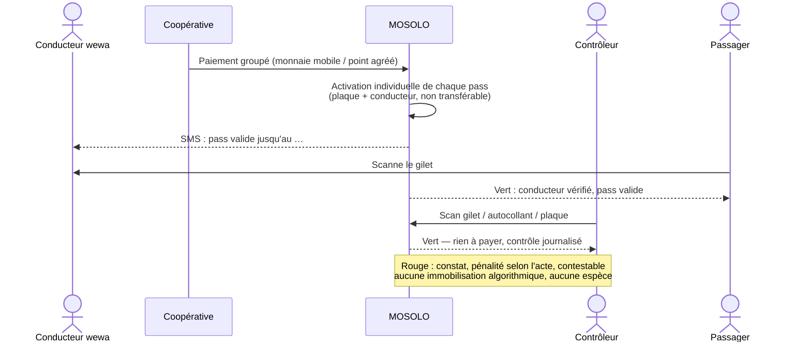

## H.28 Fiches des modules 1 à 81 (synthèse)

Synthèse normative de la Spécification fonctionnelle v1.2, réécrite selon la doctrine v3.0. Les principes communs (légalité, compte unique, zéro espèce, preuve, accès, séparation des pouvoirs, IA assistive, recours, inclusion, hors ligne, heure serveur, définition de « terminé ») s'appliquent à chaque module et ne sont pas répétés. Colonne **Release** : release de la Spécification → release v3.0 (qui prévaut). Les modules 82 à 95, nouveaux dans la v3.0, sont décrits au § 11.2.

| N° | Module | Finalité | Fonctions clés | Contrôles spécifiques | Indicateurs | Release |
|---|---|---|---|---|---|---|
| 1 | Identité et compte contribuable | Identité fiscale unique, socle de tout rattachement | Compte unique (espaces personnel et entreprise) ; clés NIF / téléphone + pièce / RCCM ; niveaux N0, N0-A, N1–N3 ; rôles multiples ; mandats datés et révocables ; récupération ; séparation profil contribuable / de travail | Pas de fusion sur le nom ; fusion réversible en double validation ; identité masquée selon le rôle ; consultation journalisée avec motif | Comptes actifs par niveau ; rattachement NIF ; doublons détectés/résolus ; délai de vérification | R1 → R1 |
| 2 | Enrôlement et vérification | Parcours court par profil, contrôle proportionné | Parcours par profil ; formulaires adaptatifs ; contrôle des pièces (OCR, cohérence) ; score de confiance ; anti-doublon probabiliste ; enrôlement assisté ; **enrôlement par lots** (import de l'existant) ; récapitulatif SMS/vocal/imprimé | Déclarer un rôle ≠ propriété ni dette ; gratuité ; horodatage, géolocalisation et terminal pour tout enrôlement assisté | Enrôlements par canal ; dossiers complets du premier coup ; délai ; rejets | R1 → R1 |
| 3 | Portail contribuable | Vue unique objets, obligations, paiements, titres, recours | « Mon espace MOSOLO » (vert/ambre/rouge) ; obligations expliquées ; déclarations pré-remplies ; paiement ; titres et quittances ; contestation ; échéancier si légal ; espace entreprise ; attestation de situation / quitus | Aucune donnée de tiers ; authentification forte pour les opérations sensibles ; session courte sur appareil partagé | Utilisateurs actifs ; paiement en ligne ; délai déclaration → paiement ; satisfaction | R1 → R1 |
| 4 | Application citoyenne Android | Accès mobile économe en données | Mode 2G avec reprise ; paiement tous opérateurs ; portefeuille de titres (QR régénéré toutes les 30 s) ; scanner de vérification ; notifications ; six langues, pictogrammes, audio | Aucune validité sur l'horloge du téléphone ; détection d'appareil modifié ; cache chiffré minimal ; verrouillage automatique | Installations actives ; transactions ; échecs de paiement ; note | R1 → R1 |
| 5 | Portail web public | Informer, simuler, vérifier sans compte | Guides, textes, calendrier fiscal, points de paiement ; simulateurs IF, IRL, vignette, patente sur règles publiées ; vérification quittances, titres, cartes, badges ; transparence ; inscription publique (contribuable uniquement) | Aucune donnée individuelle ; limites de débit ; anti-robots ; simulation sans conservation de données personnelles | Visites ; simulations ; vérifications ; conversion vers l'inscription | R1 → R1 |
| 6 | USSD et SMS | Service sur téléphone basique | Code court gratuit ; consultation par objet, plaque ou carte ; paiement sur référence ; quittance SMS ; rappels ; vérification par code | Aucune donnée sensible complète ; SMS < 160 caractères sans lien ; anti-hameçonnage ; limites de débit | Sessions ; paiements USSD ; délivrance SMS ; coût par message | R1 → R1 |
| 7 | Relations contribuable–objet | Lier personnes et objets par des rôles datés et prouvés | Rattachement (rôle, dates, pièces) ; détachement (vente, fin de bail, fermeture, mutation) ; revendication d'un objet provisoire ; historique ; conflits | Aucune relation sans preuve minimale ; objet de forte valeur réservé au N2 ; blocage de mutation sans quitus **si la règle l'exige** | Objets rattachés ; délai ; litiges ouverts | R1 → R1 |
| 8 | Cadastre fiscal géospatial | Localiser et décrire les objets | Hiérarchie commune → activité ; couches ; IGF (UUID + code lisible) ; cartes de chaleur ; cas difficiles ; historique des géométries ; détection d'objets superposés | Ne tranche pas les droits réels ; couches sensibles restreintes | Couverture géofiscale ; objets géolocalisés ; précision moyenne | R1 → R1 |
| 9 | Intelligence foncière et locative | Registre parcelle → unité → bail et détection d'anomalies | Déclaration de bail en deux minutes + attestation ; taux et retenue par rang ; anomalies (compteurs, indemnités, immeubles neufs, vacance) ; élargissement 2026 ; carte à deux couches ; pré-remplissage de campagne | Aucune dette sur un signal ; loyer et locataire visibles des seuls rôles habilités | Baux enregistrés ; couverture locative ; assiette IRL vérifiée ; conformité | R1 → R1 |
| 10 | Activités et patentes | Registre des établissements et patentes | Établissements, activités, dirigeants ; patente (QR de devanture) ; commerces de marché ; débits de boissons ; recoupements (codes marchands, livraisons, RCCM) ; renouvellement mobile | Activité ≠ assujettissement ; pas de visite sans mission | Établissements recensés ; patentes actives ; renouvellement ; non-enregistrés détectés | R1–R2 → R2 |
| 11 | Véhicules et circulation | Vignette et taxe de circulation par plaque | Référentiel (plaque, catégorie, usage, mutations) ; vignette autocollante QR ; taxe de circulation (même scan) ; import des immatriculations ; contrôle par plaque | Consultation journalisée ; aucune immobilisation algorithmique ; mutation bloquée seulement si règle | Couverture du parc ; paiement ; contrôles/jour ; mutations régularisées | R1–R2 → R2 |
| 12 | Autorisations de transport | Licences de transport à durée | Taxi, bus, minibus, moto-taxi, poids lourds ; corridors et zones ; carte conducteur ; taxe journalière via billetterie **si base légale** ; renouvellement mobile | Pas d'autorisation sans règle ; suspension par décision motivée uniquement | Autorisations actives ; conformité ; renouvellements à temps | R2 → R2 |
| 13 | Embarquement et débarquement | Titres de départ et manifestes | Points géoréférencés ; titres à usage unique ; paiement au départ (jamais à l'agent) ; manifestes | Aucun encaissement par l'agent de quai ; « DÉJÀ UTILISÉ » | Départs tracés ; titres consommés ; écart manifestes/titres | R3 → R3 |
| 14 | Stationnement public | Sessions et titres liés à la plaque | Zones et places, tarif par zone et heure ; sessions (démarrage, prolongation, fin) ; abonnements ; exemptions prévues par l'acte | Pénalité seulement selon barème, contestable | Occupation ; rotation ; recettes par place ; conformité | R1–R2 → R2 (après acte) |
| 15 | Publicité extérieure | Inventaire et autorisations des supports | Panneau, face, surface, emplacement ; autorisations ; plaque QR ; liquidation surface/face/zone ; alertes d'échéance | Aucune sanction sans décision de l'autorité | Panneaux recensés ; taux autorisés ; recettes par m² | R2 → R2 |
| 16 | Antennes et télécoms | Inventaire contradictoire des sites | Registre des sites ; import des listes opérateurs/régulateur ; avis annuel ; mutations de sites | Suivi par la cellule grands redevables ; données sous protocole | Sites recensés vs déclarés ; recouvrement par opérateur | R2 → R2 |
| 17 | Boissons, alcools et tabac | Fiabiliser les volumes déclarés | Déclarations mensuelles ; rapprochement accises, factures, livraisons ; carte des points de livraison ; listes de points de vente non autorisés | Accès restreint aux données commerciales | Volumes déclarés ; écarts ; recettes mensuelles | R2 → R2 |
| 18 | Plastique et environnement | Préparer, sans activer, une contribution | Registre des assujettis ; déclarations ; reversements ; données d'étude d'impact ; simulation | **Désactivé** sans règle publiée (`ACTE_REQUIS`) | Assujettis identifiés ; simulations | R4 → R4 (après acte) |
| 19 | Assainissement, voirie, drainage | Taxes adossées aux objets | Rattachement automatique ; liquidation groupée sur un avis ; droits de voirie (chantiers, permis) | Aucune double facturation d'un même fait générateur | Recettes par objet ; paiement groupé | R2 → R3 |
| 20 | Marchés et domaine public | Titres d'occupation sans espèces | Plan géoréférencé ; droits d'occupation jour/semaine/mois ; plaque QR d'étal ; occupations temporaires | **Aucun encaissement par le placier** ; paiement par point agréé | Étals recensés ; occupation payée ; recettes par marché | R2 → R2 |
| 21 | Spectacles et événements | Autorisation conditionnée à l'enregistrement | Demande en ligne ; déclaration de billetterie ou jauge ; certificat QR | Refus sans enregistrement | Événements autorisés ; recettes par événement | R3 → R3 |
| 22 | Carrières et recettes minières | Tracer les sorties | Registre des sites ; bons de sortie QR à usage unique ; comptage ; liquidation superficie/volumes | Bon non réutilisable | Sites actifs ; écart sorties/déclarations | R3 → R3 |
| 23 | Recettes forestières | Concessions et produits non ligneux | Concessions ; déclarations aux points de contrôle ; liquidation sur superficie | Accès limité aux services compétents | Concessions liquidées ; déclarations | R4 → R4 |
| 24 | Ports, embarcations, accostage | Mouvements et redevances portuaires | Registre des embarcations ; quais et ports privés ; mouvements ; redevances | Pilote après cadrage sectoriel (J30) | Embarcations ; mouvements ; recettes | R3 → R3 |
| 25 | Péage provincial | Titres liés à la plaque | Axes et points ; passage unique, carnet, abonnement ; reçus QR | Aucun encaissement non tracé | Passages ; recettes par axe ; fraude détectée | R3 → R4 |
| 26 | Moteur de règles | Registre juridique exécutable | Fiche complète ; cycle de vie ; versionnage ; **simulation sur échantillon** ; veille ; séparation des compétences | Pas de publication sans texte en vigueur ; quatre personnes distinctes ; refus des doublons ; rétroactivité bloquée ; code stable | Règles actives validées ; règles expirant ; délai d'approbation | R1 → R1 |
| 27 | Déclaration et liquidation | Obligations explicables | Déclarations adaptatives ; pré-remplissage ; calcul explicable ; avis ; recalcul contrôlé | Aucune logique fiscale dans l'interface ou l'IA ; montants décimaux | Obligations émises ; erreurs corrigées ; délai | R1 → R1 |
| 28 | Orchestration des paiements | Références et confirmations | Canaux multiples ; référence idempotente expirable ; neuf états ; rappels signés ; vérification S2S | Aucun compte privé ; bénéficiaire issu du coffre ; agrégateur agréé BCC (pas de prestataire nommé) | Succès ; délai de confirmation ; doublons évités | R1 → R1 |
| 29 | Règlement en trésorerie | Constater le crédit des comptes publics | Import des relevés ; imputation ; comptes d'attente | **Double validation des imports** ; intégrité des relevés | Délai de règlement ; fonds en attente | R1 → R1 |
| 30 | Rapprochement | Appariement à trois voies | Quatre files d'exception ; délais par file et escalade ; quittance définitive au rapprochement | Aucune correction silencieuse | Rapprochement auto ; écart J+2/J+3 ; délai de traitement | R1 → R1 |
| 31 | Quittances électroniques | Preuve de paiement vérifiable | Contenu § 19.1 ; statuts ; formes SMS, imprimée, PDF, vocale ; vérification scan, code, USSD, SVI | Numérotation exclusive ; divulgation minimale ; duplicata marqué | Délai paiement → quittance ; vérifications ; suspectes | R1 → R1 |
| 32 | Arriérés et créances | Balance âgée et priorisation | Balance par recette, commune, contribuable ; segmentation ; plans d'apurement si autorisés | Aucune pénalité hors règle | Encours ; recouvré brut/net | R2 → R2 |
| 33 | Campagnes de recouvrement | Relances graduées | Segments ; J−15, J−3, J+1, J+15, J+30 ; tests avant généralisation | Aucune contrainte en première étape ; arrêt si coût disproportionné | Régularisation ; coût par franc récupéré | R2 → R2 |
| 34 | Recensement terrain | Découvrir les objets | Missions ; objet provisoire (GPS, photo, catégorie) ; vagues 0–5 ; synchronisation | Aucun effet fiscal avant qualification | Objets découverts ; couverture ; rejets qualité | R1 → R1 (R0 pour le recensement) |
| 35 | Inspection et constat | Constats probants | Dossiers préparés ; constat numérique (photos, GPS, signature ou refus) ; procès-verbal selon pouvoirs | **Constat validé non modifiable** ; géorepérage | Constats ; validation ; contestations | R1–R2 → R1 |
| 36 | Dossiers d'exécution | Mesures légales tracées | Mise en demeure (double validation) ; suivi des mesures jusqu'à clôture | Aucune mesure automatique | Dossiers ouverts/clos ; délais | R2 → R3 |
| 37 | Réclamations et recours | Droits du contribuable | Contestation typée ; décompte visible ; décision motivée + voie suivante | **Décideur distinct du liquidateur** | Recours dans le délai ; erreurs confirmées | R2 → R1 |
| 38 | Gestion documentaire | Pièces scellées | Stockage chiffré (versions, empreintes) ; OCR ; classification ; conservation par catégorie | Exports filigranés et expirables ; purge sauf preuves d'audit | Volume ; intégrité vérifiée | R1 → R1 |
| 39 | Notifications et communication | Moteur événementiel multicanal | § 11.4 : 255 événements ; modèles versionnés ; préférences ; preuve de remise ; **réessai sur canal de secours** ; avis apposé sur la plaque | Messages minimaux ; avis légaux seulement si autorisés ; WhatsApp sur consentement | Délivrance ; délai ; ouverture | R1 → R1 |
| 40 | Renseignement anti-fraude | Détecter, instruire, prouver | Signaux ; dossiers d'enquête ; scores explicables ; signalements (69) ; suspension conservatoire d'un accès technique **sur décision motivée** | Clôture d'alerte par un responsable distinct de l'enquêteur | Alertes ouvertes/résolues ; délai ; déperdition évitée | R2–R3 → R2 |
| 41 | Postes de décision des autorités (ancien « Centre de commandement ») | Vision exécutive ; corbeille de décisions, seuils de remontée, délégations, note hebdomadaire (Cahier nouvelle version, ch. 27) | Échelle des 11 niveaux ; carte de chaleur ; alertes ; décisions tracées ; export signé | Aucune capacité d'édition financière | Écart assignation/rapproché ; couverture ; alertes critiques | R2 → R1 |
| 42 | Poste de travail — régie fiscale (ancien « Tableau de bord DGIPK (régie fiscale) ») | Pilotage de la régie des impôts | Assiette, liquidation, recouvrement, contentieux, performance ; affectation des zones ; validation des campagnes | Périmètre de compétence | Recouvrement ; délai de contentieux | R2 → R1 |
| 43 | Poste de travail — régie des taxes (ancien « Tableau de bord DGTK (régie des taxes) ») | Pilotage des droits, taxes, redevances | Recettes par taxe ; autorisations et échéances ; résultats des contrôles | Périmètre de compétence | Recettes par taxe ; renouvellements | R2 → R1 |
| 44 | Postes ministériels (ancien « Tableaux ministériels ») | Pilotage sectoriel ; décisions et exécution du ministère | Modules rattachés ; recettes du périmètre ; performance par module | Aucune donnée hors compétence ; **aucune « part de 10 % »** (ARB-05) | Recettes par module ; délais | R2 → R2 |
| 45 | Salle de contrôle financière | Surveillance de la trésorerie | Règlements, exceptions, incidents, changements de paramètres sensibles | Aucune correction silencieuse ; escalade hors délai | Exceptions ouvertes ; délai de clôture | R1–R2 → R1 |
| 46 | Audit et investigation | Preuve opposable | Lecture intégrale ; échantillonnage ; export scellé avec chaîne de possession ; vérification de la racine quotidienne | Aucune modification possible | Missions ; constats ; recommandations suivies | R1 → R1 |
| 47 | Prévision des recettes | Scénarios | Trois scénarios ; sensibilité ; prévision hebdomadaire de trésorerie par catégorie et commune | Hypothèses jointes ; ne fixe pas d'assignation | Écart prévision/réalisé | R3 → R2 |
| 48 | Recommandation d'investissement | Scénarios d'emploi des fonds | Capacité disponible ; scénarios ; fiches projet | L'IA propose, l'autorité décide | Scénarios produits/retenus | R3–R4 → R3 |
| 49 | Gestion des agents d'IA | Gouvernance des modèles | Registre ; évaluations ; coupe-circuit ; journal des décisions assistées | Interdits absolus ; validation avant service ; retour arrière | Dérive ; acceptation | R3 → R2 |
| 50 | Apprentissage et connaissance | Former et certifier | Micro-apprentissage ; certification et recertification ; base de procédures | **Bloque l'habilitation d'un agent non certifié** ; pas de surveillance intrusive | Agents certifiés ; réussite | R1 → R1 |
| 51 | Accès et délégations | Autorisation fine | RBAC + ABAC ; délégations ; JIT ; revues trimestrielles (mensuelles pour les privilégiés) ; conflits d'intérêts | Comptes partagés interdits | Accès revus ; privilèges excessifs | R1 → R1 |
| 52 | Intégration et API | Échanges contractualisés | REST + événements ; OAuth2/OIDC, mTLS ; quotas ; registre des interfaces | Protocole signé pour chaque échange ; rejet hors objet | Appels ; erreurs ; disponibilité partenaires | R1 → R1 |
| 53 | Administration de la plateforme | Exploitation technique | Environnements recette / pré-production / production ; déploiements ; retour arrière | Validation du comité des changements ; aucune lecture métier ni modification financière | Déploiements réussis ; incidents | R1 → R1 |
| 54 | Transparence publique | Redevabilité | Recettes agrégées par commune ; réalisations ; parts légales par catégorie de bénéficiaire | Test anti-ré-identification | Consultations ; publications à temps | R3 → R2 |
| 55 | Supervision et santé | Disponibilité | Observabilité ; alertes ; incidents ; astreinte | Logs sans secrets ni données inutiles | Disponibilité ; délai de rétablissement | R1 → R1 |
| 56 | Grands redevables | Fiabiliser les recettes concentrées | Portefeuille dédié ; conventions ; gestion de cas ; gestionnaire dédié | **Rotation des gestionnaires** ; décisions collégiales | Recettes ; délais de paiement | R2 → R2 |
| 57 | Registre des exonérations | Contrôler l'érosion | Demande avec pièces ; décision en double validation ; échéance et révision automatiques | Aucune exonération sans base légale ; alerte de concentration | Exonérations actives ; montants ; anomalies | R2 → R1 |
| 58 | Équipements terrain (MDM) | Terminaux maîtrisés | Enrôlement, politiques, effacement à distance ; attestation ; expiration des données | Détection d'appareil modifié ; révocation en masse | Terminaux actifs ; incidents ; révocations | R1 → R1 |
| 59 | Grand livre public | Partie double en ajout seul | Écritures équilibrées ; comptes d'attente ; contre-écritures ; clôtures | Écritures scellées et chaînées ; aucune modification destructive | Écart GL/relevés ; délai de clôture | R1 → R1 |
| 60 | Coffre des comptes bénéficiaires | Verrouiller les destinations | Registre des comptes bancaires **et de monnaie mobile** publics ; changement sous quorum, hors bande, 72 h, **date d'effet future** | Aucun administrateur ne peut substituer un compte | Changements demandés/approuvés/refusés | R1 → R1 |
| 61 | Découverte des recettes | Pipeline des opportunités | Signaux ; fiches ; pipeline en 8 étapes ; revenu net ajusté du risque ; listes de travail | Aucune opportunité ne devient taxe par algorithme | Opportunités instruites ; gain net des pilotes | R3 → R2 |
| 62 | Rapprochement aérien | Écarts mensuels par compagnie | Billets, embarquements, sorties, reversements | Sous validation juridique (J23) ; contradictoire | Écart de réconciliation | R3–R4 → R4 |
| 63 | Enrôlement assisté et guichets | Inclusion | Enrôlement à domicile hors ligne ; guichets communaux ; consentement ; avis à pictogrammes ; compte N0-A + carte | Lecture audio obligatoire ; aucun paiement reçu | Enrôlements assistés ; part par commune | R1 → R1 |
| 64 | SVI multilingue | Service vocal | Menus dans cinq langues + français ; consultation par carte ou objet ; paiement ; confirmation vocale | Numéro gratuit (J29) | Appels ; opérations à la voix | R1 → R2 |
| 65 | Carte MOSOLO | Identifiant physique | Carte QR signée ; blocage et réémission ; usages guichet, point agréé, agent | Réémission sous double validation ; révocation de l'ancien QR | Cartes actives ; réémissions | R1 → R2 |
| 66 | Points de paiement agréés | Seul canal d'espèces | Référencement ; encaissement sur référence ; preuve ; règlement dans le délai ; suspension décidée par le Trésor | Point non référencé ≠ preuve | Accessibilité ; délai de règlement ; points suspendus | R1 → R1 |
| 67 | Portail partenaires et équipes | Sous-traitance maîtrisée | Accréditation ; lots ; équipes ; qualité ; paiement sur livrables vérifiés | Aucune mission hors lot ; aucun encaissement ; aucune auto-validation | Qualité par sous-traitant ; production ; rejets | R1–R2 → R2 |
| 68 | Vérification par code court | Confiance du public | Codes avec chiffre de contrôle ; SMS, USSD, SVI, web ; réponse minimale | Limites de débit anti-énumération | Vérifications ; tentatives suspectes | R1 → R1 |
| 69 | Signalement et contrôles mystère | Détecter les abus | Numéro gratuit ; anonymat ; qualification ; contrôles mystère publiés | Identité du signalant protégée | Signalements ; délai ; part confirmée | R2 → R2 |
| 70 | Moteur de titres | Titres à durée | Modèles de validité ; six statuts ; supports ; visuels par module ; rappels ; prolongation | Validité sur l'heure serveur ; aucune pénalité automatique | Titres actifs ; renouvellements en ambre | R1–R2 → R2 |
| 71 | Contrôle des titres | Vérification terrain | Par plaque (tous titres actifs) ; hors ligne ; usage unique ; journal | Terminal enrôlé obligatoire ; reconfirmation à la synchronisation | Contrôles ; taux de rouge ; réutilisations | R1–R2 → R2 |
| 72 | Espaces d'entité et configuration | Multi-entités | Espaces cloisonnés ; fiches de configuration ; arbitrage ; accords de service | Aucune entité n'accède au périmètre d'une autre ; activation après recette et seconde validation | Modules activés ; arbitrages ; délais | R1–R3 → R1 |
| 73 | Répartition **légale** des recettes | Parts prévues par un texte | Clés légales versionnées ; calcul sur recettes rapprochées ; tableau calculé / rapproché / reversé | **Aucun flux vers un compte privé** ; somme = 100 % ; référence d'acte | Écart de répartition ; délai de reversement | R1 → R3 (requalifié, ARB-67) |
| 74 | Invitations et accès | Comptes de travail sur invitation | Cascade sans élévation ; lien à usage unique ; inscription assistée ; seconde validation ; révocation en cascade | L'opérateur d'accès ne connaît jamais les secrets | Invitations acceptées ; délais ; révocations | R1 → R1 |
| 75 | Stationnement intelligent ParkSmart | Stationnement rentable et fluide | Zones ; tarification réglementée dans les bornes de l'acte ; réservations ; capteurs et LPR progressifs ; score de conformité par plaque | Fourrière et blocage décidés par l'autorité | Occupation, rotation, recettes par mètre linéaire | R1–R3 → R2 (après acte) |
| 76 | Billetterie multi-opérateurs | Tickets à durée pour les usages urbains | Opérateurs ; tickets 1 h à 30 jours ; vente application/USSD/point agréé + SMS ; audit comportemental ; séparation comptable | Espèces via point agréé seulement ; agent exclusif à un opérateur ; pénalité selon RW1 | Tickets vendus ; contrôles ; pénalités contestées | R1–R2 → R3 |
| 77 | KIN PUB CONTROL | Contrôle publicitaire probant | OCR ; dossier de constat ; notification ; supervision ; recherche de l'autorisation | Contrôleur constate, superviseur vérifie, autorité décide | Supports régularisés ; constats validés | R2 → R2 |
| 78 | Hub de réconciliation aérienne | Données aériennes | Connecteurs BSP, GDS, DCS ; portail des agences ; IFA ; rapprochement | Mesures contraignantes seulement après arrêté | Passagers tracés ; écart de reversement | R3–R4 → R4 |
| 79 | Plaque fiscale immobilière | Identité visible du bien | Plaque NFIU + QR ; statut d'occupation ; situation (agent habilité) ; paiement sans smartphone ; rapports journaliers | Montants non modifiables par l'agent ; scan public minimal | Maisons immatriculées ; conformité IF/IRL | R1–R2 → R2 |
| 80 | CALCU | Contrôle de la dépense | Registre des comptes publics ; passerelle bancaire ; justificatifs ; score vert/ambre/rouge ; rapports numérotés | Ne bloque aucun paiement ; secret bancaire ; gel seulement par l'organe de contrôle selon la loi | Transactions vertes ; montants récupérés | R3–R4 → R4 |
| 81 | Pass moto-taxis wewa — extension de la billetterie RakaPay (module 76) | Identifier et libérer les wewa | Registre motos, conducteurs, stations ; pass non transférable ; gilet et autocollant QR ; paiement individuel ou groupé ; vérification passager ; espace coopérative ; période de grâce | Aucune espèce sur la route ; tarif fixé par l'acte ; wewa en vert = rien à payer ; aucune immobilisation algorithmique | Wewa enregistrés ; conformité ; paiement numérique ; plaintes | R1–R2 → R3 |

**Intégrations clés (rappel de la Spécification)** : registre NIF (DGI) et RCCM sous convention (1) ; import de l'existant (2) ; opérateurs télécoms (6, 64) ; cadastre foncier et imagerie sous licence (8) ; énergie, eau, employeurs sous protocole (9) ; immatriculations et assurances (11) ; brasseries (17) ; banques, opérateurs de monnaie mobile, agrégateur agréé (28, 29) ; IATA/BSP, GDS, DCS, RVA, DGM (78) ; banques pour CALCU (80).

## H.29 Tableau d'arbitrage des contradictions des sources

Les arbitrages ARB-01 à ARB-55 reprennent, dans l'ordre, les contradictions et points sensibles relevés dans les sources (partie « points sensibles » de l'extraction : A — financement ; B — sanctions ; C — espèces et paiement ; D — données et sous-traitance ; E — incohérences internes ; F — légalité). ARB-56 à ARB-77 consignent les changements propres à la v3.0. **La position v3.0 est opposable** ; toute remise en cause passe par le Comité de contrôle des changements et, pour les points juridiques, par le Comité juridique et tarifaire.

### H.29.1 Financement et rémunération privée (A)

| ID | Contradiction dans les sources | Position v3.0 | Justification |
|---|---|---|---|
| ARB-01 | Partage 10 % au prestataire pendant 30 ans (C § 37A) vs Note exécutive « aucun pourcentage sur les recettes publiques » vs C § 37 « contrat à la performance déconseillé » vs DG § 30 (plafond, durée fixe) | **Modèle 10/10/10/70 écarté** ; modèle hybride : forfaits + prime plafonnée sur la seule recette additionnelle nette vérifiée (RANV), durée fixe courte, payée sur crédit budgétaire (§ 37.2–37.3 ; décision n° 9) | Unité de caisse (LOFIP) ; risque de gestion de fait (Cour des comptes) ; perception de « fermage fiscal » ; position initiale de la Note exécutive ; exigence de la commande |
| ARB-02 | Assiette du 10 % = toute recette rapprochée, y compris celles perçues avant MOSOLO | Toute prime porte **uniquement sur la RANV** au-delà d'une base de référence certifiée par un auditeur indépendant | À recettes constantes, la Province perdrait 10 % ; § 38.2 fait de la RANV la mesure du succès |
| ARB-03 | C § 27 « aucune répartition discrétionnaire à un partenaire privé » vs § 37A | Principe du § 27 **renforcé** : l'administrateur de la plateforme ne reçoit jamais de part automatique (§ 27.1) | Cohérence interne ; P5 |
| ARB-04 | Répartition « à la source » par la banque de règlement (deux virements automatiques) | **Aucun prélèvement à la source** ; aucune instruction de virement automatique vers un compte non public (AC-ALL-02) | LOFIP (§ 6.8) ; P5 |
| ARB-05 | 10 % aux ministères de tutelle et 10 % aux agents et sous-traitants ; rattachement des modules déterminant la part | Incitations des agents **uniquement si un texte le prévoit**, par voie budgétaire, sur résultats vérifiés, plafonnées (§ 27.2, J10) ; **aucune part ministérielle** ; le rattachement ne détermine que les accès (§ H.6.5) | Universalité budgétaire ; risque de surtaxation et de concurrence entre ministères |
| ARB-06 | Application de la clé aux parts ETD et du pouvoir central non tranchée | Seules les **clés légales** de répartition sont paramétrées (module 73), après lecture certifiée de l'OL 18/004 (J1) | Aucune part non fondée sur un texte |
| ARB-07 | Clé AVIA 65/35 ; modèles propres ParkSmart et KIN PUB CONTROL | Écartés ; les verticales relèvent du contrat hybride unique ; aucune clé sectorielle | Mêmes motifs qu'ARB-01 |
| ARB-08 | Commission de service de la plateforme sur les ventes privées de billetterie vs « aucune autre part » | Toute redevance d'usage par les opérateurs privés est une **recette de la Province** fixée par acte et publiée ; le prestataire technique ne perçoit rien sur les flux | Transparence ; P5 ; J25 |
| ARB-09 | Moyens physiques exclus du financement du prestataire ; gratuité USSD/SVI supposant un payeur | Financement des moyens physiques arrêté **avant le pilote** (décision n° 10) ; conventions opérateurs pour la gratuité (J29) ; partition logiciel / physique conservée pour le chiffrage (§ H.18.1) | Sans ce financement, l'inclusion, la sous-traitance et le paiement assisté ne sont pas déployables |
| ARB-10 | Contrat de 30 ans à compter du pilote | Durée fixe courte (5 à 7 ans pour une éventuelle prime) ; réversibilité testée ; aucune dépendance de long terme | Durée de vie d'un système ; mandatures ; § 33 |
| ARB-11 | Prime « jamais sur le montant liquidé » mais réserve = 10 % des recettes | Sous-traitants payés **sur livrables vérifiés à prix unitaires** ; aucune réserve indexée sur les recettes (§ H.8.6) | Supprime le lien indirect au volume |

### H.29.2 Sanctions et mesures coercitives (B)

| ID | Contradiction | Position v3.0 | Justification |
|---|---|---|---|
| ARB-12 | « Aucune sanction par un algorithme » (C § 21) vs pénalités appliquées au contrôle (RakaPay), blocage et fourrière par score (ParkSmart), non-validation, suspension et facturation automatique (AVIA), gel (CALCU), suspension automatique d'un point de paiement, blocage préventif, suspension conservatoire (module 40) | **Circuit unique RW1** : constat humain → vérification → proposition → décision motivée → notification → recours. Mesures conservatoires techniques (suspension d'un accès, d'un point de paiement) : **proposées** par le système, **décidées** par un responsable habilité dans un délai court, journalisées. AVIA : procédure contradictoire avant tout avis. CALCU : gel seulement par l'organe de contrôle dans ses pouvoirs légaux | P8 ; § 21.1 ; § 23.1 |
| ARB-13 | « Aucune pénalité automatique à l'expiration » (§ 19A.7) vs pénalité en % du ticket dès le contrôle (§ 11D.3) | Au contrôle : constat + proposition d'achat immédiat (régularisation) ; pénalité émise par un agent habilité selon le barème de l'acte, contestable (AC-TKT-02) | Cohérence avec § 19A.7 et RW1 |
| ARB-14 | Surréservation du stationnement de 10 à 15 % | **Désactivée** jusqu'à validation juridique (protection du consommateur, J24) | Risque de contentieux |
| ARB-15 | Affectation des recettes de stationnement vs universalité budgétaire | Acte compatible requis ; à défaut, engagement de programmation publié | LOFIP ; J24 |
| ARB-16 | NFIU : interdiction de mettre en bail une maison non immatriculée | [ACTE REQUIS J27] ; **aucune restriction appliquée par le système avant l'acte** | Restriction du droit de propriété |
| ARB-17 | Quitus bloquant services, mutations et marchés publics | Quitus **informatif** tant que l'acte de conditionnalité n'est pas certifié (J6) ; recours en cours suspend l'effet bloquant | Effets lourds ; base légale |

### H.29.3 Espèces et circuit de paiement (C)

| ID | Contradiction | Position v3.0 | Justification |
|---|---|---|---|
| ARB-18 | « Zéro espèce » vs espèces chez les points agréés et vendeurs d'opérateurs délégués | Zéro espèce **entre les mains des agents** ; espèces seulement chez des établissements régulés, agréés, référencés, réglant chaque jour (J9, J20, J25) | Inclusion des non-bancarisés sans fuite |
| ARB-19 | Agrégateur et vérificateur de confirmations nommés dans les sources | Aucun prestataire nommé dans les spécifications ; agrégateur agréé BCC choisi après mise en concurrence ; « sans jamais détenir de fonds » garanti par contrat | Marchés publics ; indépendance (§ 33.2) |
| ARB-20 | Commission des points de paiement : qui la paie ? | Jamais prélevée sur le montant dû ; facturée séparément et payée sur crédit budgétaire, sauf convention approuvée visible au grand livre (§ 20.1) | Montant dû intégral ; transparence |
| ARB-21 | Valeur de la quittance « en attente » ; bascule à `SETTLED` (KIN-RECETTES) ou `RECONCILED` (Cahier) | Deux niveaux ; définitive à `RAPPROCHE` ; délai maximal de bascule paramétrable (J17) ; retour à `REGLE` possible sur décision motivée du Comité | § 18.6 ; valeur juridique à certifier (J7) |
| ARB-22 | « Une quittance prouve un paiement fait **et rapproché** » vs quittance émise dès la confirmation | Quittance provisoire = paiement confirmé ; définitive = rapproché ; un titre court peut être émis sur quittance provisoire et révoqué si contrepassement | Distinction explicite des états (§ H.11.1) |
| ARB-23 | « Pas de quittance sans paiement confirmé » vs « définitive à la confirmation S2S » | Modèle de données `Receipt.status` : `PROVISOIRE` / `DÉFINITIVE` (§ 29.3) | Levée de l'ambiguïté |

### H.29.4 Données personnelles, biométrie, sous-traitance (D)

| ID | Contradiction ou point sensible | Position v3.0 | Justification |
|---|---|---|---|
| ARB-24 | Empreinte digitale comme marque de consentement | Seulement si J18 certifié ; jamais identifiant de recherche ; voix ou témoin par défaut | Donnée biométrique ; Code du numérique |
| ARB-25 | Partage de données énergie, eau, télécoms, brasseries, employeurs | Protocole signé + analyse d'impact ; connecteurs désactivés sinon (J13) ; données en RDC (§ 33) | Minimisation ; légalité |
| ARB-26 | Délégation du recensement, de l'enrôlement et des constats à des sous-traitants privés ; contrôleurs publicitaires non publics | Les sous-traitants observent ; tout acte opposable est validé et signé par un agent public habilité (J19) | Prérogatives de puissance publique |
| ARB-27 | Données urbaines (stationnement) et produits de données | Agrégées, anonymisées, testées contre la ré-identification ; pas avant 2028 (G24) | Protection des données |
| ARB-28 | Audit comportemental des agents de billetterie vs « pas de surveillance permanente » | Limité aux actes (ventes, annulations, écarts) ; règles publiées (§ 24.2) | Surveillance légitime |
| ARB-29 | Drill-down du Gouverneur vs accès du Cabinet limité par finalité | Gouverneur : agrégats ; nominatif uniquement via enquête motivée instruite par l'audit (§ 12.3) | Confidentialité fiscale |

### H.29.5 Incohérences internes et chiffrées (E)

| ID | Incohérence | Position v3.0 | Justification |
|---|---|---|---|
| ARB-30 | Illustration wewa : « 100 000 wewa = 15 Md FC (≈ 6,5 M) … ≈ 33 M$ à 50 % » | Corrigée : 100 000 → ≈ 6,5 M USD ; 1 million → ≈ 65 M USD à conformité totale, ≈ 33 M USD à 50 % ; [EXEMPLE] [À VÉRIFIER] (§ H.27.16.1) | Arithmétique ; Annexe D du Cahier |
| ARB-31 | Deux taux de change (2 859,2 budget 2025 ; 2 267,75 BCC 22/09/2026) | Taux désigné par la règle certifiée (module 89) ; tout scénario indique son taux | § 11.6, § 38.3 |
| ARB-32 | 16 ou 17 verticales ; compositions divergentes | 17 verticales, composition réconciliée (§ H.5.3) | Exhaustivité |
| ARB-33 | 11 états vs « six états » vs liste de six niveaux | Échelle v3.0 à 11 niveaux, seule référence ; vues agrégées autorisées | § 26.1 |
| ARB-34 | Trois vocabulaires de statuts de quittance | Table de correspondance normative (§ H.10.10) | Cohérence API / affichage |
| ARB-35 | « Orange » (carte fiscale, CALCU) vs « ambre » (titres) | **Ambre** partout ; chaque couche garde sa légende | Accessibilité, cohérence |
| ARB-36 | Deux cycles de vie de règle ; quatre contrôles vs trois rôles | Machine à états unique (§ 6.12) ; contrôle fiscal = pièce obligatoire (§ H.3.1) | Simplicité, traçabilité |
| ARB-37 | « Quatre personnes distinctes » (initiateur, vérificateur, approbateur, auditeur) vs tables à trois rôles | Publication d'une règle : quatre personnes (rédacteur, vérificateur, validateur financier, autorité de publication) ; l'audit est un **contrôle a posteriori** non bloquant, jamais un rôle opérationnel (§ 12.5) | Indépendance de l'audit |
| ARB-38 | Pilote complet et campagne de février 2027 infaisables après 20 à 28 semaines de phases 0–2 | R0 recensement en déc. 2026 ; test partiel en février 2027 (plan de repli par export) ; R1 en avril 2027 ; pilote février–juillet 2027 | Réalisme (§ 34.1) |
| ARB-39 | Pilote de 180 jours (C) vs 90 jours (KIN-RECETTES) | 180 jours | Mesure sur un cycle complet de campagne |
| ARB-40 | Part électronique « dominante » vs > 90 % | > 80 % dans les flux couverts à 18 mois | Cible réaliste, mesurée sur base de référence |
| ARB-41 | Prime sur « quittance payée » vs « quittance définitive » | Uniquement quittance définitive, et seulement si un texte prévoit une incitation | § 27.2 |
| ARB-42 | Compte créé « avec téléphone et pièce » vs N0 = téléphone seul | N0 : téléphone ; N1 : pièce (§ 9.3) | Inscription progressive |
| ARB-43 | Deux conventions de routes (FR/EN) + KIN-RECETTES ; doublon d'inscription | Convention unique du § 30.2 ; alias transitoires (§ H.16.4) ; `POST /v1/registrations` seule route d'inscription | Phase 1 : décision prise |
| ARB-44 | Chiffres AVIA : potentiel 2,1 M vs projections 3 M ; 85 % = 1,785 | Tous [À VÉRIFIER] ; calcul cohérent présenté (§ H.27.12) | Sources secondaires |
| ARB-45 | Loi n° 18/014 « non confirmée » vs « ratifie l'OL 18/004 » | Non retrouvée ; ne pas citer avant J2 | Annexe A (A7) |
| ARB-46 | Produit minimal de billetterie en 7 semaines pour 500 USD | Remplacé par la feuille de route et l'hébergement souverain | Irréaliste |
| ARB-47 | La SF « prévaut en cas de divergence » vs le Cahier ; statut de la v3.0 | Le document maître v3.0 prévaut sur toutes les sources (Annexe D) | Hiérarchie documentaire |
| ARB-48 | « Agents agréés » (institutions financières) vs « agent d'enrôlement » | Vocabulaire : **point de paiement agréé** (financier) ; « agent » réservé au personnel de terrain, sans fonds | Lever toute ambiguïté sur les espèces |

### H.29.6 Légalité du référentiel (F)

| ID | Point | Position v3.0 | Justification |
|---|---|---|---|
| ARB-49 | Projet de référence fondé sur l'OL 13/001 abrogée | Instrument au statut `ABROGE` ; liste noire du moteur (AC-LEG-03) | § 6.3 |
| ARB-50 | IRL 22 % unique vs retenue 20 % / 15 % | **22 % (1er rang) et 17 % (autres rangs)** ; retenues 20 % et 15 % ; deux paramètres distincts [arrêté À VÉRIFIER] | Communiqué provincial de février 2026 (§ 6.4) |
| ARB-51 | Base légale de la taxe journalière des transports et du pass wewa | Règles `ACTE_REQUIS` (J25, J28) ; enregistrement gratuit possible | Double imposition, communes |
| ARB-52 | Impôt personnel minimum | `RECETTE_ETD` non activée | § 6.11 |
| ARB-53 | Contribution plastique | `ACTE_REQUIS` ; voie REP recommandée | § 8.5 ; J15, J16 |
| ARB-54 | Échéanciers par monnaie mobile | Module 83 désactivé jusqu'à J14 (décision D11) | Base légale requise |
| ARB-55 | Ports et AVIA | Après cadrage sectoriel et validation (J23, J30) ; R3/R4 | Coordination multi-acteurs |

### H.29.7 Arbitrages propres à la version 3.0

| ID | Point | Sources | Position v3.0 | Justification |
|---|---|---|---|---|
| ARB-56 | Budget, population, dépense par habitant | ≈ 1,2 Md USD ; 20 M hab. ; < 70 USD | ≈ 1,1 Md USD [À VÉRIFIER] ; 17 à 20 M ; 55 à 65 USD | Édit budgétaire 2026 (§ 2.1) |
| ARB-57 | Régies | DGRK, DGIPK, futures DGRFK et DGTK | DGIPK et DGTK remplaçant la DGRK ; administration paramétrable | Réforme 2026 (§ 2.2) |
| ARB-58 | Reprise de l'existant | e-DGRK repris dès le premier jour | Plateforme de déclaration de mars 2026 intégrée ou migrée ; import par lots | Fait nouveau (§ H.3.4) |
| ARB-59 | Format de l'identifiant géofiscal | `KIN-GOM-GOMBE-AV-MONT-001245` | `KIN-GOM-Q012-P004517-B01-U03` + UUID permanent | Hiérarchie jusqu'à l'unité (§ 17.3) |
| ARB-60 | Pile technique | Next.js, NestJS (Cahier) ; Java/.NET (autres documents) | TypeScript/Node.js (Fastify) + React ; PostgreSQL/PostGIS ; Kafka ; outbox conservée | Socle livré (§ 28.2) |
| ARB-61 | Valeurs non fonctionnelles | 99,9 % ; restauration trimestrielle ; marge ≥ 3× ; hors ligne 1 jour | 99,5 % pilote / 99,9 % ; restauration mensuelle ; 20× la moyenne ; 5 jours | § H.16.2 |
| ARB-62 | Composition de l'échelle de la recette | Comptabilisé = niveau 10 | Contesté = niveau 6 ; clôture comptable en attribut | Droits du contribuable (§ H.14.1) |
| ARB-63 | Invitations de niveau 0 | Administrateur de la plateforme | Exécutées par l'administrateur sur décision écrite du Comité de pilotage ; seconde validation | Réconciliation § 12.7 / § 12A |
| ARB-64 | Assistant WhatsApp renvoyant un lien de paiement | Lien de paiement | Aucun lien de paiement, aucun montant nominatif ; renvoi vers l'USSD officiel ou l'application | Anti-hameçonnage (§ 11.4.4) |
| ARB-65 | Bail déclaré par le locataire affiché chez le bailleur | Visible du bailleur | Bailleur invité à déclarer, sans révéler le déclarant avant vérification | Protection contre les représailles (§ 13.3) |
| ARB-66 | Releases des modules | Releases SF | Releases v3.0 (§ 11, § 43) ; historique au § H.28 | Calendrier réaliste |
| ARB-67 | Module 73 | Répartition 10/10/10/70, deux flux | Répartition **légale** des recettes | ARB-01 à ARB-06 |
| ARB-68 | Expiration des données de mission | « Date d'expiration automatique » | 72 heures par défaut, paramétrable | § 15.1 |
| ARB-69 | Échantillon de contrôle qualité | « Échantillon aléatoire » | ≥ 5 % aléatoire + 100 % des cas à risque | § 15.3 |
| ARB-70 | Calendrier de recouvrement | J−15, J−3, J+1, J+15, J+30 (constat) | Fusionné : rappels J−15 et J−3 ajoutés ; mise en demeure selon l'édit | § H.12.1 |
| ARB-71 | Comité de suivi de la répartition | Trimestriel, avec le prestataire | Comité de suivi du contrat et de la prime ; prestataire sans voix délibérative | Conflit d'intérêts |
| ARB-72 | Effectifs du pilote | Chiffres fermes | [EXEMPLE] indicatif, confirmé par le plan de charge | § H.17.4 |
| ARB-73 | Cibles des indicateurs à 18 mois | > 80 % couverture ; > 90 % électronique | ≥ 90 % couverture des quartiers pilotes ; > 80 % électronique | § H.2.4 |
| ARB-74 | Entités et routes de répartition (`RevenueShareKey`, `/v1/repartition/ordres`, réserve agents) | Prévues | Remplacées par `AllocationRule` et `/v1/legal-shares:calculate` ; aucune instruction de virement | § H.16.3–H.16.4 |
| ARB-75 | Noms des scénarios | Prudent, attendu, transformationnel | Conservateur, attendu, transformationnel (ambitieux) | § 38.3 |
| ARB-76 | Scan public de la plaque fiscale immobilière | « Statut minimal » incluant la situation (vert, orange, rouge, gris) | **Révisé par décision de la Ville : la source prévaut.** Authenticité, enregistrement, commune, quartier et couleur de situation avec légende générique ; ni nom, ni adresse précise, ni montant ; aucune mesure automatique | P14 (§ 16.8) |
| ARB-77 | Cinq piliers (DG) vs sept piliers (NE, C) | — | Sept piliers, tous couverts (§ H.2.1) | Exhaustivité |

## H.30 Matrice de traçabilité

### H.30.1 Cahier des exigences consolidé v2.9 → document maître v3.0

| Section source | Objet | Destination v3.0 | Complément Annexe H |
|---|---|---|---|
| En-tête, positionnement | Nom, devise, chaîne, statut | Couverture ; § 3.3 | — |
| Note de consolidation | Sources, arbitrages, historique v2.1–v2.9 | Annexe D | H.1, H.29 |
| Note exécutive intégrée | Constat, sept piliers, décisions | Ch. 1, 2 | H.2.1, H.26 |
| § 1 | Résumé exécutif, huit résultats, décisions institutionnelles | Ch. 1 | H.2.2, H.2.3 |
| § 2 | Argumentaire, équation de la recette | Ch. 2 | H.3.4 (taux de change) |
| § 3 | Vision, principes constitutionnels | Ch. 3 | — |
| § 4 | Énoncé du problème | Ch. 4 | — |
| § 5 | Objectifs | Ch. 5 | H.2.4 |
| § 6.1–6.3 | Textes, fiche de recette, séparation des compétences | § 6.2, 6.11, 6.12 | H.3.1 |
| § 6.4 | Points juridiques | § 6.13 | H.3.3 |
| § 7 | Paysage des recettes | Ch. 7 | H.3.4 |
| § 8 | Opportunités, découverte, recoupement, leviers | Ch. 8 | H.3.5 |
| § 9 | Compte unique, niveaux, profils | Ch. 9 | H.4.1 |
| § 10 | Sept domaines | § 10.1–10.2 | — |
| § 10A | Multi-entités | § 10.3 | H.4.2, H.4.3 |
| § 11 | Catalogue des 81 modules | § 11.1–11.2 | H.5.1, H.5.2, H.28 |
| § 11.1 | Verticales | § 11.3 | H.5.3, H.27 |
| § 11.2–11.3 | Moteurs de liquidation et de notification | § 6.12, § 11.4 | H.28 (26, 27, 39) |
| § 11A | ParkSmart | G15 (§ 8.3) | H.27.5 |
| § 11B | KIN PUB CONTROL | G09 (§ 8.2) | H.27.6 |
| § 11C | KIN-AVIA FISCUS | § 11.3 (AVIA) | H.27.12 |
| § 11D.1–11D.7 | Billetterie RakaPay | — | H.27.16 |
| § 11D.8 | Pass wewa (composante RakaPay) | § 11.3, § 13.8 | H.27.16.1 |
| § 12, § 12.1–12.3 | Rôles, contrôles, Constitution financière | § 12.1–12.6 | — |
| § 12.4–12.5 | Rôles assistés, impossibilités, accès privilégiés | § 12.5 | H.6.1, H.6.2 |
| § 12A | Invitations en cascade | § 12.7 | H.6.3 à H.6.9 |
| § 13 | Parcours contribuable | Ch. 13 | H.7.7 |
| § 13A | Enrôlement inclusif | § 13.6 | H.7.1 à H.7.6 |
| § 14 | Parcours gouvernementaux | Ch. 14 | — |
| § 15, § 15.1–15.4 | Agent de terrain, hors ligne | Ch. 15 ; § 28.6 | H.8.1 |
| § 15.5 | Écrans de contrôle | — | H.8.1 |
| § 15A | Sous-traitance terrain | § 15.3 (partiel) | H.8.2 à H.8.6 |
| § 16 | Foncier et locatif | Ch. 16 | H.9.4 |
| § 16.7 | Plaque NFIU | § 16.8 | H.9.1, H.27.1 |
| § 17 | Cadastre fiscal | Ch. 17 | H.9.2, H.9.3 |
| § 18 | Paiement et règlement | Ch. 18 | H.10.12 |
| § 18A | Paiement de bout en bout, preuve | § 18.2 (partiel) | H.10.1 à H.10.10 |
| § 19 | Quittance | Ch. 19 | H.10.10 |
| § 19A | Titres et laissez-passer | § 19.4 (partiel) | H.11 |
| § 20 | Rapprochement, grand livre | Ch. 20 | H.10.11 |
| § 21 | Recouvrement | Ch. 21 | H.12.1, H.12.2 |
| § 22 | Recours | Ch. 22 | H.12.3 |
| § 23 | Agents d'IA | Ch. 23 | H.13.1 |
| § 24 | Apprentissage | Ch. 24 | H.13.2 |
| § 25 | Fraude | Ch. 25 | H.13.3 |
| § 26 | Tableaux de bord | Ch. 26 | H.14 |
| § 27 | Affectation | Ch. 27 | H.15.1 |
| § 27A | CALCU | § 11.2 (module 80) | H.15.2 |
| § 28 | Architecture technique | Ch. 28 | H.16.1, H.16.2, H.16.5 |
| § 29 | Modèle de données | Ch. 29 | H.16.3 |
| § 30 | API | Ch. 30 | H.16.4 |
| § 31 | Sécurité | Ch. 31 | H.16.2 |
| § 32 | Gouvernance des données | Ch. 32 | — |
| § 33 | Hébergement | Ch. 33 | H.16.2 (réversibilité annuelle) |
| § 34 | Feuille de route | Ch. 34 | H.17.1 à H.17.3 |
| § 35 | Effectifs | Ch. 35 | H.17.4 |
| § 36 | Gouvernance | Ch. 36 | H.17.5 |
| § 37 | Passation | Ch. 37 | H.18.2 |
| § 37A | Financement et partage 10/10/10/70 | § 37.2 (arbitré) | H.18.1, H.29.1 |
| § 38 | Modèle financier | Ch. 38 | H.18.3 |
| § 39 | Indicateurs | Ch. 39 | H.19 |
| § 40 | Risques | Ch. 40 | H.20 |
| § 41 | Critères d'acceptation | Ch. 41 | H.21 |
| § 42 | Carnet de développement | Ch. 42 | H.22.1, H.22.2 |
| § 43 | Plan de livraison | Ch. 43 | H.22.3 |
| § 44 | Tests | Ch. 44 | H.23 |
| § 45 | Pilote | Ch. 45 | H.24 |
| § 46 | 100 premiers jours | Ch. 46 | H.25 |
| § 47 | Décisions | Ch. 47 ; conclusion | H.26 |
| Annexe A | Sources | Annexe A | — |
| Annexe B | 29 points à vérifier | § 6.13 (J1–J16) | H.3.2 (J17–J30) |
| Annexe C | Glossaire | Annexe C | — |
| Annexe D | Traçabilité | Annexe D | H.30 |

### H.30.2 Spécification fonctionnelle v1.2 → document maître v3.0

| Section source | Destination v3.0 | Complément Annexe H |
|---|---|---|
| En-tête (81 modules, 16 verticales) | Couverture ; Annexe D | ARB-47 |
| Partie I — principes communs | § 3.4 (P1 à P14) | H.28 (préambule) |
| Partie II — synthèse modules, domaines, releases | § 11.1–11.2 ; § 43 | H.5.2, H.28 (colonne Release) |
| Modules 1 à 7 (identité et contribuable) | Ch. 9, 13 ; § 11.1 | H.4.1, H.28 |
| Modules 8, 9 (territoire et immobilier) | Ch. 16, 17 | H.9, H.28 |
| Modules 10 à 25 (recettes sectorielles) | Ch. 7, 8 ; § 11.1 | H.27, H.28 |
| Modules 26, 27 (droit et liquidation) | Ch. 6 ; § 6.12 | H.3.1, H.28 |
| Modules 28 à 31 (paiement et preuve) | Ch. 18 à 20 | H.10, H.28 |
| Modules 32 à 37 (recouvrement, contrôle, recours) | Ch. 21, 22 | H.12, H.28 |
| Modules 38, 39 (documents, communication) | § 11.4 | H.28 |
| Module 40 (intégrité) | Ch. 25 | H.13.3, H.28 |
| Modules 41 à 48 (pilotage et décision) | Ch. 26, 27 | H.14, H.28 |
| Modules 49, 50 (IA, apprentissage) | Ch. 23, 24 | H.13, H.28 |
| Modules 51 à 55 (plateforme et accès) | Ch. 12, 28, 31 | H.6, H.28 |
| Modules 56, 57 (grands redevables, exonérations) | Ch. 8, 25 | H.27.3, H.28 |
| Module 58 (terrain) | Ch. 15 | H.8.1, H.28 |
| Modules 59, 60 (grand livre, coffre) | Ch. 20 ; § 12.6 | H.28 |
| Modules 61, 62 (découverte, aérien) | Ch. 8 | H.27.12, H.28 |
| Modules 63 à 69 (inclusion, paiement assisté, confiance) | § 13.6 ; § 18.2 | H.7, H.10, H.28 |
| Modules 70 à 74 (titres, entités, répartition, accès) | § 19.4 ; § 10.3 ; § 12.7 | H.4, H.6, H.11, H.28 |
| Modules 75 à 81 (verticales avancées) | § 11.3 | H.27, H.28 |
| Partie V — 17 verticales | § 11.3 | H.5.3, H.27 |

### H.30.3 Dossier Gouverneur v1.0 → document maître v3.0

| Point source | Destination v3.0 | Complément Annexe H |
|---|---|---|
| Sous-titre ; cinq piliers | Ch. 1, 3 | H.2.1 (ARB-77) |
| Décision immédiate : pilote 180 jours, base de référence auditée, généralisation sur preuve | Ch. 45, 47 | — |
| Socle KIN-RECETTES sous MOSOLO | Annexe D | H.5.1 |
| § 3 Registre juridique (redevable, date d'expiration, administration) | § 6.12 | — |
| § 6 Modèle immobilier (étage, usage) | § 16.1 | — |
| § 11 États de paiement (doublon, inversé) | § 18.4 | — |
| § 16 Gouverneur « sans capacité secrète » | § 12.4 | — |
| § 22 Centre de commandement ; tableaux des communes et superviseurs | Ch. 26 | H.14.1, H.14.3 |
| § 23 Seize verticales | § 11.3 | H.5.3 |
| § 25 Entités cœur | § 29.3 | H.16.3 |
| § 27 Sécurité (zéro confiance, HSM, SIEM, SBOM…) | Ch. 31, 33 | — |
| § 30 Passation (plafond, durée fixe, audit) | § 37.3 | ARB-01 |
| § 35 Feuille de route en « phases » = lots | Ch. 34 | H.17.2 |
| § 36 Critères d'acceptation | Ch. 41 | H.21 |
| § 37 Dix décisions | Ch. 47 | H.26 |
| Annexe A — matrice pilote (six domaines) | Ch. 45 | H.24.3 |
| Annexe B — spécification de l'API de référence de paiement (400, 403, 409, 422) | § 30.3 | — |
| Annexe C — récits Given/When/Then | § 42.2 | H.22.2 |

### H.30.4 Note exécutive au Gouverneur → document maître v3.0

| Élément | Destination v3.0 | Complément Annexe H |
|---|---|---|
| Constat : assiette invisible, TADAT, contrat de performance, IF + IRL à fin janvier 2026 | Ch. 1, § 2.2 | — |
| Alerte OL 13/001 → OL 18/004 | § 6.3 | ARB-49 |
| IRL 22 % vs retenue 20 % | § 6.4 | ARB-50 |
| Cinq apports (un compte, l'objet, aucune espèce, quitus, aucun pouvoir absolu) | Ch. 1, 3 ; § 12.6 | — |
| Ligne « Contrat : forfait et primes, aucun pourcentage sur les recettes publiques » | § 37 ; décision n° 9 | ARB-01 |
| Calendrier : recensement locatif avant février ; chaque mois perdu = un an de retard | § 2.3 ; ch. 34 ; conclusion | H.17.1 |

## H.31 Tenue de l'annexe

1. **Toute nouvelle version d'un document source** est soumise à la même méthode (§ H.1.1) ; les éléments nouveaux sont classés C, I ou A et la matrice H.30 est mise à jour.
2. **Tout élément intégré ici qui est ensuite repris dans un chapitre** est conservé dans l'Annexe H, complété d'un renvoi vers le chapitre qui le reprend (règle d'ajout du 27/09/2026 : rien n'est retiré).
3. **Chaque arbitrage** peut être rouvert par le Comité de contrôle des changements (et, pour le droit, par le Comité juridique et tarifaire) ; la décision est consignée avec sa date et sa motivation.
4. **Les points J17 à J30** sont ajoutés au suivi du relevé juridique certifié (décision n° 3) et à la liste des validations juridiques critiques de la conclusion stratégique.
5. **Les critères AC-* du § H.21** sont intégrés à la suite de tests automatisés au plus tard à la release de leur module ; ceux des modules R1 conditionnent la porte G2.

## H.31 Règle d'ajout et positions du promoteur réintégrées (27/09/2026)

**Décision du maître d'ouvrage.** Les spécifications nouvelles s'ajoutent à l'existant : rien n'est supprimé, retiré ni omis ; tout ajout est construit par-dessus l'existant, fusionné, combiné et harmonisé. Les contradictions sont signalées pour arbitrage, et l'existant reste en place jusqu'à décision. La relecture du Cahier des exigences v2.9 transmise le même jour (note de consolidation, tableau d'harmonisation, historique des versions 2.1 à 2.9, note exécutive, sept piliers, résumé exécutif, huit résultats attendus, décisions demandées) confirme que ces textes sont ceux déjà intégrés (§ H.1, matrice H.30). Les positions que la version 3.0 avait écartées sont **réintégrées comme positions du promoteur**, à côté de l'analyse v3.0, et portées dans la plateforme sous forme **gouvernée et non active** tant que l'acte juridique n'est pas certifié (statut du Cahier : « aucune règle, aucun taux et aucune projection ne peuvent être mis en production avant certification »).

| Position du Cahier v2.9 | Lecture v3.0 (conservée) | Harmonisation retenue |
|---|---|---|
| Clé 10/10/10/70 sur 30 ans (§ 37A) ; financement intégral du système d'exploitation numérique par Groupe Nseya, hors moyens physiques | Déconseillée ; modèle hybride plafonné (§ 37.2, § 37.3) | Paramètre « acte requis » : simulation sur recettes rapprochées ; activation par acte enregistré et double validation ; décaissements proposés en opérations du Trésor à quatre yeux ; commission des agents (10 %) rattachée à la tranche « agents et sous-traitants » |
| IRL = 22 % des loyers encaissés, dont 20 % de retenue de premier rang | Pas de taux unique codé | Versions de règle au statut « à vérifier », jamais actives ; la lecture certifiée de l'OL 18/004 et de l'arrêté des taux prévaut (J3) |
| Pénalités et blocages automatiques (AVIA, ParkSmart) | Le système constate et calcule, l'autorité décide (RW1) | Identique à l'arbitrage du Cahier lui-même : aucune divergence |
| Pilote complet dès février 2027 | Recensement R0 en déc. 2026, test en février, R1 en avril 2027 | Les deux calendriers sont présentés ; la campagne de février 2027 reste le premier test réel (décision demandée n° 4) |
| Prestataires techniques nommés | Mise en concurrence | Prestataires nommés conservés comme propositions du promoteur, soumises aux règles des marchés publics |
| Pile technique imposée (Java/.NET ou Next.js/NestJS) | Pile ouverte (Annexe E) | Pile construite conservée ; la pile du Cahier reste une option documentée |
| Chiffres de contexte : budget ≈ 1,2 milliard $, moins de 70 $ par habitant | ≈ 1,1 milliard $ [À VÉRIFIER], 55 à 65 $ par habitant | Les deux estimations sont citées ; seul l'édit budgétaire promulgué fait foi |

