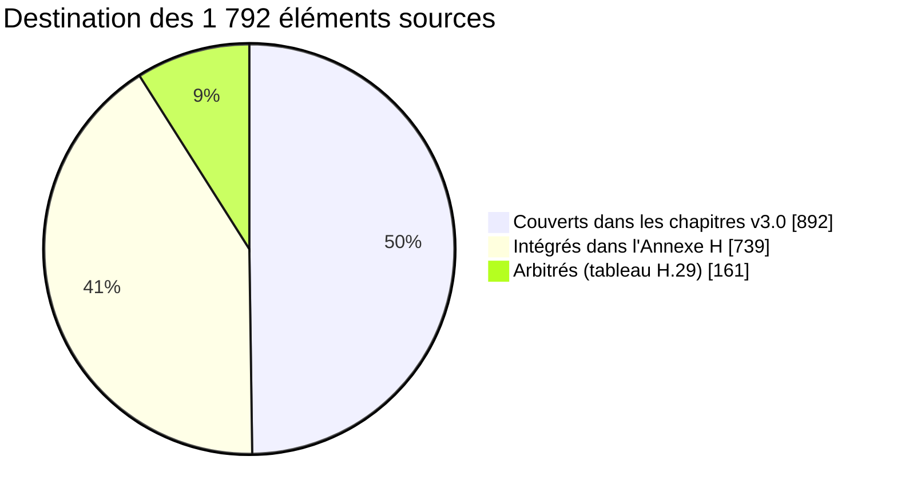

# Annexe H — Intégration exhaustive des exigences des documents sources {.unnumbered}

Cette annexe garantit qu'aucune exigence des quatre documents sources du programme n'est perdue dans le passage au document maître v3.0. Elle reprend, élément par élément, ce que les chapitres 1 à 47 ne couvraient pas ou ne couvraient que superficiellement, et consigne dans un tableau d'arbitrage chaque point sur lequel la version 3.0 a délibérément changé de position.

| Rubrique | Contenu |
|---|---|
| Documents sources | **C** — Cahier des exigences consolidé v2.9 (24 septembre 2026) ; **SF** — Spécification fonctionnelle des 81 modules et 16 verticales v1.2 ; **DG** — Dossier Gouverneur et spécification directrice v1.0 ; **NE** — Note exécutive au Gouverneur (24 septembre 2026) |
| Rang normatif | **Chapitres 1 à 47 du document maître > Annexe H > documents sources.** L'Annexe H complète les chapitres ; elle ne les modifie pas. Un élément de l'Annexe H qui contredirait un chapitre est réputé non écrit et doit être signalé au Bureau du programme |
| Portée | Les éléments intégrés ici sont des **exigences opposables aux équipes de réalisation**, soumises aux mêmes marqueurs de statut, aux mêmes principes constitutionnels (P1 à P14, § 3.4) et à la même Constitution financière (§ 12.6) que le reste du document |
| Ce que l'annexe ne fait pas | Elle ne réintroduit **aucune** position écartée par la version 3.0 : partage automatique 10/10/10/70 des recettes pendant 30 ans ; IRL à taux unique de 22 % ; sanctions, pénalités ou immobilisations déclenchées par un algorithme ; calendrier de pilote complet dès février 2027 ; prestataires techniques nommés (agrégateurs, vérificateurs) prescrits sans mise en concurrence ; pile Java/.NET ou Next.js/NestJS imposée. Ces points figurent au tableau d'arbitrage (§ H.29) |

**Marqueurs.** Les conventions de lecture du document s'appliquent sans exception : **[CONFIRMÉ]**, **[À VÉRIFIER]**, **[ACTE REQUIS]**, **[EXEMPLE]**. Tout chiffre repris des sources et non vérifié sur une source publique ou un texte officiel porte **[À VÉRIFIER]** ; toute valeur illustrative porte **[EXEMPLE]** et reste interdite en production (tests d'acceptation du chapitre 41).

## H.1 Méthode et statistiques de couverture

### H.1.1 Méthode

| Étape | Travail réalisé | Produit |
|---|---|---|
| 1. Extraction | Lecture intégrale des quatre sources ; découpage en **éléments élémentaires d'exigence** (une règle, une donnée, un contrôle, un chiffre, un critère par ligne) | 1 792 éléments sources (+ 55 contradictions identifiées + 112 lignes de consolidation technique servant au contrôle croisé) |
| 2. Rapprochement | Recherche de chaque élément dans les chapitres 1 à 47 et les annexes A à G de la version 3.0 | Statut par élément |
| 3. Classement | **C** — couvert dans un chapitre (substance reprise, éventuellement reformulée) ; **I** — absent ou superficiel, **intégré dans la présente annexe** ; **A** — en conflit avec une position de la v3.0, **arbitré** (§ H.29) | Tableau H.1.3 |
| 4. Mise en conformité doctrinale | Réécriture de chaque élément intégré selon la doctrine v3.0 : l'agent constate, l'autorité décide ; zéro espèce entre les mains des agents ; aucune activation sans certification juridique ; chiffres sources marqués | Sections H.2 à H.28 |
| 5. Traçabilité | Rattachement de chaque section source à sa destination (chapitre v3.0 ou section H) | Matrice § H.30 |

### H.1.2 Statistiques globales

| Source | Éléments | Couverts dans les chapitres (C) | Intégrés dans l'Annexe H (I) | Arbitrés (A) |
|---|---|---|---|---|
| Cahier des exigences v2.9 (C) | 1 334 | 677 | 529 | 128 |
| Spécification fonctionnelle v1.2 (SF) | 435 | 198 | 209 | 28 |
| Dossier Gouverneur (DG) et Note exécutive (NE) | 23 | 17 | 1 | 5 |
| **Total** | **1 792** | **892 (49,8 %)** | **739 (41,2 %)** | **161 (9,0 %)** |

Après intégration, **100 % des éléments sources ont une destination** : 1 631 éléments (91,0 %) sont couverts par les chapitres ou par la présente annexe, et 161 éléments (9,0 %) font l'objet d'une position explicite motivée. Les 55 contradictions internes relevées dans les sources sont toutes traitées au § H.29 (ARB-01 à ARB-55), complétées par 22 arbitrages propres à la v3.0 (ARB-56 à ARB-77).

### H.1.3 Couverture par section du Cahier v2.9

Les sections à fort taux « I » sont celles que la v3.0 avait renvoyées au Cahier comme « référence détaillée » (Annexe D.1) : verticales, titres, paiement assisté, sous-traitance, invitations, multi-entités, CALCU.

| Section C | Élém. | C | I | A | Section C | Élém. | C | I | A |
|---|---|---|---|---|---|---|---|---|---|
| En-tête | 9 | 9 | 0 | 0 | § 19 | 5 | 5 | 0 | 0 |
| Note de consolidation | 27 | 12 | 9 | 6 | § 19A | 51 | 4 | 46 | 1 |
| Note exécutive intégrée | 28 | 19 | 4 | 5 | § 20 | 13 | 9 | 4 | 0 |
| § 1 | 17 | 14 | 2 | 1 | § 21 | 11 | 8 | 2 | 1 |
| § 2 | 7 | 6 | 1 | 0 | § 22 | 3 | 3 | 0 | 0 |
| § 3 | 13 | 13 | 0 | 0 | § 23 | 22 | 20 | 2 | 0 |
| § 4 | 8 | 8 | 0 | 0 | § 24 | 8 | 6 | 2 | 0 |
| § 5 | 10 | 8 | 0 | 2 | § 25 | 5 | 4 | 1 | 0 |
| § 6 | 32 | 24 | 4 | 4 | § 26 | 19 | 14 | 3 | 2 |
| § 7 | 23 | 20 | 1 | 2 | § 27 | 12 | 8 | 1 | 3 |
| § 8 | 31 | 29 | 2 | 0 | § 27A | 19 | 1 | 17 | 1 |
| § 9 | 24 | 21 | 2 | 1 | § 28 | 26 | 18 | 4 | 4 |
| § 10 | 8 | 8 | 0 | 0 | § 29 | 43 | 25 | 16 | 2 |
| § 10A | 24 | 10 | 14 | 0 | § 30 | 79 | 20 | 57 | 2 |
| § 11 | 30 | 22 | 6 | 2 | § 31 | 14 | 13 | 1 | 0 |
| § 11A | 28 | 3 | 23 | 2 | § 32 | 8 | 8 | 0 | 0 |
| § 11B | 15 | 3 | 12 | 0 | § 33 | 7 | 6 | 0 | 1 |
| § 11C | 13 | 2 | 8 | 3 | § 34 | 22 | 8 | 8 | 6 |
| § 11D | 33 | 3 | 25 | 5 | § 35 | 9 | 2 | 7 | 0 |
| § 12 | 58 | 42 | 14 | 2 | § 36 | 15 | 9 | 5 | 1 |
| § 12A | 43 | 6 | 35 | 2 | § 37 | 7 | 4 | 1 | 2 |
| § 13 | 8 | 6 | 1 | 1 | § 37A | 38 | 2 | 6 | 30 |
| § 13A | 27 | 8 | 18 | 1 | § 38 | 14 | 9 | 3 | 2 |
| § 14 | 8 | 8 | 0 | 0 | § 39 | 17 | 6 | 10 | 1 |
| § 15 | 17 | 11 | 5 | 1 | § 40 | 17 | 9 | 6 | 2 |
| § 15A | 27 | 5 | 20 | 2 | § 41 | 48 | 14 | 30 | 4 |
| § 16 | 33 | 25 | 6 | 2 | § 42 | 20 | 4 | 14 | 2 |
| § 17 | 18 | 13 | 3 | 2 | § 43 | 8 | 1 | 6 | 1 |
| § 18 | 35 | 27 | 5 | 3 | § 44 | 15 | 9 | 6 | 0 |
| § 18A | 37 | 8 | 28 | 1 | § 45 | 13 | 6 | 5 | 2 |
| Annexe A | 2 | 2 | 0 | 0 | § 46 | 8 | 5 | 3 | 0 |
| Annexe B (29 points) | 29 | 14 | 10 | 5 | § 47 | 12 | 6 | 4 | 2 |
| Annexe C | 1 | 1 | 0 | 0 | Annexe D | 3 | 1 | 1 | 1 |

### H.1.4 Couverture de la Spécification fonctionnelle et du Dossier Gouverneur

| Bloc | Élém. | C | I | A | Commentaire |
|---|---|---|---|---|---|
| SF — en-tête | 3 | 2 | 0 | 1 | « La SF prévaut sur… » : la v3.0 prévaut sur la SF (arbitrage ARB-47) |
| SF — Partie I, principes communs | 12 | 12 | 0 | 0 | Repris par les principes P1 à P14 (§ 3.4) |
| SF — Partie II, synthèse des releases | 17 | 6 | 0 | 11 | Releases réalignées sur le calendrier v3.0 (ARB-66) ; historique conservé au § H.28 |
| SF — modules 1 à 58 | 284 | 150 | 130 | 4 | Fonctions, contrôles, données, intégrations et indicateurs détaillés au § H.28 |
| SF — modules 59 à 81 | 100 | 25 | 65 | 10 | Idem ; module 73 requalifié (ARB-67) |
| SF — Partie V, verticales | 19 | 3 | 14 | 2 | § H.27 (17 verticales) |
| DG | 19 | 15 | 1 | 3 | Cinq piliers, seize verticales, feuille de route en « phases » = lots |
| NE | 4 | 2 | 0 | 2 | La ligne « Contrat : forfait et primes, aucun pourcentage » **fonde** la position v3.0 (§ 37) |

### H.1.5 Règles de réécriture appliquées aux éléments intégrés

| # | Règle | Effet sur le contenu repris des sources |
|---|---|---|
| RW1 | **L'agent constate, l'autorité décide** | Toute formulation source du type « pénalité appliquée », « blocage », « fourrière priorisée », « suspension automatique », « facturation automatique », « gel » est réécrite selon le circuit ci-dessous |
| RW2 | **Zéro espèce entre les mains des agents** | Les espèces ne sont reçues que par un point de paiement agréé et régulé (§ 18.2), avec règlement quotidien ; jamais par un agent public, un sous-traitant, un contrôleur, un placier, un vendeur non référencé |
| RW3 | **Aucune activation sans certification** | Chaque verticale et chaque tarif repris est une règle au statut `A_VERIFIER` ou `ACTE_REQUIS` jusqu'à certification (§ 6.12) |
| RW4 | **Chiffres marqués** | Les estimations des dossiers sectoriels (wewa, AVIA, stationnement, exemples financiers) portent [À VÉRIFIER] ou [EXEMPLE] |
| RW5 | **Calendrier v3.0** | Les releases citées sont celles de la v3.0 (R0 déc. 2026, R1 avril 2027, R2 oct. 2027, R3 mars 2028, R4 déc. 2028 — § 43) ; la release source est donnée pour mémoire |
| RW6 | **Aucun partage automatique de recettes** | Toute mention de la clé 10/10/10/70, de la « réserve de 10 % », des « deux flux de décaissement » ou de la « part de 10 % du ministère de tutelle » est remplacée par : clés **légales** de répartition (module 73), rémunération contractuelle des prestataires et sous-traitants **sur crédit budgétaire**, incitations des agents **uniquement si un texte les prévoit** (§ 27.2) |

*Circuit unique de toute mesure défavorable (RW1), applicable à toutes les verticales de la présente annexe.*

## H.2 Chapitres 1 à 5 — Compléments « Décider »

### H.2.1 Les sept piliers de la note exécutive

La Note exécutive intégrée au Cahier présentait sept piliers ; le Dossier Gouverneur n'en retenait que cinq (sans « Verrouiller » ni « Encadrer l'IA »). La v3.0 les couvre tous, sous forme de principes et de chapitres :

| # | Pilier | Contenu source | Destination v3.0 |
|---|---|---|---|
| 1 | RECENSER — un compte MOSOLO | Un compte principal par personne ou organisation, relié aux rôles, biens, activités, véhicules, locations, autorisations et obligations | Ch. 9 ; P3 |
| 2 | LOCALISER — un SIG fiscal unique | Commune → quartier → avenue → parcelle → bâtiment → unité → activité ; identifiant géographique fiscal | Ch. 17 |
| 3 | CALCULER LÉGALEMENT | Moteur juridique ; aucune règle non versionnée, validée, approuvée, datée, auditable ; taux non confirmés jamais codés en dur | Ch. 6 ; P1, P2 |
| 4 | SÉCURISER LE FRANC PUBLIC | Référence unique → paiement → confirmation → règlement → rapprochement → comptabilisation → quittance vérifiable | Ch. 18 à 20 ; P5 |
| 5 | DÉCIDER AVEC LA PREUVE | Centre de commandement distinguant potentiel, assiette vérifiée, liquidé, exigible, impayé, payé, réglé, rapproché, comptabilisé | Ch. 26 ; § H.14 |
| 6 | VERROUILLER | Constitution financière : personne, y compris l'administrateur technique ou une autorité, ne détient seul les clés | § 12.6 ; P6, P7 |
| 7 | ENCADRER L'IA | L'IA détecte, explique, priorise, recommande ; elle ne crée ni taxe, ni dette finale, ni sanction, ni transfert | Ch. 23 ; P10 |

### H.2.2 Les huit résultats attendus (Cahier § 1)

| Résultat | Indicateur de résultat | Leviers | Destination v3.0 |
|---|---|---|---|
| Couverture | Registre géofiscal continu dans les communes pilotes | Recensement hors ligne, auto-enrôlement, recoupement partenaires | O1 ; ch. 17 |
| Assiette | Élargissement légal **sans nouvelle taxe** | Détection d'objets non enregistrés, régularisation volontaire, requalification contrôlée | Ch. 8 ; G01, G02 |
| Encaissement | Paiement électronique majoritaire | Monnaie mobile, banques, cartes, USSD, QR, points agréés | O4 ; ch. 18 |
| Traçabilité | Obligation → paiement → règlement → quittance → comptabilisation | Registre en ajout seul, signature, rapprochement quotidien | Ch. 20, 25 |
| Intégrité | Aucun acte financier sensible par une seule personne | Séparation, double validation, accès privilégié temporaire, journal immuable | § 12.6 |
| Service | Réduction du coût et du temps de conformité | Compte unique, déclaration pré-remplie, paiement mobile, quittance instantanée | Ch. 13 |
| Pilotage | Vision temps réel potentiel / constaté / encaissé / rapproché | Tableau du Gouverneur, cartes de chaleur, files d'exception | Ch. 26 |
| Affectation | Lien recettes ↔ réalisations | Recommandation d'affectation, tableau de transparence | Ch. 27 |

### H.2.3 Les trois décisions institutionnelles qui conditionnent la conception

| Décision ou fait | Conséquence de conception reprise | Statut |
|---|---|---|
| Quitus fiscal provincial 2026 (IF, IRL, véhicules le cas échéant ; condition des marchés publics et de certaines autorisations) | Module 82 ; conditionnalité par règle versionnée ; recours suspensif de l'effet bloquant | [À VÉRIFIER] acte instituant (J6) |
| Réforme des régies (projets DGRFK/DGTK examinés en mai 2026 ; arrêtés DGIPK/DGTK de 2026) | **L'administration compétente est une donnée de configuration**, jamais codée en dur | ARB-57 ; § 2.2 |
| Évaluation TADAT de septembre 2025 | Registre, télépaiement, contrôle interne, audit interne, prévision : chacun a son module et son indicateur | [CONFIRMÉ] pour le fait ; scores [À VÉRIFIER] |

### H.2.4 Objectifs stratégiques : cibles sources et cibles v3.0

| Objectif | Cible source (C § 5, § 39) | Cible v3.0 (ch. 5, 39) | Position |
|---|---|---|---|
| Couverture du recensement | > 80 % (pilotes, 18 mois) | ≥ 90 % des quartiers pilotes à J+180 | v3.0 (plus exigeante, périmètre plus restreint) |
| Part électronique | « Dominante » 18 mois après le pilote ; > 90 % à 18 mois | > 80 % dans les flux couverts 18 mois après le pilote | v3.0 (ARB-40) |
| Paiement → quittance | < 1 minute (médiane < 60 s) | < 60 s pour la quittance provisoire | Identique |
| Paiement → rapprochement | < 24 heures | < 24 heures ouvrées ; ≥ 95 % automatique à J+1 | v3.0 |
| Écart de rapprochement | < 1 % à J+2 | < 1 % à J+3 (O7) | v3.0 ; l'indicateur J+2 est conservé en suivi (§ H.19) |
| Régularisation après notification | > 50 % | — | **Intégré** comme indicateur de suivi (§ H.19) |
| Recours dans le délai légal | > 90 % | Délai légal | Identique en substance |
| Baux enregistrés | Croissance continue publiée mensuellement | — | **Intégré** (§ H.19) |

## H.3 Chapitres 6 à 8 — Compléments « Le droit et l'argent »

### H.3.1 Cycle de vie des règles : les quatre contrôles

Le Cahier exigeait quatre contrôles avant l'entrée en vigueur d'une règle — **juridique, fiscal, financier, publication par une autorité distincte** — et décrivait deux cycles de vie concurrents (ARB-36). La v3.0 retient la machine à états unique du § 6.12 et quatre personnes distinctes. Le **contrôle fiscal** est intégré ainsi :

| Contrôle source | Traitement v3.0 | Pièce exigée |
|---|---|---|
| Juridique | État `REVUE_JURIDIQUE`, visa du juriste vérificateur (R14) | Pièce officielle hachée ; cas de tests juridiques |
| **Fiscal** | Pièce obligatoire jointe au dossier de `REVUE_JURIDIQUE`, produite par le service d'assiette de la régie administrante | **Rapport de simulation sur échantillon réel** (module 26 : « simulation sur échantillon avant publication ») : nombre de redevables touchés, montants, écarts avec l'exercice précédent, cas limites |
| Financier | État `REVUE_FINANCIERE`, visa du validateur financier (R15) | Compte bénéficiaire (alias du coffre), cohérence budgétaire |
| Publication | État `PUBLIEE` par l'autorité de publication (R16), distincte des trois précédents | Acte de publication |

Exigences complémentaires reprises : **code de recette stable et non réutilisable** (déjà porté par `RevenueType.code`, § 29.3) ; conservation de la version appliquée à chaque liquidation ; une règle expirée ne produit aucune nouvelle obligation (AC-LEG-05, § H.21) ; anciennes références et anciens taux enregistrés au statut `A_VERIFIER`, donc **désactivés dans le moteur** tant qu'ils ne sont pas validés pour l'exercice.

### H.3.2 Les 29 points de vérification du Cahier (Annexe B) et leur rattachement

Les points J1 à J16 du § 6.13 couvrent une partie des 29 points de l'Annexe B du Cahier. Les autres sont intégrés ci-dessous sous les numéros **J17 à J30**, avec le même formalisme (autorité, hypothèse intérimaire sûre, verrou technique).

| Point Annexe B (C) | Objet | Rattachement v3.0 |
|---|---|---|
| 1 | Texte consolidé de la nomenclature et des OL de 1969 | J1 |
| 2 | Objet et statut de la Loi n° 18/014 | J2 |
| 3 | Arrêtés des taux IF, IRL, véhicules de l'exercice | J3 |
| 4 | Texte intégral de l'édit budgétaire | J3 |
| 5 | Code du numérique : résidence, signature, protection | J7, J8 ; § 33 |
| 6 | Habilitation des agrégateurs et prestataires (BCC) | J9 |
| 7 | Textes DGRFK/DGTK et compétences | J5 |
| 8 | Régime des primes des agents | J10 |
| 9 | Valeur de la quittance « en attente de règlement » et délai maximal de bascule | J7 + **J17** |
| 10 | Base légale des verticales ports/fluvial et AVIA | **J30** et J23 |
| 11 | Rémunération du prestataire indexée sur les recettes additionnelles nettes | J11 (modèle hybride, § 37.3) |
| 12 | Valeur du consentement par empreinte, voix ou témoin ; régime de capture de l'empreinte | **J18** |
| 13 | Délégation à des sous-traitants privés (recensement, enrôlement, constats) | **J19** |
| 14 | Encaissement pour compte de la Ville par agents de monnaie mobile et guichets bancaires ; commission | J9 + **J20** |
| 15 | Obligations de protection des données des sous-traitants | J8 + **J19** |
| 16 | Valeur juridique des titres dématérialisés ; acte par module | **J21** |
| 17 | Compétences province / communes / opérateurs pour les services partagés ; arbitrage opposable | **J22** |
| 18 | Acte instituant la clé 10/10/10/70 ; compatibilité LOFIP | J11 — **sans objet** (modèle écarté, ARB-01) |
| 19 | Application de la clé aux parts ETD et du pouvoir central | J1 — seules les clés **légales** sont paramétrées (module 73) |
| 20 | Contrat de 30 ans rémunéré par une part des recettes | J11 — **sans objet** (ARB-10) |
| 21 | Convention tripartite ; traitement fiscal des sommes versées | J11 — sans objet pour la convention ; traitement fiscal des primes éventuelles des agents : J10 |
| 22 | Financement des moyens physiques ; frais USSD, SVI, SMS | Décision n° 10 (ch. 47) + **J29** |
| 23 | Mesures AVIA (non-validation, pénalités, suspension, retrait d'agrément) ; compétences Ville/RVA/DGM/aviation civile | **J23** |
| 24 | Clé spécifique AVIA | J11 — sans objet (ARB-07) |
| 25 | Affectation des recettes de stationnement ; zones payantes ; surréservation ; fourrière | **J24** |
| 26 | Vendeur d'opérateur délégué comme point agréé ; base légale de la taxe journalière des transports | **J25** |
| 27 | Texte CALCU (déclaration obligatoire des comptes, transmission bancaire, preuve, responsabilité, secret bancaire) | **J26** |
| 28 | Acte NFIU (immatriculation obligatoire, interdiction de mise en bail d'un bien non immatriculé) | **J27** |
| 29 | Pass wewa : base légale, redevable, tarif, articulation, supports, coopératives, pouvoirs de contrôle | **J28** |

| # | Question | Autorité responsable | Hypothèse intérimaire sûre | Verrou technique |
|---|---|---|---|---|
| J17 | Délai maximal entre quittance provisoire et quittance définitive ; effet d'un règlement non constaté | Services juridiques ; Trésor | Délai de conception : J+2 ouvrés, puis exception « règlement manquant » ; le contribuable de bonne foi n'est jamais privé de ses droits (§ 18.6) | Paramètre `receipt_finalization_max_delay` certifié ; tant qu'il ne l'est pas, la quittance provisoire porte la mention « en attente de règlement » sans date d'échéance |
| J18 | Valeur du consentement par empreinte, enregistrement vocal ou témoin ; régime de la donnée biométrique | Services juridiques ; autorité (intérimaire) de protection des données | Consentement par enregistrement vocal ou témoin identifié ; empreinte seulement comme **marque** de consentement, jamais comme identifiant de recherche | Capture d'empreinte désactivée tant que J18 n'est pas certifié ; image chiffrée liée au seul acte de consentement, jamais indexée ni comparée |
| J19 | Délégation de missions de recensement, d'enrôlement et de constat à des sous-traitants privés ; obligations de protection des données | Services juridiques ; Fonction publique ; régies | Les sous-traitants **observent et documentent** (statut probant OBSERVÉ) ; tout procès-verbal, notification légale ou constat opposable est validé et signé par un agent public habilité | Rôle « agent sous-traitant » sans permission de signature d'acte ; convention de sous-traitance de données obligatoire avant activation du lot |
| J20 | Encaissement pour compte de la Ville par des agents de monnaie mobile et des guichets bancaires ; régime de la commission | Finances ; BCC ; Trésor | Seuls des établissements régulés, sous convention, encaissent ; la commission n'est jamais déduite du montant dû (§ 20.1) | Point de paiement non activable sans convention signée et agrément vérifié |
| J21 | Valeur juridique des titres dématérialisés (ticket, vignette, droit d'étal, pass) ; acte par module | Services juridiques ; entité responsable du module | Titre dématérialisé doublé d'une preuve imprimable ou SMS vérifiable | Type de titre non activable sans référence d'acte dans la fiche de configuration du module |
| J22 | Compétences province / communes / opérateurs délégués pour les services partagés ; opposabilité de l'arbitrage | Services juridiques ; Comité juridique et tarifaire | Une seule revendication par fait générateur ; la seconde est bloquée et arbitrée (§ 10.3) | Blocage automatique de la seconde obligation ; aucune exposition au citoyen |
| J23 | Mesures AVIA ; compétences respectives de la Ville, de la RVA, de la DGM et de l'aviation civile | Gouvernement provincial ; autorités aéroportuaires et migratoires | Rapprochement **informatif** ; aucune mesure contraignante | Mesures non paramétrables sans arrêté certifié |
| J24 | Zonage et tarifs du stationnement ; surréservation ; fourrière ; affectation des recettes | Ministère provincial des Transports ; Finances ; juridique | Stationnement payant uniquement dans les zones délimitées par acte ; surréservation désactivée ; affectation = engagement de programmation publié | Règles `ACTE_REQUIS` ; option de surréservation non activable |
| J25 | Vendeurs d'opérateurs délégués comme points agréés ; base légale de la taxe journalière des transports | Finances ; BCC ; Transports | Vente en espèces uniquement par points agréés régulés ; taxe journalière non liquidée avant certification | Canal « vendeur délégué » désactivé sans agrément ; règle `ACTE_REQUIS` |
| J26 | Texte CALCU : déclaration obligatoire des comptes publics, transmission bancaire, valeur de la preuve numérique, responsabilité des gestionnaires, secret bancaire | Gouvernement provincial ; ministère national des Finances ; BCC | Déclaration volontaire des entités pilotes ; aucune transmission bancaire sans convention | Connecteurs bancaires CALCU désactivés sans texte et convention |
| J27 | Acte NFIU : immatriculation fiscale obligatoire, reconnaissance du QR, interdiction de mise en bail d'un bien non immatriculé | Assemblée provinciale ou Gouvernement provincial | Plaque posée à titre d'identification administrative, sans effet restrictif | Aucune restriction de location appliquée par le système |
| J28 | Pass wewa : base légale, redevable, tarif, articulation avec vignette, autorisation de transport et prélèvements communaux, statut des gilets et autocollants, rôle des coopératives, pouvoirs de contrôle | Ministère provincial des Transports ; Finances ; communes | Enregistrement gratuit des motos et conducteurs (recensement) ; aucun pass payant ni contrôle avant acte | Règle du pass `ACTE_REQUIS` ; période de grâce paramétrable |
| J29 | Financement des moyens physiques ; prise en charge des frais d'USSD, de SVI et de SMS « gratuits pour l'appelant » | Gouvernement provincial ; opérateurs ; partenaires | Conventions avec les opérateurs (numéros verts, codes courts) financées sur le budget du programme | Canal gratuit non annoncé au public tant que la convention n'est pas signée |
| J30 | Base légale et cadrage sectoriel des verticales ports et fluvial | Transports ; autorités portuaires ; régies | Recensement des embarcations et quais sans liquidation | Modules 13 et 24 non activables avant certification |

### H.3.3 Les sept points juridiques du Cahier (§ 6.4)

| Point | Autorité | Risque si non tranché | v3.0 |
|---|---|---|---|
| Statut consolidé des textes après l'OL 18/004 | Service juridique | Texte abrogé appliqué | J1 |
| Taux IRL et retenue par rang | Ministère provincial des Finances | Contentieux de masse | J3 ; § 6.4 |
| Valeur de la quittance électronique et de la signature | Services juridiques ; Code du numérique | Preuve contestée | J7, J17 |
| Base légale des échéanciers par monnaie mobile | Assemblée provinciale ou arrêté | Pas de paiement fractionné | J14 ; module 83 |
| Partage des données énergie, eau, opérateurs | Autorité de protection des données | Blocage du recoupement | J13 |
| Régime des incitations de performance des agents | LOFIP, édit, arrêté | Rémunération irrégulière | J10 |
| Habilitation des agrégateurs de paiement | BCC | Canal illégal | J9 |

### H.3.4 Reprise de l'existant et inventaire de référence

| Exigence source | Traitement v3.0 |
|---|---|
| « MOSOLO reprend les comptes et l'historique d'e-DGRK dès le premier jour ; aucun système parallèle » (C § 7.5) | Remplacé par l'intégration ou la migration de la **plateforme de déclaration lancée en mars 2026** (§ 2.2, phase 1) ; l'exigence de fond est conservée : **import par lots** des comptes et de l'historique (module 2, « enrôlement par lots »), avec rapprochement anti-doublon et statut probant « importé — source régie » ; un seul système de référence par recette (R15) |
| Inventaire de référence : mode de perception, canal, compte, volumétrie, coût, déperdition, données disponibles, dépendances | Couvert (§ 7.5), complété par l'attribut **« dépendances »** (règles ou services conditionnant la recette, par exemple quitus ou vignette) |
| Taux budgétaire moyen 2025 de **2 859,2 CDF/USD** ; cours BCC de **2 267,75 CDF/USD le 22 septembre 2026** | [À VÉRIFIER] ; seul le taux désigné par la règle certifiée s'applique (module 89) ; tout scénario libellé en USD indique son taux (§ 38.3) |

### H.3.5 Moteur de recoupement : compléments

Chaque règle de recoupement produit une **liste de travail priorisée**, jamais un avis d'imposition (§ 8.4). Deux signaux sources sont ajoutés au tableau du § 8.4 :

| Signal | Règle | Sortie (jamais une dette) |
|---|---|---|
| Immeuble multi-unités déclaré vacant, baux expirés, loyers atypiques, doublons | Incohérence répétée | Examen humain, puis mission autorisée |
| Entreprise demandant une autorisation provinciale | Pas de quitus valide | Service suspendu jusqu'à régularisation **seulement si l'acte de conditionnalité le prévoit** (J6) ; sinon simple information |

